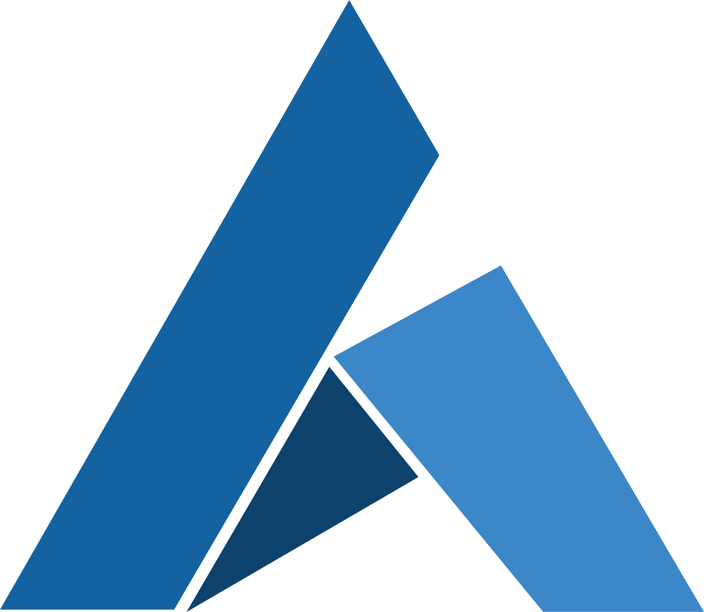
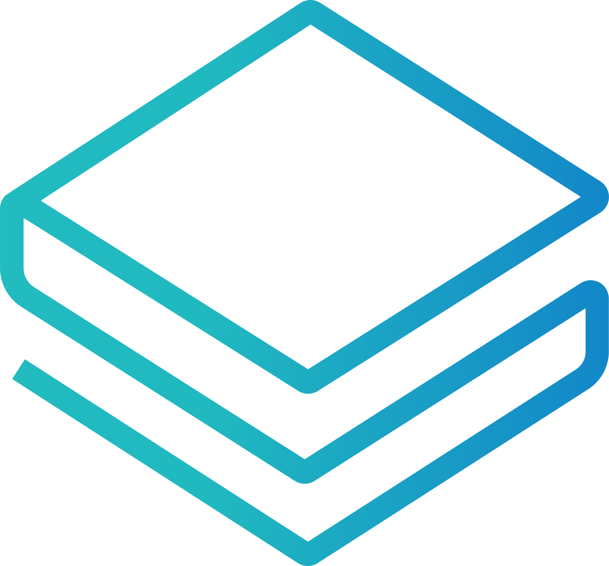
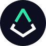
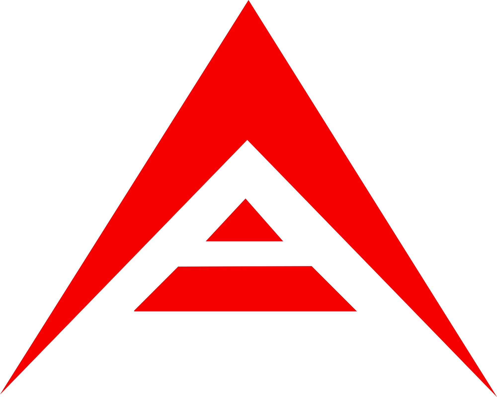
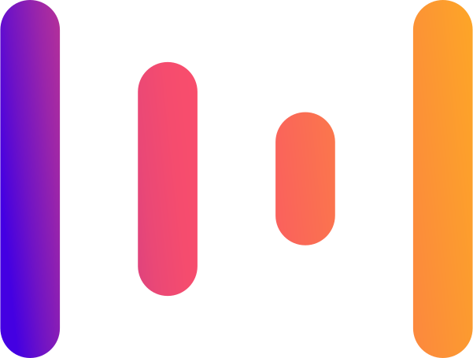
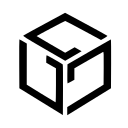
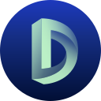
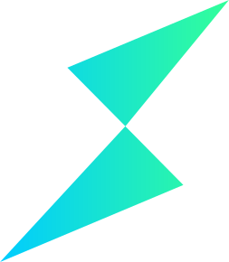

<table>
<tr>
<td></td>
<td><ul>
<li>ID: bitcoin@bitcoin</li>
<li>Name: Bitcoin</li>
<li>Symbol: BTC</li>
<li>Platform: bitcoin</li>
</td></ul>
<td><ul>
<li><a href="https://www.coingecko.com/en/coins/bitcoin">coingecko</a></li>
<li><a href="https://coinmarketcap.com/currencies/bitcoin/">coinmarketcap</a></li>
<li><a href="https://changelly.com/exchange/btc">changelly</a></li>
<li><a href="https://buy.moonpay.io/?defaultCurrencyCode=btc">moonpay</a></li>
</td></ul>
</tr>
<tr>
<td></td>
<td><ul>
<li>ID: ethereum@ethereum</li>
<li>Name: Ethereum</li>
<li>Symbol: ETH</li>
<li>Platform: ethereum</li>
</td></ul>
<td><ul>
<li><a href="https://www.coingecko.com/en/coins/ethereum">coingecko</a></li>
<li><a href="https://coinmarketcap.com/currencies/ethereum/">coinmarketcap</a></li>
<li><a href="https://changelly.com/exchange/eth">changelly</a></li>
<li><a href="https://buy.moonpay.io/?defaultCurrencyCode=eth">moonpay</a></li>
</td></ul>
</tr>
<tr>
<td></td>
<td><ul>
<li>ID: ethereum@binance-smart-chain</li>
<li>Name: Ethereum</li>
<li>Symbol: ETH</li>
<li>Platform: binance-smart-chain</li>
</td></ul>
<td><ul>
<li><a href="https://bscscan.com/token/0x2170ed0880ac9a755fd29b2688956bd959f933f8">bscscan</a></li>
<li><a href="https://www.coingecko.com/en/coins/ethereum">coingecko</a></li>
<li><a href="https://coinmarketcap.com/currencies/ethereum/">coinmarketcap</a></li>
</td></ul>
</tr>
<tr>
<td></td>
<td><ul>
<li>ID: cardano@cardano</li>
<li>Name: Cardano</li>
<li>Symbol: ADA</li>
<li>Platform: cardano</li>
</td></ul>
<td><ul>
<li><a href="https://www.coingecko.com/en/coins/cardano">coingecko</a></li>
<li><a href="https://coinmarketcap.com/currencies/cardano/">coinmarketcap</a></li>
<li><a href="https://changelly.com/exchange/ada">changelly</a></li>
<li><a href="https://buy.moonpay.io/?defaultCurrencyCode=ada">moonpay</a></li>
</td></ul>
</tr>
<tr>
<td></td>
<td><ul>
<li>ID: binance-smart-chain@binance-smart-chain</li>
<li>Name: Binance Smart Chain</li>
<li>Symbol: BNB</li>
<li>Platform: binance-smart-chain</li>
</td></ul>
<td><ul>
<li><a href="https://www.coingecko.com/en/coins/binancecoin">coingecko</a></li>
<li><a href="https://coinmarketcap.com/currencies/binance-coin/">coinmarketcap</a></li>
<li><a href="https://buy.moonpay.io/?defaultCurrencyCode=bnb_bsc">moonpay</a></li>
</td></ul>
</tr>
<tr>
<td></td>
<td><ul>
<li>ID: binance-chain@binance-chain</li>
<li>Name: Binance Chain</li>
<li>Symbol: BNB</li>
<li>Platform: binance-chain</li>
</td></ul>
<td><ul>
<li><a href="https://www.coingecko.com/en/coins/binancecoin">coingecko</a></li>
<li><a href="https://coinmarketcap.com/currencies/binance-coin/">coinmarketcap</a></li>
<li><a href="https://changelly.com/exchange/bnb">changelly</a></li>
<li><a href="https://buy.moonpay.io/?defaultCurrencyCode=bnb">moonpay</a></li>
</td></ul>
</tr>
<tr>
<td></td>
<td><ul>
<li>ID: tether@binance-smart-chain</li>
<li>Name: Tether</li>
<li>Symbol: USDT</li>
<li>Platform: binance-smart-chain</li>
</td></ul>
<td><ul>
<li><a href="https://bscscan.com/token/0x55d398326f99059ff775485246999027b3197955">bscscan</a></li>
<li><a href="https://www.coingecko.com/en/coins/tether">coingecko</a></li>
<li><a href="https://coinmarketcap.com/currencies/tether/">coinmarketcap</a></li>
</td></ul>
</tr>
<tr>
<td></td>
<td><ul>
<li>ID: tether@ethereum</li>
<li>Name: Tether</li>
<li>Symbol: USDT</li>
<li>Platform: ethereum</li>
</td></ul>
<td><ul>
<li><a href="https://etherscan.io/token/0xdac17f958d2ee523a2206206994597c13d831ec7">etherscan</a></li>
<li><a href="https://www.coingecko.com/en/coins/tether">coingecko</a></li>
<li><a href="https://coinmarketcap.com/currencies/tether/">coinmarketcap</a></li>
<li><a href="https://changelly.com/exchange/usdt20">changelly</a></li>
<li><a href="https://buy.moonpay.io/?defaultCurrencyCode=usdt">moonpay</a></li>
</td></ul>
</tr>
<tr>
<td></td>
<td><ul>
<li>ID: xrp@ripple</li>
<li>Name: XRP</li>
<li>Symbol: XRP</li>
<li>Platform: ripple</li>
</td></ul>
<td><ul>
<li><a href="https://www.coingecko.com/en/coins/ripple">coingecko</a></li>
<li><a href="https://coinmarketcap.com/currencies/xrp/">coinmarketcap</a></li>
<li><a href="https://changelly.com/exchange/xrp">changelly</a></li>
<li><a href="https://buy.moonpay.io/?defaultCurrencyCode=xrp">moonpay</a></li>
</td></ul>
</tr>
<tr>
<td></td>
<td><ul>
<li>ID: solana@solana</li>
<li>Name: Solana</li>
<li>Symbol: SOL</li>
<li>Platform: solana</li>
</td></ul>
<td><ul>
<li><a href="https://www.coingecko.com/en/coins/solana">coingecko</a></li>
<li><a href="https://coinmarketcap.com/currencies/solana/">coinmarketcap</a></li>
<li><a href="https://changelly.com/exchange/sol">changelly</a></li>
<li><a href="https://buy.moonpay.io/?defaultCurrencyCode=sol">moonpay</a></li>
</td></ul>
</tr>
<tr>
<td></td>
<td><ul>
<li>ID: polkadot@polkadot</li>
<li>Name: Polkadot</li>
<li>Symbol: DOT</li>
<li>Platform: polkadot</li>
</td></ul>
<td><ul>
<li><a href="https://www.coingecko.com/en/coins/polkadot">coingecko</a></li>
<li><a href="https://coinmarketcap.com/currencies/polkadot-new/">coinmarketcap</a></li>
<li><a href="https://changelly.com/exchange/dot">changelly</a></li>
<li><a href="https://buy.moonpay.io/?defaultCurrencyCode=dot">moonpay</a></li>
</td></ul>
</tr>
<tr>
<td></td>
<td><ul>
<li>ID: dogecoin@dogecoin</li>
<li>Name: Dogecoin</li>
<li>Symbol: DOGE</li>
<li>Platform: dogecoin</li>
</td></ul>
<td><ul>
<li><a href="https://www.coingecko.com/en/coins/dogecoin">coingecko</a></li>
<li><a href="https://coinmarketcap.com/currencies/dogecoin/">coinmarketcap</a></li>
<li><a href="https://changelly.com/exchange/doge">changelly</a></li>
<li><a href="https://buy.moonpay.io/?defaultCurrencyCode=doge">moonpay</a></li>
</td></ul>
</tr>
<tr>
<td></td>
<td><ul>
<li>ID: dogecoin@binance-smart-chain</li>
<li>Name: Dogecoin</li>
<li>Symbol: DOGE</li>
<li>Platform: binance-smart-chain</li>
</td></ul>
<td><ul>
<li><a href="https://bscscan.com/token/0x4206931337dc273a630d328da6441786bfad668f">bscscan</a></li>
<li><a href="https://www.coingecko.com/en/coins/dogecoin">coingecko</a></li>
<li><a href="https://coinmarketcap.com/currencies/dogecoin/">coinmarketcap</a></li>
</td></ul>
</tr>
<tr>
<td></td>
<td><ul>
<li>ID: usd-coin@binance-smart-chain</li>
<li>Name: USD Coin</li>
<li>Symbol: USDC</li>
<li>Platform: binance-smart-chain</li>
</td></ul>
<td><ul>
<li><a href="https://bscscan.com/token/0x8ac76a51cc950d9822d68b83fe1ad97b32cd580d">bscscan</a></li>
<li><a href="https://www.coingecko.com/en/coins/usd-coin">coingecko</a></li>
<li><a href="https://coinmarketcap.com/currencies/usd-coin/">coinmarketcap</a></li>
</td></ul>
</tr>
<tr>
<td></td>
<td><ul>
<li>ID: usd-coin@ethereum</li>
<li>Name: USD Coin</li>
<li>Symbol: USDC</li>
<li>Platform: ethereum</li>
</td></ul>
<td><ul>
<li><a href="https://etherscan.io/token/0xa0b86991c6218b36c1d19d4a2e9eb0ce3606eb48">etherscan</a></li>
<li><a href="https://www.coingecko.com/en/coins/usd-coin">coingecko</a></li>
<li><a href="https://coinmarketcap.com/currencies/usd-coin/">coinmarketcap</a></li>
<li><a href="https://changelly.com/exchange/usdc">changelly</a></li>
<li><a href="https://buy.moonpay.io/?defaultCurrencyCode=usdc">moonpay</a></li>
</td></ul>
</tr>
<tr>
<td></td>
<td><ul>
<li>ID: usd-coin@polygon</li>
<li>Name: USD Coin</li>
<li>Symbol: USDC</li>
<li>Platform: polygon</li>
</td></ul>
<td><ul>
<li><a href="https://www.coingecko.com/en/coins/usd-coin">coingecko</a></li>
<li><a href="https://coinmarketcap.com/currencies/usd-coin/">coinmarketcap</a></li>
<li><a href="https://buy.moonpay.io/?defaultCurrencyCode=usdc_polygon">moonpay</a></li>
</td></ul>
</tr>
<tr>
<td></td>
<td><ul>
<li>ID: uniswap@binance-smart-chain</li>
<li>Name: Uniswap</li>
<li>Symbol: UNI</li>
<li>Platform: binance-smart-chain</li>
</td></ul>
<td><ul>
<li><a href="https://bscscan.com/token/0xbf5140a22578168fd562dccf235e5d43a02ce9b1">bscscan</a></li>
<li><a href="https://www.coingecko.com/en/coins/uniswap">coingecko</a></li>
<li><a href="https://coinmarketcap.com/currencies/uniswap/">coinmarketcap</a></li>
</td></ul>
</tr>
<tr>
<td></td>
<td><ul>
<li>ID: uniswap@ethereum</li>
<li>Name: Uniswap</li>
<li>Symbol: UNI</li>
<li>Platform: ethereum</li>
</td></ul>
<td><ul>
<li><a href="https://etherscan.io/token/0x1f9840a85d5af5bf1d1762f925bdaddc4201f984">etherscan</a></li>
<li><a href="https://www.coingecko.com/en/coins/uniswap">coingecko</a></li>
<li><a href="https://coinmarketcap.com/currencies/uniswap/">coinmarketcap</a></li>
<li><a href="https://changelly.com/exchange/uni">changelly</a></li>
<li><a href="https://buy.moonpay.io/?defaultCurrencyCode=uni">moonpay</a></li>
</td></ul>
</tr>
<tr>
<td></td>
<td><ul>
<li>ID: terra@terra</li>
<li>Name: Terra</li>
<li>Symbol: LUNA</li>
<li>Platform: terra</li>
</td></ul>
<td><ul>
<li><a href="https://www.coingecko.com/en/coins/terra-luna">coingecko</a></li>
<li><a href="https://coinmarketcap.com/currencies/terra-luna/">coinmarketcap</a></li>
<li><a href="https://changelly.com/exchange/luna">changelly</a></li>
<li><a href="https://buy.moonpay.io/?defaultCurrencyCode=luna">moonpay</a></li>
</td></ul>
</tr>
<tr>
<td></td>
<td><ul>
<li>ID: chainlink@binance-smart-chain</li>
<li>Name: Chainlink</li>
<li>Symbol: LINK</li>
<li>Platform: binance-smart-chain</li>
</td></ul>
<td><ul>
<li><a href="https://bscscan.com/token/0xf8a0bf9cf54bb92f17374d9e9a321e6a111a51bd">bscscan</a></li>
<li><a href="https://www.coingecko.com/en/coins/chainlink">coingecko</a></li>
<li><a href="https://coinmarketcap.com/currencies/chainlink/">coinmarketcap</a></li>
</td></ul>
</tr>
<tr>
<td></td>
<td><ul>
<li>ID: chainlink@ethereum</li>
<li>Name: Chainlink</li>
<li>Symbol: LINK</li>
<li>Platform: ethereum</li>
</td></ul>
<td><ul>
<li><a href="https://etherscan.io/token/0x514910771af9ca656af840dff83e8264ecf986ca">etherscan</a></li>
<li><a href="https://www.coingecko.com/en/coins/chainlink">coingecko</a></li>
<li><a href="https://coinmarketcap.com/currencies/chainlink/">coinmarketcap</a></li>
<li><a href="https://changelly.com/exchange/link">changelly</a></li>
<li><a href="https://buy.moonpay.io/?defaultCurrencyCode=link">moonpay</a></li>
</td></ul>
</tr>
<tr>
<td></td>
<td><ul>
<li>ID: binance-usd@binance-chain</li>
<li>Name: Binance USD</li>
<li>Symbol: BUSD</li>
<li>Platform: binance-chain</li>
</td></ul>
<td><ul>
<li><a href="https://www.coingecko.com/en/coins/binance-usd">coingecko</a></li>
<li><a href="https://coinmarketcap.com/currencies/binance-usd/">coinmarketcap</a></li>
<li><a href="https://buy.moonpay.io/?defaultCurrencyCode=busd">moonpay</a></li>
</td></ul>
</tr>
<tr>
<td></td>
<td><ul>
<li>ID: binance-usd@binance-smart-chain</li>
<li>Name: Binance USD</li>
<li>Symbol: BUSD</li>
<li>Platform: binance-smart-chain</li>
</td></ul>
<td><ul>
<li><a href="https://bscscan.com/token/0xe9e7cea3dedca5984780bafc599bd69add087d56">bscscan</a></li>
<li><a href="https://www.coingecko.com/en/coins/binance-usd">coingecko</a></li>
<li><a href="https://coinmarketcap.com/currencies/binance-usd/">coinmarketcap</a></li>
<li><a href="https://buy.moonpay.io/?defaultCurrencyCode=busd_bsc">moonpay</a></li>
</td></ul>
</tr>
<tr>
<td></td>
<td><ul>
<li>ID: binance-usd@ethereum</li>
<li>Name: Binance USD</li>
<li>Symbol: BUSD</li>
<li>Platform: ethereum</li>
</td></ul>
<td><ul>
<li><a href="https://etherscan.io/token/0x4fabb145d64652a948d72533023f6e7a623c7c53">etherscan</a></li>
<li><a href="https://www.coingecko.com/en/coins/binance-usd">coingecko</a></li>
<li><a href="https://coinmarketcap.com/currencies/binance-usd/">coinmarketcap</a></li>
<li><a href="https://changelly.com/exchange/busd">changelly</a></li>
</td></ul>
</tr>
<tr>
<td></td>
<td><ul>
<li>ID: litecoin@litecoin</li>
<li>Name: Litecoin</li>
<li>Symbol: LTC</li>
<li>Platform: litecoin</li>
</td></ul>
<td><ul>
<li><a href="https://www.coingecko.com/en/coins/litecoin">coingecko</a></li>
<li><a href="https://coinmarketcap.com/currencies/litecoin/">coinmarketcap</a></li>
<li><a href="https://changelly.com/exchange/ltc">changelly</a></li>
<li><a href="https://buy.moonpay.io/?defaultCurrencyCode=ltc">moonpay</a></li>
</td></ul>
</tr>
<tr>
<td></td>
<td><ul>
<li>ID: bitcoin-cash@bitcoin-cash</li>
<li>Name: Bitcoin Cash</li>
<li>Symbol: BCH</li>
<li>Platform: bitcoin-cash</li>
</td></ul>
<td><ul>
<li><a href="https://www.coingecko.com/en/coins/bitcoin-cash">coingecko</a></li>
<li><a href="https://coinmarketcap.com/currencies/bitcoin-cash/">coinmarketcap</a></li>
<li><a href="https://changelly.com/exchange/bch">changelly</a></li>
<li><a href="https://buy.moonpay.io/?defaultCurrencyCode=bch">moonpay</a></li>
</td></ul>
</tr>
<tr>
<td></td>
<td><ul>
<li>ID: algorand@algorand</li>
<li>Name: Algorand</li>
<li>Symbol: ALGO</li>
<li>Platform: algorand</li>
</td></ul>
<td><ul>
<li><a href="https://www.coingecko.com/en/coins/algorand">coingecko</a></li>
<li><a href="https://coinmarketcap.com/currencies/algorand/">coinmarketcap</a></li>
<li><a href="https://changelly.com/exchange/algo">changelly</a></li>
<li><a href="https://buy.moonpay.io/?defaultCurrencyCode=algo">moonpay</a></li>
</td></ul>
</tr>
<tr>
<td></td>
<td><ul>
<li>ID: wrapped-bitcoin@ethereum</li>
<li>Name: Wrapped Bitcoin</li>
<li>Symbol: WBTC</li>
<li>Platform: ethereum</li>
</td></ul>
<td><ul>
<li><a href="https://etherscan.io/token/0x2260fac5e5542a773aa44fbcfedf7c193bc2c599">etherscan</a></li>
<li><a href="https://www.coingecko.com/en/coins/wrapped-bitcoin">coingecko</a></li>
<li><a href="https://coinmarketcap.com/currencies/wrapped-bitcoin/">coinmarketcap</a></li>
<li><a href="https://changelly.com/exchange/wbtc">changelly</a></li>
<li><a href="https://buy.moonpay.io/?defaultCurrencyCode=wbtc">moonpay</a></li>
</td></ul>
</tr>
<tr>
<td></td>
<td><ul>
<li>ID: internet-computer@internet-computer</li>
<li>Name: Internet Computer</li>
<li>Symbol: ICP</li>
<li>Platform: internet-computer</li>
</td></ul>
<td><ul>
<li><a href="https://www.coingecko.com/en/coins/internet-computer">coingecko</a></li>
<li><a href="https://coinmarketcap.com/currencies/internet-computer/">coinmarketcap</a></li>
<li><a href="https://changelly.com/exchange/icp">changelly</a></li>
</td></ul>
</tr>
<tr>
<td></td>
<td><ul>
<li>ID: polygon@polygon</li>
<li>Name: Polygon</li>
<li>Symbol: MATIC</li>
<li>Platform: polygon</li>
</td></ul>
<td><ul>
<li><a href="https://www.coingecko.com/en/coins/matic-network">coingecko</a></li>
<li><a href="https://coinmarketcap.com/currencies/polygon/">coinmarketcap</a></li>
<li><a href="https://buy.moonpay.io/?defaultCurrencyCode=matic_polygon">moonpay</a></li>
</td></ul>
</tr>
<tr>
<td></td>
<td><ul>
<li>ID: polygon@ethereum</li>
<li>Name: Polygon</li>
<li>Symbol: MATIC</li>
<li>Platform: ethereum</li>
</td></ul>
<td><ul>
<li><a href="https://etherscan.io/token/0x7d1afa7b718fb893db30a3abc0cfc608aacfebb0">etherscan</a></li>
<li><a href="https://www.coingecko.com/en/coins/matic-network">coingecko</a></li>
<li><a href="https://coinmarketcap.com/currencies/polygon/">coinmarketcap</a></li>
<li><a href="https://changelly.com/exchange/matic">changelly</a></li>
<li><a href="https://buy.moonpay.io/?defaultCurrencyCode=matic">moonpay</a></li>
</td></ul>
</tr>
<tr>
<td></td>
<td><ul>
<li>ID: filecoin@filecoin</li>
<li>Name: Filecoin</li>
<li>Symbol: FIL</li>
<li>Platform: filecoin</li>
</td></ul>
<td><ul>
<li><a href="https://www.coingecko.com/en/coins/filecoin">coingecko</a></li>
<li><a href="https://coinmarketcap.com/currencies/filecoin/">coinmarketcap</a></li>
<li><a href="https://changelly.com/exchange/fil">changelly</a></li>
<li><a href="https://buy.moonpay.io/?defaultCurrencyCode=fil">moonpay</a></li>
</td></ul>
</tr>
<tr>
<td></td>
<td><ul>
<li>ID: tron@tron</li>
<li>Name: TRON</li>
<li>Symbol: TRX</li>
<li>Platform: tron</li>
</td></ul>
<td><ul>
<li><a href="https://www.coingecko.com/en/coins/tron">coingecko</a></li>
<li><a href="https://coinmarketcap.com/currencies/tron/">coinmarketcap</a></li>
<li><a href="https://changelly.com/exchange/trx">changelly</a></li>
<li><a href="https://buy.moonpay.io/?defaultCurrencyCode=trx">moonpay</a></li>
</td></ul>
</tr>
<tr>
<td></td>
<td><ul>
<li>ID: ftx-token@ethereum</li>
<li>Name: FTX Token</li>
<li>Symbol: FTT</li>
<li>Platform: ethereum</li>
</td></ul>
<td><ul>
<li><a href="https://etherscan.io/token/0x50d1c9771902476076ecfc8b2a83ad6b9355a4c9">etherscan</a></li>
<li><a href="https://www.coingecko.com/en/coins/ftx-token">coingecko</a></li>
<li><a href="https://coinmarketcap.com/currencies/ftx-token/">coinmarketcap</a></li>
<li><a href="https://changelly.com/exchange/ftt">changelly</a></li>
</td></ul>
</tr>
<tr>
<td></td>
<td><ul>
<li>ID: cosmos@cosmos</li>
<li>Name: Cosmos</li>
<li>Symbol: ATOM</li>
<li>Platform: cosmos</li>
</td></ul>
<td><ul>
<li><a href="https://www.coingecko.com/en/coins/cosmos">coingecko</a></li>
<li><a href="https://coinmarketcap.com/currencies/cosmos/">coinmarketcap</a></li>
<li><a href="https://changelly.com/exchange/atom">changelly</a></li>
<li><a href="https://buy.moonpay.io/?defaultCurrencyCode=atom">moonpay</a></li>
</td></ul>
</tr>
<tr>
<td></td>
<td><ul>
<li>ID: cosmos@binance-smart-chain</li>
<li>Name: Cosmos</li>
<li>Symbol: ATOM</li>
<li>Platform: binance-smart-chain</li>
</td></ul>
<td><ul>
<li><a href="https://bscscan.com/token/0x0eb3a705fc54725037cc9e008bdede697f62f335">bscscan</a></li>
<li><a href="https://www.coingecko.com/en/coins/cosmos">coingecko</a></li>
<li><a href="https://coinmarketcap.com/currencies/cosmos/">coinmarketcap</a></li>
</td></ul>
</tr>
<tr>
<td></td>
<td><ul>
<li>ID: stellar@stellar</li>
<li>Name: Stellar</li>
<li>Symbol: XLM</li>
<li>Platform: stellar</li>
</td></ul>
<td><ul>
<li><a href="https://www.coingecko.com/en/coins/stellar">coingecko</a></li>
<li><a href="https://coinmarketcap.com/currencies/stellar/">coinmarketcap</a></li>
<li><a href="https://changelly.com/exchange/xlm">changelly</a></li>
<li><a href="https://buy.moonpay.io/?defaultCurrencyCode=xlm">moonpay</a></li>
</td></ul>
</tr>
<tr>
<td></td>
<td><ul>
<li>ID: ethereum-classic@ethereum-classic</li>
<li>Name: Ethereum Classic</li>
<li>Symbol: ETC</li>
<li>Platform: ethereum-classic</li>
</td></ul>
<td><ul>
<li><a href="https://www.coingecko.com/en/coins/ethereum-classic">coingecko</a></li>
<li><a href="https://coinmarketcap.com/currencies/ethereum-classic/">coinmarketcap</a></li>
<li><a href="https://buy.moonpay.io/?defaultCurrencyCode=etc">moonpay</a></li>
</td></ul>
</tr>
<tr>
<td></td>
<td><ul>
<li>ID: vechain@vechain</li>
<li>Name: VeChain</li>
<li>Symbol: VET</li>
<li>Platform: vechain</li>
</td></ul>
<td><ul>
<li><a href="https://www.coingecko.com/en/coins/vechain">coingecko</a></li>
<li><a href="https://coinmarketcap.com/currencies/vechain/">coinmarketcap</a></li>
<li><a href="https://changelly.com/exchange/vet">changelly</a></li>
<li><a href="https://buy.moonpay.io/?defaultCurrencyCode=vet">moonpay</a></li>
</td></ul>
</tr>
<tr>
<td></td>
<td><ul>
<li>ID: dai@binance-smart-chain</li>
<li>Name: Dai</li>
<li>Symbol: DAI</li>
<li>Platform: binance-smart-chain</li>
</td></ul>
<td><ul>
<li><a href="https://bscscan.com/token/0x1af3f329e8be154074d8769d1ffa4ee058b1dbc3">bscscan</a></li>
<li><a href="https://www.coingecko.com/en/coins/dai">coingecko</a></li>
<li><a href="https://coinmarketcap.com/currencies/multi-collateral-dai/">coinmarketcap</a></li>
</td></ul>
</tr>
<tr>
<td></td>
<td><ul>
<li>ID: dai@ethereum</li>
<li>Name: Dai</li>
<li>Symbol: DAI</li>
<li>Platform: ethereum</li>
</td></ul>
<td><ul>
<li><a href="https://etherscan.io/token/0x6b175474e89094c44da98b954eedeac495271d0f">etherscan</a></li>
<li><a href="https://www.coingecko.com/en/coins/dai">coingecko</a></li>
<li><a href="https://coinmarketcap.com/currencies/multi-collateral-dai/">coinmarketcap</a></li>
<li><a href="https://changelly.com/exchange/dai">changelly</a></li>
<li><a href="https://buy.moonpay.io/?defaultCurrencyCode=dai">moonpay</a></li>
</td></ul>
</tr>
<tr>
<td></td>
<td><ul>
<li>ID: theta-network@theta</li>
<li>Name: Theta Network</li>
<li>Symbol: THETA</li>
<li>Platform: theta</li>
</td></ul>
<td><ul>
<li><a href="https://www.coingecko.com/en/coins/theta-token">coingecko</a></li>
<li><a href="https://coinmarketcap.com/currencies/theta/">coinmarketcap</a></li>
<li><a href="https://changelly.com/exchange/theta">changelly</a></li>
</td></ul>
</tr>
<tr>
<td></td>
<td><ul>
<li>ID: tezos@tezos</li>
<li>Name: Tezos</li>
<li>Symbol: XTZ</li>
<li>Platform: tezos</li>
</td></ul>
<td><ul>
<li><a href="https://www.coingecko.com/en/coins/tezos">coingecko</a></li>
<li><a href="https://coinmarketcap.com/currencies/tezos/">coinmarketcap</a></li>
<li><a href="https://changelly.com/exchange/xtz">changelly</a></li>
<li><a href="https://buy.moonpay.io/?defaultCurrencyCode=xtz">moonpay</a></li>
</td></ul>
</tr>
<tr>
<td></td>
<td><ul>
<li>ID: eos@eos</li>
<li>Name: EOS</li>
<li>Symbol: EOS</li>
<li>Platform: eos</li>
</td></ul>
<td><ul>
<li><a href="https://www.coingecko.com/en/coins/eos">coingecko</a></li>
<li><a href="https://coinmarketcap.com/currencies/eos/">coinmarketcap</a></li>
<li><a href="https://changelly.com/exchange/eos">changelly</a></li>
<li><a href="https://buy.moonpay.io/?defaultCurrencyCode=eos">moonpay</a></li>
</td></ul>
</tr>
<tr>
<td></td>
<td><ul>
<li>ID: elrond@elrond</li>
<li>Name: Elrond</li>
<li>Symbol: EGLD</li>
<li>Platform: elrond</li>
</td></ul>
<td><ul>
<li><a href="https://www.coingecko.com/en/coins/elrond-erd-2">coingecko</a></li>
<li><a href="https://coinmarketcap.com/currencies/elrond-egld/">coinmarketcap</a></li>
<li><a href="https://changelly.com/exchange/egld">changelly</a></li>
<li><a href="https://buy.moonpay.io/?defaultCurrencyCode=egld">moonpay</a></li>
</td></ul>
</tr>
<tr>
<td></td>
<td><ul>
<li>ID: aave@ethereum</li>
<li>Name: Aave</li>
<li>Symbol: AAVE</li>
<li>Platform: ethereum</li>
</td></ul>
<td><ul>
<li><a href="https://etherscan.io/token/0x7fc66500c84a76ad7e9c93437bfc5ac33e2ddae9">etherscan</a></li>
<li><a href="https://www.coingecko.com/en/coins/aave">coingecko</a></li>
<li><a href="https://coinmarketcap.com/currencies/aave/">coinmarketcap</a></li>
<li><a href="https://changelly.com/exchange/aave">changelly</a></li>
<li><a href="https://buy.moonpay.io/?defaultCurrencyCode=aave">moonpay</a></li>
</td></ul>
</tr>
<tr>
<td></td>
<td><ul>
<li>ID: crypto-com-coin@ethereum</li>
<li>Name: Crypto.com Coin</li>
<li>Symbol: CRO</li>
<li>Platform: ethereum</li>
</td></ul>
<td><ul>
<li><a href="https://etherscan.io/token/0xa0b73e1ff0b80914ab6fe0444e65848c4c34450b">etherscan</a></li>
<li><a href="https://www.coingecko.com/en/coins/crypto-com-chain">coingecko</a></li>
<li><a href="https://coinmarketcap.com/currencies/crypto-com-coin/">coinmarketcap</a></li>
</td></ul>
</tr>
<tr>
<td></td>
<td><ul>
<li>ID: pancakeswap@binance-smart-chain</li>
<li>Name: PancakeSwap</li>
<li>Symbol: CAKE</li>
<li>Platform: binance-smart-chain</li>
</td></ul>
<td><ul>
<li><a href="https://bscscan.com/token/0x0e09fabb73bd3ade0a17ecc321fd13a19e81ce82">bscscan</a></li>
<li><a href="https://www.coingecko.com/en/coins/pancakeswap-token">coingecko</a></li>
<li><a href="https://coinmarketcap.com/currencies/pancakeswap/">coinmarketcap</a></li>
<li><a href="https://changelly.com/exchange/cake">changelly</a></li>
</td></ul>
</tr>
<tr>
<td></td>
<td><ul>
<li>ID: monero@monero</li>
<li>Name: Monero</li>
<li>Symbol: XMR</li>
<li>Platform: monero</li>
</td></ul>
<td><ul>
<li><a href="https://www.coingecko.com/en/coins/monero">coingecko</a></li>
<li><a href="https://coinmarketcap.com/currencies/monero/">coinmarketcap</a></li>
<li><a href="https://changelly.com/exchange/xmr">changelly</a></li>
</td></ul>
</tr>
<tr>
<td></td>
<td><ul>
<li>ID: hedera-hashgraph@hedera-hashgraph</li>
<li>Name: Hedera Hashgraph</li>
<li>Symbol: HBAR</li>
<li>Platform: hedera-hashgraph</li>
</td></ul>
<td><ul>
<li><a href="https://www.coingecko.com/en/coins/hedera-hashgraph">coingecko</a></li>
<li><a href="https://coinmarketcap.com/currencies/hedera-hashgraph/">coinmarketcap</a></li>
<li><a href="https://changelly.com/exchange/hbar">changelly</a></li>
<li><a href="https://buy.moonpay.io/?defaultCurrencyCode=hbar">moonpay</a></li>
</td></ul>
</tr>
<tr>
<td></td>
<td><ul>
<li>ID: quant@ethereum</li>
<li>Name: Quant</li>
<li>Symbol: QNT</li>
<li>Platform: ethereum</li>
</td></ul>
<td><ul>
<li><a href="https://etherscan.io/token/0x4a220e6096b25eadb88358cb44068a3248254675">etherscan</a></li>
<li><a href="https://www.coingecko.com/en/coins/quant-network">coingecko</a></li>
<li><a href="https://coinmarketcap.com/currencies/quant/">coinmarketcap</a></li>
<li><a href="https://changelly.com/exchange/qnt">changelly</a></li>
</td></ul>
</tr>
<tr>
<td></td>
<td><ul>
<li>ID: iota@iota</li>
<li>Name: IOTA</li>
<li>Symbol: MIOTA</li>
<li>Platform: iota</li>
</td></ul>
<td><ul>
<li><a href="https://www.coingecko.com/en/coins/iota">coingecko</a></li>
<li><a href="https://coinmarketcap.com/currencies/iota/">coinmarketcap</a></li>
<li><a href="https://buy.moonpay.io/?defaultCurrencyCode=miota">moonpay</a></li>
</td></ul>
</tr>
<tr>
<td></td>
<td><ul>
<li>ID: axie-infinity@binance-smart-chain</li>
<li>Name: Axie Infinity</li>
<li>Symbol: AXS</li>
<li>Platform: binance-smart-chain</li>
</td></ul>
<td><ul>
<li><a href="https://bscscan.com/token/0x715d400f88c167884bbcc41c5fea407ed4d2f8a0">bscscan</a></li>
<li><a href="https://www.coingecko.com/en/coins/axie-infinity">coingecko</a></li>
<li><a href="https://coinmarketcap.com/currencies/axie-infinity/">coinmarketcap</a></li>
</td></ul>
</tr>
<tr>
<td></td>
<td><ul>
<li>ID: axie-infinity@ethereum</li>
<li>Name: Axie Infinity</li>
<li>Symbol: AXS</li>
<li>Platform: ethereum</li>
</td></ul>
<td><ul>
<li><a href="https://etherscan.io/token/0xbb0e17ef65f82ab018d8edd776e8dd940327b28b">etherscan</a></li>
<li><a href="https://www.coingecko.com/en/coins/axie-infinity">coingecko</a></li>
<li><a href="https://coinmarketcap.com/currencies/axie-infinity/">coinmarketcap</a></li>
<li><a href="https://changelly.com/exchange/axs">changelly</a></li>
<li><a href="https://buy.moonpay.io/?defaultCurrencyCode=axs">moonpay</a></li>
</td></ul>
</tr>
<tr>
<td></td>
<td><ul>
<li>ID: near@near</li>
<li>Name: Near</li>
<li>Symbol: NEAR</li>
<li>Platform: near</li>
</td></ul>
<td><ul>
<li><a href="https://www.coingecko.com/en/coins/near">coingecko</a></li>
<li><a href="https://coinmarketcap.com/currencies/near-protocol/">coinmarketcap</a></li>
</td></ul>
</tr>
<tr>
<td></td>
<td><ul>
<li>ID: the-graph@ethereum</li>
<li>Name: The Graph</li>
<li>Symbol: GRT</li>
<li>Platform: ethereum</li>
</td></ul>
<td><ul>
<li><a href="https://etherscan.io/token/0xc944e90c64b2c07662a292be6244bdf05cda44a7">etherscan</a></li>
<li><a href="https://www.coingecko.com/en/coins/the-graph">coingecko</a></li>
<li><a href="https://coinmarketcap.com/currencies/the-graph/">coinmarketcap</a></li>
<li><a href="https://changelly.com/exchange/grt">changelly</a></li>
</td></ul>
</tr>
<tr>
<td></td>
<td><ul>
<li>ID: neo@neo</li>
<li>Name: NEO</li>
<li>Symbol: NEO</li>
<li>Platform: neo</li>
</td></ul>
<td><ul>
<li><a href="https://www.coingecko.com/en/coins/neo">coingecko</a></li>
<li><a href="https://coinmarketcap.com/currencies/neo/">coinmarketcap</a></li>
<li><a href="https://changelly.com/exchange/neo">changelly</a></li>
<li><a href="https://buy.moonpay.io/?defaultCurrencyCode=neo">moonpay</a></li>
</td></ul>
</tr>
<tr>
<td></td>
<td><ul>
<li>ID: fantom@ethereum</li>
<li>Name: Fantom</li>
<li>Symbol: FTM</li>
<li>Platform: ethereum</li>
</td></ul>
<td><ul>
<li><a href="https://etherscan.io/token/0x4e15361fd6b4bb609fa63c81a2be19d873717870">etherscan</a></li>
<li><a href="https://www.coingecko.com/en/coins/fantom">coingecko</a></li>
<li><a href="https://coinmarketcap.com/currencies/fantom/">coinmarketcap</a></li>
<li><a href="https://changelly.com/exchange/ftm">changelly</a></li>
</td></ul>
</tr>
<tr>
<td></td>
<td><ul>
<li>ID: shiba-inu@ethereum</li>
<li>Name: Shiba Inu</li>
<li>Symbol: SHIB</li>
<li>Platform: ethereum</li>
</td></ul>
<td><ul>
<li><a href="https://etherscan.io/token/0x95ad61b0a150d79219dcf64e1e6cc01f0b64c4ce">etherscan</a></li>
<li><a href="https://www.coingecko.com/en/coins/shiba-inu">coingecko</a></li>
<li><a href="https://coinmarketcap.com/currencies/shiba-inu/">coinmarketcap</a></li>
<li><a href="https://changelly.com/exchange/shib">changelly</a></li>
</td></ul>
</tr>
<tr>
<td></td>
<td><ul>
<li>ID: kusama@kusama</li>
<li>Name: Kusama</li>
<li>Symbol: KSM</li>
<li>Platform: kusama</li>
</td></ul>
<td><ul>
<li><a href="https://www.coingecko.com/en/coins/kusama">coingecko</a></li>
<li><a href="https://coinmarketcap.com/currencies/kusama/">coinmarketcap</a></li>
<li><a href="https://changelly.com/exchange/ksm">changelly</a></li>
</td></ul>
</tr>
<tr>
<td></td>
<td><ul>
<li>ID: waves@waves</li>
<li>Name: Waves</li>
<li>Symbol: WAVES</li>
<li>Platform: waves</li>
</td></ul>
<td><ul>
<li><a href="https://www.coingecko.com/en/coins/waves">coingecko</a></li>
<li><a href="https://coinmarketcap.com/currencies/waves/">coinmarketcap</a></li>
<li><a href="https://changelly.com/exchange/waves">changelly</a></li>
</td></ul>
</tr>
<tr>
<td></td>
<td><ul>
<li>ID: waves@ethereum</li>
<li>Name: Waves</li>
<li>Symbol: WAVES</li>
<li>Platform: ethereum</li>
</td></ul>
<td><ul>
<li><a href="https://etherscan.io/token/0x1cf4592ebffd730c7dc92c1bdffdfc3b9efcf29a">etherscan</a></li>
<li><a href="https://www.coingecko.com/en/coins/waves">coingecko</a></li>
<li><a href="https://coinmarketcap.com/currencies/waves/">coinmarketcap</a></li>
</td></ul>
</tr>
<tr>
<td></td>
<td><ul>
<li>ID: bitcoin-sv@bitcoin-sv</li>
<li>Name: Bitcoin SV</li>
<li>Symbol: BSV</li>
<li>Platform: bitcoin-sv</li>
</td></ul>
<td><ul>
<li><a href="https://www.coingecko.com/en/coins/bitcoin-cash-sv">coingecko</a></li>
<li><a href="https://coinmarketcap.com/currencies/bitcoin-sv/">coinmarketcap</a></li>
<li><a href="https://changelly.com/exchange/bsv">changelly</a></li>
</td></ul>
</tr>
<tr>
<td></td>
<td><ul>
<li>ID: maker@ethereum</li>
<li>Name: Maker</li>
<li>Symbol: MKR</li>
<li>Platform: ethereum</li>
</td></ul>
<td><ul>
<li><a href="https://etherscan.io/token/0x9f8f72aa9304c8b593d555f12ef6589cc3a579a2">etherscan</a></li>
<li><a href="https://www.coingecko.com/en/coins/maker">coingecko</a></li>
<li><a href="https://coinmarketcap.com/currencies/maker/">coinmarketcap</a></li>
<li><a href="https://changelly.com/exchange/mkr">changelly</a></li>
<li><a href="https://buy.moonpay.io/?defaultCurrencyCode=mkr">moonpay</a></li>
</td></ul>
</tr>
<tr>
<td></td>
<td><ul>
<li>ID: leo-token@ethereum</li>
<li>Name: LEO Token</li>
<li>Symbol: LEO</li>
<li>Platform: ethereum</li>
</td></ul>
<td><ul>
<li><a href="https://etherscan.io/token/0x2af5d2ad76741191d15dfe7bf6ac92d4bd912ca3">etherscan</a></li>
<li><a href="https://www.coingecko.com/en/coins/leo-token">coingecko</a></li>
<li><a href="https://coinmarketcap.com/currencies/unus-sed-leo/">coinmarketcap</a></li>
</td></ul>
</tr>
<tr>
<td></td>
<td><ul>
<li>ID: bittorrent@binance-smart-chain</li>
<li>Name: BitTorrent</li>
<li>Symbol: BTT</li>
<li>Platform: binance-smart-chain</li>
</td></ul>
<td><ul>
<li><a href="https://bscscan.com/token/0x8595f9da7b868b1822194faed312235e43007b49">bscscan</a></li>
<li><a href="https://www.coingecko.com/en/coins/bittorrent-2">coingecko</a></li>
<li><a href="https://coinmarketcap.com/currencies/bittorrent/">coinmarketcap</a></li>
</td></ul>
</tr>
<tr>
<td></td>
<td><ul>
<li>ID: bittorrent@tron</li>
<li>Name: BitTorrent</li>
<li>Symbol: BTT</li>
<li>Platform: tron</li>
</td></ul>
<td><ul>
<li><a href="https://www.coingecko.com/en/coins/bittorrent-2">coingecko</a></li>
<li><a href="https://coinmarketcap.com/currencies/bittorrent/">coinmarketcap</a></li>
<li><a href="https://changelly.com/exchange/btt">changelly</a></li>
<li><a href="https://buy.moonpay.io/?defaultCurrencyCode=btt">moonpay</a></li>
</td></ul>
</tr>
<tr>
<td></td>
<td><ul>
<li>ID: terrausd@ethereum</li>
<li>Name: TerraUSD</li>
<li>Symbol: UST</li>
<li>Platform: ethereum</li>
</td></ul>
<td><ul>
<li><a href="https://etherscan.io/token/0xa47c8bf37f92abed4a126bda807a7b7498661acd">etherscan</a></li>
<li><a href="https://www.coingecko.com/en/coins/terrausd">coingecko</a></li>
<li><a href="https://coinmarketcap.com/currencies/terrausd/">coinmarketcap</a></li>
</td></ul>
</tr>
<tr>
<td></td>
<td><ul>
<li>ID: huobi-token@ethereum</li>
<li>Name: Huobi Token</li>
<li>Symbol: HT</li>
<li>Platform: ethereum</li>
</td></ul>
<td><ul>
<li><a href="https://etherscan.io/token/0x6f259637dcd74c767781e37bc6133cd6a68aa161">etherscan</a></li>
<li><a href="https://www.coingecko.com/en/coins/huobi-token">coingecko</a></li>
<li><a href="https://coinmarketcap.com/currencies/huobi-token/">coinmarketcap</a></li>
<li><a href="https://changelly.com/exchange/ht">changelly</a></li>
</td></ul>
</tr>
<tr>
<td></td>
<td><ul>
<li>ID: dash@dash</li>
<li>Name: Dash</li>
<li>Symbol: DASH</li>
<li>Platform: dash</li>
</td></ul>
<td><ul>
<li><a href="https://www.coingecko.com/en/coins/dash">coingecko</a></li>
<li><a href="https://coinmarketcap.com/currencies/dash/">coinmarketcap</a></li>
<li><a href="https://changelly.com/exchange/dash">changelly</a></li>
<li><a href="https://buy.moonpay.io/?defaultCurrencyCode=dash">moonpay</a></li>
</td></ul>
</tr>
<tr>
<td></td>
<td><ul>
<li>ID: amp@ethereum</li>
<li>Name: Amp</li>
<li>Symbol: AMP</li>
<li>Platform: ethereum</li>
</td></ul>
<td><ul>
<li><a href="https://etherscan.io/token/0xff20817765cb7f73d4bde2e66e067e58d11095c2">etherscan</a></li>
<li><a href="https://www.coingecko.com/en/coins/amp-token">coingecko</a></li>
<li><a href="https://coinmarketcap.com/currencies/amp/">coinmarketcap</a></li>
</td></ul>
</tr>
<tr>
<td></td>
<td><ul>
<li>ID: chiliz@ethereum</li>
<li>Name: Chiliz</li>
<li>Symbol: CHZ</li>
<li>Platform: ethereum</li>
</td></ul>
<td><ul>
<li><a href="https://etherscan.io/token/0x3506424f91fd33084466f402d5d97f05f8e3b4af">etherscan</a></li>
<li><a href="https://www.coingecko.com/en/coins/chiliz">coingecko</a></li>
<li><a href="https://coinmarketcap.com/currencies/chiliz/">coinmarketcap</a></li>
<li><a href="https://changelly.com/exchange/chz">changelly</a></li>
<li><a href="https://buy.moonpay.io/?defaultCurrencyCode=chz">moonpay</a></li>
</td></ul>
</tr>
<tr>
<td></td>
<td><ul>
<li>ID: decred@decred</li>
<li>Name: Decred</li>
<li>Symbol: DCR</li>
<li>Platform: decred</li>
</td></ul>
<td><ul>
<li><a href="https://www.coingecko.com/en/coins/decred">coingecko</a></li>
<li><a href="https://coinmarketcap.com/currencies/decred/">coinmarketcap</a></li>
<li><a href="https://changelly.com/exchange/dcr">changelly</a></li>
</td></ul>
</tr>
<tr>
<td></td>
<td><ul>
<li>ID: sushi@binance-smart-chain</li>
<li>Name: Sushi</li>
<li>Symbol: SUSHI</li>
<li>Platform: binance-smart-chain</li>
</td></ul>
<td><ul>
<li><a href="https://bscscan.com/token/0x947950bcc74888a40ffa2593c5798f11fc9124c4">bscscan</a></li>
<li><a href="https://www.coingecko.com/en/coins/sushi">coingecko</a></li>
<li><a href="https://coinmarketcap.com/currencies/sushiswap/">coinmarketcap</a></li>
</td></ul>
</tr>
<tr>
<td></td>
<td><ul>
<li>ID: sushi@ethereum</li>
<li>Name: Sushi</li>
<li>Symbol: SUSHI</li>
<li>Platform: ethereum</li>
</td></ul>
<td><ul>
<li><a href="https://etherscan.io/token/0x6b3595068778dd592e39a122f4f5a5cf09c90fe2">etherscan</a></li>
<li><a href="https://www.coingecko.com/en/coins/sushi">coingecko</a></li>
<li><a href="https://coinmarketcap.com/currencies/sushiswap/">coinmarketcap</a></li>
<li><a href="https://changelly.com/exchange/sushi">changelly</a></li>
</td></ul>
</tr>
<tr>
<td></td>
<td><ul>
<li>ID: zcash@zcash</li>
<li>Name: Zcash</li>
<li>Symbol: ZEC</li>
<li>Platform: zcash</li>
</td></ul>
<td><ul>
<li><a href="https://www.coingecko.com/en/coins/zcash">coingecko</a></li>
<li><a href="https://coinmarketcap.com/currencies/zcash/">coinmarketcap</a></li>
<li><a href="https://changelly.com/exchange/zec">changelly</a></li>
<li><a href="https://buy.moonpay.io/?defaultCurrencyCode=zec">moonpay</a></li>
</td></ul>
</tr>
<tr>
<td></td>
<td><ul>
<li>ID: nem@nem</li>
<li>Name: NEM</li>
<li>Symbol: XEM</li>
<li>Platform: nem</li>
</td></ul>
<td><ul>
<li><a href="https://www.coingecko.com/en/coins/nem">coingecko</a></li>
<li><a href="https://coinmarketcap.com/currencies/nem/">coinmarketcap</a></li>
<li><a href="https://changelly.com/exchange/xem">changelly</a></li>
<li><a href="https://buy.moonpay.io/?defaultCurrencyCode=xem">moonpay</a></li>
</td></ul>
</tr>
<tr>
<td></td>
<td><ul>
<li>ID: harmony@harmony</li>
<li>Name: Harmony</li>
<li>Symbol: ONE</li>
<li>Platform: harmony</li>
</td></ul>
<td><ul>
<li><a href="https://www.coingecko.com/en/coins/harmony">coingecko</a></li>
<li><a href="https://coinmarketcap.com/currencies/harmony/">coinmarketcap</a></li>
<li><a href="https://changelly.com/exchange/one">changelly</a></li>
</td></ul>
</tr>
<tr>
<td></td>
<td><ul>
<li>ID: holo@ethereum</li>
<li>Name: Holo</li>
<li>Symbol: HOT</li>
<li>Platform: ethereum</li>
</td></ul>
<td><ul>
<li><a href="https://etherscan.io/token/0x6c6ee5e31d828de241282b9606c8e98ea48526e2">etherscan</a></li>
<li><a href="https://www.coingecko.com/en/coins/holotoken">coingecko</a></li>
<li><a href="https://coinmarketcap.com/currencies/holo/">coinmarketcap</a></li>
<li><a href="https://changelly.com/exchange/hot">changelly</a></li>
</td></ul>
</tr>
<tr>
<td></td>
<td><ul>
<li>ID: theta-fuel@theta</li>
<li>Name: Theta Fuel</li>
<li>Symbol: TFUEL</li>
<li>Platform: theta</li>
</td></ul>
<td><ul>
<li><a href="https://www.coingecko.com/en/coins/theta-fuel">coingecko</a></li>
<li><a href="https://coinmarketcap.com/currencies/theta-fuel/">coinmarketcap</a></li>
<li><a href="https://changelly.com/exchange/tfuel">changelly</a></li>
</td></ul>
</tr>
<tr>
<td></td>
<td><ul>
<li>ID: synthetix-network-token@ethereum</li>
<li>Name: Synthetix Network Token</li>
<li>Symbol: SNX</li>
<li>Platform: ethereum</li>
</td></ul>
<td><ul>
<li><a href="https://etherscan.io/token/0xc011a73ee8576fb46f5e1c5751ca3b9fe0af2a6f">etherscan</a></li>
<li><a href="https://www.coingecko.com/en/coins/havven">coingecko</a></li>
<li><a href="https://coinmarketcap.com/currencies/synthetix-network-token/">coinmarketcap</a></li>
<li><a href="https://changelly.com/exchange/snx">changelly</a></li>
<li><a href="https://buy.moonpay.io/?defaultCurrencyCode=snx">moonpay</a></li>
</td></ul>
</tr>
<tr>
<td></td>
<td><ul>
<li>ID: decentraland@ethereum</li>
<li>Name: Decentraland</li>
<li>Symbol: MANA</li>
<li>Platform: ethereum</li>
</td></ul>
<td><ul>
<li><a href="https://etherscan.io/token/0x0f5d2fb29fb7d3cfee444a200298f468908cc942">etherscan</a></li>
<li><a href="https://www.coingecko.com/en/coins/decentraland">coingecko</a></li>
<li><a href="https://coinmarketcap.com/currencies/decentraland/">coinmarketcap</a></li>
<li><a href="https://changelly.com/exchange/mana">changelly</a></li>
<li><a href="https://buy.moonpay.io/?defaultCurrencyCode=mana">moonpay</a></li>
</td></ul>
</tr>
<tr>
<td></td>
<td><ul>
<li>ID: enjin-coin@ethereum</li>
<li>Name: Enjin Coin</li>
<li>Symbol: ENJ</li>
<li>Platform: ethereum</li>
</td></ul>
<td><ul>
<li><a href="https://etherscan.io/token/0xf629cbd94d3791c9250152bd8dfbdf380e2a3b9c">etherscan</a></li>
<li><a href="https://www.coingecko.com/en/coins/enjincoin">coingecko</a></li>
<li><a href="https://coinmarketcap.com/currencies/enjin-coin/">coinmarketcap</a></li>
<li><a href="https://changelly.com/exchange/enj">changelly</a></li>
<li><a href="https://buy.moonpay.io/?defaultCurrencyCode=enj">moonpay</a></li>
</td></ul>
</tr>
<tr>
<td></td>
<td><ul>
<li>ID: trueusd@binance-smart-chain</li>
<li>Name: TrueUSD</li>
<li>Symbol: TUSD</li>
<li>Platform: binance-smart-chain</li>
</td></ul>
<td><ul>
<li><a href="https://bscscan.com/token/0x14016e85a25aeb13065688cafb43044c2ef86784">bscscan</a></li>
<li><a href="https://www.coingecko.com/en/coins/true-usd">coingecko</a></li>
<li><a href="https://coinmarketcap.com/currencies/trueusd/">coinmarketcap</a></li>
</td></ul>
</tr>
<tr>
<td></td>
<td><ul>
<li>ID: trueusd@ethereum</li>
<li>Name: TrueUSD</li>
<li>Symbol: TUSD</li>
<li>Platform: ethereum</li>
</td></ul>
<td><ul>
<li><a href="https://etherscan.io/token/0x0000000000085d4780b73119b644ae5ecd22b376">etherscan</a></li>
<li><a href="https://www.coingecko.com/en/coins/true-usd">coingecko</a></li>
<li><a href="https://coinmarketcap.com/currencies/trueusd/">coinmarketcap</a></li>
<li><a href="https://changelly.com/exchange/tusd">changelly</a></li>
<li><a href="https://buy.moonpay.io/?defaultCurrencyCode=tusd">moonpay</a></li>
</td></ul>
</tr>
<tr>
<td></td>
<td><ul>
<li>ID: zilliqa@zilliqa</li>
<li>Name: Zilliqa</li>
<li>Symbol: ZIL</li>
<li>Platform: zilliqa</li>
</td></ul>
<td><ul>
<li><a href="https://www.coingecko.com/en/coins/zilliqa">coingecko</a></li>
<li><a href="https://coinmarketcap.com/currencies/zilliqa/">coinmarketcap</a></li>
<li><a href="https://changelly.com/exchange/zil">changelly</a></li>
<li><a href="https://buy.moonpay.io/?defaultCurrencyCode=zil">moonpay</a></li>
</td></ul>
</tr>
<tr>
<td></td>
<td><ul>
<li>ID: zilliqa@binance-smart-chain</li>
<li>Name: Zilliqa</li>
<li>Symbol: ZIL</li>
<li>Platform: binance-smart-chain</li>
</td></ul>
<td><ul>
<li><a href="https://bscscan.com/token/0xb86abcb37c3a4b64f74f59301aff131a1becc787">bscscan</a></li>
<li><a href="https://www.coingecko.com/en/coins/zilliqa">coingecko</a></li>
<li><a href="https://coinmarketcap.com/currencies/zilliqa/">coinmarketcap</a></li>
</td></ul>
</tr>
<tr>
<td></td>
<td><ul>
<li>ID: icon@icon</li>
<li>Name: ICON</li>
<li>Symbol: ICX</li>
<li>Platform: icon</li>
</td></ul>
<td><ul>
<li><a href="https://www.coingecko.com/en/coins/icon">coingecko</a></li>
<li><a href="https://coinmarketcap.com/currencies/icon/">coinmarketcap</a></li>
<li><a href="https://changelly.com/exchange/icx">changelly</a></li>
</td></ul>
</tr>
<tr>
<td></td>
<td><ul>
<li>ID: curve-dao-token@ethereum</li>
<li>Name: Curve DAO Token</li>
<li>Symbol: CRV</li>
<li>Platform: ethereum</li>
</td></ul>
<td><ul>
<li><a href="https://etherscan.io/token/0xd533a949740bb3306d119cc777fa900ba034cd52">etherscan</a></li>
<li><a href="https://www.coingecko.com/en/coins/curve-dao-token">coingecko</a></li>
<li><a href="https://coinmarketcap.com/currencies/curve-dao-token/">coinmarketcap</a></li>
<li><a href="https://changelly.com/exchange/crv">changelly</a></li>
</td></ul>
</tr>
<tr>
<td></td>
<td><ul>
<li>ID: qtum@qtum</li>
<li>Name: Qtum</li>
<li>Symbol: QTUM</li>
<li>Platform: qtum</li>
</td></ul>
<td><ul>
<li><a href="https://www.coingecko.com/en/coins/qtum">coingecko</a></li>
<li><a href="https://coinmarketcap.com/currencies/qtum/">coinmarketcap</a></li>
<li><a href="https://changelly.com/exchange/qtum">changelly</a></li>
<li><a href="https://buy.moonpay.io/?defaultCurrencyCode=qtum">moonpay</a></li>
</td></ul>
</tr>
<tr>
<td></td>
<td><ul>
<li>ID: celsius-network@ethereum</li>
<li>Name: Celsius Network</li>
<li>Symbol: CEL</li>
<li>Platform: ethereum</li>
</td></ul>
<td><ul>
<li><a href="https://etherscan.io/token/0xaaaebe6fe48e54f431b0c390cfaf0b017d09d42d">etherscan</a></li>
<li><a href="https://www.coingecko.com/en/coins/celsius-degree-token">coingecko</a></li>
<li><a href="https://coinmarketcap.com/currencies/celsius/">coinmarketcap</a></li>
</td></ul>
</tr>
<tr>
<td></td>
<td><ul>
<li>ID: iost@iost</li>
<li>Name: IOST</li>
<li>Symbol: IOST</li>
<li>Platform: iost</li>
</td></ul>
<td><ul>
<li><a href="https://www.coingecko.com/en/coins/iostoken">coingecko</a></li>
<li><a href="https://coinmarketcap.com/currencies/iostoken/">coinmarketcap</a></li>
<li><a href="https://changelly.com/exchange/iost">changelly</a></li>
</td></ul>
</tr>
<tr>
<td></td>
<td><ul>
<li>ID: yearn-finance@ethereum</li>
<li>Name: yearn.finance</li>
<li>Symbol: YFI</li>
<li>Platform: ethereum</li>
</td></ul>
<td><ul>
<li><a href="https://etherscan.io/token/0x0bc529c00c6401aef6d220be8c6ea1667f6ad93e">etherscan</a></li>
<li><a href="https://www.coingecko.com/en/coins/yearn-finance">coingecko</a></li>
<li><a href="https://coinmarketcap.com/currencies/yearn-finance/">coinmarketcap</a></li>
<li><a href="https://changelly.com/exchange/yfi">changelly</a></li>
</td></ul>
</tr>
<tr>
<td></td>
<td><ul>
<li>ID: audius@ethereum</li>
<li>Name: Audius</li>
<li>Symbol: AUDIO</li>
<li>Platform: ethereum</li>
</td></ul>
<td><ul>
<li><a href="https://etherscan.io/token/0x18aaa7115705e8be94bffebde57af9bfc265b998">etherscan</a></li>
<li><a href="https://www.coingecko.com/en/coins/audius">coingecko</a></li>
<li><a href="https://coinmarketcap.com/currencies/audius/">coinmarketcap</a></li>
</td></ul>
</tr>
<tr>
<td></td>
<td><ul>
<li>ID: flow@flow</li>
<li>Name: Flow</li>
<li>Symbol: FLOW</li>
<li>Platform: flow</li>
</td></ul>
<td><ul>
<li><a href="https://www.coingecko.com/en/coins/flow">coingecko</a></li>
<li><a href="https://coinmarketcap.com/currencies/flow/">coinmarketcap</a></li>
<li><a href="https://changelly.com/exchange/flow">changelly</a></li>
<li><a href="https://buy.moonpay.io/?defaultCurrencyCode=flow">moonpay</a></li>
</td></ul>
</tr>
<tr>
<td></td>
<td><ul>
<li>ID: omg-network@ethereum</li>
<li>Name: OMG Network</li>
<li>Symbol: OMG</li>
<li>Platform: ethereum</li>
</td></ul>
<td><ul>
<li><a href="https://etherscan.io/token/0xd26114cd6ee289accf82350c8d8487fedb8a0c07">etherscan</a></li>
<li><a href="https://www.coingecko.com/en/coins/omisego">coingecko</a></li>
<li><a href="https://coinmarketcap.com/currencies/omg/">coinmarketcap</a></li>
<li><a href="https://buy.moonpay.io/?defaultCurrencyCode=omg">moonpay</a></li>
</td></ul>
</tr>
<tr>
<td></td>
<td><ul>
<li>ID: bitcoin-gold@bitcoin-gold</li>
<li>Name: Bitcoin Gold</li>
<li>Symbol: BTG</li>
<li>Platform: bitcoin-gold</li>
</td></ul>
<td><ul>
<li><a href="https://www.coingecko.com/en/coins/bitcoin-gold">coingecko</a></li>
<li><a href="https://coinmarketcap.com/currencies/bitcoin-gold/">coinmarketcap</a></li>
<li><a href="https://changelly.com/exchange/btg">changelly</a></li>
</td></ul>
</tr>
<tr>
<td></td>
<td><ul>
<li>ID: basic-attention-token@ethereum</li>
<li>Name: Basic Attention Token</li>
<li>Symbol: BAT</li>
<li>Platform: ethereum</li>
</td></ul>
<td><ul>
<li><a href="https://etherscan.io/token/0x0d8775f648430679a709e98d2b0cb6250d2887ef">etherscan</a></li>
<li><a href="https://www.coingecko.com/en/coins/basic-attention-token">coingecko</a></li>
<li><a href="https://coinmarketcap.com/currencies/basic-attention-token/">coinmarketcap</a></li>
<li><a href="https://changelly.com/exchange/bat">changelly</a></li>
<li><a href="https://buy.moonpay.io/?defaultCurrencyCode=bat">moonpay</a></li>
</td></ul>
</tr>
<tr>
<td></td>
<td><ul>
<li>ID: horizen@horizen</li>
<li>Name: Horizen</li>
<li>Symbol: ZEN</li>
<li>Platform: horizen</li>
</td></ul>
<td><ul>
<li><a href="https://www.coingecko.com/en/coins/zencash">coingecko</a></li>
<li><a href="https://coinmarketcap.com/currencies/horizen/">coinmarketcap</a></li>
<li><a href="https://changelly.com/exchange/zen">changelly</a></li>
</td></ul>
</tr>
<tr>
<td></td>
<td><ul>
<li>ID: okb@ethereum</li>
<li>Name: OKB</li>
<li>Symbol: OKB</li>
<li>Platform: ethereum</li>
</td></ul>
<td><ul>
<li><a href="https://etherscan.io/token/0x75231f58b43240c9718dd58b4967c5114342a86c">etherscan</a></li>
<li><a href="https://www.coingecko.com/en/coins/okb">coingecko</a></li>
<li><a href="https://coinmarketcap.com/currencies/okb/">coinmarketcap</a></li>
<li><a href="https://buy.moonpay.io/?defaultCurrencyCode=okb">moonpay</a></li>
</td></ul>
</tr>
<tr>
<td></td>
<td><ul>
<li>ID: ravencoin@ravencoin</li>
<li>Name: Ravencoin</li>
<li>Symbol: RVN</li>
<li>Platform: ravencoin</li>
</td></ul>
<td><ul>
<li><a href="https://www.coingecko.com/en/coins/ravencoin">coingecko</a></li>
<li><a href="https://coinmarketcap.com/currencies/ravencoin/">coinmarketcap</a></li>
<li><a href="https://changelly.com/exchange/rvn">changelly</a></li>
<li><a href="https://buy.moonpay.io/?defaultCurrencyCode=rvn">moonpay</a></li>
</td></ul>
</tr>
<tr>
<td></td>
<td><ul>
<li>ID: mdex@binance-smart-chain</li>
<li>Name: Mdex</li>
<li>Symbol: MDX</li>
<li>Platform: binance-smart-chain</li>
</td></ul>
<td><ul>
<li><a href="https://bscscan.com/token/0x9c65ab58d8d978db963e63f2bfb7121627e3a739">bscscan</a></li>
<li><a href="https://www.coingecko.com/en/coins/mdex">coingecko</a></li>
<li><a href="https://coinmarketcap.com/currencies/mdex/">coinmarketcap</a></li>
</td></ul>
</tr>
<tr>
<td></td>
<td><ul>
<li>ID: telcoin@ethereum</li>
<li>Name: Telcoin</li>
<li>Symbol: TEL</li>
<li>Platform: ethereum</li>
</td></ul>
<td><ul>
<li><a href="https://etherscan.io/token/0x467bccd9d29f223bce8043b84e8c8b282827790f">etherscan</a></li>
<li><a href="https://www.coingecko.com/en/coins/telcoin">coingecko</a></li>
<li><a href="https://coinmarketcap.com/currencies/telcoin/">coinmarketcap</a></li>
<li><a href="https://changelly.com/exchange/tel">changelly</a></li>
</td></ul>
</tr>
<tr>
<td></td>
<td><ul>
<li>ID: perpetual-protocol@ethereum</li>
<li>Name: Perpetual Protocol</li>
<li>Symbol: PERP</li>
<li>Platform: ethereum</li>
</td></ul>
<td><ul>
<li><a href="https://etherscan.io/token/0xbc396689893d065f41bc2c6ecbee5e0085233447">etherscan</a></li>
<li><a href="https://www.coingecko.com/en/coins/perpetual-protocol">coingecko</a></li>
<li><a href="https://coinmarketcap.com/currencies/perpetual-protocol/">coinmarketcap</a></li>
</td></ul>
</tr>
<tr>
<td></td>
<td><ul>
<li>ID: ren@ethereum</li>
<li>Name: REN</li>
<li>Symbol: REN</li>
<li>Platform: ethereum</li>
</td></ul>
<td><ul>
<li><a href="https://etherscan.io/token/0x408e41876cccdc0f92210600ef50372656052a38">etherscan</a></li>
<li><a href="https://www.coingecko.com/en/coins/republic-protocol">coingecko</a></li>
<li><a href="https://coinmarketcap.com/currencies/ren/">coinmarketcap</a></li>
<li><a href="https://changelly.com/exchange/ren">changelly</a></li>
</td></ul>
</tr>
<tr>
<td></td>
<td><ul>
<li>ID: bancor-network-token@ethereum</li>
<li>Name: Bancor Network Token</li>
<li>Symbol: BNT</li>
<li>Platform: ethereum</li>
</td></ul>
<td><ul>
<li><a href="https://etherscan.io/token/0x1f573d6fb3f13d689ff844b4ce37794d79a7ff1c">etherscan</a></li>
<li><a href="https://www.coingecko.com/en/coins/bancor">coingecko</a></li>
<li><a href="https://coinmarketcap.com/currencies/bancor/">coinmarketcap</a></li>
<li><a href="https://changelly.com/exchange/bnt">changelly</a></li>
</td></ul>
</tr>
<tr>
<td></td>
<td><ul>
<li>ID: kucoin-token@ethereum</li>
<li>Name: KuCoin Token</li>
<li>Symbol: KCS</li>
<li>Platform: ethereum</li>
</td></ul>
<td><ul>
<li><a href="https://etherscan.io/token/0xf34960d9d60be18cc1d5afc1a6f012a723a28811">etherscan</a></li>
<li><a href="https://www.coingecko.com/en/coins/kucoin-shares">coingecko</a></li>
<li><a href="https://coinmarketcap.com/currencies/kucoin-token/">coinmarketcap</a></li>
</td></ul>
</tr>
<tr>
<td></td>
<td><ul>
<li>ID: 0x@ethereum</li>
<li>Name: 0x</li>
<li>Symbol: ZRX</li>
<li>Platform: ethereum</li>
</td></ul>
<td><ul>
<li><a href="https://etherscan.io/token/0xe41d2489571d322189246dafa5ebde1f4699f498">etherscan</a></li>
<li><a href="https://www.coingecko.com/en/coins/0x">coingecko</a></li>
<li><a href="https://coinmarketcap.com/currencies/0x/">coinmarketcap</a></li>
<li><a href="https://changelly.com/exchange/zrx">changelly</a></li>
<li><a href="https://buy.moonpay.io/?defaultCurrencyCode=zrx">moonpay</a></li>
</td></ul>
</tr>
<tr>
<td></td>
<td><ul>
<li>ID: pax-dollar@ethereum</li>
<li>Name: Pax Dollar</li>
<li>Symbol: USDP</li>
<li>Platform: ethereum</li>
</td></ul>
<td><ul>
<li><a href="https://etherscan.io/token/0x8e870d67f660d95d5be530380d0ec0bd388289e1">etherscan</a></li>
<li><a href="https://www.coingecko.com/en/coins/paxos-standard">coingecko</a></li>
<li><a href="https://coinmarketcap.com/currencies/paxos-standard/">coinmarketcap</a></li>
<li><a href="https://changelly.com/exchange/usdp">changelly</a></li>
</td></ul>
</tr>
<tr>
<td></td>
<td><ul>
<li>ID: nexo@ethereum</li>
<li>Name: NEXO</li>
<li>Symbol: NEXO</li>
<li>Platform: ethereum</li>
</td></ul>
<td><ul>
<li><a href="https://etherscan.io/token/0xb62132e35a6c13ee1ee0f84dc5d40bad8d815206">etherscan</a></li>
<li><a href="https://www.coingecko.com/en/coins/nexo">coingecko</a></li>
<li><a href="https://coinmarketcap.com/currencies/nexo/">coinmarketcap</a></li>
<li><a href="https://changelly.com/exchange/nexo">changelly</a></li>
</td></ul>
</tr>
<tr>
<td></td>
<td><ul>
<li>ID: ontology@ontology</li>
<li>Name: Ontology</li>
<li>Symbol: ONT</li>
<li>Platform: ontology</li>
</td></ul>
<td><ul>
<li><a href="https://www.coingecko.com/en/coins/ontology">coingecko</a></li>
<li><a href="https://coinmarketcap.com/currencies/ontology/">coinmarketcap</a></li>
<li><a href="https://changelly.com/exchange/ont">changelly</a></li>
<li><a href="https://buy.moonpay.io/?defaultCurrencyCode=ont">moonpay</a></li>
</td></ul>
</tr>
<tr>
<td></td>
<td><ul>
<li>ID: digibyte@digibyte</li>
<li>Name: DigiByte</li>
<li>Symbol: DGB</li>
<li>Platform: digibyte</li>
</td></ul>
<td><ul>
<li><a href="https://www.coingecko.com/en/coins/digibyte">coingecko</a></li>
<li><a href="https://coinmarketcap.com/currencies/digibyte/">coinmarketcap</a></li>
<li><a href="https://changelly.com/exchange/dgb">changelly</a></li>
<li><a href="https://buy.moonpay.io/?defaultCurrencyCode=dgb">moonpay</a></li>
</td></ul>
</tr>
<tr>
<td></td>
<td><ul>
<li>ID: ankr@binance-smart-chain</li>
<li>Name: Ankr</li>
<li>Symbol: ANKR</li>
<li>Platform: binance-smart-chain</li>
</td></ul>
<td><ul>
<li><a href="https://bscscan.com/token/0xf307910a4c7bbc79691fd374889b36d8531b08e3">bscscan</a></li>
<li><a href="https://www.coingecko.com/en/coins/ankr">coingecko</a></li>
<li><a href="https://coinmarketcap.com/currencies/ankr/">coinmarketcap</a></li>
</td></ul>
</tr>
<tr>
<td></td>
<td><ul>
<li>ID: ankr@ethereum</li>
<li>Name: Ankr</li>
<li>Symbol: ANKR</li>
<li>Platform: ethereum</li>
</td></ul>
<td><ul>
<li><a href="https://etherscan.io/token/0x8290333cef9e6d528dd5618fb97a76f268f3edd4">etherscan</a></li>
<li><a href="https://www.coingecko.com/en/coins/ankr">coingecko</a></li>
<li><a href="https://coinmarketcap.com/currencies/ankr/">coinmarketcap</a></li>
</td></ul>
</tr>
<tr>
<td></td>
<td><ul>
<li>ID: uma@ethereum</li>
<li>Name: UMA</li>
<li>Symbol: UMA</li>
<li>Platform: ethereum</li>
</td></ul>
<td><ul>
<li><a href="https://etherscan.io/token/0x04fa0d235c4abf4bcf4787af4cf447de572ef828">etherscan</a></li>
<li><a href="https://www.coingecko.com/en/coins/uma">coingecko</a></li>
<li><a href="https://coinmarketcap.com/currencies/uma/">coinmarketcap</a></li>
<li><a href="https://changelly.com/exchange/uma">changelly</a></li>
</td></ul>
</tr>
<tr>
<td></td>
<td><ul>
<li>ID: nano@nano</li>
<li>Name: Nano</li>
<li>Symbol: NANO</li>
<li>Platform: nano</li>
</td></ul>
<td><ul>
<li><a href="https://www.coingecko.com/en/coins/nano">coingecko</a></li>
<li><a href="https://coinmarketcap.com/currencies/nano/">coinmarketcap</a></li>
<li><a href="https://changelly.com/exchange/nano">changelly</a></li>
<li><a href="https://buy.moonpay.io/?defaultCurrencyCode=nano">moonpay</a></li>
</td></ul>
</tr>
<tr>
<td></td>
<td><ul>
<li>ID: renbtc@binance-smart-chain</li>
<li>Name: renBTC</li>
<li>Symbol: RENBTC</li>
<li>Platform: binance-smart-chain</li>
</td></ul>
<td><ul>
<li><a href="https://bscscan.com/token/0xfce146bf3146100cfe5db4129cf6c82b0ef4ad8c">bscscan</a></li>
<li><a href="https://www.coingecko.com/en/coins/renbtc">coingecko</a></li>
<li><a href="https://coinmarketcap.com/currencies/renbtc/">coinmarketcap</a></li>
</td></ul>
</tr>
<tr>
<td></td>
<td><ul>
<li>ID: renbtc@ethereum</li>
<li>Name: renBTC</li>
<li>Symbol: RENBTC</li>
<li>Platform: ethereum</li>
</td></ul>
<td><ul>
<li><a href="https://etherscan.io/token/0xeb4c2781e4eba804ce9a9803c67d0893436bb27d">etherscan</a></li>
<li><a href="https://www.coingecko.com/en/coins/renbtc">coingecko</a></li>
<li><a href="https://coinmarketcap.com/currencies/renbtc/">coinmarketcap</a></li>
</td></ul>
</tr>
<tr>
<td></td>
<td><ul>
<li>ID: the-sandbox@ethereum</li>
<li>Name: The Sandbox</li>
<li>Symbol: SAND</li>
<li>Platform: ethereum</li>
</td></ul>
<td><ul>
<li><a href="https://etherscan.io/token/0x3845badade8e6dff049820680d1f14bd3903a5d0">etherscan</a></li>
<li><a href="https://www.coingecko.com/en/coins/the-sandbox">coingecko</a></li>
<li><a href="https://coinmarketcap.com/currencies/the-sandbox/">coinmarketcap</a></li>
<li><a href="https://changelly.com/exchange/sand">changelly</a></li>
<li><a href="https://buy.moonpay.io/?defaultCurrencyCode=sand">moonpay</a></li>
</td></ul>
</tr>
<tr>
<td></td>
<td><ul>
<li>ID: swissborg@ethereum</li>
<li>Name: SwissBorg</li>
<li>Symbol: CHSB</li>
<li>Platform: ethereum</li>
</td></ul>
<td><ul>
<li><a href="https://etherscan.io/token/0xba9d4199fab4f26efe3551d490e3821486f135ba">etherscan</a></li>
<li><a href="https://www.coingecko.com/en/coins/swissborg">coingecko</a></li>
<li><a href="https://coinmarketcap.com/currencies/swissborg/">coinmarketcap</a></li>
</td></ul>
</tr>
<tr>
<td></td>
<td><ul>
<li>ID: fetch-ai@binance-smart-chain</li>
<li>Name: Fetch.ai</li>
<li>Symbol: FET</li>
<li>Platform: binance-smart-chain</li>
</td></ul>
<td><ul>
<li><a href="https://bscscan.com/token/0x031b41e504677879370e9dbcf937283a8691fa7f">bscscan</a></li>
<li><a href="https://www.coingecko.com/en/coins/fetch-ai">coingecko</a></li>
<li><a href="https://coinmarketcap.com/currencies/fetch/">coinmarketcap</a></li>
</td></ul>
</tr>
<tr>
<td></td>
<td><ul>
<li>ID: fetch-ai@ethereum</li>
<li>Name: Fetch.ai</li>
<li>Symbol: FET</li>
<li>Platform: ethereum</li>
</td></ul>
<td><ul>
<li><a href="https://etherscan.io/token/0xaea46a60368a7bd060eec7df8cba43b7ef41ad85">etherscan</a></li>
<li><a href="https://www.coingecko.com/en/coins/fetch-ai">coingecko</a></li>
<li><a href="https://coinmarketcap.com/currencies/fetch/">coinmarketcap</a></li>
</td></ul>
</tr>
<tr>
<td></td>
<td><ul>
<li>ID: celer-network@ethereum</li>
<li>Name: Celer Network</li>
<li>Symbol: CELR</li>
<li>Platform: ethereum</li>
</td></ul>
<td><ul>
<li><a href="https://etherscan.io/token/0x4f9254c83eb525f9fcf346490bbb3ed28a81c667">etherscan</a></li>
<li><a href="https://www.coingecko.com/en/coins/celer-network">coingecko</a></li>
<li><a href="https://coinmarketcap.com/currencies/celer-network/">coinmarketcap</a></li>
</td></ul>
</tr>
<tr>
<td></td>
<td><ul>
<li>ID: iotex@iotex</li>
<li>Name: IoTeX</li>
<li>Symbol: IOTX</li>
<li>Platform: iotex</li>
</td></ul>
<td><ul>
<li><a href="https://www.coingecko.com/en/coins/iotex">coingecko</a></li>
<li><a href="https://coinmarketcap.com/currencies/iotex/">coinmarketcap</a></li>
<li><a href="https://changelly.com/exchange/iotx">changelly</a></li>
</td></ul>
</tr>
<tr>
<td></td>
<td><ul>
<li>ID: iotex@binance-smart-chain</li>
<li>Name: IoTeX</li>
<li>Symbol: IOTX</li>
<li>Platform: binance-smart-chain</li>
</td></ul>
<td><ul>
<li><a href="https://bscscan.com/token/0x9678e42cebeb63f23197d726b29b1cb20d0064e5">bscscan</a></li>
<li><a href="https://www.coingecko.com/en/coins/iotex">coingecko</a></li>
<li><a href="https://coinmarketcap.com/currencies/iotex/">coinmarketcap</a></li>
</td></ul>
</tr>
<tr>
<td></td>
<td><ul>
<li>ID: loopring@ethereum</li>
<li>Name: Loopring</li>
<li>Symbol: LRC</li>
<li>Platform: ethereum</li>
</td></ul>
<td><ul>
<li><a href="https://etherscan.io/token/0xbbbbca6a901c926f240b89eacb641d8aec7aeafd">etherscan</a></li>
<li><a href="https://www.coingecko.com/en/coins/loopring">coingecko</a></li>
<li><a href="https://coinmarketcap.com/currencies/loopring/">coinmarketcap</a></li>
<li><a href="https://changelly.com/exchange/lrc">changelly</a></li>
</td></ul>
</tr>
<tr>
<td></td>
<td><ul>
<li>ID: kava@kava</li>
<li>Name: Kava.io</li>
<li>Symbol: KAVA</li>
<li>Platform: kava</li>
</td></ul>
<td><ul>
<li><a href="https://www.coingecko.com/en/coins/kava">coingecko</a></li>
<li><a href="https://coinmarketcap.com/currencies/kava/">coinmarketcap</a></li>
<li><a href="https://buy.moonpay.io/?defaultCurrencyCode=kava">moonpay</a></li>
</td></ul>
</tr>
<tr>
<td></td>
<td><ul>
<li>ID: aelf@ethereum</li>
<li>Name: aelf</li>
<li>Symbol: ELF</li>
<li>Platform: ethereum</li>
</td></ul>
<td><ul>
<li><a href="https://etherscan.io/token/0xbf2179859fc6d5bee9bf9158632dc51678a4100e">etherscan</a></li>
<li><a href="https://www.coingecko.com/en/coins/aelf">coingecko</a></li>
<li><a href="https://coinmarketcap.com/currencies/aelf/">coinmarketcap</a></li>
</td></ul>
</tr>
<tr>
<td></td>
<td><ul>
<li>ID: 1inch@binance-smart-chain</li>
<li>Name: 1inch</li>
<li>Symbol: 1INCH</li>
<li>Platform: binance-smart-chain</li>
</td></ul>
<td><ul>
<li><a href="https://bscscan.com/token/0x111111111117dc0aa78b770fa6a738034120c302">bscscan</a></li>
<li><a href="https://www.coingecko.com/en/coins/1inch">coingecko</a></li>
<li><a href="https://coinmarketcap.com/currencies/1inch/">coinmarketcap</a></li>
</td></ul>
</tr>
<tr>
<td></td>
<td><ul>
<li>ID: 1inch@ethereum</li>
<li>Name: 1inch</li>
<li>Symbol: 1INCH</li>
<li>Platform: ethereum</li>
</td></ul>
<td><ul>
<li><a href="https://etherscan.io/token/0x111111111117dc0aa78b770fa6a738034120c302">etherscan</a></li>
<li><a href="https://www.coingecko.com/en/coins/1inch">coingecko</a></li>
<li><a href="https://coinmarketcap.com/currencies/1inch/">coinmarketcap</a></li>
<li><a href="https://changelly.com/exchange/1inch">changelly</a></li>
</td></ul>
</tr>
<tr>
<td></td>
<td><ul>
<li>ID: golem@ethereum</li>
<li>Name: Golem</li>
<li>Symbol: GLM</li>
<li>Platform: ethereum</li>
</td></ul>
<td><ul>
<li><a href="https://etherscan.io/token/0x7dd9c5cba05e151c895fde1cf355c9a1d5da6429">etherscan</a></li>
<li><a href="https://www.coingecko.com/en/coins/golem">coingecko</a></li>
<li><a href="https://coinmarketcap.com/currencies/golem-network-tokens/">coinmarketcap</a></li>
<li><a href="https://changelly.com/exchange/glm">changelly</a></li>
</td></ul>
</tr>
<tr>
<td></td>
<td><ul>
<li>ID: voyager-token@ethereum</li>
<li>Name: Voyager Token</li>
<li>Symbol: VGX</li>
<li>Platform: ethereum</li>
</td></ul>
<td><ul>
<li><a href="https://etherscan.io/token/0x3c4b6e6e1ea3d4863700d7f76b36b7f3d3f13e3d">etherscan</a></li>
<li><a href="https://www.coingecko.com/en/coins/ethos">coingecko</a></li>
<li><a href="https://coinmarketcap.com/currencies/voyager-token/">coinmarketcap</a></li>
</td></ul>
</tr>
<tr>
<td></td>
<td><ul>
<li>ID: reserve-rights-token@ethereum</li>
<li>Name: Reserve Rights Token</li>
<li>Symbol: RSR</li>
<li>Platform: ethereum</li>
</td></ul>
<td><ul>
<li><a href="https://etherscan.io/token/0x8762db106b2c2a0bccb3a80d1ed41273552616e8">etherscan</a></li>
<li><a href="https://www.coingecko.com/en/coins/reserve-rights-token">coingecko</a></li>
<li><a href="https://coinmarketcap.com/currencies/reserve-rights/">coinmarketcap</a></li>
</td></ul>
</tr>
<tr>
<td></td>
<td><ul>
<li>ID: skale@ethereum</li>
<li>Name: SKALE</li>
<li>Symbol: SKL</li>
<li>Platform: ethereum</li>
</td></ul>
<td><ul>
<li><a href="https://etherscan.io/token/0x00c83aecc790e8a4453e5dd3b0b4b3680501a7a7">etherscan</a></li>
<li><a href="https://www.coingecko.com/en/coins/skale">coingecko</a></li>
<li><a href="https://coinmarketcap.com/currencies/skale-network/">coinmarketcap</a></li>
</td></ul>
</tr>
<tr>
<td></td>
<td><ul>
<li>ID: neutrino-usd@ethereum</li>
<li>Name: Neutrino USD</li>
<li>Symbol: USDN</li>
<li>Platform: ethereum</li>
</td></ul>
<td><ul>
<li><a href="https://etherscan.io/token/0x674c6ad92fd080e4004b2312b45f796a192d27a0">etherscan</a></li>
<li><a href="https://www.coingecko.com/en/coins/neutrino">coingecko</a></li>
<li><a href="https://coinmarketcap.com/currencies/neutrino-usd/">coinmarketcap</a></li>
</td></ul>
</tr>
<tr>
<td></td>
<td><ul>
<li>ID: ocean-protocol@ethereum</li>
<li>Name: Ocean Protocol</li>
<li>Symbol: OCEAN</li>
<li>Platform: ethereum</li>
</td></ul>
<td><ul>
<li><a href="https://etherscan.io/token/0x967da4048cd07ab37855c090aaf366e4ce1b9f48">etherscan</a></li>
<li><a href="https://www.coingecko.com/en/coins/ocean-protocol">coingecko</a></li>
<li><a href="https://coinmarketcap.com/currencies/ocean-protocol/">coinmarketcap</a></li>
</td></ul>
</tr>
<tr>
<td></td>
<td><ul>
<li>ID: swipe@binance-smart-chain</li>
<li>Name: Swipe</li>
<li>Symbol: SXP</li>
<li>Platform: binance-smart-chain</li>
</td></ul>
<td><ul>
<li><a href="https://bscscan.com/token/0x47bead2563dcbf3bf2c9407fea4dc236faba485a">bscscan</a></li>
<li><a href="https://www.coingecko.com/en/coins/swipe">coingecko</a></li>
<li><a href="https://coinmarketcap.com/currencies/swipe/">coinmarketcap</a></li>
</td></ul>
</tr>
<tr>
<td></td>
<td><ul>
<li>ID: swipe@ethereum</li>
<li>Name: Swipe</li>
<li>Symbol: SXP</li>
<li>Platform: ethereum</li>
</td></ul>
<td><ul>
<li><a href="https://etherscan.io/token/0x8ce9137d39326ad0cd6491fb5cc0cba0e089b6a9">etherscan</a></li>
<li><a href="https://www.coingecko.com/en/coins/swipe">coingecko</a></li>
<li><a href="https://coinmarketcap.com/currencies/swipe/">coinmarketcap</a></li>
<li><a href="https://changelly.com/exchange/sxp">changelly</a></li>
</td></ul>
</tr>
<tr>
<td></td>
<td><ul>
<li>ID: serum@ethereum</li>
<li>Name: Serum</li>
<li>Symbol: SRM</li>
<li>Platform: ethereum</li>
</td></ul>
<td><ul>
<li><a href="https://etherscan.io/token/0x476c5e26a75bd202a9683ffd34359c0cc15be0ff">etherscan</a></li>
<li><a href="https://www.coingecko.com/en/coins/serum">coingecko</a></li>
<li><a href="https://coinmarketcap.com/currencies/serum/">coinmarketcap</a></li>
<li><a href="https://changelly.com/exchange/srm">changelly</a></li>
<li><a href="https://buy.moonpay.io/?defaultCurrencyCode=srm">moonpay</a></li>
</td></ul>
</tr>
<tr>
<td></td>
<td><ul>
<li>ID: wax@wax</li>
<li>Name: WAX</li>
<li>Symbol: WAXP</li>
<li>Platform: wax</li>
</td></ul>
<td><ul>
<li><a href="https://www.coingecko.com/en/coins/wax">coingecko</a></li>
<li><a href="https://coinmarketcap.com/currencies/wax/">coinmarketcap</a></li>
<li><a href="https://buy.moonpay.io/?defaultCurrencyCode=waxp">moonpay</a></li>
</td></ul>
</tr>
<tr>
<td></td>
<td><ul>
<li>ID: dent@ethereum</li>
<li>Name: Dent</li>
<li>Symbol: DENT</li>
<li>Platform: ethereum</li>
</td></ul>
<td><ul>
<li><a href="https://etherscan.io/token/0x3597bfd533a99c9aa083587b074434e61eb0a258">etherscan</a></li>
<li><a href="https://www.coingecko.com/en/coins/dent">coingecko</a></li>
<li><a href="https://coinmarketcap.com/currencies/dent/">coinmarketcap</a></li>
<li><a href="https://changelly.com/exchange/dent">changelly</a></li>
</td></ul>
</tr>
<tr>
<td></td>
<td><ul>
<li>ID: digitalbits@ethereum</li>
<li>Name: DigitalBits</li>
<li>Symbol: XDB</li>
<li>Platform: ethereum</li>
</td></ul>
<td><ul>
<li><a href="https://etherscan.io/token/0xb9eefc4b0d472a44be93970254df4f4016569d27">etherscan</a></li>
<li><a href="https://www.coingecko.com/en/coins/digitalbits">coingecko</a></li>
<li><a href="https://coinmarketcap.com/currencies/digitalbits/">coinmarketcap</a></li>
</td></ul>
</tr>
<tr>
<td></td>
<td><ul>
<li>ID: xyo-network@ethereum</li>
<li>Name: XYO Network</li>
<li>Symbol: XYO</li>
<li>Platform: ethereum</li>
</td></ul>
<td><ul>
<li><a href="https://etherscan.io/token/0x55296f69f40ea6d20e478533c15a6b08b654e758">etherscan</a></li>
<li><a href="https://www.coingecko.com/en/coins/xyo-network">coingecko</a></li>
<li><a href="https://coinmarketcap.com/currencies/xyo/">coinmarketcap</a></li>
</td></ul>
</tr>
<tr>
<td></td>
<td><ul>
<li>ID: alpha-finance@binance-smart-chain</li>
<li>Name: Alpha Finance</li>
<li>Symbol: ALPHA</li>
<li>Platform: binance-smart-chain</li>
</td></ul>
<td><ul>
<li><a href="https://bscscan.com/token/0xa1faa113cbe53436df28ff0aee54275c13b40975">bscscan</a></li>
<li><a href="https://www.coingecko.com/en/coins/alpha-finance">coingecko</a></li>
<li><a href="https://coinmarketcap.com/currencies/alpha-finance-lab/">coinmarketcap</a></li>
</td></ul>
</tr>
<tr>
<td></td>
<td><ul>
<li>ID: alpha-finance@ethereum</li>
<li>Name: Alpha Finance</li>
<li>Symbol: ALPHA</li>
<li>Platform: ethereum</li>
</td></ul>
<td><ul>
<li><a href="https://etherscan.io/token/0xa1faa113cbe53436df28ff0aee54275c13b40975">etherscan</a></li>
<li><a href="https://www.coingecko.com/en/coins/alpha-finance">coingecko</a></li>
<li><a href="https://coinmarketcap.com/currencies/alpha-finance-lab/">coinmarketcap</a></li>
<li><a href="https://changelly.com/exchange/alpha">changelly</a></li>
</td></ul>
</tr>
<tr>
<td></td>
<td><ul>
<li>ID: husd@ethereum</li>
<li>Name: HUSD</li>
<li>Symbol: HUSD</li>
<li>Platform: ethereum</li>
</td></ul>
<td><ul>
<li><a href="https://etherscan.io/token/0xdf574c24545e5ffecb9a659c229253d4111d87e1">etherscan</a></li>
<li><a href="https://www.coingecko.com/en/coins/husd">coingecko</a></li>
<li><a href="https://coinmarketcap.com/currencies/husd/">coinmarketcap</a></li>
</td></ul>
</tr>
<tr>
<td></td>
<td><ul>
<li>ID: polymath@ethereum</li>
<li>Name: Polymath</li>
<li>Symbol: POLY</li>
<li>Platform: ethereum</li>
</td></ul>
<td><ul>
<li><a href="https://etherscan.io/token/0x9992ec3cf6a55b00978cddf2b27bc6882d88d1ec">etherscan</a></li>
<li><a href="https://www.coingecko.com/en/coins/polymath">coingecko</a></li>
<li><a href="https://coinmarketcap.com/currencies/polymath-network/">coinmarketcap</a></li>
<li><a href="https://changelly.com/exchange/poly">changelly</a></li>
</td></ul>
</tr>
<tr>
<td></td>
<td><ul>
<li>ID: unibright@ethereum</li>
<li>Name: Unibright</li>
<li>Symbol: UBT</li>
<li>Platform: ethereum</li>
</td></ul>
<td><ul>
<li><a href="https://etherscan.io/token/0x8400d94a5cb0fa0d041a3788e395285d61c9ee5e">etherscan</a></li>
<li><a href="https://www.coingecko.com/en/coins/unibright">coingecko</a></li>
<li><a href="https://coinmarketcap.com/currencies/unibright/">coinmarketcap</a></li>
</td></ul>
</tr>
<tr>
<td></td>
<td><ul>
<li>ID: numeraire@ethereum</li>
<li>Name: Numeraire</li>
<li>Symbol: NMR</li>
<li>Platform: ethereum</li>
</td></ul>
<td><ul>
<li><a href="https://etherscan.io/token/0x1776e1f26f98b1a5df9cd347953a26dd3cb46671">etherscan</a></li>
<li><a href="https://www.coingecko.com/en/coins/numeraire">coingecko</a></li>
<li><a href="https://coinmarketcap.com/currencies/numeraire/">coinmarketcap</a></li>
<li><a href="https://changelly.com/exchange/nmr">changelly</a></li>
</td></ul>
</tr>
<tr>
<td></td>
<td><ul>
<li>ID: storj@ethereum</li>
<li>Name: Storj</li>
<li>Symbol: STORJ</li>
<li>Platform: ethereum</li>
</td></ul>
<td><ul>
<li><a href="https://etherscan.io/token/0xb64ef51c888972c908cfacf59b47c1afbc0ab8ac">etherscan</a></li>
<li><a href="https://www.coingecko.com/en/coins/storj">coingecko</a></li>
<li><a href="https://coinmarketcap.com/currencies/storj/">coinmarketcap</a></li>
<li><a href="https://changelly.com/exchange/storj">changelly</a></li>
</td></ul>
</tr>
<tr>
<td></td>
<td><ul>
<li>ID: fei-protocol@ethereum</li>
<li>Name: Fei Protocol</li>
<li>Symbol: FEI</li>
<li>Platform: ethereum</li>
</td></ul>
<td><ul>
<li><a href="https://etherscan.io/token/0x956f47f50a910163d8bf957cf5846d573e7f87ca">etherscan</a></li>
<li><a href="https://www.coingecko.com/en/coins/fei-protocol">coingecko</a></li>
<li><a href="https://coinmarketcap.com/currencies/fei-protocol/">coinmarketcap</a></li>
</td></ul>
</tr>
<tr>
<td></td>
<td><ul>
<li>ID: singularitynet@ethereum</li>
<li>Name: SingularityNET</li>
<li>Symbol: AGIX</li>
<li>Platform: ethereum</li>
</td></ul>
<td><ul>
<li><a href="https://etherscan.io/token/0x5b7533812759b45c2b44c19e320ba2cd2681b542">etherscan</a></li>
<li><a href="https://www.coingecko.com/en/coins/singularitynet">coingecko</a></li>
<li><a href="https://coinmarketcap.com/currencies/singularitynet/">coinmarketcap</a></li>
</td></ul>
</tr>
<tr>
<td></td>
<td><ul>
<li>ID: gnosis@ethereum</li>
<li>Name: Gnosis</li>
<li>Symbol: GNO</li>
<li>Platform: ethereum</li>
</td></ul>
<td><ul>
<li><a href="https://etherscan.io/token/0x6810e776880c02933d47db1b9fc05908e5386b96">etherscan</a></li>
<li><a href="https://www.coingecko.com/en/coins/gnosis">coingecko</a></li>
<li><a href="https://coinmarketcap.com/currencies/gnosis-gno/">coinmarketcap</a></li>
<li><a href="https://changelly.com/exchange/gno">changelly</a></li>
</td></ul>
</tr>
<tr>
<td></td>
<td><ul>
<li>ID: verge@verge</li>
<li>Name: Verge</li>
<li>Symbol: XVG</li>
<li>Platform: verge</li>
</td></ul>
<td><ul>
<li><a href="https://www.coingecko.com/en/coins/verge">coingecko</a></li>
<li><a href="https://coinmarketcap.com/currencies/verge/">coinmarketcap</a></li>
<li><a href="https://changelly.com/exchange/xvg">changelly</a></li>
</td></ul>
</tr>
<tr>
<td></td>
<td><ul>
<li>ID: civic@ethereum</li>
<li>Name: Civic</li>
<li>Symbol: CVC</li>
<li>Platform: ethereum</li>
</td></ul>
<td><ul>
<li><a href="https://etherscan.io/token/0x41e5560054824ea6b0732e656e3ad64e20e94e45">etherscan</a></li>
<li><a href="https://www.coingecko.com/en/coins/civic">coingecko</a></li>
<li><a href="https://coinmarketcap.com/currencies/civic/">coinmarketcap</a></li>
<li><a href="https://changelly.com/exchange/cvc">changelly</a></li>
</td></ul>
</tr>
<tr>
<td></td>
<td><ul>
<li>ID: livepeer@ethereum</li>
<li>Name: Livepeer</li>
<li>Symbol: LPT</li>
<li>Platform: ethereum</li>
</td></ul>
<td><ul>
<li><a href="https://etherscan.io/token/0x58b6a8a3302369daec383334672404ee733ab239">etherscan</a></li>
<li><a href="https://www.coingecko.com/en/coins/livepeer">coingecko</a></li>
<li><a href="https://coinmarketcap.com/currencies/livepeer/">coinmarketcap</a></li>
</td></ul>
</tr>
<tr>
<td></td>
<td><ul>
<li>ID: gatetoken@ethereum</li>
<li>Name: GateToken</li>
<li>Symbol: GT</li>
<li>Platform: ethereum</li>
</td></ul>
<td><ul>
<li><a href="https://etherscan.io/token/0xe66747a101bff2dba3697199dcce5b743b454759">etherscan</a></li>
<li><a href="https://www.coingecko.com/en/coins/gatechain-token">coingecko</a></li>
<li><a href="https://coinmarketcap.com/currencies/gatetoken/">coinmarketcap</a></li>
</td></ul>
</tr>
<tr>
<td></td>
<td><ul>
<li>ID: bitcoin-diamond@bitcoin-diamond</li>
<li>Name: Bitcoin Diamond</li>
<li>Symbol: BCD</li>
<li>Platform: bitcoin-diamond</li>
</td></ul>
<td><ul>
<li><a href="https://www.coingecko.com/en/coins/bitcoin-diamond">coingecko</a></li>
<li><a href="https://coinmarketcap.com/currencies/bitcoin-diamond/">coinmarketcap</a></li>
<li><a href="https://changelly.com/exchange/bcd">changelly</a></li>
</td></ul>
</tr>
<tr>
<td></td>
<td><ul>
<li>ID: bakeryswap@binance-smart-chain</li>
<li>Name: BakerySwap</li>
<li>Symbol: BAKE</li>
<li>Platform: binance-smart-chain</li>
</td></ul>
<td><ul>
<li><a href="https://bscscan.com/token/0xe02df9e3e622debdd69fb838bb799e3f168902c5">bscscan</a></li>
<li><a href="https://www.coingecko.com/en/coins/bakerytoken">coingecko</a></li>
<li><a href="https://coinmarketcap.com/currencies/bakerytoken/">coinmarketcap</a></li>
</td></ul>
</tr>
<tr>
<td></td>
<td><ul>
<li>ID: origin-protocol@ethereum</li>
<li>Name: Origin Protocol</li>
<li>Symbol: OGN</li>
<li>Platform: ethereum</li>
</td></ul>
<td><ul>
<li><a href="https://etherscan.io/token/0x8207c1ffc5b6804f6024322ccf34f29c3541ae26">etherscan</a></li>
<li><a href="https://www.coingecko.com/en/coins/origin-protocol">coingecko</a></li>
<li><a href="https://coinmarketcap.com/currencies/origin-protocol/">coinmarketcap</a></li>
</td></ul>
</tr>
<tr>
<td></td>
<td><ul>
<li>ID: ardor@ardor</li>
<li>Name: Ardor</li>
<li>Symbol: ARDR</li>
<li>Platform: ardor</li>
</td></ul>
<td><ul>
<li><a href="https://www.coingecko.com/en/coins/ardor">coingecko</a></li>
<li><a href="https://coinmarketcap.com/currencies/ardor/">coinmarketcap</a></li>
<li><a href="https://changelly.com/exchange/ardr">changelly</a></li>
</td></ul>
</tr>
<tr>
<td></td>
<td><ul>
<li>ID: venus@binance-smart-chain</li>
<li>Name: Venus</li>
<li>Symbol: XVS</li>
<li>Platform: binance-smart-chain</li>
</td></ul>
<td><ul>
<li><a href="https://bscscan.com/token/0xcf6bb5389c92bdda8a3747ddb454cb7a64626c63">bscscan</a></li>
<li><a href="https://www.coingecko.com/en/coins/venus">coingecko</a></li>
<li><a href="https://coinmarketcap.com/currencies/venus/">coinmarketcap</a></li>
<li><a href="https://changelly.com/exchange/xvs">changelly</a></li>
</td></ul>
</tr>
<tr>
<td></td>
<td><ul>
<li>ID: injective-protocol@binance-smart-chain</li>
<li>Name: Injective Protocol</li>
<li>Symbol: INJ</li>
<li>Platform: binance-smart-chain</li>
</td></ul>
<td><ul>
<li><a href="https://bscscan.com/token/0xa2b726b1145a4773f68593cf171187d8ebe4d495">bscscan</a></li>
<li><a href="https://www.coingecko.com/en/coins/injective-protocol">coingecko</a></li>
<li><a href="https://coinmarketcap.com/currencies/injective-protocol/">coinmarketcap</a></li>
</td></ul>
</tr>
<tr>
<td></td>
<td><ul>
<li>ID: injective-protocol@ethereum</li>
<li>Name: Injective Protocol</li>
<li>Symbol: INJ</li>
<li>Platform: ethereum</li>
</td></ul>
<td><ul>
<li><a href="https://etherscan.io/token/0xe28b3b32b6c345a34ff64674606124dd5aceca30">etherscan</a></li>
<li><a href="https://www.coingecko.com/en/coins/injective-protocol">coingecko</a></li>
<li><a href="https://coinmarketcap.com/currencies/injective-protocol/">coinmarketcap</a></li>
</td></ul>
</tr>
<tr>
<td></td>
<td><ul>
<li>ID: stratis@ethereum</li>
<li>Name: Stratis</li>
<li>Symbol: STRAX</li>
<li>Platform: ethereum</li>
</td></ul>
<td><ul>
<li><a href="https://etherscan.io/token/0xa3c22370de5f9544f0c4de126b1e46ceadf0a51b">etherscan</a></li>
<li><a href="https://www.coingecko.com/en/coins/stratis">coingecko</a></li>
<li><a href="https://coinmarketcap.com/currencies/stratis/">coinmarketcap</a></li>
</td></ul>
</tr>
<tr>
<td></td>
<td><ul>
<li>ID: stormx@ethereum</li>
<li>Name: StormX</li>
<li>Symbol: STMX</li>
<li>Platform: ethereum</li>
</td></ul>
<td><ul>
<li><a href="https://etherscan.io/token/0xbe9375c6a420d2eeb258962efb95551a5b722803">etherscan</a></li>
<li><a href="https://www.coingecko.com/en/coins/storm">coingecko</a></li>
<li><a href="https://coinmarketcap.com/currencies/stormx/">coinmarketcap</a></li>
<li><a href="https://buy.moonpay.io/?defaultCurrencyCode=stmx">moonpay</a></li>
</td></ul>
</tr>
<tr>
<td></td>
<td><ul>
<li>ID: asd@ethereum</li>
<li>Name: AscendEx Token</li>
<li>Symbol: ASD</li>
<li>Platform: ethereum</li>
</td></ul>
<td><ul>
<li><a href="https://etherscan.io/token/0xff742d05420b6aca4481f635ad8341f81a6300c2">etherscan</a></li>
<li><a href="https://www.coingecko.com/en/coins/asd">coingecko</a></li>
<li><a href="https://coinmarketcap.com/currencies/bitmax-token/">coinmarketcap</a></li>
</td></ul>
</tr>
<tr>
<td></td>
<td><ul>
<li>ID: status@ethereum</li>
<li>Name: Status</li>
<li>Symbol: SNT</li>
<li>Platform: ethereum</li>
</td></ul>
<td><ul>
<li><a href="https://etherscan.io/token/0x744d70fdbe2ba4cf95131626614a1763df805b9e">etherscan</a></li>
<li><a href="https://www.coingecko.com/en/coins/status">coingecko</a></li>
<li><a href="https://coinmarketcap.com/currencies/status/">coinmarketcap</a></li>
</td></ul>
</tr>
<tr>
<td></td>
<td><ul>
<li>ID: band-protocol@ethereum</li>
<li>Name: Band Protocol</li>
<li>Symbol: BAND</li>
<li>Platform: ethereum</li>
</td></ul>
<td><ul>
<li><a href="https://etherscan.io/token/0xba11d00c5f74255f56a5e366f4f77f5a186d7f55">etherscan</a></li>
<li><a href="https://www.coingecko.com/en/coins/band-protocol">coingecko</a></li>
<li><a href="https://coinmarketcap.com/currencies/band-protocol/">coinmarketcap</a></li>
</td></ul>
</tr>
<tr>
<td></td>
<td><ul>
<li>ID: my-neighbor-alice@binance-smart-chain</li>
<li>Name: My Neighbor Alice</li>
<li>Symbol: ALICE</li>
<li>Platform: binance-smart-chain</li>
</td></ul>
<td><ul>
<li><a href="https://bscscan.com/token/0xac51066d7bec65dc4589368da368b212745d63e8">bscscan</a></li>
<li><a href="https://www.coingecko.com/en/coins/my-neighbor-alice">coingecko</a></li>
<li><a href="https://coinmarketcap.com/currencies/myneighboralice/">coinmarketcap</a></li>
</td></ul>
</tr>
<tr>
<td></td>
<td><ul>
<li>ID: my-neighbor-alice@ethereum</li>
<li>Name: My Neighbor Alice</li>
<li>Symbol: ALICE</li>
<li>Platform: ethereum</li>
</td></ul>
<td><ul>
<li><a href="https://etherscan.io/token/0xac51066d7bec65dc4589368da368b212745d63e8">etherscan</a></li>
<li><a href="https://www.coingecko.com/en/coins/my-neighbor-alice">coingecko</a></li>
<li><a href="https://coinmarketcap.com/currencies/myneighboralice/">coinmarketcap</a></li>
</td></ul>
</tr>
<tr>
<td></td>
<td><ul>
<li>ID: reef-finance@binance-smart-chain</li>
<li>Name: Reef Finance</li>
<li>Symbol: REEF</li>
<li>Platform: binance-smart-chain</li>
</td></ul>
<td><ul>
<li><a href="https://bscscan.com/token/0xf21768ccbc73ea5b6fd3c687208a7c2def2d966e">bscscan</a></li>
<li><a href="https://www.coingecko.com/en/coins/reef-finance">coingecko</a></li>
<li><a href="https://coinmarketcap.com/currencies/reef/">coinmarketcap</a></li>
</td></ul>
</tr>
<tr>
<td></td>
<td><ul>
<li>ID: reef-finance@ethereum</li>
<li>Name: Reef Finance</li>
<li>Symbol: REEF</li>
<li>Platform: ethereum</li>
</td></ul>
<td><ul>
<li><a href="https://etherscan.io/token/0xfe3e6a25e6b192a42a44ecddcd13796471735acf">etherscan</a></li>
<li><a href="https://www.coingecko.com/en/coins/reef-finance">coingecko</a></li>
<li><a href="https://coinmarketcap.com/currencies/reef/">coinmarketcap</a></li>
</td></ul>
</tr>
<tr>
<td></td>
<td><ul>
<li>ID: orbs@binance-smart-chain</li>
<li>Name: Orbs</li>
<li>Symbol: ORBS</li>
<li>Platform: binance-smart-chain</li>
</td></ul>
<td><ul>
<li><a href="https://bscscan.com/token/0xebd49b26169e1b52c04cfd19fcf289405df55f80">bscscan</a></li>
<li><a href="https://www.coingecko.com/en/coins/orbs">coingecko</a></li>
<li><a href="https://coinmarketcap.com/currencies/orbs/">coinmarketcap</a></li>
</td></ul>
</tr>
<tr>
<td></td>
<td><ul>
<li>ID: orbs@ethereum</li>
<li>Name: Orbs</li>
<li>Symbol: ORBS</li>
<li>Platform: ethereum</li>
</td></ul>
<td><ul>
<li><a href="https://etherscan.io/token/0xff56cc6b1e6ded347aa0b7676c85ab0b3d08b0fa">etherscan</a></li>
<li><a href="https://www.coingecko.com/en/coins/orbs">coingecko</a></li>
<li><a href="https://coinmarketcap.com/currencies/orbs/">coinmarketcap</a></li>
</td></ul>
</tr>
<tr>
<td></td>
<td><ul>
<li>ID: iexec-rlc@ethereum</li>
<li>Name: iExec RLC</li>
<li>Symbol: RLC</li>
<li>Platform: ethereum</li>
</td></ul>
<td><ul>
<li><a href="https://etherscan.io/token/0x607f4c5bb672230e8672085532f7e901544a7375">etherscan</a></li>
<li><a href="https://www.coingecko.com/en/coins/iexec-rlc">coingecko</a></li>
<li><a href="https://coinmarketcap.com/currencies/rlc/">coinmarketcap</a></li>
</td></ul>
</tr>
<tr>
<td></td>
<td><ul>
<li>ID: coti@ethereum</li>
<li>Name: COTI</li>
<li>Symbol: COTI</li>
<li>Platform: ethereum</li>
</td></ul>
<td><ul>
<li><a href="https://etherscan.io/token/0xddb3422497e61e13543bea06989c0789117555c5">etherscan</a></li>
<li><a href="https://www.coingecko.com/en/coins/coti">coingecko</a></li>
<li><a href="https://coinmarketcap.com/currencies/coti/">coinmarketcap</a></li>
<li><a href="https://changelly.com/exchange/coti">changelly</a></li>
</td></ul>
</tr>
<tr>
<td></td>
<td><ul>
<li>ID: ong@ong</li>
<li>Name: Ontology Gas</li>
<li>Symbol: ONG</li>
<li>Platform: ong</li>
</td></ul>
<td><ul>
<li><a href="https://www.coingecko.com/en/coins/ong">coingecko</a></li>
<li><a href="https://coinmarketcap.com/currencies/ontology-gas/">coinmarketcap</a></li>
</td></ul>
</tr>
<tr>
<td></td>
<td><ul>
<li>ID: prometeus@ethereum</li>
<li>Name: Prometeus</li>
<li>Symbol: PROM</li>
<li>Platform: ethereum</li>
</td></ul>
<td><ul>
<li><a href="https://etherscan.io/token/0xfc82bb4ba86045af6f327323a46e80412b91b27d">etherscan</a></li>
<li><a href="https://www.coingecko.com/en/coins/prometeus">coingecko</a></li>
<li><a href="https://coinmarketcap.com/currencies/prometeus/">coinmarketcap</a></li>
</td></ul>
</tr>
<tr>
<td></td>
<td><ul>
<li>ID: woo-network@binance-smart-chain</li>
<li>Name: WOO Network</li>
<li>Symbol: WOO</li>
<li>Platform: binance-smart-chain</li>
</td></ul>
<td><ul>
<li><a href="https://bscscan.com/token/0x4691937a7508860f876c9c0a2a617e7d9e945d4b">bscscan</a></li>
<li><a href="https://www.coingecko.com/en/coins/woo-network">coingecko</a></li>
<li><a href="https://coinmarketcap.com/currencies/wootrade/">coinmarketcap</a></li>
</td></ul>
</tr>
<tr>
<td></td>
<td><ul>
<li>ID: woo-network@ethereum</li>
<li>Name: WOO Network</li>
<li>Symbol: WOO</li>
<li>Platform: ethereum</li>
</td></ul>
<td><ul>
<li><a href="https://etherscan.io/token/0x4691937a7508860f876c9c0a2a617e7d9e945d4b">etherscan</a></li>
<li><a href="https://www.coingecko.com/en/coins/woo-network">coingecko</a></li>
<li><a href="https://coinmarketcap.com/currencies/wootrade/">coinmarketcap</a></li>
</td></ul>
</tr>
<tr>
<td></td>
<td><ul>
<li>ID: pax-gold@ethereum</li>
<li>Name: PAX Gold</li>
<li>Symbol: PAXG</li>
<li>Platform: ethereum</li>
</td></ul>
<td><ul>
<li><a href="https://etherscan.io/token/0x45804880de22913dafe09f4980848ece6ecbaf78">etherscan</a></li>
<li><a href="https://www.coingecko.com/en/coins/pax-gold">coingecko</a></li>
<li><a href="https://coinmarketcap.com/currencies/pax-gold/">coinmarketcap</a></li>
<li><a href="https://changelly.com/exchange/paxg">changelly</a></li>
</td></ul>
</tr>
<tr>
<td></td>
<td><ul>
<li>ID: velas@binance-smart-chain</li>
<li>Name: Velas</li>
<li>Symbol: VLX</li>
<li>Platform: binance-smart-chain</li>
</td></ul>
<td><ul>
<li><a href="https://bscscan.com/token/0xe9c803f48dffe50180bd5b01dc04da939e3445fc">bscscan</a></li>
<li><a href="https://www.coingecko.com/en/coins/velas">coingecko</a></li>
<li><a href="https://coinmarketcap.com/currencies/velas/">coinmarketcap</a></li>
</td></ul>
</tr>
<tr>
<td></td>
<td><ul>
<li>ID: velas@ethereum</li>
<li>Name: Velas</li>
<li>Symbol: VLX</li>
<li>Platform: ethereum</li>
</td></ul>
<td><ul>
<li><a href="https://etherscan.io/token/0x8c543aed163909142695f2d2acd0d55791a9edb9">etherscan</a></li>
<li><a href="https://www.coingecko.com/en/coins/velas">coingecko</a></li>
<li><a href="https://coinmarketcap.com/currencies/velas/">coinmarketcap</a></li>
</td></ul>
</tr>
<tr>
<td></td>
<td><ul>
<li>ID: augur@ethereum</li>
<li>Name: Augur</li>
<li>Symbol: REP</li>
<li>Platform: ethereum</li>
</td></ul>
<td><ul>
<li><a href="https://etherscan.io/token/0x221657776846890989a759ba2973e427dff5c9bb">etherscan</a></li>
<li><a href="https://www.coingecko.com/en/coins/augur">coingecko</a></li>
<li><a href="https://coinmarketcap.com/currencies/augur/">coinmarketcap</a></li>
<li><a href="https://changelly.com/exchange/rep">changelly</a></li>
</td></ul>
</tr>
<tr>
<td></td>
<td><ul>
<li>ID: pha@ethereum</li>
<li>Name: Phala Network</li>
<li>Symbol: PHA</li>
<li>Platform: ethereum</li>
</td></ul>
<td><ul>
<li><a href="https://etherscan.io/token/0x6c5ba91642f10282b576d91922ae6448c9d52f4e">etherscan</a></li>
<li><a href="https://www.coingecko.com/en/coins/pha">coingecko</a></li>
<li><a href="https://coinmarketcap.com/currencies/phala-network/">coinmarketcap</a></li>
</td></ul>
</tr>
<tr>
<td></td>
<td><ul>
<li>ID: nkn@ethereum</li>
<li>Name: NKN</li>
<li>Symbol: NKN</li>
<li>Platform: ethereum</li>
</td></ul>
<td><ul>
<li><a href="https://etherscan.io/token/0x5cf04716ba20127f1e2297addcf4b5035000c9eb">etherscan</a></li>
<li><a href="https://www.coingecko.com/en/coins/nkn">coingecko</a></li>
<li><a href="https://coinmarketcap.com/currencies/nkn/">coinmarketcap</a></li>
</td></ul>
</tr>
<tr>
<td></td>
<td><ul>
<li>ID: cartesi@binance-smart-chain</li>
<li>Name: Cartesi</li>
<li>Symbol: CTSI</li>
<li>Platform: binance-smart-chain</li>
</td></ul>
<td><ul>
<li><a href="https://bscscan.com/token/0x8da443f84fea710266c8eb6bc34b71702d033ef2">bscscan</a></li>
<li><a href="https://www.coingecko.com/en/coins/cartesi">coingecko</a></li>
<li><a href="https://coinmarketcap.com/currencies/cartesi/">coinmarketcap</a></li>
</td></ul>
</tr>
<tr>
<td></td>
<td><ul>
<li>ID: cartesi@ethereum</li>
<li>Name: Cartesi</li>
<li>Symbol: CTSI</li>
<li>Platform: ethereum</li>
</td></ul>
<td><ul>
<li><a href="https://etherscan.io/token/0x491604c0fdf08347dd1fa4ee062a822a5dd06b5d">etherscan</a></li>
<li><a href="https://www.coingecko.com/en/coins/cartesi">coingecko</a></li>
<li><a href="https://coinmarketcap.com/currencies/cartesi/">coinmarketcap</a></li>
<li><a href="https://changelly.com/exchange/ctsi">changelly</a></li>
</td></ul>
</tr>
<tr>
<td></td>
<td><ul>
<li>ID: orchid-protocol@ethereum</li>
<li>Name: Orchid Protocol</li>
<li>Symbol: OXT</li>
<li>Platform: ethereum</li>
</td></ul>
<td><ul>
<li><a href="https://etherscan.io/token/0x4575f41308ec1483f3d399aa9a2826d74da13deb">etherscan</a></li>
<li><a href="https://www.coingecko.com/en/coins/orchid-protocol">coingecko</a></li>
<li><a href="https://coinmarketcap.com/currencies/orchid/">coinmarketcap</a></li>
</td></ul>
</tr>
<tr>
<td></td>
<td><ul>
<li>ID: syntropy@ethereum</li>
<li>Name: Syntropy</li>
<li>Symbol: NOIA</li>
<li>Platform: ethereum</li>
</td></ul>
<td><ul>
<li><a href="https://etherscan.io/token/0xa8c8cfb141a3bb59fea1e2ea6b79b5ecbcd7b6ca">etherscan</a></li>
<li><a href="https://www.coingecko.com/en/coins/noia-network">coingecko</a></li>
<li><a href="https://coinmarketcap.com/currencies/syntropy/">coinmarketcap</a></li>
</td></ul>
</tr>
<tr>
<td></td>
<td><ul>
<li>ID: ark@ark</li>
<li>Name: Ark</li>
<li>Symbol: ARK</li>
<li>Platform: ark</li>
</td></ul>
<td><ul>
<li><a href="https://www.coingecko.com/en/coins/ark">coingecko</a></li>
<li><a href="https://coinmarketcap.com/currencies/ark/">coinmarketcap</a></li>
<li><a href="https://changelly.com/exchange/ark">changelly</a></li>
</td></ul>
</tr>
<tr>
<td></td>
<td><ul>
<li>ID: aragon@ethereum</li>
<li>Name: Aragon</li>
<li>Symbol: ANT</li>
<li>Platform: ethereum</li>
</td></ul>
<td><ul>
<li><a href="https://etherscan.io/token/0xa117000000f279d81a1d3cc75430faa017fa5a2e">etherscan</a></li>
<li><a href="https://www.coingecko.com/en/coins/aragon">coingecko</a></li>
<li><a href="https://coinmarketcap.com/currencies/aragon/">coinmarketcap</a></li>
<li><a href="https://changelly.com/exchange/ant">changelly</a></li>
</td></ul>
</tr>
<tr>
<td></td>
<td><ul>
<li>ID: nucypher@ethereum</li>
<li>Name: NuCypher</li>
<li>Symbol: NU</li>
<li>Platform: ethereum</li>
</td></ul>
<td><ul>
<li><a href="https://etherscan.io/token/0x4fe83213d56308330ec302a8bd641f1d0113a4cc">etherscan</a></li>
<li><a href="https://www.coingecko.com/en/coins/nucypher">coingecko</a></li>
<li><a href="https://coinmarketcap.com/currencies/nucypher/">coinmarketcap</a></li>
</td></ul>
</tr>
<tr>
<td></td>
<td><ul>
<li>ID: metal@ethereum</li>
<li>Name: Metal</li>
<li>Symbol: MTL</li>
<li>Platform: ethereum</li>
</td></ul>
<td><ul>
<li><a href="https://etherscan.io/token/0xf433089366899d83a9f26a773d59ec7ecf30355e">etherscan</a></li>
<li><a href="https://www.coingecko.com/en/coins/metal">coingecko</a></li>
<li><a href="https://coinmarketcap.com/currencies/metal/">coinmarketcap</a></li>
</td></ul>
</tr>
<tr>
<td></td>
<td><ul>
<li>ID: funtoken@ethereum</li>
<li>Name: FUNToken</li>
<li>Symbol: FUN</li>
<li>Platform: ethereum</li>
</td></ul>
<td><ul>
<li><a href="https://etherscan.io/token/0x419d0d8bdd9af5e606ae2232ed285aff190e711b">etherscan</a></li>
<li><a href="https://www.coingecko.com/en/coins/funfair">coingecko</a></li>
<li><a href="https://coinmarketcap.com/currencies/funtoken/">coinmarketcap</a></li>
</td></ul>
</tr>
<tr>
<td></td>
<td><ul>
<li>ID: btc-standard-hashrate-token@binance-smart-chain</li>
<li>Name: BTC Standard Hashrate Token</li>
<li>Symbol: BTCST</li>
<li>Platform: binance-smart-chain</li>
</td></ul>
<td><ul>
<li><a href="https://bscscan.com/token/0x78650b139471520656b9e7aa7a5e9276814a38e9">bscscan</a></li>
<li><a href="https://www.coingecko.com/en/coins/btc-standard-hashrate-token">coingecko</a></li>
<li><a href="https://coinmarketcap.com/currencies/btc-standard-hashrate-token/">coinmarketcap</a></li>
</td></ul>
</tr>
<tr>
<td></td>
<td><ul>
<li>ID: badger-dao@ethereum</li>
<li>Name: Badger DAO</li>
<li>Symbol: BADGER</li>
<li>Platform: ethereum</li>
</td></ul>
<td><ul>
<li><a href="https://etherscan.io/token/0x3472a5a71965499acd81997a54bba8d852c6e53d">etherscan</a></li>
<li><a href="https://www.coingecko.com/en/coins/badger-dao">coingecko</a></li>
<li><a href="https://coinmarketcap.com/currencies/badger-dao/">coinmarketcap</a></li>
</td></ul>
</tr>
<tr>
<td></td>
<td><ul>
<li>ID: enzyme@ethereum</li>
<li>Name: Enzyme</li>
<li>Symbol: MLN</li>
<li>Platform: ethereum</li>
</td></ul>
<td><ul>
<li><a href="https://etherscan.io/token/0xec67005c4e498ec7f55e092bd1d35cbc47c91892">etherscan</a></li>
<li><a href="https://www.coingecko.com/en/coins/melon">coingecko</a></li>
<li><a href="https://coinmarketcap.com/currencies/enzyme/">coinmarketcap</a></li>
</td></ul>
</tr>
<tr>
<td></td>
<td><ul>
<li>ID: request@ethereum</li>
<li>Name: Request</li>
<li>Symbol: REQ</li>
<li>Platform: ethereum</li>
</td></ul>
<td><ul>
<li><a href="https://etherscan.io/token/0x8f8221afbb33998d8584a2b05749ba73c37a938a">etherscan</a></li>
<li><a href="https://www.coingecko.com/en/coins/request-network">coingecko</a></li>
<li><a href="https://coinmarketcap.com/currencies/request/">coinmarketcap</a></li>
</td></ul>
</tr>
<tr>
<td></td>
<td><ul>
<li>ID: ultra@ethereum</li>
<li>Name: Ultra</li>
<li>Symbol: UOS</li>
<li>Platform: ethereum</li>
</td></ul>
<td><ul>
<li><a href="https://etherscan.io/token/0xd13c7342e1ef687c5ad21b27c2b65d772cab5c8c">etherscan</a></li>
<li><a href="https://www.coingecko.com/en/coins/ultra">coingecko</a></li>
<li><a href="https://coinmarketcap.com/currencies/ultra/">coinmarketcap</a></li>
</td></ul>
</tr>
<tr>
<td></td>
<td><ul>
<li>ID: lido-staked-ether@ethereum</li>
<li>Name: Lido Staked Ether</li>
<li>Symbol: STETH</li>
<li>Platform: ethereum</li>
</td></ul>
<td><ul>
<li><a href="https://etherscan.io/token/0xae7ab96520de3a18e5e111b5eaab095312d7fe84">etherscan</a></li>
<li><a href="https://www.coingecko.com/en/coins/staked-ether">coingecko</a></li>
<li><a href="https://coinmarketcap.com/currencies/steth/">coinmarketcap</a></li>
</td></ul>
</tr>
<tr>
<td></td>
<td><ul>
<li>ID: huobi-btc@ethereum</li>
<li>Name: Huobi BTC</li>
<li>Symbol: HBTC</li>
<li>Platform: ethereum</li>
</td></ul>
<td><ul>
<li><a href="https://etherscan.io/token/0x0316eb71485b0ab14103307bf65a021042c6d380">etherscan</a></li>
<li><a href="https://www.coingecko.com/en/coins/huobi-btc">coingecko</a></li>
<li><a href="https://coinmarketcap.com/currencies/huobi-btc/">coinmarketcap</a></li>
</td></ul>
</tr>
<tr>
<td></td>
<td><ul>
<li>ID: safemoon@binance-smart-chain</li>
<li>Name: SafeMoon</li>
<li>Symbol: SAFEMOON</li>
<li>Platform: binance-smart-chain</li>
</td></ul>
<td><ul>
<li><a href="https://bscscan.com/token/0x8076c74c5e3f5852037f31ff0093eeb8c8add8d3">bscscan</a></li>
<li><a href="https://www.coingecko.com/en/coins/safemoon">coingecko</a></li>
<li><a href="https://coinmarketcap.com/currencies/safemoon/">coinmarketcap</a></li>
</td></ul>
</tr>
<tr>
<td></td>
<td><ul>
<li>ID: dydx@ethereum</li>
<li>Name: dYdX</li>
<li>Symbol: DYDX</li>
<li>Platform: ethereum</li>
</td></ul>
<td><ul>
<li><a href="https://etherscan.io/token/0x92d6c1e31e14520e676a687f0a93788b716beff5">etherscan</a></li>
<li><a href="https://www.coingecko.com/en/coins/dydx">coingecko</a></li>
<li><a href="https://coinmarketcap.com/currencies/dydx/">coinmarketcap</a></li>
<li><a href="https://changelly.com/exchange/dydx">changelly</a></li>
</td></ul>
</tr>
<tr>
<td></td>
<td><ul>
<li>ID: nxm@ethereum</li>
<li>Name: Nexus Mutual</li>
<li>Symbol: NXM</li>
<li>Platform: ethereum</li>
</td></ul>
<td><ul>
<li><a href="https://etherscan.io/token/0xd7c49cee7e9188cca6ad8ff264c1da2e69d4cf3b">etherscan</a></li>
<li><a href="https://www.coingecko.com/en/coins/nxm">coingecko</a></li>
<li><a href="https://coinmarketcap.com/currencies/nxm/">coinmarketcap</a></li>
</td></ul>
</tr>
<tr>
<td></td>
<td><ul>
<li>ID: gala@binance-smart-chain</li>
<li>Name: Gala</li>
<li>Symbol: GALA</li>
<li>Platform: binance-smart-chain</li>
</td></ul>
<td><ul>
<li><a href="https://bscscan.com/token/0x7ddee176f665cd201f93eede625770e2fd911990">bscscan</a></li>
<li><a href="https://www.coingecko.com/en/coins/gala">coingecko</a></li>
<li><a href="https://coinmarketcap.com/currencies/gala/">coinmarketcap</a></li>
</td></ul>
</tr>
<tr>
<td></td>
<td><ul>
<li>ID: gala@ethereum</li>
<li>Name: Gala</li>
<li>Symbol: GALA</li>
<li>Platform: ethereum</li>
</td></ul>
<td><ul>
<li><a href="https://etherscan.io/token/0x15d4c048f83bd7e37d49ea4c83a07267ec4203da">etherscan</a></li>
<li><a href="https://www.coingecko.com/en/coins/gala">coingecko</a></li>
<li><a href="https://coinmarketcap.com/currencies/gala/">coinmarketcap</a></li>
</td></ul>
</tr>
<tr>
<td></td>
<td><ul>
<li>ID: liquity-usd@ethereum</li>
<li>Name: Liquity USD</li>
<li>Symbol: LUSD</li>
<li>Platform: ethereum</li>
</td></ul>
<td><ul>
<li><a href="https://etherscan.io/token/0x5f98805a4e8be255a32880fdec7f6728c6568ba0">etherscan</a></li>
<li><a href="https://www.coingecko.com/en/coins/liquity-usd">coingecko</a></li>
<li><a href="https://coinmarketcap.com/currencies/liquity-usd/">coinmarketcap</a></li>
</td></ul>
</tr>
<tr>
<td></td>
<td><ul>
<li>ID: coin98@binance-smart-chain</li>
<li>Name: Coin98</li>
<li>Symbol: C98</li>
<li>Platform: binance-smart-chain</li>
</td></ul>
<td><ul>
<li><a href="https://bscscan.com/token/0xaec945e04baf28b135fa7c640f624f8d90f1c3a6">bscscan</a></li>
<li><a href="https://www.coingecko.com/en/coins/coin98">coingecko</a></li>
<li><a href="https://coinmarketcap.com/currencies/coin98/">coinmarketcap</a></li>
</td></ul>
</tr>
<tr>
<td></td>
<td><ul>
<li>ID: coin98@ethereum</li>
<li>Name: Coin98</li>
<li>Symbol: C98</li>
<li>Platform: ethereum</li>
</td></ul>
<td><ul>
<li><a href="https://etherscan.io/token/0xae12c5930881c53715b369cec7606b70d8eb229f">etherscan</a></li>
<li><a href="https://www.coingecko.com/en/coins/coin98">coingecko</a></li>
<li><a href="https://coinmarketcap.com/currencies/coin98/">coinmarketcap</a></li>
<li><a href="https://changelly.com/exchange/c98">changelly</a></li>
</td></ul>
</tr>
<tr>
<td></td>
<td><ul>
<li>ID: yield-guild-games@ethereum</li>
<li>Name: Yield Guild Games</li>
<li>Symbol: YGG</li>
<li>Platform: ethereum</li>
</td></ul>
<td><ul>
<li><a href="https://etherscan.io/token/0x25f8087ead173b73d6e8b84329989a8eea16cf73">etherscan</a></li>
<li><a href="https://www.coingecko.com/en/coins/yield-guild-games">coingecko</a></li>
<li><a href="https://coinmarketcap.com/currencies/yield-guild-games/">coinmarketcap</a></li>
</td></ul>
</tr>
<tr>
<td></td>
<td><ul>
<li>ID: trust-wallet-token@binance-smart-chain</li>
<li>Name: Trust Wallet Token</li>
<li>Symbol: TWT</li>
<li>Platform: binance-smart-chain</li>
</td></ul>
<td><ul>
<li><a href="https://bscscan.com/token/0x4b0f1812e5df2a09796481ff14017e6005508003">bscscan</a></li>
<li><a href="https://www.coingecko.com/en/coins/trust-wallet-token">coingecko</a></li>
<li><a href="https://coinmarketcap.com/currencies/trust-wallet-token/">coinmarketcap</a></li>
</td></ul>
</tr>
<tr>
<td></td>
<td><ul>
<li>ID: anchor-protocol@ethereum</li>
<li>Name: Anchor Protocol</li>
<li>Symbol: ANC</li>
<li>Platform: ethereum</li>
</td></ul>
<td><ul>
<li><a href="https://etherscan.io/token/0x0f3adc247e91c3c50bc08721355a41037e89bc20">etherscan</a></li>
<li><a href="https://www.coingecko.com/en/coins/anchor-protocol">coingecko</a></li>
<li><a href="https://coinmarketcap.com/currencies/anchor-protocol/">coinmarketcap</a></li>
</td></ul>
</tr>
<tr>
<td></td>
<td><ul>
<li>ID: pundi-x@ethereum</li>
<li>Name: Pundi X</li>
<li>Symbol: PUNDIX</li>
<li>Platform: ethereum</li>
</td></ul>
<td><ul>
<li><a href="https://etherscan.io/token/0x0fd10b9899882a6f2fcb5c371e17e70fdee00c38">etherscan</a></li>
<li><a href="https://www.coingecko.com/en/coins/pundi-x-2">coingecko</a></li>
<li><a href="https://coinmarketcap.com/currencies/pundix-new/">coinmarketcap</a></li>
</td></ul>
</tr>
<tr>
<td></td>
<td><ul>
<li>ID: mobox@binance-smart-chain</li>
<li>Name: Mobox</li>
<li>Symbol: MBOX</li>
<li>Platform: binance-smart-chain</li>
</td></ul>
<td><ul>
<li><a href="https://bscscan.com/token/0x3203c9e46ca618c8c1ce5dc67e7e9d75f5da2377">bscscan</a></li>
<li><a href="https://www.coingecko.com/en/coins/mobox">coingecko</a></li>
<li><a href="https://coinmarketcap.com/currencies/mobox/">coinmarketcap</a></li>
<li><a href="https://changelly.com/exchange/mbox">changelly</a></li>
</td></ul>
</tr>
<tr>
<td></td>
<td><ul>
<li>ID: titanswap@ethereum</li>
<li>Name: TitanSwap</li>
<li>Symbol: TITAN</li>
<li>Platform: ethereum</li>
</td></ul>
<td><ul>
<li><a href="https://etherscan.io/token/0x3a8cccb969a61532d1e6005e2ce12c200caece87">etherscan</a></li>
<li><a href="https://www.coingecko.com/en/coins/titanswap">coingecko</a></li>
<li><a href="https://coinmarketcap.com/currencies/titanswap/">coinmarketcap</a></li>
</td></ul>
</tr>
<tr>
<td></td>
<td><ul>
<li>ID: orion-protocol@ethereum</li>
<li>Name: Orion Protocol</li>
<li>Symbol: ORN</li>
<li>Platform: ethereum</li>
</td></ul>
<td><ul>
<li><a href="https://etherscan.io/token/0x0258f474786ddfd37abce6df6bbb1dd5dfc4434a">etherscan</a></li>
<li><a href="https://www.coingecko.com/en/coins/orion-protocol">coingecko</a></li>
<li><a href="https://coinmarketcap.com/currencies/orion-protocol/">coinmarketcap</a></li>
</td></ul>
</tr>
<tr>
<td></td>
<td><ul>
<li>ID: illuvium@ethereum</li>
<li>Name: Illuvium</li>
<li>Symbol: ILV</li>
<li>Platform: ethereum</li>
</td></ul>
<td><ul>
<li><a href="https://etherscan.io/token/0x767fe9edc9e0df98e07454847909b5e959d7ca0e">etherscan</a></li>
<li><a href="https://www.coingecko.com/en/coins/illuvium">coingecko</a></li>
<li><a href="https://coinmarketcap.com/currencies/illuvium/">coinmarketcap</a></li>
</td></ul>
</tr>
<tr>
<td></td>
<td><ul>
<li>ID: kyber-network-crystal@binance-smart-chain</li>
<li>Name: Kyber Network Crystal</li>
<li>Symbol: KNC</li>
<li>Platform: binance-smart-chain</li>
</td></ul>
<td><ul>
<li><a href="https://bscscan.com/token/0xfe56d5892bdffc7bf58f2e84be1b2c32d21c308b">bscscan</a></li>
<li><a href="https://www.coingecko.com/en/coins/kyber-network-crystal">coingecko</a></li>
<li><a href="https://coinmarketcap.com/currencies/kyber-network-crystal-v2/">coinmarketcap</a></li>
</td></ul>
</tr>
<tr>
<td></td>
<td><ul>
<li>ID: kyber-network-crystal@ethereum</li>
<li>Name: Kyber Network Crystal</li>
<li>Symbol: KNC</li>
<li>Platform: ethereum</li>
</td></ul>
<td><ul>
<li><a href="https://etherscan.io/token/0xdefa4e8a7bcba345f687a2f1456f5edd9ce97202">etherscan</a></li>
<li><a href="https://www.coingecko.com/en/coins/kyber-network-crystal">coingecko</a></li>
<li><a href="https://coinmarketcap.com/currencies/kyber-network-crystal-v2/">coinmarketcap</a></li>
<li><a href="https://changelly.com/exchange/knc">changelly</a></li>
</td></ul>
</tr>
<tr>
<td></td>
<td><ul>
<li>ID: rocket-pool@ethereum</li>
<li>Name: Rocket Pool</li>
<li>Symbol: RPL</li>
<li>Platform: ethereum</li>
</td></ul>
<td><ul>
<li><a href="https://etherscan.io/token/0xb4efd85c19999d84251304bda99e90b92300bd93">etherscan</a></li>
<li><a href="https://www.coingecko.com/en/coins/rocket-pool">coingecko</a></li>
<li><a href="https://coinmarketcap.com/currencies/rocket-pool/">coinmarketcap</a></li>
</td></ul>
</tr>
<tr>
<td></td>
<td><ul>
<li>ID: frax@binance-smart-chain</li>
<li>Name: Frax</li>
<li>Symbol: FRAX</li>
<li>Platform: binance-smart-chain</li>
</td></ul>
<td><ul>
<li><a href="https://bscscan.com/token/0x29ced01c447166958605519f10dcf8b0255fb379">bscscan</a></li>
<li><a href="https://www.coingecko.com/en/coins/frax">coingecko</a></li>
<li><a href="https://coinmarketcap.com/currencies/frax/">coinmarketcap</a></li>
</td></ul>
</tr>
<tr>
<td></td>
<td><ul>
<li>ID: frax@ethereum</li>
<li>Name: Frax</li>
<li>Symbol: FRAX</li>
<li>Platform: ethereum</li>
</td></ul>
<td><ul>
<li><a href="https://etherscan.io/token/0x853d955acef822db058eb8505911ed77f175b99e">etherscan</a></li>
<li><a href="https://www.coingecko.com/en/coins/frax">coingecko</a></li>
<li><a href="https://coinmarketcap.com/currencies/frax/">coinmarketcap</a></li>
</td></ul>
</tr>
<tr>
<td></td>
<td><ul>
<li>ID: keep-network@ethereum</li>
<li>Name: Keep Network</li>
<li>Symbol: KEEP</li>
<li>Platform: ethereum</li>
</td></ul>
<td><ul>
<li><a href="https://etherscan.io/token/0x85eee30c52b0b379b046fb0f85f4f3dc3009afec">etherscan</a></li>
<li><a href="https://www.coingecko.com/en/coins/keep-network">coingecko</a></li>
<li><a href="https://coinmarketcap.com/currencies/keep-network/">coinmarketcap</a></li>
</td></ul>
</tr>
<tr>
<td></td>
<td><ul>
<li>ID: tribe@ethereum</li>
<li>Name: Tribe</li>
<li>Symbol: TRIBE</li>
<li>Platform: ethereum</li>
</td></ul>
<td><ul>
<li><a href="https://etherscan.io/token/0xc7283b66eb1eb5fb86327f08e1b5816b0720212b">etherscan</a></li>
<li><a href="https://www.coingecko.com/en/coins/tribe-2">coingecko</a></li>
<li><a href="https://coinmarketcap.com/currencies/tribe/">coinmarketcap</a></li>
</td></ul>
</tr>
<tr>
<td></td>
<td><ul>
<li>ID: lukso-token@ethereum</li>
<li>Name: LUKSO Token</li>
<li>Symbol: LYXE</li>
<li>Platform: ethereum</li>
</td></ul>
<td><ul>
<li><a href="https://etherscan.io/token/0xa8b919680258d369114910511cc87595aec0be6d">etherscan</a></li>
<li><a href="https://www.coingecko.com/en/coins/lukso-token">coingecko</a></li>
<li><a href="https://coinmarketcap.com/currencies/lukso/">coinmarketcap</a></li>
</td></ul>
</tr>
<tr>
<td></td>
<td><ul>
<li>ID: convex-finance@ethereum</li>
<li>Name: Convex Finance</li>
<li>Symbol: CVX</li>
<li>Platform: ethereum</li>
</td></ul>
<td><ul>
<li><a href="https://etherscan.io/token/0x4e3fbd56cd56c3e72c1403e103b45db9da5b9d2b">etherscan</a></li>
<li><a href="https://www.coingecko.com/en/coins/convex-finance">coingecko</a></li>
<li><a href="https://coinmarketcap.com/currencies/convex-finance/">coinmarketcap</a></li>
</td></ul>
</tr>
<tr>
<td></td>
<td><ul>
<li>ID: mirror-protocol@binance-smart-chain</li>
<li>Name: Mirror Protocol</li>
<li>Symbol: MIR</li>
<li>Platform: binance-smart-chain</li>
</td></ul>
<td><ul>
<li><a href="https://bscscan.com/token/0x5b6dcf557e2abe2323c48445e8cc948910d8c2c9">bscscan</a></li>
<li><a href="https://www.coingecko.com/en/coins/mirror-protocol">coingecko</a></li>
<li><a href="https://coinmarketcap.com/currencies/mirror-protocol/">coinmarketcap</a></li>
</td></ul>
</tr>
<tr>
<td></td>
<td><ul>
<li>ID: mirror-protocol@ethereum</li>
<li>Name: Mirror Protocol</li>
<li>Symbol: MIR</li>
<li>Platform: ethereum</li>
</td></ul>
<td><ul>
<li><a href="https://etherscan.io/token/0x09a3ecafa817268f77be1283176b946c4ff2e608">etherscan</a></li>
<li><a href="https://www.coingecko.com/en/coins/mirror-protocol">coingecko</a></li>
<li><a href="https://coinmarketcap.com/currencies/mirror-protocol/">coinmarketcap</a></li>
</td></ul>
</tr>
<tr>
<td></td>
<td><ul>
<li>ID: idex@ethereum</li>
<li>Name: IDEX</li>
<li>Symbol: IDEX</li>
<li>Platform: ethereum</li>
</td></ul>
<td><ul>
<li><a href="https://etherscan.io/token/0xb705268213d593b8fd88d3fdeff93aff5cbdcfae">etherscan</a></li>
<li><a href="https://www.coingecko.com/en/coins/aurora-dao">coingecko</a></li>
<li><a href="https://coinmarketcap.com/currencies/idex/">coinmarketcap</a></li>
</td></ul>
</tr>
<tr>
<td></td>
<td><ul>
<li>ID: bifrost@ethereum</li>
<li>Name: Bifrost</li>
<li>Symbol: BFC</li>
<li>Platform: ethereum</li>
</td></ul>
<td><ul>
<li><a href="https://etherscan.io/token/0x0c7d5ae016f806603cb1782bea29ac69471cab9c">etherscan</a></li>
<li><a href="https://www.coingecko.com/en/coins/bifrost">coingecko</a></li>
<li><a href="https://coinmarketcap.com/currencies/bifrost/">coinmarketcap</a></li>
</td></ul>
</tr>
<tr>
<td></td>
<td><ul>
<li>ID: allianceblock@ethereum</li>
<li>Name: AllianceBlock</li>
<li>Symbol: ALBT</li>
<li>Platform: ethereum</li>
</td></ul>
<td><ul>
<li><a href="https://etherscan.io/token/0x00a8b738e453ffd858a7edf03bccfe20412f0eb0">etherscan</a></li>
<li><a href="https://www.coingecko.com/en/coins/allianceblock">coingecko</a></li>
<li><a href="https://coinmarketcap.com/currencies/allianceblock/">coinmarketcap</a></li>
</td></ul>
</tr>
<tr>
<td></td>
<td><ul>
<li>ID: peakdefi@ethereum</li>
<li>Name: PEAKDEFI</li>
<li>Symbol: PEAK</li>
<li>Platform: ethereum</li>
</td></ul>
<td><ul>
<li><a href="https://etherscan.io/token/0x630d98424efe0ea27fb1b3ab7741907dffeaad78">etherscan</a></li>
<li><a href="https://www.coingecko.com/en/coins/marketpeak">coingecko</a></li>
<li><a href="https://coinmarketcap.com/currencies/peakdefi/">coinmarketcap</a></li>
</td></ul>
</tr>
<tr>
<td></td>
<td><ul>
<li>ID: alchemy-pay@ethereum</li>
<li>Name: Alchemy Pay</li>
<li>Symbol: ACH</li>
<li>Platform: ethereum</li>
</td></ul>
<td><ul>
<li><a href="https://etherscan.io/token/0xed04915c23f00a313a544955524eb7dbd823143d">etherscan</a></li>
<li><a href="https://www.coingecko.com/en/coins/alchemy-pay">coingecko</a></li>
<li><a href="https://coinmarketcap.com/currencies/alchemy-pay/">coinmarketcap</a></li>
<li><a href="https://changelly.com/exchange/ach">changelly</a></li>
</td></ul>
</tr>
<tr>
<td></td>
<td><ul>
<li>ID: ellipsis@binance-smart-chain</li>
<li>Name: Ellipsis</li>
<li>Symbol: EPS</li>
<li>Platform: binance-smart-chain</li>
</td></ul>
<td><ul>
<li><a href="https://bscscan.com/token/0xa7f552078dcc247c2684336020c03648500c6d9f">bscscan</a></li>
<li><a href="https://www.coingecko.com/en/coins/ellipsis">coingecko</a></li>
<li><a href="https://coinmarketcap.com/currencies/ellipsis/">coinmarketcap</a></li>
</td></ul>
</tr>
<tr>
<td></td>
<td><ul>
<li>ID: dawn-protocol@ethereum</li>
<li>Name: Dawn Protocol</li>
<li>Symbol: DAWN</li>
<li>Platform: ethereum</li>
</td></ul>
<td><ul>
<li><a href="https://etherscan.io/token/0x580c8520deda0a441522aeae0f9f7a5f29629afa">etherscan</a></li>
<li><a href="https://www.coingecko.com/en/coins/dawn-protocol">coingecko</a></li>
<li><a href="https://coinmarketcap.com/currencies/dawn-protocol/">coinmarketcap</a></li>
</td></ul>
</tr>
<tr>
<td></td>
<td><ul>
<li>ID: telos@ethereum</li>
<li>Name: Telos</li>
<li>Symbol: TLOS</li>
<li>Platform: ethereum</li>
</td></ul>
<td><ul>
<li><a href="https://etherscan.io/token/0x7825e833d495f3d1c28872415a4aee339d26ac88">etherscan</a></li>
<li><a href="https://www.coingecko.com/en/coins/telos">coingecko</a></li>
<li><a href="https://coinmarketcap.com/currencies/telos/">coinmarketcap</a></li>
</td></ul>
</tr>
<tr>
<td></td>
<td><ul>
<li>ID: tokocrypto@binance-smart-chain</li>
<li>Name: Tokocrypto</li>
<li>Symbol: TKO</li>
<li>Platform: binance-smart-chain</li>
</td></ul>
<td><ul>
<li><a href="https://bscscan.com/token/0x9f589e3eabe42ebc94a44727b3f3531c0c877809">bscscan</a></li>
<li><a href="https://www.coingecko.com/en/coins/tokocrypto">coingecko</a></li>
<li><a href="https://coinmarketcap.com/currencies/tokocrypto/">coinmarketcap</a></li>
</td></ul>
</tr>
<tr>
<td></td>
<td><ul>
<li>ID: adventure-gold@ethereum</li>
<li>Name: Adventure Gold</li>
<li>Symbol: AGLD</li>
<li>Platform: ethereum</li>
</td></ul>
<td><ul>
<li><a href="https://etherscan.io/token/0x32353a6c91143bfd6c7d363b546e62a9a2489a20">etherscan</a></li>
<li><a href="https://www.coingecko.com/en/coins/adventure-gold">coingecko</a></li>
<li><a href="https://coinmarketcap.com/currencies/adventure-gold/">coinmarketcap</a></li>
</td></ul>
</tr>
<tr>
<td></td>
<td><ul>
<li>ID: playdapp@ethereum</li>
<li>Name: PlayDapp</li>
<li>Symbol: PLA</li>
<li>Platform: ethereum</li>
</td></ul>
<td><ul>
<li><a href="https://etherscan.io/token/0x3a4f40631a4f906c2bad353ed06de7a5d3fcb430">etherscan</a></li>
<li><a href="https://www.coingecko.com/en/coins/playdapp">coingecko</a></li>
<li><a href="https://coinmarketcap.com/currencies/playdapp/">coinmarketcap</a></li>
</td></ul>
</tr>
<tr>
<td></td>
<td><ul>
<li>ID: automata@binance-smart-chain</li>
<li>Name: Automata</li>
<li>Symbol: ATA</li>
<li>Platform: binance-smart-chain</li>
</td></ul>
<td><ul>
<li><a href="https://bscscan.com/token/0xa2120b9e674d3fc3875f415a7df52e382f141225">bscscan</a></li>
<li><a href="https://www.coingecko.com/en/coins/automata">coingecko</a></li>
<li><a href="https://coinmarketcap.com/currencies/automata-network/">coinmarketcap</a></li>
<li><a href="https://changelly.com/exchange/ata">changelly</a></li>
</td></ul>
</tr>
<tr>
<td></td>
<td><ul>
<li>ID: automata@ethereum</li>
<li>Name: Automata</li>
<li>Symbol: ATA</li>
<li>Platform: ethereum</li>
</td></ul>
<td><ul>
<li><a href="https://etherscan.io/token/0xa2120b9e674d3fc3875f415a7df52e382f141225">etherscan</a></li>
<li><a href="https://www.coingecko.com/en/coins/automata">coingecko</a></li>
<li><a href="https://coinmarketcap.com/currencies/automata-network/">coinmarketcap</a></li>
</td></ul>
</tr>
<tr>
<td></td>
<td><ul>
<li>ID: gemini-dollar@ethereum</li>
<li>Name: Gemini Dollar</li>
<li>Symbol: GUSD</li>
<li>Platform: ethereum</li>
</td></ul>
<td><ul>
<li><a href="https://etherscan.io/token/0x056fd409e1d7a124bd7017459dfea2f387b6d5cd">etherscan</a></li>
<li><a href="https://www.coingecko.com/en/coins/gemini-dollar">coingecko</a></li>
<li><a href="https://coinmarketcap.com/currencies/gemini-dollar/">coinmarketcap</a></li>
<li><a href="https://changelly.com/exchange/gusd">changelly</a></li>
</td></ul>
</tr>
<tr>
<td></td>
<td><ul>
<li>ID: rally@ethereum</li>
<li>Name: Rally</li>
<li>Symbol: RLY</li>
<li>Platform: ethereum</li>
</td></ul>
<td><ul>
<li><a href="https://etherscan.io/token/0xf1f955016ecbcd7321c7266bccfb96c68ea5e49b">etherscan</a></li>
<li><a href="https://www.coingecko.com/en/coins/rally-2">coingecko</a></li>
<li><a href="https://coinmarketcap.com/currencies/rally/">coinmarketcap</a></li>
</td></ul>
</tr>
<tr>
<td></td>
<td><ul>
<li>ID: alien-worlds@ethereum</li>
<li>Name: Alien Worlds</li>
<li>Symbol: TLM</li>
<li>Platform: ethereum</li>
</td></ul>
<td><ul>
<li><a href="https://etherscan.io/token/0x888888848b652b3e3a0f34c96e00eec0f3a23f72">etherscan</a></li>
<li><a href="https://www.coingecko.com/en/coins/alien-worlds">coingecko</a></li>
<li><a href="https://coinmarketcap.com/currencies/alien-worlds/">coinmarketcap</a></li>
</td></ul>
</tr>
<tr>
<td></td>
<td><ul>
<li>ID: mask-network@binance-smart-chain</li>
<li>Name: Mask Network</li>
<li>Symbol: MASK</li>
<li>Platform: binance-smart-chain</li>
</td></ul>
<td><ul>
<li><a href="https://bscscan.com/token/0x2ed9a5c8c13b93955103b9a7c167b67ef4d568a3">bscscan</a></li>
<li><a href="https://www.coingecko.com/en/coins/mask-network">coingecko</a></li>
<li><a href="https://coinmarketcap.com/currencies/mask-network/">coinmarketcap</a></li>
</td></ul>
</tr>
<tr>
<td></td>
<td><ul>
<li>ID: mask-network@ethereum</li>
<li>Name: Mask Network</li>
<li>Symbol: MASK</li>
<li>Platform: ethereum</li>
</td></ul>
<td><ul>
<li><a href="https://etherscan.io/token/0x69af81e73a73b40adf4f3d4223cd9b1ece623074">etherscan</a></li>
<li><a href="https://www.coingecko.com/en/coins/mask-network">coingecko</a></li>
<li><a href="https://coinmarketcap.com/currencies/mask-network/">coinmarketcap</a></li>
<li><a href="https://changelly.com/exchange/mask">changelly</a></li>
</td></ul>
</tr>
<tr>
<td></td>
<td><ul>
<li>ID: crypto20@ethereum</li>
<li>Name: CRYPTO20</li>
<li>Symbol: C20</li>
<li>Platform: ethereum</li>
</td></ul>
<td><ul>
<li><a href="https://etherscan.io/token/0x26e75307fc0c021472feb8f727839531f112f317">etherscan</a></li>
<li><a href="https://www.coingecko.com/en/coins/crypto20">coingecko</a></li>
<li><a href="https://coinmarketcap.com/currencies/c20/">coinmarketcap</a></li>
</td></ul>
</tr>
<tr>
<td></td>
<td><ul>
<li>ID: linear@ethereum</li>
<li>Name: Linear</li>
<li>Symbol: LINA</li>
<li>Platform: ethereum</li>
</td></ul>
<td><ul>
<li><a href="https://etherscan.io/token/0x3e9bc21c9b189c09df3ef1b824798658d5011937">etherscan</a></li>
<li><a href="https://www.coingecko.com/en/coins/linear">coingecko</a></li>
<li><a href="https://coinmarketcap.com/currencies/linear/">coinmarketcap</a></li>
</td></ul>
</tr>
<tr>
<td></td>
<td><ul>
<li>ID: lgcy-network@ethereum</li>
<li>Name: LGCY Network</li>
<li>Symbol: LGCY</li>
<li>Platform: ethereum</li>
</td></ul>
<td><ul>
<li><a href="https://etherscan.io/token/0xae697f994fc5ebc000f8e22ebffee04612f98a0d">etherscan</a></li>
<li><a href="https://www.coingecko.com/en/coins/lgcy-network">coingecko</a></li>
<li><a href="https://coinmarketcap.com/currencies/lgcy-network/">coinmarketcap</a></li>
</td></ul>
</tr>
<tr>
<td></td>
<td><ul>
<li>ID: power-ledger@ethereum</li>
<li>Name: Power Ledger</li>
<li>Symbol: POWR</li>
<li>Platform: ethereum</li>
</td></ul>
<td><ul>
<li><a href="https://etherscan.io/token/0x595832f8fc6bf59c85c527fec3740a1b7a361269">etherscan</a></li>
<li><a href="https://www.coingecko.com/en/coins/power-ledger">coingecko</a></li>
<li><a href="https://coinmarketcap.com/currencies/power-ledger/">coinmarketcap</a></li>
<li><a href="https://changelly.com/exchange/powr">changelly</a></li>
</td></ul>
</tr>
<tr>
<td></td>
<td><ul>
<li>ID: apeswap-finance@binance-smart-chain</li>
<li>Name: ApeSwap Finance</li>
<li>Symbol: BANANA</li>
<li>Platform: binance-smart-chain</li>
</td></ul>
<td><ul>
<li><a href="https://bscscan.com/token/0x603c7f932ed1fc6575303d8fb018fdcbb0f39a95">bscscan</a></li>
<li><a href="https://www.coingecko.com/en/coins/apeswap-finance">coingecko</a></li>
<li><a href="https://coinmarketcap.com/currencies/apeswap-finance/">coinmarketcap</a></li>
</td></ul>
</tr>
<tr>
<td></td>
<td><ul>
<li>ID: balancer@ethereum</li>
<li>Name: Balancer</li>
<li>Symbol: BAL</li>
<li>Platform: ethereum</li>
</td></ul>
<td><ul>
<li><a href="https://etherscan.io/token/0xba100000625a3754423978a60c9317c58a424e3d">etherscan</a></li>
<li><a href="https://www.coingecko.com/en/coins/balancer">coingecko</a></li>
<li><a href="https://coinmarketcap.com/currencies/balancer/">coinmarketcap</a></li>
<li><a href="https://changelly.com/exchange/bal">changelly</a></li>
</td></ul>
</tr>
<tr>
<td></td>
<td><ul>
<li>ID: radicle@ethereum</li>
<li>Name: Radicle</li>
<li>Symbol: RAD</li>
<li>Platform: ethereum</li>
</td></ul>
<td><ul>
<li><a href="https://etherscan.io/token/0x31c8eacbffdd875c74b94b077895bd78cf1e64a3">etherscan</a></li>
<li><a href="https://www.coingecko.com/en/coins/radicle">coingecko</a></li>
<li><a href="https://coinmarketcap.com/currencies/radicle/">coinmarketcap</a></li>
</td></ul>
</tr>
<tr>
<td></td>
<td><ul>
<li>ID: travala-com@travala-com</li>
<li>Name: Travala.com</li>
<li>Symbol: AVA</li>
<li>Platform: travala-com</li>
</td></ul>
<td><ul>
<li><a href="https://www.coingecko.com/en/coins/concierge-io">coingecko</a></li>
<li><a href="https://coinmarketcap.com/currencies/travala/">coinmarketcap</a></li>
</td></ul>
</tr>
<tr>
<td></td>
<td><ul>
<li>ID: smooth-love-potion@ethereum</li>
<li>Name: Smooth Love Potion</li>
<li>Symbol: SLP</li>
<li>Platform: ethereum</li>
</td></ul>
<td><ul>
<li><a href="https://etherscan.io/token/0xcc8fa225d80b9c7d42f96e9570156c65d6caaa25">etherscan</a></li>
<li><a href="https://www.coingecko.com/en/coins/smooth-love-potion">coingecko</a></li>
<li><a href="https://coinmarketcap.com/currencies/smooth-love-potion/">coinmarketcap</a></li>
</td></ul>
</tr>
<tr>
<td></td>
<td><ul>
<li>ID: susd@ethereum</li>
<li>Name: sUSD</li>
<li>Symbol: SUSD</li>
<li>Platform: ethereum</li>
</td></ul>
<td><ul>
<li><a href="https://etherscan.io/token/0x57ab1ec28d129707052df4df418d58a2d46d5f51">etherscan</a></li>
<li><a href="https://www.coingecko.com/en/coins/nusd">coingecko</a></li>
<li><a href="https://coinmarketcap.com/currencies/susd/">coinmarketcap</a></li>
</td></ul>
</tr>
<tr>
<td></td>
<td><ul>
<li>ID: render-token@ethereum</li>
<li>Name: Render Token</li>
<li>Symbol: RNDR</li>
<li>Platform: ethereum</li>
</td></ul>
<td><ul>
<li><a href="https://etherscan.io/token/0x6de037ef9ad2725eb40118bb1702ebb27e4aeb24">etherscan</a></li>
<li><a href="https://www.coingecko.com/en/coins/render-token">coingecko</a></li>
<li><a href="https://coinmarketcap.com/currencies/render-token/">coinmarketcap</a></li>
</td></ul>
</tr>
<tr>
<td></td>
<td><ul>
<li>ID: derivadao@ethereum</li>
<li>Name: DerivaDAO</li>
<li>Symbol: DDX</li>
<li>Platform: ethereum</li>
</td></ul>
<td><ul>
<li><a href="https://etherscan.io/token/0x3a880652f47bfaa771908c07dd8673a787daed3a">etherscan</a></li>
<li><a href="https://www.coingecko.com/en/coins/derivadao">coingecko</a></li>
<li><a href="https://coinmarketcap.com/currencies/derivadao/">coinmarketcap</a></li>
</td></ul>
</tr>
<tr>
<td></td>
<td><ul>
<li>ID: dfi-money@ethereum</li>
<li>Name: DFI.money</li>
<li>Symbol: YFII</li>
<li>Platform: ethereum</li>
</td></ul>
<td><ul>
<li><a href="https://etherscan.io/token/0xa1d0e215a23d7030842fc67ce582a6afa3ccab83">etherscan</a></li>
<li><a href="https://www.coingecko.com/en/coins/yfii-finance">coingecko</a></li>
<li><a href="https://coinmarketcap.com/currencies/yearn-finance-ii/">coinmarketcap</a></li>
</td></ul>
</tr>
<tr>
<td></td>
<td><ul>
<li>ID: utrust@ethereum</li>
<li>Name: Utrust</li>
<li>Symbol: UTK</li>
<li>Platform: ethereum</li>
</td></ul>
<td><ul>
<li><a href="https://etherscan.io/token/0xdc9ac3c20d1ed0b540df9b1fedc10039df13f99c">etherscan</a></li>
<li><a href="https://www.coingecko.com/en/coins/utrust">coingecko</a></li>
<li><a href="https://coinmarketcap.com/currencies/utrust/">coinmarketcap</a></li>
<li><a href="https://changelly.com/exchange/utk">changelly</a></li>
<li><a href="https://buy.moonpay.io/?defaultCurrencyCode=utk">moonpay</a></li>
</td></ul>
</tr>
<tr>
<td></td>
<td><ul>
<li>ID: clover-finance@binance-smart-chain</li>
<li>Name: Clover Finance</li>
<li>Symbol: CLV</li>
<li>Platform: binance-smart-chain</li>
</td></ul>
<td><ul>
<li><a href="https://bscscan.com/token/0x09e889bb4d5b474f561db0491c38702f367a4e4d">bscscan</a></li>
<li><a href="https://www.coingecko.com/en/coins/clover-finance">coingecko</a></li>
<li><a href="https://coinmarketcap.com/currencies/clover/">coinmarketcap</a></li>
</td></ul>
</tr>
<tr>
<td></td>
<td><ul>
<li>ID: clover-finance@ethereum</li>
<li>Name: Clover Finance</li>
<li>Symbol: CLV</li>
<li>Platform: ethereum</li>
</td></ul>
<td><ul>
<li><a href="https://etherscan.io/token/0x80c62fe4487e1351b47ba49809ebd60ed085bf52">etherscan</a></li>
<li><a href="https://www.coingecko.com/en/coins/clover-finance">coingecko</a></li>
<li><a href="https://coinmarketcap.com/currencies/clover/">coinmarketcap</a></li>
</td></ul>
</tr>
<tr>
<td></td>
<td><ul>
<li>ID: math@binance-smart-chain</li>
<li>Name: MATH</li>
<li>Symbol: MATH</li>
<li>Platform: binance-smart-chain</li>
</td></ul>
<td><ul>
<li><a href="https://bscscan.com/token/0xf218184af829cf2b0019f8e6f0b2423498a36983">bscscan</a></li>
<li><a href="https://www.coingecko.com/en/coins/math">coingecko</a></li>
<li><a href="https://coinmarketcap.com/currencies/math/">coinmarketcap</a></li>
</td></ul>
</tr>
<tr>
<td></td>
<td><ul>
<li>ID: math@ethereum</li>
<li>Name: MATH</li>
<li>Symbol: MATH</li>
<li>Platform: ethereum</li>
</td></ul>
<td><ul>
<li><a href="https://etherscan.io/token/0x08d967bb0134f2d07f7cfb6e246680c53927dd30">etherscan</a></li>
<li><a href="https://www.coingecko.com/en/coins/math">coingecko</a></li>
<li><a href="https://coinmarketcap.com/currencies/math/">coinmarketcap</a></li>
</td></ul>
</tr>
<tr>
<td></td>
<td><ul>
<li>ID: dodo@binance-smart-chain</li>
<li>Name: DODO</li>
<li>Symbol: DODO</li>
<li>Platform: binance-smart-chain</li>
</td></ul>
<td><ul>
<li><a href="https://bscscan.com/token/0x67ee3cb086f8a16f34bee3ca72fad36f7db929e2">bscscan</a></li>
<li><a href="https://www.coingecko.com/en/coins/dodo">coingecko</a></li>
<li><a href="https://coinmarketcap.com/currencies/dodo/">coinmarketcap</a></li>
</td></ul>
</tr>
<tr>
<td></td>
<td><ul>
<li>ID: dodo@ethereum</li>
<li>Name: DODO</li>
<li>Symbol: DODO</li>
<li>Platform: ethereum</li>
</td></ul>
<td><ul>
<li><a href="https://etherscan.io/token/0x43dfc4159d86f3a37a5a4b3d4580b888ad7d4ddd">etherscan</a></li>
<li><a href="https://www.coingecko.com/en/coins/dodo">coingecko</a></li>
<li><a href="https://coinmarketcap.com/currencies/dodo/">coinmarketcap</a></li>
</td></ul>
</tr>
<tr>
<td></td>
<td><ul>
<li>ID: everipedia@binance-smart-chain</li>
<li>Name: Everipedia</li>
<li>Symbol: IQ</li>
<li>Platform: binance-smart-chain</li>
</td></ul>
<td><ul>
<li><a href="https://bscscan.com/token/0x0e37d70b51ffa2b98b4d34a5712c5291115464e3">bscscan</a></li>
<li><a href="https://www.coingecko.com/en/coins/everipedia">coingecko</a></li>
<li><a href="https://coinmarketcap.com/currencies/everipedia/">coinmarketcap</a></li>
</td></ul>
</tr>
<tr>
<td></td>
<td><ul>
<li>ID: everipedia@ethereum</li>
<li>Name: Everipedia</li>
<li>Symbol: IQ</li>
<li>Platform: ethereum</li>
</td></ul>
<td><ul>
<li><a href="https://etherscan.io/token/0x579cea1889991f68acc35ff5c3dd0621ff29b0c9">etherscan</a></li>
<li><a href="https://www.coingecko.com/en/coins/everipedia">coingecko</a></li>
<li><a href="https://coinmarketcap.com/currencies/everipedia/">coinmarketcap</a></li>
</td></ul>
</tr>
<tr>
<td></td>
<td><ul>
<li>ID: api3@ethereum</li>
<li>Name: API3</li>
<li>Symbol: API3</li>
<li>Platform: ethereum</li>
</td></ul>
<td><ul>
<li><a href="https://etherscan.io/token/0x0b38210ea11411557c13457d4da7dc6ea731b88a">etherscan</a></li>
<li><a href="https://www.coingecko.com/en/coins/api3">coingecko</a></li>
<li><a href="https://coinmarketcap.com/currencies/api3/">coinmarketcap</a></li>
</td></ul>
</tr>
<tr>
<td></td>
<td><ul>
<li>ID: alpaca-finance@binance-smart-chain</li>
<li>Name: Alpaca Finance</li>
<li>Symbol: ALPACA</li>
<li>Platform: binance-smart-chain</li>
</td></ul>
<td><ul>
<li><a href="https://bscscan.com/token/0x8f0528ce5ef7b51152a59745befdd91d97091d2f">bscscan</a></li>
<li><a href="https://www.coingecko.com/en/coins/alpaca-finance">coingecko</a></li>
<li><a href="https://coinmarketcap.com/currencies/alpaca-finance/">coinmarketcap</a></li>
</td></ul>
</tr>
<tr>
<td></td>
<td><ul>
<li>ID: ethernity-chain@ethereum</li>
<li>Name: Ethernity Chain</li>
<li>Symbol: ERN</li>
<li>Platform: ethereum</li>
</td></ul>
<td><ul>
<li><a href="https://etherscan.io/token/0xbbc2ae13b23d715c30720f079fcd9b4a74093505">etherscan</a></li>
<li><a href="https://www.coingecko.com/en/coins/ethernity-chain">coingecko</a></li>
<li><a href="https://coinmarketcap.com/currencies/ethernity-chain/">coinmarketcap</a></li>
</td></ul>
</tr>
<tr>
<td></td>
<td><ul>
<li>ID: zkswap@ethereum</li>
<li>Name: ZKSwap</li>
<li>Symbol: ZKS</li>
<li>Platform: ethereum</li>
</td></ul>
<td><ul>
<li><a href="https://etherscan.io/token/0xe4815ae53b124e7263f08dcdbbb757d41ed658c6">etherscan</a></li>
<li><a href="https://www.coingecko.com/en/coins/zkswap">coingecko</a></li>
<li><a href="https://coinmarketcap.com/currencies/zkswap/">coinmarketcap</a></li>
</td></ul>
</tr>
<tr>
<td></td>
<td><ul>
<li>ID: verasity@ethereum</li>
<li>Name: Verasity</li>
<li>Symbol: VRA</li>
<li>Platform: ethereum</li>
</td></ul>
<td><ul>
<li><a href="https://etherscan.io/token/0xf411903cbc70a74d22900a5de66a2dda66507255">etherscan</a></li>
<li><a href="https://www.coingecko.com/en/coins/verasity">coingecko</a></li>
<li><a href="https://coinmarketcap.com/currencies/verasity/">coinmarketcap</a></li>
</td></ul>
</tr>
<tr>
<td></td>
<td><ul>
<li>ID: rari-governance-token@ethereum</li>
<li>Name: Rari Governance Token</li>
<li>Symbol: RGT</li>
<li>Platform: ethereum</li>
</td></ul>
<td><ul>
<li><a href="https://etherscan.io/token/0xd291e7a03283640fdc51b121ac401383a46cc623">etherscan</a></li>
<li><a href="https://www.coingecko.com/en/coins/rari-governance-token">coingecko</a></li>
<li><a href="https://coinmarketcap.com/currencies/rari-governance-token/">coinmarketcap</a></li>
</td></ul>
</tr>
<tr>
<td></td>
<td><ul>
<li>ID: quick@ethereum</li>
<li>Name: Quickswap</li>
<li>Symbol: QUICK</li>
<li>Platform: ethereum</li>
</td></ul>
<td><ul>
<li><a href="https://etherscan.io/token/0x6c28aef8977c9b773996d0e8376d2ee379446f2f">etherscan</a></li>
<li><a href="https://www.coingecko.com/en/coins/quick">coingecko</a></li>
<li><a href="https://coinmarketcap.com/currencies/quickswap/">coinmarketcap</a></li>
</td></ul>
</tr>
<tr>
<td></td>
<td><ul>
<li>ID: mx-token@ethereum</li>
<li>Name: MX Token</li>
<li>Symbol: MX</li>
<li>Platform: ethereum</li>
</td></ul>
<td><ul>
<li><a href="https://etherscan.io/token/0x11eef04c884e24d9b7b4760e7476d06ddf797f36">etherscan</a></li>
<li><a href="https://www.coingecko.com/en/coins/mx-token">coingecko</a></li>
<li><a href="https://coinmarketcap.com/currencies/mx-token/">coinmarketcap</a></li>
</td></ul>
</tr>
<tr>
<td></td>
<td><ul>
<li>ID: cvault-finance@ethereum</li>
<li>Name: cVault.finance</li>
<li>Symbol: CORE</li>
<li>Platform: ethereum</li>
</td></ul>
<td><ul>
<li><a href="https://etherscan.io/token/0x62359ed7505efc61ff1d56fef82158ccaffa23d7">etherscan</a></li>
<li><a href="https://www.coingecko.com/en/coins/cvault-finance">coingecko</a></li>
<li><a href="https://coinmarketcap.com/currencies/cvault-finance/">coinmarketcap</a></li>
</td></ul>
</tr>
<tr>
<td></td>
<td><ul>
<li>ID: chromia@binance-smart-chain</li>
<li>Name: Chromia</li>
<li>Symbol: CHR</li>
<li>Platform: binance-smart-chain</li>
</td></ul>
<td><ul>
<li><a href="https://bscscan.com/token/0xf9cec8d50f6c8ad3fb6dccec577e05aa32b224fe">bscscan</a></li>
<li><a href="https://www.coingecko.com/en/coins/chromaway">coingecko</a></li>
<li><a href="https://coinmarketcap.com/currencies/chromia/">coinmarketcap</a></li>
</td></ul>
</tr>
<tr>
<td></td>
<td><ul>
<li>ID: chromia@ethereum</li>
<li>Name: Chromia</li>
<li>Symbol: CHR</li>
<li>Platform: ethereum</li>
</td></ul>
<td><ul>
<li><a href="https://etherscan.io/token/0x8a2279d4a90b6fe1c4b30fa660cc9f926797baa2">etherscan</a></li>
<li><a href="https://www.coingecko.com/en/coins/chromaway">coingecko</a></li>
<li><a href="https://coinmarketcap.com/currencies/chromia/">coinmarketcap</a></li>
<li><a href="https://changelly.com/exchange/chr">changelly</a></li>
</td></ul>
</tr>
<tr>
<td></td>
<td><ul>
<li>ID: quarkchain@ethereum</li>
<li>Name: QuarkChain</li>
<li>Symbol: QKC</li>
<li>Platform: ethereum</li>
</td></ul>
<td><ul>
<li><a href="https://etherscan.io/token/0xea26c4ac16d4a5a106820bc8aee85fd0b7b2b664">etherscan</a></li>
<li><a href="https://www.coingecko.com/en/coins/quark-chain">coingecko</a></li>
<li><a href="https://coinmarketcap.com/currencies/quarkchain/">coinmarketcap</a></li>
</td></ul>
</tr>
<tr>
<td></td>
<td><ul>
<li>ID: kardiachain@binance-smart-chain</li>
<li>Name: KardiaChain</li>
<li>Symbol: KAI</li>
<li>Platform: binance-smart-chain</li>
</td></ul>
<td><ul>
<li><a href="https://bscscan.com/token/0x39ae8eefb05138f418bb27659c21632dc1ddab10">bscscan</a></li>
<li><a href="https://www.coingecko.com/en/coins/kardiachain">coingecko</a></li>
<li><a href="https://coinmarketcap.com/currencies/kardiachain/">coinmarketcap</a></li>
</td></ul>
</tr>
<tr>
<td></td>
<td><ul>
<li>ID: kardiachain@ethereum</li>
<li>Name: KardiaChain</li>
<li>Symbol: KAI</li>
<li>Platform: ethereum</li>
</td></ul>
<td><ul>
<li><a href="https://etherscan.io/token/0xd9ec3ff1f8be459bb9369b4e79e9ebcf7141c093">etherscan</a></li>
<li><a href="https://www.coingecko.com/en/coins/kardiachain">coingecko</a></li>
<li><a href="https://coinmarketcap.com/currencies/kardiachain/">coinmarketcap</a></li>
</td></ul>
</tr>
<tr>
<td></td>
<td><ul>
<li>ID: trustswap@ethereum</li>
<li>Name: Trustswap</li>
<li>Symbol: SWAP</li>
<li>Platform: ethereum</li>
</td></ul>
<td><ul>
<li><a href="https://etherscan.io/token/0xcc4304a31d09258b0029ea7fe63d032f52e44efe">etherscan</a></li>
<li><a href="https://www.coingecko.com/en/coins/trustswap">coingecko</a></li>
<li><a href="https://coinmarketcap.com/currencies/trustswap/">coinmarketcap</a></li>
</td></ul>
</tr>
<tr>
<td></td>
<td><ul>
<li>ID: ramp@binance-smart-chain</li>
<li>Name: RAMP</li>
<li>Symbol: RAMP</li>
<li>Platform: binance-smart-chain</li>
</td></ul>
<td><ul>
<li><a href="https://bscscan.com/token/0x8519ea49c997f50ceffa444d240fb655e89248aa">bscscan</a></li>
<li><a href="https://www.coingecko.com/en/coins/ramp">coingecko</a></li>
<li><a href="https://coinmarketcap.com/currencies/ramp/">coinmarketcap</a></li>
</td></ul>
</tr>
<tr>
<td></td>
<td><ul>
<li>ID: ramp@ethereum</li>
<li>Name: RAMP</li>
<li>Symbol: RAMP</li>
<li>Platform: ethereum</li>
</td></ul>
<td><ul>
<li><a href="https://etherscan.io/token/0x33d0568941c0c64ff7e0fb4fba0b11bd37deed9f">etherscan</a></li>
<li><a href="https://www.coingecko.com/en/coins/ramp">coingecko</a></li>
<li><a href="https://coinmarketcap.com/currencies/ramp/">coinmarketcap</a></li>
</td></ul>
</tr>
<tr>
<td></td>
<td><ul>
<li>ID: metadium@ethereum</li>
<li>Name: Metadium</li>
<li>Symbol: META</li>
<li>Platform: ethereum</li>
</td></ul>
<td><ul>
<li><a href="https://etherscan.io/token/0xde2f7766c8bf14ca67193128535e5c7454f8387c">etherscan</a></li>
<li><a href="https://www.coingecko.com/en/coins/metadium">coingecko</a></li>
<li><a href="https://coinmarketcap.com/currencies/metadium/">coinmarketcap</a></li>
</td></ul>
</tr>
<tr>
<td></td>
<td><ul>
<li>ID: token-pocket@binance-smart-chain</li>
<li>Name: Token Pocket</li>
<li>Symbol: TPT</li>
<li>Platform: binance-smart-chain</li>
</td></ul>
<td><ul>
<li><a href="https://bscscan.com/token/0xeca41281c24451168a37211f0bc2b8645af45092">bscscan</a></li>
<li><a href="https://www.coingecko.com/en/coins/token-pocket">coingecko</a></li>
<li><a href="https://coinmarketcap.com/currencies/tokenpocket/">coinmarketcap</a></li>
</td></ul>
</tr>
<tr>
<td></td>
<td><ul>
<li>ID: token-pocket@ethereum</li>
<li>Name: Token Pocket</li>
<li>Symbol: TPT</li>
<li>Platform: ethereum</li>
</td></ul>
<td><ul>
<li><a href="https://etherscan.io/token/0x4161725d019690a3e0de50f6be67b07a86a9fae1">etherscan</a></li>
<li><a href="https://www.coingecko.com/en/coins/token-pocket">coingecko</a></li>
<li><a href="https://coinmarketcap.com/currencies/tokenpocket/">coinmarketcap</a></li>
</td></ul>
</tr>
<tr>
<td></td>
<td><ul>
<li>ID: lido-dao@ethereum</li>
<li>Name: Lido DAO</li>
<li>Symbol: LDO</li>
<li>Platform: ethereum</li>
</td></ul>
<td><ul>
<li><a href="https://etherscan.io/token/0x5a98fcbea516cf06857215779fd812ca3bef1b32">etherscan</a></li>
<li><a href="https://www.coingecko.com/en/coins/lido-dao">coingecko</a></li>
<li><a href="https://coinmarketcap.com/currencies/lido-dao/">coinmarketcap</a></li>
</td></ul>
</tr>
<tr>
<td></td>
<td><ul>
<li>ID: loom-network-old@ethereum</li>
<li>Name: Loom Network (OLD)</li>
<li>Symbol: LOOMOLD</li>
<li>Platform: ethereum</li>
</td></ul>
<td><ul>
<li><a href="https://etherscan.io/token/0xa4e8c3ec456107ea67d3075bf9e3df3a75823db0">etherscan</a></li>
<li><a href="https://www.coingecko.com/en/coins/loom-network">coingecko</a></li>
<li><a href="https://coinmarketcap.com/currencies/loom-network/">coinmarketcap</a></li>
</td></ul>
</tr>
<tr>
<td></td>
<td><ul>
<li>ID: komodo@komodo</li>
<li>Name: Komodo</li>
<li>Symbol: KMD</li>
<li>Platform: komodo</li>
</td></ul>
<td><ul>
<li><a href="https://www.coingecko.com/en/coins/komodo">coingecko</a></li>
<li><a href="https://coinmarketcap.com/currencies/komodo/">coinmarketcap</a></li>
<li><a href="https://changelly.com/exchange/kmd">changelly</a></li>
</td></ul>
</tr>
<tr>
<td></td>
<td><ul>
<li>ID: superrare@ethereum</li>
<li>Name: SuperRare</li>
<li>Symbol: RARE</li>
<li>Platform: ethereum</li>
</td></ul>
<td><ul>
<li><a href="https://etherscan.io/token/0xba5bde662c17e2adff1075610382b9b691296350">etherscan</a></li>
<li><a href="https://www.coingecko.com/en/coins/superrare">coingecko</a></li>
<li><a href="https://coinmarketcap.com/currencies/superrare/">coinmarketcap</a></li>
</td></ul>
</tr>
<tr>
<td></td>
<td><ul>
<li>ID: polkastarter@binance-smart-chain</li>
<li>Name: Polkastarter</li>
<li>Symbol: POLS</li>
<li>Platform: binance-smart-chain</li>
</td></ul>
<td><ul>
<li><a href="https://bscscan.com/token/0x7e624fa0e1c4abfd309cc15719b7e2580887f570">bscscan</a></li>
<li><a href="https://www.coingecko.com/en/coins/polkastarter">coingecko</a></li>
<li><a href="https://coinmarketcap.com/currencies/polkastarter/">coinmarketcap</a></li>
</td></ul>
</tr>
<tr>
<td></td>
<td><ul>
<li>ID: polkastarter@ethereum</li>
<li>Name: Polkastarter</li>
<li>Symbol: POLS</li>
<li>Platform: ethereum</li>
</td></ul>
<td><ul>
<li><a href="https://etherscan.io/token/0x83e6f1e41cdd28eaceb20cb649155049fac3d5aa">etherscan</a></li>
<li><a href="https://www.coingecko.com/en/coins/polkastarter">coingecko</a></li>
<li><a href="https://coinmarketcap.com/currencies/polkastarter/">coinmarketcap</a></li>
</td></ul>
</tr>
<tr>
<td></td>
<td><ul>
<li>ID: origintrail@ethereum</li>
<li>Name: OriginTrail</li>
<li>Symbol: TRAC</li>
<li>Platform: ethereum</li>
</td></ul>
<td><ul>
<li><a href="https://etherscan.io/token/0xaa7a9ca87d3694b5755f213b5d04094b8d0f0a6f">etherscan</a></li>
<li><a href="https://www.coingecko.com/en/coins/origintrail">coingecko</a></li>
<li><a href="https://coinmarketcap.com/currencies/origintrail/">coinmarketcap</a></li>
</td></ul>
</tr>
<tr>
<td></td>
<td><ul>
<li>ID: terra-virtua-kolect@ethereum</li>
<li>Name: Terra Virtua Kolect</li>
<li>Symbol: TVK</li>
<li>Platform: ethereum</li>
</td></ul>
<td><ul>
<li><a href="https://etherscan.io/token/0xd084b83c305dafd76ae3e1b4e1f1fe2ecccb3988">etherscan</a></li>
<li><a href="https://www.coingecko.com/en/coins/terra-virtua-kolect">coingecko</a></li>
<li><a href="https://coinmarketcap.com/currencies/terra-virtua-kolect/">coinmarketcap</a></li>
</td></ul>
</tr>
<tr>
<td></td>
<td><ul>
<li>ID: gitcoin@ethereum</li>
<li>Name: Gitcoin</li>
<li>Symbol: GTC</li>
<li>Platform: ethereum</li>
</td></ul>
<td><ul>
<li><a href="https://etherscan.io/token/0xde30da39c46104798bb5aa3fe8b9e0e1f348163f">etherscan</a></li>
<li><a href="https://www.coingecko.com/en/coins/gitcoin">coingecko</a></li>
<li><a href="https://coinmarketcap.com/currencies/gitcoin/">coinmarketcap</a></li>
</td></ul>
</tr>
<tr>
<td></td>
<td><ul>
<li>ID: hxro@ethereum</li>
<li>Name: Hxro</li>
<li>Symbol: HXRO</li>
<li>Platform: ethereum</li>
</td></ul>
<td><ul>
<li><a href="https://etherscan.io/token/0x4bd70556ae3f8a6ec6c4080a0c327b24325438f3">etherscan</a></li>
<li><a href="https://www.coingecko.com/en/coins/hxro">coingecko</a></li>
<li><a href="https://coinmarketcap.com/currencies/hxro/">coinmarketcap</a></li>
</td></ul>
</tr>
<tr>
<td></td>
<td><ul>
<li>ID: harvest-finance@binance-smart-chain</li>
<li>Name: Harvest Finance</li>
<li>Symbol: FARM</li>
<li>Platform: binance-smart-chain</li>
</td></ul>
<td><ul>
<li><a href="https://bscscan.com/token/0x4b5c23cac08a567ecf0c1ffca8372a45a5d33743">bscscan</a></li>
<li><a href="https://www.coingecko.com/en/coins/harvest-finance">coingecko</a></li>
<li><a href="https://coinmarketcap.com/currencies/harvest-finance/">coinmarketcap</a></li>
</td></ul>
</tr>
<tr>
<td></td>
<td><ul>
<li>ID: harvest-finance@ethereum</li>
<li>Name: Harvest Finance</li>
<li>Symbol: FARM</li>
<li>Platform: ethereum</li>
</td></ul>
<td><ul>
<li><a href="https://etherscan.io/token/0xa0246c9032bc3a600820415ae600c6388619a14d">etherscan</a></li>
<li><a href="https://www.coingecko.com/en/coins/harvest-finance">coingecko</a></li>
<li><a href="https://coinmarketcap.com/currencies/harvest-finance/">coinmarketcap</a></li>
</td></ul>
</tr>
<tr>
<td></td>
<td><ul>
<li>ID: safepal@binance-smart-chain</li>
<li>Name: SafePal</li>
<li>Symbol: SFP</li>
<li>Platform: binance-smart-chain</li>
</td></ul>
<td><ul>
<li><a href="https://bscscan.com/token/0xd41fdb03ba84762dd66a0af1a6c8540ff1ba5dfb">bscscan</a></li>
<li><a href="https://www.coingecko.com/en/coins/safepal">coingecko</a></li>
<li><a href="https://coinmarketcap.com/currencies/safepal/">coinmarketcap</a></li>
</td></ul>
</tr>
<tr>
<td></td>
<td><ul>
<li>ID: uquid-coin@ethereum</li>
<li>Name: Uquid Coin</li>
<li>Symbol: UQC</li>
<li>Platform: ethereum</li>
</td></ul>
<td><ul>
<li><a href="https://etherscan.io/token/0x8806926ab68eb5a7b909dcaf6fdbe5d93271d6e2">etherscan</a></li>
<li><a href="https://www.coingecko.com/en/coins/uquid-coin">coingecko</a></li>
<li><a href="https://coinmarketcap.com/currencies/uquid-coin/">coinmarketcap</a></li>
</td></ul>
</tr>
<tr>
<td></td>
<td><ul>
<li>ID: handshake@ethereum</li>
<li>Name: Handshake</li>
<li>Symbol: HNS</li>
<li>Platform: ethereum</li>
</td></ul>
<td><ul>
<li><a href="https://etherscan.io/token/0xa771b49064da011df051052848477f18dba1d2ac">etherscan</a></li>
<li><a href="https://www.coingecko.com/en/coins/handshake">coingecko</a></li>
<li><a href="https://coinmarketcap.com/currencies/handshake/">coinmarketcap</a></li>
</td></ul>
</tr>
<tr>
<td></td>
<td><ul>
<li>ID: hifi-finance@ethereum</li>
<li>Name: Hifi Finance</li>
<li>Symbol: MFT</li>
<li>Platform: ethereum</li>
</td></ul>
<td><ul>
<li><a href="https://etherscan.io/token/0xdf2c7238198ad8b389666574f2d8bc411a4b7428">etherscan</a></li>
<li><a href="https://www.coingecko.com/en/coins/mainframe">coingecko</a></li>
<li><a href="https://coinmarketcap.com/currencies/mainframe/">coinmarketcap</a></li>
</td></ul>
</tr>
<tr>
<td></td>
<td><ul>
<li>ID: wozx@ethereum</li>
<li>Name: Efforce</li>
<li>Symbol: WOZX</li>
<li>Platform: ethereum</li>
</td></ul>
<td><ul>
<li><a href="https://etherscan.io/token/0x34950ff2b487d9e5282c5ab342d08a2f712eb79f">etherscan</a></li>
<li><a href="https://www.coingecko.com/en/coins/wozx">coingecko</a></li>
<li><a href="https://coinmarketcap.com/currencies/efforce/">coinmarketcap</a></li>
</td></ul>
</tr>
<tr>
<td></td>
<td><ul>
<li>ID: wrapped-nxm@ethereum</li>
<li>Name: Wrapped NXM</li>
<li>Symbol: WNXM</li>
<li>Platform: ethereum</li>
</td></ul>
<td><ul>
<li><a href="https://etherscan.io/token/0x0d438f3b5175bebc262bf23753c1e53d03432bde">etherscan</a></li>
<li><a href="https://www.coingecko.com/en/coins/wrapped-nxm">coingecko</a></li>
<li><a href="https://coinmarketcap.com/currencies/wrapped-nxm/">coinmarketcap</a></li>
</td></ul>
</tr>
<tr>
<td></td>
<td><ul>
<li>ID: oxygen@ethereum</li>
<li>Name: Oxygen</li>
<li>Symbol: OXY</li>
<li>Platform: ethereum</li>
</td></ul>
<td><ul>
<li><a href="https://etherscan.io/token/0x965697b4ef02f0de01384d0d4f9f782b1670c163">etherscan</a></li>
<li><a href="https://www.coingecko.com/en/coins/oxygen">coingecko</a></li>
<li><a href="https://coinmarketcap.com/currencies/oxygen/">coinmarketcap</a></li>
</td></ul>
</tr>
<tr>
<td></td>
<td><ul>
<li>ID: ampleforth-governance-token@ethereum</li>
<li>Name: Ampleforth Governance Token</li>
<li>Symbol: FORTH</li>
<li>Platform: ethereum</li>
</td></ul>
<td><ul>
<li><a href="https://etherscan.io/token/0x77fba179c79de5b7653f68b5039af940ada60ce0">etherscan</a></li>
<li><a href="https://www.coingecko.com/en/coins/ampleforth-governance-token">coingecko</a></li>
<li><a href="https://coinmarketcap.com/currencies/ampleforth-governance-token/">coinmarketcap</a></li>
</td></ul>
</tr>
<tr>
<td></td>
<td><ul>
<li>ID: tellor@ethereum</li>
<li>Name: Tellor</li>
<li>Symbol: TRB</li>
<li>Platform: ethereum</li>
</td></ul>
<td><ul>
<li><a href="https://etherscan.io/token/0x88df592f8eb5d7bd38bfef7deb0fbc02cf3778a0">etherscan</a></li>
<li><a href="https://www.coingecko.com/en/coins/tellor">coingecko</a></li>
<li><a href="https://coinmarketcap.com/currencies/tellor/">coinmarketcap</a></li>
</td></ul>
</tr>
<tr>
<td></td>
<td><ul>
<li>ID: litentry@ethereum</li>
<li>Name: Litentry</li>
<li>Symbol: LIT</li>
<li>Platform: ethereum</li>
</td></ul>
<td><ul>
<li><a href="https://etherscan.io/token/0xb59490ab09a0f526cc7305822ac65f2ab12f9723">etherscan</a></li>
<li><a href="https://www.coingecko.com/en/coins/litentry">coingecko</a></li>
<li><a href="https://coinmarketcap.com/currencies/litentry/">coinmarketcap</a></li>
</td></ul>
</tr>
<tr>
<td></td>
<td><ul>
<li>ID: revolution-populi@ethereum</li>
<li>Name: Revolution Populi</li>
<li>Symbol: RVP</li>
<li>Platform: ethereum</li>
</td></ul>
<td><ul>
<li><a href="https://etherscan.io/token/0x17ef75aa22dd5f6c2763b8304ab24f40ee54d48a">etherscan</a></li>
<li><a href="https://www.coingecko.com/en/coins/revolution-populi">coingecko</a></li>
<li><a href="https://coinmarketcap.com/currencies/revolution-populi/">coinmarketcap</a></li>
</td></ul>
</tr>
<tr>
<td></td>
<td><ul>
<li>ID: rook@ethereum</li>
<li>Name: KeeperDAO</li>
<li>Symbol: ROOK</li>
<li>Platform: ethereum</li>
</td></ul>
<td><ul>
<li><a href="https://etherscan.io/token/0xfa5047c9c78b8877af97bdcb85db743fd7313d4a">etherscan</a></li>
<li><a href="https://www.coingecko.com/en/coins/rook">coingecko</a></li>
<li><a href="https://coinmarketcap.com/currencies/keeperdao/">coinmarketcap</a></li>
</td></ul>
</tr>
<tr>
<td></td>
<td><ul>
<li>ID: kleros@ethereum</li>
<li>Name: Kleros</li>
<li>Symbol: PNK</li>
<li>Platform: ethereum</li>
</td></ul>
<td><ul>
<li><a href="https://etherscan.io/token/0x93ed3fbe21207ec2e8f2d3c3de6e058cb73bc04d">etherscan</a></li>
<li><a href="https://www.coingecko.com/en/coins/kleros">coingecko</a></li>
<li><a href="https://coinmarketcap.com/currencies/kleros/">coinmarketcap</a></li>
</td></ul>
</tr>
<tr>
<td></td>
<td><ul>
<li>ID: streamr-xdata@ethereum</li>
<li>Name: Streamr XDATA</li>
<li>Symbol: XDATA</li>
<li>Platform: ethereum</li>
</td></ul>
<td><ul>
<li><a href="https://etherscan.io/token/0x0cf0ee63788a0849fe5297f3407f701e122cc023">etherscan</a></li>
<li><a href="https://www.coingecko.com/en/coins/streamr-xdata">coingecko</a></li>
<li><a href="https://coinmarketcap.com/currencies/streamr/">coinmarketcap</a></li>
</td></ul>
</tr>
<tr>
<td></td>
<td><ul>
<li>ID: barnbridge@ethereum</li>
<li>Name: BarnBridge</li>
<li>Symbol: BOND</li>
<li>Platform: ethereum</li>
</td></ul>
<td><ul>
<li><a href="https://etherscan.io/token/0x0391d2021f89dc339f60fff84546ea23e337750f">etherscan</a></li>
<li><a href="https://www.coingecko.com/en/coins/barnbridge">coingecko</a></li>
<li><a href="https://coinmarketcap.com/currencies/barnbridge/">coinmarketcap</a></li>
</td></ul>
</tr>
<tr>
<td></td>
<td><ul>
<li>ID: district0x@ethereum</li>
<li>Name: district0x</li>
<li>Symbol: DNT</li>
<li>Platform: ethereum</li>
</td></ul>
<td><ul>
<li><a href="https://etherscan.io/token/0x0abdace70d3790235af448c88547603b945604ea">etherscan</a></li>
<li><a href="https://www.coingecko.com/en/coins/district0x">coingecko</a></li>
<li><a href="https://coinmarketcap.com/currencies/district0x/">coinmarketcap</a></li>
<li><a href="https://changelly.com/exchange/dnt">changelly</a></li>
</td></ul>
</tr>
<tr>
<td></td>
<td><ul>
<li>ID: populous@ethereum</li>
<li>Name: Populous</li>
<li>Symbol: PPT</li>
<li>Platform: ethereum</li>
</td></ul>
<td><ul>
<li><a href="https://etherscan.io/token/0xd4fa1460f537bb9085d22c7bccb5dd450ef28e3a">etherscan</a></li>
<li><a href="https://www.coingecko.com/en/coins/populous">coingecko</a></li>
<li><a href="https://coinmarketcap.com/currencies/populous/">coinmarketcap</a></li>
<li><a href="https://changelly.com/exchange/ppt">changelly</a></li>
</td></ul>
</tr>
<tr>
<td></td>
<td><ul>
<li>ID: anyswap@binance-smart-chain</li>
<li>Name: Anyswap</li>
<li>Symbol: ANY</li>
<li>Platform: binance-smart-chain</li>
</td></ul>
<td><ul>
<li><a href="https://bscscan.com/token/0xf68c9df95a18b2a5a5fa1124d79eeeffbad0b6fa">bscscan</a></li>
<li><a href="https://www.coingecko.com/en/coins/anyswap">coingecko</a></li>
<li><a href="https://coinmarketcap.com/currencies/anyswap/">coinmarketcap</a></li>
</td></ul>
</tr>
<tr>
<td></td>
<td><ul>
<li>ID: anyswap@ethereum</li>
<li>Name: Anyswap</li>
<li>Symbol: ANY</li>
<li>Platform: ethereum</li>
</td></ul>
<td><ul>
<li><a href="https://etherscan.io/token/0xf99d58e463a2e07e5692127302c20a191861b4d6">etherscan</a></li>
<li><a href="https://www.coingecko.com/en/coins/anyswap">coingecko</a></li>
<li><a href="https://coinmarketcap.com/currencies/anyswap/">coinmarketcap</a></li>
</td></ul>
</tr>
<tr>
<td></td>
<td><ul>
<li>ID: cream@ethereum</li>
<li>Name: Cream</li>
<li>Symbol: CREAM</li>
<li>Platform: ethereum</li>
</td></ul>
<td><ul>
<li><a href="https://etherscan.io/token/0x2ba592f78db6436527729929aaf6c908497cb200">etherscan</a></li>
<li><a href="https://www.coingecko.com/en/coins/cream-2">coingecko</a></li>
<li><a href="https://coinmarketcap.com/currencies/cream-finance/">coinmarketcap</a></li>
</td></ul>
</tr>
<tr>
<td></td>
<td><ul>
<li>ID: rarible@ethereum</li>
<li>Name: Rarible</li>
<li>Symbol: RARI</li>
<li>Platform: ethereum</li>
</td></ul>
<td><ul>
<li><a href="https://etherscan.io/token/0xfca59cd816ab1ead66534d82bc21e7515ce441cf">etherscan</a></li>
<li><a href="https://www.coingecko.com/en/coins/rarible">coingecko</a></li>
<li><a href="https://coinmarketcap.com/currencies/rarible/">coinmarketcap</a></li>
</td></ul>
</tr>
<tr>
<td></td>
<td><ul>
<li>ID: e-radix@ethereum</li>
<li>Name: e-Radix</li>
<li>Symbol: EXRD</li>
<li>Platform: ethereum</li>
</td></ul>
<td><ul>
<li><a href="https://etherscan.io/token/0x6468e79a80c0eab0f9a2b574c8d5bc374af59414">etherscan</a></li>
<li><a href="https://www.coingecko.com/en/coins/e-radix">coingecko</a></li>
<li><a href="https://coinmarketcap.com/currencies/radix/">coinmarketcap</a></li>
</td></ul>
</tr>
<tr>
<td></td>
<td><ul>
<li>ID: hegic@ethereum</li>
<li>Name: Hegic</li>
<li>Symbol: HEGIC</li>
<li>Platform: ethereum</li>
</td></ul>
<td><ul>
<li><a href="https://etherscan.io/token/0x584bc13c7d411c00c01a62e8019472de68768430">etherscan</a></li>
<li><a href="https://www.coingecko.com/en/coins/hegic">coingecko</a></li>
<li><a href="https://coinmarketcap.com/currencies/hegic/">coinmarketcap</a></li>
</td></ul>
</tr>
<tr>
<td></td>
<td><ul>
<li>ID: stasis-euro@ethereum</li>
<li>Name: STASIS EURO</li>
<li>Symbol: EURS</li>
<li>Platform: ethereum</li>
</td></ul>
<td><ul>
<li><a href="https://etherscan.io/token/0xdb25f211ab05b1c97d595516f45794528a807ad8">etherscan</a></li>
<li><a href="https://www.coingecko.com/en/coins/stasis-eurs">coingecko</a></li>
<li><a href="https://coinmarketcap.com/currencies/stasis-euro/">coinmarketcap</a></li>
</td></ul>
</tr>
<tr>
<td></td>
<td><ul>
<li>ID: ampleforth@ethereum</li>
<li>Name: Ampleforth</li>
<li>Symbol: AMPL</li>
<li>Platform: ethereum</li>
</td></ul>
<td><ul>
<li><a href="https://etherscan.io/token/0xd46ba6d942050d489dbd938a2c909a5d5039a161">etherscan</a></li>
<li><a href="https://www.coingecko.com/en/coins/ampleforth">coingecko</a></li>
<li><a href="https://coinmarketcap.com/currencies/ampleforth/">coinmarketcap</a></li>
</td></ul>
</tr>
<tr>
<td></td>
<td><ul>
<li>ID: whale@ethereum</li>
<li>Name: WHALE</li>
<li>Symbol: WHALE</li>
<li>Platform: ethereum</li>
</td></ul>
<td><ul>
<li><a href="https://etherscan.io/token/0x9355372396e3f6daf13359b7b607a3374cc638e0">etherscan</a></li>
<li><a href="https://www.coingecko.com/en/coins/whale">coingecko</a></li>
<li><a href="https://coinmarketcap.com/currencies/whale/">coinmarketcap</a></li>
</td></ul>
</tr>
<tr>
<td></td>
<td><ul>
<li>ID: dvision-network@ethereum</li>
<li>Name: Dvision Network</li>
<li>Symbol: DVI</li>
<li>Platform: ethereum</li>
</td></ul>
<td><ul>
<li><a href="https://etherscan.io/token/0x10633216e7e8281e33c86f02bf8e565a635d9770">etherscan</a></li>
<li><a href="https://www.coingecko.com/en/coins/dvision-network">coingecko</a></li>
<li><a href="https://coinmarketcap.com/currencies/dvision-network/">coinmarketcap</a></li>
</td></ul>
</tr>
<tr>
<td></td>
<td><ul>
<li>ID: bzx-protocol@ethereum</li>
<li>Name: bZx Protocol</li>
<li>Symbol: BZRX</li>
<li>Platform: ethereum</li>
</td></ul>
<td><ul>
<li><a href="https://etherscan.io/token/0x56d811088235f11c8920698a204a5010a788f4b3">etherscan</a></li>
<li><a href="https://www.coingecko.com/en/coins/bzx-protocol">coingecko</a></li>
<li><a href="https://coinmarketcap.com/currencies/bzx-protocol/">coinmarketcap</a></li>
</td></ul>
</tr>
<tr>
<td></td>
<td><ul>
<li>ID: tokenlon@ethereum</li>
<li>Name: Tokenlon</li>
<li>Symbol: LON</li>
<li>Platform: ethereum</li>
</td></ul>
<td><ul>
<li><a href="https://etherscan.io/token/0x0000000000095413afc295d19edeb1ad7b71c952">etherscan</a></li>
<li><a href="https://www.coingecko.com/en/coins/tokenlon">coingecko</a></li>
<li><a href="https://coinmarketcap.com/currencies/tokenlon-network-token/">coinmarketcap</a></li>
</td></ul>
</tr>
<tr>
<td></td>
<td><ul>
<li>ID: bella-protocol@binance-smart-chain</li>
<li>Name: Bella Protocol</li>
<li>Symbol: BEL</li>
<li>Platform: binance-smart-chain</li>
</td></ul>
<td><ul>
<li><a href="https://bscscan.com/token/0x8443f091997f06a61670b735ed92734f5628692f">bscscan</a></li>
<li><a href="https://www.coingecko.com/en/coins/bella-protocol">coingecko</a></li>
<li><a href="https://coinmarketcap.com/currencies/bella-protocol/">coinmarketcap</a></li>
</td></ul>
</tr>
<tr>
<td></td>
<td><ul>
<li>ID: bella-protocol@ethereum</li>
<li>Name: Bella Protocol</li>
<li>Symbol: BEL</li>
<li>Platform: ethereum</li>
</td></ul>
<td><ul>
<li><a href="https://etherscan.io/token/0xa91ac63d040deb1b7a5e4d4134ad23eb0ba07e14">etherscan</a></li>
<li><a href="https://www.coingecko.com/en/coins/bella-protocol">coingecko</a></li>
<li><a href="https://coinmarketcap.com/currencies/bella-protocol/">coinmarketcap</a></li>
</td></ul>
</tr>
<tr>
<td></td>
<td><ul>
<li>ID: suku@ethereum</li>
<li>Name: SUKU</li>
<li>Symbol: SUKU</li>
<li>Platform: ethereum</li>
</td></ul>
<td><ul>
<li><a href="https://etherscan.io/token/0x0763fdccf1ae541a5961815c0872a8c5bc6de4d7">etherscan</a></li>
<li><a href="https://www.coingecko.com/en/coins/suku">coingecko</a></li>
<li><a href="https://coinmarketcap.com/currencies/suku/">coinmarketcap</a></li>
</td></ul>
</tr>
<tr>
<td></td>
<td><ul>
<li>ID: sentinel-protocol@ethereum</li>
<li>Name: Sentinel Protocol</li>
<li>Symbol: UPP</li>
<li>Platform: ethereum</li>
</td></ul>
<td><ul>
<li><a href="https://etherscan.io/token/0xc86d054809623432210c107af2e3f619dcfbf652">etherscan</a></li>
<li><a href="https://www.coingecko.com/en/coins/sentinel-protocol">coingecko</a></li>
<li><a href="https://coinmarketcap.com/currencies/sentinel-protocol/">coinmarketcap</a></li>
</td></ul>
</tr>
<tr>
<td></td>
<td><ul>
<li>ID: xdai-stake@ethereum</li>
<li>Name: xDAI Stake</li>
<li>Symbol: STAKE</li>
<li>Platform: ethereum</li>
</td></ul>
<td><ul>
<li><a href="https://etherscan.io/token/0x0ae055097c6d159879521c384f1d2123d1f195e6">etherscan</a></li>
<li><a href="https://www.coingecko.com/en/coins/xdai-stake">coingecko</a></li>
<li><a href="https://coinmarketcap.com/currencies/xdai/">coinmarketcap</a></li>
</td></ul>
</tr>
<tr>
<td></td>
<td><ul>
<li>ID: waltonchain@waltonchain</li>
<li>Name: Waltonchain</li>
<li>Symbol: WTC</li>
<li>Platform: waltonchain</li>
</td></ul>
<td><ul>
<li><a href="https://www.coingecko.com/en/coins/waltonchain">coingecko</a></li>
<li><a href="https://coinmarketcap.com/currencies/waltonchain/">coinmarketcap</a></li>
<li><a href="https://changelly.com/exchange/wtc">changelly</a></li>
</td></ul>
</tr>
<tr>
<td></td>
<td><ul>
<li>ID: insure-defi@binance-smart-chain</li>
<li>Name: inSure DeFi</li>
<li>Symbol: SURE</li>
<li>Platform: binance-smart-chain</li>
</td></ul>
<td><ul>
<li><a href="https://bscscan.com/token/0x9b17baadf0f21f03e35249e0e59723f34994f806">bscscan</a></li>
<li><a href="https://www.coingecko.com/en/coins/insure">coingecko</a></li>
<li><a href="https://coinmarketcap.com/currencies/insure/">coinmarketcap</a></li>
</td></ul>
</tr>
<tr>
<td></td>
<td><ul>
<li>ID: insure-defi@ethereum</li>
<li>Name: inSure DeFi</li>
<li>Symbol: SURE</li>
<li>Platform: ethereum</li>
</td></ul>
<td><ul>
<li><a href="https://etherscan.io/token/0xcb86c6a22cb56b6cf40cafedb06ba0df188a416e">etherscan</a></li>
<li><a href="https://www.coingecko.com/en/coins/insure">coingecko</a></li>
<li><a href="https://coinmarketcap.com/currencies/insure/">coinmarketcap</a></li>
</td></ul>
</tr>
<tr>
<td></td>
<td><ul>
<li>ID: carry@ethereum</li>
<li>Name: Carry</li>
<li>Symbol: CRE</li>
<li>Platform: ethereum</li>
</td></ul>
<td><ul>
<li><a href="https://etherscan.io/token/0x115ec79f1de567ec68b7ae7eda501b406626478e">etherscan</a></li>
<li><a href="https://www.coingecko.com/en/coins/carry">coingecko</a></li>
<li><a href="https://coinmarketcap.com/currencies/carry/">coinmarketcap</a></li>
</td></ul>
</tr>
<tr>
<td></td>
<td><ul>
<li>ID: ankreth@ethereum</li>
<li>Name: ankrETH</li>
<li>Symbol: AETH</li>
<li>Platform: ethereum</li>
</td></ul>
<td><ul>
<li><a href="https://etherscan.io/token/0xe95a203b1a91a908f9b9ce46459d101078c2c3cb">etherscan</a></li>
<li><a href="https://www.coingecko.com/en/coins/ankreth">coingecko</a></li>
<li><a href="https://coinmarketcap.com/currencies/ankreth/">coinmarketcap</a></li>
</td></ul>
</tr>
<tr>
<td></td>
<td><ul>
<li>ID: vai@binance-smart-chain</li>
<li>Name: Vai</li>
<li>Symbol: VAI</li>
<li>Platform: binance-smart-chain</li>
</td></ul>
<td><ul>
<li><a href="https://bscscan.com/token/0x4bd17003473389a42daf6a0a729f6fdb328bbbd7">bscscan</a></li>
<li><a href="https://www.coingecko.com/en/coins/vai">coingecko</a></li>
<li><a href="https://coinmarketcap.com/currencies/vai/">coinmarketcap</a></li>
</td></ul>
</tr>
<tr>
<td></td>
<td><ul>
<li>ID: akropolis@ethereum</li>
<li>Name: Akropolis</li>
<li>Symbol: AKRO</li>
<li>Platform: ethereum</li>
</td></ul>
<td><ul>
<li><a href="https://etherscan.io/token/0x8ab7404063ec4dbcfd4598215992dc3f8ec853d7">etherscan</a></li>
<li><a href="https://www.coingecko.com/en/coins/akropolis">coingecko</a></li>
<li><a href="https://coinmarketcap.com/currencies/akropolis/">coinmarketcap</a></li>
</td></ul>
</tr>
<tr>
<td></td>
<td><ul>
<li>ID: morpheus-network@ethereum</li>
<li>Name: Morpheus Network</li>
<li>Symbol: MRPH</li>
<li>Platform: ethereum</li>
</td></ul>
<td><ul>
<li><a href="https://etherscan.io/token/0x7b0c06043468469967dba22d1af33d77d44056c8">etherscan</a></li>
<li><a href="https://www.coingecko.com/en/coins/morpheus-network">coingecko</a></li>
<li><a href="https://coinmarketcap.com/currencies/morpheus-network/">coinmarketcap</a></li>
</td></ul>
</tr>
<tr>
<td></td>
<td><ul>
<li>ID: unfederalreserve@ethereum</li>
<li>Name: unFederalReserve</li>
<li>Symbol: ERSDL</li>
<li>Platform: ethereum</li>
</td></ul>
<td><ul>
<li><a href="https://etherscan.io/token/0x5218e472cfcfe0b64a064f055b43b4cdc9efd3a6">etherscan</a></li>
<li><a href="https://www.coingecko.com/en/coins/unfederalreserve">coingecko</a></li>
<li><a href="https://coinmarketcap.com/currencies/unfederalreserve/">coinmarketcap</a></li>
</td></ul>
</tr>
<tr>
<td></td>
<td><ul>
<li>ID: nftx@ethereum</li>
<li>Name: NFTX</li>
<li>Symbol: NFTX</li>
<li>Platform: ethereum</li>
</td></ul>
<td><ul>
<li><a href="https://etherscan.io/token/0x87d73e916d7057945c9bcd8cdd94e42a6f47f776">etherscan</a></li>
<li><a href="https://www.coingecko.com/en/coins/nftx">coingecko</a></li>
<li><a href="https://coinmarketcap.com/currencies/nftx/">coinmarketcap</a></li>
</td></ul>
</tr>
<tr>
<td></td>
<td><ul>
<li>ID: aavegotchi@ethereum</li>
<li>Name: Aavegotchi</li>
<li>Symbol: GHST</li>
<li>Platform: ethereum</li>
</td></ul>
<td><ul>
<li><a href="https://etherscan.io/token/0x3f382dbd960e3a9bbceae22651e88158d2791550">etherscan</a></li>
<li><a href="https://www.coingecko.com/en/coins/aavegotchi">coingecko</a></li>
<li><a href="https://coinmarketcap.com/currencies/aavegotchi/">coinmarketcap</a></li>
</td></ul>
</tr>
<tr>
<td></td>
<td><ul>
<li>ID: singularitydao@ethereum</li>
<li>Name: SingularityDAO</li>
<li>Symbol: SDAO</li>
<li>Platform: ethereum</li>
</td></ul>
<td><ul>
<li><a href="https://etherscan.io/token/0x993864e43caa7f7f12953ad6feb1d1ca635b875f">etherscan</a></li>
<li><a href="https://www.coingecko.com/en/coins/singularitydao">coingecko</a></li>
<li><a href="https://coinmarketcap.com/currencies/singularitydao/">coinmarketcap</a></li>
</td></ul>
</tr>
<tr>
<td></td>
<td><ul>
<li>ID: wilder-world@ethereum</li>
<li>Name: Wilder World</li>
<li>Symbol: WILD</li>
<li>Platform: ethereum</li>
</td></ul>
<td><ul>
<li><a href="https://etherscan.io/token/0x2a3bff78b79a009976eea096a51a948a3dc00e34">etherscan</a></li>
<li><a href="https://www.coingecko.com/en/coins/wilder-world">coingecko</a></li>
<li><a href="https://coinmarketcap.com/currencies/wilder-world/">coinmarketcap</a></li>
</td></ul>
</tr>
<tr>
<td></td>
<td><ul>
<li>ID: nerve-finance@binance-smart-chain</li>
<li>Name: Nerve Finance</li>
<li>Symbol: NRV</li>
<li>Platform: binance-smart-chain</li>
</td></ul>
<td><ul>
<li><a href="https://bscscan.com/token/0x42f6f551ae042cbe50c739158b4f0cac0edb9096">bscscan</a></li>
<li><a href="https://www.coingecko.com/en/coins/nerve-finance">coingecko</a></li>
<li><a href="https://coinmarketcap.com/currencies/nerve-finance/">coinmarketcap</a></li>
</td></ul>
</tr>
<tr>
<td></td>
<td><ul>
<li>ID: lcx@ethereum</li>
<li>Name: LCX</li>
<li>Symbol: LCX</li>
<li>Platform: ethereum</li>
</td></ul>
<td><ul>
<li><a href="https://etherscan.io/token/0x037a54aab062628c9bbae1fdb1583c195585fe41">etherscan</a></li>
<li><a href="https://www.coingecko.com/en/coins/lcx">coingecko</a></li>
<li><a href="https://coinmarketcap.com/currencies/lcx/">coinmarketcap</a></li>
<li><a href="https://changelly.com/exchange/lcx">changelly</a></li>
</td></ul>
</tr>
<tr>
<td></td>
<td><ul>
<li>ID: arpa-chain@ethereum</li>
<li>Name: ARPA Chain</li>
<li>Symbol: ARPA</li>
<li>Platform: ethereum</li>
</td></ul>
<td><ul>
<li><a href="https://etherscan.io/token/0xba50933c268f567bdc86e1ac131be072c6b0b71a">etherscan</a></li>
<li><a href="https://www.coingecko.com/en/coins/arpa-chain">coingecko</a></li>
<li><a href="https://coinmarketcap.com/currencies/arpa-chain/">coinmarketcap</a></li>
</td></ul>
</tr>
<tr>
<td></td>
<td><ul>
<li>ID: aion@aion</li>
<li>Name: Aion</li>
<li>Symbol: AION</li>
<li>Platform: aion</li>
</td></ul>
<td><ul>
<li><a href="https://www.coingecko.com/en/coins/aion">coingecko</a></li>
<li><a href="https://coinmarketcap.com/currencies/aion/">coinmarketcap</a></li>
<li><a href="https://changelly.com/exchange/aion">changelly</a></li>
</td></ul>
</tr>
<tr>
<td></td>
<td><ul>
<li>ID: videocoin@ethereum</li>
<li>Name: VideoCoin</li>
<li>Symbol: VID</li>
<li>Platform: ethereum</li>
</td></ul>
<td><ul>
<li><a href="https://etherscan.io/token/0x2c9023bbc572ff8dc1228c7858a280046ea8c9e5">etherscan</a></li>
<li><a href="https://www.coingecko.com/en/coins/videocoin">coingecko</a></li>
<li><a href="https://coinmarketcap.com/currencies/videocoin/">coinmarketcap</a></li>
</td></ul>
</tr>
<tr>
<td></td>
<td><ul>
<li>ID: shyft-network@ethereum</li>
<li>Name: Shyft Network</li>
<li>Symbol: SHFT</li>
<li>Platform: ethereum</li>
</td></ul>
<td><ul>
<li><a href="https://etherscan.io/token/0xb17c88bda07d28b3838e0c1de6a30eafbcf52d85">etherscan</a></li>
<li><a href="https://www.coingecko.com/en/coins/shyft-network-2">coingecko</a></li>
<li><a href="https://coinmarketcap.com/currencies/shyft-network/">coinmarketcap</a></li>
</td></ul>
</tr>
<tr>
<td></td>
<td><ul>
<li>ID: alchemix@ethereum</li>
<li>Name: Alchemix</li>
<li>Symbol: ALCX</li>
<li>Platform: ethereum</li>
</td></ul>
<td><ul>
<li><a href="https://etherscan.io/token/0xdbdb4d16eda451d0503b854cf79d55697f90c8df">etherscan</a></li>
<li><a href="https://www.coingecko.com/en/coins/alchemix">coingecko</a></li>
<li><a href="https://coinmarketcap.com/currencies/alchemix/">coinmarketcap</a></li>
</td></ul>
</tr>
<tr>
<td></td>
<td><ul>
<li>ID: sora@ethereum</li>
<li>Name: Sora</li>
<li>Symbol: XOR</li>
<li>Platform: ethereum</li>
</td></ul>
<td><ul>
<li><a href="https://etherscan.io/token/0x40fd72257597aa14c7231a7b1aaa29fce868f677">etherscan</a></li>
<li><a href="https://www.coingecko.com/en/coins/sora">coingecko</a></li>
<li><a href="https://coinmarketcap.com/currencies/sora/">coinmarketcap</a></li>
</td></ul>
</tr>
<tr>
<td></td>
<td><ul>
<li>ID: hunt@ethereum</li>
<li>Name: HUNT</li>
<li>Symbol: HUNT</li>
<li>Platform: ethereum</li>
</td></ul>
<td><ul>
<li><a href="https://etherscan.io/token/0x9aab071b4129b083b01cb5a0cb513ce7eca26fa5">etherscan</a></li>
<li><a href="https://www.coingecko.com/en/coins/hunt-token">coingecko</a></li>
<li><a href="https://coinmarketcap.com/currencies/hunt/">coinmarketcap</a></li>
</td></ul>
</tr>
<tr>
<td></td>
<td><ul>
<li>ID: dao-maker@binance-smart-chain</li>
<li>Name: DAO Maker</li>
<li>Symbol: DAO</li>
<li>Platform: binance-smart-chain</li>
</td></ul>
<td><ul>
<li><a href="https://bscscan.com/token/0x22f3997a5df5a80e29871fed24fe3e85741f5e82">bscscan</a></li>
<li><a href="https://www.coingecko.com/en/coins/dao-maker">coingecko</a></li>
<li><a href="https://coinmarketcap.com/currencies/dao-maker/">coinmarketcap</a></li>
</td></ul>
</tr>
<tr>
<td></td>
<td><ul>
<li>ID: dao-maker@ethereum</li>
<li>Name: DAO Maker</li>
<li>Symbol: DAO</li>
<li>Platform: ethereum</li>
</td></ul>
<td><ul>
<li><a href="https://etherscan.io/token/0x0f51bb10119727a7e5ea3538074fb341f56b09ad">etherscan</a></li>
<li><a href="https://www.coingecko.com/en/coins/dao-maker">coingecko</a></li>
<li><a href="https://coinmarketcap.com/currencies/dao-maker/">coinmarketcap</a></li>
</td></ul>
</tr>
<tr>
<td></td>
<td><ul>
<li>ID: tranchess@binance-smart-chain</li>
<li>Name: Tranchess</li>
<li>Symbol: CHESS</li>
<li>Platform: binance-smart-chain</li>
</td></ul>
<td><ul>
<li><a href="https://bscscan.com/token/0x20de22029ab63cf9a7cf5feb2b737ca1ee4c82a6">bscscan</a></li>
<li><a href="https://www.coingecko.com/en/coins/tranchess">coingecko</a></li>
<li><a href="https://coinmarketcap.com/currencies/tranchess/">coinmarketcap</a></li>
</td></ul>
</tr>
<tr>
<td></td>
<td><ul>
<li>ID: truefi@ethereum</li>
<li>Name: TrueFi</li>
<li>Symbol: TRU</li>
<li>Platform: ethereum</li>
</td></ul>
<td><ul>
<li><a href="https://etherscan.io/token/0x4c19596f5aaff459fa38b0f7ed92f11ae6543784">etherscan</a></li>
<li><a href="https://www.coingecko.com/en/coins/truefi">coingecko</a></li>
<li><a href="https://coinmarketcap.com/currencies/truefi-token/">coinmarketcap</a></li>
</td></ul>
</tr>
<tr>
<td></td>
<td><ul>
<li>ID: aergo@ethereum</li>
<li>Name: Aergo</li>
<li>Symbol: AERGO</li>
<li>Platform: ethereum</li>
</td></ul>
<td><ul>
<li><a href="https://etherscan.io/token/0x91af0fbb28aba7e31403cb457106ce79397fd4e6">etherscan</a></li>
<li><a href="https://www.coingecko.com/en/coins/aergo">coingecko</a></li>
<li><a href="https://coinmarketcap.com/currencies/aergo/">coinmarketcap</a></li>
</td></ul>
</tr>
<tr>
<td></td>
<td><ul>
<li>ID: lto-network@binance-smart-chain</li>
<li>Name: LTO Network</li>
<li>Symbol: LTO</li>
<li>Platform: binance-smart-chain</li>
</td></ul>
<td><ul>
<li><a href="https://bscscan.com/token/0x857b222fc79e1cbbf8ca5f78cb133d1b7cf34bbd">bscscan</a></li>
<li><a href="https://www.coingecko.com/en/coins/lto-network">coingecko</a></li>
<li><a href="https://coinmarketcap.com/currencies/lto-network/">coinmarketcap</a></li>
</td></ul>
</tr>
<tr>
<td></td>
<td><ul>
<li>ID: lto-network@ethereum</li>
<li>Name: LTO Network</li>
<li>Symbol: LTO</li>
<li>Platform: ethereum</li>
</td></ul>
<td><ul>
<li><a href="https://etherscan.io/token/0x3db6ba6ab6f95efed1a6e794cad492faaabf294d">etherscan</a></li>
<li><a href="https://www.coingecko.com/en/coins/lto-network">coingecko</a></li>
<li><a href="https://coinmarketcap.com/currencies/lto-network/">coinmarketcap</a></li>
</td></ul>
</tr>
<tr>
<td></td>
<td><ul>
<li>ID: mxc@ethereum</li>
<li>Name: MXC</li>
<li>Symbol: MXC</li>
<li>Platform: ethereum</li>
</td></ul>
<td><ul>
<li><a href="https://etherscan.io/token/0x5ca381bbfb58f0092df149bd3d243b08b9a8386e">etherscan</a></li>
<li><a href="https://www.coingecko.com/en/coins/mxc">coingecko</a></li>
<li><a href="https://coinmarketcap.com/currencies/mxc/">coinmarketcap</a></li>
</td></ul>
</tr>
<tr>
<td></td>
<td><ul>
<li>ID: parsiq@binance-smart-chain</li>
<li>Name: PARSIQ</li>
<li>Symbol: PRQ</li>
<li>Platform: binance-smart-chain</li>
</td></ul>
<td><ul>
<li><a href="https://bscscan.com/token/0xd21d29b38374528675c34936bf7d5dd693d2a577">bscscan</a></li>
<li><a href="https://www.coingecko.com/en/coins/parsiq">coingecko</a></li>
<li><a href="https://coinmarketcap.com/currencies/parsiq/">coinmarketcap</a></li>
</td></ul>
</tr>
<tr>
<td></td>
<td><ul>
<li>ID: parsiq@ethereum</li>
<li>Name: PARSIQ</li>
<li>Symbol: PRQ</li>
<li>Platform: ethereum</li>
</td></ul>
<td><ul>
<li><a href="https://etherscan.io/token/0x362bc847a3a9637d3af6624eec853618a43ed7d2">etherscan</a></li>
<li><a href="https://www.coingecko.com/en/coins/parsiq">coingecko</a></li>
<li><a href="https://coinmarketcap.com/currencies/parsiq/">coinmarketcap</a></li>
</td></ul>
</tr>
<tr>
<td></td>
<td><ul>
<li>ID: crust-network@ethereum</li>
<li>Name: Crust Network</li>
<li>Symbol: CRU</li>
<li>Platform: ethereum</li>
</td></ul>
<td><ul>
<li><a href="https://etherscan.io/token/0x32a7c02e79c4ea1008dd6564b35f131428673c41">etherscan</a></li>
<li><a href="https://www.coingecko.com/en/coins/crust-network">coingecko</a></li>
<li><a href="https://coinmarketcap.com/currencies/crustnetwork/">coinmarketcap</a></li>
</td></ul>
</tr>
<tr>
<td></td>
<td><ul>
<li>ID: mantra-dao@binance-smart-chain</li>
<li>Name: MANTRA DAO</li>
<li>Symbol: OM</li>
<li>Platform: binance-smart-chain</li>
</td></ul>
<td><ul>
<li><a href="https://bscscan.com/token/0xf78d2e7936f5fe18308a3b2951a93b6c4a41f5e2">bscscan</a></li>
<li><a href="https://www.coingecko.com/en/coins/mantra-dao">coingecko</a></li>
<li><a href="https://coinmarketcap.com/currencies/mantra-dao/">coinmarketcap</a></li>
</td></ul>
</tr>
<tr>
<td></td>
<td><ul>
<li>ID: mantra-dao@ethereum</li>
<li>Name: MANTRA DAO</li>
<li>Symbol: OM</li>
<li>Platform: ethereum</li>
</td></ul>
<td><ul>
<li><a href="https://etherscan.io/token/0x3593d125a4f7849a1b059e64f4517a86dd60c95d">etherscan</a></li>
<li><a href="https://www.coingecko.com/en/coins/mantra-dao">coingecko</a></li>
<li><a href="https://coinmarketcap.com/currencies/mantra-dao/">coinmarketcap</a></li>
<li><a href="https://buy.moonpay.io/?defaultCurrencyCode=om">moonpay</a></li>
</td></ul>
</tr>
<tr>
<td></td>
<td><ul>
<li>ID: bluzelle@binance-smart-chain</li>
<li>Name: Bluzelle</li>
<li>Symbol: BLZ</li>
<li>Platform: binance-smart-chain</li>
</td></ul>
<td><ul>
<li><a href="https://bscscan.com/token/0x935a544bf5816e3a7c13db2efe3009ffda0acda2">bscscan</a></li>
<li><a href="https://www.coingecko.com/en/coins/bluzelle">coingecko</a></li>
<li><a href="https://coinmarketcap.com/currencies/bluzelle/">coinmarketcap</a></li>
</td></ul>
</tr>
<tr>
<td></td>
<td><ul>
<li>ID: bluzelle@ethereum</li>
<li>Name: Bluzelle</li>
<li>Symbol: BLZ</li>
<li>Platform: ethereum</li>
</td></ul>
<td><ul>
<li><a href="https://etherscan.io/token/0x5732046a883704404f284ce41ffadd5b007fd668">etherscan</a></li>
<li><a href="https://www.coingecko.com/en/coins/bluzelle">coingecko</a></li>
<li><a href="https://coinmarketcap.com/currencies/bluzelle/">coinmarketcap</a></li>
</td></ul>
</tr>
<tr>
<td></td>
<td><ul>
<li>ID: apenft@binance-smart-chain</li>
<li>Name: APENFT</li>
<li>Symbol: NFT</li>
<li>Platform: binance-smart-chain</li>
</td></ul>
<td><ul>
<li><a href="https://bscscan.com/token/0x711d17c6eee1fa812db7a9e2eb9971e5d6252a05">bscscan</a></li>
<li><a href="https://www.coingecko.com/en/coins/apenft">coingecko</a></li>
<li><a href="https://coinmarketcap.com/currencies/apenft/">coinmarketcap</a></li>
</td></ul>
</tr>
<tr>
<td></td>
<td><ul>
<li>ID: apenft@ethereum</li>
<li>Name: APENFT</li>
<li>Symbol: NFT</li>
<li>Platform: ethereum</li>
</td></ul>
<td><ul>
<li><a href="https://etherscan.io/token/0xef40b859d21e4d566a3d713e756197c021bffaaa">etherscan</a></li>
<li><a href="https://www.coingecko.com/en/coins/apenft">coingecko</a></li>
<li><a href="https://coinmarketcap.com/currencies/apenft/">coinmarketcap</a></li>
</td></ul>
</tr>
<tr>
<td></td>
<td><ul>
<li>ID: keep3rv1@ethereum</li>
<li>Name: Keep3rV1</li>
<li>Symbol: KP3R</li>
<li>Platform: ethereum</li>
</td></ul>
<td><ul>
<li><a href="https://etherscan.io/token/0x1ceb5cb57c4d4e2b2433641b95dd330a33185a44">etherscan</a></li>
<li><a href="https://www.coingecko.com/en/coins/keep3rv1">coingecko</a></li>
<li><a href="https://coinmarketcap.com/currencies/keep3rv1/">coinmarketcap</a></li>
</td></ul>
</tr>
<tr>
<td></td>
<td><ul>
<li>ID: function-x@ethereum</li>
<li>Name: Function X</li>
<li>Symbol: FX</li>
<li>Platform: ethereum</li>
</td></ul>
<td><ul>
<li><a href="https://etherscan.io/token/0x8c15ef5b4b21951d50e53e4fbda8298ffad25057">etherscan</a></li>
<li><a href="https://www.coingecko.com/en/coins/fx-coin">coingecko</a></li>
<li><a href="https://coinmarketcap.com/currencies/function-x/">coinmarketcap</a></li>
</td></ul>
</tr>
<tr>
<td></td>
<td><ul>
<li>ID: frax-share@binance-smart-chain</li>
<li>Name: Frax Share</li>
<li>Symbol: FXS</li>
<li>Platform: binance-smart-chain</li>
</td></ul>
<td><ul>
<li><a href="https://bscscan.com/token/0xde2f075f6f14eb9d96755b24e416a53e736ca363">bscscan</a></li>
<li><a href="https://www.coingecko.com/en/coins/frax-share">coingecko</a></li>
<li><a href="https://coinmarketcap.com/currencies/frax-share/">coinmarketcap</a></li>
</td></ul>
</tr>
<tr>
<td></td>
<td><ul>
<li>ID: frax-share@ethereum</li>
<li>Name: Frax Share</li>
<li>Symbol: FXS</li>
<li>Platform: ethereum</li>
</td></ul>
<td><ul>
<li><a href="https://etherscan.io/token/0x3432b6a60d23ca0dfca7761b7ab56459d9c964d0">etherscan</a></li>
<li><a href="https://www.coingecko.com/en/coins/frax-share">coingecko</a></li>
<li><a href="https://coinmarketcap.com/currencies/frax-share/">coinmarketcap</a></li>
</td></ul>
</tr>
<tr>
<td></td>
<td><ul>
<li>ID: marlin@ethereum</li>
<li>Name: Marlin</li>
<li>Symbol: POND</li>
<li>Platform: ethereum</li>
</td></ul>
<td><ul>
<li><a href="https://etherscan.io/token/0x57b946008913b82e4df85f501cbaed910e58d26c">etherscan</a></li>
<li><a href="https://www.coingecko.com/en/coins/marlin">coingecko</a></li>
<li><a href="https://coinmarketcap.com/currencies/marlin/">coinmarketcap</a></li>
</td></ul>
</tr>
<tr>
<td></td>
<td><ul>
<li>ID: bscpad@binance-smart-chain</li>
<li>Name: BSCPAD</li>
<li>Symbol: BSCPAD</li>
<li>Platform: binance-smart-chain</li>
</td></ul>
<td><ul>
<li><a href="https://bscscan.com/token/0x5a3010d4d8d3b5fb49f8b6e57fb9e48063f16700">bscscan</a></li>
<li><a href="https://www.coingecko.com/en/coins/bscpad">coingecko</a></li>
<li><a href="https://coinmarketcap.com/currencies/bscpad/">coinmarketcap</a></li>
</td></ul>
</tr>
<tr>
<td></td>
<td><ul>
<li>ID: superfarm@binance-smart-chain</li>
<li>Name: SuperFarm</li>
<li>Symbol: SUPER</li>
<li>Platform: binance-smart-chain</li>
</td></ul>
<td><ul>
<li><a href="https://bscscan.com/token/0x51ba0b044d96c3abfca52b64d733603ccc4f0d4d">bscscan</a></li>
<li><a href="https://www.coingecko.com/en/coins/superfarm">coingecko</a></li>
<li><a href="https://coinmarketcap.com/currencies/superfarm/">coinmarketcap</a></li>
</td></ul>
</tr>
<tr>
<td></td>
<td><ul>
<li>ID: superfarm@ethereum</li>
<li>Name: SuperFarm</li>
<li>Symbol: SUPER</li>
<li>Platform: ethereum</li>
</td></ul>
<td><ul>
<li><a href="https://etherscan.io/token/0xe53ec727dbdeb9e2d5456c3be40cff031ab40a55">etherscan</a></li>
<li><a href="https://www.coingecko.com/en/coins/superfarm">coingecko</a></li>
<li><a href="https://coinmarketcap.com/currencies/superfarm/">coinmarketcap</a></li>
</td></ul>
</tr>
<tr>
<td></td>
<td><ul>
<li>ID: groestlcoin@groestlcoin</li>
<li>Name: Groestlcoin</li>
<li>Symbol: GRS</li>
<li>Platform: groestlcoin</li>
</td></ul>
<td><ul>
<li><a href="https://www.coingecko.com/en/coins/groestlcoin">coingecko</a></li>
<li><a href="https://coinmarketcap.com/currencies/groestlcoin/">coinmarketcap</a></li>
<li><a href="https://changelly.com/exchange/grs">changelly</a></li>
</td></ul>
</tr>
<tr>
<td></td>
<td><ul>
<li>ID: redfox-labs@binance-smart-chain</li>
<li>Name: RedFOX Labs</li>
<li>Symbol: RFOX</li>
<li>Platform: binance-smart-chain</li>
</td></ul>
<td><ul>
<li><a href="https://bscscan.com/token/0x0a3a21356793b49154fd3bbe91cbc2a16c0457f5">bscscan</a></li>
<li><a href="https://www.coingecko.com/en/coins/redfox-labs-2">coingecko</a></li>
<li><a href="https://coinmarketcap.com/currencies/redfox-labs/">coinmarketcap</a></li>
</td></ul>
</tr>
<tr>
<td></td>
<td><ul>
<li>ID: redfox-labs@ethereum</li>
<li>Name: RedFOX Labs</li>
<li>Symbol: RFOX</li>
<li>Platform: ethereum</li>
</td></ul>
<td><ul>
<li><a href="https://etherscan.io/token/0xa1d6df714f91debf4e0802a542e13067f31b8262">etherscan</a></li>
<li><a href="https://www.coingecko.com/en/coins/redfox-labs-2">coingecko</a></li>
<li><a href="https://coinmarketcap.com/currencies/redfox-labs/">coinmarketcap</a></li>
</td></ul>
</tr>
<tr>
<td></td>
<td><ul>
<li>ID: beefy-finance@binance-smart-chain</li>
<li>Name: Beefy.Finance</li>
<li>Symbol: BIFI</li>
<li>Platform: binance-smart-chain</li>
</td></ul>
<td><ul>
<li><a href="https://bscscan.com/token/0xca3f508b8e4dd382ee878a314789373d80a5190a">bscscan</a></li>
<li><a href="https://www.coingecko.com/en/coins/beefy-finance">coingecko</a></li>
<li><a href="https://coinmarketcap.com/currencies/beefy-finance/">coinmarketcap</a></li>
</td></ul>
</tr>
<tr>
<td></td>
<td><ul>
<li>ID: tornado-cash@ethereum</li>
<li>Name: Tornado Cash</li>
<li>Symbol: TORN</li>
<li>Platform: ethereum</li>
</td></ul>
<td><ul>
<li><a href="https://etherscan.io/token/0x77777feddddffc19ff86db637967013e6c6a116c">etherscan</a></li>
<li><a href="https://www.coingecko.com/en/coins/tornado-cash">coingecko</a></li>
<li><a href="https://coinmarketcap.com/currencies/torn/">coinmarketcap</a></li>
</td></ul>
</tr>
<tr>
<td></td>
<td><ul>
<li>ID: dia@ethereum</li>
<li>Name: DIA</li>
<li>Symbol: DIA</li>
<li>Platform: ethereum</li>
</td></ul>
<td><ul>
<li><a href="https://etherscan.io/token/0x84ca8bc7997272c7cfb4d0cd3d55cd942b3c9419">etherscan</a></li>
<li><a href="https://www.coingecko.com/en/coins/dia-data">coingecko</a></li>
<li><a href="https://coinmarketcap.com/currencies/dia/">coinmarketcap</a></li>
</td></ul>
</tr>
<tr>
<td></td>
<td><ul>
<li>ID: eden@ethereum</li>
<li>Name: EDEN</li>
<li>Symbol: EDEN</li>
<li>Platform: ethereum</li>
</td></ul>
<td><ul>
<li><a href="https://etherscan.io/token/0x1559fa1b8f28238fd5d76d9f434ad86fd20d1559">etherscan</a></li>
<li><a href="https://www.coingecko.com/en/coins/eden">coingecko</a></li>
<li><a href="https://coinmarketcap.com/currencies/archer-dao-governance-token/">coinmarketcap</a></li>
</td></ul>
</tr>
<tr>
<td></td>
<td><ul>
<li>ID: dego-finance@binance-smart-chain</li>
<li>Name: Dego Finance</li>
<li>Symbol: DEGO</li>
<li>Platform: binance-smart-chain</li>
</td></ul>
<td><ul>
<li><a href="https://bscscan.com/token/0x3fda9383a84c05ec8f7630fe10adf1fac13241cc">bscscan</a></li>
<li><a href="https://www.coingecko.com/en/coins/dego-finance">coingecko</a></li>
<li><a href="https://coinmarketcap.com/currencies/dego-finance/">coinmarketcap</a></li>
</td></ul>
</tr>
<tr>
<td></td>
<td><ul>
<li>ID: dego-finance@ethereum</li>
<li>Name: Dego Finance</li>
<li>Symbol: DEGO</li>
<li>Platform: ethereum</li>
</td></ul>
<td><ul>
<li><a href="https://etherscan.io/token/0x88ef27e69108b2633f8e1c184cc37940a075cc02">etherscan</a></li>
<li><a href="https://www.coingecko.com/en/coins/dego-finance">coingecko</a></li>
<li><a href="https://coinmarketcap.com/currencies/dego-finance/">coinmarketcap</a></li>
</td></ul>
</tr>
<tr>
<td></td>
<td><ul>
<li>ID: presearch@ethereum</li>
<li>Name: Presearch</li>
<li>Symbol: PRE</li>
<li>Platform: ethereum</li>
</td></ul>
<td><ul>
<li><a href="https://etherscan.io/token/0xec213f83defb583af3a000b1c0ada660b1902a0f">etherscan</a></li>
<li><a href="https://www.coingecko.com/en/coins/presearch">coingecko</a></li>
<li><a href="https://coinmarketcap.com/currencies/presearch/">coinmarketcap</a></li>
</td></ul>
</tr>
<tr>
<td></td>
<td><ul>
<li>ID: lattice-token@ethereum</li>
<li>Name: Lattice Token</li>
<li>Symbol: LTX</li>
<li>Platform: ethereum</li>
</td></ul>
<td><ul>
<li><a href="https://etherscan.io/token/0xa393473d64d2f9f026b60b6df7859a689715d092">etherscan</a></li>
<li><a href="https://www.coingecko.com/en/coins/lattice-token">coingecko</a></li>
<li><a href="https://coinmarketcap.com/currencies/lattice-token/">coinmarketcap</a></li>
</td></ul>
</tr>
<tr>
<td></td>
<td><ul>
<li>ID: strong@ethereum</li>
<li>Name: Strong</li>
<li>Symbol: STRONG</li>
<li>Platform: ethereum</li>
</td></ul>
<td><ul>
<li><a href="https://etherscan.io/token/0x990f341946a3fdb507ae7e52d17851b87168017c">etherscan</a></li>
<li><a href="https://www.coingecko.com/en/coins/strong">coingecko</a></li>
<li><a href="https://coinmarketcap.com/currencies/strong/">coinmarketcap</a></li>
</td></ul>
</tr>
<tr>
<td></td>
<td><ul>
<li>ID: stp-network@ethereum</li>
<li>Name: STP Network</li>
<li>Symbol: STPT</li>
<li>Platform: ethereum</li>
</td></ul>
<td><ul>
<li><a href="https://etherscan.io/token/0xde7d85157d9714eadf595045cc12ca4a5f3e2adb">etherscan</a></li>
<li><a href="https://www.coingecko.com/en/coins/stp-network">coingecko</a></li>
<li><a href="https://coinmarketcap.com/currencies/standard-tokenization-protocol/">coinmarketcap</a></li>
</td></ul>
</tr>
<tr>
<td></td>
<td><ul>
<li>ID: fio-protocol@fio-protocol</li>
<li>Name: FIO Protocol</li>
<li>Symbol: FIO</li>
<li>Platform: fio-protocol</li>
</td></ul>
<td><ul>
<li><a href="https://www.coingecko.com/en/coins/fio-protocol">coingecko</a></li>
<li><a href="https://coinmarketcap.com/currencies/fio-protocol/">coinmarketcap</a></li>
<li><a href="https://changelly.com/exchange/fio">changelly</a></li>
</td></ul>
</tr>
<tr>
<td></td>
<td><ul>
<li>ID: frontier@binance-smart-chain</li>
<li>Name: Frontier</li>
<li>Symbol: FRONT</li>
<li>Platform: binance-smart-chain</li>
</td></ul>
<td><ul>
<li><a href="https://bscscan.com/token/0x928e55dab735aa8260af3cedada18b5f70c72f1b">bscscan</a></li>
<li><a href="https://www.coingecko.com/en/coins/frontier-token">coingecko</a></li>
<li><a href="https://coinmarketcap.com/currencies/frontier/">coinmarketcap</a></li>
</td></ul>
</tr>
<tr>
<td></td>
<td><ul>
<li>ID: frontier@ethereum</li>
<li>Name: Frontier</li>
<li>Symbol: FRONT</li>
<li>Platform: ethereum</li>
</td></ul>
<td><ul>
<li><a href="https://etherscan.io/token/0xf8c3527cc04340b208c854e985240c02f7b7793f">etherscan</a></li>
<li><a href="https://www.coingecko.com/en/coins/frontier-token">coingecko</a></li>
<li><a href="https://coinmarketcap.com/currencies/frontier/">coinmarketcap</a></li>
<li><a href="https://changelly.com/exchange/front">changelly</a></li>
</td></ul>
</tr>
<tr>
<td></td>
<td><ul>
<li>ID: refereum@ethereum</li>
<li>Name: Refereum</li>
<li>Symbol: RFR</li>
<li>Platform: ethereum</li>
</td></ul>
<td><ul>
<li><a href="https://etherscan.io/token/0xd0929d411954c47438dc1d871dd6081f5c5e149c">etherscan</a></li>
<li><a href="https://www.coingecko.com/en/coins/refereum">coingecko</a></li>
<li><a href="https://coinmarketcap.com/currencies/refereum/">coinmarketcap</a></li>
</td></ul>
</tr>
<tr>
<td></td>
<td><ul>
<li>ID: decentral-games@binance-smart-chain</li>
<li>Name: Decentral Games</li>
<li>Symbol: DG</li>
<li>Platform: binance-smart-chain</li>
</td></ul>
<td><ul>
<li><a href="https://bscscan.com/token/0x9fdc3ae5c814b79dca2556564047c5e7e5449c19">bscscan</a></li>
<li><a href="https://www.coingecko.com/en/coins/decentral-games">coingecko</a></li>
<li><a href="https://coinmarketcap.com/currencies/decentral-games/">coinmarketcap</a></li>
</td></ul>
</tr>
<tr>
<td></td>
<td><ul>
<li>ID: decentral-games@ethereum</li>
<li>Name: Decentral Games</li>
<li>Symbol: DG</li>
<li>Platform: ethereum</li>
</td></ul>
<td><ul>
<li><a href="https://etherscan.io/token/0xee06a81a695750e71a662b51066f2c74cf4478a0">etherscan</a></li>
<li><a href="https://www.coingecko.com/en/coins/decentral-games">coingecko</a></li>
<li><a href="https://coinmarketcap.com/currencies/decentral-games/">coinmarketcap</a></li>
</td></ul>
</tr>
<tr>
<td></td>
<td><ul>
<li>ID: adex@binance-smart-chain</li>
<li>Name: AdEx</li>
<li>Symbol: ADX</li>
<li>Platform: binance-smart-chain</li>
</td></ul>
<td><ul>
<li><a href="https://bscscan.com/token/0x6bff4fb161347ad7de4a625ae5aa3a1ca7077819">bscscan</a></li>
<li><a href="https://www.coingecko.com/en/coins/adex">coingecko</a></li>
<li><a href="https://coinmarketcap.com/currencies/adx-net/">coinmarketcap</a></li>
</td></ul>
</tr>
<tr>
<td></td>
<td><ul>
<li>ID: adex@ethereum</li>
<li>Name: AdEx</li>
<li>Symbol: ADX</li>
<li>Platform: ethereum</li>
</td></ul>
<td><ul>
<li><a href="https://etherscan.io/token/0xade00c28244d5ce17d72e40330b1c318cd12b7c3">etherscan</a></li>
<li><a href="https://www.coingecko.com/en/coins/adex">coingecko</a></li>
<li><a href="https://coinmarketcap.com/currencies/adx-net/">coinmarketcap</a></li>
</td></ul>
</tr>
<tr>
<td></td>
<td><ul>
<li>ID: auction@ethereum</li>
<li>Name: Bounce</li>
<li>Symbol: AUCTION</li>
<li>Platform: ethereum</li>
</td></ul>
<td><ul>
<li><a href="https://etherscan.io/token/0xa9b1eb5908cfc3cdf91f9b8b3a74108598009096">etherscan</a></li>
<li><a href="https://www.coingecko.com/en/coins/auction">coingecko</a></li>
<li><a href="https://coinmarketcap.com/currencies/bounce-token/">coinmarketcap</a></li>
</td></ul>
</tr>
<tr>
<td></td>
<td><ul>
<li>ID: sharetoken@ethereum</li>
<li>Name: ShareToken</li>
<li>Symbol: SHR</li>
<li>Platform: ethereum</li>
</td></ul>
<td><ul>
<li><a href="https://etherscan.io/token/0xd98f75b1a3261dab9eed4956c93f33749027a964">etherscan</a></li>
<li><a href="https://www.coingecko.com/en/coins/sharering">coingecko</a></li>
<li><a href="https://coinmarketcap.com/currencies/sharetoken/">coinmarketcap</a></li>
</td></ul>
</tr>
<tr>
<td></td>
<td><ul>
<li>ID: polkadex@ethereum</li>
<li>Name: Polkadex</li>
<li>Symbol: PDEX</li>
<li>Platform: ethereum</li>
</td></ul>
<td><ul>
<li><a href="https://etherscan.io/token/0xf59ae934f6fe444afc309586cc60a84a0f89aaea">etherscan</a></li>
<li><a href="https://www.coingecko.com/en/coins/polkadex">coingecko</a></li>
<li><a href="https://coinmarketcap.com/currencies/polkadex/">coinmarketcap</a></li>
</td></ul>
</tr>
<tr>
<td></td>
<td><ul>
<li>ID: bepro-network@ethereum</li>
<li>Name: BEPRO Network</li>
<li>Symbol: BEPRO</li>
<li>Platform: ethereum</li>
</td></ul>
<td><ul>
<li><a href="https://etherscan.io/token/0xcf3c8be2e2c42331da80ef210e9b1b307c03d36a">etherscan</a></li>
<li><a href="https://www.coingecko.com/en/coins/bepro-network">coingecko</a></li>
<li><a href="https://coinmarketcap.com/currencies/bepro-network/">coinmarketcap</a></li>
</td></ul>
</tr>
<tr>
<td></td>
<td><ul>
<li>ID: belt@binance-smart-chain</li>
<li>Name: Belt</li>
<li>Symbol: BELT</li>
<li>Platform: binance-smart-chain</li>
</td></ul>
<td><ul>
<li><a href="https://bscscan.com/token/0xe0e514c71282b6f4e823703a39374cf58dc3ea4f">bscscan</a></li>
<li><a href="https://www.coingecko.com/en/coins/belt">coingecko</a></li>
<li><a href="https://coinmarketcap.com/currencies/belt/">coinmarketcap</a></li>
</td></ul>
</tr>
<tr>
<td></td>
<td><ul>
<li>ID: saffron-finance@ethereum</li>
<li>Name: saffron.finance</li>
<li>Symbol: SFI</li>
<li>Platform: ethereum</li>
</td></ul>
<td><ul>
<li><a href="https://etherscan.io/token/0xb753428af26e81097e7fd17f40c88aaa3e04902c">etherscan</a></li>
<li><a href="https://www.coingecko.com/en/coins/saffron-finance">coingecko</a></li>
<li><a href="https://coinmarketcap.com/currencies/saffron-finance/">coinmarketcap</a></li>
</td></ul>
</tr>
<tr>
<td></td>
<td><ul>
<li>ID: covalent@ethereum</li>
<li>Name: Covalent</li>
<li>Symbol: CQT</li>
<li>Platform: ethereum</li>
</td></ul>
<td><ul>
<li><a href="https://etherscan.io/token/0xd417144312dbf50465b1c641d016962017ef6240">etherscan</a></li>
<li><a href="https://www.coingecko.com/en/coins/covalent">coingecko</a></li>
<li><a href="https://coinmarketcap.com/currencies/covalent/">coinmarketcap</a></li>
</td></ul>
</tr>
<tr>
<td></td>
<td><ul>
<li>ID: vulcan-forged@ethereum</li>
<li>Name: Vulcan Forged</li>
<li>Symbol: PYR</li>
<li>Platform: ethereum</li>
</td></ul>
<td><ul>
<li><a href="https://etherscan.io/token/0x9534ad65fb398e27ac8f4251dae1780b989d136e">etherscan</a></li>
<li><a href="https://www.coingecko.com/en/coins/vulcan-forged">coingecko</a></li>
<li><a href="https://coinmarketcap.com/currencies/vulcan-forged-pyr/">coinmarketcap</a></li>
</td></ul>
</tr>
<tr>
<td></td>
<td><ul>
<li>ID: dextools@ethereum</li>
<li>Name: DexTools</li>
<li>Symbol: DEXT</li>
<li>Platform: ethereum</li>
</td></ul>
<td><ul>
<li><a href="https://etherscan.io/token/0xfb7b4564402e5500db5bb6d63ae671302777c75a">etherscan</a></li>
<li><a href="https://www.coingecko.com/en/coins/dextools">coingecko</a></li>
<li><a href="https://coinmarketcap.com/currencies/dextools/">coinmarketcap</a></li>
</td></ul>
</tr>
<tr>
<td></td>
<td><ul>
<li>ID: metis-token@ethereum</li>
<li>Name: Metis Token</li>
<li>Symbol: METIS</li>
<li>Platform: ethereum</li>
</td></ul>
<td><ul>
<li><a href="https://etherscan.io/token/0x9e32b13ce7f2e80a01932b42553652e053d6ed8e">etherscan</a></li>
<li><a href="https://www.coingecko.com/en/coins/metis-token">coingecko</a></li>
<li><a href="https://coinmarketcap.com/currencies/metisdao/">coinmarketcap</a></li>
</td></ul>
</tr>
<tr>
<td></td>
<td><ul>
<li>ID: atari@binance-smart-chain</li>
<li>Name: Atari</li>
<li>Symbol: ATRI</li>
<li>Platform: binance-smart-chain</li>
</td></ul>
<td><ul>
<li><a href="https://bscscan.com/token/0xc0c6e4c6e70c6231b20979bda581a66f062a7967">bscscan</a></li>
<li><a href="https://www.coingecko.com/en/coins/atari">coingecko</a></li>
<li><a href="https://coinmarketcap.com/currencies/atari-token/">coinmarketcap</a></li>
</td></ul>
</tr>
<tr>
<td></td>
<td><ul>
<li>ID: atari@ethereum</li>
<li>Name: Atari</li>
<li>Symbol: ATRI</li>
<li>Platform: ethereum</li>
</td></ul>
<td><ul>
<li><a href="https://etherscan.io/token/0xdacd69347de42babfaecd09dc88958378780fb62">etherscan</a></li>
<li><a href="https://www.coingecko.com/en/coins/atari">coingecko</a></li>
<li><a href="https://coinmarketcap.com/currencies/atari-token/">coinmarketcap</a></li>
</td></ul>
</tr>
<tr>
<td></td>
<td><ul>
<li>ID: paid-network@binance-smart-chain</li>
<li>Name: PAID Network</li>
<li>Symbol: PAID</li>
<li>Platform: binance-smart-chain</li>
</td></ul>
<td><ul>
<li><a href="https://bscscan.com/token/0xad86d0e9764ba90ddd68747d64bffbd79879a238">bscscan</a></li>
<li><a href="https://www.coingecko.com/en/coins/paid-network">coingecko</a></li>
<li><a href="https://coinmarketcap.com/currencies/paid-network/">coinmarketcap</a></li>
</td></ul>
</tr>
<tr>
<td></td>
<td><ul>
<li>ID: paid-network@ethereum</li>
<li>Name: PAID Network</li>
<li>Symbol: PAID</li>
<li>Platform: ethereum</li>
</td></ul>
<td><ul>
<li><a href="https://etherscan.io/token/0x1614f18fc94f47967a3fbe5ffcd46d4e7da3d787">etherscan</a></li>
<li><a href="https://www.coingecko.com/en/coins/paid-network">coingecko</a></li>
<li><a href="https://coinmarketcap.com/currencies/paid-network/">coinmarketcap</a></li>
</td></ul>
</tr>
<tr>
<td></td>
<td><ul>
<li>ID: vite@binance-smart-chain</li>
<li>Name: Vite</li>
<li>Symbol: VITE</li>
<li>Platform: binance-smart-chain</li>
</td></ul>
<td><ul>
<li><a href="https://bscscan.com/token/0x2794dad4077602ed25a88d03781528d1637898b4">bscscan</a></li>
<li><a href="https://www.coingecko.com/en/coins/vite">coingecko</a></li>
<li><a href="https://coinmarketcap.com/currencies/vite/">coinmarketcap</a></li>
</td></ul>
</tr>
<tr>
<td></td>
<td><ul>
<li>ID: vite@ethereum</li>
<li>Name: Vite</li>
<li>Symbol: VITE</li>
<li>Platform: ethereum</li>
</td></ul>
<td><ul>
<li><a href="https://etherscan.io/token/0xadd5e881984783dd432f80381fb52f45b53f3e70">etherscan</a></li>
<li><a href="https://www.coingecko.com/en/coins/vite">coingecko</a></li>
<li><a href="https://coinmarketcap.com/currencies/vite/">coinmarketcap</a></li>
</td></ul>
</tr>
<tr>
<td></td>
<td><ul>
<li>ID: revv@binance-smart-chain</li>
<li>Name: REVV</li>
<li>Symbol: REVV</li>
<li>Platform: binance-smart-chain</li>
</td></ul>
<td><ul>
<li><a href="https://bscscan.com/token/0x833f307ac507d47309fd8cdd1f835bef8d702a93">bscscan</a></li>
<li><a href="https://www.coingecko.com/en/coins/revv">coingecko</a></li>
<li><a href="https://coinmarketcap.com/currencies/revv/">coinmarketcap</a></li>
</td></ul>
</tr>
<tr>
<td></td>
<td><ul>
<li>ID: revv@ethereum</li>
<li>Name: REVV</li>
<li>Symbol: REVV</li>
<li>Platform: ethereum</li>
</td></ul>
<td><ul>
<li><a href="https://etherscan.io/token/0x557b933a7c2c45672b610f8954a3deb39a51a8ca">etherscan</a></li>
<li><a href="https://www.coingecko.com/en/coins/revv">coingecko</a></li>
<li><a href="https://coinmarketcap.com/currencies/revv/">coinmarketcap</a></li>
</td></ul>
</tr>
<tr>
<td></td>
<td><ul>
<li>ID: boson-protocol@ethereum</li>
<li>Name: Boson Protocol</li>
<li>Symbol: BOSON</li>
<li>Platform: ethereum</li>
</td></ul>
<td><ul>
<li><a href="https://etherscan.io/token/0xc477d038d5420c6a9e0b031712f61c5120090de9">etherscan</a></li>
<li><a href="https://www.coingecko.com/en/coins/boson-protocol">coingecko</a></li>
<li><a href="https://coinmarketcap.com/currencies/boson-protocol/">coinmarketcap</a></li>
</td></ul>
</tr>
<tr>
<td></td>
<td><ul>
<li>ID: aeternity@aeternity</li>
<li>Name: Aeternity</li>
<li>Symbol: AE</li>
<li>Platform: aeternity</li>
</td></ul>
<td><ul>
<li><a href="https://www.coingecko.com/en/coins/aeternity">coingecko</a></li>
<li><a href="https://coinmarketcap.com/currencies/aeternity/">coinmarketcap</a></li>
<li><a href="https://changelly.com/exchange/ae">changelly</a></li>
</td></ul>
</tr>
<tr>
<td></td>
<td><ul>
<li>ID: hoge-finance@binance-smart-chain</li>
<li>Name: Hoge Finance</li>
<li>Symbol: HOGE</li>
<li>Platform: binance-smart-chain</li>
</td></ul>
<td><ul>
<li><a href="https://bscscan.com/token/0xa4fffc757e8c4f24e7b209c033c123d20983ad40">bscscan</a></li>
<li><a href="https://www.coingecko.com/en/coins/hoge-finance">coingecko</a></li>
<li><a href="https://coinmarketcap.com/currencies/hoge-finance/">coinmarketcap</a></li>
</td></ul>
</tr>
<tr>
<td></td>
<td><ul>
<li>ID: hoge-finance@ethereum</li>
<li>Name: Hoge Finance</li>
<li>Symbol: HOGE</li>
<li>Platform: ethereum</li>
</td></ul>
<td><ul>
<li><a href="https://etherscan.io/token/0xfad45e47083e4607302aa43c65fb3106f1cd7607">etherscan</a></li>
<li><a href="https://www.coingecko.com/en/coins/hoge-finance">coingecko</a></li>
<li><a href="https://coinmarketcap.com/currencies/hoge-finance/">coinmarketcap</a></li>
</td></ul>
</tr>
<tr>
<td></td>
<td><ul>
<li>ID: shopping-io@binance-smart-chain</li>
<li>Name: Shopping.io</li>
<li>Symbol: SPI</li>
<li>Platform: binance-smart-chain</li>
</td></ul>
<td><ul>
<li><a href="https://bscscan.com/token/0x78a18db278f9c7c9657f61da519e6ef43794dd5d">bscscan</a></li>
<li><a href="https://www.coingecko.com/en/coins/shopping-io">coingecko</a></li>
<li><a href="https://coinmarketcap.com/currencies/shopping/">coinmarketcap</a></li>
</td></ul>
</tr>
<tr>
<td></td>
<td><ul>
<li>ID: shopping-io@ethereum</li>
<li>Name: Shopping.io</li>
<li>Symbol: SPI</li>
<li>Platform: ethereum</li>
</td></ul>
<td><ul>
<li><a href="https://etherscan.io/token/0x9b02dd390a603add5c07f9fd9175b7dabe8d63b7">etherscan</a></li>
<li><a href="https://www.coingecko.com/en/coins/shopping-io">coingecko</a></li>
<li><a href="https://coinmarketcap.com/currencies/shopping/">coinmarketcap</a></li>
</td></ul>
</tr>
<tr>
<td></td>
<td><ul>
<li>ID: stablexswap@binance-smart-chain</li>
<li>Name: StableXSwap</li>
<li>Symbol: STAX</li>
<li>Platform: binance-smart-chain</li>
</td></ul>
<td><ul>
<li><a href="https://bscscan.com/token/0x0da6ed8b13214ff28e9ca979dd37439e8a88f6c4">bscscan</a></li>
<li><a href="https://www.coingecko.com/en/coins/stablexswap">coingecko</a></li>
<li><a href="https://coinmarketcap.com/currencies/stablexswap/">coinmarketcap</a></li>
</td></ul>
</tr>
<tr>
<td></td>
<td><ul>
<li>ID: cumrocket@binance-smart-chain</li>
<li>Name: CumRocket</li>
<li>Symbol: CUMMIES</li>
<li>Platform: binance-smart-chain</li>
</td></ul>
<td><ul>
<li><a href="https://bscscan.com/token/0x27ae27110350b98d564b9a3eed31baebc82d878d">bscscan</a></li>
<li><a href="https://www.coingecko.com/en/coins/cumrocket">coingecko</a></li>
<li><a href="https://coinmarketcap.com/currencies/cumrocket/">coinmarketcap</a></li>
</td></ul>
</tr>
<tr>
<td></td>
<td><ul>
<li>ID: nimiq@nimiq</li>
<li>Name: Nimiq</li>
<li>Symbol: NIM</li>
<li>Platform: nimiq</li>
</td></ul>
<td><ul>
<li><a href="https://www.coingecko.com/en/coins/nimiq-2">coingecko</a></li>
<li><a href="https://coinmarketcap.com/currencies/nimiq/">coinmarketcap</a></li>
<li><a href="https://changelly.com/exchange/nim">changelly</a></li>
<li><a href="https://buy.moonpay.io/?defaultCurrencyCode=nim">moonpay</a></li>
</td></ul>
</tr>
<tr>
<td></td>
<td><ul>
<li>ID: dforce-token@ethereum</li>
<li>Name: dForce Token</li>
<li>Symbol: DF</li>
<li>Platform: ethereum</li>
</td></ul>
<td><ul>
<li><a href="https://etherscan.io/token/0x431ad2ff6a9c365805ebad47ee021148d6f7dbe0">etherscan</a></li>
<li><a href="https://www.coingecko.com/en/coins/dforce-token">coingecko</a></li>
<li><a href="https://coinmarketcap.com/currencies/dforce/">coinmarketcap</a></li>
</td></ul>
</tr>
<tr>
<td></td>
<td><ul>
<li>ID: tokamak-network@ethereum</li>
<li>Name: Tokamak Network</li>
<li>Symbol: TON</li>
<li>Platform: ethereum</li>
</td></ul>
<td><ul>
<li><a href="https://etherscan.io/token/0x2be5e8c109e2197d077d13a82daead6a9b3433c5">etherscan</a></li>
<li><a href="https://www.coingecko.com/en/coins/tokamak-network">coingecko</a></li>
<li><a href="https://coinmarketcap.com/currencies/tokamak-network/">coinmarketcap</a></li>
</td></ul>
</tr>
<tr>
<td></td>
<td><ul>
<li>ID: btse-token@ethereum</li>
<li>Name: BTSE Token</li>
<li>Symbol: BTSE</li>
<li>Platform: ethereum</li>
</td></ul>
<td><ul>
<li><a href="https://etherscan.io/token/0x666d875c600aa06ac1cf15641361dec3b00432ef">etherscan</a></li>
<li><a href="https://www.coingecko.com/en/coins/btse-token">coingecko</a></li>
<li><a href="https://coinmarketcap.com/currencies/btse/">coinmarketcap</a></li>
</td></ul>
</tr>
<tr>
<td></td>
<td><ul>
<li>ID: peercoin@peercoin</li>
<li>Name: Peercoin</li>
<li>Symbol: PPC</li>
<li>Platform: peercoin</li>
</td></ul>
<td><ul>
<li><a href="https://www.coingecko.com/en/coins/peercoin">coingecko</a></li>
<li><a href="https://coinmarketcap.com/currencies/peercoin/">coinmarketcap</a></li>
<li><a href="https://changelly.com/exchange/ppc">changelly</a></li>
</td></ul>
</tr>
<tr>
<td></td>
<td><ul>
<li>ID: hermez-network@ethereum</li>
<li>Name: Hermez Network</li>
<li>Symbol: HEZ</li>
<li>Platform: ethereum</li>
</td></ul>
<td><ul>
<li><a href="https://etherscan.io/token/0xeef9f339514298c6a857efcfc1a762af84438dee">etherscan</a></li>
<li><a href="https://www.coingecko.com/en/coins/hermez-network-token">coingecko</a></li>
<li><a href="https://coinmarketcap.com/currencies/hermez-network/">coinmarketcap</a></li>
</td></ul>
</tr>
<tr>
<td></td>
<td><ul>
<li>ID: neblio@neblio</li>
<li>Name: Neblio</li>
<li>Symbol: NEBL</li>
<li>Platform: neblio</li>
</td></ul>
<td><ul>
<li><a href="https://www.coingecko.com/en/coins/neblio">coingecko</a></li>
<li><a href="https://coinmarketcap.com/currencies/neblio/">coinmarketcap</a></li>
<li><a href="https://changelly.com/exchange/nebl">changelly</a></li>
</td></ul>
</tr>
<tr>
<td></td>
<td><ul>
<li>ID: lgo-token@ethereum</li>
<li>Name: LGO Token</li>
<li>Symbol: LGO</li>
<li>Platform: ethereum</li>
</td></ul>
<td><ul>
<li><a href="https://etherscan.io/token/0x0a50c93c762fdd6e56d86215c24aaad43ab629aa">etherscan</a></li>
<li><a href="https://www.coingecko.com/en/coins/legolas-exchange">coingecko</a></li>
<li><a href="https://coinmarketcap.com/currencies/lgo-token/">coinmarketcap</a></li>
</td></ul>
</tr>
<tr>
<td></td>
<td><ul>
<li>ID: binamon@binance-smart-chain</li>
<li>Name: Binamon</li>
<li>Symbol: BMON</li>
<li>Platform: binance-smart-chain</li>
</td></ul>
<td><ul>
<li><a href="https://bscscan.com/token/0x08ba0619b1e7a582e0bce5bbe9843322c954c340">bscscan</a></li>
<li><a href="https://www.coingecko.com/en/coins/binamon">coingecko</a></li>
<li><a href="https://coinmarketcap.com/currencies/binamon/">coinmarketcap</a></li>
</td></ul>
</tr>
<tr>
<td></td>
<td><ul>
<li>ID: nxt@nxt</li>
<li>Name: NXT</li>
<li>Symbol: NXT</li>
<li>Platform: nxt</li>
</td></ul>
<td><ul>
<li><a href="https://www.coingecko.com/en/coins/nxt">coingecko</a></li>
<li><a href="https://coinmarketcap.com/currencies/nxt/">coinmarketcap</a></li>
<li><a href="https://changelly.com/exchange/nxt">changelly</a></li>
</td></ul>
</tr>
<tr>
<td></td>
<td><ul>
<li>ID: my-defi-pet@binance-smart-chain</li>
<li>Name: My DeFi Pet</li>
<li>Symbol: DPET</li>
<li>Platform: binance-smart-chain</li>
</td></ul>
<td><ul>
<li><a href="https://bscscan.com/token/0xfb62ae373aca027177d1c18ee0862817f9080d08">bscscan</a></li>
<li><a href="https://www.coingecko.com/en/coins/my-defi-pet">coingecko</a></li>
<li><a href="https://coinmarketcap.com/currencies/my-defi-pet/">coinmarketcap</a></li>
</td></ul>
</tr>
<tr>
<td></td>
<td><ul>
<li>ID: my-defi-pet@ethereum</li>
<li>Name: My DeFi Pet</li>
<li>Symbol: DPET</li>
<li>Platform: ethereum</li>
</td></ul>
<td><ul>
<li><a href="https://etherscan.io/token/0xfb62ae373aca027177d1c18ee0862817f9080d08">etherscan</a></li>
<li><a href="https://www.coingecko.com/en/coins/my-defi-pet">coingecko</a></li>
<li><a href="https://coinmarketcap.com/currencies/my-defi-pet/">coinmarketcap</a></li>
</td></ul>
</tr>
<tr>
<td></td>
<td><ul>
<li>ID: cobak-token@ethereum</li>
<li>Name: Cobak Token</li>
<li>Symbol: CBK</li>
<li>Platform: ethereum</li>
</td></ul>
<td><ul>
<li><a href="https://etherscan.io/token/0xd85a6ae55a7f33b0ee113c234d2ee308edeaf7fd">etherscan</a></li>
<li><a href="https://www.coingecko.com/en/coins/cobak-token">coingecko</a></li>
<li><a href="https://coinmarketcap.com/currencies/cobak-token/">coinmarketcap</a></li>
</td></ul>
</tr>
<tr>
<td></td>
<td><ul>
<li>ID: smartcash@smartcash</li>
<li>Name: SmartCash</li>
<li>Symbol: SMART</li>
<li>Platform: smartcash</li>
</td></ul>
<td><ul>
<li><a href="https://www.coingecko.com/en/coins/smartcash">coingecko</a></li>
<li><a href="https://coinmarketcap.com/currencies/smartcash/">coinmarketcap</a></li>
<li><a href="https://changelly.com/exchange/smart">changelly</a></li>
</td></ul>
</tr>
<tr>
<td></td>
<td><ul>
<li>ID: sonm@ethereum</li>
<li>Name: SONM</li>
<li>Symbol: SNM</li>
<li>Platform: ethereum</li>
</td></ul>
<td><ul>
<li><a href="https://etherscan.io/token/0x46d0dac0926fa16707042cadc23f1eb4141fe86b">etherscan</a></li>
<li><a href="https://www.coingecko.com/en/coins/sonm">coingecko</a></li>
<li><a href="https://coinmarketcap.com/currencies/sonm-bep20/">coinmarketcap</a></li>
</td></ul>
</tr>
<tr>
<td></td>
<td><ul>
<li>ID: seth@ethereum</li>
<li>Name: sETH</li>
<li>Symbol: SETH</li>
<li>Platform: ethereum</li>
</td></ul>
<td><ul>
<li><a href="https://etherscan.io/token/0x5e74c9036fb86bd7ecdcb084a0673efc32ea31cb">etherscan</a></li>
<li><a href="https://www.coingecko.com/en/coins/seth">coingecko</a></li>
<li><a href="https://coinmarketcap.com/currencies/sether/">coinmarketcap</a></li>
</td></ul>
</tr>
<tr>
<td></td>
<td><ul>
<li>ID: sora-validator-token@ethereum</li>
<li>Name: Sora Validator Token</li>
<li>Symbol: VAL</li>
<li>Platform: ethereum</li>
</td></ul>
<td><ul>
<li><a href="https://etherscan.io/token/0xe88f8313e61a97cec1871ee37fbbe2a8bf3ed1e4">etherscan</a></li>
<li><a href="https://www.coingecko.com/en/coins/sora-validator-token">coingecko</a></li>
<li><a href="https://coinmarketcap.com/currencies/sora-validator-token/">coinmarketcap</a></li>
</td></ul>
</tr>
<tr>
<td></td>
<td><ul>
<li>ID: compound@binance-smart-chain</li>
<li>Name: Compound</li>
<li>Symbol: COMP</li>
<li>Platform: binance-smart-chain</li>
</td></ul>
<td><ul>
<li><a href="https://bscscan.com/token/0x52ce071bd9b1c4b00a0b92d298c512478cad67e8">bscscan</a></li>
<li><a href="https://www.coingecko.com/en/coins/compound-governance-token">coingecko</a></li>
<li><a href="https://coinmarketcap.com/currencies/compound-coin/">coinmarketcap</a></li>
</td></ul>
</tr>
<tr>
<td></td>
<td><ul>
<li>ID: compound@ethereum</li>
<li>Name: Compound</li>
<li>Symbol: COMP</li>
<li>Platform: ethereum</li>
</td></ul>
<td><ul>
<li><a href="https://etherscan.io/token/0xc00e94cb662c3520282e6f5717214004a7f26888">etherscan</a></li>
<li><a href="https://www.coingecko.com/en/coins/compound-governance-token">coingecko</a></li>
<li><a href="https://coinmarketcap.com/currencies/compound-coin/">coinmarketcap</a></li>
<li><a href="https://changelly.com/exchange/comp">changelly</a></li>
<li><a href="https://buy.moonpay.io/?defaultCurrencyCode=comp">moonpay</a></li>
</td></ul>
</tr>
<tr>
<td></td>
<td><ul>
<li>ID: cusdc@ethereum</li>
<li>Name: cUSDC</li>
<li>Symbol: CUSDC</li>
<li>Platform: ethereum</li>
</td></ul>
<td><ul>
<li><a href="https://etherscan.io/token/0x39aa39c021dfbae8fac545936693ac917d5e7563">etherscan</a></li>
<li><a href="https://www.coingecko.com/en/coins/compound-usd-coin">coingecko</a></li>
<li><a href="https://coinmarketcap.com/currencies/compound-usd-coin/">coinmarketcap</a></li>
</td></ul>
</tr>
<tr>
<td></td>
<td><ul>
<li>ID: flex-coin@ethereum</li>
<li>Name: FLEX Coin</li>
<li>Symbol: FLEX</li>
<li>Platform: ethereum</li>
</td></ul>
<td><ul>
<li><a href="https://etherscan.io/token/0xfcf8eda095e37a41e002e266daad7efc1579bc0a">etherscan</a></li>
<li><a href="https://www.coingecko.com/en/coins/flex-coin">coingecko</a></li>
<li><a href="https://coinmarketcap.com/currencies/flex/">coinmarketcap</a></li>
</td></ul>
</tr>
<tr>
<td></td>
<td><ul>
<li>ID: cdai@ethereum</li>
<li>Name: cDAI</li>
<li>Symbol: CDAI</li>
<li>Platform: ethereum</li>
</td></ul>
<td><ul>
<li><a href="https://etherscan.io/token/0x5d3a536e4d6dbd6114cc1ead35777bab948e3643">etherscan</a></li>
<li><a href="https://www.coingecko.com/en/coins/cdai">coingecko</a></li>
<li><a href="https://coinmarketcap.com/currencies/compound-dai/">coinmarketcap</a></li>
</td></ul>
</tr>
<tr>
<td></td>
<td><ul>
<li>ID: olympus@ethereum</li>
<li>Name: Olympus</li>
<li>Symbol: OHM</li>
<li>Platform: ethereum</li>
</td></ul>
<td><ul>
<li><a href="https://etherscan.io/token/0x383518188c0c6d7730d91b2c03a03c837814a899">etherscan</a></li>
<li><a href="https://www.coingecko.com/en/coins/olympus">coingecko</a></li>
<li><a href="https://coinmarketcap.com/currencies/olympus/">coinmarketcap</a></li>
</td></ul>
</tr>
<tr>
<td></td>
<td><ul>
<li>ID: plant-vs-undead-token@binance-smart-chain</li>
<li>Name: Plant vs Undead Token</li>
<li>Symbol: PVU</li>
<li>Platform: binance-smart-chain</li>
</td></ul>
<td><ul>
<li><a href="https://bscscan.com/token/0x31471e0791fcdbe82fbf4c44943255e923f1b794">bscscan</a></li>
<li><a href="https://www.coingecko.com/en/coins/plant-vs-undead-token">coingecko</a></li>
<li><a href="https://coinmarketcap.com/currencies/plantvsundead/">coinmarketcap</a></li>
</td></ul>
</tr>
<tr>
<td></td>
<td><ul>
<li>ID: cusdt@ethereum</li>
<li>Name: cUSDT</li>
<li>Symbol: CUSDT</li>
<li>Platform: ethereum</li>
</td></ul>
<td><ul>
<li><a href="https://etherscan.io/token/0xf650c3d88d12db855b8bf7d11be6c55a4e07dcc9">etherscan</a></li>
<li><a href="https://www.coingecko.com/en/coins/compound-usdt">coingecko</a></li>
<li><a href="https://coinmarketcap.com/currencies/compound-usdt/">coinmarketcap</a></li>
</td></ul>
</tr>
<tr>
<td></td>
<td><ul>
<li>ID: spell-token@ethereum</li>
<li>Name: Spell Token</li>
<li>Symbol: SPELL</li>
<li>Platform: ethereum</li>
</td></ul>
<td><ul>
<li><a href="https://etherscan.io/token/0x090185f2135308bad17527004364ebcc2d37e5f6">etherscan</a></li>
<li><a href="https://www.coingecko.com/en/coins/spell-token">coingecko</a></li>
<li><a href="https://coinmarketcap.com/currencies/spell-token/">coinmarketcap</a></li>
</td></ul>
</tr>
<tr>
<td></td>
<td><ul>
<li>ID: tokemak@ethereum</li>
<li>Name: Tokemak</li>
<li>Symbol: TOKE</li>
<li>Platform: ethereum</li>
</td></ul>
<td><ul>
<li><a href="https://etherscan.io/token/0x2e9d63788249371f1dfc918a52f8d799f4a38c94">etherscan</a></li>
<li><a href="https://www.coingecko.com/en/coins/tokemak">coingecko</a></li>
<li><a href="https://coinmarketcap.com/currencies/tokemak/">coinmarketcap</a></li>
</td></ul>
</tr>
<tr>
<td></td>
<td><ul>
<li>ID: xsushi@ethereum</li>
<li>Name: xSUSHI</li>
<li>Symbol: XSUSHI</li>
<li>Platform: ethereum</li>
</td></ul>
<td><ul>
<li><a href="https://etherscan.io/token/0x8798249c2e607446efb7ad49ec89dd1865ff4272">etherscan</a></li>
<li><a href="https://www.coingecko.com/en/coins/xsushi">coingecko</a></li>
<li><a href="https://coinmarketcap.com/currencies/xsushi/">coinmarketcap</a></li>
</td></ul>
</tr>
<tr>
<td></td>
<td><ul>
<li>ID: o3-swap@binance-smart-chain</li>
<li>Name: O3 Swap</li>
<li>Symbol: O3</li>
<li>Platform: binance-smart-chain</li>
</td></ul>
<td><ul>
<li><a href="https://bscscan.com/token/0xee9801669c6138e84bd50deb500827b776777d28">bscscan</a></li>
<li><a href="https://www.coingecko.com/en/coins/o3-swap">coingecko</a></li>
<li><a href="https://coinmarketcap.com/currencies/o3swap/">coinmarketcap</a></li>
</td></ul>
</tr>
<tr>
<td></td>
<td><ul>
<li>ID: o3-swap@ethereum</li>
<li>Name: O3 Swap</li>
<li>Symbol: O3</li>
<li>Platform: ethereum</li>
</td></ul>
<td><ul>
<li><a href="https://etherscan.io/token/0xee9801669c6138e84bd50deb500827b776777d28">etherscan</a></li>
<li><a href="https://www.coingecko.com/en/coins/o3-swap">coingecko</a></li>
<li><a href="https://coinmarketcap.com/currencies/o3swap/">coinmarketcap</a></li>
</td></ul>
</tr>
<tr>
<td></td>
<td><ul>
<li>ID: vectorspace-ai@ethereum</li>
<li>Name: Vectorspace AI</li>
<li>Symbol: VXV</li>
<li>Platform: ethereum</li>
</td></ul>
<td><ul>
<li><a href="https://etherscan.io/token/0x7d29a64504629172a429e64183d6673b9dacbfce">etherscan</a></li>
<li><a href="https://www.coingecko.com/en/coins/vectorspace">coingecko</a></li>
<li><a href="https://coinmarketcap.com/currencies/vectorspace-ai/">coinmarketcap</a></li>
</td></ul>
</tr>
<tr>
<td></td>
<td><ul>
<li>ID: metahero@binance-smart-chain</li>
<li>Name: Metahero</li>
<li>Symbol: HERO</li>
<li>Platform: binance-smart-chain</li>
</td></ul>
<td><ul>
<li><a href="https://bscscan.com/token/0xd40bedb44c081d2935eeba6ef5a3c8a31a1bbe13">bscscan</a></li>
<li><a href="https://www.coingecko.com/en/coins/metahero">coingecko</a></li>
<li><a href="https://coinmarketcap.com/currencies/metahero/">coinmarketcap</a></li>
</td></ul>
</tr>
<tr>
<td></td>
<td><ul>
<li>ID: eth-2x-flexible-leverage-index@ethereum</li>
<li>Name: ETH 2x Flexible Leverage Index</li>
<li>Symbol: ETH2X-FLI</li>
<li>Platform: ethereum</li>
</td></ul>
<td><ul>
<li><a href="https://etherscan.io/token/0xaa6e8127831c9de45ae56bb1b0d4d4da6e5665bd">etherscan</a></li>
<li><a href="https://www.coingecko.com/en/coins/eth-2x-flexible-leverage-index">coingecko</a></li>
<li><a href="https://coinmarketcap.com/currencies/eth-2x-flexible-leverage-index/">coinmarketcap</a></li>
</td></ul>
</tr>
<tr>
<td></td>
<td><ul>
<li>ID: starlink@ethereum</li>
<li>Name: StarLink</li>
<li>Symbol: STARL</li>
<li>Platform: ethereum</li>
</td></ul>
<td><ul>
<li><a href="https://etherscan.io/token/0x8e6cd950ad6ba651f6dd608dc70e5886b1aa6b24">etherscan</a></li>
<li><a href="https://www.coingecko.com/en/coins/starlink">coingecko</a></li>
<li><a href="https://coinmarketcap.com/currencies/star-link/">coinmarketcap</a></li>
</td></ul>
</tr>
<tr>
<td></td>
<td><ul>
<li>ID: yooshi@binance-smart-chain</li>
<li>Name: YooShi</li>
<li>Symbol: YOOSHI</li>
<li>Platform: binance-smart-chain</li>
</td></ul>
<td><ul>
<li><a href="https://bscscan.com/token/0x02ff5065692783374947393723dba9599e59f591">bscscan</a></li>
<li><a href="https://www.coingecko.com/en/coins/yooshi">coingecko</a></li>
<li><a href="https://coinmarketcap.com/currencies/yooshi/">coinmarketcap</a></li>
</td></ul>
</tr>
<tr>
<td></td>
<td><ul>
<li>ID: unizen@ethereum</li>
<li>Name: Unizen</li>
<li>Symbol: ZCX</li>
<li>Platform: ethereum</li>
</td></ul>
<td><ul>
<li><a href="https://etherscan.io/token/0xc52c326331e9ce41f04484d3b5e5648158028804">etherscan</a></li>
<li><a href="https://www.coingecko.com/en/coins/unizen">coingecko</a></li>
<li><a href="https://coinmarketcap.com/currencies/unizen/">coinmarketcap</a></li>
</td></ul>
</tr>
<tr>
<td></td>
<td><ul>
<li>ID: mcdex@ethereum</li>
<li>Name: MCDEX</li>
<li>Symbol: MCB</li>
<li>Platform: ethereum</li>
</td></ul>
<td><ul>
<li><a href="https://etherscan.io/token/0x4e352cf164e64adcbad318c3a1e222e9eba4ce42">etherscan</a></li>
<li><a href="https://www.coingecko.com/en/coins/mcdex">coingecko</a></li>
<li><a href="https://coinmarketcap.com/currencies/mcdex/">coinmarketcap</a></li>
</td></ul>
</tr>
<tr>
<td></td>
<td><ul>
<li>ID: tenset@binance-smart-chain</li>
<li>Name: Tenset</li>
<li>Symbol: 10SET</li>
<li>Platform: binance-smart-chain</li>
</td></ul>
<td><ul>
<li><a href="https://bscscan.com/token/0x1f64fdad335ed784898effb5ce22d54d8f432523">bscscan</a></li>
<li><a href="https://www.coingecko.com/en/coins/tenset">coingecko</a></li>
<li><a href="https://coinmarketcap.com/currencies/tenset/">coinmarketcap</a></li>
</td></ul>
</tr>
<tr>
<td></td>
<td><ul>
<li>ID: tenset@ethereum</li>
<li>Name: Tenset</li>
<li>Symbol: 10SET</li>
<li>Platform: ethereum</li>
</td></ul>
<td><ul>
<li><a href="https://etherscan.io/token/0x7ff4169a6b5122b664c51c95727d87750ec07c84">etherscan</a></li>
<li><a href="https://www.coingecko.com/en/coins/tenset">coingecko</a></li>
<li><a href="https://coinmarketcap.com/currencies/tenset/">coinmarketcap</a></li>
</td></ul>
</tr>
<tr>
<td></td>
<td><ul>
<li>ID: defipulse-index@ethereum</li>
<li>Name: DeFiPulse Index</li>
<li>Symbol: DPI</li>
<li>Platform: ethereum</li>
</td></ul>
<td><ul>
<li><a href="https://etherscan.io/token/0x1494ca1f11d487c2bbe4543e90080aeba4ba3c2b">etherscan</a></li>
<li><a href="https://www.coingecko.com/en/coins/defipulse-index">coingecko</a></li>
<li><a href="https://coinmarketcap.com/currencies/defi-pulse-index/">coinmarketcap</a></li>
</td></ul>
</tr>
<tr>
<td></td>
<td><ul>
<li>ID: thorchain@ethereum</li>
<li>Name: THORChain (ERC20)</li>
<li>Symbol: RUNE</li>
<li>Platform: ethereum</li>
</td></ul>
<td><ul>
<li><a href="https://etherscan.io/token/0x3155ba85d5f96b2d030a4966af206230e46849cb">etherscan</a></li>
<li><a href="https://www.coingecko.com/en/coins/thorchain-erc20">coingecko</a></li>
<li><a href="https://coinmarketcap.com/currencies/thorchain-erc20/">coinmarketcap</a></li>
</td></ul>
</tr>
<tr>
<td></td>
<td><ul>
<li>ID: cardstarter@ethereum</li>
<li>Name: Cardstarter</li>
<li>Symbol: CARDS</li>
<li>Platform: ethereum</li>
</td></ul>
<td><ul>
<li><a href="https://etherscan.io/token/0x3d6f0dea3ac3c607b3998e6ce14b6350721752d9">etherscan</a></li>
<li><a href="https://www.coingecko.com/en/coins/cardstarter">coingecko</a></li>
<li><a href="https://coinmarketcap.com/currencies/card-starter/">coinmarketcap</a></li>
</td></ul>
</tr>
<tr>
<td></td>
<td><ul>
<li>ID: futureswap@ethereum</li>
<li>Name: Futureswap</li>
<li>Symbol: FST</li>
<li>Platform: ethereum</li>
</td></ul>
<td><ul>
<li><a href="https://etherscan.io/token/0x0e192d382a36de7011f795acc4391cd302003606">etherscan</a></li>
<li><a href="https://www.coingecko.com/en/coins/futureswap">coingecko</a></li>
<li><a href="https://coinmarketcap.com/currencies/futureswap/">coinmarketcap</a></li>
</td></ul>
</tr>
<tr>
<td></td>
<td><ul>
<li>ID: xcad-network@binance-smart-chain</li>
<li>Name: XCAD Network</li>
<li>Symbol: XCAD</li>
<li>Platform: binance-smart-chain</li>
</td></ul>
<td><ul>
<li><a href="https://bscscan.com/token/0x431e0cd023a32532bf3969cddfc002c00e98429d">bscscan</a></li>
<li><a href="https://www.coingecko.com/en/coins/xcad-network">coingecko</a></li>
<li><a href="https://coinmarketcap.com/currencies/xcad-network/">coinmarketcap</a></li>
</td></ul>
</tr>
<tr>
<td></td>
<td><ul>
<li>ID: xcad-network@ethereum</li>
<li>Name: XCAD Network</li>
<li>Symbol: XCAD</li>
<li>Platform: ethereum</li>
</td></ul>
<td><ul>
<li><a href="https://etherscan.io/token/0x7659ce147d0e714454073a5dd7003544234b6aa0">etherscan</a></li>
<li><a href="https://www.coingecko.com/en/coins/xcad-network">coingecko</a></li>
<li><a href="https://coinmarketcap.com/currencies/xcad-network/">coinmarketcap</a></li>
</td></ul>
</tr>
<tr>
<td></td>
<td><ul>
<li>ID: the-truth@ethereum</li>
<li>Name: UFO Gaming</li>
<li>Symbol: UFO</li>
<li>Platform: ethereum</li>
</td></ul>
<td><ul>
<li><a href="https://etherscan.io/token/0x249e38ea4102d0cf8264d3701f1a0e39c4f2dc3b">etherscan</a></li>
<li><a href="https://www.coingecko.com/en/coins/ufo-gaming">coingecko</a></li>
<li><a href="https://coinmarketcap.com/currencies/ufo-gaming/">coinmarketcap</a></li>
</td></ul>
</tr>
<tr>
<td></td>
<td><ul>
<li>ID: ufo-gaming@ethereum</li>
<li>Name: UFO Gaming</li>
<li>Symbol: UFO</li>
<li>Platform: ethereum</li>
</td></ul>
<td><ul>
<li><a href="https://etherscan.io/token/0x249e38ea4102d0cf8264d3701f1a0e39c4f2dc3b">etherscan</a></li>
<li><a href="https://www.coingecko.com/en/coins/ufo-gaming">coingecko</a></li>
<li><a href="https://coinmarketcap.com/currencies/ufo-gaming/">coinmarketcap</a></li>
</td></ul>
</tr>
<tr>
<td></td>
<td><ul>
<li>ID: sifchain@ethereum</li>
<li>Name: Sifchain</li>
<li>Symbol: EROWAN</li>
<li>Platform: ethereum</li>
</td></ul>
<td><ul>
<li><a href="https://etherscan.io/token/0x07bac35846e5ed502aa91adf6a9e7aa210f2dcbe">etherscan</a></li>
<li><a href="https://www.coingecko.com/en/coins/sifchain">coingecko</a></li>
<li><a href="https://coinmarketcap.com/currencies/sifchain/">coinmarketcap</a></li>
</td></ul>
</tr>
<tr>
<td></td>
<td><ul>
<li>ID: instadapp@ethereum</li>
<li>Name: Instadapp</li>
<li>Symbol: INST</li>
<li>Platform: ethereum</li>
</td></ul>
<td><ul>
<li><a href="https://etherscan.io/token/0x6f40d4a6237c257fff2db00fa0510deeecd303eb">etherscan</a></li>
<li><a href="https://www.coingecko.com/en/coins/instadapp">coingecko</a></li>
<li><a href="https://coinmarketcap.com/currencies/instadapp/">coinmarketcap</a></li>
</td></ul>
</tr>
<tr>
<td></td>
<td><ul>
<li>ID: occamfi@ethereum</li>
<li>Name: OccamFi</li>
<li>Symbol: OCC</li>
<li>Platform: ethereum</li>
</td></ul>
<td><ul>
<li><a href="https://etherscan.io/token/0x2f109021afe75b949429fe30523ee7c0d5b27207">etherscan</a></li>
<li><a href="https://www.coingecko.com/en/coins/occamfi">coingecko</a></li>
<li><a href="https://coinmarketcap.com/currencies/occamfi/">coinmarketcap</a></li>
</td></ul>
</tr>
<tr>
<td></td>
<td><ul>
<li>ID: privateum@binance-smart-chain</li>
<li>Name: Privateum</li>
<li>Symbol: PVM</li>
<li>Platform: binance-smart-chain</li>
</td></ul>
<td><ul>
<li><a href="https://bscscan.com/token/0x71aff23750db1f4edbe32c942157a478349035b2">bscscan</a></li>
<li><a href="https://www.coingecko.com/en/coins/privateum">coingecko</a></li>
<li><a href="https://coinmarketcap.com/currencies/privateum-initiative/">coinmarketcap</a></li>
</td></ul>
</tr>
<tr>
<td></td>
<td><ul>
<li>ID: convex-crv@ethereum</li>
<li>Name: Convex CRV</li>
<li>Symbol: CVXCRV</li>
<li>Platform: ethereum</li>
</td></ul>
<td><ul>
<li><a href="https://etherscan.io/token/0x62b9c7356a2dc64a1969e19c23e4f579f9810aa7">etherscan</a></li>
<li><a href="https://www.coingecko.com/en/coins/convex-crv">coingecko</a></li>
<li><a href="https://coinmarketcap.com/currencies/convex-crv/">coinmarketcap</a></li>
</td></ul>
</tr>
<tr>
<td></td>
<td><ul>
<li>ID: dopex@ethereum</li>
<li>Name: Dopex</li>
<li>Symbol: DPX</li>
<li>Platform: ethereum</li>
</td></ul>
<td><ul>
<li><a href="https://etherscan.io/token/0xeec2be5c91ae7f8a338e1e5f3b5de49d07afdc81">etherscan</a></li>
<li><a href="https://www.coingecko.com/en/coins/dopex">coingecko</a></li>
<li><a href="https://coinmarketcap.com/currencies/dopex/">coinmarketcap</a></li>
</td></ul>
</tr>
<tr>
<td></td>
<td><ul>
<li>ID: alchemist@ethereum</li>
<li>Name: Alchemist</li>
<li>Symbol: MIST</li>
<li>Platform: ethereum</li>
</td></ul>
<td><ul>
<li><a href="https://etherscan.io/token/0x88acdd2a6425c3faae4bc9650fd7e27e0bebb7ab">etherscan</a></li>
<li><a href="https://www.coingecko.com/en/coins/alchemist">coingecko</a></li>
<li><a href="https://coinmarketcap.com/currencies/alchemist/">coinmarketcap</a></li>
</td></ul>
</tr>
<tr>
<td></td>
<td><ul>
<li>ID: index-cooperative@ethereum</li>
<li>Name: Index Cooperative</li>
<li>Symbol: INDEX</li>
<li>Platform: ethereum</li>
</td></ul>
<td><ul>
<li><a href="https://etherscan.io/token/0x0954906da0bf32d5479e25f46056d22f08464cab">etherscan</a></li>
<li><a href="https://www.coingecko.com/en/coins/index-cooperative">coingecko</a></li>
<li><a href="https://coinmarketcap.com/currencies/index-cooperative/">coinmarketcap</a></li>
</td></ul>
</tr>
<tr>
<td></td>
<td><ul>
<li>ID: chain-games@binance-smart-chain</li>
<li>Name: Chain Games</li>
<li>Symbol: CHAIN</li>
<li>Platform: binance-smart-chain</li>
</td></ul>
<td><ul>
<li><a href="https://bscscan.com/token/0x35de111558f691f77f791fb0c08b2d6b931a9d47">bscscan</a></li>
<li><a href="https://www.coingecko.com/en/coins/chain-games">coingecko</a></li>
<li><a href="https://coinmarketcap.com/currencies/chain-games/">coinmarketcap</a></li>
</td></ul>
</tr>
<tr>
<td></td>
<td><ul>
<li>ID: chain-games@ethereum</li>
<li>Name: Chain Games</li>
<li>Symbol: CHAIN</li>
<li>Platform: ethereum</li>
</td></ul>
<td><ul>
<li><a href="https://etherscan.io/token/0xc4c2614e694cf534d407ee49f8e44d125e4681c4">etherscan</a></li>
<li><a href="https://www.coingecko.com/en/coins/chain-games">coingecko</a></li>
<li><a href="https://coinmarketcap.com/currencies/chain-games/">coinmarketcap</a></li>
</td></ul>
</tr>
<tr>
<td></td>
<td><ul>
<li>ID: woonkly-power@binance-smart-chain</li>
<li>Name: Woonkly Power</li>
<li>Symbol: WOOP</li>
<li>Platform: binance-smart-chain</li>
</td></ul>
<td><ul>
<li><a href="https://bscscan.com/token/0x8b303d5bbfbbf46f1a4d9741e491e06986894e18">bscscan</a></li>
<li><a href="https://www.coingecko.com/en/coins/woonkly-power">coingecko</a></li>
<li><a href="https://coinmarketcap.com/currencies/woonkly-power/">coinmarketcap</a></li>
</td></ul>
</tr>
<tr>
<td></td>
<td><ul>
<li>ID: feg-token@ethereum</li>
<li>Name: FEG Token</li>
<li>Symbol: FEG</li>
<li>Platform: ethereum</li>
</td></ul>
<td><ul>
<li><a href="https://etherscan.io/token/0x389999216860ab8e0175387a0c90e5c52522c945">etherscan</a></li>
<li><a href="https://www.coingecko.com/en/coins/feg-token">coingecko</a></li>
<li><a href="https://coinmarketcap.com/currencies/fegtoken/">coinmarketcap</a></li>
</td></ul>
</tr>
<tr>
<td></td>
<td><ul>
<li>ID: gerowallet@ethereum</li>
<li>Name: GeroWallet</li>
<li>Symbol: GERO</li>
<li>Platform: ethereum</li>
</td></ul>
<td><ul>
<li><a href="https://etherscan.io/token/0x3431f91b3a388115f00c5ba9fdb899851d005fb5">etherscan</a></li>
<li><a href="https://www.coingecko.com/en/coins/gerowallet">coingecko</a></li>
<li><a href="https://coinmarketcap.com/currencies/gerowallet/">coinmarketcap</a></li>
</td></ul>
</tr>
<tr>
<td></td>
<td><ul>
<li>ID: c0x@ethereum</li>
<li>Name: c0x</li>
<li>Symbol: CZRX</li>
<li>Platform: ethereum</li>
</td></ul>
<td><ul>
<li><a href="https://etherscan.io/token/0xb3319f5d18bc0d84dd1b4825dcde5d5f7266d407">etherscan</a></li>
<li><a href="https://www.coingecko.com/en/coins/compound-0x">coingecko</a></li>
<li><a href="https://coinmarketcap.com/currencies/compound-0x/">coinmarketcap</a></li>
</td></ul>
</tr>
<tr>
<td></td>
<td><ul>
<li>ID: friends-with-benefits-pro@ethereum</li>
<li>Name: Friends With Benefits Pro</li>
<li>Symbol: FWB</li>
<li>Platform: ethereum</li>
</td></ul>
<td><ul>
<li><a href="https://etherscan.io/token/0x35bd01fc9d6d5d81ca9e055db88dc49aa2c699a8">etherscan</a></li>
<li><a href="https://www.coingecko.com/en/coins/friends-with-benefits-pro">coingecko</a></li>
<li><a href="https://coinmarketcap.com/currencies/friends-with-benefits-pro/">coinmarketcap</a></li>
</td></ul>
</tr>
<tr>
<td></td>
<td><ul>
<li>ID: thorstarter@ethereum</li>
<li>Name: Thorstarter</li>
<li>Symbol: XRUNE</li>
<li>Platform: ethereum</li>
</td></ul>
<td><ul>
<li><a href="https://etherscan.io/token/0x69fa0fee221ad11012bab0fdb45d444d3d2ce71c">etherscan</a></li>
<li><a href="https://www.coingecko.com/en/coins/thorstarter">coingecko</a></li>
<li><a href="https://coinmarketcap.com/currencies/thorstarter/">coinmarketcap</a></li>
</td></ul>
</tr>
<tr>
<td></td>
<td><ul>
<li>ID: cuni@ethereum</li>
<li>Name: cUNI</li>
<li>Symbol: CUNI</li>
<li>Platform: ethereum</li>
</td></ul>
<td><ul>
<li><a href="https://etherscan.io/token/0x35a18000230da775cac24873d00ff85bccded550">etherscan</a></li>
<li><a href="https://www.coingecko.com/en/coins/compound-uniswap">coingecko</a></li>
<li><a href="https://coinmarketcap.com/currencies/compound-uniswap/">coinmarketcap</a></li>
</td></ul>
</tr>
<tr>
<td></td>
<td><ul>
<li>ID: kirobo@ethereum</li>
<li>Name: Kirobo</li>
<li>Symbol: KIRO</li>
<li>Platform: ethereum</li>
</td></ul>
<td><ul>
<li><a href="https://etherscan.io/token/0xb1191f691a355b43542bea9b8847bc73e7abb137">etherscan</a></li>
<li><a href="https://www.coingecko.com/en/coins/kirobo">coingecko</a></li>
<li><a href="https://coinmarketcap.com/currencies/kirobo/">coinmarketcap</a></li>
</td></ul>
</tr>
<tr>
<td></td>
<td><ul>
<li>ID: usdp@ethereum</li>
<li>Name: USDP Stablecoin</li>
<li>Symbol: USDP</li>
<li>Platform: ethereum</li>
</td></ul>
<td><ul>
<li><a href="https://etherscan.io/token/0x1456688345527be1f37e9e627da0837d6f08c925">etherscan</a></li>
<li><a href="https://www.coingecko.com/en/coins/usdp">coingecko</a></li>
<li><a href="https://coinmarketcap.com/currencies/usdp/">coinmarketcap</a></li>
</td></ul>
</tr>
<tr>
<td></td>
<td><ul>
<li>ID: cbat@ethereum</li>
<li>Name: cBAT</li>
<li>Symbol: CBAT</li>
<li>Platform: ethereum</li>
</td></ul>
<td><ul>
<li><a href="https://etherscan.io/token/0x6c8c6b02e7b2be14d4fa6022dfd6d75921d90e4e">etherscan</a></li>
<li><a href="https://www.coingecko.com/en/coins/compound-basic-attention-token">coingecko</a></li>
<li><a href="https://coinmarketcap.com/currencies/compound-basic-attention-token/">coinmarketcap</a></li>
</td></ul>
</tr>
<tr>
<td></td>
<td><ul>
<li>ID: wrapped-centrifuge@ethereum</li>
<li>Name: Wrapped Centrifuge</li>
<li>Symbol: WCFG</li>
<li>Platform: ethereum</li>
</td></ul>
<td><ul>
<li><a href="https://etherscan.io/token/0xc221b7e65ffc80de234bbb6667abdd46593d34f0">etherscan</a></li>
<li><a href="https://www.coingecko.com/en/coins/wrapped-centrifuge">coingecko</a></li>
<li><a href="https://coinmarketcap.com/currencies/wrapped-centrifuge/">coinmarketcap</a></li>
</td></ul>
</tr>
<tr>
<td></td>
<td><ul>
<li>ID: escoin-token@ethereum</li>
<li>Name: Escoin Token</li>
<li>Symbol: ELG</li>
<li>Platform: ethereum</li>
</td></ul>
<td><ul>
<li><a href="https://etherscan.io/token/0xa2085073878152ac3090ea13d1e41bd69e60dc99">etherscan</a></li>
<li><a href="https://www.coingecko.com/en/coins/escoin-token">coingecko</a></li>
<li><a href="https://coinmarketcap.com/currencies/escointoken/">coinmarketcap</a></li>
</td></ul>
</tr>
<tr>
<td></td>
<td><ul>
<li>ID: tether-gold@ethereum</li>
<li>Name: Tether Gold</li>
<li>Symbol: XAUT</li>
<li>Platform: ethereum</li>
</td></ul>
<td><ul>
<li><a href="https://etherscan.io/token/0x4922a015c4407f87432b179bb209e125432e4a2a">etherscan</a></li>
<li><a href="https://www.coingecko.com/en/coins/tether-gold">coingecko</a></li>
<li><a href="https://coinmarketcap.com/currencies/tether-gold/">coinmarketcap</a></li>
</td></ul>
</tr>
<tr>
<td></td>
<td><ul>
<li>ID: nominex@binance-smart-chain</li>
<li>Name: Nominex</li>
<li>Symbol: NMX</li>
<li>Platform: binance-smart-chain</li>
</td></ul>
<td><ul>
<li><a href="https://bscscan.com/token/0xd32d01a43c869edcd1117c640fbdcfcfd97d9d65">bscscan</a></li>
<li><a href="https://www.coingecko.com/en/coins/nominex">coingecko</a></li>
<li><a href="https://coinmarketcap.com/currencies/nominex-token/">coinmarketcap</a></li>
</td></ul>
</tr>
<tr>
<td></td>
<td><ul>
<li>ID: evolution-finance@ethereum</li>
<li>Name: Evolution Finance</li>
<li>Symbol: EVN</li>
<li>Platform: ethereum</li>
</td></ul>
<td><ul>
<li><a href="https://etherscan.io/token/0x9af15d7b8776fa296019979e70a5be53c714a7ec">etherscan</a></li>
<li><a href="https://www.coingecko.com/en/coins/evolution-finance">coingecko</a></li>
<li><a href="https://coinmarketcap.com/currencies/evolution-finance/">coinmarketcap</a></li>
</td></ul>
</tr>
<tr>
<td></td>
<td><ul>
<li>ID: waves-ducks@binance-smart-chain</li>
<li>Name: Waves Ducks</li>
<li>Symbol: EGG</li>
<li>Platform: binance-smart-chain</li>
</td></ul>
<td><ul>
<li><a href="https://bscscan.com/token/0x889efce29fa0bb9b26be9fda17a8003f4e8da4de">bscscan</a></li>
<li><a href="https://www.coingecko.com/en/coins/waves-ducks">coingecko</a></li>
<li><a href="https://coinmarketcap.com/currencies/waves-ducks/">coinmarketcap</a></li>
</td></ul>
</tr>
<tr>
<td></td>
<td><ul>
<li>ID: waves-ducks@ethereum</li>
<li>Name: Waves Ducks</li>
<li>Symbol: EGG</li>
<li>Platform: ethereum</li>
</td></ul>
<td><ul>
<li><a href="https://etherscan.io/token/0xc2708a3a4ba7f64bddc1a49f92f941bc77cad23a">etherscan</a></li>
<li><a href="https://www.coingecko.com/en/coins/waves-ducks">coingecko</a></li>
<li><a href="https://coinmarketcap.com/currencies/waves-ducks/">coinmarketcap</a></li>
</td></ul>
</tr>
<tr>
<td></td>
<td><ul>
<li>ID: wpp-token@ethereum</li>
<li>Name: WPP Token</li>
<li>Symbol: WPP</li>
<li>Platform: ethereum</li>
</td></ul>
<td><ul>
<li><a href="https://etherscan.io/token/0x1955d744f9435522be508d1ba60e3c12d0690b6a">etherscan</a></li>
<li><a href="https://www.coingecko.com/en/coins/wpp-token">coingecko</a></li>
<li><a href="https://coinmarketcap.com/currencies/wpp-token/">coinmarketcap</a></li>
</td></ul>
</tr>
<tr>
<td></td>
<td><ul>
<li>ID: sbtc@ethereum</li>
<li>Name: sBTC</li>
<li>Symbol: SBTC</li>
<li>Platform: ethereum</li>
</td></ul>
<td><ul>
<li><a href="https://etherscan.io/token/0xfe18be6b3bd88a2d2a7f928d00292e7a9963cfc6">etherscan</a></li>
<li><a href="https://www.coingecko.com/en/coins/sbtc">coingecko</a></li>
<li><a href="https://coinmarketcap.com/currencies/sbtc/">coinmarketcap</a></li>
</td></ul>
</tr>
<tr>
<td></td>
<td><ul>
<li>ID: hi-dollar@ethereum</li>
<li>Name: hi Dollar</li>
<li>Symbol: HI</li>
<li>Platform: ethereum</li>
</td></ul>
<td><ul>
<li><a href="https://etherscan.io/token/0xc4f6e93aeddc11dc22268488465babcaf09399ac">etherscan</a></li>
<li><a href="https://www.coingecko.com/en/coins/hi-dollar">coingecko</a></li>
<li><a href="https://coinmarketcap.com/currencies/hi-dollar/">coinmarketcap</a></li>
</td></ul>
</tr>
<tr>
<td></td>
<td><ul>
<li>ID: locktrip@ethereum</li>
<li>Name: LockTrip</li>
<li>Symbol: LOC</li>
<li>Platform: ethereum</li>
</td></ul>
<td><ul>
<li><a href="https://etherscan.io/token/0x5e3346444010135322268a4630d2ed5f8d09446c">etherscan</a></li>
<li><a href="https://www.coingecko.com/en/coins/lockchain">coingecko</a></li>
<li><a href="https://coinmarketcap.com/currencies/lockchain/">coinmarketcap</a></li>
</td></ul>
</tr>
<tr>
<td></td>
<td><ul>
<li>ID: coinmetro@ethereum</li>
<li>Name: CoinMetro</li>
<li>Symbol: XCM</li>
<li>Platform: ethereum</li>
</td></ul>
<td><ul>
<li><a href="https://etherscan.io/token/0x36ac219f90f5a6a3c77f2a7b660e3cc701f68e25">etherscan</a></li>
<li><a href="https://www.coingecko.com/en/coins/coinmetro">coingecko</a></li>
<li><a href="https://coinmarketcap.com/currencies/coinmetro-token/">coinmarketcap</a></li>
</td></ul>
</tr>
<tr>
<td></td>
<td><ul>
<li>ID: cream-eth-2@ethereum</li>
<li>Name: Cream ETH 2</li>
<li>Symbol: CRETH2</li>
<li>Platform: ethereum</li>
</td></ul>
<td><ul>
<li><a href="https://etherscan.io/token/0xcbc1065255cbc3ab41a6868c22d1f1c573ab89fd">etherscan</a></li>
<li><a href="https://www.coingecko.com/en/coins/cream-eth2">coingecko</a></li>
<li><a href="https://coinmarketcap.com/currencies/cream-eth2/">coinmarketcap</a></li>
</td></ul>
</tr>
<tr>
<td></td>
<td><ul>
<li>ID: ptokens-btc@ethereum</li>
<li>Name: pTokens BTC</li>
<li>Symbol: PBTC</li>
<li>Platform: ethereum</li>
</td></ul>
<td><ul>
<li><a href="https://etherscan.io/token/0x5228a22e72ccc52d415ecfd199f99d0665e7733b">etherscan</a></li>
<li><a href="https://www.coingecko.com/en/coins/ptokens-btc">coingecko</a></li>
<li><a href="https://coinmarketcap.com/currencies/ptokens-btc/">coinmarketcap</a></li>
</td></ul>
</tr>
<tr>
<td></td>
<td><ul>
<li>ID: pundi-x-old@ethereum</li>
<li>Name: Pundi X [OLD]</li>
<li>Symbol: NPXS</li>
<li>Platform: ethereum</li>
</td></ul>
<td><ul>
<li><a href="https://etherscan.io/token/0xa15c7ebe1f07caf6bff097d8a589fb8ac49ae5b3">etherscan</a></li>
<li><a href="https://www.coingecko.com/en/coins/pundi-x">coingecko</a></li>
<li><a href="https://coinmarketcap.com/currencies/pundi-x/">coinmarketcap</a></li>
</td></ul>
</tr>
<tr>
<td></td>
<td><ul>
<li>ID: kyber-network-crystal-legacy@ethereum</li>
<li>Name: Kyber Network Crystal Legacy</li>
<li>Symbol: KNCL</li>
<li>Platform: ethereum</li>
</td></ul>
<td><ul>
<li><a href="https://etherscan.io/token/0xdd974d5c2e2928dea5f71b9825b8b646686bd200">etherscan</a></li>
<li><a href="https://www.coingecko.com/en/coins/kyber-network">coingecko</a></li>
<li><a href="https://coinmarketcap.com/currencies/kyber-network-crystal-legacy/">coinmarketcap</a></li>
</td></ul>
</tr>
<tr>
<td></td>
<td><ul>
<li>ID: ceth@ethereum</li>
<li>Name: cETH</li>
<li>Symbol: CETH</li>
<li>Platform: ethereum</li>
</td></ul>
<td><ul>
<li><a href="https://etherscan.io/token/0x4ddc2d193948926d02f9b1fe9e1daa0718270ed5">etherscan</a></li>
<li><a href="https://www.coingecko.com/en/coins/compound-ether">coingecko</a></li>
<li><a href="https://coinmarketcap.com/currencies/compound-ether/">coinmarketcap</a></li>
</td></ul>
</tr>
<tr>
<td></td>
<td><ul>
<li>ID: unit-protocol@ethereum</li>
<li>Name: Unit Protocol</li>
<li>Symbol: COL</li>
<li>Platform: ethereum</li>
</td></ul>
<td><ul>
<li><a href="https://etherscan.io/token/0xc76fb75950536d98fa62ea968e1d6b45ffea2a55">etherscan</a></li>
<li><a href="https://www.coingecko.com/en/coins/unit-protocol">coingecko</a></li>
<li><a href="https://coinmarketcap.com/currencies/unit-protocol/">coinmarketcap</a></li>
</td></ul>
</tr>
<tr>
<td></td>
<td><ul>
<li>ID: slink@ethereum</li>
<li>Name: sLINK</li>
<li>Symbol: SLINK</li>
<li>Platform: ethereum</li>
</td></ul>
<td><ul>
<li><a href="https://etherscan.io/token/0xbbc455cb4f1b9e4bfc4b73970d360c8f032efee6">etherscan</a></li>
<li><a href="https://www.coingecko.com/en/coins/slink">coingecko</a></li>
<li><a href="https://coinmarketcap.com/currencies/slink/">coinmarketcap</a></li>
</td></ul>
</tr>
<tr>
<td></td>
<td><ul>
<li>ID: boringdao-btc@ethereum</li>
<li>Name: BoringDAO BTC</li>
<li>Symbol: OBTC</li>
<li>Platform: ethereum</li>
</td></ul>
<td><ul>
<li><a href="https://etherscan.io/token/0x8064d9ae6cdf087b1bcd5bdf3531bd5d8c537a68">etherscan</a></li>
<li><a href="https://www.coingecko.com/en/coins/boringdao-btc">coingecko</a></li>
<li><a href="https://coinmarketcap.com/currencies/obtc/">coinmarketcap</a></li>
</td></ul>
</tr>
<tr>
<td></td>
<td><ul>
<li>ID: zipmex-token@ethereum</li>
<li>Name: Zipmex Token</li>
<li>Symbol: ZMT</li>
<li>Platform: ethereum</li>
</td></ul>
<td><ul>
<li><a href="https://etherscan.io/token/0xaa602de53347579f86b996d2add74bb6f79462b2">etherscan</a></li>
<li><a href="https://www.coingecko.com/en/coins/zipmex-token">coingecko</a></li>
<li><a href="https://coinmarketcap.com/currencies/zipmex/">coinmarketcap</a></li>
</td></ul>
</tr>
<tr>
<td></td>
<td><ul>
<li>ID: stakehound-staked-ether@ethereum</li>
<li>Name: StakeHound Staked Ether</li>
<li>Symbol: STETH</li>
<li>Platform: ethereum</li>
</td></ul>
<td><ul>
<li><a href="https://etherscan.io/token/0xdfe66b14d37c77f4e9b180ceb433d1b164f0281d">etherscan</a></li>
<li><a href="https://www.coingecko.com/en/coins/stakehound-staked-ether">coingecko</a></li>
<li><a href="https://coinmarketcap.com/currencies/stakehound-staked-ether/">coinmarketcap</a></li>
</td></ul>
</tr>
<tr>
<td></td>
<td><ul>
<li>ID: seur@ethereum</li>
<li>Name: sEUR</li>
<li>Symbol: SEUR</li>
<li>Platform: ethereum</li>
</td></ul>
<td><ul>
<li><a href="https://etherscan.io/token/0xd71ecff9342a5ced620049e616c5035f1db98620">etherscan</a></li>
<li><a href="https://www.coingecko.com/en/coins/seur">coingecko</a></li>
<li><a href="https://coinmarketcap.com/currencies/seur/">coinmarketcap</a></li>
</td></ul>
</tr>
<tr>
<td></td>
<td><ul>
<li>ID: aave-old@ethereum</li>
<li>Name: Aave [OLD]</li>
<li>Symbol: LEND</li>
<li>Platform: ethereum</li>
</td></ul>
<td><ul>
<li><a href="https://etherscan.io/token/0x80fb784b7ed66730e8b1dbd9820afd29931aab03">etherscan</a></li>
<li><a href="https://www.coingecko.com/en/coins/ethlend">coingecko</a></li>
<li><a href="https://coinmarketcap.com/currencies/aave-old/">coinmarketcap</a></li>
</td></ul>
</tr>
<tr>
<td></td>
<td><ul>
<li>ID: alchemix-usd@ethereum</li>
<li>Name: Alchemix USD</li>
<li>Symbol: ALUSD</li>
<li>Platform: ethereum</li>
</td></ul>
<td><ul>
<li><a href="https://etherscan.io/token/0xbc6da0fe9ad5f3b0d58160288917aa56653660e9">etherscan</a></li>
<li><a href="https://www.coingecko.com/en/coins/alchemix-usd">coingecko</a></li>
<li><a href="https://coinmarketcap.com/currencies/alchemix-usd/">coinmarketcap</a></li>
</td></ul>
</tr>
<tr>
<td></td>
<td><ul>
<li>ID: zero-collateral-dai@ethereum</li>
<li>Name: Zero Collateral Dai</li>
<li>Symbol: ZAI</li>
<li>Platform: ethereum</li>
</td></ul>
<td><ul>
<li><a href="https://etherscan.io/token/0x9d1233cc46795e94029fda81aaadc1455d510f15">etherscan</a></li>
<li><a href="https://www.coingecko.com/en/coins/zero-collateral-dai">coingecko</a></li>
<li><a href="https://coinmarketcap.com/currencies/zero-collateral-dai/">coinmarketcap</a></li>
</td></ul>
</tr>
</table>