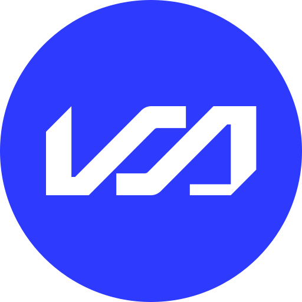
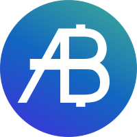

## Stats
Total cryptos: 829
## List
<table>
<tr>
  <th>Rank</th>
  <th>Logo</th>
  <th>Name</th>
  <th>Symbol</th>
  <th>Crypto ID</th>
  <th></th>
</tr>
<tr>
  <td rowspan="1">1</td>
  <td></td>
  <td>Bitcoin</td>
  <td>BTC</td>
  <td>bitcoin@bitcoin</td>
  <td>
    <a href="https://www.coingecko.com/en/coins/bitcoin">Coingecko</a> 
    <a href="https://coinmarketcap.com/currencies/bitcoin/">Coinmarketcap</a> 
  </td>
</tr>
<tr>
  <td rowspan="9">2</td>
  <td></td>
  <td>Ethereum</td>
  <td>ETH</td>
  <td>ethereum@ethereum</td>
  <td>
    <a href="https://www.coingecko.com/en/coins/ethereum">Coingecko</a> 
    <a href="https://coinmarketcap.com/currencies/ethereum/">Coinmarketcap</a> 
  </td>
</tr>
<tr>
  <td></td>
  <td>Optimism</td>
  <td>ETH</td>
  <td>ethereum@optimism</td>
  <td>
    <a href="https://www.coingecko.com/en/coins/ethereum">Coingecko</a> 
    <a href="https://coinmarketcap.com/currencies/ethereum/">Coinmarketcap</a> 
  </td>
</tr>
<tr>
  <td></td>
  <td>Base</td>
  <td>ETH</td>
  <td>ethereum@base</td>
  <td>
    <a href="https://www.coingecko.com/en/coins/ethereum">Coingecko</a> 
    <a href="https://coinmarketcap.com/currencies/ethereum/">Coinmarketcap</a> 
  </td>
</tr>
<tr>
  <td></td>
  <td>Arbitrum</td>
  <td>ETH</td>
  <td>ethereum@arbitrum</td>
  <td>
    <a href="https://www.coingecko.com/en/coins/ethereum">Coingecko</a> 
    <a href="https://coinmarketcap.com/currencies/ethereum/">Coinmarketcap</a> 
  </td>
</tr>
<tr>
  <td></td>
  <td>Ethereum</td>
  <td>ETH</td>
  <td>ethereum@avalanche-c-chain</td>
  <td>
    <a href="https://www.coingecko.com/en/coins/ethereum">Coingecko</a> 
    <a href="https://coinmarketcap.com/currencies/ethereum/">Coinmarketcap</a> 
  </td>
</tr>
<tr>
  <td></td>
  <td>Ethereum</td>
  <td>ETH</td>
  <td>ethereum@binance-smart-chain</td>
  <td>
    <a href="https://www.coingecko.com/en/coins/ethereum">Coingecko</a> 
    <a href="https://coinmarketcap.com/currencies/ethereum/">Coinmarketcap</a> 
    <a href="https://bscscan.com/token/0x2170ed0880ac9a755fd29b2688956bd959f933f8">BscScan</a> 
  </td>
</tr>
<tr>
  <td></td>
  <td>Ethereum</td>
  <td>ETH</td>
  <td>ethereum@near</td>
  <td>
    <a href="https://www.coingecko.com/en/coins/ethereum">Coingecko</a> 
    <a href="https://coinmarketcap.com/currencies/ethereum/">Coinmarketcap</a> 
  </td>
</tr>
<tr>
  <td></td>
  <td>Ethereum</td>
  <td>ETH</td>
  <td>ethereum@solana</td>
  <td>
    <a href="https://www.coingecko.com/en/coins/ethereum">Coingecko</a> 
    <a href="https://coinmarketcap.com/currencies/ethereum/">Coinmarketcap</a> 
  </td>
</tr>
<tr>
  <td></td>
  <td>Ethereum</td>
  <td>ETH</td>
  <td>ethereum@tezos</td>
  <td>
    <a href="https://www.coingecko.com/en/coins/ethereum">Coingecko</a> 
    <a href="https://coinmarketcap.com/currencies/ethereum/">Coinmarketcap</a> 
  </td>
</tr>
<tr>
  <td rowspan="2">3</td>
  <td></td>
  <td>XRP</td>
  <td>XRP</td>
  <td>xrp@ripple</td>
  <td>
    <a href="https://www.coingecko.com/en/coins/ripple">Coingecko</a> 
    <a href="https://coinmarketcap.com/currencies/xrp/">Coinmarketcap</a> 
  </td>
</tr>
<tr>
  <td></td>
  <td>XRP</td>
  <td>XRP</td>
  <td>xrp@binance-smart-chain</td>
  <td>
    <a href="https://www.coingecko.com/en/coins/ripple">Coingecko</a> 
    <a href="https://coinmarketcap.com/currencies/xrp/">Coinmarketcap</a> 
    <a href="https://bscscan.com/token/0x1d2f0da169ceb9fc7b3144628db156f3f6c60dbe">BscScan</a> 
  </td>
</tr>
<tr>
  <td rowspan="27">4</td>
  <td></td>
  <td>Tether</td>
  <td>USDT</td>
  <td>tether@algorand</td>
  <td>
    <a href="https://www.coingecko.com/en/coins/tether">Coingecko</a> 
    <a href="https://coinmarketcap.com/currencies/tether/">Coinmarketcap</a> 
  </td>
</tr>
<tr>
  <td></td>
  <td>Tether</td>
  <td>USDT</td>
  <td>tether@aptos</td>
  <td>
    <a href="https://www.coingecko.com/en/coins/tether">Coingecko</a> 
    <a href="https://coinmarketcap.com/currencies/tether/">Coinmarketcap</a> 
  </td>
</tr>
<tr>
  <td></td>
  <td>Tether</td>
  <td>USDT</td>
  <td>tether@arbitrum</td>
  <td>
    <a href="https://www.coingecko.com/en/coins/tether">Coingecko</a> 
    <a href="https://coinmarketcap.com/currencies/tether/">Coinmarketcap</a> 
  </td>
</tr>
<tr>
  <td></td>
  <td>Tether</td>
  <td>USDT</td>
  <td>tether@avalanche-c-chain</td>
  <td>
    <a href="https://www.coingecko.com/en/coins/tether">Coingecko</a> 
    <a href="https://coinmarketcap.com/currencies/tether/">Coinmarketcap</a> 
  </td>
</tr>
<tr>
  <td></td>
  <td>Tether</td>
  <td>USDT</td>
  <td>tether@base</td>
  <td>
    <a href="https://www.coingecko.com/en/coins/tether">Coingecko</a> 
    <a href="https://coinmarketcap.com/currencies/tether/">Coinmarketcap</a> 
  </td>
</tr>
<tr>
  <td></td>
  <td>Tether</td>
  <td>USDT</td>
  <td>tether@binance-smart-chain</td>
  <td>
    <a href="https://www.coingecko.com/en/coins/tether">Coingecko</a> 
    <a href="https://coinmarketcap.com/currencies/tether/">Coinmarketcap</a> 
    <a href="https://bscscan.com/token/0x55d398326f99059ff775485246999027b3197955">BscScan</a> 
  </td>
</tr>
<tr>
  <td></td>
  <td>Tether</td>
  <td>USDT</td>
  <td>tether@celo</td>
  <td>
    <a href="https://www.coingecko.com/en/coins/tether">Coingecko</a> 
    <a href="https://coinmarketcap.com/currencies/tether/">Coinmarketcap</a> 
  </td>
</tr>
<tr>
  <td></td>
  <td>Tether</td>
  <td>USDT</td>
  <td>tether@conflux</td>
  <td>
    <a href="https://www.coingecko.com/en/coins/tether">Coingecko</a> 
    <a href="https://coinmarketcap.com/currencies/tether/">Coinmarketcap</a> 
  </td>
</tr>
<tr>
  <td></td>
  <td>Tether</td>
  <td>USDT</td>
  <td>tether@cronos</td>
  <td>
    <a href="https://www.coingecko.com/en/coins/tether">Coingecko</a> 
    <a href="https://coinmarketcap.com/currencies/tether/">Coinmarketcap</a> 
  </td>
</tr>
<tr>
  <td></td>
  <td>Tether</td>
  <td>USDT</td>
  <td>tether@ethereum</td>
  <td>
    <a href="https://www.coingecko.com/en/coins/tether">Coingecko</a> 
    <a href="https://coinmarketcap.com/currencies/tether/">Coinmarketcap</a> 
    <a href="https://etherscan.io/token/0xdac17f958d2ee523a2206206994597c13d831ec7">EtherScan</a> 
  </td>
</tr>
<tr>
  <td></td>
  <td>Tether</td>
  <td>USDT</td>
  <td>tether@fantom</td>
  <td>
    <a href="https://www.coingecko.com/en/coins/tether">Coingecko</a> 
    <a href="https://coinmarketcap.com/currencies/tether/">Coinmarketcap</a> 
  </td>
</tr>
<tr>
  <td></td>
  <td>Tether</td>
  <td>USDT</td>
  <td>tether@harmony</td>
  <td>
    <a href="https://www.coingecko.com/en/coins/tether">Coingecko</a> 
    <a href="https://coinmarketcap.com/currencies/tether/">Coinmarketcap</a> 
  </td>
</tr>
<tr>
  <td></td>
  <td>Tether</td>
  <td>USDT</td>
  <td>tether@iotex</td>
  <td>
    <a href="https://www.coingecko.com/en/coins/tether">Coingecko</a> 
    <a href="https://coinmarketcap.com/currencies/tether/">Coinmarketcap</a> 
  </td>
</tr>
<tr>
  <td></td>
  <td>Tether</td>
  <td>USDT</td>
  <td>tether@mantle</td>
  <td>
    <a href="https://www.coingecko.com/en/coins/tether">Coingecko</a> 
    <a href="https://coinmarketcap.com/currencies/tether/">Coinmarketcap</a> 
  </td>
</tr>
<tr>
  <td></td>
  <td>Tether</td>
  <td>USDT</td>
  <td>tether@near</td>
  <td>
    <a href="https://www.coingecko.com/en/coins/tether">Coingecko</a> 
    <a href="https://coinmarketcap.com/currencies/tether/">Coinmarketcap</a> 
  </td>
</tr>
<tr>
  <td></td>
  <td>Tether</td>
  <td>USDT</td>
  <td>tether@optimism</td>
  <td>
    <a href="https://www.coingecko.com/en/coins/tether">Coingecko</a> 
    <a href="https://coinmarketcap.com/currencies/tether/">Coinmarketcap</a> 
  </td>
</tr>
<tr>
  <td></td>
  <td>Tether</td>
  <td>USDT</td>
  <td>tether@polygon</td>
  <td>
    <a href="https://www.coingecko.com/en/coins/tether">Coingecko</a> 
    <a href="https://coinmarketcap.com/currencies/tether/">Coinmarketcap</a> 
  </td>
</tr>
<tr>
  <td></td>
  <td>Tether</td>
  <td>USDT</td>
  <td>tether@sei</td>
  <td>
    <a href="https://www.coingecko.com/en/coins/tether">Coingecko</a> 
    <a href="https://coinmarketcap.com/currencies/tether/">Coinmarketcap</a> 
  </td>
</tr>
<tr>
  <td></td>
  <td>Tether</td>
  <td>USDT</td>
  <td>tether@solana</td>
  <td>
    <a href="https://www.coingecko.com/en/coins/tether">Coingecko</a> 
    <a href="https://coinmarketcap.com/currencies/tether/">Coinmarketcap</a> 
  </td>
</tr>
<tr>
  <td></td>
  <td>Tether</td>
  <td>USDT</td>
  <td>tether@sui</td>
  <td>
    <a href="https://www.coingecko.com/en/coins/tether">Coingecko</a> 
    <a href="https://coinmarketcap.com/currencies/tether/">Coinmarketcap</a> 
  </td>
</tr>
<tr>
  <td></td>
  <td>Tether</td>
  <td>USDT</td>
  <td>tether@terra</td>
  <td>
    <a href="https://www.coingecko.com/en/coins/tether">Coingecko</a> 
    <a href="https://coinmarketcap.com/currencies/tether/">Coinmarketcap</a> 
  </td>
</tr>
<tr>
  <td></td>
  <td>Tether</td>
  <td>USDT</td>
  <td>tether@tezos</td>
  <td>
    <a href="https://www.coingecko.com/en/coins/tether">Coingecko</a> 
    <a href="https://coinmarketcap.com/currencies/tether/">Coinmarketcap</a> 
  </td>
</tr>
<tr>
  <td></td>
  <td>Tether</td>
  <td>USDT</td>
  <td>tether@toncoin</td>
  <td>
    <a href="https://www.coingecko.com/en/coins/tether">Coingecko</a> 
    <a href="https://coinmarketcap.com/currencies/tether/">Coinmarketcap</a> 
  </td>
</tr>
<tr>
  <td></td>
  <td>Tether</td>
  <td>USDT</td>
  <td>tether@tron</td>
  <td>
    <a href="https://www.coingecko.com/en/coins/tether">Coingecko</a> 
    <a href="https://coinmarketcap.com/currencies/tether/">Coinmarketcap</a> 
  </td>
</tr>
<tr>
  <td></td>
  <td>Tether</td>
  <td>USDT</td>
  <td>tether@waves</td>
  <td>
    <a href="https://www.coingecko.com/en/coins/tether">Coingecko</a> 
    <a href="https://coinmarketcap.com/currencies/tether/">Coinmarketcap</a> 
  </td>
</tr>
<tr>
  <td></td>
  <td>Tether</td>
  <td>USDT</td>
  <td>tether@xdc-network</td>
  <td>
    <a href="https://www.coingecko.com/en/coins/tether">Coingecko</a> 
    <a href="https://coinmarketcap.com/currencies/tether/">Coinmarketcap</a> 
  </td>
</tr>
<tr>
  <td></td>
  <td>Tether</td>
  <td>USDT</td>
  <td>tether@zilliqa</td>
  <td>
    <a href="https://www.coingecko.com/en/coins/tether">Coingecko</a> 
    <a href="https://coinmarketcap.com/currencies/tether/">Coinmarketcap</a> 
  </td>
</tr>
<tr>
  <td rowspan="2">5</td>
  <td></td>
  <td>Binance Smart Chain</td>
  <td>BNB</td>
  <td>binance-coin@binance-smart-chain</td>
  <td>
    <a href="https://www.coingecko.com/en/coins/binancecoin">Coingecko</a> 
    <a href="https://coinmarketcap.com/currencies/bnb/">Coinmarketcap</a> 
  </td>
</tr>
<tr>
  <td></td>
  <td>Binance Chain</td>
  <td>BNB</td>
  <td>binance-coin@ethereum</td>
  <td>
    <a href="https://www.coingecko.com/en/coins/binancecoin">Coingecko</a> 
    <a href="https://coinmarketcap.com/currencies/bnb/">Coinmarketcap</a> 
    <a href="https://etherscan.io/token/0xb8c77482e45f1f44de1745f52c74426c631bdd52">EtherScan</a> 
  </td>
</tr>
<tr>
  <td rowspan="1">6</td>
  <td></td>
  <td>Solana</td>
  <td>SOL</td>
  <td>solana@solana</td>
  <td>
    <a href="https://www.coingecko.com/en/coins/solana">Coingecko</a> 
    <a href="https://coinmarketcap.com/currencies/solana/">Coinmarketcap</a> 
  </td>
</tr>
<tr>
  <td rowspan="27">7</td>
  <td></td>
  <td>USDC</td>
  <td>USDC</td>
  <td>usd-coin@algorand</td>
  <td>
    <a href="https://www.coingecko.com/en/coins/usd-coin">Coingecko</a> 
    <a href="https://coinmarketcap.com/currencies/usd-coin/">Coinmarketcap</a> 
  </td>
</tr>
<tr>
  <td></td>
  <td>USDC</td>
  <td>USDC</td>
  <td>usd-coin@aptos</td>
  <td>
    <a href="https://www.coingecko.com/en/coins/usd-coin">Coingecko</a> 
    <a href="https://coinmarketcap.com/currencies/usd-coin/">Coinmarketcap</a> 
  </td>
</tr>
<tr>
  <td></td>
  <td>USDC</td>
  <td>USDC</td>
  <td>usd-coin@arbitrum</td>
  <td>
    <a href="https://www.coingecko.com/en/coins/usd-coin">Coingecko</a> 
    <a href="https://coinmarketcap.com/currencies/usd-coin/">Coinmarketcap</a> 
  </td>
</tr>
<tr>
  <td></td>
  <td>USDC</td>
  <td>USDC</td>
  <td>usd-coin@avalanche-c-chain</td>
  <td>
    <a href="https://www.coingecko.com/en/coins/usd-coin">Coingecko</a> 
    <a href="https://coinmarketcap.com/currencies/usd-coin/">Coinmarketcap</a> 
  </td>
</tr>
<tr>
  <td></td>
  <td>USDC</td>
  <td>USDC</td>
  <td>usd-coin@base</td>
  <td>
    <a href="https://www.coingecko.com/en/coins/usd-coin">Coingecko</a> 
    <a href="https://coinmarketcap.com/currencies/usd-coin/">Coinmarketcap</a> 
  </td>
</tr>
<tr>
  <td></td>
  <td>USDC</td>
  <td>USDC</td>
  <td>usd-coin@binance-smart-chain</td>
  <td>
    <a href="https://www.coingecko.com/en/coins/usd-coin">Coingecko</a> 
    <a href="https://coinmarketcap.com/currencies/usd-coin/">Coinmarketcap</a> 
    <a href="https://bscscan.com/token/0x8ac76a51cc950d9822d68b83fe1ad97b32cd580d">BscScan</a> 
  </td>
</tr>
<tr>
  <td></td>
  <td>USDC</td>
  <td>USDC</td>
  <td>usd-coin@celo</td>
  <td>
    <a href="https://www.coingecko.com/en/coins/usd-coin">Coingecko</a> 
    <a href="https://coinmarketcap.com/currencies/usd-coin/">Coinmarketcap</a> 
  </td>
</tr>
<tr>
  <td></td>
  <td>USDC</td>
  <td>USDC</td>
  <td>usd-coin@conflux</td>
  <td>
    <a href="https://www.coingecko.com/en/coins/usd-coin">Coingecko</a> 
    <a href="https://coinmarketcap.com/currencies/usd-coin/">Coinmarketcap</a> 
  </td>
</tr>
<tr>
  <td></td>
  <td>USDC</td>
  <td>USDC</td>
  <td>usd-coin@cronos</td>
  <td>
    <a href="https://www.coingecko.com/en/coins/usd-coin">Coingecko</a> 
    <a href="https://coinmarketcap.com/currencies/usd-coin/">Coinmarketcap</a> 
  </td>
</tr>
<tr>
  <td></td>
  <td>USDC</td>
  <td>USDC</td>
  <td>usd-coin@ethereum</td>
  <td>
    <a href="https://www.coingecko.com/en/coins/usd-coin">Coingecko</a> 
    <a href="https://coinmarketcap.com/currencies/usd-coin/">Coinmarketcap</a> 
    <a href="https://etherscan.io/token/0xa0b86991c6218b36c1d19d4a2e9eb0ce3606eb48">EtherScan</a> 
  </td>
</tr>
<tr>
  <td></td>
  <td>USDC</td>
  <td>USDC</td>
  <td>usd-coin@harmony</td>
  <td>
    <a href="https://www.coingecko.com/en/coins/usd-coin">Coingecko</a> 
    <a href="https://coinmarketcap.com/currencies/usd-coin/">Coinmarketcap</a> 
  </td>
</tr>
<tr>
  <td></td>
  <td>USDC</td>
  <td>USDC</td>
  <td>usd-coin@hedera-hashgraph</td>
  <td>
    <a href="https://www.coingecko.com/en/coins/usd-coin">Coingecko</a> 
    <a href="https://coinmarketcap.com/currencies/usd-coin/">Coinmarketcap</a> 
  </td>
</tr>
<tr>
  <td></td>
  <td>USDC</td>
  <td>USDC</td>
  <td>usd-coin@iotex</td>
  <td>
    <a href="https://www.coingecko.com/en/coins/usd-coin">Coingecko</a> 
    <a href="https://coinmarketcap.com/currencies/usd-coin/">Coinmarketcap</a> 
  </td>
</tr>
<tr>
  <td></td>
  <td>USDC</td>
  <td>USDC</td>
  <td>usd-coin@kava</td>
  <td>
    <a href="https://www.coingecko.com/en/coins/usd-coin">Coingecko</a> 
    <a href="https://coinmarketcap.com/currencies/usd-coin/">Coinmarketcap</a> 
  </td>
</tr>
<tr>
  <td></td>
  <td>USDC</td>
  <td>USDC</td>
  <td>usd-coin@mantle</td>
  <td>
    <a href="https://www.coingecko.com/en/coins/usd-coin">Coingecko</a> 
    <a href="https://coinmarketcap.com/currencies/usd-coin/">Coinmarketcap</a> 
  </td>
</tr>
<tr>
  <td></td>
  <td>USDC</td>
  <td>USDC</td>
  <td>usd-coin@near</td>
  <td>
    <a href="https://www.coingecko.com/en/coins/usd-coin">Coingecko</a> 
    <a href="https://coinmarketcap.com/currencies/usd-coin/">Coinmarketcap</a> 
  </td>
</tr>
<tr>
  <td></td>
  <td>USDC</td>
  <td>USDC</td>
  <td>usd-coin@optimism</td>
  <td>
    <a href="https://www.coingecko.com/en/coins/usd-coin">Coingecko</a> 
    <a href="https://coinmarketcap.com/currencies/usd-coin/">Coinmarketcap</a> 
  </td>
</tr>
<tr>
  <td></td>
  <td>USDC</td>
  <td>USDC</td>
  <td>usd-coin@polygon</td>
  <td>
    <a href="https://www.coingecko.com/en/coins/usd-coin">Coingecko</a> 
    <a href="https://coinmarketcap.com/currencies/usd-coin/">Coinmarketcap</a> 
  </td>
</tr>
<tr>
  <td></td>
  <td>USDC</td>
  <td>USDC</td>
  <td>usd-coin@ripple</td>
  <td>
    <a href="https://www.coingecko.com/en/coins/usd-coin">Coingecko</a> 
    <a href="https://coinmarketcap.com/currencies/usd-coin/">Coinmarketcap</a> 
  </td>
</tr>
<tr>
  <td></td>
  <td>USDC</td>
  <td>USDC</td>
  <td>usd-coin@sei</td>
  <td>
    <a href="https://www.coingecko.com/en/coins/usd-coin">Coingecko</a> 
    <a href="https://coinmarketcap.com/currencies/usd-coin/">Coinmarketcap</a> 
  </td>
</tr>
<tr>
  <td></td>
  <td>USDC</td>
  <td>USDC</td>
  <td>usd-coin@solana</td>
  <td>
    <a href="https://www.coingecko.com/en/coins/usd-coin">Coingecko</a> 
    <a href="https://coinmarketcap.com/currencies/usd-coin/">Coinmarketcap</a> 
  </td>
</tr>
<tr>
  <td></td>
  <td>USDC</td>
  <td>USDC</td>
  <td>usd-coin@sonic</td>
  <td>
    <a href="https://www.coingecko.com/en/coins/usd-coin">Coingecko</a> 
    <a href="https://coinmarketcap.com/currencies/usd-coin/">Coinmarketcap</a> 
  </td>
</tr>
<tr>
  <td></td>
  <td>USDC</td>
  <td>USDC</td>
  <td>usd-coin@stellar</td>
  <td>
    <a href="https://www.coingecko.com/en/coins/usd-coin">Coingecko</a> 
    <a href="https://coinmarketcap.com/currencies/usd-coin/">Coinmarketcap</a> 
  </td>
</tr>
<tr>
  <td></td>
  <td>USDC</td>
  <td>USDC</td>
  <td>usd-coin@sui</td>
  <td>
    <a href="https://www.coingecko.com/en/coins/usd-coin">Coingecko</a> 
    <a href="https://coinmarketcap.com/currencies/usd-coin/">Coinmarketcap</a> 
  </td>
</tr>
<tr>
  <td></td>
  <td>USDC</td>
  <td>USDC</td>
  <td>usd-coin@terra</td>
  <td>
    <a href="https://www.coingecko.com/en/coins/usd-coin">Coingecko</a> 
    <a href="https://coinmarketcap.com/currencies/usd-coin/">Coinmarketcap</a> 
  </td>
</tr>
<tr>
  <td></td>
  <td>USDC</td>
  <td>USDC</td>
  <td>usd-coin@tron</td>
  <td>
    <a href="https://www.coingecko.com/en/coins/usd-coin">Coingecko</a> 
    <a href="https://coinmarketcap.com/currencies/usd-coin/">Coinmarketcap</a> 
  </td>
</tr>
<tr>
  <td></td>
  <td>USDC</td>
  <td>USDC</td>
  <td>usd-coin@waves</td>
  <td>
    <a href="https://www.coingecko.com/en/coins/usd-coin">Coingecko</a> 
    <a href="https://coinmarketcap.com/currencies/usd-coin/">Coinmarketcap</a> 
  </td>
</tr>
<tr>
  <td rowspan="2">8</td>
  <td></td>
  <td>Cardano</td>
  <td>ADA</td>
  <td>cardano@cardano</td>
  <td>
    <a href="https://www.coingecko.com/en/coins/cardano">Coingecko</a> 
    <a href="https://coinmarketcap.com/currencies/cardano/">Coinmarketcap</a> 
  </td>
</tr>
<tr>
  <td></td>
  <td>Cardano</td>
  <td>ADA</td>
  <td>cardano@binance-smart-chain</td>
  <td>
    <a href="https://www.coingecko.com/en/coins/cardano">Coingecko</a> 
    <a href="https://coinmarketcap.com/currencies/cardano/">Coinmarketcap</a> 
    <a href="https://bscscan.com/token/0x3ee2200efb3400fabb9aacf31297cbdd1d435d47">BscScan</a> 
  </td>
</tr>
<tr>
  <td rowspan="3">9</td>
  <td></td>
  <td>TRON</td>
  <td>TRX</td>
  <td>tron@tron</td>
  <td>
    <a href="https://www.coingecko.com/en/coins/tron">Coingecko</a> 
    <a href="https://coinmarketcap.com/currencies/tron/">Coinmarketcap</a> 
  </td>
</tr>
<tr>
  <td></td>
  <td>TRON</td>
  <td>TRX</td>
  <td>tron@binance-smart-chain</td>
  <td>
    <a href="https://www.coingecko.com/en/coins/tron">Coingecko</a> 
    <a href="https://coinmarketcap.com/currencies/tron/">Coinmarketcap</a> 
    <a href="https://bscscan.com/token/0xce7de646e7208a4ef112cb6ed5038fa6cc6b12e3">BscScan</a> 
  </td>
</tr>
<tr>
  <td></td>
  <td>TRON</td>
  <td>TRX</td>
  <td>tron@ethereum</td>
  <td>
    <a href="https://www.coingecko.com/en/coins/tron">Coingecko</a> 
    <a href="https://coinmarketcap.com/currencies/tron/">Coinmarketcap</a> 
    <a href="https://etherscan.io/token/0x50327c6c5a14dcade707abad2e27eb517df87ab5">EtherScan</a> 
  </td>
</tr>
<tr>
  <td rowspan="2">10</td>
  <td></td>
  <td>Dogecoin</td>
  <td>DOGE</td>
  <td>dogecoin@dogecoin</td>
  <td>
    <a href="https://www.coingecko.com/en/coins/dogecoin">Coingecko</a> 
    <a href="https://coinmarketcap.com/currencies/dogecoin/">Coinmarketcap</a> 
  </td>
</tr>
<tr>
  <td></td>
  <td>Dogecoin</td>
  <td>DOGE</td>
  <td>dogecoin@binance-smart-chain</td>
  <td>
    <a href="https://www.coingecko.com/en/coins/dogecoin">Coingecko</a> 
    <a href="https://coinmarketcap.com/currencies/dogecoin/">Coinmarketcap</a> 
    <a href="https://bscscan.com/token/0xba2ae424d960c26247dd6c32edc70b295c744c43">BscScan</a> 
  </td>
</tr>
<tr>
  <td rowspan="10">11</td>
  <td></td>
  <td>Chainlink</td>
  <td>LINK</td>
  <td>chainlink@arbitrum</td>
  <td>
    <a href="https://www.coingecko.com/en/coins/chainlink">Coingecko</a> 
    <a href="https://coinmarketcap.com/currencies/chainlink/">Coinmarketcap</a> 
  </td>
</tr>
<tr>
  <td></td>
  <td>Chainlink</td>
  <td>LINK</td>
  <td>chainlink@avalanche-c-chain</td>
  <td>
    <a href="https://www.coingecko.com/en/coins/chainlink">Coingecko</a> 
    <a href="https://coinmarketcap.com/currencies/chainlink/">Coinmarketcap</a> 
  </td>
</tr>
<tr>
  <td></td>
  <td>Chainlink</td>
  <td>LINK</td>
  <td>chainlink@binance-smart-chain</td>
  <td>
    <a href="https://www.coingecko.com/en/coins/chainlink">Coingecko</a> 
    <a href="https://coinmarketcap.com/currencies/chainlink/">Coinmarketcap</a> 
    <a href="https://bscscan.com/token/0xf8a0bf9cf54bb92f17374d9e9a321e6a111a51bd">BscScan</a> 
  </td>
</tr>
<tr>
  <td></td>
  <td>Chainlink</td>
  <td>LINK</td>
  <td>chainlink@ethereum</td>
  <td>
    <a href="https://www.coingecko.com/en/coins/chainlink">Coingecko</a> 
    <a href="https://coinmarketcap.com/currencies/chainlink/">Coinmarketcap</a> 
    <a href="https://etherscan.io/token/0x514910771af9ca656af840dff83e8264ecf986ca">EtherScan</a> 
  </td>
</tr>
<tr>
  <td></td>
  <td>Chainlink</td>
  <td>LINK</td>
  <td>chainlink@fantom</td>
  <td>
    <a href="https://www.coingecko.com/en/coins/chainlink">Coingecko</a> 
    <a href="https://coinmarketcap.com/currencies/chainlink/">Coinmarketcap</a> 
  </td>
</tr>
<tr>
  <td></td>
  <td>Chainlink</td>
  <td>LINK</td>
  <td>chainlink@near</td>
  <td>
    <a href="https://www.coingecko.com/en/coins/chainlink">Coingecko</a> 
    <a href="https://coinmarketcap.com/currencies/chainlink/">Coinmarketcap</a> 
  </td>
</tr>
<tr>
  <td></td>
  <td>Chainlink</td>
  <td>LINK</td>
  <td>chainlink@optimism</td>
  <td>
    <a href="https://www.coingecko.com/en/coins/chainlink">Coingecko</a> 
    <a href="https://coinmarketcap.com/currencies/chainlink/">Coinmarketcap</a> 
  </td>
</tr>
<tr>
  <td></td>
  <td>Chainlink</td>
  <td>LINK</td>
  <td>chainlink@polygon</td>
  <td>
    <a href="https://www.coingecko.com/en/coins/chainlink">Coingecko</a> 
    <a href="https://coinmarketcap.com/currencies/chainlink/">Coinmarketcap</a> 
  </td>
</tr>
<tr>
  <td></td>
  <td>Chainlink</td>
  <td>LINK</td>
  <td>chainlink@solana</td>
  <td>
    <a href="https://www.coingecko.com/en/coins/chainlink">Coingecko</a> 
    <a href="https://coinmarketcap.com/currencies/chainlink/">Coinmarketcap</a> 
  </td>
</tr>
<tr>
  <td></td>
  <td>Chainlink</td>
  <td>LINK</td>
  <td>chainlink@terra</td>
  <td>
    <a href="https://www.coingecko.com/en/coins/chainlink">Coingecko</a> 
    <a href="https://coinmarketcap.com/currencies/chainlink/">Coinmarketcap</a> 
  </td>
</tr>
<tr>
  <td rowspan="1">13</td>
  <td></td>
  <td>Stellar</td>
  <td>XLM</td>
  <td>stellar@stellar</td>
  <td>
    <a href="https://www.coingecko.com/en/coins/stellar">Coingecko</a> 
    <a href="https://coinmarketcap.com/currencies/stellar/">Coinmarketcap</a> 
  </td>
</tr>
<tr>
  <td rowspan="1">14</td>
  <td></td>
  <td>Sui</td>
  <td>SUI</td>
  <td>sui@sui</td>
  <td>
    <a href="https://www.coingecko.com/en/coins/sui">Coingecko</a> 
    <a href="https://coinmarketcap.com/currencies/sui/">Coinmarketcap</a> 
  </td>
</tr>
<tr>
  <td rowspan="7">15</td>
  <td></td>
  <td>Ethena USDe</td>
  <td>USDE</td>
  <td>ethena-usde@arbitrum</td>
  <td>
    <a href="https://www.coingecko.com/en/coins/ethena-usde">Coingecko</a> 
    <a href="https://coinmarketcap.com/currencies/ethena-usde/">Coinmarketcap</a> 
  </td>
</tr>
<tr>
  <td></td>
  <td>Ethena USDe</td>
  <td>USDE</td>
  <td>ethena-usde@base</td>
  <td>
    <a href="https://www.coingecko.com/en/coins/ethena-usde">Coingecko</a> 
    <a href="https://coinmarketcap.com/currencies/ethena-usde/">Coinmarketcap</a> 
  </td>
</tr>
<tr>
  <td></td>
  <td>Ethena USDe</td>
  <td>USDE</td>
  <td>ethena-usde@binance-smart-chain</td>
  <td>
    <a href="https://www.coingecko.com/en/coins/ethena-usde">Coingecko</a> 
    <a href="https://coinmarketcap.com/currencies/ethena-usde/">Coinmarketcap</a> 
    <a href="https://bscscan.com/token/0x5d3a1ff2b6bab83b63cd9ad0787074081a52ef34">BscScan</a> 
  </td>
</tr>
<tr>
  <td></td>
  <td>Ethena USDe</td>
  <td>USDE</td>
  <td>ethena-usde@ethereum</td>
  <td>
    <a href="https://www.coingecko.com/en/coins/ethena-usde">Coingecko</a> 
    <a href="https://coinmarketcap.com/currencies/ethena-usde/">Coinmarketcap</a> 
    <a href="https://etherscan.io/token/0x4c9edd5852cd905f086c759e8383e09bff1e68b3">EtherScan</a> 
  </td>
</tr>
<tr>
  <td></td>
  <td>Ethena USDe</td>
  <td>USDE</td>
  <td>ethena-usde@kava</td>
  <td>
    <a href="https://www.coingecko.com/en/coins/ethena-usde">Coingecko</a> 
    <a href="https://coinmarketcap.com/currencies/ethena-usde/">Coinmarketcap</a> 
  </td>
</tr>
<tr>
  <td></td>
  <td>Ethena USDe</td>
  <td>USDE</td>
  <td>ethena-usde@mantle</td>
  <td>
    <a href="https://www.coingecko.com/en/coins/ethena-usde">Coingecko</a> 
    <a href="https://coinmarketcap.com/currencies/ethena-usde/">Coinmarketcap</a> 
  </td>
</tr>
<tr>
  <td></td>
  <td>Ethena USDe</td>
  <td>USDE</td>
  <td>ethena-usde@optimism</td>
  <td>
    <a href="https://www.coingecko.com/en/coins/ethena-usde">Coingecko</a> 
    <a href="https://coinmarketcap.com/currencies/ethena-usde/">Coinmarketcap</a> 
  </td>
</tr>
<tr>
  <td rowspan="2">16</td>
  <td></td>
  <td>Bitcoin Cash</td>
  <td>BCH</td>
  <td>bitcoin-cash@bitcoin-cash</td>
  <td>
    <a href="https://www.coingecko.com/en/coins/bitcoin-cash">Coingecko</a> 
    <a href="https://coinmarketcap.com/currencies/bitcoin-cash/">Coinmarketcap</a> 
  </td>
</tr>
<tr>
  <td></td>
  <td>Bitcoin Cash</td>
  <td>BCH</td>
  <td>bitcoin-cash@binance-smart-chain</td>
  <td>
    <a href="https://www.coingecko.com/en/coins/bitcoin-cash">Coingecko</a> 
    <a href="https://coinmarketcap.com/currencies/bitcoin-cash/">Coinmarketcap</a> 
    <a href="https://bscscan.com/token/0x8ff795a6f4d97e7887c79bea79aba5cc76444adf">BscScan</a> 
  </td>
</tr>
<tr>
  <td rowspan="1">17</td>
  <td></td>
  <td>Hedera</td>
  <td>HBAR</td>
  <td>hedera-hashgraph@hedera-hashgraph</td>
  <td>
    <a href="https://www.coingecko.com/en/coins/hedera-hashgraph">Coingecko</a> 
    <a href="https://coinmarketcap.com/currencies/hedera/">Coinmarketcap</a> 
  </td>
</tr>
<tr>
  <td rowspan="3">18</td>
  <td></td>
  <td>Avalanche X Chain</td>
  <td>AVAX</td>
  <td>avalanche@avalanche-x-chain</td>
  <td>
    <a href="https://www.coingecko.com/en/coins/avalanche-2">Coingecko</a> 
    <a href="https://coinmarketcap.com/currencies/avalanche/">Coinmarketcap</a> 
  </td>
</tr>
<tr>
  <td></td>
  <td>Avalanche</td>
  <td>AVAX</td>
  <td>avalanche@avalanche-c-chain</td>
  <td>
    <a href="https://www.coingecko.com/en/coins/avalanche-2">Coingecko</a> 
    <a href="https://coinmarketcap.com/currencies/avalanche/">Coinmarketcap</a> 
  </td>
</tr>
<tr>
  <td></td>
  <td>Avalanche</td>
  <td>AVAX</td>
  <td>avalanche@binance-smart-chain</td>
  <td>
    <a href="https://www.coingecko.com/en/coins/avalanche-2">Coingecko</a> 
    <a href="https://coinmarketcap.com/currencies/avalanche/">Coinmarketcap</a> 
    <a href="https://bscscan.com/token/0x1ce0c2827e2ef14d5c4f29a091d735a204794041">BscScan</a> 
  </td>
</tr>
<tr>
  <td rowspan="2">19</td>
  <td></td>
  <td>Litecoin</td>
  <td>LTC</td>
  <td>litecoin@litecoin</td>
  <td>
    <a href="https://www.coingecko.com/en/coins/litecoin">Coingecko</a> 
    <a href="https://coinmarketcap.com/currencies/litecoin/">Coinmarketcap</a> 
  </td>
</tr>
<tr>
  <td></td>
  <td>Litecoin</td>
  <td>LTC</td>
  <td>litecoin@binance-smart-chain</td>
  <td>
    <a href="https://www.coingecko.com/en/coins/litecoin">Coingecko</a> 
    <a href="https://coinmarketcap.com/currencies/litecoin/">Coinmarketcap</a> 
    <a href="https://bscscan.com/token/0x4338665cbb7b2485a8855a139b75d5e34ab0db94">BscScan</a> 
  </td>
</tr>
<tr>
  <td rowspan="1">20</td>
  <td></td>
  <td>UNUS SED LEO</td>
  <td>LEO</td>
  <td>leo-token@ethereum</td>
  <td>
    <a href="https://www.coingecko.com/en/coins/leo-token">Coingecko</a> 
    <a href="https://coinmarketcap.com/currencies/unus-sed-leo/">Coinmarketcap</a> 
    <a href="https://etherscan.io/token/0x2af5d2ad76741191d15dfe7bf6ac92d4bd912ca3">EtherScan</a> 
  </td>
</tr>
<tr>
  <td rowspan="3">21</td>
  <td></td>
  <td>Toncoin</td>
  <td>TON</td>
  <td>toncoin@toncoin</td>
  <td>
    <a href="https://www.coingecko.com/en/coins/the-open-network">Coingecko</a> 
    <a href="https://coinmarketcap.com/currencies/toncoin/">Coinmarketcap</a> 
  </td>
</tr>
<tr>
  <td></td>
  <td>Toncoin</td>
  <td>TON</td>
  <td>toncoin@binance-smart-chain</td>
  <td>
    <a href="https://www.coingecko.com/en/coins/the-open-network">Coingecko</a> 
    <a href="https://coinmarketcap.com/currencies/toncoin/">Coinmarketcap</a> 
    <a href="https://bscscan.com/token/0x76a797a59ba2c17726896976b7b3747bfd1d220f">BscScan</a> 
  </td>
</tr>
<tr>
  <td></td>
  <td>Toncoin</td>
  <td>TON</td>
  <td>toncoin@ethereum</td>
  <td>
    <a href="https://www.coingecko.com/en/coins/the-open-network">Coingecko</a> 
    <a href="https://coinmarketcap.com/currencies/toncoin/">Coinmarketcap</a> 
    <a href="https://etherscan.io/token/0x582d872a1b094fc48f5de31d3b73f2d9be47def1">EtherScan</a> 
  </td>
</tr>
<tr>
  <td rowspan="2">22</td>
  <td></td>
  <td>Shiba Inu</td>
  <td>SHIB</td>
  <td>shiba-inu@binance-smart-chain</td>
  <td>
    <a href="https://www.coingecko.com/en/coins/shiba-inu">Coingecko</a> 
    <a href="https://coinmarketcap.com/currencies/shiba-inu/">Coinmarketcap</a> 
    <a href="https://bscscan.com/token/0x2859e4544c4bb03966803b044a93563bd2d0dd4d">BscScan</a> 
  </td>
</tr>
<tr>
  <td></td>
  <td>Shiba Inu</td>
  <td>SHIB</td>
  <td>shiba-inu@ethereum</td>
  <td>
    <a href="https://www.coingecko.com/en/coins/shiba-inu">Coingecko</a> 
    <a href="https://coinmarketcap.com/currencies/shiba-inu/">Coinmarketcap</a> 
    <a href="https://etherscan.io/token/0x95ad61b0a150d79219dcf64e1e6cc01f0b64c4ce">EtherScan</a> 
  </td>
</tr>
<tr>
  <td rowspan="8">23</td>
  <td></td>
  <td>Uniswap</td>
  <td>UNI</td>
  <td>uniswap@arbitrum</td>
  <td>
    <a href="https://www.coingecko.com/en/coins/uniswap">Coingecko</a> 
    <a href="https://coinmarketcap.com/currencies/uniswap/">Coinmarketcap</a> 
  </td>
</tr>
<tr>
  <td></td>
  <td>Uniswap</td>
  <td>UNI</td>
  <td>uniswap@avalanche-c-chain</td>
  <td>
    <a href="https://www.coingecko.com/en/coins/uniswap">Coingecko</a> 
    <a href="https://coinmarketcap.com/currencies/uniswap/">Coinmarketcap</a> 
  </td>
</tr>
<tr>
  <td></td>
  <td>Uniswap</td>
  <td>UNI</td>
  <td>uniswap@binance-smart-chain</td>
  <td>
    <a href="https://www.coingecko.com/en/coins/uniswap">Coingecko</a> 
    <a href="https://coinmarketcap.com/currencies/uniswap/">Coinmarketcap</a> 
    <a href="https://bscscan.com/token/0xbf5140a22578168fd562dccf235e5d43a02ce9b1">BscScan</a> 
  </td>
</tr>
<tr>
  <td></td>
  <td>Uniswap</td>
  <td>UNI</td>
  <td>uniswap@ethereum</td>
  <td>
    <a href="https://www.coingecko.com/en/coins/uniswap">Coingecko</a> 
    <a href="https://coinmarketcap.com/currencies/uniswap/">Coinmarketcap</a> 
    <a href="https://etherscan.io/token/0x1f9840a85d5af5bf1d1762f925bdaddc4201f984">EtherScan</a> 
  </td>
</tr>
<tr>
  <td></td>
  <td>Uniswap</td>
  <td>UNI</td>
  <td>uniswap@near</td>
  <td>
    <a href="https://www.coingecko.com/en/coins/uniswap">Coingecko</a> 
    <a href="https://coinmarketcap.com/currencies/uniswap/">Coinmarketcap</a> 
  </td>
</tr>
<tr>
  <td></td>
  <td>Uniswap</td>
  <td>UNI</td>
  <td>uniswap@polygon</td>
  <td>
    <a href="https://www.coingecko.com/en/coins/uniswap">Coingecko</a> 
    <a href="https://coinmarketcap.com/currencies/uniswap/">Coinmarketcap</a> 
  </td>
</tr>
<tr>
  <td></td>
  <td>Uniswap</td>
  <td>UNI</td>
  <td>uniswap@solana</td>
  <td>
    <a href="https://www.coingecko.com/en/coins/uniswap">Coingecko</a> 
    <a href="https://coinmarketcap.com/currencies/uniswap/">Coinmarketcap</a> 
  </td>
</tr>
<tr>
  <td></td>
  <td>Uniswap</td>
  <td>UNI</td>
  <td>uniswap@terra</td>
  <td>
    <a href="https://www.coingecko.com/en/coins/uniswap">Coingecko</a> 
    <a href="https://coinmarketcap.com/currencies/uniswap/">Coinmarketcap</a> 
  </td>
</tr>
<tr>
  <td rowspan="6">24</td>
  <td></td>
  <td>Polkadot</td>
  <td>DOT</td>
  <td>polkadot@polkadot</td>
  <td>
    <a href="https://www.coingecko.com/en/coins/polkadot">Coingecko</a> 
    <a href="https://coinmarketcap.com/currencies/polkadot-new/">Coinmarketcap</a> 
  </td>
</tr>
<tr>
  <td></td>
  <td>Polkadot</td>
  <td>DOT</td>
  <td>polkadot@arbitrum</td>
  <td>
    <a href="https://www.coingecko.com/en/coins/polkadot">Coingecko</a> 
    <a href="https://coinmarketcap.com/currencies/polkadot-new/">Coinmarketcap</a> 
  </td>
</tr>
<tr>
  <td></td>
  <td>Polkadot</td>
  <td>DOT</td>
  <td>polkadot@base</td>
  <td>
    <a href="https://www.coingecko.com/en/coins/polkadot">Coingecko</a> 
    <a href="https://coinmarketcap.com/currencies/polkadot-new/">Coinmarketcap</a> 
  </td>
</tr>
<tr>
  <td></td>
  <td>Polkadot</td>
  <td>DOT</td>
  <td>polkadot@binance-smart-chain</td>
  <td>
    <a href="https://www.coingecko.com/en/coins/polkadot">Coingecko</a> 
    <a href="https://coinmarketcap.com/currencies/polkadot-new/">Coinmarketcap</a> 
    <a href="https://bscscan.com/token/0x7083609fce4d1d8dc0c979aab8c869ea2c873402">BscScan</a> 
  </td>
</tr>
<tr>
  <td></td>
  <td>Polkadot</td>
  <td>DOT</td>
  <td>polkadot@ethereum</td>
  <td>
    <a href="https://www.coingecko.com/en/coins/polkadot">Coingecko</a> 
    <a href="https://coinmarketcap.com/currencies/polkadot-new/">Coinmarketcap</a> 
    <a href="https://etherscan.io/token/0x8d010bf9c26881788b4e6bf5fd1bdc358c8f90b8">EtherScan</a> 
  </td>
</tr>
<tr>
  <td></td>
  <td>Polkadot</td>
  <td>DOT</td>
  <td>polkadot@optimism</td>
  <td>
    <a href="https://www.coingecko.com/en/coins/polkadot">Coingecko</a> 
    <a href="https://coinmarketcap.com/currencies/polkadot-new/">Coinmarketcap</a> 
  </td>
</tr>
<tr>
  <td rowspan="13">25</td>
  <td></td>
  <td>Dai</td>
  <td>DAI</td>
  <td>dai@arbitrum</td>
  <td>
    <a href="https://www.coingecko.com/en/coins/dai">Coingecko</a> 
    <a href="https://coinmarketcap.com/currencies/multi-collateral-dai/">Coinmarketcap</a> 
  </td>
</tr>
<tr>
  <td></td>
  <td>Dai</td>
  <td>DAI</td>
  <td>dai@avalanche-c-chain</td>
  <td>
    <a href="https://www.coingecko.com/en/coins/dai">Coingecko</a> 
    <a href="https://coinmarketcap.com/currencies/multi-collateral-dai/">Coinmarketcap</a> 
  </td>
</tr>
<tr>
  <td></td>
  <td>Dai</td>
  <td>DAI</td>
  <td>dai@binance-smart-chain</td>
  <td>
    <a href="https://www.coingecko.com/en/coins/dai">Coingecko</a> 
    <a href="https://coinmarketcap.com/currencies/multi-collateral-dai/">Coinmarketcap</a> 
    <a href="https://bscscan.com/token/0x1af3f329e8be154074d8769d1ffa4ee058b1dbc3">BscScan</a> 
  </td>
</tr>
<tr>
  <td></td>
  <td>Dai</td>
  <td>DAI</td>
  <td>dai@cronos</td>
  <td>
    <a href="https://www.coingecko.com/en/coins/dai">Coingecko</a> 
    <a href="https://coinmarketcap.com/currencies/multi-collateral-dai/">Coinmarketcap</a> 
  </td>
</tr>
<tr>
  <td></td>
  <td>Dai</td>
  <td>DAI</td>
  <td>dai@ethereum</td>
  <td>
    <a href="https://www.coingecko.com/en/coins/dai">Coingecko</a> 
    <a href="https://coinmarketcap.com/currencies/multi-collateral-dai/">Coinmarketcap</a> 
    <a href="https://etherscan.io/token/0x6b175474e89094c44da98b954eedeac495271d0f">EtherScan</a> 
  </td>
</tr>
<tr>
  <td></td>
  <td>Dai</td>
  <td>DAI</td>
  <td>dai@fantom</td>
  <td>
    <a href="https://www.coingecko.com/en/coins/dai">Coingecko</a> 
    <a href="https://coinmarketcap.com/currencies/multi-collateral-dai/">Coinmarketcap</a> 
  </td>
</tr>
<tr>
  <td></td>
  <td>Dai</td>
  <td>DAI</td>
  <td>dai@harmony</td>
  <td>
    <a href="https://www.coingecko.com/en/coins/dai">Coingecko</a> 
    <a href="https://coinmarketcap.com/currencies/multi-collateral-dai/">Coinmarketcap</a> 
  </td>
</tr>
<tr>
  <td></td>
  <td>Dai</td>
  <td>DAI</td>
  <td>dai@near</td>
  <td>
    <a href="https://www.coingecko.com/en/coins/dai">Coingecko</a> 
    <a href="https://coinmarketcap.com/currencies/multi-collateral-dai/">Coinmarketcap</a> 
  </td>
</tr>
<tr>
  <td></td>
  <td>Dai</td>
  <td>DAI</td>
  <td>dai@optimism</td>
  <td>
    <a href="https://www.coingecko.com/en/coins/dai">Coingecko</a> 
    <a href="https://coinmarketcap.com/currencies/multi-collateral-dai/">Coinmarketcap</a> 
  </td>
</tr>
<tr>
  <td></td>
  <td>Dai</td>
  <td>DAI</td>
  <td>dai@polygon</td>
  <td>
    <a href="https://www.coingecko.com/en/coins/dai">Coingecko</a> 
    <a href="https://coinmarketcap.com/currencies/multi-collateral-dai/">Coinmarketcap</a> 
  </td>
</tr>
<tr>
  <td></td>
  <td>Dai</td>
  <td>DAI</td>
  <td>dai@solana</td>
  <td>
    <a href="https://www.coingecko.com/en/coins/dai">Coingecko</a> 
    <a href="https://coinmarketcap.com/currencies/multi-collateral-dai/">Coinmarketcap</a> 
  </td>
</tr>
<tr>
  <td></td>
  <td>Dai</td>
  <td>DAI</td>
  <td>dai@terra</td>
  <td>
    <a href="https://www.coingecko.com/en/coins/dai">Coingecko</a> 
    <a href="https://coinmarketcap.com/currencies/multi-collateral-dai/">Coinmarketcap</a> 
  </td>
</tr>
<tr>
  <td></td>
  <td>Dai</td>
  <td>DAI</td>
  <td>dai@toncoin</td>
  <td>
    <a href="https://www.coingecko.com/en/coins/dai">Coingecko</a> 
    <a href="https://coinmarketcap.com/currencies/multi-collateral-dai/">Coinmarketcap</a> 
  </td>
</tr>
<tr>
  <td rowspan="1">26</td>
  <td></td>
  <td>Bitget Token</td>
  <td>BGB</td>
  <td>bitget-token@ethereum</td>
  <td>
    <a href="https://www.coingecko.com/en/coins/bitget-token">Coingecko</a> 
    <a href="https://coinmarketcap.com/currencies/bitget-token-new/">Coinmarketcap</a> 
    <a href="https://etherscan.io/token/0x54d2252757e1672eead234d27b1270728ff90581">EtherScan</a> 
  </td>
</tr>
<tr>
  <td rowspan="1">27</td>
  <td></td>
  <td>Monero</td>
  <td>XMR</td>
  <td>monero@monero</td>
  <td>
    <a href="https://www.coingecko.com/en/coins/monero">Coingecko</a> 
    <a href="https://coinmarketcap.com/currencies/monero/">Coinmarketcap</a> 
  </td>
</tr>
<tr>
  <td rowspan="3">28</td>
  <td></td>
  <td>Cronos</td>
  <td>CRO</td>
  <td>crypto-com-coin@cronos</td>
  <td>
    <a href="https://www.coingecko.com/en/coins/crypto-com-chain">Coingecko</a> 
    <a href="https://coinmarketcap.com/currencies/cronos/">Coinmarketcap</a> 
  </td>
</tr>
<tr>
  <td></td>
  <td>Cronos</td>
  <td>CRO</td>
  <td>crypto-com-coin@ethereum</td>
  <td>
    <a href="https://www.coingecko.com/en/coins/crypto-com-chain">Coingecko</a> 
    <a href="https://coinmarketcap.com/currencies/cronos/">Coinmarketcap</a> 
    <a href="https://etherscan.io/token/0xa0b73e1ff0b80914ab6fe0444e65848c4c34450b">EtherScan</a> 
  </td>
</tr>
<tr>
  <td></td>
  <td>Cronos</td>
  <td>CRO</td>
  <td>crypto-com-coin@solana</td>
  <td>
    <a href="https://www.coingecko.com/en/coins/crypto-com-chain">Coingecko</a> 
    <a href="https://coinmarketcap.com/currencies/cronos/">Coinmarketcap</a> 
  </td>
</tr>
<tr>
  <td rowspan="2">29</td>
  <td></td>
  <td>Mantle</td>
  <td>MNT</td>
  <td>mantle@mantle</td>
  <td>
    <a href="https://www.coingecko.com/en/coins/mantle">Coingecko</a> 
    <a href="https://coinmarketcap.com/currencies/mantle/">Coinmarketcap</a> 
  </td>
</tr>
<tr>
  <td></td>
  <td>Mantle</td>
  <td>MNT</td>
  <td>mantle@ethereum</td>
  <td>
    <a href="https://www.coingecko.com/en/coins/mantle">Coingecko</a> 
    <a href="https://coinmarketcap.com/currencies/mantle/">Coinmarketcap</a> 
    <a href="https://etherscan.io/token/0x3c3a81e81dc49a522a592e7622a7e711c06bf354">EtherScan</a> 
  </td>
</tr>
<tr>
  <td rowspan="1">30</td>
  <td></td>
  <td>Pepe</td>
  <td>PEPE</td>
  <td>pepe@ethereum</td>
  <td>
    <a href="https://www.coingecko.com/en/coins/pepe">Coingecko</a> 
    <a href="https://coinmarketcap.com/currencies/pepe/">Coinmarketcap</a> 
    <a href="https://etherscan.io/token/0x6982508145454ce325ddbe47a25d4ec3d2311933">EtherScan</a> 
  </td>
</tr>
<tr>
  <td rowspan="8">31</td>
  <td></td>
  <td>Aave</td>
  <td>AAVE</td>
  <td>aave@arbitrum</td>
  <td>
    <a href="https://www.coingecko.com/en/coins/aave">Coingecko</a> 
    <a href="https://coinmarketcap.com/currencies/aave/">Coinmarketcap</a> 
  </td>
</tr>
<tr>
  <td></td>
  <td>Aave</td>
  <td>AAVE</td>
  <td>aave@avalanche-c-chain</td>
  <td>
    <a href="https://www.coingecko.com/en/coins/aave">Coingecko</a> 
    <a href="https://coinmarketcap.com/currencies/aave/">Coinmarketcap</a> 
  </td>
</tr>
<tr>
  <td></td>
  <td>Aave</td>
  <td>AAVE</td>
  <td>aave@binance-smart-chain</td>
  <td>
    <a href="https://www.coingecko.com/en/coins/aave">Coingecko</a> 
    <a href="https://coinmarketcap.com/currencies/aave/">Coinmarketcap</a> 
    <a href="https://bscscan.com/token/0xfb6115445bff7b52feb98650c87f44907e58f802">BscScan</a> 
  </td>
</tr>
<tr>
  <td></td>
  <td>Aave</td>
  <td>AAVE</td>
  <td>aave@ethereum</td>
  <td>
    <a href="https://www.coingecko.com/en/coins/aave">Coingecko</a> 
    <a href="https://coinmarketcap.com/currencies/aave/">Coinmarketcap</a> 
    <a href="https://etherscan.io/token/0x7fc66500c84a76ad7e9c93437bfc5ac33e2ddae9">EtherScan</a> 
  </td>
</tr>
<tr>
  <td></td>
  <td>Aave</td>
  <td>AAVE</td>
  <td>aave@fantom</td>
  <td>
    <a href="https://www.coingecko.com/en/coins/aave">Coingecko</a> 
    <a href="https://coinmarketcap.com/currencies/aave/">Coinmarketcap</a> 
  </td>
</tr>
<tr>
  <td></td>
  <td>Aave</td>
  <td>AAVE</td>
  <td>aave@near</td>
  <td>
    <a href="https://www.coingecko.com/en/coins/aave">Coingecko</a> 
    <a href="https://coinmarketcap.com/currencies/aave/">Coinmarketcap</a> 
  </td>
</tr>
<tr>
  <td></td>
  <td>Aave</td>
  <td>AAVE</td>
  <td>aave@polygon</td>
  <td>
    <a href="https://www.coingecko.com/en/coins/aave">Coingecko</a> 
    <a href="https://coinmarketcap.com/currencies/aave/">Coinmarketcap</a> 
  </td>
</tr>
<tr>
  <td></td>
  <td>Aave</td>
  <td>AAVE</td>
  <td>aave@solana</td>
  <td>
    <a href="https://www.coingecko.com/en/coins/aave">Coingecko</a> 
    <a href="https://coinmarketcap.com/currencies/aave/">Coinmarketcap</a> 
  </td>
</tr>
<tr>
  <td rowspan="1">32</td>
  <td></td>
  <td>Ethena</td>
  <td>ENA</td>
  <td>ethena@ethereum</td>
  <td>
    <a href="https://www.coingecko.com/en/coins/ethena">Coingecko</a> 
    <a href="https://coinmarketcap.com/currencies/ethena/">Coinmarketcap</a> 
    <a href="https://etherscan.io/token/0x57e114b691db790c35207b2e685d4a43181e6061">EtherScan</a> 
  </td>
</tr>
<tr>
  <td rowspan="2">34</td>
  <td></td>
  <td>Ethereum Classic</td>
  <td>ETC</td>
  <td>ethereum-classic@ethereum-classic</td>
  <td>
    <a href="https://www.coingecko.com/en/coins/ethereum-classic">Coingecko</a> 
    <a href="https://coinmarketcap.com/currencies/ethereum-classic/">Coinmarketcap</a> 
  </td>
</tr>
<tr>
  <td></td>
  <td>Ethereum Classic</td>
  <td>ETC</td>
  <td>ethereum-classic@binance-smart-chain</td>
  <td>
    <a href="https://www.coingecko.com/en/coins/ethereum-classic">Coingecko</a> 
    <a href="https://coinmarketcap.com/currencies/ethereum-classic/">Coinmarketcap</a> 
    <a href="https://bscscan.com/token/0x3d6545b08693dae087e957cb1180ee38b9e3c25e">BscScan</a> 
  </td>
</tr>
<tr>
  <td rowspan="2">35</td>
  <td></td>
  <td>NEAR Protocol</td>
  <td>NEAR</td>
  <td>near@near</td>
  <td>
    <a href="https://www.coingecko.com/en/coins/near">Coingecko</a> 
    <a href="https://coinmarketcap.com/currencies/near-protocol/">Coinmarketcap</a> 
  </td>
</tr>
<tr>
  <td></td>
  <td>NEAR Protocol</td>
  <td>NEAR</td>
  <td>near@binance-smart-chain</td>
  <td>
    <a href="https://www.coingecko.com/en/coins/near">Coingecko</a> 
    <a href="https://coinmarketcap.com/currencies/near-protocol/">Coinmarketcap</a> 
    <a href="https://bscscan.com/token/0x1fa4a73a3f0133f0025378af00236f3abdee5d63">BscScan</a> 
  </td>
</tr>
<tr>
  <td rowspan="1">36</td>
  <td></td>
  <td>Aptos</td>
  <td>APT</td>
  <td>aptos@aptos</td>
  <td>
    <a href="https://www.coingecko.com/en/coins/aptos">Coingecko</a> 
    <a href="https://coinmarketcap.com/currencies/aptos/">Coinmarketcap</a> 
  </td>
</tr>
<tr>
  <td rowspan="1">37</td>
  <td></td>
  <td>Ondo</td>
  <td>ONDO</td>
  <td>ondo@ethereum</td>
  <td>
    <a href="https://www.coingecko.com/en/coins/ondo-finance">Coingecko</a> 
    <a href="https://coinmarketcap.com/currencies/ondo-finance/">Coinmarketcap</a> 
    <a href="https://etherscan.io/token/0xfaba6f8e4a5e8ab82f62fe7c39859fa577269be3">EtherScan</a> 
  </td>
</tr>
<tr>
  <td rowspan="1">38</td>
  <td></td>
  <td>Internet Computer</td>
  <td>ICP</td>
  <td>internet-computer@internet-computer</td>
  <td>
    <a href="https://www.coingecko.com/en/coins/internet-computer">Coingecko</a> 
    <a href="https://coinmarketcap.com/currencies/internet-computer/">Coinmarketcap</a> 
  </td>
</tr>
<tr>
  <td rowspan="1">39</td>
  <td></td>
  <td>Pi</td>
  <td>PI</td>
  <td>pi@pi</td>
  <td>
    <a href="https://www.coingecko.com/en/coins/pi-network">Coingecko</a> 
    <a href="https://coinmarketcap.com/currencies/pi/">Coinmarketcap</a> 
  </td>
</tr>
<tr>
  <td rowspan="1">40</td>
  <td></td>
  <td>OKB</td>
  <td>OKB</td>
  <td>okb@ethereum</td>
  <td>
    <a href="https://www.coingecko.com/en/coins/okb">Coingecko</a> 
    <a href="https://coinmarketcap.com/currencies/okb/">Coinmarketcap</a> 
    <a href="https://etherscan.io/token/0x75231f58b43240c9718dd58b4967c5114342a86c">EtherScan</a> 
  </td>
</tr>
<tr>
  <td rowspan="2">41</td>
  <td></td>
  <td>Polygon</td>
  <td>POL</td>
  <td>polygon@polygon</td>
  <td>
    <a href="https://www.coingecko.com/en/coins/polygon-ecosystem-token">Coingecko</a> 
    <a href="https://coinmarketcap.com/currencies/polygon-ecosystem-token/">Coinmarketcap</a> 
  </td>
</tr>
<tr>
  <td></td>
  <td>Polygon</td>
  <td>POL</td>
  <td>polygon@ethereum</td>
  <td>
    <a href="https://www.coingecko.com/en/coins/polygon-ecosystem-token">Coingecko</a> 
    <a href="https://coinmarketcap.com/currencies/polygon-ecosystem-token/">Coinmarketcap</a> 
    <a href="https://etherscan.io/token/0x455e53cbb86018ac2b8092fdcd39d8444affc3f6">EtherScan</a> 
  </td>
</tr>
<tr>
  <td rowspan="2">42</td>
  <td></td>
  <td>Arbitrum</td>
  <td>ARB</td>
  <td>arbitrum@arbitrum</td>
  <td>
    <a href="https://www.coingecko.com/en/coins/arbitrum">Coingecko</a> 
    <a href="https://coinmarketcap.com/currencies/arbitrum/">Coinmarketcap</a> 
  </td>
</tr>
<tr>
  <td></td>
  <td>Arbitrum</td>
  <td>ARB</td>
  <td>arbitrum@ethereum</td>
  <td>
    <a href="https://www.coingecko.com/en/coins/arbitrum">Coingecko</a> 
    <a href="https://coinmarketcap.com/currencies/arbitrum/">Coinmarketcap</a> 
    <a href="https://etherscan.io/token/0xb50721bcf8d664c30412cfbc6cf7a15145234ad1">EtherScan</a> 
  </td>
</tr>
<tr>
  <td rowspan="1">43</td>
  <td></td>
  <td>Kaspa</td>
  <td>KAS</td>
  <td>kaspa@kaspa</td>
  <td>
    <a href="https://www.coingecko.com/en/coins/kaspa">Coingecko</a> 
    <a href="https://coinmarketcap.com/currencies/kaspa/">Coinmarketcap</a> 
  </td>
</tr>
<tr>
  <td rowspan="2">44</td>
  <td></td>
  <td>World Liberty Financial USD</td>
  <td>USD1</td>
  <td>world-liberty-financial-usd@binance-smart-chain</td>
  <td>
    <a href="https://www.coingecko.com/en/coins/usd1-wlfi">Coingecko</a> 
    <a href="https://coinmarketcap.com/currencies/usd1/">Coinmarketcap</a> 
    <a href="https://bscscan.com/token/0x8d0d000ee44948fc98c9b98a4fa4921476f08b0d">BscScan</a> 
  </td>
</tr>
<tr>
  <td></td>
  <td>World Liberty Financial USD</td>
  <td>USD1</td>
  <td>world-liberty-financial-usd@ethereum</td>
  <td>
    <a href="https://www.coingecko.com/en/coins/usd1-wlfi">Coingecko</a> 
    <a href="https://coinmarketcap.com/currencies/usd1/">Coinmarketcap</a> 
    <a href="https://etherscan.io/token/0x8d0d000ee44948fc98c9b98a4fa4921476f08b0d">EtherScan</a> 
  </td>
</tr>
<tr>
  <td rowspan="1">45</td>
  <td></td>
  <td>Algorand</td>
  <td>ALGO</td>
  <td>algorand@algorand</td>
  <td>
    <a href="https://www.coingecko.com/en/coins/algorand">Coingecko</a> 
    <a href="https://coinmarketcap.com/currencies/algorand/">Coinmarketcap</a> 
  </td>
</tr>
<tr>
  <td rowspan="2">46</td>
  <td></td>
  <td>GateToken</td>
  <td>GT</td>
  <td>gatetoken@ethereum</td>
  <td>
    <a href="https://www.coingecko.com/en/coins/gatechain-token">Coingecko</a> 
    <a href="https://coinmarketcap.com/currencies/gatetoken/">Coinmarketcap</a> 
    <a href="https://etherscan.io/token/0xe66747a101bff2dba3697199dcce5b743b454759">EtherScan</a> 
  </td>
</tr>
<tr>
  <td></td>
  <td>GateToken</td>
  <td>GT</td>
  <td>gatetoken@solana</td>
  <td>
    <a href="https://www.coingecko.com/en/coins/gatechain-token">Coingecko</a> 
    <a href="https://coinmarketcap.com/currencies/gatetoken/">Coinmarketcap</a> 
  </td>
</tr>
<tr>
  <td rowspan="2">47</td>
  <td></td>
  <td>VeChain</td>
  <td>VET</td>
  <td>vechain@vechain</td>
  <td>
    <a href="https://www.coingecko.com/en/coins/vechain">Coingecko</a> 
    <a href="https://coinmarketcap.com/currencies/vechain/">Coinmarketcap</a> 
  </td>
</tr>
<tr>
  <td></td>
  <td>VeChain</td>
  <td>VET</td>
  <td>vechain@binance-smart-chain</td>
  <td>
    <a href="https://www.coingecko.com/en/coins/vechain">Coingecko</a> 
    <a href="https://coinmarketcap.com/currencies/vechain/">Coinmarketcap</a> 
    <a href="https://bscscan.com/token/0x6fdcdfef7c496407ccb0cec90f9c5aaa1cc8d888">BscScan</a> 
  </td>
</tr>
<tr>
  <td rowspan="5">48</td>
  <td></td>
  <td>Cosmos</td>
  <td>ATOM</td>
  <td>cosmos@cosmos</td>
  <td>
    <a href="https://www.coingecko.com/en/coins/cosmos">Coingecko</a> 
    <a href="https://coinmarketcap.com/currencies/cosmos/">Coinmarketcap</a> 
  </td>
</tr>
<tr>
  <td></td>
  <td>Cosmos</td>
  <td>ATOM</td>
  <td>cosmos@binance-smart-chain</td>
  <td>
    <a href="https://www.coingecko.com/en/coins/cosmos">Coingecko</a> 
    <a href="https://coinmarketcap.com/currencies/cosmos/">Coinmarketcap</a> 
    <a href="https://bscscan.com/token/0x0eb3a705fc54725037cc9e008bdede697f62f335">BscScan</a> 
  </td>
</tr>
<tr>
  <td></td>
  <td>Cosmos</td>
  <td>ATOM</td>
  <td>cosmos@cronos</td>
  <td>
    <a href="https://www.coingecko.com/en/coins/cosmos">Coingecko</a> 
    <a href="https://coinmarketcap.com/currencies/cosmos/">Coinmarketcap</a> 
  </td>
</tr>
<tr>
  <td></td>
  <td>Cosmos</td>
  <td>ATOM</td>
  <td>cosmos@ethereum</td>
  <td>
    <a href="https://www.coingecko.com/en/coins/cosmos">Coingecko</a> 
    <a href="https://coinmarketcap.com/currencies/cosmos/">Coinmarketcap</a> 
    <a href="https://etherscan.io/token/0x8d983cb9388eac77af0474fa441c4815500cb7bb">EtherScan</a> 
  </td>
</tr>
<tr>
  <td></td>
  <td>Cosmos</td>
  <td>ATOM</td>
  <td>cosmos@polygon</td>
  <td>
    <a href="https://www.coingecko.com/en/coins/cosmos">Coingecko</a> 
    <a href="https://coinmarketcap.com/currencies/cosmos/">Coinmarketcap</a> 
  </td>
</tr>
<tr>
  <td rowspan="1">49</td>
  <td></td>
  <td>Pudgy Penguins</td>
  <td>PENGU</td>
  <td>pudgy-penguins@solana</td>
  <td>
    <a href="https://www.coingecko.com/en/coins/pudgy-penguins">Coingecko</a> 
    <a href="https://coinmarketcap.com/currencies/pudgy-penguins/">Coinmarketcap</a> 
  </td>
</tr>
<tr>
  <td rowspan="1">50</td>
  <td></td>
  <td>Sei</td>
  <td>SEI</td>
  <td>sei@sei</td>
  <td>
    <a href="https://www.coingecko.com/en/coins/sei-network">Coingecko</a> 
    <a href="https://coinmarketcap.com/currencies/sei/">Coinmarketcap</a> 
  </td>
</tr>
<tr>
  <td rowspan="3">51</td>
  <td></td>
  <td>Render</td>
  <td>RENDER</td>
  <td>render-token@ethereum</td>
  <td>
    <a href="https://www.coingecko.com/en/coins/render-token">Coingecko</a> 
    <a href="https://coinmarketcap.com/currencies/render/">Coinmarketcap</a> 
    <a href="https://etherscan.io/token/0x6de037ef9ad2725eb40118bb1702ebb27e4aeb24">EtherScan</a> 
  </td>
</tr>
<tr>
  <td></td>
  <td>Render</td>
  <td>RENDER</td>
  <td>render-token@polygon</td>
  <td>
    <a href="https://www.coingecko.com/en/coins/render-token">Coingecko</a> 
    <a href="https://coinmarketcap.com/currencies/render/">Coinmarketcap</a> 
  </td>
</tr>
<tr>
  <td></td>
  <td>Render</td>
  <td>RENDER</td>
  <td>render-token@solana</td>
  <td>
    <a href="https://www.coingecko.com/en/coins/render-token">Coingecko</a> 
    <a href="https://coinmarketcap.com/currencies/render/">Coinmarketcap</a> 
  </td>
</tr>
<tr>
  <td rowspan="7">52</td>
  <td></td>
  <td>Bonk</td>
  <td>BONK</td>
  <td>bonk@aptos</td>
  <td>
    <a href="https://www.coingecko.com/en/coins/bonk">Coingecko</a> 
    <a href="https://coinmarketcap.com/currencies/bonk1/">Coinmarketcap</a> 
  </td>
</tr>
<tr>
  <td></td>
  <td>Bonk</td>
  <td>BONK</td>
  <td>bonk@arbitrum</td>
  <td>
    <a href="https://www.coingecko.com/en/coins/bonk">Coingecko</a> 
    <a href="https://coinmarketcap.com/currencies/bonk1/">Coinmarketcap</a> 
  </td>
</tr>
<tr>
  <td></td>
  <td>Bonk</td>
  <td>BONK</td>
  <td>bonk@base</td>
  <td>
    <a href="https://www.coingecko.com/en/coins/bonk">Coingecko</a> 
    <a href="https://coinmarketcap.com/currencies/bonk1/">Coinmarketcap</a> 
  </td>
</tr>
<tr>
  <td></td>
  <td>Bonk</td>
  <td>BONK</td>
  <td>bonk@binance-smart-chain</td>
  <td>
    <a href="https://www.coingecko.com/en/coins/bonk">Coingecko</a> 
    <a href="https://coinmarketcap.com/currencies/bonk1/">Coinmarketcap</a> 
    <a href="https://bscscan.com/token/0xa697e272a73744b343528c3bc4702f2565b2f422">BscScan</a> 
  </td>
</tr>
<tr>
  <td></td>
  <td>Bonk</td>
  <td>BONK</td>
  <td>bonk@ethereum</td>
  <td>
    <a href="https://www.coingecko.com/en/coins/bonk">Coingecko</a> 
    <a href="https://coinmarketcap.com/currencies/bonk1/">Coinmarketcap</a> 
    <a href="https://etherscan.io/token/0x1151cb3d861920e07a38e03eead12c32178567f6">EtherScan</a> 
  </td>
</tr>
<tr>
  <td></td>
  <td>Bonk</td>
  <td>BONK</td>
  <td>bonk@polygon</td>
  <td>
    <a href="https://www.coingecko.com/en/coins/bonk">Coingecko</a> 
    <a href="https://coinmarketcap.com/currencies/bonk1/">Coinmarketcap</a> 
  </td>
</tr>
<tr>
  <td></td>
  <td>Bonk</td>
  <td>BONK</td>
  <td>bonk@solana</td>
  <td>
    <a href="https://www.coingecko.com/en/coins/bonk">Coingecko</a> 
    <a href="https://coinmarketcap.com/currencies/bonk1/">Coinmarketcap</a> 
  </td>
</tr>
<tr>
  <td rowspan="1">53</td>
  <td></td>
  <td>OFFICIAL TRUMP</td>
  <td>TRUMP</td>
  <td>official-trump@solana</td>
  <td>
    <a href="https://www.coingecko.com/en/coins/official-trump">Coingecko</a> 
    <a href="https://coinmarketcap.com/currencies/official-trump/">Coinmarketcap</a> 
  </td>
</tr>
<tr>
  <td rowspan="2">54</td>
  <td></td>
  <td>Worldcoin</td>
  <td>WLD</td>
  <td>worldcoin@ethereum</td>
  <td>
    <a href="https://www.coingecko.com/en/coins/worldcoin-wld">Coingecko</a> 
    <a href="https://coinmarketcap.com/currencies/worldcoin-org/">Coinmarketcap</a> 
    <a href="https://etherscan.io/token/0x163f8c2467924be0ae7b5347228cabf260318753">EtherScan</a> 
  </td>
</tr>
<tr>
  <td></td>
  <td>Worldcoin</td>
  <td>WLD</td>
  <td>worldcoin@optimism</td>
  <td>
    <a href="https://www.coingecko.com/en/coins/worldcoin-wld">Coingecko</a> 
    <a href="https://coinmarketcap.com/currencies/worldcoin-org/">Coinmarketcap</a> 
  </td>
</tr>
<tr>
  <td rowspan="1">55</td>
  <td></td>
  <td>Flare</td>
  <td>FLR</td>
  <td>flare@flare</td>
  <td>
    <a href="https://www.coingecko.com/en/coins/flare-networks">Coingecko</a> 
    <a href="https://coinmarketcap.com/currencies/flare/">Coinmarketcap</a> 
  </td>
</tr>
<tr>
  <td rowspan="1">56</td>
  <td></td>
  <td>Story</td>
  <td>IP</td>
  <td>story@story</td>
  <td>
    <a href="https://www.coingecko.com/en/coins/story-2">Coingecko</a> 
    <a href="https://coinmarketcap.com/currencies/story-protocol/">Coinmarketcap</a> 
  </td>
</tr>
<tr>
  <td rowspan="2">57</td>
  <td></td>
  <td>Filecoin</td>
  <td>FIL</td>
  <td>filecoin@filecoin</td>
  <td>
    <a href="https://www.coingecko.com/en/coins/filecoin">Coingecko</a> 
    <a href="https://coinmarketcap.com/currencies/filecoin/">Coinmarketcap</a> 
  </td>
</tr>
<tr>
  <td></td>
  <td>Filecoin</td>
  <td>FIL</td>
  <td>filecoin@binance-smart-chain</td>
  <td>
    <a href="https://www.coingecko.com/en/coins/filecoin">Coingecko</a> 
    <a href="https://coinmarketcap.com/currencies/filecoin/">Coinmarketcap</a> 
    <a href="https://bscscan.com/token/0x0d8ce2a99bb6e3b7db580ed848240e4a0f9ae153">BscScan</a> 
  </td>
</tr>
<tr>
  <td rowspan="4">58</td>
  <td></td>
  <td>Artificial Superintelligence Alliance</td>
  <td>FET</td>
  <td>fetch-ai@fetch-ai</td>
  <td>
    <a href="https://www.coingecko.com/en/coins/fetch-ai">Coingecko</a> 
    <a href="https://coinmarketcap.com/currencies/artificial-superintelligence-alliance/">Coinmarketcap</a> 
  </td>
</tr>
<tr>
  <td></td>
  <td>Artificial Superintelligence Alliance</td>
  <td>FET</td>
  <td>fetch-ai@binance-smart-chain</td>
  <td>
    <a href="https://www.coingecko.com/en/coins/fetch-ai">Coingecko</a> 
    <a href="https://coinmarketcap.com/currencies/artificial-superintelligence-alliance/">Coinmarketcap</a> 
    <a href="https://bscscan.com/token/0x031b41e504677879370e9dbcf937283a8691fa7f">BscScan</a> 
  </td>
</tr>
<tr>
  <td></td>
  <td>Artificial Superintelligence Alliance</td>
  <td>FET</td>
  <td>fetch-ai@cosmos</td>
  <td>
    <a href="https://www.coingecko.com/en/coins/fetch-ai">Coingecko</a> 
    <a href="https://coinmarketcap.com/currencies/artificial-superintelligence-alliance/">Coinmarketcap</a> 
  </td>
</tr>
<tr>
  <td></td>
  <td>Artificial Superintelligence Alliance</td>
  <td>FET</td>
  <td>fetch-ai@ethereum</td>
  <td>
    <a href="https://www.coingecko.com/en/coins/fetch-ai">Coingecko</a> 
    <a href="https://coinmarketcap.com/currencies/artificial-superintelligence-alliance/">Coinmarketcap</a> 
    <a href="https://etherscan.io/token/0xaea46a60368a7bd060eec7df8cba43b7ef41ad85">EtherScan</a> 
  </td>
</tr>
<tr>
  <td rowspan="1">59</td>
  <td></td>
  <td>KuCoin Token</td>
  <td>KCS</td>
  <td>kucoin-token@ethereum</td>
  <td>
    <a href="https://www.coingecko.com/en/coins/kucoin-shares">Coingecko</a> 
    <a href="https://coinmarketcap.com/currencies/kucoin-token/">Coinmarketcap</a> 
    <a href="https://etherscan.io/token/0xf34960d9d60be18cc1d5afc1a6f012a723a28811">EtherScan</a> 
  </td>
</tr>
<tr>
  <td rowspan="1">60</td>
  <td></td>
  <td>Sky</td>
  <td>SKY</td>
  <td>sky@ethereum</td>
  <td>
    <a href="https://www.coingecko.com/en/coins/sky">Coingecko</a> 
    <a href="https://coinmarketcap.com/currencies/sky/">Coinmarketcap</a> 
    <a href="https://etherscan.io/token/0x56072c95faa701256059aa122697b133aded9279">EtherScan</a> 
  </td>
</tr>
<tr>
  <td rowspan="1">61</td>
  <td></td>
  <td>Jupiter</td>
  <td>JUP</td>
  <td>jupiter@solana</td>
  <td>
    <a href="https://www.coingecko.com/en/coins/jupiter-exchange-solana">Coingecko</a> 
    <a href="https://coinmarketcap.com/currencies/jupiter-ag/">Coinmarketcap</a> 
  </td>
</tr>
<tr>
  <td rowspan="6">62</td>
  <td></td>
  <td>First Digital USD</td>
  <td>FDUSD</td>
  <td>first-digital-usd@arbitrum</td>
  <td>
    <a href="https://www.coingecko.com/en/coins/first-digital-usd">Coingecko</a> 
    <a href="https://coinmarketcap.com/currencies/first-digital-usd/">Coinmarketcap</a> 
  </td>
</tr>
<tr>
  <td></td>
  <td>First Digital USD</td>
  <td>FDUSD</td>
  <td>first-digital-usd@binance-smart-chain</td>
  <td>
    <a href="https://www.coingecko.com/en/coins/first-digital-usd">Coingecko</a> 
    <a href="https://coinmarketcap.com/currencies/first-digital-usd/">Coinmarketcap</a> 
    <a href="https://bscscan.com/token/0xc5f0f7b66764f6ec8c8dff7ba683102295e16409">BscScan</a> 
  </td>
</tr>
<tr>
  <td></td>
  <td>First Digital USD</td>
  <td>FDUSD</td>
  <td>first-digital-usd@ethereum</td>
  <td>
    <a href="https://www.coingecko.com/en/coins/first-digital-usd">Coingecko</a> 
    <a href="https://coinmarketcap.com/currencies/first-digital-usd/">Coinmarketcap</a> 
    <a href="https://etherscan.io/token/0xc5f0f7b66764f6ec8c8dff7ba683102295e16409">EtherScan</a> 
  </td>
</tr>
<tr>
  <td></td>
  <td>First Digital USD</td>
  <td>FDUSD</td>
  <td>first-digital-usd@solana</td>
  <td>
    <a href="https://www.coingecko.com/en/coins/first-digital-usd">Coingecko</a> 
    <a href="https://coinmarketcap.com/currencies/first-digital-usd/">Coinmarketcap</a> 
  </td>
</tr>
<tr>
  <td></td>
  <td>First Digital USD</td>
  <td>FDUSD</td>
  <td>first-digital-usd@sui</td>
  <td>
    <a href="https://www.coingecko.com/en/coins/first-digital-usd">Coingecko</a> 
    <a href="https://coinmarketcap.com/currencies/first-digital-usd/">Coinmarketcap</a> 
  </td>
</tr>
<tr>
  <td></td>
  <td>First Digital USD</td>
  <td>FDUSD</td>
  <td>first-digital-usd@toncoin</td>
  <td>
    <a href="https://www.coingecko.com/en/coins/first-digital-usd">Coingecko</a> 
    <a href="https://coinmarketcap.com/currencies/first-digital-usd/">Coinmarketcap</a> 
  </td>
</tr>
<tr>
  <td rowspan="1">63</td>
  <td></td>
  <td>Four</td>
  <td>FORM</td>
  <td>binaryx@binance-smart-chain</td>
  <td>
    <a href="https://www.coingecko.com/en/coins/four">Coingecko</a> 
    <a href="https://coinmarketcap.com/currencies/binaryx-new/">Coinmarketcap</a> 
    <a href="https://bscscan.com/token/0x5b73a93b4e5e4f1fd27d8b3f8c97d69908b5e284">BscScan</a> 
  </td>
</tr>
<tr>
  <td rowspan="3">64</td>
  <td></td>
  <td>Injective</td>
  <td>INJ</td>
  <td>injective-protocol@injective-protocol</td>
  <td>
    <a href="https://www.coingecko.com/en/coins/injective-protocol">Coingecko</a> 
    <a href="https://coinmarketcap.com/currencies/injective/">Coinmarketcap</a> 
  </td>
</tr>
<tr>
  <td></td>
  <td>Injective</td>
  <td>INJ</td>
  <td>injective-protocol@binance-smart-chain</td>
  <td>
    <a href="https://www.coingecko.com/en/coins/injective-protocol">Coingecko</a> 
    <a href="https://coinmarketcap.com/currencies/injective/">Coinmarketcap</a> 
    <a href="https://bscscan.com/token/0xa2b726b1145a4773f68593cf171187d8ebe4d495">BscScan</a> 
  </td>
</tr>
<tr>
  <td></td>
  <td>Injective</td>
  <td>INJ</td>
  <td>injective-protocol@ethereum</td>
  <td>
    <a href="https://www.coingecko.com/en/coins/injective-protocol">Coingecko</a> 
    <a href="https://coinmarketcap.com/currencies/injective/">Coinmarketcap</a> 
    <a href="https://etherscan.io/token/0xe28b3b32b6c345a34ff64674606124dd5aceca30">EtherScan</a> 
  </td>
</tr>
<tr>
  <td rowspan="1">65</td>
  <td></td>
  <td>XDC Network</td>
  <td>XDC</td>
  <td>xdc-network@xdc-network</td>
  <td>
    <a href="https://www.coingecko.com/en/coins/xdce-crowd-sale">Coingecko</a> 
    <a href="https://coinmarketcap.com/currencies/xdc-network/">Coinmarketcap</a> 
  </td>
</tr>
<tr>
  <td rowspan="1">66</td>
  <td></td>
  <td>Celestia</td>
  <td>TIA</td>
  <td>tia@tia</td>
  <td>
    <a href="https://www.coingecko.com/en/coins/celestia">Coingecko</a> 
    <a href="https://coinmarketcap.com/currencies/celestia/">Coinmarketcap</a> 
  </td>
</tr>
<tr>
  <td rowspan="3">67</td>
  <td></td>
  <td>SPX6900</td>
  <td>SPX</td>
  <td>spx6900@base</td>
  <td>
    <a href="https://www.coingecko.com/en/coins/spx6900">Coingecko</a> 
    <a href="https://coinmarketcap.com/currencies/spx6900/">Coinmarketcap</a> 
  </td>
</tr>
<tr>
  <td></td>
  <td>SPX6900</td>
  <td>SPX</td>
  <td>spx6900@ethereum</td>
  <td>
    <a href="https://www.coingecko.com/en/coins/spx6900">Coingecko</a> 
    <a href="https://coinmarketcap.com/currencies/spx6900/">Coinmarketcap</a> 
    <a href="https://etherscan.io/token/0xe0f63a424a4439cbe457d80e4f4b51ad25b2c56c">EtherScan</a> 
  </td>
</tr>
<tr>
  <td></td>
  <td>SPX6900</td>
  <td>SPX</td>
  <td>spx6900@solana</td>
  <td>
    <a href="https://www.coingecko.com/en/coins/spx6900">Coingecko</a> 
    <a href="https://coinmarketcap.com/currencies/spx6900/">Coinmarketcap</a> 
  </td>
</tr>
<tr>
  <td rowspan="1">68</td>
  <td></td>
  <td>Quant</td>
  <td>QNT</td>
  <td>quant@ethereum</td>
  <td>
    <a href="https://www.coingecko.com/en/coins/quant-network">Coingecko</a> 
    <a href="https://coinmarketcap.com/currencies/quant/">Coinmarketcap</a> 
    <a href="https://etherscan.io/token/0x4a220e6096b25eadb88358cb44068a3248254675">EtherScan</a> 
  </td>
</tr>
<tr>
  <td rowspan="1">69</td>
  <td></td>
  <td>Optimism</td>
  <td>OP</td>
  <td>optimism@optimism</td>
  <td>
    <a href="https://www.coingecko.com/en/coins/optimism">Coingecko</a> 
    <a href="https://coinmarketcap.com/currencies/optimism-ethereum/">Coinmarketcap</a> 
  </td>
</tr>
<tr>
  <td rowspan="1">70</td>
  <td></td>
  <td>Stacks</td>
  <td>STX</td>
  <td>stacks@stacks</td>
  <td>
    <a href="https://www.coingecko.com/en/coins/blockstack">Coingecko</a> 
    <a href="https://coinmarketcap.com/currencies/stacks/">Coinmarketcap</a> 
  </td>
</tr>
<tr>
  <td rowspan="3">71</td>
  <td></td>
  <td>PayPal USD</td>
  <td>PYUSD</td>
  <td>paypal-usd@arbitrum</td>
  <td>
    <a href="https://www.coingecko.com/en/coins/paypal-usd">Coingecko</a> 
    <a href="https://coinmarketcap.com/currencies/paypal-usd/">Coinmarketcap</a> 
  </td>
</tr>
<tr>
  <td></td>
  <td>PayPal USD</td>
  <td>PYUSD</td>
  <td>paypal-usd@ethereum</td>
  <td>
    <a href="https://www.coingecko.com/en/coins/paypal-usd">Coingecko</a> 
    <a href="https://coinmarketcap.com/currencies/paypal-usd/">Coinmarketcap</a> 
    <a href="https://etherscan.io/token/0x6c3ea9036406852006290770bedfcaba0e23a0e8">EtherScan</a> 
  </td>
</tr>
<tr>
  <td></td>
  <td>PayPal USD</td>
  <td>PYUSD</td>
  <td>paypal-usd@solana</td>
  <td>
    <a href="https://www.coingecko.com/en/coins/paypal-usd">Coingecko</a> 
    <a href="https://coinmarketcap.com/currencies/paypal-usd/">Coinmarketcap</a> 
  </td>
</tr>
<tr>
  <td rowspan="5">72</td>
  <td></td>
  <td>Curve DAO Token</td>
  <td>CRV</td>
  <td>curve-dao-token@arbitrum</td>
  <td>
    <a href="https://www.coingecko.com/en/coins/curve-dao-token">Coingecko</a> 
    <a href="https://coinmarketcap.com/currencies/curve-dao-token/">Coinmarketcap</a> 
  </td>
</tr>
<tr>
  <td></td>
  <td>Curve DAO Token</td>
  <td>CRV</td>
  <td>curve-dao-token@base</td>
  <td>
    <a href="https://www.coingecko.com/en/coins/curve-dao-token">Coingecko</a> 
    <a href="https://coinmarketcap.com/currencies/curve-dao-token/">Coinmarketcap</a> 
  </td>
</tr>
<tr>
  <td></td>
  <td>Curve DAO Token</td>
  <td>CRV</td>
  <td>curve-dao-token@ethereum</td>
  <td>
    <a href="https://www.coingecko.com/en/coins/curve-dao-token">Coingecko</a> 
    <a href="https://coinmarketcap.com/currencies/curve-dao-token/">Coinmarketcap</a> 
    <a href="https://etherscan.io/token/0xd533a949740bb3306d119cc777fa900ba034cd52">EtherScan</a> 
  </td>
</tr>
<tr>
  <td></td>
  <td>Curve DAO Token</td>
  <td>CRV</td>
  <td>curve-dao-token@optimism</td>
  <td>
    <a href="https://www.coingecko.com/en/coins/curve-dao-token">Coingecko</a> 
    <a href="https://coinmarketcap.com/currencies/curve-dao-token/">Coinmarketcap</a> 
  </td>
</tr>
<tr>
  <td></td>
  <td>Curve DAO Token</td>
  <td>CRV</td>
  <td>curve-dao-token@polygon</td>
  <td>
    <a href="https://www.coingecko.com/en/coins/curve-dao-token">Coingecko</a> 
    <a href="https://coinmarketcap.com/currencies/curve-dao-token/">Coinmarketcap</a> 
  </td>
</tr>
<tr>
  <td rowspan="5">73</td>
  <td></td>
  <td>Lido DAO</td>
  <td>LDO</td>
  <td>lido-dao@arbitrum</td>
  <td>
    <a href="https://www.coingecko.com/en/coins/lido-dao">Coingecko</a> 
    <a href="https://coinmarketcap.com/currencies/lido-dao/">Coinmarketcap</a> 
  </td>
</tr>
<tr>
  <td></td>
  <td>Lido DAO</td>
  <td>LDO</td>
  <td>lido-dao@binance-smart-chain</td>
  <td>
    <a href="https://www.coingecko.com/en/coins/lido-dao">Coingecko</a> 
    <a href="https://coinmarketcap.com/currencies/lido-dao/">Coinmarketcap</a> 
    <a href="https://bscscan.com/token/0x986854779804799c1d68867f5e03e601e781e41b">BscScan</a> 
  </td>
</tr>
<tr>
  <td></td>
  <td>Lido DAO</td>
  <td>LDO</td>
  <td>lido-dao@ethereum</td>
  <td>
    <a href="https://www.coingecko.com/en/coins/lido-dao">Coingecko</a> 
    <a href="https://coinmarketcap.com/currencies/lido-dao/">Coinmarketcap</a> 
    <a href="https://etherscan.io/token/0x5a98fcbea516cf06857215779fd812ca3bef1b32">EtherScan</a> 
  </td>
</tr>
<tr>
  <td></td>
  <td>Lido DAO</td>
  <td>LDO</td>
  <td>lido-dao@solana</td>
  <td>
    <a href="https://www.coingecko.com/en/coins/lido-dao">Coingecko</a> 
    <a href="https://coinmarketcap.com/currencies/lido-dao/">Coinmarketcap</a> 
  </td>
</tr>
<tr>
  <td></td>
  <td>Lido DAO</td>
  <td>LDO</td>
  <td>lido-dao@terra</td>
  <td>
    <a href="https://www.coingecko.com/en/coins/lido-dao">Coingecko</a> 
    <a href="https://coinmarketcap.com/currencies/lido-dao/">Coinmarketcap</a> 
  </td>
</tr>
<tr>
  <td rowspan="1">74</td>
  <td></td>
  <td>Aerodrome Finance</td>
  <td>AERO</td>
  <td>aerodrome-finance@base</td>
  <td>
    <a href="https://www.coingecko.com/en/coins/aerodrome-finance">Coingecko</a> 
    <a href="https://coinmarketcap.com/currencies/aerodrome-finance/">Coinmarketcap</a> 
  </td>
</tr>
<tr>
  <td rowspan="1">75</td>
  <td></td>
  <td>Immutable</td>
  <td>IMX</td>
  <td>immutable-x@ethereum</td>
  <td>
    <a href="https://www.coingecko.com/en/coins/immutable-x">Coingecko</a> 
    <a href="https://coinmarketcap.com/currencies/immutable-x/">Coinmarketcap</a> 
    <a href="https://etherscan.io/token/0xf57e7e7c23978c3caec3c3548e3d615c346e79ff">EtherScan</a> 
  </td>
</tr>
<tr>
  <td rowspan="1">76</td>
  <td></td>
  <td>Pump.fun</td>
  <td>PUMP</td>
  <td>pump-fun@solana</td>
  <td>
    <a href="https://www.coingecko.com/en/coins/pump-fun">Coingecko</a> 
    <a href="https://coinmarketcap.com/currencies/pump-fun/">Coinmarketcap</a> 
  </td>
</tr>
<tr>
  <td rowspan="2">77</td>
  <td></td>
  <td>FLOKI</td>
  <td>FLOKI</td>
  <td>floki@binance-smart-chain</td>
  <td>
    <a href="https://www.coingecko.com/en/coins/floki">Coingecko</a> 
    <a href="https://coinmarketcap.com/currencies/floki-inu/">Coinmarketcap</a> 
    <a href="https://bscscan.com/token/0xfb5b838b6cfeedc2873ab27866079ac55363d37e">BscScan</a> 
  </td>
</tr>
<tr>
  <td></td>
  <td>FLOKI</td>
  <td>FLOKI</td>
  <td>floki@ethereum</td>
  <td>
    <a href="https://www.coingecko.com/en/coins/floki">Coingecko</a> 
    <a href="https://coinmarketcap.com/currencies/floki-inu/">Coinmarketcap</a> 
    <a href="https://etherscan.io/token/0xcf0c122c6b73ff809c693db761e7baebe62b6a2e">EtherScan</a> 
  </td>
</tr>
<tr>
  <td rowspan="6">78</td>
  <td></td>
  <td>The Graph</td>
  <td>GRT</td>
  <td>the-graph@arbitrum</td>
  <td>
    <a href="https://www.coingecko.com/en/coins/the-graph">Coingecko</a> 
    <a href="https://coinmarketcap.com/currencies/the-graph/">Coinmarketcap</a> 
  </td>
</tr>
<tr>
  <td></td>
  <td>The Graph</td>
  <td>GRT</td>
  <td>the-graph@avalanche-c-chain</td>
  <td>
    <a href="https://www.coingecko.com/en/coins/the-graph">Coingecko</a> 
    <a href="https://coinmarketcap.com/currencies/the-graph/">Coinmarketcap</a> 
  </td>
</tr>
<tr>
  <td></td>
  <td>The Graph</td>
  <td>GRT</td>
  <td>the-graph@ethereum</td>
  <td>
    <a href="https://www.coingecko.com/en/coins/the-graph">Coingecko</a> 
    <a href="https://coinmarketcap.com/currencies/the-graph/">Coinmarketcap</a> 
    <a href="https://etherscan.io/token/0xc944e90c64b2c07662a292be6244bdf05cda44a7">EtherScan</a> 
  </td>
</tr>
<tr>
  <td></td>
  <td>The Graph</td>
  <td>GRT</td>
  <td>the-graph@near</td>
  <td>
    <a href="https://www.coingecko.com/en/coins/the-graph">Coingecko</a> 
    <a href="https://coinmarketcap.com/currencies/the-graph/">Coinmarketcap</a> 
  </td>
</tr>
<tr>
  <td></td>
  <td>The Graph</td>
  <td>GRT</td>
  <td>the-graph@polygon</td>
  <td>
    <a href="https://www.coingecko.com/en/coins/the-graph">Coingecko</a> 
    <a href="https://coinmarketcap.com/currencies/the-graph/">Coinmarketcap</a> 
  </td>
</tr>
<tr>
  <td></td>
  <td>The Graph</td>
  <td>GRT</td>
  <td>the-graph@solana</td>
  <td>
    <a href="https://www.coingecko.com/en/coins/the-graph">Coingecko</a> 
    <a href="https://coinmarketcap.com/currencies/the-graph/">Coinmarketcap</a> 
  </td>
</tr>
<tr>
  <td rowspan="1">79</td>
  <td></td>
  <td>Sonic</td>
  <td>S</td>
  <td>sonic@sonic</td>
  <td>
    <a href="https://www.coingecko.com/en/coins/sonic-3">Coingecko</a> 
    <a href="https://coinmarketcap.com/currencies/sonic/">Coinmarketcap</a> 
  </td>
</tr>
<tr>
  <td rowspan="1">80</td>
  <td></td>
  <td>PAX Gold</td>
  <td>PAXG</td>
  <td>pax-gold@ethereum</td>
  <td>
    <a href="https://www.coingecko.com/en/coins/pax-gold">Coingecko</a> 
    <a href="https://coinmarketcap.com/currencies/pax-gold/">Coinmarketcap</a> 
    <a href="https://etherscan.io/token/0x45804880de22913dafe09f4980848ece6ecbaf78">EtherScan</a> 
  </td>
</tr>
<tr>
  <td rowspan="2">81</td>
  <td></td>
  <td>Ethereum Name Service</td>
  <td>ENS</td>
  <td>ethereum-name-service@ethereum</td>
  <td>
    <a href="https://www.coingecko.com/en/coins/ethereum-name-service">Coingecko</a> 
    <a href="https://coinmarketcap.com/currencies/ethereum-name-service/">Coinmarketcap</a> 
    <a href="https://etherscan.io/token/0xc18360217d8f7ab5e7c516566761ea12ce7f9d72">EtherScan</a> 
  </td>
</tr>
<tr>
  <td></td>
  <td>Ethereum Name Service</td>
  <td>ENS</td>
  <td>ethereum-name-service@solana</td>
  <td>
    <a href="https://www.coingecko.com/en/coins/ethereum-name-service">Coingecko</a> 
    <a href="https://coinmarketcap.com/currencies/ethereum-name-service/">Coinmarketcap</a> 
  </td>
</tr>
<tr>
  <td rowspan="1">83</td>
  <td></td>
  <td>Fartcoin</td>
  <td>FARTCOIN</td>
  <td>fartcoin@solana</td>
  <td>
    <a href="https://www.coingecko.com/en/coins/fartcoin">Coingecko</a> 
    <a href="https://coinmarketcap.com/currencies/fartcoin/">Coinmarketcap</a> 
  </td>
</tr>
<tr>
  <td rowspan="6">84</td>
  <td></td>
  <td>PancakeSwap</td>
  <td>CAKE</td>
  <td>pancakeswap@aptos</td>
  <td>
    <a href="https://www.coingecko.com/en/coins/pancakeswap-token">Coingecko</a> 
    <a href="https://coinmarketcap.com/currencies/pancakeswap/">Coinmarketcap</a> 
  </td>
</tr>
<tr>
  <td></td>
  <td>PancakeSwap</td>
  <td>CAKE</td>
  <td>pancakeswap@arbitrum</td>
  <td>
    <a href="https://www.coingecko.com/en/coins/pancakeswap-token">Coingecko</a> 
    <a href="https://coinmarketcap.com/currencies/pancakeswap/">Coinmarketcap</a> 
  </td>
</tr>
<tr>
  <td></td>
  <td>PancakeSwap</td>
  <td>CAKE</td>
  <td>pancakeswap@base</td>
  <td>
    <a href="https://www.coingecko.com/en/coins/pancakeswap-token">Coingecko</a> 
    <a href="https://coinmarketcap.com/currencies/pancakeswap/">Coinmarketcap</a> 
  </td>
</tr>
<tr>
  <td></td>
  <td>PancakeSwap</td>
  <td>CAKE</td>
  <td>pancakeswap@binance-smart-chain</td>
  <td>
    <a href="https://www.coingecko.com/en/coins/pancakeswap-token">Coingecko</a> 
    <a href="https://coinmarketcap.com/currencies/pancakeswap/">Coinmarketcap</a> 
    <a href="https://bscscan.com/token/0x0e09fabb73bd3ade0a17ecc321fd13a19e81ce82">BscScan</a> 
  </td>
</tr>
<tr>
  <td></td>
  <td>PancakeSwap</td>
  <td>CAKE</td>
  <td>pancakeswap@ethereum</td>
  <td>
    <a href="https://www.coingecko.com/en/coins/pancakeswap-token">Coingecko</a> 
    <a href="https://coinmarketcap.com/currencies/pancakeswap/">Coinmarketcap</a> 
    <a href="https://etherscan.io/token/0x152649ea73beab28c5b49b26eb48f7ead6d4c898">EtherScan</a> 
  </td>
</tr>
<tr>
  <td></td>
  <td>PancakeSwap</td>
  <td>CAKE</td>
  <td>pancakeswap@solana</td>
  <td>
    <a href="https://www.coingecko.com/en/coins/pancakeswap-token">Coingecko</a> 
    <a href="https://coinmarketcap.com/currencies/pancakeswap/">Coinmarketcap</a> 
  </td>
</tr>
<tr>
  <td rowspan="3">85</td>
  <td></td>
  <td>Pendle</td>
  <td>PENDLE</td>
  <td>pendle@arbitrum</td>
  <td>
    <a href="https://www.coingecko.com/en/coins/pendle">Coingecko</a> 
    <a href="https://coinmarketcap.com/currencies/pendle/">Coinmarketcap</a> 
  </td>
</tr>
<tr>
  <td></td>
  <td>Pendle</td>
  <td>PENDLE</td>
  <td>pendle@binance-smart-chain</td>
  <td>
    <a href="https://www.coingecko.com/en/coins/pendle">Coingecko</a> 
    <a href="https://coinmarketcap.com/currencies/pendle/">Coinmarketcap</a> 
    <a href="https://bscscan.com/token/0xb3ed0a426155b79b898849803e3b36552f7ed507">BscScan</a> 
  </td>
</tr>
<tr>
  <td></td>
  <td>Pendle</td>
  <td>PENDLE</td>
  <td>pendle@ethereum</td>
  <td>
    <a href="https://www.coingecko.com/en/coins/pendle">Coingecko</a> 
    <a href="https://coinmarketcap.com/currencies/pendle/">Coinmarketcap</a> 
    <a href="https://etherscan.io/token/0x808507121b80c02388fad14726482e061b8da827">EtherScan</a> 
  </td>
</tr>
<tr>
  <td rowspan="1">86</td>
  <td></td>
  <td>Conflux</td>
  <td>CFX</td>
  <td>conflux@conflux</td>
  <td>
    <a href="https://www.coingecko.com/en/coins/conflux-token">Coingecko</a> 
    <a href="https://coinmarketcap.com/currencies/conflux-network/">Coinmarketcap</a> 
  </td>
</tr>
<tr>
  <td rowspan="2">87</td>
  <td></td>
  <td>Raydium</td>
  <td>RAY</td>
  <td>raydium@binance-smart-chain</td>
  <td>
    <a href="https://www.coingecko.com/en/coins/raydium">Coingecko</a> 
    <a href="https://coinmarketcap.com/currencies/raydium/">Coinmarketcap</a> 
    <a href="https://bscscan.com/token/0x13b6a55662f6591f8b8408af1c73b017e32eedb8">BscScan</a> 
  </td>
</tr>
<tr>
  <td></td>
  <td>Raydium</td>
  <td>RAY</td>
  <td>raydium@solana</td>
  <td>
    <a href="https://www.coingecko.com/en/coins/raydium">Coingecko</a> 
    <a href="https://coinmarketcap.com/currencies/raydium/">Coinmarketcap</a> 
  </td>
</tr>
<tr>
  <td rowspan="1">88</td>
  <td></td>
  <td>dogwifhat</td>
  <td>WIF</td>
  <td>dogwifhat@solana</td>
  <td>
    <a href="https://www.coingecko.com/en/coins/dogwifcoin">Coingecko</a> 
    <a href="https://coinmarketcap.com/currencies/dogwifhat/">Coinmarketcap</a> 
  </td>
</tr>
<tr>
  <td rowspan="2">89</td>
  <td></td>
  <td>Tezos</td>
  <td>XTZ</td>
  <td>tezos@tezos</td>
  <td>
    <a href="https://www.coingecko.com/en/coins/tezos">Coingecko</a> 
    <a href="https://coinmarketcap.com/currencies/tezos/">Coinmarketcap</a> 
  </td>
</tr>
<tr>
  <td></td>
  <td>Tezos</td>
  <td>XTZ</td>
  <td>tezos@binance-smart-chain</td>
  <td>
    <a href="https://www.coingecko.com/en/coins/tezos">Coingecko</a> 
    <a href="https://coinmarketcap.com/currencies/tezos/">Coinmarketcap</a> 
    <a href="https://bscscan.com/token/0x16939ef78684453bfdfb47825f8a5f714f12623a">BscScan</a> 
  </td>
</tr>
<tr>
  <td rowspan="2">90</td>
  <td></td>
  <td>Nexo</td>
  <td>NEXO</td>
  <td>nexo@ethereum</td>
  <td>
    <a href="https://www.coingecko.com/en/coins/nexo">Coingecko</a> 
    <a href="https://coinmarketcap.com/currencies/nexo/">Coinmarketcap</a> 
    <a href="https://etherscan.io/token/0xb62132e35a6c13ee1ee0f84dc5d40bad8d815206">EtherScan</a> 
  </td>
</tr>
<tr>
  <td></td>
  <td>Nexo</td>
  <td>NEXO</td>
  <td>nexo@polygon</td>
  <td>
    <a href="https://www.coingecko.com/en/coins/nexo">Coingecko</a> 
    <a href="https://coinmarketcap.com/currencies/nexo/">Coinmarketcap</a> 
  </td>
</tr>
<tr>
  <td rowspan="1">91</td>
  <td></td>
  <td>Tether Gold</td>
  <td>XAUT</td>
  <td>tether-gold@ethereum</td>
  <td>
    <a href="https://www.coingecko.com/en/coins/tether-gold">Coingecko</a> 
    <a href="https://coinmarketcap.com/currencies/tether-gold/">Coinmarketcap</a> 
    <a href="https://etherscan.io/token/0x68749665ff8d2d112fa859aa293f07a622782f38">EtherScan</a> 
  </td>
</tr>
<tr>
  <td rowspan="3">92</td>
  <td></td>
  <td>Virtuals Protocol</td>
  <td>VIRTUAL</td>
  <td>virtuals-protocol@base</td>
  <td>
    <a href="https://www.coingecko.com/en/coins/virtual-protocol">Coingecko</a> 
    <a href="https://coinmarketcap.com/currencies/virtual-protocol/">Coinmarketcap</a> 
  </td>
</tr>
<tr>
  <td></td>
  <td>Virtuals Protocol</td>
  <td>VIRTUAL</td>
  <td>virtuals-protocol@ethereum</td>
  <td>
    <a href="https://www.coingecko.com/en/coins/virtual-protocol">Coingecko</a> 
    <a href="https://coinmarketcap.com/currencies/virtual-protocol/">Coinmarketcap</a> 
    <a href="https://etherscan.io/token/0x44ff8620b8ca30902395a7bd3f2407e1a091bf73">EtherScan</a> 
  </td>
</tr>
<tr>
  <td></td>
  <td>Virtuals Protocol</td>
  <td>VIRTUAL</td>
  <td>virtuals-protocol@solana</td>
  <td>
    <a href="https://www.coingecko.com/en/coins/virtual-protocol">Coingecko</a> 
    <a href="https://coinmarketcap.com/currencies/virtual-protocol/">Coinmarketcap</a> 
  </td>
</tr>
<tr>
  <td rowspan="2">93</td>
  <td></td>
  <td>IOTA</td>
  <td>IOTA</td>
  <td>iota@iota</td>
  <td>
    <a href="https://www.coingecko.com/en/coins/iota">Coingecko</a> 
    <a href="https://coinmarketcap.com/currencies/iota/">Coinmarketcap</a> 
  </td>
</tr>
<tr>
  <td></td>
  <td>IOTA</td>
  <td>IOTA</td>
  <td>iota@binance-smart-chain</td>
  <td>
    <a href="https://www.coingecko.com/en/coins/iota">Coingecko</a> 
    <a href="https://coinmarketcap.com/currencies/iota/">Coinmarketcap</a> 
    <a href="https://bscscan.com/token/0xd944f1d1e9d5f9bb90b62f9d45e447d989580782">BscScan</a> 
  </td>
</tr>
<tr>
  <td rowspan="1">94</td>
  <td></td>
  <td>Theta Network</td>
  <td>THETA</td>
  <td>theta-network@theta</td>
  <td>
    <a href="https://www.coingecko.com/en/coins/theta-token">Coingecko</a> 
    <a href="https://coinmarketcap.com/currencies/theta-network/">Coinmarketcap</a> 
  </td>
</tr>
<tr>
  <td rowspan="1">95</td>
  <td></td>
  <td>Vaulta</td>
  <td>A</td>
  <td>vaulta@vaulta</td>
  <td>
    <a href="https://www.coingecko.com/en/coins/vaulta">Coingecko</a> 
    <a href="https://coinmarketcap.com/currencies/vaulta/">Coinmarketcap</a> 
  </td>
</tr>
<tr>
  <td rowspan="1">96</td>
  <td></td>
  <td>JasmyCoin</td>
  <td>JASMY</td>
  <td>jasmycoin@ethereum</td>
  <td>
    <a href="https://www.coingecko.com/en/coins/jasmycoin">Coingecko</a> 
    <a href="https://coinmarketcap.com/currencies/jasmy/">Coinmarketcap</a> 
    <a href="https://etherscan.io/token/0x7420b4b9a0110cdc71fb720908340c03f9bc03ec">EtherScan</a> 
  </td>
</tr>
<tr>
  <td rowspan="2">97</td>
  <td></td>
  <td>Gala</td>
  <td>GALA</td>
  <td>gala@ethereum</td>
  <td>
    <a href="https://www.coingecko.com/en/coins/gala">Coingecko</a> 
    <a href="https://coinmarketcap.com/currencies/gala/">Coinmarketcap</a> 
    <a href="https://etherscan.io/token/0xd1d2eb1b1e90b638588728b4130137d262c87cae">EtherScan</a> 
  </td>
</tr>
<tr>
  <td></td>
  <td>Gala</td>
  <td>GALA</td>
  <td>gala@solana</td>
  <td>
    <a href="https://www.coingecko.com/en/coins/gala">Coingecko</a> 
    <a href="https://coinmarketcap.com/currencies/gala/">Coinmarketcap</a> 
  </td>
</tr>
<tr>
  <td rowspan="2">98</td>
  <td></td>
  <td>The Sandbox</td>
  <td>SAND</td>
  <td>the-sandbox@ethereum</td>
  <td>
    <a href="https://www.coingecko.com/en/coins/the-sandbox">Coingecko</a> 
    <a href="https://coinmarketcap.com/currencies/the-sandbox/">Coinmarketcap</a> 
    <a href="https://etherscan.io/token/0x3845badade8e6dff049820680d1f14bd3903a5d0">EtherScan</a> 
  </td>
</tr>
<tr>
  <td></td>
  <td>The Sandbox</td>
  <td>SAND</td>
  <td>the-sandbox@polygon</td>
  <td>
    <a href="https://www.coingecko.com/en/coins/the-sandbox">Coingecko</a> 
    <a href="https://coinmarketcap.com/currencies/the-sandbox/">Coinmarketcap</a> 
  </td>
</tr>
<tr>
  <td rowspan="1">99</td>
  <td></td>
  <td>AB</td>
  <td>AB</td>
  <td>ab@binance-smart-chain</td>
  <td>
    <a href="https://www.coingecko.com/en/coins/newton-project">Coingecko</a> 
    <a href="https://coinmarketcap.com/currencies/newton/">Coinmarketcap</a> 
    <a href="https://bscscan.com/token/0x95034f653d5d161890836ad2b6b8cc49d14e029a">BscScan</a> 
  </td>
</tr>
<tr>
  <td rowspan="1">100</td>
  <td></td>
  <td>Pyth Network</td>
  <td>PYTH</td>
  <td>pyth-network@solana</td>
  <td>
    <a href="https://www.coingecko.com/en/coins/pyth-network">Coingecko</a> 
    <a href="https://coinmarketcap.com/currencies/pyth-network/">Coinmarketcap</a> 
  </td>
</tr>
<tr>
  <td rowspan="2">101</td>
  <td></td>
  <td>Ripple USD</td>
  <td>RLUSD</td>
  <td>ripple-usd@ethereum</td>
  <td>
    <a href="https://www.coingecko.com/en/coins/ripple-usd">Coingecko</a> 
    <a href="https://coinmarketcap.com/currencies/ripple-usd/">Coinmarketcap</a> 
    <a href="https://etherscan.io/token/0x8292bb45bf1ee4d140127049757c2e0ff06317ed">EtherScan</a> 
  </td>
</tr>
<tr>
  <td></td>
  <td>Ripple USD</td>
  <td>RLUSD</td>
  <td>ripple-usd@ripple</td>
  <td>
    <a href="https://www.coingecko.com/en/coins/ripple-usd">Coingecko</a> 
    <a href="https://coinmarketcap.com/currencies/ripple-usd/">Coinmarketcap</a> 
  </td>
</tr>
<tr>
  <td rowspan="2">102</td>
  <td></td>
  <td>Morpho</td>
  <td>MORPHO</td>
  <td>morpho@base</td>
  <td>
    <a href="https://www.coingecko.com/en/coins/morpho">Coingecko</a> 
    <a href="https://coinmarketcap.com/currencies/morpho/">Coinmarketcap</a> 
  </td>
</tr>
<tr>
  <td></td>
  <td>Morpho</td>
  <td>MORPHO</td>
  <td>morpho@ethereum</td>
  <td>
    <a href="https://www.coingecko.com/en/coins/morpho">Coingecko</a> 
    <a href="https://coinmarketcap.com/currencies/morpho/">Coinmarketcap</a> 
    <a href="https://etherscan.io/token/0x58d97b57bb95320f9a05dc918aef65434969c2b2">EtherScan</a> 
  </td>
</tr>
<tr>
  <td rowspan="3">103</td>
  <td></td>
  <td>BitTorrent</td>
  <td>BTT</td>
  <td>bittorrent@binance-smart-chain</td>
  <td>
    <a href="https://www.coingecko.com/en/coins/bittorrent">Coingecko</a> 
    <a href="https://coinmarketcap.com/currencies/bittorrent-new/">Coinmarketcap</a> 
    <a href="https://bscscan.com/token/0x352cb5e19b12fc216548a2677bd0fce83bae434b">BscScan</a> 
  </td>
</tr>
<tr>
  <td></td>
  <td>BitTorrent</td>
  <td>BTT</td>
  <td>bittorrent@ethereum</td>
  <td>
    <a href="https://www.coingecko.com/en/coins/bittorrent">Coingecko</a> 
    <a href="https://coinmarketcap.com/currencies/bittorrent-new/">Coinmarketcap</a> 
    <a href="https://etherscan.io/token/0xc669928185dbce49d2230cc9b0979be6dc797957">EtherScan</a> 
  </td>
</tr>
<tr>
  <td></td>
  <td>BitTorrent</td>
  <td>BTT</td>
  <td>bittorrent@tron</td>
  <td>
    <a href="https://www.coingecko.com/en/coins/bittorrent">Coingecko</a> 
    <a href="https://coinmarketcap.com/currencies/bittorrent-new/">Coinmarketcap</a> 
  </td>
</tr>
<tr>
  <td rowspan="1">104</td>
  <td></td>
  <td>Jito</td>
  <td>JTO</td>
  <td>jito@solana</td>
  <td>
    <a href="https://www.coingecko.com/en/coins/jito-governance-token">Coingecko</a> 
    <a href="https://coinmarketcap.com/currencies/jito/">Coinmarketcap</a> 
  </td>
</tr>
<tr>
  <td rowspan="2">105</td>
  <td></td>
  <td>Flow</td>
  <td>FLOW</td>
  <td>flow@flow</td>
  <td>
    <a href="https://www.coingecko.com/en/coins/flow">Coingecko</a> 
    <a href="https://coinmarketcap.com/currencies/flow/">Coinmarketcap</a> 
  </td>
</tr>
<tr>
  <td></td>
  <td>Flow</td>
  <td>FLOW</td>
  <td>flow@ethereum</td>
  <td>
    <a href="https://www.coingecko.com/en/coins/flow">Coingecko</a> 
    <a href="https://coinmarketcap.com/currencies/flow/">Coinmarketcap</a> 
    <a href="https://etherscan.io/token/0x5c147e74d63b1d31aa3fd78eb229b65161983b2b">EtherScan</a> 
  </td>
</tr>
<tr>
  <td rowspan="2">106</td>
  <td></td>
  <td>DeXe</td>
  <td>DEXE</td>
  <td>dexe@binance-smart-chain</td>
  <td>
    <a href="https://www.coingecko.com/en/coins/dexe">Coingecko</a> 
    <a href="https://coinmarketcap.com/currencies/dexe/">Coinmarketcap</a> 
    <a href="https://bscscan.com/token/0x6e88056e8376ae7709496ba64d37fa2f8015ce3e">BscScan</a> 
  </td>
</tr>
<tr>
  <td></td>
  <td>DeXe</td>
  <td>DEXE</td>
  <td>dexe@ethereum</td>
  <td>
    <a href="https://www.coingecko.com/en/coins/dexe">Coingecko</a> 
    <a href="https://coinmarketcap.com/currencies/dexe/">Coinmarketcap</a> 
    <a href="https://etherscan.io/token/0xde4ee8057785a7e8e800db58f9784845a5c2cbd6">EtherScan</a> 
  </td>
</tr>
<tr>
  <td rowspan="1">107</td>
  <td></td>
  <td>Walrus</td>
  <td>WAL</td>
  <td>walrus@sui</td>
  <td>
    <a href="https://www.coingecko.com/en/coins/walrus-2">Coingecko</a> 
    <a href="https://coinmarketcap.com/currencies/walrus-xyz/">Coinmarketcap</a> 
  </td>
</tr>
<tr>
  <td rowspan="1">108</td>
  <td></td>
  <td>MemeCore</td>
  <td>M</td>
  <td>memecore@binance-smart-chain</td>
  <td>
    <a href="https://www.coingecko.com/en/coins/memecore">Coingecko</a> 
    <a href="https://coinmarketcap.com/currencies/memecore/">Coinmarketcap</a> 
    <a href="https://bscscan.com/token/0x22b1458e780f8fa71e2f84502cee8b5a3cc731fa">BscScan</a> 
  </td>
</tr>
<tr>
  <td rowspan="3">109</td>
  <td></td>
  <td>Zcash</td>
  <td>ZEC</td>
  <td>zcash@zcash</td>
  <td>
    <a href="https://www.coingecko.com/en/coins/zcash">Coingecko</a> 
    <a href="https://coinmarketcap.com/currencies/zcash/">Coinmarketcap</a> 
  </td>
</tr>
<tr>
  <td></td>
  <td>Zcash</td>
  <td>ZEC</td>
  <td>zcash@binance-smart-chain</td>
  <td>
    <a href="https://www.coingecko.com/en/coins/zcash">Coingecko</a> 
    <a href="https://coinmarketcap.com/currencies/zcash/">Coinmarketcap</a> 
    <a href="https://bscscan.com/token/0x1ba42e5193dfa8b03d15dd1b86a3113bbbef8eeb">BscScan</a> 
  </td>
</tr>
<tr>
  <td></td>
  <td>Zcash</td>
  <td>ZEC</td>
  <td>zcash@near</td>
  <td>
    <a href="https://www.coingecko.com/en/coins/zcash">Coingecko</a> 
    <a href="https://coinmarketcap.com/currencies/zcash/">Coinmarketcap</a> 
  </td>
</tr>
<tr>
  <td rowspan="2">111</td>
  <td></td>
  <td>Decentraland</td>
  <td>MANA</td>
  <td>decentraland@ethereum</td>
  <td>
    <a href="https://www.coingecko.com/en/coins/decentraland">Coingecko</a> 
    <a href="https://coinmarketcap.com/currencies/decentraland/">Coinmarketcap</a> 
    <a href="https://etherscan.io/token/0x0f5d2fb29fb7d3cfee444a200298f468908cc942">EtherScan</a> 
  </td>
</tr>
<tr>
  <td></td>
  <td>Decentraland</td>
  <td>MANA</td>
  <td>decentraland@solana</td>
  <td>
    <a href="https://www.coingecko.com/en/coins/decentraland">Coingecko</a> 
    <a href="https://coinmarketcap.com/currencies/decentraland/">Coinmarketcap</a> 
  </td>
</tr>
<tr>
  <td rowspan="1">113</td>
  <td></td>
  <td>Bitcoin SV</td>
  <td>BSV</td>
  <td>bitcoin-sv@bitcoin-sv</td>
  <td>
    <a href="https://www.coingecko.com/en/coins/bitcoin-cash-sv">Coingecko</a> 
    <a href="https://coinmarketcap.com/currencies/bitcoin-sv/">Coinmarketcap</a> 
  </td>
</tr>
<tr>
  <td rowspan="1">114</td>
  <td></td>
  <td>Starknet</td>
  <td>STRK</td>
  <td>starknet@ethereum</td>
  <td>
    <a href="https://www.coingecko.com/en/coins/starknet">Coingecko</a> 
    <a href="https://coinmarketcap.com/currencies/starknet-token/">Coinmarketcap</a> 
    <a href="https://etherscan.io/token/0xca14007eff0db1f8135f4c25b34de49ab0d42766">EtherScan</a> 
  </td>
</tr>
<tr>
  <td rowspan="1">116</td>
  <td></td>
  <td>Brett (Based)</td>
  <td>BRETT</td>
  <td>brett-based@base</td>
  <td>
    <a href="https://www.coingecko.com/en/coins/based-brett">Coingecko</a> 
    <a href="https://coinmarketcap.com/currencies/based-brett/">Coinmarketcap</a> 
  </td>
</tr>
<tr>
  <td rowspan="2">117</td>
  <td></td>
  <td>Reserve Rights</td>
  <td>RSR</td>
  <td>reserve-rights-token@base</td>
  <td>
    <a href="https://www.coingecko.com/en/coins/reserve-rights-token">Coingecko</a> 
    <a href="https://coinmarketcap.com/currencies/reserve-rights/">Coinmarketcap</a> 
  </td>
</tr>
<tr>
  <td></td>
  <td>Reserve Rights</td>
  <td>RSR</td>
  <td>reserve-rights-token@ethereum</td>
  <td>
    <a href="https://www.coingecko.com/en/coins/reserve-rights-token">Coingecko</a> 
    <a href="https://coinmarketcap.com/currencies/reserve-rights/">Coinmarketcap</a> 
    <a href="https://etherscan.io/token/0x320623b8e4ff03373931769a31fc52a4e78b5d70">EtherScan</a> 
  </td>
</tr>
<tr>
  <td rowspan="2">119</td>
  <td></td>
  <td>Maple Finance</td>
  <td>SYRUP</td>
  <td>maple-finance@base</td>
  <td>
    <a href="https://www.coingecko.com/en/coins/syrup">Coingecko</a> 
    <a href="https://coinmarketcap.com/currencies/maple-finance/">Coinmarketcap</a> 
  </td>
</tr>
<tr>
  <td></td>
  <td>Maple Finance</td>
  <td>SYRUP</td>
  <td>maple-finance@ethereum</td>
  <td>
    <a href="https://www.coingecko.com/en/coins/syrup">Coingecko</a> 
    <a href="https://coinmarketcap.com/currencies/maple-finance/">Coinmarketcap</a> 
    <a href="https://etherscan.io/token/0x643c4e15d7d62ad0abec4a9bd4b001aa3ef52d66">EtherScan</a> 
  </td>
</tr>
<tr>
  <td rowspan="5">120</td>
  <td></td>
  <td>TrueUSD</td>
  <td>TUSD</td>
  <td>trueusd@arbitrum</td>
  <td>
    <a href="https://www.coingecko.com/en/coins/true-usd">Coingecko</a> 
    <a href="https://coinmarketcap.com/currencies/trueusd/">Coinmarketcap</a> 
  </td>
</tr>
<tr>
  <td></td>
  <td>TrueUSD</td>
  <td>TUSD</td>
  <td>trueusd@avalanche-c-chain</td>
  <td>
    <a href="https://www.coingecko.com/en/coins/true-usd">Coingecko</a> 
    <a href="https://coinmarketcap.com/currencies/trueusd/">Coinmarketcap</a> 
  </td>
</tr>
<tr>
  <td></td>
  <td>TrueUSD</td>
  <td>TUSD</td>
  <td>trueusd@binance-smart-chain</td>
  <td>
    <a href="https://www.coingecko.com/en/coins/true-usd">Coingecko</a> 
    <a href="https://coinmarketcap.com/currencies/trueusd/">Coinmarketcap</a> 
    <a href="https://bscscan.com/token/0x40af3827f39d0eacbf4a168f8d4ee67c121d11c9">BscScan</a> 
  </td>
</tr>
<tr>
  <td></td>
  <td>TrueUSD</td>
  <td>TUSD</td>
  <td>trueusd@ethereum</td>
  <td>
    <a href="https://www.coingecko.com/en/coins/true-usd">Coingecko</a> 
    <a href="https://coinmarketcap.com/currencies/trueusd/">Coinmarketcap</a> 
    <a href="https://etherscan.io/token/0x0000000000085d4780b73119b644ae5ecd22b376">EtherScan</a> 
  </td>
</tr>
<tr>
  <td></td>
  <td>TrueUSD</td>
  <td>TUSD</td>
  <td>trueusd@tron</td>
  <td>
    <a href="https://www.coingecko.com/en/coins/true-usd">Coingecko</a> 
    <a href="https://coinmarketcap.com/currencies/trueusd/">Coinmarketcap</a> 
  </td>
</tr>
<tr>
  <td rowspan="3">123</td>
  <td></td>
  <td>USDD</td>
  <td>USDD</td>
  <td>usdd@binance-smart-chain</td>
  <td>
    <a href="https://www.coingecko.com/en/coins/usdd">Coingecko</a> 
    <a href="https://coinmarketcap.com/currencies/usdd/">Coinmarketcap</a> 
    <a href="https://bscscan.com/token/0x392004bee213f1ff580c867359c246924f21e6ad">BscScan</a> 
  </td>
</tr>
<tr>
  <td></td>
  <td>USDD</td>
  <td>USDD</td>
  <td>usdd@ethereum</td>
  <td>
    <a href="https://www.coingecko.com/en/coins/usdd">Coingecko</a> 
    <a href="https://coinmarketcap.com/currencies/usdd/">Coinmarketcap</a> 
    <a href="https://etherscan.io/token/0x3d7975eccfc61a2102b08925cbba0a4d4dbb6555">EtherScan</a> 
  </td>
</tr>
<tr>
  <td></td>
  <td>USDD</td>
  <td>USDD</td>
  <td>usdd@tron</td>
  <td>
    <a href="https://www.coingecko.com/en/coins/usdd">Coingecko</a> 
    <a href="https://coinmarketcap.com/currencies/usdd/">Coinmarketcap</a> 
  </td>
</tr>
<tr>
  <td rowspan="1">124</td>
  <td></td>
  <td>Helium</td>
  <td>HNT</td>
  <td>helium@solana</td>
  <td>
    <a href="https://www.coingecko.com/en/coins/helium">Coingecko</a> 
    <a href="https://coinmarketcap.com/currencies/helium/">Coinmarketcap</a> 
  </td>
</tr>
<tr>
  <td rowspan="1">125</td>
  <td></td>
  <td>ApeCoin</td>
  <td>APE</td>
  <td>apecoin@ethereum</td>
  <td>
    <a href="https://www.coingecko.com/en/coins/apecoin">Coingecko</a> 
    <a href="https://coinmarketcap.com/currencies/apecoin-ape/">Coinmarketcap</a> 
    <a href="https://etherscan.io/token/0x4d224452801aced8b2f0aebe155379bb5d594381">EtherScan</a> 
  </td>
</tr>
<tr>
  <td rowspan="3">126</td>
  <td></td>
  <td>APENFT</td>
  <td>NFT</td>
  <td>apenft@binance-smart-chain</td>
  <td>
    <a href="https://www.coingecko.com/en/coins/apenft">Coingecko</a> 
    <a href="https://coinmarketcap.com/currencies/apenft/">Coinmarketcap</a> 
    <a href="https://bscscan.com/token/0x20ee7b720f4e4c4ffcb00c4065cdae55271aecca">BscScan</a> 
  </td>
</tr>
<tr>
  <td></td>
  <td>APENFT</td>
  <td>NFT</td>
  <td>apenft@ethereum</td>
  <td>
    <a href="https://www.coingecko.com/en/coins/apenft">Coingecko</a> 
    <a href="https://coinmarketcap.com/currencies/apenft/">Coinmarketcap</a> 
    <a href="https://etherscan.io/token/0x198d14f2ad9ce69e76ea330b374de4957c3f850a">EtherScan</a> 
  </td>
</tr>
<tr>
  <td></td>
  <td>APENFT</td>
  <td>NFT</td>
  <td>apenft@tron</td>
  <td>
    <a href="https://www.coingecko.com/en/coins/apenft">Coingecko</a> 
    <a href="https://coinmarketcap.com/currencies/apenft/">Coinmarketcap</a> 
  </td>
</tr>
<tr>
  <td rowspan="1">127</td>
  <td></td>
  <td>THORChain</td>
  <td>RUNE</td>
  <td>thorchain@thorchain</td>
  <td>
    <a href="https://www.coingecko.com/en/coins/thorchain">Coingecko</a> 
    <a href="https://coinmarketcap.com/currencies/thorchain/">Coinmarketcap</a> 
  </td>
</tr>
<tr>
  <td rowspan="3">129</td>
  <td></td>
  <td>Onyxcoin</td>
  <td>XCN</td>
  <td>onyxcoin@base</td>
  <td>
    <a href="https://www.coingecko.com/en/coins/chain-2">Coingecko</a> 
    <a href="https://coinmarketcap.com/currencies/onyxcoin/">Coinmarketcap</a> 
  </td>
</tr>
<tr>
  <td></td>
  <td>Onyxcoin</td>
  <td>XCN</td>
  <td>onyxcoin@binance-smart-chain</td>
  <td>
    <a href="https://www.coingecko.com/en/coins/chain-2">Coingecko</a> 
    <a href="https://coinmarketcap.com/currencies/onyxcoin/">Coinmarketcap</a> 
    <a href="https://bscscan.com/token/0x7324c7c0d95cebc73eea7e85cbaac0dbdf88a05b">BscScan</a> 
  </td>
</tr>
<tr>
  <td></td>
  <td>Onyxcoin</td>
  <td>XCN</td>
  <td>onyxcoin@ethereum</td>
  <td>
    <a href="https://www.coingecko.com/en/coins/chain-2">Coingecko</a> 
    <a href="https://coinmarketcap.com/currencies/onyxcoin/">Coinmarketcap</a> 
    <a href="https://etherscan.io/token/0xa2cd3d43c775978a96bdbf12d733d5a1ed94fb18">EtherScan</a> 
  </td>
</tr>
<tr>
  <td rowspan="2">130</td>
  <td></td>
  <td>AIOZ Network</td>
  <td>AIOZ</td>
  <td>aioz-network@binance-smart-chain</td>
  <td>
    <a href="https://www.coingecko.com/en/coins/aioz-network">Coingecko</a> 
    <a href="https://coinmarketcap.com/currencies/aioz-network/">Coinmarketcap</a> 
    <a href="https://bscscan.com/token/0x33d08d8c7a168333a85285a68c0042b39fc3741d">BscScan</a> 
  </td>
</tr>
<tr>
  <td></td>
  <td>AIOZ Network</td>
  <td>AIOZ</td>
  <td>aioz-network@ethereum</td>
  <td>
    <a href="https://www.coingecko.com/en/coins/aioz-network">Coingecko</a> 
    <a href="https://coinmarketcap.com/currencies/aioz-network/">Coinmarketcap</a> 
    <a href="https://etherscan.io/token/0x626e8036deb333b408be468f951bdb42433cbf18">EtherScan</a> 
  </td>
</tr>
<tr>
  <td rowspan="5">132</td>
  <td></td>
  <td>Compound</td>
  <td>COMP</td>
  <td>compound@avalanche-c-chain</td>
  <td>
    <a href="https://www.coingecko.com/en/coins/compound-governance-token">Coingecko</a> 
    <a href="https://coinmarketcap.com/currencies/compound/">Coinmarketcap</a> 
  </td>
</tr>
<tr>
  <td></td>
  <td>Compound</td>
  <td>COMP</td>
  <td>compound@binance-smart-chain</td>
  <td>
    <a href="https://www.coingecko.com/en/coins/compound-governance-token">Coingecko</a> 
    <a href="https://coinmarketcap.com/currencies/compound/">Coinmarketcap</a> 
    <a href="https://bscscan.com/token/0x52ce071bd9b1c4b00a0b92d298c512478cad67e8">BscScan</a> 
  </td>
</tr>
<tr>
  <td></td>
  <td>Compound</td>
  <td>COMP</td>
  <td>compound@ethereum</td>
  <td>
    <a href="https://www.coingecko.com/en/coins/compound-governance-token">Coingecko</a> 
    <a href="https://coinmarketcap.com/currencies/compound/">Coinmarketcap</a> 
    <a href="https://etherscan.io/token/0xc00e94cb662c3520282e6f5717214004a7f26888">EtherScan</a> 
  </td>
</tr>
<tr>
  <td></td>
  <td>Compound</td>
  <td>COMP</td>
  <td>compound@near</td>
  <td>
    <a href="https://www.coingecko.com/en/coins/compound-governance-token">Coingecko</a> 
    <a href="https://coinmarketcap.com/currencies/compound/">Coinmarketcap</a> 
  </td>
</tr>
<tr>
  <td></td>
  <td>Compound</td>
  <td>COMP</td>
  <td>compound@solana</td>
  <td>
    <a href="https://www.coingecko.com/en/coins/compound-governance-token">Coingecko</a> 
    <a href="https://coinmarketcap.com/currencies/compound/">Coinmarketcap</a> 
  </td>
</tr>
<tr>
  <td rowspan="1">133</td>
  <td></td>
  <td>Neo</td>
  <td>NEO</td>
  <td>neo@neo</td>
  <td>
    <a href="https://www.coingecko.com/en/coins/neo">Coingecko</a> 
    <a href="https://coinmarketcap.com/currencies/neo/">Coinmarketcap</a> 
  </td>
</tr>
<tr>
  <td rowspan="4">134</td>
  <td></td>
  <td>Mog Coin</td>
  <td>MOG</td>
  <td>mog-coin@base</td>
  <td>
    <a href="https://www.coingecko.com/en/coins/mog-coin">Coingecko</a> 
    <a href="https://coinmarketcap.com/currencies/mog-coin/">Coinmarketcap</a> 
  </td>
</tr>
<tr>
  <td></td>
  <td>Mog Coin</td>
  <td>MOG</td>
  <td>mog-coin@binance-smart-chain</td>
  <td>
    <a href="https://www.coingecko.com/en/coins/mog-coin">Coingecko</a> 
    <a href="https://coinmarketcap.com/currencies/mog-coin/">Coinmarketcap</a> 
    <a href="https://bscscan.com/token/0x1d0a4821fdef156b0d051d08a166de5df2788cf7">BscScan</a> 
  </td>
</tr>
<tr>
  <td></td>
  <td>Mog Coin</td>
  <td>MOG</td>
  <td>mog-coin@ethereum</td>
  <td>
    <a href="https://www.coingecko.com/en/coins/mog-coin">Coingecko</a> 
    <a href="https://coinmarketcap.com/currencies/mog-coin/">Coinmarketcap</a> 
    <a href="https://etherscan.io/token/0xaaee1a9723aadb7afa2810263653a34ba2c21c7a">EtherScan</a> 
  </td>
</tr>
<tr>
  <td></td>
  <td>Mog Coin</td>
  <td>MOG</td>
  <td>mog-coin@solana</td>
  <td>
    <a href="https://www.coingecko.com/en/coins/mog-coin">Coingecko</a> 
    <a href="https://coinmarketcap.com/currencies/mog-coin/">Coinmarketcap</a> 
  </td>
</tr>
<tr>
  <td rowspan="2">135</td>
  <td></td>
  <td>MultiversX</td>
  <td>EGLD</td>
  <td>elrond@elrond</td>
  <td>
    <a href="https://www.coingecko.com/en/coins/elrond-erd-2">Coingecko</a> 
    <a href="https://coinmarketcap.com/currencies/multiversx-egld/">Coinmarketcap</a> 
  </td>
</tr>
<tr>
  <td></td>
  <td>MultiversX</td>
  <td>EGLD</td>
  <td>elrond@binance-smart-chain</td>
  <td>
    <a href="https://www.coingecko.com/en/coins/elrond-erd-2">Coingecko</a> 
    <a href="https://coinmarketcap.com/currencies/multiversx-egld/">Coinmarketcap</a> 
    <a href="https://bscscan.com/token/0xbf7c81fff98bbe61b40ed186e4afd6ddd01337fe">BscScan</a> 
  </td>
</tr>
<tr>
  <td rowspan="1">136</td>
  <td></td>
  <td>EigenCloud</td>
  <td>EIGEN</td>
  <td>eigenlayer@ethereum</td>
  <td>
    <a href="https://www.coingecko.com/en/coins/eigenlayer">Coingecko</a> 
    <a href="https://coinmarketcap.com/currencies/eigenlayer/">Coinmarketcap</a> 
    <a href="https://etherscan.io/token/0xec53bf9167f50cdeb3ae105f56099aaab9061f83">EtherScan</a> 
  </td>
</tr>
<tr>
  <td rowspan="3">137</td>
  <td></td>
  <td>SuperVerse</td>
  <td>SUPER</td>
  <td>superfarm@binance-smart-chain</td>
  <td>
    <a href="https://www.coingecko.com/en/coins/superfarm">Coingecko</a> 
    <a href="https://coinmarketcap.com/currencies/superverse/">Coinmarketcap</a> 
    <a href="https://bscscan.com/token/0x51ba0b044d96c3abfca52b64d733603ccc4f0d4d">BscScan</a> 
  </td>
</tr>
<tr>
  <td></td>
  <td>SuperVerse</td>
  <td>SUPER</td>
  <td>superfarm@ethereum</td>
  <td>
    <a href="https://www.coingecko.com/en/coins/superfarm">Coingecko</a> 
    <a href="https://coinmarketcap.com/currencies/superverse/">Coinmarketcap</a> 
    <a href="https://etherscan.io/token/0xe53ec727dbdeb9e2d5456c3be40cff031ab40a55">EtherScan</a> 
  </td>
</tr>
<tr>
  <td></td>
  <td>SuperVerse</td>
  <td>SUPER</td>
  <td>superfarm@polygon</td>
  <td>
    <a href="https://www.coingecko.com/en/coins/superfarm">Coingecko</a> 
    <a href="https://coinmarketcap.com/currencies/superverse/">Coinmarketcap</a> 
  </td>
</tr>
<tr>
  <td rowspan="3">138</td>
  <td></td>
  <td>Kava</td>
  <td>KAVA</td>
  <td>kava@kava</td>
  <td>
    <a href="https://www.coingecko.com/en/coins/kava">Coingecko</a> 
    <a href="https://coinmarketcap.com/currencies/kava/">Coinmarketcap</a> 
  </td>
</tr>
<tr>
  <td></td>
  <td>Kava</td>
  <td>KAVA</td>
  <td>kava@ethereum</td>
  <td>
    <a href="https://www.coingecko.com/en/coins/kava">Coingecko</a> 
    <a href="https://coinmarketcap.com/currencies/kava/">Coinmarketcap</a> 
    <a href="https://etherscan.io/token/0x0c356b7fd36a5357e5a017ef11887ba100c9ab76">EtherScan</a> 
  </td>
</tr>
<tr>
  <td></td>
  <td>Kava</td>
  <td>KAVA</td>
  <td>kava@polygon</td>
  <td>
    <a href="https://www.coingecko.com/en/coins/kava">Coingecko</a> 
    <a href="https://coinmarketcap.com/currencies/kava/">Coinmarketcap</a> 
  </td>
</tr>
<tr>
  <td rowspan="2">140</td>
  <td></td>
  <td>Convex Finance</td>
  <td>CVX</td>
  <td>convex-finance@ethereum</td>
  <td>
    <a href="https://www.coingecko.com/en/coins/convex-finance">Coingecko</a> 
    <a href="https://coinmarketcap.com/currencies/convex-finance/">Coinmarketcap</a> 
    <a href="https://etherscan.io/token/0x4e3fbd56cd56c3e72c1403e103b45db9da5b9d2b">EtherScan</a> 
  </td>
</tr>
<tr>
  <td></td>
  <td>Convex Finance</td>
  <td>CVX</td>
  <td>convex-finance@solana</td>
  <td>
    <a href="https://www.coingecko.com/en/coins/convex-finance">Coingecko</a> 
    <a href="https://coinmarketcap.com/currencies/convex-finance/">Coinmarketcap</a> 
  </td>
</tr>
<tr>
  <td rowspan="1">143</td>
  <td></td>
  <td>Chiliz</td>
  <td>CHZ</td>
  <td>chiliz@ethereum</td>
  <td>
    <a href="https://www.coingecko.com/en/coins/chiliz">Coingecko</a> 
    <a href="https://coinmarketcap.com/currencies/chiliz/">Coinmarketcap</a> 
    <a href="https://etherscan.io/token/0x3506424f91fd33084466f402d5d97f05f8e3b4af">EtherScan</a> 
  </td>
</tr>
<tr>
  <td rowspan="2">145</td>
  <td></td>
  <td>Beam</td>
  <td>BEAM</td>
  <td>beam@binance-smart-chain</td>
  <td>
    <a href="https://www.coingecko.com/en/coins/beam-2">Coingecko</a> 
    <a href="https://coinmarketcap.com/currencies/onbeam/">Coinmarketcap</a> 
    <a href="https://bscscan.com/token/0x62d0a8458ed7719fdaf978fe5929c6d342b0bfce">BscScan</a> 
  </td>
</tr>
<tr>
  <td></td>
  <td>Beam</td>
  <td>BEAM</td>
  <td>beam@ethereum</td>
  <td>
    <a href="https://www.coingecko.com/en/coins/beam-2">Coingecko</a> 
    <a href="https://coinmarketcap.com/currencies/onbeam/">Coinmarketcap</a> 
    <a href="https://etherscan.io/token/0x62d0a8458ed7719fdaf978fe5929c6d342b0bfce">EtherScan</a> 
  </td>
</tr>
<tr>
  <td rowspan="4">146</td>
  <td></td>
  <td>Axie Infinity</td>
  <td>AXS</td>
  <td>axie-infinity@binance-smart-chain</td>
  <td>
    <a href="https://www.coingecko.com/en/coins/axie-infinity">Coingecko</a> 
    <a href="https://coinmarketcap.com/currencies/axie-infinity/">Coinmarketcap</a> 
    <a href="https://bscscan.com/token/0x715d400f88c167884bbcc41c5fea407ed4d2f8a0">BscScan</a> 
  </td>
</tr>
<tr>
  <td></td>
  <td>Axie Infinity</td>
  <td>AXS</td>
  <td>axie-infinity@ethereum</td>
  <td>
    <a href="https://www.coingecko.com/en/coins/axie-infinity">Coingecko</a> 
    <a href="https://coinmarketcap.com/currencies/axie-infinity/">Coinmarketcap</a> 
    <a href="https://etherscan.io/token/0xbb0e17ef65f82ab018d8edd776e8dd940327b28b">EtherScan</a> 
  </td>
</tr>
<tr>
  <td></td>
  <td>Axie Infinity</td>
  <td>AXS</td>
  <td>axie-infinity@harmony</td>
  <td>
    <a href="https://www.coingecko.com/en/coins/axie-infinity">Coingecko</a> 
    <a href="https://coinmarketcap.com/currencies/axie-infinity/">Coinmarketcap</a> 
  </td>
</tr>
<tr>
  <td></td>
  <td>Axie Infinity</td>
  <td>AXS</td>
  <td>axie-infinity@solana</td>
  <td>
    <a href="https://www.coingecko.com/en/coins/axie-infinity">Coingecko</a> 
    <a href="https://coinmarketcap.com/currencies/axie-infinity/">Coinmarketcap</a> 
  </td>
</tr>
<tr>
  <td rowspan="5">147</td>
  <td></td>
  <td>Wormhole</td>
  <td>W</td>
  <td>wormhole@arbitrum</td>
  <td>
    <a href="https://www.coingecko.com/en/coins/wormhole">Coingecko</a> 
    <a href="https://coinmarketcap.com/currencies/wormhole/">Coinmarketcap</a> 
  </td>
</tr>
<tr>
  <td></td>
  <td>Wormhole</td>
  <td>W</td>
  <td>wormhole@base</td>
  <td>
    <a href="https://www.coingecko.com/en/coins/wormhole">Coingecko</a> 
    <a href="https://coinmarketcap.com/currencies/wormhole/">Coinmarketcap</a> 
  </td>
</tr>
<tr>
  <td></td>
  <td>Wormhole</td>
  <td>W</td>
  <td>wormhole@ethereum</td>
  <td>
    <a href="https://www.coingecko.com/en/coins/wormhole">Coingecko</a> 
    <a href="https://coinmarketcap.com/currencies/wormhole/">Coinmarketcap</a> 
    <a href="https://etherscan.io/token/0xb0ffa8000886e57f86dd5264b9582b2ad87b2b91">EtherScan</a> 
  </td>
</tr>
<tr>
  <td></td>
  <td>Wormhole</td>
  <td>W</td>
  <td>wormhole@optimism</td>
  <td>
    <a href="https://www.coingecko.com/en/coins/wormhole">Coingecko</a> 
    <a href="https://coinmarketcap.com/currencies/wormhole/">Coinmarketcap</a> 
  </td>
</tr>
<tr>
  <td></td>
  <td>Wormhole</td>
  <td>W</td>
  <td>wormhole@solana</td>
  <td>
    <a href="https://www.coingecko.com/en/coins/wormhole">Coingecko</a> 
    <a href="https://coinmarketcap.com/currencies/wormhole/">Coinmarketcap</a> 
  </td>
</tr>
<tr>
  <td rowspan="1">150</td>
  <td></td>
  <td>Movement</td>
  <td>MOVE</td>
  <td>movement@ethereum</td>
  <td>
    <a href="https://www.coingecko.com/en/coins/movement">Coingecko</a> 
    <a href="https://coinmarketcap.com/currencies/movement/">Coinmarketcap</a> 
    <a href="https://etherscan.io/token/0x3073f7aaa4db83f95e9fff17424f71d4751a3073">EtherScan</a> 
  </td>
</tr>
<tr>
  <td rowspan="4">151</td>
  <td></td>
  <td>1inch Network</td>
  <td>1INCH</td>
  <td>1inch@avalanche-c-chain</td>
  <td>
    <a href="https://www.coingecko.com/en/coins/1inch">Coingecko</a> 
    <a href="https://coinmarketcap.com/currencies/1inch/">Coinmarketcap</a> 
  </td>
</tr>
<tr>
  <td></td>
  <td>1inch Network</td>
  <td>1INCH</td>
  <td>1inch@binance-smart-chain</td>
  <td>
    <a href="https://www.coingecko.com/en/coins/1inch">Coingecko</a> 
    <a href="https://coinmarketcap.com/currencies/1inch/">Coinmarketcap</a> 
    <a href="https://bscscan.com/token/0x111111111117dc0aa78b770fa6a738034120c302">BscScan</a> 
  </td>
</tr>
<tr>
  <td></td>
  <td>1inch Network</td>
  <td>1INCH</td>
  <td>1inch@ethereum</td>
  <td>
    <a href="https://www.coingecko.com/en/coins/1inch">Coingecko</a> 
    <a href="https://coinmarketcap.com/currencies/1inch/">Coinmarketcap</a> 
    <a href="https://etherscan.io/token/0x111111111117dc0aa78b770fa6a738034120c302">EtherScan</a> 
  </td>
</tr>
<tr>
  <td></td>
  <td>1inch Network</td>
  <td>1INCH</td>
  <td>1inch@solana</td>
  <td>
    <a href="https://www.coingecko.com/en/coins/1inch">Coingecko</a> 
    <a href="https://coinmarketcap.com/currencies/1inch/">Coinmarketcap</a> 
  </td>
</tr>
<tr>
  <td rowspan="7">152</td>
  <td></td>
  <td>LayerZero</td>
  <td>ZRO</td>
  <td>layerzero@arbitrum</td>
  <td>
    <a href="https://www.coingecko.com/en/coins/layerzero">Coingecko</a> 
    <a href="https://coinmarketcap.com/currencies/layerzero/">Coinmarketcap</a> 
  </td>
</tr>
<tr>
  <td></td>
  <td>LayerZero</td>
  <td>ZRO</td>
  <td>layerzero@avalanche-c-chain</td>
  <td>
    <a href="https://www.coingecko.com/en/coins/layerzero">Coingecko</a> 
    <a href="https://coinmarketcap.com/currencies/layerzero/">Coinmarketcap</a> 
  </td>
</tr>
<tr>
  <td></td>
  <td>LayerZero</td>
  <td>ZRO</td>
  <td>layerzero@base</td>
  <td>
    <a href="https://www.coingecko.com/en/coins/layerzero">Coingecko</a> 
    <a href="https://coinmarketcap.com/currencies/layerzero/">Coinmarketcap</a> 
  </td>
</tr>
<tr>
  <td></td>
  <td>LayerZero</td>
  <td>ZRO</td>
  <td>layerzero@binance-smart-chain</td>
  <td>
    <a href="https://www.coingecko.com/en/coins/layerzero">Coingecko</a> 
    <a href="https://coinmarketcap.com/currencies/layerzero/">Coinmarketcap</a> 
    <a href="https://bscscan.com/token/0x6985884c4392d348587b19cb9eaaf157f13271cd">BscScan</a> 
  </td>
</tr>
<tr>
  <td></td>
  <td>LayerZero</td>
  <td>ZRO</td>
  <td>layerzero@ethereum</td>
  <td>
    <a href="https://www.coingecko.com/en/coins/layerzero">Coingecko</a> 
    <a href="https://coinmarketcap.com/currencies/layerzero/">Coinmarketcap</a> 
    <a href="https://etherscan.io/token/0x6985884c4392d348587b19cb9eaaf157f13271cd">EtherScan</a> 
  </td>
</tr>
<tr>
  <td></td>
  <td>LayerZero</td>
  <td>ZRO</td>
  <td>layerzero@optimism</td>
  <td>
    <a href="https://www.coingecko.com/en/coins/layerzero">Coingecko</a> 
    <a href="https://coinmarketcap.com/currencies/layerzero/">Coinmarketcap</a> 
  </td>
</tr>
<tr>
  <td></td>
  <td>LayerZero</td>
  <td>ZRO</td>
  <td>layerzero@polygon</td>
  <td>
    <a href="https://www.coingecko.com/en/coins/layerzero">Coingecko</a> 
    <a href="https://coinmarketcap.com/currencies/layerzero/">Coinmarketcap</a> 
  </td>
</tr>
<tr>
  <td rowspan="2">153</td>
  <td></td>
  <td>Gnosis</td>
  <td>GNO</td>
  <td>gnosis@arbitrum</td>
  <td>
    <a href="https://www.coingecko.com/en/coins/gnosis">Coingecko</a> 
    <a href="https://coinmarketcap.com/currencies/gnosis-gno/">Coinmarketcap</a> 
  </td>
</tr>
<tr>
  <td></td>
  <td>Gnosis</td>
  <td>GNO</td>
  <td>gnosis@ethereum</td>
  <td>
    <a href="https://www.coingecko.com/en/coins/gnosis">Coingecko</a> 
    <a href="https://coinmarketcap.com/currencies/gnosis-gno/">Coinmarketcap</a> 
    <a href="https://etherscan.io/token/0x6810e776880c02933d47db1b9fc05908e5386b96">EtherScan</a> 
  </td>
</tr>
<tr>
  <td rowspan="6">156</td>
  <td></td>
  <td>Terra Classic</td>
  <td>LUNC</td>
  <td>terra@terra</td>
  <td>
    <a href="https://www.coingecko.com/en/coins/terra-luna">Coingecko</a> 
    <a href="https://coinmarketcap.com/currencies/terra-luna/">Coinmarketcap</a> 
  </td>
</tr>
<tr>
  <td></td>
  <td>Terra Classic</td>
  <td>LUNC</td>
  <td>terra@avalanche-c-chain</td>
  <td>
    <a href="https://www.coingecko.com/en/coins/terra-luna">Coingecko</a> 
    <a href="https://coinmarketcap.com/currencies/terra-luna/">Coinmarketcap</a> 
  </td>
</tr>
<tr>
  <td></td>
  <td>Terra Classic</td>
  <td>LUNC</td>
  <td>terra@binance-smart-chain</td>
  <td>
    <a href="https://www.coingecko.com/en/coins/terra-luna">Coingecko</a> 
    <a href="https://coinmarketcap.com/currencies/terra-luna/">Coinmarketcap</a> 
    <a href="https://bscscan.com/token/0x156ab3346823b651294766e23e6cf87254d68962">BscScan</a> 
  </td>
</tr>
<tr>
  <td></td>
  <td>Terra Classic</td>
  <td>LUNC</td>
  <td>terra@ethereum</td>
  <td>
    <a href="https://www.coingecko.com/en/coins/terra-luna">Coingecko</a> 
    <a href="https://coinmarketcap.com/currencies/terra-luna/">Coinmarketcap</a> 
    <a href="https://etherscan.io/token/0xbd31ea8212119f94a611fa969881cba3ea06fa3d">EtherScan</a> 
  </td>
</tr>
<tr>
  <td></td>
  <td>Terra Classic</td>
  <td>LUNC</td>
  <td>terra@polygon</td>
  <td>
    <a href="https://www.coingecko.com/en/coins/terra-luna">Coingecko</a> 
    <a href="https://coinmarketcap.com/currencies/terra-luna/">Coinmarketcap</a> 
  </td>
</tr>
<tr>
  <td></td>
  <td>Terra Classic</td>
  <td>LUNC</td>
  <td>terra@solana</td>
  <td>
    <a href="https://www.coingecko.com/en/coins/terra-luna">Coingecko</a> 
    <a href="https://coinmarketcap.com/currencies/terra-luna/">Coinmarketcap</a> 
  </td>
</tr>
<tr>
  <td rowspan="8">158</td>
  <td></td>
  <td>Axelar</td>
  <td>AXL</td>
  <td>axelar@arbitrum</td>
  <td>
    <a href="https://www.coingecko.com/en/coins/axelar">Coingecko</a> 
    <a href="https://coinmarketcap.com/currencies/axelar/">Coinmarketcap</a> 
  </td>
</tr>
<tr>
  <td></td>
  <td>Axelar</td>
  <td>AXL</td>
  <td>axelar@avalanche-c-chain</td>
  <td>
    <a href="https://www.coingecko.com/en/coins/axelar">Coingecko</a> 
    <a href="https://coinmarketcap.com/currencies/axelar/">Coinmarketcap</a> 
  </td>
</tr>
<tr>
  <td></td>
  <td>Axelar</td>
  <td>AXL</td>
  <td>axelar@base</td>
  <td>
    <a href="https://www.coingecko.com/en/coins/axelar">Coingecko</a> 
    <a href="https://coinmarketcap.com/currencies/axelar/">Coinmarketcap</a> 
  </td>
</tr>
<tr>
  <td></td>
  <td>Axelar</td>
  <td>AXL</td>
  <td>axelar@binance-smart-chain</td>
  <td>
    <a href="https://www.coingecko.com/en/coins/axelar">Coingecko</a> 
    <a href="https://coinmarketcap.com/currencies/axelar/">Coinmarketcap</a> 
    <a href="https://bscscan.com/token/0x8b1f4432f943c465a973fedc6d7aa50fc96f1f65">BscScan</a> 
  </td>
</tr>
<tr>
  <td></td>
  <td>Axelar</td>
  <td>AXL</td>
  <td>axelar@ethereum</td>
  <td>
    <a href="https://www.coingecko.com/en/coins/axelar">Coingecko</a> 
    <a href="https://coinmarketcap.com/currencies/axelar/">Coinmarketcap</a> 
    <a href="https://etherscan.io/token/0x467719ad09025fcc6cf6f8311755809d45a5e5f3">EtherScan</a> 
  </td>
</tr>
<tr>
  <td></td>
  <td>Axelar</td>
  <td>AXL</td>
  <td>axelar@fantom</td>
  <td>
    <a href="https://www.coingecko.com/en/coins/axelar">Coingecko</a> 
    <a href="https://coinmarketcap.com/currencies/axelar/">Coinmarketcap</a> 
  </td>
</tr>
<tr>
  <td></td>
  <td>Axelar</td>
  <td>AXL</td>
  <td>axelar@optimism</td>
  <td>
    <a href="https://www.coingecko.com/en/coins/axelar">Coingecko</a> 
    <a href="https://coinmarketcap.com/currencies/axelar/">Coinmarketcap</a> 
  </td>
</tr>
<tr>
  <td></td>
  <td>Axelar</td>
  <td>AXL</td>
  <td>axelar@polygon</td>
  <td>
    <a href="https://www.coingecko.com/en/coins/axelar">Coingecko</a> 
    <a href="https://coinmarketcap.com/currencies/axelar/">Coinmarketcap</a> 
  </td>
</tr>
<tr>
  <td rowspan="2">159</td>
  <td></td>
  <td>Trust Wallet Token</td>
  <td>TWT</td>
  <td>trust-wallet-token@binance-smart-chain</td>
  <td>
    <a href="https://www.coingecko.com/en/coins/trust-wallet-token">Coingecko</a> 
    <a href="https://coinmarketcap.com/currencies/trust-wallet-token/">Coinmarketcap</a> 
    <a href="https://bscscan.com/token/0x4b0f1812e5df2a09796481ff14017e6005508003">BscScan</a> 
  </td>
</tr>
<tr>
  <td></td>
  <td>Trust Wallet Token</td>
  <td>TWT</td>
  <td>trust-wallet-token@solana</td>
  <td>
    <a href="https://www.coingecko.com/en/coins/trust-wallet-token">Coingecko</a> 
    <a href="https://coinmarketcap.com/currencies/trust-wallet-token/">Coinmarketcap</a> 
  </td>
</tr>
<tr>
  <td rowspan="1">160</td>
  <td></td>
  <td>Amp</td>
  <td>AMP</td>
  <td>amp@ethereum</td>
  <td>
    <a href="https://www.coingecko.com/en/coins/amp-token">Coingecko</a> 
    <a href="https://coinmarketcap.com/currencies/amp/">Coinmarketcap</a> 
    <a href="https://etherscan.io/token/0xff20817765cb7f73d4bde2e66e067e58d11095c2">EtherScan</a> 
  </td>
</tr>
<tr>
  <td rowspan="2">162</td>
  <td></td>
  <td>FTX Token</td>
  <td>FTT</td>
  <td>ftx-token@ethereum</td>
  <td>
    <a href="https://www.coingecko.com/en/coins/ftx-token">Coingecko</a> 
    <a href="https://coinmarketcap.com/currencies/ftx-token/">Coinmarketcap</a> 
    <a href="https://etherscan.io/token/0x50d1c9771902476076ecfc8b2a83ad6b9355a4c9">EtherScan</a> 
  </td>
</tr>
<tr>
  <td></td>
  <td>FTX Token</td>
  <td>FTT</td>
  <td>ftx-token@solana</td>
  <td>
    <a href="https://www.coingecko.com/en/coins/ftx-token">Coingecko</a> 
    <a href="https://coinmarketcap.com/currencies/ftx-token/">Coinmarketcap</a> 
  </td>
</tr>
<tr>
  <td rowspan="1">165</td>
  <td></td>
  <td>Decred</td>
  <td>DCR</td>
  <td>decred@decred</td>
  <td>
    <a href="https://www.coingecko.com/en/coins/decred">Coingecko</a> 
    <a href="https://coinmarketcap.com/currencies/decred/">Coinmarketcap</a> 
  </td>
</tr>
<tr>
  <td rowspan="1">168</td>
  <td></td>
  <td>Popcat</td>
  <td>POPCAT</td>
  <td>popcat-sol@solana</td>
  <td>
    <a href="https://www.coingecko.com/en/coins/popcat">Coingecko</a> 
    <a href="https://coinmarketcap.com/currencies/popcat-sol/">Coinmarketcap</a> 
  </td>
</tr>
<tr>
  <td rowspan="1">169</td>
  <td></td>
  <td>Dash</td>
  <td>DASH</td>
  <td>dash@dash</td>
  <td>
    <a href="https://www.coingecko.com/en/coins/dash">Coingecko</a> 
    <a href="https://coinmarketcap.com/currencies/dash/">Coinmarketcap</a> 
  </td>
</tr>
<tr>
  <td rowspan="2">170</td>
  <td></td>
  <td>Livepeer</td>
  <td>LPT</td>
  <td>livepeer@ethereum</td>
  <td>
    <a href="https://www.coingecko.com/en/coins/livepeer">Coingecko</a> 
    <a href="https://coinmarketcap.com/currencies/livepeer/">Coinmarketcap</a> 
    <a href="https://etherscan.io/token/0x58b6a8a3302369daec383334672404ee733ab239">EtherScan</a> 
  </td>
</tr>
<tr>
  <td></td>
  <td>Livepeer</td>
  <td>LPT</td>
  <td>livepeer@harmony</td>
  <td>
    <a href="https://www.coingecko.com/en/coins/livepeer">Coingecko</a> 
    <a href="https://coinmarketcap.com/currencies/livepeer/">Coinmarketcap</a> 
  </td>
</tr>
<tr>
  <td rowspan="5">174</td>
  <td></td>
  <td>IoTeX</td>
  <td>IOTX</td>
  <td>iotex@iotex</td>
  <td>
    <a href="https://www.coingecko.com/en/coins/iotex">Coingecko</a> 
    <a href="https://coinmarketcap.com/currencies/iotex/">Coinmarketcap</a> 
  </td>
</tr>
<tr>
  <td></td>
  <td>IoTeX</td>
  <td>IOTX</td>
  <td>iotex@base</td>
  <td>
    <a href="https://www.coingecko.com/en/coins/iotex">Coingecko</a> 
    <a href="https://coinmarketcap.com/currencies/iotex/">Coinmarketcap</a> 
  </td>
</tr>
<tr>
  <td></td>
  <td>IoTeX</td>
  <td>IOTX</td>
  <td>iotex@binance-smart-chain</td>
  <td>
    <a href="https://www.coingecko.com/en/coins/iotex">Coingecko</a> 
    <a href="https://coinmarketcap.com/currencies/iotex/">Coinmarketcap</a> 
    <a href="https://bscscan.com/token/0x9678e42cebeb63f23197d726b29b1cb20d0064e5">BscScan</a> 
  </td>
</tr>
<tr>
  <td></td>
  <td>IoTeX</td>
  <td>IOTX</td>
  <td>iotex@ethereum</td>
  <td>
    <a href="https://www.coingecko.com/en/coins/iotex">Coingecko</a> 
    <a href="https://coinmarketcap.com/currencies/iotex/">Coinmarketcap</a> 
    <a href="https://etherscan.io/token/0x6fb3e0a217407efff7ca062d46c26e5d60a14d69">EtherScan</a> 
  </td>
</tr>
<tr>
  <td></td>
  <td>IoTeX</td>
  <td>IOTX</td>
  <td>iotex@polygon</td>
  <td>
    <a href="https://www.coingecko.com/en/coins/iotex">Coingecko</a> 
    <a href="https://coinmarketcap.com/currencies/iotex/">Coinmarketcap</a> 
  </td>
</tr>
<tr>
  <td rowspan="1">175</td>
  <td></td>
  <td>cat in a dogs world</td>
  <td>MEW</td>
  <td>cat-in-a-dogs-world@solana</td>
  <td>
    <a href="https://www.coingecko.com/en/coins/cat-in-a-dogs-world">Coingecko</a> 
    <a href="https://coinmarketcap.com/currencies/mew/">Coinmarketcap</a> 
  </td>
</tr>
<tr>
  <td rowspan="1">176</td>
  <td></td>
  <td>KAITO</td>
  <td>KAITO</td>
  <td>kaito@base</td>
  <td>
    <a href="https://www.coingecko.com/en/coins/kaito">Coingecko</a> 
    <a href="https://coinmarketcap.com/currencies/kaito/">Coinmarketcap</a> 
  </td>
</tr>
<tr>
  <td rowspan="2">178</td>
  <td></td>
  <td>Golem</td>
  <td>GLM</td>
  <td>golem@ethereum</td>
  <td>
    <a href="https://www.coingecko.com/en/coins/golem">Coingecko</a> 
    <a href="https://coinmarketcap.com/currencies/golem-network-tokens/">Coinmarketcap</a> 
    <a href="https://etherscan.io/token/0x7dd9c5cba05e151c895fde1cf355c9a1d5da6429">EtherScan</a> 
  </td>
</tr>
<tr>
  <td></td>
  <td>Golem</td>
  <td>GLM</td>
  <td>golem@polygon</td>
  <td>
    <a href="https://www.coingecko.com/en/coins/golem">Coingecko</a> 
    <a href="https://coinmarketcap.com/currencies/golem-network-tokens/">Coinmarketcap</a> 
  </td>
</tr>
<tr>
  <td rowspan="4">179</td>
  <td></td>
  <td>MANTRA</td>
  <td>OM</td>
  <td>mantra-dao@base</td>
  <td>
    <a href="https://www.coingecko.com/en/coins/mantra-dao">Coingecko</a> 
    <a href="https://coinmarketcap.com/currencies/mantra/">Coinmarketcap</a> 
  </td>
</tr>
<tr>
  <td></td>
  <td>MANTRA</td>
  <td>OM</td>
  <td>mantra-dao@binance-smart-chain</td>
  <td>
    <a href="https://www.coingecko.com/en/coins/mantra-dao">Coingecko</a> 
    <a href="https://coinmarketcap.com/currencies/mantra/">Coinmarketcap</a> 
    <a href="https://bscscan.com/token/0xf78d2e7936f5fe18308a3b2951a93b6c4a41f5e2">BscScan</a> 
  </td>
</tr>
<tr>
  <td></td>
  <td>MANTRA</td>
  <td>OM</td>
  <td>mantra-dao@ethereum</td>
  <td>
    <a href="https://www.coingecko.com/en/coins/mantra-dao">Coingecko</a> 
    <a href="https://coinmarketcap.com/currencies/mantra/">Coinmarketcap</a> 
    <a href="https://etherscan.io/token/0x3593d125a4f7849a1b059e64f4517a86dd60c95d">EtherScan</a> 
  </td>
</tr>
<tr>
  <td></td>
  <td>MANTRA</td>
  <td>OM</td>
  <td>mantra-dao@polygon</td>
  <td>
    <a href="https://www.coingecko.com/en/coins/mantra-dao">Coingecko</a> 
    <a href="https://coinmarketcap.com/currencies/mantra/">Coinmarketcap</a> 
  </td>
</tr>
<tr>
  <td rowspan="1">180</td>
  <td></td>
  <td>Theta Fuel</td>
  <td>TFUEL</td>
  <td>theta-fuel@theta</td>
  <td>
    <a href="https://www.coingecko.com/en/coins/theta-fuel">Coingecko</a> 
    <a href="https://coinmarketcap.com/currencies/theta-fuel/">Coinmarketcap</a> 
  </td>
</tr>
<tr>
  <td rowspan="1">181</td>
  <td></td>
  <td>Kusama</td>
  <td>KSM</td>
  <td>kusama@kusama</td>
  <td>
    <a href="https://www.coingecko.com/en/coins/kusama">Coingecko</a> 
    <a href="https://coinmarketcap.com/currencies/kusama/">Coinmarketcap</a> 
  </td>
</tr>
<tr>
  <td rowspan="6">182</td>
  <td></td>
  <td>Frax (prev. FXS)</td>
  <td>FRAX</td>
  <td>frax-share@arbitrum</td>
  <td>
    <a href="https://www.coingecko.com/en/coins/frax-share">Coingecko</a> 
    <a href="https://coinmarketcap.com/currencies/frax-share/">Coinmarketcap</a> 
  </td>
</tr>
<tr>
  <td></td>
  <td>Frax (prev. FXS)</td>
  <td>FRAX</td>
  <td>frax-share@avalanche-c-chain</td>
  <td>
    <a href="https://www.coingecko.com/en/coins/frax-share">Coingecko</a> 
    <a href="https://coinmarketcap.com/currencies/frax-share/">Coinmarketcap</a> 
  </td>
</tr>
<tr>
  <td></td>
  <td>Frax (prev. FXS)</td>
  <td>FRAX</td>
  <td>frax-share@binance-smart-chain</td>
  <td>
    <a href="https://www.coingecko.com/en/coins/frax-share">Coingecko</a> 
    <a href="https://coinmarketcap.com/currencies/frax-share/">Coinmarketcap</a> 
    <a href="https://bscscan.com/token/0xe48a3d7d0bc88d552f730b62c006bc925eadb9ee">BscScan</a> 
  </td>
</tr>
<tr>
  <td></td>
  <td>Frax (prev. FXS)</td>
  <td>FRAX</td>
  <td>frax-share@ethereum</td>
  <td>
    <a href="https://www.coingecko.com/en/coins/frax-share">Coingecko</a> 
    <a href="https://coinmarketcap.com/currencies/frax-share/">Coinmarketcap</a> 
    <a href="https://etherscan.io/token/0x3432b6a60d23ca0dfca7761b7ab56459d9c964d0">EtherScan</a> 
  </td>
</tr>
<tr>
  <td></td>
  <td>Frax (prev. FXS)</td>
  <td>FRAX</td>
  <td>frax-share@fantom</td>
  <td>
    <a href="https://www.coingecko.com/en/coins/frax-share">Coingecko</a> 
    <a href="https://coinmarketcap.com/currencies/frax-share/">Coinmarketcap</a> 
  </td>
</tr>
<tr>
  <td></td>
  <td>Frax (prev. FXS)</td>
  <td>FRAX</td>
  <td>frax-share@solana</td>
  <td>
    <a href="https://www.coingecko.com/en/coins/frax-share">Coingecko</a> 
    <a href="https://coinmarketcap.com/currencies/frax-share/">Coinmarketcap</a> 
  </td>
</tr>
<tr>
  <td rowspan="1">183</td>
  <td></td>
  <td>MX Token</td>
  <td>MX</td>
  <td>mx-token@ethereum</td>
  <td>
    <a href="https://www.coingecko.com/en/coins/mx-token">Coingecko</a> 
    <a href="https://coinmarketcap.com/currencies/mx-token/">Coinmarketcap</a> 
    <a href="https://etherscan.io/token/0x11eef04c884e24d9b7b4760e7476d06ddf797f36">EtherScan</a> 
  </td>
</tr>
<tr>
  <td rowspan="2">184</td>
  <td></td>
  <td>SafePal</td>
  <td>SFP</td>
  <td>safepal@binance-smart-chain</td>
  <td>
    <a href="https://www.coingecko.com/en/coins/safepal">Coingecko</a> 
    <a href="https://coinmarketcap.com/currencies/safepal/">Coinmarketcap</a> 
    <a href="https://bscscan.com/token/0xd41fdb03ba84762dd66a0af1a6c8540ff1ba5dfb">BscScan</a> 
  </td>
</tr>
<tr>
  <td></td>
  <td>SafePal</td>
  <td>SFP</td>
  <td>safepal@ethereum</td>
  <td>
    <a href="https://www.coingecko.com/en/coins/safepal">Coingecko</a> 
    <a href="https://coinmarketcap.com/currencies/safepal/">Coinmarketcap</a> 
    <a href="https://etherscan.io/token/0x12e2b8033420270db2f3b328e32370cb5b2ca134">EtherScan</a> 
  </td>
</tr>
<tr>
  <td rowspan="1">187</td>
  <td></td>
  <td>Nervos Network</td>
  <td>CKB</td>
  <td>nervos-network@nervos-ckb</td>
  <td>
    <a href="https://www.coingecko.com/en/coins/nervos-network">Coingecko</a> 
    <a href="https://coinmarketcap.com/currencies/nervos-network/">Coinmarketcap</a> 
  </td>
</tr>
<tr>
  <td rowspan="8">189</td>
  <td></td>
  <td>Synthetix</td>
  <td>SNX</td>
  <td>synthetix-network-token@avalanche-c-chain</td>
  <td>
    <a href="https://www.coingecko.com/en/coins/havven">Coingecko</a> 
    <a href="https://coinmarketcap.com/currencies/synthetix/">Coinmarketcap</a> 
  </td>
</tr>
<tr>
  <td></td>
  <td>Synthetix</td>
  <td>SNX</td>
  <td>synthetix-network-token@binance-smart-chain</td>
  <td>
    <a href="https://www.coingecko.com/en/coins/havven">Coingecko</a> 
    <a href="https://coinmarketcap.com/currencies/synthetix/">Coinmarketcap</a> 
    <a href="https://bscscan.com/token/0x9ac983826058b8a9c7aa1c9171441191232e8404">BscScan</a> 
  </td>
</tr>
<tr>
  <td></td>
  <td>Synthetix</td>
  <td>SNX</td>
  <td>synthetix-network-token@ethereum</td>
  <td>
    <a href="https://www.coingecko.com/en/coins/havven">Coingecko</a> 
    <a href="https://coinmarketcap.com/currencies/synthetix/">Coinmarketcap</a> 
    <a href="https://etherscan.io/token/0xc011a73ee8576fb46f5e1c5751ca3b9fe0af2a6f">EtherScan</a> 
  </td>
</tr>
<tr>
  <td></td>
  <td>Synthetix</td>
  <td>SNX</td>
  <td>synthetix-network-token@fantom</td>
  <td>
    <a href="https://www.coingecko.com/en/coins/havven">Coingecko</a> 
    <a href="https://coinmarketcap.com/currencies/synthetix/">Coinmarketcap</a> 
  </td>
</tr>
<tr>
  <td></td>
  <td>Synthetix</td>
  <td>SNX</td>
  <td>synthetix-network-token@near</td>
  <td>
    <a href="https://www.coingecko.com/en/coins/havven">Coingecko</a> 
    <a href="https://coinmarketcap.com/currencies/synthetix/">Coinmarketcap</a> 
  </td>
</tr>
<tr>
  <td></td>
  <td>Synthetix</td>
  <td>SNX</td>
  <td>synthetix-network-token@optimism</td>
  <td>
    <a href="https://www.coingecko.com/en/coins/havven">Coingecko</a> 
    <a href="https://coinmarketcap.com/currencies/synthetix/">Coinmarketcap</a> 
  </td>
</tr>
<tr>
  <td></td>
  <td>Synthetix</td>
  <td>SNX</td>
  <td>synthetix-network-token@polygon</td>
  <td>
    <a href="https://www.coingecko.com/en/coins/havven">Coingecko</a> 
    <a href="https://coinmarketcap.com/currencies/synthetix/">Coinmarketcap</a> 
  </td>
</tr>
<tr>
  <td></td>
  <td>Synthetix</td>
  <td>SNX</td>
  <td>synthetix-network-token@solana</td>
  <td>
    <a href="https://www.coingecko.com/en/coins/havven">Coingecko</a> 
    <a href="https://coinmarketcap.com/currencies/synthetix/">Coinmarketcap</a> 
  </td>
</tr>
<tr>
  <td rowspan="5">191</td>
  <td></td>
  <td>Basic Attention Token</td>
  <td>BAT</td>
  <td>basic-attention-token@avalanche-c-chain</td>
  <td>
    <a href="https://www.coingecko.com/en/coins/basic-attention-token">Coingecko</a> 
    <a href="https://coinmarketcap.com/currencies/basic-attention-token/">Coinmarketcap</a> 
  </td>
</tr>
<tr>
  <td></td>
  <td>Basic Attention Token</td>
  <td>BAT</td>
  <td>basic-attention-token@binance-smart-chain</td>
  <td>
    <a href="https://www.coingecko.com/en/coins/basic-attention-token">Coingecko</a> 
    <a href="https://coinmarketcap.com/currencies/basic-attention-token/">Coinmarketcap</a> 
    <a href="https://bscscan.com/token/0x101d82428437127bf1608f699cd651e6abf9766e">BscScan</a> 
  </td>
</tr>
<tr>
  <td></td>
  <td>Basic Attention Token</td>
  <td>BAT</td>
  <td>basic-attention-token@ethereum</td>
  <td>
    <a href="https://www.coingecko.com/en/coins/basic-attention-token">Coingecko</a> 
    <a href="https://coinmarketcap.com/currencies/basic-attention-token/">Coinmarketcap</a> 
    <a href="https://etherscan.io/token/0x0d8775f648430679a709e98d2b0cb6250d2887ef">EtherScan</a> 
  </td>
</tr>
<tr>
  <td></td>
  <td>Basic Attention Token</td>
  <td>BAT</td>
  <td>basic-attention-token@near</td>
  <td>
    <a href="https://www.coingecko.com/en/coins/basic-attention-token">Coingecko</a> 
    <a href="https://coinmarketcap.com/currencies/basic-attention-token/">Coinmarketcap</a> 
  </td>
</tr>
<tr>
  <td></td>
  <td>Basic Attention Token</td>
  <td>BAT</td>
  <td>basic-attention-token@solana</td>
  <td>
    <a href="https://www.coingecko.com/en/coins/basic-attention-token">Coingecko</a> 
    <a href="https://coinmarketcap.com/currencies/basic-attention-token/">Coinmarketcap</a> 
  </td>
</tr>
<tr>
  <td rowspan="6">193</td>
  <td></td>
  <td>EURC</td>
  <td>EURC</td>
  <td>euro-coin@avalanche-c-chain</td>
  <td>
    <a href="https://www.coingecko.com/en/coins/euro-coin">Coingecko</a> 
    <a href="https://coinmarketcap.com/currencies/euro-coin/">Coinmarketcap</a> 
  </td>
</tr>
<tr>
  <td></td>
  <td>EURC</td>
  <td>EURC</td>
  <td>euro-coin@base</td>
  <td>
    <a href="https://www.coingecko.com/en/coins/euro-coin">Coingecko</a> 
    <a href="https://coinmarketcap.com/currencies/euro-coin/">Coinmarketcap</a> 
  </td>
</tr>
<tr>
  <td></td>
  <td>EURC</td>
  <td>EURC</td>
  <td>euro-coin@ethereum</td>
  <td>
    <a href="https://www.coingecko.com/en/coins/euro-coin">Coingecko</a> 
    <a href="https://coinmarketcap.com/currencies/euro-coin/">Coinmarketcap</a> 
    <a href="https://etherscan.io/token/0x1abaea1f7c830bd89acc67ec4af516284b1bc33c">EtherScan</a> 
  </td>
</tr>
<tr>
  <td></td>
  <td>EURC</td>
  <td>EURC</td>
  <td>euro-coin@solana</td>
  <td>
    <a href="https://www.coingecko.com/en/coins/euro-coin">Coingecko</a> 
    <a href="https://coinmarketcap.com/currencies/euro-coin/">Coinmarketcap</a> 
  </td>
</tr>
<tr>
  <td></td>
  <td>EURC</td>
  <td>EURC</td>
  <td>euro-coin@sonic</td>
  <td>
    <a href="https://www.coingecko.com/en/coins/euro-coin">Coingecko</a> 
    <a href="https://coinmarketcap.com/currencies/euro-coin/">Coinmarketcap</a> 
  </td>
</tr>
<tr>
  <td></td>
  <td>EURC</td>
  <td>EURC</td>
  <td>euro-coin@stellar</td>
  <td>
    <a href="https://www.coingecko.com/en/coins/euro-coin">Coingecko</a> 
    <a href="https://coinmarketcap.com/currencies/euro-coin/">Coinmarketcap</a> 
  </td>
</tr>
<tr>
  <td rowspan="1">194</td>
  <td></td>
  <td>Peanut the Squirrel</td>
  <td>PNUT</td>
  <td>peanut-the-squirrel@solana</td>
  <td>
    <a href="https://www.coingecko.com/en/coins/peanut-the-squirrel">Coingecko</a> 
    <a href="https://coinmarketcap.com/currencies/peanut-the-squirrel/">Coinmarketcap</a> 
  </td>
</tr>
<tr>
  <td rowspan="1">195</td>
  <td></td>
  <td>OriginTrail</td>
  <td>TRAC</td>
  <td>origintrail@ethereum</td>
  <td>
    <a href="https://www.coingecko.com/en/coins/origintrail">Coingecko</a> 
    <a href="https://coinmarketcap.com/currencies/origintrail/">Coinmarketcap</a> 
    <a href="https://etherscan.io/token/0xaa7a9ca87d3694b5755f213b5d04094b8d0f0a6f">EtherScan</a> 
  </td>
</tr>
<tr>
  <td rowspan="1">196</td>
  <td></td>
  <td>Qtum</td>
  <td>QTUM</td>
  <td>qtum@qtum</td>
  <td>
    <a href="https://www.coingecko.com/en/coins/qtum">Coingecko</a> 
    <a href="https://coinmarketcap.com/currencies/qtum/">Coinmarketcap</a> 
  </td>
</tr>
<tr>
  <td rowspan="10">197</td>
  <td></td>
  <td>SushiSwap</td>
  <td>SUSHI</td>
  <td>sushi@arbitrum</td>
  <td>
    <a href="https://www.coingecko.com/en/coins/sushi">Coingecko</a> 
    <a href="https://coinmarketcap.com/currencies/sushiswap/">Coinmarketcap</a> 
  </td>
</tr>
<tr>
  <td></td>
  <td>SushiSwap</td>
  <td>SUSHI</td>
  <td>sushi@avalanche-c-chain</td>
  <td>
    <a href="https://www.coingecko.com/en/coins/sushi">Coingecko</a> 
    <a href="https://coinmarketcap.com/currencies/sushiswap/">Coinmarketcap</a> 
  </td>
</tr>
<tr>
  <td></td>
  <td>SushiSwap</td>
  <td>SUSHI</td>
  <td>sushi@base</td>
  <td>
    <a href="https://www.coingecko.com/en/coins/sushi">Coingecko</a> 
    <a href="https://coinmarketcap.com/currencies/sushiswap/">Coinmarketcap</a> 
  </td>
</tr>
<tr>
  <td></td>
  <td>SushiSwap</td>
  <td>SUSHI</td>
  <td>sushi@binance-smart-chain</td>
  <td>
    <a href="https://www.coingecko.com/en/coins/sushi">Coingecko</a> 
    <a href="https://coinmarketcap.com/currencies/sushiswap/">Coinmarketcap</a> 
    <a href="https://bscscan.com/token/0x947950bcc74888a40ffa2593c5798f11fc9124c4">BscScan</a> 
  </td>
</tr>
<tr>
  <td></td>
  <td>SushiSwap</td>
  <td>SUSHI</td>
  <td>sushi@celo</td>
  <td>
    <a href="https://www.coingecko.com/en/coins/sushi">Coingecko</a> 
    <a href="https://coinmarketcap.com/currencies/sushiswap/">Coinmarketcap</a> 
  </td>
</tr>
<tr>
  <td></td>
  <td>SushiSwap</td>
  <td>SUSHI</td>
  <td>sushi@ethereum</td>
  <td>
    <a href="https://www.coingecko.com/en/coins/sushi">Coingecko</a> 
    <a href="https://coinmarketcap.com/currencies/sushiswap/">Coinmarketcap</a> 
    <a href="https://etherscan.io/token/0x6b3595068778dd592e39a122f4f5a5cf09c90fe2">EtherScan</a> 
  </td>
</tr>
<tr>
  <td></td>
  <td>SushiSwap</td>
  <td>SUSHI</td>
  <td>sushi@fantom</td>
  <td>
    <a href="https://www.coingecko.com/en/coins/sushi">Coingecko</a> 
    <a href="https://coinmarketcap.com/currencies/sushiswap/">Coinmarketcap</a> 
  </td>
</tr>
<tr>
  <td></td>
  <td>SushiSwap</td>
  <td>SUSHI</td>
  <td>sushi@harmony</td>
  <td>
    <a href="https://www.coingecko.com/en/coins/sushi">Coingecko</a> 
    <a href="https://coinmarketcap.com/currencies/sushiswap/">Coinmarketcap</a> 
  </td>
</tr>
<tr>
  <td></td>
  <td>SushiSwap</td>
  <td>SUSHI</td>
  <td>sushi@optimism</td>
  <td>
    <a href="https://www.coingecko.com/en/coins/sushi">Coingecko</a> 
    <a href="https://coinmarketcap.com/currencies/sushiswap/">Coinmarketcap</a> 
  </td>
</tr>
<tr>
  <td></td>
  <td>SushiSwap</td>
  <td>SUSHI</td>
  <td>sushi@polygon</td>
  <td>
    <a href="https://www.coingecko.com/en/coins/sushi">Coingecko</a> 
    <a href="https://coinmarketcap.com/currencies/sushiswap/">Coinmarketcap</a> 
  </td>
</tr>
<tr>
  <td rowspan="3">200</td>
  <td></td>
  <td>Zilliqa</td>
  <td>ZIL</td>
  <td>zilliqa@zilliqa</td>
  <td>
    <a href="https://www.coingecko.com/en/coins/zilliqa">Coingecko</a> 
    <a href="https://coinmarketcap.com/currencies/zilliqa/">Coinmarketcap</a> 
  </td>
</tr>
<tr>
  <td></td>
  <td>Zilliqa</td>
  <td>ZIL</td>
  <td>zilliqa@binance-smart-chain</td>
  <td>
    <a href="https://www.coingecko.com/en/coins/zilliqa">Coingecko</a> 
    <a href="https://coinmarketcap.com/currencies/zilliqa/">Coinmarketcap</a> 
    <a href="https://bscscan.com/token/0xb86abcb37c3a4b64f74f59301aff131a1becc787">BscScan</a> 
  </td>
</tr>
<tr>
  <td></td>
  <td>Zilliqa</td>
  <td>ZIL</td>
  <td>zilliqa@ethereum</td>
  <td>
    <a href="https://www.coingecko.com/en/coins/zilliqa">Coingecko</a> 
    <a href="https://coinmarketcap.com/currencies/zilliqa/">Coinmarketcap</a> 
    <a href="https://etherscan.io/token/0x05f4a42e251f2d52b8ed15e9fedaacfcef1fad27">EtherScan</a> 
  </td>
</tr>
<tr>
  <td rowspan="4">214</td>
  <td></td>
  <td>Telcoin</td>
  <td>TEL</td>
  <td>telcoin@arbitrum</td>
  <td>
    <a href="https://www.coingecko.com/en/coins/telcoin">Coingecko</a> 
    <a href="https://coinmarketcap.com/currencies/telcoin/">Coinmarketcap</a> 
  </td>
</tr>
<tr>
  <td></td>
  <td>Telcoin</td>
  <td>TEL</td>
  <td>telcoin@base</td>
  <td>
    <a href="https://www.coingecko.com/en/coins/telcoin">Coingecko</a> 
    <a href="https://coinmarketcap.com/currencies/telcoin/">Coinmarketcap</a> 
  </td>
</tr>
<tr>
  <td></td>
  <td>Telcoin</td>
  <td>TEL</td>
  <td>telcoin@ethereum</td>
  <td>
    <a href="https://www.coingecko.com/en/coins/telcoin">Coingecko</a> 
    <a href="https://coinmarketcap.com/currencies/telcoin/">Coinmarketcap</a> 
    <a href="https://etherscan.io/token/0x467bccd9d29f223bce8043b84e8c8b282827790f">EtherScan</a> 
  </td>
</tr>
<tr>
  <td></td>
  <td>Telcoin</td>
  <td>TEL</td>
  <td>telcoin@polygon</td>
  <td>
    <a href="https://www.coingecko.com/en/coins/telcoin">Coingecko</a> 
    <a href="https://coinmarketcap.com/currencies/telcoin/">Coinmarketcap</a> 
  </td>
</tr>
<tr>
  <td rowspan="9">221</td>
  <td></td>
  <td>Legacy Frax Dollar</td>
  <td>FRAX</td>
  <td>frax@arbitrum</td>
  <td>
    <a href="https://www.coingecko.com/en/coins/frax">Coingecko</a> 
    <a href="https://coinmarketcap.com/currencies/frax/">Coinmarketcap</a> 
  </td>
</tr>
<tr>
  <td></td>
  <td>Legacy Frax Dollar</td>
  <td>FRAX</td>
  <td>frax@avalanche-c-chain</td>
  <td>
    <a href="https://www.coingecko.com/en/coins/frax">Coingecko</a> 
    <a href="https://coinmarketcap.com/currencies/frax/">Coinmarketcap</a> 
  </td>
</tr>
<tr>
  <td></td>
  <td>Legacy Frax Dollar</td>
  <td>FRAX</td>
  <td>frax@binance-smart-chain</td>
  <td>
    <a href="https://www.coingecko.com/en/coins/frax">Coingecko</a> 
    <a href="https://coinmarketcap.com/currencies/frax/">Coinmarketcap</a> 
    <a href="https://bscscan.com/token/0x90c97f71e18723b0cf0dfa30ee176ab653e89f40">BscScan</a> 
  </td>
</tr>
<tr>
  <td></td>
  <td>Legacy Frax Dollar</td>
  <td>FRAX</td>
  <td>frax@ethereum</td>
  <td>
    <a href="https://www.coingecko.com/en/coins/frax">Coingecko</a> 
    <a href="https://coinmarketcap.com/currencies/frax/">Coinmarketcap</a> 
    <a href="https://etherscan.io/token/0x853d955acef822db058eb8505911ed77f175b99e">EtherScan</a> 
  </td>
</tr>
<tr>
  <td></td>
  <td>Legacy Frax Dollar</td>
  <td>FRAX</td>
  <td>frax@fantom</td>
  <td>
    <a href="https://www.coingecko.com/en/coins/frax">Coingecko</a> 
    <a href="https://coinmarketcap.com/currencies/frax/">Coinmarketcap</a> 
  </td>
</tr>
<tr>
  <td></td>
  <td>Legacy Frax Dollar</td>
  <td>FRAX</td>
  <td>frax@near</td>
  <td>
    <a href="https://www.coingecko.com/en/coins/frax">Coingecko</a> 
    <a href="https://coinmarketcap.com/currencies/frax/">Coinmarketcap</a> 
  </td>
</tr>
<tr>
  <td></td>
  <td>Legacy Frax Dollar</td>
  <td>FRAX</td>
  <td>frax@optimism</td>
  <td>
    <a href="https://www.coingecko.com/en/coins/frax">Coingecko</a> 
    <a href="https://coinmarketcap.com/currencies/frax/">Coinmarketcap</a> 
  </td>
</tr>
<tr>
  <td></td>
  <td>Legacy Frax Dollar</td>
  <td>FRAX</td>
  <td>frax@polygon</td>
  <td>
    <a href="https://www.coingecko.com/en/coins/frax">Coingecko</a> 
    <a href="https://coinmarketcap.com/currencies/frax/">Coinmarketcap</a> 
  </td>
</tr>
<tr>
  <td></td>
  <td>Legacy Frax Dollar</td>
  <td>FRAX</td>
  <td>frax@solana</td>
  <td>
    <a href="https://www.coingecko.com/en/coins/frax">Coingecko</a> 
    <a href="https://coinmarketcap.com/currencies/frax/">Coinmarketcap</a> 
  </td>
</tr>
<tr>
  <td rowspan="2">222</td>
  <td></td>
  <td>SwissBorg</td>
  <td>BORG</td>
  <td>swissborg@ethereum</td>
  <td>
    <a href="https://www.coingecko.com/en/coins/swissborg">Coingecko</a> 
    <a href="https://coinmarketcap.com/currencies/swissborg/">Coinmarketcap</a> 
    <a href="https://etherscan.io/token/0x64d0f55cd8c7133a9d7102b13987235f486f2224">EtherScan</a> 
  </td>
</tr>
<tr>
  <td></td>
  <td>SwissBorg</td>
  <td>BORG</td>
  <td>swissborg@solana</td>
  <td>
    <a href="https://www.coingecko.com/en/coins/swissborg">Coingecko</a> 
    <a href="https://coinmarketcap.com/currencies/swissborg/">Coinmarketcap</a> 
  </td>
</tr>
<tr>
  <td rowspan="1">224</td>
  <td></td>
  <td>Ravencoin</td>
  <td>RVN</td>
  <td>ravencoin@ravencoin</td>
  <td>
    <a href="https://www.coingecko.com/en/coins/ravencoin">Coingecko</a> 
    <a href="https://coinmarketcap.com/currencies/ravencoin/">Coinmarketcap</a> 
  </td>
</tr>
<tr>
  <td rowspan="1">226</td>
  <td></td>
  <td>0x Protocol</td>
  <td>ZRX</td>
  <td>0x@ethereum</td>
  <td>
    <a href="https://www.coingecko.com/en/coins/0x">Coingecko</a> 
    <a href="https://coinmarketcap.com/currencies/0x/">Coinmarketcap</a> 
    <a href="https://etherscan.io/token/0xe41d2489571d322189246dafa5ebde1f4699f498">EtherScan</a> 
  </td>
</tr>
<tr>
  <td rowspan="4">229</td>
  <td></td>
  <td>Oasis</td>
  <td>ROSE</td>
  <td>oasis-network@avalanche-c-chain</td>
  <td>
    <a href="https://www.coingecko.com/en/coins/oasis-network">Coingecko</a> 
    <a href="https://coinmarketcap.com/currencies/oasis-network/">Coinmarketcap</a> 
  </td>
</tr>
<tr>
  <td></td>
  <td>Oasis</td>
  <td>ROSE</td>
  <td>oasis-network@binance-smart-chain</td>
  <td>
    <a href="https://www.coingecko.com/en/coins/oasis-network">Coingecko</a> 
    <a href="https://coinmarketcap.com/currencies/oasis-network/">Coinmarketcap</a> 
    <a href="https://bscscan.com/token/0xf00600ebc7633462bc4f9c61ea2ce99f5aaebd4a">BscScan</a> 
  </td>
</tr>
<tr>
  <td></td>
  <td>Oasis</td>
  <td>ROSE</td>
  <td>oasis-network@ethereum</td>
  <td>
    <a href="https://www.coingecko.com/en/coins/oasis-network">Coingecko</a> 
    <a href="https://coinmarketcap.com/currencies/oasis-network/">Coinmarketcap</a> 
    <a href="https://etherscan.io/token/0x26b80fbfc01b71495f477d5237071242e0d959d7">EtherScan</a> 
  </td>
</tr>
<tr>
  <td></td>
  <td>Oasis</td>
  <td>ROSE</td>
  <td>oasis-network@solana</td>
  <td>
    <a href="https://www.coingecko.com/en/coins/oasis-network">Coingecko</a> 
    <a href="https://coinmarketcap.com/currencies/oasis-network/">Coinmarketcap</a> 
  </td>
</tr>
<tr>
  <td rowspan="2">234</td>
  <td></td>
  <td>Alchemy Pay</td>
  <td>ACH</td>
  <td>alchemy-pay@binance-smart-chain</td>
  <td>
    <a href="https://www.coingecko.com/en/coins/alchemy-pay">Coingecko</a> 
    <a href="https://coinmarketcap.com/currencies/alchemy-pay/">Coinmarketcap</a> 
    <a href="https://bscscan.com/token/0xbc7d6b50616989655afd682fb42743507003056d">BscScan</a> 
  </td>
</tr>
<tr>
  <td></td>
  <td>Alchemy Pay</td>
  <td>ACH</td>
  <td>alchemy-pay@ethereum</td>
  <td>
    <a href="https://www.coingecko.com/en/coins/alchemy-pay">Coingecko</a> 
    <a href="https://coinmarketcap.com/currencies/alchemy-pay/">Coinmarketcap</a> 
    <a href="https://etherscan.io/token/0xed04915c23f00a313a544955524eb7dbd823143d">EtherScan</a> 
  </td>
</tr>
<tr>
  <td rowspan="1">235</td>
  <td></td>
  <td>Blur</td>
  <td>BLUR</td>
  <td>blur@ethereum</td>
  <td>
    <a href="https://www.coingecko.com/en/coins/blur">Coingecko</a> 
    <a href="https://coinmarketcap.com/currencies/blur-token/">Coinmarketcap</a> 
    <a href="https://etherscan.io/token/0x5283d291dbcf85356a21ba090e6db59121208b44">EtherScan</a> 
  </td>
</tr>
<tr>
  <td rowspan="1">236</td>
  <td></td>
  <td>SKALE</td>
  <td>SKL</td>
  <td>skale@ethereum</td>
  <td>
    <a href="https://www.coingecko.com/en/coins/skale">Coingecko</a> 
    <a href="https://coinmarketcap.com/currencies/skale-network/">Coinmarketcap</a> 
    <a href="https://etherscan.io/token/0x00c83aecc790e8a4453e5dd3b0b4b3680501a7a7">EtherScan</a> 
  </td>
</tr>
<tr>
  <td rowspan="7">240</td>
  <td></td>
  <td>yearn.finance</td>
  <td>YFI</td>
  <td>yearn-finance@arbitrum</td>
  <td>
    <a href="https://www.coingecko.com/en/coins/yearn-finance">Coingecko</a> 
    <a href="https://coinmarketcap.com/currencies/yearn-finance/">Coinmarketcap</a> 
  </td>
</tr>
<tr>
  <td></td>
  <td>yearn.finance</td>
  <td>YFI</td>
  <td>yearn-finance@avalanche-c-chain</td>
  <td>
    <a href="https://www.coingecko.com/en/coins/yearn-finance">Coingecko</a> 
    <a href="https://coinmarketcap.com/currencies/yearn-finance/">Coinmarketcap</a> 
  </td>
</tr>
<tr>
  <td></td>
  <td>yearn.finance</td>
  <td>YFI</td>
  <td>yearn-finance@binance-smart-chain</td>
  <td>
    <a href="https://www.coingecko.com/en/coins/yearn-finance">Coingecko</a> 
    <a href="https://coinmarketcap.com/currencies/yearn-finance/">Coinmarketcap</a> 
    <a href="https://bscscan.com/token/0x88f1a5ae2a3bf98aeaf342d26b30a79438c9142e">BscScan</a> 
  </td>
</tr>
<tr>
  <td></td>
  <td>yearn.finance</td>
  <td>YFI</td>
  <td>yearn-finance@ethereum</td>
  <td>
    <a href="https://www.coingecko.com/en/coins/yearn-finance">Coingecko</a> 
    <a href="https://coinmarketcap.com/currencies/yearn-finance/">Coinmarketcap</a> 
    <a href="https://etherscan.io/token/0x0bc529c00c6401aef6d220be8c6ea1667f6ad93e">EtherScan</a> 
  </td>
</tr>
<tr>
  <td></td>
  <td>yearn.finance</td>
  <td>YFI</td>
  <td>yearn-finance@fantom</td>
  <td>
    <a href="https://www.coingecko.com/en/coins/yearn-finance">Coingecko</a> 
    <a href="https://coinmarketcap.com/currencies/yearn-finance/">Coinmarketcap</a> 
  </td>
</tr>
<tr>
  <td></td>
  <td>yearn.finance</td>
  <td>YFI</td>
  <td>yearn-finance@near</td>
  <td>
    <a href="https://www.coingecko.com/en/coins/yearn-finance">Coingecko</a> 
    <a href="https://coinmarketcap.com/currencies/yearn-finance/">Coinmarketcap</a> 
  </td>
</tr>
<tr>
  <td></td>
  <td>yearn.finance</td>
  <td>YFI</td>
  <td>yearn-finance@solana</td>
  <td>
    <a href="https://www.coingecko.com/en/coins/yearn-finance">Coingecko</a> 
    <a href="https://coinmarketcap.com/currencies/yearn-finance/">Coinmarketcap</a> 
  </td>
</tr>
<tr>
  <td rowspan="2">242</td>
  <td></td>
  <td>Celo</td>
  <td>CELO</td>
  <td>celo@celo</td>
  <td>
    <a href="https://www.coingecko.com/en/coins/celo">Coingecko</a> 
    <a href="https://coinmarketcap.com/currencies/celo/">Coinmarketcap</a> 
  </td>
</tr>
<tr>
  <td></td>
  <td>Celo</td>
  <td>CELO</td>
  <td>celo@near</td>
  <td>
    <a href="https://www.coingecko.com/en/coins/celo">Coingecko</a> 
    <a href="https://coinmarketcap.com/currencies/celo/">Coinmarketcap</a> 
  </td>
</tr>
<tr>
  <td rowspan="1">246</td>
  <td></td>
  <td>Notcoin</td>
  <td>NOT</td>
  <td>notcoin@toncoin</td>
  <td>
    <a href="https://www.coingecko.com/en/coins/notcoin">Coingecko</a> 
    <a href="https://coinmarketcap.com/currencies/notcoin/">Coinmarketcap</a> 
  </td>
</tr>
<tr>
  <td rowspan="1">250</td>
  <td></td>
  <td>Official Melania Meme</td>
  <td>MELANIA</td>
  <td>official-melania-meme@solana</td>
  <td>
    <a href="https://www.coingecko.com/en/coins/melania-meme">Coingecko</a> 
    <a href="https://coinmarketcap.com/currencies/melania-meme/">Coinmarketcap</a> 
  </td>
</tr>
<tr>
  <td rowspan="1">251</td>
  <td></td>
  <td>Grass</td>
  <td>GRASS</td>
  <td>grass@solana</td>
  <td>
    <a href="https://www.coingecko.com/en/coins/grass">Coingecko</a> 
    <a href="https://coinmarketcap.com/currencies/grass/">Coinmarketcap</a> 
  </td>
</tr>
<tr>
  <td rowspan="1">258</td>
  <td></td>
  <td>Holo</td>
  <td>HOT</td>
  <td>holo@ethereum</td>
  <td>
    <a href="https://www.coingecko.com/en/coins/holotoken">Coingecko</a> 
    <a href="https://coinmarketcap.com/currencies/holo/">Coinmarketcap</a> 
    <a href="https://etherscan.io/token/0x6c6ee5e31d828de241282b9606c8e98ea48526e2">EtherScan</a> 
  </td>
</tr>
<tr>
  <td rowspan="2">259</td>
  <td></td>
  <td>Prom</td>
  <td>PROM</td>
  <td>prometeus@binance-smart-chain</td>
  <td>
    <a href="https://www.coingecko.com/en/coins/prometeus">Coingecko</a> 
    <a href="https://coinmarketcap.com/currencies/prom/">Coinmarketcap</a> 
    <a href="https://bscscan.com/token/0xaf53d56ff99f1322515e54fdde93ff8b3b7dafd5">BscScan</a> 
  </td>
</tr>
<tr>
  <td></td>
  <td>Prom</td>
  <td>PROM</td>
  <td>prometeus@ethereum</td>
  <td>
    <a href="https://www.coingecko.com/en/coins/prometeus">Coingecko</a> 
    <a href="https://coinmarketcap.com/currencies/prom/">Coinmarketcap</a> 
    <a href="https://etherscan.io/token/0xfc82bb4ba86045af6f327323a46e80412b91b27d">EtherScan</a> 
  </td>
</tr>
<tr>
  <td rowspan="2">261</td>
  <td></td>
  <td>aelf</td>
  <td>ELF</td>
  <td>aelf@binance-smart-chain</td>
  <td>
    <a href="https://www.coingecko.com/en/coins/aelf">Coingecko</a> 
    <a href="https://coinmarketcap.com/currencies/aelf/">Coinmarketcap</a> 
    <a href="https://bscscan.com/token/0xa3f020a5c92e15be13caf0ee5c95cf79585eecc9">BscScan</a> 
  </td>
</tr>
<tr>
  <td></td>
  <td>aelf</td>
  <td>ELF</td>
  <td>aelf@ethereum</td>
  <td>
    <a href="https://www.coingecko.com/en/coins/aelf">Coingecko</a> 
    <a href="https://coinmarketcap.com/currencies/aelf/">Coinmarketcap</a> 
    <a href="https://etherscan.io/token/0xbf2179859fc6d5bee9bf9158632dc51678a4100e">EtherScan</a> 
  </td>
</tr>
<tr>
  <td rowspan="4">262</td>
  <td></td>
  <td>Waves</td>
  <td>WAVES</td>
  <td>waves@waves</td>
  <td>
    <a href="https://www.coingecko.com/en/coins/waves">Coingecko</a> 
    <a href="https://coinmarketcap.com/currencies/waves/">Coinmarketcap</a> 
  </td>
</tr>
<tr>
  <td></td>
  <td>Waves</td>
  <td>WAVES</td>
  <td>waves@binance-smart-chain</td>
  <td>
    <a href="https://www.coingecko.com/en/coins/waves">Coingecko</a> 
    <a href="https://coinmarketcap.com/currencies/waves/">Coinmarketcap</a> 
    <a href="https://bscscan.com/token/0xcbc86b26e0bd751683ecf2581b21f7ce4a224042">BscScan</a> 
  </td>
</tr>
<tr>
  <td></td>
  <td>Waves</td>
  <td>WAVES</td>
  <td>waves@ethereum</td>
  <td>
    <a href="https://www.coingecko.com/en/coins/waves">Coingecko</a> 
    <a href="https://coinmarketcap.com/currencies/waves/">Coinmarketcap</a> 
    <a href="https://etherscan.io/token/0x7296eaa225804451a91616b29d040cab05435f0d">EtherScan</a> 
  </td>
</tr>
<tr>
  <td></td>
  <td>Waves</td>
  <td>WAVES</td>
  <td>waves@solana</td>
  <td>
    <a href="https://www.coingecko.com/en/coins/waves">Coingecko</a> 
    <a href="https://coinmarketcap.com/currencies/waves/">Coinmarketcap</a> 
  </td>
</tr>
<tr>
  <td rowspan="1">266</td>
  <td></td>
  <td>Rocket Pool</td>
  <td>RPL</td>
  <td>rocket-pool@ethereum</td>
  <td>
    <a href="https://www.coingecko.com/en/coins/rocket-pool">Coingecko</a> 
    <a href="https://coinmarketcap.com/currencies/rocket-pool/">Coinmarketcap</a> 
    <a href="https://etherscan.io/token/0xd33526068d116ce69f19a9ee46f0bd304f21a51f">EtherScan</a> 
  </td>
</tr>
<tr>
  <td rowspan="1">268</td>
  <td></td>
  <td>Solayer</td>
  <td>LAYER</td>
  <td>solayer@solana</td>
  <td>
    <a href="https://www.coingecko.com/en/coins/solayer">Coingecko</a> 
    <a href="https://coinmarketcap.com/currencies/solayer/">Coinmarketcap</a> 
  </td>
</tr>
<tr>
  <td rowspan="1">269</td>
  <td></td>
  <td>Harmony</td>
  <td>ONE</td>
  <td>harmony@harmony</td>
  <td>
    <a href="https://www.coingecko.com/en/coins/harmony">Coingecko</a> 
    <a href="https://coinmarketcap.com/currencies/harmony/">Coinmarketcap</a> 
  </td>
</tr>
<tr>
  <td rowspan="2">270</td>
  <td></td>
  <td>GMX</td>
  <td>GMX</td>
  <td>gmx@arbitrum</td>
  <td>
    <a href="https://www.coingecko.com/en/coins/gmx">Coingecko</a> 
    <a href="https://coinmarketcap.com/currencies/gmx/">Coinmarketcap</a> 
  </td>
</tr>
<tr>
  <td></td>
  <td>GMX</td>
  <td>GMX</td>
  <td>gmx@avalanche-c-chain</td>
  <td>
    <a href="https://www.coingecko.com/en/coins/gmx">Coingecko</a> 
    <a href="https://coinmarketcap.com/currencies/gmx/">Coinmarketcap</a> 
  </td>
</tr>
<tr>
  <td rowspan="8">273</td>
  <td></td>
  <td>Ankr</td>
  <td>ANKR</td>
  <td>ankr@arbitrum</td>
  <td>
    <a href="https://www.coingecko.com/en/coins/ankr">Coingecko</a> 
    <a href="https://coinmarketcap.com/currencies/ankr/">Coinmarketcap</a> 
  </td>
</tr>
<tr>
  <td></td>
  <td>Ankr</td>
  <td>ANKR</td>
  <td>ankr@avalanche-c-chain</td>
  <td>
    <a href="https://www.coingecko.com/en/coins/ankr">Coingecko</a> 
    <a href="https://coinmarketcap.com/currencies/ankr/">Coinmarketcap</a> 
  </td>
</tr>
<tr>
  <td></td>
  <td>Ankr</td>
  <td>ANKR</td>
  <td>ankr@binance-smart-chain</td>
  <td>
    <a href="https://www.coingecko.com/en/coins/ankr">Coingecko</a> 
    <a href="https://coinmarketcap.com/currencies/ankr/">Coinmarketcap</a> 
    <a href="https://bscscan.com/token/0xf307910a4c7bbc79691fd374889b36d8531b08e3">BscScan</a> 
  </td>
</tr>
<tr>
  <td></td>
  <td>Ankr</td>
  <td>ANKR</td>
  <td>ankr@ethereum</td>
  <td>
    <a href="https://www.coingecko.com/en/coins/ankr">Coingecko</a> 
    <a href="https://coinmarketcap.com/currencies/ankr/">Coinmarketcap</a> 
    <a href="https://etherscan.io/token/0x8290333cef9e6d528dd5618fb97a76f268f3edd4">EtherScan</a> 
  </td>
</tr>
<tr>
  <td></td>
  <td>Ankr</td>
  <td>ANKR</td>
  <td>ankr@fantom</td>
  <td>
    <a href="https://www.coingecko.com/en/coins/ankr">Coingecko</a> 
    <a href="https://coinmarketcap.com/currencies/ankr/">Coinmarketcap</a> 
  </td>
</tr>
<tr>
  <td></td>
  <td>Ankr</td>
  <td>ANKR</td>
  <td>ankr@optimism</td>
  <td>
    <a href="https://www.coingecko.com/en/coins/ankr">Coingecko</a> 
    <a href="https://coinmarketcap.com/currencies/ankr/">Coinmarketcap</a> 
  </td>
</tr>
<tr>
  <td></td>
  <td>Ankr</td>
  <td>ANKR</td>
  <td>ankr@polygon</td>
  <td>
    <a href="https://www.coingecko.com/en/coins/ankr">Coingecko</a> 
    <a href="https://coinmarketcap.com/currencies/ankr/">Coinmarketcap</a> 
  </td>
</tr>
<tr>
  <td></td>
  <td>Ankr</td>
  <td>ANKR</td>
  <td>ankr@solana</td>
  <td>
    <a href="https://www.coingecko.com/en/coins/ankr">Coingecko</a> 
    <a href="https://coinmarketcap.com/currencies/ankr/">Coinmarketcap</a> 
  </td>
</tr>
<tr>
  <td rowspan="1">274</td>
  <td></td>
  <td>DigiByte</td>
  <td>DGB</td>
  <td>digibyte@digibyte</td>
  <td>
    <a href="https://www.coingecko.com/en/coins/digibyte">Coingecko</a> 
    <a href="https://coinmarketcap.com/currencies/digibyte/">Coinmarketcap</a> 
  </td>
</tr>
<tr>
  <td rowspan="6">284</td>
  <td></td>
  <td>WOO</td>
  <td>WOO</td>
  <td>woo-network@arbitrum</td>
  <td>
    <a href="https://www.coingecko.com/en/coins/woo-network">Coingecko</a> 
    <a href="https://coinmarketcap.com/currencies/wootrade/">Coinmarketcap</a> 
  </td>
</tr>
<tr>
  <td></td>
  <td>WOO</td>
  <td>WOO</td>
  <td>woo-network@avalanche-c-chain</td>
  <td>
    <a href="https://www.coingecko.com/en/coins/woo-network">Coingecko</a> 
    <a href="https://coinmarketcap.com/currencies/wootrade/">Coinmarketcap</a> 
  </td>
</tr>
<tr>
  <td></td>
  <td>WOO</td>
  <td>WOO</td>
  <td>woo-network@binance-smart-chain</td>
  <td>
    <a href="https://www.coingecko.com/en/coins/woo-network">Coingecko</a> 
    <a href="https://coinmarketcap.com/currencies/wootrade/">Coinmarketcap</a> 
    <a href="https://bscscan.com/token/0x4691937a7508860f876c9c0a2a617e7d9e945d4b">BscScan</a> 
  </td>
</tr>
<tr>
  <td></td>
  <td>WOO</td>
  <td>WOO</td>
  <td>woo-network@ethereum</td>
  <td>
    <a href="https://www.coingecko.com/en/coins/woo-network">Coingecko</a> 
    <a href="https://coinmarketcap.com/currencies/wootrade/">Coinmarketcap</a> 
    <a href="https://etherscan.io/token/0x4691937a7508860f876c9c0a2a617e7d9e945d4b">EtherScan</a> 
  </td>
</tr>
<tr>
  <td></td>
  <td>WOO</td>
  <td>WOO</td>
  <td>woo-network@near</td>
  <td>
    <a href="https://www.coingecko.com/en/coins/woo-network">Coingecko</a> 
    <a href="https://coinmarketcap.com/currencies/wootrade/">Coinmarketcap</a> 
  </td>
</tr>
<tr>
  <td></td>
  <td>WOO</td>
  <td>WOO</td>
  <td>woo-network@polygon</td>
  <td>
    <a href="https://www.coingecko.com/en/coins/woo-network">Coingecko</a> 
    <a href="https://coinmarketcap.com/currencies/wootrade/">Coinmarketcap</a> 
  </td>
</tr>
<tr>
  <td rowspan="2">285</td>
  <td></td>
  <td>STASIS EURO</td>
  <td>EURS</td>
  <td>stasis-euro@ethereum</td>
  <td>
    <a href="https://www.coingecko.com/en/coins/stasis-eurs">Coingecko</a> 
    <a href="https://coinmarketcap.com/currencies/stasis-euro/">Coinmarketcap</a> 
    <a href="https://etherscan.io/token/0xdb25f211ab05b1c97d595516f45794528a807ad8">EtherScan</a> 
  </td>
</tr>
<tr>
  <td></td>
  <td>STASIS EURO</td>
  <td>EURS</td>
  <td>stasis-euro@xdc-network</td>
  <td>
    <a href="https://www.coingecko.com/en/coins/stasis-eurs">Coingecko</a> 
    <a href="https://coinmarketcap.com/currencies/stasis-euro/">Coinmarketcap</a> 
  </td>
</tr>
<tr>
  <td rowspan="1">288</td>
  <td></td>
  <td>ICON</td>
  <td>ICX</td>
  <td>icon@icon</td>
  <td>
    <a href="https://www.coingecko.com/en/coins/icon">Coingecko</a> 
    <a href="https://coinmarketcap.com/currencies/icon/">Coinmarketcap</a> 
  </td>
</tr>
<tr>
  <td rowspan="2">290</td>
  <td></td>
  <td>Sologenic</td>
  <td>SOLO</td>
  <td>sologenic@binance-smart-chain</td>
  <td>
    <a href="https://www.coingecko.com/en/coins/solo-coin">Coingecko</a> 
    <a href="https://coinmarketcap.com/currencies/sologenic/">Coinmarketcap</a> 
    <a href="https://bscscan.com/token/0xc2c28b58db223da89b567a0a98197fc17c115148">BscScan</a> 
  </td>
</tr>
<tr>
  <td></td>
  <td>Sologenic</td>
  <td>SOLO</td>
  <td>sologenic@ripple</td>
  <td>
    <a href="https://www.coingecko.com/en/coins/solo-coin">Coingecko</a> 
    <a href="https://coinmarketcap.com/currencies/sologenic/">Coinmarketcap</a> 
  </td>
</tr>
<tr>
  <td rowspan="2">291</td>
  <td></td>
  <td>XYO</td>
  <td>XYO</td>
  <td>xyo-network@ethereum</td>
  <td>
    <a href="https://www.coingecko.com/en/coins/xyo-network">Coingecko</a> 
    <a href="https://coinmarketcap.com/currencies/xyo/">Coinmarketcap</a> 
    <a href="https://etherscan.io/token/0x55296f69f40ea6d20e478533c15a6b08b654e758">EtherScan</a> 
  </td>
</tr>
<tr>
  <td></td>
  <td>XYO</td>
  <td>XYO</td>
  <td>xyo-network@solana</td>
  <td>
    <a href="https://www.coingecko.com/en/coins/xyo-network">Coingecko</a> 
    <a href="https://coinmarketcap.com/currencies/xyo/">Coinmarketcap</a> 
  </td>
</tr>
<tr>
  <td rowspan="1">293</td>
  <td></td>
  <td>API3</td>
  <td>API3</td>
  <td>api3@ethereum</td>
  <td>
    <a href="https://www.coingecko.com/en/coins/api3">Coingecko</a> 
    <a href="https://coinmarketcap.com/currencies/api3/">Coinmarketcap</a> 
    <a href="https://etherscan.io/token/0x0b38210ea11411557c13457d4da7dc6ea731b88a">EtherScan</a> 
  </td>
</tr>
<tr>
  <td rowspan="2">300</td>
  <td></td>
  <td>Horizen</td>
  <td>ZEN</td>
  <td>horizen@horizen</td>
  <td>
    <a href="https://www.coingecko.com/en/coins/zencash">Coingecko</a> 
    <a href="https://coinmarketcap.com/currencies/horizen/">Coinmarketcap</a> 
  </td>
</tr>
<tr>
  <td></td>
  <td>Horizen</td>
  <td>ZEN</td>
  <td>horizen@base</td>
  <td>
    <a href="https://www.coingecko.com/en/coins/zencash">Coingecko</a> 
    <a href="https://coinmarketcap.com/currencies/horizen/">Coinmarketcap</a> 
  </td>
</tr>
<tr>
  <td rowspan="4">305</td>
  <td></td>
  <td>GMT</td>
  <td>GMT</td>
  <td>stepn@binance-smart-chain</td>
  <td>
    <a href="https://www.coingecko.com/en/coins/stepn">Coingecko</a> 
    <a href="https://coinmarketcap.com/currencies/green-metaverse-token/">Coinmarketcap</a> 
    <a href="https://bscscan.com/token/0x3019bf2a2ef8040c242c9a4c5c4bd4c81678b2a1">BscScan</a> 
  </td>
</tr>
<tr>
  <td></td>
  <td>GMT</td>
  <td>GMT</td>
  <td>stepn@ethereum</td>
  <td>
    <a href="https://www.coingecko.com/en/coins/stepn">Coingecko</a> 
    <a href="https://coinmarketcap.com/currencies/green-metaverse-token/">Coinmarketcap</a> 
    <a href="https://etherscan.io/token/0xe3c408bd53c31c085a1746af401a4042954ff740">EtherScan</a> 
  </td>
</tr>
<tr>
  <td></td>
  <td>GMT</td>
  <td>GMT</td>
  <td>stepn@polygon</td>
  <td>
    <a href="https://www.coingecko.com/en/coins/stepn">Coingecko</a> 
    <a href="https://coinmarketcap.com/currencies/green-metaverse-token/">Coinmarketcap</a> 
  </td>
</tr>
<tr>
  <td></td>
  <td>GMT</td>
  <td>GMT</td>
  <td>stepn@solana</td>
  <td>
    <a href="https://www.coingecko.com/en/coins/stepn">Coingecko</a> 
    <a href="https://coinmarketcap.com/currencies/green-metaverse-token/">Coinmarketcap</a> 
  </td>
</tr>
<tr>
  <td rowspan="1">306</td>
  <td></td>
  <td>Nano</td>
  <td>XNO</td>
  <td>nano@nano</td>
  <td>
    <a href="https://www.coingecko.com/en/coins/nano">Coingecko</a> 
    <a href="https://coinmarketcap.com/currencies/nano/">Coinmarketcap</a> 
  </td>
</tr>
<tr>
  <td rowspan="1">308</td>
  <td></td>
  <td>Status</td>
  <td>SNT</td>
  <td>status@ethereum</td>
  <td>
    <a href="https://www.coingecko.com/en/coins/status">Coingecko</a> 
    <a href="https://coinmarketcap.com/currencies/status/">Coinmarketcap</a> 
    <a href="https://etherscan.io/token/0x744d70fdbe2ba4cf95131626614a1763df805b9e">EtherScan</a> 
  </td>
</tr>
<tr>
  <td rowspan="1">312</td>
  <td></td>
  <td>Enjin Coin</td>
  <td>ENJ</td>
  <td>enjin-coin@ethereum</td>
  <td>
    <a href="https://www.coingecko.com/en/coins/enjincoin">Coingecko</a> 
    <a href="https://coinmarketcap.com/currencies/enjin-coin/">Coinmarketcap</a> 
    <a href="https://etherscan.io/token/0xf629cbd94d3791c9250152bd8dfbdf380e2a3b9c">EtherScan</a> 
  </td>
</tr>
<tr>
  <td rowspan="3">316</td>
  <td></td>
  <td>Mask Network</td>
  <td>MASK</td>
  <td>mask-network@binance-smart-chain</td>
  <td>
    <a href="https://www.coingecko.com/en/coins/mask-network">Coingecko</a> 
    <a href="https://coinmarketcap.com/currencies/mask-network/">Coinmarketcap</a> 
    <a href="https://bscscan.com/token/0x2ed9a5c8c13b93955103b9a7c167b67ef4d568a3">BscScan</a> 
  </td>
</tr>
<tr>
  <td></td>
  <td>Mask Network</td>
  <td>MASK</td>
  <td>mask-network@ethereum</td>
  <td>
    <a href="https://www.coingecko.com/en/coins/mask-network">Coingecko</a> 
    <a href="https://coinmarketcap.com/currencies/mask-network/">Coinmarketcap</a> 
    <a href="https://etherscan.io/token/0x69af81e73a73b40adf4f3d4223cd9b1ece623074">EtherScan</a> 
  </td>
</tr>
<tr>
  <td></td>
  <td>Mask Network</td>
  <td>MASK</td>
  <td>mask-network@polygon</td>
  <td>
    <a href="https://www.coingecko.com/en/coins/mask-network">Coingecko</a> 
    <a href="https://coinmarketcap.com/currencies/mask-network/">Coinmarketcap</a> 
  </td>
</tr>
<tr>
  <td rowspan="2">320</td>
  <td></td>
  <td>Loopring</td>
  <td>LRC</td>
  <td>loopring@ethereum</td>
  <td>
    <a href="https://www.coingecko.com/en/coins/loopring">Coingecko</a> 
    <a href="https://coinmarketcap.com/currencies/loopring/">Coinmarketcap</a> 
    <a href="https://etherscan.io/token/0xbbbbca6a901c926f240b89eacb641d8aec7aeafd">EtherScan</a> 
  </td>
</tr>
<tr>
  <td></td>
  <td>Loopring</td>
  <td>LRC</td>
  <td>loopring@solana</td>
  <td>
    <a href="https://www.coingecko.com/en/coins/loopring">Coingecko</a> 
    <a href="https://coinmarketcap.com/currencies/loopring/">Coinmarketcap</a> 
  </td>
</tr>
<tr>
  <td rowspan="2">321</td>
  <td></td>
  <td>Request</td>
  <td>REQ</td>
  <td>request@ethereum</td>
  <td>
    <a href="https://www.coingecko.com/en/coins/request-network">Coingecko</a> 
    <a href="https://coinmarketcap.com/currencies/request/">Coinmarketcap</a> 
    <a href="https://etherscan.io/token/0x8f8221afbb33998d8584a2b05749ba73c37a938a">EtherScan</a> 
  </td>
</tr>
<tr>
  <td></td>
  <td>Request</td>
  <td>REQ</td>
  <td>request@polygon</td>
  <td>
    <a href="https://www.coingecko.com/en/coins/request-network">Coingecko</a> 
    <a href="https://coinmarketcap.com/currencies/request/">Coinmarketcap</a> 
  </td>
</tr>
<tr>
  <td rowspan="3">322</td>
  <td></td>
  <td>Band</td>
  <td>BAND</td>
  <td>band-protocol@binance-smart-chain</td>
  <td>
    <a href="https://www.coingecko.com/en/coins/band-protocol">Coingecko</a> 
    <a href="https://coinmarketcap.com/currencies/band-protocol/">Coinmarketcap</a> 
    <a href="https://bscscan.com/token/0xad6caeb32cd2c308980a548bd0bc5aa4306c6c18">BscScan</a> 
  </td>
</tr>
<tr>
  <td></td>
  <td>Band</td>
  <td>BAND</td>
  <td>band-protocol@ethereum</td>
  <td>
    <a href="https://www.coingecko.com/en/coins/band-protocol">Coingecko</a> 
    <a href="https://coinmarketcap.com/currencies/band-protocol/">Coinmarketcap</a> 
    <a href="https://etherscan.io/token/0xba11d00c5f74255f56a5e366f4f77f5a186d7f55">EtherScan</a> 
  </td>
</tr>
<tr>
  <td></td>
  <td>Band</td>
  <td>BAND</td>
  <td>band-protocol@fantom</td>
  <td>
    <a href="https://www.coingecko.com/en/coins/band-protocol">Coingecko</a> 
    <a href="https://coinmarketcap.com/currencies/band-protocol/">Coinmarketcap</a> 
  </td>
</tr>
<tr>
  <td rowspan="1">323</td>
  <td></td>
  <td>BOOK OF MEME</td>
  <td>BOME</td>
  <td>book-of-meme@solana</td>
  <td>
    <a href="https://www.coingecko.com/en/coins/book-of-meme">Coingecko</a> 
    <a href="https://coinmarketcap.com/currencies/book-of-meme/">Coinmarketcap</a> 
  </td>
</tr>
<tr>
  <td rowspan="4">324</td>
  <td></td>
  <td>Ontology</td>
  <td>ONT</td>
  <td>ontology@ontology</td>
  <td>
    <a href="https://www.coingecko.com/en/coins/ontology">Coingecko</a> 
    <a href="https://coinmarketcap.com/currencies/ontology/">Coinmarketcap</a> 
  </td>
</tr>
<tr>
  <td></td>
  <td>Ontology</td>
  <td>ONT</td>
  <td>ontology@binance-smart-chain</td>
  <td>
    <a href="https://www.coingecko.com/en/coins/ontology">Coingecko</a> 
    <a href="https://coinmarketcap.com/currencies/ontology/">Coinmarketcap</a> 
    <a href="https://bscscan.com/token/0xfd7b3a77848f1c2d67e05e54d78d174a0c850335">BscScan</a> 
  </td>
</tr>
<tr>
  <td></td>
  <td>Ontology</td>
  <td>ONT</td>
  <td>ontology@ethereum</td>
  <td>
    <a href="https://www.coingecko.com/en/coins/ontology">Coingecko</a> 
    <a href="https://coinmarketcap.com/currencies/ontology/">Coinmarketcap</a> 
    <a href="https://etherscan.io/token/0xcb46c550539ac3db72dc7af7c89b11c306c727c2">EtherScan</a> 
  </td>
</tr>
<tr>
  <td></td>
  <td>Ontology</td>
  <td>ONT</td>
  <td>ontology@polygon</td>
  <td>
    <a href="https://www.coingecko.com/en/coins/ontology">Coingecko</a> 
    <a href="https://coinmarketcap.com/currencies/ontology/">Coinmarketcap</a> 
  </td>
</tr>
<tr>
  <td rowspan="2">325</td>
  <td></td>
  <td>UMA</td>
  <td>UMA</td>
  <td>uma@avalanche-c-chain</td>
  <td>
    <a href="https://www.coingecko.com/en/coins/uma">Coingecko</a> 
    <a href="https://coinmarketcap.com/currencies/uma/">Coinmarketcap</a> 
  </td>
</tr>
<tr>
  <td></td>
  <td>UMA</td>
  <td>UMA</td>
  <td>uma@ethereum</td>
  <td>
    <a href="https://www.coingecko.com/en/coins/uma">Coingecko</a> 
    <a href="https://coinmarketcap.com/currencies/uma/">Coinmarketcap</a> 
    <a href="https://etherscan.io/token/0x04fa0d235c4abf4bcf4787af4cf447de572ef828">EtherScan</a> 
  </td>
</tr>
<tr>
  <td rowspan="2">327</td>
  <td></td>
  <td>COTI</td>
  <td>COTI</td>
  <td>coti@binance-smart-chain</td>
  <td>
    <a href="https://www.coingecko.com/en/coins/coti">Coingecko</a> 
    <a href="https://coinmarketcap.com/currencies/coti/">Coinmarketcap</a> 
    <a href="https://bscscan.com/token/0xadbaf88b39d37dc68775ed1541f1bf83a5a45feb">BscScan</a> 
  </td>
</tr>
<tr>
  <td></td>
  <td>COTI</td>
  <td>COTI</td>
  <td>coti@ethereum</td>
  <td>
    <a href="https://www.coingecko.com/en/coins/coti">Coingecko</a> 
    <a href="https://coinmarketcap.com/currencies/coti/">Coinmarketcap</a> 
    <a href="https://etherscan.io/token/0xddb3422497e61e13543bea06989c0789117555c5">EtherScan</a> 
  </td>
</tr>
<tr>
  <td rowspan="1">329</td>
  <td></td>
  <td>LCX</td>
  <td>LCX</td>
  <td>lcx@ethereum</td>
  <td>
    <a href="https://www.coingecko.com/en/coins/lcx">Coingecko</a> 
    <a href="https://coinmarketcap.com/currencies/lcx/">Coinmarketcap</a> 
    <a href="https://etherscan.io/token/0x037a54aab062628c9bbae1fdb1583c195585fe41">EtherScan</a> 
  </td>
</tr>
<tr>
  <td rowspan="1">340</td>
  <td></td>
  <td>ssv.network</td>
  <td>SSV</td>
  <td>ssv-network@ethereum</td>
  <td>
    <a href="https://www.coingecko.com/en/coins/ssv-network">Coingecko</a> 
    <a href="https://coinmarketcap.com/currencies/ssv-network/">Coinmarketcap</a> 
    <a href="https://etherscan.io/token/0x9d65ff81a3c488d585bbfb0bfe3c7707c7917f54">EtherScan</a> 
  </td>
</tr>
<tr>
  <td rowspan="1">343</td>
  <td></td>
  <td>Metis</td>
  <td>METIS</td>
  <td>metis-token@ethereum</td>
  <td>
    <a href="https://www.coingecko.com/en/coins/metis-token">Coingecko</a> 
    <a href="https://coinmarketcap.com/currencies/metisdao/">Coinmarketcap</a> 
    <a href="https://etherscan.io/token/0x9e32b13ce7f2e80a01932b42553652e053d6ed8e">EtherScan</a> 
  </td>
</tr>
<tr>
  <td rowspan="1">349</td>
  <td></td>
  <td>Storj</td>
  <td>STORJ</td>
  <td>storj@ethereum</td>
  <td>
    <a href="https://www.coingecko.com/en/coins/storj">Coingecko</a> 
    <a href="https://coinmarketcap.com/currencies/storj/">Coinmarketcap</a> 
    <a href="https://etherscan.io/token/0xb64ef51c888972c908cfacf59b47c1afbc0ab8ac">EtherScan</a> 
  </td>
</tr>
<tr>
  <td rowspan="1">356</td>
  <td></td>
  <td>Verge</td>
  <td>XVG</td>
  <td>verge@verge</td>
  <td>
    <a href="https://www.coingecko.com/en/coins/verge">Coingecko</a> 
    <a href="https://coinmarketcap.com/currencies/verge/">Coinmarketcap</a> 
  </td>
</tr>
<tr>
  <td rowspan="1">357</td>
  <td></td>
  <td>Biconomy</td>
  <td>BICO</td>
  <td>biconomy@ethereum</td>
  <td>
    <a href="https://www.coingecko.com/en/coins/biconomy">Coingecko</a> 
    <a href="https://coinmarketcap.com/currencies/biconomy/">Coinmarketcap</a> 
    <a href="https://etherscan.io/token/0xf17e65822b568b3903685a7c9f496cf7656cc6c2">EtherScan</a> 
  </td>
</tr>
<tr>
  <td rowspan="1">370</td>
  <td></td>
  <td>Hive</td>
  <td>HIVE</td>
  <td>hive@hive</td>
  <td>
    <a href="https://www.coingecko.com/en/coins/hive">Coingecko</a> 
    <a href="https://coinmarketcap.com/currencies/hive-blockchain/">Coinmarketcap</a> 
  </td>
</tr>
<tr>
  <td rowspan="1">376</td>
  <td></td>
  <td>Illuvium</td>
  <td>ILV</td>
  <td>illuvium@ethereum</td>
  <td>
    <a href="https://www.coingecko.com/en/coins/illuvium">Coingecko</a> 
    <a href="https://coinmarketcap.com/currencies/illuvium/">Coinmarketcap</a> 
    <a href="https://etherscan.io/token/0x767fe9edc9e0df98e07454847909b5e959d7ca0e">EtherScan</a> 
  </td>
</tr>
<tr>
  <td rowspan="1">378</td>
  <td></td>
  <td>AWE</td>
  <td>AWE</td>
  <td>stp-network@base</td>
  <td>
    <a href="https://www.coingecko.com/en/coins/stp-network">Coingecko</a> 
    <a href="https://coinmarketcap.com/currencies/awe-network/">Coinmarketcap</a> 
  </td>
</tr>
<tr>
  <td rowspan="1">379</td>
  <td></td>
  <td>FUNToken</td>
  <td>FUN</td>
  <td>funtoken@ethereum</td>
  <td>
    <a href="https://www.coingecko.com/en/coins/funfair">Coingecko</a> 
    <a href="https://coinmarketcap.com/currencies/funtoken/">Coinmarketcap</a> 
    <a href="https://etherscan.io/token/0x419d0d8bdd9af5e606ae2232ed285aff190e711b">EtherScan</a> 
  </td>
</tr>
<tr>
  <td rowspan="5">380</td>
  <td></td>
  <td>Venus</td>
  <td>XVS</td>
  <td>venus@arbitrum</td>
  <td>
    <a href="https://www.coingecko.com/en/coins/venus">Coingecko</a> 
    <a href="https://coinmarketcap.com/currencies/venus/">Coinmarketcap</a> 
  </td>
</tr>
<tr>
  <td></td>
  <td>Venus</td>
  <td>XVS</td>
  <td>venus@base</td>
  <td>
    <a href="https://www.coingecko.com/en/coins/venus">Coingecko</a> 
    <a href="https://coinmarketcap.com/currencies/venus/">Coinmarketcap</a> 
  </td>
</tr>
<tr>
  <td></td>
  <td>Venus</td>
  <td>XVS</td>
  <td>venus@binance-smart-chain</td>
  <td>
    <a href="https://www.coingecko.com/en/coins/venus">Coingecko</a> 
    <a href="https://coinmarketcap.com/currencies/venus/">Coinmarketcap</a> 
    <a href="https://bscscan.com/token/0xcf6bb5389c92bdda8a3747ddb454cb7a64626c63">BscScan</a> 
  </td>
</tr>
<tr>
  <td></td>
  <td>Venus</td>
  <td>XVS</td>
  <td>venus@ethereum</td>
  <td>
    <a href="https://www.coingecko.com/en/coins/venus">Coingecko</a> 
    <a href="https://coinmarketcap.com/currencies/venus/">Coinmarketcap</a> 
    <a href="https://etherscan.io/token/0xd3cc9d8f3689b83c91b7b59cab4946b063eb894a">EtherScan</a> 
  </td>
</tr>
<tr>
  <td></td>
  <td>Venus</td>
  <td>XVS</td>
  <td>venus@optimism</td>
  <td>
    <a href="https://www.coingecko.com/en/coins/venus">Coingecko</a> 
    <a href="https://coinmarketcap.com/currencies/venus/">Coinmarketcap</a> 
  </td>
</tr>
<tr>
  <td rowspan="4">382</td>
  <td></td>
  <td>Tellor</td>
  <td>TRB</td>
  <td>tellor@arbitrum</td>
  <td>
    <a href="https://www.coingecko.com/en/coins/tellor">Coingecko</a> 
    <a href="https://coinmarketcap.com/currencies/tellor/">Coinmarketcap</a> 
  </td>
</tr>
<tr>
  <td></td>
  <td>Tellor</td>
  <td>TRB</td>
  <td>tellor@ethereum</td>
  <td>
    <a href="https://www.coingecko.com/en/coins/tellor">Coingecko</a> 
    <a href="https://coinmarketcap.com/currencies/tellor/">Coinmarketcap</a> 
    <a href="https://etherscan.io/token/0x88df592f8eb5d7bd38bfef7deb0fbc02cf3778a0">EtherScan</a> 
  </td>
</tr>
<tr>
  <td></td>
  <td>Tellor</td>
  <td>TRB</td>
  <td>tellor@optimism</td>
  <td>
    <a href="https://www.coingecko.com/en/coins/tellor">Coingecko</a> 
    <a href="https://coinmarketcap.com/currencies/tellor/">Coinmarketcap</a> 
  </td>
</tr>
<tr>
  <td></td>
  <td>Tellor</td>
  <td>TRB</td>
  <td>tellor@polygon</td>
  <td>
    <a href="https://www.coingecko.com/en/coins/tellor">Coingecko</a> 
    <a href="https://coinmarketcap.com/currencies/tellor/">Coinmarketcap</a> 
  </td>
</tr>
<tr>
  <td rowspan="2">383</td>
  <td></td>
  <td>IOST</td>
  <td>IOST</td>
  <td>iost@iost</td>
  <td>
    <a href="https://www.coingecko.com/en/coins/iostoken">Coingecko</a> 
    <a href="https://coinmarketcap.com/currencies/iostoken/">Coinmarketcap</a> 
  </td>
</tr>
<tr>
  <td></td>
  <td>IOST</td>
  <td>IOST</td>
  <td>iost@binance-smart-chain</td>
  <td>
    <a href="https://www.coingecko.com/en/coins/iostoken">Coingecko</a> 
    <a href="https://coinmarketcap.com/currencies/iostoken/">Coinmarketcap</a> 
    <a href="https://bscscan.com/token/0xaf48b7e315a52518cfbf7d96c455d9dfad94cb48">BscScan</a> 
  </td>
</tr>
<tr>
  <td rowspan="1">386</td>
  <td></td>
  <td>Solana Name Service</td>
  <td>FIDA</td>
  <td>bonfida@solana</td>
  <td>
    <a href="https://www.coingecko.com/en/coins/bonfida">Coingecko</a> 
    <a href="https://coinmarketcap.com/currencies/bonfida-sns/">Coinmarketcap</a> 
  </td>
</tr>
<tr>
  <td rowspan="1">389</td>
  <td></td>
  <td>Powerledger</td>
  <td>POWR</td>
  <td>power-ledger@ethereum</td>
  <td>
    <a href="https://www.coingecko.com/en/coins/power-ledger">Coingecko</a> 
    <a href="https://coinmarketcap.com/currencies/power-ledger/">Coinmarketcap</a> 
    <a href="https://etherscan.io/token/0x595832f8fc6bf59c85c527fec3740a1b7a361269">EtherScan</a> 
  </td>
</tr>
<tr>
  <td rowspan="1">390</td>
  <td></td>
  <td>Civic</td>
  <td>CVC</td>
  <td>civic@ethereum</td>
  <td>
    <a href="https://www.coingecko.com/en/coins/civic">Coingecko</a> 
    <a href="https://coinmarketcap.com/currencies/civic/">Coinmarketcap</a> 
    <a href="https://etherscan.io/token/0x41e5560054824ea6b0732e656e3ad64e20e94e45">EtherScan</a> 
  </td>
</tr>
<tr>
  <td rowspan="1">392</td>
  <td></td>
  <td>Ardor</td>
  <td>ARDR</td>
  <td>ardor@ardor</td>
  <td>
    <a href="https://www.coingecko.com/en/coins/ardor">Coingecko</a> 
    <a href="https://coinmarketcap.com/currencies/ardor/">Coinmarketcap</a> 
  </td>
</tr>
<tr>
  <td rowspan="6">393</td>
  <td></td>
  <td>Yield Guild Games</td>
  <td>YGG</td>
  <td>yield-guild-games@base</td>
  <td>
    <a href="https://www.coingecko.com/en/coins/yield-guild-games">Coingecko</a> 
    <a href="https://coinmarketcap.com/currencies/yield-guild-games/">Coinmarketcap</a> 
  </td>
</tr>
<tr>
  <td></td>
  <td>Yield Guild Games</td>
  <td>YGG</td>
  <td>yield-guild-games@binance-smart-chain</td>
  <td>
    <a href="https://www.coingecko.com/en/coins/yield-guild-games">Coingecko</a> 
    <a href="https://coinmarketcap.com/currencies/yield-guild-games/">Coinmarketcap</a> 
    <a href="https://bscscan.com/token/0x13ab6739368a4e4abf24695bf52959224367391f">BscScan</a> 
  </td>
</tr>
<tr>
  <td></td>
  <td>Yield Guild Games</td>
  <td>YGG</td>
  <td>yield-guild-games@ethereum</td>
  <td>
    <a href="https://www.coingecko.com/en/coins/yield-guild-games">Coingecko</a> 
    <a href="https://coinmarketcap.com/currencies/yield-guild-games/">Coinmarketcap</a> 
    <a href="https://etherscan.io/token/0x25f8087ead173b73d6e8b84329989a8eea16cf73">EtherScan</a> 
  </td>
</tr>
<tr>
  <td></td>
  <td>Yield Guild Games</td>
  <td>YGG</td>
  <td>yield-guild-games@harmony</td>
  <td>
    <a href="https://www.coingecko.com/en/coins/yield-guild-games">Coingecko</a> 
    <a href="https://coinmarketcap.com/currencies/yield-guild-games/">Coinmarketcap</a> 
  </td>
</tr>
<tr>
  <td></td>
  <td>Yield Guild Games</td>
  <td>YGG</td>
  <td>yield-guild-games@polygon</td>
  <td>
    <a href="https://www.coingecko.com/en/coins/yield-guild-games">Coingecko</a> 
    <a href="https://coinmarketcap.com/currencies/yield-guild-games/">Coinmarketcap</a> 
  </td>
</tr>
<tr>
  <td></td>
  <td>Yield Guild Games</td>
  <td>YGG</td>
  <td>yield-guild-games@solana</td>
  <td>
    <a href="https://www.coingecko.com/en/coins/yield-guild-games">Coingecko</a> 
    <a href="https://coinmarketcap.com/currencies/yield-guild-games/">Coinmarketcap</a> 
  </td>
</tr>
<tr>
  <td rowspan="2">394</td>
  <td></td>
  <td>Keep Network</td>
  <td>KEEP</td>
  <td>keep-network@ethereum</td>
  <td>
    <a href="https://www.coingecko.com/en/coins/keep-network">Coingecko</a> 
    <a href="https://coinmarketcap.com/currencies/keep-network/">Coinmarketcap</a> 
    <a href="https://etherscan.io/token/0x85eee30c52b0b379b046fb0f85f4f3dc3009afec">EtherScan</a> 
  </td>
</tr>
<tr>
  <td></td>
  <td>Keep Network</td>
  <td>KEEP</td>
  <td>keep-network@solana</td>
  <td>
    <a href="https://www.coingecko.com/en/coins/keep-network">Coingecko</a> 
    <a href="https://coinmarketcap.com/currencies/keep-network/">Coinmarketcap</a> 
  </td>
</tr>
<tr>
  <td rowspan="2">396</td>
  <td></td>
  <td>WAX</td>
  <td>WAXP</td>
  <td>wax@wax</td>
  <td>
    <a href="https://www.coingecko.com/en/coins/wax">Coingecko</a> 
    <a href="https://coinmarketcap.com/currencies/wax/">Coinmarketcap</a> 
  </td>
</tr>
<tr>
  <td></td>
  <td>WAX</td>
  <td>WAXP</td>
  <td>wax@ethereum</td>
  <td>
    <a href="https://www.coingecko.com/en/coins/wax">Coingecko</a> 
    <a href="https://coinmarketcap.com/currencies/wax/">Coinmarketcap</a> 
    <a href="https://etherscan.io/token/0x2a79324c19ef2b89ea98b23bc669b7e7c9f8a517">EtherScan</a> 
  </td>
</tr>
<tr>
  <td rowspan="2">399</td>
  <td></td>
  <td>Bancor</td>
  <td>BNT</td>
  <td>bancor-network-token@ethereum</td>
  <td>
    <a href="https://www.coingecko.com/en/coins/bancor">Coingecko</a> 
    <a href="https://coinmarketcap.com/currencies/bancor/">Coinmarketcap</a> 
    <a href="https://etherscan.io/token/0x1f573d6fb3f13d689ff844b4ce37794d79a7ff1c">EtherScan</a> 
  </td>
</tr>
<tr>
  <td></td>
  <td>Bancor</td>
  <td>BNT</td>
  <td>bancor-network-token@solana</td>
  <td>
    <a href="https://www.coingecko.com/en/coins/bancor">Coingecko</a> 
    <a href="https://coinmarketcap.com/currencies/bancor/">Coinmarketcap</a> 
  </td>
</tr>
<tr>
  <td rowspan="2">400</td>
  <td></td>
  <td>Audius</td>
  <td>AUDIO</td>
  <td>audius@ethereum</td>
  <td>
    <a href="https://www.coingecko.com/en/coins/audius">Coingecko</a> 
    <a href="https://coinmarketcap.com/currencies/audius/">Coinmarketcap</a> 
    <a href="https://etherscan.io/token/0x18aaa7115705e8be94bffebde57af9bfc265b998">EtherScan</a> 
  </td>
</tr>
<tr>
  <td></td>
  <td>Audius</td>
  <td>AUDIO</td>
  <td>audius@solana</td>
  <td>
    <a href="https://www.coingecko.com/en/coins/audius">Coingecko</a> 
    <a href="https://coinmarketcap.com/currencies/audius/">Coinmarketcap</a> 
  </td>
</tr>
<tr>
  <td rowspan="2">402</td>
  <td></td>
  <td>DIA</td>
  <td>DIA</td>
  <td>dia@binance-smart-chain</td>
  <td>
    <a href="https://www.coingecko.com/en/coins/dia-data">Coingecko</a> 
    <a href="https://coinmarketcap.com/currencies/dia/">Coinmarketcap</a> 
    <a href="https://bscscan.com/token/0x99956d38059cf7beda96ec91aa7bb2477e0901dd">BscScan</a> 
  </td>
</tr>
<tr>
  <td></td>
  <td>DIA</td>
  <td>DIA</td>
  <td>dia@ethereum</td>
  <td>
    <a href="https://www.coingecko.com/en/coins/dia-data">Coingecko</a> 
    <a href="https://coinmarketcap.com/currencies/dia/">Coinmarketcap</a> 
    <a href="https://etherscan.io/token/0x84ca8bc7997272c7cfb4d0cd3d55cd942b3c9419">EtherScan</a> 
  </td>
</tr>
<tr>
  <td rowspan="6">406</td>
  <td></td>
  <td>Balancer</td>
  <td>BAL</td>
  <td>balancer@arbitrum</td>
  <td>
    <a href="https://www.coingecko.com/en/coins/balancer">Coingecko</a> 
    <a href="https://coinmarketcap.com/currencies/balancer/">Coinmarketcap</a> 
  </td>
</tr>
<tr>
  <td></td>
  <td>Balancer</td>
  <td>BAL</td>
  <td>balancer@base</td>
  <td>
    <a href="https://www.coingecko.com/en/coins/balancer">Coingecko</a> 
    <a href="https://coinmarketcap.com/currencies/balancer/">Coinmarketcap</a> 
  </td>
</tr>
<tr>
  <td></td>
  <td>Balancer</td>
  <td>BAL</td>
  <td>balancer@ethereum</td>
  <td>
    <a href="https://www.coingecko.com/en/coins/balancer">Coingecko</a> 
    <a href="https://coinmarketcap.com/currencies/balancer/">Coinmarketcap</a> 
    <a href="https://etherscan.io/token/0xba100000625a3754423978a60c9317c58a424e3d">EtherScan</a> 
  </td>
</tr>
<tr>
  <td></td>
  <td>Balancer</td>
  <td>BAL</td>
  <td>balancer@near</td>
  <td>
    <a href="https://www.coingecko.com/en/coins/balancer">Coingecko</a> 
    <a href="https://coinmarketcap.com/currencies/balancer/">Coinmarketcap</a> 
  </td>
</tr>
<tr>
  <td></td>
  <td>Balancer</td>
  <td>BAL</td>
  <td>balancer@optimism</td>
  <td>
    <a href="https://www.coingecko.com/en/coins/balancer">Coingecko</a> 
    <a href="https://coinmarketcap.com/currencies/balancer/">Coinmarketcap</a> 
  </td>
</tr>
<tr>
  <td></td>
  <td>Balancer</td>
  <td>BAL</td>
  <td>balancer@polygon</td>
  <td>
    <a href="https://www.coingecko.com/en/coins/balancer">Coingecko</a> 
    <a href="https://coinmarketcap.com/currencies/balancer/">Coinmarketcap</a> 
  </td>
</tr>
<tr>
  <td rowspan="1">411</td>
  <td></td>
  <td>Liquity</td>
  <td>LQTY</td>
  <td>liquity@ethereum</td>
  <td>
    <a href="https://www.coingecko.com/en/coins/liquity">Coingecko</a> 
    <a href="https://coinmarketcap.com/currencies/liquity/">Coinmarketcap</a> 
    <a href="https://etherscan.io/token/0x6dea81c8171d0ba574754ef6f8b412f2ed88c54d">EtherScan</a> 
  </td>
</tr>
<tr>
  <td rowspan="1">413</td>
  <td></td>
  <td>Phala Network</td>
  <td>PHA</td>
  <td>pha@ethereum</td>
  <td>
    <a href="https://www.coingecko.com/en/coins/pha">Coingecko</a> 
    <a href="https://coinmarketcap.com/currencies/phala-network/">Coinmarketcap</a> 
    <a href="https://etherscan.io/token/0x6c5ba91642f10282b576d91922ae6448c9d52f4e">EtherScan</a> 
  </td>
</tr>
<tr>
  <td rowspan="2">422</td>
  <td></td>
  <td>Chromia</td>
  <td>CHR</td>
  <td>chromia@binance-smart-chain</td>
  <td>
    <a href="https://www.coingecko.com/en/coins/chromaway">Coingecko</a> 
    <a href="https://coinmarketcap.com/currencies/chromia/">Coinmarketcap</a> 
    <a href="https://bscscan.com/token/0xf9cec8d50f6c8ad3fb6dccec577e05aa32b224fe">BscScan</a> 
  </td>
</tr>
<tr>
  <td></td>
  <td>Chromia</td>
  <td>CHR</td>
  <td>chromia@ethereum</td>
  <td>
    <a href="https://www.coingecko.com/en/coins/chromaway">Coingecko</a> 
    <a href="https://coinmarketcap.com/currencies/chromia/">Coinmarketcap</a> 
    <a href="https://etherscan.io/token/0x8a2279d4a90b6fe1c4b30fa660cc9f926797baa2">EtherScan</a> 
  </td>
</tr>
<tr>
  <td rowspan="1">423</td>
  <td></td>
  <td>Ark</td>
  <td>ARK</td>
  <td>ark@ark</td>
  <td>
    <a href="https://www.coingecko.com/en/coins/ark">Coingecko</a> 
    <a href="https://coinmarketcap.com/currencies/ark/">Coinmarketcap</a> 
  </td>
</tr>
<tr>
  <td rowspan="1">428</td>
  <td></td>
  <td>Ergo</td>
  <td>ERG</td>
  <td>ergo@ergo</td>
  <td>
    <a href="https://www.coingecko.com/en/coins/ergo">Coingecko</a> 
    <a href="https://coinmarketcap.com/currencies/ergo/">Coinmarketcap</a> 
  </td>
</tr>
<tr>
  <td rowspan="1">432</td>
  <td></td>
  <td>Dent</td>
  <td>DENT</td>
  <td>dent@ethereum</td>
  <td>
    <a href="https://www.coingecko.com/en/coins/dent">Coingecko</a> 
    <a href="https://coinmarketcap.com/currencies/dent/">Coinmarketcap</a> 
    <a href="https://etherscan.io/token/0x3597bfd533a99c9aa083587b074434e61eb0a258">EtherScan</a> 
  </td>
</tr>
<tr>
  <td rowspan="2">435</td>
  <td></td>
  <td>Lisk</td>
  <td>LSK</td>
  <td>lisk@lisk</td>
  <td>
    <a href="https://www.coingecko.com/en/coins/lisk">Coingecko</a> 
    <a href="https://coinmarketcap.com/currencies/lisk/">Coinmarketcap</a> 
  </td>
</tr>
<tr>
  <td></td>
  <td>Lisk</td>
  <td>LSK</td>
  <td>lisk@ethereum</td>
  <td>
    <a href="https://www.coingecko.com/en/coins/lisk">Coingecko</a> 
    <a href="https://coinmarketcap.com/currencies/lisk/">Coinmarketcap</a> 
    <a href="https://etherscan.io/token/0x6033f7f88332b8db6ad452b7c6d5bb643990ae3f">EtherScan</a> 
  </td>
</tr>
<tr>
  <td rowspan="4">437</td>
  <td></td>
  <td>IQ</td>
  <td>IQ</td>
  <td>everipedia@arbitrum</td>
  <td>
    <a href="https://www.coingecko.com/en/coins/everipedia">Coingecko</a> 
    <a href="https://coinmarketcap.com/currencies/iq/">Coinmarketcap</a> 
  </td>
</tr>
<tr>
  <td></td>
  <td>IQ</td>
  <td>IQ</td>
  <td>everipedia@ethereum</td>
  <td>
    <a href="https://www.coingecko.com/en/coins/everipedia">Coingecko</a> 
    <a href="https://coinmarketcap.com/currencies/iq/">Coinmarketcap</a> 
    <a href="https://etherscan.io/token/0x579cea1889991f68acc35ff5c3dd0621ff29b0c9">EtherScan</a> 
  </td>
</tr>
<tr>
  <td></td>
  <td>IQ</td>
  <td>IQ</td>
  <td>everipedia@polygon</td>
  <td>
    <a href="https://www.coingecko.com/en/coins/everipedia">Coingecko</a> 
    <a href="https://coinmarketcap.com/currencies/iq/">Coinmarketcap</a> 
  </td>
</tr>
<tr>
  <td></td>
  <td>IQ</td>
  <td>IQ</td>
  <td>everipedia@vaulta</td>
  <td>
    <a href="https://www.coingecko.com/en/coins/everipedia">Coingecko</a> 
    <a href="https://coinmarketcap.com/currencies/iq/">Coinmarketcap</a> 
  </td>
</tr>
<tr>
  <td rowspan="1">439</td>
  <td></td>
  <td>Pundi X</td>
  <td>PUNDIX</td>
  <td>pundi-x@ethereum</td>
  <td>
    <a href="https://www.coingecko.com/en/coins/pundi-x-2">Coingecko</a> 
    <a href="https://coinmarketcap.com/currencies/pundix-new/">Coinmarketcap</a> 
    <a href="https://etherscan.io/token/0x0fd10b9899882a6f2fcb5c371e17e70fdee00c38">EtherScan</a> 
  </td>
</tr>
<tr>
  <td rowspan="2">441</td>
  <td></td>
  <td>Marlin</td>
  <td>POND</td>
  <td>marlin@arbitrum</td>
  <td>
    <a href="https://www.coingecko.com/en/coins/marlin">Coingecko</a> 
    <a href="https://coinmarketcap.com/currencies/marlin/">Coinmarketcap</a> 
  </td>
</tr>
<tr>
  <td></td>
  <td>Marlin</td>
  <td>POND</td>
  <td>marlin@ethereum</td>
  <td>
    <a href="https://www.coingecko.com/en/coins/marlin">Coingecko</a> 
    <a href="https://coinmarketcap.com/currencies/marlin/">Coinmarketcap</a> 
    <a href="https://etherscan.io/token/0x57b946008913b82e4df85f501cbaed910e58d26c">EtherScan</a> 
  </td>
</tr>
<tr>
  <td rowspan="2">446</td>
  <td></td>
  <td>Cartesi</td>
  <td>CTSI</td>
  <td>cartesi@binance-smart-chain</td>
  <td>
    <a href="https://www.coingecko.com/en/coins/cartesi">Coingecko</a> 
    <a href="https://coinmarketcap.com/currencies/cartesi/">Coinmarketcap</a> 
    <a href="https://bscscan.com/token/0x8da443f84fea710266c8eb6bc34b71702d033ef2">BscScan</a> 
  </td>
</tr>
<tr>
  <td></td>
  <td>Cartesi</td>
  <td>CTSI</td>
  <td>cartesi@ethereum</td>
  <td>
    <a href="https://www.coingecko.com/en/coins/cartesi">Coingecko</a> 
    <a href="https://coinmarketcap.com/currencies/cartesi/">Coinmarketcap</a> 
    <a href="https://etherscan.io/token/0x491604c0fdf08347dd1fa4ee062a822a5dd06b5d">EtherScan</a> 
  </td>
</tr>
<tr>
  <td rowspan="2">447</td>
  <td></td>
  <td>Propy</td>
  <td>PRO</td>
  <td>propy@base</td>
  <td>
    <a href="https://www.coingecko.com/en/coins/propy">Coingecko</a> 
    <a href="https://coinmarketcap.com/currencies/propy/">Coinmarketcap</a> 
  </td>
</tr>
<tr>
  <td></td>
  <td>Propy</td>
  <td>PRO</td>
  <td>propy@ethereum</td>
  <td>
    <a href="https://www.coingecko.com/en/coins/propy">Coingecko</a> 
    <a href="https://coinmarketcap.com/currencies/propy/">Coinmarketcap</a> 
    <a href="https://etherscan.io/token/0x226bb599a12c826476e3a771454697ea52e9e220">EtherScan</a> 
  </td>
</tr>
<tr>
  <td rowspan="5">450</td>
  <td></td>
  <td>Kyber Network Crystal</td>
  <td>KNC</td>
  <td>kyber-network-crystal@arbitrum</td>
  <td>
    <a href="https://www.coingecko.com/en/coins/kyber-network-crystal">Coingecko</a> 
    <a href="https://coinmarketcap.com/currencies/kyber-network-crystal-v2/">Coinmarketcap</a> 
  </td>
</tr>
<tr>
  <td></td>
  <td>Kyber Network Crystal</td>
  <td>KNC</td>
  <td>kyber-network-crystal@binance-smart-chain</td>
  <td>
    <a href="https://www.coingecko.com/en/coins/kyber-network-crystal">Coingecko</a> 
    <a href="https://coinmarketcap.com/currencies/kyber-network-crystal-v2/">Coinmarketcap</a> 
    <a href="https://bscscan.com/token/0xfe56d5892bdffc7bf58f2e84be1b2c32d21c308b">BscScan</a> 
  </td>
</tr>
<tr>
  <td></td>
  <td>Kyber Network Crystal</td>
  <td>KNC</td>
  <td>kyber-network-crystal@ethereum</td>
  <td>
    <a href="https://www.coingecko.com/en/coins/kyber-network-crystal">Coingecko</a> 
    <a href="https://coinmarketcap.com/currencies/kyber-network-crystal-v2/">Coinmarketcap</a> 
    <a href="https://etherscan.io/token/0xdefa4e8a7bcba345f687a2f1456f5edd9ce97202">EtherScan</a> 
  </td>
</tr>
<tr>
  <td></td>
  <td>Kyber Network Crystal</td>
  <td>KNC</td>
  <td>kyber-network-crystal@optimism</td>
  <td>
    <a href="https://www.coingecko.com/en/coins/kyber-network-crystal">Coingecko</a> 
    <a href="https://coinmarketcap.com/currencies/kyber-network-crystal-v2/">Coinmarketcap</a> 
  </td>
</tr>
<tr>
  <td></td>
  <td>Kyber Network Crystal</td>
  <td>KNC</td>
  <td>kyber-network-crystal@polygon</td>
  <td>
    <a href="https://www.coingecko.com/en/coins/kyber-network-crystal">Coingecko</a> 
    <a href="https://coinmarketcap.com/currencies/kyber-network-crystal-v2/">Coinmarketcap</a> 
  </td>
</tr>
<tr>
  <td rowspan="1">453</td>
  <td></td>
  <td>iExec RLC</td>
  <td>RLC</td>
  <td>iexec-rlc@ethereum</td>
  <td>
    <a href="https://www.coingecko.com/en/coins/iexec-rlc">Coingecko</a> 
    <a href="https://coinmarketcap.com/currencies/rlc/">Coinmarketcap</a> 
    <a href="https://etherscan.io/token/0x607f4c5bb672230e8672085532f7e901544a7375">EtherScan</a> 
  </td>
</tr>
<tr>
  <td rowspan="8">454</td>
  <td></td>
  <td>Orbs</td>
  <td>ORBS</td>
  <td>orbs@arbitrum</td>
  <td>
    <a href="https://www.coingecko.com/en/coins/orbs">Coingecko</a> 
    <a href="https://coinmarketcap.com/currencies/orbs/">Coinmarketcap</a> 
  </td>
</tr>
<tr>
  <td></td>
  <td>Orbs</td>
  <td>ORBS</td>
  <td>orbs@avalanche-c-chain</td>
  <td>
    <a href="https://www.coingecko.com/en/coins/orbs">Coingecko</a> 
    <a href="https://coinmarketcap.com/currencies/orbs/">Coinmarketcap</a> 
  </td>
</tr>
<tr>
  <td></td>
  <td>Orbs</td>
  <td>ORBS</td>
  <td>orbs@binance-smart-chain</td>
  <td>
    <a href="https://www.coingecko.com/en/coins/orbs">Coingecko</a> 
    <a href="https://coinmarketcap.com/currencies/orbs/">Coinmarketcap</a> 
    <a href="https://bscscan.com/token/0x43a8cab15d06d3a5fe5854d714c37e7e9246f170">BscScan</a> 
  </td>
</tr>
<tr>
  <td></td>
  <td>Orbs</td>
  <td>ORBS</td>
  <td>orbs@ethereum</td>
  <td>
    <a href="https://www.coingecko.com/en/coins/orbs">Coingecko</a> 
    <a href="https://coinmarketcap.com/currencies/orbs/">Coinmarketcap</a> 
    <a href="https://etherscan.io/token/0xff56cc6b1e6ded347aa0b7676c85ab0b3d08b0fa">EtherScan</a> 
  </td>
</tr>
<tr>
  <td></td>
  <td>Orbs</td>
  <td>ORBS</td>
  <td>orbs@fantom</td>
  <td>
    <a href="https://www.coingecko.com/en/coins/orbs">Coingecko</a> 
    <a href="https://coinmarketcap.com/currencies/orbs/">Coinmarketcap</a> 
  </td>
</tr>
<tr>
  <td></td>
  <td>Orbs</td>
  <td>ORBS</td>
  <td>orbs@harmony</td>
  <td>
    <a href="https://www.coingecko.com/en/coins/orbs">Coingecko</a> 
    <a href="https://coinmarketcap.com/currencies/orbs/">Coinmarketcap</a> 
  </td>
</tr>
<tr>
  <td></td>
  <td>Orbs</td>
  <td>ORBS</td>
  <td>orbs@polygon</td>
  <td>
    <a href="https://www.coingecko.com/en/coins/orbs">Coingecko</a> 
    <a href="https://coinmarketcap.com/currencies/orbs/">Coinmarketcap</a> 
  </td>
</tr>
<tr>
  <td></td>
  <td>Orbs</td>
  <td>ORBS</td>
  <td>orbs@solana</td>
  <td>
    <a href="https://www.coingecko.com/en/coins/orbs">Coingecko</a> 
    <a href="https://coinmarketcap.com/currencies/orbs/">Coinmarketcap</a> 
  </td>
</tr>
<tr>
  <td rowspan="2">457</td>
  <td></td>
  <td>Ontology Gas</td>
  <td>ONG</td>
  <td>ong@binance-smart-chain</td>
  <td>
    <a href="https://www.coingecko.com/en/coins/ong">Coingecko</a> 
    <a href="https://coinmarketcap.com/currencies/ontology-gas/">Coinmarketcap</a> 
    <a href="https://bscscan.com/token/0x308bfaeaac8bdab6e9fc5ead8edcb5f95b0599d9">BscScan</a> 
  </td>
</tr>
<tr>
  <td></td>
  <td>Ontology Gas</td>
  <td>ONG</td>
  <td>ong@ontology</td>
  <td>
    <a href="https://www.coingecko.com/en/coins/ong">Coingecko</a> 
    <a href="https://coinmarketcap.com/currencies/ontology-gas/">Coinmarketcap</a> 
  </td>
</tr>
<tr>
  <td rowspan="1">473</td>
  <td></td>
  <td>DOGS</td>
  <td>DOGS</td>
  <td>dogs@toncoin</td>
  <td>
    <a href="https://www.coingecko.com/en/coins/dogs-2">Coingecko</a> 
    <a href="https://coinmarketcap.com/currencies/dogs/">Coinmarketcap</a> 
  </td>
</tr>
<tr>
  <td rowspan="2">478</td>
  <td></td>
  <td>Pax Dollar</td>
  <td>USDP</td>
  <td>pax-dollar@ethereum</td>
  <td>
    <a href="https://www.coingecko.com/en/coins/paxos-standard">Coingecko</a> 
    <a href="https://coinmarketcap.com/currencies/paxos-standard/">Coinmarketcap</a> 
    <a href="https://etherscan.io/token/0x8e870d67f660d95d5be530380d0ec0bd388289e1">EtherScan</a> 
  </td>
</tr>
<tr>
  <td></td>
  <td>Pax Dollar</td>
  <td>USDP</td>
  <td>pax-dollar@solana</td>
  <td>
    <a href="https://www.coingecko.com/en/coins/paxos-standard">Coingecko</a> 
    <a href="https://coinmarketcap.com/currencies/paxos-standard/">Coinmarketcap</a> 
  </td>
</tr>
<tr>
  <td rowspan="3">482</td>
  <td></td>
  <td>Smooth Love Potion</td>
  <td>SLP</td>
  <td>smooth-love-potion@binance-smart-chain</td>
  <td>
    <a href="https://www.coingecko.com/en/coins/smooth-love-potion">Coingecko</a> 
    <a href="https://coinmarketcap.com/currencies/smooth-love-potion/">Coinmarketcap</a> 
    <a href="https://bscscan.com/token/0x070a08beef8d36734dd67a491202ff35a6a16d97">BscScan</a> 
  </td>
</tr>
<tr>
  <td></td>
  <td>Smooth Love Potion</td>
  <td>SLP</td>
  <td>smooth-love-potion@ethereum</td>
  <td>
    <a href="https://www.coingecko.com/en/coins/smooth-love-potion">Coingecko</a> 
    <a href="https://coinmarketcap.com/currencies/smooth-love-potion/">Coinmarketcap</a> 
    <a href="https://etherscan.io/token/0xcc8fa225d80b9c7d42f96e9570156c65d6caaa25">EtherScan</a> 
  </td>
</tr>
<tr>
  <td></td>
  <td>Smooth Love Potion</td>
  <td>SLP</td>
  <td>smooth-love-potion@solana</td>
  <td>
    <a href="https://www.coingecko.com/en/coins/smooth-love-potion">Coingecko</a> 
    <a href="https://coinmarketcap.com/currencies/smooth-love-potion/">Coinmarketcap</a> 
  </td>
</tr>
<tr>
  <td rowspan="2">487</td>
  <td></td>
  <td>Celer Network</td>
  <td>CELR</td>
  <td>celer-network@binance-smart-chain</td>
  <td>
    <a href="https://www.coingecko.com/en/coins/celer-network">Coingecko</a> 
    <a href="https://coinmarketcap.com/currencies/celer-network/">Coinmarketcap</a> 
    <a href="https://bscscan.com/token/0x1f9f6a696c6fd109cd3956f45dc709d2b3902163">BscScan</a> 
  </td>
</tr>
<tr>
  <td></td>
  <td>Celer Network</td>
  <td>CELR</td>
  <td>celer-network@ethereum</td>
  <td>
    <a href="https://www.coingecko.com/en/coins/celer-network">Coingecko</a> 
    <a href="https://coinmarketcap.com/currencies/celer-network/">Coinmarketcap</a> 
    <a href="https://etherscan.io/token/0x4f9254c83eb525f9fcf346490bbb3ed28a81c667">EtherScan</a> 
  </td>
</tr>
<tr>
  <td rowspan="1">489</td>
  <td></td>
  <td>DeFi Pulse Index</td>
  <td>DPI</td>
  <td>defipulse-index@ethereum</td>
  <td>
    <a href="https://www.coingecko.com/en/coins/defipulse-index">Coingecko</a> 
    <a href="https://coinmarketcap.com/currencies/defi-pulse-index/">Coinmarketcap</a> 
    <a href="https://etherscan.io/token/0x1494ca1f11d487c2bbe4543e90080aeba4ba3c2b">EtherScan</a> 
  </td>
</tr>
<tr>
  <td rowspan="1">494</td>
  <td></td>
  <td>Numeraire</td>
  <td>NMR</td>
  <td>numeraire@ethereum</td>
  <td>
    <a href="https://www.coingecko.com/en/coins/numeraire">Coingecko</a> 
    <a href="https://coinmarketcap.com/currencies/numeraire/">Coinmarketcap</a> 
    <a href="https://etherscan.io/token/0x1776e1f26f98b1a5df9cd347953a26dd3cb46671">EtherScan</a> 
  </td>
</tr>
<tr>
  <td rowspan="1">505</td>
  <td></td>
  <td>Vanar Chain</td>
  <td>VANRY</td>
  <td>terra-virtua-kolect@ethereum</td>
  <td>
    <a href="https://www.coingecko.com/en/coins/vanar-chain">Coingecko</a> 
    <a href="https://coinmarketcap.com/currencies/vanar/">Coinmarketcap</a> 
    <a href="https://etherscan.io/token/0x8de5b80a0c1b02fe4976851d030b36122dbb8624">EtherScan</a> 
  </td>
</tr>
<tr>
  <td rowspan="1">506</td>
  <td></td>
  <td>Bifrost</td>
  <td>BFC</td>
  <td>bifrost@ethereum</td>
  <td>
    <a href="https://www.coingecko.com/en/coins/bifrost">Coingecko</a> 
    <a href="https://coinmarketcap.com/currencies/bifrost/">Coinmarketcap</a> 
    <a href="https://etherscan.io/token/0x0c7d5ae016f806603cb1782bea29ac69471cab9c">EtherScan</a> 
  </td>
</tr>
<tr>
  <td rowspan="2">513</td>
  <td></td>
  <td>Bounce Token</td>
  <td>AUCTION</td>
  <td>auction@binance-smart-chain</td>
  <td>
    <a href="https://www.coingecko.com/en/coins/auction">Coingecko</a> 
    <a href="https://coinmarketcap.com/currencies/bounce-token/">Coinmarketcap</a> 
    <a href="https://bscscan.com/token/0x1188d953afc697c031851169eef640f23ac8529c">BscScan</a> 
  </td>
</tr>
<tr>
  <td></td>
  <td>Bounce Token</td>
  <td>AUCTION</td>
  <td>auction@ethereum</td>
  <td>
    <a href="https://www.coingecko.com/en/coins/auction">Coingecko</a> 
    <a href="https://coinmarketcap.com/currencies/bounce-token/">Coinmarketcap</a> 
    <a href="https://etherscan.io/token/0xa9b1eb5908cfc3cdf91f9b8b3a74108598009096">EtherScan</a> 
  </td>
</tr>
<tr>
  <td rowspan="2">518</td>
  <td></td>
  <td>Dogelon Mars</td>
  <td>ELON</td>
  <td>dogelon-mars@ethereum</td>
  <td>
    <a href="https://www.coingecko.com/en/coins/dogelon-mars">Coingecko</a> 
    <a href="https://coinmarketcap.com/currencies/dogelon/">Coinmarketcap</a> 
    <a href="https://etherscan.io/token/0x761d38e5ddf6ccf6cf7c55759d5210750b5d60f3">EtherScan</a> 
  </td>
</tr>
<tr>
  <td></td>
  <td>Dogelon Mars</td>
  <td>ELON</td>
  <td>dogelon-mars@polygon</td>
  <td>
    <a href="https://www.coingecko.com/en/coins/dogelon-mars">Coingecko</a> 
    <a href="https://coinmarketcap.com/currencies/dogelon/">Coinmarketcap</a> 
  </td>
</tr>
<tr>
  <td rowspan="1">522</td>
  <td></td>
  <td>Adventure Gold</td>
  <td>AGLD</td>
  <td>adventure-gold@ethereum</td>
  <td>
    <a href="https://www.coingecko.com/en/coins/adventure-gold">Coingecko</a> 
    <a href="https://coinmarketcap.com/currencies/adventure-gold/">Coinmarketcap</a> 
    <a href="https://etherscan.io/token/0x32353a6c91143bfd6c7d363b546e62a9a2489a20">EtherScan</a> 
  </td>
</tr>
<tr>
  <td rowspan="5">549</td>
  <td></td>
  <td>BUSD</td>
  <td>BUSD</td>
  <td>binance-usd@avalanche-c-chain</td>
  <td>
    <a href="https://www.coingecko.com/en/coins/binance-usd">Coingecko</a> 
    <a href="https://coinmarketcap.com/currencies/binance-usd/">Coinmarketcap</a> 
  </td>
</tr>
<tr>
  <td></td>
  <td>BUSD</td>
  <td>BUSD</td>
  <td>binance-usd@binance-smart-chain</td>
  <td>
    <a href="https://www.coingecko.com/en/coins/binance-usd">Coingecko</a> 
    <a href="https://coinmarketcap.com/currencies/binance-usd/">Coinmarketcap</a> 
    <a href="https://bscscan.com/token/0xe9e7cea3dedca5984780bafc599bd69add087d56">BscScan</a> 
  </td>
</tr>
<tr>
  <td></td>
  <td>BUSD</td>
  <td>BUSD</td>
  <td>binance-usd@ethereum</td>
  <td>
    <a href="https://www.coingecko.com/en/coins/binance-usd">Coingecko</a> 
    <a href="https://coinmarketcap.com/currencies/binance-usd/">Coinmarketcap</a> 
    <a href="https://etherscan.io/token/0x4fabb145d64652a948d72533023f6e7a623c7c53">EtherScan</a> 
  </td>
</tr>
<tr>
  <td></td>
  <td>BUSD</td>
  <td>BUSD</td>
  <td>binance-usd@polygon</td>
  <td>
    <a href="https://www.coingecko.com/en/coins/binance-usd">Coingecko</a> 
    <a href="https://coinmarketcap.com/currencies/binance-usd/">Coinmarketcap</a> 
  </td>
</tr>
<tr>
  <td></td>
  <td>BUSD</td>
  <td>BUSD</td>
  <td>binance-usd@tron</td>
  <td>
    <a href="https://www.coingecko.com/en/coins/binance-usd">Coingecko</a> 
    <a href="https://coinmarketcap.com/currencies/binance-usd/">Coinmarketcap</a> 
  </td>
</tr>
<tr>
  <td rowspan="1">551</td>
  <td></td>
  <td>Orchid</td>
  <td>OXT</td>
  <td>orchid-protocol@ethereum</td>
  <td>
    <a href="https://www.coingecko.com/en/coins/orchid-protocol">Coingecko</a> 
    <a href="https://coinmarketcap.com/currencies/orchid/">Coinmarketcap</a> 
    <a href="https://etherscan.io/token/0x4575f41308ec1483f3d399aa9a2826d74da13deb">EtherScan</a> 
  </td>
</tr>
<tr>
  <td rowspan="1">557</td>
  <td></td>
  <td>Aergo</td>
  <td>AERGO</td>
  <td>aergo@ethereum</td>
  <td>
    <a href="https://www.coingecko.com/en/coins/aergo">Coingecko</a> 
    <a href="https://coinmarketcap.com/currencies/aergo/">Coinmarketcap</a> 
    <a href="https://etherscan.io/token/0x91af0fbb28aba7e31403cb457106ce79397fd4e6">EtherScan</a> 
  </td>
</tr>
<tr>
  <td rowspan="3">568</td>
  <td></td>
  <td>Coin98</td>
  <td>C98</td>
  <td>coin98@binance-smart-chain</td>
  <td>
    <a href="https://www.coingecko.com/en/coins/coin98">Coingecko</a> 
    <a href="https://coinmarketcap.com/currencies/coin98/">Coinmarketcap</a> 
    <a href="https://bscscan.com/token/0xaec945e04baf28b135fa7c640f624f8d90f1c3a6">BscScan</a> 
  </td>
</tr>
<tr>
  <td></td>
  <td>Coin98</td>
  <td>C98</td>
  <td>coin98@ethereum</td>
  <td>
    <a href="https://www.coingecko.com/en/coins/coin98">Coingecko</a> 
    <a href="https://coinmarketcap.com/currencies/coin98/">Coinmarketcap</a> 
    <a href="https://etherscan.io/token/0xae12c5930881c53715b369cec7606b70d8eb229f">EtherScan</a> 
  </td>
</tr>
<tr>
  <td></td>
  <td>Coin98</td>
  <td>C98</td>
  <td>coin98@solana</td>
  <td>
    <a href="https://www.coingecko.com/en/coins/coin98">Coingecko</a> 
    <a href="https://coinmarketcap.com/currencies/coin98/">Coinmarketcap</a> 
  </td>
</tr>
<tr>
  <td rowspan="1">571</td>
  <td></td>
  <td>Gemini Dollar</td>
  <td>GUSD</td>
  <td>gemini-dollar@ethereum</td>
  <td>
    <a href="https://www.coingecko.com/en/coins/gemini-dollar">Coingecko</a> 
    <a href="https://coinmarketcap.com/currencies/gemini-dollar/">Coinmarketcap</a> 
    <a href="https://etherscan.io/token/0x056fd409e1d7a124bd7017459dfea2f387b6d5cd">EtherScan</a> 
  </td>
</tr>
<tr>
  <td rowspan="1">575</td>
  <td></td>
  <td>QuarkChain</td>
  <td>QKC</td>
  <td>quarkchain@ethereum</td>
  <td>
    <a href="https://www.coingecko.com/en/coins/quark-chain">Coingecko</a> 
    <a href="https://coinmarketcap.com/currencies/quarkchain/">Coinmarketcap</a> 
    <a href="https://etherscan.io/token/0xea26c4ac16d4a5a106820bc8aee85fd0b7b2b664">EtherScan</a> 
  </td>
</tr>
<tr>
  <td rowspan="1">586</td>
  <td></td>
  <td>Gods Unchained</td>
  <td>GODS</td>
  <td>gods-unchained@ethereum</td>
  <td>
    <a href="https://www.coingecko.com/en/coins/gods-unchained">Coingecko</a> 
    <a href="https://coinmarketcap.com/currencies/gods-unchained/">Coinmarketcap</a> 
    <a href="https://etherscan.io/token/0xccc8cb5229b0ac8069c51fd58367fd1e622afd97">EtherScan</a> 
  </td>
</tr>
<tr>
  <td rowspan="2">594</td>
  <td></td>
  <td>Vulcan Forged (PYR)</td>
  <td>PYR</td>
  <td>vulcan-forged@ethereum</td>
  <td>
    <a href="https://www.coingecko.com/en/coins/vulcan-forged">Coingecko</a> 
    <a href="https://coinmarketcap.com/currencies/vulcan-forged-pyr/">Coinmarketcap</a> 
    <a href="https://etherscan.io/token/0x430ef9263e76dae63c84292c3409d61c598e9682">EtherScan</a> 
  </td>
</tr>
<tr>
  <td></td>
  <td>Vulcan Forged (PYR)</td>
  <td>PYR</td>
  <td>vulcan-forged@polygon</td>
  <td>
    <a href="https://www.coingecko.com/en/coins/vulcan-forged">Coingecko</a> 
    <a href="https://coinmarketcap.com/currencies/vulcan-forged-pyr/">Coinmarketcap</a> 
  </td>
</tr>
<tr>
  <td rowspan="1">598</td>
  <td></td>
  <td>SuperRare</td>
  <td>RARE</td>
  <td>superrare@ethereum</td>
  <td>
    <a href="https://www.coingecko.com/en/coins/superrare">Coingecko</a> 
    <a href="https://coinmarketcap.com/currencies/superrare/">Coinmarketcap</a> 
    <a href="https://etherscan.io/token/0xba5bde662c17e2adff1075610382b9b691296350">EtherScan</a> 
  </td>
</tr>
<tr>
  <td rowspan="2">605</td>
  <td></td>
  <td>Automata Network</td>
  <td>ATA</td>
  <td>automata@binance-smart-chain</td>
  <td>
    <a href="https://www.coingecko.com/en/coins/automata">Coingecko</a> 
    <a href="https://coinmarketcap.com/currencies/automata-network/">Coinmarketcap</a> 
    <a href="https://bscscan.com/token/0xa2120b9e674d3fc3875f415a7df52e382f141225">BscScan</a> 
  </td>
</tr>
<tr>
  <td></td>
  <td>Automata Network</td>
  <td>ATA</td>
  <td>automata@ethereum</td>
  <td>
    <a href="https://www.coingecko.com/en/coins/automata">Coingecko</a> 
    <a href="https://coinmarketcap.com/currencies/automata-network/">Coinmarketcap</a> 
    <a href="https://etherscan.io/token/0xa2120b9e674d3fc3875f415a7df52e382f141225">EtherScan</a> 
  </td>
</tr>
<tr>
  <td rowspan="1">615</td>
  <td></td>
  <td>sUSD</td>
  <td>SUSD</td>
  <td>susd@ethereum</td>
  <td>
    <a href="https://www.coingecko.com/en/coins/nusd">Coingecko</a> 
    <a href="https://coinmarketcap.com/currencies/susd/">Coinmarketcap</a> 
    <a href="https://etherscan.io/token/0x57ab1ec28d129707052df4df418d58a2d46d5f51">EtherScan</a> 
  </td>
</tr>
<tr>
  <td rowspan="1">621</td>
  <td></td>
  <td>Symbol</td>
  <td>XYM</td>
  <td>symbol@symbol</td>
  <td>
    <a href="https://www.coingecko.com/en/coins/symbol">Coingecko</a> 
    <a href="https://coinmarketcap.com/currencies/symbol/">Coinmarketcap</a> 
  </td>
</tr>
<tr>
  <td rowspan="1">629</td>
  <td></td>
  <td>Origin Protocol</td>
  <td>OGN</td>
  <td>origin-protocol@ethereum</td>
  <td>
    <a href="https://www.coingecko.com/en/coins/origin-protocol">Coingecko</a> 
    <a href="https://coinmarketcap.com/currencies/origin-protocol/">Coinmarketcap</a> 
    <a href="https://etherscan.io/token/0x8207c1ffc5b6804f6024322ccf34f29c3541ae26">EtherScan</a> 
  </td>
</tr>
<tr>
  <td rowspan="1">631</td>
  <td></td>
  <td>TrueFi</td>
  <td>TRU</td>
  <td>truefi@ethereum</td>
  <td>
    <a href="https://www.coingecko.com/en/coins/truefi">Coingecko</a> 
    <a href="https://coinmarketcap.com/currencies/truefi-token/">Coinmarketcap</a> 
    <a href="https://etherscan.io/token/0x4c19596f5aaff459fa38b0f7ed92f11ae6543784">EtherScan</a> 
  </td>
</tr>
<tr>
  <td rowspan="1">655</td>
  <td></td>
  <td>Ampleforth Governance Token</td>
  <td>FORTH</td>
  <td>ampleforth-governance-token@ethereum</td>
  <td>
    <a href="https://www.coingecko.com/en/coins/ampleforth-governance-token">Coingecko</a> 
    <a href="https://coinmarketcap.com/currencies/ampleforth-governance-token/">Coinmarketcap</a> 
    <a href="https://etherscan.io/token/0x77fba179c79de5b7653f68b5039af940ada60ce0">EtherScan</a> 
  </td>
</tr>
<tr>
  <td rowspan="1">658</td>
  <td></td>
  <td>Seedify.fund</td>
  <td>SFUND</td>
  <td>seedify-fund@binance-smart-chain</td>
  <td>
    <a href="https://www.coingecko.com/en/coins/seedify-fund">Coingecko</a> 
    <a href="https://coinmarketcap.com/currencies/seedify-fund/">Coinmarketcap</a> 
    <a href="https://bscscan.com/token/0x477bc8d23c634c154061869478bce96be6045d12">BscScan</a> 
  </td>
</tr>
<tr>
  <td rowspan="1">660</td>
  <td></td>
  <td>Liquity USD</td>
  <td>LUSD</td>
  <td>liquity-usd@ethereum</td>
  <td>
    <a href="https://www.coingecko.com/en/coins/liquity-usd">Coingecko</a> 
    <a href="https://coinmarketcap.com/currencies/liquity-usd/">Coinmarketcap</a> 
    <a href="https://etherscan.io/token/0x5f98805a4e8be255a32880fdec7f6728c6568ba0">EtherScan</a> 
  </td>
</tr>
<tr>
  <td rowspan="2">661</td>
  <td></td>
  <td>ChangeNOW</td>
  <td>NOW</td>
  <td>changenow@binance-smart-chain</td>
  <td>
    <a href="https://www.coingecko.com/en/coins/changenow">Coingecko</a> 
    <a href="https://coinmarketcap.com/currencies/now-token/">Coinmarketcap</a> 
    <a href="https://bscscan.com/token/0x02533c1e9abbafe5816ed8b27c0d22a8731075e0">BscScan</a> 
  </td>
</tr>
<tr>
  <td></td>
  <td>ChangeNOW</td>
  <td>NOW</td>
  <td>changenow@ethereum</td>
  <td>
    <a href="https://www.coingecko.com/en/coins/changenow">Coingecko</a> 
    <a href="https://coinmarketcap.com/currencies/now-token/">Coinmarketcap</a> 
    <a href="https://etherscan.io/token/0xe9a95d175a5f4c9369f3b74222402eb1b837693b">EtherScan</a> 
  </td>
</tr>
<tr>
  <td rowspan="2">682</td>
  <td></td>
  <td>MyNeighborAlice</td>
  <td>ALICE</td>
  <td>my-neighbor-alice@binance-smart-chain</td>
  <td>
    <a href="https://www.coingecko.com/en/coins/my-neighbor-alice">Coingecko</a> 
    <a href="https://coinmarketcap.com/currencies/myneighboralice/">Coinmarketcap</a> 
    <a href="https://bscscan.com/token/0xac51066d7bec65dc4589368da368b212745d63e8">BscScan</a> 
  </td>
</tr>
<tr>
  <td></td>
  <td>MyNeighborAlice</td>
  <td>ALICE</td>
  <td>my-neighbor-alice@ethereum</td>
  <td>
    <a href="https://www.coingecko.com/en/coins/my-neighbor-alice">Coingecko</a> 
    <a href="https://coinmarketcap.com/currencies/myneighboralice/">Coinmarketcap</a> 
    <a href="https://etherscan.io/token/0xac51066d7bec65dc4589368da368b212745d63e8">EtherScan</a> 
  </td>
</tr>
<tr>
  <td rowspan="1">691</td>
  <td></td>
  <td>Radworks</td>
  <td>RAD</td>
  <td>radicle@ethereum</td>
  <td>
    <a href="https://www.coingecko.com/en/coins/radicle">Coingecko</a> 
    <a href="https://coinmarketcap.com/currencies/radworks/">Coinmarketcap</a> 
    <a href="https://etherscan.io/token/0x31c8eacbffdd875c74b94b077895bd78cf1e64a3">EtherScan</a> 
  </td>
</tr>
<tr>
  <td rowspan="1">702</td>
  <td></td>
  <td>Celo Dollar</td>
  <td>CUSD</td>
  <td>celo-dollar@celo</td>
  <td>
    <a href="https://www.coingecko.com/en/coins/celo-dollar">Coingecko</a> 
    <a href="https://coinmarketcap.com/currencies/celo-dollar/">Coinmarketcap</a> 
  </td>
</tr>
<tr>
  <td rowspan="2">705</td>
  <td></td>
  <td>ARPA</td>
  <td>ARPA</td>
  <td>arpa-chain@binance-smart-chain</td>
  <td>
    <a href="https://www.coingecko.com/en/coins/arpa">Coingecko</a> 
    <a href="https://coinmarketcap.com/currencies/arpa-chain/">Coinmarketcap</a> 
    <a href="https://bscscan.com/token/0x6f769e65c14ebd1f68817f5f1dcdb61cfa2d6f7e">BscScan</a> 
  </td>
</tr>
<tr>
  <td></td>
  <td>ARPA</td>
  <td>ARPA</td>
  <td>arpa-chain@ethereum</td>
  <td>
    <a href="https://www.coingecko.com/en/coins/arpa">Coingecko</a> 
    <a href="https://coinmarketcap.com/currencies/arpa-chain/">Coinmarketcap</a> 
    <a href="https://etherscan.io/token/0xba50933c268f567bdc86e1ac131be072c6b0b71a">EtherScan</a> 
  </td>
</tr>
<tr>
  <td rowspan="2">724</td>
  <td></td>
  <td>DODO</td>
  <td>DODO</td>
  <td>dodo@binance-smart-chain</td>
  <td>
    <a href="https://www.coingecko.com/en/coins/dodo">Coingecko</a> 
    <a href="https://coinmarketcap.com/currencies/dodo/">Coinmarketcap</a> 
    <a href="https://bscscan.com/token/0x67ee3cb086f8a16f34bee3ca72fad36f7db929e2">BscScan</a> 
  </td>
</tr>
<tr>
  <td></td>
  <td>DODO</td>
  <td>DODO</td>
  <td>dodo@ethereum</td>
  <td>
    <a href="https://www.coingecko.com/en/coins/dodo">Coingecko</a> 
    <a href="https://coinmarketcap.com/currencies/dodo/">Coinmarketcap</a> 
    <a href="https://etherscan.io/token/0x43dfc4159d86f3a37a5a4b3d4580b888ad7d4ddd">EtherScan</a> 
  </td>
</tr>
<tr>
  <td rowspan="2">733</td>
  <td></td>
  <td>Dusk</td>
  <td>DUSK</td>
  <td>dusk-network@binance-smart-chain</td>
  <td>
    <a href="https://www.coingecko.com/en/coins/dusk-network">Coingecko</a> 
    <a href="https://coinmarketcap.com/currencies/dusk/">Coinmarketcap</a> 
    <a href="https://bscscan.com/token/0xb2bd0749dbe21f623d9baba856d3b0f0e1bfec9c">BscScan</a> 
  </td>
</tr>
<tr>
  <td></td>
  <td>Dusk</td>
  <td>DUSK</td>
  <td>dusk-network@ethereum</td>
  <td>
    <a href="https://www.coingecko.com/en/coins/dusk-network">Coingecko</a> 
    <a href="https://coinmarketcap.com/currencies/dusk/">Coinmarketcap</a> 
    <a href="https://etherscan.io/token/0x940a2db1b7008b6c776d4faaca729d6d4a4aa551">EtherScan</a> 
  </td>
</tr>
<tr>
  <td rowspan="2">748</td>
  <td></td>
  <td>Aegis YUSD</td>
  <td>YUSD</td>
  <td>aegis-yusd@binance-smart-chain</td>
  <td>
    <a href="https://www.coingecko.com/en/coins/aegis-yusd">Coingecko</a> 
    <a href="https://coinmarketcap.com/currencies/aegis-yusd/">Coinmarketcap</a> 
    <a href="https://bscscan.com/token/0xab3dbcd9b096c3ff76275038bf58eac10d22c61f">BscScan</a> 
  </td>
</tr>
<tr>
  <td></td>
  <td>Aegis YUSD</td>
  <td>YUSD</td>
  <td>aegis-yusd@ethereum</td>
  <td>
    <a href="https://www.coingecko.com/en/coins/aegis-yusd">Coingecko</a> 
    <a href="https://coinmarketcap.com/currencies/aegis-yusd/">Coinmarketcap</a> 
    <a href="https://etherscan.io/token/0x4274cd7277c7bb0806bd5fe84b9adae466a8da0a">EtherScan</a> 
  </td>
</tr>
<tr>
  <td rowspan="1">750</td>
  <td></td>
  <td>MOBOX</td>
  <td>MBOX</td>
  <td>mobox@binance-smart-chain</td>
  <td>
    <a href="https://www.coingecko.com/en/coins/mobox">Coingecko</a> 
    <a href="https://coinmarketcap.com/currencies/mobox/">Coinmarketcap</a> 
    <a href="https://bscscan.com/token/0x3203c9e46ca618c8c1ce5dc67e7e9d75f5da2377">BscScan</a> 
  </td>
</tr>
<tr>
  <td rowspan="2">765</td>
  <td></td>
  <td>Alien Worlds</td>
  <td>TLM</td>
  <td>alien-worlds@binance-smart-chain</td>
  <td>
    <a href="https://www.coingecko.com/en/coins/alien-worlds">Coingecko</a> 
    <a href="https://coinmarketcap.com/currencies/alien-worlds/">Coinmarketcap</a> 
    <a href="https://bscscan.com/token/0x2222227e22102fe3322098e4cbfe18cfebd57c95">BscScan</a> 
  </td>
</tr>
<tr>
  <td></td>
  <td>Alien Worlds</td>
  <td>TLM</td>
  <td>alien-worlds@ethereum</td>
  <td>
    <a href="https://www.coingecko.com/en/coins/alien-worlds">Coingecko</a> 
    <a href="https://coinmarketcap.com/currencies/alien-worlds/">Coinmarketcap</a> 
    <a href="https://etherscan.io/token/0x888888848b652b3e3a0f34c96e00eec0f3a23f72">EtherScan</a> 
  </td>
</tr>
<tr>
  <td rowspan="1">796</td>
  <td></td>
  <td>Enzyme</td>
  <td>MLN</td>
  <td>enzyme@ethereum</td>
  <td>
    <a href="https://www.coingecko.com/en/coins/melon">Coingecko</a> 
    <a href="https://coinmarketcap.com/currencies/enzyme/">Coinmarketcap</a> 
    <a href="https://etherscan.io/token/0xec67005c4e498ec7f55e092bd1d35cbc47c91892">EtherScan</a> 
  </td>
</tr>
<tr>
  <td rowspan="1">800</td>
  <td></td>
  <td>xMoney</td>
  <td>UTK</td>
  <td>utrust@ethereum</td>
  <td>
    <a href="https://www.coingecko.com/en/coins/utrust">Coingecko</a> 
    <a href="https://coinmarketcap.com/currencies/utrust/">Coinmarketcap</a> 
    <a href="https://etherscan.io/token/0xdc9ac3c20d1ed0b540df9b1fedc10039df13f99c">EtherScan</a> 
  </td>
</tr>
<tr>
  <td rowspan="1">814</td>
  <td></td>
  <td>OMG Network</td>
  <td>OMG</td>
  <td>omg-network@ethereum</td>
  <td>
    <a href="https://www.coingecko.com/en/coins/omisego">Coingecko</a> 
    <a href="https://coinmarketcap.com/currencies/omg/">Coinmarketcap</a> 
    <a href="https://etherscan.io/token/0xd26114cd6ee289accf82350c8d8487fedb8a0c07">EtherScan</a> 
  </td>
</tr>
<tr>
  <td rowspan="1">818</td>
  <td></td>
  <td>IDEX</td>
  <td>IDEX</td>
  <td>idex@ethereum</td>
  <td>
    <a href="https://www.coingecko.com/en/coins/aurora-dao">Coingecko</a> 
    <a href="https://coinmarketcap.com/currencies/idex/">Coinmarketcap</a> 
    <a href="https://etherscan.io/token/0xb705268213d593b8fd88d3fdeff93aff5cbdcfae">EtherScan</a> 
  </td>
</tr>
<tr>
  <td rowspan="2">820</td>
  <td></td>
  <td>Aavegotchi</td>
  <td>GHST</td>
  <td>aavegotchi@ethereum</td>
  <td>
    <a href="https://www.coingecko.com/en/coins/aavegotchi">Coingecko</a> 
    <a href="https://coinmarketcap.com/currencies/aavegotchi/">Coinmarketcap</a> 
    <a href="https://etherscan.io/token/0x3f382dbd960e3a9bbceae22651e88158d2791550">EtherScan</a> 
  </td>
</tr>
<tr>
  <td></td>
  <td>Aavegotchi</td>
  <td>GHST</td>
  <td>aavegotchi@polygon</td>
  <td>
    <a href="https://www.coingecko.com/en/coins/aavegotchi">Coingecko</a> 
    <a href="https://coinmarketcap.com/currencies/aavegotchi/">Coinmarketcap</a> 
  </td>
</tr>
<tr>
  <td rowspan="1">823</td>
  <td></td>
  <td>DAO Maker</td>
  <td>DAO</td>
  <td>dao-maker@ethereum</td>
  <td>
    <a href="https://www.coingecko.com/en/coins/dao-maker">Coingecko</a> 
    <a href="https://coinmarketcap.com/currencies/dao-maker/">Coinmarketcap</a> 
    <a href="https://etherscan.io/token/0x0f51bb10119727a7e5ea3538074fb341f56b09ad">EtherScan</a> 
  </td>
</tr>
<tr>
  <td rowspan="1">826</td>
  <td></td>
  <td>BakeryToken</td>
  <td>BAKE</td>
  <td>bakeryswap@binance-smart-chain</td>
  <td>
    <a href="https://www.coingecko.com/en/coins/bakerytoken">Coingecko</a> 
    <a href="https://coinmarketcap.com/currencies/bakerytoken/">Coinmarketcap</a> 
    <a href="https://bscscan.com/token/0xe02df9e3e622debdd69fb838bb799e3f168902c5">BscScan</a> 
  </td>
</tr>
<tr>
  <td rowspan="2">834</td>
  <td></td>
  <td>RACA</td>
  <td>RACA</td>
  <td>radio-caca@binance-smart-chain</td>
  <td>
    <a href="https://www.coingecko.com/en/coins/radio-caca">Coingecko</a> 
    <a href="https://coinmarketcap.com/currencies/radio-caca/">Coinmarketcap</a> 
    <a href="https://bscscan.com/token/0x12bb890508c125661e03b09ec06e404bc9289040">BscScan</a> 
  </td>
</tr>
<tr>
  <td></td>
  <td>RACA</td>
  <td>RACA</td>
  <td>radio-caca@ethereum</td>
  <td>
    <a href="https://www.coingecko.com/en/coins/radio-caca">Coingecko</a> 
    <a href="https://coinmarketcap.com/currencies/radio-caca/">Coinmarketcap</a> 
    <a href="https://etherscan.io/token/0x12bb890508c125661e03b09ec06e404bc9289040">EtherScan</a> 
  </td>
</tr>
<tr>
  <td rowspan="1">857</td>
  <td></td>
  <td>NEM</td>
  <td>XEM</td>
  <td>nem@nem</td>
  <td>
    <a href="https://www.coingecko.com/en/coins/nem">Coingecko</a> 
    <a href="https://coinmarketcap.com/currencies/nem/">Coinmarketcap</a> 
  </td>
</tr>
<tr>
  <td rowspan="2">866</td>
  <td></td>
  <td>Bella Protocol</td>
  <td>BEL</td>
  <td>bella-protocol@binance-smart-chain</td>
  <td>
    <a href="https://www.coingecko.com/en/coins/bella-protocol">Coingecko</a> 
    <a href="https://coinmarketcap.com/currencies/bella-protocol/">Coinmarketcap</a> 
    <a href="https://bscscan.com/token/0x8443f091997f06a61670b735ed92734f5628692f">BscScan</a> 
  </td>
</tr>
<tr>
  <td></td>
  <td>Bella Protocol</td>
  <td>BEL</td>
  <td>bella-protocol@ethereum</td>
  <td>
    <a href="https://www.coingecko.com/en/coins/bella-protocol">Coingecko</a> 
    <a href="https://coinmarketcap.com/currencies/bella-protocol/">Coinmarketcap</a> 
    <a href="https://etherscan.io/token/0xa91ac63d040deb1b7a5e4d4134ad23eb0ba07e14">EtherScan</a> 
  </td>
</tr>
<tr>
  <td rowspan="2">874</td>
  <td></td>
  <td>Badger DAO</td>
  <td>BADGER</td>
  <td>badger-dao@arbitrum</td>
  <td>
    <a href="https://www.coingecko.com/en/coins/badger-dao">Coingecko</a> 
    <a href="https://coinmarketcap.com/currencies/badger-dao/">Coinmarketcap</a> 
  </td>
</tr>
<tr>
  <td></td>
  <td>Badger DAO</td>
  <td>BADGER</td>
  <td>badger-dao@ethereum</td>
  <td>
    <a href="https://www.coingecko.com/en/coins/badger-dao">Coingecko</a> 
    <a href="https://coinmarketcap.com/currencies/badger-dao/">Coinmarketcap</a> 
    <a href="https://etherscan.io/token/0x3472a5a71965499acd81997a54bba8d852c6e53d">EtherScan</a> 
  </td>
</tr>
<tr>
  <td rowspan="2">875</td>
  <td></td>
  <td>Harvest Finance</td>
  <td>FARM</td>
  <td>harvest-finance@binance-smart-chain</td>
  <td>
    <a href="https://www.coingecko.com/en/coins/harvest-finance">Coingecko</a> 
    <a href="https://coinmarketcap.com/currencies/harvest-finance/">Coinmarketcap</a> 
    <a href="https://bscscan.com/token/0x4b5c23cac08a567ecf0c1ffca8372a45a5d33743">BscScan</a> 
  </td>
</tr>
<tr>
  <td></td>
  <td>Harvest Finance</td>
  <td>FARM</td>
  <td>harvest-finance@ethereum</td>
  <td>
    <a href="https://www.coingecko.com/en/coins/harvest-finance">Coingecko</a> 
    <a href="https://coinmarketcap.com/currencies/harvest-finance/">Coinmarketcap</a> 
    <a href="https://etherscan.io/token/0xa0246c9032bc3a600820415ae600c6388619a14d">EtherScan</a> 
  </td>
</tr>
<tr>
  <td rowspan="1">880</td>
  <td></td>
  <td>Ultra</td>
  <td>UOS</td>
  <td>ultra@ethereum</td>
  <td>
    <a href="https://www.coingecko.com/en/coins/ultra">Coingecko</a> 
    <a href="https://coinmarketcap.com/currencies/ultra/">Coinmarketcap</a> 
    <a href="https://etherscan.io/token/0xd13c7342e1ef687c5ad21b27c2b65d772cab5c8c">EtherScan</a> 
  </td>
</tr>
<tr>
  <td rowspan="2">908</td>
  <td></td>
  <td>Polkastarter</td>
  <td>POLS</td>
  <td>polkastarter@binance-smart-chain</td>
  <td>
    <a href="https://www.coingecko.com/en/coins/polkastarter">Coingecko</a> 
    <a href="https://coinmarketcap.com/currencies/polkastarter/">Coinmarketcap</a> 
    <a href="https://bscscan.com/token/0x7e624fa0e1c4abfd309cc15719b7e2580887f570">BscScan</a> 
  </td>
</tr>
<tr>
  <td></td>
  <td>Polkastarter</td>
  <td>POLS</td>
  <td>polkastarter@ethereum</td>
  <td>
    <a href="https://www.coingecko.com/en/coins/polkastarter">Coingecko</a> 
    <a href="https://coinmarketcap.com/currencies/polkastarter/">Coinmarketcap</a> 
    <a href="https://etherscan.io/token/0x83e6f1e41cdd28eaceb20cb649155049fac3d5aa">EtherScan</a> 
  </td>
</tr>
<tr>
  <td rowspan="1">938</td>
  <td></td>
  <td>Biswap</td>
  <td>BSW</td>
  <td>biswap@binance-smart-chain</td>
  <td>
    <a href="https://www.coingecko.com/en/coins/biswap">Coingecko</a> 
    <a href="https://coinmarketcap.com/currencies/biswap/">Coinmarketcap</a> 
    <a href="https://bscscan.com/token/0x965f527d9159dce6288a2219db51fc6eef120dd1">BscScan</a> 
  </td>
</tr>
<tr>
  <td rowspan="1">939</td>
  <td></td>
  <td>Perpetual Protocol</td>
  <td>PERP</td>
  <td>perpetual-protocol@ethereum</td>
  <td>
    <a href="https://www.coingecko.com/en/coins/perpetual-protocol">Coingecko</a> 
    <a href="https://coinmarketcap.com/currencies/perpetual-protocol/">Coinmarketcap</a> 
    <a href="https://etherscan.io/token/0xbc396689893d065f41bc2c6ecbee5e0085233447">EtherScan</a> 
  </td>
</tr>
<tr>
  <td rowspan="2">952</td>
  <td></td>
  <td>Bluzelle</td>
  <td>BLZ</td>
  <td>bluzelle@binance-smart-chain</td>
  <td>
    <a href="https://www.coingecko.com/en/coins/bluzelle">Coingecko</a> 
    <a href="https://coinmarketcap.com/currencies/bluzelle/">Coinmarketcap</a> 
    <a href="https://bscscan.com/token/0x935a544bf5816e3a7c13db2efe3009ffda0acda2">BscScan</a> 
  </td>
</tr>
<tr>
  <td></td>
  <td>Bluzelle</td>
  <td>BLZ</td>
  <td>bluzelle@ethereum</td>
  <td>
    <a href="https://www.coingecko.com/en/coins/bluzelle">Coingecko</a> 
    <a href="https://coinmarketcap.com/currencies/bluzelle/">Coinmarketcap</a> 
    <a href="https://etherscan.io/token/0x5732046a883704404f284ce41ffadd5b007fd668">EtherScan</a> 
  </td>
</tr>
<tr>
  <td rowspan="2">996</td>
  <td></td>
  <td>Stella</td>
  <td>ALPHA</td>
  <td>alpha-finance@binance-smart-chain</td>
  <td>
    <a href="https://www.coingecko.com/en/coins/alpha-finance">Coingecko</a> 
    <a href="https://coinmarketcap.com/currencies/alpha-finance-lab/">Coinmarketcap</a> 
    <a href="https://bscscan.com/token/0xa1faa113cbe53436df28ff0aee54275c13b40975">BscScan</a> 
  </td>
</tr>
<tr>
  <td></td>
  <td>Stella</td>
  <td>ALPHA</td>
  <td>alpha-finance@ethereum</td>
  <td>
    <a href="https://www.coingecko.com/en/coins/alpha-finance">Coingecko</a> 
    <a href="https://coinmarketcap.com/currencies/alpha-finance-lab/">Coinmarketcap</a> 
    <a href="https://etherscan.io/token/0xa1faa113cbe53436df28ff0aee54275c13b40975">EtherScan</a> 
  </td>
</tr>
<tr>
  <td rowspan="1">1004</td>
  <td></td>
  <td>Tranchess</td>
  <td>CHESS</td>
  <td>tranchess@binance-smart-chain</td>
  <td>
    <a href="https://www.coingecko.com/en/coins/tranchess">Coingecko</a> 
    <a href="https://coinmarketcap.com/currencies/tranchess/">Coinmarketcap</a> 
    <a href="https://bscscan.com/token/0x20de22029ab63cf9a7cf5feb2b737ca1ee4c82a6">BscScan</a> 
  </td>
</tr>
<tr>
  <td rowspan="1">1011</td>
  <td></td>
  <td>RichQUACK.com</td>
  <td>QUACK</td>
  <td>rich-quack@binance-smart-chain</td>
  <td>
    <a href="https://www.coingecko.com/en/coins/richquack">Coingecko</a> 
    <a href="https://coinmarketcap.com/currencies/richquack-com/">Coinmarketcap</a> 
    <a href="https://bscscan.com/token/0xd74b782e05aa25c50e7330af541d46e18f36661c">BscScan</a> 
  </td>
</tr>
<tr>
  <td rowspan="1">1021</td>
  <td></td>
  <td>Verasity</td>
  <td>VRA</td>
  <td>verasity@ethereum</td>
  <td>
    <a href="https://www.coingecko.com/en/coins/verasity">Coingecko</a> 
    <a href="https://coinmarketcap.com/currencies/verasity/">Coinmarketcap</a> 
    <a href="https://etherscan.io/token/0xf411903cbc70a74d22900a5de66a2dda66507255">EtherScan</a> 
  </td>
</tr>
<tr>
  <td rowspan="1">1048</td>
  <td></td>
  <td>Boson Protocol</td>
  <td>BOSON</td>
  <td>boson-protocol@ethereum</td>
  <td>
    <a href="https://www.coingecko.com/en/coins/boson-protocol">Coingecko</a> 
    <a href="https://coinmarketcap.com/currencies/boson-protocol/">Coinmarketcap</a> 
    <a href="https://etherscan.io/token/0xc477d038d5420c6a9e0b031712f61c5120090de9">EtherScan</a> 
  </td>
</tr>
<tr>
  <td rowspan="1">1096</td>
  <td></td>
  <td>Aragon</td>
  <td>ANT</td>
  <td>aragon@ethereum</td>
  <td>
    <a href="https://www.coingecko.com/en/coins/aragon">Coingecko</a> 
    <a href="https://coinmarketcap.com/currencies/aragon/">Coinmarketcap</a> 
    <a href="https://etherscan.io/token/0xa117000000f279d81a1d3cc75430faa017fa5a2e">EtherScan</a> 
  </td>
</tr>
<tr>
  <td rowspan="1">1156</td>
  <td></td>
  <td>UFO Gaming</td>
  <td>UFO</td>
  <td>ufo-gaming@ethereum</td>
  <td>
    <a href="https://www.coingecko.com/en/coins/ufo-gaming">Coingecko</a> 
    <a href="https://coinmarketcap.com/currencies/ufo-gaming/">Coinmarketcap</a> 
    <a href="https://etherscan.io/token/0x249e38ea4102d0cf8264d3701f1a0e39c4f2dc3b">EtherScan</a> 
  </td>
</tr>
<tr>
  <td rowspan="1">1166</td>
  <td></td>
  <td>Ren</td>
  <td>REN</td>
  <td>ren@ethereum</td>
  <td>
    <a href="https://www.coingecko.com/en/coins/republic-protocol">Coingecko</a> 
    <a href="https://coinmarketcap.com/currencies/ren/">Coinmarketcap</a> 
    <a href="https://etherscan.io/token/0x408e41876cccdc0f92210600ef50372656052a38">EtherScan</a> 
  </td>
</tr>
<tr>
  <td rowspan="2">1176</td>
  <td></td>
  <td>Firo</td>
  <td>FIRO</td>
  <td>firo@firo</td>
  <td>
    <a href="https://www.coingecko.com/en/coins/zcoin">Coingecko</a> 
    <a href="https://coinmarketcap.com/currencies/firo/">Coinmarketcap</a> 
  </td>
</tr>
<tr>
  <td></td>
  <td>Firo</td>
  <td>FIRO</td>
  <td>firo@binance-smart-chain</td>
  <td>
    <a href="https://www.coingecko.com/en/coins/zcoin">Coingecko</a> 
    <a href="https://coinmarketcap.com/currencies/firo/">Coinmarketcap</a> 
    <a href="https://bscscan.com/token/0xd5d0322b6bab6a762c79f8c81a0b674778e13aed">BscScan</a> 
  </td>
</tr>
<tr>
  <td rowspan="1">1207</td>
  <td></td>
  <td>Bitcoin Gold</td>
  <td>BTG</td>
  <td>bitcoin-gold@bitcoin-gold</td>
  <td>
    <a href="https://www.coingecko.com/en/coins/bitcoin-gold">Coingecko</a> 
    <a href="https://coinmarketcap.com/currencies/bitcoin-gold/">Coinmarketcap</a> 
  </td>
</tr>
<tr>
  <td rowspan="1">1332</td>
  <td></td>
  <td>Rally</td>
  <td>RLY</td>
  <td>rally@ethereum</td>
  <td>
    <a href="https://www.coingecko.com/en/coins/rally-2">Coingecko</a> 
    <a href="https://coinmarketcap.com/currencies/rally/">Coinmarketcap</a> 
    <a href="https://etherscan.io/token/0xf1f955016ecbcd7321c7266bccfb96c68ea5e49b">EtherScan</a> 
  </td>
</tr>
<tr>
  <td rowspan="2">1420</td>
  <td></td>
  <td>Reef</td>
  <td>REEF</td>
  <td>reef-finance@binance-smart-chain</td>
  <td>
    <a href="https://www.coingecko.com/en/coins/reef">Coingecko</a> 
    <a href="https://coinmarketcap.com/currencies/reef/">Coinmarketcap</a> 
    <a href="https://bscscan.com/token/0xf21768ccbc73ea5b6fd3c687208a7c2def2d966e">BscScan</a> 
  </td>
</tr>
<tr>
  <td></td>
  <td>Reef</td>
  <td>REEF</td>
  <td>reef-finance@ethereum</td>
  <td>
    <a href="https://www.coingecko.com/en/coins/reef">Coingecko</a> 
    <a href="https://coinmarketcap.com/currencies/reef/">Coinmarketcap</a> 
    <a href="https://etherscan.io/token/0xfe3e6a25e6b192a42a44ecddcd13796471735acf">EtherScan</a> 
  </td>
</tr>
<tr>
  <td rowspan="2">1471</td>
  <td></td>
  <td>Komodo</td>
  <td>KMD</td>
  <td>komodo@komodo</td>
  <td>
    <a href="https://www.coingecko.com/en/coins/komodo">Coingecko</a> 
    <a href="https://coinmarketcap.com/currencies/komodo/">Coinmarketcap</a> 
  </td>
</tr>
<tr>
  <td></td>
  <td>Komodo</td>
  <td>KMD</td>
  <td>komodo@binance-smart-chain</td>
  <td>
    <a href="https://www.coingecko.com/en/coins/komodo">Coingecko</a> 
    <a href="https://coinmarketcap.com/currencies/komodo/">Coinmarketcap</a> 
    <a href="https://bscscan.com/token/0x2003f7ba57ea956b05b85c60b4b2ceea9b111256">BscScan</a> 
  </td>
</tr>
<tr>
  <td rowspan="2">1630</td>
  <td></td>
  <td>Serum</td>
  <td>SRM</td>
  <td>serum@ethereum</td>
  <td>
    <a href="https://www.coingecko.com/en/coins/serum">Coingecko</a> 
    <a href="https://coinmarketcap.com/currencies/serum/">Coinmarketcap</a> 
    <a href="https://etherscan.io/token/0x476c5e26a75bd202a9683ffd34359c0cc15be0ff">EtherScan</a> 
  </td>
</tr>
<tr>
  <td></td>
  <td>Serum</td>
  <td>SRM</td>
  <td>serum@solana</td>
  <td>
    <a href="https://www.coingecko.com/en/coins/serum">Coingecko</a> 
    <a href="https://coinmarketcap.com/currencies/serum/">Coinmarketcap</a> 
  </td>
</tr>
<tr>
  <td rowspan="2">1639</td>
  <td></td>
  <td>DFI.Money</td>
  <td>YFII</td>
  <td>dfi-money@binance-smart-chain</td>
  <td>
    <a href="https://www.coingecko.com/en/coins/yfii-finance">Coingecko</a> 
    <a href="https://coinmarketcap.com/currencies/yearn-finance-ii/">Coinmarketcap</a> 
    <a href="https://bscscan.com/token/0x7f70642d88cf1c4a3a7abb072b53b929b653eda5">BscScan</a> 
  </td>
</tr>
<tr>
  <td></td>
  <td>DFI.Money</td>
  <td>YFII</td>
  <td>dfi-money@ethereum</td>
  <td>
    <a href="https://www.coingecko.com/en/coins/yfii-finance">Coingecko</a> 
    <a href="https://coinmarketcap.com/currencies/yearn-finance-ii/">Coinmarketcap</a> 
    <a href="https://etherscan.io/token/0xa1d0e215a23d7030842fc67ce582a6afa3ccab83">EtherScan</a> 
  </td>
</tr>
<tr>
  <td rowspan="2">1691</td>
  <td></td>
  <td>Alpaca Finance</td>
  <td>ALPACA</td>
  <td>alpaca-finance@binance-smart-chain</td>
  <td>
    <a href="https://www.coingecko.com/en/coins/alpaca-finance">Coingecko</a> 
    <a href="https://coinmarketcap.com/currencies/alpaca-finance/">Coinmarketcap</a> 
    <a href="https://bscscan.com/token/0x8f0528ce5ef7b51152a59745befdd91d97091d2f">BscScan</a> 
  </td>
</tr>
<tr>
  <td></td>
  <td>Alpaca Finance</td>
  <td>ALPACA</td>
  <td>alpaca-finance@fantom</td>
  <td>
    <a href="https://www.coingecko.com/en/coins/alpaca-finance">Coingecko</a> 
    <a href="https://coinmarketcap.com/currencies/alpaca-finance/">Coinmarketcap</a> 
  </td>
</tr>
<tr>
  <td rowspan="1">1702</td>
  <td></td>
  <td>Celsius</td>
  <td>CEL</td>
  <td>celsius-network@ethereum</td>
  <td>
    <a href="https://www.coingecko.com/en/coins/celsius-degree-token">Coingecko</a> 
    <a href="https://coinmarketcap.com/currencies/celsius/">Coinmarketcap</a> 
    <a href="https://etherscan.io/token/0xaaaebe6fe48e54f431b0c390cfaf0b017d09d42d">EtherScan</a> 
  </td>
</tr>
<tr>
  <td rowspan="2">1891</td>
  <td></td>
  <td>Loom Network</td>
  <td>LOOM</td>
  <td>loom-network@binance-smart-chain</td>
  <td>
    <a href="https://www.coingecko.com/en/coins/loom-network-new">Coingecko</a> 
    <a href="https://coinmarketcap.com/currencies/loom-network/">Coinmarketcap</a> 
    <a href="https://bscscan.com/token/0xe6ce27025f13f5213bbc560dc275e292965a392f">BscScan</a> 
  </td>
</tr>
<tr>
  <td></td>
  <td>Loom Network</td>
  <td>LOOM</td>
  <td>loom-network@ethereum</td>
  <td>
    <a href="https://www.coingecko.com/en/coins/loom-network-new">Coingecko</a> 
    <a href="https://coinmarketcap.com/currencies/loom-network/">Coinmarketcap</a> 
    <a href="https://etherscan.io/token/0x42476f744292107e34519f9c357927074ea3f75d">EtherScan</a> 
  </td>
</tr>
<tr>
  <td rowspan="1">2031</td>
  <td></td>
  <td>StormX</td>
  <td>STMX</td>
  <td>stormx@ethereum</td>
  <td>
    <a href="https://www.coingecko.com/en/coins/storm">Coingecko</a> 
    <a href="https://coinmarketcap.com/currencies/stormx/">Coinmarketcap</a> 
    <a href="https://etherscan.io/token/0xa62cc35625b0c8dc1faea39d33625bb4c15bd71c">EtherScan</a> 
  </td>
</tr>
<tr>
  <td rowspan="2">2382</td>
  <td></td>
  <td>COMBO</td>
  <td>COMBO</td>
  <td>cocos-bcx@binance-smart-chain</td>
  <td>
    <a href="https://www.coingecko.com/en/coins/cocos-bcx">Coingecko</a> 
    <a href="https://coinmarketcap.com/currencies/combo-network/">Coinmarketcap</a> 
    <a href="https://bscscan.com/token/0xc03fbf20a586fa89c2a5f6f941458e1fbc40c661">BscScan</a> 
  </td>
</tr>
<tr>
  <td></td>
  <td>COMBO</td>
  <td>COMBO</td>
  <td>cocos-bcx@ethereum</td>
  <td>
    <a href="https://www.coingecko.com/en/coins/cocos-bcx">Coingecko</a> 
    <a href="https://coinmarketcap.com/currencies/combo-network/">Coinmarketcap</a> 
    <a href="https://etherscan.io/token/0xc03fbf20a586fa89c2a5f6f941458e1fbc40c661">EtherScan</a> 
  </td>
</tr>
<tr>
  <td rowspan="2">2755</td>
  <td></td>
  <td>Beta Finance</td>
  <td>BETA</td>
  <td>beta-finance@binance-smart-chain</td>
  <td>
    <a href="https://www.coingecko.com/en/coins/beta-finance">Coingecko</a> 
    <a href="https://coinmarketcap.com/currencies/beta-finance/">Coinmarketcap</a> 
    <a href="https://bscscan.com/token/0xbe1a001fe942f96eea22ba08783140b9dcc09d28">BscScan</a> 
  </td>
</tr>
<tr>
  <td></td>
  <td>Beta Finance</td>
  <td>BETA</td>
  <td>beta-finance@ethereum</td>
  <td>
    <a href="https://www.coingecko.com/en/coins/beta-finance">Coingecko</a> 
    <a href="https://coinmarketcap.com/currencies/beta-finance/">Coinmarketcap</a> 
    <a href="https://etherscan.io/token/0xbe1a001fe942f96eea22ba08783140b9dcc09d28">EtherScan</a> 
  </td>
</tr>
<tr>
  <td rowspan="1">2787</td>
  <td></td>
  <td>SOLVE</td>
  <td>SOLVE</td>
  <td>solve@ethereum</td>
  <td>
    <a href="https://www.coingecko.com/en/coins/solve-care">Coingecko</a> 
    <a href="https://coinmarketcap.com/currencies/solve/">Coinmarketcap</a> 
    <a href="https://etherscan.io/token/0x446c9033e7516d820cc9a2ce2d0b7328b579406f">EtherScan</a> 
  </td>
</tr>
<tr>
  <td rowspan="1">2911</td>
  <td></td>
  <td>Viberate</td>
  <td>VIB</td>
  <td>viberate@ethereum</td>
  <td>
    <a href="https://www.coingecko.com/en/coins/viberate">Coingecko</a> 
    <a href="https://coinmarketcap.com/currencies/viberate/">Coinmarketcap</a> 
    <a href="https://etherscan.io/token/0x2c974b2d0ba1716e644c1fc59982a89ddd2ff724">EtherScan</a> 
  </td>
</tr>
<tr>
  <td rowspan="2">3033</td>
  <td></td>
  <td>Linear Finance</td>
  <td>LINA</td>
  <td>linear@binance-smart-chain</td>
  <td>
    <a href="https://www.coingecko.com/en/coins/linear">Coingecko</a> 
    <a href="https://coinmarketcap.com/currencies/linear/">Coinmarketcap</a> 
    <a href="https://bscscan.com/token/0x762539b45a1dcce3d36d080f74d1aed37844b878">BscScan</a> 
  </td>
</tr>
<tr>
  <td></td>
  <td>Linear Finance</td>
  <td>LINA</td>
  <td>linear@ethereum</td>
  <td>
    <a href="https://www.coingecko.com/en/coins/linear">Coingecko</a> 
    <a href="https://coinmarketcap.com/currencies/linear/">Coinmarketcap</a> 
    <a href="https://etherscan.io/token/0x3e9bc21c9b189c09df3ef1b824798658d5011937">EtherScan</a> 
  </td>
</tr>
<tr>
  <td rowspan="2">3329</td>
  <td></td>
  <td>Maker</td>
  <td>MKR</td>
  <td>maker@binance-smart-chain</td>
  <td>
    <a href="https://www.coingecko.com/en/coins/maker">Coingecko</a> 
    <a href="https://coinmarketcap.com/currencies/maker/">Coinmarketcap</a> 
    <a href="https://bscscan.com/token/0x5f0da599bb2cccfcf6fdfd7d81743b6020864350">BscScan</a> 
  </td>
</tr>
<tr>
  <td></td>
  <td>Maker</td>
  <td>MKR</td>
  <td>maker@ethereum</td>
  <td>
    <a href="https://www.coingecko.com/en/coins/maker">Coingecko</a> 
    <a href="https://coinmarketcap.com/currencies/maker/">Coinmarketcap</a> 
    <a href="https://etherscan.io/token/0x9f8f72aa9304c8b593d555f12ef6589cc3a579a2">EtherScan</a> 
  </td>
</tr>
<tr>
  <td rowspan="2">3580</td>
  <td></td>
  <td>EOS</td>
  <td>EOS</td>
  <td>eos@eos</td>
  <td>
    <a href="https://www.coingecko.com/en/coins/eos">Coingecko</a> 
    <a href="https://coinmarketcap.com/currencies/eos/">Coinmarketcap</a> 
  </td>
</tr>
<tr>
  <td></td>
  <td>EOS</td>
  <td>EOS</td>
  <td>eos@binance-smart-chain</td>
  <td>
    <a href="https://www.coingecko.com/en/coins/eos">Coingecko</a> 
    <a href="https://coinmarketcap.com/currencies/eos/">Coinmarketcap</a> 
    <a href="https://bscscan.com/token/0x56b6fb708fc5732dec1afc8d8556423a2edccbd6">BscScan</a> 
  </td>
</tr>
<tr>
  <td rowspan="3">9319</td>
  <td></td>
  <td>Lido Staked ETH</td>
  <td>STETH</td>
  <td>lido-staked-ether@ethereum</td>
  <td>
    <a href="https://www.coingecko.com/en/coins/staked-ether">Coingecko</a> 
    <a href="https://coinmarketcap.com/currencies/steth/">Coinmarketcap</a> 
    <a href="https://etherscan.io/token/0xae7ab96520de3a18e5e111b5eaab095312d7fe84">EtherScan</a> 
  </td>
</tr>
<tr>
  <td></td>
  <td>Lido Staked ETH</td>
  <td>STETH</td>
  <td>lido-staked-ether@solana</td>
  <td>
    <a href="https://www.coingecko.com/en/coins/staked-ether">Coingecko</a> 
    <a href="https://coinmarketcap.com/currencies/steth/">Coinmarketcap</a> 
  </td>
</tr>
<tr>
  <td></td>
  <td>Lido Staked ETH</td>
  <td>STETH</td>
  <td>lido-staked-ether@terra</td>
  <td>
    <a href="https://www.coingecko.com/en/coins/staked-ether">Coingecko</a> 
    <a href="https://coinmarketcap.com/currencies/steth/">Coinmarketcap</a> 
  </td>
</tr>
<tr>
  <td rowspan="18">9322</td>
  <td></td>
  <td>Wrapped Bitcoin</td>
  <td>WBTC</td>
  <td>wrapped-bitcoin@arbitrum</td>
  <td>
    <a href="https://www.coingecko.com/en/coins/wrapped-bitcoin">Coingecko</a> 
    <a href="https://coinmarketcap.com/currencies/wrapped-bitcoin/">Coinmarketcap</a> 
  </td>
</tr>
<tr>
  <td></td>
  <td>Wrapped Bitcoin</td>
  <td>WBTC</td>
  <td>wrapped-bitcoin@avalanche-c-chain</td>
  <td>
    <a href="https://www.coingecko.com/en/coins/wrapped-bitcoin">Coingecko</a> 
    <a href="https://coinmarketcap.com/currencies/wrapped-bitcoin/">Coinmarketcap</a> 
  </td>
</tr>
<tr>
  <td></td>
  <td>Wrapped Bitcoin</td>
  <td>WBTC</td>
  <td>wrapped-bitcoin@conflux</td>
  <td>
    <a href="https://www.coingecko.com/en/coins/wrapped-bitcoin">Coingecko</a> 
    <a href="https://coinmarketcap.com/currencies/wrapped-bitcoin/">Coinmarketcap</a> 
  </td>
</tr>
<tr>
  <td></td>
  <td>Wrapped Bitcoin</td>
  <td>WBTC</td>
  <td>wrapped-bitcoin@cronos</td>
  <td>
    <a href="https://www.coingecko.com/en/coins/wrapped-bitcoin">Coingecko</a> 
    <a href="https://coinmarketcap.com/currencies/wrapped-bitcoin/">Coinmarketcap</a> 
  </td>
</tr>
<tr>
  <td></td>
  <td>Wrapped Bitcoin</td>
  <td>WBTC</td>
  <td>wrapped-bitcoin@ethereum</td>
  <td>
    <a href="https://www.coingecko.com/en/coins/wrapped-bitcoin">Coingecko</a> 
    <a href="https://coinmarketcap.com/currencies/wrapped-bitcoin/">Coinmarketcap</a> 
    <a href="https://etherscan.io/token/0x2260fac5e5542a773aa44fbcfedf7c193bc2c599">EtherScan</a> 
  </td>
</tr>
<tr>
  <td></td>
  <td>Wrapped Bitcoin</td>
  <td>WBTC</td>
  <td>wrapped-bitcoin@fantom</td>
  <td>
    <a href="https://www.coingecko.com/en/coins/wrapped-bitcoin">Coingecko</a> 
    <a href="https://coinmarketcap.com/currencies/wrapped-bitcoin/">Coinmarketcap</a> 
  </td>
</tr>
<tr>
  <td></td>
  <td>Wrapped Bitcoin</td>
  <td>WBTC</td>
  <td>wrapped-bitcoin@harmony</td>
  <td>
    <a href="https://www.coingecko.com/en/coins/wrapped-bitcoin">Coingecko</a> 
    <a href="https://coinmarketcap.com/currencies/wrapped-bitcoin/">Coinmarketcap</a> 
  </td>
</tr>
<tr>
  <td></td>
  <td>Wrapped Bitcoin</td>
  <td>WBTC</td>
  <td>wrapped-bitcoin@iotex</td>
  <td>
    <a href="https://www.coingecko.com/en/coins/wrapped-bitcoin">Coingecko</a> 
    <a href="https://coinmarketcap.com/currencies/wrapped-bitcoin/">Coinmarketcap</a> 
  </td>
</tr>
<tr>
  <td></td>
  <td>Wrapped Bitcoin</td>
  <td>WBTC</td>
  <td>wrapped-bitcoin@near</td>
  <td>
    <a href="https://www.coingecko.com/en/coins/wrapped-bitcoin">Coingecko</a> 
    <a href="https://coinmarketcap.com/currencies/wrapped-bitcoin/">Coinmarketcap</a> 
  </td>
</tr>
<tr>
  <td></td>
  <td>Wrapped Bitcoin</td>
  <td>WBTC</td>
  <td>wrapped-bitcoin@optimism</td>
  <td>
    <a href="https://www.coingecko.com/en/coins/wrapped-bitcoin">Coingecko</a> 
    <a href="https://coinmarketcap.com/currencies/wrapped-bitcoin/">Coinmarketcap</a> 
  </td>
</tr>
<tr>
  <td></td>
  <td>Wrapped Bitcoin</td>
  <td>WBTC</td>
  <td>wrapped-bitcoin@polygon</td>
  <td>
    <a href="https://www.coingecko.com/en/coins/wrapped-bitcoin">Coingecko</a> 
    <a href="https://coinmarketcap.com/currencies/wrapped-bitcoin/">Coinmarketcap</a> 
  </td>
</tr>
<tr>
  <td></td>
  <td>Wrapped Bitcoin</td>
  <td>WBTC</td>
  <td>wrapped-bitcoin@solana</td>
  <td>
    <a href="https://www.coingecko.com/en/coins/wrapped-bitcoin">Coingecko</a> 
    <a href="https://coinmarketcap.com/currencies/wrapped-bitcoin/">Coinmarketcap</a> 
  </td>
</tr>
<tr>
  <td></td>
  <td>Wrapped Bitcoin</td>
  <td>WBTC</td>
  <td>wrapped-bitcoin@stacks</td>
  <td>
    <a href="https://www.coingecko.com/en/coins/wrapped-bitcoin">Coingecko</a> 
    <a href="https://coinmarketcap.com/currencies/wrapped-bitcoin/">Coinmarketcap</a> 
  </td>
</tr>
<tr>
  <td></td>
  <td>Wrapped Bitcoin</td>
  <td>WBTC</td>
  <td>wrapped-bitcoin@sui</td>
  <td>
    <a href="https://www.coingecko.com/en/coins/wrapped-bitcoin">Coingecko</a> 
    <a href="https://coinmarketcap.com/currencies/wrapped-bitcoin/">Coinmarketcap</a> 
  </td>
</tr>
<tr>
  <td></td>
  <td>Wrapped Bitcoin</td>
  <td>WBTC</td>
  <td>wrapped-bitcoin@terra</td>
  <td>
    <a href="https://www.coingecko.com/en/coins/wrapped-bitcoin">Coingecko</a> 
    <a href="https://coinmarketcap.com/currencies/wrapped-bitcoin/">Coinmarketcap</a> 
  </td>
</tr>
<tr>
  <td></td>
  <td>Wrapped Bitcoin</td>
  <td>WBTC</td>
  <td>wrapped-bitcoin@toncoin</td>
  <td>
    <a href="https://www.coingecko.com/en/coins/wrapped-bitcoin">Coingecko</a> 
    <a href="https://coinmarketcap.com/currencies/wrapped-bitcoin/">Coinmarketcap</a> 
  </td>
</tr>
<tr>
  <td></td>
  <td>Wrapped Bitcoin</td>
  <td>WBTC</td>
  <td>wrapped-bitcoin@waves</td>
  <td>
    <a href="https://www.coingecko.com/en/coins/wrapped-bitcoin">Coingecko</a> 
    <a href="https://coinmarketcap.com/currencies/wrapped-bitcoin/">Coinmarketcap</a> 
  </td>
</tr>
<tr>
  <td></td>
  <td>Wrapped Bitcoin</td>
  <td>WBTC</td>
  <td>wrapped-bitcoin@zilliqa</td>
  <td>
    <a href="https://www.coingecko.com/en/coins/wrapped-bitcoin">Coingecko</a> 
    <a href="https://coinmarketcap.com/currencies/wrapped-bitcoin/">Coinmarketcap</a> 
  </td>
</tr>
<tr>
  <td rowspan="21">9323</td>
  <td></td>
  <td>WETH</td>
  <td>WETH</td>
  <td>wrapped-ethereum@aptos</td>
  <td>
    <a href="https://www.coingecko.com/en/coins/weth">Coingecko</a> 
    <a href="https://coinmarketcap.com/currencies/weth/">Coinmarketcap</a> 
  </td>
</tr>
<tr>
  <td></td>
  <td>WETH</td>
  <td>WETH</td>
  <td>wrapped-ethereum@arbitrum</td>
  <td>
    <a href="https://www.coingecko.com/en/coins/weth">Coingecko</a> 
    <a href="https://coinmarketcap.com/currencies/weth/">Coinmarketcap</a> 
  </td>
</tr>
<tr>
  <td></td>
  <td>WETH</td>
  <td>WETH</td>
  <td>wrapped-ethereum@avalanche-c-chain</td>
  <td>
    <a href="https://www.coingecko.com/en/coins/weth">Coingecko</a> 
    <a href="https://coinmarketcap.com/currencies/weth/">Coinmarketcap</a> 
  </td>
</tr>
<tr>
  <td></td>
  <td>WETH</td>
  <td>WETH</td>
  <td>wrapped-ethereum@base</td>
  <td>
    <a href="https://www.coingecko.com/en/coins/weth">Coingecko</a> 
    <a href="https://coinmarketcap.com/currencies/weth/">Coinmarketcap</a> 
  </td>
</tr>
<tr>
  <td></td>
  <td>WETH</td>
  <td>WETH</td>
  <td>wrapped-ethereum@binance-smart-chain</td>
  <td>
    <a href="https://www.coingecko.com/en/coins/weth">Coingecko</a> 
    <a href="https://coinmarketcap.com/currencies/weth/">Coinmarketcap</a> 
    <a href="https://bscscan.com/token/0x4db5a66e937a9f4473fa95b1caf1d1e1d62e29ea">BscScan</a> 
  </td>
</tr>
<tr>
  <td></td>
  <td>WETH</td>
  <td>WETH</td>
  <td>wrapped-ethereum@celo</td>
  <td>
    <a href="https://www.coingecko.com/en/coins/weth">Coingecko</a> 
    <a href="https://coinmarketcap.com/currencies/weth/">Coinmarketcap</a> 
  </td>
</tr>
<tr>
  <td></td>
  <td>WETH</td>
  <td>WETH</td>
  <td>wrapped-ethereum@conflux</td>
  <td>
    <a href="https://www.coingecko.com/en/coins/weth">Coingecko</a> 
    <a href="https://coinmarketcap.com/currencies/weth/">Coinmarketcap</a> 
  </td>
</tr>
<tr>
  <td></td>
  <td>WETH</td>
  <td>WETH</td>
  <td>wrapped-ethereum@cronos</td>
  <td>
    <a href="https://www.coingecko.com/en/coins/weth">Coingecko</a> 
    <a href="https://coinmarketcap.com/currencies/weth/">Coinmarketcap</a> 
  </td>
</tr>
<tr>
  <td></td>
  <td>WETH</td>
  <td>WETH</td>
  <td>wrapped-ethereum@ethereum</td>
  <td>
    <a href="https://www.coingecko.com/en/coins/weth">Coingecko</a> 
    <a href="https://coinmarketcap.com/currencies/weth/">Coinmarketcap</a> 
    <a href="https://etherscan.io/token/0xc02aaa39b223fe8d0a0e5c4f27ead9083c756cc2">EtherScan</a> 
  </td>
</tr>
<tr>
  <td></td>
  <td>WETH</td>
  <td>WETH</td>
  <td>wrapped-ethereum@fantom</td>
  <td>
    <a href="https://www.coingecko.com/en/coins/weth">Coingecko</a> 
    <a href="https://coinmarketcap.com/currencies/weth/">Coinmarketcap</a> 
  </td>
</tr>
<tr>
  <td></td>
  <td>WETH</td>
  <td>WETH</td>
  <td>wrapped-ethereum@harmony</td>
  <td>
    <a href="https://www.coingecko.com/en/coins/weth">Coingecko</a> 
    <a href="https://coinmarketcap.com/currencies/weth/">Coinmarketcap</a> 
  </td>
</tr>
<tr>
  <td></td>
  <td>WETH</td>
  <td>WETH</td>
  <td>wrapped-ethereum@iotex</td>
  <td>
    <a href="https://www.coingecko.com/en/coins/weth">Coingecko</a> 
    <a href="https://coinmarketcap.com/currencies/weth/">Coinmarketcap</a> 
  </td>
</tr>
<tr>
  <td></td>
  <td>WETH</td>
  <td>WETH</td>
  <td>wrapped-ethereum@near</td>
  <td>
    <a href="https://www.coingecko.com/en/coins/weth">Coingecko</a> 
    <a href="https://coinmarketcap.com/currencies/weth/">Coinmarketcap</a> 
  </td>
</tr>
<tr>
  <td></td>
  <td>WETH</td>
  <td>WETH</td>
  <td>wrapped-ethereum@optimism</td>
  <td>
    <a href="https://www.coingecko.com/en/coins/weth">Coingecko</a> 
    <a href="https://coinmarketcap.com/currencies/weth/">Coinmarketcap</a> 
  </td>
</tr>
<tr>
  <td></td>
  <td>WETH</td>
  <td>WETH</td>
  <td>wrapped-ethereum@polygon</td>
  <td>
    <a href="https://www.coingecko.com/en/coins/weth">Coingecko</a> 
    <a href="https://coinmarketcap.com/currencies/weth/">Coinmarketcap</a> 
  </td>
</tr>
<tr>
  <td></td>
  <td>WETH</td>
  <td>WETH</td>
  <td>wrapped-ethereum@sei</td>
  <td>
    <a href="https://www.coingecko.com/en/coins/weth">Coingecko</a> 
    <a href="https://coinmarketcap.com/currencies/weth/">Coinmarketcap</a> 
  </td>
</tr>
<tr>
  <td></td>
  <td>WETH</td>
  <td>WETH</td>
  <td>wrapped-ethereum@solana</td>
  <td>
    <a href="https://www.coingecko.com/en/coins/weth">Coingecko</a> 
    <a href="https://coinmarketcap.com/currencies/weth/">Coinmarketcap</a> 
  </td>
</tr>
<tr>
  <td></td>
  <td>WETH</td>
  <td>WETH</td>
  <td>wrapped-ethereum@sonic</td>
  <td>
    <a href="https://www.coingecko.com/en/coins/weth">Coingecko</a> 
    <a href="https://coinmarketcap.com/currencies/weth/">Coinmarketcap</a> 
  </td>
</tr>
<tr>
  <td></td>
  <td>WETH</td>
  <td>WETH</td>
  <td>wrapped-ethereum@terra</td>
  <td>
    <a href="https://www.coingecko.com/en/coins/weth">Coingecko</a> 
    <a href="https://coinmarketcap.com/currencies/weth/">Coinmarketcap</a> 
  </td>
</tr>
<tr>
  <td></td>
  <td>WETH</td>
  <td>WETH</td>
  <td>wrapped-ethereum@waves</td>
  <td>
    <a href="https://www.coingecko.com/en/coins/weth">Coingecko</a> 
    <a href="https://coinmarketcap.com/currencies/weth/">Coinmarketcap</a> 
  </td>
</tr>
<tr>
  <td></td>
  <td>WETH</td>
  <td>WETH</td>
  <td>wrapped-ethereum@zilliqa</td>
  <td>
    <a href="https://www.coingecko.com/en/coins/weth">Coingecko</a> 
    <a href="https://coinmarketcap.com/currencies/weth/">Coinmarketcap</a> 
  </td>
</tr>
<tr>
  <td rowspan="5">9330</td>
  <td></td>
  <td>Ethena Staked USDe</td>
  <td>SUSDE</td>
  <td>ethena-staked-usde@arbitrum</td>
  <td>
    <a href="https://www.coingecko.com/en/coins/ethena-staked-usde">Coingecko</a> 
    <a href="https://coinmarketcap.com/currencies/ethena-staked-usde/">Coinmarketcap</a> 
  </td>
</tr>
<tr>
  <td></td>
  <td>Ethena Staked USDe</td>
  <td>SUSDE</td>
  <td>ethena-staked-usde@binance-smart-chain</td>
  <td>
    <a href="https://www.coingecko.com/en/coins/ethena-staked-usde">Coingecko</a> 
    <a href="https://coinmarketcap.com/currencies/ethena-staked-usde/">Coinmarketcap</a> 
    <a href="https://bscscan.com/token/0x211cc4dd073734da055fbf44a2b4667d5e5fe5d2">BscScan</a> 
  </td>
</tr>
<tr>
  <td></td>
  <td>Ethena Staked USDe</td>
  <td>SUSDE</td>
  <td>ethena-staked-usde@ethereum</td>
  <td>
    <a href="https://www.coingecko.com/en/coins/ethena-staked-usde">Coingecko</a> 
    <a href="https://coinmarketcap.com/currencies/ethena-staked-usde/">Coinmarketcap</a> 
    <a href="https://etherscan.io/token/0x9d39a5de30e57443bff2a8307a4256c8797a3497">EtherScan</a> 
  </td>
</tr>
<tr>
  <td></td>
  <td>Ethena Staked USDe</td>
  <td>SUSDE</td>
  <td>ethena-staked-usde@kava</td>
  <td>
    <a href="https://www.coingecko.com/en/coins/ethena-staked-usde">Coingecko</a> 
    <a href="https://coinmarketcap.com/currencies/ethena-staked-usde/">Coinmarketcap</a> 
  </td>
</tr>
<tr>
  <td></td>
  <td>Ethena Staked USDe</td>
  <td>SUSDE</td>
  <td>ethena-staked-usde@optimism</td>
  <td>
    <a href="https://www.coingecko.com/en/coins/ethena-staked-usde">Coingecko</a> 
    <a href="https://coinmarketcap.com/currencies/ethena-staked-usde/">Coinmarketcap</a> 
  </td>
</tr>
<tr>
  <td rowspan="7">9375</td>
  <td></td>
  <td>Wrapped Solana</td>
  <td>SOL</td>
  <td>wrapped-solana@avalanche-c-chain</td>
  <td>
    <a href="https://www.coingecko.com/en/coins/wrapped-solana">Coingecko</a> 
    <a href="https://coinmarketcap.com/currencies/wrapped-solana/">Coinmarketcap</a> 
  </td>
</tr>
<tr>
  <td></td>
  <td>Wrapped Solana</td>
  <td>SOL</td>
  <td>wrapped-solana@binance-smart-chain</td>
  <td>
    <a href="https://www.coingecko.com/en/coins/wrapped-solana">Coingecko</a> 
    <a href="https://coinmarketcap.com/currencies/wrapped-solana/">Coinmarketcap</a> 
    <a href="https://bscscan.com/token/0x570a5d26f7765ecb712c0924e4de545b89fd43df">BscScan</a> 
  </td>
</tr>
<tr>
  <td></td>
  <td>Wrapped Solana</td>
  <td>SOL</td>
  <td>wrapped-solana@ethereum</td>
  <td>
    <a href="https://www.coingecko.com/en/coins/wrapped-solana">Coingecko</a> 
    <a href="https://coinmarketcap.com/currencies/wrapped-solana/">Coinmarketcap</a> 
    <a href="https://etherscan.io/token/0xd31a59c85ae9d8edefec411d448f90841571b89c">EtherScan</a> 
  </td>
</tr>
<tr>
  <td></td>
  <td>Wrapped Solana</td>
  <td>SOL</td>
  <td>wrapped-solana@near</td>
  <td>
    <a href="https://www.coingecko.com/en/coins/wrapped-solana">Coingecko</a> 
    <a href="https://coinmarketcap.com/currencies/wrapped-solana/">Coinmarketcap</a> 
  </td>
</tr>
<tr>
  <td></td>
  <td>Wrapped Solana</td>
  <td>SOL</td>
  <td>wrapped-solana@polygon</td>
  <td>
    <a href="https://www.coingecko.com/en/coins/wrapped-solana">Coingecko</a> 
    <a href="https://coinmarketcap.com/currencies/wrapped-solana/">Coinmarketcap</a> 
  </td>
</tr>
<tr>
  <td></td>
  <td>Wrapped Solana</td>
  <td>SOL</td>
  <td>wrapped-solana@solana</td>
  <td>
    <a href="https://www.coingecko.com/en/coins/wrapped-solana">Coingecko</a> 
    <a href="https://coinmarketcap.com/currencies/wrapped-solana/">Coinmarketcap</a> 
  </td>
</tr>
<tr>
  <td></td>
  <td>Wrapped Solana</td>
  <td>SOL</td>
  <td>wrapped-solana@terra</td>
  <td>
    <a href="https://www.coingecko.com/en/coins/wrapped-solana">Coingecko</a> 
    <a href="https://coinmarketcap.com/currencies/wrapped-solana/">Coinmarketcap</a> 
  </td>
</tr>
<tr>
  <td rowspan="7">9407</td>
  <td></td>
  <td>Ankr Staked ETH</td>
  <td>ANKRETH</td>
  <td>ankreth@arbitrum</td>
  <td>
    <a href="https://www.coingecko.com/en/coins/ankreth">Coingecko</a> 
    <a href="https://coinmarketcap.com/currencies/ankreth/">Coinmarketcap</a> 
  </td>
</tr>
<tr>
  <td></td>
  <td>Ankr Staked ETH</td>
  <td>ANKRETH</td>
  <td>ankreth@avalanche-c-chain</td>
  <td>
    <a href="https://www.coingecko.com/en/coins/ankreth">Coingecko</a> 
    <a href="https://coinmarketcap.com/currencies/ankreth/">Coinmarketcap</a> 
  </td>
</tr>
<tr>
  <td></td>
  <td>Ankr Staked ETH</td>
  <td>ANKRETH</td>
  <td>ankreth@binance-smart-chain</td>
  <td>
    <a href="https://www.coingecko.com/en/coins/ankreth">Coingecko</a> 
    <a href="https://coinmarketcap.com/currencies/ankreth/">Coinmarketcap</a> 
    <a href="https://bscscan.com/token/0xe05a08226c49b636acf99c40da8dc6af83ce5bb3">BscScan</a> 
  </td>
</tr>
<tr>
  <td></td>
  <td>Ankr Staked ETH</td>
  <td>ANKRETH</td>
  <td>ankreth@ethereum</td>
  <td>
    <a href="https://www.coingecko.com/en/coins/ankreth">Coingecko</a> 
    <a href="https://coinmarketcap.com/currencies/ankreth/">Coinmarketcap</a> 
    <a href="https://etherscan.io/token/0xe95a203b1a91a908f9b9ce46459d101078c2c3cb">EtherScan</a> 
  </td>
</tr>
<tr>
  <td></td>
  <td>Ankr Staked ETH</td>
  <td>ANKRETH</td>
  <td>ankreth@fantom</td>
  <td>
    <a href="https://www.coingecko.com/en/coins/ankreth">Coingecko</a> 
    <a href="https://coinmarketcap.com/currencies/ankreth/">Coinmarketcap</a> 
  </td>
</tr>
<tr>
  <td></td>
  <td>Ankr Staked ETH</td>
  <td>ANKRETH</td>
  <td>ankreth@optimism</td>
  <td>
    <a href="https://www.coingecko.com/en/coins/ankreth">Coingecko</a> 
    <a href="https://coinmarketcap.com/currencies/ankreth/">Coinmarketcap</a> 
  </td>
</tr>
<tr>
  <td></td>
  <td>Ankr Staked ETH</td>
  <td>ANKRETH</td>
  <td>ankreth@polygon</td>
  <td>
    <a href="https://www.coingecko.com/en/coins/ankreth">Coingecko</a> 
    <a href="https://coinmarketcap.com/currencies/ankreth/">Coinmarketcap</a> 
  </td>
</tr>
<tr>
  <td rowspan="1">Infinity</td>
  <td></td>
  <td>Fantom</td>
  <td>FTM</td>
  <td>fantom@fantom</td>
  <td>
    <a href="https://www.coingecko.com/en/coins/fantom">Coingecko</a> 
    <a href="https://coinmarketcap.com/currencies/fantom/">Coinmarketcap</a> 
  </td>
</tr>
</table>