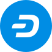

<table>
<tr>
<td></td>
<td><ul>
<li>ID: bitcoin@bitcoin</li>
<li>Name: Bitcoin</li>
<li>Symbol: BTC</li>
<li>Platform: bitcoin</li>
</ul></td>
<td><ul>
<li><a href="https://www.coingecko.com/en/coins/bitcoin">coingecko</a></li>
<li><a href="https://coinmarketcap.com/currencies/bitcoin/">coinmarketcap</a></li>
<li><a href="https://changelly.com/exchange/btc">changelly</a></li>
<li><a href="https://buy.moonpay.io/?defaultCurrencyCode=btc">moonpay</a></li>
<li><a href="https://widget.onramper.com/?defaultCrypto=BTC">onramper</a></li>
<li><a href="https://guardarian.com/calculator/v1?theme=blue&type=narrow&crypto_currencies_list=%5B%7B%22ticker%22%3A%22BTC%22%2C%22network%22%3A%22BTC%22%7D%5D&fiat_currencies_list=%5B%7B%22ticker%22%3A%22USD%22%2C%22network%22%3A%22USD%22%7D%5D">guardarian</a></li>
</ul></td>
</tr>
<tr>
<td></td>
<td><ul>
<li>ID: ethereum@ethereum</li>
<li>Name: Ethereum</li>
<li>Symbol: ETH</li>
<li>Platform: ethereum</li>
</ul></td>
<td><ul>
<li><a href="https://www.coingecko.com/en/coins/ethereum">coingecko</a></li>
<li><a href="https://coinmarketcap.com/currencies/ethereum/">coinmarketcap</a></li>
<li><a href="https://changelly.com/exchange/eth">changelly</a></li>
<li><a href="https://buy.moonpay.io/?defaultCurrencyCode=eth">moonpay</a></li>
<li><a href="https://widget.onramper.com/?defaultCrypto=ETH">onramper</a></li>
<li><a href="https://guardarian.com/calculator/v1?theme=blue&type=narrow&crypto_currencies_list=%5B%7B%22ticker%22%3A%22ETH%22%2C%22network%22%3A%22ETH%22%7D%5D&fiat_currencies_list=%5B%7B%22ticker%22%3A%22USD%22%2C%22network%22%3A%22USD%22%7D%5D">guardarian</a></li>
</ul></td>
</tr>
<tr>
<td></td>
<td><ul>
<li>ID: ethereum@avalanche-c-chain</li>
<li>Name: Ethereum</li>
<li>Symbol: ETH</li>
<li>Platform: avalanche-c-chain</li>
</ul></td>
<td><ul>
<li><a href="https://www.coingecko.com/en/coins/ethereum">coingecko</a></li>
<li><a href="https://coinmarketcap.com/currencies/ethereum/">coinmarketcap</a></li>
</ul></td>
</tr>
<tr>
<td></td>
<td><ul>
<li>ID: ethereum@binance-smart-chain</li>
<li>Name: Ethereum</li>
<li>Symbol: ETH</li>
<li>Platform: binance-smart-chain</li>
</ul></td>
<td><ul>
<li><a href="https://bscscan.com/token/0x2170ed0880ac9a755fd29b2688956bd959f933f8">bscscan</a></li>
<li><a href="https://www.coingecko.com/en/coins/ethereum">coingecko</a></li>
<li><a href="https://coinmarketcap.com/currencies/ethereum/">coinmarketcap</a></li>
</ul></td>
</tr>
<tr>
<td></td>
<td><ul>
<li>ID: ethereum@solana</li>
<li>Name: Ethereum</li>
<li>Symbol: ETH</li>
<li>Platform: solana</li>
</ul></td>
<td><ul>
<li><a href="https://www.coingecko.com/en/coins/ethereum">coingecko</a></li>
<li><a href="https://coinmarketcap.com/currencies/ethereum/">coinmarketcap</a></li>
</ul></td>
</tr>
<tr>
<td></td>
<td><ul>
<li>ID: tether@avalanche-c-chain</li>
<li>Name: Tether</li>
<li>Symbol: USDT</li>
<li>Platform: avalanche-c-chain</li>
</ul></td>
<td><ul>
<li><a href="https://www.coingecko.com/en/coins/tether">coingecko</a></li>
<li><a href="https://coinmarketcap.com/currencies/tether/">coinmarketcap</a></li>
</ul></td>
</tr>
<tr>
<td></td>
<td><ul>
<li>ID: tether@binance-smart-chain</li>
<li>Name: Tether</li>
<li>Symbol: USDT</li>
<li>Platform: binance-smart-chain</li>
</ul></td>
<td><ul>
<li><a href="https://bscscan.com/token/0x55d398326f99059ff775485246999027b3197955">bscscan</a></li>
<li><a href="https://www.coingecko.com/en/coins/tether">coingecko</a></li>
<li><a href="https://coinmarketcap.com/currencies/tether/">coinmarketcap</a></li>
<li><a href="https://changelly.com/exchange/usdtbsc">changelly</a></li>
<li><a href="https://guardarian.com/calculator/v1?theme=blue&type=narrow&crypto_currencies_list=%5B%7B%22ticker%22%3A%22USDT%22%2C%22network%22%3A%22BSC%22%7D%5D&fiat_currencies_list=%5B%7B%22ticker%22%3A%22USD%22%2C%22network%22%3A%22USD%22%7D%5D">guardarian</a></li>
</ul></td>
</tr>
<tr>
<td></td>
<td><ul>
<li>ID: tether@ethereum</li>
<li>Name: Tether</li>
<li>Symbol: USDT</li>
<li>Platform: ethereum</li>
</ul></td>
<td><ul>
<li><a href="https://etherscan.io/token/0xdac17f958d2ee523a2206206994597c13d831ec7">etherscan</a></li>
<li><a href="https://www.coingecko.com/en/coins/tether">coingecko</a></li>
<li><a href="https://coinmarketcap.com/currencies/tether/">coinmarketcap</a></li>
<li><a href="https://changelly.com/exchange/usdt20">changelly</a></li>
<li><a href="https://buy.moonpay.io/?defaultCurrencyCode=usdt">moonpay</a></li>
<li><a href="https://widget.onramper.com/?defaultCrypto=USDT">onramper</a></li>
<li><a href="https://guardarian.com/calculator/v1?theme=blue&type=narrow&crypto_currencies_list=%5B%7B%22ticker%22%3A%22USDT%22%2C%22network%22%3A%22ETH%22%7D%5D&fiat_currencies_list=%5B%7B%22ticker%22%3A%22USD%22%2C%22network%22%3A%22USD%22%7D%5D">guardarian</a></li>
</ul></td>
</tr>
<tr>
<td></td>
<td><ul>
<li>ID: tether@omni</li>
<li>Name: Tether</li>
<li>Symbol: USDT</li>
<li>Platform: omni</li>
</ul></td>
<td><ul>
<li><a href="https://www.coingecko.com/en/coins/tether">coingecko</a></li>
<li><a href="https://coinmarketcap.com/currencies/tether/">coinmarketcap</a></li>
<li><a href="https://changelly.com/exchange/usdt">changelly</a></li>
</ul></td>
</tr>
<tr>
<td></td>
<td><ul>
<li>ID: tether@solana</li>
<li>Name: Tether</li>
<li>Symbol: USDT</li>
<li>Platform: solana</li>
</ul></td>
<td><ul>
<li><a href="https://www.coingecko.com/en/coins/tether">coingecko</a></li>
<li><a href="https://coinmarketcap.com/currencies/tether/">coinmarketcap</a></li>
<li><a href="https://changelly.com/exchange/usdtsol">changelly</a></li>
<li><a href="https://widget.onramper.com/?defaultCrypto=USDT_SOL">onramper</a></li>
</ul></td>
</tr>
<tr>
<td></td>
<td><ul>
<li>ID: tether@tron</li>
<li>Name: Tether</li>
<li>Symbol: USDT</li>
<li>Platform: tron</li>
</ul></td>
<td><ul>
<li><a href="https://www.coingecko.com/en/coins/tether">coingecko</a></li>
<li><a href="https://coinmarketcap.com/currencies/tether/">coinmarketcap</a></li>
<li><a href="https://changelly.com/exchange/usdtrx">changelly</a></li>
<li><a href="https://buy.moonpay.io/?defaultCurrencyCode=usdt_trx">moonpay</a></li>
<li><a href="https://widget.onramper.com/?defaultCrypto=USDT_TRC20">onramper</a></li>
<li><a href="https://guardarian.com/calculator/v1?theme=blue&type=narrow&crypto_currencies_list=%5B%7B%22ticker%22%3A%22USDT%22%2C%22network%22%3A%22TRX%22%7D%5D&fiat_currencies_list=%5B%7B%22ticker%22%3A%22USD%22%2C%22network%22%3A%22USD%22%7D%5D">guardarian</a></li>
</ul></td>
</tr>
<tr>
<td></td>
<td><ul>
<li>ID: binance-coin@binance-smart-chain</li>
<li>Name: Binance Smart Chain</li>
<li>Symbol: BNB</li>
<li>Platform: binance-smart-chain</li>
</ul></td>
<td><ul>
<li><a href="https://www.coingecko.com/en/coins/binancecoin">coingecko</a></li>
<li><a href="https://coinmarketcap.com/currencies/bnb/">coinmarketcap</a></li>
<li><a href="https://changelly.com/exchange/bnbbsc">changelly</a></li>
<li><a href="https://buy.moonpay.io/?defaultCurrencyCode=bnb_bsc">moonpay</a></li>
<li><a href="https://widget.onramper.com/?defaultCrypto=BNB_BEP20">onramper</a></li>
<li><a href="https://guardarian.com/calculator/v1?theme=blue&type=narrow&crypto_currencies_list=%5B%7B%22ticker%22%3A%22BNB%22%2C%22network%22%3A%22BSC%22%7D%5D&fiat_currencies_list=%5B%7B%22ticker%22%3A%22USD%22%2C%22network%22%3A%22USD%22%7D%5D">guardarian</a></li>
</ul></td>
</tr>
<tr>
<td></td>
<td><ul>
<li>ID: binance-coin@binance-chain</li>
<li>Name: Binance Chain</li>
<li>Symbol: BNB</li>
<li>Platform: binance-chain</li>
</ul></td>
<td><ul>
<li><a href="https://www.coingecko.com/en/coins/binancecoin">coingecko</a></li>
<li><a href="https://coinmarketcap.com/currencies/bnb/">coinmarketcap</a></li>
<li><a href="https://changelly.com/exchange/bnb">changelly</a></li>
<li><a href="https://buy.moonpay.io/?defaultCurrencyCode=bnb">moonpay</a></li>
</ul></td>
</tr>
<tr>
<td></td>
<td><ul>
<li>ID: usd-coin@avalanche-c-chain</li>
<li>Name: USD Coin</li>
<li>Symbol: USDC</li>
<li>Platform: avalanche-c-chain</li>
</ul></td>
<td><ul>
<li><a href="https://www.coingecko.com/en/coins/usd-coin">coingecko</a></li>
<li><a href="https://coinmarketcap.com/currencies/usd-coin/">coinmarketcap</a></li>
<li><a href="https://widget.onramper.com/?defaultCrypto=USDC_CCHAIN">onramper</a></li>
</ul></td>
</tr>
<tr>
<td></td>
<td><ul>
<li>ID: usd-coin@binance-smart-chain</li>
<li>Name: USD Coin</li>
<li>Symbol: USDC</li>
<li>Platform: binance-smart-chain</li>
</ul></td>
<td><ul>
<li><a href="https://bscscan.com/token/0x8ac76a51cc950d9822d68b83fe1ad97b32cd580d">bscscan</a></li>
<li><a href="https://www.coingecko.com/en/coins/usd-coin">coingecko</a></li>
<li><a href="https://coinmarketcap.com/currencies/usd-coin/">coinmarketcap</a></li>
<li><a href="https://changelly.com/exchange/usdcbsc">changelly</a></li>
<li><a href="https://guardarian.com/calculator/v1?theme=blue&type=narrow&crypto_currencies_list=%5B%7B%22ticker%22%3A%22USDC%22%2C%22network%22%3A%22BSC%22%7D%5D&fiat_currencies_list=%5B%7B%22ticker%22%3A%22USD%22%2C%22network%22%3A%22USD%22%7D%5D">guardarian</a></li>
</ul></td>
</tr>
<tr>
<td></td>
<td><ul>
<li>ID: usd-coin@ethereum</li>
<li>Name: USD Coin</li>
<li>Symbol: USDC</li>
<li>Platform: ethereum</li>
</ul></td>
<td><ul>
<li><a href="https://etherscan.io/token/0xa0b86991c6218b36c1d19d4a2e9eb0ce3606eb48">etherscan</a></li>
<li><a href="https://www.coingecko.com/en/coins/usd-coin">coingecko</a></li>
<li><a href="https://coinmarketcap.com/currencies/usd-coin/">coinmarketcap</a></li>
<li><a href="https://changelly.com/exchange/usdc">changelly</a></li>
<li><a href="https://buy.moonpay.io/?defaultCurrencyCode=usdc">moonpay</a></li>
<li><a href="https://widget.onramper.com/?defaultCrypto=USDC">onramper</a></li>
<li><a href="https://guardarian.com/calculator/v1?theme=blue&type=narrow&crypto_currencies_list=%5B%7B%22ticker%22%3A%22USDC%22%2C%22network%22%3A%22ETH%22%7D%5D&fiat_currencies_list=%5B%7B%22ticker%22%3A%22USD%22%2C%22network%22%3A%22USD%22%7D%5D">guardarian</a></li>
</ul></td>
</tr>
<tr>
<td></td>
<td><ul>
<li>ID: usd-coin@polygon</li>
<li>Name: USD Coin</li>
<li>Symbol: USDC</li>
<li>Platform: polygon</li>
</ul></td>
<td><ul>
<li><a href="https://www.coingecko.com/en/coins/usd-coin">coingecko</a></li>
<li><a href="https://coinmarketcap.com/currencies/usd-coin/">coinmarketcap</a></li>
<li><a href="https://buy.moonpay.io/?defaultCurrencyCode=usdc_polygon">moonpay</a></li>
<li><a href="https://widget.onramper.com/?defaultCrypto=USDC_POLYGON">onramper</a></li>
<li><a href="https://guardarian.com/calculator/v1?theme=blue&type=narrow&crypto_currencies_list=%5B%7B%22ticker%22%3A%22USDC%22%2C%22network%22%3A%22MATIC%22%7D%5D&fiat_currencies_list=%5B%7B%22ticker%22%3A%22USD%22%2C%22network%22%3A%22USD%22%7D%5D">guardarian</a></li>
</ul></td>
</tr>
<tr>
<td></td>
<td><ul>
<li>ID: usd-coin@solana</li>
<li>Name: USD Coin</li>
<li>Symbol: USDC</li>
<li>Platform: solana</li>
</ul></td>
<td><ul>
<li><a href="https://www.coingecko.com/en/coins/usd-coin">coingecko</a></li>
<li><a href="https://coinmarketcap.com/currencies/usd-coin/">coinmarketcap</a></li>
<li><a href="https://changelly.com/exchange/usdcsol">changelly</a></li>
<li><a href="https://buy.moonpay.io/?defaultCurrencyCode=usdc_sol">moonpay</a></li>
<li><a href="https://widget.onramper.com/?defaultCrypto=USDC_SOL">onramper</a></li>
<li><a href="https://guardarian.com/calculator/v1?theme=blue&type=narrow&crypto_currencies_list=%5B%7B%22ticker%22%3A%22USDC%22%2C%22network%22%3A%22SOL%22%7D%5D&fiat_currencies_list=%5B%7B%22ticker%22%3A%22USD%22%2C%22network%22%3A%22USD%22%7D%5D">guardarian</a></li>
</ul></td>
</tr>
<tr>
<td></td>
<td><ul>
<li>ID: usd-coin@tron</li>
<li>Name: USD Coin</li>
<li>Symbol: USDC</li>
<li>Platform: tron</li>
</ul></td>
<td><ul>
<li><a href="https://www.coingecko.com/en/coins/usd-coin">coingecko</a></li>
<li><a href="https://coinmarketcap.com/currencies/usd-coin/">coinmarketcap</a></li>
<li><a href="https://widget.onramper.com/?defaultCrypto=USDC_TRC20">onramper</a></li>
<li><a href="https://guardarian.com/calculator/v1?theme=blue&type=narrow&crypto_currencies_list=%5B%7B%22ticker%22%3A%22USDC%22%2C%22network%22%3A%22TRX%22%7D%5D&fiat_currencies_list=%5B%7B%22ticker%22%3A%22USD%22%2C%22network%22%3A%22USD%22%7D%5D">guardarian</a></li>
</ul></td>
</tr>
<tr>
<td></td>
<td><ul>
<li>ID: binance-usd@avalanche-c-chain</li>
<li>Name: Binance USD</li>
<li>Symbol: BUSD</li>
<li>Platform: avalanche-c-chain</li>
</ul></td>
<td><ul>
<li><a href="https://www.coingecko.com/en/coins/binance-usd">coingecko</a></li>
<li><a href="https://coinmarketcap.com/currencies/binance-usd/">coinmarketcap</a></li>
</ul></td>
</tr>
<tr>
<td></td>
<td><ul>
<li>ID: binance-usd@binance-chain</li>
<li>Name: Binance USD</li>
<li>Symbol: BUSD</li>
<li>Platform: binance-chain</li>
</ul></td>
<td><ul>
<li><a href="https://www.coingecko.com/en/coins/binance-usd">coingecko</a></li>
<li><a href="https://coinmarketcap.com/currencies/binance-usd/">coinmarketcap</a></li>
<li><a href="https://buy.moonpay.io/?defaultCurrencyCode=busd">moonpay</a></li>
</ul></td>
</tr>
<tr>
<td></td>
<td><ul>
<li>ID: binance-usd@binance-smart-chain</li>
<li>Name: Binance USD</li>
<li>Symbol: BUSD</li>
<li>Platform: binance-smart-chain</li>
</ul></td>
<td><ul>
<li><a href="https://bscscan.com/token/0xe9e7cea3dedca5984780bafc599bd69add087d56">bscscan</a></li>
<li><a href="https://www.coingecko.com/en/coins/binance-usd">coingecko</a></li>
<li><a href="https://coinmarketcap.com/currencies/binance-usd/">coinmarketcap</a></li>
<li><a href="https://changelly.com/exchange/busdbsc">changelly</a></li>
<li><a href="https://buy.moonpay.io/?defaultCurrencyCode=busd_bsc">moonpay</a></li>
<li><a href="https://widget.onramper.com/?defaultCrypto=BUSD_BEP20">onramper</a></li>
<li><a href="https://guardarian.com/calculator/v1?theme=blue&type=narrow&crypto_currencies_list=%5B%7B%22ticker%22%3A%22BUSD%22%2C%22network%22%3A%22BSC%22%7D%5D&fiat_currencies_list=%5B%7B%22ticker%22%3A%22USD%22%2C%22network%22%3A%22USD%22%7D%5D">guardarian</a></li>
</ul></td>
</tr>
<tr>
<td></td>
<td><ul>
<li>ID: binance-usd@ethereum</li>
<li>Name: Binance USD</li>
<li>Symbol: BUSD</li>
<li>Platform: ethereum</li>
</ul></td>
<td><ul>
<li><a href="https://etherscan.io/token/0x4fabb145d64652a948d72533023f6e7a623c7c53">etherscan</a></li>
<li><a href="https://www.coingecko.com/en/coins/binance-usd">coingecko</a></li>
<li><a href="https://coinmarketcap.com/currencies/binance-usd/">coinmarketcap</a></li>
<li><a href="https://changelly.com/exchange/busd">changelly</a></li>
<li><a href="https://widget.onramper.com/?defaultCrypto=BUSD">onramper</a></li>
<li><a href="https://guardarian.com/calculator/v1?theme=blue&type=narrow&crypto_currencies_list=%5B%7B%22ticker%22%3A%22BUSD%22%2C%22network%22%3A%22ETH%22%7D%5D&fiat_currencies_list=%5B%7B%22ticker%22%3A%22USD%22%2C%22network%22%3A%22USD%22%7D%5D">guardarian</a></li>
</ul></td>
</tr>
<tr>
<td></td>
<td><ul>
<li>ID: binance-usd@solana</li>
<li>Name: Binance USD</li>
<li>Symbol: BUSD</li>
<li>Platform: solana</li>
</ul></td>
<td><ul>
<li><a href="https://www.coingecko.com/en/coins/binance-usd">coingecko</a></li>
<li><a href="https://coinmarketcap.com/currencies/binance-usd/">coinmarketcap</a></li>
</ul></td>
</tr>
<tr>
<td></td>
<td><ul>
<li>ID: xrp@ripple</li>
<li>Name: XRP</li>
<li>Symbol: XRP</li>
<li>Platform: ripple</li>
</ul></td>
<td><ul>
<li><a href="https://www.coingecko.com/en/coins/ripple">coingecko</a></li>
<li><a href="https://coinmarketcap.com/currencies/xrp/">coinmarketcap</a></li>
<li><a href="https://changelly.com/exchange/xrp">changelly</a></li>
<li><a href="https://buy.moonpay.io/?defaultCurrencyCode=xrp">moonpay</a></li>
<li><a href="https://widget.onramper.com/?defaultCrypto=XRP">onramper</a></li>
<li><a href="https://guardarian.com/calculator/v1?theme=blue&type=narrow&crypto_currencies_list=%5B%7B%22ticker%22%3A%22XRP%22%2C%22network%22%3A%22XRP%22%7D%5D&fiat_currencies_list=%5B%7B%22ticker%22%3A%22USD%22%2C%22network%22%3A%22USD%22%7D%5D">guardarian</a></li>
</ul></td>
</tr>
<tr>
<td></td>
<td><ul>
<li>ID: xrp@binance-smart-chain</li>
<li>Name: XRP</li>
<li>Symbol: XRP</li>
<li>Platform: binance-smart-chain</li>
</ul></td>
<td><ul>
<li><a href="https://bscscan.com/token/0x1d2f0da169ceb9fc7b3144628db156f3f6c60dbe">bscscan</a></li>
<li><a href="https://www.coingecko.com/en/coins/binance-peg-xrp">coingecko</a></li>
<li><a href="https://coinmarketcap.com/currencies/xrp/">coinmarketcap</a></li>
</ul></td>
</tr>
<tr>
<td></td>
<td><ul>
<li>ID: cardano@cardano</li>
<li>Name: Cardano</li>
<li>Symbol: ADA</li>
<li>Platform: cardano</li>
</ul></td>
<td><ul>
<li><a href="https://www.coingecko.com/en/coins/cardano">coingecko</a></li>
<li><a href="https://coinmarketcap.com/currencies/cardano/">coinmarketcap</a></li>
<li><a href="https://changelly.com/exchange/ada">changelly</a></li>
<li><a href="https://buy.moonpay.io/?defaultCurrencyCode=ada">moonpay</a></li>
<li><a href="https://widget.onramper.com/?defaultCrypto=ADA">onramper</a></li>
<li><a href="https://guardarian.com/calculator/v1?theme=blue&type=narrow&crypto_currencies_list=%5B%7B%22ticker%22%3A%22ADA%22%2C%22network%22%3A%22ADA%22%7D%5D&fiat_currencies_list=%5B%7B%22ticker%22%3A%22USD%22%2C%22network%22%3A%22USD%22%7D%5D">guardarian</a></li>
</ul></td>
</tr>
<tr>
<td></td>
<td><ul>
<li>ID: cardano@binance-smart-chain</li>
<li>Name: Cardano</li>
<li>Symbol: ADA</li>
<li>Platform: binance-smart-chain</li>
</ul></td>
<td><ul>
<li><a href="https://bscscan.com/token/0x3ee2200efb3400fabb9aacf31297cbdd1d435d47">bscscan</a></li>
<li><a href="https://www.coingecko.com/en/coins/binance-peg-cardano">coingecko</a></li>
<li><a href="https://coinmarketcap.com/currencies/cardano/">coinmarketcap</a></li>
<li><a href="https://guardarian.com/calculator/v1?theme=blue&type=narrow&crypto_currencies_list=%5B%7B%22ticker%22%3A%22ADA%22%2C%22network%22%3A%22BSC%22%7D%5D&fiat_currencies_list=%5B%7B%22ticker%22%3A%22USD%22%2C%22network%22%3A%22USD%22%7D%5D">guardarian</a></li>
</ul></td>
</tr>
<tr>
<td></td>
<td><ul>
<li>ID: dogecoin@dogecoin</li>
<li>Name: Dogecoin</li>
<li>Symbol: DOGE</li>
<li>Platform: dogecoin</li>
</ul></td>
<td><ul>
<li><a href="https://www.coingecko.com/en/coins/dogecoin">coingecko</a></li>
<li><a href="https://coinmarketcap.com/currencies/dogecoin/">coinmarketcap</a></li>
<li><a href="https://changelly.com/exchange/doge">changelly</a></li>
<li><a href="https://buy.moonpay.io/?defaultCurrencyCode=doge">moonpay</a></li>
<li><a href="https://widget.onramper.com/?defaultCrypto=DOGE">onramper</a></li>
<li><a href="https://guardarian.com/calculator/v1?theme=blue&type=narrow&crypto_currencies_list=%5B%7B%22ticker%22%3A%22DOGE%22%2C%22network%22%3A%22DOGE%22%7D%5D&fiat_currencies_list=%5B%7B%22ticker%22%3A%22USD%22%2C%22network%22%3A%22USD%22%7D%5D">guardarian</a></li>
</ul></td>
</tr>
<tr>
<td></td>
<td><ul>
<li>ID: dogecoin@binance-smart-chain</li>
<li>Name: Dogecoin</li>
<li>Symbol: DOGE</li>
<li>Platform: binance-smart-chain</li>
</ul></td>
<td><ul>
<li><a href="https://bscscan.com/token/0xba2ae424d960c26247dd6c32edc70b295c744c43">bscscan</a></li>
<li><a href="https://www.coingecko.com/en/coins/binance-peg-dogecoin">coingecko</a></li>
<li><a href="https://coinmarketcap.com/currencies/dogecoin/">coinmarketcap</a></li>
<li><a href="https://guardarian.com/calculator/v1?theme=blue&type=narrow&crypto_currencies_list=%5B%7B%22ticker%22%3A%22DOGE%22%2C%22network%22%3A%22BSC%22%7D%5D&fiat_currencies_list=%5B%7B%22ticker%22%3A%22USD%22%2C%22network%22%3A%22USD%22%7D%5D">guardarian</a></li>
</ul></td>
</tr>
<tr>
<td></td>
<td><ul>
<li>ID: polygon@polygon</li>
<li>Name: Polygon</li>
<li>Symbol: MATIC</li>
<li>Platform: polygon</li>
</ul></td>
<td><ul>
<li><a href="https://www.coingecko.com/en/coins/matic-network">coingecko</a></li>
<li><a href="https://coinmarketcap.com/currencies/polygon/">coinmarketcap</a></li>
<li><a href="https://changelly.com/exchange/maticpolygon">changelly</a></li>
<li><a href="https://buy.moonpay.io/?defaultCurrencyCode=matic_polygon">moonpay</a></li>
<li><a href="https://guardarian.com/calculator/v1?theme=blue&type=narrow&crypto_currencies_list=%5B%7B%22ticker%22%3A%22MATIC%22%2C%22network%22%3A%22MATIC%22%7D%5D&fiat_currencies_list=%5B%7B%22ticker%22%3A%22USD%22%2C%22network%22%3A%22USD%22%7D%5D">guardarian</a></li>
</ul></td>
</tr>
<tr>
<td></td>
<td><ul>
<li>ID: polygon@binance-smart-chain</li>
<li>Name: Polygon</li>
<li>Symbol: MATIC</li>
<li>Platform: binance-smart-chain</li>
</ul></td>
<td><ul>
<li><a href="https://bscscan.com/token/0xcc42724c6683b7e57334c4e856f4c9965ed682bd">bscscan</a></li>
<li><a href="https://www.coingecko.com/en/coins/matic-network">coingecko</a></li>
<li><a href="https://coinmarketcap.com/currencies/polygon/">coinmarketcap</a></li>
<li><a href="https://guardarian.com/calculator/v1?theme=blue&type=narrow&crypto_currencies_list=%5B%7B%22ticker%22%3A%22MATIC%22%2C%22network%22%3A%22BSC%22%7D%5D&fiat_currencies_list=%5B%7B%22ticker%22%3A%22USD%22%2C%22network%22%3A%22USD%22%7D%5D">guardarian</a></li>
</ul></td>
</tr>
<tr>
<td></td>
<td><ul>
<li>ID: polygon@ethereum</li>
<li>Name: Polygon</li>
<li>Symbol: MATIC</li>
<li>Platform: ethereum</li>
</ul></td>
<td><ul>
<li><a href="https://etherscan.io/token/0x7d1afa7b718fb893db30a3abc0cfc608aacfebb0">etherscan</a></li>
<li><a href="https://www.coingecko.com/en/coins/matic-network">coingecko</a></li>
<li><a href="https://coinmarketcap.com/currencies/polygon/">coinmarketcap</a></li>
<li><a href="https://changelly.com/exchange/matic">changelly</a></li>
<li><a href="https://buy.moonpay.io/?defaultCurrencyCode=matic">moonpay</a></li>
<li><a href="https://guardarian.com/calculator/v1?theme=blue&type=narrow&crypto_currencies_list=%5B%7B%22ticker%22%3A%22MATIC%22%2C%22network%22%3A%22ETH%22%7D%5D&fiat_currencies_list=%5B%7B%22ticker%22%3A%22USD%22%2C%22network%22%3A%22USD%22%7D%5D">guardarian</a></li>
</ul></td>
</tr>
<tr>
<td></td>
<td><ul>
<li>ID: polygon@solana</li>
<li>Name: Polygon</li>
<li>Symbol: MATIC</li>
<li>Platform: solana</li>
</ul></td>
<td><ul>
<li><a href="https://www.coingecko.com/en/coins/matic-network">coingecko</a></li>
<li><a href="https://coinmarketcap.com/currencies/polygon/">coinmarketcap</a></li>
</ul></td>
</tr>
<tr>
<td></td>
<td><ul>
<li>ID: polkadot@polkadot</li>
<li>Name: Polkadot</li>
<li>Symbol: DOT</li>
<li>Platform: polkadot</li>
</ul></td>
<td><ul>
<li><a href="https://www.coingecko.com/en/coins/polkadot">coingecko</a></li>
<li><a href="https://coinmarketcap.com/currencies/polkadot-new/">coinmarketcap</a></li>
<li><a href="https://changelly.com/exchange/dot">changelly</a></li>
<li><a href="https://buy.moonpay.io/?defaultCurrencyCode=dot">moonpay</a></li>
</ul></td>
</tr>
<tr>
<td></td>
<td><ul>
<li>ID: polkadot@binance-smart-chain</li>
<li>Name: Polkadot</li>
<li>Symbol: DOT</li>
<li>Platform: binance-smart-chain</li>
</ul></td>
<td><ul>
<li><a href="https://bscscan.com/token/0x7083609fce4d1d8dc0c979aab8c869ea2c873402">bscscan</a></li>
<li><a href="https://www.coingecko.com/en/coins/binance-peg-polkadot">coingecko</a></li>
<li><a href="https://coinmarketcap.com/currencies/polkadot-new/">coinmarketcap</a></li>
<li><a href="https://guardarian.com/calculator/v1?theme=blue&type=narrow&crypto_currencies_list=%5B%7B%22ticker%22%3A%22DOT%22%2C%22network%22%3A%22BSC%22%7D%5D&fiat_currencies_list=%5B%7B%22ticker%22%3A%22USD%22%2C%22network%22%3A%22USD%22%7D%5D">guardarian</a></li>
</ul></td>
</tr>
<tr>
<td></td>
<td><ul>
<li>ID: solana@solana</li>
<li>Name: Solana</li>
<li>Symbol: SOL</li>
<li>Platform: solana</li>
</ul></td>
<td><ul>
<li><a href="https://www.coingecko.com/en/coins/solana">coingecko</a></li>
<li><a href="https://coinmarketcap.com/currencies/solana/">coinmarketcap</a></li>
<li><a href="https://changelly.com/exchange/sol">changelly</a></li>
<li><a href="https://buy.moonpay.io/?defaultCurrencyCode=sol">moonpay</a></li>
<li><a href="https://widget.onramper.com/?defaultCrypto=SOL">onramper</a></li>
<li><a href="https://guardarian.com/calculator/v1?theme=blue&type=narrow&crypto_currencies_list=%5B%7B%22ticker%22%3A%22SOL%22%2C%22network%22%3A%22SOL%22%7D%5D&fiat_currencies_list=%5B%7B%22ticker%22%3A%22USD%22%2C%22network%22%3A%22USD%22%7D%5D">guardarian</a></li>
</ul></td>
</tr>
<tr>
<td></td>
<td><ul>
<li>ID: dai@avalanche-c-chain</li>
<li>Name: Dai</li>
<li>Symbol: DAI</li>
<li>Platform: avalanche-c-chain</li>
</ul></td>
<td><ul>
<li><a href="https://www.coingecko.com/en/coins/dai">coingecko</a></li>
<li><a href="https://coinmarketcap.com/currencies/multi-collateral-dai/">coinmarketcap</a></li>
</ul></td>
</tr>
<tr>
<td></td>
<td><ul>
<li>ID: dai@binance-smart-chain</li>
<li>Name: Dai</li>
<li>Symbol: DAI</li>
<li>Platform: binance-smart-chain</li>
</ul></td>
<td><ul>
<li><a href="https://bscscan.com/token/0x1af3f329e8be154074d8769d1ffa4ee058b1dbc3">bscscan</a></li>
<li><a href="https://www.coingecko.com/en/coins/dai">coingecko</a></li>
<li><a href="https://coinmarketcap.com/currencies/multi-collateral-dai/">coinmarketcap</a></li>
</ul></td>
</tr>
<tr>
<td></td>
<td><ul>
<li>ID: dai@ethereum</li>
<li>Name: Dai</li>
<li>Symbol: DAI</li>
<li>Platform: ethereum</li>
</ul></td>
<td><ul>
<li><a href="https://etherscan.io/token/0x6b175474e89094c44da98b954eedeac495271d0f">etherscan</a></li>
<li><a href="https://www.coingecko.com/en/coins/dai">coingecko</a></li>
<li><a href="https://coinmarketcap.com/currencies/multi-collateral-dai/">coinmarketcap</a></li>
<li><a href="https://changelly.com/exchange/dai">changelly</a></li>
<li><a href="https://buy.moonpay.io/?defaultCurrencyCode=dai">moonpay</a></li>
<li><a href="https://widget.onramper.com/?defaultCrypto=DAI_ERC20">onramper</a></li>
<li><a href="https://guardarian.com/calculator/v1?theme=blue&type=narrow&crypto_currencies_list=%5B%7B%22ticker%22%3A%22DAI%22%2C%22network%22%3A%22ETH%22%7D%5D&fiat_currencies_list=%5B%7B%22ticker%22%3A%22USD%22%2C%22network%22%3A%22USD%22%7D%5D">guardarian</a></li>
</ul></td>
</tr>
<tr>
<td></td>
<td><ul>
<li>ID: dai@solana</li>
<li>Name: Dai</li>
<li>Symbol: DAI</li>
<li>Platform: solana</li>
</ul></td>
<td><ul>
<li><a href="https://www.coingecko.com/en/coins/dai">coingecko</a></li>
<li><a href="https://coinmarketcap.com/currencies/multi-collateral-dai/">coinmarketcap</a></li>
</ul></td>
</tr>
<tr>
<td></td>
<td><ul>
<li>ID: shiba-inu@binance-smart-chain</li>
<li>Name: Shiba Inu</li>
<li>Symbol: SHIB</li>
<li>Platform: binance-smart-chain</li>
</ul></td>
<td><ul>
<li><a href="https://bscscan.com/token/0x2859e4544c4bb03966803b044a93563bd2d0dd4d">bscscan</a></li>
<li><a href="https://www.coingecko.com/en/coins/shiba-inu">coingecko</a></li>
<li><a href="https://coinmarketcap.com/currencies/shiba-inu/">coinmarketcap</a></li>
<li><a href="https://guardarian.com/calculator/v1?theme=blue&type=narrow&crypto_currencies_list=%5B%7B%22ticker%22%3A%22SHIB%22%2C%22network%22%3A%22BSC%22%7D%5D&fiat_currencies_list=%5B%7B%22ticker%22%3A%22USD%22%2C%22network%22%3A%22USD%22%7D%5D">guardarian</a></li>
</ul></td>
</tr>
<tr>
<td></td>
<td><ul>
<li>ID: shiba-inu@ethereum</li>
<li>Name: Shiba Inu</li>
<li>Symbol: SHIB</li>
<li>Platform: ethereum</li>
</ul></td>
<td><ul>
<li><a href="https://etherscan.io/token/0x95ad61b0a150d79219dcf64e1e6cc01f0b64c4ce">etherscan</a></li>
<li><a href="https://www.coingecko.com/en/coins/shiba-inu">coingecko</a></li>
<li><a href="https://coinmarketcap.com/currencies/shiba-inu/">coinmarketcap</a></li>
<li><a href="https://changelly.com/exchange/shib">changelly</a></li>
<li><a href="https://buy.moonpay.io/?defaultCurrencyCode=shib">moonpay</a></li>
<li><a href="https://guardarian.com/calculator/v1?theme=blue&type=narrow&crypto_currencies_list=%5B%7B%22ticker%22%3A%22SHIB%22%2C%22network%22%3A%22ETH%22%7D%5D&fiat_currencies_list=%5B%7B%22ticker%22%3A%22USD%22%2C%22network%22%3A%22USD%22%7D%5D">guardarian</a></li>
</ul></td>
</tr>
<tr>
<td></td>
<td><ul>
<li>ID: tron@tron</li>
<li>Name: TRON</li>
<li>Symbol: TRX</li>
<li>Platform: tron</li>
</ul></td>
<td><ul>
<li><a href="https://www.coingecko.com/en/coins/tron">coingecko</a></li>
<li><a href="https://coinmarketcap.com/currencies/tron/">coinmarketcap</a></li>
<li><a href="https://changelly.com/exchange/trx">changelly</a></li>
<li><a href="https://buy.moonpay.io/?defaultCurrencyCode=trx">moonpay</a></li>
<li><a href="https://widget.onramper.com/?defaultCrypto=TRX">onramper</a></li>
<li><a href="https://guardarian.com/calculator/v1?theme=blue&type=narrow&crypto_currencies_list=%5B%7B%22ticker%22%3A%22TRX%22%2C%22network%22%3A%22TRX%22%7D%5D&fiat_currencies_list=%5B%7B%22ticker%22%3A%22USD%22%2C%22network%22%3A%22USD%22%7D%5D">guardarian</a></li>
</ul></td>
</tr>
<tr>
<td></td>
<td><ul>
<li>ID: tron@binance-smart-chain</li>
<li>Name: TRON</li>
<li>Symbol: TRX</li>
<li>Platform: binance-smart-chain</li>
</ul></td>
<td><ul>
<li><a href="https://bscscan.com/token/0x85eac5ac2f758618dfa09bdbe0cf174e7d574d5b">bscscan</a></li>
<li><a href="https://www.coingecko.com/en/coins/tron">coingecko</a></li>
<li><a href="https://coinmarketcap.com/currencies/tron/">coinmarketcap</a></li>
<li><a href="https://guardarian.com/calculator/v1?theme=blue&type=narrow&crypto_currencies_list=%5B%7B%22ticker%22%3A%22TRX%22%2C%22network%22%3A%22BSC%22%7D%5D&fiat_currencies_list=%5B%7B%22ticker%22%3A%22USD%22%2C%22network%22%3A%22USD%22%7D%5D">guardarian</a></li>
</ul></td>
</tr>
<tr>
<td></td>
<td><ul>
<li>ID: uniswap@avalanche-c-chain</li>
<li>Name: Uniswap</li>
<li>Symbol: UNI</li>
<li>Platform: avalanche-c-chain</li>
</ul></td>
<td><ul>
<li><a href="https://www.coingecko.com/en/coins/uniswap">coingecko</a></li>
<li><a href="https://coinmarketcap.com/currencies/uniswap/">coinmarketcap</a></li>
</ul></td>
</tr>
<tr>
<td></td>
<td><ul>
<li>ID: uniswap@binance-smart-chain</li>
<li>Name: Uniswap</li>
<li>Symbol: UNI</li>
<li>Platform: binance-smart-chain</li>
</ul></td>
<td><ul>
<li><a href="https://bscscan.com/token/0xbf5140a22578168fd562dccf235e5d43a02ce9b1">bscscan</a></li>
<li><a href="https://www.coingecko.com/en/coins/uniswap">coingecko</a></li>
<li><a href="https://coinmarketcap.com/currencies/uniswap/">coinmarketcap</a></li>
<li><a href="https://guardarian.com/calculator/v1?theme=blue&type=narrow&crypto_currencies_list=%5B%7B%22ticker%22%3A%22UNI%22%2C%22network%22%3A%22BSC%22%7D%5D&fiat_currencies_list=%5B%7B%22ticker%22%3A%22USD%22%2C%22network%22%3A%22USD%22%7D%5D">guardarian</a></li>
</ul></td>
</tr>
<tr>
<td></td>
<td><ul>
<li>ID: uniswap@ethereum</li>
<li>Name: Uniswap</li>
<li>Symbol: UNI</li>
<li>Platform: ethereum</li>
</ul></td>
<td><ul>
<li><a href="https://etherscan.io/token/0x1f9840a85d5af5bf1d1762f925bdaddc4201f984">etherscan</a></li>
<li><a href="https://www.coingecko.com/en/coins/uniswap">coingecko</a></li>
<li><a href="https://coinmarketcap.com/currencies/uniswap/">coinmarketcap</a></li>
<li><a href="https://changelly.com/exchange/uni">changelly</a></li>
<li><a href="https://buy.moonpay.io/?defaultCurrencyCode=uni">moonpay</a></li>
<li><a href="https://widget.onramper.com/?defaultCrypto=UNI">onramper</a></li>
<li><a href="https://guardarian.com/calculator/v1?theme=blue&type=narrow&crypto_currencies_list=%5B%7B%22ticker%22%3A%22UNI%22%2C%22network%22%3A%22ETH%22%7D%5D&fiat_currencies_list=%5B%7B%22ticker%22%3A%22USD%22%2C%22network%22%3A%22USD%22%7D%5D">guardarian</a></li>
</ul></td>
</tr>
<tr>
<td></td>
<td><ul>
<li>ID: uniswap@solana</li>
<li>Name: Uniswap</li>
<li>Symbol: UNI</li>
<li>Platform: solana</li>
</ul></td>
<td><ul>
<li><a href="https://www.coingecko.com/en/coins/uniswap">coingecko</a></li>
<li><a href="https://coinmarketcap.com/currencies/uniswap/">coinmarketcap</a></li>
</ul></td>
</tr>
<tr>
<td></td>
<td><ul>
<li>ID: litecoin@litecoin</li>
<li>Name: Litecoin</li>
<li>Symbol: LTC</li>
<li>Platform: litecoin</li>
</ul></td>
<td><ul>
<li><a href="https://www.coingecko.com/en/coins/litecoin">coingecko</a></li>
<li><a href="https://coinmarketcap.com/currencies/litecoin/">coinmarketcap</a></li>
<li><a href="https://changelly.com/exchange/ltc">changelly</a></li>
<li><a href="https://buy.moonpay.io/?defaultCurrencyCode=ltc">moonpay</a></li>
<li><a href="https://widget.onramper.com/?defaultCrypto=LTC">onramper</a></li>
<li><a href="https://guardarian.com/calculator/v1?theme=blue&type=narrow&crypto_currencies_list=%5B%7B%22ticker%22%3A%22LTC%22%2C%22network%22%3A%22LTC%22%7D%5D&fiat_currencies_list=%5B%7B%22ticker%22%3A%22USD%22%2C%22network%22%3A%22USD%22%7D%5D">guardarian</a></li>
</ul></td>
</tr>
<tr>
<td></td>
<td><ul>
<li>ID: litecoin@binance-smart-chain</li>
<li>Name: Litecoin</li>
<li>Symbol: LTC</li>
<li>Platform: binance-smart-chain</li>
</ul></td>
<td><ul>
<li><a href="https://bscscan.com/token/0x4338665cbb7b2485a8855a139b75d5e34ab0db94">bscscan</a></li>
<li><a href="https://www.coingecko.com/en/coins/binance-peg-litecoin">coingecko</a></li>
<li><a href="https://coinmarketcap.com/currencies/litecoin/">coinmarketcap</a></li>
<li><a href="https://guardarian.com/calculator/v1?theme=blue&type=narrow&crypto_currencies_list=%5B%7B%22ticker%22%3A%22LTC%22%2C%22network%22%3A%22BSC%22%7D%5D&fiat_currencies_list=%5B%7B%22ticker%22%3A%22USD%22%2C%22network%22%3A%22USD%22%7D%5D">guardarian</a></li>
</ul></td>
</tr>
<tr>
<td></td>
<td><ul>
<li>ID: avalanche@avalanche-c-chain</li>
<li>Name: Avalanche</li>
<li>Symbol: AVAX</li>
<li>Platform: avalanche-c-chain</li>
</ul></td>
<td><ul>
<li><a href="https://www.coingecko.com/en/coins/avalanche-2">coingecko</a></li>
<li><a href="https://coinmarketcap.com/currencies/avalanche/">coinmarketcap</a></li>
<li><a href="https://changelly.com/exchange/avaxc">changelly</a></li>
<li><a href="https://buy.moonpay.io/?defaultCurrencyCode=avax_cchain">moonpay</a></li>
<li><a href="https://widget.onramper.com/?defaultCrypto=AVAX_CCHAIN">onramper</a></li>
</ul></td>
</tr>
<tr>
<td></td>
<td><ul>
<li>ID: avalanche@binance-smart-chain</li>
<li>Name: Avalanche</li>
<li>Symbol: AVAX</li>
<li>Platform: binance-smart-chain</li>
</ul></td>
<td><ul>
<li><a href="https://bscscan.com/token/0x1ce0c2827e2ef14d5c4f29a091d735a204794041">bscscan</a></li>
<li><a href="https://www.coingecko.com/en/coins/avalanche-2">coingecko</a></li>
<li><a href="https://coinmarketcap.com/currencies/avalanche/">coinmarketcap</a></li>
<li><a href="https://guardarian.com/calculator/v1?theme=blue&type=narrow&crypto_currencies_list=%5B%7B%22ticker%22%3A%22AVAX%22%2C%22network%22%3A%22BSC%22%7D%5D&fiat_currencies_list=%5B%7B%22ticker%22%3A%22USD%22%2C%22network%22%3A%22USD%22%7D%5D">guardarian</a></li>
</ul></td>
</tr>
<tr>
<td></td>
<td><ul>
<li>ID: wrapped-bitcoin@avalanche-c-chain</li>
<li>Name: Wrapped Bitcoin</li>
<li>Symbol: WBTC</li>
<li>Platform: avalanche-c-chain</li>
</ul></td>
<td><ul>
<li><a href="https://www.coingecko.com/en/coins/wrapped-bitcoin">coingecko</a></li>
<li><a href="https://coinmarketcap.com/currencies/wrapped-bitcoin/">coinmarketcap</a></li>
</ul></td>
</tr>
<tr>
<td></td>
<td><ul>
<li>ID: wrapped-bitcoin@ethereum</li>
<li>Name: Wrapped Bitcoin</li>
<li>Symbol: WBTC</li>
<li>Platform: ethereum</li>
</ul></td>
<td><ul>
<li><a href="https://etherscan.io/token/0x2260fac5e5542a773aa44fbcfedf7c193bc2c599">etherscan</a></li>
<li><a href="https://www.coingecko.com/en/coins/wrapped-bitcoin">coingecko</a></li>
<li><a href="https://coinmarketcap.com/currencies/wrapped-bitcoin/">coinmarketcap</a></li>
<li><a href="https://changelly.com/exchange/wbtc">changelly</a></li>
<li><a href="https://buy.moonpay.io/?defaultCurrencyCode=wbtc">moonpay</a></li>
<li><a href="https://guardarian.com/calculator/v1?theme=blue&type=narrow&crypto_currencies_list=%5B%7B%22ticker%22%3A%22WBTC%22%2C%22network%22%3A%22ETH%22%7D%5D&fiat_currencies_list=%5B%7B%22ticker%22%3A%22USD%22%2C%22network%22%3A%22USD%22%7D%5D">guardarian</a></li>
</ul></td>
</tr>
<tr>
<td></td>
<td><ul>
<li>ID: wrapped-bitcoin@solana</li>
<li>Name: Wrapped Bitcoin</li>
<li>Symbol: WBTC</li>
<li>Platform: solana</li>
</ul></td>
<td><ul>
<li><a href="https://www.coingecko.com/en/coins/wrapped-bitcoin">coingecko</a></li>
<li><a href="https://coinmarketcap.com/currencies/wrapped-bitcoin/">coinmarketcap</a></li>
</ul></td>
</tr>
<tr>
<td></td>
<td><ul>
<li>ID: leo-token@ethereum</li>
<li>Name: UNUS SED LEO</li>
<li>Symbol: LEO</li>
<li>Platform: ethereum</li>
</ul></td>
<td><ul>
<li><a href="https://etherscan.io/token/0x2af5d2ad76741191d15dfe7bf6ac92d4bd912ca3">etherscan</a></li>
<li><a href="https://www.coingecko.com/en/coins/leo-token">coingecko</a></li>
<li><a href="https://coinmarketcap.com/currencies/unus-sed-leo/">coinmarketcap</a></li>
<li><a href="https://changelly.com/exchange/leo">changelly</a></li>
</ul></td>
</tr>
<tr>
<td></td>
<td><ul>
<li>ID: chainlink@avalanche-c-chain</li>
<li>Name: Chainlink</li>
<li>Symbol: LINK</li>
<li>Platform: avalanche-c-chain</li>
</ul></td>
<td><ul>
<li><a href="https://www.coingecko.com/en/coins/chainlink">coingecko</a></li>
<li><a href="https://coinmarketcap.com/currencies/chainlink/">coinmarketcap</a></li>
</ul></td>
</tr>
<tr>
<td></td>
<td><ul>
<li>ID: chainlink@binance-smart-chain</li>
<li>Name: Chainlink</li>
<li>Symbol: LINK</li>
<li>Platform: binance-smart-chain</li>
</ul></td>
<td><ul>
<li><a href="https://bscscan.com/token/0xf8a0bf9cf54bb92f17374d9e9a321e6a111a51bd">bscscan</a></li>
<li><a href="https://www.coingecko.com/en/coins/chainlink">coingecko</a></li>
<li><a href="https://coinmarketcap.com/currencies/chainlink/">coinmarketcap</a></li>
</ul></td>
</tr>
<tr>
<td></td>
<td><ul>
<li>ID: chainlink@ethereum</li>
<li>Name: Chainlink</li>
<li>Symbol: LINK</li>
<li>Platform: ethereum</li>
</ul></td>
<td><ul>
<li><a href="https://etherscan.io/token/0x514910771af9ca656af840dff83e8264ecf986ca">etherscan</a></li>
<li><a href="https://www.coingecko.com/en/coins/chainlink">coingecko</a></li>
<li><a href="https://coinmarketcap.com/currencies/chainlink/">coinmarketcap</a></li>
<li><a href="https://changelly.com/exchange/link">changelly</a></li>
<li><a href="https://buy.moonpay.io/?defaultCurrencyCode=link">moonpay</a></li>
<li><a href="https://widget.onramper.com/?defaultCrypto=LINK">onramper</a></li>
<li><a href="https://guardarian.com/calculator/v1?theme=blue&type=narrow&crypto_currencies_list=%5B%7B%22ticker%22%3A%22LINK%22%2C%22network%22%3A%22ETH%22%7D%5D&fiat_currencies_list=%5B%7B%22ticker%22%3A%22USD%22%2C%22network%22%3A%22USD%22%7D%5D">guardarian</a></li>
</ul></td>
</tr>
<tr>
<td></td>
<td><ul>
<li>ID: chainlink@solana</li>
<li>Name: Chainlink</li>
<li>Symbol: LINK</li>
<li>Platform: solana</li>
</ul></td>
<td><ul>
<li><a href="https://www.coingecko.com/en/coins/chainlink">coingecko</a></li>
<li><a href="https://coinmarketcap.com/currencies/chainlink/">coinmarketcap</a></li>
</ul></td>
</tr>
<tr>
<td></td>
<td><ul>
<li>ID: cosmos@cosmos</li>
<li>Name: Cosmos</li>
<li>Symbol: ATOM</li>
<li>Platform: cosmos</li>
</ul></td>
<td><ul>
<li><a href="https://www.coingecko.com/en/coins/cosmos">coingecko</a></li>
<li><a href="https://coinmarketcap.com/currencies/cosmos/">coinmarketcap</a></li>
<li><a href="https://changelly.com/exchange/atom">changelly</a></li>
<li><a href="https://buy.moonpay.io/?defaultCurrencyCode=atom">moonpay</a></li>
<li><a href="https://widget.onramper.com/?defaultCrypto=ATOM">onramper</a></li>
</ul></td>
</tr>
<tr>
<td></td>
<td><ul>
<li>ID: cosmos@binance-smart-chain</li>
<li>Name: Cosmos</li>
<li>Symbol: ATOM</li>
<li>Platform: binance-smart-chain</li>
</ul></td>
<td><ul>
<li><a href="https://bscscan.com/token/0x0eb3a705fc54725037cc9e008bdede697f62f335">bscscan</a></li>
<li><a href="https://www.coingecko.com/en/coins/cosmos">coingecko</a></li>
<li><a href="https://coinmarketcap.com/currencies/cosmos/">coinmarketcap</a></li>
</ul></td>
</tr>
<tr>
<td></td>
<td><ul>
<li>ID: cosmos@ethereum</li>
<li>Name: Cosmos</li>
<li>Symbol: ATOM</li>
<li>Platform: ethereum</li>
</ul></td>
<td><ul>
<li><a href="https://etherscan.io/token/0x8d983cb9388eac77af0474fa441c4815500cb7bb">etherscan</a></li>
<li><a href="https://www.coingecko.com/en/coins/cosmos">coingecko</a></li>
<li><a href="https://coinmarketcap.com/currencies/cosmos/">coinmarketcap</a></li>
</ul></td>
</tr>
<tr>
<td></td>
<td><ul>
<li>ID: ethereum-classic@ethereum-classic</li>
<li>Name: Ethereum Classic</li>
<li>Symbol: ETC</li>
<li>Platform: ethereum-classic</li>
</ul></td>
<td><ul>
<li><a href="https://www.coingecko.com/en/coins/ethereum-classic">coingecko</a></li>
<li><a href="https://coinmarketcap.com/currencies/ethereum-classic/">coinmarketcap</a></li>
<li><a href="https://changelly.com/exchange/etc">changelly</a></li>
<li><a href="https://buy.moonpay.io/?defaultCurrencyCode=etc">moonpay</a></li>
<li><a href="https://widget.onramper.com/?defaultCrypto=ETC">onramper</a></li>
<li><a href="https://guardarian.com/calculator/v1?theme=blue&type=narrow&crypto_currencies_list=%5B%7B%22ticker%22%3A%22ETC%22%2C%22network%22%3A%22ETC%22%7D%5D&fiat_currencies_list=%5B%7B%22ticker%22%3A%22USD%22%2C%22network%22%3A%22USD%22%7D%5D">guardarian</a></li>
</ul></td>
</tr>
<tr>
<td></td>
<td><ul>
<li>ID: ethereum-classic@binance-smart-chain</li>
<li>Name: Ethereum Classic</li>
<li>Symbol: ETC</li>
<li>Platform: binance-smart-chain</li>
</ul></td>
<td><ul>
<li><a href="https://bscscan.com/token/0x3d6545b08693dae087e957cb1180ee38b9e3c25e">bscscan</a></li>
<li><a href="https://www.coingecko.com/en/coins/ethereum-classic">coingecko</a></li>
<li><a href="https://coinmarketcap.com/currencies/ethereum-classic/">coinmarketcap</a></li>
<li><a href="https://guardarian.com/calculator/v1?theme=blue&type=narrow&crypto_currencies_list=%5B%7B%22ticker%22%3A%22ETC%22%2C%22network%22%3A%22BSC%22%7D%5D&fiat_currencies_list=%5B%7B%22ticker%22%3A%22USD%22%2C%22network%22%3A%22USD%22%7D%5D">guardarian</a></li>
</ul></td>
</tr>
<tr>
<td></td>
<td><ul>
<li>ID: stellar@stellar</li>
<li>Name: Stellar</li>
<li>Symbol: XLM</li>
<li>Platform: stellar</li>
</ul></td>
<td><ul>
<li><a href="https://www.coingecko.com/en/coins/stellar">coingecko</a></li>
<li><a href="https://coinmarketcap.com/currencies/stellar/">coinmarketcap</a></li>
<li><a href="https://changelly.com/exchange/xlm">changelly</a></li>
<li><a href="https://buy.moonpay.io/?defaultCurrencyCode=xlm">moonpay</a></li>
<li><a href="https://widget.onramper.com/?defaultCrypto=XLM">onramper</a></li>
<li><a href="https://guardarian.com/calculator/v1?theme=blue&type=narrow&crypto_currencies_list=%5B%7B%22ticker%22%3A%22XLM%22%2C%22network%22%3A%22XLM%22%7D%5D&fiat_currencies_list=%5B%7B%22ticker%22%3A%22USD%22%2C%22network%22%3A%22USD%22%7D%5D">guardarian</a></li>
</ul></td>
</tr>
<tr>
<td></td>
<td><ul>
<li>ID: monero@monero</li>
<li>Name: Monero</li>
<li>Symbol: XMR</li>
<li>Platform: monero</li>
</ul></td>
<td><ul>
<li><a href="https://www.coingecko.com/en/coins/monero">coingecko</a></li>
<li><a href="https://coinmarketcap.com/currencies/monero/">coinmarketcap</a></li>
<li><a href="https://changelly.com/exchange/xmr">changelly</a></li>
<li><a href="https://guardarian.com/calculator/v1?theme=blue&type=narrow&crypto_currencies_list=%5B%7B%22ticker%22%3A%22XMR%22%2C%22network%22%3A%22XMR%22%7D%5D&fiat_currencies_list=%5B%7B%22ticker%22%3A%22USD%22%2C%22network%22%3A%22USD%22%7D%5D">guardarian</a></li>
</ul></td>
</tr>
<tr>
<td></td>
<td><ul>
<li>ID: crypto-com-coin@ethereum</li>
<li>Name: Cronos</li>
<li>Symbol: CRO</li>
<li>Platform: ethereum</li>
</ul></td>
<td><ul>
<li><a href="https://etherscan.io/token/0xa0b73e1ff0b80914ab6fe0444e65848c4c34450b">etherscan</a></li>
<li><a href="https://www.coingecko.com/en/coins/crypto-com-chain">coingecko</a></li>
<li><a href="https://coinmarketcap.com/currencies/cronos/">coinmarketcap</a></li>
<li><a href="https://changelly.com/exchange/croold">changelly</a></li>
<li><a href="https://guardarian.com/calculator/v1?theme=blue&type=narrow&crypto_currencies_list=%5B%7B%22ticker%22%3A%22CRO%22%2C%22network%22%3A%22ETH%22%7D%5D&fiat_currencies_list=%5B%7B%22ticker%22%3A%22USD%22%2C%22network%22%3A%22USD%22%7D%5D">guardarian</a></li>
</ul></td>
</tr>
<tr>
<td></td>
<td><ul>
<li>ID: crypto-com-coin@solana</li>
<li>Name: Cronos</li>
<li>Symbol: CRO</li>
<li>Platform: solana</li>
</ul></td>
<td><ul>
<li><a href="https://www.coingecko.com/en/coins/crypto-com-chain">coingecko</a></li>
<li><a href="https://coinmarketcap.com/currencies/cronos/">coinmarketcap</a></li>
</ul></td>
</tr>
<tr>
<td></td>
<td><ul>
<li>ID: algorand@algorand</li>
<li>Name: Algorand</li>
<li>Symbol: ALGO</li>
<li>Platform: algorand</li>
</ul></td>
<td><ul>
<li><a href="https://www.coingecko.com/en/coins/algorand">coingecko</a></li>
<li><a href="https://coinmarketcap.com/currencies/algorand/">coinmarketcap</a></li>
<li><a href="https://changelly.com/exchange/algo">changelly</a></li>
<li><a href="https://buy.moonpay.io/?defaultCurrencyCode=algo">moonpay</a></li>
</ul></td>
</tr>
<tr>
<td></td>
<td><ul>
<li>ID: bitcoin-cash@bitcoin-cash</li>
<li>Name: Bitcoin Cash</li>
<li>Symbol: BCH</li>
<li>Platform: bitcoin-cash</li>
</ul></td>
<td><ul>
<li><a href="https://www.coingecko.com/en/coins/bitcoin-cash">coingecko</a></li>
<li><a href="https://coinmarketcap.com/currencies/bitcoin-cash/">coinmarketcap</a></li>
<li><a href="https://changelly.com/exchange/bch">changelly</a></li>
<li><a href="https://buy.moonpay.io/?defaultCurrencyCode=bch">moonpay</a></li>
<li><a href="https://widget.onramper.com/?defaultCrypto=BCH">onramper</a></li>
<li><a href="https://guardarian.com/calculator/v1?theme=blue&type=narrow&crypto_currencies_list=%5B%7B%22ticker%22%3A%22BCH%22%2C%22network%22%3A%22BCH%22%7D%5D&fiat_currencies_list=%5B%7B%22ticker%22%3A%22USD%22%2C%22network%22%3A%22USD%22%7D%5D">guardarian</a></li>
</ul></td>
</tr>
<tr>
<td></td>
<td><ul>
<li>ID: bitcoin-cash@binance-smart-chain</li>
<li>Name: Bitcoin Cash</li>
<li>Symbol: BCH</li>
<li>Platform: binance-smart-chain</li>
</ul></td>
<td><ul>
<li><a href="https://bscscan.com/token/0x8ff795a6f4d97e7887c79bea79aba5cc76444adf">bscscan</a></li>
<li><a href="https://www.coingecko.com/en/coins/binance-peg-bitcoin-cash">coingecko</a></li>
<li><a href="https://coinmarketcap.com/currencies/bitcoin-cash/">coinmarketcap</a></li>
<li><a href="https://guardarian.com/calculator/v1?theme=blue&type=narrow&crypto_currencies_list=%5B%7B%22ticker%22%3A%22BCH%22%2C%22network%22%3A%22BSC%22%7D%5D&fiat_currencies_list=%5B%7B%22ticker%22%3A%22USD%22%2C%22network%22%3A%22USD%22%7D%5D">guardarian</a></li>
</ul></td>
</tr>
<tr>
<td></td>
<td><ul>
<li>ID: toncoin@binance-smart-chain</li>
<li>Name: Toncoin</li>
<li>Symbol: TON</li>
<li>Platform: binance-smart-chain</li>
</ul></td>
<td><ul>
<li><a href="https://bscscan.com/token/0x76a797a59ba2c17726896976b7b3747bfd1d220f">bscscan</a></li>
<li><a href="https://www.coingecko.com/en/coins/tontoken">coingecko</a></li>
<li><a href="https://coinmarketcap.com/currencies/toncoin/">coinmarketcap</a></li>
</ul></td>
</tr>
<tr>
<td></td>
<td><ul>
<li>ID: toncoin@ethereum</li>
<li>Name: Toncoin</li>
<li>Symbol: TON</li>
<li>Platform: ethereum</li>
</ul></td>
<td><ul>
<li><a href="https://etherscan.io/token/0x582d872a1b094fc48f5de31d3b73f2d9be47def1">etherscan</a></li>
<li><a href="https://www.coingecko.com/en/coins/tontoken">coingecko</a></li>
<li><a href="https://coinmarketcap.com/currencies/toncoin/">coinmarketcap</a></li>
</ul></td>
</tr>
<tr>
<td></td>
<td><ul>
<li>ID: near@near</li>
<li>Name: NEAR Protocol</li>
<li>Symbol: NEAR</li>
<li>Platform: near</li>
</ul></td>
<td><ul>
<li><a href="https://www.coingecko.com/en/coins/near">coingecko</a></li>
<li><a href="https://coinmarketcap.com/currencies/near-protocol/">coinmarketcap</a></li>
<li><a href="https://buy.moonpay.io/?defaultCurrencyCode=near">moonpay</a></li>
</ul></td>
</tr>
<tr>
<td></td>
<td><ul>
<li>ID: near@binance-smart-chain</li>
<li>Name: NEAR Protocol</li>
<li>Symbol: NEAR</li>
<li>Platform: binance-smart-chain</li>
</ul></td>
<td><ul>
<li><a href="https://bscscan.com/token/0x1fa4a73a3f0133f0025378af00236f3abdee5d63">bscscan</a></li>
<li><a href="https://www.coingecko.com/en/coins/near">coingecko</a></li>
<li><a href="https://coinmarketcap.com/currencies/near-protocol/">coinmarketcap</a></li>
<li><a href="https://changelly.com/exchange/near">changelly</a></li>
<li><a href="https://guardarian.com/calculator/v1?theme=blue&type=narrow&crypto_currencies_list=%5B%7B%22ticker%22%3A%22NEAR%22%2C%22network%22%3A%22BSC%22%7D%5D&fiat_currencies_list=%5B%7B%22ticker%22%3A%22USD%22%2C%22network%22%3A%22USD%22%7D%5D">guardarian</a></li>
</ul></td>
</tr>
<tr>
<td></td>
<td><ul>
<li>ID: vechain@vechain</li>
<li>Name: VeChain</li>
<li>Symbol: VET</li>
<li>Platform: vechain</li>
</ul></td>
<td><ul>
<li><a href="https://www.coingecko.com/en/coins/vechain">coingecko</a></li>
<li><a href="https://coinmarketcap.com/currencies/vechain/">coinmarketcap</a></li>
<li><a href="https://changelly.com/exchange/vet">changelly</a></li>
<li><a href="https://buy.moonpay.io/?defaultCurrencyCode=vet">moonpay</a></li>
</ul></td>
</tr>
<tr>
<td></td>
<td><ul>
<li>ID: vechain@binance-smart-chain</li>
<li>Name: VeChain</li>
<li>Symbol: VET</li>
<li>Platform: binance-smart-chain</li>
</ul></td>
<td><ul>
<li><a href="https://bscscan.com/token/0x6fdcdfef7c496407ccb0cec90f9c5aaa1cc8d888">bscscan</a></li>
<li><a href="https://www.coingecko.com/en/coins/vechain">coingecko</a></li>
<li><a href="https://coinmarketcap.com/currencies/vechain/">coinmarketcap</a></li>
<li><a href="https://guardarian.com/calculator/v1?theme=blue&type=narrow&crypto_currencies_list=%5B%7B%22ticker%22%3A%22VET%22%2C%22network%22%3A%22BSC%22%7D%5D&fiat_currencies_list=%5B%7B%22ticker%22%3A%22USD%22%2C%22network%22%3A%22USD%22%7D%5D">guardarian</a></li>
</ul></td>
</tr>
<tr>
<td></td>
<td><ul>
<li>ID: filecoin@filecoin</li>
<li>Name: Filecoin</li>
<li>Symbol: FIL</li>
<li>Platform: filecoin</li>
</ul></td>
<td><ul>
<li><a href="https://www.coingecko.com/en/coins/filecoin">coingecko</a></li>
<li><a href="https://coinmarketcap.com/currencies/filecoin/">coinmarketcap</a></li>
<li><a href="https://changelly.com/exchange/fil">changelly</a></li>
<li><a href="https://buy.moonpay.io/?defaultCurrencyCode=fil">moonpay</a></li>
</ul></td>
</tr>
<tr>
<td></td>
<td><ul>
<li>ID: filecoin@binance-smart-chain</li>
<li>Name: Filecoin</li>
<li>Symbol: FIL</li>
<li>Platform: binance-smart-chain</li>
</ul></td>
<td><ul>
<li><a href="https://bscscan.com/token/0x0d8ce2a99bb6e3b7db580ed848240e4a0f9ae153">bscscan</a></li>
<li><a href="https://www.coingecko.com/en/coins/binance-peg-filecoin">coingecko</a></li>
<li><a href="https://coinmarketcap.com/currencies/filecoin/">coinmarketcap</a></li>
</ul></td>
</tr>
<tr>
<td></td>
<td><ul>
<li>ID: quant@ethereum</li>
<li>Name: Quant</li>
<li>Symbol: QNT</li>
<li>Platform: ethereum</li>
</ul></td>
<td><ul>
<li><a href="https://etherscan.io/token/0x4a220e6096b25eadb88358cb44068a3248254675">etherscan</a></li>
<li><a href="https://www.coingecko.com/en/coins/quant-network">coingecko</a></li>
<li><a href="https://coinmarketcap.com/currencies/quant/">coinmarketcap</a></li>
<li><a href="https://changelly.com/exchange/qnt">changelly</a></li>
<li><a href="https://guardarian.com/calculator/v1?theme=blue&type=narrow&crypto_currencies_list=%5B%7B%22ticker%22%3A%22QNT%22%2C%22network%22%3A%22ETH%22%7D%5D&fiat_currencies_list=%5B%7B%22ticker%22%3A%22USD%22%2C%22network%22%3A%22USD%22%7D%5D">guardarian</a></li>
</ul></td>
</tr>
<tr>
<td></td>
<td><ul>
<li>ID: chiliz@ethereum</li>
<li>Name: Chiliz</li>
<li>Symbol: CHZ</li>
<li>Platform: ethereum</li>
</ul></td>
<td><ul>
<li><a href="https://etherscan.io/token/0x3506424f91fd33084466f402d5d97f05f8e3b4af">etherscan</a></li>
<li><a href="https://www.coingecko.com/en/coins/chiliz">coingecko</a></li>
<li><a href="https://coinmarketcap.com/currencies/chiliz/">coinmarketcap</a></li>
<li><a href="https://changelly.com/exchange/chz">changelly</a></li>
<li><a href="https://buy.moonpay.io/?defaultCurrencyCode=chz">moonpay</a></li>
<li><a href="https://widget.onramper.com/?defaultCrypto=CHZ">onramper</a></li>
<li><a href="https://guardarian.com/calculator/v1?theme=blue&type=narrow&crypto_currencies_list=%5B%7B%22ticker%22%3A%22CHZ%22%2C%22network%22%3A%22ETH%22%7D%5D&fiat_currencies_list=%5B%7B%22ticker%22%3A%22USD%22%2C%22network%22%3A%22USD%22%7D%5D">guardarian</a></li>
</ul></td>
</tr>
<tr>
<td></td>
<td><ul>
<li>ID: chiliz@solana</li>
<li>Name: Chiliz</li>
<li>Symbol: CHZ</li>
<li>Platform: solana</li>
</ul></td>
<td><ul>
<li><a href="https://www.coingecko.com/en/coins/chiliz">coingecko</a></li>
<li><a href="https://coinmarketcap.com/currencies/chiliz/">coinmarketcap</a></li>
</ul></td>
</tr>
<tr>
<td></td>
<td><ul>
<li>ID: flow@flow</li>
<li>Name: Flow</li>
<li>Symbol: FLOW</li>
<li>Platform: flow</li>
</ul></td>
<td><ul>
<li><a href="https://www.coingecko.com/en/coins/flow">coingecko</a></li>
<li><a href="https://coinmarketcap.com/currencies/flow/">coinmarketcap</a></li>
<li><a href="https://buy.moonpay.io/?defaultCurrencyCode=flow">moonpay</a></li>
</ul></td>
</tr>
<tr>
<td></td>
<td><ul>
<li>ID: flow@ethereum</li>
<li>Name: Flow</li>
<li>Symbol: FLOW</li>
<li>Platform: ethereum</li>
</ul></td>
<td><ul>
<li><a href="https://etherscan.io/token/0x5c147e74d63b1d31aa3fd78eb229b65161983b2b">etherscan</a></li>
<li><a href="https://www.coingecko.com/en/coins/flow">coingecko</a></li>
<li><a href="https://coinmarketcap.com/currencies/flow/">coinmarketcap</a></li>
</ul></td>
</tr>
<tr>
<td></td>
<td><ul>
<li>ID: terra@terra</li>
<li>Name: Terra Classic</li>
<li>Symbol: LUNC</li>
<li>Platform: terra</li>
</ul></td>
<td><ul>
<li><a href="https://www.coingecko.com/en/coins/terra-luna">coingecko</a></li>
<li><a href="https://coinmarketcap.com/currencies/terra-luna/">coinmarketcap</a></li>
<li><a href="https://changelly.com/exchange/lunc">changelly</a></li>
</ul></td>
</tr>
<tr>
<td></td>
<td><ul>
<li>ID: terra@binance-smart-chain</li>
<li>Name: Terra Classic</li>
<li>Symbol: LUNC</li>
<li>Platform: binance-smart-chain</li>
</ul></td>
<td><ul>
<li><a href="https://bscscan.com/token/0x156ab3346823b651294766e23e6cf87254d68962">bscscan</a></li>
<li><a href="https://www.coingecko.com/en/coins/terra-luna">coingecko</a></li>
<li><a href="https://coinmarketcap.com/currencies/terra-luna/">coinmarketcap</a></li>
</ul></td>
</tr>
<tr>
<td></td>
<td><ul>
<li>ID: terra@ethereum</li>
<li>Name: Terra Classic</li>
<li>Symbol: LUNC</li>
<li>Platform: ethereum</li>
</ul></td>
<td><ul>
<li><a href="https://etherscan.io/token/0xbd31ea8212119f94a611fa969881cba3ea06fa3d">etherscan</a></li>
<li><a href="https://www.coingecko.com/en/coins/terra-luna">coingecko</a></li>
<li><a href="https://coinmarketcap.com/currencies/terra-luna/">coinmarketcap</a></li>
</ul></td>
</tr>
<tr>
<td></td>
<td><ul>
<li>ID: okb@ethereum</li>
<li>Name: OKB</li>
<li>Symbol: OKB</li>
<li>Platform: ethereum</li>
</ul></td>
<td><ul>
<li><a href="https://etherscan.io/token/0x75231f58b43240c9718dd58b4967c5114342a86c">etherscan</a></li>
<li><a href="https://www.coingecko.com/en/coins/okb">coingecko</a></li>
<li><a href="https://coinmarketcap.com/currencies/okb/">coinmarketcap</a></li>
<li><a href="https://changelly.com/exchange/okb">changelly</a></li>
<li><a href="https://buy.moonpay.io/?defaultCurrencyCode=okb">moonpay</a></li>
<li><a href="https://guardarian.com/calculator/v1?theme=blue&type=narrow&crypto_currencies_list=%5B%7B%22ticker%22%3A%22OKB%22%2C%22network%22%3A%22ETH%22%7D%5D&fiat_currencies_list=%5B%7B%22ticker%22%3A%22USD%22%2C%22network%22%3A%22USD%22%7D%5D">guardarian</a></li>
</ul></td>
</tr>
<tr>
<td></td>
<td><ul>
<li>ID: chain@binance-smart-chain</li>
<li>Name: Chain</li>
<li>Symbol: XCN</li>
<li>Platform: binance-smart-chain</li>
</ul></td>
<td><ul>
<li><a href="https://bscscan.com/token/0x7324c7c0d95cebc73eea7e85cbaac0dbdf88a05b">bscscan</a></li>
<li><a href="https://www.coingecko.com/en/coins/chain-2">coingecko</a></li>
<li><a href="https://coinmarketcap.com/currencies/chain/">coinmarketcap</a></li>
</ul></td>
</tr>
<tr>
<td></td>
<td><ul>
<li>ID: chain@ethereum</li>
<li>Name: Chain</li>
<li>Symbol: XCN</li>
<li>Platform: ethereum</li>
</ul></td>
<td><ul>
<li><a href="https://etherscan.io/token/0xa2cd3d43c775978a96bdbf12d733d5a1ed94fb18">etherscan</a></li>
<li><a href="https://www.coingecko.com/en/coins/chain-2">coingecko</a></li>
<li><a href="https://coinmarketcap.com/currencies/chain/">coinmarketcap</a></li>
</ul></td>
</tr>
<tr>
<td></td>
<td><ul>
<li>ID: internet-computer@internet-computer</li>
<li>Name: Internet Computer</li>
<li>Symbol: ICP</li>
<li>Platform: internet-computer</li>
</ul></td>
<td><ul>
<li><a href="https://www.coingecko.com/en/coins/internet-computer">coingecko</a></li>
<li><a href="https://coinmarketcap.com/currencies/internet-computer/">coinmarketcap</a></li>
</ul></td>
</tr>
<tr>
<td></td>
<td><ul>
<li>ID: hedera-hashgraph@hedera-hashgraph</li>
<li>Name: Hedera</li>
<li>Symbol: HBAR</li>
<li>Platform: hedera-hashgraph</li>
</ul></td>
<td><ul>
<li><a href="https://www.coingecko.com/en/coins/hedera-hashgraph">coingecko</a></li>
<li><a href="https://coinmarketcap.com/currencies/hedera/">coinmarketcap</a></li>
<li><a href="https://changelly.com/exchange/hbar">changelly</a></li>
<li><a href="https://buy.moonpay.io/?defaultCurrencyCode=hbar">moonpay</a></li>
</ul></td>
</tr>
<tr>
<td></td>
<td><ul>
<li>ID: elrond@elrond</li>
<li>Name: Elrond</li>
<li>Symbol: EGLD</li>
<li>Platform: elrond</li>
</ul></td>
<td><ul>
<li><a href="https://www.coingecko.com/en/coins/elrond-erd-2">coingecko</a></li>
<li><a href="https://coinmarketcap.com/currencies/elrond-egld/">coinmarketcap</a></li>
<li><a href="https://buy.moonpay.io/?defaultCurrencyCode=egld">moonpay</a></li>
</ul></td>
</tr>
<tr>
<td></td>
<td><ul>
<li>ID: elrond@binance-smart-chain</li>
<li>Name: Elrond</li>
<li>Symbol: EGLD</li>
<li>Platform: binance-smart-chain</li>
</ul></td>
<td><ul>
<li><a href="https://bscscan.com/token/0xbf7c81fff98bbe61b40ed186e4afd6ddd01337fe">bscscan</a></li>
<li><a href="https://www.coingecko.com/en/coins/elrond-erd-2">coingecko</a></li>
<li><a href="https://coinmarketcap.com/currencies/elrond-egld/">coinmarketcap</a></li>
<li><a href="https://guardarian.com/calculator/v1?theme=blue&type=narrow&crypto_currencies_list=%5B%7B%22ticker%22%3A%22EGLD%22%2C%22network%22%3A%22BSC%22%7D%5D&fiat_currencies_list=%5B%7B%22ticker%22%3A%22USD%22%2C%22network%22%3A%22USD%22%7D%5D">guardarian</a></li>
</ul></td>
</tr>
<tr>
<td></td>
<td><ul>
<li>ID: tezos@tezos</li>
<li>Name: Tezos</li>
<li>Symbol: XTZ</li>
<li>Platform: tezos</li>
</ul></td>
<td><ul>
<li><a href="https://www.coingecko.com/en/coins/tezos">coingecko</a></li>
<li><a href="https://coinmarketcap.com/currencies/tezos/">coinmarketcap</a></li>
<li><a href="https://changelly.com/exchange/xtz">changelly</a></li>
<li><a href="https://buy.moonpay.io/?defaultCurrencyCode=xtz">moonpay</a></li>
</ul></td>
</tr>
<tr>
<td></td>
<td><ul>
<li>ID: tezos@binance-smart-chain</li>
<li>Name: Tezos</li>
<li>Symbol: XTZ</li>
<li>Platform: binance-smart-chain</li>
</ul></td>
<td><ul>
<li><a href="https://bscscan.com/token/0x16939ef78684453bfdfb47825f8a5f714f12623a">bscscan</a></li>
<li><a href="https://www.coingecko.com/en/coins/tezos">coingecko</a></li>
<li><a href="https://coinmarketcap.com/currencies/tezos/">coinmarketcap</a></li>
<li><a href="https://guardarian.com/calculator/v1?theme=blue&type=narrow&crypto_currencies_list=%5B%7B%22ticker%22%3A%22XTZ%22%2C%22network%22%3A%22BSC%22%7D%5D&fiat_currencies_list=%5B%7B%22ticker%22%3A%22USD%22%2C%22network%22%3A%22USD%22%7D%5D">guardarian</a></li>
</ul></td>
</tr>
<tr>
<td></td>
<td><ul>
<li>ID: pax-dollar@binance-smart-chain</li>
<li>Name: Pax Dollar</li>
<li>Symbol: USDP</li>
<li>Platform: binance-smart-chain</li>
</ul></td>
<td><ul>
<li><a href="https://bscscan.com/token/0xb7f8cd00c5a06c0537e2abff0b58033d02e5e094">bscscan</a></li>
<li><a href="https://www.coingecko.com/en/coins/paxos-standard">coingecko</a></li>
<li><a href="https://coinmarketcap.com/currencies/paxos-standard/">coinmarketcap</a></li>
</ul></td>
</tr>
<tr>
<td></td>
<td><ul>
<li>ID: pax-dollar@ethereum</li>
<li>Name: Pax Dollar</li>
<li>Symbol: USDP</li>
<li>Platform: ethereum</li>
</ul></td>
<td><ul>
<li><a href="https://etherscan.io/token/0x8e870d67f660d95d5be530380d0ec0bd388289e1">etherscan</a></li>
<li><a href="https://www.coingecko.com/en/coins/paxos-standard">coingecko</a></li>
<li><a href="https://coinmarketcap.com/currencies/paxos-standard/">coinmarketcap</a></li>
<li><a href="https://changelly.com/exchange/usdp">changelly</a></li>
<li><a href="https://guardarian.com/calculator/v1?theme=blue&type=narrow&crypto_currencies_list=%5B%7B%22ticker%22%3A%22USDP%22%2C%22network%22%3A%22ETH%22%7D%5D&fiat_currencies_list=%5B%7B%22ticker%22%3A%22USD%22%2C%22network%22%3A%22USD%22%7D%5D">guardarian</a></li>
</ul></td>
</tr>
<tr>
<td></td>
<td><ul>
<li>ID: theta-network@theta</li>
<li>Name: Theta Network</li>
<li>Symbol: THETA</li>
<li>Platform: theta</li>
</ul></td>
<td><ul>
<li><a href="https://www.coingecko.com/en/coins/theta-token">coingecko</a></li>
<li><a href="https://coinmarketcap.com/currencies/theta-network/">coinmarketcap</a></li>
<li><a href="https://changelly.com/exchange/theta">changelly</a></li>
</ul></td>
</tr>
<tr>
<td></td>
<td><ul>
<li>ID: the-sandbox@ethereum</li>
<li>Name: The Sandbox</li>
<li>Symbol: SAND</li>
<li>Platform: ethereum</li>
</ul></td>
<td><ul>
<li><a href="https://etherscan.io/token/0x3845badade8e6dff049820680d1f14bd3903a5d0">etherscan</a></li>
<li><a href="https://www.coingecko.com/en/coins/the-sandbox">coingecko</a></li>
<li><a href="https://coinmarketcap.com/currencies/the-sandbox/">coinmarketcap</a></li>
<li><a href="https://changelly.com/exchange/sand">changelly</a></li>
<li><a href="https://buy.moonpay.io/?defaultCurrencyCode=sand">moonpay</a></li>
<li><a href="https://widget.onramper.com/?defaultCrypto=SAND">onramper</a></li>
<li><a href="https://guardarian.com/calculator/v1?theme=blue&type=narrow&crypto_currencies_list=%5B%7B%22ticker%22%3A%22SAND%22%2C%22network%22%3A%22ETH%22%7D%5D&fiat_currencies_list=%5B%7B%22ticker%22%3A%22USD%22%2C%22network%22%3A%22USD%22%7D%5D">guardarian</a></li>
</ul></td>
</tr>
<tr>
<td></td>
<td><ul>
<li>ID: the-sandbox@solana</li>
<li>Name: The Sandbox</li>
<li>Symbol: SAND</li>
<li>Platform: solana</li>
</ul></td>
<td><ul>
<li><a href="https://www.coingecko.com/en/coins/the-sandbox">coingecko</a></li>
<li><a href="https://coinmarketcap.com/currencies/the-sandbox/">coinmarketcap</a></li>
</ul></td>
</tr>
<tr>
<td></td>
<td><ul>
<li>ID: apecoin@ethereum</li>
<li>Name: ApeCoin</li>
<li>Symbol: APE</li>
<li>Platform: ethereum</li>
</ul></td>
<td><ul>
<li><a href="https://etherscan.io/token/0x4d224452801aced8b2f0aebe155379bb5d594381">etherscan</a></li>
<li><a href="https://www.coingecko.com/en/coins/apecoin">coingecko</a></li>
<li><a href="https://coinmarketcap.com/currencies/apecoin-ape/">coinmarketcap</a></li>
<li><a href="https://changelly.com/exchange/ape">changelly</a></li>
<li><a href="https://buy.moonpay.io/?defaultCurrencyCode=ape">moonpay</a></li>
<li><a href="https://guardarian.com/calculator/v1?theme=blue&type=narrow&crypto_currencies_list=%5B%7B%22ticker%22%3A%22APE%22%2C%22network%22%3A%22ETH%22%7D%5D&fiat_currencies_list=%5B%7B%22ticker%22%3A%22USD%22%2C%22network%22%3A%22USD%22%7D%5D">guardarian</a></li>
</ul></td>
</tr>
<tr>
<td></td>
<td><ul>
<li>ID: decentraland@ethereum</li>
<li>Name: Decentraland</li>
<li>Symbol: MANA</li>
<li>Platform: ethereum</li>
</ul></td>
<td><ul>
<li><a href="https://etherscan.io/token/0x0f5d2fb29fb7d3cfee444a200298f468908cc942">etherscan</a></li>
<li><a href="https://www.coingecko.com/en/coins/decentraland">coingecko</a></li>
<li><a href="https://coinmarketcap.com/currencies/decentraland/">coinmarketcap</a></li>
<li><a href="https://changelly.com/exchange/mana">changelly</a></li>
<li><a href="https://buy.moonpay.io/?defaultCurrencyCode=mana">moonpay</a></li>
<li><a href="https://guardarian.com/calculator/v1?theme=blue&type=narrow&crypto_currencies_list=%5B%7B%22ticker%22%3A%22MANA%22%2C%22network%22%3A%22ETH%22%7D%5D&fiat_currencies_list=%5B%7B%22ticker%22%3A%22USD%22%2C%22network%22%3A%22USD%22%7D%5D">guardarian</a></li>
</ul></td>
</tr>
<tr>
<td></td>
<td><ul>
<li>ID: decentraland@solana</li>
<li>Name: Decentraland</li>
<li>Symbol: MANA</li>
<li>Platform: solana</li>
</ul></td>
<td><ul>
<li><a href="https://www.coingecko.com/en/coins/decentraland">coingecko</a></li>
<li><a href="https://coinmarketcap.com/currencies/decentraland/">coinmarketcap</a></li>
</ul></td>
</tr>
<tr>
<td></td>
<td><ul>
<li>ID: eos@eos</li>
<li>Name: EOS</li>
<li>Symbol: EOS</li>
<li>Platform: eos</li>
</ul></td>
<td><ul>
<li><a href="https://www.coingecko.com/en/coins/eos">coingecko</a></li>
<li><a href="https://coinmarketcap.com/currencies/eos/">coinmarketcap</a></li>
<li><a href="https://buy.moonpay.io/?defaultCurrencyCode=eos">moonpay</a></li>
<li><a href="https://widget.onramper.com/?defaultCrypto=EOS">onramper</a></li>
<li><a href="https://guardarian.com/calculator/v1?theme=blue&type=narrow&crypto_currencies_list=%5B%7B%22ticker%22%3A%22EOS%22%2C%22network%22%3A%22EOS%22%7D%5D&fiat_currencies_list=%5B%7B%22ticker%22%3A%22USD%22%2C%22network%22%3A%22USD%22%7D%5D">guardarian</a></li>
</ul></td>
</tr>
<tr>
<td></td>
<td><ul>
<li>ID: eos@binance-smart-chain</li>
<li>Name: EOS</li>
<li>Symbol: EOS</li>
<li>Platform: binance-smart-chain</li>
</ul></td>
<td><ul>
<li><a href="https://bscscan.com/token/0x56b6fb708fc5732dec1afc8d8556423a2edccbd6">bscscan</a></li>
<li><a href="https://www.coingecko.com/en/coins/binance-peg-eos">coingecko</a></li>
<li><a href="https://coinmarketcap.com/currencies/eos/">coinmarketcap</a></li>
<li><a href="https://guardarian.com/calculator/v1?theme=blue&type=narrow&crypto_currencies_list=%5B%7B%22ticker%22%3A%22EOS%22%2C%22network%22%3A%22BSC%22%7D%5D&fiat_currencies_list=%5B%7B%22ticker%22%3A%22USD%22%2C%22network%22%3A%22USD%22%7D%5D">guardarian</a></li>
</ul></td>
</tr>
<tr>
<td></td>
<td><ul>
<li>ID: aave@avalanche-c-chain</li>
<li>Name: Aave</li>
<li>Symbol: AAVE</li>
<li>Platform: avalanche-c-chain</li>
</ul></td>
<td><ul>
<li><a href="https://www.coingecko.com/en/coins/aave">coingecko</a></li>
<li><a href="https://coinmarketcap.com/currencies/aave/">coinmarketcap</a></li>
</ul></td>
</tr>
<tr>
<td></td>
<td><ul>
<li>ID: aave@binance-smart-chain</li>
<li>Name: Aave</li>
<li>Symbol: AAVE</li>
<li>Platform: binance-smart-chain</li>
</ul></td>
<td><ul>
<li><a href="https://bscscan.com/token/0xfb6115445bff7b52feb98650c87f44907e58f802">bscscan</a></li>
<li><a href="https://www.coingecko.com/en/coins/aave">coingecko</a></li>
<li><a href="https://coinmarketcap.com/currencies/aave/">coinmarketcap</a></li>
<li><a href="https://guardarian.com/calculator/v1?theme=blue&type=narrow&crypto_currencies_list=%5B%7B%22ticker%22%3A%22AAVE%22%2C%22network%22%3A%22BSC%22%7D%5D&fiat_currencies_list=%5B%7B%22ticker%22%3A%22USD%22%2C%22network%22%3A%22USD%22%7D%5D">guardarian</a></li>
</ul></td>
</tr>
<tr>
<td></td>
<td><ul>
<li>ID: aave@ethereum</li>
<li>Name: Aave</li>
<li>Symbol: AAVE</li>
<li>Platform: ethereum</li>
</ul></td>
<td><ul>
<li><a href="https://etherscan.io/token/0x7fc66500c84a76ad7e9c93437bfc5ac33e2ddae9">etherscan</a></li>
<li><a href="https://www.coingecko.com/en/coins/aave">coingecko</a></li>
<li><a href="https://coinmarketcap.com/currencies/aave/">coinmarketcap</a></li>
<li><a href="https://changelly.com/exchange/aave">changelly</a></li>
<li><a href="https://buy.moonpay.io/?defaultCurrencyCode=aave">moonpay</a></li>
<li><a href="https://widget.onramper.com/?defaultCrypto=AAVE_ERC20">onramper</a></li>
<li><a href="https://guardarian.com/calculator/v1?theme=blue&type=narrow&crypto_currencies_list=%5B%7B%22ticker%22%3A%22AAVE%22%2C%22network%22%3A%22ETH%22%7D%5D&fiat_currencies_list=%5B%7B%22ticker%22%3A%22USD%22%2C%22network%22%3A%22USD%22%7D%5D">guardarian</a></li>
</ul></td>
</tr>
<tr>
<td></td>
<td><ul>
<li>ID: aave@solana</li>
<li>Name: Aave</li>
<li>Symbol: AAVE</li>
<li>Platform: solana</li>
</ul></td>
<td><ul>
<li><a href="https://www.coingecko.com/en/coins/aave">coingecko</a></li>
<li><a href="https://coinmarketcap.com/currencies/aave/">coinmarketcap</a></li>
</ul></td>
</tr>
<tr>
<td></td>
<td><ul>
<li>ID: huobi-token@ethereum</li>
<li>Name: Huobi Token</li>
<li>Symbol: HT</li>
<li>Platform: ethereum</li>
</ul></td>
<td><ul>
<li><a href="https://etherscan.io/token/0x6f259637dcd74c767781e37bc6133cd6a68aa161">etherscan</a></li>
<li><a href="https://www.coingecko.com/en/coins/huobi-token">coingecko</a></li>
<li><a href="https://coinmarketcap.com/currencies/huobi-token/">coinmarketcap</a></li>
<li><a href="https://changelly.com/exchange/ht">changelly</a></li>
<li><a href="https://guardarian.com/calculator/v1?theme=blue&type=narrow&crypto_currencies_list=%5B%7B%22ticker%22%3A%22HT%22%2C%22network%22%3A%22ETH%22%7D%5D&fiat_currencies_list=%5B%7B%22ticker%22%3A%22USD%22%2C%22network%22%3A%22USD%22%7D%5D">guardarian</a></li>
</ul></td>
</tr>
<tr>
<td></td>
<td><ul>
<li>ID: gemini-dollar@ethereum</li>
<li>Name: Gemini Dollar</li>
<li>Symbol: GUSD</li>
<li>Platform: ethereum</li>
</ul></td>
<td><ul>
<li><a href="https://etherscan.io/token/0x056fd409e1d7a124bd7017459dfea2f387b6d5cd">etherscan</a></li>
<li><a href="https://www.coingecko.com/en/coins/gemini-dollar">coingecko</a></li>
<li><a href="https://coinmarketcap.com/currencies/gemini-dollar/">coinmarketcap</a></li>
<li><a href="https://changelly.com/exchange/gusd">changelly</a></li>
<li><a href="https://guardarian.com/calculator/v1?theme=blue&type=narrow&crypto_currencies_list=%5B%7B%22ticker%22%3A%22GUSD%22%2C%22network%22%3A%22ETH%22%7D%5D&fiat_currencies_list=%5B%7B%22ticker%22%3A%22USD%22%2C%22network%22%3A%22USD%22%7D%5D">guardarian</a></li>
</ul></td>
</tr>
<tr>
<td></td>
<td><ul>
<li>ID: trueusd@avalanche-c-chain</li>
<li>Name: TrueUSD</li>
<li>Symbol: TUSD</li>
<li>Platform: avalanche-c-chain</li>
</ul></td>
<td><ul>
<li><a href="https://www.coingecko.com/en/coins/true-usd">coingecko</a></li>
<li><a href="https://coinmarketcap.com/currencies/trueusd/">coinmarketcap</a></li>
</ul></td>
</tr>
<tr>
<td></td>
<td><ul>
<li>ID: trueusd@binance-smart-chain</li>
<li>Name: TrueUSD</li>
<li>Symbol: TUSD</li>
<li>Platform: binance-smart-chain</li>
</ul></td>
<td><ul>
<li><a href="https://bscscan.com/token/0x14016e85a25aeb13065688cafb43044c2ef86784">bscscan</a></li>
<li><a href="https://www.coingecko.com/en/coins/true-usd">coingecko</a></li>
<li><a href="https://coinmarketcap.com/currencies/trueusd/">coinmarketcap</a></li>
<li><a href="https://guardarian.com/calculator/v1?theme=blue&type=narrow&crypto_currencies_list=%5B%7B%22ticker%22%3A%22TUSD%22%2C%22network%22%3A%22BSC%22%7D%5D&fiat_currencies_list=%5B%7B%22ticker%22%3A%22USD%22%2C%22network%22%3A%22USD%22%7D%5D">guardarian</a></li>
</ul></td>
</tr>
<tr>
<td></td>
<td><ul>
<li>ID: trueusd@ethereum</li>
<li>Name: TrueUSD</li>
<li>Symbol: TUSD</li>
<li>Platform: ethereum</li>
</ul></td>
<td><ul>
<li><a href="https://etherscan.io/token/0x0000000000085d4780b73119b644ae5ecd22b376">etherscan</a></li>
<li><a href="https://www.coingecko.com/en/coins/true-usd">coingecko</a></li>
<li><a href="https://coinmarketcap.com/currencies/trueusd/">coinmarketcap</a></li>
<li><a href="https://changelly.com/exchange/tusd">changelly</a></li>
<li><a href="https://buy.moonpay.io/?defaultCurrencyCode=tusd">moonpay</a></li>
<li><a href="https://widget.onramper.com/?defaultCrypto=TUSD">onramper</a></li>
<li><a href="https://guardarian.com/calculator/v1?theme=blue&type=narrow&crypto_currencies_list=%5B%7B%22ticker%22%3A%22TUSD%22%2C%22network%22%3A%22ETH%22%7D%5D&fiat_currencies_list=%5B%7B%22ticker%22%3A%22USD%22%2C%22network%22%3A%22USD%22%7D%5D">guardarian</a></li>
</ul></td>
</tr>
<tr>
<td></td>
<td><ul>
<li>ID: trueusd@tron</li>
<li>Name: TrueUSD</li>
<li>Symbol: TUSD</li>
<li>Platform: tron</li>
</ul></td>
<td><ul>
<li><a href="https://www.coingecko.com/en/coins/true-usd">coingecko</a></li>
<li><a href="https://coinmarketcap.com/currencies/trueusd/">coinmarketcap</a></li>
<li><a href="https://guardarian.com/calculator/v1?theme=blue&type=narrow&crypto_currencies_list=%5B%7B%22ticker%22%3A%22TUSD%22%2C%22network%22%3A%22TRX%22%7D%5D&fiat_currencies_list=%5B%7B%22ticker%22%3A%22USD%22%2C%22network%22%3A%22USD%22%7D%5D">guardarian</a></li>
</ul></td>
</tr>
<tr>
<td></td>
<td><ul>
<li>ID: kucoin-token@ethereum</li>
<li>Name: KuCoin Token</li>
<li>Symbol: KCS</li>
<li>Platform: ethereum</li>
</ul></td>
<td><ul>
<li><a href="https://etherscan.io/token/0xf34960d9d60be18cc1d5afc1a6f012a723a28811">etherscan</a></li>
<li><a href="https://www.coingecko.com/en/coins/kucoin-shares">coingecko</a></li>
<li><a href="https://coinmarketcap.com/currencies/kucoin-token/">coinmarketcap</a></li>
<li><a href="https://changelly.com/exchange/kcs">changelly</a></li>
</ul></td>
</tr>
<tr>
<td></td>
<td><ul>
<li>ID: maker@avalanche-c-chain</li>
<li>Name: Maker</li>
<li>Symbol: MKR</li>
<li>Platform: avalanche-c-chain</li>
</ul></td>
<td><ul>
<li><a href="https://www.coingecko.com/en/coins/maker">coingecko</a></li>
<li><a href="https://coinmarketcap.com/currencies/maker/">coinmarketcap</a></li>
</ul></td>
</tr>
<tr>
<td></td>
<td><ul>
<li>ID: maker@binance-smart-chain</li>
<li>Name: Maker</li>
<li>Symbol: MKR</li>
<li>Platform: binance-smart-chain</li>
</ul></td>
<td><ul>
<li><a href="https://bscscan.com/token/0x5f0da599bb2cccfcf6fdfd7d81743b6020864350">bscscan</a></li>
<li><a href="https://www.coingecko.com/en/coins/maker">coingecko</a></li>
<li><a href="https://coinmarketcap.com/currencies/maker/">coinmarketcap</a></li>
<li><a href="https://guardarian.com/calculator/v1?theme=blue&type=narrow&crypto_currencies_list=%5B%7B%22ticker%22%3A%22MKR%22%2C%22network%22%3A%22BSC%22%7D%5D&fiat_currencies_list=%5B%7B%22ticker%22%3A%22USD%22%2C%22network%22%3A%22USD%22%7D%5D">guardarian</a></li>
</ul></td>
</tr>
<tr>
<td></td>
<td><ul>
<li>ID: maker@ethereum</li>
<li>Name: Maker</li>
<li>Symbol: MKR</li>
<li>Platform: ethereum</li>
</ul></td>
<td><ul>
<li><a href="https://etherscan.io/token/0x9f8f72aa9304c8b593d555f12ef6589cc3a579a2">etherscan</a></li>
<li><a href="https://www.coingecko.com/en/coins/maker">coingecko</a></li>
<li><a href="https://coinmarketcap.com/currencies/maker/">coinmarketcap</a></li>
<li><a href="https://changelly.com/exchange/mkr">changelly</a></li>
<li><a href="https://buy.moonpay.io/?defaultCurrencyCode=mkr">moonpay</a></li>
<li><a href="https://widget.onramper.com/?defaultCrypto=MKR">onramper</a></li>
<li><a href="https://guardarian.com/calculator/v1?theme=blue&type=narrow&crypto_currencies_list=%5B%7B%22ticker%22%3A%22MKR%22%2C%22network%22%3A%22ETH%22%7D%5D&fiat_currencies_list=%5B%7B%22ticker%22%3A%22USD%22%2C%22network%22%3A%22USD%22%7D%5D">guardarian</a></li>
</ul></td>
</tr>
<tr>
<td></td>
<td><ul>
<li>ID: bitcoin-sv@bitcoin-sv</li>
<li>Name: Bitcoin SV</li>
<li>Symbol: BSV</li>
<li>Platform: bitcoin-sv</li>
</ul></td>
<td><ul>
<li><a href="https://www.coingecko.com/en/coins/bitcoin-cash-sv">coingecko</a></li>
<li><a href="https://coinmarketcap.com/currencies/bitcoin-sv/">coinmarketcap</a></li>
<li><a href="https://changelly.com/exchange/bsv">changelly</a></li>
</ul></td>
</tr>
<tr>
<td></td>
<td><ul>
<li>ID: usdd@binance-smart-chain</li>
<li>Name: USDD</li>
<li>Symbol: USDD</li>
<li>Platform: binance-smart-chain</li>
</ul></td>
<td><ul>
<li><a href="https://bscscan.com/token/0xd17479997f34dd9156deef8f95a52d81d265be9c">bscscan</a></li>
<li><a href="https://www.coingecko.com/en/coins/usdd">coingecko</a></li>
<li><a href="https://coinmarketcap.com/currencies/usdd/">coinmarketcap</a></li>
</ul></td>
</tr>
<tr>
<td></td>
<td><ul>
<li>ID: usdd@ethereum</li>
<li>Name: USDD</li>
<li>Symbol: USDD</li>
<li>Platform: ethereum</li>
</ul></td>
<td><ul>
<li><a href="https://etherscan.io/token/0x0c10bf8fcb7bf5412187a595ab97a3609160b5c6">etherscan</a></li>
<li><a href="https://www.coingecko.com/en/coins/usdd">coingecko</a></li>
<li><a href="https://coinmarketcap.com/currencies/usdd/">coinmarketcap</a></li>
</ul></td>
</tr>
<tr>
<td></td>
<td><ul>
<li>ID: usdd@tron</li>
<li>Name: USDD</li>
<li>Symbol: USDD</li>
<li>Platform: tron</li>
</ul></td>
<td><ul>
<li><a href="https://www.coingecko.com/en/coins/usdd">coingecko</a></li>
<li><a href="https://coinmarketcap.com/currencies/usdd/">coinmarketcap</a></li>
<li><a href="https://changelly.com/exchange/usdd">changelly</a></li>
</ul></td>
</tr>
<tr>
<td></td>
<td><ul>
<li>ID: bittorrent@binance-smart-chain</li>
<li>Name: BitTorrent</li>
<li>Symbol: BTT</li>
<li>Platform: binance-smart-chain</li>
</ul></td>
<td><ul>
<li><a href="https://bscscan.com/token/0x352cb5e19b12fc216548a2677bd0fce83bae434b">bscscan</a></li>
<li><a href="https://www.coingecko.com/en/coins/bittorrent">coingecko</a></li>
<li><a href="https://coinmarketcap.com/currencies/bittorrent-new/">coinmarketcap</a></li>
<li><a href="https://guardarian.com/calculator/v1?theme=blue&type=narrow&crypto_currencies_list=%5B%7B%22ticker%22%3A%22BTT%22%2C%22network%22%3A%22BSC%22%7D%5D&fiat_currencies_list=%5B%7B%22ticker%22%3A%22USD%22%2C%22network%22%3A%22USD%22%7D%5D">guardarian</a></li>
</ul></td>
</tr>
<tr>
<td></td>
<td><ul>
<li>ID: bittorrent@ethereum</li>
<li>Name: BitTorrent</li>
<li>Symbol: BTT</li>
<li>Platform: ethereum</li>
</ul></td>
<td><ul>
<li><a href="https://etherscan.io/token/0xc669928185dbce49d2230cc9b0979be6dc797957">etherscan</a></li>
<li><a href="https://www.coingecko.com/en/coins/bittorrent">coingecko</a></li>
<li><a href="https://coinmarketcap.com/currencies/bittorrent-new/">coinmarketcap</a></li>
</ul></td>
</tr>
<tr>
<td></td>
<td><ul>
<li>ID: bittorrent@tron</li>
<li>Name: BitTorrent</li>
<li>Symbol: BTT</li>
<li>Platform: tron</li>
</ul></td>
<td><ul>
<li><a href="https://www.coingecko.com/en/coins/bittorrent">coingecko</a></li>
<li><a href="https://coinmarketcap.com/currencies/bittorrent-new/">coinmarketcap</a></li>
<li><a href="https://buy.moonpay.io/?defaultCurrencyCode=bttc">moonpay</a></li>
</ul></td>
</tr>
<tr>
<td></td>
<td><ul>
<li>ID: axie-infinity@binance-smart-chain</li>
<li>Name: Axie Infinity</li>
<li>Symbol: AXS</li>
<li>Platform: binance-smart-chain</li>
</ul></td>
<td><ul>
<li><a href="https://bscscan.com/token/0x715d400f88c167884bbcc41c5fea407ed4d2f8a0">bscscan</a></li>
<li><a href="https://www.coingecko.com/en/coins/axie-infinity">coingecko</a></li>
<li><a href="https://coinmarketcap.com/currencies/axie-infinity/">coinmarketcap</a></li>
<li><a href="https://guardarian.com/calculator/v1?theme=blue&type=narrow&crypto_currencies_list=%5B%7B%22ticker%22%3A%22AXS%22%2C%22network%22%3A%22BSC%22%7D%5D&fiat_currencies_list=%5B%7B%22ticker%22%3A%22USD%22%2C%22network%22%3A%22USD%22%7D%5D">guardarian</a></li>
</ul></td>
</tr>
<tr>
<td></td>
<td><ul>
<li>ID: axie-infinity@ethereum</li>
<li>Name: Axie Infinity</li>
<li>Symbol: AXS</li>
<li>Platform: ethereum</li>
</ul></td>
<td><ul>
<li><a href="https://etherscan.io/token/0xbb0e17ef65f82ab018d8edd776e8dd940327b28b">etherscan</a></li>
<li><a href="https://www.coingecko.com/en/coins/axie-infinity">coingecko</a></li>
<li><a href="https://coinmarketcap.com/currencies/axie-infinity/">coinmarketcap</a></li>
<li><a href="https://changelly.com/exchange/axs">changelly</a></li>
<li><a href="https://buy.moonpay.io/?defaultCurrencyCode=axs">moonpay</a></li>
<li><a href="https://widget.onramper.com/?defaultCrypto=AXS">onramper</a></li>
<li><a href="https://guardarian.com/calculator/v1?theme=blue&type=narrow&crypto_currencies_list=%5B%7B%22ticker%22%3A%22AXS%22%2C%22network%22%3A%22ETH%22%7D%5D&fiat_currencies_list=%5B%7B%22ticker%22%3A%22USD%22%2C%22network%22%3A%22USD%22%7D%5D">guardarian</a></li>
</ul></td>
</tr>
<tr>
<td></td>
<td><ul>
<li>ID: axie-infinity@solana</li>
<li>Name: Axie Infinity</li>
<li>Symbol: AXS</li>
<li>Platform: solana</li>
</ul></td>
<td><ul>
<li><a href="https://www.coingecko.com/en/coins/axie-infinity">coingecko</a></li>
<li><a href="https://coinmarketcap.com/currencies/axie-infinity/">coinmarketcap</a></li>
</ul></td>
</tr>
<tr>
<td></td>
<td><ul>
<li>ID: neutrino-usd@binance-smart-chain</li>
<li>Name: Neutrino USD</li>
<li>Symbol: USDN</li>
<li>Platform: binance-smart-chain</li>
</ul></td>
<td><ul>
<li><a href="https://bscscan.com/token/0x03ab98f5dc94996f8c33e15cd4468794d12d41f9">bscscan</a></li>
<li><a href="https://www.coingecko.com/en/coins/neutrino">coingecko</a></li>
<li><a href="https://coinmarketcap.com/currencies/neutrino-usd/">coinmarketcap</a></li>
</ul></td>
</tr>
<tr>
<td></td>
<td><ul>
<li>ID: neutrino-usd@ethereum</li>
<li>Name: Neutrino USD</li>
<li>Symbol: USDN</li>
<li>Platform: ethereum</li>
</ul></td>
<td><ul>
<li><a href="https://etherscan.io/token/0x674c6ad92fd080e4004b2312b45f796a192d27a0">etherscan</a></li>
<li><a href="https://www.coingecko.com/en/coins/neutrino">coingecko</a></li>
<li><a href="https://coinmarketcap.com/currencies/neutrino-usd/">coinmarketcap</a></li>
</ul></td>
</tr>
<tr>
<td></td>
<td><ul>
<li>ID: iota@iota</li>
<li>Name: IOTA</li>
<li>Symbol: MIOTA</li>
<li>Platform: iota</li>
</ul></td>
<td><ul>
<li><a href="https://www.coingecko.com/en/coins/iota">coingecko</a></li>
<li><a href="https://coinmarketcap.com/currencies/iota/">coinmarketcap</a></li>
<li><a href="https://buy.moonpay.io/?defaultCurrencyCode=miota">moonpay</a></li>
</ul></td>
</tr>
<tr>
<td></td>
<td><ul>
<li>ID: iota@binance-smart-chain</li>
<li>Name: IOTA</li>
<li>Symbol: MIOTA</li>
<li>Platform: binance-smart-chain</li>
</ul></td>
<td><ul>
<li><a href="https://bscscan.com/token/0xd944f1d1e9d5f9bb90b62f9d45e447d989580782">bscscan</a></li>
<li><a href="https://www.coingecko.com/en/coins/iota">coingecko</a></li>
<li><a href="https://coinmarketcap.com/currencies/iota/">coinmarketcap</a></li>
</ul></td>
</tr>
<tr>
<td></td>
<td><ul>
<li>ID: zcash@zcash</li>
<li>Name: Zcash</li>
<li>Symbol: ZEC</li>
<li>Platform: zcash</li>
</ul></td>
<td><ul>
<li><a href="https://www.coingecko.com/en/coins/zcash">coingecko</a></li>
<li><a href="https://coinmarketcap.com/currencies/zcash/">coinmarketcap</a></li>
<li><a href="https://changelly.com/exchange/zec">changelly</a></li>
</ul></td>
</tr>
<tr>
<td></td>
<td><ul>
<li>ID: zcash@binance-smart-chain</li>
<li>Name: Zcash</li>
<li>Symbol: ZEC</li>
<li>Platform: binance-smart-chain</li>
</ul></td>
<td><ul>
<li><a href="https://bscscan.com/token/0x1ba42e5193dfa8b03d15dd1b86a3113bbbef8eeb">bscscan</a></li>
<li><a href="https://www.coingecko.com/en/coins/zcash">coingecko</a></li>
<li><a href="https://coinmarketcap.com/currencies/zcash/">coinmarketcap</a></li>
</ul></td>
</tr>
<tr>
<td></td>
<td><ul>
<li>ID: pancakeswap@binance-smart-chain</li>
<li>Name: PancakeSwap</li>
<li>Symbol: CAKE</li>
<li>Platform: binance-smart-chain</li>
</ul></td>
<td><ul>
<li><a href="https://bscscan.com/token/0x0e09fabb73bd3ade0a17ecc321fd13a19e81ce82">bscscan</a></li>
<li><a href="https://www.coingecko.com/en/coins/pancakeswap-token">coingecko</a></li>
<li><a href="https://coinmarketcap.com/currencies/pancakeswap/">coinmarketcap</a></li>
<li><a href="https://changelly.com/exchange/cake">changelly</a></li>
<li><a href="https://guardarian.com/calculator/v1?theme=blue&type=narrow&crypto_currencies_list=%5B%7B%22ticker%22%3A%22CAKE%22%2C%22network%22%3A%22BSC%22%7D%5D&fiat_currencies_list=%5B%7B%22ticker%22%3A%22USD%22%2C%22network%22%3A%22USD%22%7D%5D">guardarian</a></li>
</ul></td>
</tr>
<tr>
<td></td>
<td><ul>
<li>ID: pax-gold@binance-smart-chain</li>
<li>Name: PAX Gold</li>
<li>Symbol: PAXG</li>
<li>Platform: binance-smart-chain</li>
</ul></td>
<td><ul>
<li><a href="https://bscscan.com/token/0x7950865a9140cb519342433146ed5b40c6f210f7">bscscan</a></li>
<li><a href="https://www.coingecko.com/en/coins/pax-gold">coingecko</a></li>
<li><a href="https://coinmarketcap.com/currencies/pax-gold/">coinmarketcap</a></li>
</ul></td>
</tr>
<tr>
<td></td>
<td><ul>
<li>ID: pax-gold@ethereum</li>
<li>Name: PAX Gold</li>
<li>Symbol: PAXG</li>
<li>Platform: ethereum</li>
</ul></td>
<td><ul>
<li><a href="https://etherscan.io/token/0x45804880de22913dafe09f4980848ece6ecbaf78">etherscan</a></li>
<li><a href="https://www.coingecko.com/en/coins/pax-gold">coingecko</a></li>
<li><a href="https://coinmarketcap.com/currencies/pax-gold/">coinmarketcap</a></li>
<li><a href="https://changelly.com/exchange/paxg">changelly</a></li>
<li><a href="https://guardarian.com/calculator/v1?theme=blue&type=narrow&crypto_currencies_list=%5B%7B%22ticker%22%3A%22PAXG%22%2C%22network%22%3A%22ETH%22%7D%5D&fiat_currencies_list=%5B%7B%22ticker%22%3A%22USD%22%2C%22network%22%3A%22USD%22%7D%5D">guardarian</a></li>
</ul></td>
</tr>
<tr>
<td></td>
<td><ul>
<li>ID: pax-gold@solana</li>
<li>Name: PAX Gold</li>
<li>Symbol: PAXG</li>
<li>Platform: solana</li>
</ul></td>
<td><ul>
<li><a href="https://www.coingecko.com/en/coins/pax-gold">coingecko</a></li>
<li><a href="https://coinmarketcap.com/currencies/pax-gold/">coinmarketcap</a></li>
</ul></td>
</tr>
<tr>
<td></td>
<td><ul>
<li>ID: synthetix-network-token@avalanche-c-chain</li>
<li>Name: Synthetix</li>
<li>Symbol: SNX</li>
<li>Platform: avalanche-c-chain</li>
</ul></td>
<td><ul>
<li><a href="https://www.coingecko.com/en/coins/havven">coingecko</a></li>
<li><a href="https://coinmarketcap.com/currencies/synthetix/">coinmarketcap</a></li>
</ul></td>
</tr>
<tr>
<td></td>
<td><ul>
<li>ID: synthetix-network-token@binance-smart-chain</li>
<li>Name: Synthetix</li>
<li>Symbol: SNX</li>
<li>Platform: binance-smart-chain</li>
</ul></td>
<td><ul>
<li><a href="https://bscscan.com/token/0x9ac983826058b8a9c7aa1c9171441191232e8404">bscscan</a></li>
<li><a href="https://www.coingecko.com/en/coins/havven">coingecko</a></li>
<li><a href="https://coinmarketcap.com/currencies/synthetix/">coinmarketcap</a></li>
<li><a href="https://guardarian.com/calculator/v1?theme=blue&type=narrow&crypto_currencies_list=%5B%7B%22ticker%22%3A%22SNX%22%2C%22network%22%3A%22BSC%22%7D%5D&fiat_currencies_list=%5B%7B%22ticker%22%3A%22USD%22%2C%22network%22%3A%22USD%22%7D%5D">guardarian</a></li>
</ul></td>
</tr>
<tr>
<td></td>
<td><ul>
<li>ID: synthetix-network-token@ethereum</li>
<li>Name: Synthetix</li>
<li>Symbol: SNX</li>
<li>Platform: ethereum</li>
</ul></td>
<td><ul>
<li><a href="https://etherscan.io/token/0xc011a73ee8576fb46f5e1c5751ca3b9fe0af2a6f">etherscan</a></li>
<li><a href="https://www.coingecko.com/en/coins/havven">coingecko</a></li>
<li><a href="https://coinmarketcap.com/currencies/synthetix/">coinmarketcap</a></li>
<li><a href="https://changelly.com/exchange/snx">changelly</a></li>
<li><a href="https://buy.moonpay.io/?defaultCurrencyCode=snx">moonpay</a></li>
<li><a href="https://guardarian.com/calculator/v1?theme=blue&type=narrow&crypto_currencies_list=%5B%7B%22ticker%22%3A%22SNX%22%2C%22network%22%3A%22ETH%22%7D%5D&fiat_currencies_list=%5B%7B%22ticker%22%3A%22USD%22%2C%22network%22%3A%22USD%22%7D%5D">guardarian</a></li>
</ul></td>
</tr>
<tr>
<td></td>
<td><ul>
<li>ID: synthetix-network-token@solana</li>
<li>Name: Synthetix</li>
<li>Symbol: SNX</li>
<li>Platform: solana</li>
</ul></td>
<td><ul>
<li><a href="https://www.coingecko.com/en/coins/havven">coingecko</a></li>
<li><a href="https://coinmarketcap.com/currencies/synthetix/">coinmarketcap</a></li>
</ul></td>
</tr>
<tr>
<td></td>
<td><ul>
<li>ID: klaytn@klaytn</li>
<li>Name: Klaytn</li>
<li>Symbol: KLAY</li>
<li>Platform: klaytn</li>
</ul></td>
<td><ul>
<li><a href="https://www.coingecko.com/en/coins/klay-token">coingecko</a></li>
<li><a href="https://coinmarketcap.com/currencies/klaytn/">coinmarketcap</a></li>
<li><a href="https://changelly.com/exchange/klay">changelly</a></li>
<li><a href="https://buy.moonpay.io/?defaultCurrencyCode=klay">moonpay</a></li>
</ul></td>
</tr>
<tr>
<td></td>
<td><ul>
<li>ID: fantom@binance-smart-chain</li>
<li>Name: Fantom</li>
<li>Symbol: FTM</li>
<li>Platform: binance-smart-chain</li>
</ul></td>
<td><ul>
<li><a href="https://bscscan.com/token/0xad29abb318791d579433d831ed122afeaf29dcfe">bscscan</a></li>
<li><a href="https://www.coingecko.com/en/coins/fantom">coingecko</a></li>
<li><a href="https://coinmarketcap.com/currencies/fantom/">coinmarketcap</a></li>
<li><a href="https://guardarian.com/calculator/v1?theme=blue&type=narrow&crypto_currencies_list=%5B%7B%22ticker%22%3A%22FTM%22%2C%22network%22%3A%22BSC%22%7D%5D&fiat_currencies_list=%5B%7B%22ticker%22%3A%22USD%22%2C%22network%22%3A%22USD%22%7D%5D">guardarian</a></li>
</ul></td>
</tr>
<tr>
<td></td>
<td><ul>
<li>ID: fantom@ethereum</li>
<li>Name: Fantom</li>
<li>Symbol: FTM</li>
<li>Platform: ethereum</li>
</ul></td>
<td><ul>
<li><a href="https://etherscan.io/token/0x4e15361fd6b4bb609fa63c81a2be19d873717870">etherscan</a></li>
<li><a href="https://www.coingecko.com/en/coins/fantom">coingecko</a></li>
<li><a href="https://coinmarketcap.com/currencies/fantom/">coinmarketcap</a></li>
<li><a href="https://changelly.com/exchange/ftm">changelly</a></li>
<li><a href="https://guardarian.com/calculator/v1?theme=blue&type=narrow&crypto_currencies_list=%5B%7B%22ticker%22%3A%22FTM%22%2C%22network%22%3A%22ETH%22%7D%5D&fiat_currencies_list=%5B%7B%22ticker%22%3A%22USD%22%2C%22network%22%3A%22USD%22%7D%5D">guardarian</a></li>
</ul></td>
</tr>
<tr>
<td></td>
<td><ul>
<li>ID: fantom@solana</li>
<li>Name: Fantom</li>
<li>Symbol: FTM</li>
<li>Platform: solana</li>
</ul></td>
<td><ul>
<li><a href="https://www.coingecko.com/en/coins/fantom">coingecko</a></li>
<li><a href="https://coinmarketcap.com/currencies/fantom/">coinmarketcap</a></li>
</ul></td>
</tr>
<tr>
<td></td>
<td><ul>
<li>ID: trust-wallet-token@binance-smart-chain</li>
<li>Name: Trust Wallet Token</li>
<li>Symbol: TWT</li>
<li>Platform: binance-smart-chain</li>
</ul></td>
<td><ul>
<li><a href="https://bscscan.com/token/0x4b0f1812e5df2a09796481ff14017e6005508003">bscscan</a></li>
<li><a href="https://www.coingecko.com/en/coins/trust-wallet-token">coingecko</a></li>
<li><a href="https://coinmarketcap.com/currencies/trust-wallet-token/">coinmarketcap</a></li>
<li><a href="https://changelly.com/exchange/twt">changelly</a></li>
<li><a href="https://guardarian.com/calculator/v1?theme=blue&type=narrow&crypto_currencies_list=%5B%7B%22ticker%22%3A%22TWT%22%2C%22network%22%3A%22BSC%22%7D%5D&fiat_currencies_list=%5B%7B%22ticker%22%3A%22USD%22%2C%22network%22%3A%22USD%22%7D%5D">guardarian</a></li>
</ul></td>
</tr>
<tr>
<td></td>
<td><ul>
<li>ID: trust-wallet-token@solana</li>
<li>Name: Trust Wallet Token</li>
<li>Symbol: TWT</li>
<li>Platform: solana</li>
</ul></td>
<td><ul>
<li><a href="https://www.coingecko.com/en/coins/trust-wallet-token">coingecko</a></li>
<li><a href="https://coinmarketcap.com/currencies/trust-wallet-token/">coinmarketcap</a></li>
</ul></td>
</tr>
<tr>
<td></td>
<td><ul>
<li>ID: neo@neo</li>
<li>Name: Neo</li>
<li>Symbol: NEO</li>
<li>Platform: neo</li>
</ul></td>
<td><ul>
<li><a href="https://www.coingecko.com/en/coins/neo">coingecko</a></li>
<li><a href="https://coinmarketcap.com/currencies/neo/">coinmarketcap</a></li>
</ul></td>
</tr>
<tr>
<td></td>
<td><ul>
<li>ID: the-graph@avalanche-c-chain</li>
<li>Name: The Graph</li>
<li>Symbol: GRT</li>
<li>Platform: avalanche-c-chain</li>
</ul></td>
<td><ul>
<li><a href="https://www.coingecko.com/en/coins/the-graph">coingecko</a></li>
<li><a href="https://coinmarketcap.com/currencies/the-graph/">coinmarketcap</a></li>
</ul></td>
</tr>
<tr>
<td></td>
<td><ul>
<li>ID: the-graph@ethereum</li>
<li>Name: The Graph</li>
<li>Symbol: GRT</li>
<li>Platform: ethereum</li>
</ul></td>
<td><ul>
<li><a href="https://etherscan.io/token/0xc944e90c64b2c07662a292be6244bdf05cda44a7">etherscan</a></li>
<li><a href="https://www.coingecko.com/en/coins/the-graph">coingecko</a></li>
<li><a href="https://coinmarketcap.com/currencies/the-graph/">coinmarketcap</a></li>
<li><a href="https://changelly.com/exchange/grt">changelly</a></li>
<li><a href="https://guardarian.com/calculator/v1?theme=blue&type=narrow&crypto_currencies_list=%5B%7B%22ticker%22%3A%22GRT%22%2C%22network%22%3A%22ETH%22%7D%5D&fiat_currencies_list=%5B%7B%22ticker%22%3A%22USD%22%2C%22network%22%3A%22USD%22%7D%5D">guardarian</a></li>
</ul></td>
</tr>
<tr>
<td></td>
<td><ul>
<li>ID: the-graph@solana</li>
<li>Name: The Graph</li>
<li>Symbol: GRT</li>
<li>Platform: solana</li>
</ul></td>
<td><ul>
<li><a href="https://www.coingecko.com/en/coins/the-graph">coingecko</a></li>
<li><a href="https://coinmarketcap.com/currencies/the-graph/">coinmarketcap</a></li>
</ul></td>
</tr>
<tr>
<td></td>
<td><ul>
<li>ID: fei-protocol@ethereum</li>
<li>Name: Fei USD</li>
<li>Symbol: FEI</li>
<li>Platform: ethereum</li>
</ul></td>
<td><ul>
<li><a href="https://etherscan.io/token/0x956f47f50a910163d8bf957cf5846d573e7f87ca">etherscan</a></li>
<li><a href="https://www.coingecko.com/en/coins/fei-usd">coingecko</a></li>
<li><a href="https://coinmarketcap.com/currencies/fei-usd/">coinmarketcap</a></li>
</ul></td>
</tr>
<tr>
<td></td>
<td><ul>
<li>ID: gatetoken@ethereum</li>
<li>Name: GateToken</li>
<li>Symbol: GT</li>
<li>Platform: ethereum</li>
</ul></td>
<td><ul>
<li><a href="https://etherscan.io/token/0xe66747a101bff2dba3697199dcce5b743b454759">etherscan</a></li>
<li><a href="https://www.coingecko.com/en/coins/gatechain-token">coingecko</a></li>
<li><a href="https://coinmarketcap.com/currencies/gatetoken/">coinmarketcap</a></li>
<li><a href="https://guardarian.com/calculator/v1?theme=blue&type=narrow&crypto_currencies_list=%5B%7B%22ticker%22%3A%22GT%22%2C%22network%22%3A%22ETH%22%7D%5D&fiat_currencies_list=%5B%7B%22ticker%22%3A%22USD%22%2C%22network%22%3A%22USD%22%7D%5D">guardarian</a></li>
</ul></td>
</tr>
<tr>
<td></td>
<td><ul>
<li>ID: gatetoken@solana</li>
<li>Name: GateToken</li>
<li>Symbol: GT</li>
<li>Platform: solana</li>
</ul></td>
<td><ul>
<li><a href="https://www.coingecko.com/en/coins/gatechain-token">coingecko</a></li>
<li><a href="https://coinmarketcap.com/currencies/gatetoken/">coinmarketcap</a></li>
</ul></td>
</tr>
<tr>
<td></td>
<td><ul>
<li>ID: nexo@ethereum</li>
<li>Name: Nexo</li>
<li>Symbol: NEXO</li>
<li>Platform: ethereum</li>
</ul></td>
<td><ul>
<li><a href="https://etherscan.io/token/0xb62132e35a6c13ee1ee0f84dc5d40bad8d815206">etherscan</a></li>
<li><a href="https://www.coingecko.com/en/coins/nexo">coingecko</a></li>
<li><a href="https://coinmarketcap.com/currencies/nexo/">coinmarketcap</a></li>
<li><a href="https://changelly.com/exchange/nexo">changelly</a></li>
<li><a href="https://guardarian.com/calculator/v1?theme=blue&type=narrow&crypto_currencies_list=%5B%7B%22ticker%22%3A%22NEXO%22%2C%22network%22%3A%22ETH%22%7D%5D&fiat_currencies_list=%5B%7B%22ticker%22%3A%22USD%22%2C%22network%22%3A%22USD%22%7D%5D">guardarian</a></li>
</ul></td>
</tr>
<tr>
<td></td>
<td><ul>
<li>ID: dash@dash</li>
<li>Name: Dash</li>
<li>Symbol: DASH</li>
<li>Platform: dash</li>
</ul></td>
<td><ul>
<li><a href="https://www.coingecko.com/en/coins/dash">coingecko</a></li>
<li><a href="https://coinmarketcap.com/currencies/dash/">coinmarketcap</a></li>
<li><a href="https://changelly.com/exchange/dash">changelly</a></li>
<li><a href="https://widget.onramper.com/?defaultCrypto=DASH">onramper</a></li>
<li><a href="https://guardarian.com/calculator/v1?theme=blue&type=narrow&crypto_currencies_list=%5B%7B%22ticker%22%3A%22DASH%22%2C%22network%22%3A%22DASH%22%7D%5D&fiat_currencies_list=%5B%7B%22ticker%22%3A%22USD%22%2C%22network%22%3A%22USD%22%7D%5D">guardarian</a></li>
</ul></td>
</tr>
<tr>
<td></td>
<td><ul>
<li>ID: thorchain@binance-chain</li>
<li>Name: THORChain</li>
<li>Symbol: RUNE</li>
<li>Platform: binance-chain</li>
</ul></td>
<td><ul>
<li><a href="https://www.coingecko.com/en/coins/thorchain">coingecko</a></li>
<li><a href="https://coinmarketcap.com/currencies/thorchain/">coinmarketcap</a></li>
<li><a href="https://buy.moonpay.io/?defaultCurrencyCode=rune">moonpay</a></li>
</ul></td>
</tr>
<tr>
<td></td>
<td><ul>
<li>ID: basic-attention-token@avalanche-c-chain</li>
<li>Name: Basic Attention Token</li>
<li>Symbol: BAT</li>
<li>Platform: avalanche-c-chain</li>
</ul></td>
<td><ul>
<li><a href="https://www.coingecko.com/en/coins/basic-attention-token">coingecko</a></li>
<li><a href="https://coinmarketcap.com/currencies/basic-attention-token/">coinmarketcap</a></li>
</ul></td>
</tr>
<tr>
<td></td>
<td><ul>
<li>ID: basic-attention-token@binance-smart-chain</li>
<li>Name: Basic Attention Token</li>
<li>Symbol: BAT</li>
<li>Platform: binance-smart-chain</li>
</ul></td>
<td><ul>
<li><a href="https://bscscan.com/token/0x101d82428437127bf1608f699cd651e6abf9766e">bscscan</a></li>
<li><a href="https://www.coingecko.com/en/coins/basic-attention-token">coingecko</a></li>
<li><a href="https://coinmarketcap.com/currencies/basic-attention-token/">coinmarketcap</a></li>
</ul></td>
</tr>
<tr>
<td></td>
<td><ul>
<li>ID: basic-attention-token@ethereum</li>
<li>Name: Basic Attention Token</li>
<li>Symbol: BAT</li>
<li>Platform: ethereum</li>
</ul></td>
<td><ul>
<li><a href="https://etherscan.io/token/0x0d8775f648430679a709e98d2b0cb6250d2887ef">etherscan</a></li>
<li><a href="https://www.coingecko.com/en/coins/basic-attention-token">coingecko</a></li>
<li><a href="https://coinmarketcap.com/currencies/basic-attention-token/">coinmarketcap</a></li>
<li><a href="https://changelly.com/exchange/bat">changelly</a></li>
<li><a href="https://buy.moonpay.io/?defaultCurrencyCode=bat">moonpay</a></li>
<li><a href="https://guardarian.com/calculator/v1?theme=blue&type=narrow&crypto_currencies_list=%5B%7B%22ticker%22%3A%22BAT%22%2C%22network%22%3A%22ETH%22%7D%5D&fiat_currencies_list=%5B%7B%22ticker%22%3A%22USD%22%2C%22network%22%3A%22USD%22%7D%5D">guardarian</a></li>
</ul></td>
</tr>
<tr>
<td></td>
<td><ul>
<li>ID: basic-attention-token@solana</li>
<li>Name: Basic Attention Token</li>
<li>Symbol: BAT</li>
<li>Platform: solana</li>
</ul></td>
<td><ul>
<li><a href="https://www.coingecko.com/en/coins/basic-attention-token">coingecko</a></li>
<li><a href="https://coinmarketcap.com/currencies/basic-attention-token/">coinmarketcap</a></li>
</ul></td>
</tr>
<tr>
<td></td>
<td><ul>
<li>ID: lido-dao@binance-smart-chain</li>
<li>Name: Lido DAO</li>
<li>Symbol: LDO</li>
<li>Platform: binance-smart-chain</li>
</ul></td>
<td><ul>
<li><a href="https://bscscan.com/token/0x986854779804799c1d68867f5e03e601e781e41b">bscscan</a></li>
<li><a href="https://www.coingecko.com/en/coins/lido-dao">coingecko</a></li>
<li><a href="https://coinmarketcap.com/currencies/lido-dao/">coinmarketcap</a></li>
</ul></td>
</tr>
<tr>
<td></td>
<td><ul>
<li>ID: lido-dao@ethereum</li>
<li>Name: Lido DAO</li>
<li>Symbol: LDO</li>
<li>Platform: ethereum</li>
</ul></td>
<td><ul>
<li><a href="https://etherscan.io/token/0x5a98fcbea516cf06857215779fd812ca3bef1b32">etherscan</a></li>
<li><a href="https://www.coingecko.com/en/coins/lido-dao">coingecko</a></li>
<li><a href="https://coinmarketcap.com/currencies/lido-dao/">coinmarketcap</a></li>
<li><a href="https://changelly.com/exchange/ldo">changelly</a></li>
<li><a href="https://guardarian.com/calculator/v1?theme=blue&type=narrow&crypto_currencies_list=%5B%7B%22ticker%22%3A%22LDO%22%2C%22network%22%3A%22ETH%22%7D%5D&fiat_currencies_list=%5B%7B%22ticker%22%3A%22USD%22%2C%22network%22%3A%22USD%22%7D%5D">guardarian</a></li>
</ul></td>
</tr>
<tr>
<td></td>
<td><ul>
<li>ID: lido-dao@solana</li>
<li>Name: Lido DAO</li>
<li>Symbol: LDO</li>
<li>Platform: solana</li>
</ul></td>
<td><ul>
<li><a href="https://www.coingecko.com/en/coins/lido-dao">coingecko</a></li>
<li><a href="https://coinmarketcap.com/currencies/lido-dao/">coinmarketcap</a></li>
</ul></td>
</tr>
<tr>
<td></td>
<td><ul>
<li>ID: ftx-token@ethereum</li>
<li>Name: FTX Token</li>
<li>Symbol: FTT</li>
<li>Platform: ethereum</li>
</ul></td>
<td><ul>
<li><a href="https://etherscan.io/token/0x50d1c9771902476076ecfc8b2a83ad6b9355a4c9">etherscan</a></li>
<li><a href="https://www.coingecko.com/en/coins/ftx-token">coingecko</a></li>
<li><a href="https://coinmarketcap.com/currencies/ftx-token/">coinmarketcap</a></li>
<li><a href="https://changelly.com/exchange/ftt">changelly</a></li>
<li><a href="https://guardarian.com/calculator/v1?theme=blue&type=narrow&crypto_currencies_list=%5B%7B%22ticker%22%3A%22FTT%22%2C%22network%22%3A%22ETH%22%7D%5D&fiat_currencies_list=%5B%7B%22ticker%22%3A%22USD%22%2C%22network%22%3A%22USD%22%7D%5D">guardarian</a></li>
</ul></td>
</tr>
<tr>
<td></td>
<td><ul>
<li>ID: ftx-token@solana</li>
<li>Name: FTX Token</li>
<li>Symbol: FTT</li>
<li>Platform: solana</li>
</ul></td>
<td><ul>
<li><a href="https://www.coingecko.com/en/coins/ftx-token">coingecko</a></li>
<li><a href="https://coinmarketcap.com/currencies/ftx-token/">coinmarketcap</a></li>
</ul></td>
</tr>
<tr>
<td></td>
<td><ul>
<li>ID: curve-dao-token@ethereum</li>
<li>Name: Curve DAO Token</li>
<li>Symbol: CRV</li>
<li>Platform: ethereum</li>
</ul></td>
<td><ul>
<li><a href="https://etherscan.io/token/0xd533a949740bb3306d119cc777fa900ba034cd52">etherscan</a></li>
<li><a href="https://www.coingecko.com/en/coins/curve-dao-token">coingecko</a></li>
<li><a href="https://coinmarketcap.com/currencies/curve-dao-token/">coinmarketcap</a></li>
<li><a href="https://changelly.com/exchange/crv">changelly</a></li>
</ul></td>
</tr>
<tr>
<td></td>
<td><ul>
<li>ID: curve-dao-token@solana</li>
<li>Name: Curve DAO Token</li>
<li>Symbol: CRV</li>
<li>Platform: solana</li>
</ul></td>
<td><ul>
<li><a href="https://www.coingecko.com/en/coins/curve-dao-token">coingecko</a></li>
<li><a href="https://coinmarketcap.com/currencies/curve-dao-token/">coinmarketcap</a></li>
</ul></td>
</tr>
<tr>
<td></td>
<td><ul>
<li>ID: enjin-coin@ethereum</li>
<li>Name: Enjin Coin</li>
<li>Symbol: ENJ</li>
<li>Platform: ethereum</li>
</ul></td>
<td><ul>
<li><a href="https://etherscan.io/token/0xf629cbd94d3791c9250152bd8dfbdf380e2a3b9c">etherscan</a></li>
<li><a href="https://www.coingecko.com/en/coins/enjincoin">coingecko</a></li>
<li><a href="https://coinmarketcap.com/currencies/enjin-coin/">coinmarketcap</a></li>
<li><a href="https://changelly.com/exchange/enj">changelly</a></li>
<li><a href="https://buy.moonpay.io/?defaultCurrencyCode=enj">moonpay</a></li>
<li><a href="https://guardarian.com/calculator/v1?theme=blue&type=narrow&crypto_currencies_list=%5B%7B%22ticker%22%3A%22ENJ%22%2C%22network%22%3A%22ETH%22%7D%5D&fiat_currencies_list=%5B%7B%22ticker%22%3A%22USD%22%2C%22network%22%3A%22USD%22%7D%5D">guardarian</a></li>
</ul></td>
</tr>
<tr>
<td></td>
<td><ul>
<li>ID: enjin-coin@solana</li>
<li>Name: Enjin Coin</li>
<li>Symbol: ENJ</li>
<li>Platform: solana</li>
</ul></td>
<td><ul>
<li><a href="https://www.coingecko.com/en/coins/enjincoin">coingecko</a></li>
<li><a href="https://coinmarketcap.com/currencies/enjin-coin/">coinmarketcap</a></li>
</ul></td>
</tr>
<tr>
<td></td>
<td><ul>
<li>ID: 1inch@avalanche-c-chain</li>
<li>Name: 1inch Network</li>
<li>Symbol: 1INCH</li>
<li>Platform: avalanche-c-chain</li>
</ul></td>
<td><ul>
<li><a href="https://www.coingecko.com/en/coins/1inch">coingecko</a></li>
<li><a href="https://coinmarketcap.com/currencies/1inch/">coinmarketcap</a></li>
</ul></td>
</tr>
<tr>
<td></td>
<td><ul>
<li>ID: 1inch@binance-smart-chain</li>
<li>Name: 1inch Network</li>
<li>Symbol: 1INCH</li>
<li>Platform: binance-smart-chain</li>
</ul></td>
<td><ul>
<li><a href="https://bscscan.com/token/0x111111111117dc0aa78b770fa6a738034120c302">bscscan</a></li>
<li><a href="https://www.coingecko.com/en/coins/1inch">coingecko</a></li>
<li><a href="https://coinmarketcap.com/currencies/1inch/">coinmarketcap</a></li>
</ul></td>
</tr>
<tr>
<td></td>
<td><ul>
<li>ID: 1inch@ethereum</li>
<li>Name: 1inch Network</li>
<li>Symbol: 1INCH</li>
<li>Platform: ethereum</li>
</ul></td>
<td><ul>
<li><a href="https://etherscan.io/token/0x111111111117dc0aa78b770fa6a738034120c302">etherscan</a></li>
<li><a href="https://www.coingecko.com/en/coins/1inch">coingecko</a></li>
<li><a href="https://coinmarketcap.com/currencies/1inch/">coinmarketcap</a></li>
<li><a href="https://changelly.com/exchange/1inch">changelly</a></li>
</ul></td>
</tr>
<tr>
<td></td>
<td><ul>
<li>ID: 1inch@solana</li>
<li>Name: 1inch Network</li>
<li>Symbol: 1INCH</li>
<li>Platform: solana</li>
</ul></td>
<td><ul>
<li><a href="https://www.coingecko.com/en/coins/1inch">coingecko</a></li>
<li><a href="https://coinmarketcap.com/currencies/1inch/">coinmarketcap</a></li>
</ul></td>
</tr>
<tr>
<td></td>
<td><ul>
<li>ID: loopring@ethereum</li>
<li>Name: Loopring</li>
<li>Symbol: LRC</li>
<li>Platform: ethereum</li>
</ul></td>
<td><ul>
<li><a href="https://etherscan.io/token/0xbbbbca6a901c926f240b89eacb641d8aec7aeafd">etherscan</a></li>
<li><a href="https://www.coingecko.com/en/coins/loopring">coingecko</a></li>
<li><a href="https://coinmarketcap.com/currencies/loopring/">coinmarketcap</a></li>
<li><a href="https://changelly.com/exchange/lrc">changelly</a></li>
<li><a href="https://guardarian.com/calculator/v1?theme=blue&type=narrow&crypto_currencies_list=%5B%7B%22ticker%22%3A%22LRC%22%2C%22network%22%3A%22ETH%22%7D%5D&fiat_currencies_list=%5B%7B%22ticker%22%3A%22USD%22%2C%22network%22%3A%22USD%22%7D%5D">guardarian</a></li>
</ul></td>
</tr>
<tr>
<td></td>
<td><ul>
<li>ID: loopring@solana</li>
<li>Name: Loopring</li>
<li>Symbol: LRC</li>
<li>Platform: solana</li>
</ul></td>
<td><ul>
<li><a href="https://www.coingecko.com/en/coins/loopring">coingecko</a></li>
<li><a href="https://coinmarketcap.com/currencies/loopring/">coinmarketcap</a></li>
</ul></td>
</tr>
<tr>
<td></td>
<td><ul>
<li>ID: xdc-network@xdc-network</li>
<li>Name: XDC Network</li>
<li>Symbol: XDC</li>
<li>Platform: xdc-network</li>
</ul></td>
<td><ul>
<li><a href="https://www.coingecko.com/en/coins/xdce-crowd-sale">coingecko</a></li>
<li><a href="https://coinmarketcap.com/currencies/xinfin/">coinmarketcap</a></li>
<li><a href="https://changelly.com/exchange/xdc">changelly</a></li>
</ul></td>
</tr>
<tr>
<td></td>
<td><ul>
<li>ID: kava@kava</li>
<li>Name: Kava</li>
<li>Symbol: KAVA</li>
<li>Platform: kava</li>
</ul></td>
<td><ul>
<li><a href="https://www.coingecko.com/en/coins/kava">coingecko</a></li>
<li><a href="https://coinmarketcap.com/currencies/kava/">coinmarketcap</a></li>
<li><a href="https://changelly.com/exchange/kava">changelly</a></li>
<li><a href="https://buy.moonpay.io/?defaultCurrencyCode=kava">moonpay</a></li>
</ul></td>
</tr>
<tr>
<td></td>
<td><ul>
<li>ID: kava@ethereum</li>
<li>Name: Kava</li>
<li>Symbol: KAVA</li>
<li>Platform: ethereum</li>
</ul></td>
<td><ul>
<li><a href="https://etherscan.io/token/0x0c356b7fd36a5357e5a017ef11887ba100c9ab76">etherscan</a></li>
<li><a href="https://www.coingecko.com/en/coins/kava">coingecko</a></li>
<li><a href="https://coinmarketcap.com/currencies/kava/">coinmarketcap</a></li>
</ul></td>
</tr>
<tr>
<td></td>
<td><ul>
<li>ID: stacks@stacks</li>
<li>Name: Stacks</li>
<li>Symbol: STX</li>
<li>Platform: stacks</li>
</ul></td>
<td><ul>
<li><a href="https://www.coingecko.com/en/coins/blockstack">coingecko</a></li>
<li><a href="https://coinmarketcap.com/currencies/stacks/">coinmarketcap</a></li>
<li><a href="https://buy.moonpay.io/?defaultCurrencyCode=stx">moonpay</a></li>
</ul></td>
</tr>
<tr>
<td></td>
<td><ul>
<li>ID: zilliqa@zilliqa</li>
<li>Name: Zilliqa</li>
<li>Symbol: ZIL</li>
<li>Platform: zilliqa</li>
</ul></td>
<td><ul>
<li><a href="https://www.coingecko.com/en/coins/zilliqa">coingecko</a></li>
<li><a href="https://coinmarketcap.com/currencies/zilliqa/">coinmarketcap</a></li>
<li><a href="https://changelly.com/exchange/zil">changelly</a></li>
<li><a href="https://buy.moonpay.io/?defaultCurrencyCode=zil">moonpay</a></li>
</ul></td>
</tr>
<tr>
<td></td>
<td><ul>
<li>ID: zilliqa@binance-smart-chain</li>
<li>Name: Zilliqa</li>
<li>Symbol: ZIL</li>
<li>Platform: binance-smart-chain</li>
</ul></td>
<td><ul>
<li><a href="https://bscscan.com/token/0xb86abcb37c3a4b64f74f59301aff131a1becc787">bscscan</a></li>
<li><a href="https://www.coingecko.com/en/coins/zilliqa">coingecko</a></li>
<li><a href="https://coinmarketcap.com/currencies/zilliqa/">coinmarketcap</a></li>
<li><a href="https://guardarian.com/calculator/v1?theme=blue&type=narrow&crypto_currencies_list=%5B%7B%22ticker%22%3A%22ZIL%22%2C%22network%22%3A%22BSC%22%7D%5D&fiat_currencies_list=%5B%7B%22ticker%22%3A%22USD%22%2C%22network%22%3A%22USD%22%7D%5D">guardarian</a></li>
</ul></td>
</tr>
<tr>
<td></td>
<td><ul>
<li>ID: immutable-x@ethereum</li>
<li>Name: ImmutableX</li>
<li>Symbol: IMX</li>
<li>Platform: ethereum</li>
</ul></td>
<td><ul>
<li><a href="https://etherscan.io/token/0xf57e7e7c23978c3caec3c3548e3d615c346e79ff">etherscan</a></li>
<li><a href="https://www.coingecko.com/en/coins/immutable-x">coingecko</a></li>
<li><a href="https://coinmarketcap.com/currencies/immutable-x/">coinmarketcap</a></li>
<li><a href="https://changelly.com/exchange/imx">changelly</a></li>
<li><a href="https://buy.moonpay.io/?defaultCurrencyCode=imx">moonpay</a></li>
</ul></td>
</tr>
<tr>
<td></td>
<td><ul>
<li>ID: decred@decred</li>
<li>Name: Decred</li>
<li>Symbol: DCR</li>
<li>Platform: decred</li>
</ul></td>
<td><ul>
<li><a href="https://www.coingecko.com/en/coins/decred">coingecko</a></li>
<li><a href="https://coinmarketcap.com/currencies/decred/">coinmarketcap</a></li>
<li><a href="https://changelly.com/exchange/dcr">changelly</a></li>
</ul></td>
</tr>
<tr>
<td></td>
<td><ul>
<li>ID: nem@nem</li>
<li>Name: NEM</li>
<li>Symbol: XEM</li>
<li>Platform: nem</li>
</ul></td>
<td><ul>
<li><a href="https://www.coingecko.com/en/coins/nem">coingecko</a></li>
<li><a href="https://coinmarketcap.com/currencies/nem/">coinmarketcap</a></li>
<li><a href="https://changelly.com/exchange/xem">changelly</a></li>
<li><a href="https://buy.moonpay.io/?defaultCurrencyCode=xem">moonpay</a></li>
</ul></td>
</tr>
<tr>
<td></td>
<td><ul>
<li>ID: convex-finance@ethereum</li>
<li>Name: Convex Finance</li>
<li>Symbol: CVX</li>
<li>Platform: ethereum</li>
</ul></td>
<td><ul>
<li><a href="https://etherscan.io/token/0x4e3fbd56cd56c3e72c1403e103b45db9da5b9d2b">etherscan</a></li>
<li><a href="https://www.coingecko.com/en/coins/convex-finance">coingecko</a></li>
<li><a href="https://coinmarketcap.com/currencies/convex-finance/">coinmarketcap</a></li>
<li><a href="https://changelly.com/exchange/cvx">changelly</a></li>
<li><a href="https://guardarian.com/calculator/v1?theme=blue&type=narrow&crypto_currencies_list=%5B%7B%22ticker%22%3A%22CVX%22%2C%22network%22%3A%22ETH%22%7D%5D&fiat_currencies_list=%5B%7B%22ticker%22%3A%22USD%22%2C%22network%22%3A%22USD%22%7D%5D">guardarian</a></li>
</ul></td>
</tr>
<tr>
<td></td>
<td><ul>
<li>ID: convex-finance@solana</li>
<li>Name: Convex Finance</li>
<li>Symbol: CVX</li>
<li>Platform: solana</li>
</ul></td>
<td><ul>
<li><a href="https://www.coingecko.com/en/coins/convex-finance">coingecko</a></li>
<li><a href="https://coinmarketcap.com/currencies/convex-finance/">coinmarketcap</a></li>
</ul></td>
</tr>
<tr>
<td></td>
<td><ul>
<li>ID: holo@ethereum</li>
<li>Name: Holo</li>
<li>Symbol: HOT</li>
<li>Platform: ethereum</li>
</ul></td>
<td><ul>
<li><a href="https://etherscan.io/token/0x6c6ee5e31d828de241282b9606c8e98ea48526e2">etherscan</a></li>
<li><a href="https://www.coingecko.com/en/coins/holotoken">coingecko</a></li>
<li><a href="https://coinmarketcap.com/currencies/holo/">coinmarketcap</a></li>
<li><a href="https://changelly.com/exchange/hot">changelly</a></li>
<li><a href="https://guardarian.com/calculator/v1?theme=blue&type=narrow&crypto_currencies_list=%5B%7B%22ticker%22%3A%22HOT%22%2C%22network%22%3A%22ETH%22%7D%5D&fiat_currencies_list=%5B%7B%22ticker%22%3A%22USD%22%2C%22network%22%3A%22USD%22%7D%5D">guardarian</a></li>
</ul></td>
</tr>
<tr>
<td></td>
<td><ul>
<li>ID: compound@avalanche-c-chain</li>
<li>Name: Compound</li>
<li>Symbol: COMP</li>
<li>Platform: avalanche-c-chain</li>
</ul></td>
<td><ul>
<li><a href="https://www.coingecko.com/en/coins/compound-governance-token">coingecko</a></li>
<li><a href="https://coinmarketcap.com/currencies/compound/">coinmarketcap</a></li>
</ul></td>
</tr>
<tr>
<td></td>
<td><ul>
<li>ID: compound@binance-smart-chain</li>
<li>Name: Compound</li>
<li>Symbol: COMP</li>
<li>Platform: binance-smart-chain</li>
</ul></td>
<td><ul>
<li><a href="https://bscscan.com/token/0x52ce071bd9b1c4b00a0b92d298c512478cad67e8">bscscan</a></li>
<li><a href="https://www.coingecko.com/en/coins/compound-governance-token">coingecko</a></li>
<li><a href="https://coinmarketcap.com/currencies/compound/">coinmarketcap</a></li>
<li><a href="https://guardarian.com/calculator/v1?theme=blue&type=narrow&crypto_currencies_list=%5B%7B%22ticker%22%3A%22COMP%22%2C%22network%22%3A%22BSC%22%7D%5D&fiat_currencies_list=%5B%7B%22ticker%22%3A%22USD%22%2C%22network%22%3A%22USD%22%7D%5D">guardarian</a></li>
</ul></td>
</tr>
<tr>
<td></td>
<td><ul>
<li>ID: compound@ethereum</li>
<li>Name: Compound</li>
<li>Symbol: COMP</li>
<li>Platform: ethereum</li>
</ul></td>
<td><ul>
<li><a href="https://etherscan.io/token/0xc00e94cb662c3520282e6f5717214004a7f26888">etherscan</a></li>
<li><a href="https://www.coingecko.com/en/coins/compound-governance-token">coingecko</a></li>
<li><a href="https://coinmarketcap.com/currencies/compound/">coinmarketcap</a></li>
<li><a href="https://changelly.com/exchange/comp">changelly</a></li>
<li><a href="https://buy.moonpay.io/?defaultCurrencyCode=comp">moonpay</a></li>
<li><a href="https://guardarian.com/calculator/v1?theme=blue&type=narrow&crypto_currencies_list=%5B%7B%22ticker%22%3A%22COMP%22%2C%22network%22%3A%22ETH%22%7D%5D&fiat_currencies_list=%5B%7B%22ticker%22%3A%22USD%22%2C%22network%22%3A%22USD%22%7D%5D">guardarian</a></li>
</ul></td>
</tr>
<tr>
<td></td>
<td><ul>
<li>ID: compound@solana</li>
<li>Name: Compound</li>
<li>Symbol: COMP</li>
<li>Platform: solana</li>
</ul></td>
<td><ul>
<li><a href="https://www.coingecko.com/en/coins/compound-governance-token">coingecko</a></li>
<li><a href="https://coinmarketcap.com/currencies/compound/">coinmarketcap</a></li>
</ul></td>
</tr>
<tr>
<td></td>
<td><ul>
<li>ID: ravencoin@ravencoin</li>
<li>Name: Ravencoin</li>
<li>Symbol: RVN</li>
<li>Platform: ravencoin</li>
</ul></td>
<td><ul>
<li><a href="https://www.coingecko.com/en/coins/ravencoin">coingecko</a></li>
<li><a href="https://coinmarketcap.com/currencies/ravencoin/">coinmarketcap</a></li>
<li><a href="https://changelly.com/exchange/rvn">changelly</a></li>
<li><a href="https://buy.moonpay.io/?defaultCurrencyCode=rvn">moonpay</a></li>
</ul></td>
</tr>
<tr>
<td></td>
<td><ul>
<li>ID: bitcoin-gold@bitcoin-gold</li>
<li>Name: Bitcoin Gold</li>
<li>Symbol: BTG</li>
<li>Platform: bitcoin-gold</li>
</ul></td>
<td><ul>
<li><a href="https://www.coingecko.com/en/coins/bitcoin-gold">coingecko</a></li>
<li><a href="https://coinmarketcap.com/currencies/bitcoin-gold/">coinmarketcap</a></li>
<li><a href="https://changelly.com/exchange/btg">changelly</a></li>
</ul></td>
</tr>
<tr>
<td></td>
<td><ul>
<li>ID: waves@waves</li>
<li>Name: Waves</li>
<li>Symbol: WAVES</li>
<li>Platform: waves</li>
</ul></td>
<td><ul>
<li><a href="https://www.coingecko.com/en/coins/waves">coingecko</a></li>
<li><a href="https://coinmarketcap.com/currencies/waves/">coinmarketcap</a></li>
<li><a href="https://changelly.com/exchange/waves">changelly</a></li>
</ul></td>
</tr>
<tr>
<td></td>
<td><ul>
<li>ID: waves@ethereum</li>
<li>Name: Waves</li>
<li>Symbol: WAVES</li>
<li>Platform: ethereum</li>
</ul></td>
<td><ul>
<li><a href="https://etherscan.io/token/0x1cf4592ebffd730c7dc92c1bdffdfc3b9efcf29a">etherscan</a></li>
<li><a href="https://www.coingecko.com/en/coins/waves">coingecko</a></li>
<li><a href="https://coinmarketcap.com/currencies/waves/">coinmarketcap</a></li>
<li><a href="https://guardarian.com/calculator/v1?theme=blue&type=narrow&crypto_currencies_list=%5B%7B%22ticker%22%3A%22WAVES%22%2C%22network%22%3A%22ETH%22%7D%5D&fiat_currencies_list=%5B%7B%22ticker%22%3A%22USD%22%2C%22network%22%3A%22USD%22%7D%5D">guardarian</a></li>
</ul></td>
</tr>
<tr>
<td></td>
<td><ul>
<li>ID: ethereum-name-service@ethereum</li>
<li>Name: Ethereum Name Service</li>
<li>Symbol: ENS</li>
<li>Platform: ethereum</li>
</ul></td>
<td><ul>
<li><a href="https://etherscan.io/token/0xc18360217d8f7ab5e7c516566761ea12ce7f9d72">etherscan</a></li>
<li><a href="https://www.coingecko.com/en/coins/ethereum-name-service">coingecko</a></li>
<li><a href="https://coinmarketcap.com/currencies/ethereum-name-service/">coinmarketcap</a></li>
<li><a href="https://changelly.com/exchange/ens">changelly</a></li>
<li><a href="https://guardarian.com/calculator/v1?theme=blue&type=narrow&crypto_currencies_list=%5B%7B%22ticker%22%3A%22ENS%22%2C%22network%22%3A%22ETH%22%7D%5D&fiat_currencies_list=%5B%7B%22ticker%22%3A%22USD%22%2C%22network%22%3A%22USD%22%7D%5D">guardarian</a></li>
</ul></td>
</tr>
<tr>
<td></td>
<td><ul>
<li>ID: ethereum-name-service@solana</li>
<li>Name: Ethereum Name Service</li>
<li>Symbol: ENS</li>
<li>Platform: solana</li>
</ul></td>
<td><ul>
<li><a href="https://www.coingecko.com/en/coins/ethereum-name-service">coingecko</a></li>
<li><a href="https://coinmarketcap.com/currencies/ethereum-name-service/">coinmarketcap</a></li>
</ul></td>
</tr>
<tr>
<td></td>
<td><ul>
<li>ID: oasis-network@avalanche-c-chain</li>
<li>Name: Oasis Network</li>
<li>Symbol: ROSE</li>
<li>Platform: avalanche-c-chain</li>
</ul></td>
<td><ul>
<li><a href="https://www.coingecko.com/en/coins/oasis-network">coingecko</a></li>
<li><a href="https://coinmarketcap.com/currencies/oasis-network/">coinmarketcap</a></li>
</ul></td>
</tr>
<tr>
<td></td>
<td><ul>
<li>ID: oasis-network@binance-smart-chain</li>
<li>Name: Oasis Network</li>
<li>Symbol: ROSE</li>
<li>Platform: binance-smart-chain</li>
</ul></td>
<td><ul>
<li><a href="https://bscscan.com/token/0x6c6d604d3f07abe287c1a3df0281e999a83495c0">bscscan</a></li>
<li><a href="https://www.coingecko.com/en/coins/oasis-network">coingecko</a></li>
<li><a href="https://coinmarketcap.com/currencies/oasis-network/">coinmarketcap</a></li>
</ul></td>
</tr>
<tr>
<td></td>
<td><ul>
<li>ID: oasis-network@ethereum</li>
<li>Name: Oasis Network</li>
<li>Symbol: ROSE</li>
<li>Platform: ethereum</li>
</ul></td>
<td><ul>
<li><a href="https://etherscan.io/token/0x26b80fbfc01b71495f477d5237071242e0d959d7">etherscan</a></li>
<li><a href="https://www.coingecko.com/en/coins/oasis-network">coingecko</a></li>
<li><a href="https://coinmarketcap.com/currencies/oasis-network/">coinmarketcap</a></li>
</ul></td>
</tr>
<tr>
<td></td>
<td><ul>
<li>ID: oasis-network@solana</li>
<li>Name: Oasis Network</li>
<li>Symbol: ROSE</li>
<li>Platform: solana</li>
</ul></td>
<td><ul>
<li><a href="https://www.coingecko.com/en/coins/oasis-network">coingecko</a></li>
<li><a href="https://coinmarketcap.com/currencies/oasis-network/">coinmarketcap</a></li>
</ul></td>
</tr>
<tr>
<td></td>
<td><ul>
<li>ID: theta-fuel@theta</li>
<li>Name: Theta Fuel</li>
<li>Symbol: TFUEL</li>
<li>Platform: theta</li>
</ul></td>
<td><ul>
<li><a href="https://www.coingecko.com/en/coins/theta-fuel">coingecko</a></li>
<li><a href="https://coinmarketcap.com/currencies/theta-fuel/">coinmarketcap</a></li>
<li><a href="https://changelly.com/exchange/tfuel">changelly</a></li>
</ul></td>
</tr>
<tr>
<td></td>
<td><ul>
<li>ID: balancer@ethereum</li>
<li>Name: Balancer</li>
<li>Symbol: BAL</li>
<li>Platform: ethereum</li>
</ul></td>
<td><ul>
<li><a href="https://etherscan.io/token/0xba100000625a3754423978a60c9317c58a424e3d">etherscan</a></li>
<li><a href="https://www.coingecko.com/en/coins/balancer">coingecko</a></li>
<li><a href="https://coinmarketcap.com/currencies/balancer/">coinmarketcap</a></li>
<li><a href="https://changelly.com/exchange/bal">changelly</a></li>
<li><a href="https://guardarian.com/calculator/v1?theme=blue&type=narrow&crypto_currencies_list=%5B%7B%22ticker%22%3A%22BAL%22%2C%22network%22%3A%22ETH%22%7D%5D&fiat_currencies_list=%5B%7B%22ticker%22%3A%22USD%22%2C%22network%22%3A%22USD%22%7D%5D">guardarian</a></li>
</ul></td>
</tr>
<tr>
<td></td>
<td><ul>
<li>ID: iotex@iotex</li>
<li>Name: IoTeX</li>
<li>Symbol: IOTX</li>
<li>Platform: iotex</li>
</ul></td>
<td><ul>
<li><a href="https://www.coingecko.com/en/coins/iotex">coingecko</a></li>
<li><a href="https://coinmarketcap.com/currencies/iotex/">coinmarketcap</a></li>
<li><a href="https://changelly.com/exchange/iotx">changelly</a></li>
</ul></td>
</tr>
<tr>
<td></td>
<td><ul>
<li>ID: iotex@binance-smart-chain</li>
<li>Name: IoTeX</li>
<li>Symbol: IOTX</li>
<li>Platform: binance-smart-chain</li>
</ul></td>
<td><ul>
<li><a href="https://bscscan.com/token/0x9678e42cebeb63f23197d726b29b1cb20d0064e5">bscscan</a></li>
<li><a href="https://www.coingecko.com/en/coins/iotex">coingecko</a></li>
<li><a href="https://coinmarketcap.com/currencies/iotex/">coinmarketcap</a></li>
</ul></td>
</tr>
<tr>
<td></td>
<td><ul>
<li>ID: iotex@ethereum</li>
<li>Name: IoTeX</li>
<li>Symbol: IOTX</li>
<li>Platform: ethereum</li>
</ul></td>
<td><ul>
<li><a href="https://etherscan.io/token/0x6fb3e0a217407efff7ca062d46c26e5d60a14d69">etherscan</a></li>
<li><a href="https://www.coingecko.com/en/coins/iotex">coingecko</a></li>
<li><a href="https://coinmarketcap.com/currencies/iotex/">coinmarketcap</a></li>
</ul></td>
</tr>
<tr>
<td></td>
<td><ul>
<li>ID: gnosis@ethereum</li>
<li>Name: Gnosis</li>
<li>Symbol: GNO</li>
<li>Platform: ethereum</li>
</ul></td>
<td><ul>
<li><a href="https://etherscan.io/token/0x6810e776880c02933d47db1b9fc05908e5386b96">etherscan</a></li>
<li><a href="https://www.coingecko.com/en/coins/gnosis">coingecko</a></li>
<li><a href="https://coinmarketcap.com/currencies/gnosis-gno/">coinmarketcap</a></li>
<li><a href="https://changelly.com/exchange/gno">changelly</a></li>
<li><a href="https://guardarian.com/calculator/v1?theme=blue&type=narrow&crypto_currencies_list=%5B%7B%22ticker%22%3A%22GNO%22%2C%22network%22%3A%22ETH%22%7D%5D&fiat_currencies_list=%5B%7B%22ticker%22%3A%22USD%22%2C%22network%22%3A%22USD%22%7D%5D">guardarian</a></li>
</ul></td>
</tr>
<tr>
<td></td>
<td><ul>
<li>ID: swissborg@ethereum</li>
<li>Name: SwissBorg</li>
<li>Symbol: CHSB</li>
<li>Platform: ethereum</li>
</ul></td>
<td><ul>
<li><a href="https://etherscan.io/token/0xba9d4199fab4f26efe3551d490e3821486f135ba">etherscan</a></li>
<li><a href="https://www.coingecko.com/en/coins/swissborg">coingecko</a></li>
<li><a href="https://coinmarketcap.com/currencies/swissborg/">coinmarketcap</a></li>
<li><a href="https://changelly.com/exchange/chsb">changelly</a></li>
<li><a href="https://guardarian.com/calculator/v1?theme=blue&type=narrow&crypto_currencies_list=%5B%7B%22ticker%22%3A%22CHSB%22%2C%22network%22%3A%22ETH%22%7D%5D&fiat_currencies_list=%5B%7B%22ticker%22%3A%22USD%22%2C%22network%22%3A%22USD%22%7D%5D">guardarian</a></li>
</ul></td>
</tr>
<tr>
<td></td>
<td><ul>
<li>ID: terrausd@binance-smart-chain</li>
<li>Name: TerraClassicUSD</li>
<li>Symbol: USTC</li>
<li>Platform: binance-smart-chain</li>
</ul></td>
<td><ul>
<li><a href="https://bscscan.com/token/0x23396cf899ca06c4472205fc903bdb4de249d6fc">bscscan</a></li>
<li><a href="https://www.coingecko.com/en/coins/terrausd">coingecko</a></li>
<li><a href="https://coinmarketcap.com/currencies/terrausd/">coinmarketcap</a></li>
</ul></td>
</tr>
<tr>
<td></td>
<td><ul>
<li>ID: terrausd@ethereum</li>
<li>Name: TerraClassicUSD</li>
<li>Symbol: USTC</li>
<li>Platform: ethereum</li>
</ul></td>
<td><ul>
<li><a href="https://etherscan.io/token/0xa47c8bf37f92abed4a126bda807a7b7498661acd">etherscan</a></li>
<li><a href="https://www.coingecko.com/en/coins/terrausd">coingecko</a></li>
<li><a href="https://coinmarketcap.com/currencies/terrausd/">coinmarketcap</a></li>
</ul></td>
</tr>
<tr>
<td></td>
<td><ul>
<li>ID: terrausd@terra</li>
<li>Name: TerraClassicUSD</li>
<li>Symbol: USTC</li>
<li>Platform: terra</li>
</ul></td>
<td><ul>
<li><a href="https://www.coingecko.com/en/coins/terrausd">coingecko</a></li>
<li><a href="https://coinmarketcap.com/currencies/terrausd/">coinmarketcap</a></li>
</ul></td>
</tr>
<tr>
<td></td>
<td><ul>
<li>ID: yearn-finance@avalanche-c-chain</li>
<li>Name: yearn.finance</li>
<li>Symbol: YFI</li>
<li>Platform: avalanche-c-chain</li>
</ul></td>
<td><ul>
<li><a href="https://www.coingecko.com/en/coins/yearn-finance">coingecko</a></li>
<li><a href="https://coinmarketcap.com/currencies/yearn-finance/">coinmarketcap</a></li>
</ul></td>
</tr>
<tr>
<td></td>
<td><ul>
<li>ID: yearn-finance@binance-smart-chain</li>
<li>Name: yearn.finance</li>
<li>Symbol: YFI</li>
<li>Platform: binance-smart-chain</li>
</ul></td>
<td><ul>
<li><a href="https://bscscan.com/token/0x88f1a5ae2a3bf98aeaf342d26b30a79438c9142e">bscscan</a></li>
<li><a href="https://www.coingecko.com/en/coins/yearn-finance">coingecko</a></li>
<li><a href="https://coinmarketcap.com/currencies/yearn-finance/">coinmarketcap</a></li>
<li><a href="https://guardarian.com/calculator/v1?theme=blue&type=narrow&crypto_currencies_list=%5B%7B%22ticker%22%3A%22YFI%22%2C%22network%22%3A%22BSC%22%7D%5D&fiat_currencies_list=%5B%7B%22ticker%22%3A%22USD%22%2C%22network%22%3A%22USD%22%7D%5D">guardarian</a></li>
</ul></td>
</tr>
<tr>
<td></td>
<td><ul>
<li>ID: yearn-finance@ethereum</li>
<li>Name: yearn.finance</li>
<li>Symbol: YFI</li>
<li>Platform: ethereum</li>
</ul></td>
<td><ul>
<li><a href="https://etherscan.io/token/0x0bc529c00c6401aef6d220be8c6ea1667f6ad93e">etherscan</a></li>
<li><a href="https://www.coingecko.com/en/coins/yearn-finance">coingecko</a></li>
<li><a href="https://coinmarketcap.com/currencies/yearn-finance/">coinmarketcap</a></li>
<li><a href="https://changelly.com/exchange/yfi">changelly</a></li>
<li><a href="https://guardarian.com/calculator/v1?theme=blue&type=narrow&crypto_currencies_list=%5B%7B%22ticker%22%3A%22YFI%22%2C%22network%22%3A%22ETH%22%7D%5D&fiat_currencies_list=%5B%7B%22ticker%22%3A%22USD%22%2C%22network%22%3A%22USD%22%7D%5D">guardarian</a></li>
</ul></td>
</tr>
<tr>
<td></td>
<td><ul>
<li>ID: yearn-finance@solana</li>
<li>Name: yearn.finance</li>
<li>Symbol: YFI</li>
<li>Platform: solana</li>
</ul></td>
<td><ul>
<li><a href="https://www.coingecko.com/en/coins/yearn-finance">coingecko</a></li>
<li><a href="https://coinmarketcap.com/currencies/yearn-finance/">coinmarketcap</a></li>
</ul></td>
</tr>
<tr>
<td></td>
<td><ul>
<li>ID: stepn@binance-smart-chain</li>
<li>Name: STEPN</li>
<li>Symbol: GMT</li>
<li>Platform: binance-smart-chain</li>
</ul></td>
<td><ul>
<li><a href="https://bscscan.com/token/0x3019bf2a2ef8040c242c9a4c5c4bd4c81678b2a1">bscscan</a></li>
<li><a href="https://www.coingecko.com/en/coins/stepn">coingecko</a></li>
<li><a href="https://coinmarketcap.com/currencies/green-metaverse-token/">coinmarketcap</a></li>
<li><a href="https://guardarian.com/calculator/v1?theme=blue&type=narrow&crypto_currencies_list=%5B%7B%22ticker%22%3A%22GMT%22%2C%22network%22%3A%22BSC%22%7D%5D&fiat_currencies_list=%5B%7B%22ticker%22%3A%22USD%22%2C%22network%22%3A%22USD%22%7D%5D">guardarian</a></li>
</ul></td>
</tr>
<tr>
<td></td>
<td><ul>
<li>ID: stepn@ethereum</li>
<li>Name: STEPN</li>
<li>Symbol: GMT</li>
<li>Platform: ethereum</li>
</ul></td>
<td><ul>
<li><a href="https://etherscan.io/token/0xe3c408bd53c31c085a1746af401a4042954ff740">etherscan</a></li>
<li><a href="https://www.coingecko.com/en/coins/stepn">coingecko</a></li>
<li><a href="https://coinmarketcap.com/currencies/green-metaverse-token/">coinmarketcap</a></li>
<li><a href="https://guardarian.com/calculator/v1?theme=blue&type=narrow&crypto_currencies_list=%5B%7B%22ticker%22%3A%22GMT%22%2C%22network%22%3A%22ETH%22%7D%5D&fiat_currencies_list=%5B%7B%22ticker%22%3A%22USD%22%2C%22network%22%3A%22USD%22%7D%5D">guardarian</a></li>
</ul></td>
</tr>
<tr>
<td></td>
<td><ul>
<li>ID: stepn@solana</li>
<li>Name: STEPN</li>
<li>Symbol: GMT</li>
<li>Platform: solana</li>
</ul></td>
<td><ul>
<li><a href="https://www.coingecko.com/en/coins/stepn">coingecko</a></li>
<li><a href="https://coinmarketcap.com/currencies/green-metaverse-token/">coinmarketcap</a></li>
<li><a href="https://guardarian.com/calculator/v1?theme=blue&type=narrow&crypto_currencies_list=%5B%7B%22ticker%22%3A%22GMT%22%2C%22network%22%3A%22SOL%22%7D%5D&fiat_currencies_list=%5B%7B%22ticker%22%3A%22USD%22%2C%22network%22%3A%22USD%22%7D%5D">guardarian</a></li>
</ul></td>
</tr>
<tr>
<td></td>
<td><ul>
<li>ID: qtum@qtum</li>
<li>Name: Qtum</li>
<li>Symbol: QTUM</li>
<li>Platform: qtum</li>
</ul></td>
<td><ul>
<li><a href="https://www.coingecko.com/en/coins/qtum">coingecko</a></li>
<li><a href="https://coinmarketcap.com/currencies/qtum/">coinmarketcap</a></li>
<li><a href="https://changelly.com/exchange/qtum">changelly</a></li>
<li><a href="https://buy.moonpay.io/?defaultCurrencyCode=qtum">moonpay</a></li>
</ul></td>
</tr>
<tr>
<td></td>
<td><ul>
<li>ID: celo@celo</li>
<li>Name: Celo</li>
<li>Symbol: CELO</li>
<li>Platform: celo</li>
</ul></td>
<td><ul>
<li><a href="https://www.coingecko.com/en/coins/celo">coingecko</a></li>
<li><a href="https://coinmarketcap.com/currencies/celo/">coinmarketcap</a></li>
<li><a href="https://changelly.com/exchange/celo">changelly</a></li>
<li><a href="https://buy.moonpay.io/?defaultCurrencyCode=celo">moonpay</a></li>
</ul></td>
</tr>
<tr>
<td></td>
<td><ul>
<li>ID: kusama@kusama</li>
<li>Name: Kusama</li>
<li>Symbol: KSM</li>
<li>Platform: kusama</li>
</ul></td>
<td><ul>
<li><a href="https://www.coingecko.com/en/coins/kusama">coingecko</a></li>
<li><a href="https://coinmarketcap.com/currencies/kusama/">coinmarketcap</a></li>
<li><a href="https://changelly.com/exchange/ksm">changelly</a></li>
</ul></td>
</tr>
<tr>
<td></td>
<td><ul>
<li>ID: gala@binance-smart-chain</li>
<li>Name: Gala</li>
<li>Symbol: GALA</li>
<li>Platform: binance-smart-chain</li>
</ul></td>
<td><ul>
<li><a href="https://bscscan.com/token/0x7ddee176f665cd201f93eede625770e2fd911990">bscscan</a></li>
<li><a href="https://www.coingecko.com/en/coins/gala">coingecko</a></li>
<li><a href="https://coinmarketcap.com/currencies/gala/">coinmarketcap</a></li>
</ul></td>
</tr>
<tr>
<td></td>
<td><ul>
<li>ID: gala@ethereum</li>
<li>Name: Gala</li>
<li>Symbol: GALA</li>
<li>Platform: ethereum</li>
</ul></td>
<td><ul>
<li><a href="https://etherscan.io/token/0x15d4c048f83bd7e37d49ea4c83a07267ec4203da">etherscan</a></li>
<li><a href="https://www.coingecko.com/en/coins/gala">coingecko</a></li>
<li><a href="https://coinmarketcap.com/currencies/gala/">coinmarketcap</a></li>
<li><a href="https://changelly.com/exchange/gala">changelly</a></li>
<li><a href="https://guardarian.com/calculator/v1?theme=blue&type=narrow&crypto_currencies_list=%5B%7B%22ticker%22%3A%22GALA%22%2C%22network%22%3A%22ETH%22%7D%5D&fiat_currencies_list=%5B%7B%22ticker%22%3A%22USD%22%2C%22network%22%3A%22USD%22%7D%5D">guardarian</a></li>
</ul></td>
</tr>
<tr>
<td></td>
<td><ul>
<li>ID: gala@solana</li>
<li>Name: Gala</li>
<li>Symbol: GALA</li>
<li>Platform: solana</li>
</ul></td>
<td><ul>
<li><a href="https://www.coingecko.com/en/coins/gala">coingecko</a></li>
<li><a href="https://coinmarketcap.com/currencies/gala/">coinmarketcap</a></li>
</ul></td>
</tr>
<tr>
<td></td>
<td><ul>
<li>ID: ankr@avalanche-c-chain</li>
<li>Name: Ankr</li>
<li>Symbol: ANKR</li>
<li>Platform: avalanche-c-chain</li>
</ul></td>
<td><ul>
<li><a href="https://www.coingecko.com/en/coins/ankr">coingecko</a></li>
<li><a href="https://coinmarketcap.com/currencies/ankr/">coinmarketcap</a></li>
</ul></td>
</tr>
<tr>
<td></td>
<td><ul>
<li>ID: ankr@binance-smart-chain</li>
<li>Name: Ankr</li>
<li>Symbol: ANKR</li>
<li>Platform: binance-smart-chain</li>
</ul></td>
<td><ul>
<li><a href="https://bscscan.com/token/0xf307910a4c7bbc79691fd374889b36d8531b08e3">bscscan</a></li>
<li><a href="https://www.coingecko.com/en/coins/ankr">coingecko</a></li>
<li><a href="https://coinmarketcap.com/currencies/ankr/">coinmarketcap</a></li>
</ul></td>
</tr>
<tr>
<td></td>
<td><ul>
<li>ID: ankr@ethereum</li>
<li>Name: Ankr</li>
<li>Symbol: ANKR</li>
<li>Platform: ethereum</li>
</ul></td>
<td><ul>
<li><a href="https://etherscan.io/token/0x8290333cef9e6d528dd5618fb97a76f268f3edd4">etherscan</a></li>
<li><a href="https://www.coingecko.com/en/coins/ankr">coingecko</a></li>
<li><a href="https://coinmarketcap.com/currencies/ankr/">coinmarketcap</a></li>
<li><a href="https://changelly.com/exchange/ankr">changelly</a></li>
</ul></td>
</tr>
<tr>
<td></td>
<td><ul>
<li>ID: ankr@solana</li>
<li>Name: Ankr</li>
<li>Symbol: ANKR</li>
<li>Platform: solana</li>
</ul></td>
<td><ul>
<li><a href="https://www.coingecko.com/en/coins/ankr">coingecko</a></li>
<li><a href="https://coinmarketcap.com/currencies/ankr/">coinmarketcap</a></li>
</ul></td>
</tr>
<tr>
<td></td>
<td><ul>
<li>ID: golem@ethereum</li>
<li>Name: Golem</li>
<li>Symbol: GLM</li>
<li>Platform: ethereum</li>
</ul></td>
<td><ul>
<li><a href="https://etherscan.io/token/0x7dd9c5cba05e151c895fde1cf355c9a1d5da6429">etherscan</a></li>
<li><a href="https://www.coingecko.com/en/coins/golem">coingecko</a></li>
<li><a href="https://coinmarketcap.com/currencies/golem-network-tokens/">coinmarketcap</a></li>
<li><a href="https://changelly.com/exchange/glm">changelly</a></li>
</ul></td>
</tr>
<tr>
<td></td>
<td><ul>
<li>ID: vidt-datalink@binance-smart-chain</li>
<li>Name: VIDT DAO</li>
<li>Symbol: VIDT</li>
<li>Platform: binance-smart-chain</li>
</ul></td>
<td><ul>
<li><a href="https://bscscan.com/token/0x9c4a515cd72d27a4710571aca94858a53d9278d5">bscscan</a></li>
<li><a href="https://www.coingecko.com/en/coins/v-id-blockchain">coingecko</a></li>
<li><a href="https://coinmarketcap.com/currencies/vidt-datalink/">coinmarketcap</a></li>
</ul></td>
</tr>
<tr>
<td></td>
<td><ul>
<li>ID: vidt-datalink@ethereum</li>
<li>Name: VIDT DAO</li>
<li>Symbol: VIDT</li>
<li>Platform: ethereum</li>
</ul></td>
<td><ul>
<li><a href="https://etherscan.io/token/0x3be7bf1a5f23bd8336787d0289b70602f1940875">etherscan</a></li>
<li><a href="https://www.coingecko.com/en/coins/v-id-blockchain">coingecko</a></li>
<li><a href="https://coinmarketcap.com/currencies/vidt-datalink/">coinmarketcap</a></li>
<li><a href="https://changelly.com/exchange/vidt">changelly</a></li>
</ul></td>
</tr>
<tr>
<td></td>
<td><ul>
<li>ID: symbol@symbol</li>
<li>Name: Symbol</li>
<li>Symbol: XYM</li>
<li>Platform: symbol</li>
</ul></td>
<td><ul>
<li><a href="https://www.coingecko.com/en/coins/symbol">coingecko</a></li>
<li><a href="https://coinmarketcap.com/currencies/symbol/">coinmarketcap</a></li>
</ul></td>
</tr>
<tr>
<td></td>
<td><ul>
<li>ID: harmony@harmony</li>
<li>Name: Harmony</li>
<li>Symbol: ONE</li>
<li>Platform: harmony</li>
</ul></td>
<td><ul>
<li><a href="https://www.coingecko.com/en/coins/harmony">coingecko</a></li>
<li><a href="https://coinmarketcap.com/currencies/harmony/">coinmarketcap</a></li>
<li><a href="https://changelly.com/exchange/one">changelly</a></li>
</ul></td>
</tr>
<tr>
<td></td>
<td><ul>
<li>ID: harmony@binance-smart-chain</li>
<li>Name: Harmony</li>
<li>Symbol: ONE</li>
<li>Platform: binance-smart-chain</li>
</ul></td>
<td><ul>
<li><a href="https://bscscan.com/token/0x03ff0ff224f904be3118461335064bb48df47938">bscscan</a></li>
<li><a href="https://www.coingecko.com/en/coins/harmony">coingecko</a></li>
<li><a href="https://coinmarketcap.com/currencies/harmony/">coinmarketcap</a></li>
</ul></td>
</tr>
<tr>
<td></td>
<td><ul>
<li>ID: livepeer@ethereum</li>
<li>Name: Livepeer</li>
<li>Symbol: LPT</li>
<li>Platform: ethereum</li>
</ul></td>
<td><ul>
<li><a href="https://etherscan.io/token/0x58b6a8a3302369daec383334672404ee733ab239">etherscan</a></li>
<li><a href="https://www.coingecko.com/en/coins/livepeer">coingecko</a></li>
<li><a href="https://coinmarketcap.com/currencies/livepeer/">coinmarketcap</a></li>
<li><a href="https://changelly.com/exchange/lpt">changelly</a></li>
</ul></td>
</tr>
<tr>
<td></td>
<td><ul>
<li>ID: polymath@ethereum</li>
<li>Name: Polymath</li>
<li>Symbol: POLY</li>
<li>Platform: ethereum</li>
</ul></td>
<td><ul>
<li><a href="https://etherscan.io/token/0x9992ec3cf6a55b00978cddf2b27bc6882d88d1ec">etherscan</a></li>
<li><a href="https://www.coingecko.com/en/coins/polymath">coingecko</a></li>
<li><a href="https://coinmarketcap.com/currencies/polymath-network/">coinmarketcap</a></li>
<li><a href="https://guardarian.com/calculator/v1?theme=blue&type=narrow&crypto_currencies_list=%5B%7B%22ticker%22%3A%22POLY%22%2C%22network%22%3A%22ETH%22%7D%5D&fiat_currencies_list=%5B%7B%22ticker%22%3A%22USD%22%2C%22network%22%3A%22USD%22%7D%5D">guardarian</a></li>
</ul></td>
</tr>
<tr>
<td></td>
<td><ul>
<li>ID: dogelon-mars@ethereum</li>
<li>Name: Dogelon Mars</li>
<li>Symbol: ELON</li>
<li>Platform: ethereum</li>
</ul></td>
<td><ul>
<li><a href="https://etherscan.io/token/0x761d38e5ddf6ccf6cf7c55759d5210750b5d60f3">etherscan</a></li>
<li><a href="https://www.coingecko.com/en/coins/dogelon-mars">coingecko</a></li>
<li><a href="https://coinmarketcap.com/currencies/dogelon/">coinmarketcap</a></li>
<li><a href="https://guardarian.com/calculator/v1?theme=blue&type=narrow&crypto_currencies_list=%5B%7B%22ticker%22%3A%22ELON%22%2C%22network%22%3A%22ETH%22%7D%5D&fiat_currencies_list=%5B%7B%22ticker%22%3A%22USD%22%2C%22network%22%3A%22USD%22%7D%5D">guardarian</a></li>
</ul></td>
</tr>
<tr>
<td></td>
<td><ul>
<li>ID: reserve-rights-token@ethereum</li>
<li>Name: Reserve Rights</li>
<li>Symbol: RSR</li>
<li>Platform: ethereum</li>
</ul></td>
<td><ul>
<li><a href="https://etherscan.io/token/0x320623b8e4ff03373931769a31fc52a4e78b5d70">etherscan</a></li>
<li><a href="https://www.coingecko.com/en/coins/reserve-rights-token">coingecko</a></li>
<li><a href="https://coinmarketcap.com/currencies/reserve-rights/">coinmarketcap</a></li>
<li><a href="https://changelly.com/exchange/rsr">changelly</a></li>
<li><a href="https://guardarian.com/calculator/v1?theme=blue&type=narrow&crypto_currencies_list=%5B%7B%22ticker%22%3A%22RSR%22%2C%22network%22%3A%22ETH%22%7D%5D&fiat_currencies_list=%5B%7B%22ticker%22%3A%22USD%22%2C%22network%22%3A%22USD%22%7D%5D">guardarian</a></li>
</ul></td>
</tr>
<tr>
<td></td>
<td><ul>
<li>ID: reserve-rights-token@solana</li>
<li>Name: Reserve Rights</li>
<li>Symbol: RSR</li>
<li>Platform: solana</li>
</ul></td>
<td><ul>
<li><a href="https://www.coingecko.com/en/coins/reserve-rights-token">coingecko</a></li>
<li><a href="https://coinmarketcap.com/currencies/reserve-rights/">coinmarketcap</a></li>
</ul></td>
</tr>
<tr>
<td></td>
<td><ul>
<li>ID: omg-network@ethereum</li>
<li>Name: OMG Network</li>
<li>Symbol: OMG</li>
<li>Platform: ethereum</li>
</ul></td>
<td><ul>
<li><a href="https://etherscan.io/token/0xd26114cd6ee289accf82350c8d8487fedb8a0c07">etherscan</a></li>
<li><a href="https://www.coingecko.com/en/coins/omisego">coingecko</a></li>
<li><a href="https://coinmarketcap.com/currencies/omg/">coinmarketcap</a></li>
<li><a href="https://changelly.com/exchange/omg">changelly</a></li>
<li><a href="https://buy.moonpay.io/?defaultCurrencyCode=omg">moonpay</a></li>
<li><a href="https://guardarian.com/calculator/v1?theme=blue&type=narrow&crypto_currencies_list=%5B%7B%22ticker%22%3A%22OMG%22%2C%22network%22%3A%22ETH%22%7D%5D&fiat_currencies_list=%5B%7B%22ticker%22%3A%22USD%22%2C%22network%22%3A%22USD%22%7D%5D">guardarian</a></li>
</ul></td>
</tr>
<tr>
<td></td>
<td><ul>
<li>ID: amp@ethereum</li>
<li>Name: Amp</li>
<li>Symbol: AMP</li>
<li>Platform: ethereum</li>
</ul></td>
<td><ul>
<li><a href="https://etherscan.io/token/0xff20817765cb7f73d4bde2e66e067e58d11095c2">etherscan</a></li>
<li><a href="https://www.coingecko.com/en/coins/amp-token">coingecko</a></li>
<li><a href="https://coinmarketcap.com/currencies/amp/">coinmarketcap</a></li>
<li><a href="https://changelly.com/exchange/amp">changelly</a></li>
<li><a href="https://guardarian.com/calculator/v1?theme=blue&type=narrow&crypto_currencies_list=%5B%7B%22ticker%22%3A%22AMP%22%2C%22network%22%3A%22ETH%22%7D%5D&fiat_currencies_list=%5B%7B%22ticker%22%3A%22USD%22%2C%22network%22%3A%22USD%22%7D%5D">guardarian</a></li>
</ul></td>
</tr>
<tr>
<td></td>
<td><ul>
<li>ID: amp@solana</li>
<li>Name: Amp</li>
<li>Symbol: AMP</li>
<li>Platform: solana</li>
</ul></td>
<td><ul>
<li><a href="https://www.coingecko.com/en/coins/amp-token">coingecko</a></li>
<li><a href="https://coinmarketcap.com/currencies/amp/">coinmarketcap</a></li>
</ul></td>
</tr>
<tr>
<td></td>
<td><ul>
<li>ID: iost@iost</li>
<li>Name: IOST</li>
<li>Symbol: IOST</li>
<li>Platform: iost</li>
</ul></td>
<td><ul>
<li><a href="https://www.coingecko.com/en/coins/iostoken">coingecko</a></li>
<li><a href="https://coinmarketcap.com/currencies/iostoken/">coinmarketcap</a></li>
<li><a href="https://changelly.com/exchange/iost">changelly</a></li>
</ul></td>
</tr>
<tr>
<td></td>
<td><ul>
<li>ID: sushi@binance-smart-chain</li>
<li>Name: SushiSwap</li>
<li>Symbol: SUSHI</li>
<li>Platform: binance-smart-chain</li>
</ul></td>
<td><ul>
<li><a href="https://bscscan.com/token/0x947950bcc74888a40ffa2593c5798f11fc9124c4">bscscan</a></li>
<li><a href="https://www.coingecko.com/en/coins/sushi">coingecko</a></li>
<li><a href="https://coinmarketcap.com/currencies/sushiswap/">coinmarketcap</a></li>
<li><a href="https://widget.onramper.com/?defaultCrypto=SUSHI_BEP20">onramper</a></li>
<li><a href="https://guardarian.com/calculator/v1?theme=blue&type=narrow&crypto_currencies_list=%5B%7B%22ticker%22%3A%22SUSHI%22%2C%22network%22%3A%22BSC%22%7D%5D&fiat_currencies_list=%5B%7B%22ticker%22%3A%22USD%22%2C%22network%22%3A%22USD%22%7D%5D">guardarian</a></li>
</ul></td>
</tr>
<tr>
<td></td>
<td><ul>
<li>ID: sushi@ethereum</li>
<li>Name: SushiSwap</li>
<li>Symbol: SUSHI</li>
<li>Platform: ethereum</li>
</ul></td>
<td><ul>
<li><a href="https://etherscan.io/token/0x6b3595068778dd592e39a122f4f5a5cf09c90fe2">etherscan</a></li>
<li><a href="https://www.coingecko.com/en/coins/sushi">coingecko</a></li>
<li><a href="https://coinmarketcap.com/currencies/sushiswap/">coinmarketcap</a></li>
<li><a href="https://changelly.com/exchange/sushi">changelly</a></li>
<li><a href="https://widget.onramper.com/?defaultCrypto=SUSHI_ERC20">onramper</a></li>
<li><a href="https://guardarian.com/calculator/v1?theme=blue&type=narrow&crypto_currencies_list=%5B%7B%22ticker%22%3A%22SUSHI%22%2C%22network%22%3A%22ETH%22%7D%5D&fiat_currencies_list=%5B%7B%22ticker%22%3A%22USD%22%2C%22network%22%3A%22USD%22%7D%5D">guardarian</a></li>
</ul></td>
</tr>
<tr>
<td></td>
<td><ul>
<li>ID: hive@hive</li>
<li>Name: Hive</li>
<li>Symbol: HIVE</li>
<li>Platform: hive</li>
</ul></td>
<td><ul>
<li><a href="https://www.coingecko.com/en/coins/hive">coingecko</a></li>
<li><a href="https://coinmarketcap.com/currencies/hive-blockchain/">coinmarketcap</a></li>
</ul></td>
</tr>
<tr>
<td></td>
<td><ul>
<li>ID: 0x@avalanche-c-chain</li>
<li>Name: 0x</li>
<li>Symbol: ZRX</li>
<li>Platform: avalanche-c-chain</li>
</ul></td>
<td><ul>
<li><a href="https://www.coingecko.com/en/coins/0x">coingecko</a></li>
<li><a href="https://coinmarketcap.com/currencies/0x/">coinmarketcap</a></li>
</ul></td>
</tr>
<tr>
<td></td>
<td><ul>
<li>ID: 0x@ethereum</li>
<li>Name: 0x</li>
<li>Symbol: ZRX</li>
<li>Platform: ethereum</li>
</ul></td>
<td><ul>
<li><a href="https://etherscan.io/token/0xe41d2489571d322189246dafa5ebde1f4699f498">etherscan</a></li>
<li><a href="https://www.coingecko.com/en/coins/0x">coingecko</a></li>
<li><a href="https://coinmarketcap.com/currencies/0x/">coinmarketcap</a></li>
<li><a href="https://changelly.com/exchange/zrx">changelly</a></li>
<li><a href="https://buy.moonpay.io/?defaultCurrencyCode=zrx">moonpay</a></li>
<li><a href="https://guardarian.com/calculator/v1?theme=blue&type=narrow&crypto_currencies_list=%5B%7B%22ticker%22%3A%22ZRX%22%2C%22network%22%3A%22ETH%22%7D%5D&fiat_currencies_list=%5B%7B%22ticker%22%3A%22USD%22%2C%22network%22%3A%22USD%22%7D%5D">guardarian</a></li>
</ul></td>
</tr>
<tr>
<td></td>
<td><ul>
<li>ID: ontology@ontology</li>
<li>Name: Ontology</li>
<li>Symbol: ONT</li>
<li>Platform: ontology</li>
</ul></td>
<td><ul>
<li><a href="https://www.coingecko.com/en/coins/ontology">coingecko</a></li>
<li><a href="https://coinmarketcap.com/currencies/ontology/">coinmarketcap</a></li>
<li><a href="https://changelly.com/exchange/ont">changelly</a></li>
</ul></td>
</tr>
<tr>
<td></td>
<td><ul>
<li>ID: ontology@binance-smart-chain</li>
<li>Name: Ontology</li>
<li>Symbol: ONT</li>
<li>Platform: binance-smart-chain</li>
</ul></td>
<td><ul>
<li><a href="https://bscscan.com/token/0xfd7b3a77848f1c2d67e05e54d78d174a0c850335">bscscan</a></li>
<li><a href="https://www.coingecko.com/en/coins/binance-peg-ontology">coingecko</a></li>
<li><a href="https://coinmarketcap.com/currencies/ontology/">coinmarketcap</a></li>
<li><a href="https://guardarian.com/calculator/v1?theme=blue&type=narrow&crypto_currencies_list=%5B%7B%22ticker%22%3A%22ONT%22%2C%22network%22%3A%22BSC%22%7D%5D&fiat_currencies_list=%5B%7B%22ticker%22%3A%22USD%22%2C%22network%22%3A%22USD%22%7D%5D">guardarian</a></li>
</ul></td>
</tr>
<tr>
<td></td>
<td><ul>
<li>ID: woo-network@binance-smart-chain</li>
<li>Name: WOO Network</li>
<li>Symbol: WOO</li>
<li>Platform: binance-smart-chain</li>
</ul></td>
<td><ul>
<li><a href="https://bscscan.com/token/0x4691937a7508860f876c9c0a2a617e7d9e945d4b">bscscan</a></li>
<li><a href="https://www.coingecko.com/en/coins/woo-network">coingecko</a></li>
<li><a href="https://coinmarketcap.com/currencies/wootrade/">coinmarketcap</a></li>
<li><a href="https://guardarian.com/calculator/v1?theme=blue&type=narrow&crypto_currencies_list=%5B%7B%22ticker%22%3A%22WOO%22%2C%22network%22%3A%22BSC%22%7D%5D&fiat_currencies_list=%5B%7B%22ticker%22%3A%22USD%22%2C%22network%22%3A%22USD%22%7D%5D">guardarian</a></li>
</ul></td>
</tr>
<tr>
<td></td>
<td><ul>
<li>ID: woo-network@ethereum</li>
<li>Name: WOO Network</li>
<li>Symbol: WOO</li>
<li>Platform: ethereum</li>
</ul></td>
<td><ul>
<li><a href="https://etherscan.io/token/0x4691937a7508860f876c9c0a2a617e7d9e945d4b">etherscan</a></li>
<li><a href="https://www.coingecko.com/en/coins/woo-network">coingecko</a></li>
<li><a href="https://coinmarketcap.com/currencies/wootrade/">coinmarketcap</a></li>
<li><a href="https://changelly.com/exchange/woo">changelly</a></li>
<li><a href="https://guardarian.com/calculator/v1?theme=blue&type=narrow&crypto_currencies_list=%5B%7B%22ticker%22%3A%22WOO%22%2C%22network%22%3A%22ETH%22%7D%5D&fiat_currencies_list=%5B%7B%22ticker%22%3A%22USD%22%2C%22network%22%3A%22USD%22%7D%5D">guardarian</a></li>
</ul></td>
</tr>
<tr>
<td></td>
<td><ul>
<li>ID: celsius-network@ethereum</li>
<li>Name: Celsius</li>
<li>Symbol: CEL</li>
<li>Platform: ethereum</li>
</ul></td>
<td><ul>
<li><a href="https://etherscan.io/token/0xaaaebe6fe48e54f431b0c390cfaf0b017d09d42d">etherscan</a></li>
<li><a href="https://www.coingecko.com/en/coins/celsius-degree-token">coingecko</a></li>
<li><a href="https://coinmarketcap.com/currencies/celsius/">coinmarketcap</a></li>
<li><a href="https://changelly.com/exchange/cel">changelly</a></li>
<li><a href="https://guardarian.com/calculator/v1?theme=blue&type=narrow&crypto_currencies_list=%5B%7B%22ticker%22%3A%22CEL%22%2C%22network%22%3A%22ETH%22%7D%5D&fiat_currencies_list=%5B%7B%22ticker%22%3A%22USD%22%2C%22network%22%3A%22USD%22%7D%5D">guardarian</a></li>
</ul></td>
</tr>
<tr>
<td></td>
<td><ul>
<li>ID: celsius-network@solana</li>
<li>Name: Celsius</li>
<li>Symbol: CEL</li>
<li>Platform: solana</li>
</ul></td>
<td><ul>
<li><a href="https://www.coingecko.com/en/coins/celsius-degree-token">coingecko</a></li>
<li><a href="https://coinmarketcap.com/currencies/celsius/">coinmarketcap</a></li>
</ul></td>
</tr>
<tr>
<td></td>
<td><ul>
<li>ID: apenft@binance-smart-chain</li>
<li>Name: APENFT</li>
<li>Symbol: NFT</li>
<li>Platform: binance-smart-chain</li>
</ul></td>
<td><ul>
<li><a href="https://bscscan.com/token/0x20ee7b720f4e4c4ffcb00c4065cdae55271aecca">bscscan</a></li>
<li><a href="https://www.coingecko.com/en/coins/apenft">coingecko</a></li>
<li><a href="https://coinmarketcap.com/currencies/apenft/">coinmarketcap</a></li>
</ul></td>
</tr>
<tr>
<td></td>
<td><ul>
<li>ID: apenft@ethereum</li>
<li>Name: APENFT</li>
<li>Symbol: NFT</li>
<li>Platform: ethereum</li>
</ul></td>
<td><ul>
<li><a href="https://etherscan.io/token/0x198d14f2ad9ce69e76ea330b374de4957c3f850a">etherscan</a></li>
<li><a href="https://www.coingecko.com/en/coins/apenft">coingecko</a></li>
<li><a href="https://coinmarketcap.com/currencies/apenft/">coinmarketcap</a></li>
</ul></td>
</tr>
<tr>
<td></td>
<td><ul>
<li>ID: icon@icon</li>
<li>Name: ICON</li>
<li>Symbol: ICX</li>
<li>Platform: icon</li>
</ul></td>
<td><ul>
<li><a href="https://www.coingecko.com/en/coins/icon">coingecko</a></li>
<li><a href="https://coinmarketcap.com/currencies/icon/">coinmarketcap</a></li>
<li><a href="https://changelly.com/exchange/icx">changelly</a></li>
</ul></td>
</tr>
<tr>
<td></td>
<td><ul>
<li>ID: audius@ethereum</li>
<li>Name: Audius</li>
<li>Symbol: AUDIO</li>
<li>Platform: ethereum</li>
</ul></td>
<td><ul>
<li><a href="https://etherscan.io/token/0x18aaa7115705e8be94bffebde57af9bfc265b998">etherscan</a></li>
<li><a href="https://www.coingecko.com/en/coins/audius">coingecko</a></li>
<li><a href="https://coinmarketcap.com/currencies/audius/">coinmarketcap</a></li>
<li><a href="https://changelly.com/exchange/audio">changelly</a></li>
</ul></td>
</tr>
<tr>
<td></td>
<td><ul>
<li>ID: render-token@ethereum</li>
<li>Name: Render Token</li>
<li>Symbol: RNDR</li>
<li>Platform: ethereum</li>
</ul></td>
<td><ul>
<li><a href="https://etherscan.io/token/0x6de037ef9ad2725eb40118bb1702ebb27e4aeb24">etherscan</a></li>
<li><a href="https://www.coingecko.com/en/coins/render-token">coingecko</a></li>
<li><a href="https://coinmarketcap.com/currencies/render-token/">coinmarketcap</a></li>
<li><a href="https://changelly.com/exchange/rndr">changelly</a></li>
</ul></td>
</tr>
<tr>
<td></td>
<td><ul>
<li>ID: braintrust@ethereum</li>
<li>Name: Braintrust</li>
<li>Symbol: BTRST</li>
<li>Platform: ethereum</li>
</ul></td>
<td><ul>
<li><a href="https://etherscan.io/token/0x799ebfabe77a6e34311eeee9825190b9ece32824">etherscan</a></li>
<li><a href="https://www.coingecko.com/en/coins/braintrust">coingecko</a></li>
<li><a href="https://coinmarketcap.com/currencies/braintrust/">coinmarketcap</a></li>
<li><a href="https://changelly.com/exchange/btrst">changelly</a></li>
</ul></td>
</tr>
<tr>
<td></td>
<td><ul>
<li>ID: horizen@horizen</li>
<li>Name: Horizen</li>
<li>Symbol: ZEN</li>
<li>Platform: horizen</li>
</ul></td>
<td><ul>
<li><a href="https://www.coingecko.com/en/coins/zencash">coingecko</a></li>
<li><a href="https://coinmarketcap.com/currencies/horizen/">coinmarketcap</a></li>
<li><a href="https://changelly.com/exchange/zen">changelly</a></li>
</ul></td>
</tr>
<tr>
<td></td>
<td><ul>
<li>ID: wax@wax</li>
<li>Name: WAX</li>
<li>Symbol: WAXP</li>
<li>Platform: wax</li>
</ul></td>
<td><ul>
<li><a href="https://www.coingecko.com/en/coins/wax">coingecko</a></li>
<li><a href="https://coinmarketcap.com/currencies/wax/">coinmarketcap</a></li>
<li><a href="https://buy.moonpay.io/?defaultCurrencyCode=waxp">moonpay</a></li>
</ul></td>
</tr>
<tr>
<td></td>
<td><ul>
<li>ID: dydx@ethereum</li>
<li>Name: dYdX</li>
<li>Symbol: DYDX</li>
<li>Platform: ethereum</li>
</ul></td>
<td><ul>
<li><a href="https://etherscan.io/token/0x92d6c1e31e14520e676a687f0a93788b716beff5">etherscan</a></li>
<li><a href="https://www.coingecko.com/en/coins/dydx">coingecko</a></li>
<li><a href="https://coinmarketcap.com/currencies/dydx/">coinmarketcap</a></li>
<li><a href="https://changelly.com/exchange/dydx">changelly</a></li>
<li><a href="https://guardarian.com/calculator/v1?theme=blue&type=narrow&crypto_currencies_list=%5B%7B%22ticker%22%3A%22DYDX%22%2C%22network%22%3A%22ETH%22%7D%5D&fiat_currencies_list=%5B%7B%22ticker%22%3A%22USD%22%2C%22network%22%3A%22USD%22%7D%5D">guardarian</a></li>
</ul></td>
</tr>
<tr>
<td></td>
<td><ul>
<li>ID: storj@ethereum</li>
<li>Name: Storj</li>
<li>Symbol: STORJ</li>
<li>Platform: ethereum</li>
</ul></td>
<td><ul>
<li><a href="https://etherscan.io/token/0xb64ef51c888972c908cfacf59b47c1afbc0ab8ac">etherscan</a></li>
<li><a href="https://www.coingecko.com/en/coins/storj">coingecko</a></li>
<li><a href="https://coinmarketcap.com/currencies/storj/">coinmarketcap</a></li>
<li><a href="https://changelly.com/exchange/storj">changelly</a></li>
<li><a href="https://guardarian.com/calculator/v1?theme=blue&type=narrow&crypto_currencies_list=%5B%7B%22ticker%22%3A%22STORJ%22%2C%22network%22%3A%22ETH%22%7D%5D&fiat_currencies_list=%5B%7B%22ticker%22%3A%22USD%22%2C%22network%22%3A%22USD%22%7D%5D">guardarian</a></li>
</ul></td>
</tr>
<tr>
<td></td>
<td><ul>
<li>ID: injective-protocol@binance-smart-chain</li>
<li>Name: Injective</li>
<li>Symbol: INJ</li>
<li>Platform: binance-smart-chain</li>
</ul></td>
<td><ul>
<li><a href="https://bscscan.com/token/0xa2b726b1145a4773f68593cf171187d8ebe4d495">bscscan</a></li>
<li><a href="https://www.coingecko.com/en/coins/injective-protocol">coingecko</a></li>
<li><a href="https://coinmarketcap.com/currencies/injective-protocol/">coinmarketcap</a></li>
</ul></td>
</tr>
<tr>
<td></td>
<td><ul>
<li>ID: injective-protocol@ethereum</li>
<li>Name: Injective</li>
<li>Symbol: INJ</li>
<li>Platform: ethereum</li>
</ul></td>
<td><ul>
<li><a href="https://etherscan.io/token/0xe28b3b32b6c345a34ff64674606124dd5aceca30">etherscan</a></li>
<li><a href="https://www.coingecko.com/en/coins/injective-protocol">coingecko</a></li>
<li><a href="https://coinmarketcap.com/currencies/injective-protocol/">coinmarketcap</a></li>
<li><a href="https://changelly.com/exchange/inj">changelly</a></li>
</ul></td>
</tr>
<tr>
<td></td>
<td><ul>
<li>ID: uma@ethereum</li>
<li>Name: UMA</li>
<li>Symbol: UMA</li>
<li>Platform: ethereum</li>
</ul></td>
<td><ul>
<li><a href="https://etherscan.io/token/0x04fa0d235c4abf4bcf4787af4cf447de572ef828">etherscan</a></li>
<li><a href="https://www.coingecko.com/en/coins/uma">coingecko</a></li>
<li><a href="https://coinmarketcap.com/currencies/uma/">coinmarketcap</a></li>
<li><a href="https://changelly.com/exchange/uma">changelly</a></li>
<li><a href="https://guardarian.com/calculator/v1?theme=blue&type=narrow&crypto_currencies_list=%5B%7B%22ticker%22%3A%22UMA%22%2C%22network%22%3A%22ETH%22%7D%5D&fiat_currencies_list=%5B%7B%22ticker%22%3A%22USD%22%2C%22network%22%3A%22USD%22%7D%5D">guardarian</a></li>
</ul></td>
</tr>
<tr>
<td></td>
<td><ul>
<li>ID: swipe@binance-smart-chain</li>
<li>Name: SXP</li>
<li>Symbol: SXP</li>
<li>Platform: binance-smart-chain</li>
</ul></td>
<td><ul>
<li><a href="https://bscscan.com/token/0x47bead2563dcbf3bf2c9407fea4dc236faba485a">bscscan</a></li>
<li><a href="https://www.coingecko.com/en/coins/swipe">coingecko</a></li>
<li><a href="https://coinmarketcap.com/currencies/sxp/">coinmarketcap</a></li>
</ul></td>
</tr>
<tr>
<td></td>
<td><ul>
<li>ID: swipe@ethereum</li>
<li>Name: SXP</li>
<li>Symbol: SXP</li>
<li>Platform: ethereum</li>
</ul></td>
<td><ul>
<li><a href="https://etherscan.io/token/0x8ce9137d39326ad0cd6491fb5cc0cba0e089b6a9">etherscan</a></li>
<li><a href="https://www.coingecko.com/en/coins/swipe">coingecko</a></li>
<li><a href="https://coinmarketcap.com/currencies/sxp/">coinmarketcap</a></li>
<li><a href="https://changelly.com/exchange/sxp">changelly</a></li>
</ul></td>
</tr>
<tr>
<td></td>
<td><ul>
<li>ID: digibyte@digibyte</li>
<li>Name: DigiByte</li>
<li>Symbol: DGB</li>
<li>Platform: digibyte</li>
</ul></td>
<td><ul>
<li><a href="https://www.coingecko.com/en/coins/digibyte">coingecko</a></li>
<li><a href="https://coinmarketcap.com/currencies/digibyte/">coinmarketcap</a></li>
<li><a href="https://changelly.com/exchange/dgb">changelly</a></li>
<li><a href="https://buy.moonpay.io/?defaultCurrencyCode=dgb">moonpay</a></li>
</ul></td>
</tr>
<tr>
<td></td>
<td><ul>
<li>ID: smooth-love-potion@ethereum</li>
<li>Name: Smooth Love Potion</li>
<li>Symbol: SLP</li>
<li>Platform: ethereum</li>
</ul></td>
<td><ul>
<li><a href="https://etherscan.io/token/0xcc8fa225d80b9c7d42f96e9570156c65d6caaa25">etherscan</a></li>
<li><a href="https://www.coingecko.com/en/coins/smooth-love-potion">coingecko</a></li>
<li><a href="https://coinmarketcap.com/currencies/smooth-love-potion/">coinmarketcap</a></li>
<li><a href="https://changelly.com/exchange/slp">changelly</a></li>
</ul></td>
</tr>
<tr>
<td></td>
<td><ul>
<li>ID: ribbon-finance@ethereum</li>
<li>Name: Ribbon Finance</li>
<li>Symbol: RBN</li>
<li>Platform: ethereum</li>
</ul></td>
<td><ul>
<li><a href="https://etherscan.io/token/0x6123b0049f904d730db3c36a31167d9d4121fa6b">etherscan</a></li>
<li><a href="https://www.coingecko.com/en/coins/ribbon-finance">coingecko</a></li>
<li><a href="https://coinmarketcap.com/currencies/ribbon-finance/">coinmarketcap</a></li>
</ul></td>
</tr>
<tr>
<td></td>
<td><ul>
<li>ID: skale@ethereum</li>
<li>Name: SKALE</li>
<li>Symbol: SKL</li>
<li>Platform: ethereum</li>
</ul></td>
<td><ul>
<li><a href="https://etherscan.io/token/0x00c83aecc790e8a4453e5dd3b0b4b3680501a7a7">etherscan</a></li>
<li><a href="https://www.coingecko.com/en/coins/skale">coingecko</a></li>
<li><a href="https://coinmarketcap.com/currencies/skale-network/">coinmarketcap</a></li>
<li><a href="https://changelly.com/exchange/skl">changelly</a></li>
</ul></td>
</tr>
<tr>
<td></td>
<td><ul>
<li>ID: mxc@ethereum</li>
<li>Name: MXC</li>
<li>Symbol: MXC</li>
<li>Platform: ethereum</li>
</ul></td>
<td><ul>
<li><a href="https://etherscan.io/token/0x5ca381bbfb58f0092df149bd3d243b08b9a8386e">etherscan</a></li>
<li><a href="https://www.coingecko.com/en/coins/mxc">coingecko</a></li>
<li><a href="https://coinmarketcap.com/currencies/mxc/">coinmarketcap</a></li>
</ul></td>
</tr>
<tr>
<td></td>
<td><ul>
<li>ID: tribe@ethereum</li>
<li>Name: Tribe</li>
<li>Symbol: TRIBE</li>
<li>Platform: ethereum</li>
</ul></td>
<td><ul>
<li><a href="https://etherscan.io/token/0xc7283b66eb1eb5fb86327f08e1b5816b0720212b">etherscan</a></li>
<li><a href="https://www.coingecko.com/en/coins/tribe-2">coingecko</a></li>
<li><a href="https://coinmarketcap.com/currencies/tribe/">coinmarketcap</a></li>
<li><a href="https://changelly.com/exchange/tribe">changelly</a></li>
<li><a href="https://guardarian.com/calculator/v1?theme=blue&type=narrow&crypto_currencies_list=%5B%7B%22ticker%22%3A%22TRIBE%22%2C%22network%22%3A%22ETH%22%7D%5D&fiat_currencies_list=%5B%7B%22ticker%22%3A%22USD%22%2C%22network%22%3A%22USD%22%7D%5D">guardarian</a></li>
</ul></td>
</tr>
<tr>
<td></td>
<td><ul>
<li>ID: lisk@lisk</li>
<li>Name: Lisk</li>
<li>Symbol: LSK</li>
<li>Platform: lisk</li>
</ul></td>
<td><ul>
<li><a href="https://www.coingecko.com/en/coins/lisk">coingecko</a></li>
<li><a href="https://coinmarketcap.com/currencies/lisk/">coinmarketcap</a></li>
<li><a href="https://changelly.com/exchange/lsk">changelly</a></li>
</ul></td>
</tr>
<tr>
<td></td>
<td><ul>
<li>ID: kyber-network-crystal@binance-smart-chain</li>
<li>Name: Kyber Network Crystal</li>
<li>Symbol: KNC</li>
<li>Platform: binance-smart-chain</li>
</ul></td>
<td><ul>
<li><a href="https://bscscan.com/token/0xfe56d5892bdffc7bf58f2e84be1b2c32d21c308b">bscscan</a></li>
<li><a href="https://www.coingecko.com/en/coins/kyber-network-crystal">coingecko</a></li>
<li><a href="https://coinmarketcap.com/currencies/kyber-network-crystal-v2/">coinmarketcap</a></li>
<li><a href="https://guardarian.com/calculator/v1?theme=blue&type=narrow&crypto_currencies_list=%5B%7B%22ticker%22%3A%22KNC%22%2C%22network%22%3A%22BSC%22%7D%5D&fiat_currencies_list=%5B%7B%22ticker%22%3A%22USD%22%2C%22network%22%3A%22USD%22%7D%5D">guardarian</a></li>
</ul></td>
</tr>
<tr>
<td></td>
<td><ul>
<li>ID: kyber-network-crystal@ethereum</li>
<li>Name: Kyber Network Crystal</li>
<li>Symbol: KNC</li>
<li>Platform: ethereum</li>
</ul></td>
<td><ul>
<li><a href="https://etherscan.io/token/0xdefa4e8a7bcba345f687a2f1456f5edd9ce97202">etherscan</a></li>
<li><a href="https://www.coingecko.com/en/coins/kyber-network-crystal">coingecko</a></li>
<li><a href="https://coinmarketcap.com/currencies/kyber-network-crystal-v2/">coinmarketcap</a></li>
<li><a href="https://changelly.com/exchange/knc">changelly</a></li>
<li><a href="https://guardarian.com/calculator/v1?theme=blue&type=narrow&crypto_currencies_list=%5B%7B%22ticker%22%3A%22KNC%22%2C%22network%22%3A%22ETH%22%7D%5D&fiat_currencies_list=%5B%7B%22ticker%22%3A%22USD%22%2C%22network%22%3A%22USD%22%7D%5D">guardarian</a></li>
</ul></td>
</tr>
<tr>
<td></td>
<td><ul>
<li>ID: mask-network@binance-smart-chain</li>
<li>Name: Mask Network</li>
<li>Symbol: MASK</li>
<li>Platform: binance-smart-chain</li>
</ul></td>
<td><ul>
<li><a href="https://bscscan.com/token/0x2ed9a5c8c13b93955103b9a7c167b67ef4d568a3">bscscan</a></li>
<li><a href="https://www.coingecko.com/en/coins/mask-network">coingecko</a></li>
<li><a href="https://coinmarketcap.com/currencies/mask-network/">coinmarketcap</a></li>
<li><a href="https://guardarian.com/calculator/v1?theme=blue&type=narrow&crypto_currencies_list=%5B%7B%22ticker%22%3A%22MASK%22%2C%22network%22%3A%22BSC%22%7D%5D&fiat_currencies_list=%5B%7B%22ticker%22%3A%22USD%22%2C%22network%22%3A%22USD%22%7D%5D">guardarian</a></li>
</ul></td>
</tr>
<tr>
<td></td>
<td><ul>
<li>ID: mask-network@ethereum</li>
<li>Name: Mask Network</li>
<li>Symbol: MASK</li>
<li>Platform: ethereum</li>
</ul></td>
<td><ul>
<li><a href="https://etherscan.io/token/0x69af81e73a73b40adf4f3d4223cd9b1ece623074">etherscan</a></li>
<li><a href="https://www.coingecko.com/en/coins/mask-network">coingecko</a></li>
<li><a href="https://coinmarketcap.com/currencies/mask-network/">coinmarketcap</a></li>
<li><a href="https://changelly.com/exchange/mask">changelly</a></li>
</ul></td>
</tr>
<tr>
<td></td>
<td><ul>
<li>ID: serum@binance-smart-chain</li>
<li>Name: Serum</li>
<li>Symbol: SRM</li>
<li>Platform: binance-smart-chain</li>
</ul></td>
<td><ul>
<li><a href="https://bscscan.com/token/0xd63cdf02853d759831550fae7df8fffe0b317b39">bscscan</a></li>
<li><a href="https://www.coingecko.com/en/coins/serum">coingecko</a></li>
<li><a href="https://coinmarketcap.com/currencies/serum/">coinmarketcap</a></li>
</ul></td>
</tr>
<tr>
<td></td>
<td><ul>
<li>ID: serum@ethereum</li>
<li>Name: Serum</li>
<li>Symbol: SRM</li>
<li>Platform: ethereum</li>
</ul></td>
<td><ul>
<li><a href="https://etherscan.io/token/0x476c5e26a75bd202a9683ffd34359c0cc15be0ff">etherscan</a></li>
<li><a href="https://www.coingecko.com/en/coins/serum">coingecko</a></li>
<li><a href="https://coinmarketcap.com/currencies/serum/">coinmarketcap</a></li>
<li><a href="https://buy.moonpay.io/?defaultCurrencyCode=srm">moonpay</a></li>
<li><a href="https://guardarian.com/calculator/v1?theme=blue&type=narrow&crypto_currencies_list=%5B%7B%22ticker%22%3A%22SRM%22%2C%22network%22%3A%22ETH%22%7D%5D&fiat_currencies_list=%5B%7B%22ticker%22%3A%22USD%22%2C%22network%22%3A%22USD%22%7D%5D">guardarian</a></li>
</ul></td>
</tr>
<tr>
<td></td>
<td><ul>
<li>ID: dao-maker@binance-smart-chain</li>
<li>Name: DAO Maker</li>
<li>Symbol: DAO</li>
<li>Platform: binance-smart-chain</li>
</ul></td>
<td><ul>
<li><a href="https://bscscan.com/token/0x4d2d32d8652058bf98c772953e1df5c5c85d9f45">bscscan</a></li>
<li><a href="https://www.coingecko.com/en/coins/dao-maker">coingecko</a></li>
<li><a href="https://coinmarketcap.com/currencies/dao-maker/">coinmarketcap</a></li>
</ul></td>
</tr>
<tr>
<td></td>
<td><ul>
<li>ID: dao-maker@ethereum</li>
<li>Name: DAO Maker</li>
<li>Symbol: DAO</li>
<li>Platform: ethereum</li>
</ul></td>
<td><ul>
<li><a href="https://etherscan.io/token/0x0f51bb10119727a7e5ea3538074fb341f56b09ad">etherscan</a></li>
<li><a href="https://www.coingecko.com/en/coins/dao-maker">coingecko</a></li>
<li><a href="https://coinmarketcap.com/currencies/dao-maker/">coinmarketcap</a></li>
<li><a href="https://guardarian.com/calculator/v1?theme=blue&type=narrow&crypto_currencies_list=%5B%7B%22ticker%22%3A%22DAO%22%2C%22network%22%3A%22ETH%22%7D%5D&fiat_currencies_list=%5B%7B%22ticker%22%3A%22USD%22%2C%22network%22%3A%22USD%22%7D%5D">guardarian</a></li>
</ul></td>
</tr>
<tr>
<td></td>
<td><ul>
<li>ID: playdapp@ethereum</li>
<li>Name: PlayDapp</li>
<li>Symbol: PLA</li>
<li>Platform: ethereum</li>
</ul></td>
<td><ul>
<li><a href="https://etherscan.io/token/0x3a4f40631a4f906c2bad353ed06de7a5d3fcb430">etherscan</a></li>
<li><a href="https://www.coingecko.com/en/coins/playdapp">coingecko</a></li>
<li><a href="https://coinmarketcap.com/currencies/playdapp/">coinmarketcap</a></li>
</ul></td>
</tr>
<tr>
<td></td>
<td><ul>
<li>ID: pundi-x@ethereum</li>
<li>Name: Pundi X</li>
<li>Symbol: PUNDIX</li>
<li>Platform: ethereum</li>
</ul></td>
<td><ul>
<li><a href="https://etherscan.io/token/0x0fd10b9899882a6f2fcb5c371e17e70fdee00c38">etherscan</a></li>
<li><a href="https://www.coingecko.com/en/coins/pundi-x-2">coingecko</a></li>
<li><a href="https://coinmarketcap.com/currencies/pundix-new/">coinmarketcap</a></li>
</ul></td>
</tr>
<tr>
<td></td>
<td><ul>
<li>ID: mx-token@ethereum</li>
<li>Name: MX TOKEN</li>
<li>Symbol: MX</li>
<li>Platform: ethereum</li>
</ul></td>
<td><ul>
<li><a href="https://etherscan.io/token/0x11eef04c884e24d9b7b4760e7476d06ddf797f36">etherscan</a></li>
<li><a href="https://www.coingecko.com/en/coins/mx-token">coingecko</a></li>
<li><a href="https://coinmarketcap.com/currencies/mx-token/">coinmarketcap</a></li>
<li><a href="https://guardarian.com/calculator/v1?theme=blue&type=narrow&crypto_currencies_list=%5B%7B%22ticker%22%3A%22MX%22%2C%22network%22%3A%22ETH%22%7D%5D&fiat_currencies_list=%5B%7B%22ticker%22%3A%22USD%22%2C%22network%22%3A%22USD%22%7D%5D">guardarian</a></li>
</ul></td>
</tr>
<tr>
<td></td>
<td><ul>
<li>ID: civic@ethereum</li>
<li>Name: Civic</li>
<li>Symbol: CVC</li>
<li>Platform: ethereum</li>
</ul></td>
<td><ul>
<li><a href="https://etherscan.io/token/0x41e5560054824ea6b0732e656e3ad64e20e94e45">etherscan</a></li>
<li><a href="https://www.coingecko.com/en/coins/civic">coingecko</a></li>
<li><a href="https://coinmarketcap.com/currencies/civic/">coinmarketcap</a></li>
<li><a href="https://changelly.com/exchange/cvc">changelly</a></li>
<li><a href="https://guardarian.com/calculator/v1?theme=blue&type=narrow&crypto_currencies_list=%5B%7B%22ticker%22%3A%22CVC%22%2C%22network%22%3A%22ETH%22%7D%5D&fiat_currencies_list=%5B%7B%22ticker%22%3A%22USD%22%2C%22network%22%3A%22USD%22%7D%5D">guardarian</a></li>
</ul></td>
</tr>
<tr>
<td></td>
<td><ul>
<li>ID: nervos-network@nervos-ckb</li>
<li>Name: Nervos Network</li>
<li>Symbol: CKB</li>
<li>Platform: nervos-ckb</li>
</ul></td>
<td><ul>
<li><a href="https://www.coingecko.com/en/coins/nervos-network">coingecko</a></li>
<li><a href="https://coinmarketcap.com/currencies/nervos-network/">coinmarketcap</a></li>
<li><a href="https://changelly.com/exchange/ckb">changelly</a></li>
</ul></td>
</tr>
<tr>
<td></td>
<td><ul>
<li>ID: api3@ethereum</li>
<li>Name: API3</li>
<li>Symbol: API3</li>
<li>Platform: ethereum</li>
</ul></td>
<td><ul>
<li><a href="https://etherscan.io/token/0x0b38210ea11411557c13457d4da7dc6ea731b88a">etherscan</a></li>
<li><a href="https://www.coingecko.com/en/coins/api3">coingecko</a></li>
<li><a href="https://coinmarketcap.com/currencies/api3/">coinmarketcap</a></li>
<li><a href="https://changelly.com/exchange/api3">changelly</a></li>
</ul></td>
</tr>
<tr>
<td></td>
<td><ul>
<li>ID: coti@ethereum</li>
<li>Name: COTI</li>
<li>Symbol: COTI</li>
<li>Platform: ethereum</li>
</ul></td>
<td><ul>
<li><a href="https://etherscan.io/token/0xddb3422497e61e13543bea06989c0789117555c5">etherscan</a></li>
<li><a href="https://www.coingecko.com/en/coins/coti">coingecko</a></li>
<li><a href="https://coinmarketcap.com/currencies/coti/">coinmarketcap</a></li>
<li><a href="https://guardarian.com/calculator/v1?theme=blue&type=narrow&crypto_currencies_list=%5B%7B%22ticker%22%3A%22COTI%22%2C%22network%22%3A%22ETH%22%7D%5D&fiat_currencies_list=%5B%7B%22ticker%22%3A%22USD%22%2C%22network%22%3A%22USD%22%7D%5D">guardarian</a></li>
</ul></td>
</tr>
<tr>
<td></td>
<td><ul>
<li>ID: metis-token@binance-smart-chain</li>
<li>Name: MetisDAO</li>
<li>Symbol: METIS</li>
<li>Platform: binance-smart-chain</li>
</ul></td>
<td><ul>
<li><a href="https://bscscan.com/token/0xe552fb52a4f19e44ef5a967632dbc320b0820639">bscscan</a></li>
<li><a href="https://www.coingecko.com/en/coins/metis-token">coingecko</a></li>
<li><a href="https://coinmarketcap.com/currencies/metisdao/">coinmarketcap</a></li>
</ul></td>
</tr>
<tr>
<td></td>
<td><ul>
<li>ID: metis-token@ethereum</li>
<li>Name: MetisDAO</li>
<li>Symbol: METIS</li>
<li>Platform: ethereum</li>
</ul></td>
<td><ul>
<li><a href="https://etherscan.io/token/0x9e32b13ce7f2e80a01932b42553652e053d6ed8e">etherscan</a></li>
<li><a href="https://www.coingecko.com/en/coins/metis-token">coingecko</a></li>
<li><a href="https://coinmarketcap.com/currencies/metisdao/">coinmarketcap</a></li>
</ul></td>
</tr>
<tr>
<td></td>
<td><ul>
<li>ID: ocean-protocol@ethereum</li>
<li>Name: Ocean Protocol</li>
<li>Symbol: OCEAN</li>
<li>Platform: ethereum</li>
</ul></td>
<td><ul>
<li><a href="https://etherscan.io/token/0x967da4048cd07ab37855c090aaf366e4ce1b9f48">etherscan</a></li>
<li><a href="https://www.coingecko.com/en/coins/ocean-protocol">coingecko</a></li>
<li><a href="https://coinmarketcap.com/currencies/ocean-protocol/">coinmarketcap</a></li>
<li><a href="https://changelly.com/exchange/ocean">changelly</a></li>
<li><a href="https://guardarian.com/calculator/v1?theme=blue&type=narrow&crypto_currencies_list=%5B%7B%22ticker%22%3A%22OCEAN%22%2C%22network%22%3A%22ETH%22%7D%5D&fiat_currencies_list=%5B%7B%22ticker%22%3A%22USD%22%2C%22network%22%3A%22USD%22%7D%5D">guardarian</a></li>
</ul></td>
</tr>
<tr>
<td></td>
<td><ul>
<li>ID: request@ethereum</li>
<li>Name: Request</li>
<li>Symbol: REQ</li>
<li>Platform: ethereum</li>
</ul></td>
<td><ul>
<li><a href="https://etherscan.io/token/0x8f8221afbb33998d8584a2b05749ba73c37a938a">etherscan</a></li>
<li><a href="https://www.coingecko.com/en/coins/request-network">coingecko</a></li>
<li><a href="https://coinmarketcap.com/currencies/request/">coinmarketcap</a></li>
<li><a href="https://changelly.com/exchange/req">changelly</a></li>
</ul></td>
</tr>
<tr>
<td></td>
<td><ul>
<li>ID: frax-share@binance-smart-chain</li>
<li>Name: Frax Share</li>
<li>Symbol: FXS</li>
<li>Platform: binance-smart-chain</li>
</ul></td>
<td><ul>
<li><a href="https://bscscan.com/token/0xe48a3d7d0bc88d552f730b62c006bc925eadb9ee">bscscan</a></li>
<li><a href="https://www.coingecko.com/en/coins/frax-share">coingecko</a></li>
<li><a href="https://coinmarketcap.com/currencies/frax-share/">coinmarketcap</a></li>
</ul></td>
</tr>
<tr>
<td></td>
<td><ul>
<li>ID: frax-share@ethereum</li>
<li>Name: Frax Share</li>
<li>Symbol: FXS</li>
<li>Platform: ethereum</li>
</ul></td>
<td><ul>
<li><a href="https://etherscan.io/token/0x3432b6a60d23ca0dfca7761b7ab56459d9c964d0">etherscan</a></li>
<li><a href="https://www.coingecko.com/en/coins/frax-share">coingecko</a></li>
<li><a href="https://coinmarketcap.com/currencies/frax-share/">coinmarketcap</a></li>
<li><a href="https://changelly.com/exchange/fxs">changelly</a></li>
</ul></td>
</tr>
<tr>
<td></td>
<td><ul>
<li>ID: nano@nano</li>
<li>Name: Nano</li>
<li>Symbol: XNO</li>
<li>Platform: nano</li>
</ul></td>
<td><ul>
<li><a href="https://www.coingecko.com/en/coins/nano">coingecko</a></li>
<li><a href="https://coinmarketcap.com/currencies/nano/">coinmarketcap</a></li>
<li><a href="https://changelly.com/exchange/xno">changelly</a></li>
<li><a href="https://buy.moonpay.io/?defaultCurrencyCode=xno">moonpay</a></li>
</ul></td>
</tr>
<tr>
<td></td>
<td><ul>
<li>ID: celer-network@ethereum</li>
<li>Name: Celer Network</li>
<li>Symbol: CELR</li>
<li>Platform: ethereum</li>
</ul></td>
<td><ul>
<li><a href="https://etherscan.io/token/0x4f9254c83eb525f9fcf346490bbb3ed28a81c667">etherscan</a></li>
<li><a href="https://www.coingecko.com/en/coins/celer-network">coingecko</a></li>
<li><a href="https://coinmarketcap.com/currencies/celer-network/">coinmarketcap</a></li>
<li><a href="https://changelly.com/exchange/celr">changelly</a></li>
<li><a href="https://guardarian.com/calculator/v1?theme=blue&type=narrow&crypto_currencies_list=%5B%7B%22ticker%22%3A%22CELR%22%2C%22network%22%3A%22ETH%22%7D%5D&fiat_currencies_list=%5B%7B%22ticker%22%3A%22USD%22%2C%22network%22%3A%22USD%22%7D%5D">guardarian</a></li>
</ul></td>
</tr>
<tr>
<td></td>
<td><ul>
<li>ID: aragon@ethereum</li>
<li>Name: Aragon</li>
<li>Symbol: ANT</li>
<li>Platform: ethereum</li>
</ul></td>
<td><ul>
<li><a href="https://etherscan.io/token/0xa117000000f279d81a1d3cc75430faa017fa5a2e">etherscan</a></li>
<li><a href="https://www.coingecko.com/en/coins/aragon">coingecko</a></li>
<li><a href="https://coinmarketcap.com/currencies/aragon/">coinmarketcap</a></li>
<li><a href="https://changelly.com/exchange/ant">changelly</a></li>
<li><a href="https://guardarian.com/calculator/v1?theme=blue&type=narrow&crypto_currencies_list=%5B%7B%22ticker%22%3A%22ANT%22%2C%22network%22%3A%22ETH%22%7D%5D&fiat_currencies_list=%5B%7B%22ticker%22%3A%22USD%22%2C%22network%22%3A%22USD%22%7D%5D">guardarian</a></li>
</ul></td>
</tr>
<tr>
<td></td>
<td><ul>
<li>ID: ren@ethereum</li>
<li>Name: Ren</li>
<li>Symbol: REN</li>
<li>Platform: ethereum</li>
</ul></td>
<td><ul>
<li><a href="https://etherscan.io/token/0x408e41876cccdc0f92210600ef50372656052a38">etherscan</a></li>
<li><a href="https://www.coingecko.com/en/coins/republic-protocol">coingecko</a></li>
<li><a href="https://coinmarketcap.com/currencies/ren/">coinmarketcap</a></li>
<li><a href="https://changelly.com/exchange/ren">changelly</a></li>
<li><a href="https://guardarian.com/calculator/v1?theme=blue&type=narrow&crypto_currencies_list=%5B%7B%22ticker%22%3A%22REN%22%2C%22network%22%3A%22ETH%22%7D%5D&fiat_currencies_list=%5B%7B%22ticker%22%3A%22USD%22%2C%22network%22%3A%22USD%22%7D%5D">guardarian</a></li>
</ul></td>
</tr>
<tr>
<td></td>
<td><ul>
<li>ID: ong@ontology</li>
<li>Name: Ontology Gas</li>
<li>Symbol: ONG</li>
<li>Platform: ontology</li>
</ul></td>
<td><ul>
<li><a href="https://www.coingecko.com/en/coins/ong">coingecko</a></li>
<li><a href="https://coinmarketcap.com/currencies/ontology-gas/">coinmarketcap</a></li>
</ul></td>
</tr>
<tr>
<td></td>
<td><ul>
<li>ID: ton-crystal@ton</li>
<li>Name: Everscale</li>
<li>Symbol: EVER</li>
<li>Platform: ton</li>
</ul></td>
<td><ul>
<li><a href="https://www.coingecko.com/en/coins/everscale">coingecko</a></li>
<li><a href="https://coinmarketcap.com/currencies/everscale/">coinmarketcap</a></li>
<li><a href="https://changelly.com/exchange/ever">changelly</a></li>
</ul></td>
</tr>
<tr>
<td></td>
<td><ul>
<li>ID: function-x@ethereum</li>
<li>Name: Function X</li>
<li>Symbol: FX</li>
<li>Platform: ethereum</li>
</ul></td>
<td><ul>
<li><a href="https://etherscan.io/token/0x8c15ef5b4b21951d50e53e4fbda8298ffad25057">etherscan</a></li>
<li><a href="https://www.coingecko.com/en/coins/fx-coin">coingecko</a></li>
<li><a href="https://coinmarketcap.com/currencies/function-x/">coinmarketcap</a></li>
</ul></td>
</tr>
<tr>
<td></td>
<td><ul>
<li>ID: band-protocol@ethereum</li>
<li>Name: Band Protocol</li>
<li>Symbol: BAND</li>
<li>Platform: ethereum</li>
</ul></td>
<td><ul>
<li><a href="https://etherscan.io/token/0xba11d00c5f74255f56a5e366f4f77f5a186d7f55">etherscan</a></li>
<li><a href="https://www.coingecko.com/en/coins/band-protocol">coingecko</a></li>
<li><a href="https://coinmarketcap.com/currencies/band-protocol/">coinmarketcap</a></li>
<li><a href="https://changelly.com/exchange/band">changelly</a></li>
<li><a href="https://guardarian.com/calculator/v1?theme=blue&type=narrow&crypto_currencies_list=%5B%7B%22ticker%22%3A%22BAND%22%2C%22network%22%3A%22ETH%22%7D%5D&fiat_currencies_list=%5B%7B%22ticker%22%3A%22USD%22%2C%22network%22%3A%22USD%22%7D%5D">guardarian</a></li>
</ul></td>
</tr>
<tr>
<td></td>
<td><ul>
<li>ID: hex@ethereum</li>
<li>Name: HEX</li>
<li>Symbol: HEX</li>
<li>Platform: ethereum</li>
</ul></td>
<td><ul>
<li><a href="https://etherscan.io/token/0x2b591e99afe9f32eaa6214f7b7629768c40eeb39">etherscan</a></li>
<li><a href="https://www.coingecko.com/en/coins/hex">coingecko</a></li>
<li><a href="https://coinmarketcap.com/currencies/hex/">coinmarketcap</a></li>
<li><a href="https://changelly.com/exchange/hex">changelly</a></li>
<li><a href="https://guardarian.com/calculator/v1?theme=blue&type=narrow&crypto_currencies_list=%5B%7B%22ticker%22%3A%22HEX%22%2C%22network%22%3A%22ETH%22%7D%5D&fiat_currencies_list=%5B%7B%22ticker%22%3A%22USD%22%2C%22network%22%3A%22USD%22%7D%5D">guardarian</a></li>
</ul></td>
</tr>
<tr>
<td></td>
<td><ul>
<li>ID: lido-staked-ether@ethereum</li>
<li>Name: Lido Staked ETH</li>
<li>Symbol: STETH</li>
<li>Platform: ethereum</li>
</ul></td>
<td><ul>
<li><a href="https://etherscan.io/token/0xae7ab96520de3a18e5e111b5eaab095312d7fe84">etherscan</a></li>
<li><a href="https://www.coingecko.com/en/coins/staked-ether">coingecko</a></li>
<li><a href="https://coinmarketcap.com/currencies/steth/">coinmarketcap</a></li>
<li><a href="https://guardarian.com/calculator/v1?theme=blue&type=narrow&crypto_currencies_list=%5B%7B%22ticker%22%3A%22STETH%22%2C%22network%22%3A%22ETH%22%7D%5D&fiat_currencies_list=%5B%7B%22ticker%22%3A%22USD%22%2C%22network%22%3A%22USD%22%7D%5D">guardarian</a></li>
</ul></td>
</tr>
<tr>
<td></td>
<td><ul>
<li>ID: bitcoin-bep2@binance-smart-chain</li>
<li>Name: Bitcoin BEP2</li>
<li>Symbol: BTCB</li>
<li>Platform: binance-smart-chain</li>
</ul></td>
<td><ul>
<li><a href="https://bscscan.com/token/0x7130d2a12b9bcbfae4f2634d864a1ee1ce3ead9c">bscscan</a></li>
<li><a href="https://www.coingecko.com/en/coins/bitcoin-bep2">coingecko</a></li>
<li><a href="https://coinmarketcap.com/currencies/bitcoin-bep2/">coinmarketcap</a></li>
<li><a href="https://guardarian.com/calculator/v1?theme=blue&type=narrow&crypto_currencies_list=%5B%7B%22ticker%22%3A%22BTCB%22%2C%22network%22%3A%22BSC%22%7D%5D&fiat_currencies_list=%5B%7B%22ticker%22%3A%22USD%22%2C%22network%22%3A%22USD%22%7D%5D">guardarian</a></li>
</ul></td>
</tr>
<tr>
<td></td>
<td><ul>
<li>ID: frax@binance-smart-chain</li>
<li>Name: Frax</li>
<li>Symbol: FRAX</li>
<li>Platform: binance-smart-chain</li>
</ul></td>
<td><ul>
<li><a href="https://bscscan.com/token/0x90c97f71e18723b0cf0dfa30ee176ab653e89f40">bscscan</a></li>
<li><a href="https://www.coingecko.com/en/coins/frax">coingecko</a></li>
<li><a href="https://coinmarketcap.com/currencies/frax/">coinmarketcap</a></li>
</ul></td>
</tr>
<tr>
<td></td>
<td><ul>
<li>ID: frax@ethereum</li>
<li>Name: Frax</li>
<li>Symbol: FRAX</li>
<li>Platform: ethereum</li>
</ul></td>
<td><ul>
<li><a href="https://etherscan.io/token/0x853d955acef822db058eb8505911ed77f175b99e">etherscan</a></li>
<li><a href="https://www.coingecko.com/en/coins/frax">coingecko</a></li>
<li><a href="https://coinmarketcap.com/currencies/frax/">coinmarketcap</a></li>
</ul></td>
</tr>
<tr>
<td></td>
<td><ul>
<li>ID: huobi-btc@ethereum</li>
<li>Name: Huobi BTC</li>
<li>Symbol: HBTC</li>
<li>Platform: ethereum</li>
</ul></td>
<td><ul>
<li><a href="https://etherscan.io/token/0x0316eb71485b0ab14103307bf65a021042c6d380">etherscan</a></li>
<li><a href="https://www.coingecko.com/en/coins/huobi-btc">coingecko</a></li>
<li><a href="https://coinmarketcap.com/currencies/huobi-btc/">coinmarketcap</a></li>
<li><a href="https://changelly.com/exchange/hbtc">changelly</a></li>
</ul></td>
</tr>
<tr>
<td></td>
<td><ul>
<li>ID: tether-gold@ethereum</li>
<li>Name: Tether Gold</li>
<li>Symbol: XAUT</li>
<li>Platform: ethereum</li>
</ul></td>
<td><ul>
<li><a href="https://etherscan.io/token/0x68749665ff8d2d112fa859aa293f07a622782f38">etherscan</a></li>
<li><a href="https://www.coingecko.com/en/coins/tether-gold">coingecko</a></li>
<li><a href="https://coinmarketcap.com/currencies/tether-gold/">coinmarketcap</a></li>
</ul></td>
</tr>
<tr>
<td></td>
<td><ul>
<li>ID: nxm@ethereum</li>
<li>Name: NXM</li>
<li>Symbol: NXM</li>
<li>Platform: ethereum</li>
</ul></td>
<td><ul>
<li><a href="https://etherscan.io/token/0xd7c49cee7e9188cca6ad8ff264c1da2e69d4cf3b">etherscan</a></li>
<li><a href="https://www.coingecko.com/en/coins/nxm">coingecko</a></li>
<li><a href="https://coinmarketcap.com/currencies/nxm/">coinmarketcap</a></li>
</ul></td>
</tr>
<tr>
<td></td>
<td><ul>
<li>ID: liquity-usd@ethereum</li>
<li>Name: Liquity USD</li>
<li>Symbol: LUSD</li>
<li>Platform: ethereum</li>
</ul></td>
<td><ul>
<li><a href="https://etherscan.io/token/0x5f98805a4e8be255a32880fdec7f6728c6568ba0">etherscan</a></li>
<li><a href="https://www.coingecko.com/en/coins/liquity-usd">coingecko</a></li>
<li><a href="https://coinmarketcap.com/currencies/liquity-usd/">coinmarketcap</a></li>
</ul></td>
</tr>
<tr>
<td></td>
<td><ul>
<li>ID: rocket-pool@ethereum</li>
<li>Name: Rocket Pool</li>
<li>Symbol: RPL</li>
<li>Platform: ethereum</li>
</ul></td>
<td><ul>
<li><a href="https://etherscan.io/token/0xd33526068d116ce69f19a9ee46f0bd304f21a51f">etherscan</a></li>
<li><a href="https://www.coingecko.com/en/coins/rocket-pool">coingecko</a></li>
<li><a href="https://coinmarketcap.com/currencies/rocket-pool/">coinmarketcap</a></li>
<li><a href="https://guardarian.com/calculator/v1?theme=blue&type=narrow&crypto_currencies_list=%5B%7B%22ticker%22%3A%22RPL%22%2C%22network%22%3A%22ETH%22%7D%5D&fiat_currencies_list=%5B%7B%22ticker%22%3A%22USD%22%2C%22network%22%3A%22USD%22%7D%5D">guardarian</a></li>
</ul></td>
</tr>
<tr>
<td></td>
<td><ul>
<li>ID: stasis-euro@ethereum</li>
<li>Name: STASIS EURO</li>
<li>Symbol: EURS</li>
<li>Platform: ethereum</li>
</ul></td>
<td><ul>
<li><a href="https://etherscan.io/token/0xdb25f211ab05b1c97d595516f45794528a807ad8">etherscan</a></li>
<li><a href="https://www.coingecko.com/en/coins/stasis-eurs">coingecko</a></li>
<li><a href="https://coinmarketcap.com/currencies/stasis-euro/">coinmarketcap</a></li>
<li><a href="https://changelly.com/exchange/eurs">changelly</a></li>
</ul></td>
</tr>
<tr>
<td></td>
<td><ul>
<li>ID: veritaseum@ethereum</li>
<li>Name: Veritaseum</li>
<li>Symbol: VERI</li>
<li>Platform: ethereum</li>
</ul></td>
<td><ul>
<li><a href="https://etherscan.io/token/0x8f3470a7388c05ee4e7af3d01d8c722b0ff52374">etherscan</a></li>
<li><a href="https://www.coingecko.com/en/coins/veritaseum">coingecko</a></li>
<li><a href="https://coinmarketcap.com/currencies/veritaseum/">coinmarketcap</a></li>
</ul></td>
</tr>
<tr>
<td></td>
<td><ul>
<li>ID: telcoin@ethereum</li>
<li>Name: Telcoin</li>
<li>Symbol: TEL</li>
<li>Platform: ethereum</li>
</ul></td>
<td><ul>
<li><a href="https://etherscan.io/token/0x467bccd9d29f223bce8043b84e8c8b282827790f">etherscan</a></li>
<li><a href="https://www.coingecko.com/en/coins/telcoin">coingecko</a></li>
<li><a href="https://coinmarketcap.com/currencies/telcoin/">coinmarketcap</a></li>
<li><a href="https://changelly.com/exchange/tel">changelly</a></li>
</ul></td>
</tr>
<tr>
<td></td>
<td><ul>
<li>ID: ergo@ergo</li>
<li>Name: Ergo</li>
<li>Symbol: ERG</li>
<li>Platform: ergo</li>
</ul></td>
<td><ul>
<li><a href="https://www.coingecko.com/en/coins/ergo">coingecko</a></li>
<li><a href="https://coinmarketcap.com/currencies/ergo/">coinmarketcap</a></li>
<li><a href="https://changelly.com/exchange/erg">changelly</a></li>
</ul></td>
</tr>
<tr>
<td></td>
<td><ul>
<li>ID: sologenic@ripple</li>
<li>Name: Sologenic</li>
<li>Symbol: SOLO</li>
<li>Platform: ripple</li>
</ul></td>
<td><ul>
<li><a href="https://www.coingecko.com/en/coins/solo-coin">coingecko</a></li>
<li><a href="https://coinmarketcap.com/currencies/sologenic/">coinmarketcap</a></li>
</ul></td>
</tr>
<tr>
<td></td>
<td><ul>
<li>ID: lukso-token@ethereum</li>
<li>Name: LUKSO</li>
<li>Symbol: LYXE</li>
<li>Platform: ethereum</li>
</ul></td>
<td><ul>
<li><a href="https://etherscan.io/token/0xa8b919680258d369114910511cc87595aec0be6d">etherscan</a></li>
<li><a href="https://www.coingecko.com/en/coins/lukso-token">coingecko</a></li>
<li><a href="https://coinmarketcap.com/currencies/lukso/">coinmarketcap</a></li>
</ul></td>
</tr>
<tr>
<td></td>
<td><ul>
<li>ID: bifrost@ethereum</li>
<li>Name: Bifrost</li>
<li>Symbol: BFC</li>
<li>Platform: ethereum</li>
</ul></td>
<td><ul>
<li><a href="https://etherscan.io/token/0x0c7d5ae016f806603cb1782bea29ac69471cab9c">etherscan</a></li>
<li><a href="https://www.coingecko.com/en/coins/bifrost">coingecko</a></li>
<li><a href="https://coinmarketcap.com/currencies/bifrost/">coinmarketcap</a></li>
</ul></td>
</tr>
<tr>
<td></td>
<td><ul>
<li>ID: dfi-money@ethereum</li>
<li>Name: DFI.Money</li>
<li>Symbol: YFII</li>
<li>Platform: ethereum</li>
</ul></td>
<td><ul>
<li><a href="https://etherscan.io/token/0xa1d0e215a23d7030842fc67ce582a6afa3ccab83">etherscan</a></li>
<li><a href="https://www.coingecko.com/en/coins/yfii-finance">coingecko</a></li>
<li><a href="https://coinmarketcap.com/currencies/yearn-finance-ii/">coinmarketcap</a></li>
<li><a href="https://changelly.com/exchange/yfii">changelly</a></li>
<li><a href="https://guardarian.com/calculator/v1?theme=blue&type=narrow&crypto_currencies_list=%5B%7B%22ticker%22%3A%22YFII%22%2C%22network%22%3A%22ETH%22%7D%5D&fiat_currencies_list=%5B%7B%22ticker%22%3A%22USD%22%2C%22network%22%3A%22USD%22%7D%5D">guardarian</a></li>
</ul></td>
</tr>
<tr>
<td></td>
<td><ul>
<li>ID: funtoken@ethereum</li>
<li>Name: FUNToken</li>
<li>Symbol: FUN</li>
<li>Platform: ethereum</li>
</ul></td>
<td><ul>
<li><a href="https://etherscan.io/token/0x419d0d8bdd9af5e606ae2232ed285aff190e711b">etherscan</a></li>
<li><a href="https://www.coingecko.com/en/coins/funfair">coingecko</a></li>
<li><a href="https://coinmarketcap.com/currencies/funtoken/">coinmarketcap</a></li>
<li><a href="https://changelly.com/exchange/fun">changelly</a></li>
<li><a href="https://guardarian.com/calculator/v1?theme=blue&type=narrow&crypto_currencies_list=%5B%7B%22ticker%22%3A%22FUN%22%2C%22network%22%3A%22ETH%22%7D%5D&fiat_currencies_list=%5B%7B%22ticker%22%3A%22USD%22%2C%22network%22%3A%22USD%22%7D%5D">guardarian</a></li>
</ul></td>
</tr>
<tr>
<td></td>
<td><ul>
<li>ID: status@ethereum</li>
<li>Name: Status</li>
<li>Symbol: SNT</li>
<li>Platform: ethereum</li>
</ul></td>
<td><ul>
<li><a href="https://etherscan.io/token/0x744d70fdbe2ba4cf95131626614a1763df805b9e">etherscan</a></li>
<li><a href="https://www.coingecko.com/en/coins/status">coingecko</a></li>
<li><a href="https://coinmarketcap.com/currencies/status/">coinmarketcap</a></li>
<li><a href="https://guardarian.com/calculator/v1?theme=blue&type=narrow&crypto_currencies_list=%5B%7B%22ticker%22%3A%22SNT%22%2C%22network%22%3A%22ETH%22%7D%5D&fiat_currencies_list=%5B%7B%22ticker%22%3A%22USD%22%2C%22network%22%3A%22USD%22%7D%5D">guardarian</a></li>
</ul></td>
</tr>
<tr>
<td></td>
<td><ul>
<li>ID: illuvium@ethereum</li>
<li>Name: Illuvium</li>
<li>Symbol: ILV</li>
<li>Platform: ethereum</li>
</ul></td>
<td><ul>
<li><a href="https://etherscan.io/token/0x767fe9edc9e0df98e07454847909b5e959d7ca0e">etherscan</a></li>
<li><a href="https://www.coingecko.com/en/coins/illuvium">coingecko</a></li>
<li><a href="https://coinmarketcap.com/currencies/illuvium/">coinmarketcap</a></li>
<li><a href="https://changelly.com/exchange/ilv">changelly</a></li>
<li><a href="https://guardarian.com/calculator/v1?theme=blue&type=narrow&crypto_currencies_list=%5B%7B%22ticker%22%3A%22ILV%22%2C%22network%22%3A%22ETH%22%7D%5D&fiat_currencies_list=%5B%7B%22ticker%22%3A%22USD%22%2C%22network%22%3A%22USD%22%7D%5D">guardarian</a></li>
</ul></td>
</tr>
<tr>
<td></td>
<td><ul>
<li>ID: vulcan-forged@ethereum</li>
<li>Name: Vulcan Forged PYR</li>
<li>Symbol: PYR</li>
<li>Platform: ethereum</li>
</ul></td>
<td><ul>
<li><a href="https://etherscan.io/token/0x430ef9263e76dae63c84292c3409d61c598e9682">etherscan</a></li>
<li><a href="https://www.coingecko.com/en/coins/vulcan-forged">coingecko</a></li>
<li><a href="https://coinmarketcap.com/currencies/vulcan-forged-pyr/">coinmarketcap</a></li>
<li><a href="https://guardarian.com/calculator/v1?theme=blue&type=narrow&crypto_currencies_list=%5B%7B%22ticker%22%3A%22PYR%22%2C%22network%22%3A%22ETH%22%7D%5D&fiat_currencies_list=%5B%7B%22ticker%22%3A%22USD%22%2C%22network%22%3A%22USD%22%7D%5D">guardarian</a></li>
</ul></td>
</tr>
<tr>
<td></td>
<td><ul>
<li>ID: bancor-network-token@ethereum</li>
<li>Name: Bancor</li>
<li>Symbol: BNT</li>
<li>Platform: ethereum</li>
</ul></td>
<td><ul>
<li><a href="https://etherscan.io/token/0x1f573d6fb3f13d689ff844b4ce37794d79a7ff1c">etherscan</a></li>
<li><a href="https://www.coingecko.com/en/coins/bancor">coingecko</a></li>
<li><a href="https://coinmarketcap.com/currencies/bancor/">coinmarketcap</a></li>
<li><a href="https://changelly.com/exchange/bnt">changelly</a></li>
<li><a href="https://guardarian.com/calculator/v1?theme=blue&type=narrow&crypto_currencies_list=%5B%7B%22ticker%22%3A%22BNT%22%2C%22network%22%3A%22ETH%22%7D%5D&fiat_currencies_list=%5B%7B%22ticker%22%3A%22USD%22%2C%22network%22%3A%22USD%22%7D%5D">guardarian</a></li>
</ul></td>
</tr>
<tr>
<td></td>
<td><ul>
<li>ID: pirate-chain@pirate-chain</li>
<li>Name: Pirate Chain</li>
<li>Symbol: ARRR</li>
<li>Platform: pirate-chain</li>
</ul></td>
<td><ul>
<li><a href="https://www.coingecko.com/en/coins/pirate-chain">coingecko</a></li>
<li><a href="https://coinmarketcap.com/currencies/pirate-chain/">coinmarketcap</a></li>
<li><a href="https://changelly.com/exchange/arrr">changelly</a></li>
</ul></td>
</tr>
<tr>
<td></td>
<td><ul>
<li>ID: ardor@ardor</li>
<li>Name: Ardor</li>
<li>Symbol: ARDR</li>
<li>Platform: ardor</li>
</ul></td>
<td><ul>
<li><a href="https://www.coingecko.com/en/coins/ardor">coingecko</a></li>
<li><a href="https://coinmarketcap.com/currencies/ardor/">coinmarketcap</a></li>
</ul></td>
</tr>
<tr>
<td></td>
<td><ul>
<li>ID: prometeus@ethereum</li>
<li>Name: Prom</li>
<li>Symbol: PROM</li>
<li>Platform: ethereum</li>
</ul></td>
<td><ul>
<li><a href="https://etherscan.io/token/0xfc82bb4ba86045af6f327323a46e80412b91b27d">etherscan</a></li>
<li><a href="https://www.coingecko.com/en/coins/prometeus">coingecko</a></li>
<li><a href="https://coinmarketcap.com/currencies/prom/">coinmarketcap</a></li>
</ul></td>
</tr>
<tr>
<td></td>
<td><ul>
<li>ID: nucypher@ethereum</li>
<li>Name: NuCypher</li>
<li>Symbol: NU</li>
<li>Platform: ethereum</li>
</ul></td>
<td><ul>
<li><a href="https://etherscan.io/token/0x4fe83213d56308330ec302a8bd641f1d0113a4cc">etherscan</a></li>
<li><a href="https://www.coingecko.com/en/coins/nucypher">coingecko</a></li>
<li><a href="https://coinmarketcap.com/currencies/nucypher/">coinmarketcap</a></li>
</ul></td>
</tr>
<tr>
<td></td>
<td><ul>
<li>ID: btc-standard-hashrate-token@binance-smart-chain</li>
<li>Name: Bitcoin Standard Hashrate Token</li>
<li>Symbol: BTCST</li>
<li>Platform: binance-smart-chain</li>
</ul></td>
<td><ul>
<li><a href="https://bscscan.com/token/0x78650b139471520656b9e7aa7a5e9276814a38e9">bscscan</a></li>
<li><a href="https://www.coingecko.com/en/coins/btc-standard-hashrate-token">coingecko</a></li>
<li><a href="https://coinmarketcap.com/currencies/btc-standard-hashrate-token/">coinmarketcap</a></li>
</ul></td>
</tr>
<tr>
<td></td>
<td><ul>
<li>ID: orbs@binance-smart-chain</li>
<li>Name: Orbs</li>
<li>Symbol: ORBS</li>
<li>Platform: binance-smart-chain</li>
</ul></td>
<td><ul>
<li><a href="https://bscscan.com/token/0xebd49b26169e1b52c04cfd19fcf289405df55f80">bscscan</a></li>
<li><a href="https://www.coingecko.com/en/coins/orbs">coingecko</a></li>
<li><a href="https://coinmarketcap.com/currencies/orbs/">coinmarketcap</a></li>
</ul></td>
</tr>
<tr>
<td></td>
<td><ul>
<li>ID: orbs@ethereum</li>
<li>Name: Orbs</li>
<li>Symbol: ORBS</li>
<li>Platform: ethereum</li>
</ul></td>
<td><ul>
<li><a href="https://etherscan.io/token/0xff56cc6b1e6ded347aa0b7676c85ab0b3d08b0fa">etherscan</a></li>
<li><a href="https://www.coingecko.com/en/coins/orbs">coingecko</a></li>
<li><a href="https://coinmarketcap.com/currencies/orbs/">coinmarketcap</a></li>
</ul></td>
</tr>
<tr>
<td></td>
<td><ul>
<li>ID: keep-network@ethereum</li>
<li>Name: Keep Network</li>
<li>Symbol: KEEP</li>
<li>Platform: ethereum</li>
</ul></td>
<td><ul>
<li><a href="https://etherscan.io/token/0x85eee30c52b0b379b046fb0f85f4f3dc3009afec">etherscan</a></li>
<li><a href="https://www.coingecko.com/en/coins/keep-network">coingecko</a></li>
<li><a href="https://coinmarketcap.com/currencies/keep-network/">coinmarketcap</a></li>
</ul></td>
</tr>
<tr>
<td></td>
<td><ul>
<li>ID: radio-caca@binance-smart-chain</li>
<li>Name: RadioCaca</li>
<li>Symbol: RACA</li>
<li>Platform: binance-smart-chain</li>
</ul></td>
<td><ul>
<li><a href="https://bscscan.com/token/0x12bb890508c125661e03b09ec06e404bc9289040">bscscan</a></li>
<li><a href="https://www.coingecko.com/en/coins/radio-caca">coingecko</a></li>
<li><a href="https://coinmarketcap.com/currencies/radio-caca/">coinmarketcap</a></li>
<li><a href="https://guardarian.com/calculator/v1?theme=blue&type=narrow&crypto_currencies_list=%5B%7B%22ticker%22%3A%22RACA%22%2C%22network%22%3A%22BSC%22%7D%5D&fiat_currencies_list=%5B%7B%22ticker%22%3A%22USD%22%2C%22network%22%3A%22USD%22%7D%5D">guardarian</a></li>
</ul></td>
</tr>
<tr>
<td></td>
<td><ul>
<li>ID: radio-caca@ethereum</li>
<li>Name: RadioCaca</li>
<li>Symbol: RACA</li>
<li>Platform: ethereum</li>
</ul></td>
<td><ul>
<li><a href="https://etherscan.io/token/0x12bb890508c125661e03b09ec06e404bc9289040">etherscan</a></li>
<li><a href="https://www.coingecko.com/en/coins/radio-caca">coingecko</a></li>
<li><a href="https://coinmarketcap.com/currencies/radio-caca/">coinmarketcap</a></li>
<li><a href="https://guardarian.com/calculator/v1?theme=blue&type=narrow&crypto_currencies_list=%5B%7B%22ticker%22%3A%22RACA%22%2C%22network%22%3A%22ETH%22%7D%5D&fiat_currencies_list=%5B%7B%22ticker%22%3A%22USD%22%2C%22network%22%3A%22USD%22%7D%5D">guardarian</a></li>
</ul></td>
</tr>
<tr>
<td></td>
<td><ul>
<li>ID: cartesi@binance-smart-chain</li>
<li>Name: Cartesi</li>
<li>Symbol: CTSI</li>
<li>Platform: binance-smart-chain</li>
</ul></td>
<td><ul>
<li><a href="https://bscscan.com/token/0x8da443f84fea710266c8eb6bc34b71702d033ef2">bscscan</a></li>
<li><a href="https://www.coingecko.com/en/coins/cartesi">coingecko</a></li>
<li><a href="https://coinmarketcap.com/currencies/cartesi/">coinmarketcap</a></li>
<li><a href="https://guardarian.com/calculator/v1?theme=blue&type=narrow&crypto_currencies_list=%5B%7B%22ticker%22%3A%22CTSI%22%2C%22network%22%3A%22BSC%22%7D%5D&fiat_currencies_list=%5B%7B%22ticker%22%3A%22USD%22%2C%22network%22%3A%22USD%22%7D%5D">guardarian</a></li>
</ul></td>
</tr>
<tr>
<td></td>
<td><ul>
<li>ID: cartesi@ethereum</li>
<li>Name: Cartesi</li>
<li>Symbol: CTSI</li>
<li>Platform: ethereum</li>
</ul></td>
<td><ul>
<li><a href="https://etherscan.io/token/0x491604c0fdf08347dd1fa4ee062a822a5dd06b5d">etherscan</a></li>
<li><a href="https://www.coingecko.com/en/coins/cartesi">coingecko</a></li>
<li><a href="https://coinmarketcap.com/currencies/cartesi/">coinmarketcap</a></li>
<li><a href="https://changelly.com/exchange/ctsi">changelly</a></li>
<li><a href="https://guardarian.com/calculator/v1?theme=blue&type=narrow&crypto_currencies_list=%5B%7B%22ticker%22%3A%22CTSI%22%2C%22network%22%3A%22ETH%22%7D%5D&fiat_currencies_list=%5B%7B%22ticker%22%3A%22USD%22%2C%22network%22%3A%22USD%22%7D%5D">guardarian</a></li>
</ul></td>
</tr>
<tr>
<td></td>
<td><ul>
<li>ID: iexec-rlc@ethereum</li>
<li>Name: iExec RLC</li>
<li>Symbol: RLC</li>
<li>Platform: ethereum</li>
</ul></td>
<td><ul>
<li><a href="https://etherscan.io/token/0x607f4c5bb672230e8672085532f7e901544a7375">etherscan</a></li>
<li><a href="https://www.coingecko.com/en/coins/iexec-rlc">coingecko</a></li>
<li><a href="https://coinmarketcap.com/currencies/rlc/">coinmarketcap</a></li>
<li><a href="https://changelly.com/exchange/rlc">changelly</a></li>
<li><a href="https://guardarian.com/calculator/v1?theme=blue&type=narrow&crypto_currencies_list=%5B%7B%22ticker%22%3A%22RLC%22%2C%22network%22%3A%22ETH%22%7D%5D&fiat_currencies_list=%5B%7B%22ticker%22%3A%22USD%22%2C%22network%22%3A%22USD%22%7D%5D">guardarian</a></li>
</ul></td>
</tr>
<tr>
<td></td>
<td><ul>
<li>ID: reef-finance@binance-smart-chain</li>
<li>Name: Reef</li>
<li>Symbol: REEF</li>
<li>Platform: binance-smart-chain</li>
</ul></td>
<td><ul>
<li><a href="https://bscscan.com/token/0xf21768ccbc73ea5b6fd3c687208a7c2def2d966e">bscscan</a></li>
<li><a href="https://www.coingecko.com/en/coins/reef">coingecko</a></li>
<li><a href="https://coinmarketcap.com/currencies/reef/">coinmarketcap</a></li>
</ul></td>
</tr>
<tr>
<td></td>
<td><ul>
<li>ID: reef-finance@ethereum</li>
<li>Name: Reef</li>
<li>Symbol: REEF</li>
<li>Platform: ethereum</li>
</ul></td>
<td><ul>
<li><a href="https://etherscan.io/token/0xfe3e6a25e6b192a42a44ecddcd13796471735acf">etherscan</a></li>
<li><a href="https://www.coingecko.com/en/coins/reef">coingecko</a></li>
<li><a href="https://coinmarketcap.com/currencies/reef/">coinmarketcap</a></li>
<li><a href="https://changelly.com/exchange/reef">changelly</a></li>
</ul></td>
</tr>
<tr>
<td></td>
<td><ul>
<li>ID: mdex@binance-smart-chain</li>
<li>Name: Mdex</li>
<li>Symbol: MDX</li>
<li>Platform: binance-smart-chain</li>
</ul></td>
<td><ul>
<li><a href="https://bscscan.com/token/0x9c65ab58d8d978db963e63f2bfb7121627e3a739">bscscan</a></li>
<li><a href="https://www.coingecko.com/en/coins/mdex">coingecko</a></li>
<li><a href="https://coinmarketcap.com/currencies/mdex/">coinmarketcap</a></li>
<li><a href="https://changelly.com/exchange/mdx">changelly</a></li>
</ul></td>
</tr>
<tr>
<td></td>
<td><ul>
<li>ID: ultra@ethereum</li>
<li>Name: Ultra</li>
<li>Symbol: UOS</li>
<li>Platform: ethereum</li>
</ul></td>
<td><ul>
<li><a href="https://etherscan.io/token/0xd13c7342e1ef687c5ad21b27c2b65d772cab5c8c">etherscan</a></li>
<li><a href="https://www.coingecko.com/en/coins/ultra">coingecko</a></li>
<li><a href="https://coinmarketcap.com/currencies/ultra/">coinmarketcap</a></li>
<li><a href="https://changelly.com/exchange/uos">changelly</a></li>
<li><a href="https://guardarian.com/calculator/v1?theme=blue&type=narrow&crypto_currencies_list=%5B%7B%22ticker%22%3A%22UOS%22%2C%22network%22%3A%22ETH%22%7D%5D&fiat_currencies_list=%5B%7B%22ticker%22%3A%22USD%22%2C%22network%22%3A%22USD%22%7D%5D">guardarian</a></li>
</ul></td>
</tr>
<tr>
<td></td>
<td><ul>
<li>ID: numeraire@ethereum</li>
<li>Name: Numeraire</li>
<li>Symbol: NMR</li>
<li>Platform: ethereum</li>
</ul></td>
<td><ul>
<li><a href="https://etherscan.io/token/0x1776e1f26f98b1a5df9cd347953a26dd3cb46671">etherscan</a></li>
<li><a href="https://www.coingecko.com/en/coins/numeraire">coingecko</a></li>
<li><a href="https://coinmarketcap.com/currencies/numeraire/">coinmarketcap</a></li>
<li><a href="https://changelly.com/exchange/nmr">changelly</a></li>
<li><a href="https://guardarian.com/calculator/v1?theme=blue&type=narrow&crypto_currencies_list=%5B%7B%22ticker%22%3A%22NMR%22%2C%22network%22%3A%22ETH%22%7D%5D&fiat_currencies_list=%5B%7B%22ticker%22%3A%22USD%22%2C%22network%22%3A%22USD%22%7D%5D">guardarian</a></li>
</ul></td>
</tr>
<tr>
<td></td>
<td><ul>
<li>ID: power-ledger@ethereum</li>
<li>Name: Powerledger</li>
<li>Symbol: POWR</li>
<li>Platform: ethereum</li>
</ul></td>
<td><ul>
<li><a href="https://etherscan.io/token/0x595832f8fc6bf59c85c527fec3740a1b7a361269">etherscan</a></li>
<li><a href="https://www.coingecko.com/en/coins/power-ledger">coingecko</a></li>
<li><a href="https://coinmarketcap.com/currencies/power-ledger/">coinmarketcap</a></li>
<li><a href="https://changelly.com/exchange/powr">changelly</a></li>
<li><a href="https://guardarian.com/calculator/v1?theme=blue&type=narrow&crypto_currencies_list=%5B%7B%22ticker%22%3A%22POWR%22%2C%22network%22%3A%22ETH%22%7D%5D&fiat_currencies_list=%5B%7B%22ticker%22%3A%22USD%22%2C%22network%22%3A%22USD%22%7D%5D">guardarian</a></li>
</ul></td>
</tr>
<tr>
<td></td>
<td><ul>
<li>ID: dent@ethereum</li>
<li>Name: Dent</li>
<li>Symbol: DENT</li>
<li>Platform: ethereum</li>
</ul></td>
<td><ul>
<li><a href="https://etherscan.io/token/0x3597bfd533a99c9aa083587b074434e61eb0a258">etherscan</a></li>
<li><a href="https://www.coingecko.com/en/coins/dent">coingecko</a></li>
<li><a href="https://coinmarketcap.com/currencies/dent/">coinmarketcap</a></li>
<li><a href="https://changelly.com/exchange/dent">changelly</a></li>
<li><a href="https://guardarian.com/calculator/v1?theme=blue&type=narrow&crypto_currencies_list=%5B%7B%22ticker%22%3A%22DENT%22%2C%22network%22%3A%22ETH%22%7D%5D&fiat_currencies_list=%5B%7B%22ticker%22%3A%22USD%22%2C%22network%22%3A%22USD%22%7D%5D">guardarian</a></li>
</ul></td>
</tr>
<tr>
<td></td>
<td><ul>
<li>ID: anyswap@binance-smart-chain</li>
<li>Name: Anyswap</li>
<li>Symbol: ANY</li>
<li>Platform: binance-smart-chain</li>
</ul></td>
<td><ul>
<li><a href="https://bscscan.com/token/0xf68c9df95a18b2a5a5fa1124d79eeeffbad0b6fa">bscscan</a></li>
<li><a href="https://www.coingecko.com/en/coins/anyswap">coingecko</a></li>
<li><a href="https://coinmarketcap.com/currencies/anyswap/">coinmarketcap</a></li>
</ul></td>
</tr>
<tr>
<td></td>
<td><ul>
<li>ID: anyswap@ethereum</li>
<li>Name: Anyswap</li>
<li>Symbol: ANY</li>
<li>Platform: ethereum</li>
</ul></td>
<td><ul>
<li><a href="https://etherscan.io/token/0xf99d58e463a2e07e5692127302c20a191861b4d6">etherscan</a></li>
<li><a href="https://www.coingecko.com/en/coins/anyswap">coingecko</a></li>
<li><a href="https://coinmarketcap.com/currencies/anyswap/">coinmarketcap</a></li>
</ul></td>
</tr>
<tr>
<td></td>
<td><ul>
<li>ID: voyager-token@ethereum</li>
<li>Name: Voyager Token</li>
<li>Symbol: VGX</li>
<li>Platform: ethereum</li>
</ul></td>
<td><ul>
<li><a href="https://etherscan.io/token/0x3c4b6e6e1ea3d4863700d7f76b36b7f3d3f13e3d">etherscan</a></li>
<li><a href="https://www.coingecko.com/en/coins/ethos">coingecko</a></li>
<li><a href="https://coinmarketcap.com/currencies/voyager-token/">coinmarketcap</a></li>
<li><a href="https://changelly.com/exchange/vgx">changelly</a></li>
</ul></td>
</tr>
<tr>
<td></td>
<td><ul>
<li>ID: pha@ethereum</li>
<li>Name: Phala Network</li>
<li>Symbol: PHA</li>
<li>Platform: ethereum</li>
</ul></td>
<td><ul>
<li><a href="https://etherscan.io/token/0x6c5ba91642f10282b576d91922ae6448c9d52f4e">etherscan</a></li>
<li><a href="https://www.coingecko.com/en/coins/pha">coingecko</a></li>
<li><a href="https://coinmarketcap.com/currencies/phala-network/">coinmarketcap</a></li>
</ul></td>
</tr>
<tr>
<td></td>
<td><ul>
<li>ID: xyo-network@ethereum</li>
<li>Name: XYO</li>
<li>Symbol: XYO</li>
<li>Platform: ethereum</li>
</ul></td>
<td><ul>
<li><a href="https://etherscan.io/token/0x55296f69f40ea6d20e478533c15a6b08b654e758">etherscan</a></li>
<li><a href="https://www.coingecko.com/en/coins/xyo-network">coingecko</a></li>
<li><a href="https://coinmarketcap.com/currencies/xyo/">coinmarketcap</a></li>
<li><a href="https://guardarian.com/calculator/v1?theme=blue&type=narrow&crypto_currencies_list=%5B%7B%22ticker%22%3A%22XYO%22%2C%22network%22%3A%22ETH%22%7D%5D&fiat_currencies_list=%5B%7B%22ticker%22%3A%22USD%22%2C%22network%22%3A%22USD%22%7D%5D">guardarian</a></li>
</ul></td>
</tr>
<tr>
<td></td>
<td><ul>
<li>ID: stratis@ethereum</li>
<li>Name: Stratis</li>
<li>Symbol: STRAX</li>
<li>Platform: ethereum</li>
</ul></td>
<td><ul>
<li><a href="https://etherscan.io/token/0xa3c22370de5f9544f0c4de126b1e46ceadf0a51b">etherscan</a></li>
<li><a href="https://www.coingecko.com/en/coins/stratis">coingecko</a></li>
<li><a href="https://coinmarketcap.com/currencies/stratis/">coinmarketcap</a></li>
</ul></td>
</tr>
<tr>
<td></td>
<td><ul>
<li>ID: chromia@binance-smart-chain</li>
<li>Name: Chromia</li>
<li>Symbol: CHR</li>
<li>Platform: binance-smart-chain</li>
</ul></td>
<td><ul>
<li><a href="https://bscscan.com/token/0xf9cec8d50f6c8ad3fb6dccec577e05aa32b224fe">bscscan</a></li>
<li><a href="https://www.coingecko.com/en/coins/chromaway">coingecko</a></li>
<li><a href="https://coinmarketcap.com/currencies/chromia/">coinmarketcap</a></li>
<li><a href="https://guardarian.com/calculator/v1?theme=blue&type=narrow&crypto_currencies_list=%5B%7B%22ticker%22%3A%22CHR%22%2C%22network%22%3A%22BSC%22%7D%5D&fiat_currencies_list=%5B%7B%22ticker%22%3A%22USD%22%2C%22network%22%3A%22USD%22%7D%5D">guardarian</a></li>
</ul></td>
</tr>
<tr>
<td></td>
<td><ul>
<li>ID: chromia@ethereum</li>
<li>Name: Chromia</li>
<li>Symbol: CHR</li>
<li>Platform: ethereum</li>
</ul></td>
<td><ul>
<li><a href="https://etherscan.io/token/0x8a2279d4a90b6fe1c4b30fa660cc9f926797baa2">etherscan</a></li>
<li><a href="https://www.coingecko.com/en/coins/chromaway">coingecko</a></li>
<li><a href="https://coinmarketcap.com/currencies/chromia/">coinmarketcap</a></li>
<li><a href="https://changelly.com/exchange/chr">changelly</a></li>
<li><a href="https://guardarian.com/calculator/v1?theme=blue&type=narrow&crypto_currencies_list=%5B%7B%22ticker%22%3A%22CHR%22%2C%22network%22%3A%22ETH%22%7D%5D&fiat_currencies_list=%5B%7B%22ticker%22%3A%22USD%22%2C%22network%22%3A%22USD%22%7D%5D">guardarian</a></li>
</ul></td>
</tr>
<tr>
<td></td>
<td><ul>
<li>ID: velas@binance-smart-chain</li>
<li>Name: Velas</li>
<li>Symbol: VLX</li>
<li>Platform: binance-smart-chain</li>
</ul></td>
<td><ul>
<li><a href="https://bscscan.com/token/0xe9c803f48dffe50180bd5b01dc04da939e3445fc">bscscan</a></li>
<li><a href="https://www.coingecko.com/en/coins/velas">coingecko</a></li>
<li><a href="https://coinmarketcap.com/currencies/velas/">coinmarketcap</a></li>
</ul></td>
</tr>
<tr>
<td></td>
<td><ul>
<li>ID: velas@ethereum</li>
<li>Name: Velas</li>
<li>Symbol: VLX</li>
<li>Platform: ethereum</li>
</ul></td>
<td><ul>
<li><a href="https://etherscan.io/token/0x8c543aed163909142695f2d2acd0d55791a9edb9">etherscan</a></li>
<li><a href="https://www.coingecko.com/en/coins/velas">coingecko</a></li>
<li><a href="https://coinmarketcap.com/currencies/velas/">coinmarketcap</a></li>
</ul></td>
</tr>
<tr>
<td></td>
<td><ul>
<li>ID: biconomy@ethereum</li>
<li>Name: Biconomy</li>
<li>Symbol: BICO</li>
<li>Platform: ethereum</li>
</ul></td>
<td><ul>
<li><a href="https://etherscan.io/token/0xf17e65822b568b3903685a7c9f496cf7656cc6c2">etherscan</a></li>
<li><a href="https://www.coingecko.com/en/coins/biconomy">coingecko</a></li>
<li><a href="https://coinmarketcap.com/currencies/biconomy/">coinmarketcap</a></li>
<li><a href="https://changelly.com/exchange/bico">changelly</a></li>
</ul></td>
</tr>
<tr>
<td></td>
<td><ul>
<li>ID: renbtc@binance-smart-chain</li>
<li>Name: renBTC</li>
<li>Symbol: RENBTC</li>
<li>Platform: binance-smart-chain</li>
</ul></td>
<td><ul>
<li><a href="https://bscscan.com/token/0xfce146bf3146100cfe5db4129cf6c82b0ef4ad8c">bscscan</a></li>
<li><a href="https://www.coingecko.com/en/coins/renbtc">coingecko</a></li>
<li><a href="https://coinmarketcap.com/currencies/renbtc/">coinmarketcap</a></li>
</ul></td>
</tr>
<tr>
<td></td>
<td><ul>
<li>ID: renbtc@ethereum</li>
<li>Name: renBTC</li>
<li>Symbol: RENBTC</li>
<li>Platform: ethereum</li>
</ul></td>
<td><ul>
<li><a href="https://etherscan.io/token/0xeb4c2781e4eba804ce9a9803c67d0893436bb27d">etherscan</a></li>
<li><a href="https://www.coingecko.com/en/coins/renbtc">coingecko</a></li>
<li><a href="https://coinmarketcap.com/currencies/renbtc/">coinmarketcap</a></li>
</ul></td>
</tr>
<tr>
<td></td>
<td><ul>
<li>ID: uquid-coin@ethereum</li>
<li>Name: Uquid Coin</li>
<li>Symbol: UQC</li>
<li>Platform: ethereum</li>
</ul></td>
<td><ul>
<li><a href="https://etherscan.io/token/0x8806926ab68eb5a7b909dcaf6fdbe5d93271d6e2">etherscan</a></li>
<li><a href="https://www.coingecko.com/en/coins/uquid-coin">coingecko</a></li>
<li><a href="https://coinmarketcap.com/currencies/uquid-coin/">coinmarketcap</a></li>
</ul></td>
</tr>
<tr>
<td></td>
<td><ul>
<li>ID: rich-quack@binance-smart-chain</li>
<li>Name: RichQUACK.com</li>
<li>Symbol: QUACK</li>
<li>Platform: binance-smart-chain</li>
</ul></td>
<td><ul>
<li><a href="https://bscscan.com/token/0xd74b782e05aa25c50e7330af541d46e18f36661c">bscscan</a></li>
<li><a href="https://www.coingecko.com/en/coins/richquack">coingecko</a></li>
<li><a href="https://coinmarketcap.com/currencies/richquack-com/">coinmarketcap</a></li>
<li><a href="https://guardarian.com/calculator/v1?theme=blue&type=narrow&crypto_currencies_list=%5B%7B%22ticker%22%3A%22QUACK%22%2C%22network%22%3A%22BSC%22%7D%5D&fiat_currencies_list=%5B%7B%22ticker%22%3A%22USD%22%2C%22network%22%3A%22USD%22%7D%5D">guardarian</a></li>
</ul></td>
</tr>
<tr>
<td></td>
<td><ul>
<li>ID: wazirx@binance-smart-chain</li>
<li>Name: WazirX</li>
<li>Symbol: WRX</li>
<li>Platform: binance-smart-chain</li>
</ul></td>
<td><ul>
<li><a href="https://bscscan.com/token/0x8e17ed70334c87ece574c9d537bc153d8609e2a3">bscscan</a></li>
<li><a href="https://www.coingecko.com/en/coins/wazirx">coingecko</a></li>
<li><a href="https://coinmarketcap.com/currencies/wazirx/">coinmarketcap</a></li>
</ul></td>
</tr>
<tr>
<td></td>
<td><ul>
<li>ID: origintrail@ethereum</li>
<li>Name: OriginTrail</li>
<li>Symbol: TRAC</li>
<li>Platform: ethereum</li>
</ul></td>
<td><ul>
<li><a href="https://etherscan.io/token/0xaa7a9ca87d3694b5755f213b5d04094b8d0f0a6f">etherscan</a></li>
<li><a href="https://www.coingecko.com/en/coins/origintrail">coingecko</a></li>
<li><a href="https://coinmarketcap.com/currencies/origintrail/">coinmarketcap</a></li>
<li><a href="https://changelly.com/exchange/trac">changelly</a></li>
</ul></td>
</tr>
<tr>
<td></td>
<td><ul>
<li>ID: morpheus-network@ethereum</li>
<li>Name: Morpheus.Network</li>
<li>Symbol: MNW</li>
<li>Platform: ethereum</li>
</ul></td>
<td><ul>
<li><a href="https://etherscan.io/token/0xd3e4ba569045546d09cf021ecc5dfe42b1d7f6e4">etherscan</a></li>
<li><a href="https://www.coingecko.com/en/coins/morpheus-network">coingecko</a></li>
<li><a href="https://coinmarketcap.com/currencies/morpheus-network/">coinmarketcap</a></li>
</ul></td>
</tr>
<tr>
<td></td>
<td><ul>
<li>ID: orchid-protocol@ethereum</li>
<li>Name: Orchid</li>
<li>Symbol: OXT</li>
<li>Platform: ethereum</li>
</ul></td>
<td><ul>
<li><a href="https://etherscan.io/token/0x4575f41308ec1483f3d399aa9a2826d74da13deb">etherscan</a></li>
<li><a href="https://www.coingecko.com/en/coins/orchid-protocol">coingecko</a></li>
<li><a href="https://coinmarketcap.com/currencies/orchid/">coinmarketcap</a></li>
<li><a href="https://changelly.com/exchange/oxt">changelly</a></li>
<li><a href="https://guardarian.com/calculator/v1?theme=blue&type=narrow&crypto_currencies_list=%5B%7B%22ticker%22%3A%22OXT%22%2C%22network%22%3A%22ETH%22%7D%5D&fiat_currencies_list=%5B%7B%22ticker%22%3A%22USD%22%2C%22network%22%3A%22USD%22%7D%5D">guardarian</a></li>
</ul></td>
</tr>
<tr>
<td></td>
<td><ul>
<li>ID: aelf@ethereum</li>
<li>Name: aelf</li>
<li>Symbol: ELF</li>
<li>Platform: ethereum</li>
</ul></td>
<td><ul>
<li><a href="https://etherscan.io/token/0xbf2179859fc6d5bee9bf9158632dc51678a4100e">etherscan</a></li>
<li><a href="https://www.coingecko.com/en/coins/aelf">coingecko</a></li>
<li><a href="https://coinmarketcap.com/currencies/aelf/">coinmarketcap</a></li>
<li><a href="https://guardarian.com/calculator/v1?theme=blue&type=narrow&crypto_currencies_list=%5B%7B%22ticker%22%3A%22ELF%22%2C%22network%22%3A%22ETH%22%7D%5D&fiat_currencies_list=%5B%7B%22ticker%22%3A%22USD%22%2C%22network%22%3A%22USD%22%7D%5D">guardarian</a></li>
</ul></td>
</tr>
<tr>
<td></td>
<td><ul>
<li>ID: insure-defi@binance-smart-chain</li>
<li>Name: inSure DeFi</li>
<li>Symbol: SURE</li>
<li>Platform: binance-smart-chain</li>
</ul></td>
<td><ul>
<li><a href="https://bscscan.com/token/0x9b17baadf0f21f03e35249e0e59723f34994f806">bscscan</a></li>
<li><a href="https://www.coingecko.com/en/coins/insure">coingecko</a></li>
<li><a href="https://coinmarketcap.com/currencies/insure/">coinmarketcap</a></li>
</ul></td>
</tr>
<tr>
<td></td>
<td><ul>
<li>ID: insure-defi@ethereum</li>
<li>Name: inSure DeFi</li>
<li>Symbol: SURE</li>
<li>Platform: ethereum</li>
</ul></td>
<td><ul>
<li><a href="https://etherscan.io/token/0xcb86c6a22cb56b6cf40cafedb06ba0df188a416e">etherscan</a></li>
<li><a href="https://www.coingecko.com/en/coins/insure">coingecko</a></li>
<li><a href="https://coinmarketcap.com/currencies/insure/">coinmarketcap</a></li>
</ul></td>
</tr>
<tr>
<td></td>
<td><ul>
<li>ID: xsgd@ethereum</li>
<li>Name: XSGD</li>
<li>Symbol: XSGD</li>
<li>Platform: ethereum</li>
</ul></td>
<td><ul>
<li><a href="https://etherscan.io/token/0x70e8de73ce538da2beed35d14187f6959a8eca96">etherscan</a></li>
<li><a href="https://www.coingecko.com/en/coins/xsgd">coingecko</a></li>
<li><a href="https://coinmarketcap.com/currencies/xsgd/">coinmarketcap</a></li>
</ul></td>
</tr>
<tr>
<td></td>
<td><ul>
<li>ID: augur@ethereum</li>
<li>Name: Augur</li>
<li>Symbol: REP</li>
<li>Platform: ethereum</li>
</ul></td>
<td><ul>
<li><a href="https://etherscan.io/token/0x1985365e9f78359a9b6ad760e32412f4a445e862">etherscan</a></li>
<li><a href="https://www.coingecko.com/en/coins/augur">coingecko</a></li>
<li><a href="https://coinmarketcap.com/currencies/augur/">coinmarketcap</a></li>
<li><a href="https://changelly.com/exchange/rep">changelly</a></li>
<li><a href="https://guardarian.com/calculator/v1?theme=blue&type=narrow&crypto_currencies_list=%5B%7B%22ticker%22%3A%22REP%22%2C%22network%22%3A%22ETH%22%7D%5D&fiat_currencies_list=%5B%7B%22ticker%22%3A%22USD%22%2C%22network%22%3A%22USD%22%7D%5D">guardarian</a></li>
</ul></td>
</tr>
<tr>
<td></td>
<td><ul>
<li>ID: nkn@ethereum</li>
<li>Name: NKN</li>
<li>Symbol: NKN</li>
<li>Platform: ethereum</li>
</ul></td>
<td><ul>
<li><a href="https://etherscan.io/token/0x5cf04716ba20127f1e2297addcf4b5035000c9eb">etherscan</a></li>
<li><a href="https://www.coingecko.com/en/coins/nkn">coingecko</a></li>
<li><a href="https://coinmarketcap.com/currencies/nkn/">coinmarketcap</a></li>
</ul></td>
</tr>
<tr>
<td></td>
<td><ul>
<li>ID: loom-network@ethereum</li>
<li>Name: Loom Network</li>
<li>Symbol: LOOM</li>
<li>Platform: ethereum</li>
</ul></td>
<td><ul>
<li><a href="https://etherscan.io/token/0x42476f744292107e34519f9c357927074ea3f75d">etherscan</a></li>
<li><a href="https://www.coingecko.com/en/coins/loom-network-new">coingecko</a></li>
<li><a href="https://coinmarketcap.com/currencies/loom-network/">coinmarketcap</a></li>
<li><a href="https://changelly.com/exchange/loom">changelly</a></li>
<li><a href="https://guardarian.com/calculator/v1?theme=blue&type=narrow&crypto_currencies_list=%5B%7B%22ticker%22%3A%22LOOM%22%2C%22network%22%3A%22ETH%22%7D%5D&fiat_currencies_list=%5B%7B%22ticker%22%3A%22USD%22%2C%22network%22%3A%22USD%22%7D%5D">guardarian</a></li>
</ul></td>
</tr>
<tr>
<td></td>
<td><ul>
<li>ID: vai@binance-smart-chain</li>
<li>Name: Vai</li>
<li>Symbol: VAI</li>
<li>Platform: binance-smart-chain</li>
</ul></td>
<td><ul>
<li><a href="https://bscscan.com/token/0x4bd17003473389a42daf6a0a729f6fdb328bbbd7">bscscan</a></li>
<li><a href="https://www.coingecko.com/en/coins/vai">coingecko</a></li>
<li><a href="https://coinmarketcap.com/currencies/vai/">coinmarketcap</a></li>
</ul></td>
</tr>
<tr>
<td></td>
<td><ul>
<li>ID: cvault-finance@ethereum</li>
<li>Name: cVault.finance</li>
<li>Symbol: CORE</li>
<li>Platform: ethereum</li>
</ul></td>
<td><ul>
<li><a href="https://etherscan.io/token/0x62359ed7505efc61ff1d56fef82158ccaffa23d7">etherscan</a></li>
<li><a href="https://www.coingecko.com/en/coins/cvault-finance">coingecko</a></li>
<li><a href="https://coinmarketcap.com/currencies/cvault-finance/">coinmarketcap</a></li>
</ul></td>
</tr>
<tr>
<td></td>
<td><ul>
<li>ID: biswap@binance-smart-chain</li>
<li>Name: Biswap</li>
<li>Symbol: BSW</li>
<li>Platform: binance-smart-chain</li>
</ul></td>
<td><ul>
<li><a href="https://bscscan.com/token/0x965f527d9159dce6288a2219db51fc6eef120dd1">bscscan</a></li>
<li><a href="https://www.coingecko.com/en/coins/biswap">coingecko</a></li>
<li><a href="https://coinmarketcap.com/currencies/biswap/">coinmarketcap</a></li>
<li><a href="https://guardarian.com/calculator/v1?theme=blue&type=narrow&crypto_currencies_list=%5B%7B%22ticker%22%3A%22BSW%22%2C%22network%22%3A%22BSC%22%7D%5D&fiat_currencies_list=%5B%7B%22ticker%22%3A%22USD%22%2C%22network%22%3A%22USD%22%7D%5D">guardarian</a></li>
</ul></td>
</tr>
<tr>
<td></td>
<td><ul>
<li>ID: susd@ethereum</li>
<li>Name: sUSD</li>
<li>Symbol: SUSD</li>
<li>Platform: ethereum</li>
</ul></td>
<td><ul>
<li><a href="https://etherscan.io/token/0x57ab1ec28d129707052df4df418d58a2d46d5f51">etherscan</a></li>
<li><a href="https://www.coingecko.com/en/coins/nusd">coingecko</a></li>
<li><a href="https://coinmarketcap.com/currencies/susd/">coinmarketcap</a></li>
<li><a href="https://guardarian.com/calculator/v1?theme=blue&type=narrow&crypto_currencies_list=%5B%7B%22ticker%22%3A%22SUSD%22%2C%22network%22%3A%22ETH%22%7D%5D&fiat_currencies_list=%5B%7B%22ticker%22%3A%22USD%22%2C%22network%22%3A%22USD%22%7D%5D">guardarian</a></li>
</ul></td>
</tr>
<tr>
<td></td>
<td><ul>
<li>ID: radicle@ethereum</li>
<li>Name: Radicle</li>
<li>Symbol: RAD</li>
<li>Platform: ethereum</li>
</ul></td>
<td><ul>
<li><a href="https://etherscan.io/token/0x31c8eacbffdd875c74b94b077895bd78cf1e64a3">etherscan</a></li>
<li><a href="https://www.coingecko.com/en/coins/radicle">coingecko</a></li>
<li><a href="https://coinmarketcap.com/currencies/radicle/">coinmarketcap</a></li>
<li><a href="https://changelly.com/exchange/rad">changelly</a></li>
</ul></td>
</tr>
<tr>
<td></td>
<td><ul>
<li>ID: origin-protocol@ethereum</li>
<li>Name: Origin Protocol</li>
<li>Symbol: OGN</li>
<li>Platform: ethereum</li>
</ul></td>
<td><ul>
<li><a href="https://etherscan.io/token/0x8207c1ffc5b6804f6024322ccf34f29c3541ae26">etherscan</a></li>
<li><a href="https://www.coingecko.com/en/coins/origin-protocol">coingecko</a></li>
<li><a href="https://coinmarketcap.com/currencies/origin-protocol/">coinmarketcap</a></li>
<li><a href="https://changelly.com/exchange/ogn">changelly</a></li>
<li><a href="https://guardarian.com/calculator/v1?theme=blue&type=narrow&crypto_currencies_list=%5B%7B%22ticker%22%3A%22OGN%22%2C%22network%22%3A%22ETH%22%7D%5D&fiat_currencies_list=%5B%7B%22ticker%22%3A%22USD%22%2C%22network%22%3A%22USD%22%7D%5D">guardarian</a></li>
</ul></td>
</tr>
<tr>
<td></td>
<td><ul>
<li>ID: maidsafecoin@omni</li>
<li>Name: MaidSafeCoin</li>
<li>Symbol: MAID</li>
<li>Platform: omni</li>
</ul></td>
<td><ul>
<li><a href="https://www.coingecko.com/en/coins/maidsafecoin">coingecko</a></li>
<li><a href="https://coinmarketcap.com/currencies/maidsafecoin/">coinmarketcap</a></li>
<li><a href="https://changelly.com/exchange/maid">changelly</a></li>
</ul></td>
</tr>
<tr>
<td></td>
<td><ul>
<li>ID: seedify-fund@binance-smart-chain</li>
<li>Name: Seedify.fund</li>
<li>Symbol: SFUND</li>
<li>Platform: binance-smart-chain</li>
</ul></td>
<td><ul>
<li><a href="https://bscscan.com/token/0x477bc8d23c634c154061869478bce96be6045d12">bscscan</a></li>
<li><a href="https://www.coingecko.com/en/coins/seedify-fund">coingecko</a></li>
<li><a href="https://coinmarketcap.com/currencies/seedify-fund/">coinmarketcap</a></li>
</ul></td>
</tr>
<tr>
<td></td>
<td><ul>
<li>ID: vtho@vtho</li>
<li>Name: VeThor Token</li>
<li>Symbol: VTHO</li>
<li>Platform: vtho</li>
</ul></td>
<td><ul>
<li><a href="https://www.coingecko.com/en/coins/vethor-token">coingecko</a></li>
<li><a href="https://coinmarketcap.com/currencies/vethor-token/">coinmarketcap</a></li>
<li><a href="https://changelly.com/exchange/vtho">changelly</a></li>
</ul></td>
</tr>
<tr>
<td></td>
<td><ul>
<li>ID: alchemy-pay@ethereum</li>
<li>Name: Alchemy Pay</li>
<li>Symbol: ACH</li>
<li>Platform: ethereum</li>
</ul></td>
<td><ul>
<li><a href="https://etherscan.io/token/0xed04915c23f00a313a544955524eb7dbd823143d">etherscan</a></li>
<li><a href="https://www.coingecko.com/en/coins/alchemy-pay">coingecko</a></li>
<li><a href="https://coinmarketcap.com/currencies/alchemy-pay/">coinmarketcap</a></li>
<li><a href="https://changelly.com/exchange/ach">changelly</a></li>
<li><a href="https://guardarian.com/calculator/v1?theme=blue&type=narrow&crypto_currencies_list=%5B%7B%22ticker%22%3A%22ACH%22%2C%22network%22%3A%22ETH%22%7D%5D&fiat_currencies_list=%5B%7B%22ticker%22%3A%22USD%22%2C%22network%22%3A%22USD%22%7D%5D">guardarian</a></li>
</ul></td>
</tr>
<tr>
<td></td>
<td><ul>
<li>ID: quarkchain@ethereum</li>
<li>Name: QuarkChain</li>
<li>Symbol: QKC</li>
<li>Platform: ethereum</li>
</ul></td>
<td><ul>
<li><a href="https://etherscan.io/token/0xea26c4ac16d4a5a106820bc8aee85fd0b7b2b664">etherscan</a></li>
<li><a href="https://www.coingecko.com/en/coins/quark-chain">coingecko</a></li>
<li><a href="https://coinmarketcap.com/currencies/quarkchain/">coinmarketcap</a></li>
</ul></td>
</tr>
<tr>
<td></td>
<td><ul>
<li>ID: venus@binance-smart-chain</li>
<li>Name: Venus</li>
<li>Symbol: XVS</li>
<li>Platform: binance-smart-chain</li>
</ul></td>
<td><ul>
<li><a href="https://bscscan.com/token/0xcf6bb5389c92bdda8a3747ddb454cb7a64626c63">bscscan</a></li>
<li><a href="https://www.coingecko.com/en/coins/venus">coingecko</a></li>
<li><a href="https://coinmarketcap.com/currencies/venus/">coinmarketcap</a></li>
<li><a href="https://changelly.com/exchange/xvs">changelly</a></li>
</ul></td>
</tr>
<tr>
<td></td>
<td><ul>
<li>ID: telos@ethereum</li>
<li>Name: Telos</li>
<li>Symbol: TLOS</li>
<li>Platform: ethereum</li>
</ul></td>
<td><ul>
<li><a href="https://etherscan.io/token/0x7825e833d495f3d1c28872415a4aee339d26ac88">etherscan</a></li>
<li><a href="https://www.coingecko.com/en/coins/telos">coingecko</a></li>
<li><a href="https://coinmarketcap.com/currencies/telos/">coinmarketcap</a></li>
</ul></td>
</tr>
<tr>
<td></td>
<td><ul>
<li>ID: celo-dollar@celo</li>
<li>Name: Celo Dollar</li>
<li>Symbol: CUSD</li>
<li>Platform: celo</li>
</ul></td>
<td><ul>
<li><a href="https://www.coingecko.com/en/coins/celo-dollar">coingecko</a></li>
<li><a href="https://coinmarketcap.com/currencies/celo-dollar/">coinmarketcap</a></li>
<li><a href="https://buy.moonpay.io/?defaultCurrencyCode=cusd">moonpay</a></li>
</ul></td>
</tr>
<tr>
<td></td>
<td><ul>
<li>ID: liquity@ethereum</li>
<li>Name: Liquity</li>
<li>Symbol: LQTY</li>
<li>Platform: ethereum</li>
</ul></td>
<td><ul>
<li><a href="https://etherscan.io/token/0x6dea81c8171d0ba574754ef6f8b412f2ed88c54d">etherscan</a></li>
<li><a href="https://www.coingecko.com/en/coins/liquity">coingecko</a></li>
<li><a href="https://coinmarketcap.com/currencies/liquity/">coinmarketcap</a></li>
</ul></td>
</tr>
<tr>
<td></td>
<td><ul>
<li>ID: utrust@ethereum</li>
<li>Name: Utrust</li>
<li>Symbol: UTK</li>
<li>Platform: ethereum</li>
</ul></td>
<td><ul>
<li><a href="https://etherscan.io/token/0xdc9ac3c20d1ed0b540df9b1fedc10039df13f99c">etherscan</a></li>
<li><a href="https://www.coingecko.com/en/coins/utrust">coingecko</a></li>
<li><a href="https://coinmarketcap.com/currencies/utrust/">coinmarketcap</a></li>
<li><a href="https://changelly.com/exchange/utk">changelly</a></li>
<li><a href="https://buy.moonpay.io/?defaultCurrencyCode=utk">moonpay</a></li>
<li><a href="https://guardarian.com/calculator/v1?theme=blue&type=narrow&crypto_currencies_list=%5B%7B%22ticker%22%3A%22UTK%22%2C%22network%22%3A%22ETH%22%7D%5D&fiat_currencies_list=%5B%7B%22ticker%22%3A%22USD%22%2C%22network%22%3A%22USD%22%7D%5D">guardarian</a></li>
</ul></td>
</tr>
<tr>
<td></td>
<td><ul>
<li>ID: stp-network@ethereum</li>
<li>Name: STP</li>
<li>Symbol: STPT</li>
<li>Platform: ethereum</li>
</ul></td>
<td><ul>
<li><a href="https://etherscan.io/token/0xde7d85157d9714eadf595045cc12ca4a5f3e2adb">etherscan</a></li>
<li><a href="https://www.coingecko.com/en/coins/stp-network">coingecko</a></li>
<li><a href="https://coinmarketcap.com/currencies/standard-tokenization-protocol/">coinmarketcap</a></li>
<li><a href="https://changelly.com/exchange/stpt">changelly</a></li>
<li><a href="https://guardarian.com/calculator/v1?theme=blue&type=narrow&crypto_currencies_list=%5B%7B%22ticker%22%3A%22STPT%22%2C%22network%22%3A%22ETH%22%7D%5D&fiat_currencies_list=%5B%7B%22ticker%22%3A%22USD%22%2C%22network%22%3A%22USD%22%7D%5D">guardarian</a></li>
</ul></td>
</tr>
<tr>
<td></td>
<td><ul>
<li>ID: stormx@ethereum</li>
<li>Name: StormX</li>
<li>Symbol: STMX</li>
<li>Platform: ethereum</li>
</ul></td>
<td><ul>
<li><a href="https://etherscan.io/token/0xbe9375c6a420d2eeb258962efb95551a5b722803">etherscan</a></li>
<li><a href="https://www.coingecko.com/en/coins/storm">coingecko</a></li>
<li><a href="https://coinmarketcap.com/currencies/stormx/">coinmarketcap</a></li>
<li><a href="https://changelly.com/exchange/stmx">changelly</a></li>
<li><a href="https://buy.moonpay.io/?defaultCurrencyCode=stmx">moonpay</a></li>
<li><a href="https://guardarian.com/calculator/v1?theme=blue&type=narrow&crypto_currencies_list=%5B%7B%22ticker%22%3A%22STMX%22%2C%22network%22%3A%22ETH%22%7D%5D&fiat_currencies_list=%5B%7B%22ticker%22%3A%22USD%22%2C%22network%22%3A%22USD%22%7D%5D">guardarian</a></li>
</ul></td>
</tr>
<tr>
<td></td>
<td><ul>
<li>ID: aavegotchi@ethereum</li>
<li>Name: Aavegotchi</li>
<li>Symbol: GHST</li>
<li>Platform: ethereum</li>
</ul></td>
<td><ul>
<li><a href="https://etherscan.io/token/0x3f382dbd960e3a9bbceae22651e88158d2791550">etherscan</a></li>
<li><a href="https://www.coingecko.com/en/coins/aavegotchi">coingecko</a></li>
<li><a href="https://coinmarketcap.com/currencies/aavegotchi/">coinmarketcap</a></li>
</ul></td>
</tr>
<tr>
<td></td>
<td><ul>
<li>ID: fetch-ai@binance-smart-chain</li>
<li>Name: Fetch.ai</li>
<li>Symbol: FET</li>
<li>Platform: binance-smart-chain</li>
</ul></td>
<td><ul>
<li><a href="https://bscscan.com/token/0x031b41e504677879370e9dbcf937283a8691fa7f">bscscan</a></li>
<li><a href="https://www.coingecko.com/en/coins/fetch-ai">coingecko</a></li>
<li><a href="https://coinmarketcap.com/currencies/fetch/">coinmarketcap</a></li>
<li><a href="https://guardarian.com/calculator/v1?theme=blue&type=narrow&crypto_currencies_list=%5B%7B%22ticker%22%3A%22FET%22%2C%22network%22%3A%22BSC%22%7D%5D&fiat_currencies_list=%5B%7B%22ticker%22%3A%22USD%22%2C%22network%22%3A%22USD%22%7D%5D">guardarian</a></li>
</ul></td>
</tr>
<tr>
<td></td>
<td><ul>
<li>ID: fetch-ai@ethereum</li>
<li>Name: Fetch.ai</li>
<li>Symbol: FET</li>
<li>Platform: ethereum</li>
</ul></td>
<td><ul>
<li><a href="https://etherscan.io/token/0xaea46a60368a7bd060eec7df8cba43b7ef41ad85">etherscan</a></li>
<li><a href="https://www.coingecko.com/en/coins/fetch-ai">coingecko</a></li>
<li><a href="https://coinmarketcap.com/currencies/fetch/">coinmarketcap</a></li>
<li><a href="https://guardarian.com/calculator/v1?theme=blue&type=narrow&crypto_currencies_list=%5B%7B%22ticker%22%3A%22FET%22%2C%22network%22%3A%22ETH%22%7D%5D&fiat_currencies_list=%5B%7B%22ticker%22%3A%22USD%22%2C%22network%22%3A%22USD%22%7D%5D">guardarian</a></li>
</ul></td>
</tr>
<tr>
<td></td>
<td><ul>
<li>ID: ampleforth@binance-smart-chain</li>
<li>Name: Ampleforth</li>
<li>Symbol: AMPL</li>
<li>Platform: binance-smart-chain</li>
</ul></td>
<td><ul>
<li><a href="https://bscscan.com/token/0xdb021b1b247fe2f1fa57e0a87c748cc1e321f07f">bscscan</a></li>
<li><a href="https://www.coingecko.com/en/coins/ampleforth">coingecko</a></li>
<li><a href="https://coinmarketcap.com/currencies/ampleforth/">coinmarketcap</a></li>
</ul></td>
</tr>
<tr>
<td></td>
<td><ul>
<li>ID: ampleforth@ethereum</li>
<li>Name: Ampleforth</li>
<li>Symbol: AMPL</li>
<li>Platform: ethereum</li>
</ul></td>
<td><ul>
<li><a href="https://etherscan.io/token/0xd46ba6d942050d489dbd938a2c909a5d5039a161">etherscan</a></li>
<li><a href="https://www.coingecko.com/en/coins/ampleforth">coingecko</a></li>
<li><a href="https://coinmarketcap.com/currencies/ampleforth/">coinmarketcap</a></li>
</ul></td>
</tr>
<tr>
<td></td>
<td><ul>
<li>ID: singularitynet@ethereum</li>
<li>Name: SingularityNET</li>
<li>Symbol: AGIX</li>
<li>Platform: ethereum</li>
</ul></td>
<td><ul>
<li><a href="https://etherscan.io/token/0x5b7533812759b45c2b44c19e320ba2cd2681b542">etherscan</a></li>
<li><a href="https://www.coingecko.com/en/coins/singularitynet">coingecko</a></li>
<li><a href="https://coinmarketcap.com/currencies/singularitynet/">coinmarketcap</a></li>
</ul></td>
</tr>
<tr>
<td></td>
<td><ul>
<li>ID: asd@ethereum</li>
<li>Name: ASD</li>
<li>Symbol: ASD</li>
<li>Platform: ethereum</li>
</ul></td>
<td><ul>
<li><a href="https://etherscan.io/token/0xff742d05420b6aca4481f635ad8341f81a6300c2">etherscan</a></li>
<li><a href="https://www.coingecko.com/en/coins/asd">coingecko</a></li>
<li><a href="https://coinmarketcap.com/currencies/bitmax-token/">coinmarketcap</a></li>
</ul></td>
</tr>
<tr>
<td></td>
<td><ul>
<li>ID: coin98@binance-smart-chain</li>
<li>Name: Coin98</li>
<li>Symbol: C98</li>
<li>Platform: binance-smart-chain</li>
</ul></td>
<td><ul>
<li><a href="https://bscscan.com/token/0xaec945e04baf28b135fa7c640f624f8d90f1c3a6">bscscan</a></li>
<li><a href="https://www.coingecko.com/en/coins/coin98">coingecko</a></li>
<li><a href="https://coinmarketcap.com/currencies/coin98/">coinmarketcap</a></li>
<li><a href="https://guardarian.com/calculator/v1?theme=blue&type=narrow&crypto_currencies_list=%5B%7B%22ticker%22%3A%22C98%22%2C%22network%22%3A%22BSC%22%7D%5D&fiat_currencies_list=%5B%7B%22ticker%22%3A%22USD%22%2C%22network%22%3A%22USD%22%7D%5D">guardarian</a></li>
</ul></td>
</tr>
<tr>
<td></td>
<td><ul>
<li>ID: coin98@ethereum</li>
<li>Name: Coin98</li>
<li>Symbol: C98</li>
<li>Platform: ethereum</li>
</ul></td>
<td><ul>
<li><a href="https://etherscan.io/token/0xae12c5930881c53715b369cec7606b70d8eb229f">etherscan</a></li>
<li><a href="https://www.coingecko.com/en/coins/coin98">coingecko</a></li>
<li><a href="https://coinmarketcap.com/currencies/coin98/">coinmarketcap</a></li>
<li><a href="https://changelly.com/exchange/c98">changelly</a></li>
<li><a href="https://guardarian.com/calculator/v1?theme=blue&type=narrow&crypto_currencies_list=%5B%7B%22ticker%22%3A%22C98%22%2C%22network%22%3A%22ETH%22%7D%5D&fiat_currencies_list=%5B%7B%22ticker%22%3A%22USD%22%2C%22network%22%3A%22USD%22%7D%5D">guardarian</a></li>
</ul></td>
</tr>
<tr>
<td></td>
<td><ul>
<li>ID: ampleforth-governance-token@ethereum</li>
<li>Name: Ampleforth Governance Token</li>
<li>Symbol: FORTH</li>
<li>Platform: ethereum</li>
</ul></td>
<td><ul>
<li><a href="https://etherscan.io/token/0x77fba179c79de5b7653f68b5039af940ada60ce0">etherscan</a></li>
<li><a href="https://www.coingecko.com/en/coins/ampleforth-governance-token">coingecko</a></li>
<li><a href="https://coinmarketcap.com/currencies/ampleforth-governance-token/">coinmarketcap</a></li>
<li><a href="https://changelly.com/exchange/forth">changelly</a></li>
</ul></td>
</tr>
<tr>
<td></td>
<td><ul>
<li>ID: metal@ethereum</li>
<li>Name: Metal DAO</li>
<li>Symbol: MTL</li>
<li>Platform: ethereum</li>
</ul></td>
<td><ul>
<li><a href="https://etherscan.io/token/0xf433089366899d83a9f26a773d59ec7ecf30355e">etherscan</a></li>
<li><a href="https://www.coingecko.com/en/coins/metal">coingecko</a></li>
<li><a href="https://coinmarketcap.com/currencies/metal/">coinmarketcap</a></li>
<li><a href="https://guardarian.com/calculator/v1?theme=blue&type=narrow&crypto_currencies_list=%5B%7B%22ticker%22%3A%22MTL%22%2C%22network%22%3A%22ETH%22%7D%5D&fiat_currencies_list=%5B%7B%22ticker%22%3A%22USD%22%2C%22network%22%3A%22USD%22%7D%5D">guardarian</a></li>
</ul></td>
</tr>
<tr>
<td></td>
<td><ul>
<li>ID: hifi-finance@ethereum</li>
<li>Name: Hifi Finance</li>
<li>Symbol: MFT</li>
<li>Platform: ethereum</li>
</ul></td>
<td><ul>
<li><a href="https://etherscan.io/token/0xdf2c7238198ad8b389666574f2d8bc411a4b7428">etherscan</a></li>
<li><a href="https://www.coingecko.com/en/coins/mainframe">coingecko</a></li>
<li><a href="https://coinmarketcap.com/currencies/mainframe/">coinmarketcap</a></li>
</ul></td>
</tr>
<tr>
<td></td>
<td><ul>
<li>ID: aergo@ethereum</li>
<li>Name: Aergo</li>
<li>Symbol: AERGO</li>
<li>Platform: ethereum</li>
</ul></td>
<td><ul>
<li><a href="https://etherscan.io/token/0x91af0fbb28aba7e31403cb457106ce79397fd4e6">etherscan</a></li>
<li><a href="https://www.coingecko.com/en/coins/aergo">coingecko</a></li>
<li><a href="https://coinmarketcap.com/currencies/aergo/">coinmarketcap</a></li>
<li><a href="https://changelly.com/exchange/aergo">changelly</a></li>
<li><a href="https://guardarian.com/calculator/v1?theme=blue&type=narrow&crypto_currencies_list=%5B%7B%22ticker%22%3A%22AERGO%22%2C%22network%22%3A%22ETH%22%7D%5D&fiat_currencies_list=%5B%7B%22ticker%22%3A%22USD%22%2C%22network%22%3A%22USD%22%7D%5D">guardarian</a></li>
</ul></td>
</tr>
<tr>
<td></td>
<td><ul>
<li>ID: superfarm@binance-smart-chain</li>
<li>Name: SuperFarm</li>
<li>Symbol: SUPER</li>
<li>Platform: binance-smart-chain</li>
</ul></td>
<td><ul>
<li><a href="https://bscscan.com/token/0x51ba0b044d96c3abfca52b64d733603ccc4f0d4d">bscscan</a></li>
<li><a href="https://www.coingecko.com/en/coins/superfarm">coingecko</a></li>
<li><a href="https://coinmarketcap.com/currencies/superfarm/">coinmarketcap</a></li>
</ul></td>
</tr>
<tr>
<td></td>
<td><ul>
<li>ID: superfarm@ethereum</li>
<li>Name: SuperFarm</li>
<li>Symbol: SUPER</li>
<li>Platform: ethereum</li>
</ul></td>
<td><ul>
<li><a href="https://etherscan.io/token/0xe53ec727dbdeb9e2d5456c3be40cff031ab40a55">etherscan</a></li>
<li><a href="https://www.coingecko.com/en/coins/superfarm">coingecko</a></li>
<li><a href="https://coinmarketcap.com/currencies/superfarm/">coinmarketcap</a></li>
<li><a href="https://guardarian.com/calculator/v1?theme=blue&type=narrow&crypto_currencies_list=%5B%7B%22ticker%22%3A%22SUPER%22%2C%22network%22%3A%22ETH%22%7D%5D&fiat_currencies_list=%5B%7B%22ticker%22%3A%22USD%22%2C%22network%22%3A%22USD%22%7D%5D">guardarian</a></li>
</ul></td>
</tr>
<tr>
<td></td>
<td><ul>
<li>ID: musd@ethereum</li>
<li>Name: mStable USD</li>
<li>Symbol: MUSD</li>
<li>Platform: ethereum</li>
</ul></td>
<td><ul>
<li><a href="https://etherscan.io/token/0xe2f2a5c287993345a840db3b0845fbc70f5935a5">etherscan</a></li>
<li><a href="https://www.coingecko.com/en/coins/musd">coingecko</a></li>
<li><a href="https://coinmarketcap.com/currencies/mstable-usd/">coinmarketcap</a></li>
</ul></td>
</tr>
<tr>
<td></td>
<td><ul>
<li>ID: hedgetrade@ethereum</li>
<li>Name: HedgeTrade</li>
<li>Symbol: HEDG</li>
<li>Platform: ethereum</li>
</ul></td>
<td><ul>
<li><a href="https://etherscan.io/token/0xf1290473e210b2108a85237fbcd7b6eb42cc654f">etherscan</a></li>
<li><a href="https://www.coingecko.com/en/coins/hedgetrade">coingecko</a></li>
<li><a href="https://coinmarketcap.com/currencies/hedgetrade/">coinmarketcap</a></li>
<li><a href="https://changelly.com/exchange/hedg">changelly</a></li>
</ul></td>
</tr>
<tr>
<td></td>
<td><ul>
<li>ID: husd@ethereum</li>
<li>Name: HUSD</li>
<li>Symbol: HUSD</li>
<li>Platform: ethereum</li>
</ul></td>
<td><ul>
<li><a href="https://etherscan.io/token/0xdf574c24545e5ffecb9a659c229253d4111d87e1">etherscan</a></li>
<li><a href="https://www.coingecko.com/en/coins/husd">coingecko</a></li>
<li><a href="https://coinmarketcap.com/currencies/husd/">coinmarketcap</a></li>
</ul></td>
</tr>
<tr>
<td></td>
<td><ul>
<li>ID: dawn-protocol@ethereum</li>
<li>Name: Dawn Protocol</li>
<li>Symbol: DAWN</li>
<li>Platform: ethereum</li>
</ul></td>
<td><ul>
<li><a href="https://etherscan.io/token/0x580c8520deda0a441522aeae0f9f7a5f29629afa">etherscan</a></li>
<li><a href="https://www.coingecko.com/en/coins/dawn-protocol">coingecko</a></li>
<li><a href="https://coinmarketcap.com/currencies/dawn-protocol/">coinmarketcap</a></li>
</ul></td>
</tr>
<tr>
<td></td>
<td><ul>
<li>ID: alpha-finance@binance-smart-chain</li>
<li>Name: Alpha Venture DAO</li>
<li>Symbol: ALPHA</li>
<li>Platform: binance-smart-chain</li>
</ul></td>
<td><ul>
<li><a href="https://bscscan.com/token/0xa1faa113cbe53436df28ff0aee54275c13b40975">bscscan</a></li>
<li><a href="https://www.coingecko.com/en/coins/alpha-finance">coingecko</a></li>
<li><a href="https://coinmarketcap.com/currencies/alpha-finance-lab/">coinmarketcap</a></li>
</ul></td>
</tr>
<tr>
<td></td>
<td><ul>
<li>ID: alpha-finance@ethereum</li>
<li>Name: Alpha Venture DAO</li>
<li>Symbol: ALPHA</li>
<li>Platform: ethereum</li>
</ul></td>
<td><ul>
<li><a href="https://etherscan.io/token/0xa1faa113cbe53436df28ff0aee54275c13b40975">etherscan</a></li>
<li><a href="https://www.coingecko.com/en/coins/alpha-finance">coingecko</a></li>
<li><a href="https://coinmarketcap.com/currencies/alpha-finance-lab/">coinmarketcap</a></li>
<li><a href="https://changelly.com/exchange/alpha">changelly</a></li>
</ul></td>
</tr>
<tr>
<td></td>
<td><ul>
<li>ID: alien-worlds@binance-smart-chain</li>
<li>Name: Alien Worlds</li>
<li>Symbol: TLM</li>
<li>Platform: binance-smart-chain</li>
</ul></td>
<td><ul>
<li><a href="https://bscscan.com/token/0x2222227e22102fe3322098e4cbfe18cfebd57c95">bscscan</a></li>
<li><a href="https://www.coingecko.com/en/coins/alien-worlds">coingecko</a></li>
<li><a href="https://coinmarketcap.com/currencies/alien-worlds/">coinmarketcap</a></li>
<li><a href="https://changelly.com/exchange/tlm">changelly</a></li>
<li><a href="https://guardarian.com/calculator/v1?theme=blue&type=narrow&crypto_currencies_list=%5B%7B%22ticker%22%3A%22TLM%22%2C%22network%22%3A%22BSC%22%7D%5D&fiat_currencies_list=%5B%7B%22ticker%22%3A%22USD%22%2C%22network%22%3A%22USD%22%7D%5D">guardarian</a></li>
</ul></td>
</tr>
<tr>
<td></td>
<td><ul>
<li>ID: alien-worlds@ethereum</li>
<li>Name: Alien Worlds</li>
<li>Symbol: TLM</li>
<li>Platform: ethereum</li>
</ul></td>
<td><ul>
<li><a href="https://etherscan.io/token/0x888888848b652b3e3a0f34c96e00eec0f3a23f72">etherscan</a></li>
<li><a href="https://www.coingecko.com/en/coins/alien-worlds">coingecko</a></li>
<li><a href="https://coinmarketcap.com/currencies/alien-worlds/">coinmarketcap</a></li>
<li><a href="https://guardarian.com/calculator/v1?theme=blue&type=narrow&crypto_currencies_list=%5B%7B%22ticker%22%3A%22TLM%22%2C%22network%22%3A%22ETH%22%7D%5D&fiat_currencies_list=%5B%7B%22ticker%22%3A%22USD%22%2C%22network%22%3A%22USD%22%7D%5D">guardarian</a></li>
</ul></td>
</tr>
<tr>
<td></td>
<td><ul>
<li>ID: ufo-gaming@ethereum</li>
<li>Name: UFO Gaming</li>
<li>Symbol: UFO</li>
<li>Platform: ethereum</li>
</ul></td>
<td><ul>
<li><a href="https://etherscan.io/token/0x249e38ea4102d0cf8264d3701f1a0e39c4f2dc3b">etherscan</a></li>
<li><a href="https://www.coingecko.com/en/coins/ufo-gaming">coingecko</a></li>
<li><a href="https://coinmarketcap.com/currencies/ufo-gaming/">coinmarketcap</a></li>
<li><a href="https://guardarian.com/calculator/v1?theme=blue&type=narrow&crypto_currencies_list=%5B%7B%22ticker%22%3A%22UFO%22%2C%22network%22%3A%22ETH%22%7D%5D&fiat_currencies_list=%5B%7B%22ticker%22%3A%22USD%22%2C%22network%22%3A%22USD%22%7D%5D">guardarian</a></li>
</ul></td>
</tr>
<tr>
<td></td>
<td><ul>
<li>ID: mobox@binance-smart-chain</li>
<li>Name: MOBOX</li>
<li>Symbol: MBOX</li>
<li>Platform: binance-smart-chain</li>
</ul></td>
<td><ul>
<li><a href="https://bscscan.com/token/0x3203c9e46ca618c8c1ce5dc67e7e9d75f5da2377">bscscan</a></li>
<li><a href="https://www.coingecko.com/en/coins/mobox">coingecko</a></li>
<li><a href="https://coinmarketcap.com/currencies/mobox/">coinmarketcap</a></li>
<li><a href="https://changelly.com/exchange/mbox">changelly</a></li>
<li><a href="https://guardarian.com/calculator/v1?theme=blue&type=narrow&crypto_currencies_list=%5B%7B%22ticker%22%3A%22MBOX%22%2C%22network%22%3A%22BSC%22%7D%5D&fiat_currencies_list=%5B%7B%22ticker%22%3A%22USD%22%2C%22network%22%3A%22USD%22%7D%5D">guardarian</a></li>
</ul></td>
</tr>
<tr>
<td></td>
<td><ul>
<li>ID: rarible@ethereum</li>
<li>Name: Rarible</li>
<li>Symbol: RARI</li>
<li>Platform: ethereum</li>
</ul></td>
<td><ul>
<li><a href="https://etherscan.io/token/0xfca59cd816ab1ead66534d82bc21e7515ce441cf">etherscan</a></li>
<li><a href="https://www.coingecko.com/en/coins/rarible">coingecko</a></li>
<li><a href="https://coinmarketcap.com/currencies/rarible/">coinmarketcap</a></li>
</ul></td>
</tr>
<tr>
<td></td>
<td><ul>
<li>ID: wozx@ethereum</li>
<li>Name: Efforce</li>
<li>Symbol: WOZX</li>
<li>Platform: ethereum</li>
</ul></td>
<td><ul>
<li><a href="https://etherscan.io/token/0x34950ff2b487d9e5282c5ab342d08a2f712eb79f">etherscan</a></li>
<li><a href="https://www.coingecko.com/en/coins/wozx">coingecko</a></li>
<li><a href="https://coinmarketcap.com/currencies/efforce/">coinmarketcap</a></li>
</ul></td>
</tr>
<tr>
<td></td>
<td><ul>
<li>ID: propy@ethereum</li>
<li>Name: Propy</li>
<li>Symbol: PRO</li>
<li>Platform: ethereum</li>
</ul></td>
<td><ul>
<li><a href="https://etherscan.io/token/0x226bb599a12c826476e3a771454697ea52e9e220">etherscan</a></li>
<li><a href="https://www.coingecko.com/en/coins/propy">coingecko</a></li>
<li><a href="https://coinmarketcap.com/currencies/propy/">coinmarketcap</a></li>
</ul></td>
</tr>
<tr>
<td></td>
<td><ul>
<li>ID: ark@ark</li>
<li>Name: Ark</li>
<li>Symbol: ARK</li>
<li>Platform: ark</li>
</ul></td>
<td><ul>
<li><a href="https://www.coingecko.com/en/coins/ark">coingecko</a></li>
<li><a href="https://coinmarketcap.com/currencies/ark/">coinmarketcap</a></li>
</ul></td>
</tr>
<tr>
<td></td>
<td><ul>
<li>ID: verge@verge</li>
<li>Name: Verge</li>
<li>Symbol: XVG</li>
<li>Platform: verge</li>
</ul></td>
<td><ul>
<li><a href="https://www.coingecko.com/en/coins/verge">coingecko</a></li>
<li><a href="https://coinmarketcap.com/currencies/verge/">coinmarketcap</a></li>
<li><a href="https://changelly.com/exchange/xvg">changelly</a></li>
</ul></td>
</tr>
<tr>
<td></td>
<td><ul>
<li>ID: defipulse-index@ethereum</li>
<li>Name: DeFi Pulse Index</li>
<li>Symbol: DPI</li>
<li>Platform: ethereum</li>
</ul></td>
<td><ul>
<li><a href="https://etherscan.io/token/0x1494ca1f11d487c2bbe4543e90080aeba4ba3c2b">etherscan</a></li>
<li><a href="https://www.coingecko.com/en/coins/defipulse-index">coingecko</a></li>
<li><a href="https://coinmarketcap.com/currencies/defi-pulse-index/">coinmarketcap</a></li>
<li><a href="https://guardarian.com/calculator/v1?theme=blue&type=narrow&crypto_currencies_list=%5B%7B%22ticker%22%3A%22DPI%22%2C%22network%22%3A%22ETH%22%7D%5D&fiat_currencies_list=%5B%7B%22ticker%22%3A%22USD%22%2C%22network%22%3A%22USD%22%7D%5D">guardarian</a></li>
</ul></td>
</tr>
<tr>
<td></td>
<td><ul>
<li>ID: rally@ethereum</li>
<li>Name: Rally</li>
<li>Symbol: RLY</li>
<li>Platform: ethereum</li>
</ul></td>
<td><ul>
<li><a href="https://etherscan.io/token/0xf1f955016ecbcd7321c7266bccfb96c68ea5e49b">etherscan</a></li>
<li><a href="https://www.coingecko.com/en/coins/rally-2">coingecko</a></li>
<li><a href="https://coinmarketcap.com/currencies/rally/">coinmarketcap</a></li>
</ul></td>
</tr>
<tr>
<td></td>
<td><ul>
<li>ID: beta-finance@binance-smart-chain</li>
<li>Name: Beta Finance</li>
<li>Symbol: BETA</li>
<li>Platform: binance-smart-chain</li>
</ul></td>
<td><ul>
<li><a href="https://bscscan.com/token/0xbe1a001fe942f96eea22ba08783140b9dcc09d28">bscscan</a></li>
<li><a href="https://www.coingecko.com/en/coins/beta-finance">coingecko</a></li>
<li><a href="https://coinmarketcap.com/currencies/beta-finance/">coinmarketcap</a></li>
</ul></td>
</tr>
<tr>
<td></td>
<td><ul>
<li>ID: beta-finance@ethereum</li>
<li>Name: Beta Finance</li>
<li>Symbol: BETA</li>
<li>Platform: ethereum</li>
</ul></td>
<td><ul>
<li><a href="https://etherscan.io/token/0xbe1a001fe942f96eea22ba08783140b9dcc09d28">etherscan</a></li>
<li><a href="https://www.coingecko.com/en/coins/beta-finance">coingecko</a></li>
<li><a href="https://coinmarketcap.com/currencies/beta-finance/">coinmarketcap</a></li>
<li><a href="https://changelly.com/exchange/beta">changelly</a></li>
</ul></td>
</tr>
<tr>
<td></td>
<td><ul>
<li>ID: enzyme@ethereum</li>
<li>Name: Enzyme</li>
<li>Symbol: MLN</li>
<li>Platform: ethereum</li>
</ul></td>
<td><ul>
<li><a href="https://etherscan.io/token/0xec67005c4e498ec7f55e092bd1d35cbc47c91892">etherscan</a></li>
<li><a href="https://www.coingecko.com/en/coins/melon">coingecko</a></li>
<li><a href="https://coinmarketcap.com/currencies/enzyme/">coinmarketcap</a></li>
</ul></td>
</tr>
<tr>
<td></td>
<td><ul>
<li>ID: boba-network@ethereum</li>
<li>Name: Boba Network</li>
<li>Symbol: BOBA</li>
<li>Platform: ethereum</li>
</ul></td>
<td><ul>
<li><a href="https://etherscan.io/token/0x42bbfa2e77757c645eeaad1655e0911a7553efbc">etherscan</a></li>
<li><a href="https://www.coingecko.com/en/coins/boba-network">coingecko</a></li>
<li><a href="https://coinmarketcap.com/currencies/boba-network/">coinmarketcap</a></li>
</ul></td>
</tr>
<tr>
<td></td>
<td><ul>
<li>ID: perpetual-protocol@ethereum</li>
<li>Name: Perpetual Protocol</li>
<li>Symbol: PERP</li>
<li>Platform: ethereum</li>
</ul></td>
<td><ul>
<li><a href="https://etherscan.io/token/0xbc396689893d065f41bc2c6ecbee5e0085233447">etherscan</a></li>
<li><a href="https://www.coingecko.com/en/coins/perpetual-protocol">coingecko</a></li>
<li><a href="https://coinmarketcap.com/currencies/perpetual-protocol/">coinmarketcap</a></li>
<li><a href="https://changelly.com/exchange/perp">changelly</a></li>
</ul></td>
</tr>
<tr>
<td></td>
<td><ul>
<li>ID: dusk-network@ethereum</li>
<li>Name: Dusk Network</li>
<li>Symbol: DUSK</li>
<li>Platform: ethereum</li>
</ul></td>
<td><ul>
<li><a href="https://etherscan.io/token/0x940a2db1b7008b6c776d4faaca729d6d4a4aa551">etherscan</a></li>
<li><a href="https://www.coingecko.com/en/coins/dusk-network">coingecko</a></li>
<li><a href="https://coinmarketcap.com/currencies/dusk-network/">coinmarketcap</a></li>
<li><a href="https://changelly.com/exchange/dusk">changelly</a></li>
<li><a href="https://guardarian.com/calculator/v1?theme=blue&type=narrow&crypto_currencies_list=%5B%7B%22ticker%22%3A%22DUSK%22%2C%22network%22%3A%22ETH%22%7D%5D&fiat_currencies_list=%5B%7B%22ticker%22%3A%22USD%22%2C%22network%22%3A%22USD%22%7D%5D">guardarian</a></li>
</ul></td>
</tr>
<tr>
<td></td>
<td><ul>
<li>ID: lcx@ethereum</li>
<li>Name: LCX</li>
<li>Symbol: LCX</li>
<li>Platform: ethereum</li>
</ul></td>
<td><ul>
<li><a href="https://etherscan.io/token/0x037a54aab062628c9bbae1fdb1583c195585fe41">etherscan</a></li>
<li><a href="https://www.coingecko.com/en/coins/lcx">coingecko</a></li>
<li><a href="https://coinmarketcap.com/currencies/lcx/">coinmarketcap</a></li>
<li><a href="https://changelly.com/exchange/lcx">changelly</a></li>
</ul></td>
</tr>
<tr>
<td></td>
<td><ul>
<li>ID: e-radix@ethereum</li>
<li>Name: e-Radix</li>
<li>Symbol: EXRD</li>
<li>Platform: ethereum</li>
</ul></td>
<td><ul>
<li><a href="https://etherscan.io/token/0x6468e79a80c0eab0f9a2b574c8d5bc374af59414">etherscan</a></li>
<li><a href="https://www.coingecko.com/en/coins/e-radix">coingecko</a></li>
<li><a href="https://coinmarketcap.com/currencies/radix/">coinmarketcap</a></li>
</ul></td>
</tr>
<tr>
<td></td>
<td><ul>
<li>ID: deapcoin@binance-smart-chain</li>
<li>Name: DEAPcoin</li>
<li>Symbol: DEP</li>
<li>Platform: binance-smart-chain</li>
</ul></td>
<td><ul>
<li><a href="https://bscscan.com/token/0xcaf5191fc480f43e4df80106c7695eca56e48b18">bscscan</a></li>
<li><a href="https://www.coingecko.com/en/coins/deapcoin">coingecko</a></li>
<li><a href="https://coinmarketcap.com/currencies/deapcoin/">coinmarketcap</a></li>
</ul></td>
</tr>
<tr>
<td></td>
<td><ul>
<li>ID: deapcoin@ethereum</li>
<li>Name: DEAPcoin</li>
<li>Symbol: DEP</li>
<li>Platform: ethereum</li>
</ul></td>
<td><ul>
<li><a href="https://etherscan.io/token/0x1a3496c18d558bd9c6c8f609e1b129f67ab08163">etherscan</a></li>
<li><a href="https://www.coingecko.com/en/coins/deapcoin">coingecko</a></li>
<li><a href="https://coinmarketcap.com/currencies/deapcoin/">coinmarketcap</a></li>
</ul></td>
</tr>
<tr>
<td></td>
<td><ul>
<li>ID: ankreth@ethereum</li>
<li>Name: Ankr Reward Bearing Staked ETH</li>
<li>Symbol: AETHC</li>
<li>Platform: ethereum</li>
</ul></td>
<td><ul>
<li><a href="https://etherscan.io/token/0xe95a203b1a91a908f9b9ce46459d101078c2c3cb">etherscan</a></li>
<li><a href="https://www.coingecko.com/en/coins/ankreth">coingecko</a></li>
<li><a href="https://coinmarketcap.com/currencies/ankreth/">coinmarketcap</a></li>
</ul></td>
</tr>
<tr>
<td></td>
<td><ul>
<li>ID: strike@ethereum</li>
<li>Name: Strike</li>
<li>Symbol: STRK</li>
<li>Platform: ethereum</li>
</ul></td>
<td><ul>
<li><a href="https://etherscan.io/token/0x74232704659ef37c08995e386a2e26cc27a8d7b1">etherscan</a></li>
<li><a href="https://www.coingecko.com/en/coins/strike">coingecko</a></li>
<li><a href="https://coinmarketcap.com/currencies/strike/">coinmarketcap</a></li>
</ul></td>
</tr>
<tr>
<td></td>
<td><ul>
<li>ID: my-neighbor-alice@binance-smart-chain</li>
<li>Name: MyNeighborAlice</li>
<li>Symbol: ALICE</li>
<li>Platform: binance-smart-chain</li>
</ul></td>
<td><ul>
<li><a href="https://bscscan.com/token/0xac51066d7bec65dc4589368da368b212745d63e8">bscscan</a></li>
<li><a href="https://www.coingecko.com/en/coins/my-neighbor-alice">coingecko</a></li>
<li><a href="https://coinmarketcap.com/currencies/myneighboralice/">coinmarketcap</a></li>
<li><a href="https://guardarian.com/calculator/v1?theme=blue&type=narrow&crypto_currencies_list=%5B%7B%22ticker%22%3A%22ALICE%22%2C%22network%22%3A%22BSC%22%7D%5D&fiat_currencies_list=%5B%7B%22ticker%22%3A%22USD%22%2C%22network%22%3A%22USD%22%7D%5D">guardarian</a></li>
</ul></td>
</tr>
<tr>
<td></td>
<td><ul>
<li>ID: my-neighbor-alice@ethereum</li>
<li>Name: MyNeighborAlice</li>
<li>Symbol: ALICE</li>
<li>Platform: ethereum</li>
</ul></td>
<td><ul>
<li><a href="https://etherscan.io/token/0xac51066d7bec65dc4589368da368b212745d63e8">etherscan</a></li>
<li><a href="https://www.coingecko.com/en/coins/my-neighbor-alice">coingecko</a></li>
<li><a href="https://coinmarketcap.com/currencies/myneighboralice/">coinmarketcap</a></li>
<li><a href="https://changelly.com/exchange/alice">changelly</a></li>
<li><a href="https://guardarian.com/calculator/v1?theme=blue&type=narrow&crypto_currencies_list=%5B%7B%22ticker%22%3A%22ALICE%22%2C%22network%22%3A%22ETH%22%7D%5D&fiat_currencies_list=%5B%7B%22ticker%22%3A%22USD%22%2C%22network%22%3A%22USD%22%7D%5D">guardarian</a></li>
</ul></td>
</tr>
<tr>
<td></td>
<td><ul>
<li>ID: gods-unchained@ethereum</li>
<li>Name: Gods Unchained</li>
<li>Symbol: GODS</li>
<li>Platform: ethereum</li>
</ul></td>
<td><ul>
<li><a href="https://etherscan.io/token/0xccc8cb5229b0ac8069c51fd58367fd1e622afd97">etherscan</a></li>
<li><a href="https://www.coingecko.com/en/coins/gods-unchained">coingecko</a></li>
<li><a href="https://coinmarketcap.com/currencies/gods-unchained/">coinmarketcap</a></li>
</ul></td>
</tr>
<tr>
<td></td>
<td><ul>
<li>ID: everipedia@binance-smart-chain</li>
<li>Name: IQ</li>
<li>Symbol: IQ</li>
<li>Platform: binance-smart-chain</li>
</ul></td>
<td><ul>
<li><a href="https://bscscan.com/token/0x0e37d70b51ffa2b98b4d34a5712c5291115464e3">bscscan</a></li>
<li><a href="https://www.coingecko.com/en/coins/everipedia">coingecko</a></li>
<li><a href="https://coinmarketcap.com/currencies/everipedia/">coinmarketcap</a></li>
</ul></td>
</tr>
<tr>
<td></td>
<td><ul>
<li>ID: everipedia@ethereum</li>
<li>Name: IQ</li>
<li>Symbol: IQ</li>
<li>Platform: ethereum</li>
</ul></td>
<td><ul>
<li><a href="https://etherscan.io/token/0x579cea1889991f68acc35ff5c3dd0621ff29b0c9">etherscan</a></li>
<li><a href="https://www.coingecko.com/en/coins/everipedia">coingecko</a></li>
<li><a href="https://coinmarketcap.com/currencies/everipedia/">coinmarketcap</a></li>
</ul></td>
</tr>
<tr>
<td></td>
<td><ul>
<li>ID: splinterlands@binance-smart-chain</li>
<li>Name: Splintershards</li>
<li>Symbol: SPS</li>
<li>Platform: binance-smart-chain</li>
</ul></td>
<td><ul>
<li><a href="https://bscscan.com/token/0x1633b7157e7638c4d6593436111bf125ee74703f">bscscan</a></li>
<li><a href="https://www.coingecko.com/en/coins/splinterlands">coingecko</a></li>
<li><a href="https://coinmarketcap.com/currencies/splintershards/">coinmarketcap</a></li>
<li><a href="https://guardarian.com/calculator/v1?theme=blue&type=narrow&crypto_currencies_list=%5B%7B%22ticker%22%3A%22SPS%22%2C%22network%22%3A%22BSC%22%7D%5D&fiat_currencies_list=%5B%7B%22ticker%22%3A%22USD%22%2C%22network%22%3A%22USD%22%7D%5D">guardarian</a></li>
</ul></td>
</tr>
<tr>
<td></td>
<td><ul>
<li>ID: arpa-chain@ethereum</li>
<li>Name: ARPA</li>
<li>Symbol: ARPA</li>
<li>Platform: ethereum</li>
</ul></td>
<td><ul>
<li><a href="https://etherscan.io/token/0xba50933c268f567bdc86e1ac131be072c6b0b71a">etherscan</a></li>
<li><a href="https://www.coingecko.com/en/coins/arpa">coingecko</a></li>
<li><a href="https://coinmarketcap.com/currencies/arpa-chain/">coinmarketcap</a></li>
<li><a href="https://changelly.com/exchange/arpa">changelly</a></li>
<li><a href="https://guardarian.com/calculator/v1?theme=blue&type=narrow&crypto_currencies_list=%5B%7B%22ticker%22%3A%22ARPA%22%2C%22network%22%3A%22ETH%22%7D%5D&fiat_currencies_list=%5B%7B%22ticker%22%3A%22USD%22%2C%22network%22%3A%22USD%22%7D%5D">guardarian</a></li>
</ul></td>
</tr>
<tr>
<td></td>
<td><ul>
<li>ID: barnbridge@ethereum</li>
<li>Name: BarnBridge</li>
<li>Symbol: BOND</li>
<li>Platform: ethereum</li>
</ul></td>
<td><ul>
<li><a href="https://etherscan.io/token/0x0391d2021f89dc339f60fff84546ea23e337750f">etherscan</a></li>
<li><a href="https://www.coingecko.com/en/coins/barnbridge">coingecko</a></li>
<li><a href="https://coinmarketcap.com/currencies/barnbridge/">coinmarketcap</a></li>
</ul></td>
</tr>
<tr>
<td></td>
<td><ul>
<li>ID: bakeryswap@binance-smart-chain</li>
<li>Name: BakeryToken</li>
<li>Symbol: BAKE</li>
<li>Platform: binance-smart-chain</li>
</ul></td>
<td><ul>
<li><a href="https://bscscan.com/token/0xe02df9e3e622debdd69fb838bb799e3f168902c5">bscscan</a></li>
<li><a href="https://www.coingecko.com/en/coins/bakerytoken">coingecko</a></li>
<li><a href="https://coinmarketcap.com/currencies/bakerytoken/">coinmarketcap</a></li>
<li><a href="https://changelly.com/exchange/bake">changelly</a></li>
<li><a href="https://guardarian.com/calculator/v1?theme=blue&type=narrow&crypto_currencies_list=%5B%7B%22ticker%22%3A%22BAKE%22%2C%22network%22%3A%22BSC%22%7D%5D&fiat_currencies_list=%5B%7B%22ticker%22%3A%22USD%22%2C%22network%22%3A%22USD%22%7D%5D">guardarian</a></li>
</ul></td>
</tr>
<tr>
<td></td>
<td><ul>
<li>ID: polkastarter@binance-smart-chain</li>
<li>Name: Polkastarter</li>
<li>Symbol: POLS</li>
<li>Platform: binance-smart-chain</li>
</ul></td>
<td><ul>
<li><a href="https://bscscan.com/token/0x7e624fa0e1c4abfd309cc15719b7e2580887f570">bscscan</a></li>
<li><a href="https://www.coingecko.com/en/coins/polkastarter">coingecko</a></li>
<li><a href="https://coinmarketcap.com/currencies/polkastarter/">coinmarketcap</a></li>
<li><a href="https://guardarian.com/calculator/v1?theme=blue&type=narrow&crypto_currencies_list=%5B%7B%22ticker%22%3A%22POLS%22%2C%22network%22%3A%22BSC%22%7D%5D&fiat_currencies_list=%5B%7B%22ticker%22%3A%22USD%22%2C%22network%22%3A%22USD%22%7D%5D">guardarian</a></li>
</ul></td>
</tr>
<tr>
<td></td>
<td><ul>
<li>ID: polkastarter@ethereum</li>
<li>Name: Polkastarter</li>
<li>Symbol: POLS</li>
<li>Platform: ethereum</li>
</ul></td>
<td><ul>
<li><a href="https://etherscan.io/token/0x83e6f1e41cdd28eaceb20cb649155049fac3d5aa">etherscan</a></li>
<li><a href="https://www.coingecko.com/en/coins/polkastarter">coingecko</a></li>
<li><a href="https://coinmarketcap.com/currencies/polkastarter/">coinmarketcap</a></li>
<li><a href="https://changelly.com/exchange/pols">changelly</a></li>
<li><a href="https://guardarian.com/calculator/v1?theme=blue&type=narrow&crypto_currencies_list=%5B%7B%22ticker%22%3A%22POLS%22%2C%22network%22%3A%22ETH%22%7D%5D&fiat_currencies_list=%5B%7B%22ticker%22%3A%22USD%22%2C%22network%22%3A%22USD%22%7D%5D">guardarian</a></li>
</ul></td>
</tr>
<tr>
<td></td>
<td><ul>
<li>ID: verasity@ethereum</li>
<li>Name: Verasity</li>
<li>Symbol: VRA</li>
<li>Platform: ethereum</li>
</ul></td>
<td><ul>
<li><a href="https://etherscan.io/token/0xf411903cbc70a74d22900a5de66a2dda66507255">etherscan</a></li>
<li><a href="https://www.coingecko.com/en/coins/verasity">coingecko</a></li>
<li><a href="https://coinmarketcap.com/currencies/verasity/">coinmarketcap</a></li>
<li><a href="https://changelly.com/exchange/vra">changelly</a></li>
<li><a href="https://guardarian.com/calculator/v1?theme=blue&type=narrow&crypto_currencies_list=%5B%7B%22ticker%22%3A%22VRA%22%2C%22network%22%3A%22ETH%22%7D%5D&fiat_currencies_list=%5B%7B%22ticker%22%3A%22USD%22%2C%22network%22%3A%22USD%22%7D%5D">guardarian</a></li>
</ul></td>
</tr>
<tr>
<td></td>
<td><ul>
<li>ID: safepal@binance-smart-chain</li>
<li>Name: SafePal</li>
<li>Symbol: SFP</li>
<li>Platform: binance-smart-chain</li>
</ul></td>
<td><ul>
<li><a href="https://bscscan.com/token/0xd41fdb03ba84762dd66a0af1a6c8540ff1ba5dfb">bscscan</a></li>
<li><a href="https://www.coingecko.com/en/coins/safepal">coingecko</a></li>
<li><a href="https://coinmarketcap.com/currencies/safepal/">coinmarketcap</a></li>
<li><a href="https://changelly.com/exchange/sfp">changelly</a></li>
</ul></td>
</tr>
<tr>
<td></td>
<td><ul>
<li>ID: alpaca-finance@binance-smart-chain</li>
<li>Name: Alpaca Finance</li>
<li>Symbol: ALPACA</li>
<li>Platform: binance-smart-chain</li>
</ul></td>
<td><ul>
<li><a href="https://bscscan.com/token/0x8f0528ce5ef7b51152a59745befdd91d97091d2f">bscscan</a></li>
<li><a href="https://www.coingecko.com/en/coins/alpaca-finance">coingecko</a></li>
<li><a href="https://coinmarketcap.com/currencies/alpaca-finance/">coinmarketcap</a></li>
<li><a href="https://changelly.com/exchange/alpaca">changelly</a></li>
<li><a href="https://guardarian.com/calculator/v1?theme=blue&type=narrow&crypto_currencies_list=%5B%7B%22ticker%22%3A%22ALPACA%22%2C%22network%22%3A%22BSC%22%7D%5D&fiat_currencies_list=%5B%7B%22ticker%22%3A%22USD%22%2C%22network%22%3A%22USD%22%7D%5D">guardarian</a></li>
</ul></td>
</tr>
<tr>
<td></td>
<td><ul>
<li>ID: badger-dao@ethereum</li>
<li>Name: Badger DAO</li>
<li>Symbol: BADGER</li>
<li>Platform: ethereum</li>
</ul></td>
<td><ul>
<li><a href="https://etherscan.io/token/0x3472a5a71965499acd81997a54bba8d852c6e53d">etherscan</a></li>
<li><a href="https://www.coingecko.com/en/coins/badger-dao">coingecko</a></li>
<li><a href="https://coinmarketcap.com/currencies/badger-dao/">coinmarketcap</a></li>
<li><a href="https://changelly.com/exchange/badger">changelly</a></li>
</ul></td>
</tr>
<tr>
<td></td>
<td><ul>
<li>ID: coinex-token@ethereum</li>
<li>Name: CoinEx Token</li>
<li>Symbol: CET</li>
<li>Platform: ethereum</li>
</ul></td>
<td><ul>
<li><a href="https://etherscan.io/token/0x081f67afa0ccf8c7b17540767bbe95df2ba8d97f">etherscan</a></li>
<li><a href="https://www.coingecko.com/en/coins/coinex-token">coingecko</a></li>
<li><a href="https://coinmarketcap.com/currencies/coinex-token/">coinmarketcap</a></li>
</ul></td>
</tr>
<tr>
<td></td>
<td><ul>
<li>ID: keep3rv1@ethereum</li>
<li>Name: Keep3rV1</li>
<li>Symbol: KP3R</li>
<li>Platform: ethereum</li>
</ul></td>
<td><ul>
<li><a href="https://etherscan.io/token/0x1ceb5cb57c4d4e2b2433641b95dd330a33185a44">etherscan</a></li>
<li><a href="https://www.coingecko.com/en/coins/keep3rv1">coingecko</a></li>
<li><a href="https://coinmarketcap.com/currencies/keep3rv1/">coinmarketcap</a></li>
</ul></td>
</tr>
<tr>
<td></td>
<td><ul>
<li>ID: orion-protocol@ethereum</li>
<li>Name: Orion Protocol</li>
<li>Symbol: ORN</li>
<li>Platform: ethereum</li>
</ul></td>
<td><ul>
<li><a href="https://etherscan.io/token/0x0258f474786ddfd37abce6df6bbb1dd5dfc4434a">etherscan</a></li>
<li><a href="https://www.coingecko.com/en/coins/orion-protocol">coingecko</a></li>
<li><a href="https://coinmarketcap.com/currencies/orion-protocol/">coinmarketcap</a></li>
<li><a href="https://buy.moonpay.io/?defaultCurrencyCode=orn">moonpay</a></li>
</ul></td>
</tr>
<tr>
<td></td>
<td><ul>
<li>ID: starlink@ethereum</li>
<li>Name: Starlink</li>
<li>Symbol: STARL</li>
<li>Platform: ethereum</li>
</ul></td>
<td><ul>
<li><a href="https://etherscan.io/token/0x8e6cd950ad6ba651f6dd608dc70e5886b1aa6b24">etherscan</a></li>
<li><a href="https://www.coingecko.com/en/coins/starlink">coingecko</a></li>
<li><a href="https://coinmarketcap.com/currencies/star-link/">coinmarketcap</a></li>
<li><a href="https://changelly.com/exchange/starl">changelly</a></li>
<li><a href="https://guardarian.com/calculator/v1?theme=blue&type=narrow&crypto_currencies_list=%5B%7B%22ticker%22%3A%22STARL%22%2C%22network%22%3A%22ETH%22%7D%5D&fiat_currencies_list=%5B%7B%22ticker%22%3A%22USD%22%2C%22network%22%3A%22USD%22%7D%5D">guardarian</a></li>
</ul></td>
</tr>
<tr>
<td></td>
<td><ul>
<li>ID: marlin@ethereum</li>
<li>Name: Marlin</li>
<li>Symbol: POND</li>
<li>Platform: ethereum</li>
</ul></td>
<td><ul>
<li><a href="https://etherscan.io/token/0x57b946008913b82e4df85f501cbaed910e58d26c">etherscan</a></li>
<li><a href="https://www.coingecko.com/en/coins/marlin">coingecko</a></li>
<li><a href="https://coinmarketcap.com/currencies/marlin/">coinmarketcap</a></li>
<li><a href="https://changelly.com/exchange/pond">changelly</a></li>
</ul></td>
</tr>
<tr>
<td></td>
<td><ul>
<li>ID: ellipsis@binance-smart-chain</li>
<li>Name: Ellipsis</li>
<li>Symbol: EPS</li>
<li>Platform: binance-smart-chain</li>
</ul></td>
<td><ul>
<li><a href="https://bscscan.com/token/0xa7f552078dcc247c2684336020c03648500c6d9f">bscscan</a></li>
<li><a href="https://www.coingecko.com/en/coins/ellipsis">coingecko</a></li>
<li><a href="https://coinmarketcap.com/currencies/ellipsis/">coinmarketcap</a></li>
</ul></td>
</tr>
<tr>
<td></td>
<td><ul>
<li>ID: cocos-bcx@ethereum</li>
<li>Name: Cocos-BCX</li>
<li>Symbol: COCOS</li>
<li>Platform: ethereum</li>
</ul></td>
<td><ul>
<li><a href="https://etherscan.io/token/0xc4c7ea4fab34bd9fb9a5e1b1a98df76e26e6407c">etherscan</a></li>
<li><a href="https://www.coingecko.com/en/coins/cocos-bcx">coingecko</a></li>
<li><a href="https://coinmarketcap.com/currencies/cocos-bcx/">coinmarketcap</a></li>
<li><a href="https://changelly.com/exchange/cocos">changelly</a></li>
</ul></td>
</tr>
<tr>
<td></td>
<td><ul>
<li>ID: travala-com@binance-chain</li>
<li>Name: Travala.com</li>
<li>Symbol: AVA</li>
<li>Platform: binance-chain</li>
</ul></td>
<td><ul>
<li><a href="https://www.coingecko.com/en/coins/concierge-io">coingecko</a></li>
<li><a href="https://coinmarketcap.com/currencies/travala/">coinmarketcap</a></li>
<li><a href="https://changelly.com/exchange/ava">changelly</a></li>
<li><a href="https://buy.moonpay.io/?defaultCurrencyCode=ava">moonpay</a></li>
</ul></td>
</tr>
<tr>
<td></td>
<td><ul>
<li>ID: aeternity@aeternity</li>
<li>Name: ternity</li>
<li>Symbol: AE</li>
<li>Platform: aeternity</li>
</ul></td>
<td><ul>
<li><a href="https://www.coingecko.com/en/coins/aeternity">coingecko</a></li>
<li><a href="https://coinmarketcap.com/currencies/aeternity/">coinmarketcap</a></li>
<li><a href="https://changelly.com/exchange/ae">changelly</a></li>
</ul></td>
</tr>
<tr>
<td></td>
<td><ul>
<li>ID: idex@ethereum</li>
<li>Name: IDEX</li>
<li>Symbol: IDEX</li>
<li>Platform: ethereum</li>
</ul></td>
<td><ul>
<li><a href="https://etherscan.io/token/0xb705268213d593b8fd88d3fdeff93aff5cbdcfae">etherscan</a></li>
<li><a href="https://www.coingecko.com/en/coins/aurora-dao">coingecko</a></li>
<li><a href="https://coinmarketcap.com/currencies/idex/">coinmarketcap</a></li>
<li><a href="https://changelly.com/exchange/idex">changelly</a></li>
</ul></td>
</tr>
<tr>
<td></td>
<td><ul>
<li>ID: ethernity-chain@ethereum</li>
<li>Name: Ethernity</li>
<li>Symbol: ERN</li>
<li>Platform: ethereum</li>
</ul></td>
<td><ul>
<li><a href="https://etherscan.io/token/0xbbc2ae13b23d715c30720f079fcd9b4a74093505">etherscan</a></li>
<li><a href="https://www.coingecko.com/en/coins/ethernity-chain">coingecko</a></li>
<li><a href="https://coinmarketcap.com/currencies/ethernity-chain/">coinmarketcap</a></li>
</ul></td>
</tr>
<tr>
<td></td>
<td><ul>
<li>ID: qredo@ethereum</li>
<li>Name: Qredo</li>
<li>Symbol: QRDO</li>
<li>Platform: ethereum</li>
</ul></td>
<td><ul>
<li><a href="https://etherscan.io/token/0x4123a133ae3c521fd134d7b13a2dec35b56c2463">etherscan</a></li>
<li><a href="https://www.coingecko.com/en/coins/qredo">coingecko</a></li>
<li><a href="https://coinmarketcap.com/currencies/qredo/">coinmarketcap</a></li>
</ul></td>
</tr>
<tr>
<td></td>
<td><ul>
<li>ID: lto-network@binance-smart-chain</li>
<li>Name: LTO Network</li>
<li>Symbol: LTO</li>
<li>Platform: binance-smart-chain</li>
</ul></td>
<td><ul>
<li><a href="https://bscscan.com/token/0x857b222fc79e1cbbf8ca5f78cb133d1b7cf34bbd">bscscan</a></li>
<li><a href="https://www.coingecko.com/en/coins/lto-network">coingecko</a></li>
<li><a href="https://coinmarketcap.com/currencies/lto-network/">coinmarketcap</a></li>
</ul></td>
</tr>
<tr>
<td></td>
<td><ul>
<li>ID: lto-network@ethereum</li>
<li>Name: LTO Network</li>
<li>Symbol: LTO</li>
<li>Platform: ethereum</li>
</ul></td>
<td><ul>
<li><a href="https://etherscan.io/token/0xd01409314acb3b245cea9500ece3f6fd4d70ea30">etherscan</a></li>
<li><a href="https://www.coingecko.com/en/coins/lto-network">coingecko</a></li>
<li><a href="https://coinmarketcap.com/currencies/lto-network/">coinmarketcap</a></li>
</ul></td>
</tr>
<tr>
<td></td>
<td><ul>
<li>ID: alchemix@ethereum</li>
<li>Name: Alchemix</li>
<li>Symbol: ALCX</li>
<li>Platform: ethereum</li>
</ul></td>
<td><ul>
<li><a href="https://etherscan.io/token/0xdbdb4d16eda451d0503b854cf79d55697f90c8df">etherscan</a></li>
<li><a href="https://www.coingecko.com/en/coins/alchemix">coingecko</a></li>
<li><a href="https://coinmarketcap.com/currencies/alchemix/">coinmarketcap</a></li>
<li><a href="https://changelly.com/exchange/alcx">changelly</a></li>
</ul></td>
</tr>
<tr>
<td></td>
<td><ul>
<li>ID: litentry@ethereum</li>
<li>Name: Litentry</li>
<li>Symbol: LIT</li>
<li>Platform: ethereum</li>
</ul></td>
<td><ul>
<li><a href="https://etherscan.io/token/0xb59490ab09a0f526cc7305822ac65f2ab12f9723">etherscan</a></li>
<li><a href="https://www.coingecko.com/en/coins/litentry">coingecko</a></li>
<li><a href="https://coinmarketcap.com/currencies/litentry/">coinmarketcap</a></li>
</ul></td>
</tr>
<tr>
<td></td>
<td><ul>
<li>ID: yield-guild-games@ethereum</li>
<li>Name: Yield Guild Games</li>
<li>Symbol: YGG</li>
<li>Platform: ethereum</li>
</ul></td>
<td><ul>
<li><a href="https://etherscan.io/token/0x25f8087ead173b73d6e8b84329989a8eea16cf73">etherscan</a></li>
<li><a href="https://www.coingecko.com/en/coins/yield-guild-games">coingecko</a></li>
<li><a href="https://coinmarketcap.com/currencies/yield-guild-games/">coinmarketcap</a></li>
<li><a href="https://changelly.com/exchange/ygg">changelly</a></li>
</ul></td>
</tr>
<tr>
<td></td>
<td><ul>
<li>ID: groestlcoin@groestlcoin</li>
<li>Name: Groestlcoin</li>
<li>Symbol: GRS</li>
<li>Platform: groestlcoin</li>
</ul></td>
<td><ul>
<li><a href="https://www.coingecko.com/en/coins/groestlcoin">coingecko</a></li>
<li><a href="https://coinmarketcap.com/currencies/groestlcoin/">coinmarketcap</a></li>
</ul></td>
</tr>
<tr>
<td></td>
<td><ul>
<li>ID: linear@ethereum</li>
<li>Name: Linear Finance</li>
<li>Symbol: LINA</li>
<li>Platform: ethereum</li>
</ul></td>
<td><ul>
<li><a href="https://etherscan.io/token/0x3e9bc21c9b189c09df3ef1b824798658d5011937">etherscan</a></li>
<li><a href="https://www.coingecko.com/en/coins/linear">coingecko</a></li>
<li><a href="https://coinmarketcap.com/currencies/linear/">coinmarketcap</a></li>
<li><a href="https://changelly.com/exchange/lina">changelly</a></li>
</ul></td>
</tr>
<tr>
<td></td>
<td><ul>
<li>ID: mossland@ethereum</li>
<li>Name: Moss Coin</li>
<li>Symbol: MOC</li>
<li>Platform: ethereum</li>
</ul></td>
<td><ul>
<li><a href="https://etherscan.io/token/0x865ec58b06bf6305b886793aa20a2da31d034e68">etherscan</a></li>
<li><a href="https://www.coingecko.com/en/coins/mossland">coingecko</a></li>
<li><a href="https://coinmarketcap.com/currencies/moss-coin/">coinmarketcap</a></li>
</ul></td>
</tr>
<tr>
<td></td>
<td><ul>
<li>ID: carry@ethereum</li>
<li>Name: Carry</li>
<li>Symbol: CRE</li>
<li>Platform: ethereum</li>
</ul></td>
<td><ul>
<li><a href="https://etherscan.io/token/0x115ec79f1de567ec68b7ae7eda501b406626478e">etherscan</a></li>
<li><a href="https://www.coingecko.com/en/coins/carry">coingecko</a></li>
<li><a href="https://coinmarketcap.com/currencies/carry/">coinmarketcap</a></li>
</ul></td>
</tr>
<tr>
<td></td>
<td><ul>
<li>ID: tomochain@tomochain</li>
<li>Name: TomoChain</li>
<li>Symbol: TOMO</li>
<li>Platform: tomochain</li>
</ul></td>
<td><ul>
<li><a href="https://www.coingecko.com/en/coins/tomochain">coingecko</a></li>
<li><a href="https://coinmarketcap.com/currencies/tomochain/">coinmarketcap</a></li>
</ul></td>
</tr>
<tr>
<td></td>
<td><ul>
<li>ID: tomochain@ethereum</li>
<li>Name: TomoChain</li>
<li>Symbol: TOMO</li>
<li>Platform: ethereum</li>
</ul></td>
<td><ul>
<li><a href="https://etherscan.io/token/0x05d3606d5c81eb9b7b18530995ec9b29da05faba">etherscan</a></li>
<li><a href="https://www.coingecko.com/en/coins/tomoe">coingecko</a></li>
<li><a href="https://coinmarketcap.com/currencies/tomochain/">coinmarketcap</a></li>
<li><a href="https://buy.moonpay.io/?defaultCurrencyCode=tomo">moonpay</a></li>
</ul></td>
</tr>
<tr>
<td></td>
<td><ul>
<li>ID: proton@binance-smart-chain</li>
<li>Name: Proton</li>
<li>Symbol: XPR</li>
<li>Platform: binance-smart-chain</li>
</ul></td>
<td><ul>
<li><a href="https://bscscan.com/token/0x5de3939b2f811a61d830e6f52d13b066881412ab">bscscan</a></li>
<li><a href="https://www.coingecko.com/en/coins/proton">coingecko</a></li>
<li><a href="https://coinmarketcap.com/currencies/proton/">coinmarketcap</a></li>
</ul></td>
</tr>
<tr>
<td></td>
<td><ul>
<li>ID: proton@ethereum</li>
<li>Name: Proton</li>
<li>Symbol: XPR</li>
<li>Platform: ethereum</li>
</ul></td>
<td><ul>
<li><a href="https://etherscan.io/token/0xd7efb00d12c2c13131fd319336fdf952525da2af">etherscan</a></li>
<li><a href="https://www.coingecko.com/en/coins/proton">coingecko</a></li>
<li><a href="https://coinmarketcap.com/currencies/proton/">coinmarketcap</a></li>
</ul></td>
</tr>
<tr>
<td></td>
<td><ul>
<li>ID: auction@ethereum</li>
<li>Name: Bounce Governance Token</li>
<li>Symbol: AUCTION</li>
<li>Platform: ethereum</li>
</ul></td>
<td><ul>
<li><a href="https://etherscan.io/token/0xa9b1eb5908cfc3cdf91f9b8b3a74108598009096">etherscan</a></li>
<li><a href="https://www.coingecko.com/en/coins/auction">coingecko</a></li>
<li><a href="https://coinmarketcap.com/currencies/bounce-token/">coinmarketcap</a></li>
<li><a href="https://changelly.com/exchange/auction">changelly</a></li>
</ul></td>
</tr>
<tr>
<td></td>
<td><ul>
<li>ID: tokenlon@ethereum</li>
<li>Name: Tokenlon Network Token</li>
<li>Symbol: LON</li>
<li>Platform: ethereum</li>
</ul></td>
<td><ul>
<li><a href="https://etherscan.io/token/0x0000000000095413afc295d19edeb1ad7b71c952">etherscan</a></li>
<li><a href="https://www.coingecko.com/en/coins/tokenlon">coingecko</a></li>
<li><a href="https://coinmarketcap.com/currencies/tokenlon-network-token/">coinmarketcap</a></li>
</ul></td>
</tr>
<tr>
<td></td>
<td><ul>
<li>ID: clover-finance@binance-smart-chain</li>
<li>Name: CLV</li>
<li>Symbol: CLV</li>
<li>Platform: binance-smart-chain</li>
</ul></td>
<td><ul>
<li><a href="https://bscscan.com/token/0x09e889bb4d5b474f561db0491c38702f367a4e4d">bscscan</a></li>
<li><a href="https://www.coingecko.com/en/coins/clover-finance">coingecko</a></li>
<li><a href="https://coinmarketcap.com/currencies/clover/">coinmarketcap</a></li>
</ul></td>
</tr>
<tr>
<td></td>
<td><ul>
<li>ID: clover-finance@ethereum</li>
<li>Name: CLV</li>
<li>Symbol: CLV</li>
<li>Platform: ethereum</li>
</ul></td>
<td><ul>
<li><a href="https://etherscan.io/token/0x80c62fe4487e1351b47ba49809ebd60ed085bf52">etherscan</a></li>
<li><a href="https://www.coingecko.com/en/coins/clover-finance">coingecko</a></li>
<li><a href="https://coinmarketcap.com/currencies/clover/">coinmarketcap</a></li>
</ul></td>
</tr>
<tr>
<td></td>
<td><ul>
<li>ID: hunt@ethereum</li>
<li>Name: HUNT</li>
<li>Symbol: HUNT</li>
<li>Platform: ethereum</li>
</ul></td>
<td><ul>
<li><a href="https://etherscan.io/token/0x9aab071b4129b083b01cb5a0cb513ce7eca26fa5">etherscan</a></li>
<li><a href="https://www.coingecko.com/en/coins/hunt-token">coingecko</a></li>
<li><a href="https://coinmarketcap.com/currencies/hunt/">coinmarketcap</a></li>
</ul></td>
</tr>
<tr>
<td></td>
<td><ul>
<li>ID: dia@ethereum</li>
<li>Name: DIA</li>
<li>Symbol: DIA</li>
<li>Platform: ethereum</li>
</ul></td>
<td><ul>
<li><a href="https://etherscan.io/token/0x84ca8bc7997272c7cfb4d0cd3d55cd942b3c9419">etherscan</a></li>
<li><a href="https://www.coingecko.com/en/coins/dia-data">coingecko</a></li>
<li><a href="https://coinmarketcap.com/currencies/dia/">coinmarketcap</a></li>
<li><a href="https://guardarian.com/calculator/v1?theme=blue&type=narrow&crypto_currencies_list=%5B%7B%22ticker%22%3A%22DIA%22%2C%22network%22%3A%22ETH%22%7D%5D&fiat_currencies_list=%5B%7B%22ticker%22%3A%22USD%22%2C%22network%22%3A%22USD%22%7D%5D">guardarian</a></li>
</ul></td>
</tr>
<tr>
<td></td>
<td><ul>
<li>ID: kardiachain@binance-smart-chain</li>
<li>Name: KardiaChain</li>
<li>Symbol: KAI</li>
<li>Platform: binance-smart-chain</li>
</ul></td>
<td><ul>
<li><a href="https://bscscan.com/token/0x39ae8eefb05138f418bb27659c21632dc1ddab10">bscscan</a></li>
<li><a href="https://www.coingecko.com/en/coins/kardiachain">coingecko</a></li>
<li><a href="https://coinmarketcap.com/currencies/kardiachain/">coinmarketcap</a></li>
</ul></td>
</tr>
<tr>
<td></td>
<td><ul>
<li>ID: komodo@komodo</li>
<li>Name: Komodo</li>
<li>Symbol: KMD</li>
<li>Platform: komodo</li>
</ul></td>
<td><ul>
<li><a href="https://www.coingecko.com/en/coins/komodo">coingecko</a></li>
<li><a href="https://coinmarketcap.com/currencies/komodo/">coinmarketcap</a></li>
<li><a href="https://changelly.com/exchange/kmd">changelly</a></li>
</ul></td>
</tr>
<tr>
<td></td>
<td><ul>
<li>ID: neblio@neblio</li>
<li>Name: Neblio</li>
<li>Symbol: NEBL</li>
<li>Platform: neblio</li>
</ul></td>
<td><ul>
<li><a href="https://www.coingecko.com/en/coins/neblio">coingecko</a></li>
<li><a href="https://coinmarketcap.com/currencies/neblio/">coinmarketcap</a></li>
<li><a href="https://changelly.com/exchange/nebl">changelly</a></li>
</ul></td>
</tr>
<tr>
<td></td>
<td><ul>
<li>ID: tellor@ethereum</li>
<li>Name: Tellor</li>
<li>Symbol: TRB</li>
<li>Platform: ethereum</li>
</ul></td>
<td><ul>
<li><a href="https://etherscan.io/token/0x88df592f8eb5d7bd38bfef7deb0fbc02cf3778a0">etherscan</a></li>
<li><a href="https://www.coingecko.com/en/coins/tellor">coingecko</a></li>
<li><a href="https://coinmarketcap.com/currencies/tellor/">coinmarketcap</a></li>
</ul></td>
</tr>
<tr>
<td></td>
<td><ul>
<li>ID: bitcoin-diamond@bitcoin-diamond</li>
<li>Name: Bitcoin Diamond</li>
<li>Symbol: BCD</li>
<li>Platform: bitcoin-diamond</li>
</ul></td>
<td><ul>
<li><a href="https://www.coingecko.com/en/coins/bitcoin-diamond">coingecko</a></li>
<li><a href="https://coinmarketcap.com/currencies/bitcoin-diamond/">coinmarketcap</a></li>
<li><a href="https://changelly.com/exchange/bcd">changelly</a></li>
</ul></td>
</tr>
<tr>
<td></td>
<td><ul>
<li>ID: aioz-network@binance-smart-chain</li>
<li>Name: AIOZ Network</li>
<li>Symbol: AIOZ</li>
<li>Platform: binance-smart-chain</li>
</ul></td>
<td><ul>
<li><a href="https://bscscan.com/token/0x33d08d8c7a168333a85285a68c0042b39fc3741d">bscscan</a></li>
<li><a href="https://www.coingecko.com/en/coins/aioz-network">coingecko</a></li>
<li><a href="https://coinmarketcap.com/currencies/aioz-network/">coinmarketcap</a></li>
</ul></td>
</tr>
<tr>
<td></td>
<td><ul>
<li>ID: aioz-network@ethereum</li>
<li>Name: AIOZ Network</li>
<li>Symbol: AIOZ</li>
<li>Platform: ethereum</li>
</ul></td>
<td><ul>
<li><a href="https://etherscan.io/token/0x626e8036deb333b408be468f951bdb42433cbf18">etherscan</a></li>
<li><a href="https://www.coingecko.com/en/coins/aioz-network">coingecko</a></li>
<li><a href="https://coinmarketcap.com/currencies/aioz-network/">coinmarketcap</a></li>
</ul></td>
</tr>
<tr>
<td></td>
<td><ul>
<li>ID: syntropy@ethereum</li>
<li>Name: Syntropy</li>
<li>Symbol: NOIA</li>
<li>Platform: ethereum</li>
</ul></td>
<td><ul>
<li><a href="https://etherscan.io/token/0xa8c8cfb141a3bb59fea1e2ea6b79b5ecbcd7b6ca">etherscan</a></li>
<li><a href="https://www.coingecko.com/en/coins/noia-network">coingecko</a></li>
<li><a href="https://coinmarketcap.com/currencies/syntropy/">coinmarketcap</a></li>
</ul></td>
</tr>
<tr>
<td></td>
<td><ul>
<li>ID: refereum@ethereum</li>
<li>Name: Refereum</li>
<li>Symbol: RFR</li>
<li>Platform: ethereum</li>
</ul></td>
<td><ul>
<li><a href="https://etherscan.io/token/0xd0929d411954c47438dc1d871dd6081f5c5e149c">etherscan</a></li>
<li><a href="https://www.coingecko.com/en/coins/refereum">coingecko</a></li>
<li><a href="https://coinmarketcap.com/currencies/refereum/">coinmarketcap</a></li>
</ul></td>
</tr>
<tr>
<td></td>
<td><ul>
<li>ID: swarm@ethereum</li>
<li>Name: Swarm</li>
<li>Symbol: BZZ</li>
<li>Platform: ethereum</li>
</ul></td>
<td><ul>
<li><a href="https://etherscan.io/token/0x19062190b1925b5b6689d7073fdfc8c2976ef8cb">etherscan</a></li>
<li><a href="https://www.coingecko.com/en/coins/swarm-bzz">coingecko</a></li>
<li><a href="https://coinmarketcap.com/currencies/ethereum-swarm/">coinmarketcap</a></li>
</ul></td>
</tr>
<tr>
<td></td>
<td><ul>
<li>ID: unibright@ethereum</li>
<li>Name: Unibright</li>
<li>Symbol: UBT</li>
<li>Platform: ethereum</li>
</ul></td>
<td><ul>
<li><a href="https://etherscan.io/token/0x8400d94a5cb0fa0d041a3788e395285d61c9ee5e">etherscan</a></li>
<li><a href="https://www.coingecko.com/en/coins/unibright">coingecko</a></li>
<li><a href="https://coinmarketcap.com/currencies/unibright/">coinmarketcap</a></li>
<li><a href="https://guardarian.com/calculator/v1?theme=blue&type=narrow&crypto_currencies_list=%5B%7B%22ticker%22%3A%22UBT%22%2C%22network%22%3A%22ETH%22%7D%5D&fiat_currencies_list=%5B%7B%22ticker%22%3A%22USD%22%2C%22network%22%3A%22USD%22%7D%5D">guardarian</a></li>
</ul></td>
</tr>
<tr>
<td></td>
<td><ul>
<li>ID: sentinel-protocol@ethereum</li>
<li>Name: Sentinel Protocol</li>
<li>Symbol: UPP</li>
<li>Platform: ethereum</li>
</ul></td>
<td><ul>
<li><a href="https://etherscan.io/token/0xc86d054809623432210c107af2e3f619dcfbf652">etherscan</a></li>
<li><a href="https://www.coingecko.com/en/coins/sentinel-protocol">coingecko</a></li>
<li><a href="https://coinmarketcap.com/currencies/sentinel-protocol/">coinmarketcap</a></li>
</ul></td>
</tr>
<tr>
<td></td>
<td><ul>
<li>ID: paris-saint-germain-fan-token@chiliz</li>
<li>Name: Paris Saint-Germain Fan Token</li>
<li>Symbol: PSG</li>
<li>Platform: chiliz</li>
</ul></td>
<td><ul>
<li><a href="https://www.coingecko.com/en/coins/paris-saint-germain-fan-token">coingecko</a></li>
<li><a href="https://coinmarketcap.com/currencies/paris-saint-germain-fan-token/">coinmarketcap</a></li>
<li><a href="https://changelly.com/exchange/psg">changelly</a></li>
</ul></td>
</tr>
<tr>
<td></td>
<td><ul>
<li>ID: terra-virtua-kolect@ethereum</li>
<li>Name: Virtua</li>
<li>Symbol: TVK</li>
<li>Platform: ethereum</li>
</ul></td>
<td><ul>
<li><a href="https://etherscan.io/token/0xd084b83c305dafd76ae3e1b4e1f1fe2ecccb3988">etherscan</a></li>
<li><a href="https://www.coingecko.com/en/coins/the-virtua-kolect">coingecko</a></li>
<li><a href="https://coinmarketcap.com/currencies/terra-virtua-kolect/">coinmarketcap</a></li>
<li><a href="https://changelly.com/exchange/tvk">changelly</a></li>
</ul></td>
</tr>
<tr>
<td></td>
<td><ul>
<li>ID: boson-protocol@ethereum</li>
<li>Name: Boson Protocol</li>
<li>Symbol: BOSON</li>
<li>Platform: ethereum</li>
</ul></td>
<td><ul>
<li><a href="https://etherscan.io/token/0xc477d038d5420c6a9e0b031712f61c5120090de9">etherscan</a></li>
<li><a href="https://www.coingecko.com/en/coins/boson-protocol">coingecko</a></li>
<li><a href="https://coinmarketcap.com/currencies/boson-protocol/">coinmarketcap</a></li>
<li><a href="https://changelly.com/exchange/boson">changelly</a></li>
</ul></td>
</tr>
<tr>
<td></td>
<td><ul>
<li>ID: alpha-quark-token@ethereum</li>
<li>Name: Alpha Quark Token</li>
<li>Symbol: AQT</li>
<li>Platform: ethereum</li>
</ul></td>
<td><ul>
<li><a href="https://etherscan.io/token/0x2a9bdcff37ab68b95a53435adfd8892e86084f93">etherscan</a></li>
<li><a href="https://www.coingecko.com/en/coins/alpha-quark-token">coingecko</a></li>
<li><a href="https://coinmarketcap.com/currencies/alpha-quark-token/">coinmarketcap</a></li>
</ul></td>
</tr>
<tr>
<td></td>
<td><ul>
<li>ID: automata@binance-smart-chain</li>
<li>Name: Automata Network</li>
<li>Symbol: ATA</li>
<li>Platform: binance-smart-chain</li>
</ul></td>
<td><ul>
<li><a href="https://bscscan.com/token/0xa2120b9e674d3fc3875f415a7df52e382f141225">bscscan</a></li>
<li><a href="https://www.coingecko.com/en/coins/automata">coingecko</a></li>
<li><a href="https://coinmarketcap.com/currencies/automata-network/">coinmarketcap</a></li>
<li><a href="https://changelly.com/exchange/ata">changelly</a></li>
<li><a href="https://guardarian.com/calculator/v1?theme=blue&type=narrow&crypto_currencies_list=%5B%7B%22ticker%22%3A%22ATA%22%2C%22network%22%3A%22BSC%22%7D%5D&fiat_currencies_list=%5B%7B%22ticker%22%3A%22USD%22%2C%22network%22%3A%22USD%22%7D%5D">guardarian</a></li>
</ul></td>
</tr>
<tr>
<td></td>
<td><ul>
<li>ID: automata@ethereum</li>
<li>Name: Automata Network</li>
<li>Symbol: ATA</li>
<li>Platform: ethereum</li>
</ul></td>
<td><ul>
<li><a href="https://etherscan.io/token/0xa2120b9e674d3fc3875f415a7df52e382f141225">etherscan</a></li>
<li><a href="https://www.coingecko.com/en/coins/automata">coingecko</a></li>
<li><a href="https://coinmarketcap.com/currencies/automata-network/">coinmarketcap</a></li>
<li><a href="https://guardarian.com/calculator/v1?theme=blue&type=narrow&crypto_currencies_list=%5B%7B%22ticker%22%3A%22ATA%22%2C%22network%22%3A%22ETH%22%7D%5D&fiat_currencies_list=%5B%7B%22ticker%22%3A%22USD%22%2C%22network%22%3A%22USD%22%7D%5D">guardarian</a></li>
</ul></td>
</tr>
<tr>
<td></td>
<td><ul>
<li>ID: bluzelle@binance-smart-chain</li>
<li>Name: Bluzelle</li>
<li>Symbol: BLZ</li>
<li>Platform: binance-smart-chain</li>
</ul></td>
<td><ul>
<li><a href="https://bscscan.com/token/0x935a544bf5816e3a7c13db2efe3009ffda0acda2">bscscan</a></li>
<li><a href="https://www.coingecko.com/en/coins/bluzelle">coingecko</a></li>
<li><a href="https://coinmarketcap.com/currencies/bluzelle/">coinmarketcap</a></li>
</ul></td>
</tr>
<tr>
<td></td>
<td><ul>
<li>ID: bluzelle@ethereum</li>
<li>Name: Bluzelle</li>
<li>Symbol: BLZ</li>
<li>Platform: ethereum</li>
</ul></td>
<td><ul>
<li><a href="https://etherscan.io/token/0x5732046a883704404f284ce41ffadd5b007fd668">etherscan</a></li>
<li><a href="https://www.coingecko.com/en/coins/bluzelle">coingecko</a></li>
<li><a href="https://coinmarketcap.com/currencies/bluzelle/">coinmarketcap</a></li>
<li><a href="https://changelly.com/exchange/blz">changelly</a></li>
<li><a href="https://guardarian.com/calculator/v1?theme=blue&type=narrow&crypto_currencies_list=%5B%7B%22ticker%22%3A%22BLZ%22%2C%22network%22%3A%22ETH%22%7D%5D&fiat_currencies_list=%5B%7B%22ticker%22%3A%22USD%22%2C%22network%22%3A%22USD%22%7D%5D">guardarian</a></li>
</ul></td>
</tr>
<tr>
<td></td>
<td><ul>
<li>ID: merit-circle@binance-smart-chain</li>
<li>Name: Merit Circle</li>
<li>Symbol: MC</li>
<li>Platform: binance-smart-chain</li>
</ul></td>
<td><ul>
<li><a href="https://bscscan.com/token/0x949d48eca67b17269629c7194f4b727d4ef9e5d6">bscscan</a></li>
<li><a href="https://www.coingecko.com/en/coins/merit-circle">coingecko</a></li>
<li><a href="https://coinmarketcap.com/currencies/merit-circle/">coinmarketcap</a></li>
<li><a href="https://guardarian.com/calculator/v1?theme=blue&type=narrow&crypto_currencies_list=%5B%7B%22ticker%22%3A%22MC%22%2C%22network%22%3A%22BSC%22%7D%5D&fiat_currencies_list=%5B%7B%22ticker%22%3A%22USD%22%2C%22network%22%3A%22USD%22%7D%5D">guardarian</a></li>
</ul></td>
</tr>
<tr>
<td></td>
<td><ul>
<li>ID: merit-circle@ethereum</li>
<li>Name: Merit Circle</li>
<li>Symbol: MC</li>
<li>Platform: ethereum</li>
</ul></td>
<td><ul>
<li><a href="https://etherscan.io/token/0x949d48eca67b17269629c7194f4b727d4ef9e5d6">etherscan</a></li>
<li><a href="https://www.coingecko.com/en/coins/merit-circle">coingecko</a></li>
<li><a href="https://coinmarketcap.com/currencies/merit-circle/">coinmarketcap</a></li>
<li><a href="https://changelly.com/exchange/mc">changelly</a></li>
<li><a href="https://guardarian.com/calculator/v1?theme=blue&type=narrow&crypto_currencies_list=%5B%7B%22ticker%22%3A%22MC%22%2C%22network%22%3A%22ETH%22%7D%5D&fiat_currencies_list=%5B%7B%22ticker%22%3A%22USD%22%2C%22network%22%3A%22USD%22%7D%5D">guardarian</a></li>
</ul></td>
</tr>
<tr>
<td></td>
<td><ul>
<li>ID: harvest-finance@binance-smart-chain</li>
<li>Name: Harvest Finance</li>
<li>Symbol: FARM</li>
<li>Platform: binance-smart-chain</li>
</ul></td>
<td><ul>
<li><a href="https://bscscan.com/token/0x4b5c23cac08a567ecf0c1ffca8372a45a5d33743">bscscan</a></li>
<li><a href="https://www.coingecko.com/en/coins/harvest-finance">coingecko</a></li>
<li><a href="https://coinmarketcap.com/currencies/harvest-finance/">coinmarketcap</a></li>
<li><a href="https://guardarian.com/calculator/v1?theme=blue&type=narrow&crypto_currencies_list=%5B%7B%22ticker%22%3A%22FARM%22%2C%22network%22%3A%22BSC%22%7D%5D&fiat_currencies_list=%5B%7B%22ticker%22%3A%22USD%22%2C%22network%22%3A%22USD%22%7D%5D">guardarian</a></li>
</ul></td>
</tr>
<tr>
<td></td>
<td><ul>
<li>ID: harvest-finance@ethereum</li>
<li>Name: Harvest Finance</li>
<li>Symbol: FARM</li>
<li>Platform: ethereum</li>
</ul></td>
<td><ul>
<li><a href="https://etherscan.io/token/0xa0246c9032bc3a600820415ae600c6388619a14d">etherscan</a></li>
<li><a href="https://www.coingecko.com/en/coins/harvest-finance">coingecko</a></li>
<li><a href="https://coinmarketcap.com/currencies/harvest-finance/">coinmarketcap</a></li>
<li><a href="https://changelly.com/exchange/farm">changelly</a></li>
<li><a href="https://guardarian.com/calculator/v1?theme=blue&type=narrow&crypto_currencies_list=%5B%7B%22ticker%22%3A%22FARM%22%2C%22network%22%3A%22ETH%22%7D%5D&fiat_currencies_list=%5B%7B%22ticker%22%3A%22USD%22%2C%22network%22%3A%22USD%22%7D%5D">guardarian</a></li>
</ul></td>
</tr>
<tr>
<td></td>
<td><ul>
<li>ID: anchor-protocol@ethereum</li>
<li>Name: Anchor Protocol</li>
<li>Symbol: ANC</li>
<li>Platform: ethereum</li>
</ul></td>
<td><ul>
<li><a href="https://etherscan.io/token/0x0f3adc247e91c3c50bc08721355a41037e89bc20">etherscan</a></li>
<li><a href="https://www.coingecko.com/en/coins/anchor-protocol">coingecko</a></li>
<li><a href="https://coinmarketcap.com/currencies/anchor-protocol/">coinmarketcap</a></li>
</ul></td>
</tr>
<tr>
<td></td>
<td><ul>
<li>ID: truefi@ethereum</li>
<li>Name: TrueFi</li>
<li>Symbol: TRU</li>
<li>Platform: ethereum</li>
</ul></td>
<td><ul>
<li><a href="https://etherscan.io/token/0x4c19596f5aaff459fa38b0f7ed92f11ae6543784">etherscan</a></li>
<li><a href="https://www.coingecko.com/en/coins/truefi">coingecko</a></li>
<li><a href="https://coinmarketcap.com/currencies/truefi-token/">coinmarketcap</a></li>
<li><a href="https://changelly.com/exchange/tru">changelly</a></li>
</ul></td>
</tr>
<tr>
<td></td>
<td><ul>
<li>ID: student-coin@ethereum</li>
<li>Name: Student Coin</li>
<li>Symbol: STC</li>
<li>Platform: ethereum</li>
</ul></td>
<td><ul>
<li><a href="https://etherscan.io/token/0x15b543e986b8c34074dfc9901136d9355a537e7e">etherscan</a></li>
<li><a href="https://www.coingecko.com/en/coins/student-coin">coingecko</a></li>
<li><a href="https://coinmarketcap.com/currencies/student-coin/">coinmarketcap</a></li>
<li><a href="https://changelly.com/exchange/stc">changelly</a></li>
</ul></td>
</tr>
<tr>
<td></td>
<td><ul>
<li>ID: wrapped-nxm@ethereum</li>
<li>Name: Wrapped NXM</li>
<li>Symbol: WNXM</li>
<li>Platform: ethereum</li>
</ul></td>
<td><ul>
<li><a href="https://etherscan.io/token/0x0d438f3b5175bebc262bf23753c1e53d03432bde">etherscan</a></li>
<li><a href="https://www.coingecko.com/en/coins/wrapped-nxm">coingecko</a></li>
<li><a href="https://coinmarketcap.com/currencies/wrapped-nxm/">coinmarketcap</a></li>
</ul></td>
</tr>
<tr>
<td></td>
<td><ul>
<li>ID: jasmycoin@ethereum</li>
<li>Name: JasmyCoin</li>
<li>Symbol: JASMY</li>
<li>Platform: ethereum</li>
</ul></td>
<td><ul>
<li><a href="https://etherscan.io/token/0x7420b4b9a0110cdc71fb720908340c03f9bc03ec">etherscan</a></li>
<li><a href="https://www.coingecko.com/en/coins/jasmycoin">coingecko</a></li>
<li><a href="https://coinmarketcap.com/currencies/jasmy/">coinmarketcap</a></li>
<li><a href="https://changelly.com/exchange/jasmy">changelly</a></li>
<li><a href="https://guardarian.com/calculator/v1?theme=blue&type=narrow&crypto_currencies_list=%5B%7B%22ticker%22%3A%22JASMY%22%2C%22network%22%3A%22ETH%22%7D%5D&fiat_currencies_list=%5B%7B%22ticker%22%3A%22USD%22%2C%22network%22%3A%22USD%22%7D%5D">guardarian</a></li>
</ul></td>
</tr>
<tr>
<td></td>
<td><ul>
<li>ID: firo@firo</li>
<li>Name: Firo</li>
<li>Symbol: FIRO</li>
<li>Platform: firo</li>
</ul></td>
<td><ul>
<li><a href="https://www.coingecko.com/en/coins/zcoin">coingecko</a></li>
<li><a href="https://coinmarketcap.com/currencies/firo/">coinmarketcap</a></li>
<li><a href="https://changelly.com/exchange/firo">changelly</a></li>
</ul></td>
</tr>
<tr>
<td></td>
<td><ul>
<li>ID: firo@binance-smart-chain</li>
<li>Name: Firo</li>
<li>Symbol: FIRO</li>
<li>Platform: binance-smart-chain</li>
</ul></td>
<td><ul>
<li><a href="https://bscscan.com/token/0xd5d0322b6bab6a762c79f8c81a0b674778e13aed">bscscan</a></li>
<li><a href="https://www.coingecko.com/en/coins/zcoin">coingecko</a></li>
<li><a href="https://coinmarketcap.com/currencies/firo/">coinmarketcap</a></li>
</ul></td>
</tr>
<tr>
<td></td>
<td><ul>
<li>ID: selfkey@ethereum</li>
<li>Name: SelfKey</li>
<li>Symbol: KEY</li>
<li>Platform: ethereum</li>
</ul></td>
<td><ul>
<li><a href="https://etherscan.io/token/0x4cc19356f2d37338b9802aa8e8fc58b0373296e7">etherscan</a></li>
<li><a href="https://www.coingecko.com/en/coins/selfkey">coingecko</a></li>
<li><a href="https://coinmarketcap.com/currencies/selfkey/">coinmarketcap</a></li>
<li><a href="https://changelly.com/exchange/key">changelly</a></li>
<li><a href="https://buy.moonpay.io/?defaultCurrencyCode=key">moonpay</a></li>
</ul></td>
</tr>
<tr>
<td></td>
<td><ul>
<li>ID: frontier@binance-smart-chain</li>
<li>Name: Frontier</li>
<li>Symbol: FRONT</li>
<li>Platform: binance-smart-chain</li>
</ul></td>
<td><ul>
<li><a href="https://bscscan.com/token/0x928e55dab735aa8260af3cedada18b5f70c72f1b">bscscan</a></li>
<li><a href="https://www.coingecko.com/en/coins/frontier-token">coingecko</a></li>
<li><a href="https://coinmarketcap.com/currencies/frontier/">coinmarketcap</a></li>
<li><a href="https://guardarian.com/calculator/v1?theme=blue&type=narrow&crypto_currencies_list=%5B%7B%22ticker%22%3A%22FRONT%22%2C%22network%22%3A%22BSC%22%7D%5D&fiat_currencies_list=%5B%7B%22ticker%22%3A%22USD%22%2C%22network%22%3A%22USD%22%7D%5D">guardarian</a></li>
</ul></td>
</tr>
<tr>
<td></td>
<td><ul>
<li>ID: frontier@ethereum</li>
<li>Name: Frontier</li>
<li>Symbol: FRONT</li>
<li>Platform: ethereum</li>
</ul></td>
<td><ul>
<li><a href="https://etherscan.io/token/0xf8c3527cc04340b208c854e985240c02f7b7793f">etherscan</a></li>
<li><a href="https://www.coingecko.com/en/coins/frontier-token">coingecko</a></li>
<li><a href="https://coinmarketcap.com/currencies/frontier/">coinmarketcap</a></li>
<li><a href="https://changelly.com/exchange/front">changelly</a></li>
<li><a href="https://guardarian.com/calculator/v1?theme=blue&type=narrow&crypto_currencies_list=%5B%7B%22ticker%22%3A%22FRONT%22%2C%22network%22%3A%22ETH%22%7D%5D&fiat_currencies_list=%5B%7B%22ticker%22%3A%22USD%22%2C%22network%22%3A%22USD%22%7D%5D">guardarian</a></li>
</ul></td>
</tr>
<tr>
<td></td>
<td><ul>
<li>ID: adventure-gold@ethereum</li>
<li>Name: Adventure Gold</li>
<li>Symbol: AGLD</li>
<li>Platform: ethereum</li>
</ul></td>
<td><ul>
<li><a href="https://etherscan.io/token/0x32353a6c91143bfd6c7d363b546e62a9a2489a20">etherscan</a></li>
<li><a href="https://www.coingecko.com/en/coins/adventure-gold">coingecko</a></li>
<li><a href="https://coinmarketcap.com/currencies/adventure-gold/">coinmarketcap</a></li>
<li><a href="https://changelly.com/exchange/agld">changelly</a></li>
</ul></td>
</tr>
<tr>
<td></td>
<td><ul>
<li>ID: mantra-dao@binance-smart-chain</li>
<li>Name: MANTRA</li>
<li>Symbol: OM</li>
<li>Platform: binance-smart-chain</li>
</ul></td>
<td><ul>
<li><a href="https://bscscan.com/token/0xf78d2e7936f5fe18308a3b2951a93b6c4a41f5e2">bscscan</a></li>
<li><a href="https://www.coingecko.com/en/coins/mantra-dao">coingecko</a></li>
<li><a href="https://coinmarketcap.com/currencies/mantra/">coinmarketcap</a></li>
</ul></td>
</tr>
<tr>
<td></td>
<td><ul>
<li>ID: mantra-dao@ethereum</li>
<li>Name: MANTRA</li>
<li>Symbol: OM</li>
<li>Platform: ethereum</li>
</ul></td>
<td><ul>
<li><a href="https://etherscan.io/token/0x3593d125a4f7849a1b059e64f4517a86dd60c95d">etherscan</a></li>
<li><a href="https://www.coingecko.com/en/coins/mantra-dao">coingecko</a></li>
<li><a href="https://coinmarketcap.com/currencies/mantra/">coinmarketcap</a></li>
<li><a href="https://buy.moonpay.io/?defaultCurrencyCode=om">moonpay</a></li>
<li><a href="https://guardarian.com/calculator/v1?theme=blue&type=narrow&crypto_currencies_list=%5B%7B%22ticker%22%3A%22OM%22%2C%22network%22%3A%22ETH%22%7D%5D&fiat_currencies_list=%5B%7B%22ticker%22%3A%22USD%22%2C%22network%22%3A%22USD%22%7D%5D">guardarian</a></li>
</ul></td>
</tr>
<tr>
<td></td>
<td><ul>
<li>ID: waltonchain@waltonchain</li>
<li>Name: Waltonchain</li>
<li>Symbol: WTC</li>
<li>Platform: waltonchain</li>
</ul></td>
<td><ul>
<li><a href="https://www.coingecko.com/en/coins/waltonchain">coingecko</a></li>
<li><a href="https://coinmarketcap.com/currencies/waltonchain/">coinmarketcap</a></li>
<li><a href="https://changelly.com/exchange/wtc">changelly</a></li>
</ul></td>
</tr>
<tr>
<td></td>
<td><ul>
<li>ID: tranchess@binance-smart-chain</li>
<li>Name: Tranchess</li>
<li>Symbol: CHESS</li>
<li>Platform: binance-smart-chain</li>
</ul></td>
<td><ul>
<li><a href="https://bscscan.com/token/0x20de22029ab63cf9a7cf5feb2b737ca1ee4c82a6">bscscan</a></li>
<li><a href="https://www.coingecko.com/en/coins/tranchess">coingecko</a></li>
<li><a href="https://coinmarketcap.com/currencies/tranchess/">coinmarketcap</a></li>
<li><a href="https://changelly.com/exchange/chess">changelly</a></li>
</ul></td>
</tr>
<tr>
<td></td>
<td><ul>
<li>ID: solve@ethereum</li>
<li>Name: SOLVE</li>
<li>Symbol: SOLVE</li>
<li>Platform: ethereum</li>
</ul></td>
<td><ul>
<li><a href="https://etherscan.io/token/0x446c9033e7516d820cc9a2ce2d0b7328b579406f">etherscan</a></li>
<li><a href="https://www.coingecko.com/en/coins/solve-care">coingecko</a></li>
<li><a href="https://coinmarketcap.com/currencies/solve/">coinmarketcap</a></li>
<li><a href="https://changelly.com/exchange/solve">changelly</a></li>
<li><a href="https://guardarian.com/calculator/v1?theme=blue&type=narrow&crypto_currencies_list=%5B%7B%22ticker%22%3A%22SOLVE%22%2C%22network%22%3A%22ETH%22%7D%5D&fiat_currencies_list=%5B%7B%22ticker%22%3A%22USD%22%2C%22network%22%3A%22USD%22%7D%5D">guardarian</a></li>
</ul></td>
</tr>
<tr>
<td></td>
<td><ul>
<li>ID: district0x@ethereum</li>
<li>Name: district0x</li>
<li>Symbol: DNT</li>
<li>Platform: ethereum</li>
</ul></td>
<td><ul>
<li><a href="https://etherscan.io/token/0x0abdace70d3790235af448c88547603b945604ea">etherscan</a></li>
<li><a href="https://www.coingecko.com/en/coins/district0x">coingecko</a></li>
<li><a href="https://coinmarketcap.com/currencies/district0x/">coinmarketcap</a></li>
<li><a href="https://changelly.com/exchange/dnt">changelly</a></li>
</ul></td>
</tr>
<tr>
<td></td>
<td><ul>
<li>ID: dodo@binance-smart-chain</li>
<li>Name: DODO</li>
<li>Symbol: DODO</li>
<li>Platform: binance-smart-chain</li>
</ul></td>
<td><ul>
<li><a href="https://bscscan.com/token/0x67ee3cb086f8a16f34bee3ca72fad36f7db929e2">bscscan</a></li>
<li><a href="https://www.coingecko.com/en/coins/dodo">coingecko</a></li>
<li><a href="https://coinmarketcap.com/currencies/dodo/">coinmarketcap</a></li>
</ul></td>
</tr>
<tr>
<td></td>
<td><ul>
<li>ID: dodo@ethereum</li>
<li>Name: DODO</li>
<li>Symbol: DODO</li>
<li>Platform: ethereum</li>
</ul></td>
<td><ul>
<li><a href="https://etherscan.io/token/0x43dfc4159d86f3a37a5a4b3d4580b888ad7d4ddd">etherscan</a></li>
<li><a href="https://www.coingecko.com/en/coins/dodo">coingecko</a></li>
<li><a href="https://coinmarketcap.com/currencies/dodo/">coinmarketcap</a></li>
<li><a href="https://changelly.com/exchange/dodo">changelly</a></li>
</ul></td>
</tr>
<tr>
<td></td>
<td><ul>
<li>ID: peercoin@peercoin</li>
<li>Name: Peercoin</li>
<li>Symbol: PPC</li>
<li>Platform: peercoin</li>
</ul></td>
<td><ul>
<li><a href="https://www.coingecko.com/en/coins/peercoin">coingecko</a></li>
<li><a href="https://coinmarketcap.com/currencies/peercoin/">coinmarketcap</a></li>
<li><a href="https://changelly.com/exchange/ppc">changelly</a></li>
</ul></td>
</tr>
<tr>
<td></td>
<td><ul>
<li>ID: superrare@ethereum</li>
<li>Name: SuperRare</li>
<li>Symbol: RARE</li>
<li>Platform: ethereum</li>
</ul></td>
<td><ul>
<li><a href="https://etherscan.io/token/0xba5bde662c17e2adff1075610382b9b691296350">etherscan</a></li>
<li><a href="https://www.coingecko.com/en/coins/superrare">coingecko</a></li>
<li><a href="https://coinmarketcap.com/currencies/superrare/">coinmarketcap</a></li>
<li><a href="https://changelly.com/exchange/rare">changelly</a></li>
</ul></td>
</tr>
<tr>
<td></td>
<td><ul>
<li>ID: juventus-fan-token@chiliz</li>
<li>Name: Juventus Fan Token</li>
<li>Symbol: JUV</li>
<li>Platform: chiliz</li>
</ul></td>
<td><ul>
<li><a href="https://www.coingecko.com/en/coins/juventus-fan-token">coingecko</a></li>
<li><a href="https://coinmarketcap.com/currencies/juventus-fan-token/">coinmarketcap</a></li>
<li><a href="https://changelly.com/exchange/juv">changelly</a></li>
</ul></td>
</tr>
<tr>
<td></td>
<td><ul>
<li>ID: nimiq@nimiq</li>
<li>Name: Nimiq</li>
<li>Symbol: NIM</li>
<li>Platform: nimiq</li>
</ul></td>
<td><ul>
<li><a href="https://www.coingecko.com/en/coins/nimiq-2">coingecko</a></li>
<li><a href="https://coinmarketcap.com/currencies/nimiq/">coinmarketcap</a></li>
<li><a href="https://changelly.com/exchange/nim">changelly</a></li>
<li><a href="https://buy.moonpay.io/?defaultCurrencyCode=nim">moonpay</a></li>
</ul></td>
</tr>
<tr>
<td></td>
<td><ul>
<li>ID: vertcoin@vertcoin</li>
<li>Name: Vertcoin</li>
<li>Symbol: VTC</li>
<li>Platform: vertcoin</li>
</ul></td>
<td><ul>
<li><a href="https://www.coingecko.com/en/coins/vertcoin">coingecko</a></li>
<li><a href="https://coinmarketcap.com/currencies/vertcoin/">coinmarketcap</a></li>
<li><a href="https://changelly.com/exchange/vtc">changelly</a></li>
</ul></td>
</tr>
<tr>
<td></td>
<td><ul>
<li>ID: bonfida@solana</li>
<li>Name: Bonfida</li>
<li>Symbol: FIDA</li>
<li>Platform: solana</li>
</ul></td>
<td><ul>
<li><a href="https://www.coingecko.com/en/coins/bonfida">coingecko</a></li>
<li><a href="https://coinmarketcap.com/currencies/bonfida/">coinmarketcap</a></li>
<li><a href="https://changelly.com/exchange/fida">changelly</a></li>
</ul></td>
</tr>
<tr>
<td></td>
<td><ul>
<li>ID: mirror-protocol@binance-smart-chain</li>
<li>Name: Mirror Protocol</li>
<li>Symbol: MIR</li>
<li>Platform: binance-smart-chain</li>
</ul></td>
<td><ul>
<li><a href="https://bscscan.com/token/0x5b6dcf557e2abe2323c48445e8cc948910d8c2c9">bscscan</a></li>
<li><a href="https://www.coingecko.com/en/coins/mirror-protocol">coingecko</a></li>
<li><a href="https://coinmarketcap.com/currencies/mirror-protocol/">coinmarketcap</a></li>
</ul></td>
</tr>
<tr>
<td></td>
<td><ul>
<li>ID: mirror-protocol@ethereum</li>
<li>Name: Mirror Protocol</li>
<li>Symbol: MIR</li>
<li>Platform: ethereum</li>
</ul></td>
<td><ul>
<li><a href="https://etherscan.io/token/0x09a3ecafa817268f77be1283176b946c4ff2e608">etherscan</a></li>
<li><a href="https://www.coingecko.com/en/coins/mirror-protocol">coingecko</a></li>
<li><a href="https://coinmarketcap.com/currencies/mirror-protocol/">coinmarketcap</a></li>
<li><a href="https://changelly.com/exchange/mir">changelly</a></li>
<li><a href="https://guardarian.com/calculator/v1?theme=blue&type=narrow&crypto_currencies_list=%5B%7B%22ticker%22%3A%22MIR%22%2C%22network%22%3A%22ETH%22%7D%5D&fiat_currencies_list=%5B%7B%22ticker%22%3A%22USD%22%2C%22network%22%3A%22USD%22%7D%5D">guardarian</a></li>
</ul></td>
</tr>
<tr>
<td></td>
<td><ul>
<li>ID: ac-milan-fan-token@chiliz</li>
<li>Name: AC Milan Fan Token</li>
<li>Symbol: ACM</li>
<li>Platform: chiliz</li>
</ul></td>
<td><ul>
<li><a href="https://www.coingecko.com/en/coins/ac-milan-fan-token">coingecko</a></li>
<li><a href="https://coinmarketcap.com/currencies/ac-milan-fan-token/">coinmarketcap</a></li>
<li><a href="https://changelly.com/exchange/acm">changelly</a></li>
</ul></td>
</tr>
<tr>
<td></td>
<td><ul>
<li>ID: viberate@ethereum</li>
<li>Name: Viberate</li>
<li>Symbol: VIB</li>
<li>Platform: ethereum</li>
</ul></td>
<td><ul>
<li><a href="https://etherscan.io/token/0x2c974b2d0ba1716e644c1fc59982a89ddd2ff724">etherscan</a></li>
<li><a href="https://www.coingecko.com/en/coins/viberate">coingecko</a></li>
<li><a href="https://coinmarketcap.com/currencies/viberate/">coinmarketcap</a></li>
<li><a href="https://changelly.com/exchange/vib">changelly</a></li>
<li><a href="https://guardarian.com/calculator/v1?theme=blue&type=narrow&crypto_currencies_list=%5B%7B%22ticker%22%3A%22VIB%22%2C%22network%22%3A%22ETH%22%7D%5D&fiat_currencies_list=%5B%7B%22ticker%22%3A%22USD%22%2C%22network%22%3A%22USD%22%7D%5D">guardarian</a></li>
</ul></td>
</tr>
<tr>
<td></td>
<td><ul>
<li>ID: energi@energi</li>
<li>Name: Energi</li>
<li>Symbol: NRG</li>
<li>Platform: energi</li>
</ul></td>
<td><ul>
<li><a href="https://www.coingecko.com/en/coins/energi">coingecko</a></li>
<li><a href="https://coinmarketcap.com/currencies/energi/">coinmarketcap</a></li>
<li><a href="https://changelly.com/exchange/nrg">changelly</a></li>
</ul></td>
</tr>
<tr>
<td></td>
<td><ul>
<li>ID: edgeless@ethereum</li>
<li>Name: Edgeless</li>
<li>Symbol: EDG</li>
<li>Platform: ethereum</li>
</ul></td>
<td><ul>
<li><a href="https://etherscan.io/token/0x08711d3b02c8758f2fb3ab4e80228418a7f8e39c">etherscan</a></li>
<li><a href="https://www.coingecko.com/en/coins/edgeless">coingecko</a></li>
<li><a href="https://coinmarketcap.com/currencies/edgeless/">coinmarketcap</a></li>
<li><a href="https://changelly.com/exchange/edg">changelly</a></li>
</ul></td>
</tr>
<tr>
<td></td>
<td><ul>
<li>ID: roobee@ethereum</li>
<li>Name: ROOBEE</li>
<li>Symbol: ROOBEE</li>
<li>Platform: ethereum</li>
</ul></td>
<td><ul>
<li><a href="https://etherscan.io/token/0xa31b1767e09f842ecfd4bc471fe44f830e3891aa">etherscan</a></li>
<li><a href="https://www.coingecko.com/en/coins/roobee">coingecko</a></li>
<li><a href="https://coinmarketcap.com/currencies/roobee/">coinmarketcap</a></li>
<li><a href="https://changelly.com/exchange/roobee">changelly</a></li>
</ul></td>
</tr>
<tr>
<td></td>
<td><ul>
<li>ID: nxt@nxt</li>
<li>Name: Nxt</li>
<li>Symbol: NXT</li>
<li>Platform: nxt</li>
</ul></td>
<td><ul>
<li><a href="https://www.coingecko.com/en/coins/nxt">coingecko</a></li>
<li><a href="https://coinmarketcap.com/currencies/nxt/">coinmarketcap</a></li>
<li><a href="https://changelly.com/exchange/nxt">changelly</a></li>
</ul></td>
</tr>
<tr>
<td></td>
<td><ul>
<li>ID: populous@ethereum</li>
<li>Name: Populous</li>
<li>Symbol: PPT</li>
<li>Platform: ethereum</li>
</ul></td>
<td><ul>
<li><a href="https://etherscan.io/token/0xd4fa1460f537bb9085d22c7bccb5dd450ef28e3a">etherscan</a></li>
<li><a href="https://www.coingecko.com/en/coins/populous">coingecko</a></li>
<li><a href="https://coinmarketcap.com/currencies/populous/">coinmarketcap</a></li>
<li><a href="https://changelly.com/exchange/ppt">changelly</a></li>
<li><a href="https://guardarian.com/calculator/v1?theme=blue&type=narrow&crypto_currencies_list=%5B%7B%22ticker%22%3A%22PPT%22%2C%22network%22%3A%22ETH%22%7D%5D&fiat_currencies_list=%5B%7B%22ticker%22%3A%22USD%22%2C%22network%22%3A%22USD%22%7D%5D">guardarian</a></li>
</ul></td>
</tr>
<tr>
<td></td>
<td><ul>
<li>ID: tenx@ethereum</li>
<li>Name: TenX</li>
<li>Symbol: PAY</li>
<li>Platform: ethereum</li>
</ul></td>
<td><ul>
<li><a href="https://etherscan.io/token/0xb97048628db6b661d4c2aa833e95dbe1a905b280">etherscan</a></li>
<li><a href="https://www.coingecko.com/en/coins/tenx">coingecko</a></li>
<li><a href="https://coinmarketcap.com/currencies/tenx/">coinmarketcap</a></li>
<li><a href="https://changelly.com/exchange/pay">changelly</a></li>
<li><a href="https://guardarian.com/calculator/v1?theme=blue&type=narrow&crypto_currencies_list=%5B%7B%22ticker%22%3A%22PAY%22%2C%22network%22%3A%22ETH%22%7D%5D&fiat_currencies_list=%5B%7B%22ticker%22%3A%22USD%22%2C%22network%22%3A%22USD%22%7D%5D">guardarian</a></li>
</ul></td>
</tr>
<tr>
<td></td>
<td><ul>
<li>ID: riodefi@ethereum</li>
<li>Name: RioDeFi</li>
<li>Symbol: RFUEL</li>
<li>Platform: ethereum</li>
</ul></td>
<td><ul>
<li><a href="https://etherscan.io/token/0xaf9f549774ecedbd0966c52f250acc548d3f36e5">etherscan</a></li>
<li><a href="https://www.coingecko.com/en/coins/rio-defi">coingecko</a></li>
<li><a href="https://coinmarketcap.com/currencies/rio-defi/">coinmarketcap</a></li>
<li><a href="https://buy.moonpay.io/?defaultCurrencyCode=rfuel">moonpay</a></li>
</ul></td>
</tr>
<tr>
<td></td>
<td><ul>
<li>ID: ripio-credit-network@ethereum</li>
<li>Name: Ripio Credit Network</li>
<li>Symbol: RCN</li>
<li>Platform: ethereum</li>
</ul></td>
<td><ul>
<li><a href="https://etherscan.io/token/0xf970b8e36e23f7fc3fd752eea86f8be8d83375a6">etherscan</a></li>
<li><a href="https://www.coingecko.com/en/coins/ripio-credit-network">coingecko</a></li>
<li><a href="https://coinmarketcap.com/currencies/ripio-credit-network/">coinmarketcap</a></li>
<li><a href="https://changelly.com/exchange/rcn">changelly</a></li>
<li><a href="https://guardarian.com/calculator/v1?theme=blue&type=narrow&crypto_currencies_list=%5B%7B%22ticker%22%3A%22RCN%22%2C%22network%22%3A%22ETH%22%7D%5D&fiat_currencies_list=%5B%7B%22ticker%22%3A%22USD%22%2C%22network%22%3A%22USD%22%7D%5D">guardarian</a></li>
</ul></td>
</tr>
<tr>
<td></td>
<td><ul>
<li>ID: pillar@ethereum</li>
<li>Name: Pillar</li>
<li>Symbol: PLR</li>
<li>Platform: ethereum</li>
</ul></td>
<td><ul>
<li><a href="https://etherscan.io/token/0xe3818504c1b32bf1557b16c238b2e01fd3149c17">etherscan</a></li>
<li><a href="https://www.coingecko.com/en/coins/pillar">coingecko</a></li>
<li><a href="https://coinmarketcap.com/currencies/pillar/">coinmarketcap</a></li>
<li><a href="https://changelly.com/exchange/plr">changelly</a></li>
</ul></td>
</tr>
<tr>
<td></td>
<td><ul>
<li>ID: zap@ethereum</li>
<li>Name: Zap</li>
<li>Symbol: ZAP</li>
<li>Platform: ethereum</li>
</ul></td>
<td><ul>
<li><a href="https://etherscan.io/token/0x6781a0f84c7e9e846dcb84a9a5bd49333067b104">etherscan</a></li>
<li><a href="https://www.coingecko.com/en/coins/zap">coingecko</a></li>
<li><a href="https://coinmarketcap.com/currencies/zap/">coinmarketcap</a></li>
<li><a href="https://changelly.com/exchange/zap">changelly</a></li>
</ul></td>
</tr>
<tr>
<td></td>
<td><ul>
<li>ID: bread@ethereum</li>
<li>Name: Bread</li>
<li>Symbol: BRD</li>
<li>Platform: ethereum</li>
</ul></td>
<td><ul>
<li><a href="https://etherscan.io/token/0x558ec3152e2eb2174905cd19aea4e34a23de9ad6">etherscan</a></li>
<li><a href="https://www.coingecko.com/en/coins/bread">coingecko</a></li>
<li><a href="https://coinmarketcap.com/currencies/bread/">coinmarketcap</a></li>
<li><a href="https://changelly.com/exchange/brd">changelly</a></li>
</ul></td>
</tr>
<tr>
<td></td>
<td><ul>
<li>ID: wings@ethereum</li>
<li>Name: Wings</li>
<li>Symbol: WINGS</li>
<li>Platform: ethereum</li>
</ul></td>
<td><ul>
<li><a href="https://etherscan.io/token/0x667088b212ce3d06a1b553a7221e1fd19000d9af">etherscan</a></li>
<li><a href="https://www.coingecko.com/en/coins/wings">coingecko</a></li>
<li><a href="https://coinmarketcap.com/currencies/wings/">coinmarketcap</a></li>
<li><a href="https://changelly.com/exchange/wings">changelly</a></li>
</ul></td>
</tr>
<tr>
<td></td>
<td><ul>
<li>ID: pumapay@ethereum</li>
<li>Name: PumaPay</li>
<li>Symbol: PMA</li>
<li>Platform: ethereum</li>
</ul></td>
<td><ul>
<li><a href="https://etherscan.io/token/0x846c66cf71c43f80403b51fe3906b3599d63336f">etherscan</a></li>
<li><a href="https://www.coingecko.com/en/coins/pumapay">coingecko</a></li>
<li><a href="https://coinmarketcap.com/currencies/pumapay/">coinmarketcap</a></li>
<li><a href="https://changelly.com/exchange/pma">changelly</a></li>
</ul></td>
</tr>
<tr>
<td></td>
<td><ul>
<li>ID: levolution@ethereum</li>
<li>Name: Levolution</li>
<li>Symbol: LEVL</li>
<li>Platform: ethereum</li>
</ul></td>
<td><ul>
<li><a href="https://etherscan.io/token/0x09970aec766b6f3223aca9111555e99dc50ff13a">etherscan</a></li>
<li><a href="https://www.coingecko.com/en/coins/levolution">coingecko</a></li>
<li><a href="https://coinmarketcap.com/currencies/levolution/">coinmarketcap</a></li>
<li><a href="https://changelly.com/exchange/levl">changelly</a></li>
</ul></td>
</tr>
<tr>
<td></td>
<td><ul>
<li>ID: substratum@ethereum</li>
<li>Name: Substratum</li>
<li>Symbol: SUB</li>
<li>Platform: ethereum</li>
</ul></td>
<td><ul>
<li><a href="https://etherscan.io/token/0x8d75959f1e61ec2571aa72798237101f084de63a">etherscan</a></li>
<li><a href="https://www.coingecko.com/en/coins/substratum">coingecko</a></li>
<li><a href="https://coinmarketcap.com/currencies/substratum/">coinmarketcap</a></li>
<li><a href="https://changelly.com/exchange/sub">changelly</a></li>
</ul></td>
</tr>
<tr>
<td></td>
<td><ul>
<li>ID: lunyr@ethereum</li>
<li>Name: Lunyr</li>
<li>Symbol: LUN</li>
<li>Platform: ethereum</li>
</ul></td>
<td><ul>
<li><a href="https://etherscan.io/token/0xfa05a73ffe78ef8f1a739473e462c54bae6567d9">etherscan</a></li>
<li><a href="https://www.coingecko.com/en/coins/lunyr">coingecko</a></li>
<li><a href="https://coinmarketcap.com/currencies/lunyr/">coinmarketcap</a></li>
<li><a href="https://changelly.com/exchange/lun">changelly</a></li>
</ul></td>
</tr>
<tr>
<td></td>
<td><ul>
<li>ID: thorchain@ethereum</li>
<li>Name: THORChain</li>
<li>Symbol: RUNE</li>
<li>Platform: ethereum</li>
</ul></td>
<td><ul>
<li><a href="https://etherscan.io/token/0x3155ba85d5f96b2d030a4966af206230e46849cb">etherscan</a></li>
<li><a href="https://www.coingecko.com/en/coins/thorchain-erc20">coingecko</a></li>
<li><a href="https://coinmarketcap.com/currencies/thorchain-erc20/">coinmarketcap</a></li>
</ul></td>
</tr>
</table>