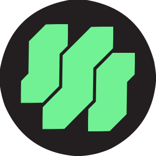
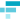
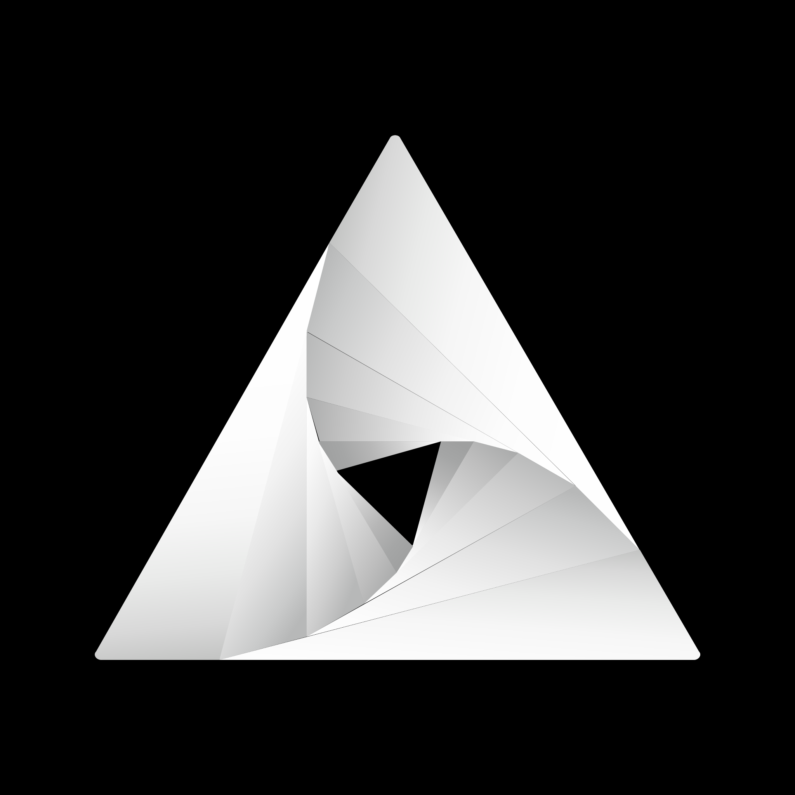
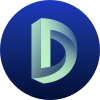
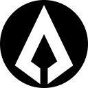
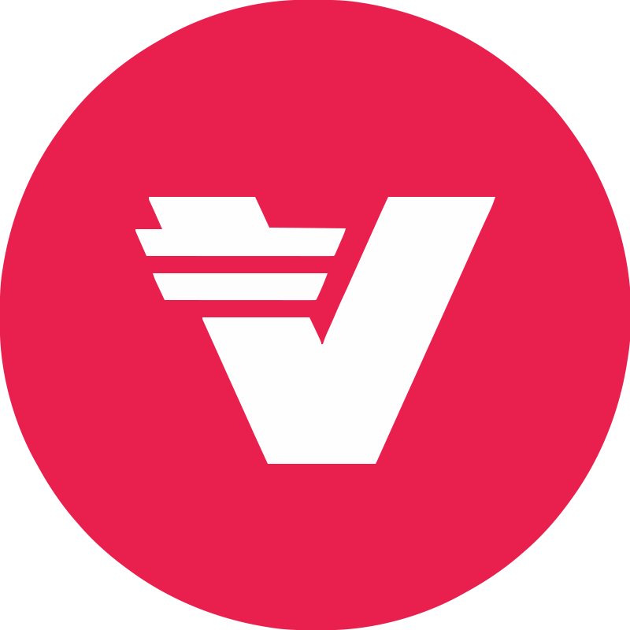

## Stats
Total cryptos: 750
### Ramps coverage
moonpay: 16.67% (125 / 750) 
onramper: 52.40% (393 / 750) 
btcdirect: 2.80% (21 / 750) 
guardarian: 46.00% (345 / 750) 
bitnovo: 4.53% (34 / 750) 
paybis: 15.87% (119 / 750) 
 **Total: 64.40% (483 / 750)**
### Swaps coverage
changelly: 41.20% (309 / 750) 
changenow: 56.93% (427 / 750) 
 **Total: 60.13% (451 / 750)**
## List
<table>
<tr>
<th>Rank</th>
<th>Logo</th>
<th>Crypto ID</th>
<th>Ramps (6)</th>
<th>Swaps (2)</th>
</tr>
<tr>
<td>1</td>
<td></td>
<td>

bitcoin@bitcoin

Name: Bitcoin 
Symbol: BTC 
Platform: bitcoin 
<a href="https://www.coingecko.com/en/coins/bitcoin">Coingecko</a> 
<a href="https://coinmarketcap.com/currencies/bitcoin/">Coinmarketcap</a> 

</td>
<td>

🟢 6

<a href="https://buy.moonpay.io/?defaultCurrencyCode=btc">moonpay</a> 
<a href="https://buy.onramper.com/?defaultCrypto=btc&onlyCryptos=btc">onramper</a> 
btcdirect 
<a href="https://guardarian.com/calculator/v1?theme=blue&type=narrow&crypto_currencies_list=%5B%7B%22ticker%22%3A%22BTC%22%2C%22network%22%3A%22BTC%22%7D%5D&fiat_currencies_list=%5B%7B%22ticker%22%3A%22USD%22%2C%22network%22%3A%22USD%22%7D%5D">guardarian</a> 
<a href="https://ramp.bitnovo.com/?defaultCrypto=BTC&onlyCryptos=BTC">bitnovo</a> 
<a href="https://widget.paybis.com/?partnerId=ef2b43e3-4492-40cb-b04c-b80fdd33a9a0&currencyCodeFrom=USD&currencyCodeTo=BTC&transactionFlow=buyCrypto">paybis</a> 

</td>
<td>

🟢 2

<a href="https://changelly.com/exchange/btc">changelly</a> 
<a href="https://changenow.io/currencies/">changenow</a> 

</td>
</tr>
<tr>
<td>2</td>
<td></td>
<td>

ethereum@optimism

Name: Optimism 
Symbol: ETH 
Platform: optimism 
<a href="https://www.coingecko.com/en/coins/ethereum">Coingecko</a> 
<a href="https://coinmarketcap.com/currencies/ethereum/">Coinmarketcap</a> 

</td>
<td>

🟢 5

<a href="https://buy.moonpay.io/?defaultCurrencyCode=eth_optimism">moonpay</a> 
<a href="https://buy.onramper.com/?defaultCrypto=eth_optimism&onlyCryptos=eth_optimism">onramper</a> 
<a href="https://guardarian.com/calculator/v1?theme=blue&type=narrow&crypto_currencies_list=%5B%7B%22ticker%22%3A%22ETH%22%2C%22network%22%3A%22OP%22%7D%5D&fiat_currencies_list=%5B%7B%22ticker%22%3A%22USD%22%2C%22network%22%3A%22USD%22%7D%5D">guardarian</a> 
<a href="https://ramp.bitnovo.com/?defaultCrypto=ETH_OP&onlyCryptos=ETH_OP">bitnovo</a> 
<a href="https://widget.paybis.com/?partnerId=ef2b43e3-4492-40cb-b04c-b80fdd33a9a0&currencyCodeFrom=USD&currencyCodeTo=ETH-OP&transactionFlow=buyCrypto">paybis</a> 

</td>
<td>

🟢 2

<a href="https://changelly.com/exchange/ethop">changelly</a> 
<a href="https://changenow.io/currencies/">changenow</a> 

</td>
</tr>
<tr>
<td>2</td>
<td></td>
<td>

ethereum@ethereum

Name: Ethereum 
Symbol: ETH 
Platform: ethereum 
<a href="https://www.coingecko.com/en/coins/ethereum">Coingecko</a> 
<a href="https://coinmarketcap.com/currencies/ethereum/">Coinmarketcap</a> 

</td>
<td>

🟢 6

<a href="https://buy.moonpay.io/?defaultCurrencyCode=eth">moonpay</a> 
<a href="https://buy.onramper.com/?defaultCrypto=eth&onlyCryptos=eth">onramper</a> 
btcdirect 
<a href="https://guardarian.com/calculator/v1?theme=blue&type=narrow&crypto_currencies_list=%5B%7B%22ticker%22%3A%22ETH%22%2C%22network%22%3A%22ETH%22%7D%5D&fiat_currencies_list=%5B%7B%22ticker%22%3A%22USD%22%2C%22network%22%3A%22USD%22%7D%5D">guardarian</a> 
<a href="https://ramp.bitnovo.com/?defaultCrypto=ETH&onlyCryptos=ETH">bitnovo</a> 
<a href="https://widget.paybis.com/?partnerId=ef2b43e3-4492-40cb-b04c-b80fdd33a9a0&currencyCodeFrom=USD&currencyCodeTo=ETH&transactionFlow=buyCrypto">paybis</a> 

</td>
<td>

🟢 2

<a href="https://changelly.com/exchange/eth">changelly</a> 
<a href="https://changenow.io/currencies/">changenow</a> 

</td>
</tr>
<tr>
<td>2</td>
<td></td>
<td>

ethereum@base

Name: Base 
Symbol: ETH 
Platform: base 
<a href="https://www.coingecko.com/en/coins/ethereum">Coingecko</a> 
<a href="https://coinmarketcap.com/currencies/ethereum/">Coinmarketcap</a> 

</td>
<td>

🟢 5

<a href="https://buy.moonpay.io/?defaultCurrencyCode=eth_base">moonpay</a> 
<a href="https://buy.onramper.com/?defaultCrypto=eth_base&onlyCryptos=eth_base">onramper</a> 
<a href="https://guardarian.com/calculator/v1?theme=blue&type=narrow&crypto_currencies_list=%5B%7B%22ticker%22%3A%22ETH%22%2C%22network%22%3A%22BASE%22%7D%5D&fiat_currencies_list=%5B%7B%22ticker%22%3A%22USD%22%2C%22network%22%3A%22USD%22%7D%5D">guardarian</a> 
<a href="https://ramp.bitnovo.com/?defaultCrypto=ETH_BASE&onlyCryptos=ETH_BASE">bitnovo</a> 
<a href="https://widget.paybis.com/?partnerId=ef2b43e3-4492-40cb-b04c-b80fdd33a9a0&currencyCodeFrom=USD&currencyCodeTo=ETH-BASE&transactionFlow=buyCrypto">paybis</a> 

</td>
<td>

🟢 2

<a href="https://changelly.com/exchange/ethbase">changelly</a> 
<a href="https://changenow.io/currencies/">changenow</a> 

</td>
</tr>
<tr>
<td>2</td>
<td></td>
<td>

ethereum@arbitrum

Name: Arbitrum 
Symbol: ETH 
Platform: arbitrum 
<a href="https://www.coingecko.com/en/coins/ethereum">Coingecko</a> 
<a href="https://coinmarketcap.com/currencies/ethereum/">Coinmarketcap</a> 

</td>
<td>

🟢 5

<a href="https://buy.moonpay.io/?defaultCurrencyCode=eth_arbitrum">moonpay</a> 
<a href="https://buy.onramper.com/?defaultCrypto=eth_arbitrum&onlyCryptos=eth_arbitrum">onramper</a> 
<a href="https://guardarian.com/calculator/v1?theme=blue&type=narrow&crypto_currencies_list=%5B%7B%22ticker%22%3A%22ETH%22%2C%22network%22%3A%22ARBITRUM%22%7D%5D&fiat_currencies_list=%5B%7B%22ticker%22%3A%22USD%22%2C%22network%22%3A%22USD%22%7D%5D">guardarian</a> 
<a href="https://ramp.bitnovo.com/?defaultCrypto=ETH_ARB&onlyCryptos=ETH_ARB">bitnovo</a> 
<a href="https://widget.paybis.com/?partnerId=ef2b43e3-4492-40cb-b04c-b80fdd33a9a0&currencyCodeFrom=USD&currencyCodeTo=ETH-ARB&transactionFlow=buyCrypto">paybis</a> 

</td>
<td>

🟢 2

<a href="https://changelly.com/exchange/etharb">changelly</a> 
<a href="https://changenow.io/currencies/">changenow</a> 

</td>
</tr>
<tr>
<td>2</td>
<td></td>
<td>

ethereum@avalanche-c-chain

Name: Ethereum 
Symbol: ETH 
Platform: avalanche-c-chain 
<a href="https://www.coingecko.com/en/coins/ethereum">Coingecko</a> 
<a href="https://coinmarketcap.com/currencies/ethereum/">Coinmarketcap</a> 

</td>
<td>

🔴 0

</td>
<td>

🔴 0

</td>
</tr>
<tr>
<td>2</td>
<td></td>
<td>

ethereum@binance-smart-chain

Name: Ethereum 
Symbol: ETH 
Platform: binance-smart-chain 
<a href="https://www.coingecko.com/en/coins/ethereum">Coingecko</a> 
<a href="https://coinmarketcap.com/currencies/ethereum/">Coinmarketcap</a> 
<a href="https://bscscan.com/token/0x2170ed0880ac9a755fd29b2688956bd959f933f8">BscScan</a> 

</td>
<td>

🟢 2

<a href="https://buy.onramper.com/?defaultCrypto=eth_bsc&onlyCryptos=eth_bsc">onramper</a> 
<a href="https://guardarian.com/calculator/v1?theme=blue&type=narrow&crypto_currencies_list=%5B%7B%22ticker%22%3A%22ETH%22%2C%22network%22%3A%22BSC%22%7D%5D&fiat_currencies_list=%5B%7B%22ticker%22%3A%22USD%22%2C%22network%22%3A%22USD%22%7D%5D">guardarian</a> 

</td>
<td>

🟢 2

<a href="https://changelly.com/exchange/ethbsc">changelly</a> 
<a href="https://changenow.io/currencies/">changenow</a> 

</td>
</tr>
<tr>
<td>2</td>
<td></td>
<td>

ethereum@polygon

Name: Ethereum 
Symbol: ETH 
Platform: polygon 
<a href="https://www.coingecko.com/en/coins/ethereum">Coingecko</a> 
<a href="https://coinmarketcap.com/currencies/ethereum/">Coinmarketcap</a> 

</td>
<td>

🟢 2

<a href="https://buy.moonpay.io/?defaultCurrencyCode=eth_polygon">moonpay</a> 
<a href="https://buy.onramper.com/?defaultCrypto=weth_polygon&onlyCryptos=weth_polygon">onramper</a> 

</td>
<td>

🔴 0

</td>
</tr>
<tr>
<td>2</td>
<td></td>
<td>

ethereum@solana

Name: Ethereum 
Symbol: ETH 
Platform: solana 
<a href="https://www.coingecko.com/en/coins/ethereum">Coingecko</a> 
<a href="https://coinmarketcap.com/currencies/ethereum/">Coinmarketcap</a> 

</td>
<td>

🔴 0

</td>
<td>

🔴 0

</td>
</tr>
<tr>
<td>3</td>
<td></td>
<td>

tether@arbitrum

Name: Tether 
Symbol: USDT 
Platform: arbitrum 
<a href="https://www.coingecko.com/en/coins/tether">Coingecko</a> 
<a href="https://coinmarketcap.com/currencies/tether/">Coinmarketcap</a> 

</td>
<td>

🟢 3

<a href="https://buy.moonpay.io/?defaultCurrencyCode=usdt_arbitrum">moonpay</a> 
<a href="https://guardarian.com/calculator/v1?theme=blue&type=narrow&crypto_currencies_list=%5B%7B%22ticker%22%3A%22USDT%22%2C%22network%22%3A%22ARBITRUM%22%7D%5D&fiat_currencies_list=%5B%7B%22ticker%22%3A%22USD%22%2C%22network%22%3A%22USD%22%7D%5D">guardarian</a> 
<a href="https://ramp.bitnovo.com/?defaultCrypto=USDT_ARB&onlyCryptos=USDT_ARB">bitnovo</a> 

</td>
<td>

🟢 2

<a href="https://changelly.com/exchange/usdtarb">changelly</a> 
<a href="https://changenow.io/currencies/">changenow</a> 

</td>
</tr>
<tr>
<td>3</td>
<td></td>
<td>

tether@avalanche-c-chain

Name: Tether 
Symbol: USDT 
Platform: avalanche-c-chain 
<a href="https://www.coingecko.com/en/coins/tether">Coingecko</a> 
<a href="https://coinmarketcap.com/currencies/tether/">Coinmarketcap</a> 

</td>
<td>

🟢 2

<a href="https://buy.onramper.com/?defaultCrypto=usdt_avaxc&onlyCryptos=usdt_avaxc">onramper</a> 
<a href="https://guardarian.com/calculator/v1?theme=blue&type=narrow&crypto_currencies_list=%5B%7B%22ticker%22%3A%22USDT%22%2C%22network%22%3A%22AVAXC%22%7D%5D&fiat_currencies_list=%5B%7B%22ticker%22%3A%22USD%22%2C%22network%22%3A%22USD%22%7D%5D">guardarian</a> 

</td>
<td>

🟢 2

<a href="https://changelly.com/exchange/usdtavac">changelly</a> 
<a href="https://changenow.io/currencies/">changenow</a> 

</td>
</tr>
<tr>
<td>3</td>
<td></td>
<td>

tether@base

Name: Tether 
Symbol: USDT 
Platform: base 
<a href="https://www.coingecko.com/en/coins/l2-standard-bridged-usdt-base">Coingecko</a> 
<a href="https://coinmarketcap.com/currencies/tether/">Coinmarketcap</a> 

</td>
<td>

🔴 0

</td>
<td>

🔴 0

</td>
</tr>
<tr>
<td>3</td>
<td></td>
<td>

tether@binance-smart-chain

Name: Tether 
Symbol: USDT 
Platform: binance-smart-chain 
<a href="https://www.coingecko.com/en/coins/tether">Coingecko</a> 
<a href="https://coinmarketcap.com/currencies/tether/">Coinmarketcap</a> 
<a href="https://bscscan.com/token/0x55d398326f99059ff775485246999027b3197955">BscScan</a> 

</td>
<td>

🟢 4

<a href="https://buy.moonpay.io/?defaultCurrencyCode=usdt_bsc">moonpay</a> 
<a href="https://buy.onramper.com/?defaultCrypto=usdt_bsc&onlyCryptos=usdt_bsc">onramper</a> 
<a href="https://guardarian.com/calculator/v1?theme=blue&type=narrow&crypto_currencies_list=%5B%7B%22ticker%22%3A%22USDT%22%2C%22network%22%3A%22BSC%22%7D%5D&fiat_currencies_list=%5B%7B%22ticker%22%3A%22USD%22%2C%22network%22%3A%22USD%22%7D%5D">guardarian</a> 
<a href="https://widget.paybis.com/?partnerId=ef2b43e3-4492-40cb-b04c-b80fdd33a9a0&currencyCodeFrom=USD&currencyCodeTo=USDT-BEP20&transactionFlow=buyCrypto">paybis</a> 

</td>
<td>

🟢 2

<a href="https://changelly.com/exchange/usdtbsc">changelly</a> 
<a href="https://changenow.io/currencies/">changenow</a> 

</td>
</tr>
<tr>
<td>3</td>
<td></td>
<td>

tether@ethereum

Name: Tether 
Symbol: USDT 
Platform: ethereum 
<a href="https://www.coingecko.com/en/coins/tether">Coingecko</a> 
<a href="https://coinmarketcap.com/currencies/tether/">Coinmarketcap</a> 
<a href="https://etherscan.io/token/0xdac17f958d2ee523a2206206994597c13d831ec7">EtherScan</a> 

</td>
<td>

🟢 6

<a href="https://buy.moonpay.io/?defaultCurrencyCode=usdt">moonpay</a> 
<a href="https://buy.onramper.com/?defaultCrypto=usdt_ethereum&onlyCryptos=usdt_ethereum">onramper</a> 
btcdirect 
<a href="https://guardarian.com/calculator/v1?theme=blue&type=narrow&crypto_currencies_list=%5B%7B%22ticker%22%3A%22USDT%22%2C%22network%22%3A%22ETH%22%7D%5D&fiat_currencies_list=%5B%7B%22ticker%22%3A%22USD%22%2C%22network%22%3A%22USD%22%7D%5D">guardarian</a> 
<a href="https://ramp.bitnovo.com/?defaultCrypto=USDT_ETH&onlyCryptos=USDT_ETH">bitnovo</a> 
<a href="https://widget.paybis.com/?partnerId=ef2b43e3-4492-40cb-b04c-b80fdd33a9a0&currencyCodeFrom=USD&currencyCodeTo=USDT&transactionFlow=buyCrypto">paybis</a> 

</td>
<td>

🟢 2

<a href="https://changelly.com/exchange/usdt20">changelly</a> 
<a href="https://changenow.io/currencies/">changenow</a> 

</td>
</tr>
<tr>
<td>3</td>
<td></td>
<td>

tether@fantom

Name: Tether 
Symbol: USDT 
Platform: fantom 
<a href="https://www.coingecko.com/en/coins/tether">Coingecko</a> 
<a href="https://coinmarketcap.com/currencies/tether/">Coinmarketcap</a> 

</td>
<td>

🟢 1

<a href="https://buy.onramper.com/?defaultCrypto=fusdt_fantom&onlyCryptos=fusdt_fantom">onramper</a> 

</td>
<td>

🔴 0

</td>
</tr>
<tr>
<td>3</td>
<td></td>
<td>

tether@optimism

Name: Tether 
Symbol: USDT 
Platform: optimism 
<a href="https://www.coingecko.com/en/coins/tether">Coingecko</a> 
<a href="https://coinmarketcap.com/currencies/tether/">Coinmarketcap</a> 

</td>
<td>

🟢 4

<a href="https://buy.moonpay.io/?defaultCurrencyCode=usdt_optimism">moonpay</a> 
<a href="https://buy.onramper.com/?defaultCrypto=usdt_optimism&onlyCryptos=usdt_optimism">onramper</a> 
<a href="https://guardarian.com/calculator/v1?theme=blue&type=narrow&crypto_currencies_list=%5B%7B%22ticker%22%3A%22USDT%22%2C%22network%22%3A%22OP%22%7D%5D&fiat_currencies_list=%5B%7B%22ticker%22%3A%22USD%22%2C%22network%22%3A%22USD%22%7D%5D">guardarian</a> 
<a href="https://ramp.bitnovo.com/?defaultCrypto=USDT_OP&onlyCryptos=USDT_OP">bitnovo</a> 

</td>
<td>

🟢 2

<a href="https://changelly.com/exchange/usdtop">changelly</a> 
<a href="https://changenow.io/currencies/">changenow</a> 

</td>
</tr>
<tr>
<td>3</td>
<td></td>
<td>

tether@polygon

Name: Tether 
Symbol: USDT 
Platform: polygon 
<a href="https://www.coingecko.com/en/coins/tether">Coingecko</a> 
<a href="https://coinmarketcap.com/currencies/tether/">Coinmarketcap</a> 

</td>
<td>

🟢 5

<a href="https://buy.moonpay.io/?defaultCurrencyCode=usdt_polygon">moonpay</a> 
<a href="https://buy.onramper.com/?defaultCrypto=usdt_polygon&onlyCryptos=usdt_polygon">onramper</a> 
<a href="https://guardarian.com/calculator/v1?theme=blue&type=narrow&crypto_currencies_list=%5B%7B%22ticker%22%3A%22USDT%22%2C%22network%22%3A%22MATIC%22%7D%5D&fiat_currencies_list=%5B%7B%22ticker%22%3A%22USD%22%2C%22network%22%3A%22USD%22%7D%5D">guardarian</a> 
<a href="https://ramp.bitnovo.com/?defaultCrypto=USDT_MATIC&onlyCryptos=USDT_MATIC">bitnovo</a> 
<a href="https://widget.paybis.com/?partnerId=ef2b43e3-4492-40cb-b04c-b80fdd33a9a0&currencyCodeFrom=USD&currencyCodeTo=USDT-POLYGON&transactionFlow=buyCrypto">paybis</a> 

</td>
<td>

🟢 2

<a href="https://changelly.com/exchange/usdtpolygon">changelly</a> 
<a href="https://changenow.io/currencies/">changenow</a> 

</td>
</tr>
<tr>
<td>3</td>
<td></td>
<td>

tether@solana

Name: Tether 
Symbol: USDT 
Platform: solana 
<a href="https://www.coingecko.com/en/coins/tether">Coingecko</a> 
<a href="https://coinmarketcap.com/currencies/tether/">Coinmarketcap</a> 

</td>
<td>

🟢 5

<a href="https://buy.moonpay.io/?defaultCurrencyCode=usdt_sol">moonpay</a> 
<a href="https://buy.onramper.com/?defaultCrypto=usdt_solana&onlyCryptos=usdt_solana">onramper</a> 
<a href="https://guardarian.com/calculator/v1?theme=blue&type=narrow&crypto_currencies_list=%5B%7B%22ticker%22%3A%22USDT%22%2C%22network%22%3A%22SOL%22%7D%5D&fiat_currencies_list=%5B%7B%22ticker%22%3A%22USD%22%2C%22network%22%3A%22USD%22%7D%5D">guardarian</a> 
<a href="https://ramp.bitnovo.com/?defaultCrypto=USDT_SOL&onlyCryptos=USDT_SOL">bitnovo</a> 
<a href="https://widget.paybis.com/?partnerId=ef2b43e3-4492-40cb-b04c-b80fdd33a9a0&currencyCodeFrom=USD&currencyCodeTo=USDT-SOL&transactionFlow=buyCrypto">paybis</a> 

</td>
<td>

🟢 2

<a href="https://changelly.com/exchange/usdtsol">changelly</a> 
<a href="https://changenow.io/currencies/">changenow</a> 

</td>
</tr>
<tr>
<td>3</td>
<td></td>
<td>

tether@sui

Name: Tether 
Symbol: USDT 
Platform: sui 
<a href="https://www.coingecko.com/en/coins/sui-bridged-usdt-sui">Coingecko</a> 
<a href="https://coinmarketcap.com/currencies/tether/">Coinmarketcap</a> 

</td>
<td>

🔴 0

</td>
<td>

🔴 0

</td>
</tr>
<tr>
<td>3</td>
<td></td>
<td>

tether@toncoin

Name: Tether 
Symbol: USDT 
Platform: toncoin 
<a href="https://www.coingecko.com/en/coins/tether">Coingecko</a> 
<a href="https://coinmarketcap.com/currencies/tether/">Coinmarketcap</a> 

</td>
<td>

🟢 2

<a href="https://buy.moonpay.io/?defaultCurrencyCode=usdt_ton">moonpay</a> 
<a href="https://guardarian.com/calculator/v1?theme=blue&type=narrow&crypto_currencies_list=%5B%7B%22ticker%22%3A%22USDT%22%2C%22network%22%3A%22TON%22%7D%5D&fiat_currencies_list=%5B%7B%22ticker%22%3A%22USD%22%2C%22network%22%3A%22USD%22%7D%5D">guardarian</a> 

</td>
<td>

🟢 2

<a href="https://changelly.com/exchange/usdton">changelly</a> 
<a href="https://changenow.io/currencies/">changenow</a> 

</td>
</tr>
<tr>
<td>3</td>
<td></td>
<td>

tether@tron

Name: Tether 
Symbol: USDT 
Platform: tron 
<a href="https://www.coingecko.com/en/coins/tether">Coingecko</a> 
<a href="https://coinmarketcap.com/currencies/tether/">Coinmarketcap</a> 

</td>
<td>

🟢 5

<a href="https://buy.moonpay.io/?defaultCurrencyCode=usdt_trx">moonpay</a> 
<a href="https://buy.onramper.com/?defaultCrypto=usdt_tron&onlyCryptos=usdt_tron">onramper</a> 
<a href="https://guardarian.com/calculator/v1?theme=blue&type=narrow&crypto_currencies_list=%5B%7B%22ticker%22%3A%22USDT%22%2C%22network%22%3A%22TRX%22%7D%5D&fiat_currencies_list=%5B%7B%22ticker%22%3A%22USD%22%2C%22network%22%3A%22USD%22%7D%5D">guardarian</a> 
<a href="https://ramp.bitnovo.com/?defaultCrypto=USDT_TRX&onlyCryptos=USDT_TRX">bitnovo</a> 
<a href="https://widget.paybis.com/?partnerId=ef2b43e3-4492-40cb-b04c-b80fdd33a9a0&currencyCodeFrom=USD&currencyCodeTo=USDT-TRC20&transactionFlow=buyCrypto">paybis</a> 

</td>
<td>

🟢 2

<a href="https://changelly.com/exchange/usdtrx">changelly</a> 
<a href="https://changenow.io/currencies/">changenow</a> 

</td>
</tr>
<tr>
<td>4</td>
<td></td>
<td>

xrp@ripple

Name: XRP 
Symbol: XRP 
Platform: ripple 
<a href="https://www.coingecko.com/en/coins/ripple">Coingecko</a> 
<a href="https://coinmarketcap.com/currencies/xrp/">Coinmarketcap</a> 

</td>
<td>

🟢 6

<a href="https://buy.moonpay.io/?defaultCurrencyCode=xrp">moonpay</a> 
<a href="https://buy.onramper.com/?defaultCrypto=xrp_ripple&onlyCryptos=xrp_ripple">onramper</a> 
btcdirect 
<a href="https://guardarian.com/calculator/v1?theme=blue&type=narrow&crypto_currencies_list=%5B%7B%22ticker%22%3A%22XRP%22%2C%22network%22%3A%22XRP%22%7D%5D&fiat_currencies_list=%5B%7B%22ticker%22%3A%22USD%22%2C%22network%22%3A%22USD%22%7D%5D">guardarian</a> 
<a href="https://ramp.bitnovo.com/?defaultCrypto=XRP&onlyCryptos=XRP">bitnovo</a> 
<a href="https://widget.paybis.com/?partnerId=ef2b43e3-4492-40cb-b04c-b80fdd33a9a0&currencyCodeFrom=USD&currencyCodeTo=XRP&transactionFlow=buyCrypto">paybis</a> 

</td>
<td>

🟢 2

<a href="https://changelly.com/exchange/xrp">changelly</a> 
<a href="https://changenow.io/currencies/">changenow</a> 

</td>
</tr>
<tr>
<td>4</td>
<td></td>
<td>

xrp@binance-smart-chain

Name: XRP 
Symbol: XRP 
Platform: binance-smart-chain 
<a href="https://www.coingecko.com/en/coins/binance-peg-xrp">Coingecko</a> 
<a href="https://coinmarketcap.com/currencies/xrp/">Coinmarketcap</a> 
<a href="https://bscscan.com/token/0x1d2f0da169ceb9fc7b3144628db156f3f6c60dbe">BscScan</a> 

</td>
<td>

🟢 2

<a href="https://buy.onramper.com/?defaultCrypto=xrp_bsc&onlyCryptos=xrp_bsc">onramper</a> 
<a href="https://guardarian.com/calculator/v1?theme=blue&type=narrow&crypto_currencies_list=%5B%7B%22ticker%22%3A%22XRP%22%2C%22network%22%3A%22BSC%22%7D%5D&fiat_currencies_list=%5B%7B%22ticker%22%3A%22USD%22%2C%22network%22%3A%22USD%22%7D%5D">guardarian</a> 

</td>
<td>

🟢 1

<a href="https://changenow.io/currencies/">changenow</a> 

</td>
</tr>
<tr>
<td>5</td>
<td></td>
<td>

binance-coin@binance-smart-chain

Name: Binance Smart Chain 
Symbol: BNB 
Platform: binance-smart-chain 
<a href="https://www.coingecko.com/en/coins/binancecoin">Coingecko</a> 
<a href="https://coinmarketcap.com/currencies/bnb/">Coinmarketcap</a> 

</td>
<td>

🟢 5

<a href="https://buy.moonpay.io/?defaultCurrencyCode=bnb_bsc">moonpay</a> 
<a href="https://buy.onramper.com/?defaultCrypto=bnb_bsc&onlyCryptos=bnb_bsc">onramper</a> 
btcdirect 
<a href="https://guardarian.com/calculator/v1?theme=blue&type=narrow&crypto_currencies_list=%5B%7B%22ticker%22%3A%22BNB%22%2C%22network%22%3A%22BSC%22%7D%5D&fiat_currencies_list=%5B%7B%22ticker%22%3A%22USD%22%2C%22network%22%3A%22USD%22%7D%5D">guardarian</a> 
<a href="https://widget.paybis.com/?partnerId=ef2b43e3-4492-40cb-b04c-b80fdd33a9a0&currencyCodeFrom=USD&currencyCodeTo=BNBSC&transactionFlow=buyCrypto">paybis</a> 

</td>
<td>

🟢 2

<a href="https://changelly.com/exchange/bnbbsc">changelly</a> 
<a href="https://changenow.io/currencies/">changenow</a> 

</td>
</tr>
<tr>
<td>5</td>
<td></td>
<td>

binance-coin@ethereum

Name: Binance Chain 
Symbol: BNB 
Platform: ethereum 
<a href="https://www.coingecko.com/en/coins/binancecoin">Coingecko</a> 
<a href="https://coinmarketcap.com/currencies/bnb/">Coinmarketcap</a> 
<a href="https://etherscan.io/token/0xb8c77482e45f1f44de1745f52c74426c631bdd52">EtherScan</a> 

</td>
<td>

🟢 1

<a href="https://guardarian.com/calculator/v1?theme=blue&type=narrow&crypto_currencies_list=%5B%7B%22ticker%22%3A%22BNB%22%2C%22network%22%3A%22ETH%22%7D%5D&fiat_currencies_list=%5B%7B%22ticker%22%3A%22USD%22%2C%22network%22%3A%22USD%22%7D%5D">guardarian</a> 

</td>
<td>

🔴 0

</td>
</tr>
<tr>
<td>5</td>
<td></td>
<td>

binance-coin@polygon

Name: Binance Chain 
Symbol: BNB 
Platform: polygon 
<a href="https://www.coingecko.com/en/coins/binancecoin">Coingecko</a> 
<a href="https://coinmarketcap.com/currencies/bnb/">Coinmarketcap</a> 

</td>
<td>

🔴 0

</td>
<td>

🔴 0

</td>
</tr>
<tr>
<td>6</td>
<td></td>
<td>

solana@solana

Name: Solana 
Symbol: SOL 
Platform: solana 
<a href="https://www.coingecko.com/en/coins/solana">Coingecko</a> 
<a href="https://coinmarketcap.com/currencies/solana/">Coinmarketcap</a> 

</td>
<td>

🟢 6

<a href="https://buy.moonpay.io/?defaultCurrencyCode=sol">moonpay</a> 
<a href="https://buy.onramper.com/?defaultCrypto=sol&onlyCryptos=sol">onramper</a> 
btcdirect 
<a href="https://guardarian.com/calculator/v1?theme=blue&type=narrow&crypto_currencies_list=%5B%7B%22ticker%22%3A%22SOL%22%2C%22network%22%3A%22SOL%22%7D%5D&fiat_currencies_list=%5B%7B%22ticker%22%3A%22USD%22%2C%22network%22%3A%22USD%22%7D%5D">guardarian</a> 
<a href="https://ramp.bitnovo.com/?defaultCrypto=SOL&onlyCryptos=SOL">bitnovo</a> 
<a href="https://widget.paybis.com/?partnerId=ef2b43e3-4492-40cb-b04c-b80fdd33a9a0&currencyCodeFrom=USD&currencyCodeTo=SOL&transactionFlow=buyCrypto">paybis</a> 

</td>
<td>

🟢 2

<a href="https://changelly.com/exchange/sol">changelly</a> 
<a href="https://changenow.io/currencies/">changenow</a> 

</td>
</tr>
<tr>
<td>7</td>
<td></td>
<td>

usd-coin@arbitrum

Name: USDC 
Symbol: USDC 
Platform: arbitrum 
<a href="https://www.coingecko.com/en/coins/usd-coin">Coingecko</a> 
<a href="https://coinmarketcap.com/currencies/usd-coin/">Coinmarketcap</a> 

</td>
<td>

🟢 4

<a href="https://buy.moonpay.io/?defaultCurrencyCode=usdc_arbitrum">moonpay</a> 
<a href="https://buy.onramper.com/?defaultCrypto=usdc_arbitrum&onlyCryptos=usdc_arbitrum">onramper</a> 
<a href="https://guardarian.com/calculator/v1?theme=blue&type=narrow&crypto_currencies_list=%5B%7B%22ticker%22%3A%22USDC%22%2C%22network%22%3A%22ARBITRUM%22%7D%5D&fiat_currencies_list=%5B%7B%22ticker%22%3A%22USD%22%2C%22network%22%3A%22USD%22%7D%5D">guardarian</a> 
<a href="https://ramp.bitnovo.com/?defaultCrypto=USDC_ARB&onlyCryptos=USDC_ARB">bitnovo</a> 

</td>
<td>

🟢 2

<a href="https://changelly.com/exchange/usdcarb">changelly</a> 
<a href="https://changenow.io/currencies/">changenow</a> 

</td>
</tr>
<tr>
<td>7</td>
<td></td>
<td>

usd-coin@avalanche-c-chain

Name: USDC 
Symbol: USDC 
Platform: avalanche-c-chain 
<a href="https://www.coingecko.com/en/coins/usd-coin">Coingecko</a> 
<a href="https://coinmarketcap.com/currencies/usd-coin/">Coinmarketcap</a> 

</td>
<td>

🟢 3

<a href="https://buy.moonpay.io/?defaultCurrencyCode=usdc_cchain">moonpay</a> 
<a href="https://buy.onramper.com/?defaultCrypto=usdc_avaxc&onlyCryptos=usdc_avaxc">onramper</a> 
<a href="https://guardarian.com/calculator/v1?theme=blue&type=narrow&crypto_currencies_list=%5B%7B%22ticker%22%3A%22USDC%22%2C%22network%22%3A%22AVAXC%22%7D%5D&fiat_currencies_list=%5B%7B%22ticker%22%3A%22USD%22%2C%22network%22%3A%22USD%22%7D%5D">guardarian</a> 

</td>
<td>

🟢 2

<a href="https://changelly.com/exchange/usdcavac">changelly</a> 
<a href="https://changenow.io/currencies/">changenow</a> 

</td>
</tr>
<tr>
<td>7</td>
<td></td>
<td>

usd-coin@base

Name: USDC 
Symbol: USDC 
Platform: base 
<a href="https://www.coingecko.com/en/coins/usd-coin">Coingecko</a> 
<a href="https://coinmarketcap.com/currencies/usd-coin/">Coinmarketcap</a> 

</td>
<td>

🟢 5

<a href="https://buy.moonpay.io/?defaultCurrencyCode=usdc_base">moonpay</a> 
<a href="https://buy.onramper.com/?defaultCrypto=usdc_base&onlyCryptos=usdc_base">onramper</a> 
<a href="https://guardarian.com/calculator/v1?theme=blue&type=narrow&crypto_currencies_list=%5B%7B%22ticker%22%3A%22USDC%22%2C%22network%22%3A%22BASE%22%7D%5D&fiat_currencies_list=%5B%7B%22ticker%22%3A%22USD%22%2C%22network%22%3A%22USD%22%7D%5D">guardarian</a> 
<a href="https://ramp.bitnovo.com/?defaultCrypto=USDC_BASE&onlyCryptos=USDC_BASE">bitnovo</a> 
<a href="https://widget.paybis.com/?partnerId=ef2b43e3-4492-40cb-b04c-b80fdd33a9a0&currencyCodeFrom=USD&currencyCodeTo=USDC-BASE&transactionFlow=buyCrypto">paybis</a> 

</td>
<td>

🟢 2

<a href="https://changelly.com/exchange/usdcbase">changelly</a> 
<a href="https://changenow.io/currencies/">changenow</a> 

</td>
</tr>
<tr>
<td>7</td>
<td></td>
<td>

usd-coin@binance-smart-chain

Name: USDC 
Symbol: USDC 
Platform: binance-smart-chain 
<a href="https://www.coingecko.com/en/coins/usd-coin">Coingecko</a> 
<a href="https://coinmarketcap.com/currencies/usd-coin/">Coinmarketcap</a> 
<a href="https://bscscan.com/token/0x8ac76a51cc950d9822d68b83fe1ad97b32cd580d">BscScan</a> 

</td>
<td>

🟢 3

<a href="https://buy.moonpay.io/?defaultCurrencyCode=usdc_bsc">moonpay</a> 
<a href="https://buy.onramper.com/?defaultCrypto=usdc_bsc&onlyCryptos=usdc_bsc">onramper</a> 
<a href="https://guardarian.com/calculator/v1?theme=blue&type=narrow&crypto_currencies_list=%5B%7B%22ticker%22%3A%22USDC%22%2C%22network%22%3A%22BSC%22%7D%5D&fiat_currencies_list=%5B%7B%22ticker%22%3A%22USD%22%2C%22network%22%3A%22USD%22%7D%5D">guardarian</a> 

</td>
<td>

🟢 2

<a href="https://changelly.com/exchange/usdcbsc">changelly</a> 
<a href="https://changenow.io/currencies/">changenow</a> 

</td>
</tr>
<tr>
<td>7</td>
<td></td>
<td>

usd-coin@ethereum

Name: USDC 
Symbol: USDC 
Platform: ethereum 
<a href="https://www.coingecko.com/en/coins/usd-coin">Coingecko</a> 
<a href="https://coinmarketcap.com/currencies/usd-coin/">Coinmarketcap</a> 
<a href="https://etherscan.io/token/0xa0b86991c6218b36c1d19d4a2e9eb0ce3606eb48">EtherScan</a> 

</td>
<td>

🟢 6

<a href="https://buy.moonpay.io/?defaultCurrencyCode=usdc">moonpay</a> 
<a href="https://buy.onramper.com/?defaultCrypto=usdc_ethereum&onlyCryptos=usdc_ethereum">onramper</a> 
btcdirect 
<a href="https://guardarian.com/calculator/v1?theme=blue&type=narrow&crypto_currencies_list=%5B%7B%22ticker%22%3A%22USDC%22%2C%22network%22%3A%22ETH%22%7D%5D&fiat_currencies_list=%5B%7B%22ticker%22%3A%22USD%22%2C%22network%22%3A%22USD%22%7D%5D">guardarian</a> 
<a href="https://ramp.bitnovo.com/?defaultCrypto=USDC_ETH&onlyCryptos=USDC_ETH">bitnovo</a> 
<a href="https://widget.paybis.com/?partnerId=ef2b43e3-4492-40cb-b04c-b80fdd33a9a0&currencyCodeFrom=USD&currencyCodeTo=USDC&transactionFlow=buyCrypto">paybis</a> 

</td>
<td>

🟢 2

<a href="https://changelly.com/exchange/usdc">changelly</a> 
<a href="https://changenow.io/currencies/">changenow</a> 

</td>
</tr>
<tr>
<td>7</td>
<td></td>
<td>

usd-coin@fantom

Name: USDC 
Symbol: USDC 
Platform: fantom 
<a href="https://www.coingecko.com/en/coins/usd-coin">Coingecko</a> 
<a href="https://coinmarketcap.com/currencies/usd-coin/">Coinmarketcap</a> 

</td>
<td>

🔴 0

</td>
<td>

🔴 0

</td>
</tr>
<tr>
<td>7</td>
<td></td>
<td>

usd-coin@optimism

Name: USDC 
Symbol: USDC 
Platform: optimism 
<a href="https://www.coingecko.com/en/coins/usd-coin">Coingecko</a> 
<a href="https://coinmarketcap.com/currencies/usd-coin/">Coinmarketcap</a> 

</td>
<td>

🟢 2

<a href="https://guardarian.com/calculator/v1?theme=blue&type=narrow&crypto_currencies_list=%5B%7B%22ticker%22%3A%22USDC%22%2C%22network%22%3A%22OP%22%7D%5D&fiat_currencies_list=%5B%7B%22ticker%22%3A%22USD%22%2C%22network%22%3A%22USD%22%7D%5D">guardarian</a> 
<a href="https://ramp.bitnovo.com/?defaultCrypto=USDC_OP&onlyCryptos=USDC_OP">bitnovo</a> 

</td>
<td>

🟢 2

<a href="https://changelly.com/exchange/usdcop">changelly</a> 
<a href="https://changenow.io/currencies/">changenow</a> 

</td>
</tr>
<tr>
<td>7</td>
<td></td>
<td>

usd-coin@polygon

Name: USDC 
Symbol: USDC 
Platform: polygon 
<a href="https://www.coingecko.com/en/coins/usd-coin">Coingecko</a> 
<a href="https://coinmarketcap.com/currencies/usd-coin/">Coinmarketcap</a> 

</td>
<td>

🟢 5

<a href="https://buy.moonpay.io/?defaultCurrencyCode=usdc_polygon">moonpay</a> 
<a href="https://buy.onramper.com/?defaultCrypto=usdc_polygon&onlyCryptos=usdc_polygon">onramper</a> 
<a href="https://guardarian.com/calculator/v1?theme=blue&type=narrow&crypto_currencies_list=%5B%7B%22ticker%22%3A%22USDC%22%2C%22network%22%3A%22MATIC%22%7D%5D&fiat_currencies_list=%5B%7B%22ticker%22%3A%22USD%22%2C%22network%22%3A%22USD%22%7D%5D">guardarian</a> 
<a href="https://ramp.bitnovo.com/?defaultCrypto=USDC_MATIC&onlyCryptos=USDC_MATIC">bitnovo</a> 
<a href="https://widget.paybis.com/?partnerId=ef2b43e3-4492-40cb-b04c-b80fdd33a9a0&currencyCodeFrom=USD&currencyCodeTo=USDC-POLYGON&transactionFlow=buyCrypto">paybis</a> 

</td>
<td>

🟢 2

<a href="https://changelly.com/exchange/usdcmatic">changelly</a> 
<a href="https://changenow.io/currencies/">changenow</a> 

</td>
</tr>
<tr>
<td>7</td>
<td></td>
<td>

usd-coin@solana

Name: USDC 
Symbol: USDC 
Platform: solana 
<a href="https://www.coingecko.com/en/coins/usd-coin">Coingecko</a> 
<a href="https://coinmarketcap.com/currencies/usd-coin/">Coinmarketcap</a> 

</td>
<td>

🟢 5

<a href="https://buy.moonpay.io/?defaultCurrencyCode=usdc_sol">moonpay</a> 
<a href="https://buy.onramper.com/?defaultCrypto=usdc_solana&onlyCryptos=usdc_solana">onramper</a> 
<a href="https://guardarian.com/calculator/v1?theme=blue&type=narrow&crypto_currencies_list=%5B%7B%22ticker%22%3A%22USDC%22%2C%22network%22%3A%22SOL%22%7D%5D&fiat_currencies_list=%5B%7B%22ticker%22%3A%22USD%22%2C%22network%22%3A%22USD%22%7D%5D">guardarian</a> 
<a href="https://ramp.bitnovo.com/?defaultCrypto=USDC_SOL&onlyCryptos=USDC_SOL">bitnovo</a> 
<a href="https://widget.paybis.com/?partnerId=ef2b43e3-4492-40cb-b04c-b80fdd33a9a0&currencyCodeFrom=USD&currencyCodeTo=USDC-SOL&transactionFlow=buyCrypto">paybis</a> 

</td>
<td>

🟢 2

<a href="https://changelly.com/exchange/usdcsol">changelly</a> 
<a href="https://changenow.io/currencies/">changenow</a> 

</td>
</tr>
<tr>
<td>7</td>
<td></td>
<td>

usd-coin@sonic

Name: USDC 
Symbol: USDC 
Platform: sonic 
<a href="https://www.coingecko.com/en/coins/usd-coin">Coingecko</a> 
<a href="https://coinmarketcap.com/currencies/usd-coin/">Coinmarketcap</a> 

</td>
<td>

🔴 0

</td>
<td>

🔴 0

</td>
</tr>
<tr>
<td>7</td>
<td></td>
<td>

usd-coin@sui

Name: USDC 
Symbol: USDC 
Platform: sui 
<a href="https://www.coingecko.com/en/coins/usd-coin">Coingecko</a> 
<a href="https://coinmarketcap.com/currencies/usd-coin/">Coinmarketcap</a> 

</td>
<td>

🟢 1

<a href="https://buy.onramper.com/?defaultCrypto=usdc_sui&onlyCryptos=usdc_sui">onramper</a> 

</td>
<td>

🟢 1

<a href="https://changelly.com/exchange/usdcsui">changelly</a> 

</td>
</tr>
<tr>
<td>7</td>
<td></td>
<td>

usd-coin@tron

Name: USDC 
Symbol: USDC 
Platform: tron 
<a href="https://www.coingecko.com/en/coins/usd-coin">Coingecko</a> 
<a href="https://coinmarketcap.com/currencies/usd-coin/">Coinmarketcap</a> 

</td>
<td>

🟢 2

<a href="https://buy.onramper.com/?defaultCrypto=usdc_tron&onlyCryptos=usdc_tron">onramper</a> 
<a href="https://guardarian.com/calculator/v1?theme=blue&type=narrow&crypto_currencies_list=%5B%7B%22ticker%22%3A%22USDC%22%2C%22network%22%3A%22TRX%22%7D%5D&fiat_currencies_list=%5B%7B%22ticker%22%3A%22USD%22%2C%22network%22%3A%22USD%22%7D%5D">guardarian</a> 

</td>
<td>

🔴 0

</td>
</tr>
<tr>
<td>8</td>
<td></td>
<td>

dogecoin@dogecoin

Name: Dogecoin 
Symbol: DOGE 
Platform: dogecoin 
<a href="https://www.coingecko.com/en/coins/dogecoin">Coingecko</a> 
<a href="https://coinmarketcap.com/currencies/dogecoin/">Coinmarketcap</a> 

</td>
<td>

🟢 6

<a href="https://buy.moonpay.io/?defaultCurrencyCode=doge">moonpay</a> 
<a href="https://buy.onramper.com/?defaultCrypto=doge_dogecoin&onlyCryptos=doge_dogecoin">onramper</a> 
btcdirect 
<a href="https://guardarian.com/calculator/v1?theme=blue&type=narrow&crypto_currencies_list=%5B%7B%22ticker%22%3A%22DOGE%22%2C%22network%22%3A%22DOGE%22%7D%5D&fiat_currencies_list=%5B%7B%22ticker%22%3A%22USD%22%2C%22network%22%3A%22USD%22%7D%5D">guardarian</a> 
<a href="https://ramp.bitnovo.com/?defaultCrypto=DOGE&onlyCryptos=DOGE">bitnovo</a> 
<a href="https://widget.paybis.com/?partnerId=ef2b43e3-4492-40cb-b04c-b80fdd33a9a0&currencyCodeFrom=USD&currencyCodeTo=DOGE&transactionFlow=buyCrypto">paybis</a> 

</td>
<td>

🟢 2

<a href="https://changelly.com/exchange/doge">changelly</a> 
<a href="https://changenow.io/currencies/">changenow</a> 

</td>
</tr>
<tr>
<td>8</td>
<td></td>
<td>

dogecoin@binance-smart-chain

Name: Dogecoin 
Symbol: DOGE 
Platform: binance-smart-chain 
<a href="https://www.coingecko.com/en/coins/binance-peg-dogecoin">Coingecko</a> 
<a href="https://coinmarketcap.com/currencies/dogecoin/">Coinmarketcap</a> 
<a href="https://bscscan.com/token/0xba2ae424d960c26247dd6c32edc70b295c744c43">BscScan</a> 

</td>
<td>

🟢 2

<a href="https://buy.onramper.com/?defaultCrypto=doge_bsc&onlyCryptos=doge_bsc">onramper</a> 
<a href="https://guardarian.com/calculator/v1?theme=blue&type=narrow&crypto_currencies_list=%5B%7B%22ticker%22%3A%22DOGE%22%2C%22network%22%3A%22BSC%22%7D%5D&fiat_currencies_list=%5B%7B%22ticker%22%3A%22USD%22%2C%22network%22%3A%22USD%22%7D%5D">guardarian</a> 

</td>
<td>

🟢 2

<a href="https://changelly.com/exchange/dogebsc">changelly</a> 
<a href="https://changenow.io/currencies/">changenow</a> 

</td>
</tr>
<tr>
<td>9</td>
<td></td>
<td>

tron@tron

Name: TRON 
Symbol: TRX 
Platform: tron 
<a href="https://www.coingecko.com/en/coins/tron">Coingecko</a> 
<a href="https://coinmarketcap.com/currencies/tron/">Coinmarketcap</a> 

</td>
<td>

🟢 6

<a href="https://buy.moonpay.io/?defaultCurrencyCode=trx">moonpay</a> 
<a href="https://buy.onramper.com/?defaultCrypto=trx_tron&onlyCryptos=trx_tron">onramper</a> 
btcdirect 
<a href="https://guardarian.com/calculator/v1?theme=blue&type=narrow&crypto_currencies_list=%5B%7B%22ticker%22%3A%22TRX%22%2C%22network%22%3A%22TRX%22%7D%5D&fiat_currencies_list=%5B%7B%22ticker%22%3A%22USD%22%2C%22network%22%3A%22USD%22%7D%5D">guardarian</a> 
<a href="https://ramp.bitnovo.com/?defaultCrypto=TRX&onlyCryptos=TRX">bitnovo</a> 
<a href="https://widget.paybis.com/?partnerId=ef2b43e3-4492-40cb-b04c-b80fdd33a9a0&currencyCodeFrom=USD&currencyCodeTo=TRX&transactionFlow=buyCrypto">paybis</a> 

</td>
<td>

🟢 2

<a href="https://changelly.com/exchange/trx">changelly</a> 
<a href="https://changenow.io/currencies/">changenow</a> 

</td>
</tr>
<tr>
<td>9</td>
<td></td>
<td>

tron@binance-smart-chain

Name: TRON 
Symbol: TRX 
Platform: binance-smart-chain 
<a href="https://www.coingecko.com/en/coins/tron">Coingecko</a> 
<a href="https://coinmarketcap.com/currencies/tron/">Coinmarketcap</a> 
<a href="https://bscscan.com/token/0xce7de646e7208a4ef112cb6ed5038fa6cc6b12e3">BscScan</a> 

</td>
<td>

🟢 2

<a href="https://buy.onramper.com/?defaultCrypto=trx_bsc&onlyCryptos=trx_bsc">onramper</a> 
<a href="https://guardarian.com/calculator/v1?theme=blue&type=narrow&crypto_currencies_list=%5B%7B%22ticker%22%3A%22TRX%22%2C%22network%22%3A%22BSC%22%7D%5D&fiat_currencies_list=%5B%7B%22ticker%22%3A%22USD%22%2C%22network%22%3A%22USD%22%7D%5D">guardarian</a> 

</td>
<td>

🟢 1

<a href="https://changenow.io/currencies/">changenow</a> 

</td>
</tr>
<tr>
<td>9</td>
<td></td>
<td>

tron@ethereum

Name: TRON 
Symbol: TRX 
Platform: ethereum 
<a href="https://www.coingecko.com/en/coins/tron">Coingecko</a> 
<a href="https://coinmarketcap.com/currencies/tron/">Coinmarketcap</a> 
<a href="https://etherscan.io/token/0x50327c6c5a14dcade707abad2e27eb517df87ab5">EtherScan</a> 

</td>
<td>

🟢 1

<a href="https://guardarian.com/calculator/v1?theme=blue&type=narrow&crypto_currencies_list=%5B%7B%22ticker%22%3A%22TRX%22%2C%22network%22%3A%22ETH%22%7D%5D&fiat_currencies_list=%5B%7B%22ticker%22%3A%22USD%22%2C%22network%22%3A%22USD%22%7D%5D">guardarian</a> 

</td>
<td>

🔴 0

</td>
</tr>
<tr>
<td>10</td>
<td></td>
<td>

cardano@cardano

Name: Cardano 
Symbol: ADA 
Platform: cardano 
<a href="https://www.coingecko.com/en/coins/cardano">Coingecko</a> 
<a href="https://coinmarketcap.com/currencies/cardano/">Coinmarketcap</a> 

</td>
<td>

🟢 6

<a href="https://buy.moonpay.io/?defaultCurrencyCode=ada">moonpay</a> 
<a href="https://buy.onramper.com/?defaultCrypto=ada_cardano&onlyCryptos=ada_cardano">onramper</a> 
btcdirect 
<a href="https://guardarian.com/calculator/v1?theme=blue&type=narrow&crypto_currencies_list=%5B%7B%22ticker%22%3A%22ADA%22%2C%22network%22%3A%22ADA%22%7D%5D&fiat_currencies_list=%5B%7B%22ticker%22%3A%22USD%22%2C%22network%22%3A%22USD%22%7D%5D">guardarian</a> 
<a href="https://ramp.bitnovo.com/?defaultCrypto=ADA&onlyCryptos=ADA">bitnovo</a> 
<a href="https://widget.paybis.com/?partnerId=ef2b43e3-4492-40cb-b04c-b80fdd33a9a0&currencyCodeFrom=USD&currencyCodeTo=ADA&transactionFlow=buyCrypto">paybis</a> 

</td>
<td>

🟢 2

<a href="https://changelly.com/exchange/ada">changelly</a> 
<a href="https://changenow.io/currencies/">changenow</a> 

</td>
</tr>
<tr>
<td>10</td>
<td></td>
<td>

cardano@binance-smart-chain

Name: Cardano 
Symbol: ADA 
Platform: binance-smart-chain 
<a href="https://www.coingecko.com/en/coins/binance-peg-cardano">Coingecko</a> 
<a href="https://coinmarketcap.com/currencies/cardano/">Coinmarketcap</a> 
<a href="https://bscscan.com/token/0x3ee2200efb3400fabb9aacf31297cbdd1d435d47">BscScan</a> 

</td>
<td>

🟢 2

<a href="https://buy.onramper.com/?defaultCrypto=ada_bsc&onlyCryptos=ada_bsc">onramper</a> 
<a href="https://guardarian.com/calculator/v1?theme=blue&type=narrow&crypto_currencies_list=%5B%7B%22ticker%22%3A%22ADA%22%2C%22network%22%3A%22BSC%22%7D%5D&fiat_currencies_list=%5B%7B%22ticker%22%3A%22USD%22%2C%22network%22%3A%22USD%22%7D%5D">guardarian</a> 

</td>
<td>

🟢 2

<a href="https://changelly.com/exchange/adabsc">changelly</a> 
<a href="https://changenow.io/currencies/">changenow</a> 

</td>
</tr>
<tr>
<td>12</td>
<td></td>
<td>

sui@sui

Name: Sui 
Symbol: SUI 
Platform: sui 
<a href="https://www.coingecko.com/en/coins/sui">Coingecko</a> 
<a href="https://coinmarketcap.com/currencies/sui/">Coinmarketcap</a> 

</td>
<td>

🟢 3

<a href="https://buy.moonpay.io/?defaultCurrencyCode=sui">moonpay</a> 
<a href="https://buy.onramper.com/?defaultCrypto=sui_sui&onlyCryptos=sui_sui">onramper</a> 
<a href="https://guardarian.com/calculator/v1?theme=blue&type=narrow&crypto_currencies_list=%5B%7B%22ticker%22%3A%22SUI%22%2C%22network%22%3A%22SUI%22%7D%5D&fiat_currencies_list=%5B%7B%22ticker%22%3A%22USD%22%2C%22network%22%3A%22USD%22%7D%5D">guardarian</a> 

</td>
<td>

🟢 2

<a href="https://changelly.com/exchange/sui">changelly</a> 
<a href="https://changenow.io/currencies/">changenow</a> 

</td>
</tr>
<tr>
<td>13</td>
<td></td>
<td>

chainlink@arbitrum

Name: Chainlink 
Symbol: LINK 
Platform: arbitrum 
<a href="https://www.coingecko.com/en/coins/chainlink">Coingecko</a> 
<a href="https://coinmarketcap.com/currencies/chainlink/">Coinmarketcap</a> 

</td>
<td>

🟢 2

<a href="https://buy.onramper.com/?defaultCrypto=link_arbitrum&onlyCryptos=link_arbitrum">onramper</a> 
<a href="https://guardarian.com/calculator/v1?theme=blue&type=narrow&crypto_currencies_list=%5B%7B%22ticker%22%3A%22LINK%22%2C%22network%22%3A%22ARBITRUM%22%7D%5D&fiat_currencies_list=%5B%7B%22ticker%22%3A%22USD%22%2C%22network%22%3A%22USD%22%7D%5D">guardarian</a> 

</td>
<td>

🟢 1

<a href="https://changenow.io/currencies/">changenow</a> 

</td>
</tr>
<tr>
<td>13</td>
<td></td>
<td>

chainlink@avalanche-c-chain

Name: Chainlink 
Symbol: LINK 
Platform: avalanche-c-chain 
<a href="https://www.coingecko.com/en/coins/chainlink">Coingecko</a> 
<a href="https://coinmarketcap.com/currencies/chainlink/">Coinmarketcap</a> 

</td>
<td>

🔴 0

</td>
<td>

🔴 0

</td>
</tr>
<tr>
<td>13</td>
<td></td>
<td>

chainlink@binance-smart-chain

Name: Chainlink 
Symbol: LINK 
Platform: binance-smart-chain 
<a href="https://www.coingecko.com/en/coins/chainlink">Coingecko</a> 
<a href="https://coinmarketcap.com/currencies/chainlink/">Coinmarketcap</a> 
<a href="https://bscscan.com/token/0xf8a0bf9cf54bb92f17374d9e9a321e6a111a51bd">BscScan</a> 

</td>
<td>

🟢 2

<a href="https://buy.onramper.com/?defaultCrypto=link_bsc&onlyCryptos=link_bsc">onramper</a> 
<a href="https://guardarian.com/calculator/v1?theme=blue&type=narrow&crypto_currencies_list=%5B%7B%22ticker%22%3A%22LINK%22%2C%22network%22%3A%22BSC%22%7D%5D&fiat_currencies_list=%5B%7B%22ticker%22%3A%22USD%22%2C%22network%22%3A%22USD%22%7D%5D">guardarian</a> 

</td>
<td>

🟢 2

<a href="https://changelly.com/exchange/linkbsc">changelly</a> 
<a href="https://changenow.io/currencies/">changenow</a> 

</td>
</tr>
<tr>
<td>13</td>
<td></td>
<td>

chainlink@ethereum

Name: Chainlink 
Symbol: LINK 
Platform: ethereum 
<a href="https://www.coingecko.com/en/coins/chainlink">Coingecko</a> 
<a href="https://coinmarketcap.com/currencies/chainlink/">Coinmarketcap</a> 
<a href="https://etherscan.io/token/0x514910771af9ca656af840dff83e8264ecf986ca">EtherScan</a> 

</td>
<td>

🟢 5

<a href="https://buy.moonpay.io/?defaultCurrencyCode=link">moonpay</a> 
<a href="https://buy.onramper.com/?defaultCrypto=link_ethereum&onlyCryptos=link_ethereum">onramper</a> 
btcdirect 
<a href="https://guardarian.com/calculator/v1?theme=blue&type=narrow&crypto_currencies_list=%5B%7B%22ticker%22%3A%22LINK%22%2C%22network%22%3A%22ETH%22%7D%5D&fiat_currencies_list=%5B%7B%22ticker%22%3A%22USD%22%2C%22network%22%3A%22USD%22%7D%5D">guardarian</a> 
<a href="https://widget.paybis.com/?partnerId=ef2b43e3-4492-40cb-b04c-b80fdd33a9a0&currencyCodeFrom=USD&currencyCodeTo=LINK&transactionFlow=buyCrypto">paybis</a> 

</td>
<td>

🟢 2

<a href="https://changelly.com/exchange/link">changelly</a> 
<a href="https://changenow.io/currencies/">changenow</a> 

</td>
</tr>
<tr>
<td>13</td>
<td></td>
<td>

chainlink@fantom

Name: Chainlink 
Symbol: LINK 
Platform: fantom 
<a href="https://www.coingecko.com/en/coins/chainlink">Coingecko</a> 
<a href="https://coinmarketcap.com/currencies/chainlink/">Coinmarketcap</a> 

</td>
<td>

🟢 1

<a href="https://buy.onramper.com/?defaultCrypto=link_fantom&onlyCryptos=link_fantom">onramper</a> 

</td>
<td>

🔴 0

</td>
</tr>
<tr>
<td>13</td>
<td></td>
<td>

chainlink@optimism

Name: Chainlink 
Symbol: LINK 
Platform: optimism 
<a href="https://www.coingecko.com/en/coins/chainlink">Coingecko</a> 
<a href="https://coinmarketcap.com/currencies/chainlink/">Coinmarketcap</a> 

</td>
<td>

🔴 0

</td>
<td>

🔴 0

</td>
</tr>
<tr>
<td>13</td>
<td></td>
<td>

chainlink@polygon

Name: Chainlink 
Symbol: LINK 
Platform: polygon 
<a href="https://www.coingecko.com/en/coins/chainlink">Coingecko</a> 
<a href="https://coinmarketcap.com/currencies/chainlink/">Coinmarketcap</a> 

</td>
<td>

🟢 2

<a href="https://buy.onramper.com/?defaultCrypto=link_polygon&onlyCryptos=link_polygon">onramper</a> 
<a href="https://guardarian.com/calculator/v1?theme=blue&type=narrow&crypto_currencies_list=%5B%7B%22ticker%22%3A%22LINK%22%2C%22network%22%3A%22MATIC%22%7D%5D&fiat_currencies_list=%5B%7B%22ticker%22%3A%22USD%22%2C%22network%22%3A%22USD%22%7D%5D">guardarian</a> 

</td>
<td>

🟢 1

<a href="https://changenow.io/currencies/">changenow</a> 

</td>
</tr>
<tr>
<td>13</td>
<td></td>
<td>

chainlink@solana

Name: Chainlink 
Symbol: LINK 
Platform: solana 
<a href="https://www.coingecko.com/en/coins/chainlink">Coingecko</a> 
<a href="https://coinmarketcap.com/currencies/chainlink/">Coinmarketcap</a> 

</td>
<td>

🔴 0

</td>
<td>

🔴 0

</td>
</tr>
<tr>
<td>14</td>
<td></td>
<td>

avalanche@avalanche-c-chain

Name: Avalanche 
Symbol: AVAX 
Platform: avalanche-c-chain 
<a href="https://www.coingecko.com/en/coins/avalanche-2">Coingecko</a> 
<a href="https://coinmarketcap.com/currencies/avalanche/">Coinmarketcap</a> 

</td>
<td>

🟢 5

<a href="https://buy.moonpay.io/?defaultCurrencyCode=avax_cchain">moonpay</a> 
<a href="https://buy.onramper.com/?defaultCrypto=avax_avaxc&onlyCryptos=avax_avaxc">onramper</a> 
<a href="https://guardarian.com/calculator/v1?theme=blue&type=narrow&crypto_currencies_list=%5B%7B%22ticker%22%3A%22AVAX%22%2C%22network%22%3A%22CCHAIN%22%7D%5D&fiat_currencies_list=%5B%7B%22ticker%22%3A%22USD%22%2C%22network%22%3A%22USD%22%7D%5D">guardarian</a> 
<a href="https://ramp.bitnovo.com/?defaultCrypto=AVAX&onlyCryptos=AVAX">bitnovo</a> 
<a href="https://widget.paybis.com/?partnerId=ef2b43e3-4492-40cb-b04c-b80fdd33a9a0&currencyCodeFrom=USD&currencyCodeTo=AVAXC&transactionFlow=buyCrypto">paybis</a> 

</td>
<td>

🟢 2

<a href="https://changelly.com/exchange/avaxc">changelly</a> 
<a href="https://changenow.io/currencies/">changenow</a> 

</td>
</tr>
<tr>
<td>14</td>
<td></td>
<td>

avalanche@binance-smart-chain

Name: Avalanche 
Symbol: AVAX 
Platform: binance-smart-chain 
<a href="https://www.coingecko.com/en/coins/avalanche-2">Coingecko</a> 
<a href="https://coinmarketcap.com/currencies/avalanche/">Coinmarketcap</a> 
<a href="https://bscscan.com/token/0x1ce0c2827e2ef14d5c4f29a091d735a204794041">BscScan</a> 

</td>
<td>

🟢 2

<a href="https://buy.onramper.com/?defaultCrypto=avax_bsc&onlyCryptos=avax_bsc">onramper</a> 
<a href="https://guardarian.com/calculator/v1?theme=blue&type=narrow&crypto_currencies_list=%5B%7B%22ticker%22%3A%22AVAX%22%2C%22network%22%3A%22BSC%22%7D%5D&fiat_currencies_list=%5B%7B%22ticker%22%3A%22USD%22%2C%22network%22%3A%22USD%22%7D%5D">guardarian</a> 

</td>
<td>

🟢 1

<a href="https://changenow.io/currencies/">changenow</a> 

</td>
</tr>
<tr>
<td>14</td>
<td></td>
<td>

avalanche@polygon

Name: Avalanche 
Symbol: AVAX 
Platform: polygon 
<a href="https://www.coingecko.com/en/coins/avalanche-2">Coingecko</a> 
<a href="https://coinmarketcap.com/currencies/avalanche/">Coinmarketcap</a> 

</td>
<td>

🟢 1

<a href="https://buy.onramper.com/?defaultCrypto=avax_polygon&onlyCryptos=avax_polygon">onramper</a> 

</td>
<td>

🔴 0

</td>
</tr>
<tr>
<td>15</td>
<td></td>
<td>

stellar@stellar

Name: Stellar 
Symbol: XLM 
Platform: stellar 
<a href="https://www.coingecko.com/en/coins/stellar">Coingecko</a> 
<a href="https://coinmarketcap.com/currencies/stellar/">Coinmarketcap</a> 

</td>
<td>

🟢 6

<a href="https://buy.moonpay.io/?defaultCurrencyCode=xlm">moonpay</a> 
<a href="https://buy.onramper.com/?defaultCrypto=xlm_stellar&onlyCryptos=xlm_stellar">onramper</a> 
btcdirect 
<a href="https://guardarian.com/calculator/v1?theme=blue&type=narrow&crypto_currencies_list=%5B%7B%22ticker%22%3A%22XLM%22%2C%22network%22%3A%22XLM%22%7D%5D&fiat_currencies_list=%5B%7B%22ticker%22%3A%22USD%22%2C%22network%22%3A%22USD%22%7D%5D">guardarian</a> 
<a href="https://ramp.bitnovo.com/?defaultCrypto=XLM&onlyCryptos=XLM">bitnovo</a> 
<a href="https://widget.paybis.com/?partnerId=ef2b43e3-4492-40cb-b04c-b80fdd33a9a0&currencyCodeFrom=USD&currencyCodeTo=XLM&transactionFlow=buyCrypto">paybis</a> 

</td>
<td>

🟢 2

<a href="https://changelly.com/exchange/xlm">changelly</a> 
<a href="https://changenow.io/currencies/">changenow</a> 

</td>
</tr>
<tr>
<td>16</td>
<td></td>
<td>

bitcoin-cash@bitcoin-cash

Name: Bitcoin Cash 
Symbol: BCH 
Platform: bitcoin-cash 
<a href="https://www.coingecko.com/en/coins/bitcoin-cash">Coingecko</a> 
<a href="https://coinmarketcap.com/currencies/bitcoin-cash/">Coinmarketcap</a> 

</td>
<td>

🟢 6

<a href="https://buy.moonpay.io/?defaultCurrencyCode=bch">moonpay</a> 
<a href="https://buy.onramper.com/?defaultCrypto=bch_bitcoincash&onlyCryptos=bch_bitcoincash">onramper</a> 
btcdirect 
<a href="https://guardarian.com/calculator/v1?theme=blue&type=narrow&crypto_currencies_list=%5B%7B%22ticker%22%3A%22BCH%22%2C%22network%22%3A%22BCH%22%7D%5D&fiat_currencies_list=%5B%7B%22ticker%22%3A%22USD%22%2C%22network%22%3A%22USD%22%7D%5D">guardarian</a> 
<a href="https://ramp.bitnovo.com/?defaultCrypto=BCH&onlyCryptos=BCH">bitnovo</a> 
<a href="https://widget.paybis.com/?partnerId=ef2b43e3-4492-40cb-b04c-b80fdd33a9a0&currencyCodeFrom=USD&currencyCodeTo=BCH&transactionFlow=buyCrypto">paybis</a> 

</td>
<td>

🟢 2

<a href="https://changelly.com/exchange/bch">changelly</a> 
<a href="https://changenow.io/currencies/">changenow</a> 

</td>
</tr>
<tr>
<td>16</td>
<td></td>
<td>

bitcoin-cash@binance-smart-chain

Name: Bitcoin Cash 
Symbol: BCH 
Platform: binance-smart-chain 
<a href="https://www.coingecko.com/en/coins/binance-peg-bitcoin-cash">Coingecko</a> 
<a href="https://coinmarketcap.com/currencies/bitcoin-cash/">Coinmarketcap</a> 
<a href="https://bscscan.com/token/0x8ff795a6f4d97e7887c79bea79aba5cc76444adf">BscScan</a> 

</td>
<td>

🟢 2

<a href="https://buy.onramper.com/?defaultCrypto=bch_bsc&onlyCryptos=bch_bsc">onramper</a> 
<a href="https://guardarian.com/calculator/v1?theme=blue&type=narrow&crypto_currencies_list=%5B%7B%22ticker%22%3A%22BCH%22%2C%22network%22%3A%22BSC%22%7D%5D&fiat_currencies_list=%5B%7B%22ticker%22%3A%22USD%22%2C%22network%22%3A%22USD%22%7D%5D">guardarian</a> 

</td>
<td>

🟢 1

<a href="https://changenow.io/currencies/">changenow</a> 

</td>
</tr>
<tr>
<td>17</td>
<td></td>
<td>

leo-token@ethereum

Name: UNUS SED LEO 
Symbol: LEO 
Platform: ethereum 
<a href="https://www.coingecko.com/en/coins/leo-token">Coingecko</a> 
<a href="https://coinmarketcap.com/currencies/unus-sed-leo/">Coinmarketcap</a> 
<a href="https://etherscan.io/token/0x2af5d2ad76741191d15dfe7bf6ac92d4bd912ca3">EtherScan</a> 

</td>
<td>

🟢 1

<a href="https://guardarian.com/calculator/v1?theme=blue&type=narrow&crypto_currencies_list=%5B%7B%22ticker%22%3A%22LEO%22%2C%22network%22%3A%22ETH%22%7D%5D&fiat_currencies_list=%5B%7B%22ticker%22%3A%22USD%22%2C%22network%22%3A%22USD%22%7D%5D">guardarian</a> 

</td>
<td>

🟢 2

<a href="https://changelly.com/exchange/leo">changelly</a> 
<a href="https://changenow.io/currencies/">changenow</a> 

</td>
</tr>
<tr>
<td>17</td>
<td></td>
<td>

leo-token@polygon

Name: UNUS SED LEO 
Symbol: LEO 
Platform: polygon 
<a href="https://www.coingecko.com/en/coins/leo-token">Coingecko</a> 
<a href="https://coinmarketcap.com/currencies/unus-sed-leo/">Coinmarketcap</a> 

</td>
<td>

🔴 0

</td>
<td>

🔴 0

</td>
</tr>
<tr>
<td>18</td>
<td></td>
<td>

toncoin@toncoin

Name: Toncoin 
Symbol: TON 
Platform: toncoin 
<a href="https://www.coingecko.com/en/coins/the-open-network">Coingecko</a> 
<a href="https://coinmarketcap.com/currencies/toncoin/">Coinmarketcap</a> 

</td>
<td>

🟢 4

<a href="https://buy.moonpay.io/?defaultCurrencyCode=ton">moonpay</a> 
btcdirect 
<a href="https://guardarian.com/calculator/v1?theme=blue&type=narrow&crypto_currencies_list=%5B%7B%22ticker%22%3A%22TON%22%2C%22network%22%3A%22TON%22%7D%5D&fiat_currencies_list=%5B%7B%22ticker%22%3A%22USD%22%2C%22network%22%3A%22USD%22%7D%5D">guardarian</a> 
<a href="https://widget.paybis.com/?partnerId=ef2b43e3-4492-40cb-b04c-b80fdd33a9a0&currencyCodeFrom=USD&currencyCodeTo=TON&transactionFlow=buyCrypto">paybis</a> 

</td>
<td>

🟢 2

<a href="https://changelly.com/exchange/ton">changelly</a> 
<a href="https://changenow.io/currencies/">changenow</a> 

</td>
</tr>
<tr>
<td>18</td>
<td></td>
<td>

toncoin@binance-smart-chain

Name: Toncoin 
Symbol: TON 
Platform: binance-smart-chain 
<a href="https://www.coingecko.com/en/coins/the-open-network">Coingecko</a> 
<a href="https://coinmarketcap.com/currencies/toncoin/">Coinmarketcap</a> 
<a href="https://bscscan.com/token/0x76a797a59ba2c17726896976b7b3747bfd1d220f">BscScan</a> 

</td>
<td>

🟢 2

<a href="https://buy.onramper.com/?defaultCrypto=ton_bsc&onlyCryptos=ton_bsc">onramper</a> 
<a href="https://guardarian.com/calculator/v1?theme=blue&type=narrow&crypto_currencies_list=%5B%7B%22ticker%22%3A%22TON%22%2C%22network%22%3A%22BSC%22%7D%5D&fiat_currencies_list=%5B%7B%22ticker%22%3A%22USD%22%2C%22network%22%3A%22USD%22%7D%5D">guardarian</a> 

</td>
<td>

🟢 1

<a href="https://changenow.io/currencies/">changenow</a> 

</td>
</tr>
<tr>
<td>18</td>
<td></td>
<td>

toncoin@ethereum

Name: Toncoin 
Symbol: TON 
Platform: ethereum 
<a href="https://www.coingecko.com/en/coins/the-open-network">Coingecko</a> 
<a href="https://coinmarketcap.com/currencies/toncoin/">Coinmarketcap</a> 
<a href="https://etherscan.io/token/0x582d872a1b094fc48f5de31d3b73f2d9be47def1">EtherScan</a> 

</td>
<td>

🟢 1

<a href="https://guardarian.com/calculator/v1?theme=blue&type=narrow&crypto_currencies_list=%5B%7B%22ticker%22%3A%22TON%22%2C%22network%22%3A%22ETH%22%7D%5D&fiat_currencies_list=%5B%7B%22ticker%22%3A%22USD%22%2C%22network%22%3A%22USD%22%7D%5D">guardarian</a> 

</td>
<td>

🟢 1

<a href="https://changenow.io/currencies/">changenow</a> 

</td>
</tr>
<tr>
<td>19</td>
<td></td>
<td>

shiba-inu@binance-smart-chain

Name: Shiba Inu 
Symbol: SHIB 
Platform: binance-smart-chain 
<a href="https://www.coingecko.com/en/coins/shiba-inu">Coingecko</a> 
<a href="https://coinmarketcap.com/currencies/shiba-inu/">Coinmarketcap</a> 
<a href="https://bscscan.com/token/0x2859e4544c4bb03966803b044a93563bd2d0dd4d">BscScan</a> 

</td>
<td>

🟢 2

<a href="https://buy.onramper.com/?defaultCrypto=shib_bsc&onlyCryptos=shib_bsc">onramper</a> 
<a href="https://guardarian.com/calculator/v1?theme=blue&type=narrow&crypto_currencies_list=%5B%7B%22ticker%22%3A%22SHIB%22%2C%22network%22%3A%22BSC%22%7D%5D&fiat_currencies_list=%5B%7B%22ticker%22%3A%22USD%22%2C%22network%22%3A%22USD%22%7D%5D">guardarian</a> 

</td>
<td>

🟢 1

<a href="https://changenow.io/currencies/">changenow</a> 

</td>
</tr>
<tr>
<td>19</td>
<td></td>
<td>

shiba-inu@ethereum

Name: Shiba Inu 
Symbol: SHIB 
Platform: ethereum 
<a href="https://www.coingecko.com/en/coins/shiba-inu">Coingecko</a> 
<a href="https://coinmarketcap.com/currencies/shiba-inu/">Coinmarketcap</a> 
<a href="https://etherscan.io/token/0x95ad61b0a150d79219dcf64e1e6cc01f0b64c4ce">EtherScan</a> 

</td>
<td>

🟢 4

<a href="https://buy.moonpay.io/?defaultCurrencyCode=shib">moonpay</a> 
<a href="https://buy.onramper.com/?defaultCrypto=shib_ethereum&onlyCryptos=shib_ethereum">onramper</a> 
<a href="https://guardarian.com/calculator/v1?theme=blue&type=narrow&crypto_currencies_list=%5B%7B%22ticker%22%3A%22SHIB%22%2C%22network%22%3A%22ETH%22%7D%5D&fiat_currencies_list=%5B%7B%22ticker%22%3A%22USD%22%2C%22network%22%3A%22USD%22%7D%5D">guardarian</a> 
<a href="https://widget.paybis.com/?partnerId=ef2b43e3-4492-40cb-b04c-b80fdd33a9a0&currencyCodeFrom=USD&currencyCodeTo=SHIB&transactionFlow=buyCrypto">paybis</a> 

</td>
<td>

🟢 2

<a href="https://changelly.com/exchange/shib">changelly</a> 
<a href="https://changenow.io/currencies/">changenow</a> 

</td>
</tr>
<tr>
<td>19</td>
<td></td>
<td>

shiba-inu@polygon

Name: Shiba Inu 
Symbol: SHIB 
Platform: polygon 
<a href="https://www.coingecko.com/en/coins/shiba-inu">Coingecko</a> 
<a href="https://coinmarketcap.com/currencies/shiba-inu/">Coinmarketcap</a> 

</td>
<td>

🔴 0

</td>
<td>

🔴 0

</td>
</tr>
<tr>
<td>20</td>
<td></td>
<td>

hedera-hashgraph@hedera-hashgraph

Name: Hedera 
Symbol: HBAR 
Platform: hedera-hashgraph 
<a href="https://www.coingecko.com/en/coins/hedera-hashgraph">Coingecko</a> 
<a href="https://coinmarketcap.com/currencies/hedera/">Coinmarketcap</a> 

</td>
<td>

🟢 3

<a href="https://buy.moonpay.io/?defaultCurrencyCode=hbar">moonpay</a> 
<a href="https://guardarian.com/calculator/v1?theme=blue&type=narrow&crypto_currencies_list=%5B%7B%22ticker%22%3A%22HBAR%22%2C%22network%22%3A%22HBAR%22%7D%5D&fiat_currencies_list=%5B%7B%22ticker%22%3A%22USD%22%2C%22network%22%3A%22USD%22%7D%5D">guardarian</a> 
<a href="https://widget.paybis.com/?partnerId=ef2b43e3-4492-40cb-b04c-b80fdd33a9a0&currencyCodeFrom=USD&currencyCodeTo=HBAR&transactionFlow=buyCrypto">paybis</a> 

</td>
<td>

🟢 2

<a href="https://changelly.com/exchange/hbar">changelly</a> 
<a href="https://changenow.io/currencies/">changenow</a> 

</td>
</tr>
<tr>
<td>21</td>
<td></td>
<td>

litecoin@litecoin

Name: Litecoin 
Symbol: LTC 
Platform: litecoin 
<a href="https://www.coingecko.com/en/coins/litecoin">Coingecko</a> 
<a href="https://coinmarketcap.com/currencies/litecoin/">Coinmarketcap</a> 

</td>
<td>

🟢 6

<a href="https://buy.moonpay.io/?defaultCurrencyCode=ltc">moonpay</a> 
<a href="https://buy.onramper.com/?defaultCrypto=ltc_litecoin&onlyCryptos=ltc_litecoin">onramper</a> 
btcdirect 
<a href="https://guardarian.com/calculator/v1?theme=blue&type=narrow&crypto_currencies_list=%5B%7B%22ticker%22%3A%22LTC%22%2C%22network%22%3A%22LTC%22%7D%5D&fiat_currencies_list=%5B%7B%22ticker%22%3A%22USD%22%2C%22network%22%3A%22USD%22%7D%5D">guardarian</a> 
<a href="https://ramp.bitnovo.com/?defaultCrypto=LTC&onlyCryptos=LTC">bitnovo</a> 
<a href="https://widget.paybis.com/?partnerId=ef2b43e3-4492-40cb-b04c-b80fdd33a9a0&currencyCodeFrom=USD&currencyCodeTo=LTC&transactionFlow=buyCrypto">paybis</a> 

</td>
<td>

🟢 2

<a href="https://changelly.com/exchange/ltc">changelly</a> 
<a href="https://changenow.io/currencies/">changenow</a> 

</td>
</tr>
<tr>
<td>21</td>
<td></td>
<td>

litecoin@binance-smart-chain

Name: Litecoin 
Symbol: LTC 
Platform: binance-smart-chain 
<a href="https://www.coingecko.com/en/coins/binance-peg-litecoin">Coingecko</a> 
<a href="https://coinmarketcap.com/currencies/litecoin/">Coinmarketcap</a> 
<a href="https://bscscan.com/token/0x4338665cbb7b2485a8855a139b75d5e34ab0db94">BscScan</a> 

</td>
<td>

🟢 2

<a href="https://buy.onramper.com/?defaultCrypto=ltc_bsc&onlyCryptos=ltc_bsc">onramper</a> 
<a href="https://guardarian.com/calculator/v1?theme=blue&type=narrow&crypto_currencies_list=%5B%7B%22ticker%22%3A%22LTC%22%2C%22network%22%3A%22BSC%22%7D%5D&fiat_currencies_list=%5B%7B%22ticker%22%3A%22USD%22%2C%22network%22%3A%22USD%22%7D%5D">guardarian</a> 

</td>
<td>

🟢 1

<a href="https://changenow.io/currencies/">changenow</a> 

</td>
</tr>
<tr>
<td>22</td>
<td></td>
<td>

polkadot@polkadot

Name: Polkadot 
Symbol: DOT 
Platform: polkadot 
<a href="https://www.coingecko.com/en/coins/polkadot">Coingecko</a> 
<a href="https://coinmarketcap.com/currencies/polkadot-new/">Coinmarketcap</a> 

</td>
<td>

🟢 5

<a href="https://buy.moonpay.io/?defaultCurrencyCode=dot">moonpay</a> 
<a href="https://buy.onramper.com/?defaultCrypto=dot_polkadot&onlyCryptos=dot_polkadot">onramper</a> 
btcdirect 
<a href="https://guardarian.com/calculator/v1?theme=blue&type=narrow&crypto_currencies_list=%5B%7B%22ticker%22%3A%22DOT%22%2C%22network%22%3A%22DOT%22%7D%5D&fiat_currencies_list=%5B%7B%22ticker%22%3A%22USD%22%2C%22network%22%3A%22USD%22%7D%5D">guardarian</a> 
<a href="https://widget.paybis.com/?partnerId=ef2b43e3-4492-40cb-b04c-b80fdd33a9a0&currencyCodeFrom=USD&currencyCodeTo=DOT&transactionFlow=buyCrypto">paybis</a> 

</td>
<td>

🟢 2

<a href="https://changelly.com/exchange/dot">changelly</a> 
<a href="https://changenow.io/currencies/">changenow</a> 

</td>
</tr>
<tr>
<td>22</td>
<td></td>
<td>

polkadot@binance-smart-chain

Name: Polkadot 
Symbol: DOT 
Platform: binance-smart-chain 
<a href="https://www.coingecko.com/en/coins/binance-peg-polkadot">Coingecko</a> 
<a href="https://coinmarketcap.com/currencies/polkadot-new/">Coinmarketcap</a> 
<a href="https://bscscan.com/token/0x7083609fce4d1d8dc0c979aab8c869ea2c873402">BscScan</a> 

</td>
<td>

🟢 2

<a href="https://buy.onramper.com/?defaultCrypto=dot_bsc&onlyCryptos=dot_bsc">onramper</a> 
<a href="https://guardarian.com/calculator/v1?theme=blue&type=narrow&crypto_currencies_list=%5B%7B%22ticker%22%3A%22DOT%22%2C%22network%22%3A%22BSC%22%7D%5D&fiat_currencies_list=%5B%7B%22ticker%22%3A%22USD%22%2C%22network%22%3A%22USD%22%7D%5D">guardarian</a> 

</td>
<td>

🟢 1

<a href="https://changenow.io/currencies/">changenow</a> 

</td>
</tr>
<tr>
<td>23</td>
<td></td>
<td>

monero@monero

Name: Monero 
Symbol: XMR 
Platform: monero 
<a href="https://www.coingecko.com/en/coins/monero">Coingecko</a> 
<a href="https://coinmarketcap.com/currencies/monero/">Coinmarketcap</a> 

</td>
<td>

🟢 3

<a href="https://buy.onramper.com/?defaultCrypto=xmr_monero&onlyCryptos=xmr_monero">onramper</a> 
<a href="https://guardarian.com/calculator/v1?theme=blue&type=narrow&crypto_currencies_list=%5B%7B%22ticker%22%3A%22XMR%22%2C%22network%22%3A%22XMR%22%7D%5D&fiat_currencies_list=%5B%7B%22ticker%22%3A%22USD%22%2C%22network%22%3A%22USD%22%7D%5D">guardarian</a> 
<a href="https://ramp.bitnovo.com/?defaultCrypto=XMR&onlyCryptos=XMR">bitnovo</a> 

</td>
<td>

🟢 2

<a href="https://changelly.com/exchange/xmr">changelly</a> 
<a href="https://changenow.io/currencies/">changenow</a> 

</td>
</tr>
<tr>
<td>24</td>
<td></td>
<td>

ethena-usde@arbitrum

Name: Ethena USDe 
Symbol: USDE 
Platform: arbitrum 
<a href="https://www.coingecko.com/en/coins/ethena-usde">Coingecko</a> 
<a href="https://coinmarketcap.com/currencies/ethena-usde/">Coinmarketcap</a> 

</td>
<td>

🔴 0

</td>
<td>

🔴 0

</td>
</tr>
<tr>
<td>24</td>
<td></td>
<td>

ethena-usde@binance-smart-chain

Name: Ethena USDe 
Symbol: USDE 
Platform: binance-smart-chain 
<a href="https://www.coingecko.com/en/coins/ethena-usde">Coingecko</a> 
<a href="https://coinmarketcap.com/currencies/ethena-usde/">Coinmarketcap</a> 
<a href="https://bscscan.com/token/0x5d3a1ff2b6bab83b63cd9ad0787074081a52ef34">BscScan</a> 

</td>
<td>

🔴 0

</td>
<td>

🔴 0

</td>
</tr>
<tr>
<td>24</td>
<td></td>
<td>

ethena-usde@ethereum

Name: Ethena USDe 
Symbol: USDE 
Platform: ethereum 
<a href="https://www.coingecko.com/en/coins/ethena-usde">Coingecko</a> 
<a href="https://coinmarketcap.com/currencies/ethena-usde/">Coinmarketcap</a> 
<a href="https://etherscan.io/token/0x4c9edd5852cd905f086c759e8383e09bff1e68b3">EtherScan</a> 

</td>
<td>

🔴 0

</td>
<td>

🟢 2

<a href="https://changelly.com/exchange/usde">changelly</a> 
<a href="https://changenow.io/currencies/">changenow</a> 

</td>
</tr>
<tr>
<td>24</td>
<td></td>
<td>

ethena-usde@optimism

Name: Ethena USDe 
Symbol: USDE 
Platform: optimism 
<a href="https://www.coingecko.com/en/coins/ethena-usde">Coingecko</a> 
<a href="https://coinmarketcap.com/currencies/ethena-usde/">Coinmarketcap</a> 

</td>
<td>

🔴 0

</td>
<td>

🔴 0

</td>
</tr>
<tr>
<td>25</td>
<td></td>
<td>

bitget-token@ethereum

Name: Bitget Token 
Symbol: BGB 
Platform: ethereum 
<a href="https://www.coingecko.com/en/coins/bitget-token">Coingecko</a> 
<a href="https://coinmarketcap.com/currencies/bitget-token-new/">Coinmarketcap</a> 
<a href="https://etherscan.io/token/0x54d2252757e1672eead234d27b1270728ff90581">EtherScan</a> 

</td>
<td>

🔴 0

</td>
<td>

🟢 1

<a href="https://changenow.io/currencies/">changenow</a> 

</td>
</tr>
<tr>
<td>26</td>
<td></td>
<td>

dai@arbitrum

Name: Dai 
Symbol: DAI 
Platform: arbitrum 
<a href="https://www.coingecko.com/en/coins/dai">Coingecko</a> 
<a href="https://coinmarketcap.com/currencies/multi-collateral-dai/">Coinmarketcap</a> 

</td>
<td>

🟢 3

<a href="https://buy.onramper.com/?defaultCrypto=dai_arbitrum&onlyCryptos=dai_arbitrum">onramper</a> 
<a href="https://guardarian.com/calculator/v1?theme=blue&type=narrow&crypto_currencies_list=%5B%7B%22ticker%22%3A%22DAI%22%2C%22network%22%3A%22ARBITRUM%22%7D%5D&fiat_currencies_list=%5B%7B%22ticker%22%3A%22USD%22%2C%22network%22%3A%22USD%22%7D%5D">guardarian</a> 
<a href="https://ramp.bitnovo.com/?defaultCrypto=DAI_ARB&onlyCryptos=DAI_ARB">bitnovo</a> 

</td>
<td>

🟢 1

<a href="https://changenow.io/currencies/">changenow</a> 

</td>
</tr>
<tr>
<td>26</td>
<td></td>
<td>

dai@avalanche-c-chain

Name: Dai 
Symbol: DAI 
Platform: avalanche-c-chain 
<a href="https://www.coingecko.com/en/coins/dai">Coingecko</a> 
<a href="https://coinmarketcap.com/currencies/multi-collateral-dai/">Coinmarketcap</a> 

</td>
<td>

🔴 0

</td>
<td>

🔴 0

</td>
</tr>
<tr>
<td>26</td>
<td></td>
<td>

dai@binance-smart-chain

Name: Dai 
Symbol: DAI 
Platform: binance-smart-chain 
<a href="https://www.coingecko.com/en/coins/dai">Coingecko</a> 
<a href="https://coinmarketcap.com/currencies/multi-collateral-dai/">Coinmarketcap</a> 
<a href="https://bscscan.com/token/0x1af3f329e8be154074d8769d1ffa4ee058b1dbc3">BscScan</a> 

</td>
<td>

🟢 2

<a href="https://buy.onramper.com/?defaultCrypto=dai_bsc&onlyCryptos=dai_bsc">onramper</a> 
<a href="https://guardarian.com/calculator/v1?theme=blue&type=narrow&crypto_currencies_list=%5B%7B%22ticker%22%3A%22DAI%22%2C%22network%22%3A%22BSC%22%7D%5D&fiat_currencies_list=%5B%7B%22ticker%22%3A%22USD%22%2C%22network%22%3A%22USD%22%7D%5D">guardarian</a> 

</td>
<td>

🟢 1

<a href="https://changenow.io/currencies/">changenow</a> 

</td>
</tr>
<tr>
<td>26</td>
<td></td>
<td>

dai@ethereum

Name: Dai 
Symbol: DAI 
Platform: ethereum 
<a href="https://www.coingecko.com/en/coins/dai">Coingecko</a> 
<a href="https://coinmarketcap.com/currencies/multi-collateral-dai/">Coinmarketcap</a> 
<a href="https://etherscan.io/token/0x6b175474e89094c44da98b954eedeac495271d0f">EtherScan</a> 

</td>
<td>

🟢 5

<a href="https://buy.moonpay.io/?defaultCurrencyCode=dai">moonpay</a> 
<a href="https://buy.onramper.com/?defaultCrypto=dai_ethereum&onlyCryptos=dai_ethereum">onramper</a> 
<a href="https://guardarian.com/calculator/v1?theme=blue&type=narrow&crypto_currencies_list=%5B%7B%22ticker%22%3A%22DAI%22%2C%22network%22%3A%22ETH%22%7D%5D&fiat_currencies_list=%5B%7B%22ticker%22%3A%22USD%22%2C%22network%22%3A%22USD%22%7D%5D">guardarian</a> 
<a href="https://ramp.bitnovo.com/?defaultCrypto=DAI_ETH&onlyCryptos=DAI_ETH">bitnovo</a> 
<a href="https://widget.paybis.com/?partnerId=ef2b43e3-4492-40cb-b04c-b80fdd33a9a0&currencyCodeFrom=USD&currencyCodeTo=DAI&transactionFlow=buyCrypto">paybis</a> 

</td>
<td>

🟢 2

<a href="https://changelly.com/exchange/dai">changelly</a> 
<a href="https://changenow.io/currencies/">changenow</a> 

</td>
</tr>
<tr>
<td>26</td>
<td></td>
<td>

dai@fantom

Name: Dai 
Symbol: DAI 
Platform: fantom 
<a href="https://www.coingecko.com/en/coins/dai">Coingecko</a> 
<a href="https://coinmarketcap.com/currencies/multi-collateral-dai/">Coinmarketcap</a> 

</td>
<td>

🟢 1

<a href="https://buy.onramper.com/?defaultCrypto=dai_fantom&onlyCryptos=dai_fantom">onramper</a> 

</td>
<td>

🔴 0

</td>
</tr>
<tr>
<td>26</td>
<td></td>
<td>

dai@optimism

Name: Dai 
Symbol: DAI 
Platform: optimism 
<a href="https://www.coingecko.com/en/coins/dai">Coingecko</a> 
<a href="https://coinmarketcap.com/currencies/multi-collateral-dai/">Coinmarketcap</a> 

</td>
<td>

🟢 1

<a href="https://buy.onramper.com/?defaultCrypto=dai_optimism&onlyCryptos=dai_optimism">onramper</a> 

</td>
<td>

🟢 1

<a href="https://changenow.io/currencies/">changenow</a> 

</td>
</tr>
<tr>
<td>26</td>
<td></td>
<td>

dai@polygon

Name: Dai 
Symbol: DAI 
Platform: polygon 
<a href="https://www.coingecko.com/en/coins/dai">Coingecko</a> 
<a href="https://coinmarketcap.com/currencies/multi-collateral-dai/">Coinmarketcap</a> 

</td>
<td>

🟢 3

<a href="https://buy.onramper.com/?defaultCrypto=dai_polygon&onlyCryptos=dai_polygon">onramper</a> 
<a href="https://guardarian.com/calculator/v1?theme=blue&type=narrow&crypto_currencies_list=%5B%7B%22ticker%22%3A%22DAI%22%2C%22network%22%3A%22MATIC%22%7D%5D&fiat_currencies_list=%5B%7B%22ticker%22%3A%22USD%22%2C%22network%22%3A%22USD%22%7D%5D">guardarian</a> 
<a href="https://ramp.bitnovo.com/?defaultCrypto=DAI_MATIC&onlyCryptos=DAI_MATIC">bitnovo</a> 

</td>
<td>

🟢 2

<a href="https://changelly.com/exchange/daipolygon">changelly</a> 
<a href="https://changenow.io/currencies/">changenow</a> 

</td>
</tr>
<tr>
<td>26</td>
<td></td>
<td>

dai@solana

Name: Dai 
Symbol: DAI 
Platform: solana 
<a href="https://www.coingecko.com/en/coins/dai">Coingecko</a> 
<a href="https://coinmarketcap.com/currencies/multi-collateral-dai/">Coinmarketcap</a> 

</td>
<td>

🔴 0

</td>
<td>

🔴 0

</td>
</tr>
<tr>
<td>26</td>
<td></td>
<td>

dai@toncoin

Name: Dai 
Symbol: DAI 
Platform: toncoin 
<a href="https://www.coingecko.com/en/coins/dai">Coingecko</a> 
<a href="https://coinmarketcap.com/currencies/multi-collateral-dai/">Coinmarketcap</a> 

</td>
<td>

🔴 0

</td>
<td>

🔴 0

</td>
</tr>
<tr>
<td>27</td>
<td></td>
<td>

pepe@ethereum

Name: Pepe 
Symbol: PEPE 
Platform: ethereum 
<a href="https://www.coingecko.com/en/coins/pepe">Coingecko</a> 
<a href="https://coinmarketcap.com/currencies/pepe/">Coinmarketcap</a> 
<a href="https://etherscan.io/token/0x6982508145454ce325ddbe47a25d4ec3d2311933">EtherScan</a> 

</td>
<td>

🟢 4

<a href="https://buy.moonpay.io/?defaultCurrencyCode=pepe">moonpay</a> 
<a href="https://buy.onramper.com/?defaultCrypto=pepe_ethereum&onlyCryptos=pepe_ethereum">onramper</a> 
<a href="https://guardarian.com/calculator/v1?theme=blue&type=narrow&crypto_currencies_list=%5B%7B%22ticker%22%3A%22PEPE%22%2C%22network%22%3A%22ETH%22%7D%5D&fiat_currencies_list=%5B%7B%22ticker%22%3A%22USD%22%2C%22network%22%3A%22USD%22%7D%5D">guardarian</a> 
<a href="https://widget.paybis.com/?partnerId=ef2b43e3-4492-40cb-b04c-b80fdd33a9a0&currencyCodeFrom=USD&currencyCodeTo=PEPE&transactionFlow=buyCrypto">paybis</a> 

</td>
<td>

🟢 2

<a href="https://changelly.com/exchange/pepe">changelly</a> 
<a href="https://changenow.io/currencies/">changenow</a> 

</td>
</tr>
<tr>
<td>28</td>
<td></td>
<td>

uniswap@arbitrum

Name: Uniswap 
Symbol: UNI 
Platform: arbitrum 
<a href="https://www.coingecko.com/en/coins/uniswap">Coingecko</a> 
<a href="https://coinmarketcap.com/currencies/uniswap/">Coinmarketcap</a> 

</td>
<td>

🟢 2

<a href="https://buy.onramper.com/?defaultCrypto=uni_arbitrum&onlyCryptos=uni_arbitrum">onramper</a> 
<a href="https://guardarian.com/calculator/v1?theme=blue&type=narrow&crypto_currencies_list=%5B%7B%22ticker%22%3A%22UNI%22%2C%22network%22%3A%22ARBITRUM%22%7D%5D&fiat_currencies_list=%5B%7B%22ticker%22%3A%22USD%22%2C%22network%22%3A%22USD%22%7D%5D">guardarian</a> 

</td>
<td>

🟢 1

<a href="https://changenow.io/currencies/">changenow</a> 

</td>
</tr>
<tr>
<td>28</td>
<td></td>
<td>

uniswap@avalanche-c-chain

Name: Uniswap 
Symbol: UNI 
Platform: avalanche-c-chain 
<a href="https://www.coingecko.com/en/coins/uniswap">Coingecko</a> 
<a href="https://coinmarketcap.com/currencies/uniswap/">Coinmarketcap</a> 

</td>
<td>

🔴 0

</td>
<td>

🔴 0

</td>
</tr>
<tr>
<td>28</td>
<td></td>
<td>

uniswap@binance-smart-chain

Name: Uniswap 
Symbol: UNI 
Platform: binance-smart-chain 
<a href="https://www.coingecko.com/en/coins/uniswap">Coingecko</a> 
<a href="https://coinmarketcap.com/currencies/uniswap/">Coinmarketcap</a> 
<a href="https://bscscan.com/token/0xbf5140a22578168fd562dccf235e5d43a02ce9b1">BscScan</a> 

</td>
<td>

🟢 2

<a href="https://buy.onramper.com/?defaultCrypto=uni_bsc&onlyCryptos=uni_bsc">onramper</a> 
<a href="https://guardarian.com/calculator/v1?theme=blue&type=narrow&crypto_currencies_list=%5B%7B%22ticker%22%3A%22UNI%22%2C%22network%22%3A%22BSC%22%7D%5D&fiat_currencies_list=%5B%7B%22ticker%22%3A%22USD%22%2C%22network%22%3A%22USD%22%7D%5D">guardarian</a> 

</td>
<td>

🟢 2

<a href="https://changelly.com/exchange/unibsc">changelly</a> 
<a href="https://changenow.io/currencies/">changenow</a> 

</td>
</tr>
<tr>
<td>28</td>
<td></td>
<td>

uniswap@ethereum

Name: Uniswap 
Symbol: UNI 
Platform: ethereum 
<a href="https://www.coingecko.com/en/coins/uniswap">Coingecko</a> 
<a href="https://coinmarketcap.com/currencies/uniswap/">Coinmarketcap</a> 
<a href="https://etherscan.io/token/0x1f9840a85d5af5bf1d1762f925bdaddc4201f984">EtherScan</a> 

</td>
<td>

🟢 5

<a href="https://buy.moonpay.io/?defaultCurrencyCode=uni">moonpay</a> 
<a href="https://buy.onramper.com/?defaultCrypto=uni_ethereum&onlyCryptos=uni_ethereum">onramper</a> 
btcdirect 
<a href="https://guardarian.com/calculator/v1?theme=blue&type=narrow&crypto_currencies_list=%5B%7B%22ticker%22%3A%22UNI%22%2C%22network%22%3A%22ETH%22%7D%5D&fiat_currencies_list=%5B%7B%22ticker%22%3A%22USD%22%2C%22network%22%3A%22USD%22%7D%5D">guardarian</a> 
<a href="https://widget.paybis.com/?partnerId=ef2b43e3-4492-40cb-b04c-b80fdd33a9a0&currencyCodeFrom=USD&currencyCodeTo=UNI&transactionFlow=buyCrypto">paybis</a> 

</td>
<td>

🟢 2

<a href="https://changelly.com/exchange/uni">changelly</a> 
<a href="https://changenow.io/currencies/">changenow</a> 

</td>
</tr>
<tr>
<td>28</td>
<td></td>
<td>

uniswap@polygon

Name: Uniswap 
Symbol: UNI 
Platform: polygon 
<a href="https://www.coingecko.com/en/coins/uniswap">Coingecko</a> 
<a href="https://coinmarketcap.com/currencies/uniswap/">Coinmarketcap</a> 

</td>
<td>

🟢 1

<a href="https://buy.onramper.com/?defaultCrypto=uni_polygon&onlyCryptos=uni_polygon">onramper</a> 

</td>
<td>

🔴 0

</td>
</tr>
<tr>
<td>28</td>
<td></td>
<td>

uniswap@solana

Name: Uniswap 
Symbol: UNI 
Platform: solana 
<a href="https://www.coingecko.com/en/coins/uniswap">Coingecko</a> 
<a href="https://coinmarketcap.com/currencies/uniswap/">Coinmarketcap</a> 

</td>
<td>

🔴 0

</td>
<td>

🔴 0

</td>
</tr>
<tr>
<td>30</td>
<td></td>
<td>

aave@avalanche-c-chain

Name: Aave 
Symbol: AAVE 
Platform: avalanche-c-chain 
<a href="https://www.coingecko.com/en/coins/aave">Coingecko</a> 
<a href="https://coinmarketcap.com/currencies/aave/">Coinmarketcap</a> 

</td>
<td>

🔴 0

</td>
<td>

🔴 0

</td>
</tr>
<tr>
<td>30</td>
<td></td>
<td>

aave@binance-smart-chain

Name: Aave 
Symbol: AAVE 
Platform: binance-smart-chain 
<a href="https://www.coingecko.com/en/coins/aave">Coingecko</a> 
<a href="https://coinmarketcap.com/currencies/aave/">Coinmarketcap</a> 
<a href="https://bscscan.com/token/0xfb6115445bff7b52feb98650c87f44907e58f802">BscScan</a> 

</td>
<td>

🟢 2

<a href="https://buy.onramper.com/?defaultCrypto=aave_bsc&onlyCryptos=aave_bsc">onramper</a> 
<a href="https://guardarian.com/calculator/v1?theme=blue&type=narrow&crypto_currencies_list=%5B%7B%22ticker%22%3A%22AAVE%22%2C%22network%22%3A%22BSC%22%7D%5D&fiat_currencies_list=%5B%7B%22ticker%22%3A%22USD%22%2C%22network%22%3A%22USD%22%7D%5D">guardarian</a> 

</td>
<td>

🟢 1

<a href="https://changenow.io/currencies/">changenow</a> 

</td>
</tr>
<tr>
<td>30</td>
<td></td>
<td>

aave@ethereum

Name: Aave 
Symbol: AAVE 
Platform: ethereum 
<a href="https://www.coingecko.com/en/coins/aave">Coingecko</a> 
<a href="https://coinmarketcap.com/currencies/aave/">Coinmarketcap</a> 
<a href="https://etherscan.io/token/0x7fc66500c84a76ad7e9c93437bfc5ac33e2ddae9">EtherScan</a> 

</td>
<td>

🟢 4

<a href="https://buy.moonpay.io/?defaultCurrencyCode=aave">moonpay</a> 
<a href="https://buy.onramper.com/?defaultCrypto=aave_ethereum&onlyCryptos=aave_ethereum">onramper</a> 
<a href="https://guardarian.com/calculator/v1?theme=blue&type=narrow&crypto_currencies_list=%5B%7B%22ticker%22%3A%22AAVE%22%2C%22network%22%3A%22ETH%22%7D%5D&fiat_currencies_list=%5B%7B%22ticker%22%3A%22USD%22%2C%22network%22%3A%22USD%22%7D%5D">guardarian</a> 
<a href="https://widget.paybis.com/?partnerId=ef2b43e3-4492-40cb-b04c-b80fdd33a9a0&currencyCodeFrom=USD&currencyCodeTo=AAVE&transactionFlow=buyCrypto">paybis</a> 

</td>
<td>

🟢 2

<a href="https://changelly.com/exchange/aave">changelly</a> 
<a href="https://changenow.io/currencies/">changenow</a> 

</td>
</tr>
<tr>
<td>30</td>
<td></td>
<td>

aave@fantom

Name: Aave 
Symbol: AAVE 
Platform: fantom 
<a href="https://www.coingecko.com/en/coins/aave">Coingecko</a> 
<a href="https://coinmarketcap.com/currencies/aave/">Coinmarketcap</a> 

</td>
<td>

🟢 1

<a href="https://buy.onramper.com/?defaultCrypto=aave_fantom&onlyCryptos=aave_fantom">onramper</a> 

</td>
<td>

🔴 0

</td>
</tr>
<tr>
<td>30</td>
<td></td>
<td>

aave@polygon

Name: Aave 
Symbol: AAVE 
Platform: polygon 
<a href="https://www.coingecko.com/en/coins/aave">Coingecko</a> 
<a href="https://coinmarketcap.com/currencies/aave/">Coinmarketcap</a> 

</td>
<td>

🟢 1

<a href="https://buy.onramper.com/?defaultCrypto=aave_polygon&onlyCryptos=aave_polygon">onramper</a> 

</td>
<td>

🔴 0

</td>
</tr>
<tr>
<td>30</td>
<td></td>
<td>

aave@solana

Name: Aave 
Symbol: AAVE 
Platform: solana 
<a href="https://www.coingecko.com/en/coins/aave">Coingecko</a> 
<a href="https://coinmarketcap.com/currencies/aave/">Coinmarketcap</a> 

</td>
<td>

🔴 0

</td>
<td>

🔴 0

</td>
</tr>
<tr>
<td>32</td>
<td></td>
<td>

internet-computer@internet-computer

Name: Internet Computer 
Symbol: ICP 
Platform: internet-computer 
<a href="https://www.coingecko.com/en/coins/internet-computer">Coingecko</a> 
<a href="https://coinmarketcap.com/currencies/internet-computer/">Coinmarketcap</a> 

</td>
<td>

🟢 1

<a href="https://guardarian.com/calculator/v1?theme=blue&type=narrow&crypto_currencies_list=%5B%7B%22ticker%22%3A%22ICP%22%2C%22network%22%3A%22ICP%22%7D%5D&fiat_currencies_list=%5B%7B%22ticker%22%3A%22USD%22%2C%22network%22%3A%22USD%22%7D%5D">guardarian</a> 

</td>
<td>

🟢 1

<a href="https://changelly.com/exchange/icp">changelly</a> 

</td>
</tr>
<tr>
<td>33</td>
<td></td>
<td>

okb@ethereum

Name: OKB 
Symbol: OKB 
Platform: ethereum 
<a href="https://www.coingecko.com/en/coins/okb">Coingecko</a> 
<a href="https://coinmarketcap.com/currencies/okb/">Coinmarketcap</a> 
<a href="https://etherscan.io/token/0x75231f58b43240c9718dd58b4967c5114342a86c">EtherScan</a> 

</td>
<td>

🟢 3

<a href="https://buy.moonpay.io/?defaultCurrencyCode=okb">moonpay</a> 
<a href="https://buy.onramper.com/?defaultCrypto=okb_ethereum&onlyCryptos=okb_ethereum">onramper</a> 
<a href="https://guardarian.com/calculator/v1?theme=blue&type=narrow&crypto_currencies_list=%5B%7B%22ticker%22%3A%22OKB%22%2C%22network%22%3A%22ETH%22%7D%5D&fiat_currencies_list=%5B%7B%22ticker%22%3A%22USD%22%2C%22network%22%3A%22USD%22%7D%5D">guardarian</a> 

</td>
<td>

🟢 2

<a href="https://changelly.com/exchange/okb">changelly</a> 
<a href="https://changenow.io/currencies/">changenow</a> 

</td>
</tr>
<tr>
<td>34</td>
<td></td>
<td>

near@near

Name: NEAR Protocol 
Symbol: NEAR 
Platform: near 
<a href="https://www.coingecko.com/en/coins/near">Coingecko</a> 
<a href="https://coinmarketcap.com/currencies/near-protocol/">Coinmarketcap</a> 

</td>
<td>

🟢 4

<a href="https://buy.moonpay.io/?defaultCurrencyCode=near">moonpay</a> 
<a href="https://buy.onramper.com/?defaultCrypto=near_near&onlyCryptos=near_near">onramper</a> 
btcdirect 
<a href="https://guardarian.com/calculator/v1?theme=blue&type=narrow&crypto_currencies_list=%5B%7B%22ticker%22%3A%22NEAR%22%2C%22network%22%3A%22NEAR%22%7D%5D&fiat_currencies_list=%5B%7B%22ticker%22%3A%22USD%22%2C%22network%22%3A%22USD%22%7D%5D">guardarian</a> 

</td>
<td>

🟢 2

<a href="https://changelly.com/exchange/nearmainnet">changelly</a> 
<a href="https://changenow.io/currencies/">changenow</a> 

</td>
</tr>
<tr>
<td>34</td>
<td></td>
<td>

near@binance-smart-chain

Name: NEAR Protocol 
Symbol: NEAR 
Platform: binance-smart-chain 
<a href="https://www.coingecko.com/en/coins/near">Coingecko</a> 
<a href="https://coinmarketcap.com/currencies/near-protocol/">Coinmarketcap</a> 
<a href="https://bscscan.com/token/0x1fa4a73a3f0133f0025378af00236f3abdee5d63">BscScan</a> 

</td>
<td>

🟢 2

<a href="https://buy.onramper.com/?defaultCrypto=near_bsc&onlyCryptos=near_bsc">onramper</a> 
<a href="https://guardarian.com/calculator/v1?theme=blue&type=narrow&crypto_currencies_list=%5B%7B%22ticker%22%3A%22NEAR%22%2C%22network%22%3A%22BSC%22%7D%5D&fiat_currencies_list=%5B%7B%22ticker%22%3A%22USD%22%2C%22network%22%3A%22USD%22%7D%5D">guardarian</a> 

</td>
<td>

🟢 2

<a href="https://changelly.com/exchange/near">changelly</a> 
<a href="https://changenow.io/currencies/">changenow</a> 

</td>
</tr>
<tr>
<td>35</td>
<td></td>
<td>

aptos@aptos

Name: Aptos 
Symbol: APT 
Platform: aptos 
<a href="https://www.coingecko.com/en/coins/aptos">Coingecko</a> 
<a href="https://coinmarketcap.com/currencies/aptos/">Coinmarketcap</a> 

</td>
<td>

🟢 3

<a href="https://buy.moonpay.io/?defaultCurrencyCode=apt">moonpay</a> 
<a href="https://buy.onramper.com/?defaultCrypto=apt_aptos&onlyCryptos=apt_aptos">onramper</a> 
<a href="https://guardarian.com/calculator/v1?theme=blue&type=narrow&crypto_currencies_list=%5B%7B%22ticker%22%3A%22APT%22%2C%22network%22%3A%22APT%22%7D%5D&fiat_currencies_list=%5B%7B%22ticker%22%3A%22USD%22%2C%22network%22%3A%22USD%22%7D%5D">guardarian</a> 

</td>
<td>

🟢 2

<a href="https://changelly.com/exchange/apt">changelly</a> 
<a href="https://changenow.io/currencies/">changenow</a> 

</td>
</tr>
<tr>
<td>36</td>
<td></td>
<td>

crypto-com-coin@ethereum

Name: Cronos 
Symbol: CRO 
Platform: ethereum 
<a href="https://www.coingecko.com/en/coins/crypto-com-chain">Coingecko</a> 
<a href="https://coinmarketcap.com/currencies/cronos/">Coinmarketcap</a> 
<a href="https://etherscan.io/token/0xa0b73e1ff0b80914ab6fe0444e65848c4c34450b">EtherScan</a> 

</td>
<td>

🟢 2

<a href="https://buy.moonpay.io/?defaultCurrencyCode=cro_eth">moonpay</a> 
<a href="https://guardarian.com/calculator/v1?theme=blue&type=narrow&crypto_currencies_list=%5B%7B%22ticker%22%3A%22CRO%22%2C%22network%22%3A%22ETH%22%7D%5D&fiat_currencies_list=%5B%7B%22ticker%22%3A%22USD%22%2C%22network%22%3A%22USD%22%7D%5D">guardarian</a> 

</td>
<td>

🟢 1

<a href="https://changenow.io/currencies/">changenow</a> 

</td>
</tr>
<tr>
<td>36</td>
<td></td>
<td>

crypto-com-coin@polygon

Name: Cronos 
Symbol: CRO 
Platform: polygon 
<a href="https://www.coingecko.com/en/coins/crypto-com-chain">Coingecko</a> 
<a href="https://coinmarketcap.com/currencies/cronos/">Coinmarketcap</a> 

</td>
<td>

🔴 0

</td>
<td>

🔴 0

</td>
</tr>
<tr>
<td>36</td>
<td></td>
<td>

crypto-com-coin@solana

Name: Cronos 
Symbol: CRO 
Platform: solana 
<a href="https://www.coingecko.com/en/coins/crypto-com-chain">Coingecko</a> 
<a href="https://coinmarketcap.com/currencies/cronos/">Coinmarketcap</a> 

</td>
<td>

🔴 0

</td>
<td>

🔴 0

</td>
</tr>
<tr>
<td>37</td>
<td></td>
<td>

ondo@ethereum

Name: Ondo 
Symbol: ONDO 
Platform: ethereum 
<a href="https://www.coingecko.com/en/coins/ondo-finance">Coingecko</a> 
<a href="https://coinmarketcap.com/currencies/ondo-finance/">Coinmarketcap</a> 
<a href="https://etherscan.io/token/0xfaba6f8e4a5e8ab82f62fe7c39859fa577269be3">EtherScan</a> 

</td>
<td>

🟢 1

<a href="https://buy.moonpay.io/?defaultCurrencyCode=ondo_eth">moonpay</a> 

</td>
<td>

🟢 2

<a href="https://changelly.com/exchange/ondo">changelly</a> 
<a href="https://changenow.io/currencies/">changenow</a> 

</td>
</tr>
<tr>
<td>38</td>
<td></td>
<td>

ethereum-classic@ethereum-classic

Name: Ethereum Classic 
Symbol: ETC 
Platform: ethereum-classic 
<a href="https://www.coingecko.com/en/coins/ethereum-classic">Coingecko</a> 
<a href="https://coinmarketcap.com/currencies/ethereum-classic/">Coinmarketcap</a> 

</td>
<td>

🟢 4

<a href="https://buy.moonpay.io/?defaultCurrencyCode=etc">moonpay</a> 
<a href="https://buy.onramper.com/?defaultCrypto=etc_ethereumclassic&onlyCryptos=etc_ethereumclassic">onramper</a> 
<a href="https://guardarian.com/calculator/v1?theme=blue&type=narrow&crypto_currencies_list=%5B%7B%22ticker%22%3A%22ETC%22%2C%22network%22%3A%22ETC%22%7D%5D&fiat_currencies_list=%5B%7B%22ticker%22%3A%22USD%22%2C%22network%22%3A%22USD%22%7D%5D">guardarian</a> 
<a href="https://widget.paybis.com/?partnerId=ef2b43e3-4492-40cb-b04c-b80fdd33a9a0&currencyCodeFrom=USD&currencyCodeTo=ETC&transactionFlow=buyCrypto">paybis</a> 

</td>
<td>

🟢 2

<a href="https://changelly.com/exchange/etc">changelly</a> 
<a href="https://changenow.io/currencies/">changenow</a> 

</td>
</tr>
<tr>
<td>38</td>
<td></td>
<td>

ethereum-classic@binance-smart-chain

Name: Ethereum Classic 
Symbol: ETC 
Platform: binance-smart-chain 
<a href="https://www.coingecko.com/en/coins/ethereum-classic">Coingecko</a> 
<a href="https://coinmarketcap.com/currencies/ethereum-classic/">Coinmarketcap</a> 
<a href="https://bscscan.com/token/0x3d6545b08693dae087e957cb1180ee38b9e3c25e">BscScan</a> 

</td>
<td>

🟢 2

<a href="https://buy.onramper.com/?defaultCrypto=etc_bsc&onlyCryptos=etc_bsc">onramper</a> 
<a href="https://guardarian.com/calculator/v1?theme=blue&type=narrow&crypto_currencies_list=%5B%7B%22ticker%22%3A%22ETC%22%2C%22network%22%3A%22BSC%22%7D%5D&fiat_currencies_list=%5B%7B%22ticker%22%3A%22USD%22%2C%22network%22%3A%22USD%22%7D%5D">guardarian</a> 

</td>
<td>

🟢 1

<a href="https://changenow.io/currencies/">changenow</a> 

</td>
</tr>
<tr>
<td>40</td>
<td></td>
<td>

polygon@polygon

Name: Polygon 
Symbol: POL 
Platform: polygon 
<a href="https://www.coingecko.com/en/coins/polygon-ecosystem-token">Coingecko</a> 
<a href="https://coinmarketcap.com/currencies/polygon-ecosystem-token/">Coinmarketcap</a> 

</td>
<td>

🟢 5

<a href="https://buy.moonpay.io/?defaultCurrencyCode=pol_polygon">moonpay</a> 
<a href="https://buy.onramper.com/?defaultCrypto=pol_polygon&onlyCryptos=pol_polygon">onramper</a> 
btcdirect 
<a href="https://ramp.bitnovo.com/?defaultCrypto=POL_MATIC&onlyCryptos=POL_MATIC">bitnovo</a> 
<a href="https://widget.paybis.com/?partnerId=ef2b43e3-4492-40cb-b04c-b80fdd33a9a0&currencyCodeFrom=USD&currencyCodeTo=POL&transactionFlow=buyCrypto">paybis</a> 

</td>
<td>

🟢 2

<a href="https://changelly.com/exchange/pol">changelly</a> 
<a href="https://changenow.io/currencies/">changenow</a> 

</td>
</tr>
<tr>
<td>40</td>
<td></td>
<td>

polygon@ethereum

Name: Polygon 
Symbol: POL 
Platform: ethereum 
<a href="https://www.coingecko.com/en/coins/polygon-ecosystem-token">Coingecko</a> 
<a href="https://coinmarketcap.com/currencies/polygon-ecosystem-token/">Coinmarketcap</a> 
<a href="https://etherscan.io/token/0x455e53cbb86018ac2b8092fdcd39d8444affc3f6">EtherScan</a> 

</td>
<td>

🟢 2

<a href="https://buy.moonpay.io/?defaultCurrencyCode=pol">moonpay</a> 
<a href="https://guardarian.com/calculator/v1?theme=blue&type=narrow&crypto_currencies_list=%5B%7B%22ticker%22%3A%22POL%22%2C%22network%22%3A%22ETH%22%7D%5D&fiat_currencies_list=%5B%7B%22ticker%22%3A%22USD%22%2C%22network%22%3A%22USD%22%7D%5D">guardarian</a> 

</td>
<td>

🟢 2

<a href="https://changelly.com/exchange/poleth">changelly</a> 
<a href="https://changenow.io/currencies/">changenow</a> 

</td>
</tr>
<tr>
<td>41</td>
<td></td>
<td>

mantle@ethereum

Name: Mantle 
Symbol: MNT 
Platform: ethereum 
<a href="https://www.coingecko.com/en/coins/mantle">Coingecko</a> 
<a href="https://coinmarketcap.com/currencies/mantle/">Coinmarketcap</a> 
<a href="https://etherscan.io/token/0x3c3a81e81dc49a522a592e7622a7e711c06bf354">EtherScan</a> 

</td>
<td>

🟢 2

<a href="https://buy.moonpay.io/?defaultCurrencyCode=mnt_eth">moonpay</a> 
<a href="https://buy.onramper.com/?defaultCrypto=mnt_ethereum&onlyCryptos=mnt_ethereum">onramper</a> 

</td>
<td>

🟢 2

<a href="https://changelly.com/exchange/mnt">changelly</a> 
<a href="https://changenow.io/currencies/">changenow</a> 

</td>
</tr>
<tr>
<td>42</td>
<td></td>
<td>

gatetoken@ethereum

Name: GateToken 
Symbol: GT 
Platform: ethereum 
<a href="https://www.coingecko.com/en/coins/gatechain-token">Coingecko</a> 
<a href="https://coinmarketcap.com/currencies/gatetoken/">Coinmarketcap</a> 
<a href="https://etherscan.io/token/0xe66747a101bff2dba3697199dcce5b743b454759">EtherScan</a> 

</td>
<td>

🟢 1

<a href="https://guardarian.com/calculator/v1?theme=blue&type=narrow&crypto_currencies_list=%5B%7B%22ticker%22%3A%22GT%22%2C%22network%22%3A%22ETH%22%7D%5D&fiat_currencies_list=%5B%7B%22ticker%22%3A%22USD%22%2C%22network%22%3A%22USD%22%7D%5D">guardarian</a> 

</td>
<td>

🟢 2

<a href="https://changelly.com/exchange/gt">changelly</a> 
<a href="https://changenow.io/currencies/">changenow</a> 

</td>
</tr>
<tr>
<td>42</td>
<td></td>
<td>

gatetoken@solana

Name: GateToken 
Symbol: GT 
Platform: solana 
<a href="https://www.coingecko.com/en/coins/gatechain-token">Coingecko</a> 
<a href="https://coinmarketcap.com/currencies/gatetoken/">Coinmarketcap</a> 

</td>
<td>

🔴 0

</td>
<td>

🔴 0

</td>
</tr>
<tr>
<td>43</td>
<td></td>
<td>

vechain@vechain

Name: VeChain 
Symbol: VET 
Platform: vechain 
<a href="https://www.coingecko.com/en/coins/vechain">Coingecko</a> 
<a href="https://coinmarketcap.com/currencies/vechain/">Coinmarketcap</a> 

</td>
<td>

🟢 2

<a href="https://buy.onramper.com/?defaultCrypto=vet_vechain&onlyCryptos=vet_vechain">onramper</a> 
<a href="https://guardarian.com/calculator/v1?theme=blue&type=narrow&crypto_currencies_list=%5B%7B%22ticker%22%3A%22VET%22%2C%22network%22%3A%22VET%22%7D%5D&fiat_currencies_list=%5B%7B%22ticker%22%3A%22USD%22%2C%22network%22%3A%22USD%22%7D%5D">guardarian</a> 

</td>
<td>

🟢 2

<a href="https://changelly.com/exchange/vet">changelly</a> 
<a href="https://changenow.io/currencies/">changenow</a> 

</td>
</tr>
<tr>
<td>43</td>
<td></td>
<td>

vechain@binance-smart-chain

Name: VeChain 
Symbol: VET 
Platform: binance-smart-chain 
<a href="https://www.coingecko.com/en/coins/vechain">Coingecko</a> 
<a href="https://coinmarketcap.com/currencies/vechain/">Coinmarketcap</a> 
<a href="https://bscscan.com/token/0x6fdcdfef7c496407ccb0cec90f9c5aaa1cc8d888">BscScan</a> 

</td>
<td>

🟢 2

<a href="https://buy.onramper.com/?defaultCrypto=vet_bsc&onlyCryptos=vet_bsc">onramper</a> 
<a href="https://guardarian.com/calculator/v1?theme=blue&type=narrow&crypto_currencies_list=%5B%7B%22ticker%22%3A%22VET%22%2C%22network%22%3A%22BSC%22%7D%5D&fiat_currencies_list=%5B%7B%22ticker%22%3A%22USD%22%2C%22network%22%3A%22USD%22%7D%5D">guardarian</a> 

</td>
<td>

🟢 1

<a href="https://changenow.io/currencies/">changenow</a> 

</td>
</tr>
<tr>
<td>44</td>
<td></td>
<td>

world-liberty-financial-usd@binance-smart-chain

Name: World Liberty Financial USD 
Symbol: USD1 
Platform: binance-smart-chain 
<a href="https://www.coingecko.com/en/coins/usd1-wlfi">Coingecko</a> 
<a href="https://coinmarketcap.com/currencies/usd1/">Coinmarketcap</a> 
<a href="https://bscscan.com/token/0x8d0d000ee44948fc98c9b98a4fa4921476f08b0d">BscScan</a> 

</td>
<td>

🟢 1

<a href="https://buy.moonpay.io/?defaultCurrencyCode=usd1_bsc">moonpay</a> 

</td>
<td>

🟢 1

<a href="https://changenow.io/currencies/">changenow</a> 

</td>
</tr>
<tr>
<td>44</td>
<td></td>
<td>

world-liberty-financial-usd@ethereum

Name: World Liberty Financial USD 
Symbol: USD1 
Platform: ethereum 
<a href="https://www.coingecko.com/en/coins/usd1-wlfi">Coingecko</a> 
<a href="https://coinmarketcap.com/currencies/usd1/">Coinmarketcap</a> 
<a href="https://etherscan.io/token/0x8d0d000ee44948fc98c9b98a4fa4921476f08b0d">EtherScan</a> 

</td>
<td>

🟢 1

<a href="https://buy.moonpay.io/?defaultCurrencyCode=usd1">moonpay</a> 

</td>
<td>

🟢 1

<a href="https://changenow.io/currencies/">changenow</a> 

</td>
</tr>
<tr>
<td>45</td>
<td></td>
<td>

ethena@ethereum

Name: Ethena 
Symbol: ENA 
Platform: ethereum 
<a href="https://www.coingecko.com/en/coins/ethena">Coingecko</a> 
<a href="https://coinmarketcap.com/currencies/ethena/">Coinmarketcap</a> 
<a href="https://etherscan.io/token/0x57e114b691db790c35207b2e685d4a43181e6061">EtherScan</a> 

</td>
<td>

🔴 0

</td>
<td>

🟢 2

<a href="https://changelly.com/exchange/ena">changelly</a> 
<a href="https://changenow.io/currencies/">changenow</a> 

</td>
</tr>
<tr>
<td>46</td>
<td></td>
<td>

official-trump@solana

Name: OFFICIAL TRUMP 
Symbol: TRUMP 
Platform: solana 
<a href="https://www.coingecko.com/en/coins/official-trump">Coingecko</a> 
<a href="https://coinmarketcap.com/currencies/official-trump/">Coinmarketcap</a> 

</td>
<td>

🟢 4

<a href="https://buy.moonpay.io/?defaultCurrencyCode=trump_sol">moonpay</a> 
<a href="https://buy.onramper.com/?defaultCrypto=trump_solana&onlyCryptos=trump_solana">onramper</a> 
<a href="https://guardarian.com/calculator/v1?theme=blue&type=narrow&crypto_currencies_list=%5B%7B%22ticker%22%3A%22TRUMP%22%2C%22network%22%3A%22SOL%22%7D%5D&fiat_currencies_list=%5B%7B%22ticker%22%3A%22USD%22%2C%22network%22%3A%22USD%22%7D%5D">guardarian</a> 
<a href="https://widget.paybis.com/?partnerId=ef2b43e3-4492-40cb-b04c-b80fdd33a9a0&currencyCodeFrom=USD&currencyCodeTo=TRUMP&transactionFlow=buyCrypto">paybis</a> 

</td>
<td>

🟢 2

<a href="https://changelly.com/exchange/trump">changelly</a> 
<a href="https://changenow.io/currencies/">changenow</a> 

</td>
</tr>
<tr>
<td>47</td>
<td></td>
<td>

render-token@ethereum

Name: Render 
Symbol: RENDER 
Platform: ethereum 
<a href="https://www.coingecko.com/en/coins/render-token">Coingecko</a> 
<a href="https://coinmarketcap.com/currencies/render/">Coinmarketcap</a> 
<a href="https://etherscan.io/token/0x6de037ef9ad2725eb40118bb1702ebb27e4aeb24">EtherScan</a> 

</td>
<td>

🟢 2

<a href="https://buy.onramper.com/?defaultCrypto=rndr_ethereum&onlyCryptos=rndr_ethereum">onramper</a> 
<a href="https://widget.paybis.com/?partnerId=ef2b43e3-4492-40cb-b04c-b80fdd33a9a0&currencyCodeFrom=USD&currencyCodeTo=RNDR&transactionFlow=buyCrypto">paybis</a> 

</td>
<td>

🔴 0

</td>
</tr>
<tr>
<td>47</td>
<td></td>
<td>

render-token@polygon

Name: Render 
Symbol: RENDER 
Platform: polygon 
<a href="https://www.coingecko.com/en/coins/render-token">Coingecko</a> 
<a href="https://coinmarketcap.com/currencies/render/">Coinmarketcap</a> 

</td>
<td>

🔴 0

</td>
<td>

🔴 0

</td>
</tr>
<tr>
<td>47</td>
<td></td>
<td>

render-token@solana

Name: Render 
Symbol: RENDER 
Platform: solana 
<a href="https://www.coingecko.com/en/coins/render-token">Coingecko</a> 
<a href="https://coinmarketcap.com/currencies/render/">Coinmarketcap</a> 

</td>
<td>

🟢 1

<a href="https://buy.moonpay.io/?defaultCurrencyCode=render_sol">moonpay</a> 

</td>
<td>

🟢 2

<a href="https://changelly.com/exchange/render">changelly</a> 
<a href="https://changenow.io/currencies/">changenow</a> 

</td>
</tr>
<tr>
<td>48</td>
<td></td>
<td>

arbitrum@arbitrum

Name: Arbitrum 
Symbol: ARB 
Platform: arbitrum 
<a href="https://www.coingecko.com/en/coins/arbitrum">Coingecko</a> 
<a href="https://coinmarketcap.com/currencies/arbitrum/">Coinmarketcap</a> 

</td>
<td>

🟢 4

<a href="https://buy.moonpay.io/?defaultCurrencyCode=arb_arb">moonpay</a> 
<a href="https://buy.onramper.com/?defaultCrypto=arb_arbitrum&onlyCryptos=arb_arbitrum">onramper</a> 
<a href="https://guardarian.com/calculator/v1?theme=blue&type=narrow&crypto_currencies_list=%5B%7B%22ticker%22%3A%22ARB%22%2C%22network%22%3A%22ARBITRUM%22%7D%5D&fiat_currencies_list=%5B%7B%22ticker%22%3A%22USD%22%2C%22network%22%3A%22USD%22%7D%5D">guardarian</a> 
<a href="https://widget.paybis.com/?partnerId=ef2b43e3-4492-40cb-b04c-b80fdd33a9a0&currencyCodeFrom=USD&currencyCodeTo=ARB&transactionFlow=buyCrypto">paybis</a> 

</td>
<td>

🟢 2

<a href="https://changelly.com/exchange/arb">changelly</a> 
<a href="https://changenow.io/currencies/">changenow</a> 

</td>
</tr>
<tr>
<td>48</td>
<td></td>
<td>

arbitrum@ethereum

Name: Arbitrum 
Symbol: ARB 
Platform: ethereum 
<a href="https://www.coingecko.com/en/coins/arbitrum">Coingecko</a> 
<a href="https://coinmarketcap.com/currencies/arbitrum/">Coinmarketcap</a> 
<a href="https://etherscan.io/token/0xb50721bcf8d664c30412cfbc6cf7a15145234ad1">EtherScan</a> 

</td>
<td>

🟢 3

<a href="https://buy.moonpay.io/?defaultCurrencyCode=arb">moonpay</a> 
<a href="https://buy.onramper.com/?defaultCrypto=arb_ethereum&onlyCryptos=arb_ethereum">onramper</a> 
<a href="https://guardarian.com/calculator/v1?theme=blue&type=narrow&crypto_currencies_list=%5B%7B%22ticker%22%3A%22ARB%22%2C%22network%22%3A%22ETH%22%7D%5D&fiat_currencies_list=%5B%7B%22ticker%22%3A%22USD%22%2C%22network%22%3A%22USD%22%7D%5D">guardarian</a> 

</td>
<td>

🟢 1

<a href="https://changenow.io/currencies/">changenow</a> 

</td>
</tr>
<tr>
<td>49</td>
<td></td>
<td>

fetch-ai@binance-smart-chain

Name: Artificial Superintelligence Alliance 
Symbol: FET 
Platform: binance-smart-chain 
<a href="https://www.coingecko.com/en/coins/fetch-ai">Coingecko</a> 
<a href="https://coinmarketcap.com/currencies/artificial-superintelligence-alliance/">Coinmarketcap</a> 
<a href="https://bscscan.com/token/0x031b41e504677879370e9dbcf937283a8691fa7f">BscScan</a> 

</td>
<td>

🟢 2

<a href="https://buy.onramper.com/?defaultCrypto=fet_bsc&onlyCryptos=fet_bsc">onramper</a> 
<a href="https://guardarian.com/calculator/v1?theme=blue&type=narrow&crypto_currencies_list=%5B%7B%22ticker%22%3A%22FET%22%2C%22network%22%3A%22BSC%22%7D%5D&fiat_currencies_list=%5B%7B%22ticker%22%3A%22USD%22%2C%22network%22%3A%22USD%22%7D%5D">guardarian</a> 

</td>
<td>

🟢 1

<a href="https://changenow.io/currencies/">changenow</a> 

</td>
</tr>
<tr>
<td>49</td>
<td></td>
<td>

fetch-ai@ethereum

Name: Artificial Superintelligence Alliance 
Symbol: FET 
Platform: ethereum 
<a href="https://www.coingecko.com/en/coins/fetch-ai">Coingecko</a> 
<a href="https://coinmarketcap.com/currencies/artificial-superintelligence-alliance/">Coinmarketcap</a> 
<a href="https://etherscan.io/token/0xaea46a60368a7bd060eec7df8cba43b7ef41ad85">EtherScan</a> 

</td>
<td>

🟢 4

<a href="https://buy.moonpay.io/?defaultCurrencyCode=fet_eth">moonpay</a> 
<a href="https://buy.onramper.com/?defaultCrypto=fet_ethereum&onlyCryptos=fet_ethereum">onramper</a> 
<a href="https://guardarian.com/calculator/v1?theme=blue&type=narrow&crypto_currencies_list=%5B%7B%22ticker%22%3A%22FET%22%2C%22network%22%3A%22ETH%22%7D%5D&fiat_currencies_list=%5B%7B%22ticker%22%3A%22USD%22%2C%22network%22%3A%22USD%22%7D%5D">guardarian</a> 
<a href="https://widget.paybis.com/?partnerId=ef2b43e3-4492-40cb-b04c-b80fdd33a9a0&currencyCodeFrom=USD&currencyCodeTo=FET&transactionFlow=buyCrypto">paybis</a> 

</td>
<td>

🟢 1

<a href="https://changenow.io/currencies/">changenow</a> 

</td>
</tr>
<tr>
<td>50</td>
<td></td>
<td>

sky@ethereum

Name: Sky 
Symbol: SKY 
Platform: ethereum 
<a href="https://www.coingecko.com/en/coins/sky">Coingecko</a> 
<a href="https://coinmarketcap.com/currencies/sky/">Coinmarketcap</a> 
<a href="https://etherscan.io/token/0x56072c95faa701256059aa122697b133aded9279">EtherScan</a> 

</td>
<td>

🔴 0

</td>
<td>

🔴 0

</td>
</tr>
<tr>
<td>51</td>
<td></td>
<td>

filecoin@filecoin

Name: Filecoin 
Symbol: FIL 
Platform: filecoin 
<a href="https://www.coingecko.com/en/coins/filecoin">Coingecko</a> 
<a href="https://coinmarketcap.com/currencies/filecoin/">Coinmarketcap</a> 

</td>
<td>

🟢 3

<a href="https://buy.moonpay.io/?defaultCurrencyCode=fil">moonpay</a> 
<a href="https://buy.onramper.com/?defaultCrypto=fil_filecoin&onlyCryptos=fil_filecoin">onramper</a> 
<a href="https://guardarian.com/calculator/v1?theme=blue&type=narrow&crypto_currencies_list=%5B%7B%22ticker%22%3A%22FIL%22%2C%22network%22%3A%22FIL%22%7D%5D&fiat_currencies_list=%5B%7B%22ticker%22%3A%22USD%22%2C%22network%22%3A%22USD%22%7D%5D">guardarian</a> 

</td>
<td>

🟢 2

<a href="https://changelly.com/exchange/fil">changelly</a> 
<a href="https://changenow.io/currencies/">changenow</a> 

</td>
</tr>
<tr>
<td>51</td>
<td></td>
<td>

filecoin@binance-smart-chain

Name: Filecoin 
Symbol: FIL 
Platform: binance-smart-chain 
<a href="https://www.coingecko.com/en/coins/binance-peg-filecoin">Coingecko</a> 
<a href="https://coinmarketcap.com/currencies/filecoin/">Coinmarketcap</a> 
<a href="https://bscscan.com/token/0x0d8ce2a99bb6e3b7db580ed848240e4a0f9ae153">BscScan</a> 

</td>
<td>

🟢 1

<a href="https://buy.onramper.com/?defaultCrypto=fil_bsc&onlyCryptos=fil_bsc">onramper</a> 

</td>
<td>

🟢 1

<a href="https://changenow.io/currencies/">changenow</a> 

</td>
</tr>
<tr>
<td>52</td>
<td></td>
<td>

worldcoin@ethereum

Name: Worldcoin 
Symbol: WLD 
Platform: ethereum 
<a href="https://www.coingecko.com/en/coins/worldcoin-wld">Coingecko</a> 
<a href="https://coinmarketcap.com/currencies/worldcoin-org/">Coinmarketcap</a> 
<a href="https://etherscan.io/token/0x163f8c2467924be0ae7b5347228cabf260318753">EtherScan</a> 

</td>
<td>

🟢 2

<a href="https://buy.moonpay.io/?defaultCurrencyCode=wld">moonpay</a> 
<a href="https://buy.onramper.com/?defaultCrypto=wld_ethereum&onlyCryptos=wld_ethereum">onramper</a> 

</td>
<td>

🟢 2

<a href="https://changelly.com/exchange/wldeth">changelly</a> 
<a href="https://changenow.io/currencies/">changenow</a> 

</td>
</tr>
<tr>
<td>52</td>
<td></td>
<td>

worldcoin@optimism

Name: Worldcoin 
Symbol: WLD 
Platform: optimism 
<a href="https://www.coingecko.com/en/coins/worldcoin-wld">Coingecko</a> 
<a href="https://coinmarketcap.com/currencies/worldcoin-org/">Coinmarketcap</a> 

</td>
<td>

🟢 2

<a href="https://buy.moonpay.io/?defaultCurrencyCode=wld_optimism">moonpay</a> 
<a href="https://buy.onramper.com/?defaultCrypto=wld_optimism&onlyCryptos=wld_optimism">onramper</a> 

</td>
<td>

🟢 2

<a href="https://changelly.com/exchange/wld">changelly</a> 
<a href="https://changenow.io/currencies/">changenow</a> 

</td>
</tr>
<tr>
<td>53</td>
<td></td>
<td>

cosmos@cosmos

Name: Cosmos 
Symbol: ATOM 
Platform: cosmos 
<a href="https://www.coingecko.com/en/coins/cosmos">Coingecko</a> 
<a href="https://coinmarketcap.com/currencies/cosmos/">Coinmarketcap</a> 

</td>
<td>

🟢 4

<a href="https://buy.moonpay.io/?defaultCurrencyCode=atom">moonpay</a> 
<a href="https://buy.onramper.com/?defaultCrypto=atom_cosmos&onlyCryptos=atom_cosmos">onramper</a> 
btcdirect 
<a href="https://guardarian.com/calculator/v1?theme=blue&type=narrow&crypto_currencies_list=%5B%7B%22ticker%22%3A%22ATOM%22%2C%22network%22%3A%22ATOM%22%7D%5D&fiat_currencies_list=%5B%7B%22ticker%22%3A%22USD%22%2C%22network%22%3A%22USD%22%7D%5D">guardarian</a> 

</td>
<td>

🟢 2

<a href="https://changelly.com/exchange/atom">changelly</a> 
<a href="https://changenow.io/currencies/">changenow</a> 

</td>
</tr>
<tr>
<td>53</td>
<td></td>
<td>

cosmos@binance-smart-chain

Name: Cosmos 
Symbol: ATOM 
Platform: binance-smart-chain 
<a href="https://www.coingecko.com/en/coins/cosmos">Coingecko</a> 
<a href="https://coinmarketcap.com/currencies/cosmos/">Coinmarketcap</a> 
<a href="https://bscscan.com/token/0x0eb3a705fc54725037cc9e008bdede697f62f335">BscScan</a> 

</td>
<td>

🟢 1

<a href="https://buy.onramper.com/?defaultCrypto=atom_bsc&onlyCryptos=atom_bsc">onramper</a> 

</td>
<td>

🟢 1

<a href="https://changenow.io/currencies/">changenow</a> 

</td>
</tr>
<tr>
<td>53</td>
<td></td>
<td>

cosmos@ethereum

Name: Cosmos 
Symbol: ATOM 
Platform: ethereum 
<a href="https://www.coingecko.com/en/coins/cosmos">Coingecko</a> 
<a href="https://coinmarketcap.com/currencies/cosmos/">Coinmarketcap</a> 
<a href="https://etherscan.io/token/0x8d983cb9388eac77af0474fa441c4815500cb7bb">EtherScan</a> 

</td>
<td>

🔴 0

</td>
<td>

🔴 0

</td>
</tr>
<tr>
<td>53</td>
<td></td>
<td>

cosmos@polygon

Name: Cosmos 
Symbol: ATOM 
Platform: polygon 
<a href="https://www.coingecko.com/en/coins/cosmos">Coingecko</a> 
<a href="https://coinmarketcap.com/currencies/cosmos/">Coinmarketcap</a> 

</td>
<td>

🟢 1

<a href="https://buy.onramper.com/?defaultCrypto=atom_polygon&onlyCryptos=atom_polygon">onramper</a> 

</td>
<td>

🔴 0

</td>
</tr>
<tr>
<td>54</td>
<td></td>
<td>

algorand@algorand

Name: Algorand 
Symbol: ALGO 
Platform: algorand 
<a href="https://www.coingecko.com/en/coins/algorand">Coingecko</a> 
<a href="https://coinmarketcap.com/currencies/algorand/">Coinmarketcap</a> 

</td>
<td>

🟢 4

<a href="https://buy.moonpay.io/?defaultCurrencyCode=algo">moonpay</a> 
<a href="https://buy.onramper.com/?defaultCrypto=algo_algorand&onlyCryptos=algo_algorand">onramper</a> 
btcdirect 
<a href="https://guardarian.com/calculator/v1?theme=blue&type=narrow&crypto_currencies_list=%5B%7B%22ticker%22%3A%22ALGO%22%2C%22network%22%3A%22ALGO%22%7D%5D&fiat_currencies_list=%5B%7B%22ticker%22%3A%22USD%22%2C%22network%22%3A%22USD%22%7D%5D">guardarian</a> 

</td>
<td>

🟢 2

<a href="https://changelly.com/exchange/algo">changelly</a> 
<a href="https://changenow.io/currencies/">changenow</a> 

</td>
</tr>
<tr>
<td>55</td>
<td></td>
<td>

first-digital-usd@binance-smart-chain

Name: First Digital USD 
Symbol: FDUSD 
Platform: binance-smart-chain 
<a href="https://www.coingecko.com/en/coins/first-digital-usd">Coingecko</a> 
<a href="https://coinmarketcap.com/currencies/first-digital-usd/">Coinmarketcap</a> 
<a href="https://bscscan.com/token/0xc5f0f7b66764f6ec8c8dff7ba683102295e16409">BscScan</a> 

</td>
<td>

🔴 0

</td>
<td>

🟢 2

<a href="https://changelly.com/exchange/fdusd">changelly</a> 
<a href="https://changenow.io/currencies/">changenow</a> 

</td>
</tr>
<tr>
<td>55</td>
<td></td>
<td>

first-digital-usd@ethereum

Name: First Digital USD 
Symbol: FDUSD 
Platform: ethereum 
<a href="https://www.coingecko.com/en/coins/first-digital-usd">Coingecko</a> 
<a href="https://coinmarketcap.com/currencies/first-digital-usd/">Coinmarketcap</a> 
<a href="https://etherscan.io/token/0xc5f0f7b66764f6ec8c8dff7ba683102295e16409">EtherScan</a> 

</td>
<td>

🔴 0

</td>
<td>

🟢 2

<a href="https://changelly.com/exchange/fdusdeth">changelly</a> 
<a href="https://changenow.io/currencies/">changenow</a> 

</td>
</tr>
<tr>
<td>55</td>
<td></td>
<td>

first-digital-usd@solana

Name: First Digital USD 
Symbol: FDUSD 
Platform: solana 
<a href="https://www.coingecko.com/en/coins/first-digital-usd">Coingecko</a> 
<a href="https://coinmarketcap.com/currencies/first-digital-usd/">Coinmarketcap</a> 

</td>
<td>

🔴 0

</td>
<td>

🟢 1

<a href="https://changenow.io/currencies/">changenow</a> 

</td>
</tr>
<tr>
<td>55</td>
<td></td>
<td>

first-digital-usd@sui

Name: First Digital USD 
Symbol: FDUSD 
Platform: sui 
<a href="https://www.coingecko.com/en/coins/first-digital-usd">Coingecko</a> 
<a href="https://coinmarketcap.com/currencies/first-digital-usd/">Coinmarketcap</a> 

</td>
<td>

🔴 0

</td>
<td>

🔴 0

</td>
</tr>
<tr>
<td>56</td>
<td></td>
<td>

quant@ethereum

Name: Quant 
Symbol: QNT 
Platform: ethereum 
<a href="https://www.coingecko.com/en/coins/quant-network">Coingecko</a> 
<a href="https://coinmarketcap.com/currencies/quant/">Coinmarketcap</a> 
<a href="https://etherscan.io/token/0x4a220e6096b25eadb88358cb44068a3248254675">EtherScan</a> 

</td>
<td>

🟢 3

<a href="https://buy.onramper.com/?defaultCrypto=qnt_ethereum&onlyCryptos=qnt_ethereum">onramper</a> 
<a href="https://guardarian.com/calculator/v1?theme=blue&type=narrow&crypto_currencies_list=%5B%7B%22ticker%22%3A%22QNT%22%2C%22network%22%3A%22ETH%22%7D%5D&fiat_currencies_list=%5B%7B%22ticker%22%3A%22USD%22%2C%22network%22%3A%22USD%22%7D%5D">guardarian</a> 
<a href="https://widget.paybis.com/?partnerId=ef2b43e3-4492-40cb-b04c-b80fdd33a9a0&currencyCodeFrom=USD&currencyCodeTo=QNT&transactionFlow=buyCrypto">paybis</a> 

</td>
<td>

🟢 2

<a href="https://changelly.com/exchange/qnt">changelly</a> 
<a href="https://changenow.io/currencies/">changenow</a> 

</td>
</tr>
<tr>
<td>57</td>
<td></td>
<td>

tia@tia

Name: Celestia 
Symbol: TIA 
Platform: tia 
<a href="https://www.coingecko.com/en/coins/celestia">Coingecko</a> 
<a href="https://coinmarketcap.com/currencies/celestia/">Coinmarketcap</a> 

</td>
<td>

🟢 2

<a href="https://buy.moonpay.io/?defaultCurrencyCode=tia_tia">moonpay</a> 
<a href="https://guardarian.com/calculator/v1?theme=blue&type=narrow&crypto_currencies_list=%5B%7B%22ticker%22%3A%22TIA%22%2C%22network%22%3A%22TIA%22%7D%5D&fiat_currencies_list=%5B%7B%22ticker%22%3A%22USD%22%2C%22network%22%3A%22USD%22%7D%5D">guardarian</a> 

</td>
<td>

🟢 2

<a href="https://changelly.com/exchange/tia">changelly</a> 
<a href="https://changenow.io/currencies/">changenow</a> 

</td>
</tr>
<tr>
<td>58</td>
<td></td>
<td>

kucoin-token@ethereum

Name: KuCoin Token 
Symbol: KCS 
Platform: ethereum 
<a href="https://www.coingecko.com/en/coins/kucoin-shares">Coingecko</a> 
<a href="https://coinmarketcap.com/currencies/kucoin-token/">Coinmarketcap</a> 
<a href="https://etherscan.io/token/0xf34960d9d60be18cc1d5afc1a6f012a723a28811">EtherScan</a> 

</td>
<td>

🟢 1

<a href="https://guardarian.com/calculator/v1?theme=blue&type=narrow&crypto_currencies_list=%5B%7B%22ticker%22%3A%22KCS%22%2C%22network%22%3A%22ETH%22%7D%5D&fiat_currencies_list=%5B%7B%22ticker%22%3A%22USD%22%2C%22network%22%3A%22USD%22%7D%5D">guardarian</a> 

</td>
<td>

🟢 2

<a href="https://changelly.com/exchange/kcs">changelly</a> 
<a href="https://changenow.io/currencies/">changenow</a> 

</td>
</tr>
<tr>
<td>59</td>
<td></td>
<td>

spx6900@base

Name: SPX6900 
Symbol: SPX 
Platform: base 
<a href="https://www.coingecko.com/en/coins/spx6900">Coingecko</a> 
<a href="https://coinmarketcap.com/currencies/spx6900/">Coinmarketcap</a> 

</td>
<td>

🔴 0

</td>
<td>

🔴 0

</td>
</tr>
<tr>
<td>59</td>
<td></td>
<td>

spx6900@ethereum

Name: SPX6900 
Symbol: SPX 
Platform: ethereum 
<a href="https://www.coingecko.com/en/coins/spx6900">Coingecko</a> 
<a href="https://coinmarketcap.com/currencies/spx6900/">Coinmarketcap</a> 
<a href="https://etherscan.io/token/0xe0f63a424a4439cbe457d80e4f4b51ad25b2c56c">EtherScan</a> 

</td>
<td>

🟢 1

<a href="https://guardarian.com/calculator/v1?theme=blue&type=narrow&crypto_currencies_list=%5B%7B%22ticker%22%3A%22SPX%22%2C%22network%22%3A%22ETH%22%7D%5D&fiat_currencies_list=%5B%7B%22ticker%22%3A%22USD%22%2C%22network%22%3A%22USD%22%7D%5D">guardarian</a> 

</td>
<td>

🟢 2

<a href="https://changelly.com/exchange/spx">changelly</a> 
<a href="https://changenow.io/currencies/">changenow</a> 

</td>
</tr>
<tr>
<td>59</td>
<td></td>
<td>

spx6900@solana

Name: SPX6900 
Symbol: SPX 
Platform: solana 
<a href="https://www.coingecko.com/en/coins/spx6900">Coingecko</a> 
<a href="https://coinmarketcap.com/currencies/spx6900/">Coinmarketcap</a> 

</td>
<td>

🔴 0

</td>
<td>

🔴 0

</td>
</tr>
<tr>
<td>60</td>
<td></td>
<td>

jupiter@solana

Name: Jupiter 
Symbol: JUP 
Platform: solana 
<a href="https://www.coingecko.com/en/coins/jupiter-exchange-solana">Coingecko</a> 
<a href="https://coinmarketcap.com/currencies/jupiter-ag/">Coinmarketcap</a> 

</td>
<td>

🟢 1

<a href="https://buy.moonpay.io/?defaultCurrencyCode=jup_sol">moonpay</a> 

</td>
<td>

🟢 2

<a href="https://changelly.com/exchange/jup">changelly</a> 
<a href="https://changenow.io/currencies/">changenow</a> 

</td>
</tr>
<tr>
<td>61</td>
<td></td>
<td>

bonk@arbitrum

Name: Bonk 
Symbol: BONK 
Platform: arbitrum 
<a href="https://www.coingecko.com/en/coins/bonk">Coingecko</a> 
<a href="https://coinmarketcap.com/currencies/bonk1/">Coinmarketcap</a> 

</td>
<td>

🔴 0

</td>
<td>

🔴 0

</td>
</tr>
<tr>
<td>61</td>
<td></td>
<td>

bonk@binance-smart-chain

Name: Bonk 
Symbol: BONK 
Platform: binance-smart-chain 
<a href="https://www.coingecko.com/en/coins/bonk">Coingecko</a> 
<a href="https://coinmarketcap.com/currencies/bonk1/">Coinmarketcap</a> 
<a href="https://bscscan.com/token/0xa697e272a73744b343528c3bc4702f2565b2f422">BscScan</a> 

</td>
<td>

🟢 1

<a href="https://buy.onramper.com/?defaultCrypto=bonk_bsc&onlyCryptos=bonk_bsc">onramper</a> 

</td>
<td>

🟢 1

<a href="https://changenow.io/currencies/">changenow</a> 

</td>
</tr>
<tr>
<td>61</td>
<td></td>
<td>

bonk@ethereum

Name: Bonk 
Symbol: BONK 
Platform: ethereum 
<a href="https://www.coingecko.com/en/coins/bonk">Coingecko</a> 
<a href="https://coinmarketcap.com/currencies/bonk1/">Coinmarketcap</a> 
<a href="https://etherscan.io/token/0x1151cb3d861920e07a38e03eead12c32178567f6">EtherScan</a> 

</td>
<td>

🔴 0

</td>
<td>

🔴 0

</td>
</tr>
<tr>
<td>61</td>
<td></td>
<td>

bonk@polygon

Name: Bonk 
Symbol: BONK 
Platform: polygon 
<a href="https://www.coingecko.com/en/coins/bonk">Coingecko</a> 
<a href="https://coinmarketcap.com/currencies/bonk1/">Coinmarketcap</a> 

</td>
<td>

🔴 0

</td>
<td>

🔴 0

</td>
</tr>
<tr>
<td>61</td>
<td></td>
<td>

bonk@solana

Name: Bonk 
Symbol: BONK 
Platform: solana 
<a href="https://www.coingecko.com/en/coins/bonk">Coingecko</a> 
<a href="https://coinmarketcap.com/currencies/bonk1/">Coinmarketcap</a> 

</td>
<td>

🟢 4

<a href="https://buy.moonpay.io/?defaultCurrencyCode=bonk_sol">moonpay</a> 
<a href="https://buy.onramper.com/?defaultCrypto=bonk_solana&onlyCryptos=bonk_solana">onramper</a> 
<a href="https://guardarian.com/calculator/v1?theme=blue&type=narrow&crypto_currencies_list=%5B%7B%22ticker%22%3A%22BONK%22%2C%22network%22%3A%22SOL%22%7D%5D&fiat_currencies_list=%5B%7B%22ticker%22%3A%22USD%22%2C%22network%22%3A%22USD%22%7D%5D">guardarian</a> 
<a href="https://widget.paybis.com/?partnerId=ef2b43e3-4492-40cb-b04c-b80fdd33a9a0&currencyCodeFrom=USD&currencyCodeTo=BONK-SOL&transactionFlow=buyCrypto">paybis</a> 

</td>
<td>

🟢 2

<a href="https://changelly.com/exchange/bonk">changelly</a> 
<a href="https://changenow.io/currencies/">changenow</a> 

</td>
</tr>
<tr>
<td>62</td>
<td></td>
<td>

injective-protocol@binance-smart-chain

Name: Injective 
Symbol: INJ 
Platform: binance-smart-chain 
<a href="https://www.coingecko.com/en/coins/injective-protocol">Coingecko</a> 
<a href="https://coinmarketcap.com/currencies/injective/">Coinmarketcap</a> 
<a href="https://bscscan.com/token/0xa2b726b1145a4773f68593cf171187d8ebe4d495">BscScan</a> 

</td>
<td>

🟢 2

<a href="https://buy.onramper.com/?defaultCrypto=inj_bsc&onlyCryptos=inj_bsc">onramper</a> 
<a href="https://guardarian.com/calculator/v1?theme=blue&type=narrow&crypto_currencies_list=%5B%7B%22ticker%22%3A%22INJ%22%2C%22network%22%3A%22BSC%22%7D%5D&fiat_currencies_list=%5B%7B%22ticker%22%3A%22USD%22%2C%22network%22%3A%22USD%22%7D%5D">guardarian</a> 

</td>
<td>

🟢 1

<a href="https://changenow.io/currencies/">changenow</a> 

</td>
</tr>
<tr>
<td>62</td>
<td></td>
<td>

injective-protocol@ethereum

Name: Injective 
Symbol: INJ 
Platform: ethereum 
<a href="https://www.coingecko.com/en/coins/injective-protocol">Coingecko</a> 
<a href="https://coinmarketcap.com/currencies/injective/">Coinmarketcap</a> 
<a href="https://etherscan.io/token/0xe28b3b32b6c345a34ff64674606124dd5aceca30">EtherScan</a> 

</td>
<td>

🟢 2

<a href="https://guardarian.com/calculator/v1?theme=blue&type=narrow&crypto_currencies_list=%5B%7B%22ticker%22%3A%22INJ%22%2C%22network%22%3A%22ETH%22%7D%5D&fiat_currencies_list=%5B%7B%22ticker%22%3A%22USD%22%2C%22network%22%3A%22USD%22%7D%5D">guardarian</a> 
<a href="https://widget.paybis.com/?partnerId=ef2b43e3-4492-40cb-b04c-b80fdd33a9a0&currencyCodeFrom=USD&currencyCodeTo=INJ&transactionFlow=buyCrypto">paybis</a> 

</td>
<td>

🟢 1

<a href="https://changenow.io/currencies/">changenow</a> 

</td>
</tr>
<tr>
<td>63</td>
<td></td>
<td>

virtuals-protocol@base

Name: Virtuals Protocol 
Symbol: VIRTUAL 
Platform: base 
<a href="https://www.coingecko.com/en/coins/virtual-protocol">Coingecko</a> 
<a href="https://coinmarketcap.com/currencies/virtual-protocol/">Coinmarketcap</a> 

</td>
<td>

🔴 0

</td>
<td>

🟢 2

<a href="https://changelly.com/exchange/virtual">changelly</a> 
<a href="https://changenow.io/currencies/">changenow</a> 

</td>
</tr>
<tr>
<td>63</td>
<td></td>
<td>

virtuals-protocol@ethereum

Name: Virtuals Protocol 
Symbol: VIRTUAL 
Platform: ethereum 
<a href="https://www.coingecko.com/en/coins/virtual-protocol">Coingecko</a> 
<a href="https://coinmarketcap.com/currencies/virtual-protocol/">Coinmarketcap</a> 
<a href="https://etherscan.io/token/0x44ff8620b8ca30902395a7bd3f2407e1a091bf73">EtherScan</a> 

</td>
<td>

🔴 0

</td>
<td>

🟢 2

<a href="https://changelly.com/exchange/virtualeth">changelly</a> 
<a href="https://changenow.io/currencies/">changenow</a> 

</td>
</tr>
<tr>
<td>63</td>
<td></td>
<td>

virtuals-protocol@solana

Name: Virtuals Protocol 
Symbol: VIRTUAL 
Platform: solana 
<a href="https://www.coingecko.com/en/coins/virtual-protocol">Coingecko</a> 
<a href="https://coinmarketcap.com/currencies/virtual-protocol/">Coinmarketcap</a> 

</td>
<td>

🔴 0

</td>
<td>

🔴 0

</td>
</tr>
<tr>
<td>64</td>
<td></td>
<td>

fartcoin@solana

Name: Fartcoin 
Symbol: FARTCOIN 
Platform: solana 
<a href="https://www.coingecko.com/en/coins/fartcoin">Coingecko</a> 
<a href="https://coinmarketcap.com/currencies/fartcoin/">Coinmarketcap</a> 

</td>
<td>

🔴 0

</td>
<td>

🟢 2

<a href="https://changelly.com/exchange/fartcoin">changelly</a> 
<a href="https://changenow.io/currencies/">changenow</a> 

</td>
</tr>
<tr>
<td>66</td>
<td></td>
<td>

optimism@optimism

Name: Optimism 
Symbol: OP 
Platform: optimism 
<a href="https://www.coingecko.com/en/coins/optimism">Coingecko</a> 
<a href="https://coinmarketcap.com/currencies/optimism-ethereum/">Coinmarketcap</a> 

</td>
<td>

🟢 3

<a href="https://buy.onramper.com/?defaultCrypto=op_optimism&onlyCryptos=op_optimism">onramper</a> 
<a href="https://guardarian.com/calculator/v1?theme=blue&type=narrow&crypto_currencies_list=%5B%7B%22ticker%22%3A%22OP%22%2C%22network%22%3A%22OP%22%7D%5D&fiat_currencies_list=%5B%7B%22ticker%22%3A%22USD%22%2C%22network%22%3A%22USD%22%7D%5D">guardarian</a> 
<a href="https://widget.paybis.com/?partnerId=ef2b43e3-4492-40cb-b04c-b80fdd33a9a0&currencyCodeFrom=USD&currencyCodeTo=OP&transactionFlow=buyCrypto">paybis</a> 

</td>
<td>

🟢 2

<a href="https://changelly.com/exchange/op">changelly</a> 
<a href="https://changenow.io/currencies/">changenow</a> 

</td>
</tr>
<tr>
<td>68</td>
<td></td>
<td>

sonic@sonic

Name: Sonic 
Symbol: S 
Platform: sonic 
<a href="https://www.coingecko.com/en/coins/sonic-3">Coingecko</a> 
<a href="https://coinmarketcap.com/currencies/sonic/">Coinmarketcap</a> 

</td>
<td>

🟢 3

<a href="https://buy.moonpay.io/?defaultCurrencyCode=s_sonic">moonpay</a> 
<a href="https://buy.onramper.com/?defaultCrypto=sonic_sonic&onlyCryptos=sonic_sonic">onramper</a> 
<a href="https://guardarian.com/calculator/v1?theme=blue&type=narrow&crypto_currencies_list=%5B%7B%22ticker%22%3A%22S%22%2C%22network%22%3A%22SONIC%22%7D%5D&fiat_currencies_list=%5B%7B%22ticker%22%3A%22USD%22%2C%22network%22%3A%22USD%22%7D%5D">guardarian</a> 

</td>
<td>

🟢 2

<a href="https://changelly.com/exchange/s">changelly</a> 
<a href="https://changenow.io/currencies/">changenow</a> 

</td>
</tr>
<tr>
<td>70</td>
<td></td>
<td>

stacks@stacks

Name: Stacks 
Symbol: STX 
Platform: stacks 
<a href="https://www.coingecko.com/en/coins/blockstack">Coingecko</a> 
<a href="https://coinmarketcap.com/currencies/stacks/">Coinmarketcap</a> 

</td>
<td>

🟢 2

<a href="https://buy.moonpay.io/?defaultCurrencyCode=stx">moonpay</a> 
<a href="https://buy.onramper.com/?defaultCrypto=stx_stacks&onlyCryptos=stx_stacks">onramper</a> 

</td>
<td>

🟢 2

<a href="https://changelly.com/exchange/stx">changelly</a> 
<a href="https://changenow.io/currencies/">changenow</a> 

</td>
</tr>
<tr>
<td>71</td>
<td></td>
<td>

xdc-network@xdc-network

Name: XDC Network 
Symbol: XDC 
Platform: xdc-network 
<a href="https://www.coingecko.com/en/coins/xdce-crowd-sale">Coingecko</a> 
<a href="https://coinmarketcap.com/currencies/xdc-network/">Coinmarketcap</a> 

</td>
<td>

🟢 1

<a href="https://guardarian.com/calculator/v1?theme=blue&type=narrow&crypto_currencies_list=%5B%7B%22ticker%22%3A%22XDC%22%2C%22network%22%3A%22XDC%22%7D%5D&fiat_currencies_list=%5B%7B%22ticker%22%3A%22USD%22%2C%22network%22%3A%22USD%22%7D%5D">guardarian</a> 

</td>
<td>

🟢 2

<a href="https://changelly.com/exchange/xdc">changelly</a> 
<a href="https://changenow.io/currencies/">changenow</a> 

</td>
</tr>
<tr>
<td>72</td>
<td></td>
<td>

binaryx@binance-smart-chain

Name: Four 
Symbol: FORM 
Platform: binance-smart-chain 
<a href="https://www.coingecko.com/en/coins/binaryx-2">Coingecko</a> 
<a href="https://coinmarketcap.com/currencies/binaryx-new/">Coinmarketcap</a> 
<a href="https://bscscan.com/token/0x5b73a93b4e5e4f1fd27d8b3f8c97d69908b5e284">BscScan</a> 

</td>
<td>

🔴 0

</td>
<td>

🟢 2

<a href="https://changelly.com/exchange/form">changelly</a> 
<a href="https://changenow.io/currencies/">changenow</a> 

</td>
</tr>
<tr>
<td>73</td>
<td></td>
<td>

immutable-x@ethereum

Name: Immutable 
Symbol: IMX 
Platform: ethereum 
<a href="https://www.coingecko.com/en/coins/immutable-x">Coingecko</a> 
<a href="https://coinmarketcap.com/currencies/immutable-x/">Coinmarketcap</a> 
<a href="https://etherscan.io/token/0xf57e7e7c23978c3caec3c3548e3d615c346e79ff">EtherScan</a> 

</td>
<td>

🟢 4

<a href="https://buy.moonpay.io/?defaultCurrencyCode=imx">moonpay</a> 
<a href="https://buy.onramper.com/?defaultCrypto=imx_ethereum&onlyCryptos=imx_ethereum">onramper</a> 
<a href="https://guardarian.com/calculator/v1?theme=blue&type=narrow&crypto_currencies_list=%5B%7B%22ticker%22%3A%22IMX%22%2C%22network%22%3A%22ETH%22%7D%5D&fiat_currencies_list=%5B%7B%22ticker%22%3A%22USD%22%2C%22network%22%3A%22USD%22%7D%5D">guardarian</a> 
<a href="https://widget.paybis.com/?partnerId=ef2b43e3-4492-40cb-b04c-b80fdd33a9a0&currencyCodeFrom=USD&currencyCodeTo=IMX&transactionFlow=buyCrypto">paybis</a> 

</td>
<td>

🟢 2

<a href="https://changelly.com/exchange/imx">changelly</a> 
<a href="https://changenow.io/currencies/">changenow</a> 

</td>
</tr>
<tr>
<td>74</td>
<td></td>
<td>

paypal-usd@ethereum

Name: PayPal USD 
Symbol: PYUSD 
Platform: ethereum 
<a href="https://www.coingecko.com/en/coins/paypal-usd">Coingecko</a> 
<a href="https://coinmarketcap.com/currencies/paypal-usd/">Coinmarketcap</a> 
<a href="https://etherscan.io/token/0x6c3ea9036406852006290770bedfcaba0e23a0e8">EtherScan</a> 

</td>
<td>

🟢 3

<a href="https://buy.moonpay.io/?defaultCurrencyCode=pyusd">moonpay</a> 
<a href="https://buy.onramper.com/?defaultCrypto=pyusd_ethereum&onlyCryptos=pyusd_ethereum">onramper</a> 
<a href="https://guardarian.com/calculator/v1?theme=blue&type=narrow&crypto_currencies_list=%5B%7B%22ticker%22%3A%22PYUSD%22%2C%22network%22%3A%22ETH%22%7D%5D&fiat_currencies_list=%5B%7B%22ticker%22%3A%22USD%22%2C%22network%22%3A%22USD%22%7D%5D">guardarian</a> 

</td>
<td>

🟢 2

<a href="https://changelly.com/exchange/pyusd">changelly</a> 
<a href="https://changenow.io/currencies/">changenow</a> 

</td>
</tr>
<tr>
<td>74</td>
<td></td>
<td>

paypal-usd@solana

Name: PayPal USD 
Symbol: PYUSD 
Platform: solana 
<a href="https://www.coingecko.com/en/coins/paypal-usd">Coingecko</a> 
<a href="https://coinmarketcap.com/currencies/paypal-usd/">Coinmarketcap</a> 

</td>
<td>

🟢 3

<a href="https://buy.moonpay.io/?defaultCurrencyCode=pyusd_sol">moonpay</a> 
<a href="https://buy.onramper.com/?defaultCrypto=pyusd_solana&onlyCryptos=pyusd_solana">onramper</a> 
<a href="https://guardarian.com/calculator/v1?theme=blue&type=narrow&crypto_currencies_list=%5B%7B%22ticker%22%3A%22PYUSD%22%2C%22network%22%3A%22SOL%22%7D%5D&fiat_currencies_list=%5B%7B%22ticker%22%3A%22USD%22%2C%22network%22%3A%22USD%22%7D%5D">guardarian</a> 

</td>
<td>

🟢 1

<a href="https://changenow.io/currencies/">changenow</a> 

</td>
</tr>
<tr>
<td>75</td>
<td></td>
<td>

dogwifhat@solana

Name: dogwifhat 
Symbol: WIF 
Platform: solana 
<a href="https://www.coingecko.com/en/coins/dogwifcoin">Coingecko</a> 
<a href="https://coinmarketcap.com/currencies/dogwifhat/">Coinmarketcap</a> 

</td>
<td>

🟢 2

<a href="https://buy.moonpay.io/?defaultCurrencyCode=wif_sol">moonpay</a> 
<a href="https://guardarian.com/calculator/v1?theme=blue&type=narrow&crypto_currencies_list=%5B%7B%22ticker%22%3A%22WIF%22%2C%22network%22%3A%22SOL%22%7D%5D&fiat_currencies_list=%5B%7B%22ticker%22%3A%22USD%22%2C%22network%22%3A%22USD%22%7D%5D">guardarian</a> 

</td>
<td>

🟢 2

<a href="https://changelly.com/exchange/wif">changelly</a> 
<a href="https://changenow.io/currencies/">changenow</a> 

</td>
</tr>
<tr>
<td>76</td>
<td></td>
<td>

the-graph@arbitrum

Name: The Graph 
Symbol: GRT 
Platform: arbitrum 
<a href="https://www.coingecko.com/en/coins/the-graph">Coingecko</a> 
<a href="https://coinmarketcap.com/currencies/the-graph/">Coinmarketcap</a> 

</td>
<td>

🟢 1

<a href="https://guardarian.com/calculator/v1?theme=blue&type=narrow&crypto_currencies_list=%5B%7B%22ticker%22%3A%22GRT%22%2C%22network%22%3A%22ARBITRUM%22%7D%5D&fiat_currencies_list=%5B%7B%22ticker%22%3A%22USD%22%2C%22network%22%3A%22USD%22%7D%5D">guardarian</a> 

</td>
<td>

🟢 1

<a href="https://changenow.io/currencies/">changenow</a> 

</td>
</tr>
<tr>
<td>76</td>
<td></td>
<td>

the-graph@avalanche-c-chain

Name: The Graph 
Symbol: GRT 
Platform: avalanche-c-chain 
<a href="https://www.coingecko.com/en/coins/the-graph">Coingecko</a> 
<a href="https://coinmarketcap.com/currencies/the-graph/">Coinmarketcap</a> 

</td>
<td>

🔴 0

</td>
<td>

🔴 0

</td>
</tr>
<tr>
<td>76</td>
<td></td>
<td>

the-graph@ethereum

Name: The Graph 
Symbol: GRT 
Platform: ethereum 
<a href="https://www.coingecko.com/en/coins/the-graph">Coingecko</a> 
<a href="https://coinmarketcap.com/currencies/the-graph/">Coinmarketcap</a> 
<a href="https://etherscan.io/token/0xc944e90c64b2c07662a292be6244bdf05cda44a7">EtherScan</a> 

</td>
<td>

🟢 4

<a href="https://buy.moonpay.io/?defaultCurrencyCode=grt">moonpay</a> 
<a href="https://buy.onramper.com/?defaultCrypto=grt_ethereum&onlyCryptos=grt_ethereum">onramper</a> 
<a href="https://guardarian.com/calculator/v1?theme=blue&type=narrow&crypto_currencies_list=%5B%7B%22ticker%22%3A%22GRT%22%2C%22network%22%3A%22ETH%22%7D%5D&fiat_currencies_list=%5B%7B%22ticker%22%3A%22USD%22%2C%22network%22%3A%22USD%22%7D%5D">guardarian</a> 
<a href="https://widget.paybis.com/?partnerId=ef2b43e3-4492-40cb-b04c-b80fdd33a9a0&currencyCodeFrom=USD&currencyCodeTo=GRT&transactionFlow=buyCrypto">paybis</a> 

</td>
<td>

🟢 2

<a href="https://changelly.com/exchange/grt">changelly</a> 
<a href="https://changenow.io/currencies/">changenow</a> 

</td>
</tr>
<tr>
<td>76</td>
<td></td>
<td>

the-graph@polygon

Name: The Graph 
Symbol: GRT 
Platform: polygon 
<a href="https://www.coingecko.com/en/coins/the-graph">Coingecko</a> 
<a href="https://coinmarketcap.com/currencies/the-graph/">Coinmarketcap</a> 

</td>
<td>

🟢 2

<a href="https://buy.onramper.com/?defaultCrypto=grt_polygon&onlyCryptos=grt_polygon">onramper</a> 
<a href="https://guardarian.com/calculator/v1?theme=blue&type=narrow&crypto_currencies_list=%5B%7B%22ticker%22%3A%22GRT%22%2C%22network%22%3A%22MATIC%22%7D%5D&fiat_currencies_list=%5B%7B%22ticker%22%3A%22USD%22%2C%22network%22%3A%22USD%22%7D%5D">guardarian</a> 

</td>
<td>

🟢 1

<a href="https://changenow.io/currencies/">changenow</a> 

</td>
</tr>
<tr>
<td>76</td>
<td></td>
<td>

the-graph@solana

Name: The Graph 
Symbol: GRT 
Platform: solana 
<a href="https://www.coingecko.com/en/coins/the-graph">Coingecko</a> 
<a href="https://coinmarketcap.com/currencies/the-graph/">Coinmarketcap</a> 

</td>
<td>

🟢 1

<a href="https://buy.onramper.com/?defaultCrypto=grt_solana&onlyCryptos=grt_solana">onramper</a> 

</td>
<td>

🔴 0

</td>
</tr>
<tr>
<td>77</td>
<td></td>
<td>

curve-dao-token@arbitrum

Name: Curve DAO Token 
Symbol: CRV 
Platform: arbitrum 
<a href="https://www.coingecko.com/en/coins/curve-dao-token">Coingecko</a> 
<a href="https://coinmarketcap.com/currencies/curve-dao-token/">Coinmarketcap</a> 

</td>
<td>

🟢 2

<a href="https://buy.onramper.com/?defaultCrypto=crv_arbitrum&onlyCryptos=crv_arbitrum">onramper</a> 
<a href="https://guardarian.com/calculator/v1?theme=blue&type=narrow&crypto_currencies_list=%5B%7B%22ticker%22%3A%22CRV%22%2C%22network%22%3A%22ARBITRUM%22%7D%5D&fiat_currencies_list=%5B%7B%22ticker%22%3A%22USD%22%2C%22network%22%3A%22USD%22%7D%5D">guardarian</a> 

</td>
<td>

🟢 1

<a href="https://changenow.io/currencies/">changenow</a> 

</td>
</tr>
<tr>
<td>77</td>
<td></td>
<td>

curve-dao-token@base

Name: Curve DAO Token 
Symbol: CRV 
Platform: base 
<a href="https://www.coingecko.com/en/coins/curve-dao-token">Coingecko</a> 
<a href="https://coinmarketcap.com/currencies/curve-dao-token/">Coinmarketcap</a> 

</td>
<td>

🔴 0

</td>
<td>

🔴 0

</td>
</tr>
<tr>
<td>77</td>
<td></td>
<td>

curve-dao-token@ethereum

Name: Curve DAO Token 
Symbol: CRV 
Platform: ethereum 
<a href="https://www.coingecko.com/en/coins/curve-dao-token">Coingecko</a> 
<a href="https://coinmarketcap.com/currencies/curve-dao-token/">Coinmarketcap</a> 
<a href="https://etherscan.io/token/0xd533a949740bb3306d119cc777fa900ba034cd52">EtherScan</a> 

</td>
<td>

🟢 4

<a href="https://buy.moonpay.io/?defaultCurrencyCode=crv_eth">moonpay</a> 
<a href="https://buy.onramper.com/?defaultCrypto=crv_ethereum&onlyCryptos=crv_ethereum">onramper</a> 
<a href="https://guardarian.com/calculator/v1?theme=blue&type=narrow&crypto_currencies_list=%5B%7B%22ticker%22%3A%22CRV%22%2C%22network%22%3A%22ETH%22%7D%5D&fiat_currencies_list=%5B%7B%22ticker%22%3A%22USD%22%2C%22network%22%3A%22USD%22%7D%5D">guardarian</a> 
<a href="https://widget.paybis.com/?partnerId=ef2b43e3-4492-40cb-b04c-b80fdd33a9a0&currencyCodeFrom=USD&currencyCodeTo=CRV&transactionFlow=buyCrypto">paybis</a> 

</td>
<td>

🟢 2

<a href="https://changelly.com/exchange/crv">changelly</a> 
<a href="https://changenow.io/currencies/">changenow</a> 

</td>
</tr>
<tr>
<td>77</td>
<td></td>
<td>

curve-dao-token@fantom

Name: Curve DAO Token 
Symbol: CRV 
Platform: fantom 
<a href="https://www.coingecko.com/en/coins/curve-dao-token">Coingecko</a> 
<a href="https://coinmarketcap.com/currencies/curve-dao-token/">Coinmarketcap</a> 

</td>
<td>

🟢 1

<a href="https://buy.onramper.com/?defaultCrypto=crv_fantom&onlyCryptos=crv_fantom">onramper</a> 

</td>
<td>

🔴 0

</td>
</tr>
<tr>
<td>77</td>
<td></td>
<td>

curve-dao-token@optimism

Name: Curve DAO Token 
Symbol: CRV 
Platform: optimism 
<a href="https://www.coingecko.com/en/coins/curve-dao-token">Coingecko</a> 
<a href="https://coinmarketcap.com/currencies/curve-dao-token/">Coinmarketcap</a> 

</td>
<td>

🔴 0

</td>
<td>

🔴 0

</td>
</tr>
<tr>
<td>77</td>
<td></td>
<td>

curve-dao-token@polygon

Name: Curve DAO Token 
Symbol: CRV 
Platform: polygon 
<a href="https://www.coingecko.com/en/coins/curve-dao-token">Coingecko</a> 
<a href="https://coinmarketcap.com/currencies/curve-dao-token/">Coinmarketcap</a> 

</td>
<td>

🟢 3

<a href="https://buy.moonpay.io/?defaultCurrencyCode=crv_pol">moonpay</a> 
<a href="https://buy.onramper.com/?defaultCrypto=crv_polygon&onlyCryptos=crv_polygon">onramper</a> 
<a href="https://guardarian.com/calculator/v1?theme=blue&type=narrow&crypto_currencies_list=%5B%7B%22ticker%22%3A%22CRV%22%2C%22network%22%3A%22MATIC%22%7D%5D&fiat_currencies_list=%5B%7B%22ticker%22%3A%22USD%22%2C%22network%22%3A%22USD%22%7D%5D">guardarian</a> 

</td>
<td>

🟢 1

<a href="https://changenow.io/currencies/">changenow</a> 

</td>
</tr>
<tr>
<td>77</td>
<td></td>
<td>

curve-dao-token@solana

Name: Curve DAO Token 
Symbol: CRV 
Platform: solana 
<a href="https://www.coingecko.com/en/coins/curve-dao-token">Coingecko</a> 
<a href="https://coinmarketcap.com/currencies/curve-dao-token/">Coinmarketcap</a> 

</td>
<td>

🔴 0

</td>
<td>

🔴 0

</td>
</tr>
<tr>
<td>79</td>
<td></td>
<td>

floki@binance-smart-chain

Name: FLOKI 
Symbol: FLOKI 
Platform: binance-smart-chain 
<a href="https://www.coingecko.com/en/coins/floki">Coingecko</a> 
<a href="https://coinmarketcap.com/currencies/floki-inu/">Coinmarketcap</a> 
<a href="https://bscscan.com/token/0xfb5b838b6cfeedc2873ab27866079ac55363d37e">BscScan</a> 

</td>
<td>

🟢 1

<a href="https://guardarian.com/calculator/v1?theme=blue&type=narrow&crypto_currencies_list=%5B%7B%22ticker%22%3A%22FLOKI%22%2C%22network%22%3A%22BSC%22%7D%5D&fiat_currencies_list=%5B%7B%22ticker%22%3A%22USD%22%2C%22network%22%3A%22USD%22%7D%5D">guardarian</a> 

</td>
<td>

🟢 2

<a href="https://changelly.com/exchange/floki">changelly</a> 
<a href="https://changenow.io/currencies/">changenow</a> 

</td>
</tr>
<tr>
<td>79</td>
<td></td>
<td>

floki@ethereum

Name: FLOKI 
Symbol: FLOKI 
Platform: ethereum 
<a href="https://www.coingecko.com/en/coins/floki">Coingecko</a> 
<a href="https://coinmarketcap.com/currencies/floki-inu/">Coinmarketcap</a> 
<a href="https://etherscan.io/token/0xcf0c122c6b73ff809c693db761e7baebe62b6a2e">EtherScan</a> 

</td>
<td>

🟢 3

<a href="https://buy.moonpay.io/?defaultCurrencyCode=floki">moonpay</a> 
<a href="https://buy.onramper.com/?defaultCrypto=floki_ethereum&onlyCryptos=floki_ethereum">onramper</a> 
<a href="https://guardarian.com/calculator/v1?theme=blue&type=narrow&crypto_currencies_list=%5B%7B%22ticker%22%3A%22FLOKI%22%2C%22network%22%3A%22ETH%22%7D%5D&fiat_currencies_list=%5B%7B%22ticker%22%3A%22USD%22%2C%22network%22%3A%22USD%22%7D%5D">guardarian</a> 

</td>
<td>

🟢 2

<a href="https://changelly.com/exchange/flokieth">changelly</a> 
<a href="https://changenow.io/currencies/">changenow</a> 

</td>
</tr>
<tr>
<td>80</td>
<td></td>
<td>

zcash@zcash

Name: Zcash 
Symbol: ZEC 
Platform: zcash 
<a href="https://www.coingecko.com/en/coins/zcash">Coingecko</a> 
<a href="https://coinmarketcap.com/currencies/zcash/">Coinmarketcap</a> 

</td>
<td>

🟢 4

<a href="https://buy.onramper.com/?defaultCrypto=zec_zcash&onlyCryptos=zec_zcash">onramper</a> 
<a href="https://guardarian.com/calculator/v1?theme=blue&type=narrow&crypto_currencies_list=%5B%7B%22ticker%22%3A%22ZEC%22%2C%22network%22%3A%22ZEC%22%7D%5D&fiat_currencies_list=%5B%7B%22ticker%22%3A%22USD%22%2C%22network%22%3A%22USD%22%7D%5D">guardarian</a> 
<a href="https://ramp.bitnovo.com/?defaultCrypto=ZEC&onlyCryptos=ZEC">bitnovo</a> 
<a href="https://widget.paybis.com/?partnerId=ef2b43e3-4492-40cb-b04c-b80fdd33a9a0&currencyCodeFrom=USD&currencyCodeTo=ZEC&transactionFlow=buyCrypto">paybis</a> 

</td>
<td>

🟢 2

<a href="https://changelly.com/exchange/zec">changelly</a> 
<a href="https://changenow.io/currencies/">changenow</a> 

</td>
</tr>
<tr>
<td>80</td>
<td></td>
<td>

zcash@binance-smart-chain

Name: Zcash 
Symbol: ZEC 
Platform: binance-smart-chain 
<a href="https://www.coingecko.com/en/coins/zcash">Coingecko</a> 
<a href="https://coinmarketcap.com/currencies/zcash/">Coinmarketcap</a> 
<a href="https://bscscan.com/token/0x1ba42e5193dfa8b03d15dd1b86a3113bbbef8eeb">BscScan</a> 

</td>
<td>

🟢 2

<a href="https://buy.onramper.com/?defaultCrypto=zec_bsc&onlyCryptos=zec_bsc">onramper</a> 
<a href="https://guardarian.com/calculator/v1?theme=blue&type=narrow&crypto_currencies_list=%5B%7B%22ticker%22%3A%22ZEC%22%2C%22network%22%3A%22BSC%22%7D%5D&fiat_currencies_list=%5B%7B%22ticker%22%3A%22USD%22%2C%22network%22%3A%22USD%22%7D%5D">guardarian</a> 

</td>
<td>

🟢 1

<a href="https://changenow.io/currencies/">changenow</a> 

</td>
</tr>
<tr>
<td>81</td>
<td></td>
<td>

lido-dao@arbitrum

Name: Lido DAO 
Symbol: LDO 
Platform: arbitrum 
<a href="https://www.coingecko.com/en/coins/lido-dao">Coingecko</a> 
<a href="https://coinmarketcap.com/currencies/lido-dao/">Coinmarketcap</a> 

</td>
<td>

🟢 2

<a href="https://buy.onramper.com/?defaultCrypto=ldo_arbitrum&onlyCryptos=ldo_arbitrum">onramper</a> 
<a href="https://guardarian.com/calculator/v1?theme=blue&type=narrow&crypto_currencies_list=%5B%7B%22ticker%22%3A%22LDO%22%2C%22network%22%3A%22ARBITRUM%22%7D%5D&fiat_currencies_list=%5B%7B%22ticker%22%3A%22USD%22%2C%22network%22%3A%22USD%22%7D%5D">guardarian</a> 

</td>
<td>

🟢 1

<a href="https://changenow.io/currencies/">changenow</a> 

</td>
</tr>
<tr>
<td>81</td>
<td></td>
<td>

lido-dao@binance-smart-chain

Name: Lido DAO 
Symbol: LDO 
Platform: binance-smart-chain 
<a href="https://www.coingecko.com/en/coins/lido-dao">Coingecko</a> 
<a href="https://coinmarketcap.com/currencies/lido-dao/">Coinmarketcap</a> 
<a href="https://bscscan.com/token/0x986854779804799c1d68867f5e03e601e781e41b">BscScan</a> 

</td>
<td>

🔴 0

</td>
<td>

🔴 0

</td>
</tr>
<tr>
<td>81</td>
<td></td>
<td>

lido-dao@ethereum

Name: Lido DAO 
Symbol: LDO 
Platform: ethereum 
<a href="https://www.coingecko.com/en/coins/lido-dao">Coingecko</a> 
<a href="https://coinmarketcap.com/currencies/lido-dao/">Coinmarketcap</a> 
<a href="https://etherscan.io/token/0x5a98fcbea516cf06857215779fd812ca3bef1b32">EtherScan</a> 

</td>
<td>

🟢 4

<a href="https://buy.moonpay.io/?defaultCurrencyCode=ldo_eth">moonpay</a> 
<a href="https://buy.onramper.com/?defaultCrypto=ldo_ethereum&onlyCryptos=ldo_ethereum">onramper</a> 
<a href="https://guardarian.com/calculator/v1?theme=blue&type=narrow&crypto_currencies_list=%5B%7B%22ticker%22%3A%22LDO%22%2C%22network%22%3A%22ETH%22%7D%5D&fiat_currencies_list=%5B%7B%22ticker%22%3A%22USD%22%2C%22network%22%3A%22USD%22%7D%5D">guardarian</a> 
<a href="https://widget.paybis.com/?partnerId=ef2b43e3-4492-40cb-b04c-b80fdd33a9a0&currencyCodeFrom=USD&currencyCodeTo=LDO&transactionFlow=buyCrypto">paybis</a> 

</td>
<td>

🟢 2

<a href="https://changelly.com/exchange/ldo">changelly</a> 
<a href="https://changenow.io/currencies/">changenow</a> 

</td>
</tr>
<tr>
<td>81</td>
<td></td>
<td>

lido-dao@polygon

Name: Lido DAO 
Symbol: LDO 
Platform: polygon 
<a href="https://www.coingecko.com/en/coins/lido-dao">Coingecko</a> 
<a href="https://coinmarketcap.com/currencies/lido-dao/">Coinmarketcap</a> 

</td>
<td>

🟢 1

<a href="https://buy.onramper.com/?defaultCrypto=ldo_polygon&onlyCryptos=ldo_polygon">onramper</a> 

</td>
<td>

🔴 0

</td>
</tr>
<tr>
<td>81</td>
<td></td>
<td>

lido-dao@solana

Name: Lido DAO 
Symbol: LDO 
Platform: solana 
<a href="https://www.coingecko.com/en/coins/lido-dao">Coingecko</a> 
<a href="https://coinmarketcap.com/currencies/lido-dao/">Coinmarketcap</a> 

</td>
<td>

🔴 0

</td>
<td>

🔴 0

</td>
</tr>
<tr>
<td>82</td>
<td></td>
<td>

ethereum-name-service@ethereum

Name: Ethereum Name Service 
Symbol: ENS 
Platform: ethereum 
<a href="https://www.coingecko.com/en/coins/ethereum-name-service">Coingecko</a> 
<a href="https://coinmarketcap.com/currencies/ethereum-name-service/">Coinmarketcap</a> 
<a href="https://etherscan.io/token/0xc18360217d8f7ab5e7c516566761ea12ce7f9d72">EtherScan</a> 

</td>
<td>

🟢 4

<a href="https://buy.moonpay.io/?defaultCurrencyCode=ens">moonpay</a> 
<a href="https://buy.onramper.com/?defaultCrypto=ens_ethereum&onlyCryptos=ens_ethereum">onramper</a> 
<a href="https://guardarian.com/calculator/v1?theme=blue&type=narrow&crypto_currencies_list=%5B%7B%22ticker%22%3A%22ENS%22%2C%22network%22%3A%22ETH%22%7D%5D&fiat_currencies_list=%5B%7B%22ticker%22%3A%22USD%22%2C%22network%22%3A%22USD%22%7D%5D">guardarian</a> 
<a href="https://widget.paybis.com/?partnerId=ef2b43e3-4492-40cb-b04c-b80fdd33a9a0&currencyCodeFrom=USD&currencyCodeTo=ENS&transactionFlow=buyCrypto">paybis</a> 

</td>
<td>

🟢 2

<a href="https://changelly.com/exchange/ens">changelly</a> 
<a href="https://changenow.io/currencies/">changenow</a> 

</td>
</tr>
<tr>
<td>82</td>
<td></td>
<td>

ethereum-name-service@solana

Name: Ethereum Name Service 
Symbol: ENS 
Platform: solana 
<a href="https://www.coingecko.com/en/coins/ethereum-name-service">Coingecko</a> 
<a href="https://coinmarketcap.com/currencies/ethereum-name-service/">Coinmarketcap</a> 

</td>
<td>

🔴 0

</td>
<td>

🔴 0

</td>
</tr>
<tr>
<td>84</td>
<td></td>
<td>

tether-gold@ethereum

Name: Tether Gold 
Symbol: XAUT 
Platform: ethereum 
<a href="https://www.coingecko.com/en/coins/tether-gold">Coingecko</a> 
<a href="https://coinmarketcap.com/currencies/tether-gold/">Coinmarketcap</a> 
<a href="https://etherscan.io/token/0x68749665ff8d2d112fa859aa293f07a622782f38">EtherScan</a> 

</td>
<td>

🟢 2

<a href="https://buy.moonpay.io/?defaultCurrencyCode=xaut">moonpay</a> 
<a href="https://guardarian.com/calculator/v1?theme=blue&type=narrow&crypto_currencies_list=%5B%7B%22ticker%22%3A%22XAUT%22%2C%22network%22%3A%22ETH%22%7D%5D&fiat_currencies_list=%5B%7B%22ticker%22%3A%22USD%22%2C%22network%22%3A%22USD%22%7D%5D">guardarian</a> 

</td>
<td>

🟢 2

<a href="https://changelly.com/exchange/xaut">changelly</a> 
<a href="https://changenow.io/currencies/">changenow</a> 

</td>
</tr>
<tr>
<td>85</td>
<td></td>
<td>

pancakeswap@arbitrum

Name: PancakeSwap 
Symbol: CAKE 
Platform: arbitrum 
<a href="https://www.coingecko.com/en/coins/pancakeswap-token">Coingecko</a> 
<a href="https://coinmarketcap.com/currencies/pancakeswap/">Coinmarketcap</a> 

</td>
<td>

🔴 0

</td>
<td>

🔴 0

</td>
</tr>
<tr>
<td>85</td>
<td></td>
<td>

pancakeswap@base

Name: PancakeSwap 
Symbol: CAKE 
Platform: base 
<a href="https://www.coingecko.com/en/coins/pancakeswap-token">Coingecko</a> 
<a href="https://coinmarketcap.com/currencies/pancakeswap/">Coinmarketcap</a> 

</td>
<td>

🔴 0

</td>
<td>

🔴 0

</td>
</tr>
<tr>
<td>85</td>
<td></td>
<td>

pancakeswap@binance-smart-chain

Name: PancakeSwap 
Symbol: CAKE 
Platform: binance-smart-chain 
<a href="https://www.coingecko.com/en/coins/pancakeswap-token">Coingecko</a> 
<a href="https://coinmarketcap.com/currencies/pancakeswap/">Coinmarketcap</a> 
<a href="https://bscscan.com/token/0x0e09fabb73bd3ade0a17ecc321fd13a19e81ce82">BscScan</a> 

</td>
<td>

🟢 3

<a href="https://buy.onramper.com/?defaultCrypto=cake_bsc&onlyCryptos=cake_bsc">onramper</a> 
<a href="https://guardarian.com/calculator/v1?theme=blue&type=narrow&crypto_currencies_list=%5B%7B%22ticker%22%3A%22CAKE%22%2C%22network%22%3A%22BSC%22%7D%5D&fiat_currencies_list=%5B%7B%22ticker%22%3A%22USD%22%2C%22network%22%3A%22USD%22%7D%5D">guardarian</a> 
<a href="https://widget.paybis.com/?partnerId=ef2b43e3-4492-40cb-b04c-b80fdd33a9a0&currencyCodeFrom=USD&currencyCodeTo=CAKE&transactionFlow=buyCrypto">paybis</a> 

</td>
<td>

🟢 2

<a href="https://changelly.com/exchange/cake">changelly</a> 
<a href="https://changenow.io/currencies/">changenow</a> 

</td>
</tr>
<tr>
<td>85</td>
<td></td>
<td>

pancakeswap@ethereum

Name: PancakeSwap 
Symbol: CAKE 
Platform: ethereum 
<a href="https://www.coingecko.com/en/coins/pancakeswap-token">Coingecko</a> 
<a href="https://coinmarketcap.com/currencies/pancakeswap/">Coinmarketcap</a> 
<a href="https://etherscan.io/token/0x152649ea73beab28c5b49b26eb48f7ead6d4c898">EtherScan</a> 

</td>
<td>

🟢 1

<a href="https://buy.onramper.com/?defaultCrypto=cake_ethereum&onlyCryptos=cake_ethereum">onramper</a> 

</td>
<td>

🔴 0

</td>
</tr>
<tr>
<td>86</td>
<td></td>
<td>

theta-network@theta

Name: Theta Network 
Symbol: THETA 
Platform: theta 
<a href="https://www.coingecko.com/en/coins/theta-token">Coingecko</a> 
<a href="https://coinmarketcap.com/currencies/theta-network/">Coinmarketcap</a> 

</td>
<td>

🟢 3

<a href="https://buy.moonpay.io/?defaultCurrencyCode=theta_theta">moonpay</a> 
<a href="https://buy.onramper.com/?defaultCrypto=theta_theta&onlyCryptos=theta_theta">onramper</a> 
<a href="https://guardarian.com/calculator/v1?theme=blue&type=narrow&crypto_currencies_list=%5B%7B%22ticker%22%3A%22THETA%22%2C%22network%22%3A%22THETA%22%7D%5D&fiat_currencies_list=%5B%7B%22ticker%22%3A%22USD%22%2C%22network%22%3A%22USD%22%7D%5D">guardarian</a> 

</td>
<td>

🟢 2

<a href="https://changelly.com/exchange/theta">changelly</a> 
<a href="https://changenow.io/currencies/">changenow</a> 

</td>
</tr>
<tr>
<td>86</td>
<td></td>
<td>

theta-network@ethereum

Name: Theta Network 
Symbol: THETA 
Platform: ethereum 
<a href="https://www.coingecko.com/en/coins/theta-token">Coingecko</a> 
<a href="https://coinmarketcap.com/currencies/theta-network/">Coinmarketcap</a> 
<a href="https://etherscan.io/token/0x3883f5e181fccaf8410fa61e12b59bad963fb645">EtherScan</a> 

</td>
<td>

🔴 0

</td>
<td>

🔴 0

</td>
</tr>
<tr>
<td>87</td>
<td></td>
<td>

nexo@ethereum

Name: Nexo 
Symbol: NEXO 
Platform: ethereum 
<a href="https://www.coingecko.com/en/coins/nexo">Coingecko</a> 
<a href="https://coinmarketcap.com/currencies/nexo/">Coinmarketcap</a> 
<a href="https://etherscan.io/token/0xb62132e35a6c13ee1ee0f84dc5d40bad8d815206">EtherScan</a> 

</td>
<td>

🟢 3

<a href="https://buy.onramper.com/?defaultCrypto=nexo_ethereum&onlyCryptos=nexo_ethereum">onramper</a> 
<a href="https://guardarian.com/calculator/v1?theme=blue&type=narrow&crypto_currencies_list=%5B%7B%22ticker%22%3A%22NEXO%22%2C%22network%22%3A%22ETH%22%7D%5D&fiat_currencies_list=%5B%7B%22ticker%22%3A%22USD%22%2C%22network%22%3A%22USD%22%7D%5D">guardarian</a> 
<a href="https://widget.paybis.com/?partnerId=ef2b43e3-4492-40cb-b04c-b80fdd33a9a0&currencyCodeFrom=USD&currencyCodeTo=NEXO&transactionFlow=buyCrypto">paybis</a> 

</td>
<td>

🟢 2

<a href="https://changelly.com/exchange/nexo">changelly</a> 
<a href="https://changenow.io/currencies/">changenow</a> 

</td>
</tr>
<tr>
<td>87</td>
<td></td>
<td>

nexo@polygon

Name: Nexo 
Symbol: NEXO 
Platform: polygon 
<a href="https://www.coingecko.com/en/coins/nexo">Coingecko</a> 
<a href="https://coinmarketcap.com/currencies/nexo/">Coinmarketcap</a> 

</td>
<td>

🟢 2

<a href="https://buy.onramper.com/?defaultCrypto=nexo_polygon&onlyCryptos=nexo_polygon">onramper</a> 
<a href="https://guardarian.com/calculator/v1?theme=blue&type=narrow&crypto_currencies_list=%5B%7B%22ticker%22%3A%22NEXO%22%2C%22network%22%3A%22MATIC%22%7D%5D&fiat_currencies_list=%5B%7B%22ticker%22%3A%22USD%22%2C%22network%22%3A%22USD%22%7D%5D">guardarian</a> 

</td>
<td>

🟢 1

<a href="https://changenow.io/currencies/">changenow</a> 

</td>
</tr>
<tr>
<td>88</td>
<td></td>
<td>

pax-gold@binance-smart-chain

Name: PAX Gold 
Symbol: PAXG 
Platform: binance-smart-chain 
<a href="https://www.coingecko.com/en/coins/pax-gold">Coingecko</a> 
<a href="https://coinmarketcap.com/currencies/pax-gold/">Coinmarketcap</a> 
<a href="https://bscscan.com/token/0x7950865a9140cb519342433146ed5b40c6f210f7">BscScan</a> 

</td>
<td>

🔴 0

</td>
<td>

🔴 0

</td>
</tr>
<tr>
<td>88</td>
<td></td>
<td>

pax-gold@ethereum

Name: PAX Gold 
Symbol: PAXG 
Platform: ethereum 
<a href="https://www.coingecko.com/en/coins/pax-gold">Coingecko</a> 
<a href="https://coinmarketcap.com/currencies/pax-gold/">Coinmarketcap</a> 
<a href="https://etherscan.io/token/0x45804880de22913dafe09f4980848ece6ecbaf78">EtherScan</a> 

</td>
<td>

🟢 1

<a href="https://guardarian.com/calculator/v1?theme=blue&type=narrow&crypto_currencies_list=%5B%7B%22ticker%22%3A%22PAXG%22%2C%22network%22%3A%22ETH%22%7D%5D&fiat_currencies_list=%5B%7B%22ticker%22%3A%22USD%22%2C%22network%22%3A%22USD%22%7D%5D">guardarian</a> 

</td>
<td>

🟢 2

<a href="https://changelly.com/exchange/paxg">changelly</a> 
<a href="https://changenow.io/currencies/">changenow</a> 

</td>
</tr>
<tr>
<td>88</td>
<td></td>
<td>

pax-gold@solana

Name: PAX Gold 
Symbol: PAXG 
Platform: solana 
<a href="https://www.coingecko.com/en/coins/pax-gold">Coingecko</a> 
<a href="https://coinmarketcap.com/currencies/pax-gold/">Coinmarketcap</a> 

</td>
<td>

🔴 0

</td>
<td>

🔴 0

</td>
</tr>
<tr>
<td>89</td>
<td></td>
<td>

gala@binance-smart-chain

Name: Gala 
Symbol: GALA 
Platform: binance-smart-chain 
<a href="https://www.coingecko.com/en/coins/gala">Coingecko</a> 
<a href="https://coinmarketcap.com/currencies/gala/">Coinmarketcap</a> 
<a href="https://bscscan.com/token/0x7ddee176f665cd201f93eede625770e2fd911990">BscScan</a> 

</td>
<td>

🔴 0

</td>
<td>

🔴 0

</td>
</tr>
<tr>
<td>89</td>
<td></td>
<td>

gala@ethereum

Name: Gala 
Symbol: GALA 
Platform: ethereum 
<a href="https://www.coingecko.com/en/coins/gala">Coingecko</a> 
<a href="https://coinmarketcap.com/currencies/gala/">Coinmarketcap</a> 
<a href="https://etherscan.io/token/0xd1d2eb1b1e90b638588728b4130137d262c87cae">EtherScan</a> 

</td>
<td>

🟢 1

<a href="https://guardarian.com/calculator/v1?theme=blue&type=narrow&crypto_currencies_list=%5B%7B%22ticker%22%3A%22GALA%22%2C%22network%22%3A%22ETH%22%7D%5D&fiat_currencies_list=%5B%7B%22ticker%22%3A%22USD%22%2C%22network%22%3A%22USD%22%7D%5D">guardarian</a> 

</td>
<td>

🟢 2

<a href="https://changelly.com/exchange/gala">changelly</a> 
<a href="https://changenow.io/currencies/">changenow</a> 

</td>
</tr>
<tr>
<td>89</td>
<td></td>
<td>

gala@solana

Name: Gala 
Symbol: GALA 
Platform: solana 
<a href="https://www.coingecko.com/en/coins/gala">Coingecko</a> 
<a href="https://coinmarketcap.com/currencies/gala/">Coinmarketcap</a> 

</td>
<td>

🔴 0

</td>
<td>

🔴 0

</td>
</tr>
<tr>
<td>90</td>
<td></td>
<td>

dexe@binance-smart-chain

Name: DeXe 
Symbol: DEXE 
Platform: binance-smart-chain 
<a href="https://www.coingecko.com/en/coins/dexe">Coingecko</a> 
<a href="https://coinmarketcap.com/currencies/dexe/">Coinmarketcap</a> 
<a href="https://bscscan.com/token/0x6e88056e8376ae7709496ba64d37fa2f8015ce3e">BscScan</a> 

</td>
<td>

🔴 0

</td>
<td>

🔴 0

</td>
</tr>
<tr>
<td>90</td>
<td></td>
<td>

dexe@ethereum

Name: DeXe 
Symbol: DEXE 
Platform: ethereum 
<a href="https://www.coingecko.com/en/coins/dexe">Coingecko</a> 
<a href="https://coinmarketcap.com/currencies/dexe/">Coinmarketcap</a> 
<a href="https://etherscan.io/token/0xde4ee8057785a7e8e800db58f9784845a5c2cbd6">EtherScan</a> 

</td>
<td>

🟢 1

<a href="https://buy.onramper.com/?defaultCrypto=dexe_ethereum&onlyCryptos=dexe_ethereum">onramper</a> 

</td>
<td>

🟢 2

<a href="https://changelly.com/exchange/dexe">changelly</a> 
<a href="https://changenow.io/currencies/">changenow</a> 

</td>
</tr>
<tr>
<td>91</td>
<td></td>
<td>

jasmycoin@ethereum

Name: JasmyCoin 
Symbol: JASMY 
Platform: ethereum 
<a href="https://www.coingecko.com/en/coins/jasmycoin">Coingecko</a> 
<a href="https://coinmarketcap.com/currencies/jasmy/">Coinmarketcap</a> 
<a href="https://etherscan.io/token/0x7420b4b9a0110cdc71fb720908340c03f9bc03ec">EtherScan</a> 

</td>
<td>

🟢 3

<a href="https://buy.onramper.com/?defaultCrypto=jasmy_ethereum&onlyCryptos=jasmy_ethereum">onramper</a> 
<a href="https://guardarian.com/calculator/v1?theme=blue&type=narrow&crypto_currencies_list=%5B%7B%22ticker%22%3A%22JASMY%22%2C%22network%22%3A%22ETH%22%7D%5D&fiat_currencies_list=%5B%7B%22ticker%22%3A%22USD%22%2C%22network%22%3A%22USD%22%7D%5D">guardarian</a> 
<a href="https://widget.paybis.com/?partnerId=ef2b43e3-4492-40cb-b04c-b80fdd33a9a0&currencyCodeFrom=USD&currencyCodeTo=JASMY&transactionFlow=buyCrypto">paybis</a> 

</td>
<td>

🟢 2

<a href="https://changelly.com/exchange/jasmy">changelly</a> 
<a href="https://changenow.io/currencies/">changenow</a> 

</td>
</tr>
<tr>
<td>92</td>
<td></td>
<td>

the-sandbox@ethereum

Name: The Sandbox 
Symbol: SAND 
Platform: ethereum 
<a href="https://www.coingecko.com/en/coins/the-sandbox">Coingecko</a> 
<a href="https://coinmarketcap.com/currencies/the-sandbox/">Coinmarketcap</a> 
<a href="https://etherscan.io/token/0x3845badade8e6dff049820680d1f14bd3903a5d0">EtherScan</a> 

</td>
<td>

🟢 4

<a href="https://buy.moonpay.io/?defaultCurrencyCode=sand">moonpay</a> 
<a href="https://buy.onramper.com/?defaultCrypto=sand_ethereum&onlyCryptos=sand_ethereum">onramper</a> 
<a href="https://guardarian.com/calculator/v1?theme=blue&type=narrow&crypto_currencies_list=%5B%7B%22ticker%22%3A%22SAND%22%2C%22network%22%3A%22ETH%22%7D%5D&fiat_currencies_list=%5B%7B%22ticker%22%3A%22USD%22%2C%22network%22%3A%22USD%22%7D%5D">guardarian</a> 
<a href="https://widget.paybis.com/?partnerId=ef2b43e3-4492-40cb-b04c-b80fdd33a9a0&currencyCodeFrom=USD&currencyCodeTo=SAND&transactionFlow=buyCrypto">paybis</a> 

</td>
<td>

🟢 2

<a href="https://changelly.com/exchange/sand">changelly</a> 
<a href="https://changenow.io/currencies/">changenow</a> 

</td>
</tr>
<tr>
<td>92</td>
<td></td>
<td>

the-sandbox@polygon

Name: The Sandbox 
Symbol: SAND 
Platform: polygon 
<a href="https://www.coingecko.com/en/coins/the-sandbox">Coingecko</a> 
<a href="https://coinmarketcap.com/currencies/the-sandbox/">Coinmarketcap</a> 

</td>
<td>

🟢 2

<a href="https://buy.onramper.com/?defaultCrypto=sand_polygon&onlyCryptos=sand_polygon">onramper</a> 
<a href="https://guardarian.com/calculator/v1?theme=blue&type=narrow&crypto_currencies_list=%5B%7B%22ticker%22%3A%22SAND%22%2C%22network%22%3A%22MATIC%22%7D%5D&fiat_currencies_list=%5B%7B%22ticker%22%3A%22USD%22%2C%22network%22%3A%22USD%22%7D%5D">guardarian</a> 

</td>
<td>

🟢 1

<a href="https://changenow.io/currencies/">changenow</a> 

</td>
</tr>
<tr>
<td>92</td>
<td></td>
<td>

the-sandbox@solana

Name: The Sandbox 
Symbol: SAND 
Platform: solana 
<a href="https://www.coingecko.com/en/coins/the-sandbox">Coingecko</a> 
<a href="https://coinmarketcap.com/currencies/the-sandbox/">Coinmarketcap</a> 

</td>
<td>

🟢 1

<a href="https://buy.onramper.com/?defaultCrypto=sand_solana&onlyCryptos=sand_solana">onramper</a> 

</td>
<td>

🔴 0

</td>
</tr>
<tr>
<td>93</td>
<td></td>
<td>

iota@iota

Name: IOTA 
Symbol: IOTA 
Platform: iota 
<a href="https://www.coingecko.com/en/coins/iota">Coingecko</a> 
<a href="https://coinmarketcap.com/currencies/iota/">Coinmarketcap</a> 

</td>
<td>

🟢 2

<a href="https://buy.onramper.com/?defaultCrypto=iota_iota&onlyCryptos=iota_iota">onramper</a> 
<a href="https://guardarian.com/calculator/v1?theme=blue&type=narrow&crypto_currencies_list=%5B%7B%22ticker%22%3A%22IOTA%22%2C%22network%22%3A%22IOTA%22%7D%5D&fiat_currencies_list=%5B%7B%22ticker%22%3A%22USD%22%2C%22network%22%3A%22USD%22%7D%5D">guardarian</a> 

</td>
<td>

🟢 1

<a href="https://changelly.com/exchange/iota">changelly</a> 

</td>
</tr>
<tr>
<td>93</td>
<td></td>
<td>

iota@binance-smart-chain

Name: IOTA 
Symbol: IOTA 
Platform: binance-smart-chain 
<a href="https://www.coingecko.com/en/coins/iota">Coingecko</a> 
<a href="https://coinmarketcap.com/currencies/iota/">Coinmarketcap</a> 
<a href="https://bscscan.com/token/0xd944f1d1e9d5f9bb90b62f9d45e447d989580782">BscScan</a> 

</td>
<td>

🟢 1

<a href="https://buy.onramper.com/?defaultCrypto=iota_bsc&onlyCryptos=iota_bsc">onramper</a> 

</td>
<td>

🟢 1

<a href="https://changenow.io/currencies/">changenow</a> 

</td>
</tr>
<tr>
<td>94</td>
<td></td>
<td>

pyth-network@solana

Name: Pyth Network 
Symbol: PYTH 
Platform: solana 
<a href="https://www.coingecko.com/en/coins/pyth-network">Coingecko</a> 
<a href="https://coinmarketcap.com/currencies/pyth-network/">Coinmarketcap</a> 

</td>
<td>

🟢 2

<a href="https://buy.moonpay.io/?defaultCurrencyCode=pyth">moonpay</a> 
<a href="https://guardarian.com/calculator/v1?theme=blue&type=narrow&crypto_currencies_list=%5B%7B%22ticker%22%3A%22PYTH%22%2C%22network%22%3A%22SOL%22%7D%5D&fiat_currencies_list=%5B%7B%22ticker%22%3A%22USD%22%2C%22network%22%3A%22USD%22%7D%5D">guardarian</a> 

</td>
<td>

🟢 2

<a href="https://changelly.com/exchange/pyth">changelly</a> 
<a href="https://changenow.io/currencies/">changenow</a> 

</td>
</tr>
<tr>
<td>95</td>
<td></td>
<td>

walrus@sui

Name: Walrus 
Symbol: WAL 
Platform: sui 
<a href="https://www.coingecko.com/en/coins/walrus-2">Coingecko</a> 
<a href="https://coinmarketcap.com/currencies/walrus-xyz/">Coinmarketcap</a> 

</td>
<td>

🔴 0

</td>
<td>

🟢 1

<a href="https://changelly.com/exchange/wal">changelly</a> 

</td>
</tr>
<tr>
<td>96</td>
<td></td>
<td>

pudgy-penguins@solana

Name: Pudgy Penguins 
Symbol: PENGU 
Platform: solana 
<a href="https://www.coingecko.com/en/coins/pudgy-penguins">Coingecko</a> 
<a href="https://coinmarketcap.com/currencies/pudgy-penguins/">Coinmarketcap</a> 

</td>
<td>

🟢 1

<a href="https://buy.moonpay.io/?defaultCurrencyCode=pengu_sol">moonpay</a> 

</td>
<td>

🟢 2

<a href="https://changelly.com/exchange/pengu">changelly</a> 
<a href="https://changenow.io/currencies/">changenow</a> 

</td>
</tr>
<tr>
<td>97</td>
<td></td>
<td>

pendle@arbitrum

Name: Pendle 
Symbol: PENDLE 
Platform: arbitrum 
<a href="https://www.coingecko.com/en/coins/pendle">Coingecko</a> 
<a href="https://coinmarketcap.com/currencies/pendle/">Coinmarketcap</a> 

</td>
<td>

🔴 0

</td>
<td>

🟢 1

<a href="https://changenow.io/currencies/">changenow</a> 

</td>
</tr>
<tr>
<td>97</td>
<td></td>
<td>

pendle@binance-smart-chain

Name: Pendle 
Symbol: PENDLE 
Platform: binance-smart-chain 
<a href="https://www.coingecko.com/en/coins/pendle">Coingecko</a> 
<a href="https://coinmarketcap.com/currencies/pendle/">Coinmarketcap</a> 
<a href="https://bscscan.com/token/0xb3ed0a426155b79b898849803e3b36552f7ed507">BscScan</a> 

</td>
<td>

🔴 0

</td>
<td>

🔴 0

</td>
</tr>
<tr>
<td>97</td>
<td></td>
<td>

pendle@ethereum

Name: Pendle 
Symbol: PENDLE 
Platform: ethereum 
<a href="https://www.coingecko.com/en/coins/pendle">Coingecko</a> 
<a href="https://coinmarketcap.com/currencies/pendle/">Coinmarketcap</a> 
<a href="https://etherscan.io/token/0x808507121b80c02388fad14726482e061b8da827">EtherScan</a> 

</td>
<td>

🔴 0

</td>
<td>

🟢 2

<a href="https://changelly.com/exchange/pendle">changelly</a> 
<a href="https://changenow.io/currencies/">changenow</a> 

</td>
</tr>
<tr>
<td>98</td>
<td></td>
<td>

bittorrent@binance-smart-chain

Name: BitTorrent 
Symbol: BTT 
Platform: binance-smart-chain 
<a href="https://www.coingecko.com/en/coins/bittorrent">Coingecko</a> 
<a href="https://coinmarketcap.com/currencies/bittorrent-new/">Coinmarketcap</a> 
<a href="https://bscscan.com/token/0x352cb5e19b12fc216548a2677bd0fce83bae434b">BscScan</a> 

</td>
<td>

🟢 2

<a href="https://buy.onramper.com/?defaultCrypto=btt_bsc&onlyCryptos=btt_bsc">onramper</a> 
<a href="https://guardarian.com/calculator/v1?theme=blue&type=narrow&crypto_currencies_list=%5B%7B%22ticker%22%3A%22BTTC%22%2C%22network%22%3A%22BSC%22%7D%5D&fiat_currencies_list=%5B%7B%22ticker%22%3A%22USD%22%2C%22network%22%3A%22USD%22%7D%5D">guardarian</a> 

</td>
<td>

🟢 1

<a href="https://changenow.io/currencies/">changenow</a> 

</td>
</tr>
<tr>
<td>98</td>
<td></td>
<td>

bittorrent@ethereum

Name: BitTorrent 
Symbol: BTT 
Platform: ethereum 
<a href="https://www.coingecko.com/en/coins/bittorrent">Coingecko</a> 
<a href="https://coinmarketcap.com/currencies/bittorrent-new/">Coinmarketcap</a> 
<a href="https://etherscan.io/token/0xc669928185dbce49d2230cc9b0979be6dc797957">EtherScan</a> 

</td>
<td>

🟢 2

<a href="https://buy.onramper.com/?defaultCrypto=btt_ethereum&onlyCryptos=btt_ethereum">onramper</a> 
<a href="https://guardarian.com/calculator/v1?theme=blue&type=narrow&crypto_currencies_list=%5B%7B%22ticker%22%3A%22BTTC%22%2C%22network%22%3A%22ETH%22%7D%5D&fiat_currencies_list=%5B%7B%22ticker%22%3A%22USD%22%2C%22network%22%3A%22USD%22%7D%5D">guardarian</a> 

</td>
<td>

🟢 1

<a href="https://changenow.io/currencies/">changenow</a> 

</td>
</tr>
<tr>
<td>98</td>
<td></td>
<td>

bittorrent@tron

Name: BitTorrent 
Symbol: BTT 
Platform: tron 
<a href="https://www.coingecko.com/en/coins/bittorrent">Coingecko</a> 
<a href="https://coinmarketcap.com/currencies/bittorrent-new/">Coinmarketcap</a> 

</td>
<td>

🟢 2

<a href="https://buy.onramper.com/?defaultCrypto=btt_tron&onlyCryptos=btt_tron">onramper</a> 
<a href="https://guardarian.com/calculator/v1?theme=blue&type=narrow&crypto_currencies_list=%5B%7B%22ticker%22%3A%22BTTC%22%2C%22network%22%3A%22TRX%22%7D%5D&fiat_currencies_list=%5B%7B%22ticker%22%3A%22USD%22%2C%22network%22%3A%22USD%22%7D%5D">guardarian</a> 

</td>
<td>

🟢 2

<a href="https://changelly.com/exchange/btt">changelly</a> 
<a href="https://changenow.io/currencies/">changenow</a> 

</td>
</tr>
<tr>
<td>100</td>
<td></td>
<td>

raydium@binance-smart-chain

Name: Raydium 
Symbol: RAY 
Platform: binance-smart-chain 
<a href="https://www.coingecko.com/en/coins/raydium">Coingecko</a> 
<a href="https://coinmarketcap.com/currencies/raydium/">Coinmarketcap</a> 
<a href="https://bscscan.com/token/0x13b6a55662f6591f8b8408af1c73b017e32eedb8">BscScan</a> 

</td>
<td>

🔴 0

</td>
<td>

🔴 0

</td>
</tr>
<tr>
<td>100</td>
<td></td>
<td>

raydium@solana

Name: Raydium 
Symbol: RAY 
Platform: solana 
<a href="https://www.coingecko.com/en/coins/raydium">Coingecko</a> 
<a href="https://coinmarketcap.com/currencies/raydium/">Coinmarketcap</a> 

</td>
<td>

🟢 3

<a href="https://buy.moonpay.io/?defaultCurrencyCode=ray_sol">moonpay</a> 
<a href="https://buy.onramper.com/?defaultCrypto=ray_solana&onlyCryptos=ray_solana">onramper</a> 
<a href="https://guardarian.com/calculator/v1?theme=blue&type=narrow&crypto_currencies_list=%5B%7B%22ticker%22%3A%22RAY%22%2C%22network%22%3A%22SOL%22%7D%5D&fiat_currencies_list=%5B%7B%22ticker%22%3A%22USD%22%2C%22network%22%3A%22USD%22%7D%5D">guardarian</a> 

</td>
<td>

🟢 2

<a href="https://changelly.com/exchange/ray">changelly</a> 
<a href="https://changenow.io/currencies/">changenow</a> 

</td>
</tr>
<tr>
<td>101</td>
<td></td>
<td>

bitcoin-sv@bitcoin-sv

Name: Bitcoin SV 
Symbol: BSV 
Platform: bitcoin-sv 
<a href="https://www.coingecko.com/en/coins/bitcoin-cash-sv">Coingecko</a> 
<a href="https://coinmarketcap.com/currencies/bitcoin-sv/">Coinmarketcap</a> 

</td>
<td>

🟢 1

<a href="https://guardarian.com/calculator/v1?theme=blue&type=narrow&crypto_currencies_list=%5B%7B%22ticker%22%3A%22BSV%22%2C%22network%22%3A%22BSV%22%7D%5D&fiat_currencies_list=%5B%7B%22ticker%22%3A%22USD%22%2C%22network%22%3A%22USD%22%7D%5D">guardarian</a> 

</td>
<td>

🟢 1

<a href="https://changelly.com/exchange/bsv">changelly</a> 

</td>
</tr>
<tr>
<td>103</td>
<td></td>
<td>

jito@solana

Name: Jito 
Symbol: JTO 
Platform: solana 
<a href="https://www.coingecko.com/en/coins/jito-governance-token">Coingecko</a> 
<a href="https://coinmarketcap.com/currencies/jito/">Coinmarketcap</a> 

</td>
<td>

🟢 1

<a href="https://buy.moonpay.io/?defaultCurrencyCode=jto_sol">moonpay</a> 

</td>
<td>

🟢 2

<a href="https://changelly.com/exchange/jto">changelly</a> 
<a href="https://changenow.io/currencies/">changenow</a> 

</td>
</tr>
<tr>
<td>104</td>
<td></td>
<td>

tezos@tezos

Name: Tezos 
Symbol: XTZ 
Platform: tezos 
<a href="https://www.coingecko.com/en/coins/tezos">Coingecko</a> 
<a href="https://coinmarketcap.com/currencies/tezos/">Coinmarketcap</a> 

</td>
<td>

🟢 4

<a href="https://buy.moonpay.io/?defaultCurrencyCode=xtz">moonpay</a> 
<a href="https://buy.onramper.com/?defaultCrypto=xtz_tezos&onlyCryptos=xtz_tezos">onramper</a> 
<a href="https://guardarian.com/calculator/v1?theme=blue&type=narrow&crypto_currencies_list=%5B%7B%22ticker%22%3A%22XTZ%22%2C%22network%22%3A%22XTZ%22%7D%5D&fiat_currencies_list=%5B%7B%22ticker%22%3A%22USD%22%2C%22network%22%3A%22USD%22%7D%5D">guardarian</a> 
<a href="https://widget.paybis.com/?partnerId=ef2b43e3-4492-40cb-b04c-b80fdd33a9a0&currencyCodeFrom=USD&currencyCodeTo=XTZ&transactionFlow=buyCrypto">paybis</a> 

</td>
<td>

🟢 2

<a href="https://changelly.com/exchange/xtz">changelly</a> 
<a href="https://changenow.io/currencies/">changenow</a> 

</td>
</tr>
<tr>
<td>104</td>
<td></td>
<td>

tezos@binance-smart-chain

Name: Tezos 
Symbol: XTZ 
Platform: binance-smart-chain 
<a href="https://www.coingecko.com/en/coins/tezos">Coingecko</a> 
<a href="https://coinmarketcap.com/currencies/tezos/">Coinmarketcap</a> 
<a href="https://bscscan.com/token/0x16939ef78684453bfdfb47825f8a5f714f12623a">BscScan</a> 

</td>
<td>

🟢 2

<a href="https://buy.onramper.com/?defaultCrypto=xtz_bsc&onlyCryptos=xtz_bsc">onramper</a> 
<a href="https://guardarian.com/calculator/v1?theme=blue&type=narrow&crypto_currencies_list=%5B%7B%22ticker%22%3A%22XTZ%22%2C%22network%22%3A%22BSC%22%7D%5D&fiat_currencies_list=%5B%7B%22ticker%22%3A%22USD%22%2C%22network%22%3A%22USD%22%7D%5D">guardarian</a> 

</td>
<td>

🟢 1

<a href="https://changenow.io/currencies/">changenow</a> 

</td>
</tr>
<tr>
<td>105</td>
<td></td>
<td>

flow@flow

Name: Flow 
Symbol: FLOW 
Platform: flow 
<a href="https://www.coingecko.com/en/coins/flow">Coingecko</a> 
<a href="https://coinmarketcap.com/currencies/flow/">Coinmarketcap</a> 

</td>
<td>

🟢 3

<a href="https://buy.moonpay.io/?defaultCurrencyCode=flow">moonpay</a> 
<a href="https://buy.onramper.com/?defaultCrypto=flow_flow&onlyCryptos=flow_flow">onramper</a> 
<a href="https://guardarian.com/calculator/v1?theme=blue&type=narrow&crypto_currencies_list=%5B%7B%22ticker%22%3A%22FLOW%22%2C%22network%22%3A%22FLOW%22%7D%5D&fiat_currencies_list=%5B%7B%22ticker%22%3A%22USD%22%2C%22network%22%3A%22USD%22%7D%5D">guardarian</a> 

</td>
<td>

🔴 0

</td>
</tr>
<tr>
<td>105</td>
<td></td>
<td>

flow@ethereum

Name: Flow 
Symbol: FLOW 
Platform: ethereum 
<a href="https://www.coingecko.com/en/coins/flow">Coingecko</a> 
<a href="https://coinmarketcap.com/currencies/flow/">Coinmarketcap</a> 
<a href="https://etherscan.io/token/0x5c147e74d63b1d31aa3fd78eb229b65161983b2b">EtherScan</a> 

</td>
<td>

🔴 0

</td>
<td>

🔴 0

</td>
</tr>
<tr>
<td>106</td>
<td></td>
<td>

thorchain@thorchain

Name: THORChain 
Symbol: RUNE 
Platform: thorchain 
<a href="https://www.coingecko.com/en/coins/thorchain">Coingecko</a> 
<a href="https://coinmarketcap.com/currencies/thorchain/">Coinmarketcap</a> 

</td>
<td>

🟢 1

<a href="https://buy.onramper.com/?defaultCrypto=rune_thorchain&onlyCryptos=rune_thorchain">onramper</a> 

</td>
<td>

🟢 1

<a href="https://changelly.com/exchange/rune">changelly</a> 

</td>
</tr>
<tr>
<td>108</td>
<td></td>
<td>

decentraland@ethereum

Name: Decentraland 
Symbol: MANA 
Platform: ethereum 
<a href="https://www.coingecko.com/en/coins/decentraland">Coingecko</a> 
<a href="https://coinmarketcap.com/currencies/decentraland/">Coinmarketcap</a> 
<a href="https://etherscan.io/token/0x0f5d2fb29fb7d3cfee444a200298f468908cc942">EtherScan</a> 

</td>
<td>

🟢 4

<a href="https://buy.moonpay.io/?defaultCurrencyCode=mana">moonpay</a> 
<a href="https://buy.onramper.com/?defaultCrypto=mana_ethereum&onlyCryptos=mana_ethereum">onramper</a> 
<a href="https://guardarian.com/calculator/v1?theme=blue&type=narrow&crypto_currencies_list=%5B%7B%22ticker%22%3A%22MANA%22%2C%22network%22%3A%22ETH%22%7D%5D&fiat_currencies_list=%5B%7B%22ticker%22%3A%22USD%22%2C%22network%22%3A%22USD%22%7D%5D">guardarian</a> 
<a href="https://widget.paybis.com/?partnerId=ef2b43e3-4492-40cb-b04c-b80fdd33a9a0&currencyCodeFrom=USD&currencyCodeTo=MANA&transactionFlow=buyCrypto">paybis</a> 

</td>
<td>

🟢 2

<a href="https://changelly.com/exchange/mana">changelly</a> 
<a href="https://changenow.io/currencies/">changenow</a> 

</td>
</tr>
<tr>
<td>108</td>
<td></td>
<td>

decentraland@polygon

Name: Decentraland 
Symbol: MANA 
Platform: polygon 
<a href="https://www.coingecko.com/en/coins/decentraland">Coingecko</a> 
<a href="https://coinmarketcap.com/currencies/decentraland/">Coinmarketcap</a> 

</td>
<td>

🔴 0

</td>
<td>

🔴 0

</td>
</tr>
<tr>
<td>108</td>
<td></td>
<td>

decentraland@solana

Name: Decentraland 
Symbol: MANA 
Platform: solana 
<a href="https://www.coingecko.com/en/coins/decentraland">Coingecko</a> 
<a href="https://coinmarketcap.com/currencies/decentraland/">Coinmarketcap</a> 

</td>
<td>

🔴 0

</td>
<td>

🔴 0

</td>
</tr>
<tr>
<td>109</td>
<td></td>
<td>

brett-based@base

Name: Brett (Based) 
Symbol: BRETT 
Platform: base 
<a href="https://www.coingecko.com/en/coins/based-brett">Coingecko</a> 
<a href="https://coinmarketcap.com/currencies/based-brett/">Coinmarketcap</a> 

</td>
<td>

🟢 2

<a href="https://buy.onramper.com/?defaultCrypto=brett_base&onlyCryptos=brett_base">onramper</a> 
<a href="https://guardarian.com/calculator/v1?theme=blue&type=narrow&crypto_currencies_list=%5B%7B%22ticker%22%3A%22BRETT%22%2C%22network%22%3A%22BASE%22%7D%5D&fiat_currencies_list=%5B%7B%22ticker%22%3A%22USD%22%2C%22network%22%3A%22USD%22%7D%5D">guardarian</a> 

</td>
<td>

🟢 2

<a href="https://changelly.com/exchange/brett">changelly</a> 
<a href="https://changenow.io/currencies/">changenow</a> 

</td>
</tr>
<tr>
<td>110</td>
<td></td>
<td>

helium@solana

Name: Helium 
Symbol: HNT 
Platform: solana 
<a href="https://www.coingecko.com/en/coins/helium">Coingecko</a> 
<a href="https://coinmarketcap.com/currencies/helium/">Coinmarketcap</a> 

</td>
<td>

🟢 1

<a href="https://buy.moonpay.io/?defaultCurrencyCode=hnt_sol">moonpay</a> 

</td>
<td>

🟢 2

<a href="https://changelly.com/exchange/hnt">changelly</a> 
<a href="https://changenow.io/currencies/">changenow</a> 

</td>
</tr>
<tr>
<td>111</td>
<td></td>
<td>

apecoin@ethereum

Name: ApeCoin 
Symbol: APE 
Platform: ethereum 
<a href="https://www.coingecko.com/en/coins/apecoin">Coingecko</a> 
<a href="https://coinmarketcap.com/currencies/apecoin-ape/">Coinmarketcap</a> 
<a href="https://etherscan.io/token/0x4d224452801aced8b2f0aebe155379bb5d594381">EtherScan</a> 

</td>
<td>

🟢 4

<a href="https://buy.moonpay.io/?defaultCurrencyCode=ape">moonpay</a> 
<a href="https://buy.onramper.com/?defaultCrypto=ape_ethereum&onlyCryptos=ape_ethereum">onramper</a> 
<a href="https://guardarian.com/calculator/v1?theme=blue&type=narrow&crypto_currencies_list=%5B%7B%22ticker%22%3A%22APE%22%2C%22network%22%3A%22ETH%22%7D%5D&fiat_currencies_list=%5B%7B%22ticker%22%3A%22USD%22%2C%22network%22%3A%22USD%22%7D%5D">guardarian</a> 
<a href="https://widget.paybis.com/?partnerId=ef2b43e3-4492-40cb-b04c-b80fdd33a9a0&currencyCodeFrom=USD&currencyCodeTo=APE&transactionFlow=buyCrypto">paybis</a> 

</td>
<td>

🟢 2

<a href="https://changelly.com/exchange/ape">changelly</a> 
<a href="https://changenow.io/currencies/">changenow</a> 

</td>
</tr>
<tr>
<td>111</td>
<td></td>
<td>

apecoin@polygon

Name: ApeCoin 
Symbol: APE 
Platform: polygon 
<a href="https://www.coingecko.com/en/coins/apecoin">Coingecko</a> 
<a href="https://coinmarketcap.com/currencies/apecoin-ape/">Coinmarketcap</a> 

</td>
<td>

🔴 0

</td>
<td>

🔴 0

</td>
</tr>
<tr>
<td>112</td>
<td></td>
<td>

compound@avalanche-c-chain

Name: Compound 
Symbol: COMP 
Platform: avalanche-c-chain 
<a href="https://www.coingecko.com/en/coins/compound-governance-token">Coingecko</a> 
<a href="https://coinmarketcap.com/currencies/compound/">Coinmarketcap</a> 

</td>
<td>

🔴 0

</td>
<td>

🔴 0

</td>
</tr>
<tr>
<td>112</td>
<td></td>
<td>

compound@binance-smart-chain

Name: Compound 
Symbol: COMP 
Platform: binance-smart-chain 
<a href="https://www.coingecko.com/en/coins/compound-governance-token">Coingecko</a> 
<a href="https://coinmarketcap.com/currencies/compound/">Coinmarketcap</a> 
<a href="https://bscscan.com/token/0x52ce071bd9b1c4b00a0b92d298c512478cad67e8">BscScan</a> 

</td>
<td>

🟢 2

<a href="https://buy.onramper.com/?defaultCrypto=comp_bsc&onlyCryptos=comp_bsc">onramper</a> 
<a href="https://guardarian.com/calculator/v1?theme=blue&type=narrow&crypto_currencies_list=%5B%7B%22ticker%22%3A%22COMP%22%2C%22network%22%3A%22BSC%22%7D%5D&fiat_currencies_list=%5B%7B%22ticker%22%3A%22USD%22%2C%22network%22%3A%22USD%22%7D%5D">guardarian</a> 

</td>
<td>

🟢 1

<a href="https://changenow.io/currencies/">changenow</a> 

</td>
</tr>
<tr>
<td>112</td>
<td></td>
<td>

compound@ethereum

Name: Compound 
Symbol: COMP 
Platform: ethereum 
<a href="https://www.coingecko.com/en/coins/compound-governance-token">Coingecko</a> 
<a href="https://coinmarketcap.com/currencies/compound/">Coinmarketcap</a> 
<a href="https://etherscan.io/token/0xc00e94cb662c3520282e6f5717214004a7f26888">EtherScan</a> 

</td>
<td>

🟢 4

<a href="https://buy.moonpay.io/?defaultCurrencyCode=comp">moonpay</a> 
<a href="https://buy.onramper.com/?defaultCrypto=comp_ethereum&onlyCryptos=comp_ethereum">onramper</a> 
<a href="https://guardarian.com/calculator/v1?theme=blue&type=narrow&crypto_currencies_list=%5B%7B%22ticker%22%3A%22COMP%22%2C%22network%22%3A%22ETH%22%7D%5D&fiat_currencies_list=%5B%7B%22ticker%22%3A%22USD%22%2C%22network%22%3A%22USD%22%7D%5D">guardarian</a> 
<a href="https://widget.paybis.com/?partnerId=ef2b43e3-4492-40cb-b04c-b80fdd33a9a0&currencyCodeFrom=USD&currencyCodeTo=COMP&transactionFlow=buyCrypto">paybis</a> 

</td>
<td>

🟢 2

<a href="https://changelly.com/exchange/comp">changelly</a> 
<a href="https://changenow.io/currencies/">changenow</a> 

</td>
</tr>
<tr>
<td>112</td>
<td></td>
<td>

compound@solana

Name: Compound 
Symbol: COMP 
Platform: solana 
<a href="https://www.coingecko.com/en/coins/compound-governance-token">Coingecko</a> 
<a href="https://coinmarketcap.com/currencies/compound/">Coinmarketcap</a> 

</td>
<td>

🔴 0

</td>
<td>

🔴 0

</td>
</tr>
<tr>
<td>115</td>
<td></td>
<td>

axelar@arbitrum

Name: Axelar 
Symbol: AXL 
Platform: arbitrum 
<a href="https://www.coingecko.com/en/coins/axelar">Coingecko</a> 
<a href="https://coinmarketcap.com/currencies/axelar/">Coinmarketcap</a> 

</td>
<td>

🔴 0

</td>
<td>

🔴 0

</td>
</tr>
<tr>
<td>115</td>
<td></td>
<td>

axelar@avalanche-c-chain

Name: Axelar 
Symbol: AXL 
Platform: avalanche-c-chain 
<a href="https://www.coingecko.com/en/coins/axelar">Coingecko</a> 
<a href="https://coinmarketcap.com/currencies/axelar/">Coinmarketcap</a> 

</td>
<td>

🔴 0

</td>
<td>

🔴 0

</td>
</tr>
<tr>
<td>115</td>
<td></td>
<td>

axelar@base

Name: Axelar 
Symbol: AXL 
Platform: base 
<a href="https://www.coingecko.com/en/coins/axelar">Coingecko</a> 
<a href="https://coinmarketcap.com/currencies/axelar/">Coinmarketcap</a> 

</td>
<td>

🔴 0

</td>
<td>

🔴 0

</td>
</tr>
<tr>
<td>115</td>
<td></td>
<td>

axelar@binance-smart-chain

Name: Axelar 
Symbol: AXL 
Platform: binance-smart-chain 
<a href="https://www.coingecko.com/en/coins/axelar">Coingecko</a> 
<a href="https://coinmarketcap.com/currencies/axelar/">Coinmarketcap</a> 
<a href="https://bscscan.com/token/0x8b1f4432f943c465a973fedc6d7aa50fc96f1f65">BscScan</a> 

</td>
<td>

🔴 0

</td>
<td>

🟢 1

<a href="https://changenow.io/currencies/">changenow</a> 

</td>
</tr>
<tr>
<td>115</td>
<td></td>
<td>

axelar@ethereum

Name: Axelar 
Symbol: AXL 
Platform: ethereum 
<a href="https://www.coingecko.com/en/coins/axelar">Coingecko</a> 
<a href="https://coinmarketcap.com/currencies/axelar/">Coinmarketcap</a> 
<a href="https://etherscan.io/token/0x467719ad09025fcc6cf6f8311755809d45a5e5f3">EtherScan</a> 

</td>
<td>

🟢 1

<a href="https://buy.onramper.com/?defaultCrypto=axl_ethereum&onlyCryptos=axl_ethereum">onramper</a> 

</td>
<td>

🟢 2

<a href="https://changelly.com/exchange/axl">changelly</a> 
<a href="https://changenow.io/currencies/">changenow</a> 

</td>
</tr>
<tr>
<td>115</td>
<td></td>
<td>

axelar@fantom

Name: Axelar 
Symbol: AXL 
Platform: fantom 
<a href="https://www.coingecko.com/en/coins/axelar">Coingecko</a> 
<a href="https://coinmarketcap.com/currencies/axelar/">Coinmarketcap</a> 

</td>
<td>

🔴 0

</td>
<td>

🔴 0

</td>
</tr>
<tr>
<td>115</td>
<td></td>
<td>

axelar@optimism

Name: Axelar 
Symbol: AXL 
Platform: optimism 
<a href="https://www.coingecko.com/en/coins/axelar">Coingecko</a> 
<a href="https://coinmarketcap.com/currencies/axelar/">Coinmarketcap</a> 

</td>
<td>

🔴 0

</td>
<td>

🔴 0

</td>
</tr>
<tr>
<td>115</td>
<td></td>
<td>

axelar@polygon

Name: Axelar 
Symbol: AXL 
Platform: polygon 
<a href="https://www.coingecko.com/en/coins/axelar">Coingecko</a> 
<a href="https://coinmarketcap.com/currencies/axelar/">Coinmarketcap</a> 

</td>
<td>

🔴 0

</td>
<td>

🔴 0

</td>
</tr>
<tr>
<td>116</td>
<td></td>
<td>

aioz-network@binance-smart-chain

Name: AIOZ Network 
Symbol: AIOZ 
Platform: binance-smart-chain 
<a href="https://www.coingecko.com/en/coins/aioz-network">Coingecko</a> 
<a href="https://coinmarketcap.com/currencies/aioz-network/">Coinmarketcap</a> 
<a href="https://bscscan.com/token/0x33d08d8c7a168333a85285a68c0042b39fc3741d">BscScan</a> 

</td>
<td>

🔴 0

</td>
<td>

🟢 1

<a href="https://changenow.io/currencies/">changenow</a> 

</td>
</tr>
<tr>
<td>116</td>
<td></td>
<td>

aioz-network@ethereum

Name: AIOZ Network 
Symbol: AIOZ 
Platform: ethereum 
<a href="https://www.coingecko.com/en/coins/aioz-network">Coingecko</a> 
<a href="https://coinmarketcap.com/currencies/aioz-network/">Coinmarketcap</a> 
<a href="https://etherscan.io/token/0x626e8036deb333b408be468f951bdb42433cbf18">EtherScan</a> 

</td>
<td>

🔴 0

</td>
<td>

🟢 2

<a href="https://changelly.com/exchange/aioz">changelly</a> 
<a href="https://changenow.io/currencies/">changenow</a> 

</td>
</tr>
<tr>
<td>117</td>
<td></td>
<td>

onyxcoin@base

Name: Onyxcoin 
Symbol: XCN 
Platform: base 
<a href="https://www.coingecko.com/en/coins/chain-2">Coingecko</a> 
<a href="https://coinmarketcap.com/currencies/onyxcoin/">Coinmarketcap</a> 

</td>
<td>

🔴 0

</td>
<td>

🟢 1

<a href="https://changenow.io/currencies/">changenow</a> 

</td>
</tr>
<tr>
<td>117</td>
<td></td>
<td>

onyxcoin@binance-smart-chain

Name: Onyxcoin 
Symbol: XCN 
Platform: binance-smart-chain 
<a href="https://www.coingecko.com/en/coins/chain-2">Coingecko</a> 
<a href="https://coinmarketcap.com/currencies/onyxcoin/">Coinmarketcap</a> 
<a href="https://bscscan.com/token/0x7324c7c0d95cebc73eea7e85cbaac0dbdf88a05b">BscScan</a> 

</td>
<td>

🔴 0

</td>
<td>

🟢 1

<a href="https://changenow.io/currencies/">changenow</a> 

</td>
</tr>
<tr>
<td>117</td>
<td></td>
<td>

onyxcoin@ethereum

Name: Onyxcoin 
Symbol: XCN 
Platform: ethereum 
<a href="https://www.coingecko.com/en/coins/chain-2">Coingecko</a> 
<a href="https://coinmarketcap.com/currencies/onyxcoin/">Coinmarketcap</a> 
<a href="https://etherscan.io/token/0xa2cd3d43c775978a96bdbf12d733d5a1ed94fb18">EtherScan</a> 

</td>
<td>

🔴 0

</td>
<td>

🟢 2

<a href="https://changelly.com/exchange/xcn">changelly</a> 
<a href="https://changenow.io/currencies/">changenow</a> 

</td>
</tr>
<tr>
<td>118</td>
<td></td>
<td>

trueusd@arbitrum

Name: TrueUSD 
Symbol: TUSD 
Platform: arbitrum 
<a href="https://www.coingecko.com/en/coins/true-usd">Coingecko</a> 
<a href="https://coinmarketcap.com/currencies/trueusd/">Coinmarketcap</a> 

</td>
<td>

🔴 0

</td>
<td>

🔴 0

</td>
</tr>
<tr>
<td>118</td>
<td></td>
<td>

trueusd@avalanche-c-chain

Name: TrueUSD 
Symbol: TUSD 
Platform: avalanche-c-chain 
<a href="https://www.coingecko.com/en/coins/true-usd">Coingecko</a> 
<a href="https://coinmarketcap.com/currencies/trueusd/">Coinmarketcap</a> 

</td>
<td>

🟢 2

<a href="https://buy.onramper.com/?defaultCrypto=tusd_avaxc&onlyCryptos=tusd_avaxc">onramper</a> 
<a href="https://guardarian.com/calculator/v1?theme=blue&type=narrow&crypto_currencies_list=%5B%7B%22ticker%22%3A%22TUSD%22%2C%22network%22%3A%22AVAXC%22%7D%5D&fiat_currencies_list=%5B%7B%22ticker%22%3A%22USD%22%2C%22network%22%3A%22USD%22%7D%5D">guardarian</a> 

</td>
<td>

🟢 1

<a href="https://changenow.io/currencies/">changenow</a> 

</td>
</tr>
<tr>
<td>118</td>
<td></td>
<td>

trueusd@binance-smart-chain

Name: TrueUSD 
Symbol: TUSD 
Platform: binance-smart-chain 
<a href="https://www.coingecko.com/en/coins/true-usd">Coingecko</a> 
<a href="https://coinmarketcap.com/currencies/trueusd/">Coinmarketcap</a> 
<a href="https://bscscan.com/token/0x40af3827f39d0eacbf4a168f8d4ee67c121d11c9">BscScan</a> 

</td>
<td>

🟢 2

<a href="https://buy.onramper.com/?defaultCrypto=tusd_bsc&onlyCryptos=tusd_bsc">onramper</a> 
<a href="https://guardarian.com/calculator/v1?theme=blue&type=narrow&crypto_currencies_list=%5B%7B%22ticker%22%3A%22TUSD%22%2C%22network%22%3A%22BSC%22%7D%5D&fiat_currencies_list=%5B%7B%22ticker%22%3A%22USD%22%2C%22network%22%3A%22USD%22%7D%5D">guardarian</a> 

</td>
<td>

🟢 2

<a href="https://changelly.com/exchange/tusdbsc">changelly</a> 
<a href="https://changenow.io/currencies/">changenow</a> 

</td>
</tr>
<tr>
<td>118</td>
<td></td>
<td>

trueusd@ethereum

Name: TrueUSD 
Symbol: TUSD 
Platform: ethereum 
<a href="https://www.coingecko.com/en/coins/true-usd">Coingecko</a> 
<a href="https://coinmarketcap.com/currencies/trueusd/">Coinmarketcap</a> 
<a href="https://etherscan.io/token/0x0000000000085d4780b73119b644ae5ecd22b376">EtherScan</a> 

</td>
<td>

🟢 2

<a href="https://buy.onramper.com/?defaultCrypto=tusd_ethereum&onlyCryptos=tusd_ethereum">onramper</a> 
<a href="https://guardarian.com/calculator/v1?theme=blue&type=narrow&crypto_currencies_list=%5B%7B%22ticker%22%3A%22TUSD%22%2C%22network%22%3A%22ETH%22%7D%5D&fiat_currencies_list=%5B%7B%22ticker%22%3A%22USD%22%2C%22network%22%3A%22USD%22%7D%5D">guardarian</a> 

</td>
<td>

🟢 2

<a href="https://changelly.com/exchange/tusd">changelly</a> 
<a href="https://changenow.io/currencies/">changenow</a> 

</td>
</tr>
<tr>
<td>118</td>
<td></td>
<td>

trueusd@polygon

Name: TrueUSD 
Symbol: TUSD 
Platform: polygon 
<a href="https://www.coingecko.com/en/coins/true-usd">Coingecko</a> 
<a href="https://coinmarketcap.com/currencies/trueusd/">Coinmarketcap</a> 

</td>
<td>

🟢 1

<a href="https://buy.onramper.com/?defaultCrypto=tusd_polygon&onlyCryptos=tusd_polygon">onramper</a> 

</td>
<td>

🔴 0

</td>
</tr>
<tr>
<td>118</td>
<td></td>
<td>

trueusd@tron

Name: TrueUSD 
Symbol: TUSD 
Platform: tron 
<a href="https://www.coingecko.com/en/coins/true-usd">Coingecko</a> 
<a href="https://coinmarketcap.com/currencies/trueusd/">Coinmarketcap</a> 

</td>
<td>

🟢 2

<a href="https://buy.onramper.com/?defaultCrypto=tusd_tron&onlyCryptos=tusd_tron">onramper</a> 
<a href="https://guardarian.com/calculator/v1?theme=blue&type=narrow&crypto_currencies_list=%5B%7B%22ticker%22%3A%22TUSD%22%2C%22network%22%3A%22TRX%22%7D%5D&fiat_currencies_list=%5B%7B%22ticker%22%3A%22USD%22%2C%22network%22%3A%22USD%22%7D%5D">guardarian</a> 

</td>
<td>

🟢 2

<a href="https://changelly.com/exchange/tusdtrx">changelly</a> 
<a href="https://changenow.io/currencies/">changenow</a> 

</td>
</tr>
<tr>
<td>119</td>
<td></td>
<td>

grass@solana

Name: Grass 
Symbol: GRASS 
Platform: solana 
<a href="https://www.coingecko.com/en/coins/grass">Coingecko</a> 
<a href="https://coinmarketcap.com/currencies/grass/">Coinmarketcap</a> 

</td>
<td>

🔴 0

</td>
<td>

🟢 2

<a href="https://changelly.com/exchange/grass">changelly</a> 
<a href="https://changenow.io/currencies/">changenow</a> 

</td>
</tr>
<tr>
<td>120</td>
<td></td>
<td>

kava@kava

Name: Kava 
Symbol: KAVA 
Platform: kava 
<a href="https://www.coingecko.com/en/coins/kava">Coingecko</a> 
<a href="https://coinmarketcap.com/currencies/kava/">Coinmarketcap</a> 

</td>
<td>

🟢 2

<a href="https://buy.onramper.com/?defaultCrypto=kava_kava&onlyCryptos=kava_kava">onramper</a> 
<a href="https://guardarian.com/calculator/v1?theme=blue&type=narrow&crypto_currencies_list=%5B%7B%22ticker%22%3A%22KAVA%22%2C%22network%22%3A%22KAVA%22%7D%5D&fiat_currencies_list=%5B%7B%22ticker%22%3A%22USD%22%2C%22network%22%3A%22USD%22%7D%5D">guardarian</a> 

</td>
<td>

🟢 2

<a href="https://changelly.com/exchange/kava">changelly</a> 
<a href="https://changenow.io/currencies/">changenow</a> 

</td>
</tr>
<tr>
<td>120</td>
<td></td>
<td>

kava@ethereum

Name: Kava 
Symbol: KAVA 
Platform: ethereum 
<a href="https://www.coingecko.com/en/coins/kava">Coingecko</a> 
<a href="https://coinmarketcap.com/currencies/kava/">Coinmarketcap</a> 
<a href="https://etherscan.io/token/0x0c356b7fd36a5357e5a017ef11887ba100c9ab76">EtherScan</a> 

</td>
<td>

🔴 0

</td>
<td>

🔴 0

</td>
</tr>
<tr>
<td>120</td>
<td></td>
<td>

kava@polygon

Name: Kava 
Symbol: KAVA 
Platform: polygon 
<a href="https://www.coingecko.com/en/coins/kava">Coingecko</a> 
<a href="https://coinmarketcap.com/currencies/kava/">Coinmarketcap</a> 

</td>
<td>

🔴 0

</td>
<td>

🔴 0

</td>
</tr>
<tr>
<td>122</td>
<td></td>
<td>

eigenlayer@ethereum

Name: EigenLayer 
Symbol: EIGEN 
Platform: ethereum 
<a href="https://www.coingecko.com/en/coins/eigenlayer">Coingecko</a> 
<a href="https://coinmarketcap.com/currencies/eigenlayer/">Coinmarketcap</a> 
<a href="https://etherscan.io/token/0xec53bf9167f50cdeb3ae105f56099aaab9061f83">EtherScan</a> 

</td>
<td>

🟢 1

<a href="https://buy.moonpay.io/?defaultCurrencyCode=eigen_eth">moonpay</a> 

</td>
<td>

🟢 2

<a href="https://changelly.com/exchange/eigen">changelly</a> 
<a href="https://changenow.io/currencies/">changenow</a> 

</td>
</tr>
<tr>
<td>123</td>
<td></td>
<td>

starknet@ethereum

Name: Starknet 
Symbol: STRK 
Platform: ethereum 
<a href="https://www.coingecko.com/en/coins/starknet">Coingecko</a> 
<a href="https://coinmarketcap.com/currencies/starknet-token/">Coinmarketcap</a> 
<a href="https://etherscan.io/token/0xca14007eff0db1f8135f4c25b34de49ab0d42766">EtherScan</a> 

</td>
<td>

🔴 0

</td>
<td>

🔴 0

</td>
</tr>
<tr>
<td>127</td>
<td></td>
<td>

elrond@elrond

Name: MultiversX 
Symbol: EGLD 
Platform: elrond 
<a href="https://www.coingecko.com/en/coins/elrond-erd-2">Coingecko</a> 
<a href="https://coinmarketcap.com/currencies/multiversx-egld/">Coinmarketcap</a> 

</td>
<td>

🟢 2

<a href="https://buy.moonpay.io/?defaultCurrencyCode=egld">moonpay</a> 
<a href="https://guardarian.com/calculator/v1?theme=blue&type=narrow&crypto_currencies_list=%5B%7B%22ticker%22%3A%22EGLD%22%2C%22network%22%3A%22EGLD%22%7D%5D&fiat_currencies_list=%5B%7B%22ticker%22%3A%22USD%22%2C%22network%22%3A%22USD%22%7D%5D">guardarian</a> 

</td>
<td>

🟢 2

<a href="https://changelly.com/exchange/egld">changelly</a> 
<a href="https://changenow.io/currencies/">changenow</a> 

</td>
</tr>
<tr>
<td>127</td>
<td></td>
<td>

elrond@binance-smart-chain

Name: MultiversX 
Symbol: EGLD 
Platform: binance-smart-chain 
<a href="https://www.coingecko.com/en/coins/elrond-erd-2">Coingecko</a> 
<a href="https://coinmarketcap.com/currencies/multiversx-egld/">Coinmarketcap</a> 
<a href="https://bscscan.com/token/0xbf7c81fff98bbe61b40ed186e4afd6ddd01337fe">BscScan</a> 

</td>
<td>

🟢 2

<a href="https://buy.onramper.com/?defaultCrypto=egld_bsc&onlyCryptos=egld_bsc">onramper</a> 
<a href="https://guardarian.com/calculator/v1?theme=blue&type=narrow&crypto_currencies_list=%5B%7B%22ticker%22%3A%22EGLD%22%2C%22network%22%3A%22BSC%22%7D%5D&fiat_currencies_list=%5B%7B%22ticker%22%3A%22USD%22%2C%22network%22%3A%22USD%22%7D%5D">guardarian</a> 

</td>
<td>

🟢 1

<a href="https://changenow.io/currencies/">changenow</a> 

</td>
</tr>
<tr>
<td>129</td>
<td></td>
<td>

neo@neo

Name: Neo 
Symbol: NEO 
Platform: neo 
<a href="https://www.coingecko.com/en/coins/neo">Coingecko</a> 
<a href="https://coinmarketcap.com/currencies/neo/">Coinmarketcap</a> 

</td>
<td>

🟢 2

<a href="https://buy.onramper.com/?defaultCrypto=neo_neo&onlyCryptos=neo_neo">onramper</a> 
<a href="https://guardarian.com/calculator/v1?theme=blue&type=narrow&crypto_currencies_list=%5B%7B%22ticker%22%3A%22NEO%22%2C%22network%22%3A%22NEO%22%7D%5D&fiat_currencies_list=%5B%7B%22ticker%22%3A%22USD%22%2C%22network%22%3A%22USD%22%7D%5D">guardarian</a> 

</td>
<td>

🟢 1

<a href="https://changenow.io/currencies/">changenow</a> 

</td>
</tr>
<tr>
<td>132</td>
<td></td>
<td>

usdd@binance-smart-chain

Name: USDD 
Symbol: USDD 
Platform: binance-smart-chain 
<a href="https://www.coingecko.com/en/coins/usdd">Coingecko</a> 
<a href="https://coinmarketcap.com/currencies/usdd/">Coinmarketcap</a> 
<a href="https://bscscan.com/token/0x392004bee213f1ff580c867359c246924f21e6ad">BscScan</a> 

</td>
<td>

🔴 0

</td>
<td>

🔴 0

</td>
</tr>
<tr>
<td>132</td>
<td></td>
<td>

usdd@ethereum

Name: USDD 
Symbol: USDD 
Platform: ethereum 
<a href="https://www.coingecko.com/en/coins/usdd">Coingecko</a> 
<a href="https://coinmarketcap.com/currencies/usdd/">Coinmarketcap</a> 
<a href="https://etherscan.io/token/0x3d7975eccfc61a2102b08925cbba0a4d4dbb6555">EtherScan</a> 

</td>
<td>

🔴 0

</td>
<td>

🔴 0

</td>
</tr>
<tr>
<td>132</td>
<td></td>
<td>

usdd@tron

Name: USDD 
Symbol: USDD 
Platform: tron 
<a href="https://www.coingecko.com/en/coins/usdd">Coingecko</a> 
<a href="https://coinmarketcap.com/currencies/usdd/">Coinmarketcap</a> 

</td>
<td>

🟢 1

<a href="https://guardarian.com/calculator/v1?theme=blue&type=narrow&crypto_currencies_list=%5B%7B%22ticker%22%3A%22USDD%22%2C%22network%22%3A%22TRX%22%7D%5D&fiat_currencies_list=%5B%7B%22ticker%22%3A%22USD%22%2C%22network%22%3A%22USD%22%7D%5D">guardarian</a> 

</td>
<td>

🟢 1

<a href="https://changenow.io/currencies/">changenow</a> 

</td>
</tr>
<tr>
<td>135</td>
<td></td>
<td>

apenft@binance-smart-chain

Name: APENFT 
Symbol: NFT 
Platform: binance-smart-chain 
<a href="https://www.coingecko.com/en/coins/apenft">Coingecko</a> 
<a href="https://coinmarketcap.com/currencies/apenft/">Coinmarketcap</a> 
<a href="https://bscscan.com/token/0x20ee7b720f4e4c4ffcb00c4065cdae55271aecca">BscScan</a> 

</td>
<td>

🔴 0

</td>
<td>

🔴 0

</td>
</tr>
<tr>
<td>135</td>
<td></td>
<td>

apenft@ethereum

Name: APENFT 
Symbol: NFT 
Platform: ethereum 
<a href="https://www.coingecko.com/en/coins/apenft">Coingecko</a> 
<a href="https://coinmarketcap.com/currencies/apenft/">Coinmarketcap</a> 
<a href="https://etherscan.io/token/0x198d14f2ad9ce69e76ea330b374de4957c3f850a">EtherScan</a> 

</td>
<td>

🔴 0

</td>
<td>

🔴 0

</td>
</tr>
<tr>
<td>135</td>
<td></td>
<td>

apenft@tron

Name: APENFT 
Symbol: NFT 
Platform: tron 
<a href="https://www.coingecko.com/en/coins/apenft">Coingecko</a> 
<a href="https://coinmarketcap.com/currencies/apenft/">Coinmarketcap</a> 

</td>
<td>

🟢 1

<a href="https://guardarian.com/calculator/v1?theme=blue&type=narrow&crypto_currencies_list=%5B%7B%22ticker%22%3A%22NFT%22%2C%22network%22%3A%22TRX%22%7D%5D&fiat_currencies_list=%5B%7B%22ticker%22%3A%22USD%22%2C%22network%22%3A%22USD%22%7D%5D">guardarian</a> 

</td>
<td>

🟢 2

<a href="https://changelly.com/exchange/nft">changelly</a> 
<a href="https://changenow.io/currencies/">changenow</a> 

</td>
</tr>
<tr>
<td>136</td>
<td></td>
<td>

reserve-rights-token@base

Name: Reserve Rights 
Symbol: RSR 
Platform: base 
<a href="https://www.coingecko.com/en/coins/reserve-rights-token">Coingecko</a> 
<a href="https://coinmarketcap.com/currencies/reserve-rights/">Coinmarketcap</a> 

</td>
<td>

🔴 0

</td>
<td>

🔴 0

</td>
</tr>
<tr>
<td>136</td>
<td></td>
<td>

reserve-rights-token@ethereum

Name: Reserve Rights 
Symbol: RSR 
Platform: ethereum 
<a href="https://www.coingecko.com/en/coins/reserve-rights-token">Coingecko</a> 
<a href="https://coinmarketcap.com/currencies/reserve-rights/">Coinmarketcap</a> 
<a href="https://etherscan.io/token/0x320623b8e4ff03373931769a31fc52a4e78b5d70">EtherScan</a> 

</td>
<td>

🟢 3

<a href="https://buy.onramper.com/?defaultCrypto=rsr_ethereum&onlyCryptos=rsr_ethereum">onramper</a> 
<a href="https://guardarian.com/calculator/v1?theme=blue&type=narrow&crypto_currencies_list=%5B%7B%22ticker%22%3A%22RSR%22%2C%22network%22%3A%22ETH%22%7D%5D&fiat_currencies_list=%5B%7B%22ticker%22%3A%22USD%22%2C%22network%22%3A%22USD%22%7D%5D">guardarian</a> 
<a href="https://widget.paybis.com/?partnerId=ef2b43e3-4492-40cb-b04c-b80fdd33a9a0&currencyCodeFrom=USD&currencyCodeTo=RSR&transactionFlow=buyCrypto">paybis</a> 

</td>
<td>

🟢 2

<a href="https://changelly.com/exchange/rsr">changelly</a> 
<a href="https://changenow.io/currencies/">changenow</a> 

</td>
</tr>
<tr>
<td>136</td>
<td></td>
<td>

reserve-rights-token@solana

Name: Reserve Rights 
Symbol: RSR 
Platform: solana 
<a href="https://www.coingecko.com/en/coins/reserve-rights-token">Coingecko</a> 
<a href="https://coinmarketcap.com/currencies/reserve-rights/">Coinmarketcap</a> 

</td>
<td>

🔴 0

</td>
<td>

🔴 0

</td>
</tr>
<tr>
<td>137</td>
<td></td>
<td>

superfarm@binance-smart-chain

Name: SuperVerse 
Symbol: SUPER 
Platform: binance-smart-chain 
<a href="https://www.coingecko.com/en/coins/superfarm">Coingecko</a> 
<a href="https://coinmarketcap.com/currencies/superverse/">Coinmarketcap</a> 
<a href="https://bscscan.com/token/0x51ba0b044d96c3abfca52b64d733603ccc4f0d4d">BscScan</a> 

</td>
<td>

🟢 1

<a href="https://buy.onramper.com/?defaultCrypto=super_bsc&onlyCryptos=super_bsc">onramper</a> 

</td>
<td>

🔴 0

</td>
</tr>
<tr>
<td>137</td>
<td></td>
<td>

superfarm@ethereum

Name: SuperVerse 
Symbol: SUPER 
Platform: ethereum 
<a href="https://www.coingecko.com/en/coins/superfarm">Coingecko</a> 
<a href="https://coinmarketcap.com/currencies/superverse/">Coinmarketcap</a> 
<a href="https://etherscan.io/token/0xe53ec727dbdeb9e2d5456c3be40cff031ab40a55">EtherScan</a> 

</td>
<td>

🟢 2

<a href="https://buy.onramper.com/?defaultCrypto=super_ethereum&onlyCryptos=super_ethereum">onramper</a> 
<a href="https://guardarian.com/calculator/v1?theme=blue&type=narrow&crypto_currencies_list=%5B%7B%22ticker%22%3A%22SUPER%22%2C%22network%22%3A%22ETH%22%7D%5D&fiat_currencies_list=%5B%7B%22ticker%22%3A%22USD%22%2C%22network%22%3A%22USD%22%7D%5D">guardarian</a> 

</td>
<td>

🟢 1

<a href="https://changenow.io/currencies/">changenow</a> 

</td>
</tr>
<tr>
<td>137</td>
<td></td>
<td>

superfarm@polygon

Name: SuperVerse 
Symbol: SUPER 
Platform: polygon 
<a href="https://www.coingecko.com/en/coins/superfarm">Coingecko</a> 
<a href="https://coinmarketcap.com/currencies/superverse/">Coinmarketcap</a> 

</td>
<td>

🟢 1

<a href="https://buy.onramper.com/?defaultCrypto=super_polygon&onlyCryptos=super_polygon">onramper</a> 

</td>
<td>

🔴 0

</td>
</tr>
<tr>
<td>138</td>
<td></td>
<td>

mog-coin@base

Name: Mog Coin 
Symbol: MOG 
Platform: base 
<a href="https://www.coingecko.com/en/coins/mog-coin">Coingecko</a> 
<a href="https://coinmarketcap.com/currencies/mog-coin/">Coinmarketcap</a> 

</td>
<td>

🟢 2

<a href="https://buy.onramper.com/?defaultCrypto=mog_base&onlyCryptos=mog_base">onramper</a> 
<a href="https://guardarian.com/calculator/v1?theme=blue&type=narrow&crypto_currencies_list=%5B%7B%22ticker%22%3A%22MOG%22%2C%22network%22%3A%22BASE%22%7D%5D&fiat_currencies_list=%5B%7B%22ticker%22%3A%22USD%22%2C%22network%22%3A%22USD%22%7D%5D">guardarian</a> 

</td>
<td>

🟢 1

<a href="https://changenow.io/currencies/">changenow</a> 

</td>
</tr>
<tr>
<td>138</td>
<td></td>
<td>

mog-coin@ethereum

Name: Mog Coin 
Symbol: MOG 
Platform: ethereum 
<a href="https://www.coingecko.com/en/coins/mog-coin">Coingecko</a> 
<a href="https://coinmarketcap.com/currencies/mog-coin/">Coinmarketcap</a> 
<a href="https://etherscan.io/token/0xaaee1a9723aadb7afa2810263653a34ba2c21c7a">EtherScan</a> 

</td>
<td>

🟢 2

<a href="https://buy.moonpay.io/?defaultCurrencyCode=mog_eth">moonpay</a> 
<a href="https://guardarian.com/calculator/v1?theme=blue&type=narrow&crypto_currencies_list=%5B%7B%22ticker%22%3A%22MOG%22%2C%22network%22%3A%22ETH%22%7D%5D&fiat_currencies_list=%5B%7B%22ticker%22%3A%22USD%22%2C%22network%22%3A%22USD%22%7D%5D">guardarian</a> 

</td>
<td>

🟢 1

<a href="https://changenow.io/currencies/">changenow</a> 

</td>
</tr>
<tr>
<td>139</td>
<td></td>
<td>

axie-infinity@binance-smart-chain

Name: Axie Infinity 
Symbol: AXS 
Platform: binance-smart-chain 
<a href="https://www.coingecko.com/en/coins/axie-infinity">Coingecko</a> 
<a href="https://coinmarketcap.com/currencies/axie-infinity/">Coinmarketcap</a> 
<a href="https://bscscan.com/token/0x715d400f88c167884bbcc41c5fea407ed4d2f8a0">BscScan</a> 

</td>
<td>

🟢 2

<a href="https://buy.onramper.com/?defaultCrypto=axs_bsc&onlyCryptos=axs_bsc">onramper</a> 
<a href="https://guardarian.com/calculator/v1?theme=blue&type=narrow&crypto_currencies_list=%5B%7B%22ticker%22%3A%22AXS%22%2C%22network%22%3A%22BSC%22%7D%5D&fiat_currencies_list=%5B%7B%22ticker%22%3A%22USD%22%2C%22network%22%3A%22USD%22%7D%5D">guardarian</a> 

</td>
<td>

🟢 1

<a href="https://changenow.io/currencies/">changenow</a> 

</td>
</tr>
<tr>
<td>139</td>
<td></td>
<td>

axie-infinity@ethereum

Name: Axie Infinity 
Symbol: AXS 
Platform: ethereum 
<a href="https://www.coingecko.com/en/coins/axie-infinity">Coingecko</a> 
<a href="https://coinmarketcap.com/currencies/axie-infinity/">Coinmarketcap</a> 
<a href="https://etherscan.io/token/0xbb0e17ef65f82ab018d8edd776e8dd940327b28b">EtherScan</a> 

</td>
<td>

🟢 4

<a href="https://buy.moonpay.io/?defaultCurrencyCode=axs">moonpay</a> 
<a href="https://buy.onramper.com/?defaultCrypto=axs_ethereum&onlyCryptos=axs_ethereum">onramper</a> 
<a href="https://guardarian.com/calculator/v1?theme=blue&type=narrow&crypto_currencies_list=%5B%7B%22ticker%22%3A%22AXS%22%2C%22network%22%3A%22ETH%22%7D%5D&fiat_currencies_list=%5B%7B%22ticker%22%3A%22USD%22%2C%22network%22%3A%22USD%22%7D%5D">guardarian</a> 
<a href="https://widget.paybis.com/?partnerId=ef2b43e3-4492-40cb-b04c-b80fdd33a9a0&currencyCodeFrom=USD&currencyCodeTo=AXS&transactionFlow=buyCrypto">paybis</a> 

</td>
<td>

🟢 2

<a href="https://changelly.com/exchange/axs">changelly</a> 
<a href="https://changenow.io/currencies/">changenow</a> 

</td>
</tr>
<tr>
<td>139</td>
<td></td>
<td>

axie-infinity@solana

Name: Axie Infinity 
Symbol: AXS 
Platform: solana 
<a href="https://www.coingecko.com/en/coins/axie-infinity">Coingecko</a> 
<a href="https://coinmarketcap.com/currencies/axie-infinity/">Coinmarketcap</a> 

</td>
<td>

🟢 1

<a href="https://buy.onramper.com/?defaultCrypto=axset_solana&onlyCryptos=axset_solana">onramper</a> 

</td>
<td>

🔴 0

</td>
</tr>
<tr>
<td>140</td>
<td></td>
<td>

movement@ethereum

Name: Movement 
Symbol: MOVE 
Platform: ethereum 
<a href="https://www.coingecko.com/en/coins/movement">Coingecko</a> 
<a href="https://coinmarketcap.com/currencies/movement/">Coinmarketcap</a> 
<a href="https://etherscan.io/token/0x3073f7aaa4db83f95e9fff17424f71d4751a3073">EtherScan</a> 

</td>
<td>

🔴 0

</td>
<td>

🟢 2

<a href="https://changelly.com/exchange/move">changelly</a> 
<a href="https://changenow.io/currencies/">changenow</a> 

</td>
</tr>
<tr>
<td>141</td>
<td></td>
<td>

kaito@base

Name: KAITO 
Symbol: KAITO 
Platform: base 
<a href="https://www.coingecko.com/en/coins/kaito">Coingecko</a> 
<a href="https://coinmarketcap.com/currencies/kaito/">Coinmarketcap</a> 

</td>
<td>

🔴 0

</td>
<td>

🟢 2

<a href="https://changelly.com/exchange/kaito">changelly</a> 
<a href="https://changenow.io/currencies/">changenow</a> 

</td>
</tr>
<tr>
<td>143</td>
<td></td>
<td>

chiliz@ethereum

Name: Chiliz 
Symbol: CHZ 
Platform: ethereum 
<a href="https://www.coingecko.com/en/coins/chiliz">Coingecko</a> 
<a href="https://coinmarketcap.com/currencies/chiliz/">Coinmarketcap</a> 
<a href="https://etherscan.io/token/0x3506424f91fd33084466f402d5d97f05f8e3b4af">EtherScan</a> 

</td>
<td>

🟢 4

<a href="https://buy.moonpay.io/?defaultCurrencyCode=chz">moonpay</a> 
<a href="https://buy.onramper.com/?defaultCrypto=chz_ethereum&onlyCryptos=chz_ethereum">onramper</a> 
<a href="https://guardarian.com/calculator/v1?theme=blue&type=narrow&crypto_currencies_list=%5B%7B%22ticker%22%3A%22CHZ%22%2C%22network%22%3A%22ETH%22%7D%5D&fiat_currencies_list=%5B%7B%22ticker%22%3A%22USD%22%2C%22network%22%3A%22USD%22%7D%5D">guardarian</a> 
<a href="https://widget.paybis.com/?partnerId=ef2b43e3-4492-40cb-b04c-b80fdd33a9a0&currencyCodeFrom=USD&currencyCodeTo=CHZ&transactionFlow=buyCrypto">paybis</a> 

</td>
<td>

🟢 2

<a href="https://changelly.com/exchange/chz">changelly</a> 
<a href="https://changenow.io/currencies/">changenow</a> 

</td>
</tr>
<tr>
<td>143</td>
<td></td>
<td>

chiliz@solana

Name: Chiliz 
Symbol: CHZ 
Platform: solana 
<a href="https://www.coingecko.com/en/coins/chiliz">Coingecko</a> 
<a href="https://coinmarketcap.com/currencies/chiliz/">Coinmarketcap</a> 

</td>
<td>

🔴 0

</td>
<td>

🔴 0

</td>
</tr>
<tr>
<td>144</td>
<td></td>
<td>

popcat-sol@solana

Name: Popcat (SOL) 
Symbol: POPCAT 
Platform: solana 
<a href="https://www.coingecko.com/en/coins/popcat">Coingecko</a> 
<a href="https://coinmarketcap.com/currencies/popcat-sol/">Coinmarketcap</a> 

</td>
<td>

🟢 1

<a href="https://guardarian.com/calculator/v1?theme=blue&type=narrow&crypto_currencies_list=%5B%7B%22ticker%22%3A%22POPCAT%22%2C%22network%22%3A%22SOL%22%7D%5D&fiat_currencies_list=%5B%7B%22ticker%22%3A%22USD%22%2C%22network%22%3A%22USD%22%7D%5D">guardarian</a> 

</td>
<td>

🟢 2

<a href="https://changelly.com/exchange/popcat">changelly</a> 
<a href="https://changenow.io/currencies/">changenow</a> 

</td>
</tr>
<tr>
<td>146</td>
<td></td>
<td>

wormhole@arbitrum

Name: Wormhole 
Symbol: W 
Platform: arbitrum 
<a href="https://www.coingecko.com/en/coins/wormhole">Coingecko</a> 
<a href="https://coinmarketcap.com/currencies/wormhole/">Coinmarketcap</a> 

</td>
<td>

🔴 0

</td>
<td>

🔴 0

</td>
</tr>
<tr>
<td>146</td>
<td></td>
<td>

wormhole@base

Name: Wormhole 
Symbol: W 
Platform: base 
<a href="https://www.coingecko.com/en/coins/wormhole">Coingecko</a> 
<a href="https://coinmarketcap.com/currencies/wormhole/">Coinmarketcap</a> 

</td>
<td>

🔴 0

</td>
<td>

🔴 0

</td>
</tr>
<tr>
<td>146</td>
<td></td>
<td>

wormhole@ethereum

Name: Wormhole 
Symbol: W 
Platform: ethereum 
<a href="https://www.coingecko.com/en/coins/wormhole">Coingecko</a> 
<a href="https://coinmarketcap.com/currencies/wormhole/">Coinmarketcap</a> 
<a href="https://etherscan.io/token/0xb0ffa8000886e57f86dd5264b9582b2ad87b2b91">EtherScan</a> 

</td>
<td>

🔴 0

</td>
<td>

🟢 1

<a href="https://changenow.io/currencies/">changenow</a> 

</td>
</tr>
<tr>
<td>146</td>
<td></td>
<td>

wormhole@optimism

Name: Wormhole 
Symbol: W 
Platform: optimism 
<a href="https://www.coingecko.com/en/coins/wormhole">Coingecko</a> 
<a href="https://coinmarketcap.com/currencies/wormhole/">Coinmarketcap</a> 

</td>
<td>

🔴 0

</td>
<td>

🔴 0

</td>
</tr>
<tr>
<td>146</td>
<td></td>
<td>

wormhole@solana

Name: Wormhole 
Symbol: W 
Platform: solana 
<a href="https://www.coingecko.com/en/coins/wormhole">Coingecko</a> 
<a href="https://coinmarketcap.com/currencies/wormhole/">Coinmarketcap</a> 

</td>
<td>

🔴 0

</td>
<td>

🟢 2

<a href="https://changelly.com/exchange/w">changelly</a> 
<a href="https://changenow.io/currencies/">changenow</a> 

</td>
</tr>
<tr>
<td>149</td>
<td></td>
<td>

trust-wallet-token@binance-smart-chain

Name: Trust Wallet Token 
Symbol: TWT 
Platform: binance-smart-chain 
<a href="https://www.coingecko.com/en/coins/trust-wallet-token">Coingecko</a> 
<a href="https://coinmarketcap.com/currencies/trust-wallet-token/">Coinmarketcap</a> 
<a href="https://bscscan.com/token/0x4b0f1812e5df2a09796481ff14017e6005508003">BscScan</a> 

</td>
<td>

🟢 3

<a href="https://buy.onramper.com/?defaultCrypto=twt_bsc&onlyCryptos=twt_bsc">onramper</a> 
<a href="https://guardarian.com/calculator/v1?theme=blue&type=narrow&crypto_currencies_list=%5B%7B%22ticker%22%3A%22TWT%22%2C%22network%22%3A%22BSC%22%7D%5D&fiat_currencies_list=%5B%7B%22ticker%22%3A%22USD%22%2C%22network%22%3A%22USD%22%7D%5D">guardarian</a> 
<a href="https://widget.paybis.com/?partnerId=ef2b43e3-4492-40cb-b04c-b80fdd33a9a0&currencyCodeFrom=USD&currencyCodeTo=TWT&transactionFlow=buyCrypto">paybis</a> 

</td>
<td>

🟢 2

<a href="https://changelly.com/exchange/twt">changelly</a> 
<a href="https://changenow.io/currencies/">changenow</a> 

</td>
</tr>
<tr>
<td>149</td>
<td></td>
<td>

trust-wallet-token@solana

Name: Trust Wallet Token 
Symbol: TWT 
Platform: solana 
<a href="https://www.coingecko.com/en/coins/trust-wallet-token">Coingecko</a> 
<a href="https://coinmarketcap.com/currencies/trust-wallet-token/">Coinmarketcap</a> 

</td>
<td>

🔴 0

</td>
<td>

🔴 0

</td>
</tr>
<tr>
<td>150</td>
<td></td>
<td>

amp@ethereum

Name: Amp 
Symbol: AMP 
Platform: ethereum 
<a href="https://www.coingecko.com/en/coins/amp-token">Coingecko</a> 
<a href="https://coinmarketcap.com/currencies/amp/">Coinmarketcap</a> 
<a href="https://etherscan.io/token/0xff20817765cb7f73d4bde2e66e067e58d11095c2">EtherScan</a> 

</td>
<td>

🟢 3

<a href="https://buy.onramper.com/?defaultCrypto=amp_ethereum&onlyCryptos=amp_ethereum">onramper</a> 
<a href="https://guardarian.com/calculator/v1?theme=blue&type=narrow&crypto_currencies_list=%5B%7B%22ticker%22%3A%22AMP%22%2C%22network%22%3A%22ETH%22%7D%5D&fiat_currencies_list=%5B%7B%22ticker%22%3A%22USD%22%2C%22network%22%3A%22USD%22%7D%5D">guardarian</a> 
<a href="https://widget.paybis.com/?partnerId=ef2b43e3-4492-40cb-b04c-b80fdd33a9a0&currencyCodeFrom=USD&currencyCodeTo=AMP&transactionFlow=buyCrypto">paybis</a> 

</td>
<td>

🟢 2

<a href="https://changelly.com/exchange/amp">changelly</a> 
<a href="https://changenow.io/currencies/">changenow</a> 

</td>
</tr>
<tr>
<td>150</td>
<td></td>
<td>

amp@solana

Name: Amp 
Symbol: AMP 
Platform: solana 
<a href="https://www.coingecko.com/en/coins/amp-token">Coingecko</a> 
<a href="https://coinmarketcap.com/currencies/amp/">Coinmarketcap</a> 

</td>
<td>

🔴 0

</td>
<td>

🔴 0

</td>
</tr>
<tr>
<td>151</td>
<td></td>
<td>

gnosis@arbitrum

Name: Gnosis 
Symbol: GNO 
Platform: arbitrum 
<a href="https://www.coingecko.com/en/coins/gnosis">Coingecko</a> 
<a href="https://coinmarketcap.com/currencies/gnosis-gno/">Coinmarketcap</a> 

</td>
<td>

🟢 1

<a href="https://buy.onramper.com/?defaultCrypto=gno_arbitrum&onlyCryptos=gno_arbitrum">onramper</a> 

</td>
<td>

🔴 0

</td>
</tr>
<tr>
<td>151</td>
<td></td>
<td>

gnosis@ethereum

Name: Gnosis 
Symbol: GNO 
Platform: ethereum 
<a href="https://www.coingecko.com/en/coins/gnosis">Coingecko</a> 
<a href="https://coinmarketcap.com/currencies/gnosis-gno/">Coinmarketcap</a> 
<a href="https://etherscan.io/token/0x6810e776880c02933d47db1b9fc05908e5386b96">EtherScan</a> 

</td>
<td>

🟢 2

<a href="https://guardarian.com/calculator/v1?theme=blue&type=narrow&crypto_currencies_list=%5B%7B%22ticker%22%3A%22GNO%22%2C%22network%22%3A%22ETH%22%7D%5D&fiat_currencies_list=%5B%7B%22ticker%22%3A%22USD%22%2C%22network%22%3A%22USD%22%7D%5D">guardarian</a> 
<a href="https://widget.paybis.com/?partnerId=ef2b43e3-4492-40cb-b04c-b80fdd33a9a0&currencyCodeFrom=USD&currencyCodeTo=GNO&transactionFlow=buyCrypto">paybis</a> 

</td>
<td>

🟢 2

<a href="https://changelly.com/exchange/gno">changelly</a> 
<a href="https://changenow.io/currencies/">changenow</a> 

</td>
</tr>
<tr>
<td>152</td>
<td></td>
<td>

terra@terra

Name: Terra Classic 
Symbol: LUNC 
Platform: terra 
<a href="https://www.coingecko.com/en/coins/terra-luna">Coingecko</a> 
<a href="https://coinmarketcap.com/currencies/terra-luna/">Coinmarketcap</a> 

</td>
<td>

🟢 1

<a href="https://guardarian.com/calculator/v1?theme=blue&type=narrow&crypto_currencies_list=%5B%7B%22ticker%22%3A%22LUNC%22%2C%22network%22%3A%22LUNC%22%7D%5D&fiat_currencies_list=%5B%7B%22ticker%22%3A%22USD%22%2C%22network%22%3A%22USD%22%7D%5D">guardarian</a> 

</td>
<td>

🟢 2

<a href="https://changelly.com/exchange/lunc">changelly</a> 
<a href="https://changenow.io/currencies/">changenow</a> 

</td>
</tr>
<tr>
<td>152</td>
<td></td>
<td>

terra@binance-smart-chain

Name: Terra Classic 
Symbol: LUNC 
Platform: binance-smart-chain 
<a href="https://www.coingecko.com/en/coins/terra-luna">Coingecko</a> 
<a href="https://coinmarketcap.com/currencies/terra-luna/">Coinmarketcap</a> 
<a href="https://bscscan.com/token/0x156ab3346823b651294766e23e6cf87254d68962">BscScan</a> 

</td>
<td>

🔴 0

</td>
<td>

🔴 0

</td>
</tr>
<tr>
<td>152</td>
<td></td>
<td>

terra@ethereum

Name: Terra Classic 
Symbol: LUNC 
Platform: ethereum 
<a href="https://www.coingecko.com/en/coins/terra-luna">Coingecko</a> 
<a href="https://coinmarketcap.com/currencies/terra-luna/">Coinmarketcap</a> 
<a href="https://etherscan.io/token/0xbd31ea8212119f94a611fa969881cba3ea06fa3d">EtherScan</a> 

</td>
<td>

🔴 0

</td>
<td>

🔴 0

</td>
</tr>
<tr>
<td>153</td>
<td></td>
<td>

beam@binance-smart-chain

Name: Beam 
Symbol: BEAM 
Platform: binance-smart-chain 
<a href="https://www.coingecko.com/en/coins/beam-2">Coingecko</a> 
<a href="https://coinmarketcap.com/currencies/onbeam/">Coinmarketcap</a> 
<a href="https://bscscan.com/token/0x62d0a8458ed7719fdaf978fe5929c6d342b0bfce">BscScan</a> 

</td>
<td>

🔴 0

</td>
<td>

🟢 1

<a href="https://changenow.io/currencies/">changenow</a> 

</td>
</tr>
<tr>
<td>153</td>
<td></td>
<td>

beam@ethereum

Name: Beam 
Symbol: BEAM 
Platform: ethereum 
<a href="https://www.coingecko.com/en/coins/beam-2">Coingecko</a> 
<a href="https://coinmarketcap.com/currencies/onbeam/">Coinmarketcap</a> 
<a href="https://etherscan.io/token/0x62d0a8458ed7719fdaf978fe5929c6d342b0bfce">EtherScan</a> 

</td>
<td>

🔴 0

</td>
<td>

🟢 2

<a href="https://changelly.com/exchange/beamx">changelly</a> 
<a href="https://changenow.io/currencies/">changenow</a> 

</td>
</tr>
<tr>
<td>154</td>
<td></td>
<td>

livepeer@ethereum

Name: Livepeer 
Symbol: LPT 
Platform: ethereum 
<a href="https://www.coingecko.com/en/coins/livepeer">Coingecko</a> 
<a href="https://coinmarketcap.com/currencies/livepeer/">Coinmarketcap</a> 
<a href="https://etherscan.io/token/0x58b6a8a3302369daec383334672404ee733ab239">EtherScan</a> 

</td>
<td>

🟢 3

<a href="https://buy.moonpay.io/?defaultCurrencyCode=lpt_eth">moonpay</a> 
<a href="https://buy.onramper.com/?defaultCrypto=lpt_ethereum&onlyCryptos=lpt_ethereum">onramper</a> 
<a href="https://widget.paybis.com/?partnerId=ef2b43e3-4492-40cb-b04c-b80fdd33a9a0&currencyCodeFrom=USD&currencyCodeTo=LPT&transactionFlow=buyCrypto">paybis</a> 

</td>
<td>

🟢 2

<a href="https://changelly.com/exchange/lpt">changelly</a> 
<a href="https://changenow.io/currencies/">changenow</a> 

</td>
</tr>
<tr>
<td>155</td>
<td></td>
<td>

ftx-token@ethereum

Name: FTX Token 
Symbol: FTT 
Platform: ethereum 
<a href="https://www.coingecko.com/en/coins/ftx-token">Coingecko</a> 
<a href="https://coinmarketcap.com/currencies/ftx-token/">Coinmarketcap</a> 
<a href="https://etherscan.io/token/0x50d1c9771902476076ecfc8b2a83ad6b9355a4c9">EtherScan</a> 

</td>
<td>

🟢 2

<a href="https://buy.onramper.com/?defaultCrypto=ftt_ethereum&onlyCryptos=ftt_ethereum">onramper</a> 
<a href="https://guardarian.com/calculator/v1?theme=blue&type=narrow&crypto_currencies_list=%5B%7B%22ticker%22%3A%22FTT%22%2C%22network%22%3A%22ETH%22%7D%5D&fiat_currencies_list=%5B%7B%22ticker%22%3A%22USD%22%2C%22network%22%3A%22USD%22%7D%5D">guardarian</a> 

</td>
<td>

🟢 2

<a href="https://changelly.com/exchange/ftt">changelly</a> 
<a href="https://changenow.io/currencies/">changenow</a> 

</td>
</tr>
<tr>
<td>155</td>
<td></td>
<td>

ftx-token@solana

Name: FTX Token 
Symbol: FTT 
Platform: solana 
<a href="https://www.coingecko.com/en/coins/ftx-token">Coingecko</a> 
<a href="https://coinmarketcap.com/currencies/ftx-token/">Coinmarketcap</a> 

</td>
<td>

🔴 0

</td>
<td>

🔴 0

</td>
</tr>
<tr>
<td>157</td>
<td></td>
<td>

1inch@avalanche-c-chain

Name: 1inch Network 
Symbol: 1INCH 
Platform: avalanche-c-chain 
<a href="https://www.coingecko.com/en/coins/1inch">Coingecko</a> 
<a href="https://coinmarketcap.com/currencies/1inch/">Coinmarketcap</a> 

</td>
<td>

🔴 0

</td>
<td>

🔴 0

</td>
</tr>
<tr>
<td>157</td>
<td></td>
<td>

1inch@binance-smart-chain

Name: 1inch Network 
Symbol: 1INCH 
Platform: binance-smart-chain 
<a href="https://www.coingecko.com/en/coins/1inch">Coingecko</a> 
<a href="https://coinmarketcap.com/currencies/1inch/">Coinmarketcap</a> 
<a href="https://bscscan.com/token/0x111111111117dc0aa78b770fa6a738034120c302">BscScan</a> 

</td>
<td>

🟢 2

<a href="https://buy.onramper.com/?defaultCrypto=1inch_bsc&onlyCryptos=1inch_bsc">onramper</a> 
<a href="https://guardarian.com/calculator/v1?theme=blue&type=narrow&crypto_currencies_list=%5B%7B%22ticker%22%3A%221INCH%22%2C%22network%22%3A%22BSC%22%7D%5D&fiat_currencies_list=%5B%7B%22ticker%22%3A%22USD%22%2C%22network%22%3A%22USD%22%7D%5D">guardarian</a> 

</td>
<td>

🟢 1

<a href="https://changenow.io/currencies/">changenow</a> 

</td>
</tr>
<tr>
<td>157</td>
<td></td>
<td>

1inch@ethereum

Name: 1inch Network 
Symbol: 1INCH 
Platform: ethereum 
<a href="https://www.coingecko.com/en/coins/1inch">Coingecko</a> 
<a href="https://coinmarketcap.com/currencies/1inch/">Coinmarketcap</a> 
<a href="https://etherscan.io/token/0x111111111117dc0aa78b770fa6a738034120c302">EtherScan</a> 

</td>
<td>

🟢 4

<a href="https://buy.moonpay.io/?defaultCurrencyCode=1inch_eth">moonpay</a> 
<a href="https://buy.onramper.com/?defaultCrypto=1inch_ethereum&onlyCryptos=1inch_ethereum">onramper</a> 
<a href="https://guardarian.com/calculator/v1?theme=blue&type=narrow&crypto_currencies_list=%5B%7B%22ticker%22%3A%221INCH%22%2C%22network%22%3A%22ETH%22%7D%5D&fiat_currencies_list=%5B%7B%22ticker%22%3A%22USD%22%2C%22network%22%3A%22USD%22%7D%5D">guardarian</a> 
<a href="https://widget.paybis.com/?partnerId=ef2b43e3-4492-40cb-b04c-b80fdd33a9a0&currencyCodeFrom=USD&currencyCodeTo=ONEINCH&transactionFlow=buyCrypto">paybis</a> 

</td>
<td>

🟢 2

<a href="https://changelly.com/exchange/1inch">changelly</a> 
<a href="https://changenow.io/currencies/">changenow</a> 

</td>
</tr>
<tr>
<td>157</td>
<td></td>
<td>

1inch@solana

Name: 1inch Network 
Symbol: 1INCH 
Platform: solana 
<a href="https://www.coingecko.com/en/coins/1inch">Coingecko</a> 
<a href="https://coinmarketcap.com/currencies/1inch/">Coinmarketcap</a> 

</td>
<td>

🔴 0

</td>
<td>

🔴 0

</td>
</tr>
<tr>
<td>161</td>
<td></td>
<td>

cat-in-a-dogs-world@solana

Name: cat in a dogs world 
Symbol: MEW 
Platform: solana 
<a href="https://www.coingecko.com/en/coins/cat-in-a-dogs-world">Coingecko</a> 
<a href="https://coinmarketcap.com/currencies/mew/">Coinmarketcap</a> 

</td>
<td>

🟢 2

<a href="https://buy.moonpay.io/?defaultCurrencyCode=mew_sol">moonpay</a> 
<a href="https://guardarian.com/calculator/v1?theme=blue&type=narrow&crypto_currencies_list=%5B%7B%22ticker%22%3A%22MEW%22%2C%22network%22%3A%22SOL%22%7D%5D&fiat_currencies_list=%5B%7B%22ticker%22%3A%22USD%22%2C%22network%22%3A%22USD%22%7D%5D">guardarian</a> 

</td>
<td>

🟢 2

<a href="https://changelly.com/exchange/mew">changelly</a> 
<a href="https://changenow.io/currencies/">changenow</a> 

</td>
</tr>
<tr>
<td>162</td>
<td></td>
<td>

mantra-dao@base

Name: MANTRA 
Symbol: OM 
Platform: base 
<a href="https://www.coingecko.com/en/coins/mantra-dao">Coingecko</a> 
<a href="https://coinmarketcap.com/currencies/mantra/">Coinmarketcap</a> 

</td>
<td>

🔴 0

</td>
<td>

🔴 0

</td>
</tr>
<tr>
<td>162</td>
<td></td>
<td>

mantra-dao@binance-smart-chain

Name: MANTRA 
Symbol: OM 
Platform: binance-smart-chain 
<a href="https://www.coingecko.com/en/coins/mantra-dao">Coingecko</a> 
<a href="https://coinmarketcap.com/currencies/mantra/">Coinmarketcap</a> 
<a href="https://bscscan.com/token/0xf78d2e7936f5fe18308a3b2951a93b6c4a41f5e2">BscScan</a> 

</td>
<td>

🟢 2

<a href="https://buy.onramper.com/?defaultCrypto=om_bsc&onlyCryptos=om_bsc">onramper</a> 
<a href="https://guardarian.com/calculator/v1?theme=blue&type=narrow&crypto_currencies_list=%5B%7B%22ticker%22%3A%22OM%22%2C%22network%22%3A%22BSC%22%7D%5D&fiat_currencies_list=%5B%7B%22ticker%22%3A%22USD%22%2C%22network%22%3A%22USD%22%7D%5D">guardarian</a> 

</td>
<td>

🟢 1

<a href="https://changenow.io/currencies/">changenow</a> 

</td>
</tr>
<tr>
<td>162</td>
<td></td>
<td>

mantra-dao@ethereum

Name: MANTRA 
Symbol: OM 
Platform: ethereum 
<a href="https://www.coingecko.com/en/coins/mantra-dao">Coingecko</a> 
<a href="https://coinmarketcap.com/currencies/mantra/">Coinmarketcap</a> 
<a href="https://etherscan.io/token/0x3593d125a4f7849a1b059e64f4517a86dd60c95d">EtherScan</a> 

</td>
<td>

🟢 3

<a href="https://buy.moonpay.io/?defaultCurrencyCode=om">moonpay</a> 
<a href="https://buy.onramper.com/?defaultCrypto=om_ethereum&onlyCryptos=om_ethereum">onramper</a> 
<a href="https://guardarian.com/calculator/v1?theme=blue&type=narrow&crypto_currencies_list=%5B%7B%22ticker%22%3A%22OM%22%2C%22network%22%3A%22ETH%22%7D%5D&fiat_currencies_list=%5B%7B%22ticker%22%3A%22USD%22%2C%22network%22%3A%22USD%22%7D%5D">guardarian</a> 

</td>
<td>

🟢 2

<a href="https://changelly.com/exchange/om">changelly</a> 
<a href="https://changenow.io/currencies/">changenow</a> 

</td>
</tr>
<tr>
<td>162</td>
<td></td>
<td>

mantra-dao@polygon

Name: MANTRA 
Symbol: OM 
Platform: polygon 
<a href="https://www.coingecko.com/en/coins/mantra-dao">Coingecko</a> 
<a href="https://coinmarketcap.com/currencies/mantra/">Coinmarketcap</a> 

</td>
<td>

🟢 1

<a href="https://buy.onramper.com/?defaultCrypto=om_polygon&onlyCryptos=om_polygon">onramper</a> 

</td>
<td>

🔴 0

</td>
</tr>
<tr>
<td>164</td>
<td></td>
<td>

convex-finance@ethereum

Name: Convex Finance 
Symbol: CVX 
Platform: ethereum 
<a href="https://www.coingecko.com/en/coins/convex-finance">Coingecko</a> 
<a href="https://coinmarketcap.com/currencies/convex-finance/">Coinmarketcap</a> 
<a href="https://etherscan.io/token/0x4e3fbd56cd56c3e72c1403e103b45db9da5b9d2b">EtherScan</a> 

</td>
<td>

🟢 3

<a href="https://buy.onramper.com/?defaultCrypto=cvx_ethereum&onlyCryptos=cvx_ethereum">onramper</a> 
<a href="https://guardarian.com/calculator/v1?theme=blue&type=narrow&crypto_currencies_list=%5B%7B%22ticker%22%3A%22CVX%22%2C%22network%22%3A%22ETH%22%7D%5D&fiat_currencies_list=%5B%7B%22ticker%22%3A%22USD%22%2C%22network%22%3A%22USD%22%7D%5D">guardarian</a> 
<a href="https://widget.paybis.com/?partnerId=ef2b43e3-4492-40cb-b04c-b80fdd33a9a0&currencyCodeFrom=USD&currencyCodeTo=CVX&transactionFlow=buyCrypto">paybis</a> 

</td>
<td>

🟢 2

<a href="https://changelly.com/exchange/cvx">changelly</a> 
<a href="https://changenow.io/currencies/">changenow</a> 

</td>
</tr>
<tr>
<td>164</td>
<td></td>
<td>

convex-finance@solana

Name: Convex Finance 
Symbol: CVX 
Platform: solana 
<a href="https://www.coingecko.com/en/coins/convex-finance">Coingecko</a> 
<a href="https://coinmarketcap.com/currencies/convex-finance/">Coinmarketcap</a> 

</td>
<td>

🔴 0

</td>
<td>

🔴 0

</td>
</tr>
<tr>
<td>165</td>
<td></td>
<td>

peanut-the-squirrel@solana

Name: Peanut the Squirrel 
Symbol: PNUT 
Platform: solana 
<a href="https://www.coingecko.com/en/coins/peanut-the-squirrel">Coingecko</a> 
<a href="https://coinmarketcap.com/currencies/peanut-the-squirrel/">Coinmarketcap</a> 

</td>
<td>

🟢 1

<a href="https://buy.moonpay.io/?defaultCurrencyCode=pnut_sol">moonpay</a> 

</td>
<td>

🟢 2

<a href="https://changelly.com/exchange/pnut">changelly</a> 
<a href="https://changenow.io/currencies/">changenow</a> 

</td>
</tr>
<tr>
<td>166</td>
<td></td>
<td>

kusama@kusama

Name: Kusama 
Symbol: KSM 
Platform: kusama 
<a href="https://www.coingecko.com/en/coins/kusama">Coingecko</a> 
<a href="https://coinmarketcap.com/currencies/kusama/">Coinmarketcap</a> 

</td>
<td>

🟢 2

<a href="https://buy.onramper.com/?defaultCrypto=ksm_kusama&onlyCryptos=ksm_kusama">onramper</a> 
<a href="https://guardarian.com/calculator/v1?theme=blue&type=narrow&crypto_currencies_list=%5B%7B%22ticker%22%3A%22KSM%22%2C%22network%22%3A%22KSM%22%7D%5D&fiat_currencies_list=%5B%7B%22ticker%22%3A%22USD%22%2C%22network%22%3A%22USD%22%7D%5D">guardarian</a> 

</td>
<td>

🟢 1

<a href="https://changelly.com/exchange/ksm">changelly</a> 

</td>
</tr>
<tr>
<td>167</td>
<td></td>
<td>

ravencoin@ravencoin

Name: Ravencoin 
Symbol: RVN 
Platform: ravencoin 
<a href="https://www.coingecko.com/en/coins/ravencoin">Coingecko</a> 
<a href="https://coinmarketcap.com/currencies/ravencoin/">Coinmarketcap</a> 

</td>
<td>

🟢 3

<a href="https://buy.moonpay.io/?defaultCurrencyCode=rvn">moonpay</a> 
<a href="https://buy.onramper.com/?defaultCrypto=rvn_ravencoin&onlyCryptos=rvn_ravencoin">onramper</a> 
<a href="https://guardarian.com/calculator/v1?theme=blue&type=narrow&crypto_currencies_list=%5B%7B%22ticker%22%3A%22RVN%22%2C%22network%22%3A%22RVN%22%7D%5D&fiat_currencies_list=%5B%7B%22ticker%22%3A%22USD%22%2C%22network%22%3A%22USD%22%7D%5D">guardarian</a> 

</td>
<td>

🟢 2

<a href="https://changelly.com/exchange/rvn">changelly</a> 
<a href="https://changenow.io/currencies/">changenow</a> 

</td>
</tr>
<tr>
<td>168</td>
<td></td>
<td>

dash@dash

Name: Dash 
Symbol: DASH 
Platform: dash 
<a href="https://www.coingecko.com/en/coins/dash">Coingecko</a> 
<a href="https://coinmarketcap.com/currencies/dash/">Coinmarketcap</a> 

</td>
<td>

🟢 4

<a href="https://buy.onramper.com/?defaultCrypto=dash_dash&onlyCryptos=dash_dash">onramper</a> 
<a href="https://guardarian.com/calculator/v1?theme=blue&type=narrow&crypto_currencies_list=%5B%7B%22ticker%22%3A%22DASH%22%2C%22network%22%3A%22DASH%22%7D%5D&fiat_currencies_list=%5B%7B%22ticker%22%3A%22USD%22%2C%22network%22%3A%22USD%22%7D%5D">guardarian</a> 
<a href="https://ramp.bitnovo.com/?defaultCrypto=DASH&onlyCryptos=DASH">bitnovo</a> 
<a href="https://widget.paybis.com/?partnerId=ef2b43e3-4492-40cb-b04c-b80fdd33a9a0&currencyCodeFrom=USD&currencyCodeTo=DASH&transactionFlow=buyCrypto">paybis</a> 

</td>
<td>

🟢 2

<a href="https://changelly.com/exchange/dash">changelly</a> 
<a href="https://changenow.io/currencies/">changenow</a> 

</td>
</tr>
<tr>
<td>169</td>
<td></td>
<td>

frax-share@arbitrum

Name: Frax (prev. FXS) 
Symbol: FRAX 
Platform: arbitrum 
<a href="https://www.coingecko.com/en/coins/frax-share">Coingecko</a> 
<a href="https://coinmarketcap.com/currencies/frax-share/">Coinmarketcap</a> 

</td>
<td>

🔴 0

</td>
<td>

🔴 0

</td>
</tr>
<tr>
<td>169</td>
<td></td>
<td>

frax-share@avalanche-c-chain

Name: Frax (prev. FXS) 
Symbol: FRAX 
Platform: avalanche-c-chain 
<a href="https://www.coingecko.com/en/coins/frax-share">Coingecko</a> 
<a href="https://coinmarketcap.com/currencies/frax-share/">Coinmarketcap</a> 

</td>
<td>

🔴 0

</td>
<td>

🔴 0

</td>
</tr>
<tr>
<td>169</td>
<td></td>
<td>

frax-share@binance-smart-chain

Name: Frax (prev. FXS) 
Symbol: FRAX 
Platform: binance-smart-chain 
<a href="https://www.coingecko.com/en/coins/frax-share">Coingecko</a> 
<a href="https://coinmarketcap.com/currencies/frax-share/">Coinmarketcap</a> 
<a href="https://bscscan.com/token/0xe48a3d7d0bc88d552f730b62c006bc925eadb9ee">BscScan</a> 

</td>
<td>

🔴 0

</td>
<td>

🔴 0

</td>
</tr>
<tr>
<td>169</td>
<td></td>
<td>

frax-share@ethereum

Name: Frax (prev. FXS) 
Symbol: FRAX 
Platform: ethereum 
<a href="https://www.coingecko.com/en/coins/frax-share">Coingecko</a> 
<a href="https://coinmarketcap.com/currencies/frax-share/">Coinmarketcap</a> 
<a href="https://etherscan.io/token/0x3432b6a60d23ca0dfca7761b7ab56459d9c964d0">EtherScan</a> 

</td>
<td>

🟢 1

<a href="https://buy.onramper.com/?defaultCrypto=fxs_ethereum&onlyCryptos=fxs_ethereum">onramper</a> 

</td>
<td>

🟢 2

<a href="https://changelly.com/exchange/fxs">changelly</a> 
<a href="https://changenow.io/currencies/">changenow</a> 

</td>
</tr>
<tr>
<td>169</td>
<td></td>
<td>

frax-share@fantom

Name: Frax (prev. FXS) 
Symbol: FRAX 
Platform: fantom 
<a href="https://www.coingecko.com/en/coins/frax-share">Coingecko</a> 
<a href="https://coinmarketcap.com/currencies/frax-share/">Coinmarketcap</a> 

</td>
<td>

🔴 0

</td>
<td>

🔴 0

</td>
</tr>
<tr>
<td>169</td>
<td></td>
<td>

frax-share@solana

Name: Frax (prev. FXS) 
Symbol: FRAX 
Platform: solana 
<a href="https://www.coingecko.com/en/coins/frax-share">Coingecko</a> 
<a href="https://coinmarketcap.com/currencies/frax-share/">Coinmarketcap</a> 

</td>
<td>

🔴 0

</td>
<td>

🔴 0

</td>
</tr>
<tr>
<td>173</td>
<td></td>
<td>

decred@decred

Name: Decred 
Symbol: DCR 
Platform: decred 
<a href="https://www.coingecko.com/en/coins/decred">Coingecko</a> 
<a href="https://coinmarketcap.com/currencies/decred/">Coinmarketcap</a> 

</td>
<td>

🟢 2

<a href="https://buy.onramper.com/?defaultCrypto=dcr_decred&onlyCryptos=dcr_decred">onramper</a> 
<a href="https://guardarian.com/calculator/v1?theme=blue&type=narrow&crypto_currencies_list=%5B%7B%22ticker%22%3A%22DCR%22%2C%22network%22%3A%22DCR%22%7D%5D&fiat_currencies_list=%5B%7B%22ticker%22%3A%22USD%22%2C%22network%22%3A%22USD%22%7D%5D">guardarian</a> 

</td>
<td>

🟢 2

<a href="https://changelly.com/exchange/dcr">changelly</a> 
<a href="https://changenow.io/currencies/">changenow</a> 

</td>
</tr>
<tr>
<td>174</td>
<td></td>
<td>

mx-token@ethereum

Name: MX Token 
Symbol: MX 
Platform: ethereum 
<a href="https://www.coingecko.com/en/coins/mx-token">Coingecko</a> 
<a href="https://coinmarketcap.com/currencies/mx-token/">Coinmarketcap</a> 
<a href="https://etherscan.io/token/0x11eef04c884e24d9b7b4760e7476d06ddf797f36">EtherScan</a> 

</td>
<td>

🟢 1

<a href="https://guardarian.com/calculator/v1?theme=blue&type=narrow&crypto_currencies_list=%5B%7B%22ticker%22%3A%22MX%22%2C%22network%22%3A%22ETH%22%7D%5D&fiat_currencies_list=%5B%7B%22ticker%22%3A%22USD%22%2C%22network%22%3A%22USD%22%7D%5D">guardarian</a> 

</td>
<td>

🟢 2

<a href="https://changelly.com/exchange/mx">changelly</a> 
<a href="https://changenow.io/currencies/">changenow</a> 

</td>
</tr>
<tr>
<td>176</td>
<td></td>
<td>

theta-fuel@theta

Name: Theta Fuel 
Symbol: TFUEL 
Platform: theta 
<a href="https://www.coingecko.com/en/coins/theta-fuel">Coingecko</a> 
<a href="https://coinmarketcap.com/currencies/theta-fuel/">Coinmarketcap</a> 

</td>
<td>

🟢 2

<a href="https://buy.onramper.com/?defaultCrypto=tfuel_theta&onlyCryptos=tfuel_theta">onramper</a> 
<a href="https://guardarian.com/calculator/v1?theme=blue&type=narrow&crypto_currencies_list=%5B%7B%22ticker%22%3A%22TFUEL%22%2C%22network%22%3A%22THETA%22%7D%5D&fiat_currencies_list=%5B%7B%22ticker%22%3A%22USD%22%2C%22network%22%3A%22USD%22%7D%5D">guardarian</a> 

</td>
<td>

🟢 2

<a href="https://changelly.com/exchange/tfuel">changelly</a> 
<a href="https://changenow.io/currencies/">changenow</a> 

</td>
</tr>
<tr>
<td>177</td>
<td></td>
<td>

layerzero@arbitrum

Name: LayerZero 
Symbol: ZRO 
Platform: arbitrum 
<a href="https://www.coingecko.com/en/coins/layerzero">Coingecko</a> 
<a href="https://coinmarketcap.com/currencies/layerzero/">Coinmarketcap</a> 

</td>
<td>

🔴 0

</td>
<td>

🟢 2

<a href="https://changelly.com/exchange/zroarb">changelly</a> 
<a href="https://changenow.io/currencies/">changenow</a> 

</td>
</tr>
<tr>
<td>177</td>
<td></td>
<td>

layerzero@avalanche-c-chain

Name: LayerZero 
Symbol: ZRO 
Platform: avalanche-c-chain 
<a href="https://www.coingecko.com/en/coins/layerzero">Coingecko</a> 
<a href="https://coinmarketcap.com/currencies/layerzero/">Coinmarketcap</a> 

</td>
<td>

🔴 0

</td>
<td>

🔴 0

</td>
</tr>
<tr>
<td>177</td>
<td></td>
<td>

layerzero@base

Name: LayerZero 
Symbol: ZRO 
Platform: base 
<a href="https://www.coingecko.com/en/coins/layerzero">Coingecko</a> 
<a href="https://coinmarketcap.com/currencies/layerzero/">Coinmarketcap</a> 

</td>
<td>

🔴 0

</td>
<td>

🟢 2

<a href="https://changelly.com/exchange/zrobase">changelly</a> 
<a href="https://changenow.io/currencies/">changenow</a> 

</td>
</tr>
<tr>
<td>177</td>
<td></td>
<td>

layerzero@binance-smart-chain

Name: LayerZero 
Symbol: ZRO 
Platform: binance-smart-chain 
<a href="https://www.coingecko.com/en/coins/layerzero">Coingecko</a> 
<a href="https://coinmarketcap.com/currencies/layerzero/">Coinmarketcap</a> 
<a href="https://bscscan.com/token/0x6985884c4392d348587b19cb9eaaf157f13271cd">BscScan</a> 

</td>
<td>

🔴 0

</td>
<td>

🟢 1

<a href="https://changenow.io/currencies/">changenow</a> 

</td>
</tr>
<tr>
<td>177</td>
<td></td>
<td>

layerzero@ethereum

Name: LayerZero 
Symbol: ZRO 
Platform: ethereum 
<a href="https://www.coingecko.com/en/coins/layerzero">Coingecko</a> 
<a href="https://coinmarketcap.com/currencies/layerzero/">Coinmarketcap</a> 
<a href="https://etherscan.io/token/0x6985884c4392d348587b19cb9eaaf157f13271cd">EtherScan</a> 

</td>
<td>

🔴 0

</td>
<td>

🟢 2

<a href="https://changelly.com/exchange/zro">changelly</a> 
<a href="https://changenow.io/currencies/">changenow</a> 

</td>
</tr>
<tr>
<td>177</td>
<td></td>
<td>

layerzero@optimism

Name: LayerZero 
Symbol: ZRO 
Platform: optimism 
<a href="https://www.coingecko.com/en/coins/layerzero">Coingecko</a> 
<a href="https://coinmarketcap.com/currencies/layerzero/">Coinmarketcap</a> 

</td>
<td>

🔴 0

</td>
<td>

🔴 0

</td>
</tr>
<tr>
<td>177</td>
<td></td>
<td>

layerzero@polygon

Name: LayerZero 
Symbol: ZRO 
Platform: polygon 
<a href="https://www.coingecko.com/en/coins/layerzero">Coingecko</a> 
<a href="https://coinmarketcap.com/currencies/layerzero/">Coinmarketcap</a> 

</td>
<td>

🔴 0

</td>
<td>

🔴 0

</td>
</tr>
<tr>
<td>178</td>
<td></td>
<td>

safepal@binance-smart-chain

Name: SafePal 
Symbol: SFP 
Platform: binance-smart-chain 
<a href="https://www.coingecko.com/en/coins/safepal">Coingecko</a> 
<a href="https://coinmarketcap.com/currencies/safepal/">Coinmarketcap</a> 
<a href="https://bscscan.com/token/0xd41fdb03ba84762dd66a0af1a6c8540ff1ba5dfb">BscScan</a> 

</td>
<td>

🟢 2

<a href="https://buy.onramper.com/?defaultCrypto=sfp_bsc&onlyCryptos=sfp_bsc">onramper</a> 
<a href="https://guardarian.com/calculator/v1?theme=blue&type=narrow&crypto_currencies_list=%5B%7B%22ticker%22%3A%22SFP%22%2C%22network%22%3A%22BSC%22%7D%5D&fiat_currencies_list=%5B%7B%22ticker%22%3A%22USD%22%2C%22network%22%3A%22USD%22%7D%5D">guardarian</a> 

</td>
<td>

🟢 2

<a href="https://changelly.com/exchange/sfp">changelly</a> 
<a href="https://changenow.io/currencies/">changenow</a> 

</td>
</tr>
<tr>
<td>178</td>
<td></td>
<td>

safepal@ethereum

Name: SafePal 
Symbol: SFP 
Platform: ethereum 
<a href="https://www.coingecko.com/en/coins/safepal">Coingecko</a> 
<a href="https://coinmarketcap.com/currencies/safepal/">Coinmarketcap</a> 
<a href="https://etherscan.io/token/0x12e2b8033420270db2f3b328e32370cb5b2ca134">EtherScan</a> 

</td>
<td>

🔴 0

</td>
<td>

🟢 1

<a href="https://changelly.com/exchange/sfpeth">changelly</a> 

</td>
</tr>
<tr>
<td>179</td>
<td></td>
<td>

synthetix-network-token@avalanche-c-chain

Name: Synthetix 
Symbol: SNX 
Platform: avalanche-c-chain 
<a href="https://www.coingecko.com/en/coins/havven">Coingecko</a> 
<a href="https://coinmarketcap.com/currencies/synthetix/">Coinmarketcap</a> 

</td>
<td>

🔴 0

</td>
<td>

🔴 0

</td>
</tr>
<tr>
<td>179</td>
<td></td>
<td>

synthetix-network-token@binance-smart-chain

Name: Synthetix 
Symbol: SNX 
Platform: binance-smart-chain 
<a href="https://www.coingecko.com/en/coins/havven">Coingecko</a> 
<a href="https://coinmarketcap.com/currencies/synthetix/">Coinmarketcap</a> 
<a href="https://bscscan.com/token/0x9ac983826058b8a9c7aa1c9171441191232e8404">BscScan</a> 

</td>
<td>

🟢 2

<a href="https://buy.onramper.com/?defaultCrypto=snx_bsc&onlyCryptos=snx_bsc">onramper</a> 
<a href="https://guardarian.com/calculator/v1?theme=blue&type=narrow&crypto_currencies_list=%5B%7B%22ticker%22%3A%22SNX%22%2C%22network%22%3A%22BSC%22%7D%5D&fiat_currencies_list=%5B%7B%22ticker%22%3A%22USD%22%2C%22network%22%3A%22USD%22%7D%5D">guardarian</a> 

</td>
<td>

🟢 1

<a href="https://changenow.io/currencies/">changenow</a> 

</td>
</tr>
<tr>
<td>179</td>
<td></td>
<td>

synthetix-network-token@ethereum

Name: Synthetix 
Symbol: SNX 
Platform: ethereum 
<a href="https://www.coingecko.com/en/coins/havven">Coingecko</a> 
<a href="https://coinmarketcap.com/currencies/synthetix/">Coinmarketcap</a> 
<a href="https://etherscan.io/token/0xc011a73ee8576fb46f5e1c5751ca3b9fe0af2a6f">EtherScan</a> 

</td>
<td>

🟢 4

<a href="https://buy.moonpay.io/?defaultCurrencyCode=snx">moonpay</a> 
<a href="https://buy.onramper.com/?defaultCrypto=snx_ethereum&onlyCryptos=snx_ethereum">onramper</a> 
<a href="https://guardarian.com/calculator/v1?theme=blue&type=narrow&crypto_currencies_list=%5B%7B%22ticker%22%3A%22SNX%22%2C%22network%22%3A%22ETH%22%7D%5D&fiat_currencies_list=%5B%7B%22ticker%22%3A%22USD%22%2C%22network%22%3A%22USD%22%7D%5D">guardarian</a> 
<a href="https://widget.paybis.com/?partnerId=ef2b43e3-4492-40cb-b04c-b80fdd33a9a0&currencyCodeFrom=USD&currencyCodeTo=SNX&transactionFlow=buyCrypto">paybis</a> 

</td>
<td>

🟢 2

<a href="https://changelly.com/exchange/snx">changelly</a> 
<a href="https://changenow.io/currencies/">changenow</a> 

</td>
</tr>
<tr>
<td>179</td>
<td></td>
<td>

synthetix-network-token@fantom

Name: Synthetix 
Symbol: SNX 
Platform: fantom 
<a href="https://www.coingecko.com/en/coins/havven">Coingecko</a> 
<a href="https://coinmarketcap.com/currencies/synthetix/">Coinmarketcap</a> 

</td>
<td>

🟢 1

<a href="https://buy.onramper.com/?defaultCrypto=snx_fantom&onlyCryptos=snx_fantom">onramper</a> 

</td>
<td>

🔴 0

</td>
</tr>
<tr>
<td>179</td>
<td></td>
<td>

synthetix-network-token@optimism

Name: Synthetix 
Symbol: SNX 
Platform: optimism 
<a href="https://www.coingecko.com/en/coins/havven">Coingecko</a> 
<a href="https://coinmarketcap.com/currencies/synthetix/">Coinmarketcap</a> 

</td>
<td>

🟢 2

<a href="https://buy.onramper.com/?defaultCrypto=snx_optimism&onlyCryptos=snx_optimism">onramper</a> 
<a href="https://guardarian.com/calculator/v1?theme=blue&type=narrow&crypto_currencies_list=%5B%7B%22ticker%22%3A%22SNX%22%2C%22network%22%3A%22OP%22%7D%5D&fiat_currencies_list=%5B%7B%22ticker%22%3A%22USD%22%2C%22network%22%3A%22USD%22%7D%5D">guardarian</a> 

</td>
<td>

🟢 1

<a href="https://changenow.io/currencies/">changenow</a> 

</td>
</tr>
<tr>
<td>179</td>
<td></td>
<td>

synthetix-network-token@polygon

Name: Synthetix 
Symbol: SNX 
Platform: polygon 
<a href="https://www.coingecko.com/en/coins/havven">Coingecko</a> 
<a href="https://coinmarketcap.com/currencies/synthetix/">Coinmarketcap</a> 

</td>
<td>

🟢 1

<a href="https://buy.onramper.com/?defaultCrypto=snx_polygon&onlyCryptos=snx_polygon">onramper</a> 

</td>
<td>

🔴 0

</td>
</tr>
<tr>
<td>179</td>
<td></td>
<td>

synthetix-network-token@solana

Name: Synthetix 
Symbol: SNX 
Platform: solana 
<a href="https://www.coingecko.com/en/coins/havven">Coingecko</a> 
<a href="https://coinmarketcap.com/currencies/synthetix/">Coinmarketcap</a> 

</td>
<td>

🔴 0

</td>
<td>

🔴 0

</td>
</tr>
<tr>
<td>180</td>
<td></td>
<td>

golem@ethereum

Name: Golem 
Symbol: GLM 
Platform: ethereum 
<a href="https://www.coingecko.com/en/coins/golem">Coingecko</a> 
<a href="https://coinmarketcap.com/currencies/golem-network-tokens/">Coinmarketcap</a> 
<a href="https://etherscan.io/token/0x7dd9c5cba05e151c895fde1cf355c9a1d5da6429">EtherScan</a> 

</td>
<td>

🟢 3

<a href="https://buy.onramper.com/?defaultCrypto=glm_ethereum&onlyCryptos=glm_ethereum">onramper</a> 
<a href="https://guardarian.com/calculator/v1?theme=blue&type=narrow&crypto_currencies_list=%5B%7B%22ticker%22%3A%22GLM%22%2C%22network%22%3A%22ETH%22%7D%5D&fiat_currencies_list=%5B%7B%22ticker%22%3A%22USD%22%2C%22network%22%3A%22USD%22%7D%5D">guardarian</a> 
<a href="https://widget.paybis.com/?partnerId=ef2b43e3-4492-40cb-b04c-b80fdd33a9a0&currencyCodeFrom=USD&currencyCodeTo=GLM&transactionFlow=buyCrypto">paybis</a> 

</td>
<td>

🟢 2

<a href="https://changelly.com/exchange/glm">changelly</a> 
<a href="https://changenow.io/currencies/">changenow</a> 

</td>
</tr>
<tr>
<td>180</td>
<td></td>
<td>

golem@polygon

Name: Golem 
Symbol: GLM 
Platform: polygon 
<a href="https://www.coingecko.com/en/coins/golem">Coingecko</a> 
<a href="https://coinmarketcap.com/currencies/golem-network-tokens/">Coinmarketcap</a> 

</td>
<td>

🔴 0

</td>
<td>

🔴 0

</td>
</tr>
<tr>
<td>181</td>
<td></td>
<td>

notcoin@toncoin

Name: Notcoin 
Symbol: NOT 
Platform: toncoin 
<a href="https://www.coingecko.com/en/coins/notcoin">Coingecko</a> 
<a href="https://coinmarketcap.com/currencies/notcoin/">Coinmarketcap</a> 

</td>
<td>

🟢 1

<a href="https://buy.moonpay.io/?defaultCurrencyCode=not_ton">moonpay</a> 

</td>
<td>

🟢 2

<a href="https://changelly.com/exchange/not">changelly</a> 
<a href="https://changenow.io/currencies/">changenow</a> 

</td>
</tr>
<tr>
<td>184</td>
<td></td>
<td>

official-melania-meme@solana

Name: Official Melania Meme 
Symbol: MELANIA 
Platform: solana 
<a href="https://www.coingecko.com/en/coins/melania-meme">Coingecko</a> 
<a href="https://coinmarketcap.com/currencies/melania-meme/">Coinmarketcap</a> 

</td>
<td>

🟢 2

<a href="https://buy.onramper.com/?defaultCrypto=melania_solana&onlyCryptos=melania_solana">onramper</a> 
<a href="https://widget.paybis.com/?partnerId=ef2b43e3-4492-40cb-b04c-b80fdd33a9a0&currencyCodeFrom=USD&currencyCodeTo=MELANIA&transactionFlow=buyCrypto">paybis</a> 

</td>
<td>

🟢 2

<a href="https://changelly.com/exchange/melania">changelly</a> 
<a href="https://changenow.io/currencies/">changenow</a> 

</td>
</tr>
<tr>
<td>185</td>
<td></td>
<td>

zilliqa@zilliqa

Name: Zilliqa 
Symbol: ZIL 
Platform: zilliqa 
<a href="https://www.coingecko.com/en/coins/zilliqa">Coingecko</a> 
<a href="https://coinmarketcap.com/currencies/zilliqa/">Coinmarketcap</a> 

</td>
<td>

🟢 3

<a href="https://buy.moonpay.io/?defaultCurrencyCode=zil">moonpay</a> 
<a href="https://buy.onramper.com/?defaultCrypto=zil_zilliqa&onlyCryptos=zil_zilliqa">onramper</a> 
<a href="https://guardarian.com/calculator/v1?theme=blue&type=narrow&crypto_currencies_list=%5B%7B%22ticker%22%3A%22ZIL%22%2C%22network%22%3A%22ZIL%22%7D%5D&fiat_currencies_list=%5B%7B%22ticker%22%3A%22USD%22%2C%22network%22%3A%22USD%22%7D%5D">guardarian</a> 

</td>
<td>

🟢 1

<a href="https://changenow.io/currencies/">changenow</a> 

</td>
</tr>
<tr>
<td>185</td>
<td></td>
<td>

zilliqa@binance-smart-chain

Name: Zilliqa 
Symbol: ZIL 
Platform: binance-smart-chain 
<a href="https://www.coingecko.com/en/coins/zilliqa">Coingecko</a> 
<a href="https://coinmarketcap.com/currencies/zilliqa/">Coinmarketcap</a> 
<a href="https://bscscan.com/token/0xb86abcb37c3a4b64f74f59301aff131a1becc787">BscScan</a> 

</td>
<td>

🟢 3

<a href="https://buy.onramper.com/?defaultCrypto=zil_bsc&onlyCryptos=zil_bsc">onramper</a> 
<a href="https://guardarian.com/calculator/v1?theme=blue&type=narrow&crypto_currencies_list=%5B%7B%22ticker%22%3A%22ZIL%22%2C%22network%22%3A%22BSC%22%7D%5D&fiat_currencies_list=%5B%7B%22ticker%22%3A%22USD%22%2C%22network%22%3A%22USD%22%7D%5D">guardarian</a> 
<a href="https://widget.paybis.com/?partnerId=ef2b43e3-4492-40cb-b04c-b80fdd33a9a0&currencyCodeFrom=USD&currencyCodeTo=ZIL&transactionFlow=buyCrypto">paybis</a> 

</td>
<td>

🟢 1

<a href="https://changenow.io/currencies/">changenow</a> 

</td>
</tr>
<tr>
<td>188</td>
<td></td>
<td>

qtum@qtum

Name: Qtum 
Symbol: QTUM 
Platform: qtum 
<a href="https://www.coingecko.com/en/coins/qtum">Coingecko</a> 
<a href="https://coinmarketcap.com/currencies/qtum/">Coinmarketcap</a> 

</td>
<td>

🟢 3

<a href="https://buy.moonpay.io/?defaultCurrencyCode=qtum">moonpay</a> 
<a href="https://buy.onramper.com/?defaultCrypto=qtum_qtum&onlyCryptos=qtum_qtum">onramper</a> 
<a href="https://guardarian.com/calculator/v1?theme=blue&type=narrow&crypto_currencies_list=%5B%7B%22ticker%22%3A%22QTUM%22%2C%22network%22%3A%22QTUM%22%7D%5D&fiat_currencies_list=%5B%7B%22ticker%22%3A%22USD%22%2C%22network%22%3A%22USD%22%7D%5D">guardarian</a> 

</td>
<td>

🟢 2

<a href="https://changelly.com/exchange/qtum">changelly</a> 
<a href="https://changenow.io/currencies/">changenow</a> 

</td>
</tr>
<tr>
<td>191</td>
<td></td>
<td>

oasis-network@avalanche-c-chain

Name: Oasis 
Symbol: ROSE 
Platform: avalanche-c-chain 
<a href="https://www.coingecko.com/en/coins/oasis-network">Coingecko</a> 
<a href="https://coinmarketcap.com/currencies/oasis-network/">Coinmarketcap</a> 

</td>
<td>

🔴 0

</td>
<td>

🔴 0

</td>
</tr>
<tr>
<td>191</td>
<td></td>
<td>

oasis-network@binance-smart-chain

Name: Oasis 
Symbol: ROSE 
Platform: binance-smart-chain 
<a href="https://www.coingecko.com/en/coins/oasis-network">Coingecko</a> 
<a href="https://coinmarketcap.com/currencies/oasis-network/">Coinmarketcap</a> 
<a href="https://bscscan.com/token/0xf00600ebc7633462bc4f9c61ea2ce99f5aaebd4a">BscScan</a> 

</td>
<td>

🔴 0

</td>
<td>

🔴 0

</td>
</tr>
<tr>
<td>191</td>
<td></td>
<td>

oasis-network@ethereum

Name: Oasis 
Symbol: ROSE 
Platform: ethereum 
<a href="https://www.coingecko.com/en/coins/oasis-network">Coingecko</a> 
<a href="https://coinmarketcap.com/currencies/oasis-network/">Coinmarketcap</a> 
<a href="https://etherscan.io/token/0x26b80fbfc01b71495f477d5237071242e0d959d7">EtherScan</a> 

</td>
<td>

🟢 1

<a href="https://widget.paybis.com/?partnerId=ef2b43e3-4492-40cb-b04c-b80fdd33a9a0&currencyCodeFrom=USD&currencyCodeTo=ROSE&transactionFlow=buyCrypto">paybis</a> 

</td>
<td>

🔴 0

</td>
</tr>
<tr>
<td>191</td>
<td></td>
<td>

oasis-network@solana

Name: Oasis 
Symbol: ROSE 
Platform: solana 
<a href="https://www.coingecko.com/en/coins/oasis-network">Coingecko</a> 
<a href="https://coinmarketcap.com/currencies/oasis-network/">Coinmarketcap</a> 

</td>
<td>

🔴 0

</td>
<td>

🔴 0

</td>
</tr>
<tr>
<td>192</td>
<td></td>
<td>

blur@ethereum

Name: Blur 
Symbol: BLUR 
Platform: ethereum 
<a href="https://www.coingecko.com/en/coins/blur">Coingecko</a> 
<a href="https://coinmarketcap.com/currencies/blur-token/">Coinmarketcap</a> 
<a href="https://etherscan.io/token/0x5283d291dbcf85356a21ba090e6db59121208b44">EtherScan</a> 

</td>
<td>

🟢 2

<a href="https://buy.moonpay.io/?defaultCurrencyCode=blur_eth">moonpay</a> 
<a href="https://guardarian.com/calculator/v1?theme=blue&type=narrow&crypto_currencies_list=%5B%7B%22ticker%22%3A%22BLUR%22%2C%22network%22%3A%22ETH%22%7D%5D&fiat_currencies_list=%5B%7B%22ticker%22%3A%22USD%22%2C%22network%22%3A%22USD%22%7D%5D">guardarian</a> 

</td>
<td>

🟢 2

<a href="https://changelly.com/exchange/blur">changelly</a> 
<a href="https://changenow.io/currencies/">changenow</a> 

</td>
</tr>
<tr>
<td>194</td>
<td></td>
<td>

0x@avalanche-c-chain

Name: 0x Protocol 
Symbol: ZRX 
Platform: avalanche-c-chain 
<a href="https://www.coingecko.com/en/coins/0x">Coingecko</a> 
<a href="https://coinmarketcap.com/currencies/0x/">Coinmarketcap</a> 

</td>
<td>

🔴 0

</td>
<td>

🔴 0

</td>
</tr>
<tr>
<td>194</td>
<td></td>
<td>

0x@ethereum

Name: 0x Protocol 
Symbol: ZRX 
Platform: ethereum 
<a href="https://www.coingecko.com/en/coins/0x">Coingecko</a> 
<a href="https://coinmarketcap.com/currencies/0x/">Coinmarketcap</a> 
<a href="https://etherscan.io/token/0xe41d2489571d322189246dafa5ebde1f4699f498">EtherScan</a> 

</td>
<td>

🟢 4

<a href="https://buy.moonpay.io/?defaultCurrencyCode=zrx">moonpay</a> 
<a href="https://buy.onramper.com/?defaultCrypto=zrx_ethereum&onlyCryptos=zrx_ethereum">onramper</a> 
<a href="https://guardarian.com/calculator/v1?theme=blue&type=narrow&crypto_currencies_list=%5B%7B%22ticker%22%3A%22ZRX%22%2C%22network%22%3A%22ETH%22%7D%5D&fiat_currencies_list=%5B%7B%22ticker%22%3A%22USD%22%2C%22network%22%3A%22USD%22%7D%5D">guardarian</a> 
<a href="https://widget.paybis.com/?partnerId=ef2b43e3-4492-40cb-b04c-b80fdd33a9a0&currencyCodeFrom=USD&currencyCodeTo=ZRX&transactionFlow=buyCrypto">paybis</a> 

</td>
<td>

🟢 2

<a href="https://changelly.com/exchange/zrx">changelly</a> 
<a href="https://changenow.io/currencies/">changenow</a> 

</td>
</tr>
<tr>
<td>194</td>
<td></td>
<td>

0x@solana

Name: 0x Protocol 
Symbol: ZRX 
Platform: solana 
<a href="https://www.coingecko.com/en/coins/0x">Coingecko</a> 
<a href="https://coinmarketcap.com/currencies/0x/">Coinmarketcap</a> 

</td>
<td>

🔴 0

</td>
<td>

🔴 0

</td>
</tr>
<tr>
<td>196</td>
<td></td>
<td>

iotex@iotex

Name: IoTeX 
Symbol: IOTX 
Platform: iotex 
<a href="https://www.coingecko.com/en/coins/iotex">Coingecko</a> 
<a href="https://coinmarketcap.com/currencies/iotex/">Coinmarketcap</a> 

</td>
<td>

🟢 2

<a href="https://buy.onramper.com/?defaultCrypto=iotx_iotex&onlyCryptos=iotx_iotex">onramper</a> 
<a href="https://guardarian.com/calculator/v1?theme=blue&type=narrow&crypto_currencies_list=%5B%7B%22ticker%22%3A%22IOTX%22%2C%22network%22%3A%22IOTX%22%7D%5D&fiat_currencies_list=%5B%7B%22ticker%22%3A%22USD%22%2C%22network%22%3A%22USD%22%7D%5D">guardarian</a> 

</td>
<td>

🟢 2

<a href="https://changelly.com/exchange/iotx">changelly</a> 
<a href="https://changenow.io/currencies/">changenow</a> 

</td>
</tr>
<tr>
<td>196</td>
<td></td>
<td>

iotex@base

Name: IoTeX 
Symbol: IOTX 
Platform: base 
<a href="https://www.coingecko.com/en/coins/iotex">Coingecko</a> 
<a href="https://coinmarketcap.com/currencies/iotex/">Coinmarketcap</a> 

</td>
<td>

🔴 0

</td>
<td>

🔴 0

</td>
</tr>
<tr>
<td>196</td>
<td></td>
<td>

iotex@binance-smart-chain

Name: IoTeX 
Symbol: IOTX 
Platform: binance-smart-chain 
<a href="https://www.coingecko.com/en/coins/iotex">Coingecko</a> 
<a href="https://coinmarketcap.com/currencies/iotex/">Coinmarketcap</a> 
<a href="https://bscscan.com/token/0x9678e42cebeb63f23197d726b29b1cb20d0064e5">BscScan</a> 

</td>
<td>

🟢 1

<a href="https://buy.onramper.com/?defaultCrypto=iotx_bsc&onlyCryptos=iotx_bsc">onramper</a> 

</td>
<td>

🟢 1

<a href="https://changenow.io/currencies/">changenow</a> 

</td>
</tr>
<tr>
<td>196</td>
<td></td>
<td>

iotex@ethereum

Name: IoTeX 
Symbol: IOTX 
Platform: ethereum 
<a href="https://www.coingecko.com/en/coins/iotex">Coingecko</a> 
<a href="https://coinmarketcap.com/currencies/iotex/">Coinmarketcap</a> 
<a href="https://etherscan.io/token/0x6fb3e0a217407efff7ca062d46c26e5d60a14d69">EtherScan</a> 

</td>
<td>

🟢 1

<a href="https://buy.onramper.com/?defaultCrypto=iotx_ethereum&onlyCryptos=iotx_ethereum">onramper</a> 

</td>
<td>

🔴 0

</td>
</tr>
<tr>
<td>196</td>
<td></td>
<td>

iotex@polygon

Name: IoTeX 
Symbol: IOTX 
Platform: polygon 
<a href="https://www.coingecko.com/en/coins/iotex">Coingecko</a> 
<a href="https://coinmarketcap.com/currencies/iotex/">Coinmarketcap</a> 

</td>
<td>

🔴 0

</td>
<td>

🔴 0

</td>
</tr>
<tr>
<td>197</td>
<td></td>
<td>

basic-attention-token@avalanche-c-chain

Name: Basic Attention Token 
Symbol: BAT 
Platform: avalanche-c-chain 
<a href="https://www.coingecko.com/en/coins/basic-attention-token">Coingecko</a> 
<a href="https://coinmarketcap.com/currencies/basic-attention-token/">Coinmarketcap</a> 

</td>
<td>

🔴 0

</td>
<td>

🔴 0

</td>
</tr>
<tr>
<td>197</td>
<td></td>
<td>

basic-attention-token@binance-smart-chain

Name: Basic Attention Token 
Symbol: BAT 
Platform: binance-smart-chain 
<a href="https://www.coingecko.com/en/coins/basic-attention-token">Coingecko</a> 
<a href="https://coinmarketcap.com/currencies/basic-attention-token/">Coinmarketcap</a> 
<a href="https://bscscan.com/token/0x101d82428437127bf1608f699cd651e6abf9766e">BscScan</a> 

</td>
<td>

🟢 2

<a href="https://buy.onramper.com/?defaultCrypto=bat_bsc&onlyCryptos=bat_bsc">onramper</a> 
<a href="https://guardarian.com/calculator/v1?theme=blue&type=narrow&crypto_currencies_list=%5B%7B%22ticker%22%3A%22BAT%22%2C%22network%22%3A%22BSC%22%7D%5D&fiat_currencies_list=%5B%7B%22ticker%22%3A%22USD%22%2C%22network%22%3A%22USD%22%7D%5D">guardarian</a> 

</td>
<td>

🟢 1

<a href="https://changenow.io/currencies/">changenow</a> 

</td>
</tr>
<tr>
<td>197</td>
<td></td>
<td>

basic-attention-token@ethereum

Name: Basic Attention Token 
Symbol: BAT 
Platform: ethereum 
<a href="https://www.coingecko.com/en/coins/basic-attention-token">Coingecko</a> 
<a href="https://coinmarketcap.com/currencies/basic-attention-token/">Coinmarketcap</a> 
<a href="https://etherscan.io/token/0x0d8775f648430679a709e98d2b0cb6250d2887ef">EtherScan</a> 

</td>
<td>

🟢 4

<a href="https://buy.moonpay.io/?defaultCurrencyCode=bat">moonpay</a> 
<a href="https://buy.onramper.com/?defaultCrypto=bat_ethereum&onlyCryptos=bat_ethereum">onramper</a> 
<a href="https://guardarian.com/calculator/v1?theme=blue&type=narrow&crypto_currencies_list=%5B%7B%22ticker%22%3A%22BAT%22%2C%22network%22%3A%22ETH%22%7D%5D&fiat_currencies_list=%5B%7B%22ticker%22%3A%22USD%22%2C%22network%22%3A%22USD%22%7D%5D">guardarian</a> 
<a href="https://widget.paybis.com/?partnerId=ef2b43e3-4492-40cb-b04c-b80fdd33a9a0&currencyCodeFrom=USD&currencyCodeTo=BAT&transactionFlow=buyCrypto">paybis</a> 

</td>
<td>

🟢 2

<a href="https://changelly.com/exchange/bat">changelly</a> 
<a href="https://changenow.io/currencies/">changenow</a> 

</td>
</tr>
<tr>
<td>197</td>
<td></td>
<td>

basic-attention-token@solana

Name: Basic Attention Token 
Symbol: BAT 
Platform: solana 
<a href="https://www.coingecko.com/en/coins/basic-attention-token">Coingecko</a> 
<a href="https://coinmarketcap.com/currencies/basic-attention-token/">Coinmarketcap</a> 

</td>
<td>

🔴 0

</td>
<td>

🔴 0

</td>
</tr>
<tr>
<td>200</td>
<td></td>
<td>

euro-coin@avalanche-c-chain

Name: EURC 
Symbol: EURC 
Platform: avalanche-c-chain 
<a href="https://www.coingecko.com/en/coins/euro-coin">Coingecko</a> 
<a href="https://coinmarketcap.com/currencies/euro-coin/">Coinmarketcap</a> 

</td>
<td>

🔴 0

</td>
<td>

🔴 0

</td>
</tr>
<tr>
<td>200</td>
<td></td>
<td>

euro-coin@base

Name: EURC 
Symbol: EURC 
Platform: base 
<a href="https://www.coingecko.com/en/coins/euro-coin">Coingecko</a> 
<a href="https://coinmarketcap.com/currencies/euro-coin/">Coinmarketcap</a> 

</td>
<td>

🟢 1

<a href="https://buy.onramper.com/?defaultCrypto=eurc_base&onlyCryptos=eurc_base">onramper</a> 

</td>
<td>

🔴 0

</td>
</tr>
<tr>
<td>200</td>
<td></td>
<td>

euro-coin@ethereum

Name: EURC 
Symbol: EURC 
Platform: ethereum 
<a href="https://www.coingecko.com/en/coins/euro-coin">Coingecko</a> 
<a href="https://coinmarketcap.com/currencies/euro-coin/">Coinmarketcap</a> 
<a href="https://etherscan.io/token/0x1abaea1f7c830bd89acc67ec4af516284b1bc33c">EtherScan</a> 

</td>
<td>

🟢 3

<a href="https://buy.onramper.com/?defaultCrypto=euroc_ethereum&onlyCryptos=euroc_ethereum">onramper</a> 
<a href="https://guardarian.com/calculator/v1?theme=blue&type=narrow&crypto_currencies_list=%5B%7B%22ticker%22%3A%22EURC%22%2C%22network%22%3A%22ETH%22%7D%5D&fiat_currencies_list=%5B%7B%22ticker%22%3A%22USD%22%2C%22network%22%3A%22USD%22%7D%5D">guardarian</a> 
<a href="https://ramp.bitnovo.com/?defaultCrypto=EUROC_ETH&onlyCryptos=EUROC_ETH">bitnovo</a> 

</td>
<td>

🟢 1

<a href="https://changenow.io/currencies/">changenow</a> 

</td>
</tr>
<tr>
<td>200</td>
<td></td>
<td>

euro-coin@solana

Name: EURC 
Symbol: EURC 
Platform: solana 
<a href="https://www.coingecko.com/en/coins/euro-coin">Coingecko</a> 
<a href="https://coinmarketcap.com/currencies/euro-coin/">Coinmarketcap</a> 

</td>
<td>

🔴 0

</td>
<td>

🔴 0

</td>
</tr>
<tr>
<td>214</td>
<td></td>
<td>

telcoin@arbitrum

Name: Telcoin 
Symbol: TEL 
Platform: arbitrum 
<a href="https://www.coingecko.com/en/coins/telcoin">Coingecko</a> 
<a href="https://coinmarketcap.com/currencies/telcoin/">Coinmarketcap</a> 

</td>
<td>

🔴 0

</td>
<td>

🔴 0

</td>
</tr>
<tr>
<td>214</td>
<td></td>
<td>

telcoin@base

Name: Telcoin 
Symbol: TEL 
Platform: base 
<a href="https://www.coingecko.com/en/coins/telcoin">Coingecko</a> 
<a href="https://coinmarketcap.com/currencies/telcoin/">Coinmarketcap</a> 

</td>
<td>

🔴 0

</td>
<td>

🔴 0

</td>
</tr>
<tr>
<td>214</td>
<td></td>
<td>

telcoin@ethereum

Name: Telcoin 
Symbol: TEL 
Platform: ethereum 
<a href="https://www.coingecko.com/en/coins/telcoin">Coingecko</a> 
<a href="https://coinmarketcap.com/currencies/telcoin/">Coinmarketcap</a> 
<a href="https://etherscan.io/token/0x467bccd9d29f223bce8043b84e8c8b282827790f">EtherScan</a> 

</td>
<td>

🟢 1

<a href="https://widget.paybis.com/?partnerId=ef2b43e3-4492-40cb-b04c-b80fdd33a9a0&currencyCodeFrom=USD&currencyCodeTo=TEL&transactionFlow=buyCrypto">paybis</a> 

</td>
<td>

🟢 2

<a href="https://changelly.com/exchange/tel">changelly</a> 
<a href="https://changenow.io/currencies/">changenow</a> 

</td>
</tr>
<tr>
<td>214</td>
<td></td>
<td>

telcoin@polygon

Name: Telcoin 
Symbol: TEL 
Platform: polygon 
<a href="https://www.coingecko.com/en/coins/telcoin">Coingecko</a> 
<a href="https://coinmarketcap.com/currencies/telcoin/">Coinmarketcap</a> 

</td>
<td>

🟢 1

<a href="https://buy.onramper.com/?defaultCrypto=tel_polygon&onlyCryptos=tel_polygon">onramper</a> 

</td>
<td>

🔴 0

</td>
</tr>
<tr>
<td>218</td>
<td></td>
<td>

frax@arbitrum

Name: Legacy Frax Dollar 
Symbol: FRAX 
Platform: arbitrum 
<a href="https://www.coingecko.com/en/coins/frax">Coingecko</a> 
<a href="https://coinmarketcap.com/currencies/frax/">Coinmarketcap</a> 

</td>
<td>

🟢 1

<a href="https://buy.onramper.com/?defaultCrypto=frax_arbitrum&onlyCryptos=frax_arbitrum">onramper</a> 

</td>
<td>

🔴 0

</td>
</tr>
<tr>
<td>218</td>
<td></td>
<td>

frax@avalanche-c-chain

Name: Legacy Frax Dollar 
Symbol: FRAX 
Platform: avalanche-c-chain 
<a href="https://www.coingecko.com/en/coins/frax">Coingecko</a> 
<a href="https://coinmarketcap.com/currencies/frax/">Coinmarketcap</a> 

</td>
<td>

🟢 1

<a href="https://buy.onramper.com/?defaultCrypto=frax_avaxc&onlyCryptos=frax_avaxc">onramper</a> 

</td>
<td>

🔴 0

</td>
</tr>
<tr>
<td>218</td>
<td></td>
<td>

frax@binance-smart-chain

Name: Legacy Frax Dollar 
Symbol: FRAX 
Platform: binance-smart-chain 
<a href="https://www.coingecko.com/en/coins/frax">Coingecko</a> 
<a href="https://coinmarketcap.com/currencies/frax/">Coinmarketcap</a> 
<a href="https://bscscan.com/token/0x90c97f71e18723b0cf0dfa30ee176ab653e89f40">BscScan</a> 

</td>
<td>

🟢 1

<a href="https://buy.onramper.com/?defaultCrypto=frax_bsc&onlyCryptos=frax_bsc">onramper</a> 

</td>
<td>

🔴 0

</td>
</tr>
<tr>
<td>218</td>
<td></td>
<td>

frax@ethereum

Name: Legacy Frax Dollar 
Symbol: FRAX 
Platform: ethereum 
<a href="https://www.coingecko.com/en/coins/frax">Coingecko</a> 
<a href="https://coinmarketcap.com/currencies/frax/">Coinmarketcap</a> 
<a href="https://etherscan.io/token/0x853d955acef822db058eb8505911ed77f175b99e">EtherScan</a> 

</td>
<td>

🔴 0

</td>
<td>

🟢 1

<a href="https://changenow.io/currencies/">changenow</a> 

</td>
</tr>
<tr>
<td>218</td>
<td></td>
<td>

frax@fantom

Name: Legacy Frax Dollar 
Symbol: FRAX 
Platform: fantom 
<a href="https://www.coingecko.com/en/coins/frax">Coingecko</a> 
<a href="https://coinmarketcap.com/currencies/frax/">Coinmarketcap</a> 

</td>
<td>

🟢 1

<a href="https://buy.onramper.com/?defaultCrypto=frax_fantom&onlyCryptos=frax_fantom">onramper</a> 

</td>
<td>

🔴 0

</td>
</tr>
<tr>
<td>218</td>
<td></td>
<td>

frax@optimism

Name: Legacy Frax Dollar 
Symbol: FRAX 
Platform: optimism 
<a href="https://www.coingecko.com/en/coins/frax">Coingecko</a> 
<a href="https://coinmarketcap.com/currencies/frax/">Coinmarketcap</a> 

</td>
<td>

🔴 0

</td>
<td>

🔴 0

</td>
</tr>
<tr>
<td>218</td>
<td></td>
<td>

frax@polygon

Name: Legacy Frax Dollar 
Symbol: FRAX 
Platform: polygon 
<a href="https://www.coingecko.com/en/coins/frax">Coingecko</a> 
<a href="https://coinmarketcap.com/currencies/frax/">Coinmarketcap</a> 

</td>
<td>

🟢 1

<a href="https://buy.onramper.com/?defaultCrypto=frax_polygon&onlyCryptos=frax_polygon">onramper</a> 

</td>
<td>

🔴 0

</td>
</tr>
<tr>
<td>218</td>
<td></td>
<td>

frax@solana

Name: Legacy Frax Dollar 
Symbol: FRAX 
Platform: solana 
<a href="https://www.coingecko.com/en/coins/frax">Coingecko</a> 
<a href="https://coinmarketcap.com/currencies/frax/">Coinmarketcap</a> 

</td>
<td>

🔴 0

</td>
<td>

🔴 0

</td>
</tr>
<tr>
<td>229</td>
<td></td>
<td>

swissborg@ethereum

Name: SwissBorg 
Symbol: BORG 
Platform: ethereum 
<a href="https://www.coingecko.com/en/coins/swissborg">Coingecko</a> 
<a href="https://coinmarketcap.com/currencies/swissborg/">Coinmarketcap</a> 
<a href="https://etherscan.io/token/0x64d0f55cd8c7133a9d7102b13987235f486f2224">EtherScan</a> 

</td>
<td>

🔴 0

</td>
<td>

🔴 0

</td>
</tr>
<tr>
<td>229</td>
<td></td>
<td>

swissborg@solana

Name: SwissBorg 
Symbol: BORG 
Platform: solana 
<a href="https://www.coingecko.com/en/coins/swissborg">Coingecko</a> 
<a href="https://coinmarketcap.com/currencies/swissborg/">Coinmarketcap</a> 

</td>
<td>

🔴 0

</td>
<td>

🔴 0

</td>
</tr>
<tr>
<td>233</td>
<td></td>
<td>

origintrail@ethereum

Name: OriginTrail 
Symbol: TRAC 
Platform: ethereum 
<a href="https://www.coingecko.com/en/coins/origintrail">Coingecko</a> 
<a href="https://coinmarketcap.com/currencies/origintrail/">Coinmarketcap</a> 
<a href="https://etherscan.io/token/0xaa7a9ca87d3694b5755f213b5d04094b8d0f0a6f">EtherScan</a> 

</td>
<td>

🔴 0

</td>
<td>

🟢 2

<a href="https://changelly.com/exchange/trac">changelly</a> 
<a href="https://changenow.io/currencies/">changenow</a> 

</td>
</tr>
<tr>
<td>234</td>
<td></td>
<td>

nervos-network@nervos-ckb

Name: Nervos Network 
Symbol: CKB 
Platform: nervos-ckb 
<a href="https://www.coingecko.com/en/coins/nervos-network">Coingecko</a> 
<a href="https://coinmarketcap.com/currencies/nervos-network/">Coinmarketcap</a> 

</td>
<td>

🔴 0

</td>
<td>

🟢 1

<a href="https://changelly.com/exchange/ckb">changelly</a> 

</td>
</tr>
<tr>
<td>235</td>
<td></td>
<td>

sushi@arbitrum

Name: SushiSwap 
Symbol: SUSHI 
Platform: arbitrum 
<a href="https://www.coingecko.com/en/coins/sushi">Coingecko</a> 
<a href="https://coinmarketcap.com/currencies/sushiswap/">Coinmarketcap</a> 

</td>
<td>

🟢 1

<a href="https://buy.onramper.com/?defaultCrypto=sushi_arbitrum&onlyCryptos=sushi_arbitrum">onramper</a> 

</td>
<td>

🔴 0

</td>
</tr>
<tr>
<td>235</td>
<td></td>
<td>

sushi@avalanche-c-chain

Name: SushiSwap 
Symbol: SUSHI 
Platform: avalanche-c-chain 
<a href="https://www.coingecko.com/en/coins/sushi">Coingecko</a> 
<a href="https://coinmarketcap.com/currencies/sushiswap/">Coinmarketcap</a> 

</td>
<td>

🔴 0

</td>
<td>

🔴 0

</td>
</tr>
<tr>
<td>235</td>
<td></td>
<td>

sushi@base

Name: SushiSwap 
Symbol: SUSHI 
Platform: base 
<a href="https://www.coingecko.com/en/coins/sushi">Coingecko</a> 
<a href="https://coinmarketcap.com/currencies/sushiswap/">Coinmarketcap</a> 

</td>
<td>

🔴 0

</td>
<td>

🔴 0

</td>
</tr>
<tr>
<td>235</td>
<td></td>
<td>

sushi@binance-smart-chain

Name: SushiSwap 
Symbol: SUSHI 
Platform: binance-smart-chain 
<a href="https://www.coingecko.com/en/coins/sushi">Coingecko</a> 
<a href="https://coinmarketcap.com/currencies/sushiswap/">Coinmarketcap</a> 
<a href="https://bscscan.com/token/0x947950bcc74888a40ffa2593c5798f11fc9124c4">BscScan</a> 

</td>
<td>

🟢 2

<a href="https://buy.onramper.com/?defaultCrypto=sushi_bsc&onlyCryptos=sushi_bsc">onramper</a> 
<a href="https://guardarian.com/calculator/v1?theme=blue&type=narrow&crypto_currencies_list=%5B%7B%22ticker%22%3A%22SUSHI%22%2C%22network%22%3A%22BSC%22%7D%5D&fiat_currencies_list=%5B%7B%22ticker%22%3A%22USD%22%2C%22network%22%3A%22USD%22%7D%5D">guardarian</a> 

</td>
<td>

🟢 1

<a href="https://changenow.io/currencies/">changenow</a> 

</td>
</tr>
<tr>
<td>235</td>
<td></td>
<td>

sushi@ethereum

Name: SushiSwap 
Symbol: SUSHI 
Platform: ethereum 
<a href="https://www.coingecko.com/en/coins/sushi">Coingecko</a> 
<a href="https://coinmarketcap.com/currencies/sushiswap/">Coinmarketcap</a> 
<a href="https://etherscan.io/token/0x6b3595068778dd592e39a122f4f5a5cf09c90fe2">EtherScan</a> 

</td>
<td>

🟢 3

<a href="https://buy.onramper.com/?defaultCrypto=sushi_ethereum&onlyCryptos=sushi_ethereum">onramper</a> 
<a href="https://guardarian.com/calculator/v1?theme=blue&type=narrow&crypto_currencies_list=%5B%7B%22ticker%22%3A%22SUSHI%22%2C%22network%22%3A%22ETH%22%7D%5D&fiat_currencies_list=%5B%7B%22ticker%22%3A%22USD%22%2C%22network%22%3A%22USD%22%7D%5D">guardarian</a> 
<a href="https://widget.paybis.com/?partnerId=ef2b43e3-4492-40cb-b04c-b80fdd33a9a0&currencyCodeFrom=USD&currencyCodeTo=SUSHI&transactionFlow=buyCrypto">paybis</a> 

</td>
<td>

🟢 2

<a href="https://changelly.com/exchange/sushi">changelly</a> 
<a href="https://changenow.io/currencies/">changenow</a> 

</td>
</tr>
<tr>
<td>235</td>
<td></td>
<td>

sushi@fantom

Name: SushiSwap 
Symbol: SUSHI 
Platform: fantom 
<a href="https://www.coingecko.com/en/coins/sushi">Coingecko</a> 
<a href="https://coinmarketcap.com/currencies/sushiswap/">Coinmarketcap</a> 

</td>
<td>

🟢 1

<a href="https://buy.onramper.com/?defaultCrypto=sushi_fantom&onlyCryptos=sushi_fantom">onramper</a> 

</td>
<td>

🔴 0

</td>
</tr>
<tr>
<td>235</td>
<td></td>
<td>

sushi@polygon

Name: SushiSwap 
Symbol: SUSHI 
Platform: polygon 
<a href="https://www.coingecko.com/en/coins/sushi">Coingecko</a> 
<a href="https://coinmarketcap.com/currencies/sushiswap/">Coinmarketcap</a> 

</td>
<td>

🟢 1

<a href="https://buy.onramper.com/?defaultCrypto=sushi_polygon&onlyCryptos=sushi_polygon">onramper</a> 

</td>
<td>

🔴 0

</td>
</tr>
<tr>
<td>235</td>
<td></td>
<td>

sushi@solana

Name: SushiSwap 
Symbol: SUSHI 
Platform: solana 
<a href="https://www.coingecko.com/en/coins/sushi">Coingecko</a> 
<a href="https://coinmarketcap.com/currencies/sushiswap/">Coinmarketcap</a> 

</td>
<td>

🔴 0

</td>
<td>

🔴 0

</td>
</tr>
<tr>
<td>236</td>
<td></td>
<td>

alchemy-pay@binance-smart-chain

Name: Alchemy Pay 
Symbol: ACH 
Platform: binance-smart-chain 
<a href="https://www.coingecko.com/en/coins/alchemy-pay">Coingecko</a> 
<a href="https://coinmarketcap.com/currencies/alchemy-pay/">Coinmarketcap</a> 
<a href="https://bscscan.com/token/0xbc7d6b50616989655afd682fb42743507003056d">BscScan</a> 

</td>
<td>

🟢 2

<a href="https://buy.onramper.com/?defaultCrypto=ach_bsc&onlyCryptos=ach_bsc">onramper</a> 
<a href="https://guardarian.com/calculator/v1?theme=blue&type=narrow&crypto_currencies_list=%5B%7B%22ticker%22%3A%22ACH%22%2C%22network%22%3A%22BSC%22%7D%5D&fiat_currencies_list=%5B%7B%22ticker%22%3A%22USD%22%2C%22network%22%3A%22USD%22%7D%5D">guardarian</a> 

</td>
<td>

🟢 1

<a href="https://changenow.io/currencies/">changenow</a> 

</td>
</tr>
<tr>
<td>236</td>
<td></td>
<td>

alchemy-pay@ethereum

Name: Alchemy Pay 
Symbol: ACH 
Platform: ethereum 
<a href="https://www.coingecko.com/en/coins/alchemy-pay">Coingecko</a> 
<a href="https://coinmarketcap.com/currencies/alchemy-pay/">Coinmarketcap</a> 
<a href="https://etherscan.io/token/0xed04915c23f00a313a544955524eb7dbd823143d">EtherScan</a> 

</td>
<td>

🟢 3

<a href="https://buy.onramper.com/?defaultCrypto=ach_ethereum&onlyCryptos=ach_ethereum">onramper</a> 
<a href="https://guardarian.com/calculator/v1?theme=blue&type=narrow&crypto_currencies_list=%5B%7B%22ticker%22%3A%22ACH%22%2C%22network%22%3A%22ETH%22%7D%5D&fiat_currencies_list=%5B%7B%22ticker%22%3A%22USD%22%2C%22network%22%3A%22USD%22%7D%5D">guardarian</a> 
<a href="https://widget.paybis.com/?partnerId=ef2b43e3-4492-40cb-b04c-b80fdd33a9a0&currencyCodeFrom=USD&currencyCodeTo=ACH&transactionFlow=buyCrypto">paybis</a> 

</td>
<td>

🟢 2

<a href="https://changelly.com/exchange/ach">changelly</a> 
<a href="https://changenow.io/currencies/">changenow</a> 

</td>
</tr>
<tr>
<td>243</td>
<td></td>
<td>

celo@celo

Name: Celo 
Symbol: CELO 
Platform: celo 
<a href="https://www.coingecko.com/en/coins/celo">Coingecko</a> 
<a href="https://coinmarketcap.com/currencies/celo/">Coinmarketcap</a> 

</td>
<td>

🟢 4

<a href="https://buy.moonpay.io/?defaultCurrencyCode=celo">moonpay</a> 
<a href="https://buy.onramper.com/?defaultCrypto=celo_celo&onlyCryptos=celo_celo">onramper</a> 
<a href="https://guardarian.com/calculator/v1?theme=blue&type=narrow&crypto_currencies_list=%5B%7B%22ticker%22%3A%22CELO%22%2C%22network%22%3A%22CELO%22%7D%5D&fiat_currencies_list=%5B%7B%22ticker%22%3A%22USD%22%2C%22network%22%3A%22USD%22%7D%5D">guardarian</a> 
<a href="https://widget.paybis.com/?partnerId=ef2b43e3-4492-40cb-b04c-b80fdd33a9a0&currencyCodeFrom=USD&currencyCodeTo=CELO&transactionFlow=buyCrypto">paybis</a> 

</td>
<td>

🟢 2

<a href="https://changelly.com/exchange/celo">changelly</a> 
<a href="https://changenow.io/currencies/">changenow</a> 

</td>
</tr>
<tr>
<td>247</td>
<td></td>
<td>

yearn-finance@arbitrum

Name: yearn.finance 
Symbol: YFI 
Platform: arbitrum 
<a href="https://www.coingecko.com/en/coins/yearn-finance">Coingecko</a> 
<a href="https://coinmarketcap.com/currencies/yearn-finance/">Coinmarketcap</a> 

</td>
<td>

🔴 0

</td>
<td>

🔴 0

</td>
</tr>
<tr>
<td>247</td>
<td></td>
<td>

yearn-finance@avalanche-c-chain

Name: yearn.finance 
Symbol: YFI 
Platform: avalanche-c-chain 
<a href="https://www.coingecko.com/en/coins/yearn-finance">Coingecko</a> 
<a href="https://coinmarketcap.com/currencies/yearn-finance/">Coinmarketcap</a> 

</td>
<td>

🔴 0

</td>
<td>

🔴 0

</td>
</tr>
<tr>
<td>247</td>
<td></td>
<td>

yearn-finance@binance-smart-chain

Name: yearn.finance 
Symbol: YFI 
Platform: binance-smart-chain 
<a href="https://www.coingecko.com/en/coins/yearn-finance">Coingecko</a> 
<a href="https://coinmarketcap.com/currencies/yearn-finance/">Coinmarketcap</a> 
<a href="https://bscscan.com/token/0x88f1a5ae2a3bf98aeaf342d26b30a79438c9142e">BscScan</a> 

</td>
<td>

🟢 2

<a href="https://buy.onramper.com/?defaultCrypto=yfi_bsc&onlyCryptos=yfi_bsc">onramper</a> 
<a href="https://guardarian.com/calculator/v1?theme=blue&type=narrow&crypto_currencies_list=%5B%7B%22ticker%22%3A%22YFI%22%2C%22network%22%3A%22BSC%22%7D%5D&fiat_currencies_list=%5B%7B%22ticker%22%3A%22USD%22%2C%22network%22%3A%22USD%22%7D%5D">guardarian</a> 

</td>
<td>

🟢 1

<a href="https://changenow.io/currencies/">changenow</a> 

</td>
</tr>
<tr>
<td>247</td>
<td></td>
<td>

yearn-finance@ethereum

Name: yearn.finance 
Symbol: YFI 
Platform: ethereum 
<a href="https://www.coingecko.com/en/coins/yearn-finance">Coingecko</a> 
<a href="https://coinmarketcap.com/currencies/yearn-finance/">Coinmarketcap</a> 
<a href="https://etherscan.io/token/0x0bc529c00c6401aef6d220be8c6ea1667f6ad93e">EtherScan</a> 

</td>
<td>

🟢 3

<a href="https://buy.onramper.com/?defaultCrypto=yfi_ethereum&onlyCryptos=yfi_ethereum">onramper</a> 
<a href="https://guardarian.com/calculator/v1?theme=blue&type=narrow&crypto_currencies_list=%5B%7B%22ticker%22%3A%22YFI%22%2C%22network%22%3A%22ETH%22%7D%5D&fiat_currencies_list=%5B%7B%22ticker%22%3A%22USD%22%2C%22network%22%3A%22USD%22%7D%5D">guardarian</a> 
<a href="https://widget.paybis.com/?partnerId=ef2b43e3-4492-40cb-b04c-b80fdd33a9a0&currencyCodeFrom=USD&currencyCodeTo=YFI&transactionFlow=buyCrypto">paybis</a> 

</td>
<td>

🟢 2

<a href="https://changelly.com/exchange/yfi">changelly</a> 
<a href="https://changenow.io/currencies/">changenow</a> 

</td>
</tr>
<tr>
<td>247</td>
<td></td>
<td>

yearn-finance@fantom

Name: yearn.finance 
Symbol: YFI 
Platform: fantom 
<a href="https://www.coingecko.com/en/coins/yearn-finance">Coingecko</a> 
<a href="https://coinmarketcap.com/currencies/yearn-finance/">Coinmarketcap</a> 

</td>
<td>

🟢 1

<a href="https://buy.onramper.com/?defaultCrypto=yfi_fantom&onlyCryptos=yfi_fantom">onramper</a> 

</td>
<td>

🔴 0

</td>
</tr>
<tr>
<td>247</td>
<td></td>
<td>

yearn-finance@solana

Name: yearn.finance 
Symbol: YFI 
Platform: solana 
<a href="https://www.coingecko.com/en/coins/yearn-finance">Coingecko</a> 
<a href="https://coinmarketcap.com/currencies/yearn-finance/">Coinmarketcap</a> 

</td>
<td>

🔴 0

</td>
<td>

🔴 0

</td>
</tr>
<tr>
<td>249</td>
<td></td>
<td>

harmony@harmony

Name: Harmony 
Symbol: ONE 
Platform: harmony 
<a href="https://www.coingecko.com/en/coins/harmony">Coingecko</a> 
<a href="https://coinmarketcap.com/currencies/harmony/">Coinmarketcap</a> 

</td>
<td>

🟢 2

<a href="https://buy.onramper.com/?defaultCrypto=one_harmony&onlyCryptos=one_harmony">onramper</a> 
<a href="https://guardarian.com/calculator/v1?theme=blue&type=narrow&crypto_currencies_list=%5B%7B%22ticker%22%3A%22ONE%22%2C%22network%22%3A%22ONE%22%7D%5D&fiat_currencies_list=%5B%7B%22ticker%22%3A%22USD%22%2C%22network%22%3A%22USD%22%7D%5D">guardarian</a> 

</td>
<td>

🟢 2

<a href="https://changelly.com/exchange/one">changelly</a> 
<a href="https://changenow.io/currencies/">changenow</a> 

</td>
</tr>
<tr>
<td>249</td>
<td></td>
<td>

harmony@binance-smart-chain

Name: Harmony 
Symbol: ONE 
Platform: binance-smart-chain 
<a href="https://www.coingecko.com/en/coins/harmony">Coingecko</a> 
<a href="https://coinmarketcap.com/currencies/harmony/">Coinmarketcap</a> 
<a href="https://bscscan.com/token/0x03ff0ff224f904be3118461335064bb48df47938">BscScan</a> 

</td>
<td>

🔴 0

</td>
<td>

🔴 0

</td>
</tr>
<tr>
<td>251</td>
<td></td>
<td>

holo@ethereum

Name: Holo 
Symbol: HOT 
Platform: ethereum 
<a href="https://www.coingecko.com/en/coins/holotoken">Coingecko</a> 
<a href="https://coinmarketcap.com/currencies/holo/">Coinmarketcap</a> 
<a href="https://etherscan.io/token/0x6c6ee5e31d828de241282b9606c8e98ea48526e2">EtherScan</a> 

</td>
<td>

🟢 3

<a href="https://buy.onramper.com/?defaultCrypto=hot_ethereum&onlyCryptos=hot_ethereum">onramper</a> 
<a href="https://guardarian.com/calculator/v1?theme=blue&type=narrow&crypto_currencies_list=%5B%7B%22ticker%22%3A%22HOT%22%2C%22network%22%3A%22ETH%22%7D%5D&fiat_currencies_list=%5B%7B%22ticker%22%3A%22USD%22%2C%22network%22%3A%22USD%22%7D%5D">guardarian</a> 
<a href="https://widget.paybis.com/?partnerId=ef2b43e3-4492-40cb-b04c-b80fdd33a9a0&currencyCodeFrom=USD&currencyCodeTo=HOT&transactionFlow=buyCrypto">paybis</a> 

</td>
<td>

🟢 2

<a href="https://changelly.com/exchange/hot">changelly</a> 
<a href="https://changenow.io/currencies/">changenow</a> 

</td>
</tr>
<tr>
<td>254</td>
<td></td>
<td>

gmx@arbitrum

Name: GMX 
Symbol: GMX 
Platform: arbitrum 
<a href="https://www.coingecko.com/en/coins/gmx">Coingecko</a> 
<a href="https://coinmarketcap.com/currencies/gmx/">Coinmarketcap</a> 

</td>
<td>

🟢 2

<a href="https://buy.onramper.com/?defaultCrypto=gmx_arbitrum&onlyCryptos=gmx_arbitrum">onramper</a> 
<a href="https://guardarian.com/calculator/v1?theme=blue&type=narrow&crypto_currencies_list=%5B%7B%22ticker%22%3A%22GMX%22%2C%22network%22%3A%22ARBITRUM%22%7D%5D&fiat_currencies_list=%5B%7B%22ticker%22%3A%22USD%22%2C%22network%22%3A%22USD%22%7D%5D">guardarian</a> 

</td>
<td>

🟢 1

<a href="https://changenow.io/currencies/">changenow</a> 

</td>
</tr>
<tr>
<td>254</td>
<td></td>
<td>

gmx@avalanche-c-chain

Name: GMX 
Symbol: GMX 
Platform: avalanche-c-chain 
<a href="https://www.coingecko.com/en/coins/gmx">Coingecko</a> 
<a href="https://coinmarketcap.com/currencies/gmx/">Coinmarketcap</a> 

</td>
<td>

🟢 2

<a href="https://buy.onramper.com/?defaultCrypto=gmx_avaxc&onlyCryptos=gmx_avaxc">onramper</a> 
<a href="https://guardarian.com/calculator/v1?theme=blue&type=narrow&crypto_currencies_list=%5B%7B%22ticker%22%3A%22GMX%22%2C%22network%22%3A%22AVAXC%22%7D%5D&fiat_currencies_list=%5B%7B%22ticker%22%3A%22USD%22%2C%22network%22%3A%22USD%22%7D%5D">guardarian</a> 

</td>
<td>

🟢 2

<a href="https://changelly.com/exchange/gmx">changelly</a> 
<a href="https://changenow.io/currencies/">changenow</a> 

</td>
</tr>
<tr>
<td>256</td>
<td></td>
<td>

icon@icon

Name: ICON 
Symbol: ICX 
Platform: icon 
<a href="https://www.coingecko.com/en/coins/icon">Coingecko</a> 
<a href="https://coinmarketcap.com/currencies/icon/">Coinmarketcap</a> 

</td>
<td>

🟢 2

<a href="https://buy.onramper.com/?defaultCrypto=icx_icon&onlyCryptos=icx_icon">onramper</a> 
<a href="https://guardarian.com/calculator/v1?theme=blue&type=narrow&crypto_currencies_list=%5B%7B%22ticker%22%3A%22ICX%22%2C%22network%22%3A%22ICX%22%7D%5D&fiat_currencies_list=%5B%7B%22ticker%22%3A%22USD%22%2C%22network%22%3A%22USD%22%7D%5D">guardarian</a> 

</td>
<td>

🟢 2

<a href="https://changelly.com/exchange/icx">changelly</a> 
<a href="https://changenow.io/currencies/">changenow</a> 

</td>
</tr>
<tr>
<td>259</td>
<td></td>
<td>

horizen@horizen

Name: Horizen 
Symbol: ZEN 
Platform: horizen 
<a href="https://www.coingecko.com/en/coins/zencash">Coingecko</a> 
<a href="https://coinmarketcap.com/currencies/horizen/">Coinmarketcap</a> 

</td>
<td>

🟢 2

<a href="https://buy.onramper.com/?defaultCrypto=zen_horizen&onlyCryptos=zen_horizen">onramper</a> 
<a href="https://guardarian.com/calculator/v1?theme=blue&type=narrow&crypto_currencies_list=%5B%7B%22ticker%22%3A%22ZEN%22%2C%22network%22%3A%22ZEN%22%7D%5D&fiat_currencies_list=%5B%7B%22ticker%22%3A%22USD%22%2C%22network%22%3A%22USD%22%7D%5D">guardarian</a> 

</td>
<td>

🟢 2

<a href="https://changelly.com/exchange/zen">changelly</a> 
<a href="https://changenow.io/currencies/">changenow</a> 

</td>
</tr>
<tr>
<td>260</td>
<td></td>
<td>

aelf@binance-smart-chain

Name: aelf 
Symbol: ELF 
Platform: binance-smart-chain 
<a href="https://www.coingecko.com/en/coins/aelf">Coingecko</a> 
<a href="https://coinmarketcap.com/currencies/aelf/">Coinmarketcap</a> 
<a href="https://bscscan.com/token/0xa3f020a5c92e15be13caf0ee5c95cf79585eecc9">BscScan</a> 

</td>
<td>

🟢 1

<a href="https://guardarian.com/calculator/v1?theme=blue&type=narrow&crypto_currencies_list=%5B%7B%22ticker%22%3A%22ELF%22%2C%22network%22%3A%22BSC%22%7D%5D&fiat_currencies_list=%5B%7B%22ticker%22%3A%22USD%22%2C%22network%22%3A%22USD%22%7D%5D">guardarian</a> 

</td>
<td>

🔴 0

</td>
</tr>
<tr>
<td>260</td>
<td></td>
<td>

aelf@ethereum

Name: aelf 
Symbol: ELF 
Platform: ethereum 
<a href="https://www.coingecko.com/en/coins/aelf">Coingecko</a> 
<a href="https://coinmarketcap.com/currencies/aelf/">Coinmarketcap</a> 
<a href="https://etherscan.io/token/0xbf2179859fc6d5bee9bf9158632dc51678a4100e">EtherScan</a> 

</td>
<td>

🟢 3

<a href="https://buy.onramper.com/?defaultCrypto=elf_ethereum&onlyCryptos=elf_ethereum">onramper</a> 
<a href="https://guardarian.com/calculator/v1?theme=blue&type=narrow&crypto_currencies_list=%5B%7B%22ticker%22%3A%22ELF%22%2C%22network%22%3A%22ETH%22%7D%5D&fiat_currencies_list=%5B%7B%22ticker%22%3A%22USD%22%2C%22network%22%3A%22USD%22%7D%5D">guardarian</a> 
<a href="https://widget.paybis.com/?partnerId=ef2b43e3-4492-40cb-b04c-b80fdd33a9a0&currencyCodeFrom=USD&currencyCodeTo=ELF&transactionFlow=buyCrypto">paybis</a> 

</td>
<td>

🟢 1

<a href="https://changenow.io/currencies/">changenow</a> 

</td>
</tr>
<tr>
<td>261</td>
<td></td>
<td>

ankr@arbitrum

Name: Ankr 
Symbol: ANKR 
Platform: arbitrum 
<a href="https://www.coingecko.com/en/coins/ankr">Coingecko</a> 
<a href="https://coinmarketcap.com/currencies/ankr/">Coinmarketcap</a> 

</td>
<td>

🔴 0

</td>
<td>

🔴 0

</td>
</tr>
<tr>
<td>261</td>
<td></td>
<td>

ankr@avalanche-c-chain

Name: Ankr 
Symbol: ANKR 
Platform: avalanche-c-chain 
<a href="https://www.coingecko.com/en/coins/ankr">Coingecko</a> 
<a href="https://coinmarketcap.com/currencies/ankr/">Coinmarketcap</a> 

</td>
<td>

🔴 0

</td>
<td>

🔴 0

</td>
</tr>
<tr>
<td>261</td>
<td></td>
<td>

ankr@binance-smart-chain

Name: Ankr 
Symbol: ANKR 
Platform: binance-smart-chain 
<a href="https://www.coingecko.com/en/coins/ankr">Coingecko</a> 
<a href="https://coinmarketcap.com/currencies/ankr/">Coinmarketcap</a> 
<a href="https://bscscan.com/token/0xf307910a4c7bbc79691fd374889b36d8531b08e3">BscScan</a> 

</td>
<td>

🟢 2

<a href="https://buy.onramper.com/?defaultCrypto=ankr_bsc&onlyCryptos=ankr_bsc">onramper</a> 
<a href="https://guardarian.com/calculator/v1?theme=blue&type=narrow&crypto_currencies_list=%5B%7B%22ticker%22%3A%22ANKR%22%2C%22network%22%3A%22BSC%22%7D%5D&fiat_currencies_list=%5B%7B%22ticker%22%3A%22USD%22%2C%22network%22%3A%22USD%22%7D%5D">guardarian</a> 

</td>
<td>

🟢 1

<a href="https://changenow.io/currencies/">changenow</a> 

</td>
</tr>
<tr>
<td>261</td>
<td></td>
<td>

ankr@ethereum

Name: Ankr 
Symbol: ANKR 
Platform: ethereum 
<a href="https://www.coingecko.com/en/coins/ankr">Coingecko</a> 
<a href="https://coinmarketcap.com/currencies/ankr/">Coinmarketcap</a> 
<a href="https://etherscan.io/token/0x8290333cef9e6d528dd5618fb97a76f268f3edd4">EtherScan</a> 

</td>
<td>

🟢 3

<a href="https://buy.onramper.com/?defaultCrypto=ankr_ethereum&onlyCryptos=ankr_ethereum">onramper</a> 
<a href="https://guardarian.com/calculator/v1?theme=blue&type=narrow&crypto_currencies_list=%5B%7B%22ticker%22%3A%22ANKR%22%2C%22network%22%3A%22ETH%22%7D%5D&fiat_currencies_list=%5B%7B%22ticker%22%3A%22USD%22%2C%22network%22%3A%22USD%22%7D%5D">guardarian</a> 
<a href="https://widget.paybis.com/?partnerId=ef2b43e3-4492-40cb-b04c-b80fdd33a9a0&currencyCodeFrom=USD&currencyCodeTo=ANKR&transactionFlow=buyCrypto">paybis</a> 

</td>
<td>

🟢 2

<a href="https://changelly.com/exchange/ankr">changelly</a> 
<a href="https://changenow.io/currencies/">changenow</a> 

</td>
</tr>
<tr>
<td>261</td>
<td></td>
<td>

ankr@fantom

Name: Ankr 
Symbol: ANKR 
Platform: fantom 
<a href="https://www.coingecko.com/en/coins/ankr">Coingecko</a> 
<a href="https://coinmarketcap.com/currencies/ankr/">Coinmarketcap</a> 

</td>
<td>

🔴 0

</td>
<td>

🔴 0

</td>
</tr>
<tr>
<td>261</td>
<td></td>
<td>

ankr@optimism

Name: Ankr 
Symbol: ANKR 
Platform: optimism 
<a href="https://www.coingecko.com/en/coins/ankr">Coingecko</a> 
<a href="https://coinmarketcap.com/currencies/ankr/">Coinmarketcap</a> 

</td>
<td>

🔴 0

</td>
<td>

🔴 0

</td>
</tr>
<tr>
<td>261</td>
<td></td>
<td>

ankr@polygon

Name: Ankr 
Symbol: ANKR 
Platform: polygon 
<a href="https://www.coingecko.com/en/coins/ankr">Coingecko</a> 
<a href="https://coinmarketcap.com/currencies/ankr/">Coinmarketcap</a> 

</td>
<td>

🔴 0

</td>
<td>

🔴 0

</td>
</tr>
<tr>
<td>261</td>
<td></td>
<td>

ankr@solana

Name: Ankr 
Symbol: ANKR 
Platform: solana 
<a href="https://www.coingecko.com/en/coins/ankr">Coingecko</a> 
<a href="https://coinmarketcap.com/currencies/ankr/">Coinmarketcap</a> 

</td>
<td>

🔴 0

</td>
<td>

🔴 0

</td>
</tr>
<tr>
<td>263</td>
<td></td>
<td>

solayer@solana

Name: Solayer 
Symbol: LAYER 
Platform: solana 
<a href="https://www.coingecko.com/en/coins/solayer">Coingecko</a> 
<a href="https://coinmarketcap.com/currencies/solayer/">Coinmarketcap</a> 

</td>
<td>

🔴 0

</td>
<td>

🟢 2

<a href="https://changelly.com/exchange/layer">changelly</a> 
<a href="https://changenow.io/currencies/">changenow</a> 

</td>
</tr>
<tr>
<td>266</td>
<td></td>
<td>

woo-network@arbitrum

Name: WOO 
Symbol: WOO 
Platform: arbitrum 
<a href="https://www.coingecko.com/en/coins/woo-network">Coingecko</a> 
<a href="https://coinmarketcap.com/currencies/wootrade/">Coinmarketcap</a> 

</td>
<td>

🟢 1

<a href="https://guardarian.com/calculator/v1?theme=blue&type=narrow&crypto_currencies_list=%5B%7B%22ticker%22%3A%22WOO%22%2C%22network%22%3A%22ARBITRUM%22%7D%5D&fiat_currencies_list=%5B%7B%22ticker%22%3A%22USD%22%2C%22network%22%3A%22USD%22%7D%5D">guardarian</a> 

</td>
<td>

🟢 1

<a href="https://changenow.io/currencies/">changenow</a> 

</td>
</tr>
<tr>
<td>266</td>
<td></td>
<td>

woo-network@avalanche-c-chain

Name: WOO 
Symbol: WOO 
Platform: avalanche-c-chain 
<a href="https://www.coingecko.com/en/coins/woo-network">Coingecko</a> 
<a href="https://coinmarketcap.com/currencies/wootrade/">Coinmarketcap</a> 

</td>
<td>

🔴 0

</td>
<td>

🔴 0

</td>
</tr>
<tr>
<td>266</td>
<td></td>
<td>

woo-network@binance-smart-chain

Name: WOO 
Symbol: WOO 
Platform: binance-smart-chain 
<a href="https://www.coingecko.com/en/coins/woo-network">Coingecko</a> 
<a href="https://coinmarketcap.com/currencies/wootrade/">Coinmarketcap</a> 
<a href="https://bscscan.com/token/0x4691937a7508860f876c9c0a2a617e7d9e945d4b">BscScan</a> 

</td>
<td>

🟢 2

<a href="https://buy.onramper.com/?defaultCrypto=woo_bsc&onlyCryptos=woo_bsc">onramper</a> 
<a href="https://guardarian.com/calculator/v1?theme=blue&type=narrow&crypto_currencies_list=%5B%7B%22ticker%22%3A%22WOO%22%2C%22network%22%3A%22BSC%22%7D%5D&fiat_currencies_list=%5B%7B%22ticker%22%3A%22USD%22%2C%22network%22%3A%22USD%22%7D%5D">guardarian</a> 

</td>
<td>

🟢 1

<a href="https://changenow.io/currencies/">changenow</a> 

</td>
</tr>
<tr>
<td>266</td>
<td></td>
<td>

woo-network@ethereum

Name: WOO 
Symbol: WOO 
Platform: ethereum 
<a href="https://www.coingecko.com/en/coins/woo-network">Coingecko</a> 
<a href="https://coinmarketcap.com/currencies/wootrade/">Coinmarketcap</a> 
<a href="https://etherscan.io/token/0x4691937a7508860f876c9c0a2a617e7d9e945d4b">EtherScan</a> 

</td>
<td>

🟢 3

<a href="https://buy.onramper.com/?defaultCrypto=woo_ethereum&onlyCryptos=woo_ethereum">onramper</a> 
<a href="https://guardarian.com/calculator/v1?theme=blue&type=narrow&crypto_currencies_list=%5B%7B%22ticker%22%3A%22WOO%22%2C%22network%22%3A%22ETH%22%7D%5D&fiat_currencies_list=%5B%7B%22ticker%22%3A%22USD%22%2C%22network%22%3A%22USD%22%7D%5D">guardarian</a> 
<a href="https://widget.paybis.com/?partnerId=ef2b43e3-4492-40cb-b04c-b80fdd33a9a0&currencyCodeFrom=USD&currencyCodeTo=WOO&transactionFlow=buyCrypto">paybis</a> 

</td>
<td>

🟢 2

<a href="https://changelly.com/exchange/woo">changelly</a> 
<a href="https://changenow.io/currencies/">changenow</a> 

</td>
</tr>
<tr>
<td>266</td>
<td></td>
<td>

woo-network@polygon

Name: WOO 
Symbol: WOO 
Platform: polygon 
<a href="https://www.coingecko.com/en/coins/woo-network">Coingecko</a> 
<a href="https://coinmarketcap.com/currencies/wootrade/">Coinmarketcap</a> 

</td>
<td>

🟢 1

<a href="https://buy.onramper.com/?defaultCrypto=woo_polygon&onlyCryptos=woo_polygon">onramper</a> 

</td>
<td>

🔴 0

</td>
</tr>
<tr>
<td>266</td>
<td></td>
<td>

woo-network@solana

Name: WOO 
Symbol: WOO 
Platform: solana 
<a href="https://www.coingecko.com/en/coins/woo-network">Coingecko</a> 
<a href="https://coinmarketcap.com/currencies/wootrade/">Coinmarketcap</a> 

</td>
<td>

🔴 0

</td>
<td>

🔴 0

</td>
</tr>
<tr>
<td>268</td>
<td></td>
<td>

digibyte@digibyte

Name: DigiByte 
Symbol: DGB 
Platform: digibyte 
<a href="https://www.coingecko.com/en/coins/digibyte">Coingecko</a> 
<a href="https://coinmarketcap.com/currencies/digibyte/">Coinmarketcap</a> 

</td>
<td>

🟢 3

<a href="https://buy.moonpay.io/?defaultCurrencyCode=dgb">moonpay</a> 
<a href="https://buy.onramper.com/?defaultCrypto=dgb_digibyte&onlyCryptos=dgb_digibyte">onramper</a> 
<a href="https://guardarian.com/calculator/v1?theme=blue&type=narrow&crypto_currencies_list=%5B%7B%22ticker%22%3A%22DGB%22%2C%22network%22%3A%22DGB%22%7D%5D&fiat_currencies_list=%5B%7B%22ticker%22%3A%22USD%22%2C%22network%22%3A%22USD%22%7D%5D">guardarian</a> 

</td>
<td>

🟢 2

<a href="https://changelly.com/exchange/dgb">changelly</a> 
<a href="https://changenow.io/currencies/">changenow</a> 

</td>
</tr>
<tr>
<td>273</td>
<td></td>
<td>

mask-network@binance-smart-chain

Name: Mask Network 
Symbol: MASK 
Platform: binance-smart-chain 
<a href="https://www.coingecko.com/en/coins/mask-network">Coingecko</a> 
<a href="https://coinmarketcap.com/currencies/mask-network/">Coinmarketcap</a> 
<a href="https://bscscan.com/token/0x2ed9a5c8c13b93955103b9a7c167b67ef4d568a3">BscScan</a> 

</td>
<td>

🟢 2

<a href="https://buy.onramper.com/?defaultCrypto=mask_bsc&onlyCryptos=mask_bsc">onramper</a> 
<a href="https://guardarian.com/calculator/v1?theme=blue&type=narrow&crypto_currencies_list=%5B%7B%22ticker%22%3A%22MASK%22%2C%22network%22%3A%22BSC%22%7D%5D&fiat_currencies_list=%5B%7B%22ticker%22%3A%22USD%22%2C%22network%22%3A%22USD%22%7D%5D">guardarian</a> 

</td>
<td>

🟢 1

<a href="https://changenow.io/currencies/">changenow</a> 

</td>
</tr>
<tr>
<td>273</td>
<td></td>
<td>

mask-network@ethereum

Name: Mask Network 
Symbol: MASK 
Platform: ethereum 
<a href="https://www.coingecko.com/en/coins/mask-network">Coingecko</a> 
<a href="https://coinmarketcap.com/currencies/mask-network/">Coinmarketcap</a> 
<a href="https://etherscan.io/token/0x69af81e73a73b40adf4f3d4223cd9b1ece623074">EtherScan</a> 

</td>
<td>

🟢 3

<a href="https://buy.onramper.com/?defaultCrypto=mask_ethereum&onlyCryptos=mask_ethereum">onramper</a> 
<a href="https://guardarian.com/calculator/v1?theme=blue&type=narrow&crypto_currencies_list=%5B%7B%22ticker%22%3A%22MASK%22%2C%22network%22%3A%22ETH%22%7D%5D&fiat_currencies_list=%5B%7B%22ticker%22%3A%22USD%22%2C%22network%22%3A%22USD%22%7D%5D">guardarian</a> 
<a href="https://widget.paybis.com/?partnerId=ef2b43e3-4492-40cb-b04c-b80fdd33a9a0&currencyCodeFrom=USD&currencyCodeTo=MASK&transactionFlow=buyCrypto">paybis</a> 

</td>
<td>

🟢 2

<a href="https://changelly.com/exchange/mask">changelly</a> 
<a href="https://changenow.io/currencies/">changenow</a> 

</td>
</tr>
<tr>
<td>273</td>
<td></td>
<td>

mask-network@polygon

Name: Mask Network 
Symbol: MASK 
Platform: polygon 
<a href="https://www.coingecko.com/en/coins/mask-network">Coingecko</a> 
<a href="https://coinmarketcap.com/currencies/mask-network/">Coinmarketcap</a> 

</td>
<td>

🟢 1

<a href="https://buy.onramper.com/?defaultCrypto=mask_polygon&onlyCryptos=mask_polygon">onramper</a> 

</td>
<td>

🔴 0

</td>
</tr>
<tr>
<td>274</td>
<td></td>
<td>

stepn@binance-smart-chain

Name: GMT 
Symbol: GMT 
Platform: binance-smart-chain 
<a href="https://www.coingecko.com/en/coins/stepn">Coingecko</a> 
<a href="https://coinmarketcap.com/currencies/green-metaverse-token/">Coinmarketcap</a> 
<a href="https://bscscan.com/token/0x3019bf2a2ef8040c242c9a4c5c4bd4c81678b2a1">BscScan</a> 

</td>
<td>

🟢 2

<a href="https://buy.onramper.com/?defaultCrypto=gmt_bsc&onlyCryptos=gmt_bsc">onramper</a> 
<a href="https://guardarian.com/calculator/v1?theme=blue&type=narrow&crypto_currencies_list=%5B%7B%22ticker%22%3A%22GMT%22%2C%22network%22%3A%22BSC%22%7D%5D&fiat_currencies_list=%5B%7B%22ticker%22%3A%22USD%22%2C%22network%22%3A%22USD%22%7D%5D">guardarian</a> 

</td>
<td>

🟢 2

<a href="https://changelly.com/exchange/gmtbsc">changelly</a> 
<a href="https://changenow.io/currencies/">changenow</a> 

</td>
</tr>
<tr>
<td>274</td>
<td></td>
<td>

stepn@ethereum

Name: GMT 
Symbol: GMT 
Platform: ethereum 
<a href="https://www.coingecko.com/en/coins/stepn">Coingecko</a> 
<a href="https://coinmarketcap.com/currencies/green-metaverse-token/">Coinmarketcap</a> 
<a href="https://etherscan.io/token/0xe3c408bd53c31c085a1746af401a4042954ff740">EtherScan</a> 

</td>
<td>

🟢 2

<a href="https://buy.onramper.com/?defaultCrypto=gmt_ethereum&onlyCryptos=gmt_ethereum">onramper</a> 
<a href="https://guardarian.com/calculator/v1?theme=blue&type=narrow&crypto_currencies_list=%5B%7B%22ticker%22%3A%22GMT%22%2C%22network%22%3A%22ETH%22%7D%5D&fiat_currencies_list=%5B%7B%22ticker%22%3A%22USD%22%2C%22network%22%3A%22USD%22%7D%5D">guardarian</a> 

</td>
<td>

🟢 1

<a href="https://changenow.io/currencies/">changenow</a> 

</td>
</tr>
<tr>
<td>274</td>
<td></td>
<td>

stepn@polygon

Name: GMT 
Symbol: GMT 
Platform: polygon 
<a href="https://www.coingecko.com/en/coins/stepn">Coingecko</a> 
<a href="https://coinmarketcap.com/currencies/green-metaverse-token/">Coinmarketcap</a> 

</td>
<td>

🟢 1

<a href="https://buy.moonpay.io/?defaultCurrencyCode=gmt_polygon">moonpay</a> 

</td>
<td>

🔴 0

</td>
</tr>
<tr>
<td>274</td>
<td></td>
<td>

stepn@solana

Name: GMT 
Symbol: GMT 
Platform: solana 
<a href="https://www.coingecko.com/en/coins/stepn">Coingecko</a> 
<a href="https://coinmarketcap.com/currencies/green-metaverse-token/">Coinmarketcap</a> 

</td>
<td>

🟢 3

<a href="https://buy.moonpay.io/?defaultCurrencyCode=gmt_sol">moonpay</a> 
<a href="https://buy.onramper.com/?defaultCrypto=gmt_solana&onlyCryptos=gmt_solana">onramper</a> 
<a href="https://guardarian.com/calculator/v1?theme=blue&type=narrow&crypto_currencies_list=%5B%7B%22ticker%22%3A%22GMT%22%2C%22network%22%3A%22SOL%22%7D%5D&fiat_currencies_list=%5B%7B%22ticker%22%3A%22USD%22%2C%22network%22%3A%22USD%22%7D%5D">guardarian</a> 

</td>
<td>

🟢 2

<a href="https://changelly.com/exchange/gmt">changelly</a> 
<a href="https://changenow.io/currencies/">changenow</a> 

</td>
</tr>
<tr>
<td>276</td>
<td></td>
<td>

osmosis@ethereum

Name: Osmosis 
Symbol: OSMO 
Platform: ethereum 
<a href="https://www.coingecko.com/en/coins/osmosis">Coingecko</a> 
<a href="https://coinmarketcap.com/currencies/osmosis/">Coinmarketcap</a> 
<a href="https://etherscan.io/token/0x93a62ccfcf1efcb5f60317981f71ed6fb39f4ba2">EtherScan</a> 

</td>
<td>

🟢 1

<a href="https://widget.paybis.com/?partnerId=ef2b43e3-4492-40cb-b04c-b80fdd33a9a0&currencyCodeFrom=USD&currencyCodeTo=OSMO&transactionFlow=buyCrypto">paybis</a> 

</td>
<td>

🔴 0

</td>
</tr>
<tr>
<td>276</td>
<td></td>
<td>

osmosis@polygon

Name: Osmosis 
Symbol: OSMO 
Platform: polygon 
<a href="https://www.coingecko.com/en/coins/osmosis">Coingecko</a> 
<a href="https://coinmarketcap.com/currencies/osmosis/">Coinmarketcap</a> 

</td>
<td>

🔴 0

</td>
<td>

🔴 0

</td>
</tr>
<tr>
<td>280</td>
<td></td>
<td>

xyo-network@ethereum

Name: XYO 
Symbol: XYO 
Platform: ethereum 
<a href="https://www.coingecko.com/en/coins/xyo-network">Coingecko</a> 
<a href="https://coinmarketcap.com/currencies/xyo/">Coinmarketcap</a> 
<a href="https://etherscan.io/token/0x55296f69f40ea6d20e478533c15a6b08b654e758">EtherScan</a> 

</td>
<td>

🟢 1

<a href="https://guardarian.com/calculator/v1?theme=blue&type=narrow&crypto_currencies_list=%5B%7B%22ticker%22%3A%22XYO%22%2C%22network%22%3A%22ETH%22%7D%5D&fiat_currencies_list=%5B%7B%22ticker%22%3A%22USD%22%2C%22network%22%3A%22USD%22%7D%5D">guardarian</a> 

</td>
<td>

🟢 2

<a href="https://changelly.com/exchange/xyo">changelly</a> 
<a href="https://changenow.io/currencies/">changenow</a> 

</td>
</tr>
<tr>
<td>281</td>
<td></td>
<td>

enjin-coin@ethereum

Name: Enjin Coin 
Symbol: ENJ 
Platform: ethereum 
<a href="https://www.coingecko.com/en/coins/enjincoin">Coingecko</a> 
<a href="https://coinmarketcap.com/currencies/enjin-coin/">Coinmarketcap</a> 
<a href="https://etherscan.io/token/0xf629cbd94d3791c9250152bd8dfbdf380e2a3b9c">EtherScan</a> 

</td>
<td>

🟢 3

<a href="https://buy.onramper.com/?defaultCrypto=enj_ethereum&onlyCryptos=enj_ethereum">onramper</a> 
<a href="https://guardarian.com/calculator/v1?theme=blue&type=narrow&crypto_currencies_list=%5B%7B%22ticker%22%3A%22ENJ%22%2C%22network%22%3A%22ETH%22%7D%5D&fiat_currencies_list=%5B%7B%22ticker%22%3A%22USD%22%2C%22network%22%3A%22USD%22%7D%5D">guardarian</a> 
<a href="https://widget.paybis.com/?partnerId=ef2b43e3-4492-40cb-b04c-b80fdd33a9a0&currencyCodeFrom=USD&currencyCodeTo=ENJ&transactionFlow=buyCrypto">paybis</a> 

</td>
<td>

🔴 0

</td>
</tr>
<tr>
<td>281</td>
<td></td>
<td>

enjin-coin@solana

Name: Enjin Coin 
Symbol: ENJ 
Platform: solana 
<a href="https://www.coingecko.com/en/coins/enjincoin">Coingecko</a> 
<a href="https://coinmarketcap.com/currencies/enjin-coin/">Coinmarketcap</a> 

</td>
<td>

🔴 0

</td>
<td>

🔴 0

</td>
</tr>
<tr>
<td>283</td>
<td></td>
<td>

stasis-euro@ethereum

Name: STASIS EURO 
Symbol: EURS 
Platform: ethereum 
<a href="https://www.coingecko.com/en/coins/stasis-eurs">Coingecko</a> 
<a href="https://coinmarketcap.com/currencies/stasis-euro/">Coinmarketcap</a> 
<a href="https://etherscan.io/token/0xdb25f211ab05b1c97d595516f45794528a807ad8">EtherScan</a> 

</td>
<td>

🔴 0

</td>
<td>

🟢 1

<a href="https://changelly.com/exchange/eurs">changelly</a> 

</td>
</tr>
<tr>
<td>286</td>
<td></td>
<td>

nano@nano

Name: Nano 
Symbol: XNO 
Platform: nano 
<a href="https://www.coingecko.com/en/coins/nano">Coingecko</a> 
<a href="https://coinmarketcap.com/currencies/nano/">Coinmarketcap</a> 

</td>
<td>

🟢 3

<a href="https://buy.moonpay.io/?defaultCurrencyCode=xno">moonpay</a> 
<a href="https://buy.onramper.com/?defaultCrypto=xno_nano&onlyCryptos=xno_nano">onramper</a> 
<a href="https://guardarian.com/calculator/v1?theme=blue&type=narrow&crypto_currencies_list=%5B%7B%22ticker%22%3A%22XNO%22%2C%22network%22%3A%22NANO%22%7D%5D&fiat_currencies_list=%5B%7B%22ticker%22%3A%22USD%22%2C%22network%22%3A%22USD%22%7D%5D">guardarian</a> 

</td>
<td>

🟢 1

<a href="https://changelly.com/exchange/xno">changelly</a> 

</td>
</tr>
<tr>
<td>290</td>
<td></td>
<td>

uma@avalanche-c-chain

Name: UMA 
Symbol: UMA 
Platform: avalanche-c-chain 
<a href="https://www.coingecko.com/en/coins/uma">Coingecko</a> 
<a href="https://coinmarketcap.com/currencies/uma/">Coinmarketcap</a> 

</td>
<td>

🔴 0

</td>
<td>

🔴 0

</td>
</tr>
<tr>
<td>290</td>
<td></td>
<td>

uma@ethereum

Name: UMA 
Symbol: UMA 
Platform: ethereum 
<a href="https://www.coingecko.com/en/coins/uma">Coingecko</a> 
<a href="https://coinmarketcap.com/currencies/uma/">Coinmarketcap</a> 
<a href="https://etherscan.io/token/0x04fa0d235c4abf4bcf4787af4cf447de572ef828">EtherScan</a> 

</td>
<td>

🟢 3

<a href="https://buy.onramper.com/?defaultCrypto=uma_ethereum&onlyCryptos=uma_ethereum">onramper</a> 
<a href="https://guardarian.com/calculator/v1?theme=blue&type=narrow&crypto_currencies_list=%5B%7B%22ticker%22%3A%22UMA%22%2C%22network%22%3A%22ETH%22%7D%5D&fiat_currencies_list=%5B%7B%22ticker%22%3A%22USD%22%2C%22network%22%3A%22USD%22%7D%5D">guardarian</a> 
<a href="https://widget.paybis.com/?partnerId=ef2b43e3-4492-40cb-b04c-b80fdd33a9a0&currencyCodeFrom=USD&currencyCodeTo=UMA&transactionFlow=buyCrypto">paybis</a> 

</td>
<td>

🟢 2

<a href="https://changelly.com/exchange/uma">changelly</a> 
<a href="https://changenow.io/currencies/">changenow</a> 

</td>
</tr>
<tr>
<td>291</td>
<td></td>
<td>

book-of-meme@solana

Name: BOOK OF MEME 
Symbol: BOME 
Platform: solana 
<a href="https://www.coingecko.com/en/coins/book-of-meme">Coingecko</a> 
<a href="https://coinmarketcap.com/currencies/book-of-meme/">Coinmarketcap</a> 

</td>
<td>

🟢 1

<a href="https://guardarian.com/calculator/v1?theme=blue&type=narrow&crypto_currencies_list=%5B%7B%22ticker%22%3A%22BOME%22%2C%22network%22%3A%22SOL%22%7D%5D&fiat_currencies_list=%5B%7B%22ticker%22%3A%22USD%22%2C%22network%22%3A%22USD%22%7D%5D">guardarian</a> 

</td>
<td>

🟢 2

<a href="https://changelly.com/exchange/bome">changelly</a> 
<a href="https://changenow.io/currencies/">changenow</a> 

</td>
</tr>
<tr>
<td>294</td>
<td></td>
<td>

skale@ethereum

Name: SKALE 
Symbol: SKL 
Platform: ethereum 
<a href="https://www.coingecko.com/en/coins/skale">Coingecko</a> 
<a href="https://coinmarketcap.com/currencies/skale-network/">Coinmarketcap</a> 
<a href="https://etherscan.io/token/0x00c83aecc790e8a4453e5dd3b0b4b3680501a7a7">EtherScan</a> 

</td>
<td>

🟢 2

<a href="https://buy.onramper.com/?defaultCrypto=skl_ethereum&onlyCryptos=skl_ethereum">onramper</a> 
<a href="https://widget.paybis.com/?partnerId=ef2b43e3-4492-40cb-b04c-b80fdd33a9a0&currencyCodeFrom=USD&currencyCodeTo=SKL&transactionFlow=buyCrypto">paybis</a> 

</td>
<td>

🟢 2

<a href="https://changelly.com/exchange/skl">changelly</a> 
<a href="https://changenow.io/currencies/">changenow</a> 

</td>
</tr>
<tr>
<td>296</td>
<td></td>
<td>

ssv-network@ethereum

Name: ssv.network 
Symbol: SSV 
Platform: ethereum 
<a href="https://www.coingecko.com/en/coins/ssv-network">Coingecko</a> 
<a href="https://coinmarketcap.com/currencies/ssv-network/">Coinmarketcap</a> 
<a href="https://etherscan.io/token/0x9d65ff81a3c488d585bbfb0bfe3c7707c7917f54">EtherScan</a> 

</td>
<td>

🟢 3

<a href="https://buy.onramper.com/?defaultCrypto=ssv_ethereum&onlyCryptos=ssv_ethereum">onramper</a> 
<a href="https://guardarian.com/calculator/v1?theme=blue&type=narrow&crypto_currencies_list=%5B%7B%22ticker%22%3A%22SSV%22%2C%22network%22%3A%22ETH%22%7D%5D&fiat_currencies_list=%5B%7B%22ticker%22%3A%22USD%22%2C%22network%22%3A%22USD%22%7D%5D">guardarian</a> 
<a href="https://widget.paybis.com/?partnerId=ef2b43e3-4492-40cb-b04c-b80fdd33a9a0&currencyCodeFrom=USD&currencyCodeTo=SSV&transactionFlow=buyCrypto">paybis</a> 

</td>
<td>

🟢 2

<a href="https://changelly.com/exchange/ssv">changelly</a> 
<a href="https://changenow.io/currencies/">changenow</a> 

</td>
</tr>
<tr>
<td>298</td>
<td></td>
<td>

waves@waves

Name: Waves 
Symbol: WAVES 
Platform: waves 
<a href="https://www.coingecko.com/en/coins/waves">Coingecko</a> 
<a href="https://coinmarketcap.com/currencies/waves/">Coinmarketcap</a> 

</td>
<td>

🟢 2

<a href="https://buy.onramper.com/?defaultCrypto=waves_waves&onlyCryptos=waves_waves">onramper</a> 
<a href="https://guardarian.com/calculator/v1?theme=blue&type=narrow&crypto_currencies_list=%5B%7B%22ticker%22%3A%22WAVES%22%2C%22network%22%3A%22WAVES%22%7D%5D&fiat_currencies_list=%5B%7B%22ticker%22%3A%22USD%22%2C%22network%22%3A%22USD%22%7D%5D">guardarian</a> 

</td>
<td>

🟢 2

<a href="https://changelly.com/exchange/waves">changelly</a> 
<a href="https://changenow.io/currencies/">changenow</a> 

</td>
</tr>
<tr>
<td>299</td>
<td></td>
<td>

coti@binance-smart-chain

Name: COTI 
Symbol: COTI 
Platform: binance-smart-chain 
<a href="https://www.coingecko.com/en/coins/coti">Coingecko</a> 
<a href="https://coinmarketcap.com/currencies/coti/">Coinmarketcap</a> 
<a href="https://bscscan.com/token/0xadbaf88b39d37dc68775ed1541f1bf83a5a45feb">BscScan</a> 

</td>
<td>

🟢 2

<a href="https://buy.onramper.com/?defaultCrypto=coti_bsc&onlyCryptos=coti_bsc">onramper</a> 
<a href="https://guardarian.com/calculator/v1?theme=blue&type=narrow&crypto_currencies_list=%5B%7B%22ticker%22%3A%22COTI%22%2C%22network%22%3A%22BSC%22%7D%5D&fiat_currencies_list=%5B%7B%22ticker%22%3A%22USD%22%2C%22network%22%3A%22USD%22%7D%5D">guardarian</a> 

</td>
<td>

🟢 1

<a href="https://changenow.io/currencies/">changenow</a> 

</td>
</tr>
<tr>
<td>299</td>
<td></td>
<td>

coti@ethereum

Name: COTI 
Symbol: COTI 
Platform: ethereum 
<a href="https://www.coingecko.com/en/coins/coti">Coingecko</a> 
<a href="https://coinmarketcap.com/currencies/coti/">Coinmarketcap</a> 
<a href="https://etherscan.io/token/0xddb3422497e61e13543bea06989c0789117555c5">EtherScan</a> 

</td>
<td>

🟢 2

<a href="https://buy.onramper.com/?defaultCrypto=coti_ethereum&onlyCryptos=coti_ethereum">onramper</a> 
<a href="https://guardarian.com/calculator/v1?theme=blue&type=narrow&crypto_currencies_list=%5B%7B%22ticker%22%3A%22COTI%22%2C%22network%22%3A%22ETH%22%7D%5D&fiat_currencies_list=%5B%7B%22ticker%22%3A%22USD%22%2C%22network%22%3A%22USD%22%7D%5D">guardarian</a> 

</td>
<td>

🟢 2

<a href="https://changelly.com/exchange/coti">changelly</a> 
<a href="https://changenow.io/currencies/">changenow</a> 

</td>
</tr>
<tr>
<td>300</td>
<td></td>
<td>

ontology@ontology

Name: Ontology 
Symbol: ONT 
Platform: ontology 
<a href="https://www.coingecko.com/en/coins/ontology">Coingecko</a> 
<a href="https://coinmarketcap.com/currencies/ontology/">Coinmarketcap</a> 

</td>
<td>

🟢 2

<a href="https://buy.onramper.com/?defaultCrypto=ont_ontology&onlyCryptos=ont_ontology">onramper</a> 
<a href="https://guardarian.com/calculator/v1?theme=blue&type=narrow&crypto_currencies_list=%5B%7B%22ticker%22%3A%22ONT%22%2C%22network%22%3A%22ONT%22%7D%5D&fiat_currencies_list=%5B%7B%22ticker%22%3A%22USD%22%2C%22network%22%3A%22USD%22%7D%5D">guardarian</a> 

</td>
<td>

🟢 2

<a href="https://changelly.com/exchange/ont">changelly</a> 
<a href="https://changenow.io/currencies/">changenow</a> 

</td>
</tr>
<tr>
<td>300</td>
<td></td>
<td>

ontology@binance-smart-chain

Name: Ontology 
Symbol: ONT 
Platform: binance-smart-chain 
<a href="https://www.coingecko.com/en/coins/binance-peg-ontology">Coingecko</a> 
<a href="https://coinmarketcap.com/currencies/ontology/">Coinmarketcap</a> 
<a href="https://bscscan.com/token/0xfd7b3a77848f1c2d67e05e54d78d174a0c850335">BscScan</a> 

</td>
<td>

🟢 3

<a href="https://buy.onramper.com/?defaultCrypto=ont_bsc&onlyCryptos=ont_bsc">onramper</a> 
<a href="https://guardarian.com/calculator/v1?theme=blue&type=narrow&crypto_currencies_list=%5B%7B%22ticker%22%3A%22ONT%22%2C%22network%22%3A%22BSC%22%7D%5D&fiat_currencies_list=%5B%7B%22ticker%22%3A%22USD%22%2C%22network%22%3A%22USD%22%7D%5D">guardarian</a> 
<a href="https://widget.paybis.com/?partnerId=ef2b43e3-4492-40cb-b04c-b80fdd33a9a0&currencyCodeFrom=USD&currencyCodeTo=ONT&transactionFlow=buyCrypto">paybis</a> 

</td>
<td>

🟢 1

<a href="https://changenow.io/currencies/">changenow</a> 

</td>
</tr>
<tr>
<td>300</td>
<td></td>
<td>

ontology@ethereum

Name: Ontology 
Symbol: ONT 
Platform: ethereum 
<a href="https://www.coingecko.com/en/coins/ontology">Coingecko</a> 
<a href="https://coinmarketcap.com/currencies/ontology/">Coinmarketcap</a> 
<a href="https://etherscan.io/token/0xcb46c550539ac3db72dc7af7c89b11c306c727c2">EtherScan</a> 

</td>
<td>

🔴 0

</td>
<td>

🔴 0

</td>
</tr>
<tr>
<td>300</td>
<td></td>
<td>

ontology@polygon

Name: Ontology 
Symbol: ONT 
Platform: polygon 
<a href="https://www.coingecko.com/en/coins/ontology">Coingecko</a> 
<a href="https://coinmarketcap.com/currencies/ontology/">Coinmarketcap</a> 

</td>
<td>

🔴 0

</td>
<td>

🔴 0

</td>
</tr>
<tr>
<td>303</td>
<td></td>
<td>

rocket-pool@ethereum

Name: Rocket Pool 
Symbol: RPL 
Platform: ethereum 
<a href="https://www.coingecko.com/en/coins/rocket-pool">Coingecko</a> 
<a href="https://coinmarketcap.com/currencies/rocket-pool/">Coinmarketcap</a> 
<a href="https://etherscan.io/token/0xd33526068d116ce69f19a9ee46f0bd304f21a51f">EtherScan</a> 

</td>
<td>

🟢 3

<a href="https://buy.onramper.com/?defaultCrypto=rpl_ethereum&onlyCryptos=rpl_ethereum">onramper</a> 
<a href="https://guardarian.com/calculator/v1?theme=blue&type=narrow&crypto_currencies_list=%5B%7B%22ticker%22%3A%22RPL%22%2C%22network%22%3A%22ETH%22%7D%5D&fiat_currencies_list=%5B%7B%22ticker%22%3A%22USD%22%2C%22network%22%3A%22USD%22%7D%5D">guardarian</a> 
<a href="https://widget.paybis.com/?partnerId=ef2b43e3-4492-40cb-b04c-b80fdd33a9a0&currencyCodeFrom=USD&currencyCodeTo=RPL&transactionFlow=buyCrypto">paybis</a> 

</td>
<td>

🟢 2

<a href="https://changelly.com/exchange/rpl">changelly</a> 
<a href="https://changenow.io/currencies/">changenow</a> 

</td>
</tr>
<tr>
<td>310</td>
<td></td>
<td>

tellor@arbitrum

Name: Tellor 
Symbol: TRB 
Platform: arbitrum 
<a href="https://www.coingecko.com/en/coins/tellor">Coingecko</a> 
<a href="https://coinmarketcap.com/currencies/tellor/">Coinmarketcap</a> 

</td>
<td>

🔴 0

</td>
<td>

🔴 0

</td>
</tr>
<tr>
<td>310</td>
<td></td>
<td>

tellor@ethereum

Name: Tellor 
Symbol: TRB 
Platform: ethereum 
<a href="https://www.coingecko.com/en/coins/tellor">Coingecko</a> 
<a href="https://coinmarketcap.com/currencies/tellor/">Coinmarketcap</a> 
<a href="https://etherscan.io/token/0x88df592f8eb5d7bd38bfef7deb0fbc02cf3778a0">EtherScan</a> 

</td>
<td>

🟢 2

<a href="https://buy.moonpay.io/?defaultCurrencyCode=trb_eth">moonpay</a> 
<a href="https://buy.onramper.com/?defaultCrypto=trb_ethereum&onlyCryptos=trb_ethereum">onramper</a> 

</td>
<td>

🟢 2

<a href="https://changelly.com/exchange/trb">changelly</a> 
<a href="https://changenow.io/currencies/">changenow</a> 

</td>
</tr>
<tr>
<td>310</td>
<td></td>
<td>

tellor@optimism

Name: Tellor 
Symbol: TRB 
Platform: optimism 
<a href="https://www.coingecko.com/en/coins/tellor">Coingecko</a> 
<a href="https://coinmarketcap.com/currencies/tellor/">Coinmarketcap</a> 

</td>
<td>

🔴 0

</td>
<td>

🔴 0

</td>
</tr>
<tr>
<td>310</td>
<td></td>
<td>

tellor@polygon

Name: Tellor 
Symbol: TRB 
Platform: polygon 
<a href="https://www.coingecko.com/en/coins/tellor">Coingecko</a> 
<a href="https://coinmarketcap.com/currencies/tellor/">Coinmarketcap</a> 

</td>
<td>

🔴 0

</td>
<td>

🔴 0

</td>
</tr>
<tr>
<td>313</td>
<td></td>
<td>

request@ethereum

Name: Request 
Symbol: REQ 
Platform: ethereum 
<a href="https://www.coingecko.com/en/coins/request-network">Coingecko</a> 
<a href="https://coinmarketcap.com/currencies/request/">Coinmarketcap</a> 
<a href="https://etherscan.io/token/0x8f8221afbb33998d8584a2b05749ba73c37a938a">EtherScan</a> 

</td>
<td>

🟢 1

<a href="https://buy.onramper.com/?defaultCrypto=req_ethereum&onlyCryptos=req_ethereum">onramper</a> 

</td>
<td>

🟢 2

<a href="https://changelly.com/exchange/req">changelly</a> 
<a href="https://changenow.io/currencies/">changenow</a> 

</td>
</tr>
<tr>
<td>313</td>
<td></td>
<td>

request@polygon

Name: Request 
Symbol: REQ 
Platform: polygon 
<a href="https://www.coingecko.com/en/coins/request-network">Coingecko</a> 
<a href="https://coinmarketcap.com/currencies/request/">Coinmarketcap</a> 

</td>
<td>

🟢 1

<a href="https://buy.onramper.com/?defaultCrypto=req_polygon&onlyCryptos=req_polygon">onramper</a> 

</td>
<td>

🔴 0

</td>
</tr>
<tr>
<td>314</td>
<td></td>
<td>

hive@hive

Name: Hive 
Symbol: HIVE 
Platform: hive 
<a href="https://www.coingecko.com/en/coins/hive">Coingecko</a> 
<a href="https://coinmarketcap.com/currencies/hive-blockchain/">Coinmarketcap</a> 

</td>
<td>

🟢 1

<a href="https://buy.onramper.com/?defaultCrypto=hive_hive&onlyCryptos=hive_hive">onramper</a> 

</td>
<td>

🟢 1

<a href="https://changelly.com/exchange/hive">changelly</a> 

</td>
</tr>
<tr>
<td>315</td>
<td></td>
<td>

metis-token@binance-smart-chain

Name: Metis 
Symbol: METIS 
Platform: binance-smart-chain 
<a href="https://www.coingecko.com/en/coins/metis-token">Coingecko</a> 
<a href="https://coinmarketcap.com/currencies/metisdao/">Coinmarketcap</a> 
<a href="https://bscscan.com/token/0xe552fb52a4f19e44ef5a967632dbc320b0820639">BscScan</a> 

</td>
<td>

🟢 1

<a href="https://buy.onramper.com/?defaultCrypto=metis_bsc&onlyCryptos=metis_bsc">onramper</a> 

</td>
<td>

🔴 0

</td>
</tr>
<tr>
<td>315</td>
<td></td>
<td>

metis-token@ethereum

Name: Metis 
Symbol: METIS 
Platform: ethereum 
<a href="https://www.coingecko.com/en/coins/metis-token">Coingecko</a> 
<a href="https://coinmarketcap.com/currencies/metisdao/">Coinmarketcap</a> 
<a href="https://etherscan.io/token/0x9e32b13ce7f2e80a01932b42553652e053d6ed8e">EtherScan</a> 

</td>
<td>

🟢 1

<a href="https://buy.onramper.com/?defaultCrypto=metis_ethereum&onlyCryptos=metis_ethereum">onramper</a> 

</td>
<td>

🟢 2

<a href="https://changelly.com/exchange/metis">changelly</a> 
<a href="https://changenow.io/currencies/">changenow</a> 

</td>
</tr>
<tr>
<td>317</td>
<td></td>
<td>

swipe@binance-smart-chain

Name: Solar 
Symbol: SXP 
Platform: binance-smart-chain 
<a href="https://www.coingecko.com/en/coins/swipe">Coingecko</a> 
<a href="https://coinmarketcap.com/currencies/sxp/">Coinmarketcap</a> 
<a href="https://bscscan.com/token/0x47bead2563dcbf3bf2c9407fea4dc236faba485a">BscScan</a> 

</td>
<td>

🟢 1

<a href="https://buy.onramper.com/?defaultCrypto=sxp_bsc&onlyCryptos=sxp_bsc">onramper</a> 

</td>
<td>

🔴 0

</td>
</tr>
<tr>
<td>317</td>
<td></td>
<td>

swipe@ethereum

Name: Solar 
Symbol: SXP 
Platform: ethereum 
<a href="https://www.coingecko.com/en/coins/swipe">Coingecko</a> 
<a href="https://coinmarketcap.com/currencies/sxp/">Coinmarketcap</a> 
<a href="https://etherscan.io/token/0x8ce9137d39326ad0cd6491fb5cc0cba0e089b6a9">EtherScan</a> 

</td>
<td>

🟢 1

<a href="https://widget.paybis.com/?partnerId=ef2b43e3-4492-40cb-b04c-b80fdd33a9a0&currencyCodeFrom=USD&currencyCodeTo=SXP&transactionFlow=buyCrypto">paybis</a> 

</td>
<td>

🔴 0

</td>
</tr>
<tr>
<td>319</td>
<td></td>
<td>

status@ethereum

Name: Status 
Symbol: SNT 
Platform: ethereum 
<a href="https://www.coingecko.com/en/coins/status">Coingecko</a> 
<a href="https://coinmarketcap.com/currencies/status/">Coinmarketcap</a> 
<a href="https://etherscan.io/token/0x744d70fdbe2ba4cf95131626614a1763df805b9e">EtherScan</a> 

</td>
<td>

🟢 2

<a href="https://guardarian.com/calculator/v1?theme=blue&type=narrow&crypto_currencies_list=%5B%7B%22ticker%22%3A%22SNT%22%2C%22network%22%3A%22ETH%22%7D%5D&fiat_currencies_list=%5B%7B%22ticker%22%3A%22USD%22%2C%22network%22%3A%22USD%22%7D%5D">guardarian</a> 
<a href="https://widget.paybis.com/?partnerId=ef2b43e3-4492-40cb-b04c-b80fdd33a9a0&currencyCodeFrom=USD&currencyCodeTo=SNT&transactionFlow=buyCrypto">paybis</a> 

</td>
<td>

🟢 2

<a href="https://changelly.com/exchange/snt">changelly</a> 
<a href="https://changenow.io/currencies/">changenow</a> 

</td>
</tr>
<tr>
<td>320</td>
<td></td>
<td>

lcx@ethereum

Name: LCX 
Symbol: LCX 
Platform: ethereum 
<a href="https://www.coingecko.com/en/coins/lcx">Coingecko</a> 
<a href="https://coinmarketcap.com/currencies/lcx/">Coinmarketcap</a> 
<a href="https://etherscan.io/token/0x037a54aab062628c9bbae1fdb1583c195585fe41">EtherScan</a> 

</td>
<td>

🔴 0

</td>
<td>

🟢 1

<a href="https://changenow.io/currencies/">changenow</a> 

</td>
</tr>
<tr>
<td>321</td>
<td></td>
<td>

loopring@ethereum

Name: Loopring 
Symbol: LRC 
Platform: ethereum 
<a href="https://www.coingecko.com/en/coins/loopring">Coingecko</a> 
<a href="https://coinmarketcap.com/currencies/loopring/">Coinmarketcap</a> 
<a href="https://etherscan.io/token/0xbbbbca6a901c926f240b89eacb641d8aec7aeafd">EtherScan</a> 

</td>
<td>

🟢 3

<a href="https://buy.onramper.com/?defaultCrypto=lrc_ethereum&onlyCryptos=lrc_ethereum">onramper</a> 
<a href="https://guardarian.com/calculator/v1?theme=blue&type=narrow&crypto_currencies_list=%5B%7B%22ticker%22%3A%22LRC%22%2C%22network%22%3A%22ETH%22%7D%5D&fiat_currencies_list=%5B%7B%22ticker%22%3A%22USD%22%2C%22network%22%3A%22USD%22%7D%5D">guardarian</a> 
<a href="https://widget.paybis.com/?partnerId=ef2b43e3-4492-40cb-b04c-b80fdd33a9a0&currencyCodeFrom=USD&currencyCodeTo=LRC&transactionFlow=buyCrypto">paybis</a> 

</td>
<td>

🟢 2

<a href="https://changelly.com/exchange/lrc">changelly</a> 
<a href="https://changenow.io/currencies/">changenow</a> 

</td>
</tr>
<tr>
<td>321</td>
<td></td>
<td>

loopring@solana

Name: Loopring 
Symbol: LRC 
Platform: solana 
<a href="https://www.coingecko.com/en/coins/loopring">Coingecko</a> 
<a href="https://coinmarketcap.com/currencies/loopring/">Coinmarketcap</a> 

</td>
<td>

🔴 0

</td>
<td>

🔴 0

</td>
</tr>
<tr>
<td>329</td>
<td></td>
<td>

band-protocol@binance-smart-chain

Name: Band Protocol 
Symbol: BAND 
Platform: binance-smart-chain 
<a href="https://www.coingecko.com/en/coins/band-protocol">Coingecko</a> 
<a href="https://coinmarketcap.com/currencies/band-protocol/">Coinmarketcap</a> 
<a href="https://bscscan.com/token/0xad6caeb32cd2c308980a548bd0bc5aa4306c6c18">BscScan</a> 

</td>
<td>

🟢 2

<a href="https://buy.onramper.com/?defaultCrypto=band_bsc&onlyCryptos=band_bsc">onramper</a> 
<a href="https://guardarian.com/calculator/v1?theme=blue&type=narrow&crypto_currencies_list=%5B%7B%22ticker%22%3A%22BAND%22%2C%22network%22%3A%22BSC%22%7D%5D&fiat_currencies_list=%5B%7B%22ticker%22%3A%22USD%22%2C%22network%22%3A%22USD%22%7D%5D">guardarian</a> 

</td>
<td>

🟢 1

<a href="https://changenow.io/currencies/">changenow</a> 

</td>
</tr>
<tr>
<td>329</td>
<td></td>
<td>

band-protocol@ethereum

Name: Band Protocol 
Symbol: BAND 
Platform: ethereum 
<a href="https://www.coingecko.com/en/coins/band-protocol">Coingecko</a> 
<a href="https://coinmarketcap.com/currencies/band-protocol/">Coinmarketcap</a> 
<a href="https://etherscan.io/token/0xba11d00c5f74255f56a5e366f4f77f5a186d7f55">EtherScan</a> 

</td>
<td>

🟢 3

<a href="https://buy.onramper.com/?defaultCrypto=band_ethereum&onlyCryptos=band_ethereum">onramper</a> 
<a href="https://guardarian.com/calculator/v1?theme=blue&type=narrow&crypto_currencies_list=%5B%7B%22ticker%22%3A%22BAND%22%2C%22network%22%3A%22ETH%22%7D%5D&fiat_currencies_list=%5B%7B%22ticker%22%3A%22USD%22%2C%22network%22%3A%22USD%22%7D%5D">guardarian</a> 
<a href="https://widget.paybis.com/?partnerId=ef2b43e3-4492-40cb-b04c-b80fdd33a9a0&currencyCodeFrom=USD&currencyCodeTo=BAND&transactionFlow=buyCrypto">paybis</a> 

</td>
<td>

🟢 2

<a href="https://changelly.com/exchange/band">changelly</a> 
<a href="https://changenow.io/currencies/">changenow</a> 

</td>
</tr>
<tr>
<td>329</td>
<td></td>
<td>

band-protocol@fantom

Name: Band Protocol 
Symbol: BAND 
Platform: fantom 
<a href="https://www.coingecko.com/en/coins/band-protocol">Coingecko</a> 
<a href="https://coinmarketcap.com/currencies/band-protocol/">Coinmarketcap</a> 

</td>
<td>

🔴 0

</td>
<td>

🔴 0

</td>
</tr>
<tr>
<td>330</td>
<td></td>
<td>

storj@ethereum

Name: Storj 
Symbol: STORJ 
Platform: ethereum 
<a href="https://www.coingecko.com/en/coins/storj">Coingecko</a> 
<a href="https://coinmarketcap.com/currencies/storj/">Coinmarketcap</a> 
<a href="https://etherscan.io/token/0xb64ef51c888972c908cfacf59b47c1afbc0ab8ac">EtherScan</a> 

</td>
<td>

🟢 3

<a href="https://buy.onramper.com/?defaultCrypto=storj_ethereum&onlyCryptos=storj_ethereum">onramper</a> 
<a href="https://guardarian.com/calculator/v1?theme=blue&type=narrow&crypto_currencies_list=%5B%7B%22ticker%22%3A%22STORJ%22%2C%22network%22%3A%22ETH%22%7D%5D&fiat_currencies_list=%5B%7B%22ticker%22%3A%22USD%22%2C%22network%22%3A%22USD%22%7D%5D">guardarian</a> 
<a href="https://widget.paybis.com/?partnerId=ef2b43e3-4492-40cb-b04c-b80fdd33a9a0&currencyCodeFrom=USD&currencyCodeTo=STORJ&transactionFlow=buyCrypto">paybis</a> 

</td>
<td>

🟢 2

<a href="https://changelly.com/exchange/storj">changelly</a> 
<a href="https://changenow.io/currencies/">changenow</a> 

</td>
</tr>
<tr>
<td>339</td>
<td></td>
<td>

iost@iost

Name: IOST 
Symbol: IOST 
Platform: iost 
<a href="https://www.coingecko.com/en/coins/iostoken">Coingecko</a> 
<a href="https://coinmarketcap.com/currencies/iostoken/">Coinmarketcap</a> 

</td>
<td>

🟢 2

<a href="https://buy.onramper.com/?defaultCrypto=iost_iost&onlyCryptos=iost_iost">onramper</a> 
<a href="https://guardarian.com/calculator/v1?theme=blue&type=narrow&crypto_currencies_list=%5B%7B%22ticker%22%3A%22IOST%22%2C%22network%22%3A%22IOST%22%7D%5D&fiat_currencies_list=%5B%7B%22ticker%22%3A%22USD%22%2C%22network%22%3A%22USD%22%7D%5D">guardarian</a> 

</td>
<td>

🟢 1

<a href="https://changelly.com/exchange/iost">changelly</a> 

</td>
</tr>
<tr>
<td>340</td>
<td></td>
<td>

venus@arbitrum

Name: Venus 
Symbol: XVS 
Platform: arbitrum 
<a href="https://www.coingecko.com/en/coins/venus">Coingecko</a> 
<a href="https://coinmarketcap.com/currencies/venus/">Coinmarketcap</a> 

</td>
<td>

🔴 0

</td>
<td>

🔴 0

</td>
</tr>
<tr>
<td>340</td>
<td></td>
<td>

venus@base

Name: Venus 
Symbol: XVS 
Platform: base 
<a href="https://www.coingecko.com/en/coins/venus">Coingecko</a> 
<a href="https://coinmarketcap.com/currencies/venus/">Coinmarketcap</a> 

</td>
<td>

🔴 0

</td>
<td>

🔴 0

</td>
</tr>
<tr>
<td>340</td>
<td></td>
<td>

venus@binance-smart-chain

Name: Venus 
Symbol: XVS 
Platform: binance-smart-chain 
<a href="https://www.coingecko.com/en/coins/venus">Coingecko</a> 
<a href="https://coinmarketcap.com/currencies/venus/">Coinmarketcap</a> 
<a href="https://bscscan.com/token/0xcf6bb5389c92bdda8a3747ddb454cb7a64626c63">BscScan</a> 

</td>
<td>

🟢 1

<a href="https://buy.onramper.com/?defaultCrypto=xvs_bsc&onlyCryptos=xvs_bsc">onramper</a> 

</td>
<td>

🟢 2

<a href="https://changelly.com/exchange/xvs">changelly</a> 
<a href="https://changenow.io/currencies/">changenow</a> 

</td>
</tr>
<tr>
<td>340</td>
<td></td>
<td>

venus@ethereum

Name: Venus 
Symbol: XVS 
Platform: ethereum 
<a href="https://www.coingecko.com/en/coins/venus">Coingecko</a> 
<a href="https://coinmarketcap.com/currencies/venus/">Coinmarketcap</a> 
<a href="https://etherscan.io/token/0xd3cc9d8f3689b83c91b7b59cab4946b063eb894a">EtherScan</a> 

</td>
<td>

🔴 0

</td>
<td>

🔴 0

</td>
</tr>
<tr>
<td>340</td>
<td></td>
<td>

venus@optimism

Name: Venus 
Symbol: XVS 
Platform: optimism 
<a href="https://www.coingecko.com/en/coins/venus">Coingecko</a> 
<a href="https://coinmarketcap.com/currencies/venus/">Coinmarketcap</a> 

</td>
<td>

🔴 0

</td>
<td>

🔴 0

</td>
</tr>
<tr>
<td>344</td>
<td></td>
<td>

civic@ethereum

Name: Civic 
Symbol: CVC 
Platform: ethereum 
<a href="https://www.coingecko.com/en/coins/civic">Coingecko</a> 
<a href="https://coinmarketcap.com/currencies/civic/">Coinmarketcap</a> 
<a href="https://etherscan.io/token/0x41e5560054824ea6b0732e656e3ad64e20e94e45">EtherScan</a> 

</td>
<td>

🟢 3

<a href="https://buy.onramper.com/?defaultCrypto=cvc_ethereum&onlyCryptos=cvc_ethereum">onramper</a> 
<a href="https://guardarian.com/calculator/v1?theme=blue&type=narrow&crypto_currencies_list=%5B%7B%22ticker%22%3A%22CVC%22%2C%22network%22%3A%22ETH%22%7D%5D&fiat_currencies_list=%5B%7B%22ticker%22%3A%22USD%22%2C%22network%22%3A%22USD%22%7D%5D">guardarian</a> 
<a href="https://widget.paybis.com/?partnerId=ef2b43e3-4492-40cb-b04c-b80fdd33a9a0&currencyCodeFrom=USD&currencyCodeTo=CVC&transactionFlow=buyCrypto">paybis</a> 

</td>
<td>

🟢 2

<a href="https://changelly.com/exchange/cvc">changelly</a> 
<a href="https://changenow.io/currencies/">changenow</a> 

</td>
</tr>
<tr>
<td>345</td>
<td></td>
<td>

liquity@ethereum

Name: Liquity 
Symbol: LQTY 
Platform: ethereum 
<a href="https://www.coingecko.com/en/coins/liquity">Coingecko</a> 
<a href="https://coinmarketcap.com/currencies/liquity/">Coinmarketcap</a> 
<a href="https://etherscan.io/token/0x6dea81c8171d0ba574754ef6f8b412f2ed88c54d">EtherScan</a> 

</td>
<td>

🟢 1

<a href="https://buy.onramper.com/?defaultCrypto=lqty_ethereum&onlyCryptos=lqty_ethereum">onramper</a> 

</td>
<td>

🟢 2

<a href="https://changelly.com/exchange/lqty">changelly</a> 
<a href="https://changenow.io/currencies/">changenow</a> 

</td>
</tr>
<tr>
<td>346</td>
<td></td>
<td>

sologenic@binance-smart-chain

Name: Sologenic 
Symbol: SOLO 
Platform: binance-smart-chain 
<a href="https://www.coingecko.com/en/coins/solo-coin">Coingecko</a> 
<a href="https://coinmarketcap.com/currencies/sologenic/">Coinmarketcap</a> 
<a href="https://bscscan.com/token/0xc2c28b58db223da89b567a0a98197fc17c115148">BscScan</a> 

</td>
<td>

🔴 0

</td>
<td>

🔴 0

</td>
</tr>
<tr>
<td>346</td>
<td></td>
<td>

sologenic@ripple

Name: Sologenic 
Symbol: SOLO 
Platform: ripple 
<a href="https://www.coingecko.com/en/coins/solo-coin">Coingecko</a> 
<a href="https://coinmarketcap.com/currencies/sologenic/">Coinmarketcap</a> 

</td>
<td>

🔴 0

</td>
<td>

🟢 1

<a href="https://changelly.com/exchange/solo">changelly</a> 

</td>
</tr>
<tr>
<td>351</td>
<td></td>
<td>

stp-network@base

Name: AWE 
Symbol: AWE 
Platform: base 
<a href="https://www.coingecko.com/en/coins/stp-network">Coingecko</a> 
<a href="https://coinmarketcap.com/currencies/awe-network/">Coinmarketcap</a> 

</td>
<td>

🔴 0

</td>
<td>

🟢 2

<a href="https://changelly.com/exchange/awe">changelly</a> 
<a href="https://changenow.io/currencies/">changenow</a> 

</td>
</tr>
<tr>
<td>355</td>
<td></td>
<td>

biconomy@ethereum

Name: Biconomy 
Symbol: BICO 
Platform: ethereum 
<a href="https://www.coingecko.com/en/coins/biconomy">Coingecko</a> 
<a href="https://coinmarketcap.com/currencies/biconomy/">Coinmarketcap</a> 
<a href="https://etherscan.io/token/0xf17e65822b568b3903685a7c9f496cf7656cc6c2">EtherScan</a> 

</td>
<td>

🟢 2

<a href="https://buy.onramper.com/?defaultCrypto=bico_ethereum&onlyCryptos=bico_ethereum">onramper</a> 
<a href="https://widget.paybis.com/?partnerId=ef2b43e3-4492-40cb-b04c-b80fdd33a9a0&currencyCodeFrom=USD&currencyCodeTo=BICO&transactionFlow=buyCrypto">paybis</a> 

</td>
<td>

🟢 2

<a href="https://changelly.com/exchange/bico">changelly</a> 
<a href="https://changenow.io/currencies/">changenow</a> 

</td>
</tr>
<tr>
<td>356</td>
<td></td>
<td>

verge@verge

Name: Verge 
Symbol: XVG 
Platform: verge 
<a href="https://www.coingecko.com/en/coins/verge">Coingecko</a> 
<a href="https://coinmarketcap.com/currencies/verge/">Coinmarketcap</a> 

</td>
<td>

🟢 2

<a href="https://buy.onramper.com/?defaultCrypto=xvg_verge&onlyCryptos=xvg_verge">onramper</a> 
<a href="https://guardarian.com/calculator/v1?theme=blue&type=narrow&crypto_currencies_list=%5B%7B%22ticker%22%3A%22XVG%22%2C%22network%22%3A%22XVG%22%7D%5D&fiat_currencies_list=%5B%7B%22ticker%22%3A%22USD%22%2C%22network%22%3A%22USD%22%7D%5D">guardarian</a> 

</td>
<td>

🟢 2

<a href="https://changelly.com/exchange/xvg">changelly</a> 
<a href="https://changenow.io/currencies/">changenow</a> 

</td>
</tr>
<tr>
<td>359</td>
<td></td>
<td>

yield-guild-games@base

Name: Yield Guild Games 
Symbol: YGG 
Platform: base 
<a href="https://www.coingecko.com/en/coins/yield-guild-games">Coingecko</a> 
<a href="https://coinmarketcap.com/currencies/yield-guild-games/">Coinmarketcap</a> 

</td>
<td>

🔴 0

</td>
<td>

🔴 0

</td>
</tr>
<tr>
<td>359</td>
<td></td>
<td>

yield-guild-games@binance-smart-chain

Name: Yield Guild Games 
Symbol: YGG 
Platform: binance-smart-chain 
<a href="https://www.coingecko.com/en/coins/yield-guild-games">Coingecko</a> 
<a href="https://coinmarketcap.com/currencies/yield-guild-games/">Coinmarketcap</a> 
<a href="https://bscscan.com/token/0x13ab6739368a4e4abf24695bf52959224367391f">BscScan</a> 

</td>
<td>

🟢 1

<a href="https://buy.onramper.com/?defaultCrypto=ygg_bsc&onlyCryptos=ygg_bsc">onramper</a> 

</td>
<td>

🟢 1

<a href="https://changenow.io/currencies/">changenow</a> 

</td>
</tr>
<tr>
<td>359</td>
<td></td>
<td>

yield-guild-games@ethereum

Name: Yield Guild Games 
Symbol: YGG 
Platform: ethereum 
<a href="https://www.coingecko.com/en/coins/yield-guild-games">Coingecko</a> 
<a href="https://coinmarketcap.com/currencies/yield-guild-games/">Coinmarketcap</a> 
<a href="https://etherscan.io/token/0x25f8087ead173b73d6e8b84329989a8eea16cf73">EtherScan</a> 

</td>
<td>

🟢 1

<a href="https://buy.onramper.com/?defaultCrypto=ygg_ethereum&onlyCryptos=ygg_ethereum">onramper</a> 

</td>
<td>

🟢 2

<a href="https://changelly.com/exchange/ygg">changelly</a> 
<a href="https://changenow.io/currencies/">changenow</a> 

</td>
</tr>
<tr>
<td>359</td>
<td></td>
<td>

yield-guild-games@polygon

Name: Yield Guild Games 
Symbol: YGG 
Platform: polygon 
<a href="https://www.coingecko.com/en/coins/yield-guild-games">Coingecko</a> 
<a href="https://coinmarketcap.com/currencies/yield-guild-games/">Coinmarketcap</a> 

</td>
<td>

🔴 0

</td>
<td>

🔴 0

</td>
</tr>
<tr>
<td>359</td>
<td></td>
<td>

yield-guild-games@solana

Name: Yield Guild Games 
Symbol: YGG 
Platform: solana 
<a href="https://www.coingecko.com/en/coins/yield-guild-games">Coingecko</a> 
<a href="https://coinmarketcap.com/currencies/yield-guild-games/">Coinmarketcap</a> 

</td>
<td>

🔴 0

</td>
<td>

🔴 0

</td>
</tr>
<tr>
<td>361</td>
<td></td>
<td>

wax@wax

Name: WAX 
Symbol: WAXP 
Platform: wax 
<a href="https://www.coingecko.com/en/coins/wax">Coingecko</a> 
<a href="https://coinmarketcap.com/currencies/wax/">Coinmarketcap</a> 

</td>
<td>

🟢 3

<a href="https://buy.moonpay.io/?defaultCurrencyCode=waxp">moonpay</a> 
<a href="https://buy.onramper.com/?defaultCrypto=waxp_wax&onlyCryptos=waxp_wax">onramper</a> 
<a href="https://guardarian.com/calculator/v1?theme=blue&type=narrow&crypto_currencies_list=%5B%7B%22ticker%22%3A%22WAXP%22%2C%22network%22%3A%22WAXP%22%7D%5D&fiat_currencies_list=%5B%7B%22ticker%22%3A%22USD%22%2C%22network%22%3A%22USD%22%7D%5D">guardarian</a> 

</td>
<td>

🟢 1

<a href="https://changelly.com/exchange/waxp">changelly</a> 

</td>
</tr>
<tr>
<td>361</td>
<td></td>
<td>

wax@ethereum

Name: WAX 
Symbol: WAXP 
Platform: ethereum 
<a href="https://www.coingecko.com/en/coins/wax">Coingecko</a> 
<a href="https://coinmarketcap.com/currencies/wax/">Coinmarketcap</a> 
<a href="https://etherscan.io/token/0x2a79324c19ef2b89ea98b23bc669b7e7c9f8a517">EtherScan</a> 

</td>
<td>

🟢 1

<a href="https://buy.onramper.com/?defaultCrypto=waxp_ethereum&onlyCryptos=waxp_ethereum">onramper</a> 

</td>
<td>

🔴 0

</td>
</tr>
<tr>
<td>362</td>
<td></td>
<td>

pha@ethereum

Name: Phala Network 
Symbol: PHA 
Platform: ethereum 
<a href="https://www.coingecko.com/en/coins/pha">Coingecko</a> 
<a href="https://coinmarketcap.com/currencies/phala-network/">Coinmarketcap</a> 
<a href="https://etherscan.io/token/0x6c5ba91642f10282b576d91922ae6448c9d52f4e">EtherScan</a> 

</td>
<td>

🟢 1

<a href="https://buy.onramper.com/?defaultCrypto=pha_ethereum&onlyCryptos=pha_ethereum">onramper</a> 

</td>
<td>

🟢 2

<a href="https://changelly.com/exchange/pha">changelly</a> 
<a href="https://changenow.io/currencies/">changenow</a> 

</td>
</tr>
<tr>
<td>364</td>
<td></td>
<td>

propy@base

Name: Propy 
Symbol: PRO 
Platform: base 
<a href="https://www.coingecko.com/en/coins/propy">Coingecko</a> 
<a href="https://coinmarketcap.com/currencies/propy/">Coinmarketcap</a> 

</td>
<td>

🔴 0

</td>
<td>

🔴 0

</td>
</tr>
<tr>
<td>364</td>
<td></td>
<td>

propy@ethereum

Name: Propy 
Symbol: PRO 
Platform: ethereum 
<a href="https://www.coingecko.com/en/coins/propy">Coingecko</a> 
<a href="https://coinmarketcap.com/currencies/propy/">Coinmarketcap</a> 
<a href="https://etherscan.io/token/0x226bb599a12c826476e3a771454697ea52e9e220">EtherScan</a> 

</td>
<td>

🔴 0

</td>
<td>

🟢 1

<a href="https://changelly.com/exchange/pro">changelly</a> 

</td>
</tr>
<tr>
<td>366</td>
<td></td>
<td>

prometeus@binance-smart-chain

Name: Prom 
Symbol: PROM 
Platform: binance-smart-chain 
<a href="https://www.coingecko.com/en/coins/prometeus">Coingecko</a> 
<a href="https://coinmarketcap.com/currencies/prom/">Coinmarketcap</a> 
<a href="https://bscscan.com/token/0xaf53d56ff99f1322515e54fdde93ff8b3b7dafd5">BscScan</a> 

</td>
<td>

🟢 1

<a href="https://buy.onramper.com/?defaultCrypto=prom_bsc&onlyCryptos=prom_bsc">onramper</a> 

</td>
<td>

🟢 2

<a href="https://changelly.com/exchange/prom">changelly</a> 
<a href="https://changenow.io/currencies/">changenow</a> 

</td>
</tr>
<tr>
<td>366</td>
<td></td>
<td>

prometeus@ethereum

Name: Prom 
Symbol: PROM 
Platform: ethereum 
<a href="https://www.coingecko.com/en/coins/prometeus">Coingecko</a> 
<a href="https://coinmarketcap.com/currencies/prom/">Coinmarketcap</a> 
<a href="https://etherscan.io/token/0xfc82bb4ba86045af6f327323a46e80412b91b27d">EtherScan</a> 

</td>
<td>

🟢 1

<a href="https://buy.onramper.com/?defaultCrypto=prom_ethereum&onlyCryptos=prom_ethereum">onramper</a> 

</td>
<td>

🟢 1

<a href="https://changenow.io/currencies/">changenow</a> 

</td>
</tr>
<tr>
<td>373</td>
<td></td>
<td>

power-ledger@ethereum

Name: Powerledger 
Symbol: POWR 
Platform: ethereum 
<a href="https://www.coingecko.com/en/coins/power-ledger">Coingecko</a> 
<a href="https://coinmarketcap.com/currencies/power-ledger/">Coinmarketcap</a> 
<a href="https://etherscan.io/token/0x595832f8fc6bf59c85c527fec3740a1b7a361269">EtherScan</a> 

</td>
<td>

🟢 2

<a href="https://buy.onramper.com/?defaultCrypto=powr_ethereum&onlyCryptos=powr_ethereum">onramper</a> 
<a href="https://guardarian.com/calculator/v1?theme=blue&type=narrow&crypto_currencies_list=%5B%7B%22ticker%22%3A%22POWR%22%2C%22network%22%3A%22ETH%22%7D%5D&fiat_currencies_list=%5B%7B%22ticker%22%3A%22USD%22%2C%22network%22%3A%22USD%22%7D%5D">guardarian</a> 

</td>
<td>

🟢 2

<a href="https://changelly.com/exchange/powr">changelly</a> 
<a href="https://changenow.io/currencies/">changenow</a> 

</td>
</tr>
<tr>
<td>380</td>
<td></td>
<td>

audius@ethereum

Name: Audius 
Symbol: AUDIO 
Platform: ethereum 
<a href="https://www.coingecko.com/en/coins/audius">Coingecko</a> 
<a href="https://coinmarketcap.com/currencies/audius/">Coinmarketcap</a> 
<a href="https://etherscan.io/token/0x18aaa7115705e8be94bffebde57af9bfc265b998">EtherScan</a> 

</td>
<td>

🟢 3

<a href="https://buy.onramper.com/?defaultCrypto=audio_ethereum&onlyCryptos=audio_ethereum">onramper</a> 
<a href="https://guardarian.com/calculator/v1?theme=blue&type=narrow&crypto_currencies_list=%5B%7B%22ticker%22%3A%22AUDIO%22%2C%22network%22%3A%22ETH%22%7D%5D&fiat_currencies_list=%5B%7B%22ticker%22%3A%22USD%22%2C%22network%22%3A%22USD%22%7D%5D">guardarian</a> 
<a href="https://widget.paybis.com/?partnerId=ef2b43e3-4492-40cb-b04c-b80fdd33a9a0&currencyCodeFrom=USD&currencyCodeTo=AUDIO&transactionFlow=buyCrypto">paybis</a> 

</td>
<td>

🟢 2

<a href="https://changelly.com/exchange/audio">changelly</a> 
<a href="https://changenow.io/currencies/">changenow</a> 

</td>
</tr>
<tr>
<td>380</td>
<td></td>
<td>

audius@solana

Name: Audius 
Symbol: AUDIO 
Platform: solana 
<a href="https://www.coingecko.com/en/coins/audius">Coingecko</a> 
<a href="https://coinmarketcap.com/currencies/audius/">Coinmarketcap</a> 

</td>
<td>

🔴 0

</td>
<td>

🔴 0

</td>
</tr>
<tr>
<td>396</td>
<td></td>
<td>

everipedia@arbitrum

Name: IQ 
Symbol: IQ 
Platform: arbitrum 
<a href="https://www.coingecko.com/en/coins/everipedia">Coingecko</a> 
<a href="https://coinmarketcap.com/currencies/iq/">Coinmarketcap</a> 

</td>
<td>

🔴 0

</td>
<td>

🔴 0

</td>
</tr>
<tr>
<td>396</td>
<td></td>
<td>

everipedia@binance-smart-chain

Name: IQ 
Symbol: IQ 
Platform: binance-smart-chain 
<a href="https://www.coingecko.com/en/coins/everipedia">Coingecko</a> 
<a href="https://coinmarketcap.com/currencies/iq/">Coinmarketcap</a> 
<a href="https://bscscan.com/token/0x0e37d70b51ffa2b98b4d34a5712c5291115464e3">BscScan</a> 

</td>
<td>

🔴 0

</td>
<td>

🔴 0

</td>
</tr>
<tr>
<td>396</td>
<td></td>
<td>

everipedia@ethereum

Name: IQ 
Symbol: IQ 
Platform: ethereum 
<a href="https://www.coingecko.com/en/coins/everipedia">Coingecko</a> 
<a href="https://coinmarketcap.com/currencies/iq/">Coinmarketcap</a> 
<a href="https://etherscan.io/token/0x579cea1889991f68acc35ff5c3dd0621ff29b0c9">EtherScan</a> 

</td>
<td>

🔴 0

</td>
<td>

🟢 1

<a href="https://changenow.io/currencies/">changenow</a> 

</td>
</tr>
<tr>
<td>396</td>
<td></td>
<td>

everipedia@polygon

Name: IQ 
Symbol: IQ 
Platform: polygon 
<a href="https://www.coingecko.com/en/coins/everipedia">Coingecko</a> 
<a href="https://coinmarketcap.com/currencies/iq/">Coinmarketcap</a> 

</td>
<td>

🟢 1

<a href="https://buy.onramper.com/?defaultCrypto=iq_polygon&onlyCryptos=iq_polygon">onramper</a> 

</td>
<td>

🔴 0

</td>
</tr>
<tr>
<td>398</td>
<td></td>
<td>

ardor@ardor

Name: Ardor 
Symbol: ARDR 
Platform: ardor 
<a href="https://www.coingecko.com/en/coins/ardor">Coingecko</a> 
<a href="https://coinmarketcap.com/currencies/ardor/">Coinmarketcap</a> 

</td>
<td>

🟢 2

<a href="https://buy.onramper.com/?defaultCrypto=ardr_ardor&onlyCryptos=ardr_ardor">onramper</a> 
<a href="https://guardarian.com/calculator/v1?theme=blue&type=narrow&crypto_currencies_list=%5B%7B%22ticker%22%3A%22ARDR%22%2C%22network%22%3A%22ARDR%22%7D%5D&fiat_currencies_list=%5B%7B%22ticker%22%3A%22USD%22%2C%22network%22%3A%22USD%22%7D%5D">guardarian</a> 

</td>
<td>

🟢 1

<a href="https://changelly.com/exchange/ardr">changelly</a> 

</td>
</tr>
<tr>
<td>400</td>
<td></td>
<td>

pundi-x@ethereum

Name: Pundi X 
Symbol: PUNDIX 
Platform: ethereum 
<a href="https://www.coingecko.com/en/coins/pundi-x-2">Coingecko</a> 
<a href="https://coinmarketcap.com/currencies/pundix-new/">Coinmarketcap</a> 
<a href="https://etherscan.io/token/0x0fd10b9899882a6f2fcb5c371e17e70fdee00c38">EtherScan</a> 

</td>
<td>

🟢 2

<a href="https://buy.onramper.com/?defaultCrypto=pundix_ethereum&onlyCryptos=pundix_ethereum">onramper</a> 
<a href="https://widget.paybis.com/?partnerId=ef2b43e3-4492-40cb-b04c-b80fdd33a9a0&currencyCodeFrom=USD&currencyCodeTo=PUNDIX&transactionFlow=buyCrypto">paybis</a> 

</td>
<td>

🟢 2

<a href="https://changelly.com/exchange/pundix">changelly</a> 
<a href="https://changenow.io/currencies/">changenow</a> 

</td>
</tr>
<tr>
<td>401</td>
<td></td>
<td>

lisk@lisk

Name: Lisk 
Symbol: LSK 
Platform: lisk 
<a href="https://www.coingecko.com/en/coins/lisk">Coingecko</a> 
<a href="https://coinmarketcap.com/currencies/lisk/">Coinmarketcap</a> 

</td>
<td>

🟢 3

<a href="https://buy.moonpay.io/?defaultCurrencyCode=lsk">moonpay</a> 
<a href="https://buy.onramper.com/?defaultCrypto=lsk_lisk&onlyCryptos=lsk_lisk">onramper</a> 
<a href="https://guardarian.com/calculator/v1?theme=blue&type=narrow&crypto_currencies_list=%5B%7B%22ticker%22%3A%22LSK%22%2C%22network%22%3A%22LSK%22%7D%5D&fiat_currencies_list=%5B%7B%22ticker%22%3A%22USD%22%2C%22network%22%3A%22USD%22%7D%5D">guardarian</a> 

</td>
<td>

🔴 0

</td>
</tr>
<tr>
<td>401</td>
<td></td>
<td>

lisk@ethereum

Name: Lisk 
Symbol: LSK 
Platform: ethereum 
<a href="https://www.coingecko.com/en/coins/lisk">Coingecko</a> 
<a href="https://coinmarketcap.com/currencies/lisk/">Coinmarketcap</a> 
<a href="https://etherscan.io/token/0x6033f7f88332b8db6ad452b7c6d5bb643990ae3f">EtherScan</a> 

</td>
<td>

🟢 1

<a href="https://guardarian.com/calculator/v1?theme=blue&type=narrow&crypto_currencies_list=%5B%7B%22ticker%22%3A%22LSK%22%2C%22network%22%3A%22ETH%22%7D%5D&fiat_currencies_list=%5B%7B%22ticker%22%3A%22USD%22%2C%22network%22%3A%22USD%22%7D%5D">guardarian</a> 

</td>
<td>

🟢 2

<a href="https://changelly.com/exchange/lsk">changelly</a> 
<a href="https://changenow.io/currencies/">changenow</a> 

</td>
</tr>
<tr>
<td>403</td>
<td></td>
<td>

dogs@toncoin

Name: DOGS 
Symbol: DOGS 
Platform: toncoin 
<a href="https://www.coingecko.com/en/coins/dogs-2">Coingecko</a> 
<a href="https://coinmarketcap.com/currencies/dogs/">Coinmarketcap</a> 

</td>
<td>

🟢 2

<a href="https://buy.moonpay.io/?defaultCurrencyCode=dogs_ton">moonpay</a> 
<a href="https://guardarian.com/calculator/v1?theme=blue&type=narrow&crypto_currencies_list=%5B%7B%22ticker%22%3A%22DOGS%22%2C%22network%22%3A%22TON%22%7D%5D&fiat_currencies_list=%5B%7B%22ticker%22%3A%22USD%22%2C%22network%22%3A%22USD%22%7D%5D">guardarian</a> 

</td>
<td>

🟢 2

<a href="https://changelly.com/exchange/dogs">changelly</a> 
<a href="https://changenow.io/currencies/">changenow</a> 

</td>
</tr>
<tr>
<td>412</td>
<td></td>
<td>

iexec-rlc@ethereum

Name: iExec RLC 
Symbol: RLC 
Platform: ethereum 
<a href="https://www.coingecko.com/en/coins/iexec-rlc">Coingecko</a> 
<a href="https://coinmarketcap.com/currencies/rlc/">Coinmarketcap</a> 
<a href="https://etherscan.io/token/0x607f4c5bb672230e8672085532f7e901544a7375">EtherScan</a> 

</td>
<td>

🟢 3

<a href="https://buy.onramper.com/?defaultCrypto=rlc_ethereum&onlyCryptos=rlc_ethereum">onramper</a> 
<a href="https://guardarian.com/calculator/v1?theme=blue&type=narrow&crypto_currencies_list=%5B%7B%22ticker%22%3A%22RLC%22%2C%22network%22%3A%22ETH%22%7D%5D&fiat_currencies_list=%5B%7B%22ticker%22%3A%22USD%22%2C%22network%22%3A%22USD%22%7D%5D">guardarian</a> 
<a href="https://widget.paybis.com/?partnerId=ef2b43e3-4492-40cb-b04c-b80fdd33a9a0&currencyCodeFrom=USD&currencyCodeTo=RLC&transactionFlow=buyCrypto">paybis</a> 

</td>
<td>

🟢 2

<a href="https://changelly.com/exchange/rlc">changelly</a> 
<a href="https://changenow.io/currencies/">changenow</a> 

</td>
</tr>
<tr>
<td>413</td>
<td></td>
<td>

bancor-network-token@ethereum

Name: Bancor 
Symbol: BNT 
Platform: ethereum 
<a href="https://www.coingecko.com/en/coins/bancor">Coingecko</a> 
<a href="https://coinmarketcap.com/currencies/bancor/">Coinmarketcap</a> 
<a href="https://etherscan.io/token/0x1f573d6fb3f13d689ff844b4ce37794d79a7ff1c">EtherScan</a> 

</td>
<td>

🟢 2

<a href="https://buy.onramper.com/?defaultCrypto=bnt_ethereum&onlyCryptos=bnt_ethereum">onramper</a> 
<a href="https://guardarian.com/calculator/v1?theme=blue&type=narrow&crypto_currencies_list=%5B%7B%22ticker%22%3A%22BNT%22%2C%22network%22%3A%22ETH%22%7D%5D&fiat_currencies_list=%5B%7B%22ticker%22%3A%22USD%22%2C%22network%22%3A%22USD%22%7D%5D">guardarian</a> 

</td>
<td>

🟢 2

<a href="https://changelly.com/exchange/bnt">changelly</a> 
<a href="https://changenow.io/currencies/">changenow</a> 

</td>
</tr>
<tr>
<td>413</td>
<td></td>
<td>

bancor-network-token@solana

Name: Bancor 
Symbol: BNT 
Platform: solana 
<a href="https://www.coingecko.com/en/coins/bancor">Coingecko</a> 
<a href="https://coinmarketcap.com/currencies/bancor/">Coinmarketcap</a> 

</td>
<td>

🔴 0

</td>
<td>

🔴 0

</td>
</tr>
<tr>
<td>415</td>
<td></td>
<td>

orbs@arbitrum

Name: Orbs 
Symbol: ORBS 
Platform: arbitrum 
<a href="https://www.coingecko.com/en/coins/orbs">Coingecko</a> 
<a href="https://coinmarketcap.com/currencies/orbs/">Coinmarketcap</a> 

</td>
<td>

🔴 0

</td>
<td>

🔴 0

</td>
</tr>
<tr>
<td>415</td>
<td></td>
<td>

orbs@avalanche-c-chain

Name: Orbs 
Symbol: ORBS 
Platform: avalanche-c-chain 
<a href="https://www.coingecko.com/en/coins/orbs">Coingecko</a> 
<a href="https://coinmarketcap.com/currencies/orbs/">Coinmarketcap</a> 

</td>
<td>

🔴 0

</td>
<td>

🔴 0

</td>
</tr>
<tr>
<td>415</td>
<td></td>
<td>

orbs@binance-smart-chain

Name: Orbs 
Symbol: ORBS 
Platform: binance-smart-chain 
<a href="https://www.coingecko.com/en/coins/orbs">Coingecko</a> 
<a href="https://coinmarketcap.com/currencies/orbs/">Coinmarketcap</a> 
<a href="https://bscscan.com/token/0x43a8cab15d06d3a5fe5854d714c37e7e9246f170">BscScan</a> 

</td>
<td>

🔴 0

</td>
<td>

🔴 0

</td>
</tr>
<tr>
<td>415</td>
<td></td>
<td>

orbs@ethereum

Name: Orbs 
Symbol: ORBS 
Platform: ethereum 
<a href="https://www.coingecko.com/en/coins/orbs">Coingecko</a> 
<a href="https://coinmarketcap.com/currencies/orbs/">Coinmarketcap</a> 
<a href="https://etherscan.io/token/0xff56cc6b1e6ded347aa0b7676c85ab0b3d08b0fa">EtherScan</a> 

</td>
<td>

🟢 1

<a href="https://buy.onramper.com/?defaultCrypto=orbs_ethereum&onlyCryptos=orbs_ethereum">onramper</a> 

</td>
<td>

🟢 2

<a href="https://changelly.com/exchange/orbs">changelly</a> 
<a href="https://changenow.io/currencies/">changenow</a> 

</td>
</tr>
<tr>
<td>415</td>
<td></td>
<td>

orbs@fantom

Name: Orbs 
Symbol: ORBS 
Platform: fantom 
<a href="https://www.coingecko.com/en/coins/orbs">Coingecko</a> 
<a href="https://coinmarketcap.com/currencies/orbs/">Coinmarketcap</a> 

</td>
<td>

🔴 0

</td>
<td>

🔴 0

</td>
</tr>
<tr>
<td>415</td>
<td></td>
<td>

orbs@polygon

Name: Orbs 
Symbol: ORBS 
Platform: polygon 
<a href="https://www.coingecko.com/en/coins/orbs">Coingecko</a> 
<a href="https://coinmarketcap.com/currencies/orbs/">Coinmarketcap</a> 

</td>
<td>

🟢 1

<a href="https://buy.onramper.com/?defaultCrypto=orbs_polygon&onlyCryptos=orbs_polygon">onramper</a> 

</td>
<td>

🔴 0

</td>
</tr>
<tr>
<td>415</td>
<td></td>
<td>

orbs@solana

Name: Orbs 
Symbol: ORBS 
Platform: solana 
<a href="https://www.coingecko.com/en/coins/orbs">Coingecko</a> 
<a href="https://coinmarketcap.com/currencies/orbs/">Coinmarketcap</a> 

</td>
<td>

🔴 0

</td>
<td>

🔴 0

</td>
</tr>
<tr>
<td>419</td>
<td></td>
<td>

ong@binance-smart-chain

Name: Ontology Gas 
Symbol: ONG 
Platform: binance-smart-chain 
<a href="https://www.coingecko.com/en/coins/ong">Coingecko</a> 
<a href="https://coinmarketcap.com/currencies/ontology-gas/">Coinmarketcap</a> 
<a href="https://bscscan.com/token/0x308bfaeaac8bdab6e9fc5ead8edcb5f95b0599d9">BscScan</a> 

</td>
<td>

🔴 0

</td>
<td>

🔴 0

</td>
</tr>
<tr>
<td>419</td>
<td></td>
<td>

ong@ontology

Name: Ontology Gas 
Symbol: ONG 
Platform: ontology 
<a href="https://www.coingecko.com/en/coins/ong">Coingecko</a> 
<a href="https://coinmarketcap.com/currencies/ontology-gas/">Coinmarketcap</a> 

</td>
<td>

🟢 2

<a href="https://buy.onramper.com/?defaultCrypto=ong_ontology&onlyCryptos=ong_ontology">onramper</a> 
<a href="https://guardarian.com/calculator/v1?theme=blue&type=narrow&crypto_currencies_list=%5B%7B%22ticker%22%3A%22ONG%22%2C%22network%22%3A%22ONT%22%7D%5D&fiat_currencies_list=%5B%7B%22ticker%22%3A%22USD%22%2C%22network%22%3A%22USD%22%7D%5D">guardarian</a> 

</td>
<td>

🟢 1

<a href="https://changenow.io/currencies/">changenow</a> 

</td>
</tr>
<tr>
<td>420</td>
<td></td>
<td>

illuvium@ethereum

Name: Illuvium 
Symbol: ILV 
Platform: ethereum 
<a href="https://www.coingecko.com/en/coins/illuvium">Coingecko</a> 
<a href="https://coinmarketcap.com/currencies/illuvium/">Coinmarketcap</a> 
<a href="https://etherscan.io/token/0x767fe9edc9e0df98e07454847909b5e959d7ca0e">EtherScan</a> 

</td>
<td>

🟢 3

<a href="https://buy.onramper.com/?defaultCrypto=ilv_ethereum&onlyCryptos=ilv_ethereum">onramper</a> 
<a href="https://guardarian.com/calculator/v1?theme=blue&type=narrow&crypto_currencies_list=%5B%7B%22ticker%22%3A%22ILV%22%2C%22network%22%3A%22ETH%22%7D%5D&fiat_currencies_list=%5B%7B%22ticker%22%3A%22USD%22%2C%22network%22%3A%22USD%22%7D%5D">guardarian</a> 
<a href="https://widget.paybis.com/?partnerId=ef2b43e3-4492-40cb-b04c-b80fdd33a9a0&currencyCodeFrom=USD&currencyCodeTo=ILV&transactionFlow=buyCrypto">paybis</a> 

</td>
<td>

🟢 2

<a href="https://changelly.com/exchange/ilv">changelly</a> 
<a href="https://changenow.io/currencies/">changenow</a> 

</td>
</tr>
<tr>
<td>420</td>
<td></td>
<td>

illuvium@solana

Name: Illuvium 
Symbol: ILV 
Platform: solana 
<a href="https://www.coingecko.com/en/coins/illuvium">Coingecko</a> 
<a href="https://coinmarketcap.com/currencies/illuvium/">Coinmarketcap</a> 

</td>
<td>

🔴 0

</td>
<td>

🔴 0

</td>
</tr>
<tr>
<td>423</td>
<td></td>
<td>

marlin@arbitrum

Name: Marlin 
Symbol: POND 
Platform: arbitrum 
<a href="https://www.coingecko.com/en/coins/marlin">Coingecko</a> 
<a href="https://coinmarketcap.com/currencies/marlin/">Coinmarketcap</a> 

</td>
<td>

🔴 0

</td>
<td>

🔴 0

</td>
</tr>
<tr>
<td>423</td>
<td></td>
<td>

marlin@ethereum

Name: Marlin 
Symbol: POND 
Platform: ethereum 
<a href="https://www.coingecko.com/en/coins/marlin">Coingecko</a> 
<a href="https://coinmarketcap.com/currencies/marlin/">Coinmarketcap</a> 
<a href="https://etherscan.io/token/0x57b946008913b82e4df85f501cbaed910e58d26c">EtherScan</a> 

</td>
<td>

🟢 1

<a href="https://buy.onramper.com/?defaultCrypto=pond_ethereum&onlyCryptos=pond_ethereum">onramper</a> 

</td>
<td>

🟢 2

<a href="https://changelly.com/exchange/pond">changelly</a> 
<a href="https://changenow.io/currencies/">changenow</a> 

</td>
</tr>
<tr>
<td>425</td>
<td></td>
<td>

chromia@binance-smart-chain

Name: Chromia 
Symbol: CHR 
Platform: binance-smart-chain 
<a href="https://www.coingecko.com/en/coins/chromaway">Coingecko</a> 
<a href="https://coinmarketcap.com/currencies/chromia/">Coinmarketcap</a> 
<a href="https://bscscan.com/token/0xf9cec8d50f6c8ad3fb6dccec577e05aa32b224fe">BscScan</a> 

</td>
<td>

🟢 2

<a href="https://buy.onramper.com/?defaultCrypto=chr_bsc&onlyCryptos=chr_bsc">onramper</a> 
<a href="https://guardarian.com/calculator/v1?theme=blue&type=narrow&crypto_currencies_list=%5B%7B%22ticker%22%3A%22CHR%22%2C%22network%22%3A%22BSC%22%7D%5D&fiat_currencies_list=%5B%7B%22ticker%22%3A%22USD%22%2C%22network%22%3A%22USD%22%7D%5D">guardarian</a> 

</td>
<td>

🟢 1

<a href="https://changenow.io/currencies/">changenow</a> 

</td>
</tr>
<tr>
<td>425</td>
<td></td>
<td>

chromia@ethereum

Name: Chromia 
Symbol: CHR 
Platform: ethereum 
<a href="https://www.coingecko.com/en/coins/chromaway">Coingecko</a> 
<a href="https://coinmarketcap.com/currencies/chromia/">Coinmarketcap</a> 
<a href="https://etherscan.io/token/0x8a2279d4a90b6fe1c4b30fa660cc9f926797baa2">EtherScan</a> 

</td>
<td>

🟢 2

<a href="https://buy.onramper.com/?defaultCrypto=chr_ethereum&onlyCryptos=chr_ethereum">onramper</a> 
<a href="https://guardarian.com/calculator/v1?theme=blue&type=narrow&crypto_currencies_list=%5B%7B%22ticker%22%3A%22CHR%22%2C%22network%22%3A%22ETH%22%7D%5D&fiat_currencies_list=%5B%7B%22ticker%22%3A%22USD%22%2C%22network%22%3A%22USD%22%7D%5D">guardarian</a> 

</td>
<td>

🟢 2

<a href="https://changelly.com/exchange/chr">changelly</a> 
<a href="https://changenow.io/currencies/">changenow</a> 

</td>
</tr>
<tr>
<td>429</td>
<td></td>
<td>

dent@ethereum

Name: Dent 
Symbol: DENT 
Platform: ethereum 
<a href="https://www.coingecko.com/en/coins/dent">Coingecko</a> 
<a href="https://coinmarketcap.com/currencies/dent/">Coinmarketcap</a> 
<a href="https://etherscan.io/token/0x3597bfd533a99c9aa083587b074434e61eb0a258">EtherScan</a> 

</td>
<td>

🟢 3

<a href="https://buy.onramper.com/?defaultCrypto=dent_ethereum&onlyCryptos=dent_ethereum">onramper</a> 
<a href="https://guardarian.com/calculator/v1?theme=blue&type=narrow&crypto_currencies_list=%5B%7B%22ticker%22%3A%22DENT%22%2C%22network%22%3A%22ETH%22%7D%5D&fiat_currencies_list=%5B%7B%22ticker%22%3A%22USD%22%2C%22network%22%3A%22USD%22%7D%5D">guardarian</a> 
<a href="https://widget.paybis.com/?partnerId=ef2b43e3-4492-40cb-b04c-b80fdd33a9a0&currencyCodeFrom=USD&currencyCodeTo=DENT&transactionFlow=buyCrypto">paybis</a> 

</td>
<td>

🟢 2

<a href="https://changelly.com/exchange/dent">changelly</a> 
<a href="https://changenow.io/currencies/">changenow</a> 

</td>
</tr>
<tr>
<td>430</td>
<td></td>
<td>

dogelon-mars@binance-smart-chain

Name: Dogelon Mars 
Symbol: ELON 
Platform: binance-smart-chain 
<a href="https://www.coingecko.com/en/coins/dogelon-mars">Coingecko</a> 
<a href="https://coinmarketcap.com/currencies/dogelon/">Coinmarketcap</a> 
<a href="https://bscscan.com/token/0x7bd6fabd64813c48545c9c0e312a0099d9be2540">BscScan</a> 

</td>
<td>

🔴 0

</td>
<td>

🔴 0

</td>
</tr>
<tr>
<td>430</td>
<td></td>
<td>

dogelon-mars@ethereum

Name: Dogelon Mars 
Symbol: ELON 
Platform: ethereum 
<a href="https://www.coingecko.com/en/coins/dogelon-mars">Coingecko</a> 
<a href="https://coinmarketcap.com/currencies/dogelon/">Coinmarketcap</a> 
<a href="https://etherscan.io/token/0x761d38e5ddf6ccf6cf7c55759d5210750b5d60f3">EtherScan</a> 

</td>
<td>

🟢 1

<a href="https://guardarian.com/calculator/v1?theme=blue&type=narrow&crypto_currencies_list=%5B%7B%22ticker%22%3A%22ELON%22%2C%22network%22%3A%22ETH%22%7D%5D&fiat_currencies_list=%5B%7B%22ticker%22%3A%22USD%22%2C%22network%22%3A%22USD%22%7D%5D">guardarian</a> 

</td>
<td>

🟢 2

<a href="https://changelly.com/exchange/elon">changelly</a> 
<a href="https://changenow.io/currencies/">changenow</a> 

</td>
</tr>
<tr>
<td>430</td>
<td></td>
<td>

dogelon-mars@polygon

Name: Dogelon Mars 
Symbol: ELON 
Platform: polygon 
<a href="https://www.coingecko.com/en/coins/dogelon-mars">Coingecko</a> 
<a href="https://coinmarketcap.com/currencies/dogelon/">Coinmarketcap</a> 

</td>
<td>

🟢 1

<a href="https://buy.onramper.com/?defaultCrypto=elon_polygon&onlyCryptos=elon_polygon">onramper</a> 

</td>
<td>

🔴 0

</td>
</tr>
<tr>
<td>430</td>
<td></td>
<td>

dogelon-mars@solana

Name: Dogelon Mars 
Symbol: ELON 
Platform: solana 
<a href="https://www.coingecko.com/en/coins/dogelon-mars">Coingecko</a> 
<a href="https://coinmarketcap.com/currencies/dogelon/">Coinmarketcap</a> 

</td>
<td>

🔴 0

</td>
<td>

🔴 0

</td>
</tr>
<tr>
<td>431</td>
<td></td>
<td>

ergo@ergo

Name: Ergo 
Symbol: ERG 
Platform: ergo 
<a href="https://www.coingecko.com/en/coins/ergo">Coingecko</a> 
<a href="https://coinmarketcap.com/currencies/ergo/">Coinmarketcap</a> 

</td>
<td>

🔴 0

</td>
<td>

🟢 1

<a href="https://changelly.com/exchange/erg">changelly</a> 

</td>
</tr>
<tr>
<td>432</td>
<td></td>
<td>

bonfida@solana

Name: Solana Name Service 
Symbol: FIDA 
Platform: solana 
<a href="https://www.coingecko.com/en/coins/bonfida">Coingecko</a> 
<a href="https://coinmarketcap.com/currencies/solana-name-service/">Coinmarketcap</a> 

</td>
<td>

🟢 2

<a href="https://buy.onramper.com/?defaultCrypto=fida_solana&onlyCryptos=fida_solana">onramper</a> 
<a href="https://guardarian.com/calculator/v1?theme=blue&type=narrow&crypto_currencies_list=%5B%7B%22ticker%22%3A%22FIDA%22%2C%22network%22%3A%22SOL%22%7D%5D&fiat_currencies_list=%5B%7B%22ticker%22%3A%22USD%22%2C%22network%22%3A%22USD%22%7D%5D">guardarian</a> 

</td>
<td>

🟢 2

<a href="https://changelly.com/exchange/fida">changelly</a> 
<a href="https://changenow.io/currencies/">changenow</a> 

</td>
</tr>
<tr>
<td>433</td>
<td></td>
<td>

ark@ark

Name: Ark 
Symbol: ARK 
Platform: ark 
<a href="https://www.coingecko.com/en/coins/ark">Coingecko</a> 
<a href="https://coinmarketcap.com/currencies/ark/">Coinmarketcap</a> 

</td>
<td>

🟢 2

<a href="https://buy.onramper.com/?defaultCrypto=ark_ark&onlyCryptos=ark_ark">onramper</a> 
<a href="https://guardarian.com/calculator/v1?theme=blue&type=narrow&crypto_currencies_list=%5B%7B%22ticker%22%3A%22ARK%22%2C%22network%22%3A%22ARK%22%7D%5D&fiat_currencies_list=%5B%7B%22ticker%22%3A%22USD%22%2C%22network%22%3A%22USD%22%7D%5D">guardarian</a> 

</td>
<td>

🟢 1

<a href="https://changelly.com/exchange/ark">changelly</a> 

</td>
</tr>
<tr>
<td>436</td>
<td></td>
<td>

pax-dollar@binance-smart-chain

Name: Pax Dollar 
Symbol: USDP 
Platform: binance-smart-chain 
<a href="https://www.coingecko.com/en/coins/paxos-standard">Coingecko</a> 
<a href="https://coinmarketcap.com/currencies/paxos-standard/">Coinmarketcap</a> 
<a href="https://bscscan.com/token/0xb7f8cd00c5a06c0537e2abff0b58033d02e5e094">BscScan</a> 

</td>
<td>

🔴 0

</td>
<td>

🔴 0

</td>
</tr>
<tr>
<td>436</td>
<td></td>
<td>

pax-dollar@ethereum

Name: Pax Dollar 
Symbol: USDP 
Platform: ethereum 
<a href="https://www.coingecko.com/en/coins/paxos-standard">Coingecko</a> 
<a href="https://coinmarketcap.com/currencies/paxos-standard/">Coinmarketcap</a> 
<a href="https://etherscan.io/token/0x8e870d67f660d95d5be530380d0ec0bd388289e1">EtherScan</a> 

</td>
<td>

🟢 1

<a href="https://guardarian.com/calculator/v1?theme=blue&type=narrow&crypto_currencies_list=%5B%7B%22ticker%22%3A%22USDP%22%2C%22network%22%3A%22ETH%22%7D%5D&fiat_currencies_list=%5B%7B%22ticker%22%3A%22USD%22%2C%22network%22%3A%22USD%22%7D%5D">guardarian</a> 

</td>
<td>

🟢 2

<a href="https://changelly.com/exchange/usdp">changelly</a> 
<a href="https://changenow.io/currencies/">changenow</a> 

</td>
</tr>
<tr>
<td>436</td>
<td></td>
<td>

pax-dollar@solana

Name: Pax Dollar 
Symbol: USDP 
Platform: solana 
<a href="https://www.coingecko.com/en/coins/paxos-standard">Coingecko</a> 
<a href="https://coinmarketcap.com/currencies/paxos-standard/">Coinmarketcap</a> 

</td>
<td>

🔴 0

</td>
<td>

🔴 0

</td>
</tr>
<tr>
<td>438</td>
<td></td>
<td>

keep-network@ethereum

Name: Keep Network 
Symbol: KEEP 
Platform: ethereum 
<a href="https://www.coingecko.com/en/coins/keep-network">Coingecko</a> 
<a href="https://coinmarketcap.com/currencies/keep-network/">Coinmarketcap</a> 
<a href="https://etherscan.io/token/0x85eee30c52b0b379b046fb0f85f4f3dc3009afec">EtherScan</a> 

</td>
<td>

🔴 0

</td>
<td>

🔴 0

</td>
</tr>
<tr>
<td>438</td>
<td></td>
<td>

keep-network@solana

Name: Keep Network 
Symbol: KEEP 
Platform: solana 
<a href="https://www.coingecko.com/en/coins/keep-network">Coingecko</a> 
<a href="https://coinmarketcap.com/currencies/keep-network/">Coinmarketcap</a> 

</td>
<td>

🔴 0

</td>
<td>

🔴 0

</td>
</tr>
<tr>
<td>442</td>
<td></td>
<td>

balancer@arbitrum

Name: Balancer 
Symbol: BAL 
Platform: arbitrum 
<a href="https://www.coingecko.com/en/coins/balancer">Coingecko</a> 
<a href="https://coinmarketcap.com/currencies/balancer/">Coinmarketcap</a> 

</td>
<td>

🟢 1

<a href="https://buy.onramper.com/?defaultCrypto=bal_arbitrum&onlyCryptos=bal_arbitrum">onramper</a> 

</td>
<td>

🔴 0

</td>
</tr>
<tr>
<td>442</td>
<td></td>
<td>

balancer@ethereum

Name: Balancer 
Symbol: BAL 
Platform: ethereum 
<a href="https://www.coingecko.com/en/coins/balancer">Coingecko</a> 
<a href="https://coinmarketcap.com/currencies/balancer/">Coinmarketcap</a> 
<a href="https://etherscan.io/token/0xba100000625a3754423978a60c9317c58a424e3d">EtherScan</a> 

</td>
<td>

🟢 3

<a href="https://buy.onramper.com/?defaultCrypto=bal_ethereum&onlyCryptos=bal_ethereum">onramper</a> 
<a href="https://guardarian.com/calculator/v1?theme=blue&type=narrow&crypto_currencies_list=%5B%7B%22ticker%22%3A%22BAL%22%2C%22network%22%3A%22ETH%22%7D%5D&fiat_currencies_list=%5B%7B%22ticker%22%3A%22USD%22%2C%22network%22%3A%22USD%22%7D%5D">guardarian</a> 
<a href="https://widget.paybis.com/?partnerId=ef2b43e3-4492-40cb-b04c-b80fdd33a9a0&currencyCodeFrom=USD&currencyCodeTo=BAL&transactionFlow=buyCrypto">paybis</a> 

</td>
<td>

🟢 2

<a href="https://changelly.com/exchange/bal">changelly</a> 
<a href="https://changenow.io/currencies/">changenow</a> 

</td>
</tr>
<tr>
<td>442</td>
<td></td>
<td>

balancer@optimism

Name: Balancer 
Symbol: BAL 
Platform: optimism 
<a href="https://www.coingecko.com/en/coins/balancer">Coingecko</a> 
<a href="https://coinmarketcap.com/currencies/balancer/">Coinmarketcap</a> 

</td>
<td>

🔴 0

</td>
<td>

🔴 0

</td>
</tr>
<tr>
<td>442</td>
<td></td>
<td>

balancer@polygon

Name: Balancer 
Symbol: BAL 
Platform: polygon 
<a href="https://www.coingecko.com/en/coins/balancer">Coingecko</a> 
<a href="https://coinmarketcap.com/currencies/balancer/">Coinmarketcap</a> 

</td>
<td>

🟢 1

<a href="https://buy.onramper.com/?defaultCrypto=bal_polygon&onlyCryptos=bal_polygon">onramper</a> 

</td>
<td>

🔴 0

</td>
</tr>
<tr>
<td>443</td>
<td></td>
<td>

celer-network@binance-smart-chain

Name: Celer Network 
Symbol: CELR 
Platform: binance-smart-chain 
<a href="https://www.coingecko.com/en/coins/celer-network">Coingecko</a> 
<a href="https://coinmarketcap.com/currencies/celer-network/">Coinmarketcap</a> 
<a href="https://bscscan.com/token/0x1f9f6a696c6fd109cd3956f45dc709d2b3902163">BscScan</a> 

</td>
<td>

🟢 2

<a href="https://buy.onramper.com/?defaultCrypto=celr_bsc&onlyCryptos=celr_bsc">onramper</a> 
<a href="https://guardarian.com/calculator/v1?theme=blue&type=narrow&crypto_currencies_list=%5B%7B%22ticker%22%3A%22CELR%22%2C%22network%22%3A%22BSC%22%7D%5D&fiat_currencies_list=%5B%7B%22ticker%22%3A%22USD%22%2C%22network%22%3A%22USD%22%7D%5D">guardarian</a> 

</td>
<td>

🟢 1

<a href="https://changenow.io/currencies/">changenow</a> 

</td>
</tr>
<tr>
<td>443</td>
<td></td>
<td>

celer-network@ethereum

Name: Celer Network 
Symbol: CELR 
Platform: ethereum 
<a href="https://www.coingecko.com/en/coins/celer-network">Coingecko</a> 
<a href="https://coinmarketcap.com/currencies/celer-network/">Coinmarketcap</a> 
<a href="https://etherscan.io/token/0x4f9254c83eb525f9fcf346490bbb3ed28a81c667">EtherScan</a> 

</td>
<td>

🟢 3

<a href="https://buy.onramper.com/?defaultCrypto=celr_ethereum&onlyCryptos=celr_ethereum">onramper</a> 
<a href="https://guardarian.com/calculator/v1?theme=blue&type=narrow&crypto_currencies_list=%5B%7B%22ticker%22%3A%22CELR%22%2C%22network%22%3A%22ETH%22%7D%5D&fiat_currencies_list=%5B%7B%22ticker%22%3A%22USD%22%2C%22network%22%3A%22USD%22%7D%5D">guardarian</a> 
<a href="https://widget.paybis.com/?partnerId=ef2b43e3-4492-40cb-b04c-b80fdd33a9a0&currencyCodeFrom=USD&currencyCodeTo=CELR&transactionFlow=buyCrypto">paybis</a> 

</td>
<td>

🟢 2

<a href="https://changelly.com/exchange/celr">changelly</a> 
<a href="https://changenow.io/currencies/">changenow</a> 

</td>
</tr>
<tr>
<td>452</td>
<td></td>
<td>

terrausd@avalanche-c-chain

Name: TerraClassicUSD 
Symbol: USTC 
Platform: avalanche-c-chain 
<a href="https://www.coingecko.com/en/coins/terrausd">Coingecko</a> 
<a href="https://coinmarketcap.com/currencies/terrausd/">Coinmarketcap</a> 

</td>
<td>

🔴 0

</td>
<td>

🔴 0

</td>
</tr>
<tr>
<td>452</td>
<td></td>
<td>

terrausd@binance-smart-chain

Name: TerraClassicUSD 
Symbol: USTC 
Platform: binance-smart-chain 
<a href="https://www.coingecko.com/en/coins/terrausd">Coingecko</a> 
<a href="https://coinmarketcap.com/currencies/terrausd/">Coinmarketcap</a> 
<a href="https://bscscan.com/token/0x23396cf899ca06c4472205fc903bdb4de249d6fc">BscScan</a> 

</td>
<td>

🟢 1

<a href="https://buy.onramper.com/?defaultCrypto=ust_bsc&onlyCryptos=ust_bsc">onramper</a> 

</td>
<td>

🔴 0

</td>
</tr>
<tr>
<td>452</td>
<td></td>
<td>

terrausd@ethereum

Name: TerraClassicUSD 
Symbol: USTC 
Platform: ethereum 
<a href="https://www.coingecko.com/en/coins/terrausd">Coingecko</a> 
<a href="https://coinmarketcap.com/currencies/terrausd/">Coinmarketcap</a> 
<a href="https://etherscan.io/token/0xa47c8bf37f92abed4a126bda807a7b7498661acd">EtherScan</a> 

</td>
<td>

🟢 1

<a href="https://buy.onramper.com/?defaultCrypto=ustc_ethereum&onlyCryptos=ustc_ethereum">onramper</a> 

</td>
<td>

🔴 0

</td>
</tr>
<tr>
<td>452</td>
<td></td>
<td>

terrausd@fantom

Name: TerraClassicUSD 
Symbol: USTC 
Platform: fantom 
<a href="https://www.coingecko.com/en/coins/terrausd">Coingecko</a> 
<a href="https://coinmarketcap.com/currencies/terrausd/">Coinmarketcap</a> 

</td>
<td>

🔴 0

</td>
<td>

🔴 0

</td>
</tr>
<tr>
<td>452</td>
<td></td>
<td>

terrausd@polygon

Name: TerraClassicUSD 
Symbol: USTC 
Platform: polygon 
<a href="https://www.coingecko.com/en/coins/terrausd">Coingecko</a> 
<a href="https://coinmarketcap.com/currencies/terrausd/">Coinmarketcap</a> 

</td>
<td>

🟢 1

<a href="https://buy.onramper.com/?defaultCrypto=ust_polygon&onlyCryptos=ust_polygon">onramper</a> 

</td>
<td>

🔴 0

</td>
</tr>
<tr>
<td>452</td>
<td></td>
<td>

terrausd@solana

Name: TerraClassicUSD 
Symbol: USTC 
Platform: solana 
<a href="https://www.coingecko.com/en/coins/terrausd">Coingecko</a> 
<a href="https://coinmarketcap.com/currencies/terrausd/">Coinmarketcap</a> 

</td>
<td>

🔴 0

</td>
<td>

🔴 0

</td>
</tr>
<tr>
<td>452</td>
<td></td>
<td>

terrausd@terra

Name: TerraClassicUSD 
Symbol: USTC 
Platform: terra 
<a href="https://www.coingecko.com/en/coins/terrausd">Coingecko</a> 
<a href="https://coinmarketcap.com/currencies/terrausd/">Coinmarketcap</a> 

</td>
<td>

🔴 0

</td>
<td>

🔴 0

</td>
</tr>
<tr>
<td>454</td>
<td></td>
<td>

numeraire@ethereum

Name: Numeraire 
Symbol: NMR 
Platform: ethereum 
<a href="https://www.coingecko.com/en/coins/numeraire">Coingecko</a> 
<a href="https://coinmarketcap.com/currencies/numeraire/">Coinmarketcap</a> 
<a href="https://etherscan.io/token/0x1776e1f26f98b1a5df9cd347953a26dd3cb46671">EtherScan</a> 

</td>
<td>

🟢 3

<a href="https://buy.onramper.com/?defaultCrypto=nmr_ethereum&onlyCryptos=nmr_ethereum">onramper</a> 
<a href="https://guardarian.com/calculator/v1?theme=blue&type=narrow&crypto_currencies_list=%5B%7B%22ticker%22%3A%22NMR%22%2C%22network%22%3A%22ETH%22%7D%5D&fiat_currencies_list=%5B%7B%22ticker%22%3A%22USD%22%2C%22network%22%3A%22USD%22%7D%5D">guardarian</a> 
<a href="https://widget.paybis.com/?partnerId=ef2b43e3-4492-40cb-b04c-b80fdd33a9a0&currencyCodeFrom=USD&currencyCodeTo=NMR&transactionFlow=buyCrypto">paybis</a> 

</td>
<td>

🟢 2

<a href="https://changelly.com/exchange/nmr">changelly</a> 
<a href="https://changenow.io/currencies/">changenow</a> 

</td>
</tr>
<tr>
<td>455</td>
<td></td>
<td>

terra-virtua-kolect@ethereum

Name: Vanar Chain 
Symbol: VANRY 
Platform: ethereum 
<a href="https://www.coingecko.com/en/coins/vanar-chain">Coingecko</a> 
<a href="https://coinmarketcap.com/currencies/vanar/">Coinmarketcap</a> 
<a href="https://etherscan.io/token/0x8de5b80a0c1b02fe4976851d030b36122dbb8624">EtherScan</a> 

</td>
<td>

🔴 0

</td>
<td>

🟢 2

<a href="https://changelly.com/exchange/vanry">changelly</a> 
<a href="https://changenow.io/currencies/">changenow</a> 

</td>
</tr>
<tr>
<td>455</td>
<td></td>
<td>

terra-virtua-kolect@polygon

Name: Vanar Chain 
Symbol: VANRY 
Platform: polygon 
<a href="https://www.coingecko.com/en/coins/vanar-chain">Coingecko</a> 
<a href="https://coinmarketcap.com/currencies/vanar/">Coinmarketcap</a> 

</td>
<td>

🔴 0

</td>
<td>

🔴 0

</td>
</tr>
<tr>
<td>458</td>
<td></td>
<td>

adventure-gold@ethereum

Name: Adventure Gold 
Symbol: AGLD 
Platform: ethereum 
<a href="https://www.coingecko.com/en/coins/adventure-gold">Coingecko</a> 
<a href="https://coinmarketcap.com/currencies/adventure-gold/">Coinmarketcap</a> 
<a href="https://etherscan.io/token/0x32353a6c91143bfd6c7d363b546e62a9a2489a20">EtherScan</a> 

</td>
<td>

🟢 1

<a href="https://buy.onramper.com/?defaultCrypto=agld_ethereum&onlyCryptos=agld_ethereum">onramper</a> 

</td>
<td>

🟢 2

<a href="https://changelly.com/exchange/agld">changelly</a> 
<a href="https://changenow.io/currencies/">changenow</a> 

</td>
</tr>
<tr>
<td>458</td>
<td></td>
<td>

adventure-gold@solana

Name: Adventure Gold 
Symbol: AGLD 
Platform: solana 
<a href="https://www.coingecko.com/en/coins/adventure-gold">Coingecko</a> 
<a href="https://coinmarketcap.com/currencies/adventure-gold/">Coinmarketcap</a> 

</td>
<td>

🔴 0

</td>
<td>

🔴 0

</td>
</tr>
<tr>
<td>461</td>
<td></td>
<td>

kyber-network-crystal@arbitrum

Name: Kyber Network Crystal 
Symbol: KNC 
Platform: arbitrum 
<a href="https://www.coingecko.com/en/coins/kyber-network-crystal">Coingecko</a> 
<a href="https://coinmarketcap.com/currencies/kyber-network-crystal-v2/">Coinmarketcap</a> 

</td>
<td>

🔴 0

</td>
<td>

🔴 0

</td>
</tr>
<tr>
<td>461</td>
<td></td>
<td>

kyber-network-crystal@binance-smart-chain

Name: Kyber Network Crystal 
Symbol: KNC 
Platform: binance-smart-chain 
<a href="https://www.coingecko.com/en/coins/kyber-network-crystal">Coingecko</a> 
<a href="https://coinmarketcap.com/currencies/kyber-network-crystal-v2/">Coinmarketcap</a> 
<a href="https://bscscan.com/token/0xfe56d5892bdffc7bf58f2e84be1b2c32d21c308b">BscScan</a> 

</td>
<td>

🟢 2

<a href="https://buy.onramper.com/?defaultCrypto=knc_bsc&onlyCryptos=knc_bsc">onramper</a> 
<a href="https://guardarian.com/calculator/v1?theme=blue&type=narrow&crypto_currencies_list=%5B%7B%22ticker%22%3A%22KNC%22%2C%22network%22%3A%22BSC%22%7D%5D&fiat_currencies_list=%5B%7B%22ticker%22%3A%22USD%22%2C%22network%22%3A%22USD%22%7D%5D">guardarian</a> 

</td>
<td>

🟢 1

<a href="https://changenow.io/currencies/">changenow</a> 

</td>
</tr>
<tr>
<td>461</td>
<td></td>
<td>

kyber-network-crystal@ethereum

Name: Kyber Network Crystal 
Symbol: KNC 
Platform: ethereum 
<a href="https://www.coingecko.com/en/coins/kyber-network-crystal">Coingecko</a> 
<a href="https://coinmarketcap.com/currencies/kyber-network-crystal-v2/">Coinmarketcap</a> 
<a href="https://etherscan.io/token/0xdefa4e8a7bcba345f687a2f1456f5edd9ce97202">EtherScan</a> 

</td>
<td>

🟢 3

<a href="https://buy.onramper.com/?defaultCrypto=knc_ethereum&onlyCryptos=knc_ethereum">onramper</a> 
<a href="https://guardarian.com/calculator/v1?theme=blue&type=narrow&crypto_currencies_list=%5B%7B%22ticker%22%3A%22KNC%22%2C%22network%22%3A%22ETH%22%7D%5D&fiat_currencies_list=%5B%7B%22ticker%22%3A%22USD%22%2C%22network%22%3A%22USD%22%7D%5D">guardarian</a> 
<a href="https://widget.paybis.com/?partnerId=ef2b43e3-4492-40cb-b04c-b80fdd33a9a0&currencyCodeFrom=USD&currencyCodeTo=KNC&transactionFlow=buyCrypto">paybis</a> 

</td>
<td>

🟢 2

<a href="https://changelly.com/exchange/knc">changelly</a> 
<a href="https://changenow.io/currencies/">changenow</a> 

</td>
</tr>
<tr>
<td>461</td>
<td></td>
<td>

kyber-network-crystal@optimism

Name: Kyber Network Crystal 
Symbol: KNC 
Platform: optimism 
<a href="https://www.coingecko.com/en/coins/kyber-network-crystal">Coingecko</a> 
<a href="https://coinmarketcap.com/currencies/kyber-network-crystal-v2/">Coinmarketcap</a> 

</td>
<td>

🔴 0

</td>
<td>

🔴 0

</td>
</tr>
<tr>
<td>461</td>
<td></td>
<td>

kyber-network-crystal@polygon

Name: Kyber Network Crystal 
Symbol: KNC 
Platform: polygon 
<a href="https://www.coingecko.com/en/coins/kyber-network-crystal">Coingecko</a> 
<a href="https://coinmarketcap.com/currencies/kyber-network-crystal-v2/">Coinmarketcap</a> 

</td>
<td>

🟢 1

<a href="https://buy.onramper.com/?defaultCrypto=knc_polygon&onlyCryptos=knc_polygon">onramper</a> 

</td>
<td>

🔴 0

</td>
</tr>
<tr>
<td>466</td>
<td></td>
<td>

api3@ethereum

Name: API3 
Symbol: API3 
Platform: ethereum 
<a href="https://www.coingecko.com/en/coins/api3">Coingecko</a> 
<a href="https://coinmarketcap.com/currencies/api3/">Coinmarketcap</a> 
<a href="https://etherscan.io/token/0x0b38210ea11411557c13457d4da7dc6ea731b88a">EtherScan</a> 

</td>
<td>

🟢 1

<a href="https://buy.onramper.com/?defaultCrypto=api3_ethereum&onlyCryptos=api3_ethereum">onramper</a> 

</td>
<td>

🟢 2

<a href="https://changelly.com/exchange/api3">changelly</a> 
<a href="https://changenow.io/currencies/">changenow</a> 

</td>
</tr>
<tr>
<td>467</td>
<td></td>
<td>

braintrust@base

Name: Braintrust 
Symbol: BTRST 
Platform: base 
<a href="https://www.coingecko.com/en/coins/braintrust">Coingecko</a> 
<a href="https://coinmarketcap.com/currencies/braintrust/">Coinmarketcap</a> 

</td>
<td>

🔴 0

</td>
<td>

🔴 0

</td>
</tr>
<tr>
<td>467</td>
<td></td>
<td>

braintrust@ethereum

Name: Braintrust 
Symbol: BTRST 
Platform: ethereum 
<a href="https://www.coingecko.com/en/coins/braintrust">Coingecko</a> 
<a href="https://coinmarketcap.com/currencies/braintrust/">Coinmarketcap</a> 
<a href="https://etherscan.io/token/0x799ebfabe77a6e34311eeee9825190b9ece32824">EtherScan</a> 

</td>
<td>

🔴 0

</td>
<td>

🔴 0

</td>
</tr>
<tr>
<td>470</td>
<td></td>
<td>

auction@binance-smart-chain

Name: Bounce Token 
Symbol: AUCTION 
Platform: binance-smart-chain 
<a href="https://www.coingecko.com/en/coins/auction">Coingecko</a> 
<a href="https://coinmarketcap.com/currencies/bounce-token/">Coinmarketcap</a> 
<a href="https://bscscan.com/token/0x1188d953afc697c031851169eef640f23ac8529c">BscScan</a> 

</td>
<td>

🟢 1

<a href="https://buy.onramper.com/?defaultCrypto=auction_bsc&onlyCryptos=auction_bsc">onramper</a> 

</td>
<td>

🟢 1

<a href="https://changenow.io/currencies/">changenow</a> 

</td>
</tr>
<tr>
<td>470</td>
<td></td>
<td>

auction@ethereum

Name: Bounce Token 
Symbol: AUCTION 
Platform: ethereum 
<a href="https://www.coingecko.com/en/coins/auction">Coingecko</a> 
<a href="https://coinmarketcap.com/currencies/bounce-token/">Coinmarketcap</a> 
<a href="https://etherscan.io/token/0xa9b1eb5908cfc3cdf91f9b8b3a74108598009096">EtherScan</a> 

</td>
<td>

🟢 1

<a href="https://buy.onramper.com/?defaultCrypto=auction_ethereum&onlyCryptos=auction_ethereum">onramper</a> 

</td>
<td>

🟢 2

<a href="https://changelly.com/exchange/auction">changelly</a> 
<a href="https://changenow.io/currencies/">changenow</a> 

</td>
</tr>
<tr>
<td>487</td>
<td></td>
<td>

smooth-love-potion@binance-smart-chain

Name: Smooth Love Potion 
Symbol: SLP 
Platform: binance-smart-chain 
<a href="https://www.coingecko.com/en/coins/smooth-love-potion">Coingecko</a> 
<a href="https://coinmarketcap.com/currencies/smooth-love-potion/">Coinmarketcap</a> 
<a href="https://bscscan.com/token/0x070a08beef8d36734dd67a491202ff35a6a16d97">BscScan</a> 

</td>
<td>

🟢 1

<a href="https://buy.onramper.com/?defaultCrypto=slp_bsc&onlyCryptos=slp_bsc">onramper</a> 

</td>
<td>

🟢 1

<a href="https://changenow.io/currencies/">changenow</a> 

</td>
</tr>
<tr>
<td>487</td>
<td></td>
<td>

smooth-love-potion@ethereum

Name: Smooth Love Potion 
Symbol: SLP 
Platform: ethereum 
<a href="https://www.coingecko.com/en/coins/smooth-love-potion">Coingecko</a> 
<a href="https://coinmarketcap.com/currencies/smooth-love-potion/">Coinmarketcap</a> 
<a href="https://etherscan.io/token/0xcc8fa225d80b9c7d42f96e9570156c65d6caaa25">EtherScan</a> 

</td>
<td>

🟢 2

<a href="https://buy.moonpay.io/?defaultCurrencyCode=slp">moonpay</a> 
<a href="https://buy.onramper.com/?defaultCrypto=slp_ethereum&onlyCryptos=slp_ethereum">onramper</a> 

</td>
<td>

🟢 2

<a href="https://changelly.com/exchange/slp">changelly</a> 
<a href="https://changenow.io/currencies/">changenow</a> 

</td>
</tr>
<tr>
<td>487</td>
<td></td>
<td>

smooth-love-potion@solana

Name: Smooth Love Potion 
Symbol: SLP 
Platform: solana 
<a href="https://www.coingecko.com/en/coins/smooth-love-potion">Coingecko</a> 
<a href="https://coinmarketcap.com/currencies/smooth-love-potion/">Coinmarketcap</a> 

</td>
<td>

🔴 0

</td>
<td>

🔴 0

</td>
</tr>
<tr>
<td>488</td>
<td></td>
<td>

nem@nem

Name: NEM 
Symbol: XEM 
Platform: nem 
<a href="https://www.coingecko.com/en/coins/nem">Coingecko</a> 
<a href="https://coinmarketcap.com/currencies/nem/">Coinmarketcap</a> 

</td>
<td>

🟢 3

<a href="https://buy.onramper.com/?defaultCrypto=xem_nem&onlyCryptos=xem_nem">onramper</a> 
<a href="https://guardarian.com/calculator/v1?theme=blue&type=narrow&crypto_currencies_list=%5B%7B%22ticker%22%3A%22XEM%22%2C%22network%22%3A%22XEM%22%7D%5D&fiat_currencies_list=%5B%7B%22ticker%22%3A%22USD%22%2C%22network%22%3A%22USD%22%7D%5D">guardarian</a> 
<a href="https://widget.paybis.com/?partnerId=ef2b43e3-4492-40cb-b04c-b80fdd33a9a0&currencyCodeFrom=USD&currencyCodeTo=XEM&transactionFlow=buyCrypto">paybis</a> 

</td>
<td>

🟢 2

<a href="https://changelly.com/exchange/xem">changelly</a> 
<a href="https://changenow.io/currencies/">changenow</a> 

</td>
</tr>
<tr>
<td>497</td>
<td></td>
<td>

seedify-fund@arbitrum

Name: Seedify.fund 
Symbol: SFUND 
Platform: arbitrum 
<a href="https://www.coingecko.com/en/coins/seedify-fund">Coingecko</a> 
<a href="https://coinmarketcap.com/currencies/seedify-fund/">Coinmarketcap</a> 

</td>
<td>

🔴 0

</td>
<td>

🔴 0

</td>
</tr>
<tr>
<td>497</td>
<td></td>
<td>

seedify-fund@binance-smart-chain

Name: Seedify.fund 
Symbol: SFUND 
Platform: binance-smart-chain 
<a href="https://www.coingecko.com/en/coins/seedify-fund">Coingecko</a> 
<a href="https://coinmarketcap.com/currencies/seedify-fund/">Coinmarketcap</a> 
<a href="https://bscscan.com/token/0x477bc8d23c634c154061869478bce96be6045d12">BscScan</a> 

</td>
<td>

🟢 2

<a href="https://buy.onramper.com/?defaultCrypto=sfund_bsc&onlyCryptos=sfund_bsc">onramper</a> 
<a href="https://guardarian.com/calculator/v1?theme=blue&type=narrow&crypto_currencies_list=%5B%7B%22ticker%22%3A%22SFUND%22%2C%22network%22%3A%22BSC%22%7D%5D&fiat_currencies_list=%5B%7B%22ticker%22%3A%22USD%22%2C%22network%22%3A%22USD%22%7D%5D">guardarian</a> 

</td>
<td>

🟢 2

<a href="https://changelly.com/exchange/sfund">changelly</a> 
<a href="https://changenow.io/currencies/">changenow</a> 

</td>
</tr>
<tr>
<td>497</td>
<td></td>
<td>

seedify-fund@ethereum

Name: Seedify.fund 
Symbol: SFUND 
Platform: ethereum 
<a href="https://www.coingecko.com/en/coins/seedify-fund">Coingecko</a> 
<a href="https://coinmarketcap.com/currencies/seedify-fund/">Coinmarketcap</a> 
<a href="https://etherscan.io/token/0x560363bda52bc6a44ca6c8c9b4a5fadbda32fa60">EtherScan</a> 

</td>
<td>

🔴 0

</td>
<td>

🔴 0

</td>
</tr>
<tr>
<td>498</td>
<td></td>
<td>

orchid-protocol@ethereum

Name: Orchid 
Symbol: OXT 
Platform: ethereum 
<a href="https://www.coingecko.com/en/coins/orchid-protocol">Coingecko</a> 
<a href="https://coinmarketcap.com/currencies/orchid/">Coinmarketcap</a> 
<a href="https://etherscan.io/token/0x4575f41308ec1483f3d399aa9a2826d74da13deb">EtherScan</a> 

</td>
<td>

🟢 2

<a href="https://buy.onramper.com/?defaultCrypto=oxt_ethereum&onlyCryptos=oxt_ethereum">onramper</a> 
<a href="https://guardarian.com/calculator/v1?theme=blue&type=narrow&crypto_currencies_list=%5B%7B%22ticker%22%3A%22OXT%22%2C%22network%22%3A%22ETH%22%7D%5D&fiat_currencies_list=%5B%7B%22ticker%22%3A%22USD%22%2C%22network%22%3A%22USD%22%7D%5D">guardarian</a> 

</td>
<td>

🟢 2

<a href="https://changelly.com/exchange/oxt">changelly</a> 
<a href="https://changenow.io/currencies/">changenow</a> 

</td>
</tr>
<tr>
<td>501</td>
<td></td>
<td>

defipulse-index@ethereum

Name: DeFi Pulse Index 
Symbol: DPI 
Platform: ethereum 
<a href="https://www.coingecko.com/en/coins/defipulse-index">Coingecko</a> 
<a href="https://coinmarketcap.com/currencies/defi-pulse-index/">Coinmarketcap</a> 
<a href="https://etherscan.io/token/0x1494ca1f11d487c2bbe4543e90080aeba4ba3c2b">EtherScan</a> 

</td>
<td>

🟢 1

<a href="https://guardarian.com/calculator/v1?theme=blue&type=narrow&crypto_currencies_list=%5B%7B%22ticker%22%3A%22DPI%22%2C%22network%22%3A%22ETH%22%7D%5D&fiat_currencies_list=%5B%7B%22ticker%22%3A%22USD%22%2C%22network%22%3A%22USD%22%7D%5D">guardarian</a> 

</td>
<td>

🟢 1

<a href="https://changenow.io/currencies/">changenow</a> 

</td>
</tr>
<tr>
<td>503</td>
<td></td>
<td>

cartesi@arbitrum

Name: Cartesi 
Symbol: CTSI 
Platform: arbitrum 
<a href="https://www.coingecko.com/en/coins/cartesi">Coingecko</a> 
<a href="https://coinmarketcap.com/currencies/cartesi/">Coinmarketcap</a> 

</td>
<td>

🔴 0

</td>
<td>

🔴 0

</td>
</tr>
<tr>
<td>503</td>
<td></td>
<td>

cartesi@avalanche-c-chain

Name: Cartesi 
Symbol: CTSI 
Platform: avalanche-c-chain 
<a href="https://www.coingecko.com/en/coins/cartesi">Coingecko</a> 
<a href="https://coinmarketcap.com/currencies/cartesi/">Coinmarketcap</a> 

</td>
<td>

🔴 0

</td>
<td>

🔴 0

</td>
</tr>
<tr>
<td>503</td>
<td></td>
<td>

cartesi@base

Name: Cartesi 
Symbol: CTSI 
Platform: base 
<a href="https://www.coingecko.com/en/coins/cartesi">Coingecko</a> 
<a href="https://coinmarketcap.com/currencies/cartesi/">Coinmarketcap</a> 

</td>
<td>

🔴 0

</td>
<td>

🔴 0

</td>
</tr>
<tr>
<td>503</td>
<td></td>
<td>

cartesi@binance-smart-chain

Name: Cartesi 
Symbol: CTSI 
Platform: binance-smart-chain 
<a href="https://www.coingecko.com/en/coins/cartesi">Coingecko</a> 
<a href="https://coinmarketcap.com/currencies/cartesi/">Coinmarketcap</a> 
<a href="https://bscscan.com/token/0x8da443f84fea710266c8eb6bc34b71702d033ef2">BscScan</a> 

</td>
<td>

🟢 2

<a href="https://buy.onramper.com/?defaultCrypto=ctsi_bsc&onlyCryptos=ctsi_bsc">onramper</a> 
<a href="https://guardarian.com/calculator/v1?theme=blue&type=narrow&crypto_currencies_list=%5B%7B%22ticker%22%3A%22CTSI%22%2C%22network%22%3A%22BSC%22%7D%5D&fiat_currencies_list=%5B%7B%22ticker%22%3A%22USD%22%2C%22network%22%3A%22USD%22%7D%5D">guardarian</a> 

</td>
<td>

🟢 2

<a href="https://changelly.com/exchange/ctsi">changelly</a> 
<a href="https://changenow.io/currencies/">changenow</a> 

</td>
</tr>
<tr>
<td>503</td>
<td></td>
<td>

cartesi@ethereum

Name: Cartesi 
Symbol: CTSI 
Platform: ethereum 
<a href="https://www.coingecko.com/en/coins/cartesi">Coingecko</a> 
<a href="https://coinmarketcap.com/currencies/cartesi/">Coinmarketcap</a> 
<a href="https://etherscan.io/token/0x491604c0fdf08347dd1fa4ee062a822a5dd06b5d">EtherScan</a> 

</td>
<td>

🟢 2

<a href="https://buy.onramper.com/?defaultCrypto=ctsi_ethereum&onlyCryptos=ctsi_ethereum">onramper</a> 
<a href="https://guardarian.com/calculator/v1?theme=blue&type=narrow&crypto_currencies_list=%5B%7B%22ticker%22%3A%22CTSI%22%2C%22network%22%3A%22ETH%22%7D%5D&fiat_currencies_list=%5B%7B%22ticker%22%3A%22USD%22%2C%22network%22%3A%22USD%22%7D%5D">guardarian</a> 

</td>
<td>

🟢 1

<a href="https://changenow.io/currencies/">changenow</a> 

</td>
</tr>
<tr>
<td>503</td>
<td></td>
<td>

cartesi@optimism

Name: Cartesi 
Symbol: CTSI 
Platform: optimism 
<a href="https://www.coingecko.com/en/coins/cartesi">Coingecko</a> 
<a href="https://coinmarketcap.com/currencies/cartesi/">Coinmarketcap</a> 

</td>
<td>

🔴 0

</td>
<td>

🔴 0

</td>
</tr>
<tr>
<td>503</td>
<td></td>
<td>

cartesi@polygon

Name: Cartesi 
Symbol: CTSI 
Platform: polygon 
<a href="https://www.coingecko.com/en/coins/cartesi">Coingecko</a> 
<a href="https://coinmarketcap.com/currencies/cartesi/">Coinmarketcap</a> 

</td>
<td>

🔴 0

</td>
<td>

🔴 0

</td>
</tr>
<tr>
<td>508</td>
<td></td>
<td>

binance-usd@avalanche-c-chain

Name: BUSD 
Symbol: BUSD 
Platform: avalanche-c-chain 
<a href="https://www.coingecko.com/en/coins/binance-usd">Coingecko</a> 
<a href="https://coinmarketcap.com/currencies/binance-usd/">Coinmarketcap</a> 

</td>
<td>

🔴 0

</td>
<td>

🔴 0

</td>
</tr>
<tr>
<td>508</td>
<td></td>
<td>

binance-usd@binance-smart-chain

Name: BUSD 
Symbol: BUSD 
Platform: binance-smart-chain 
<a href="https://www.coingecko.com/en/coins/binance-usd">Coingecko</a> 
<a href="https://coinmarketcap.com/currencies/binance-usd/">Coinmarketcap</a> 
<a href="https://bscscan.com/token/0xe9e7cea3dedca5984780bafc599bd69add087d56">BscScan</a> 

</td>
<td>

🟢 3

<a href="https://buy.onramper.com/?defaultCrypto=busd_bsc&onlyCryptos=busd_bsc">onramper</a> 
<a href="https://guardarian.com/calculator/v1?theme=blue&type=narrow&crypto_currencies_list=%5B%7B%22ticker%22%3A%22BUSD%22%2C%22network%22%3A%22BSC%22%7D%5D&fiat_currencies_list=%5B%7B%22ticker%22%3A%22USD%22%2C%22network%22%3A%22USD%22%7D%5D">guardarian</a> 
<a href="https://widget.paybis.com/?partnerId=ef2b43e3-4492-40cb-b04c-b80fdd33a9a0&currencyCodeFrom=USD&currencyCodeTo=BUSD&transactionFlow=buyCrypto">paybis</a> 

</td>
<td>

🟢 1

<a href="https://changenow.io/currencies/">changenow</a> 

</td>
</tr>
<tr>
<td>508</td>
<td></td>
<td>

binance-usd@ethereum

Name: BUSD 
Symbol: BUSD 
Platform: ethereum 
<a href="https://www.coingecko.com/en/coins/binance-usd">Coingecko</a> 
<a href="https://coinmarketcap.com/currencies/binance-usd/">Coinmarketcap</a> 
<a href="https://etherscan.io/token/0x4fabb145d64652a948d72533023f6e7a623c7c53">EtherScan</a> 

</td>
<td>

🟢 1

<a href="https://guardarian.com/calculator/v1?theme=blue&type=narrow&crypto_currencies_list=%5B%7B%22ticker%22%3A%22BUSD%22%2C%22network%22%3A%22ETH%22%7D%5D&fiat_currencies_list=%5B%7B%22ticker%22%3A%22USD%22%2C%22network%22%3A%22USD%22%7D%5D">guardarian</a> 

</td>
<td>

🔴 0

</td>
</tr>
<tr>
<td>508</td>
<td></td>
<td>

binance-usd@polygon

Name: BUSD 
Symbol: BUSD 
Platform: polygon 
<a href="https://www.coingecko.com/en/coins/binance-usd">Coingecko</a> 
<a href="https://coinmarketcap.com/currencies/binance-usd/">Coinmarketcap</a> 

</td>
<td>

🟢 1

<a href="https://buy.onramper.com/?defaultCrypto=busd_polygon&onlyCryptos=busd_polygon">onramper</a> 

</td>
<td>

🔴 0

</td>
</tr>
<tr>
<td>508</td>
<td></td>
<td>

binance-usd@solana

Name: BUSD 
Symbol: BUSD 
Platform: solana 
<a href="https://www.coingecko.com/en/coins/binance-usd">Coingecko</a> 
<a href="https://coinmarketcap.com/currencies/binance-usd/">Coinmarketcap</a> 

</td>
<td>

🔴 0

</td>
<td>

🔴 0

</td>
</tr>
<tr>
<td>508</td>
<td></td>
<td>

binance-usd@tron

Name: BUSD 
Symbol: BUSD 
Platform: tron 
<a href="https://www.coingecko.com/en/coins/binance-usd">Coingecko</a> 
<a href="https://coinmarketcap.com/currencies/binance-usd/">Coinmarketcap</a> 

</td>
<td>

🔴 0

</td>
<td>

🔴 0

</td>
</tr>
<tr>
<td>513</td>
<td></td>
<td>

aergo@ethereum

Name: Aergo 
Symbol: AERGO 
Platform: ethereum 
<a href="https://www.coingecko.com/en/coins/aergo">Coingecko</a> 
<a href="https://coinmarketcap.com/currencies/aergo/">Coinmarketcap</a> 
<a href="https://etherscan.io/token/0x91af0fbb28aba7e31403cb457106ce79397fd4e6">EtherScan</a> 

</td>
<td>

🟢 2

<a href="https://buy.onramper.com/?defaultCrypto=aergo_ethereum&onlyCryptos=aergo_ethereum">onramper</a> 
<a href="https://guardarian.com/calculator/v1?theme=blue&type=narrow&crypto_currencies_list=%5B%7B%22ticker%22%3A%22AERGO%22%2C%22network%22%3A%22ETH%22%7D%5D&fiat_currencies_list=%5B%7B%22ticker%22%3A%22USD%22%2C%22network%22%3A%22USD%22%7D%5D">guardarian</a> 

</td>
<td>

🟢 2

<a href="https://changelly.com/exchange/aergo">changelly</a> 
<a href="https://changenow.io/currencies/">changenow</a> 

</td>
</tr>
<tr>
<td>527</td>
<td></td>
<td>

dia@binance-smart-chain

Name: DIA 
Symbol: DIA 
Platform: binance-smart-chain 
<a href="https://www.coingecko.com/en/coins/dia-data">Coingecko</a> 
<a href="https://coinmarketcap.com/currencies/dia/">Coinmarketcap</a> 
<a href="https://bscscan.com/token/0x99956d38059cf7beda96ec91aa7bb2477e0901dd">BscScan</a> 

</td>
<td>

🟢 2

<a href="https://buy.onramper.com/?defaultCrypto=dia_bsc&onlyCryptos=dia_bsc">onramper</a> 
<a href="https://guardarian.com/calculator/v1?theme=blue&type=narrow&crypto_currencies_list=%5B%7B%22ticker%22%3A%22DIA%22%2C%22network%22%3A%22BSC%22%7D%5D&fiat_currencies_list=%5B%7B%22ticker%22%3A%22USD%22%2C%22network%22%3A%22USD%22%7D%5D">guardarian</a> 

</td>
<td>

🟢 1

<a href="https://changenow.io/currencies/">changenow</a> 

</td>
</tr>
<tr>
<td>527</td>
<td></td>
<td>

dia@ethereum

Name: DIA 
Symbol: DIA 
Platform: ethereum 
<a href="https://www.coingecko.com/en/coins/dia-data">Coingecko</a> 
<a href="https://coinmarketcap.com/currencies/dia/">Coinmarketcap</a> 
<a href="https://etherscan.io/token/0x84ca8bc7997272c7cfb4d0cd3d55cd942b3c9419">EtherScan</a> 

</td>
<td>

🟢 2

<a href="https://buy.onramper.com/?defaultCrypto=dia_ethereum&onlyCryptos=dia_ethereum">onramper</a> 
<a href="https://guardarian.com/calculator/v1?theme=blue&type=narrow&crypto_currencies_list=%5B%7B%22ticker%22%3A%22DIA%22%2C%22network%22%3A%22ETH%22%7D%5D&fiat_currencies_list=%5B%7B%22ticker%22%3A%22USD%22%2C%22network%22%3A%22USD%22%7D%5D">guardarian</a> 

</td>
<td>

🟢 2

<a href="https://changelly.com/exchange/dia">changelly</a> 
<a href="https://changenow.io/currencies/">changenow</a> 

</td>
</tr>
<tr>
<td>528</td>
<td></td>
<td>

gods-unchained@ethereum

Name: Gods Unchained 
Symbol: GODS 
Platform: ethereum 
<a href="https://www.coingecko.com/en/coins/gods-unchained">Coingecko</a> 
<a href="https://coinmarketcap.com/currencies/gods-unchained/">Coinmarketcap</a> 
<a href="https://etherscan.io/token/0xccc8cb5229b0ac8069c51fd58367fd1e622afd97">EtherScan</a> 

</td>
<td>

🟢 1

<a href="https://buy.moonpay.io/?defaultCurrencyCode=gods">moonpay</a> 

</td>
<td>

🟢 2

<a href="https://changelly.com/exchange/gods">changelly</a> 
<a href="https://changenow.io/currencies/">changenow</a> 

</td>
</tr>
<tr>
<td>532</td>
<td></td>
<td>

quarkchain@ethereum

Name: QuarkChain 
Symbol: QKC 
Platform: ethereum 
<a href="https://www.coingecko.com/en/coins/quark-chain">Coingecko</a> 
<a href="https://coinmarketcap.com/currencies/quarkchain/">Coinmarketcap</a> 
<a href="https://etherscan.io/token/0xea26c4ac16d4a5a106820bc8aee85fd0b7b2b664">EtherScan</a> 

</td>
<td>

🟢 1

<a href="https://buy.onramper.com/?defaultCrypto=qkc_ethereum&onlyCryptos=qkc_ethereum">onramper</a> 

</td>
<td>

🟢 1

<a href="https://changenow.io/currencies/">changenow</a> 

</td>
</tr>
<tr>
<td>533</td>
<td></td>
<td>

gemini-dollar@ethereum

Name: Gemini Dollar 
Symbol: GUSD 
Platform: ethereum 
<a href="https://www.coingecko.com/en/coins/gemini-dollar">Coingecko</a> 
<a href="https://coinmarketcap.com/currencies/gemini-dollar/">Coinmarketcap</a> 
<a href="https://etherscan.io/token/0x056fd409e1d7a124bd7017459dfea2f387b6d5cd">EtherScan</a> 

</td>
<td>

🟢 1

<a href="https://guardarian.com/calculator/v1?theme=blue&type=narrow&crypto_currencies_list=%5B%7B%22ticker%22%3A%22GUSD%22%2C%22network%22%3A%22ETH%22%7D%5D&fiat_currencies_list=%5B%7B%22ticker%22%3A%22USD%22%2C%22network%22%3A%22USD%22%7D%5D">guardarian</a> 

</td>
<td>

🟢 1

<a href="https://changenow.io/currencies/">changenow</a> 

</td>
</tr>
<tr>
<td>536</td>
<td></td>
<td>

stormx@ethereum

Name: StormX 
Symbol: STMX 
Platform: ethereum 
<a href="https://www.coingecko.com/en/coins/storm">Coingecko</a> 
<a href="https://coinmarketcap.com/currencies/stormx/">Coinmarketcap</a> 
<a href="https://etherscan.io/token/0xa62cc35625b0c8dc1faea39d33625bb4c15bd71c">EtherScan</a> 

</td>
<td>

🟢 2

<a href="https://guardarian.com/calculator/v1?theme=blue&type=narrow&crypto_currencies_list=%5B%7B%22ticker%22%3A%22STMX%22%2C%22network%22%3A%22ETH%22%7D%5D&fiat_currencies_list=%5B%7B%22ticker%22%3A%22USD%22%2C%22network%22%3A%22USD%22%7D%5D">guardarian</a> 
<a href="https://widget.paybis.com/?partnerId=ef2b43e3-4492-40cb-b04c-b80fdd33a9a0&currencyCodeFrom=USD&currencyCodeTo=STMX&transactionFlow=buyCrypto">paybis</a> 

</td>
<td>

🟢 1

<a href="https://changelly.com/exchange/stmx">changelly</a> 

</td>
</tr>
<tr>
<td>540</td>
<td></td>
<td>

coin98@binance-smart-chain

Name: Coin98 
Symbol: C98 
Platform: binance-smart-chain 
<a href="https://www.coingecko.com/en/coins/coin98">Coingecko</a> 
<a href="https://coinmarketcap.com/currencies/coin98/">Coinmarketcap</a> 
<a href="https://bscscan.com/token/0xaec945e04baf28b135fa7c640f624f8d90f1c3a6">BscScan</a> 

</td>
<td>

🟢 2

<a href="https://buy.onramper.com/?defaultCrypto=c98_bsc&onlyCryptos=c98_bsc">onramper</a> 
<a href="https://guardarian.com/calculator/v1?theme=blue&type=narrow&crypto_currencies_list=%5B%7B%22ticker%22%3A%22C98%22%2C%22network%22%3A%22BSC%22%7D%5D&fiat_currencies_list=%5B%7B%22ticker%22%3A%22USD%22%2C%22network%22%3A%22USD%22%7D%5D">guardarian</a> 

</td>
<td>

🟢 1

<a href="https://changenow.io/currencies/">changenow</a> 

</td>
</tr>
<tr>
<td>540</td>
<td></td>
<td>

coin98@ethereum

Name: Coin98 
Symbol: C98 
Platform: ethereum 
<a href="https://www.coingecko.com/en/coins/coin98">Coingecko</a> 
<a href="https://coinmarketcap.com/currencies/coin98/">Coinmarketcap</a> 
<a href="https://etherscan.io/token/0xae12c5930881c53715b369cec7606b70d8eb229f">EtherScan</a> 

</td>
<td>

🟢 2

<a href="https://buy.onramper.com/?defaultCrypto=c98_ethereum&onlyCryptos=c98_ethereum">onramper</a> 
<a href="https://guardarian.com/calculator/v1?theme=blue&type=narrow&crypto_currencies_list=%5B%7B%22ticker%22%3A%22C98%22%2C%22network%22%3A%22ETH%22%7D%5D&fiat_currencies_list=%5B%7B%22ticker%22%3A%22USD%22%2C%22network%22%3A%22USD%22%7D%5D">guardarian</a> 

</td>
<td>

🟢 2

<a href="https://changelly.com/exchange/c98">changelly</a> 
<a href="https://changenow.io/currencies/">changenow</a> 

</td>
</tr>
<tr>
<td>540</td>
<td></td>
<td>

coin98@polygon

Name: Coin98 
Symbol: C98 
Platform: polygon 
<a href="https://www.coingecko.com/en/coins/coin98">Coingecko</a> 
<a href="https://coinmarketcap.com/currencies/coin98/">Coinmarketcap</a> 

</td>
<td>

🔴 0

</td>
<td>

🔴 0

</td>
</tr>
<tr>
<td>540</td>
<td></td>
<td>

coin98@solana

Name: Coin98 
Symbol: C98 
Platform: solana 
<a href="https://www.coingecko.com/en/coins/coin98">Coingecko</a> 
<a href="https://coinmarketcap.com/currencies/coin98/">Coinmarketcap</a> 

</td>
<td>

🟢 1

<a href="https://buy.onramper.com/?defaultCrypto=c98_solana&onlyCryptos=c98_solana">onramper</a> 

</td>
<td>

🔴 0

</td>
</tr>
<tr>
<td>547</td>
<td></td>
<td>

bifrost@ethereum

Name: Bifrost 
Symbol: BFC 
Platform: ethereum 
<a href="https://www.coingecko.com/en/coins/bifrost">Coingecko</a> 
<a href="https://coinmarketcap.com/currencies/bifrost/">Coinmarketcap</a> 
<a href="https://etherscan.io/token/0x0c7d5ae016f806603cb1782bea29ac69471cab9c">EtherScan</a> 

</td>
<td>

🔴 0

</td>
<td>

🟢 2

<a href="https://changelly.com/exchange/bfc">changelly</a> 
<a href="https://changenow.io/currencies/">changenow</a> 

</td>
</tr>
<tr>
<td>549</td>
<td></td>
<td>

truefi@ethereum

Name: TrueFi 
Symbol: TRU 
Platform: ethereum 
<a href="https://www.coingecko.com/en/coins/truefi">Coingecko</a> 
<a href="https://coinmarketcap.com/currencies/truefi-token/">Coinmarketcap</a> 
<a href="https://etherscan.io/token/0x4c19596f5aaff459fa38b0f7ed92f11ae6543784">EtherScan</a> 

</td>
<td>

🟢 1

<a href="https://buy.onramper.com/?defaultCrypto=tru_ethereum&onlyCryptos=tru_ethereum">onramper</a> 

</td>
<td>

🟢 2

<a href="https://changelly.com/exchange/tru">changelly</a> 
<a href="https://changenow.io/currencies/">changenow</a> 

</td>
</tr>
<tr>
<td>553</td>
<td></td>
<td>

superrare@ethereum

Name: SuperRare 
Symbol: RARE 
Platform: ethereum 
<a href="https://www.coingecko.com/en/coins/superrare">Coingecko</a> 
<a href="https://coinmarketcap.com/currencies/superrare/">Coinmarketcap</a> 
<a href="https://etherscan.io/token/0xba5bde662c17e2adff1075610382b9b691296350">EtherScan</a> 

</td>
<td>

🟢 1

<a href="https://buy.onramper.com/?defaultCrypto=rare_ethereum&onlyCryptos=rare_ethereum">onramper</a> 

</td>
<td>

🟢 2

<a href="https://changelly.com/exchange/rare">changelly</a> 
<a href="https://changenow.io/currencies/">changenow</a> 

</td>
</tr>
<tr>
<td>568</td>
<td></td>
<td>

vulcan-forged@ethereum

Name: Vulcan Forged (PYR) 
Symbol: PYR 
Platform: ethereum 
<a href="https://www.coingecko.com/en/coins/vulcan-forged">Coingecko</a> 
<a href="https://coinmarketcap.com/currencies/vulcan-forged-pyr/">Coinmarketcap</a> 
<a href="https://etherscan.io/token/0x430ef9263e76dae63c84292c3409d61c598e9682">EtherScan</a> 

</td>
<td>

🟢 2

<a href="https://buy.onramper.com/?defaultCrypto=pyr_ethereum&onlyCryptos=pyr_ethereum">onramper</a> 
<a href="https://guardarian.com/calculator/v1?theme=blue&type=narrow&crypto_currencies_list=%5B%7B%22ticker%22%3A%22PYR%22%2C%22network%22%3A%22ETH%22%7D%5D&fiat_currencies_list=%5B%7B%22ticker%22%3A%22USD%22%2C%22network%22%3A%22USD%22%7D%5D">guardarian</a> 

</td>
<td>

🟢 1

<a href="https://changenow.io/currencies/">changenow</a> 

</td>
</tr>
<tr>
<td>568</td>
<td></td>
<td>

vulcan-forged@polygon

Name: Vulcan Forged (PYR) 
Symbol: PYR 
Platform: polygon 
<a href="https://www.coingecko.com/en/coins/vulcan-forged">Coingecko</a> 
<a href="https://coinmarketcap.com/currencies/vulcan-forged-pyr/">Coinmarketcap</a> 

</td>
<td>

🟢 2

<a href="https://buy.onramper.com/?defaultCrypto=pyr_polygon&onlyCryptos=pyr_polygon">onramper</a> 
<a href="https://guardarian.com/calculator/v1?theme=blue&type=narrow&crypto_currencies_list=%5B%7B%22ticker%22%3A%22PYR%22%2C%22network%22%3A%22MATIC%22%7D%5D&fiat_currencies_list=%5B%7B%22ticker%22%3A%22USD%22%2C%22network%22%3A%22USD%22%7D%5D">guardarian</a> 

</td>
<td>

🟢 1

<a href="https://changenow.io/currencies/">changenow</a> 

</td>
</tr>
<tr>
<td>570</td>
<td></td>
<td>

symbol@symbol

Name: Symbol 
Symbol: XYM 
Platform: symbol 
<a href="https://www.coingecko.com/en/coins/symbol">Coingecko</a> 
<a href="https://coinmarketcap.com/currencies/symbol/">Coinmarketcap</a> 

</td>
<td>

🟢 1

<a href="https://guardarian.com/calculator/v1?theme=blue&type=narrow&crypto_currencies_list=%5B%7B%22ticker%22%3A%22XYM%22%2C%22network%22%3A%22XYM%22%7D%5D&fiat_currencies_list=%5B%7B%22ticker%22%3A%22USD%22%2C%22network%22%3A%22USD%22%7D%5D">guardarian</a> 

</td>
<td>

🔴 0

</td>
</tr>
<tr>
<td>572</td>
<td></td>
<td>

my-neighbor-alice@binance-smart-chain

Name: MyNeighborAlice 
Symbol: ALICE 
Platform: binance-smart-chain 
<a href="https://www.coingecko.com/en/coins/my-neighbor-alice">Coingecko</a> 
<a href="https://coinmarketcap.com/currencies/myneighboralice/">Coinmarketcap</a> 
<a href="https://bscscan.com/token/0xac51066d7bec65dc4589368da368b212745d63e8">BscScan</a> 

</td>
<td>

🟢 2

<a href="https://buy.onramper.com/?defaultCrypto=alice_bsc&onlyCryptos=alice_bsc">onramper</a> 
<a href="https://guardarian.com/calculator/v1?theme=blue&type=narrow&crypto_currencies_list=%5B%7B%22ticker%22%3A%22ALICE%22%2C%22network%22%3A%22BSC%22%7D%5D&fiat_currencies_list=%5B%7B%22ticker%22%3A%22USD%22%2C%22network%22%3A%22USD%22%7D%5D">guardarian</a> 

</td>
<td>

🟢 1

<a href="https://changenow.io/currencies/">changenow</a> 

</td>
</tr>
<tr>
<td>572</td>
<td></td>
<td>

my-neighbor-alice@ethereum

Name: MyNeighborAlice 
Symbol: ALICE 
Platform: ethereum 
<a href="https://www.coingecko.com/en/coins/my-neighbor-alice">Coingecko</a> 
<a href="https://coinmarketcap.com/currencies/myneighboralice/">Coinmarketcap</a> 
<a href="https://etherscan.io/token/0xac51066d7bec65dc4589368da368b212745d63e8">EtherScan</a> 

</td>
<td>

🟢 2

<a href="https://buy.onramper.com/?defaultCrypto=alice_ethereum&onlyCryptos=alice_ethereum">onramper</a> 
<a href="https://guardarian.com/calculator/v1?theme=blue&type=narrow&crypto_currencies_list=%5B%7B%22ticker%22%3A%22ALICE%22%2C%22network%22%3A%22ETH%22%7D%5D&fiat_currencies_list=%5B%7B%22ticker%22%3A%22USD%22%2C%22network%22%3A%22USD%22%7D%5D">guardarian</a> 

</td>
<td>

🟢 2

<a href="https://changelly.com/exchange/alice">changelly</a> 
<a href="https://changenow.io/currencies/">changenow</a> 

</td>
</tr>
<tr>
<td>605</td>
<td></td>
<td>

liquity-usd@ethereum

Name: Liquity USD 
Symbol: LUSD 
Platform: ethereum 
<a href="https://www.coingecko.com/en/coins/liquity-usd">Coingecko</a> 
<a href="https://coinmarketcap.com/currencies/liquity-usd/">Coinmarketcap</a> 
<a href="https://etherscan.io/token/0x5f98805a4e8be255a32880fdec7f6728c6568ba0">EtherScan</a> 

</td>
<td>

🟢 2

<a href="https://buy.onramper.com/?defaultCrypto=lusd_ethereum&onlyCryptos=lusd_ethereum">onramper</a> 
<a href="https://guardarian.com/calculator/v1?theme=blue&type=narrow&crypto_currencies_list=%5B%7B%22ticker%22%3A%22LUSD%22%2C%22network%22%3A%22ETH%22%7D%5D&fiat_currencies_list=%5B%7B%22ticker%22%3A%22USD%22%2C%22network%22%3A%22USD%22%7D%5D">guardarian</a> 

</td>
<td>

🟢 1

<a href="https://changenow.io/currencies/">changenow</a> 

</td>
</tr>
<tr>
<td>609</td>
<td></td>
<td>

funtoken@ethereum

Name: FUNToken 
Symbol: FUN 
Platform: ethereum 
<a href="https://www.coingecko.com/en/coins/funfair">Coingecko</a> 
<a href="https://coinmarketcap.com/currencies/funtoken/">Coinmarketcap</a> 
<a href="https://etherscan.io/token/0x419d0d8bdd9af5e606ae2232ed285aff190e711b">EtherScan</a> 

</td>
<td>

🟢 2

<a href="https://buy.onramper.com/?defaultCrypto=fun_ethereum&onlyCryptos=fun_ethereum">onramper</a> 
<a href="https://guardarian.com/calculator/v1?theme=blue&type=narrow&crypto_currencies_list=%5B%7B%22ticker%22%3A%22FUN%22%2C%22network%22%3A%22ETH%22%7D%5D&fiat_currencies_list=%5B%7B%22ticker%22%3A%22USD%22%2C%22network%22%3A%22USD%22%7D%5D">guardarian</a> 

</td>
<td>

🟢 2

<a href="https://changelly.com/exchange/fun">changelly</a> 
<a href="https://changenow.io/currencies/">changenow</a> 

</td>
</tr>
<tr>
<td>610</td>
<td></td>
<td>

origin-protocol@ethereum

Name: Origin Protocol 
Symbol: OGN 
Platform: ethereum 
<a href="https://www.coingecko.com/en/coins/origin-protocol">Coingecko</a> 
<a href="https://coinmarketcap.com/currencies/origin-protocol/">Coinmarketcap</a> 
<a href="https://etherscan.io/token/0x8207c1ffc5b6804f6024322ccf34f29c3541ae26">EtherScan</a> 

</td>
<td>

🟢 3

<a href="https://buy.onramper.com/?defaultCrypto=ogn_ethereum&onlyCryptos=ogn_ethereum">onramper</a> 
<a href="https://guardarian.com/calculator/v1?theme=blue&type=narrow&crypto_currencies_list=%5B%7B%22ticker%22%3A%22OGN%22%2C%22network%22%3A%22ETH%22%7D%5D&fiat_currencies_list=%5B%7B%22ticker%22%3A%22USD%22%2C%22network%22%3A%22USD%22%7D%5D">guardarian</a> 
<a href="https://widget.paybis.com/?partnerId=ef2b43e3-4492-40cb-b04c-b80fdd33a9a0&currencyCodeFrom=USD&currencyCodeTo=OGN&transactionFlow=buyCrypto">paybis</a> 

</td>
<td>

🟢 2

<a href="https://changelly.com/exchange/ogn">changelly</a> 
<a href="https://changenow.io/currencies/">changenow</a> 

</td>
</tr>
<tr>
<td>635</td>
<td></td>
<td>

radicle@ethereum

Name: Radworks 
Symbol: RAD 
Platform: ethereum 
<a href="https://www.coingecko.com/en/coins/radicle">Coingecko</a> 
<a href="https://coinmarketcap.com/currencies/radworks/">Coinmarketcap</a> 
<a href="https://etherscan.io/token/0x31c8eacbffdd875c74b94b077895bd78cf1e64a3">EtherScan</a> 

</td>
<td>

🟢 1

<a href="https://buy.onramper.com/?defaultCrypto=rad_ethereum&onlyCryptos=rad_ethereum">onramper</a> 

</td>
<td>

🟢 2

<a href="https://changelly.com/exchange/rad">changelly</a> 
<a href="https://changenow.io/currencies/">changenow</a> 

</td>
</tr>
<tr>
<td>637</td>
<td></td>
<td>

ampleforth-governance-token@ethereum

Name: Ampleforth Governance Token 
Symbol: FORTH 
Platform: ethereum 
<a href="https://www.coingecko.com/en/coins/ampleforth-governance-token">Coingecko</a> 
<a href="https://coinmarketcap.com/currencies/ampleforth-governance-token/">Coinmarketcap</a> 
<a href="https://etherscan.io/token/0x77fba179c79de5b7653f68b5039af940ada60ce0">EtherScan</a> 

</td>
<td>

🟢 1

<a href="https://buy.onramper.com/?defaultCrypto=forth_ethereum&onlyCryptos=forth_ethereum">onramper</a> 

</td>
<td>

🟢 2

<a href="https://changelly.com/exchange/forth">changelly</a> 
<a href="https://changenow.io/currencies/">changenow</a> 

</td>
</tr>
<tr>
<td>647</td>
<td></td>
<td>

susd@ethereum

Name: sUSD 
Symbol: SUSD 
Platform: ethereum 
<a href="https://www.coingecko.com/en/coins/nusd">Coingecko</a> 
<a href="https://coinmarketcap.com/currencies/susd/">Coinmarketcap</a> 
<a href="https://etherscan.io/token/0x57ab1ec28d129707052df4df418d58a2d46d5f51">EtherScan</a> 

</td>
<td>

🟢 1

<a href="https://guardarian.com/calculator/v1?theme=blue&type=narrow&crypto_currencies_list=%5B%7B%22ticker%22%3A%22SUSD%22%2C%22network%22%3A%22ETH%22%7D%5D&fiat_currencies_list=%5B%7B%22ticker%22%3A%22USD%22%2C%22network%22%3A%22USD%22%7D%5D">guardarian</a> 

</td>
<td>

🟢 1

<a href="https://changenow.io/currencies/">changenow</a> 

</td>
</tr>
<tr>
<td>647</td>
<td></td>
<td>

susd@fantom

Name: sUSD 
Symbol: SUSD 
Platform: fantom 
<a href="https://www.coingecko.com/en/coins/nusd">Coingecko</a> 
<a href="https://coinmarketcap.com/currencies/susd/">Coinmarketcap</a> 

</td>
<td>

🔴 0

</td>
<td>

🔴 0

</td>
</tr>
<tr>
<td>654</td>
<td></td>
<td>

celo-dollar@celo

Name: Celo Dollar 
Symbol: CUSD 
Platform: celo 
<a href="https://www.coingecko.com/en/coins/celo-dollar">Coingecko</a> 
<a href="https://coinmarketcap.com/currencies/celo-dollar/">Coinmarketcap</a> 

</td>
<td>

🟢 3

<a href="https://buy.moonpay.io/?defaultCurrencyCode=cusd">moonpay</a> 
<a href="https://buy.onramper.com/?defaultCrypto=cusd_celo&onlyCryptos=cusd_celo">onramper</a> 
<a href="https://widget.paybis.com/?partnerId=ef2b43e3-4492-40cb-b04c-b80fdd33a9a0&currencyCodeFrom=USD&currencyCodeTo=CUSD&transactionFlow=buyCrypto">paybis</a> 

</td>
<td>

🟢 1

<a href="https://changenow.io/currencies/">changenow</a> 

</td>
</tr>
<tr>
<td>665</td>
<td></td>
<td>

dao-maker@binance-smart-chain

Name: DAO Maker 
Symbol: DAO 
Platform: binance-smart-chain 
<a href="https://www.coingecko.com/en/coins/dao-maker">Coingecko</a> 
<a href="https://coinmarketcap.com/currencies/dao-maker/">Coinmarketcap</a> 
<a href="https://bscscan.com/token/0x4d2d32d8652058bf98c772953e1df5c5c85d9f45">BscScan</a> 

</td>
<td>

🔴 0

</td>
<td>

🔴 0

</td>
</tr>
<tr>
<td>665</td>
<td></td>
<td>

dao-maker@ethereum

Name: DAO Maker 
Symbol: DAO 
Platform: ethereum 
<a href="https://www.coingecko.com/en/coins/dao-maker">Coingecko</a> 
<a href="https://coinmarketcap.com/currencies/dao-maker/">Coinmarketcap</a> 
<a href="https://etherscan.io/token/0x0f51bb10119727a7e5ea3538074fb341f56b09ad">EtherScan</a> 

</td>
<td>

🟢 1

<a href="https://guardarian.com/calculator/v1?theme=blue&type=narrow&crypto_currencies_list=%5B%7B%22ticker%22%3A%22DAO%22%2C%22network%22%3A%22ETH%22%7D%5D&fiat_currencies_list=%5B%7B%22ticker%22%3A%22USD%22%2C%22network%22%3A%22USD%22%7D%5D">guardarian</a> 

</td>
<td>

🟢 2

<a href="https://changelly.com/exchange/dao">changelly</a> 
<a href="https://changenow.io/currencies/">changenow</a> 

</td>
</tr>
<tr>
<td>665</td>
<td></td>
<td>

dao-maker@solana

Name: DAO Maker 
Symbol: DAO 
Platform: solana 
<a href="https://www.coingecko.com/en/coins/dao-maker">Coingecko</a> 
<a href="https://coinmarketcap.com/currencies/dao-maker/">Coinmarketcap</a> 

</td>
<td>

🔴 0

</td>
<td>

🔴 0

</td>
</tr>
<tr>
<td>666</td>
<td></td>
<td>

bakeryswap@binance-smart-chain

Name: BakeryToken 
Symbol: BAKE 
Platform: binance-smart-chain 
<a href="https://www.coingecko.com/en/coins/bakerytoken">Coingecko</a> 
<a href="https://coinmarketcap.com/currencies/bakerytoken/">Coinmarketcap</a> 
<a href="https://bscscan.com/token/0xe02df9e3e622debdd69fb838bb799e3f168902c5">BscScan</a> 

</td>
<td>

🟢 2

<a href="https://buy.onramper.com/?defaultCrypto=bake_bsc&onlyCryptos=bake_bsc">onramper</a> 
<a href="https://guardarian.com/calculator/v1?theme=blue&type=narrow&crypto_currencies_list=%5B%7B%22ticker%22%3A%22BAKE%22%2C%22network%22%3A%22BSC%22%7D%5D&fiat_currencies_list=%5B%7B%22ticker%22%3A%22USD%22%2C%22network%22%3A%22USD%22%7D%5D">guardarian</a> 

</td>
<td>

🟢 2

<a href="https://changelly.com/exchange/bake">changelly</a> 
<a href="https://changenow.io/currencies/">changenow</a> 

</td>
</tr>
<tr>
<td>667</td>
<td></td>
<td>

arpa-chain@binance-smart-chain

Name: ARPA 
Symbol: ARPA 
Platform: binance-smart-chain 
<a href="https://www.coingecko.com/en/coins/arpa">Coingecko</a> 
<a href="https://coinmarketcap.com/currencies/arpa-chain/">Coinmarketcap</a> 
<a href="https://bscscan.com/token/0x6f769e65c14ebd1f68817f5f1dcdb61cfa2d6f7e">BscScan</a> 

</td>
<td>

🟢 1

<a href="https://buy.onramper.com/?defaultCrypto=arpa_bsc&onlyCryptos=arpa_bsc">onramper</a> 

</td>
<td>

🟢 1

<a href="https://changenow.io/currencies/">changenow</a> 

</td>
</tr>
<tr>
<td>667</td>
<td></td>
<td>

arpa-chain@ethereum

Name: ARPA 
Symbol: ARPA 
Platform: ethereum 
<a href="https://www.coingecko.com/en/coins/arpa">Coingecko</a> 
<a href="https://coinmarketcap.com/currencies/arpa-chain/">Coinmarketcap</a> 
<a href="https://etherscan.io/token/0xba50933c268f567bdc86e1ac131be072c6b0b71a">EtherScan</a> 

</td>
<td>

🟢 2

<a href="https://buy.onramper.com/?defaultCrypto=arpa_ethereum&onlyCryptos=arpa_ethereum">onramper</a> 
<a href="https://guardarian.com/calculator/v1?theme=blue&type=narrow&crypto_currencies_list=%5B%7B%22ticker%22%3A%22ARPA%22%2C%22network%22%3A%22ETH%22%7D%5D&fiat_currencies_list=%5B%7B%22ticker%22%3A%22USD%22%2C%22network%22%3A%22USD%22%7D%5D">guardarian</a> 

</td>
<td>

🟢 2

<a href="https://changelly.com/exchange/arpa">changelly</a> 
<a href="https://changenow.io/currencies/">changenow</a> 

</td>
</tr>
<tr>
<td>667</td>
<td></td>
<td>

arpa-chain@polygon

Name: ARPA 
Symbol: ARPA 
Platform: polygon 
<a href="https://www.coingecko.com/en/coins/arpa">Coingecko</a> 
<a href="https://coinmarketcap.com/currencies/arpa-chain/">Coinmarketcap</a> 

</td>
<td>

🔴 0

</td>
<td>

🔴 0

</td>
</tr>
<tr>
<td>675</td>
<td></td>
<td>

dodo@arbitrum

Name: DODO 
Symbol: DODO 
Platform: arbitrum 
<a href="https://www.coingecko.com/en/coins/dodo">Coingecko</a> 
<a href="https://coinmarketcap.com/currencies/dodo/">Coinmarketcap</a> 

</td>
<td>

🔴 0

</td>
<td>

🔴 0

</td>
</tr>
<tr>
<td>675</td>
<td></td>
<td>

dodo@binance-smart-chain

Name: DODO 
Symbol: DODO 
Platform: binance-smart-chain 
<a href="https://www.coingecko.com/en/coins/dodo">Coingecko</a> 
<a href="https://coinmarketcap.com/currencies/dodo/">Coinmarketcap</a> 
<a href="https://bscscan.com/token/0x67ee3cb086f8a16f34bee3ca72fad36f7db929e2">BscScan</a> 

</td>
<td>

🟢 1

<a href="https://buy.onramper.com/?defaultCrypto=dodo_bsc&onlyCryptos=dodo_bsc">onramper</a> 

</td>
<td>

🟢 1

<a href="https://changenow.io/currencies/">changenow</a> 

</td>
</tr>
<tr>
<td>675</td>
<td></td>
<td>

dodo@ethereum

Name: DODO 
Symbol: DODO 
Platform: ethereum 
<a href="https://www.coingecko.com/en/coins/dodo">Coingecko</a> 
<a href="https://coinmarketcap.com/currencies/dodo/">Coinmarketcap</a> 
<a href="https://etherscan.io/token/0x43dfc4159d86f3a37a5a4b3d4580b888ad7d4ddd">EtherScan</a> 

</td>
<td>

🟢 1

<a href="https://buy.onramper.com/?defaultCrypto=dodo_ethereum&onlyCryptos=dodo_ethereum">onramper</a> 

</td>
<td>

🟢 2

<a href="https://changelly.com/exchange/dodo">changelly</a> 
<a href="https://changenow.io/currencies/">changenow</a> 

</td>
</tr>
<tr>
<td>679</td>
<td></td>
<td>

changenow@binance-smart-chain

Name: ChangeNOW 
Symbol: NOW 
Platform: binance-smart-chain 
<a href="https://www.coingecko.com/en/coins/changenow">Coingecko</a> 
<a href="https://coinmarketcap.com/currencies/now-token/">Coinmarketcap</a> 
<a href="https://bscscan.com/token/0x02533c1e9abbafe5816ed8b27c0d22a8731075e0">BscScan</a> 

</td>
<td>

🟢 1

<a href="https://guardarian.com/calculator/v1?theme=blue&type=narrow&crypto_currencies_list=%5B%7B%22ticker%22%3A%22NOW%22%2C%22network%22%3A%22BSC%22%7D%5D&fiat_currencies_list=%5B%7B%22ticker%22%3A%22USD%22%2C%22network%22%3A%22USD%22%7D%5D">guardarian</a> 

</td>
<td>

🟢 1

<a href="https://changenow.io/currencies/">changenow</a> 

</td>
</tr>
<tr>
<td>679</td>
<td></td>
<td>

changenow@ethereum

Name: ChangeNOW 
Symbol: NOW 
Platform: ethereum 
<a href="https://www.coingecko.com/en/coins/changenow">Coingecko</a> 
<a href="https://coinmarketcap.com/currencies/now-token/">Coinmarketcap</a> 
<a href="https://etherscan.io/token/0xe9a95d175a5f4c9369f3b74222402eb1b837693b">EtherScan</a> 

</td>
<td>

🟢 1

<a href="https://guardarian.com/calculator/v1?theme=blue&type=narrow&crypto_currencies_list=%5B%7B%22ticker%22%3A%22NOW%22%2C%22network%22%3A%22ETH%22%7D%5D&fiat_currencies_list=%5B%7B%22ticker%22%3A%22USD%22%2C%22network%22%3A%22USD%22%7D%5D">guardarian</a> 

</td>
<td>

🟢 1

<a href="https://changenow.io/currencies/">changenow</a> 

</td>
</tr>
<tr>
<td>680</td>
<td></td>
<td>

dusk-network@binance-smart-chain

Name: Dusk 
Symbol: DUSK 
Platform: binance-smart-chain 
<a href="https://www.coingecko.com/en/coins/dusk-network">Coingecko</a> 
<a href="https://coinmarketcap.com/currencies/dusk/">Coinmarketcap</a> 
<a href="https://bscscan.com/token/0xb2bd0749dbe21f623d9baba856d3b0f0e1bfec9c">BscScan</a> 

</td>
<td>

🟢 2

<a href="https://buy.onramper.com/?defaultCrypto=dusk_bsc&onlyCryptos=dusk_bsc">onramper</a> 
<a href="https://guardarian.com/calculator/v1?theme=blue&type=narrow&crypto_currencies_list=%5B%7B%22ticker%22%3A%22DUSK%22%2C%22network%22%3A%22BSC%22%7D%5D&fiat_currencies_list=%5B%7B%22ticker%22%3A%22USD%22%2C%22network%22%3A%22USD%22%7D%5D">guardarian</a> 

</td>
<td>

🟢 1

<a href="https://changenow.io/currencies/">changenow</a> 

</td>
</tr>
<tr>
<td>680</td>
<td></td>
<td>

dusk-network@ethereum

Name: Dusk 
Symbol: DUSK 
Platform: ethereum 
<a href="https://www.coingecko.com/en/coins/dusk-network">Coingecko</a> 
<a href="https://coinmarketcap.com/currencies/dusk/">Coinmarketcap</a> 
<a href="https://etherscan.io/token/0x940a2db1b7008b6c776d4faaca729d6d4a4aa551">EtherScan</a> 

</td>
<td>

🟢 2

<a href="https://buy.onramper.com/?defaultCrypto=dusk_ethereum&onlyCryptos=dusk_ethereum">onramper</a> 
<a href="https://guardarian.com/calculator/v1?theme=blue&type=narrow&crypto_currencies_list=%5B%7B%22ticker%22%3A%22DUSK%22%2C%22network%22%3A%22ETH%22%7D%5D&fiat_currencies_list=%5B%7B%22ticker%22%3A%22USD%22%2C%22network%22%3A%22USD%22%7D%5D">guardarian</a> 

</td>
<td>

🟢 2

<a href="https://changelly.com/exchange/dusk">changelly</a> 
<a href="https://changenow.io/currencies/">changenow</a> 

</td>
</tr>
<tr>
<td>707</td>
<td></td>
<td>

alien-worlds@binance-smart-chain

Name: Alien Worlds 
Symbol: TLM 
Platform: binance-smart-chain 
<a href="https://www.coingecko.com/en/coins/alien-worlds">Coingecko</a> 
<a href="https://coinmarketcap.com/currencies/alien-worlds/">Coinmarketcap</a> 
<a href="https://bscscan.com/token/0x2222227e22102fe3322098e4cbfe18cfebd57c95">BscScan</a> 

</td>
<td>

🟢 2

<a href="https://buy.onramper.com/?defaultCrypto=tlm_bsc&onlyCryptos=tlm_bsc">onramper</a> 
<a href="https://guardarian.com/calculator/v1?theme=blue&type=narrow&crypto_currencies_list=%5B%7B%22ticker%22%3A%22TLM%22%2C%22network%22%3A%22BSC%22%7D%5D&fiat_currencies_list=%5B%7B%22ticker%22%3A%22USD%22%2C%22network%22%3A%22USD%22%7D%5D">guardarian</a> 

</td>
<td>

🟢 2

<a href="https://changelly.com/exchange/tlm">changelly</a> 
<a href="https://changenow.io/currencies/">changenow</a> 

</td>
</tr>
<tr>
<td>707</td>
<td></td>
<td>

alien-worlds@ethereum

Name: Alien Worlds 
Symbol: TLM 
Platform: ethereum 
<a href="https://www.coingecko.com/en/coins/alien-worlds">Coingecko</a> 
<a href="https://coinmarketcap.com/currencies/alien-worlds/">Coinmarketcap</a> 
<a href="https://etherscan.io/token/0x888888848b652b3e3a0f34c96e00eec0f3a23f72">EtherScan</a> 

</td>
<td>

🟢 2

<a href="https://buy.onramper.com/?defaultCrypto=tlm_ethereum&onlyCryptos=tlm_ethereum">onramper</a> 
<a href="https://guardarian.com/calculator/v1?theme=blue&type=narrow&crypto_currencies_list=%5B%7B%22ticker%22%3A%22TLM%22%2C%22network%22%3A%22ETH%22%7D%5D&fiat_currencies_list=%5B%7B%22ticker%22%3A%22USD%22%2C%22network%22%3A%22USD%22%7D%5D">guardarian</a> 

</td>
<td>

🟢 1

<a href="https://changenow.io/currencies/">changenow</a> 

</td>
</tr>
<tr>
<td>708</td>
<td></td>
<td>

radio-caca@binance-smart-chain

Name: RACA 
Symbol: RACA 
Platform: binance-smart-chain 
<a href="https://www.coingecko.com/en/coins/radio-caca">Coingecko</a> 
<a href="https://coinmarketcap.com/currencies/radio-caca/">Coinmarketcap</a> 
<a href="https://bscscan.com/token/0x12bb890508c125661e03b09ec06e404bc9289040">BscScan</a> 

</td>
<td>

🟢 1

<a href="https://guardarian.com/calculator/v1?theme=blue&type=narrow&crypto_currencies_list=%5B%7B%22ticker%22%3A%22RACA%22%2C%22network%22%3A%22BSC%22%7D%5D&fiat_currencies_list=%5B%7B%22ticker%22%3A%22USD%22%2C%22network%22%3A%22USD%22%7D%5D">guardarian</a> 

</td>
<td>

🟢 2

<a href="https://changelly.com/exchange/raca">changelly</a> 
<a href="https://changenow.io/currencies/">changenow</a> 

</td>
</tr>
<tr>
<td>708</td>
<td></td>
<td>

radio-caca@ethereum

Name: RACA 
Symbol: RACA 
Platform: ethereum 
<a href="https://www.coingecko.com/en/coins/radio-caca">Coingecko</a> 
<a href="https://coinmarketcap.com/currencies/radio-caca/">Coinmarketcap</a> 
<a href="https://etherscan.io/token/0x12bb890508c125661e03b09ec06e404bc9289040">EtherScan</a> 

</td>
<td>

🟢 1

<a href="https://guardarian.com/calculator/v1?theme=blue&type=narrow&crypto_currencies_list=%5B%7B%22ticker%22%3A%22RACA%22%2C%22network%22%3A%22ETH%22%7D%5D&fiat_currencies_list=%5B%7B%22ticker%22%3A%22USD%22%2C%22network%22%3A%22USD%22%7D%5D">guardarian</a> 

</td>
<td>

🟢 1

<a href="https://changenow.io/currencies/">changenow</a> 

</td>
</tr>
<tr>
<td>709</td>
<td></td>
<td>

omg-network@ethereum

Name: OMG Network 
Symbol: OMG 
Platform: ethereum 
<a href="https://www.coingecko.com/en/coins/omisego">Coingecko</a> 
<a href="https://coinmarketcap.com/currencies/omg/">Coinmarketcap</a> 
<a href="https://etherscan.io/token/0xd26114cd6ee289accf82350c8d8487fedb8a0c07">EtherScan</a> 

</td>
<td>

🟢 3

<a href="https://buy.onramper.com/?defaultCrypto=omg_ethereum&onlyCryptos=omg_ethereum">onramper</a> 
<a href="https://guardarian.com/calculator/v1?theme=blue&type=narrow&crypto_currencies_list=%5B%7B%22ticker%22%3A%22OMG%22%2C%22network%22%3A%22ETH%22%7D%5D&fiat_currencies_list=%5B%7B%22ticker%22%3A%22USD%22%2C%22network%22%3A%22USD%22%7D%5D">guardarian</a> 
<a href="https://widget.paybis.com/?partnerId=ef2b43e3-4492-40cb-b04c-b80fdd33a9a0&currencyCodeFrom=USD&currencyCodeTo=OMG&transactionFlow=buyCrypto">paybis</a> 

</td>
<td>

🟢 2

<a href="https://changelly.com/exchange/omg">changelly</a> 
<a href="https://changenow.io/currencies/">changenow</a> 

</td>
</tr>
<tr>
<td>713</td>
<td></td>
<td>

automata@binance-smart-chain

Name: Automata Network 
Symbol: ATA 
Platform: binance-smart-chain 
<a href="https://www.coingecko.com/en/coins/automata">Coingecko</a> 
<a href="https://coinmarketcap.com/currencies/automata-network/">Coinmarketcap</a> 
<a href="https://bscscan.com/token/0xa2120b9e674d3fc3875f415a7df52e382f141225">BscScan</a> 

</td>
<td>

🟢 2

<a href="https://buy.onramper.com/?defaultCrypto=ata_bsc&onlyCryptos=ata_bsc">onramper</a> 
<a href="https://guardarian.com/calculator/v1?theme=blue&type=narrow&crypto_currencies_list=%5B%7B%22ticker%22%3A%22ATA%22%2C%22network%22%3A%22BSC%22%7D%5D&fiat_currencies_list=%5B%7B%22ticker%22%3A%22USD%22%2C%22network%22%3A%22USD%22%7D%5D">guardarian</a> 

</td>
<td>

🟢 2

<a href="https://changelly.com/exchange/ata">changelly</a> 
<a href="https://changenow.io/currencies/">changenow</a> 

</td>
</tr>
<tr>
<td>713</td>
<td></td>
<td>

automata@ethereum

Name: Automata Network 
Symbol: ATA 
Platform: ethereum 
<a href="https://www.coingecko.com/en/coins/automata">Coingecko</a> 
<a href="https://coinmarketcap.com/currencies/automata-network/">Coinmarketcap</a> 
<a href="https://etherscan.io/token/0xa2120b9e674d3fc3875f415a7df52e382f141225">EtherScan</a> 

</td>
<td>

🟢 2

<a href="https://buy.onramper.com/?defaultCrypto=ata_ethereum&onlyCryptos=ata_ethereum">onramper</a> 
<a href="https://guardarian.com/calculator/v1?theme=blue&type=narrow&crypto_currencies_list=%5B%7B%22ticker%22%3A%22ATA%22%2C%22network%22%3A%22ETH%22%7D%5D&fiat_currencies_list=%5B%7B%22ticker%22%3A%22USD%22%2C%22network%22%3A%22USD%22%7D%5D">guardarian</a> 

</td>
<td>

🟢 1

<a href="https://changenow.io/currencies/">changenow</a> 

</td>
</tr>
<tr>
<td>713</td>
<td></td>
<td>

automata@polygon

Name: Automata Network 
Symbol: ATA 
Platform: polygon 
<a href="https://www.coingecko.com/en/coins/automata">Coingecko</a> 
<a href="https://coinmarketcap.com/currencies/automata-network/">Coinmarketcap</a> 

</td>
<td>

🔴 0

</td>
<td>

🔴 0

</td>
</tr>
<tr>
<td>729</td>
<td></td>
<td>

mobox@arbitrum

Name: MOBOX 
Symbol: MBOX 
Platform: arbitrum 
<a href="https://www.coingecko.com/en/coins/mobox">Coingecko</a> 
<a href="https://coinmarketcap.com/currencies/mobox/">Coinmarketcap</a> 

</td>
<td>

🔴 0

</td>
<td>

🔴 0

</td>
</tr>
<tr>
<td>729</td>
<td></td>
<td>

mobox@binance-smart-chain

Name: MOBOX 
Symbol: MBOX 
Platform: binance-smart-chain 
<a href="https://www.coingecko.com/en/coins/mobox">Coingecko</a> 
<a href="https://coinmarketcap.com/currencies/mobox/">Coinmarketcap</a> 
<a href="https://bscscan.com/token/0x3203c9e46ca618c8c1ce5dc67e7e9d75f5da2377">BscScan</a> 

</td>
<td>

🟢 2

<a href="https://buy.onramper.com/?defaultCrypto=mbox_bsc&onlyCryptos=mbox_bsc">onramper</a> 
<a href="https://guardarian.com/calculator/v1?theme=blue&type=narrow&crypto_currencies_list=%5B%7B%22ticker%22%3A%22MBOX%22%2C%22network%22%3A%22BSC%22%7D%5D&fiat_currencies_list=%5B%7B%22ticker%22%3A%22USD%22%2C%22network%22%3A%22USD%22%7D%5D">guardarian</a> 

</td>
<td>

🟢 2

<a href="https://changelly.com/exchange/mbox">changelly</a> 
<a href="https://changenow.io/currencies/">changenow</a> 

</td>
</tr>
<tr>
<td>769</td>
<td></td>
<td>

dydx@ethereum

Name: dYdX (ethDYDX) 
Symbol: ETHDYDX 
Platform: ethereum 
<a href="https://www.coingecko.com/en/coins/dydx">Coingecko</a> 
<a href="https://coinmarketcap.com/currencies/dydx-ethdydx/">Coinmarketcap</a> 
<a href="https://etherscan.io/token/0x92d6c1e31e14520e676a687f0a93788b716beff5">EtherScan</a> 

</td>
<td>

🟢 2

<a href="https://buy.onramper.com/?defaultCrypto=dydx_ethereum&onlyCryptos=dydx_ethereum">onramper</a> 
<a href="https://guardarian.com/calculator/v1?theme=blue&type=narrow&crypto_currencies_list=%5B%7B%22ticker%22%3A%22DYDX%22%2C%22network%22%3A%22ETH%22%7D%5D&fiat_currencies_list=%5B%7B%22ticker%22%3A%22USD%22%2C%22network%22%3A%22USD%22%7D%5D">guardarian</a> 

</td>
<td>

🔴 0

</td>
</tr>
<tr>
<td>769</td>
<td></td>
<td>

dydx@solana

Name: dYdX (ethDYDX) 
Symbol: ETHDYDX 
Platform: solana 
<a href="https://www.coingecko.com/en/coins/dydx">Coingecko</a> 
<a href="https://coinmarketcap.com/currencies/dydx-ethdydx/">Coinmarketcap</a> 

</td>
<td>

🔴 0

</td>
<td>

🔴 0

</td>
</tr>
<tr>
<td>772</td>
<td></td>
<td>

aegis-yusd@binance-smart-chain

Name: Aegis YUSD 
Symbol: YUSD 
Platform: binance-smart-chain 
<a href="https://www.coingecko.com/en/coins/aegis-yusd">Coingecko</a> 
<a href="https://coinmarketcap.com/currencies/aegis-yusd/">Coinmarketcap</a> 
<a href="https://bscscan.com/token/0xab3dbcd9b096c3ff76275038bf58eac10d22c61f">BscScan</a> 

</td>
<td>

🔴 0

</td>
<td>

🔴 0

</td>
</tr>
<tr>
<td>772</td>
<td></td>
<td>

aegis-yusd@ethereum

Name: Aegis YUSD 
Symbol: YUSD 
Platform: ethereum 
<a href="https://www.coingecko.com/en/coins/aegis-yusd">Coingecko</a> 
<a href="https://coinmarketcap.com/currencies/aegis-yusd/">Coinmarketcap</a> 
<a href="https://etherscan.io/token/0x4274cd7277c7bb0806bd5fe84b9adae466a8da0a">EtherScan</a> 

</td>
<td>

🔴 0

</td>
<td>

🔴 0

</td>
</tr>
<tr>
<td>773</td>
<td></td>
<td>

enzyme@ethereum

Name: Enzyme 
Symbol: MLN 
Platform: ethereum 
<a href="https://www.coingecko.com/en/coins/melon">Coingecko</a> 
<a href="https://coinmarketcap.com/currencies/enzyme/">Coinmarketcap</a> 
<a href="https://etherscan.io/token/0xec67005c4e498ec7f55e092bd1d35cbc47c91892">EtherScan</a> 

</td>
<td>

🟢 1

<a href="https://buy.onramper.com/?defaultCrypto=mln_ethereum&onlyCryptos=mln_ethereum">onramper</a> 

</td>
<td>

🟢 2

<a href="https://changelly.com/exchange/mln">changelly</a> 
<a href="https://changenow.io/currencies/">changenow</a> 

</td>
</tr>
<tr>
<td>773</td>
<td></td>
<td>

enzyme@polygon

Name: Enzyme 
Symbol: MLN 
Platform: polygon 
<a href="https://www.coingecko.com/en/coins/melon">Coingecko</a> 
<a href="https://coinmarketcap.com/currencies/enzyme/">Coinmarketcap</a> 

</td>
<td>

🔴 0

</td>
<td>

🔴 0

</td>
</tr>
<tr>
<td>774</td>
<td></td>
<td>

ultra@ethereum

Name: Ultra 
Symbol: UOS 
Platform: ethereum 
<a href="https://www.coingecko.com/en/coins/ultra">Coingecko</a> 
<a href="https://coinmarketcap.com/currencies/ultra/">Coinmarketcap</a> 
<a href="https://etherscan.io/token/0xd13c7342e1ef687c5ad21b27c2b65d772cab5c8c">EtherScan</a> 

</td>
<td>

🟢 1

<a href="https://guardarian.com/calculator/v1?theme=blue&type=narrow&crypto_currencies_list=%5B%7B%22ticker%22%3A%22UOS%22%2C%22network%22%3A%22ETH%22%7D%5D&fiat_currencies_list=%5B%7B%22ticker%22%3A%22USD%22%2C%22network%22%3A%22USD%22%7D%5D">guardarian</a> 

</td>
<td>

🟢 2

<a href="https://changelly.com/exchange/uos">changelly</a> 
<a href="https://changenow.io/currencies/">changenow</a> 

</td>
</tr>
<tr>
<td>782</td>
<td></td>
<td>

alpha-finance@arbitrum

Name: Stella 
Symbol: ALPHA 
Platform: arbitrum 
<a href="https://www.coingecko.com/en/coins/alpha-finance">Coingecko</a> 
<a href="https://coinmarketcap.com/currencies/alpha-finance-lab/">Coinmarketcap</a> 

</td>
<td>

🔴 0

</td>
<td>

🔴 0

</td>
</tr>
<tr>
<td>782</td>
<td></td>
<td>

alpha-finance@avalanche-c-chain

Name: Stella 
Symbol: ALPHA 
Platform: avalanche-c-chain 
<a href="https://www.coingecko.com/en/coins/alpha-finance">Coingecko</a> 
<a href="https://coinmarketcap.com/currencies/alpha-finance-lab/">Coinmarketcap</a> 

</td>
<td>

🔴 0

</td>
<td>

🔴 0

</td>
</tr>
<tr>
<td>782</td>
<td></td>
<td>

alpha-finance@binance-smart-chain

Name: Stella 
Symbol: ALPHA 
Platform: binance-smart-chain 
<a href="https://www.coingecko.com/en/coins/alpha-finance">Coingecko</a> 
<a href="https://coinmarketcap.com/currencies/alpha-finance-lab/">Coinmarketcap</a> 
<a href="https://bscscan.com/token/0xa1faa113cbe53436df28ff0aee54275c13b40975">BscScan</a> 

</td>
<td>

🟢 1

<a href="https://buy.onramper.com/?defaultCrypto=alpha_bsc&onlyCryptos=alpha_bsc">onramper</a> 

</td>
<td>

🟢 1

<a href="https://changenow.io/currencies/">changenow</a> 

</td>
</tr>
<tr>
<td>782</td>
<td></td>
<td>

alpha-finance@ethereum

Name: Stella 
Symbol: ALPHA 
Platform: ethereum 
<a href="https://www.coingecko.com/en/coins/alpha-finance">Coingecko</a> 
<a href="https://coinmarketcap.com/currencies/alpha-finance-lab/">Coinmarketcap</a> 
<a href="https://etherscan.io/token/0xa1faa113cbe53436df28ff0aee54275c13b40975">EtherScan</a> 

</td>
<td>

🟢 1

<a href="https://buy.onramper.com/?defaultCrypto=alpha_ethereum&onlyCryptos=alpha_ethereum">onramper</a> 

</td>
<td>

🟢 2

<a href="https://changelly.com/exchange/alpha">changelly</a> 
<a href="https://changenow.io/currencies/">changenow</a> 

</td>
</tr>
<tr>
<td>783</td>
<td></td>
<td>

bella-protocol@binance-smart-chain

Name: Bella Protocol 
Symbol: BEL 
Platform: binance-smart-chain 
<a href="https://www.coingecko.com/en/coins/bella-protocol">Coingecko</a> 
<a href="https://coinmarketcap.com/currencies/bella-protocol/">Coinmarketcap</a> 
<a href="https://bscscan.com/token/0x8443f091997f06a61670b735ed92734f5628692f">BscScan</a> 

</td>
<td>

🟢 2

<a href="https://buy.onramper.com/?defaultCrypto=bel_bsc&onlyCryptos=bel_bsc">onramper</a> 
<a href="https://guardarian.com/calculator/v1?theme=blue&type=narrow&crypto_currencies_list=%5B%7B%22ticker%22%3A%22BEL%22%2C%22network%22%3A%22BSC%22%7D%5D&fiat_currencies_list=%5B%7B%22ticker%22%3A%22USD%22%2C%22network%22%3A%22USD%22%7D%5D">guardarian</a> 

</td>
<td>

🟢 1

<a href="https://changenow.io/currencies/">changenow</a> 

</td>
</tr>
<tr>
<td>783</td>
<td></td>
<td>

bella-protocol@ethereum

Name: Bella Protocol 
Symbol: BEL 
Platform: ethereum 
<a href="https://www.coingecko.com/en/coins/bella-protocol">Coingecko</a> 
<a href="https://coinmarketcap.com/currencies/bella-protocol/">Coinmarketcap</a> 
<a href="https://etherscan.io/token/0xa91ac63d040deb1b7a5e4d4134ad23eb0ba07e14">EtherScan</a> 

</td>
<td>

🟢 2

<a href="https://buy.onramper.com/?defaultCrypto=bel_ethereum&onlyCryptos=bel_ethereum">onramper</a> 
<a href="https://guardarian.com/calculator/v1?theme=blue&type=narrow&crypto_currencies_list=%5B%7B%22ticker%22%3A%22BEL%22%2C%22network%22%3A%22ETH%22%7D%5D&fiat_currencies_list=%5B%7B%22ticker%22%3A%22USD%22%2C%22network%22%3A%22USD%22%7D%5D">guardarian</a> 

</td>
<td>

🟢 2

<a href="https://changelly.com/exchange/bel">changelly</a> 
<a href="https://changenow.io/currencies/">changenow</a> 

</td>
</tr>
<tr>
<td>783</td>
<td></td>
<td>

bella-protocol@polygon

Name: Bella Protocol 
Symbol: BEL 
Platform: polygon 
<a href="https://www.coingecko.com/en/coins/bella-protocol">Coingecko</a> 
<a href="https://coinmarketcap.com/currencies/bella-protocol/">Coinmarketcap</a> 

</td>
<td>

🔴 0

</td>
<td>

🔴 0

</td>
</tr>
<tr>
<td>806</td>
<td></td>
<td>

idex@ethereum

Name: IDEX 
Symbol: IDEX 
Platform: ethereum 
<a href="https://www.coingecko.com/en/coins/aurora-dao">Coingecko</a> 
<a href="https://coinmarketcap.com/currencies/idex/">Coinmarketcap</a> 
<a href="https://etherscan.io/token/0xb705268213d593b8fd88d3fdeff93aff5cbdcfae">EtherScan</a> 

</td>
<td>

🟢 1

<a href="https://buy.onramper.com/?defaultCrypto=idex_ethereum&onlyCryptos=idex_ethereum">onramper</a> 

</td>
<td>

🟢 2

<a href="https://changelly.com/exchange/idex">changelly</a> 
<a href="https://changenow.io/currencies/">changenow</a> 

</td>
</tr>
<tr>
<td>818</td>
<td></td>
<td>

aavegotchi@ethereum

Name: Aavegotchi 
Symbol: GHST 
Platform: ethereum 
<a href="https://www.coingecko.com/en/coins/aavegotchi">Coingecko</a> 
<a href="https://coinmarketcap.com/currencies/aavegotchi/">Coinmarketcap</a> 
<a href="https://etherscan.io/token/0x3f382dbd960e3a9bbceae22651e88158d2791550">EtherScan</a> 

</td>
<td>

🟢 1

<a href="https://buy.onramper.com/?defaultCrypto=ghst_ethereum&onlyCryptos=ghst_ethereum">onramper</a> 

</td>
<td>

🟢 2

<a href="https://changelly.com/exchange/ghst">changelly</a> 
<a href="https://changenow.io/currencies/">changenow</a> 

</td>
</tr>
<tr>
<td>818</td>
<td></td>
<td>

aavegotchi@polygon

Name: Aavegotchi 
Symbol: GHST 
Platform: polygon 
<a href="https://www.coingecko.com/en/coins/aavegotchi">Coingecko</a> 
<a href="https://coinmarketcap.com/currencies/aavegotchi/">Coinmarketcap</a> 

</td>
<td>

🟢 1

<a href="https://buy.onramper.com/?defaultCrypto=ghst_polygon&onlyCryptos=ghst_polygon">onramper</a> 

</td>
<td>

🟢 1

<a href="https://changenow.io/currencies/">changenow</a> 

</td>
</tr>
<tr>
<td>824</td>
<td></td>
<td>

polkastarter@binance-smart-chain

Name: Polkastarter 
Symbol: POLS 
Platform: binance-smart-chain 
<a href="https://www.coingecko.com/en/coins/polkastarter">Coingecko</a> 
<a href="https://coinmarketcap.com/currencies/polkastarter/">Coinmarketcap</a> 
<a href="https://bscscan.com/token/0x7e624fa0e1c4abfd309cc15719b7e2580887f570">BscScan</a> 

</td>
<td>

🟢 2

<a href="https://buy.onramper.com/?defaultCrypto=pols_bsc&onlyCryptos=pols_bsc">onramper</a> 
<a href="https://guardarian.com/calculator/v1?theme=blue&type=narrow&crypto_currencies_list=%5B%7B%22ticker%22%3A%22POLS%22%2C%22network%22%3A%22BSC%22%7D%5D&fiat_currencies_list=%5B%7B%22ticker%22%3A%22USD%22%2C%22network%22%3A%22USD%22%7D%5D">guardarian</a> 

</td>
<td>

🟢 1

<a href="https://changenow.io/currencies/">changenow</a> 

</td>
</tr>
<tr>
<td>824</td>
<td></td>
<td>

polkastarter@ethereum

Name: Polkastarter 
Symbol: POLS 
Platform: ethereum 
<a href="https://www.coingecko.com/en/coins/polkastarter">Coingecko</a> 
<a href="https://coinmarketcap.com/currencies/polkastarter/">Coinmarketcap</a> 
<a href="https://etherscan.io/token/0x83e6f1e41cdd28eaceb20cb649155049fac3d5aa">EtherScan</a> 

</td>
<td>

🟢 2

<a href="https://buy.onramper.com/?defaultCrypto=pols_ethereum&onlyCryptos=pols_ethereum">onramper</a> 
<a href="https://guardarian.com/calculator/v1?theme=blue&type=narrow&crypto_currencies_list=%5B%7B%22ticker%22%3A%22POLS%22%2C%22network%22%3A%22ETH%22%7D%5D&fiat_currencies_list=%5B%7B%22ticker%22%3A%22USD%22%2C%22network%22%3A%22USD%22%7D%5D">guardarian</a> 

</td>
<td>

🟢 2

<a href="https://changelly.com/exchange/pols">changelly</a> 
<a href="https://changenow.io/currencies/">changenow</a> 

</td>
</tr>
<tr>
<td>834</td>
<td></td>
<td>

utrust@ethereum

Name: xMoney 
Symbol: UTK 
Platform: ethereum 
<a href="https://www.coingecko.com/en/coins/utrust">Coingecko</a> 
<a href="https://coinmarketcap.com/currencies/utrust/">Coinmarketcap</a> 
<a href="https://etherscan.io/token/0xdc9ac3c20d1ed0b540df9b1fedc10039df13f99c">EtherScan</a> 

</td>
<td>

🟢 2

<a href="https://buy.onramper.com/?defaultCrypto=utk_ethereum&onlyCryptos=utk_ethereum">onramper</a> 
<a href="https://guardarian.com/calculator/v1?theme=blue&type=narrow&crypto_currencies_list=%5B%7B%22ticker%22%3A%22UTK%22%2C%22network%22%3A%22ETH%22%7D%5D&fiat_currencies_list=%5B%7B%22ticker%22%3A%22USD%22%2C%22network%22%3A%22USD%22%7D%5D">guardarian</a> 

</td>
<td>

🟢 2

<a href="https://changelly.com/exchange/utk">changelly</a> 
<a href="https://changenow.io/currencies/">changenow</a> 

</td>
</tr>
<tr>
<td>840</td>
<td></td>
<td>

badger-dao@arbitrum

Name: Badger DAO 
Symbol: BADGER 
Platform: arbitrum 
<a href="https://www.coingecko.com/en/coins/badger-dao">Coingecko</a> 
<a href="https://coinmarketcap.com/currencies/badger-dao/">Coinmarketcap</a> 

</td>
<td>

🟢 1

<a href="https://buy.onramper.com/?defaultCrypto=badger_arbitrum&onlyCryptos=badger_arbitrum">onramper</a> 

</td>
<td>

🔴 0

</td>
</tr>
<tr>
<td>840</td>
<td></td>
<td>

badger-dao@ethereum

Name: Badger DAO 
Symbol: BADGER 
Platform: ethereum 
<a href="https://www.coingecko.com/en/coins/badger-dao">Coingecko</a> 
<a href="https://coinmarketcap.com/currencies/badger-dao/">Coinmarketcap</a> 
<a href="https://etherscan.io/token/0x3472a5a71965499acd81997a54bba8d852c6e53d">EtherScan</a> 

</td>
<td>

🟢 1

<a href="https://buy.onramper.com/?defaultCrypto=badger_ethereum&onlyCryptos=badger_ethereum">onramper</a> 

</td>
<td>

🟢 2

<a href="https://changelly.com/exchange/badger">changelly</a> 
<a href="https://changenow.io/currencies/">changenow</a> 

</td>
</tr>
<tr>
<td>842</td>
<td></td>
<td>

harvest-finance@binance-smart-chain

Name: Harvest Finance 
Symbol: FARM 
Platform: binance-smart-chain 
<a href="https://www.coingecko.com/en/coins/harvest-finance">Coingecko</a> 
<a href="https://coinmarketcap.com/currencies/harvest-finance/">Coinmarketcap</a> 
<a href="https://bscscan.com/token/0x4b5c23cac08a567ecf0c1ffca8372a45a5d33743">BscScan</a> 

</td>
<td>

🔴 0

</td>
<td>

🔴 0

</td>
</tr>
<tr>
<td>842</td>
<td></td>
<td>

harvest-finance@ethereum

Name: Harvest Finance 
Symbol: FARM 
Platform: ethereum 
<a href="https://www.coingecko.com/en/coins/harvest-finance">Coingecko</a> 
<a href="https://coinmarketcap.com/currencies/harvest-finance/">Coinmarketcap</a> 
<a href="https://etherscan.io/token/0xa0246c9032bc3a600820415ae600c6388619a14d">EtherScan</a> 

</td>
<td>

🟢 2

<a href="https://buy.onramper.com/?defaultCrypto=farm_ethereum&onlyCryptos=farm_ethereum">onramper</a> 
<a href="https://guardarian.com/calculator/v1?theme=blue&type=narrow&crypto_currencies_list=%5B%7B%22ticker%22%3A%22FARM%22%2C%22network%22%3A%22ETH%22%7D%5D&fiat_currencies_list=%5B%7B%22ticker%22%3A%22USD%22%2C%22network%22%3A%22USD%22%7D%5D">guardarian</a> 

</td>
<td>

🟢 2

<a href="https://changelly.com/exchange/farm">changelly</a> 
<a href="https://changenow.io/currencies/">changenow</a> 

</td>
</tr>
<tr>
<td>889</td>
<td></td>
<td>

biswap@binance-smart-chain

Name: Biswap 
Symbol: BSW 
Platform: binance-smart-chain 
<a href="https://www.coingecko.com/en/coins/biswap">Coingecko</a> 
<a href="https://coinmarketcap.com/currencies/biswap/">Coinmarketcap</a> 
<a href="https://bscscan.com/token/0x965f527d9159dce6288a2219db51fc6eef120dd1">BscScan</a> 

</td>
<td>

🟢 2

<a href="https://buy.onramper.com/?defaultCrypto=bsw_bsc&onlyCryptos=bsw_bsc">onramper</a> 
<a href="https://guardarian.com/calculator/v1?theme=blue&type=narrow&crypto_currencies_list=%5B%7B%22ticker%22%3A%22BSW%22%2C%22network%22%3A%22BSC%22%7D%5D&fiat_currencies_list=%5B%7B%22ticker%22%3A%22USD%22%2C%22network%22%3A%22USD%22%7D%5D">guardarian</a> 

</td>
<td>

🟢 2

<a href="https://changelly.com/exchange/bsw">changelly</a> 
<a href="https://changenow.io/currencies/">changenow</a> 

</td>
</tr>
<tr>
<td>902</td>
<td></td>
<td>

bluzelle@binance-smart-chain

Name: Bluzelle 
Symbol: BLZ 
Platform: binance-smart-chain 
<a href="https://www.coingecko.com/en/coins/bluzelle">Coingecko</a> 
<a href="https://coinmarketcap.com/currencies/bluzelle/">Coinmarketcap</a> 
<a href="https://bscscan.com/token/0x935a544bf5816e3a7c13db2efe3009ffda0acda2">BscScan</a> 

</td>
<td>

🟢 1

<a href="https://guardarian.com/calculator/v1?theme=blue&type=narrow&crypto_currencies_list=%5B%7B%22ticker%22%3A%22BLZ%22%2C%22network%22%3A%22BSC%22%7D%5D&fiat_currencies_list=%5B%7B%22ticker%22%3A%22USD%22%2C%22network%22%3A%22USD%22%7D%5D">guardarian</a> 

</td>
<td>

🔴 0

</td>
</tr>
<tr>
<td>902</td>
<td></td>
<td>

bluzelle@ethereum

Name: Bluzelle 
Symbol: BLZ 
Platform: ethereum 
<a href="https://www.coingecko.com/en/coins/bluzelle">Coingecko</a> 
<a href="https://coinmarketcap.com/currencies/bluzelle/">Coinmarketcap</a> 
<a href="https://etherscan.io/token/0x5732046a883704404f284ce41ffadd5b007fd668">EtherScan</a> 

</td>
<td>

🟢 2

<a href="https://buy.onramper.com/?defaultCrypto=blz_ethereum&onlyCryptos=blz_ethereum">onramper</a> 
<a href="https://guardarian.com/calculator/v1?theme=blue&type=narrow&crypto_currencies_list=%5B%7B%22ticker%22%3A%22BLZ%22%2C%22network%22%3A%22ETH%22%7D%5D&fiat_currencies_list=%5B%7B%22ticker%22%3A%22USD%22%2C%22network%22%3A%22USD%22%7D%5D">guardarian</a> 

</td>
<td>

🟢 2

<a href="https://changelly.com/exchange/blz">changelly</a> 
<a href="https://changenow.io/currencies/">changenow</a> 

</td>
</tr>
<tr>
<td>912</td>
<td></td>
<td>

perpetual-protocol@ethereum

Name: Perpetual Protocol 
Symbol: PERP 
Platform: ethereum 
<a href="https://www.coingecko.com/en/coins/perpetual-protocol">Coingecko</a> 
<a href="https://coinmarketcap.com/currencies/perpetual-protocol/">Coinmarketcap</a> 
<a href="https://etherscan.io/token/0xbc396689893d065f41bc2c6ecbee5e0085233447">EtherScan</a> 

</td>
<td>

🟢 2

<a href="https://buy.onramper.com/?defaultCrypto=perp_ethereum&onlyCryptos=perp_ethereum">onramper</a> 
<a href="https://widget.paybis.com/?partnerId=ef2b43e3-4492-40cb-b04c-b80fdd33a9a0&currencyCodeFrom=USD&currencyCodeTo=PERP&transactionFlow=buyCrypto">paybis</a> 

</td>
<td>

🟢 2

<a href="https://changelly.com/exchange/perp">changelly</a> 
<a href="https://changenow.io/currencies/">changenow</a> 

</td>
</tr>
<tr>
<td>912</td>
<td></td>
<td>

perpetual-protocol@solana

Name: Perpetual Protocol 
Symbol: PERP 
Platform: solana 
<a href="https://www.coingecko.com/en/coins/perpetual-protocol">Coingecko</a> 
<a href="https://coinmarketcap.com/currencies/perpetual-protocol/">Coinmarketcap</a> 

</td>
<td>

🔴 0

</td>
<td>

🔴 0

</td>
</tr>
<tr>
<td>927</td>
<td></td>
<td>

tranchess@binance-smart-chain

Name: Tranchess 
Symbol: CHESS 
Platform: binance-smart-chain 
<a href="https://www.coingecko.com/en/coins/tranchess">Coingecko</a> 
<a href="https://coinmarketcap.com/currencies/tranchess/">Coinmarketcap</a> 
<a href="https://bscscan.com/token/0x20de22029ab63cf9a7cf5feb2b737ca1ee4c82a6">BscScan</a> 

</td>
<td>

🟢 2

<a href="https://buy.onramper.com/?defaultCrypto=chess_bsc&onlyCryptos=chess_bsc">onramper</a> 
<a href="https://guardarian.com/calculator/v1?theme=blue&type=narrow&crypto_currencies_list=%5B%7B%22ticker%22%3A%22CHESS%22%2C%22network%22%3A%22BSC%22%7D%5D&fiat_currencies_list=%5B%7B%22ticker%22%3A%22USD%22%2C%22network%22%3A%22USD%22%7D%5D">guardarian</a> 

</td>
<td>

🟢 2

<a href="https://changelly.com/exchange/chess">changelly</a> 
<a href="https://changenow.io/currencies/">changenow</a> 

</td>
</tr>
<tr>
<td>940</td>
<td></td>
<td>

boson-protocol@ethereum

Name: Boson Protocol 
Symbol: BOSON 
Platform: ethereum 
<a href="https://www.coingecko.com/en/coins/boson-protocol">Coingecko</a> 
<a href="https://coinmarketcap.com/currencies/boson-protocol/">Coinmarketcap</a> 
<a href="https://etherscan.io/token/0xc477d038d5420c6a9e0b031712f61c5120090de9">EtherScan</a> 

</td>
<td>

🔴 0

</td>
<td>

🟢 2

<a href="https://changelly.com/exchange/boson">changelly</a> 
<a href="https://changenow.io/currencies/">changenow</a> 

</td>
</tr>
<tr>
<td>940</td>
<td></td>
<td>

boson-protocol@polygon

Name: Boson Protocol 
Symbol: BOSON 
Platform: polygon 
<a href="https://www.coingecko.com/en/coins/boson-protocol">Coingecko</a> 
<a href="https://coinmarketcap.com/currencies/boson-protocol/">Coinmarketcap</a> 

</td>
<td>

🔴 0

</td>
<td>

🔴 0

</td>
</tr>
<tr>
<td>960</td>
<td></td>
<td>

verasity@ethereum

Name: Verasity 
Symbol: VRA 
Platform: ethereum 
<a href="https://www.coingecko.com/en/coins/verasity">Coingecko</a> 
<a href="https://coinmarketcap.com/currencies/verasity/">Coinmarketcap</a> 
<a href="https://etherscan.io/token/0xf411903cbc70a74d22900a5de66a2dda66507255">EtherScan</a> 

</td>
<td>

🟢 1

<a href="https://widget.paybis.com/?partnerId=ef2b43e3-4492-40cb-b04c-b80fdd33a9a0&currencyCodeFrom=USD&currencyCodeTo=VRA&transactionFlow=buyCrypto">paybis</a> 

</td>
<td>

🟢 1

<a href="https://changelly.com/exchange/vra">changelly</a> 

</td>
</tr>
<tr>
<td>964</td>
<td></td>
<td>

bitcoin-gold@bitcoin-gold

Name: Bitcoin Gold 
Symbol: BTG 
Platform: bitcoin-gold 
<a href="https://www.coingecko.com/en/coins/bitcoin-gold">Coingecko</a> 
<a href="https://coinmarketcap.com/currencies/bitcoin-gold/">Coinmarketcap</a> 

</td>
<td>

🟢 1

<a href="https://guardarian.com/calculator/v1?theme=blue&type=narrow&crypto_currencies_list=%5B%7B%22ticker%22%3A%22BTG%22%2C%22network%22%3A%22BTG%22%7D%5D&fiat_currencies_list=%5B%7B%22ticker%22%3A%22USD%22%2C%22network%22%3A%22USD%22%7D%5D">guardarian</a> 

</td>
<td>

🔴 0

</td>
</tr>
<tr>
<td>973</td>
<td></td>
<td>

rich-quack@binance-smart-chain

Name: RichQUACK.com 
Symbol: QUACK 
Platform: binance-smart-chain 
<a href="https://www.coingecko.com/en/coins/richquack">Coingecko</a> 
<a href="https://coinmarketcap.com/currencies/richquack-com/">Coinmarketcap</a> 
<a href="https://bscscan.com/token/0xd74b782e05aa25c50e7330af541d46e18f36661c">BscScan</a> 

</td>
<td>

🟢 1

<a href="https://guardarian.com/calculator/v1?theme=blue&type=narrow&crypto_currencies_list=%5B%7B%22ticker%22%3A%22QUACK%22%2C%22network%22%3A%22BSC%22%7D%5D&fiat_currencies_list=%5B%7B%22ticker%22%3A%22USD%22%2C%22network%22%3A%22USD%22%7D%5D">guardarian</a> 

</td>
<td>

🟢 1

<a href="https://changenow.io/currencies/">changenow</a> 

</td>
</tr>
<tr>
<td>991</td>
<td></td>
<td>

komodo@komodo

Name: Komodo 
Symbol: KMD 
Platform: komodo 
<a href="https://www.coingecko.com/en/coins/komodo">Coingecko</a> 
<a href="https://coinmarketcap.com/currencies/komodo/">Coinmarketcap</a> 

</td>
<td>

🟢 2

<a href="https://buy.onramper.com/?defaultCrypto=kmd_komodo&onlyCryptos=kmd_komodo">onramper</a> 
<a href="https://guardarian.com/calculator/v1?theme=blue&type=narrow&crypto_currencies_list=%5B%7B%22ticker%22%3A%22KMD%22%2C%22network%22%3A%22KMD%22%7D%5D&fiat_currencies_list=%5B%7B%22ticker%22%3A%22USD%22%2C%22network%22%3A%22USD%22%7D%5D">guardarian</a> 

</td>
<td>

🟢 1

<a href="https://changelly.com/exchange/kmd">changelly</a> 

</td>
</tr>
<tr>
<td>991</td>
<td></td>
<td>

komodo@binance-smart-chain

Name: Komodo 
Symbol: KMD 
Platform: binance-smart-chain 
<a href="https://www.coingecko.com/en/coins/komodo">Coingecko</a> 
<a href="https://coinmarketcap.com/currencies/komodo/">Coinmarketcap</a> 
<a href="https://bscscan.com/token/0x2003f7ba57ea956b05b85c60b4b2ceea9b111256">BscScan</a> 

</td>
<td>

🟢 2

<a href="https://buy.onramper.com/?defaultCrypto=kmd_bsc&onlyCryptos=kmd_bsc">onramper</a> 
<a href="https://guardarian.com/calculator/v1?theme=blue&type=narrow&crypto_currencies_list=%5B%7B%22ticker%22%3A%22KMD%22%2C%22network%22%3A%22BSC%22%7D%5D&fiat_currencies_list=%5B%7B%22ticker%22%3A%22USD%22%2C%22network%22%3A%22USD%22%7D%5D">guardarian</a> 

</td>
<td>

🟢 1

<a href="https://changenow.io/currencies/">changenow</a> 

</td>
</tr>
<tr>
<td>1012</td>
<td></td>
<td>

firo@firo

Name: Firo 
Symbol: FIRO 
Platform: firo 
<a href="https://www.coingecko.com/en/coins/zcoin">Coingecko</a> 
<a href="https://coinmarketcap.com/currencies/firo/">Coinmarketcap</a> 

</td>
<td>

🟢 1

<a href="https://guardarian.com/calculator/v1?theme=blue&type=narrow&crypto_currencies_list=%5B%7B%22ticker%22%3A%22FIRO%22%2C%22network%22%3A%22FIRO%22%7D%5D&fiat_currencies_list=%5B%7B%22ticker%22%3A%22USD%22%2C%22network%22%3A%22USD%22%7D%5D">guardarian</a> 

</td>
<td>

🟢 1

<a href="https://changelly.com/exchange/firo">changelly</a> 

</td>
</tr>
<tr>
<td>1012</td>
<td></td>
<td>

firo@binance-smart-chain

Name: Firo 
Symbol: FIRO 
Platform: binance-smart-chain 
<a href="https://www.coingecko.com/en/coins/zcoin">Coingecko</a> 
<a href="https://coinmarketcap.com/currencies/firo/">Coinmarketcap</a> 
<a href="https://bscscan.com/token/0xd5d0322b6bab6a762c79f8c81a0b674778e13aed">BscScan</a> 

</td>
<td>

🟢 2

<a href="https://buy.onramper.com/?defaultCrypto=firo_bsc&onlyCryptos=firo_bsc">onramper</a> 
<a href="https://guardarian.com/calculator/v1?theme=blue&type=narrow&crypto_currencies_list=%5B%7B%22ticker%22%3A%22FIRO%22%2C%22network%22%3A%22BSC%22%7D%5D&fiat_currencies_list=%5B%7B%22ticker%22%3A%22USD%22%2C%22network%22%3A%22USD%22%7D%5D">guardarian</a> 

</td>
<td>

🟢 1

<a href="https://changenow.io/currencies/">changenow</a> 

</td>
</tr>
<tr>
<td>1093</td>
<td></td>
<td>

ren@ethereum

Name: Ren 
Symbol: REN 
Platform: ethereum 
<a href="https://www.coingecko.com/en/coins/republic-protocol">Coingecko</a> 
<a href="https://coinmarketcap.com/currencies/ren/">Coinmarketcap</a> 
<a href="https://etherscan.io/token/0x408e41876cccdc0f92210600ef50372656052a38">EtherScan</a> 

</td>
<td>

🟢 2

<a href="https://buy.onramper.com/?defaultCrypto=ren_ethereum&onlyCryptos=ren_ethereum">onramper</a> 
<a href="https://guardarian.com/calculator/v1?theme=blue&type=narrow&crypto_currencies_list=%5B%7B%22ticker%22%3A%22REN%22%2C%22network%22%3A%22ETH%22%7D%5D&fiat_currencies_list=%5B%7B%22ticker%22%3A%22USD%22%2C%22network%22%3A%22USD%22%7D%5D">guardarian</a> 

</td>
<td>

🟢 2

<a href="https://changelly.com/exchange/ren">changelly</a> 
<a href="https://changenow.io/currencies/">changenow</a> 

</td>
</tr>
<tr>
<td>1173</td>
<td></td>
<td>

reef-finance@binance-smart-chain

Name: Reef 
Symbol: REEF 
Platform: binance-smart-chain 
<a href="https://www.coingecko.com/en/coins/reef">Coingecko</a> 
<a href="https://coinmarketcap.com/currencies/reef/">Coinmarketcap</a> 
<a href="https://bscscan.com/token/0xf21768ccbc73ea5b6fd3c687208a7c2def2d966e">BscScan</a> 

</td>
<td>

🟢 1

<a href="https://buy.onramper.com/?defaultCrypto=reef_bsc&onlyCryptos=reef_bsc">onramper</a> 

</td>
<td>

🟢 1

<a href="https://changenow.io/currencies/">changenow</a> 

</td>
</tr>
<tr>
<td>1173</td>
<td></td>
<td>

reef-finance@ethereum

Name: Reef 
Symbol: REEF 
Platform: ethereum 
<a href="https://www.coingecko.com/en/coins/reef">Coingecko</a> 
<a href="https://coinmarketcap.com/currencies/reef/">Coinmarketcap</a> 
<a href="https://etherscan.io/token/0xfe3e6a25e6b192a42a44ecddcd13796471735acf">EtherScan</a> 

</td>
<td>

🟢 1

<a href="https://buy.onramper.com/?defaultCrypto=reef_ethereum&onlyCryptos=reef_ethereum">onramper</a> 

</td>
<td>

🟢 1

<a href="https://changenow.io/currencies/">changenow</a> 

</td>
</tr>
<tr>
<td>1176</td>
<td></td>
<td>

aragon@ethereum

Name: Aragon 
Symbol: ANT 
Platform: ethereum 
<a href="https://www.coingecko.com/en/coins/aragon">Coingecko</a> 
<a href="https://coinmarketcap.com/currencies/aragon/">Coinmarketcap</a> 
<a href="https://etherscan.io/token/0xa117000000f279d81a1d3cc75430faa017fa5a2e">EtherScan</a> 

</td>
<td>

🟢 2

<a href="https://buy.onramper.com/?defaultCrypto=ant_ethereum&onlyCryptos=ant_ethereum">onramper</a> 
<a href="https://guardarian.com/calculator/v1?theme=blue&type=narrow&crypto_currencies_list=%5B%7B%22ticker%22%3A%22ANT%22%2C%22network%22%3A%22ETH%22%7D%5D&fiat_currencies_list=%5B%7B%22ticker%22%3A%22USD%22%2C%22network%22%3A%22USD%22%7D%5D">guardarian</a> 

</td>
<td>

🟢 1

<a href="https://changenow.io/currencies/">changenow</a> 

</td>
</tr>
<tr>
<td>1201</td>
<td></td>
<td>

ufo-gaming@ethereum

Name: UFO Gaming 
Symbol: UFO 
Platform: ethereum 
<a href="https://www.coingecko.com/en/coins/ufo-gaming">Coingecko</a> 
<a href="https://coinmarketcap.com/currencies/ufo-gaming/">Coinmarketcap</a> 
<a href="https://etherscan.io/token/0x249e38ea4102d0cf8264d3701f1a0e39c4f2dc3b">EtherScan</a> 

</td>
<td>

🟢 1

<a href="https://guardarian.com/calculator/v1?theme=blue&type=narrow&crypto_currencies_list=%5B%7B%22ticker%22%3A%22UFO%22%2C%22network%22%3A%22ETH%22%7D%5D&fiat_currencies_list=%5B%7B%22ticker%22%3A%22USD%22%2C%22network%22%3A%22USD%22%7D%5D">guardarian</a> 

</td>
<td>

🟢 1

<a href="https://changenow.io/currencies/">changenow</a> 

</td>
</tr>
<tr>
<td>1201</td>
<td></td>
<td>

ufo-gaming@solana

Name: UFO Gaming 
Symbol: UFO 
Platform: solana 
<a href="https://www.coingecko.com/en/coins/ufo-gaming">Coingecko</a> 
<a href="https://coinmarketcap.com/currencies/ufo-gaming/">Coinmarketcap</a> 

</td>
<td>

🔴 0

</td>
<td>

🔴 0

</td>
</tr>
<tr>
<td>1229</td>
<td></td>
<td>

rally@ethereum

Name: Rally 
Symbol: RLY 
Platform: ethereum 
<a href="https://www.coingecko.com/en/coins/rally-2">Coingecko</a> 
<a href="https://coinmarketcap.com/currencies/rally/">Coinmarketcap</a> 
<a href="https://etherscan.io/token/0xf1f955016ecbcd7321c7266bccfb96c68ea5e49b">EtherScan</a> 

</td>
<td>

🟢 1

<a href="https://buy.onramper.com/?defaultCrypto=rly_ethereum&onlyCryptos=rly_ethereum">onramper</a> 

</td>
<td>

🟢 1

<a href="https://changenow.io/currencies/">changenow</a> 

</td>
</tr>
<tr>
<td>1259</td>
<td></td>
<td>

alpaca-finance@binance-smart-chain

Name: Alpaca Finance 
Symbol: ALPACA 
Platform: binance-smart-chain 
<a href="https://www.coingecko.com/en/coins/alpaca-finance">Coingecko</a> 
<a href="https://coinmarketcap.com/currencies/alpaca-finance/">Coinmarketcap</a> 
<a href="https://bscscan.com/token/0x8f0528ce5ef7b51152a59745befdd91d97091d2f">BscScan</a> 

</td>
<td>

🟢 2

<a href="https://buy.onramper.com/?defaultCrypto=alpaca_bsc&onlyCryptos=alpaca_bsc">onramper</a> 
<a href="https://guardarian.com/calculator/v1?theme=blue&type=narrow&crypto_currencies_list=%5B%7B%22ticker%22%3A%22ALPACA%22%2C%22network%22%3A%22BSC%22%7D%5D&fiat_currencies_list=%5B%7B%22ticker%22%3A%22USD%22%2C%22network%22%3A%22USD%22%7D%5D">guardarian</a> 

</td>
<td>

🟢 2

<a href="https://changelly.com/exchange/alpaca">changelly</a> 
<a href="https://changenow.io/currencies/">changenow</a> 

</td>
</tr>
<tr>
<td>1259</td>
<td></td>
<td>

alpaca-finance@fantom

Name: Alpaca Finance 
Symbol: ALPACA 
Platform: fantom 
<a href="https://www.coingecko.com/en/coins/alpaca-finance">Coingecko</a> 
<a href="https://coinmarketcap.com/currencies/alpaca-finance/">Coinmarketcap</a> 

</td>
<td>

🟢 1

<a href="https://buy.onramper.com/?defaultCrypto=alpaca_fantom&onlyCryptos=alpaca_fantom">onramper</a> 

</td>
<td>

🔴 0

</td>
</tr>
<tr>
<td>1342</td>
<td></td>
<td>

starlink@ethereum

Name: Starlink 
Symbol: STARL 
Platform: ethereum 
<a href="https://www.coingecko.com/en/coins/starlink">Coingecko</a> 
<a href="https://coinmarketcap.com/currencies/star-link/">Coinmarketcap</a> 
<a href="https://etherscan.io/token/0x8e6cd950ad6ba651f6dd608dc70e5886b1aa6b24">EtherScan</a> 

</td>
<td>

🟢 1

<a href="https://guardarian.com/calculator/v1?theme=blue&type=narrow&crypto_currencies_list=%5B%7B%22ticker%22%3A%22STARL%22%2C%22network%22%3A%22ETH%22%7D%5D&fiat_currencies_list=%5B%7B%22ticker%22%3A%22USD%22%2C%22network%22%3A%22USD%22%7D%5D">guardarian</a> 

</td>
<td>

🟢 1

<a href="https://changenow.io/currencies/">changenow</a> 

</td>
</tr>
<tr>
<td>1390</td>
<td></td>
<td>

dfi-money@binance-smart-chain

Name: DFI.Money 
Symbol: YFII 
Platform: binance-smart-chain 
<a href="https://www.coingecko.com/en/coins/yfii-finance">Coingecko</a> 
<a href="https://coinmarketcap.com/currencies/yearn-finance-ii/">Coinmarketcap</a> 
<a href="https://bscscan.com/token/0x7f70642d88cf1c4a3a7abb072b53b929b653eda5">BscScan</a> 

</td>
<td>

🔴 0

</td>
<td>

🔴 0

</td>
</tr>
<tr>
<td>1390</td>
<td></td>
<td>

dfi-money@ethereum

Name: DFI.Money 
Symbol: YFII 
Platform: ethereum 
<a href="https://www.coingecko.com/en/coins/yfii-finance">Coingecko</a> 
<a href="https://coinmarketcap.com/currencies/yearn-finance-ii/">Coinmarketcap</a> 
<a href="https://etherscan.io/token/0xa1d0e215a23d7030842fc67ce582a6afa3ccab83">EtherScan</a> 

</td>
<td>

🟢 2

<a href="https://buy.onramper.com/?defaultCrypto=yfii_ethereum&onlyCryptos=yfii_ethereum">onramper</a> 
<a href="https://guardarian.com/calculator/v1?theme=blue&type=narrow&crypto_currencies_list=%5B%7B%22ticker%22%3A%22YFII%22%2C%22network%22%3A%22ETH%22%7D%5D&fiat_currencies_list=%5B%7B%22ticker%22%3A%22USD%22%2C%22network%22%3A%22USD%22%7D%5D">guardarian</a> 

</td>
<td>

🟢 2

<a href="https://changelly.com/exchange/yfii">changelly</a> 
<a href="https://changenow.io/currencies/">changenow</a> 

</td>
</tr>
<tr>
<td>1407</td>
<td></td>
<td>

serum@binance-smart-chain

Name: Serum 
Symbol: SRM 
Platform: binance-smart-chain 
<a href="https://www.coingecko.com/en/coins/serum">Coingecko</a> 
<a href="https://coinmarketcap.com/currencies/serum/">Coinmarketcap</a> 
<a href="https://bscscan.com/token/0xd63cdf02853d759831550fae7df8fffe0b317b39">BscScan</a> 

</td>
<td>

🔴 0

</td>
<td>

🔴 0

</td>
</tr>
<tr>
<td>1407</td>
<td></td>
<td>

serum@ethereum

Name: Serum 
Symbol: SRM 
Platform: ethereum 
<a href="https://www.coingecko.com/en/coins/serum">Coingecko</a> 
<a href="https://coinmarketcap.com/currencies/serum/">Coinmarketcap</a> 
<a href="https://etherscan.io/token/0x476c5e26a75bd202a9683ffd34359c0cc15be0ff">EtherScan</a> 

</td>
<td>

🟢 2

<a href="https://buy.onramper.com/?defaultCrypto=srm_ethereum&onlyCryptos=srm_ethereum">onramper</a> 
<a href="https://guardarian.com/calculator/v1?theme=blue&type=narrow&crypto_currencies_list=%5B%7B%22ticker%22%3A%22SRM%22%2C%22network%22%3A%22ETH%22%7D%5D&fiat_currencies_list=%5B%7B%22ticker%22%3A%22USD%22%2C%22network%22%3A%22USD%22%7D%5D">guardarian</a> 

</td>
<td>

🟢 1

<a href="https://changenow.io/currencies/">changenow</a> 

</td>
</tr>
<tr>
<td>1407</td>
<td></td>
<td>

serum@solana

Name: Serum 
Symbol: SRM 
Platform: solana 
<a href="https://www.coingecko.com/en/coins/serum">Coingecko</a> 
<a href="https://coinmarketcap.com/currencies/serum/">Coinmarketcap</a> 

</td>
<td>

🟢 2

<a href="https://buy.onramper.com/?defaultCrypto=srm_solana&onlyCryptos=srm_solana">onramper</a> 
<a href="https://guardarian.com/calculator/v1?theme=blue&type=narrow&crypto_currencies_list=%5B%7B%22ticker%22%3A%22SRM%22%2C%22network%22%3A%22SOL%22%7D%5D&fiat_currencies_list=%5B%7B%22ticker%22%3A%22USD%22%2C%22network%22%3A%22USD%22%7D%5D">guardarian</a> 

</td>
<td>

🟢 1

<a href="https://changenow.io/currencies/">changenow</a> 

</td>
</tr>
<tr>
<td>1489</td>
<td></td>
<td>

celsius-network@ethereum

Name: Celsius 
Symbol: CEL 
Platform: ethereum 
<a href="https://www.coingecko.com/en/coins/celsius-degree-token">Coingecko</a> 
<a href="https://coinmarketcap.com/currencies/celsius/">Coinmarketcap</a> 
<a href="https://etherscan.io/token/0xaaaebe6fe48e54f431b0c390cfaf0b017d09d42d">EtherScan</a> 

</td>
<td>

🟢 2

<a href="https://guardarian.com/calculator/v1?theme=blue&type=narrow&crypto_currencies_list=%5B%7B%22ticker%22%3A%22CEL%22%2C%22network%22%3A%22ETH%22%7D%5D&fiat_currencies_list=%5B%7B%22ticker%22%3A%22USD%22%2C%22network%22%3A%22USD%22%7D%5D">guardarian</a> 
<a href="https://widget.paybis.com/?partnerId=ef2b43e3-4492-40cb-b04c-b80fdd33a9a0&currencyCodeFrom=USD&currencyCodeTo=CEL&transactionFlow=buyCrypto">paybis</a> 

</td>
<td>

🟢 2

<a href="https://changelly.com/exchange/cel">changelly</a> 
<a href="https://changenow.io/currencies/">changenow</a> 

</td>
</tr>
<tr>
<td>1489</td>
<td></td>
<td>

celsius-network@solana

Name: Celsius 
Symbol: CEL 
Platform: solana 
<a href="https://www.coingecko.com/en/coins/celsius-degree-token">Coingecko</a> 
<a href="https://coinmarketcap.com/currencies/celsius/">Coinmarketcap</a> 

</td>
<td>

🔴 0

</td>
<td>

🔴 0

</td>
</tr>
<tr>
<td>1567</td>
<td></td>
<td>

loom-network@binance-smart-chain

Name: Loom Network 
Symbol: LOOM 
Platform: binance-smart-chain 
<a href="https://www.coingecko.com/en/coins/loom-network-new">Coingecko</a> 
<a href="https://coinmarketcap.com/currencies/loom-network/">Coinmarketcap</a> 
<a href="https://bscscan.com/token/0xe6ce27025f13f5213bbc560dc275e292965a392f">BscScan</a> 

</td>
<td>

🟢 1

<a href="https://guardarian.com/calculator/v1?theme=blue&type=narrow&crypto_currencies_list=%5B%7B%22ticker%22%3A%22LOOM%22%2C%22network%22%3A%22BSC%22%7D%5D&fiat_currencies_list=%5B%7B%22ticker%22%3A%22USD%22%2C%22network%22%3A%22USD%22%7D%5D">guardarian</a> 

</td>
<td>

🔴 0

</td>
</tr>
<tr>
<td>1567</td>
<td></td>
<td>

loom-network@ethereum

Name: Loom Network 
Symbol: LOOM 
Platform: ethereum 
<a href="https://www.coingecko.com/en/coins/loom-network-new">Coingecko</a> 
<a href="https://coinmarketcap.com/currencies/loom-network/">Coinmarketcap</a> 
<a href="https://etherscan.io/token/0x42476f744292107e34519f9c357927074ea3f75d">EtherScan</a> 

</td>
<td>

🟢 2

<a href="https://buy.onramper.com/?defaultCrypto=loom_ethereum&onlyCryptos=loom_ethereum">onramper</a> 
<a href="https://guardarian.com/calculator/v1?theme=blue&type=narrow&crypto_currencies_list=%5B%7B%22ticker%22%3A%22LOOM%22%2C%22network%22%3A%22ETH%22%7D%5D&fiat_currencies_list=%5B%7B%22ticker%22%3A%22USD%22%2C%22network%22%3A%22USD%22%7D%5D">guardarian</a> 

</td>
<td>

🟢 2

<a href="https://changelly.com/exchange/loom">changelly</a> 
<a href="https://changenow.io/currencies/">changenow</a> 

</td>
</tr>
<tr>
<td>1992</td>
<td></td>
<td>

cocos-bcx@binance-smart-chain

Name: COMBO 
Symbol: COMBO 
Platform: binance-smart-chain 
<a href="https://www.coingecko.com/en/coins/cocos-bcx">Coingecko</a> 
<a href="https://coinmarketcap.com/currencies/combo-network/">Coinmarketcap</a> 
<a href="https://bscscan.com/token/0xc03fbf20a586fa89c2a5f6f941458e1fbc40c661">BscScan</a> 

</td>
<td>

🔴 0

</td>
<td>

🔴 0

</td>
</tr>
<tr>
<td>1992</td>
<td></td>
<td>

cocos-bcx@ethereum

Name: COMBO 
Symbol: COMBO 
Platform: ethereum 
<a href="https://www.coingecko.com/en/coins/cocos-bcx">Coingecko</a> 
<a href="https://coinmarketcap.com/currencies/combo-network/">Coinmarketcap</a> 
<a href="https://etherscan.io/token/0xc03fbf20a586fa89c2a5f6f941458e1fbc40c661">EtherScan</a> 

</td>
<td>

🔴 0

</td>
<td>

🟢 2

<a href="https://changelly.com/exchange/combo">changelly</a> 
<a href="https://changenow.io/currencies/">changenow</a> 

</td>
</tr>
<tr>
<td>2019</td>
<td></td>
<td>

linear@binance-smart-chain

Name: Linear Finance 
Symbol: LINA 
Platform: binance-smart-chain 
<a href="https://www.coingecko.com/en/coins/linear">Coingecko</a> 
<a href="https://coinmarketcap.com/currencies/linear/">Coinmarketcap</a> 
<a href="https://bscscan.com/token/0x762539b45a1dcce3d36d080f74d1aed37844b878">BscScan</a> 

</td>
<td>

🟢 1

<a href="https://buy.onramper.com/?defaultCrypto=lina_bsc&onlyCryptos=lina_bsc">onramper</a> 

</td>
<td>

🟢 1

<a href="https://changenow.io/currencies/">changenow</a> 

</td>
</tr>
<tr>
<td>2019</td>
<td></td>
<td>

linear@ethereum

Name: Linear Finance 
Symbol: LINA 
Platform: ethereum 
<a href="https://www.coingecko.com/en/coins/linear">Coingecko</a> 
<a href="https://coinmarketcap.com/currencies/linear/">Coinmarketcap</a> 
<a href="https://etherscan.io/token/0x3e9bc21c9b189c09df3ef1b824798658d5011937">EtherScan</a> 

</td>
<td>

🟢 1

<a href="https://buy.onramper.com/?defaultCrypto=lina_ethereum&onlyCryptos=lina_ethereum">onramper</a> 

</td>
<td>

🟢 2

<a href="https://changelly.com/exchange/lina">changelly</a> 
<a href="https://changenow.io/currencies/">changenow</a> 

</td>
</tr>
<tr>
<td>2080</td>
<td></td>
<td>

beta-finance@binance-smart-chain

Name: Beta Finance 
Symbol: BETA 
Platform: binance-smart-chain 
<a href="https://www.coingecko.com/en/coins/beta-finance">Coingecko</a> 
<a href="https://coinmarketcap.com/currencies/beta-finance/">Coinmarketcap</a> 
<a href="https://bscscan.com/token/0xbe1a001fe942f96eea22ba08783140b9dcc09d28">BscScan</a> 

</td>
<td>

🟢 1

<a href="https://buy.onramper.com/?defaultCrypto=beta_bsc&onlyCryptos=beta_bsc">onramper</a> 

</td>
<td>

🟢 1

<a href="https://changenow.io/currencies/">changenow</a> 

</td>
</tr>
<tr>
<td>2080</td>
<td></td>
<td>

beta-finance@ethereum

Name: Beta Finance 
Symbol: BETA 
Platform: ethereum 
<a href="https://www.coingecko.com/en/coins/beta-finance">Coingecko</a> 
<a href="https://coinmarketcap.com/currencies/beta-finance/">Coinmarketcap</a> 
<a href="https://etherscan.io/token/0xbe1a001fe942f96eea22ba08783140b9dcc09d28">EtherScan</a> 

</td>
<td>

🔴 0

</td>
<td>

🟢 1

<a href="https://changenow.io/currencies/">changenow</a> 

</td>
</tr>
<tr>
<td>2444</td>
<td></td>
<td>

tenx@ethereum

Name: TenX 
Symbol: PAY 
Platform: ethereum 
<a href="https://www.coingecko.com/en/coins/tenx">Coingecko</a> 
<a href="https://coinmarketcap.com/currencies/tenx/">Coinmarketcap</a> 
<a href="https://etherscan.io/token/0xb97048628db6b661d4c2aa833e95dbe1a905b280">EtherScan</a> 

</td>
<td>

🟢 1

<a href="https://guardarian.com/calculator/v1?theme=blue&type=narrow&crypto_currencies_list=%5B%7B%22ticker%22%3A%22PAY%22%2C%22network%22%3A%22ETH%22%7D%5D&fiat_currencies_list=%5B%7B%22ticker%22%3A%22USD%22%2C%22network%22%3A%22USD%22%7D%5D">guardarian</a> 

</td>
<td>

🔴 0

</td>
</tr>
<tr>
<td>2614</td>
<td></td>
<td>

solve@ethereum

Name: SOLVE 
Symbol: SOLVE 
Platform: ethereum 
<a href="https://www.coingecko.com/en/coins/solve-care">Coingecko</a> 
<a href="https://coinmarketcap.com/currencies/solve/">Coinmarketcap</a> 
<a href="https://etherscan.io/token/0x446c9033e7516d820cc9a2ce2d0b7328b579406f">EtherScan</a> 

</td>
<td>

🟢 1

<a href="https://guardarian.com/calculator/v1?theme=blue&type=narrow&crypto_currencies_list=%5B%7B%22ticker%22%3A%22SOLVE%22%2C%22network%22%3A%22ETH%22%7D%5D&fiat_currencies_list=%5B%7B%22ticker%22%3A%22USD%22%2C%22network%22%3A%22USD%22%7D%5D">guardarian</a> 

</td>
<td>

🟢 1

<a href="https://changenow.io/currencies/">changenow</a> 

</td>
</tr>
<tr>
<td>2620</td>
<td></td>
<td>

viberate@ethereum

Name: Viberate 
Symbol: VIB 
Platform: ethereum 
<a href="https://www.coingecko.com/en/coins/viberate">Coingecko</a> 
<a href="https://coinmarketcap.com/currencies/viberate/">Coinmarketcap</a> 
<a href="https://etherscan.io/token/0x2c974b2d0ba1716e644c1fc59982a89ddd2ff724">EtherScan</a> 

</td>
<td>

🟢 2

<a href="https://buy.onramper.com/?defaultCrypto=vib_ethereum&onlyCryptos=vib_ethereum">onramper</a> 
<a href="https://guardarian.com/calculator/v1?theme=blue&type=narrow&crypto_currencies_list=%5B%7B%22ticker%22%3A%22VIB%22%2C%22network%22%3A%22ETH%22%7D%5D&fiat_currencies_list=%5B%7B%22ticker%22%3A%22USD%22%2C%22network%22%3A%22USD%22%7D%5D">guardarian</a> 

</td>
<td>

🟢 1

<a href="https://changenow.io/currencies/">changenow</a> 

</td>
</tr>
<tr>
<td>3211</td>
<td></td>
<td>

maker@avalanche-c-chain

Name: Maker 
Symbol: MKR 
Platform: avalanche-c-chain 
<a href="https://www.coingecko.com/en/coins/maker">Coingecko</a> 
<a href="https://coinmarketcap.com/currencies/maker/">Coinmarketcap</a> 

</td>
<td>

🔴 0

</td>
<td>

🔴 0

</td>
</tr>
<tr>
<td>3211</td>
<td></td>
<td>

maker@binance-smart-chain

Name: Maker 
Symbol: MKR 
Platform: binance-smart-chain 
<a href="https://www.coingecko.com/en/coins/maker">Coingecko</a> 
<a href="https://coinmarketcap.com/currencies/maker/">Coinmarketcap</a> 
<a href="https://bscscan.com/token/0x5f0da599bb2cccfcf6fdfd7d81743b6020864350">BscScan</a> 

</td>
<td>

🟢 2

<a href="https://buy.onramper.com/?defaultCrypto=mkr_bsc&onlyCryptos=mkr_bsc">onramper</a> 
<a href="https://guardarian.com/calculator/v1?theme=blue&type=narrow&crypto_currencies_list=%5B%7B%22ticker%22%3A%22MKR%22%2C%22network%22%3A%22BSC%22%7D%5D&fiat_currencies_list=%5B%7B%22ticker%22%3A%22USD%22%2C%22network%22%3A%22USD%22%7D%5D">guardarian</a> 

</td>
<td>

🟢 1

<a href="https://changenow.io/currencies/">changenow</a> 

</td>
</tr>
<tr>
<td>3211</td>
<td></td>
<td>

maker@ethereum

Name: Maker 
Symbol: MKR 
Platform: ethereum 
<a href="https://www.coingecko.com/en/coins/maker">Coingecko</a> 
<a href="https://coinmarketcap.com/currencies/maker/">Coinmarketcap</a> 
<a href="https://etherscan.io/token/0x9f8f72aa9304c8b593d555f12ef6589cc3a579a2">EtherScan</a> 

</td>
<td>

🟢 4

<a href="https://buy.moonpay.io/?defaultCurrencyCode=mkr">moonpay</a> 
<a href="https://buy.onramper.com/?defaultCrypto=mkr_ethereum&onlyCryptos=mkr_ethereum">onramper</a> 
<a href="https://guardarian.com/calculator/v1?theme=blue&type=narrow&crypto_currencies_list=%5B%7B%22ticker%22%3A%22MKR%22%2C%22network%22%3A%22ETH%22%7D%5D&fiat_currencies_list=%5B%7B%22ticker%22%3A%22USD%22%2C%22network%22%3A%22USD%22%7D%5D">guardarian</a> 
<a href="https://widget.paybis.com/?partnerId=ef2b43e3-4492-40cb-b04c-b80fdd33a9a0&currencyCodeFrom=USD&currencyCodeTo=MKR&transactionFlow=buyCrypto">paybis</a> 

</td>
<td>

🟢 2

<a href="https://changelly.com/exchange/mkr">changelly</a> 
<a href="https://changenow.io/currencies/">changenow</a> 

</td>
</tr>
<tr>
<td>3280</td>
<td></td>
<td>

eos@eos

Name: EOS 
Symbol: EOS 
Platform: eos 
<a href="https://www.coingecko.com/en/coins/eos">Coingecko</a> 
<a href="https://coinmarketcap.com/currencies/eos/">Coinmarketcap</a> 

</td>
<td>

🟢 3

<a href="https://buy.moonpay.io/?defaultCurrencyCode=eos">moonpay</a> 
<a href="https://buy.onramper.com/?defaultCrypto=eos_eosio&onlyCryptos=eos_eosio">onramper</a> 
<a href="https://guardarian.com/calculator/v1?theme=blue&type=narrow&crypto_currencies_list=%5B%7B%22ticker%22%3A%22EOS%22%2C%22network%22%3A%22EOS%22%7D%5D&fiat_currencies_list=%5B%7B%22ticker%22%3A%22USD%22%2C%22network%22%3A%22USD%22%7D%5D">guardarian</a> 

</td>
<td>

🔴 0

</td>
</tr>
<tr>
<td>3280</td>
<td></td>
<td>

eos@binance-smart-chain

Name: EOS 
Symbol: EOS 
Platform: binance-smart-chain 
<a href="https://www.coingecko.com/en/coins/binance-peg-eos">Coingecko</a> 
<a href="https://coinmarketcap.com/currencies/eos/">Coinmarketcap</a> 
<a href="https://bscscan.com/token/0x56b6fb708fc5732dec1afc8d8556423a2edccbd6">BscScan</a> 

</td>
<td>

🟢 2

<a href="https://buy.onramper.com/?defaultCrypto=eos_bsc&onlyCryptos=eos_bsc">onramper</a> 
<a href="https://guardarian.com/calculator/v1?theme=blue&type=narrow&crypto_currencies_list=%5B%7B%22ticker%22%3A%22EOS%22%2C%22network%22%3A%22BSC%22%7D%5D&fiat_currencies_list=%5B%7B%22ticker%22%3A%22USD%22%2C%22network%22%3A%22USD%22%7D%5D">guardarian</a> 

</td>
<td>

🔴 0

</td>
</tr>
<tr>
<td>9509</td>
<td></td>
<td>

lido-staked-ether@ethereum

Name: Lido Staked ETH 
Symbol: STETH 
Platform: ethereum 
<a href="https://www.coingecko.com/en/coins/staked-ether">Coingecko</a> 
<a href="https://coinmarketcap.com/currencies/steth/">Coinmarketcap</a> 
<a href="https://etherscan.io/token/0xae7ab96520de3a18e5e111b5eaab095312d7fe84">EtherScan</a> 

</td>
<td>

🟢 2

<a href="https://buy.moonpay.io/?defaultCurrencyCode=steth">moonpay</a> 
<a href="https://guardarian.com/calculator/v1?theme=blue&type=narrow&crypto_currencies_list=%5B%7B%22ticker%22%3A%22STETH%22%2C%22network%22%3A%22ETH%22%7D%5D&fiat_currencies_list=%5B%7B%22ticker%22%3A%22USD%22%2C%22network%22%3A%22USD%22%7D%5D">guardarian</a> 

</td>
<td>

🟢 2

<a href="https://changelly.com/exchange/steth">changelly</a> 
<a href="https://changenow.io/currencies/">changenow</a> 

</td>
</tr>
<tr>
<td>9510</td>
<td></td>
<td>

wrapped-bitcoin@arbitrum

Name: Wrapped Bitcoin 
Symbol: WBTC 
Platform: arbitrum 
<a href="https://www.coingecko.com/en/coins/wrapped-bitcoin">Coingecko</a> 
<a href="https://coinmarketcap.com/currencies/wrapped-bitcoin/">Coinmarketcap</a> 

</td>
<td>

🟢 2

<a href="https://buy.onramper.com/?defaultCrypto=wbtc_arbitrum&onlyCryptos=wbtc_arbitrum">onramper</a> 
<a href="https://guardarian.com/calculator/v1?theme=blue&type=narrow&crypto_currencies_list=%5B%7B%22ticker%22%3A%22WBTC%22%2C%22network%22%3A%22ARBITRUM%22%7D%5D&fiat_currencies_list=%5B%7B%22ticker%22%3A%22USD%22%2C%22network%22%3A%22USD%22%7D%5D">guardarian</a> 

</td>
<td>

🟢 1

<a href="https://changenow.io/currencies/">changenow</a> 

</td>
</tr>
<tr>
<td>9510</td>
<td></td>
<td>

wrapped-bitcoin@avalanche-c-chain

Name: Wrapped Bitcoin 
Symbol: WBTC 
Platform: avalanche-c-chain 
<a href="https://www.coingecko.com/en/coins/wrapped-bitcoin">Coingecko</a> 
<a href="https://coinmarketcap.com/currencies/wrapped-bitcoin/">Coinmarketcap</a> 

</td>
<td>

🔴 0

</td>
<td>

🔴 0

</td>
</tr>
<tr>
<td>9510</td>
<td></td>
<td>

wrapped-bitcoin@ethereum

Name: Wrapped Bitcoin 
Symbol: WBTC 
Platform: ethereum 
<a href="https://www.coingecko.com/en/coins/wrapped-bitcoin">Coingecko</a> 
<a href="https://coinmarketcap.com/currencies/wrapped-bitcoin/">Coinmarketcap</a> 
<a href="https://etherscan.io/token/0x2260fac5e5542a773aa44fbcfedf7c193bc2c599">EtherScan</a> 

</td>
<td>

🟢 4

<a href="https://buy.moonpay.io/?defaultCurrencyCode=wbtc">moonpay</a> 
<a href="https://buy.onramper.com/?defaultCrypto=wbtc_ethereum&onlyCryptos=wbtc_ethereum">onramper</a> 
<a href="https://guardarian.com/calculator/v1?theme=blue&type=narrow&crypto_currencies_list=%5B%7B%22ticker%22%3A%22WBTC%22%2C%22network%22%3A%22ETH%22%7D%5D&fiat_currencies_list=%5B%7B%22ticker%22%3A%22USD%22%2C%22network%22%3A%22USD%22%7D%5D">guardarian</a> 
<a href="https://widget.paybis.com/?partnerId=ef2b43e3-4492-40cb-b04c-b80fdd33a9a0&currencyCodeFrom=USD&currencyCodeTo=WBTC&transactionFlow=buyCrypto">paybis</a> 

</td>
<td>

🟢 2

<a href="https://changelly.com/exchange/wbtc">changelly</a> 
<a href="https://changenow.io/currencies/">changenow</a> 

</td>
</tr>
<tr>
<td>9510</td>
<td></td>
<td>

wrapped-bitcoin@optimism

Name: Wrapped Bitcoin 
Symbol: WBTC 
Platform: optimism 
<a href="https://www.coingecko.com/en/coins/wrapped-bitcoin">Coingecko</a> 
<a href="https://coinmarketcap.com/currencies/wrapped-bitcoin/">Coinmarketcap</a> 

</td>
<td>

🟢 1

<a href="https://guardarian.com/calculator/v1?theme=blue&type=narrow&crypto_currencies_list=%5B%7B%22ticker%22%3A%22WBTC%22%2C%22network%22%3A%22OP%22%7D%5D&fiat_currencies_list=%5B%7B%22ticker%22%3A%22USD%22%2C%22network%22%3A%22USD%22%7D%5D">guardarian</a> 

</td>
<td>

🟢 1

<a href="https://changenow.io/currencies/">changenow</a> 

</td>
</tr>
<tr>
<td>9510</td>
<td></td>
<td>

wrapped-bitcoin@polygon

Name: Wrapped Bitcoin 
Symbol: WBTC 
Platform: polygon 
<a href="https://www.coingecko.com/en/coins/wrapped-bitcoin">Coingecko</a> 
<a href="https://coinmarketcap.com/currencies/wrapped-bitcoin/">Coinmarketcap</a> 

</td>
<td>

🟢 2

<a href="https://buy.onramper.com/?defaultCrypto=wbtc_polygon&onlyCryptos=wbtc_polygon">onramper</a> 
<a href="https://guardarian.com/calculator/v1?theme=blue&type=narrow&crypto_currencies_list=%5B%7B%22ticker%22%3A%22WBTC%22%2C%22network%22%3A%22MATIC%22%7D%5D&fiat_currencies_list=%5B%7B%22ticker%22%3A%22USD%22%2C%22network%22%3A%22USD%22%7D%5D">guardarian</a> 

</td>
<td>

🟢 1

<a href="https://changenow.io/currencies/">changenow</a> 

</td>
</tr>
<tr>
<td>9510</td>
<td></td>
<td>

wrapped-bitcoin@solana

Name: Wrapped Bitcoin 
Symbol: WBTC 
Platform: solana 
<a href="https://www.coingecko.com/en/coins/wrapped-bitcoin">Coingecko</a> 
<a href="https://coinmarketcap.com/currencies/wrapped-bitcoin/">Coinmarketcap</a> 

</td>
<td>

🟢 1

<a href="https://guardarian.com/calculator/v1?theme=blue&type=narrow&crypto_currencies_list=%5B%7B%22ticker%22%3A%22WBTC%22%2C%22network%22%3A%22SOL%22%7D%5D&fiat_currencies_list=%5B%7B%22ticker%22%3A%22USD%22%2C%22network%22%3A%22USD%22%7D%5D">guardarian</a> 

</td>
<td>

🟢 1

<a href="https://changenow.io/currencies/">changenow</a> 

</td>
</tr>
<tr>
<td>9510</td>
<td></td>
<td>

wrapped-bitcoin@tron

Name: Wrapped Bitcoin 
Symbol: WBTC 
Platform: tron 
<a href="https://www.coingecko.com/en/coins/wrapped-bitcoin">Coingecko</a> 
<a href="https://coinmarketcap.com/currencies/wrapped-bitcoin/">Coinmarketcap</a> 

</td>
<td>

🔴 0

</td>
<td>

🔴 0

</td>
</tr>
<tr>
<td>9512</td>
<td></td>
<td>

wrapped-ethereum@ethereum

Name: WETH 
Symbol: WETH 
Platform: ethereum 
<a href="https://www.coingecko.com/en/coins/weth">Coingecko</a> 
<a href="https://coinmarketcap.com/currencies/weth/">Coinmarketcap</a> 
<a href="https://etherscan.io/token/0xc02aaa39b223fe8d0a0e5c4f27ead9083c756cc2">EtherScan</a> 

</td>
<td>

🟢 2

<a href="https://buy.moonpay.io/?defaultCurrencyCode=weth">moonpay</a> 
<a href="https://buy.onramper.com/?defaultCrypto=weth_ethereum&onlyCryptos=weth_ethereum">onramper</a> 

</td>
<td>

🟢 1

<a href="https://changelly.com/exchange/weth">changelly</a> 

</td>
</tr>
<tr>
<td>9520</td>
<td></td>
<td>

ethena-staked-usde@ethereum

Name: Ethena Staked USDe 
Symbol: SUSDE 
Platform: ethereum 
<a href="https://www.coingecko.com/en/coins/ethena-staked-usde">Coingecko</a> 
<a href="https://coinmarketcap.com/currencies/ethena-staked-usde/">Coinmarketcap</a> 
<a href="https://etherscan.io/token/0x9d39a5de30e57443bff2a8307a4256c8797a3497">EtherScan</a> 

</td>
<td>

🔴 0

</td>
<td>

🔴 0

</td>
</tr>
<tr>
<td>9561</td>
<td></td>
<td>

wrapped-solana@avalanche-c-chain

Name: Wrapped Solana 
Symbol: SOL 
Platform: avalanche-c-chain 
<a href="https://www.coingecko.com/en/coins/wrapped-solana">Coingecko</a> 
<a href="https://coinmarketcap.com/currencies/wrapped-solana/">Coinmarketcap</a> 

</td>
<td>

🟢 1

<a href="https://buy.onramper.com/?defaultCrypto=sol_avaxc&onlyCryptos=sol_avaxc">onramper</a> 

</td>
<td>

🔴 0

</td>
</tr>
<tr>
<td>9561</td>
<td></td>
<td>

wrapped-solana@binance-smart-chain

Name: Wrapped Solana 
Symbol: SOL 
Platform: binance-smart-chain 
<a href="https://www.coingecko.com/en/coins/wrapped-solana">Coingecko</a> 
<a href="https://coinmarketcap.com/currencies/wrapped-solana/">Coinmarketcap</a> 
<a href="https://bscscan.com/token/0x570a5d26f7765ecb712c0924e4de545b89fd43df">BscScan</a> 

</td>
<td>

🟢 2

<a href="https://buy.onramper.com/?defaultCrypto=sol_bsc&onlyCryptos=sol_bsc">onramper</a> 
<a href="https://guardarian.com/calculator/v1?theme=blue&type=narrow&crypto_currencies_list=%5B%7B%22ticker%22%3A%22SOL%22%2C%22network%22%3A%22BSC%22%7D%5D&fiat_currencies_list=%5B%7B%22ticker%22%3A%22USD%22%2C%22network%22%3A%22USD%22%7D%5D">guardarian</a> 

</td>
<td>

🟢 1

<a href="https://changenow.io/currencies/">changenow</a> 

</td>
</tr>
<tr>
<td>9561</td>
<td></td>
<td>

wrapped-solana@ethereum

Name: Wrapped Solana 
Symbol: SOL 
Platform: ethereum 
<a href="https://www.coingecko.com/en/coins/wrapped-solana">Coingecko</a> 
<a href="https://coinmarketcap.com/currencies/wrapped-solana/">Coinmarketcap</a> 
<a href="https://etherscan.io/token/0xd31a59c85ae9d8edefec411d448f90841571b89c">EtherScan</a> 

</td>
<td>

🟢 1

<a href="https://guardarian.com/calculator/v1?theme=blue&type=narrow&crypto_currencies_list=%5B%7B%22ticker%22%3A%22SOL%22%2C%22network%22%3A%22ETH%22%7D%5D&fiat_currencies_list=%5B%7B%22ticker%22%3A%22USD%22%2C%22network%22%3A%22USD%22%7D%5D">guardarian</a> 

</td>
<td>

🟢 1

<a href="https://changenow.io/currencies/">changenow</a> 

</td>
</tr>
<tr>
<td>9561</td>
<td></td>
<td>

wrapped-solana@polygon

Name: Wrapped Solana 
Symbol: SOL 
Platform: polygon 
<a href="https://www.coingecko.com/en/coins/wrapped-solana">Coingecko</a> 
<a href="https://coinmarketcap.com/currencies/wrapped-solana/">Coinmarketcap</a> 

</td>
<td>

🟢 1

<a href="https://buy.onramper.com/?defaultCrypto=sol_polygon&onlyCryptos=sol_polygon">onramper</a> 

</td>
<td>

🔴 0

</td>
</tr>
<tr>
<td>9561</td>
<td></td>
<td>

wrapped-solana@solana

Name: Wrapped Solana 
Symbol: SOL 
Platform: solana 
<a href="https://www.coingecko.com/en/coins/wrapped-solana">Coingecko</a> 
<a href="https://coinmarketcap.com/currencies/wrapped-solana/">Coinmarketcap</a> 

</td>
<td>

🔴 0

</td>
<td>

🔴 0

</td>
</tr>
<tr>
<td>9600</td>
<td></td>
<td>

ankreth@ethereum

Name: Ankr Staked ETH 
Symbol: ANKRETH 
Platform: ethereum 
<a href="https://www.coingecko.com/en/coins/ankreth">Coingecko</a> 
<a href="https://coinmarketcap.com/currencies/ankreth/">Coinmarketcap</a> 
<a href="https://etherscan.io/token/0xe95a203b1a91a908f9b9ce46459d101078c2c3cb">EtherScan</a> 

</td>
<td>

🔴 0

</td>
<td>

🔴 0

</td>
</tr>
<tr>
<td>Infinity</td>
<td></td>
<td>

fantom@fantom

Name: Fantom 
Symbol: FTM 
Platform: fantom 
<a href="https://www.coingecko.com/en/coins/fantom">Coingecko</a> 
<a href="https://coinmarketcap.com/currencies/fantom/">Coinmarketcap</a> 

</td>
<td>

🟢 3

<a href="https://buy.onramper.com/?defaultCrypto=ftm_fantom&onlyCryptos=ftm_fantom">onramper</a> 
<a href="https://guardarian.com/calculator/v1?theme=blue&type=narrow&crypto_currencies_list=%5B%7B%22ticker%22%3A%22FTM%22%2C%22network%22%3A%22FTM%22%7D%5D&fiat_currencies_list=%5B%7B%22ticker%22%3A%22USD%22%2C%22network%22%3A%22USD%22%7D%5D">guardarian</a> 
<a href="https://widget.paybis.com/?partnerId=ef2b43e3-4492-40cb-b04c-b80fdd33a9a0&currencyCodeFrom=USD&currencyCodeTo=FTM&transactionFlow=buyCrypto">paybis</a> 

</td>
<td>

🔴 0

</td>
</tr>
<tr>
<td>Infinity</td>
<td></td>
<td>

fantom@binance-smart-chain

Name: Fantom 
Symbol: FTM 
Platform: binance-smart-chain 
<a href="https://www.coingecko.com/en/coins/fantom">Coingecko</a> 
<a href="https://coinmarketcap.com/currencies/fantom/">Coinmarketcap</a> 
<a href="https://bscscan.com/token/0xad29abb318791d579433d831ed122afeaf29dcfe">BscScan</a> 

</td>
<td>

🟢 2

<a href="https://buy.onramper.com/?defaultCrypto=ftm_bsc&onlyCryptos=ftm_bsc">onramper</a> 
<a href="https://guardarian.com/calculator/v1?theme=blue&type=narrow&crypto_currencies_list=%5B%7B%22ticker%22%3A%22FTM%22%2C%22network%22%3A%22BSC%22%7D%5D&fiat_currencies_list=%5B%7B%22ticker%22%3A%22USD%22%2C%22network%22%3A%22USD%22%7D%5D">guardarian</a> 

</td>
<td>

🔴 0

</td>
</tr>
<tr>
<td>Infinity</td>
<td></td>
<td>

fantom@ethereum

Name: Fantom 
Symbol: FTM 
Platform: ethereum 
<a href="https://www.coingecko.com/en/coins/fantom">Coingecko</a> 
<a href="https://coinmarketcap.com/currencies/fantom/">Coinmarketcap</a> 
<a href="https://etherscan.io/token/0x4e15361fd6b4bb609fa63c81a2be19d873717870">EtherScan</a> 

</td>
<td>

🟢 1

<a href="https://guardarian.com/calculator/v1?theme=blue&type=narrow&crypto_currencies_list=%5B%7B%22ticker%22%3A%22FTM%22%2C%22network%22%3A%22ETH%22%7D%5D&fiat_currencies_list=%5B%7B%22ticker%22%3A%22USD%22%2C%22network%22%3A%22USD%22%7D%5D">guardarian</a> 

</td>
<td>

🔴 0

</td>
</tr>
<tr>
<td>Infinity</td>
<td></td>
<td>

fantom@polygon

Name: Fantom 
Symbol: FTM 
Platform: polygon 
<a href="https://www.coingecko.com/en/coins/fantom">Coingecko</a> 
<a href="https://coinmarketcap.com/currencies/fantom/">Coinmarketcap</a> 

</td>
<td>

🔴 0

</td>
<td>

🔴 0

</td>
</tr>
<tr>
<td>Infinity</td>
<td></td>
<td>

fantom@solana

Name: Fantom 
Symbol: FTM 
Platform: solana 
<a href="https://www.coingecko.com/en/coins/fantom">Coingecko</a> 
<a href="https://coinmarketcap.com/currencies/fantom/">Coinmarketcap</a> 

</td>
<td>

🔴 0

</td>
<td>

🔴 0

</td>
</tr>
</table>